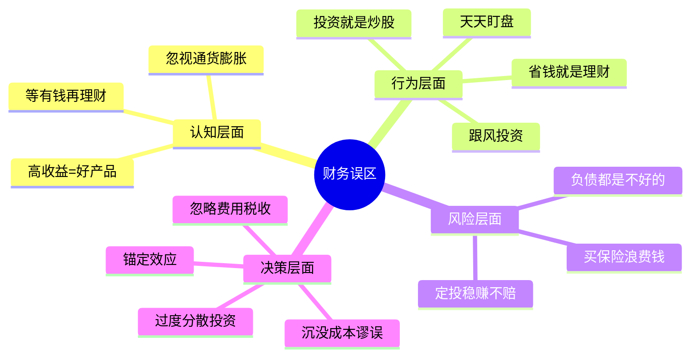
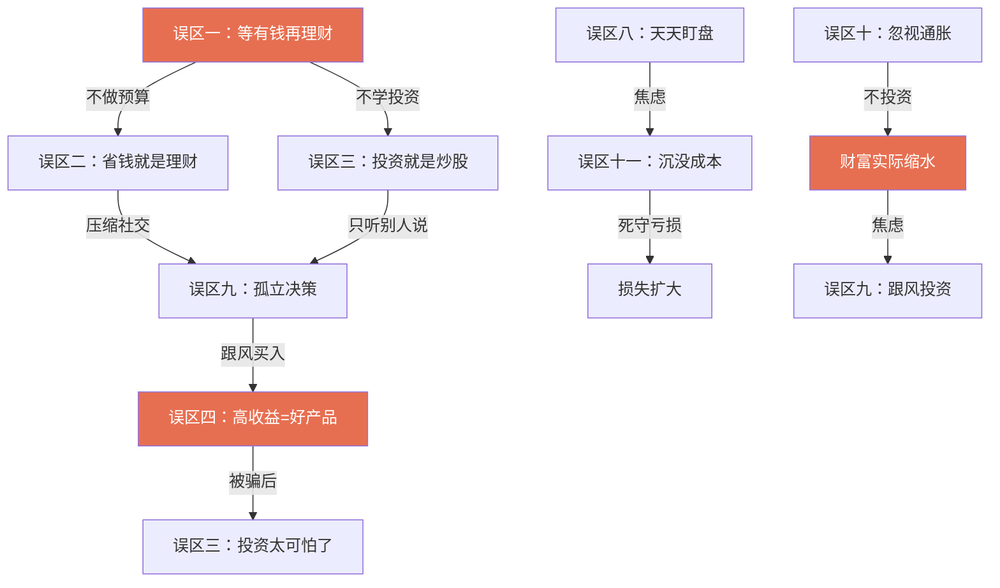
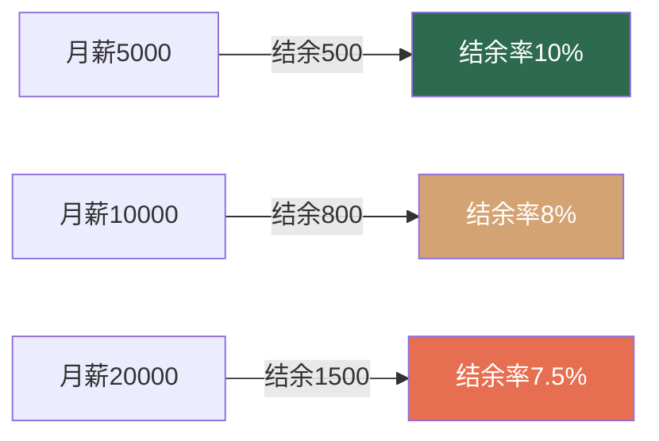
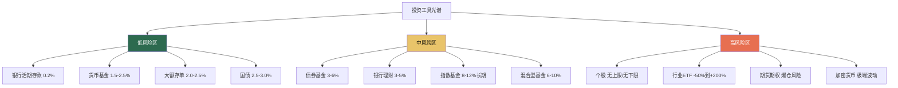
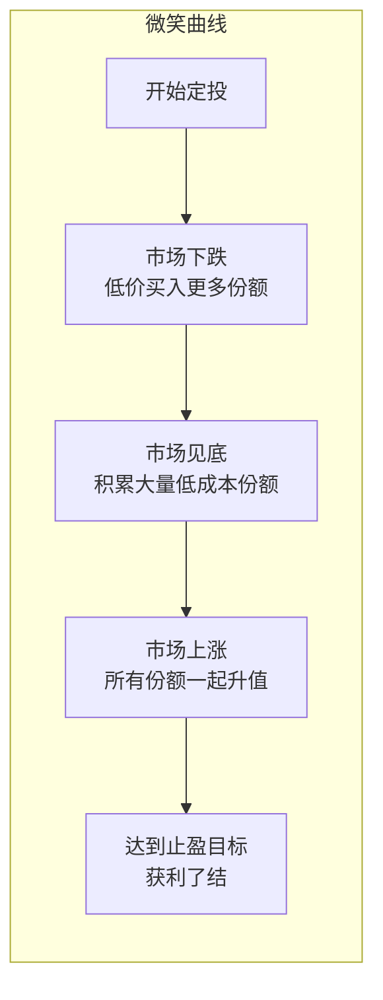
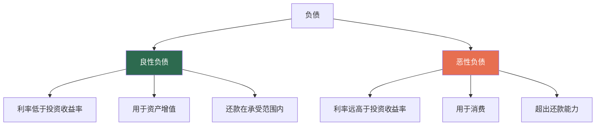

# 第五节 财务管理常见误区

在财务管理的道路上，认知偏差是最隐蔽的敌人。它不像市场暴跌那样触目惊心，却在日复一日中悄悄侵蚀你的财富。诺贝尔经济学奖得主丹尼尔·卡尼曼在《思考，快与慢》中揭示了一个核心事实：**人类的财务决策系统性地偏离理性**，这些偏离不是随机错误，而是可以预测、可以分类、可以纠正的模式。

行为金融学的研究表明，普通投资者因为认知偏差导致的年化收益损失约为 **1.5%-3.5%**（来源：Dalbar Inc. 年度 QAIB 研究报告，2023年数据）。这意味着一个投资期限30年的投资者，可能因为"心理失误"而少赚数十万甚至上百万元。

本节系统梳理了财务管理中最具代表性的十四个误区，每个误区都从认知根源、行为机制、真实案例和纠正方法四个维度展开。理解这些误区的意义不仅在于"避免犯错"，更在于建立一套**内在免疫系统**——当你能在错误发生的瞬间识别它，你就已经赢了一半。

## 误区关联图：为什么它们总是同时出现

这十四个误区并非孤立存在，它们往往**连锁反应**，形成恶性循环：

理解这个关联图的意义在于：**纠正一个核心误区，往往能同时解除多个相关误区的束缚。**

***

## 误区一："等有钱了再理财"

### 误区表现

- "我现在收入太低，等以后赚多了再开始理财。"
- "理财是有钱人的事，跟我没关系。"
- "等我存到10万再开始投资。"
- "每月就剩几百块，理不理无所谓。"

### 认知根源：拖延心理与目标错位

这个误区的心理机制是**"全有或全无"思维**——人们倾向于认为理财是一个需要"准备好"才能开始的大事，而非一个可以从小处着手的渐进过程。这种思维模式的本质是将"理财"与"投资"混为一谈。

拖延心理学的创始人皮尔斯·斯蒂尔（Piers Steel）在其研究中指出：人们对任务的拖延程度与任务的**"延迟折扣"**成正比——理财的回报太遥远（几十年后的退休），大脑天然会将其优先级降到最低。这就是为什么"明天再说"成了最常见的财务决策。

理财的完整定义是：**对个人或家庭财务资源进行计划、组织、指导和控制的过程**。它包括五个层次：

| 层级 | 内容 | 门槛 | 工具推荐 |
|------|------|------|----------|
| 第一层 | 记账——知道钱花到哪里去了 | 零成本 | 随手记、MoneyWiz、Excel |
| 第二层 | 预算——规划钱该怎么花 | 需要自律 | 50/30/20法则 |
| 第三层 | 储蓄——确保收入大于支出 | 任何收入水平 | 自动转账 |
| 第四层 | 保障——用保险转移风险 | 年收入5-10% | 百万医疗+意外险 |
| 第五层 | 投资——让钱生钱 | 需要知识和本金 | 货币基金→指数基金 |

前三个层次与收入高低完全无关。月薪3000元的人同样需要知道自己的钱花到了哪里，同样需要确保不入不敷出。

### 数据真相：时间的复利效应

假设两位投资者，A从25岁开始每月定投500元（年化收益率8%），B从35岁才开始同样的定投：

| 指标 | A（25岁开始） | B（35岁开始） | 差距 |
|------|---------------|---------------|------|
| 投资年限 | 35年 | 25年 | 10年 |
| 总投入本金 | 21万 | 15万 | 6万 |
| 60岁时资产 | 约114万 | 约49万 | **65万** |
| 收益倍数 | 5.4倍 | 3.3倍 | 2.1倍 |

晚开始10年，最终少积累65万元——而这65万元的差距，仅仅来自每月500元的起点差异。这就是**复利的时间价值**：早期投入的每一分钱，都有更长的时间去"滚雪球"。

爱因斯坦（虽然可能是误传）说过："复利是世界第八大奇迹。"无论这句话是否出自他口，数据不会撒谎：**时间是复利最强的催化剂，而拖延是复利最大的敌人。**

### 生活方式膨胀的陷阱

"等有钱了再理财"还有一个致命的逻辑漏洞：**如果不养成理财习惯，收入增长带来的不是可投资资金的增加，而是消费水平的提升**。

经济学中称之为**"生活方式膨胀"（Lifestyle Inflation）**。研究表明，当收入增加时，人们会自然地将新增收入用于提升生活品质：从合租搬到独立公寓、从公共交通升级到打车、从平价品牌切换到轻奢品牌。结果是收入涨了，但结余率并没有提高。

一个典型的收入-消费曲线：

收入翻了4倍，结余率反而下降了。这不是个例，而是普遍现象。美国劳工统计局（BLS）的消费支出调查显示，收入前20%的家庭结余率并不显著高于中等收入家庭——高收入者只是"花得更多"，而非"存得更多"。

### 正确做法

1. **今天就开始记账**。不需要复杂的工具，手机备忘录即可。记录每一笔支出，坚持30天，你会对自己的消费模式有全新的认知。研究表明，仅仅是"记录"这个动作本身，就能让非必要支出减少15-20%。
2. **设定"先储蓄"规则**。发工资当天，自动转出10-30%到另一个账户，剩下的才是可支配收入。这就是"先支付自己"原则。行为经济学家塞勒（Richard Thaler）的"明天多存一点"（Save More Tomorrow）计划证明：承诺未来增加储蓄比当下削减消费更容易执行。
3. **建立三个账户体系**：
   - 日常账户（月支出的1.5倍）：用于日常消费
   - 应急账户（3-6个月生活费）：用于突发状况
   - 投资账户：用于长期增值
4. **从小金额开始定投**。即使是每月100元的基金定投，也能帮你建立投资的心理账户和行为习惯。关键不在于金额，在于**开始**。

***

## 误区二："省钱就是理财"

### 误区表现

- "我不买新衣服了，省下来的钱就是理财。"
- "为了省钱，我每天只吃最便宜的外卖。"
- "理财就是少花钱。"
- "只要不花钱，钱就会越来越多。"

### 认知根源：控制幻觉与损失厌恶

省钱给人带来一种**"掌控感"**——在收入不确定、市场波动不可控的情况下，减少支出是唯一完全由自己决定的行为。这种掌控感让人产生"我在理财"的错觉。

但问题在于，省钱存在**边际效用递减**：省下第一笔不必要的开支效用最大，但当所有"不必要"的开支都被砍掉后，继续省钱就会开始侵蚀生活质量，导致效用急剧下降甚至变为负值。

### 过度省钱的三重代价

**第一重代价：报复性消费**

心理学研究表明，长期压抑消费欲望会导致**"自我损耗"（Ego Depletion）**。当意志力消耗殆尽时，人会进入"放纵模式"，一次性大额消费可能抵消数月的节省。这就是为什么很多"极度节俭"的人，偶尔会突然"爆发性消费"。

典型场景：
- 平时不舍得吃水果，某天突然买了一箱进口车厘子（200元）
- 三个月不买衣服，某天一口气买了5件（2000元）
- 为了省10块钱的打车费走了40分钟，到了商场却冲动买了500元的东西

**第二重代价：机会成本**

花2小时比较三家超市的价格，最终省下8元。如果这2小时用来学习一项新技能、做一个副业项目，或者提升工作效率争取加薪，潜在收益可能是这8元的几十倍甚至上百倍。

经济学中的**机会成本**概念告诉我们：每一个选择的真实成本，是为此放弃的最佳替代选项的价值。

**第三重代价：社交资本损耗**

过度节俭往往会影响社交活动：拒绝朋友聚餐、从不请客、在AA制中斤斤计较。长期下来，社交圈子会缩小，而人脉在职业发展中的价值远超省下的那些饭钱。哈佛大学长达85年的"成人发展研究"（Grant Study）得出的最核心结论之一就是：**良好的人际关系是幸福和成功最重要的预测因素**。过度省钱对社交关系的损害，远比你想象的更深远。

### 理财的完整公式

理财的核心公式不是"省钱"，而是：

> **结余率 =（收入 - 支出）/ 收入**

提高结余率有且仅有两个途径：**增加收入**或**减少支出**。但在现实世界中，收入的增长空间远大于支出的压缩空间：

- 支出有下限（基本生活需求），收入理论上没有上限
- 省钱是做减法，有天花板；赚钱是做加法，可以指数增长
- 省钱消耗意志力，赚钱可以靠系统和杠杆

### 正确做法

1. **区分"节俭"和"吝啬"**。节俭是理性消费——该花的钱不省，该省的钱不花。吝啬是不分青红皂白地压缩一切开支。判断标准：这笔消费是否带来了与价格匹配的价值（健康、效率、成长、关系维护）。
2. **采用"价值消费"原则**。每笔消费前问自己：这笔钱花出去，给我带来的价值（快乐、健康、成长、效率）是否大于它的价格？如果答案是肯定的，就大胆花；如果是否定的，就果断省。
3. **把精力放在"开源"上**。提升核心技能、发展副业、建立被动收入源，这些的回报率远高于"抠门"。一个人的时间精力是有限的——花80%的精力省钱，不如花80%的精力赚钱。
4. **设定"合理消费"的预算**。与其无限制地省钱，不如给各类消费设一个合理上限，在预算内自由消费，既保证生活质量，又控制总支出。50/30/20法则（50%必需、30%想要、20%储蓄）是一个简单有效的起点。

***

## 误区三："投资就是炒股"

### 误区表现

- "我不敢投资，怕亏钱。"
- "我邻居炒股亏了50万，投资太危险了。"
- "投资就是赌博，我不碰。"
- "投资是有钱人玩的东西。"

### 认知根源：以偏概全与锚定效应

这个误区的心理机制是**"可得性启发"（Availability Heuristic）**——人们倾向于用最容易想到的案例来判断某类事物的概率。因为炒股亏钱的故事比"稳健投资赚钱"的故事更有传播力，人们就将"投资"等同于"炒股"，再将"炒股"等同于"亏钱"。

这就像因为听说过飞机失事就认为开车比坐飞机安全一样——事实上，飞机的安全性是汽车的数百倍。

### 投资工具全景图

投资的世界远比"炒股"丰富。按风险等级，可以将主流投资工具分为以下层级：

| 风险等级 | 代表品种 | 年化收益参考 | 适合人群 | 起投金额 |
|----------|----------|-------------|----------|----------|
| 极低风险 | 货币基金、国债 | 1.5-3% | 所有人（现金管理） | 1元起 |
| 低风险 | 债券基金、大额存单 | 2.5-5% | 保守型投资者 | 1元起/20万 |
| 中等风险 | 指数基金、混合基金 | 6-12% | 稳健型投资者 | 10元起 |
| 高风险 | 个股、行业ETF | 不确定 | 有经验的投资者 | 约300元起 |
| 极高风险 | 期货、加密货币 | 极端波动 | 专业/投机者 | 数千至数万 |

**新手完全可以在极低和低风险区域开始投资**，根本不需要碰股票。将闲置资金从活期存款（0.2%）转移到货币基金（1.5-2.5%），收益立即提升10倍以上，风险几乎没有增加。

### "炒股亏钱"的真正原因

那些"炒股亏了50万"的故事，几乎都违背了以下投资基本原则：

1. **借钱炒股/加杠杆**：用借来的钱投资，盈亏都被放大，心态完全变形
2. **追涨杀跌**：看到涨就追、看到跌就卖，完美实现了"高买低卖"
3. **集中持仓**：把所有资金押注在1-2只股票上，没有分散风险
4. **缺乏知识**：不了解基本面分析、不理解估值原理、不知道止损策略
5. **情绪化决策**：被贪婪和恐惧驱动，而非基于理性和数据

如果遵循正确的投资方法——分散投资、长期持有、选择宽基指数基金、定期再平衡——长期亏损的概率极低。以沪深300指数为例，任意时点买入并持有5年以上，历史上正收益的概率超过85%。

### 被动投资的学术证据

先锋基金（Vanguard）创始人约翰·博格尔的理念，得到了越来越多学术研究的支持。标普道琼斯指数公司每年发布的 SPIVA 报告持续证明：**在任何一个10年周期中，超过85%的主动管理基金跑不赢对应的指数基金**。这不是偶尔现象，而是跨越市场、跨越时间的稳定结论。

也就是说，绝大多数专业基金经理——拥有研究团队、信息渠道和交易系统——都无法持续战胜"什么都不做、只是买入并持有整个市场"的简单策略。对于个人投资者而言，选择宽基指数基金定投，是最理性的投资方式之一。

### 正确做法

1. **从"存钱"升级到"投资"**。先从货币基金开始，感受"钱在增长"的感觉。
2. **学习基础投资知识**。推荐入门书籍：《指数基金投资指南》（银行螺丝钉）、《小狗钱钱》（博多·舍费尔）、《漫步华尔街》（伯顿·马尔基尔）。
3. **用定投方式入门**。每月固定日期投入固定金额到宽基指数基金，不需要择时，不需要盯盘。
4. **建立"投资阶梯"**。随着知识和经验的积累，逐步从低风险向中风险拓展，永远不要跳级。

***

## 误区四："高收益 = 好产品"

### 误区表现

- "这个理财产品年化收益15%，比银行存款高多了，我要买。"
- "某某平台承诺保本保息，年化收益12%。"
- "收益越高越好，我专门找收益高的买。"
- "别人都赚到钱了，肯定没问题。"

### 认知根源：贪婪与信息不对称

这个误区的底层驱动力是**贪婪**——人类大脑对"高收益"的渴望远强于对"高风险"的恐惧。神经经济学研究发现，当人们看到高收益数字时，大脑的伏隔核（与奖励相关的区域）会强烈激活，而负责风险评估的前额叶皮层活动反而被抑制。

换句话说，**高收益的诱惑会物理性地降低你的风险判断能力**。

### 风险-收益的铁律

金融学最基本的原理之一就是**风险与收益成正比**。这不是建议，而是规律。你不可能长期获得高于市场平均水平的收益，而不承担高于市场平均水平的风险。

各类资产的合理收益区间参考：

| 资产类型 | 合理年化收益 | 超出此范围需警惕 |
|----------|-------------|------------------|
| 银行存款/货币基金 | 0.2-3% | 承诺5%以上 |
| 债券/债券基金 | 3-6% | 承诺8%以上 |
| 股票基金（长期） | 8-12% | 承诺20%以上 |
| 房产投资 | 3-8%（含租金） | 承诺15%以上 |

**核心判断标准**：如果一个产品的承诺收益超过同期银行存款利率的3倍以上，就需要高度警惕；超过5倍以上，极大概率是骗局或有重大隐含风险。

### 庞氏骗局的五步模式

历史上几乎所有的金融骗局都遵循同一个模式：

这就是**庞氏骗局（Ponzi Scheme）**的核心：用新投资者的钱支付老投资者的收益。只要新资金流入速度大于流出速度，这个游戏就能维持。一旦增长放缓或出现集中赎回，资金链立刻断裂。

真实案例：
- **e租宝（2015年）**：承诺年化9-14.6%，非法集资745亿元，涉及投资者90万人
- **钱宝网（2017年）**：承诺年化40-60%，非法集资超过300亿元
- **团贷网（2019年）**：承诺年化10-15%，最终暴雷，涉案金额超千亿元
- **恒大财富（2021年）**：承诺年化7-12%的理财产品，最终无法兑付，涉及金额超400亿元

这些平台的共同特征：承诺"保本保息"、收益远超市场水平、前期确实能兑付。

### 识别骗局的六个信号

1. **承诺"保本保息"**。2018年资管新规后，任何金融机构都不允许承诺保本保息
2. **收益远超同类产品**。同类型产品市场平均收益4%，它给10%，必须追问"凭什么"
3. **紧迫感营销**。"名额有限"、"今天不买明天涨价"——制造紧迫感是骗局的标配
4. **解释不清盈利模式**。问"钱怎么赚的"答不上来，或用"金融创新"、"区块链"等模糊概念搪塞
5. **拉人头返利**。发展下线有奖励，这是传销而非金融产品
6. **无法在正规渠道查到**。银保监会、证监会官网查不到备案

### 正确做法

1. **牢记"高收益高风险"的铁律**。任何违背这条规律的产品，不是你发现了财富密码，而是你正在走向陷阱。
2. **只在正规渠道购买金融产品**。银行、券商、持牌基金销售平台。
3. **购买前查询备案**。在银保监会、证监会官网确认产品和机构的合法性。
4. **设定收益预期锚点**。在当前利率环境下，年化收益超过6%就要认真分析风险，超过10%就要高度警惕。
5. **不懂不投**。如果无法用简单语言向别人解释这个产品如何盈利，就不要买。

***

## 误区五："买保险是浪费钱"

### 误区表现

- "我年轻身体好，不需要保险。"
- "保险都是骗人的，理赔的时候各种不赔。"
- "买保险不如把钱存起来。"
- "保险就是个坑，谁买谁上当。"
- "社保就够了，不需要商业保险。"

### 认知根源：乐观偏差与信任危机

这个误区源于两种心理机制的叠加：

**乐观偏差（Optimism Bias）**：人们倾向于低估负面事件发生在自己身上的概率。"车祸？那是别人的事。大病？我身体好着呢。"研究显示，约80%的人认为自己的风险水平低于平均水平——这在统计学上是不可能的。

**可得性启发**：保险理赔纠纷的新闻比顺利理赔的案例传播得更广。实际上，中国保险行业的理赔率普遍在97%以上，绝大多数理赔是顺畅的。以中国平安2023年数据为例，全年理赔结案率 99.6%，平均理赔时效 0.92天。"理赔难"更多是信息偏差造成的刻板印象，而非行业现实。

### 保险的真实数据

- 中国每年新发癌症病例约482万（2022年国家癌症中心数据），平均每分钟就有9.2人被确诊
- 重大疾病的平均治疗费用在30-50万元，高端治疗方案可能超过100万元
- 中国家庭因病致贫的比例约占贫困人口的42%
- 一场大病的直接医疗费用+康复费用+收入损失，总冲击通常在50-150万元

社保的局限性：

| 保障项目 | 社保覆盖范围 | 自费部分 |
|----------|-------------|----------|
| 住院医疗 | 甲类药品100%报销，乙类部分报销 | 丙类（进口药、靶向药）全额自费 |
| 报销上限 | 通常30-50万元/年 | 超出部分自费 |
| 收入补偿 | 无 | 治疗期间工资可能大幅减少 |
| 康复费用 | 无 | 康复期可能持续数年 |
| 异地就医 | 需提前备案，报销比例降低 | 流程复杂，垫付压力大 |

一个使用靶向药治疗的癌症患者，年药费可能在20-60万元，社保报销比例可能不到30%。这就是为什么"社保就够了"是一个危险的认知。

### 保险的正确定位

保险不是投资工具，而是**风险管理工具**。它的核心逻辑是：

> 用确定的小额支出（保费），转移不确定的大额风险（疾病、意外等）。

类比：你买了一把锁，不代表你家一定会被偷。但如果真的被偷了，这把锁（以及它背后的保险）能帮你挽回大部分损失。

### 不同人生阶段的保险配置建议

| 阶段 | 必备险种 | 参考预算 | 优先级 | 注意事项 |
|------|----------|----------|--------|----------|
| 单身期（22-28岁） | 意外险 + 百万医疗险 | 年收入3-5% | 极高 | 此时保费最低，最应该买 |
| 成家期（28-35岁） | 上述 + 重疾险 + 定期寿险 | 年收入5-8% | 极高 | 配偶互保，定期寿险保额覆盖房贷 |
| 育儿期（30-45岁） | 上述 + 教育金规划 | 年收入8-10% | 高 | 家庭经济支柱的保额要足够 |
| 中年期（45-55岁） | 重疾险 + 医疗险 + 养老年金 | 年收入8-12% | 高 | 保费大幅上涨，趁早配置 |

### 关于"保险是骗人的"的澄清

理赔纠纷的根本原因：

1. **未如实告知健康状况**（占比最高）。投保时隐瞒病史，理赔时自然被拒。这不是保险骗人，而是投保人欺骗保险公司在先。
2. **理解偏差**。以为"什么都保"，实际上每份保险都有明确的保障范围和除外责任。
3. **买到不合适的产品**。储蓄型保险的保障功能弱，理财功能也不突出。需要用对产品才能解决对的问题。

### 正确做法

1. **优先配置保障型保险**。顺序：意外险 → 百万医疗险 → 重疾险 → 定期寿险。
2. **如实告知健康状况**。这是理赔顺畅的最重要前提。
3. **选择消费型而非返还型**。消费型保费低、保障高；返还型看似"不亏"，但保费贵2-3倍，实际收益很低。
4. **保险和投资分开**。用保险保障风险，用投资追求收益。不要买"既能保障又能赚钱"的万能险、分红险。
5. **定期审视保单**。收入变化、家庭结构变化后，及时调整保障额度。

***

## 误区六："基金定投稳赚不赔"

### 误区表现

- "定投是万能的，只要坚持就能赚钱。"
- "定投不用管，设好了就不管了。"
- "定投比一次性投入好，没有缺点。"
- "我已经定投了3年，肯定赚钱。"

### 认知根源：简单化归因与确认偏差

定投在国内被过度"神化"了。很多理财博主把定投包装成"傻瓜式赚钱法"，只强调其优点（分散买入成本、强制储蓄、不需要择时），回避其局限性。这种宣传利用了人们**渴望简单解决方案**的心理——面对复杂的投资世界，"只要定投就能赚钱"这个承诺太诱人了。

### 定投的三个真相

**真相一：定投不是稳赚不赔的**

定投的本质是一种**平均成本法（Dollar-Cost Averaging）**。它通过在不同价格点分批买入来平滑成本，但它改变不了一个根本问题：**如果你定投的标的长期下跌，你只是在不同的低价点买入，最终仍然亏损。**

日本股市在1989年见顶后，经历了"失落的30年"。如果在1989年开始定投日经225指数，到2019年才刚刚回本——30年的时间成本是巨大的。

**真相二：定投的收益来源是"微笑曲线"**

定投真正发挥作用的场景是**市场先跌后涨**的"微笑曲线"：

但如果市场是"先涨后跌"的"哭泣曲线"，定投的表现反而不如一次性投入。

**真相三：定投需要"止盈"**

很多定投者只关注"投"，忽略了"赎"。在牛市中账面浮盈30%、50%，觉得"还能涨"，结果市场回调，利润全部蒸发。定投必须配合**止盈策略**。

### 定投成功的五个条件

1. **选择正确的标的**。长期趋势必须向上。宽基指数基金（如沪深300、中证500）是最适合定投的品种，因为它们代表了整体经济的长期增长。
2. **坚持足够长的时间**。至少3-5年，最好经历一个完整的牛熊周期。短期定投（1-2年）面临很高的浮亏风险。
3. **在市场低迷时坚持甚至加仓**。定投最大的敌人是"市场跌了就停"——恰恰在应该买入更多便宜筹码的时候放弃。
4. **设定合理的止盈目标**。常见的止盈策略：
   - 目标收益率法：累计收益达到30-50%时分批卖出
   - 估值法：当指数PE分位超过70%时开始减仓
   - 回撤止盈法：从最高点回撤10%时卖出
5. **定期检视和调整**。每半年检视一次定投标的的基本面是否发生变化。

### 正确做法

1. **把定投当作投资纪律，而非万能策略**。定投解决了"何时买"的问题，但"买什么"和"何时卖"仍然需要判断。
2. **选择宽基指数基金作为定投标的**。避免行业基金和主题基金——这些波动太大，可能长期无法回到买入价。
3. **定投金额占月收入的10-30%**。不要影响正常生活开支。
4. **一定要有止盈计划**。没有止盈的定投是不完整的。
5. **市场大跌时考虑加倍定投**。如果每月定投1000元，市场大跌20%以上时可以投2000元。

***

## 误区七："负债都是不好的"

### 误区表现

- "我绝不借钱，负债是可耻的。"
- "房贷太可怕了，我要全款买房。"
- "信用卡是洪水猛兽，我坚决不用。"
- "无债一身轻，我从不借钱。"

### 认知根源：农耕思维与安全感需求

中国传统文化中"无债一身轻"的观念根深蒂固。这种观念在农耕社会有其合理性——当时没有稳定的收入预期，借债确实风险极大。

但在现代金融体系中，**合理使用杠杆是财富增长的重要工具**。全盘否定负债，等于放弃了一个强大的财务工具。

### 负债的两种类型

**恶性负债——坚决避免：**

| 类型 | 年化利率 | 特征 |
|------|----------|------|
| 信用卡最低还款 | 12-18% | 看似方便，实际成本极高 |
| 消费分期 | 8-24% | "0首付"背后的高额利息 |
| 网贷/现金贷 | 18-36%甚至更高 | 以贷养贷的恶性循环 |
| 民间借贷 | 24-60% | 可能涉及违法高利贷 |

**良性负债——合理利用：**

| 类型 | 年化利率 | 为什么是良性的 |
|------|----------|----------------|
| 房贷 | 3-5% | 利率低于长期投资收益率，且用于资产购置 |
| 经营贷 | 4-7% | 用于产生收益的商业活动 |
| 教育贷款 | 3-5% | 投资于人力资本的增值 |

### 房贷的杠杆效应

以一套100万元的房产为例：

| 方案 | 首付 | 贷款 | 5年后房价涨至130万 | 收益率 |
|------|------|------|---------------------|--------|
| 全款购买 | 100万 | 0 | 盈利30万 | 30% |
| 贷款购买（首付30%） | 30万 | 70万 | 盈利30万（扣除利息约8万）=22万 | **73%** |

贷款购买的自有资金收益率是全款购买的2.4倍——这就是**杠杆效应**。

当然，杠杆是双刃剑。如果房价下跌，贷款购买的亏损也会被放大。所以使用杠杆的前提是：**标的的长期价值确定性较高，且还款在承受范围内。**

### 负债的健康指标

| 指标 | 健康范围 | 警戒线 |
|------|----------|--------|
| 月供/月收入 | ≤30% | >50% |
| 总负债/总资产 | ≤50% | >70% |
| 月还款额/月收入 | ≤40% | >60% |
| 负债中良性负债占比 | ≥80% | <50% |

### 正确做法

1. **坚决避免任何年化利率超过10%的消费性负债**。信用卡分期、消费贷、网贷，这些是财富的黑洞。
2. **合理利用低息良性负债**。如果房贷利率低于你投资的长期收益率（8-12%），贷款买房比全款更划算。
3. **信用卡的正确用法**：利用免息期（最长56天），每月全额还款，不使用最低还款和分期功能。信用卡是支付工具，不是借贷工具。
4. **保持健康的负债率**。月供总额不超过月收入的30-40%，确保即使收入临时下降也能正常还款。
5. **建立"还贷应急基金"**。至少预留6个月的月供作为缓冲。

***

## 误区八："投资需要天天盯盘"

### 误区表现

- "我每天都要看股市行情，涨了开心，跌了焦虑。"
- "我要抓住每一个波段，低买高卖。"
- "投资不看盘怎么行？万一跌了怎么办？"
- "我设置了十几个行情提醒，随时关注动态。"

### 认知根源：控制幻觉与多巴胺成瘾

频繁盯盘的心理根源是**"控制幻觉"（Illusion of Control）**——人们错误地认为，通过密切关注市场，自己就能控制或预测投资结果。事实上，短期市场的走向是不可预测的，你的关注不会改变任何一个涨跌。

更深层的原因是**多巴胺机制**。每次看到账户盈利，大脑会分泌多巴胺产生愉悦感；每次看到亏损，会触发焦虑和应激反应。这种"涨了爽、跌了慌"的循环，本质上与赌博成瘾的机制相同。

### 频繁盯盘的四重危害

**危害一：诱发非理性操作**

研究表明，投资者查看账户的频率与投资收益呈负相关。原因是：

- 看到账面亏损 → 恐惧 → 卖出 → 错过反弹
- 看到账面盈利 → 贪婪 → 加仓 → 追在高点
- 频繁交易 → 手续费增加 → 收益被侵蚀

**危害二：错过关键日**

美国标普500指数1993-2023年的数据：

| 投资策略 | 30年总收益 | 年化收益率 |
|----------|-----------|-----------|
| 全程持有 | 约2100% | 约10.7% |
| 错过涨幅最大的10天 | 约900% | 约8.0% |
| 错过涨幅最大的20天 | 约460% | 约5.9% |
| 错过涨幅最大的30天 | 约230% | 约4.1% |

关键在于：**那10个涨幅最大的交易日，通常发生在市场最恐慌的时期**——恰恰是频繁交易者最容易恐慌离场的时候。

**危害三：浪费大量时间**

假设每天花1小时看盘、研究短期行情：
- 1年 = 365小时
- 10年 = 3650小时
- 这些时间如果用来提升技能或发展副业，潜在收益可能远超投资本身

**危害四：损害身心健康**

长期盯盘导致的焦虑、失眠、情绪波动，会影响工作效率、人际关系和身体健康。投资不应该以牺牲生活质量为代价。

### 不同投资风格的操作频率

| 投资风格 | 操作频率 | 检视频率 | 适合人群 |
|----------|----------|----------|----------|
| 定投投资者 | 每月1次 | 每季度1次 | 大多数普通投资者 |
| 资产配置 | 每季度1次 | 每半年1次 | 有一定投资经验者 |
| 价值投资 | 按信号操作 | 每月1次 | 深入研究个股者 |
| 趋势交易 | 按信号操作 | 每周1次 | 专业投资者 |

### 正确做法

1. **设定固定的"投资日"**。比如每月1日检查定投、每季度末检视资产配置，其他时间不看账户。
2. **关闭行情推送通知**。手机上的行情提醒是焦虑的主要来源，关掉它。
3. **用自动化替代人工操作**。设置自动定投、自动再平衡，让系统替你执行纪律。
4. **关注"输入"而非"输出"**。把时间花在学习投资知识上，而不是盯着涨跌数字。
5. **建立"投资日志"**。记录每次买卖的逻辑和情绪状态，定期回顾，识别自己的行为偏差。

***

## 误区九："跟风投资"

### 误区表现

- "我同事买什么我就买什么。"
- "网上大V推荐的股票肯定没错。"
- "最近某某很火，我也要买。"
- "群里都在说这个币要涨，赶紧上车。"

### 认知根源：从众心理与信息瀑布

**从众心理（Conformity Bias）**是人类进化中形成的生存本能——在原始社会，跟随大多数人的选择通常是安全的。但在金融市场中，**当大多数人都在买入时，往往意味着价格已经被推到了高位**。

**信息瀑布（Information Cascade）**是指人们放弃自己的判断，转而模仿他人的行为。当第一个人买入某只股票并晒出收益，第二个人看到后也买入，第三个人看到两个人都赚了也加入……这个正反馈循环会持续到泡沫破裂。

### 跟风投资失败的五个原因

**原因一：信息不对称**

当你从同事、网上大V或微信群获得"消息"时，这个信息已经被市场消化了。你看到的是"别人想让你看到的"，而不是"你需要知道的"。

**原因二：风险偏好不匹配**

别人能承受的风险，你未必能承受。别人用闲钱的10%买了一只高波动股票，亏50%也不影响生活；你把全部积蓄投入，亏10%就可能失眠。

**原因三：资金量和期限不匹配**

- 别人有500万资产，拿50万"玩玩"，占比10%
- 你有20万存款，全部投入，占比100%
- 别人能持有10年不动，你下个月可能就要用钱

**原因四：幸存者偏差**

你只听到赚钱的人在晒收益，没听到亏钱的人在沉默。网上"股神"的收益率可能是精心挑选的结果——只展示赚钱的交易，隐藏亏钱的交易。

**原因五：群体极化效应**

当一群人讨论同一个投资标的时，观点会趋向极端乐观。反对的声音被淹没或不敢发声，最终形成"所有人都看好"的假象。这就是泡沫形成的微观机制。

### 历史教训

| 事件 | 时间 | 跟风行为 | 结果 |
|------|------|----------|------|
| A股疯牛 | 2015年 | 大量新股民高位入场 | 上证从5178跌至2850，腰斩 |
| 白酒泡沫 | 2021年 | 追高白酒、新能源 | 中证白酒指数从高点跌超50% |
| 比特币 | 多轮 | 每次暴涨后跟风入场 | 从高点回撤50-80%是常态 |
| 猛犸象基金 | 1998年 | 顶级对冲基金跟风套利 | 4个月亏损46亿美元，破产 |
| GameStop | 2021年 | 散户跟风"抱团" | 多数追高者亏损严重 |

### 正确做法

1. **建立自己的投资决策框架**。明确自己的风险承受能力、投资期限、收益预期。
2. **投资前做好独立研究**。至少回答三个问题：这个投资标的靠什么赚钱？风险在哪里？我为什么要买？
3. **区分"信息"和"噪音"**。有价值的信息是关于资产基本面的数据和分析，噪音是情绪和故事。
4. **建立"冷静期"规则**。看到任何"机会"后，强制等待48小时再做决策。冲动是投资的大敌。
5. **如果要参考他人观点，先分析其逻辑**。别人推荐某只股票，你需要理解的是"为什么推荐"，而不是"推荐了什么"。

***

## 误区十："忽视通货膨胀"

### 误区表现

- "我把钱存在银行就很安全了。"
- "投资有风险，我宁可不赚也不亏。"
- "理财太麻烦了，放着不管就行。"
- "我又不买什么大件，通胀跟我没关系。"

### 认知根源：渐变盲视与名义幻觉

通货膨胀之所以被忽视，是因为它是**渐进的**。每年3%的物价上涨，你几乎感觉不到——但30年的复利效应是毁灭性的。

人们还存在**"名义幻觉"（Money Illusion）**——关注的是账户上的数字（名义价值），而非这些数字能买到多少东西（实际价值）。你的银行账户显示100万元，你觉得很安全；但这100万元的购买力，可能在20年后只相当于今天的55万元。

### 通胀的侵蚀效应

假设年通胀率为3%：

| 时间跨度 | 100万元的实际购买力 | 贬值幅度 |
|----------|--------------------|---------| 
| 今天 | 100万 | — |
| 5年后 | 86万 | -14% |
| 10年后 | 74万 | -26% |
| 15年后 | 64万 | -36% |
| 20年后 | 55万 | -45% |
| 30年后 | 41万 | -59% |

**如果你现在30岁，到60岁退休时，你的储蓄的实际购买力将缩水近60%。** 你以为自己有100万的养老钱，实际上只有41万的购买力。

### 不同投资方式对抗通胀的效果

| 投资方式 | 年化收益 | 100万10年后实际购买力（3%通胀） |
|----------|----------|-------------------------------|
| 活期存款 | 0.2% | 约75万（亏25万） |
| 定期存款 | 2.0% | 约90万（亏10万） |
| 货币基金 | 2.0% | 约90万（亏10万） |
| 债券基金 | 4.5% | 约115万（赚15万） |
| 指数基金 | 8% | 约147万（赚47万） |
| 股票基金 | 10% | 约177万（赚77万） |

活期存款和定期存款在扣除通胀后都是**实际亏损**的——你的钱在"安全"中悄悄贬值。

### 通胀的隐蔽性

通胀被忽视的三个原因：

1. **渐进性**。每年3%的涨幅分散到数百万种商品中，很难被个体感知
2. **选择性关注**。人们只关注自己常买的几种商品的价格，而通胀是整体水平的上升
3. **心理账户**。"我的100万还在"给人安全感，但这个"100万"的含义每年都在变

### 正确做法

1. **将投资视为对抗通胀的必需品，而非可选项**。投资不是为了"多赚钱"，而是为了"不贬值"。
2. **闲置资金至少放入货币基金**。活期存款（0.2%）是最"安全"的亏损方式。
3. **长期资金通过资产配置追求超越通胀的收益**。一个简单的配置方案：60%指数基金 + 30%债券基金 + 10%货币基金。
4. **定期审视实际收益率**。名义收益率减去通胀率才是你的真实回报。
5. **将收入增长与通胀挂钩**。确保工资涨幅至少与通胀持平，否则你在"隐性降薪"。

***

## 额外误区：补充认知陷阱

除了以上十大误区，还有几个常见的认知陷阱值得警惕。这些陷阱的共同特征是：**它们在直觉上完全合理，但经不起数据和逻辑的检验**。

### 误区十一：沉没成本谬误

#### 误区表现

- "我已经亏了30%，现在卖出就真的亏了，不如继续持有等回本。"
- "我已经研究这只股票两周了，不买太可惜。"
- "我付了3万块会员费，不用完就浪费了。"

#### 认知根源

沉没成本谬误的本质是**损失厌恶**——人们对损失的痛苦感约为等额收益快乐感的2-2.5倍。当你面对"卖出并确认亏损"和"继续持有幻想回本"两个选项时，大脑会本能地选择后者，因为前者带来的痛苦是即时的、确定的，而后者至少保留了一线希望。

行为经济学家理查德·塞勒的实验表明：人们宁愿承受更大的未来损失，也不愿意承认已经发生的损失。这在投资中表现为**"套牢不卖"**——即使基本面已经恶化，依然死守亏损仓位。

#### 真实场景

| 场景 | 错误逻辑 | 正确思考 |
|------|----------|----------|
| 股票亏了30% | "卖了就真亏了，等回本" | "如果现在手上有等额现金，我还会买这只股票吗？" |
| 买了健身年卡不去 | "钱都花了，得去" | "沉没成本不应影响未来决策，现在去不去取决于今天的状态" |
| 读了一本烂书读到一半 | "读了一半了，读完吧" | "继续读的时间是新的成本，投入在更有价值的事上" |
| 恋爱关系不合适 | "在一起这么久了" | "过去的投入不能成为继续投入的理由" |

#### 正确的决策框架

面对任何已投入资源的决策，使用**"归零测试"**：

1. 假设你当前没有持有这只股票/没有报名这个课程/没有开始这段关系
2. 以你今天掌握的信息，你会做出什么选择？
3. 如果答案是"不会买入/不会报名"，那么就应该卖出/退出

**关键公式**：未来决策 = f(未来收益, 未来风险) ，与过去投入无关。

### 误区十二：过度分散投资

#### 误区表现

- "我买了30只基金，这样风险就分散了。"
- "我把资金分成20份，每份买不同的股票。"
- "分散投资就是越多越好。"

#### 认知根源

这种误区源于对"分散投资"的**机械理解**。人们将"不要把鸡蛋放在一个篮子里"简化为"篮子越多越好"，却忽略了两个关键问题：

1. **相关性**：如果你买的30只基金都是A股基金，它们在系统性风险面前会同涨同跌，分散效果极其有限
2. **管理成本**：每增加一个持仓，都增加了跟踪、分析和再平衡的时间成本

#### 分散效果的数学证明

学术研究表明，投资组合的风险随持仓数量的增加而降低，但边际效果递减：

**关键结论**：持有15-20只相关性低的股票（或3-5只不同类型的基金）就能获得90%以上的分散效果。超过这个数量，边际风险降低趋近于零，但边际成本持续增加。

#### 正确的分散策略

| 层级 | 分散维度 | 具体方法 |
|------|----------|----------|
| 资产类别 | 股票、债券、商品、现金 | 不同大类资产的低相关性 |
| 地域 | 国内、发达市场、新兴市场 | 避免单一经济体风险 |
| 行业 | 科技、消费、金融、医药 | 避免单一行业系统性风险 |
| 时间 | 定投分批买入 | 避免择时集中风险 |

**实用建议**：对于普通投资者，3-5只宽基指数基金（如沪深300+中证500+标普500指数基金+债券指数基金）已经足够实现充分分散，无需过度复杂化。

### 误区十三：忽略费用和税收

#### 误区表现

- "这只基金收益8%，那只收益7.5%，我选8%的。"
- "管理费才1.5%，不高啊。"
- "投资赚的是大钱，手续费那点小钱不重要。"

#### 认知根源

这个误区的根源是**"显著性偏差"**——人们关注的是大数字（收益率），忽略小数字（费率）。1.5%的年费听起来微不足道，但它的长期累积效应是惊人的。

#### 费用的复利侵蚀

假设两位投资者各投入100万，年化收益10%，投资30年：

| 指标 | 投资者A（费用1%/年） | 投资者B（费用2%/年） | 差距 |
|------|---------------------|---------------------|------|
| 实际年化收益 | 9% | 8% | 1% |
| 30年后总资产 | 约1,327万 | 约1,006万 | **321万** |
| 费用总成本 | 约443万 | 约670万 | **227万** |

每年多1%的费用，30年累计损失超过300万元——这不是小钱，这是复利的力量在反向运作。

#### 投资中的各类费用

| 费用类型 | 典型范围 | 如何降低 |
|----------|----------|----------|
| 基金管理费 | 0.5-1.5%/年 | 选择指数基金（通常0.1-0.5%） |
| 基金托管费 | 0.05-0.25%/年 | 同上 |
| 申购费 | 0-1.5% | 选择C类份额或第三方平台打折 |
| 赎回费 | 0-1.5% | 持有超过一定期限可免除 |
| 券商佣金 | 万2-万3 | 选择低佣券商 |
| 印花税 | 卖出0.05% | A股固定，无法降低 |
| 基金分红税 | 0-20% | 了解持有期限与税率关系 |

#### 税收优化策略

1. **长期持有**：A股基金持有超过1年，分红免税；超过7天赎回费大幅降低
2. **选择低费率产品**：同类型基金中，优先选择管理费低的品种
3. **利用免税账户**：如个人养老金账户（每年12,000元额度），投资收益暂不征税
4. **合理安排卖出时间**：如果需要卖出，考虑税收影响，避免短期频繁交易

### 误区十四：锚定效应

#### 误区表现

- "这只股票以前涨到过100元，现在才60元，肯定便宜。"
- "房价从5万跌到4万，已经很便宜了，赶紧买。"
- "这只基金去年涨了50%，今年应该也不错。"

#### 认知根源

锚定效应（Anchoring Effect）是卡尼曼和特沃斯基提出的经典认知偏差：人们在做判断时，会过度依赖第一个接触到的信息（"锚"），并以此为基准进行调整——但调整往往是不充分的。

在投资中，"锚"通常是：
- 你买入时的价格（"成本价"）
- 历史最高价（"曾经涨到过XX"）
- 别人提到的价格（"朋友说他买的时候是XX元"）

#### 锚定效应的危害

**案例**：某股票从100元跌到60元

| 思维方式 | 判断 | 问题 |
|----------|------|------|
| 锚定思维 | "从100跌到60，跌了40%，很便宜了" | 以历史高价为锚，忽略了基本面变化 |
| 正确思维 | "公司当前盈利、增长、估值如何？60元对应多少倍PE？" | 以内在价值为判断依据 |

如果公司盈利从每股5元下降到每股2元：
- 100元时PE = 20倍（正常偏高）
- 60元时PE = 30倍（反而更贵了）

**价格下跌不等于便宜，价格上涨不等于贵。** 真正的判断标准是价格相对于内在价值的关系。

#### 正确做法

1. **用估值指标替代价格比较**：PE（市盈率）、PB（市净率）、股息率等，而非看绝对价格
2. **关注百分位而非绝对值**：当前PE处于历史50%分位以下才是"相对便宜"
3. **建立"归零假设"**：假设你从未见过这只股票的历史价格，仅凭当前基本面，你会以这个价格买入吗？
4. **用现金流折现法估算内在价值**：虽然不精确，但方向正确，远比"曾经涨到过100"可靠

***

## 十大误区速查表

| 序号 | 误区 | 正确认知 | 行动要点 |
|------|------|----------|----------|
| 1 | 等有钱了再理财 | 现在就开始，习惯比金额重要 | 今天开始记账+先储蓄后消费 |
| 2 | 省钱就是理财 | 开源节流并重，避免过度节俭 | 价值消费+把精力放在提升收入上 |
| 3 | 投资就是炒股 | 投资工具丰富，从低风险开始 | 从货币基金和指数基金定投入手 |
| 4 | 高收益=好产品 | 高收益高风险，警惕诈骗 | 超6%收益就要认真分析风险 |
| 5 | 买保险是浪费钱 | 保险是风险管理的基石 | 优先配意外险+百万医疗+重疾险 |
| 6 | 定投稳赚不赔 | 定投需要好标的+长期+止盈 | 选宽基指数+3年以上+设止盈目标 |
| 7 | 负债都是不好的 | 区分良性负债和恶性负债 | 避免高息消费贷，合理利用低息房贷 |
| 8 | 投资需要天天盯盘 | 减少操作频率，关注长期趋势 | 设定固定投资日，关闭行情推送 |
| 9 | 跟风投资 | 建立自己的投资框架，独立思考 | 48小时冷静期+独立研究 |
| 10 | 忽视通货膨胀 | 不投资才是最大的风险 | 闲置资金至少放入货币基金 |
| 11 | 沉没成本谬误 | 过去投入不影响未来决策 | 归零测试：从零开始还会选吗？ |
| 12 | 过度分散投资 | 3-5只低相关基金足够 | 按资产类别+地域+行业分散 |
| 13 | 忽略费用税收 | 1%费率差异30年差300万 | 选低费率指数基金+长期持有 |
| 14 | 锚定效应 | 价格不等于价值 | 用估值指标替代历史价格比较 |

***

## 建立防误区的思维框架

### 认知偏差自查清单

在做任何财务决策前，对照以下清单。这不是一次性练习，而是每次面临重大财务决策时的**标准操作流程**：

| 偏差类型 | 表现 | 自查问题 |
|----------|------|----------|
| 损失厌恶 | 宁可不赚也不愿承受波动 | "我是因为不想亏钱，还是因为这笔投资本身不好？" |
| 从众心理 | 别人买我也买 | "如果没人推荐，我自己会买吗？" |
| 过度自信 | 认为自己能预测市场 | "我的判断依据是数据还是直觉？" |
| 锚定效应 | 被历史价格影响判断 | "我是在跟历史比较，还是在分析当前价值？" |
| 禀赋效应 | 高估自己持有的东西 | "如果我没有这只股票，我现在会买吗？" |
| 确认偏差 | 只看支持自己观点的信息 | "我有没有主动寻找反对意见？" |
| 沉没成本 | 因为已经投入而不愿放弃 | "如果从零开始，我还会做同样的选择吗？" |
| 心理账户 | 对不同来源的钱区别对待 | "这笔钱的本质属性与其他钱有区别吗？" |

### 决策优化的五个步骤

1. **暂停**。不要在情绪高涨（贪婪或恐惧）时做决策。研究表明，等待24小时后，冲动决策的纠错率高达70%。
2. **记录**。把决策理由写下来，包括预期结果和风险。书面记录迫使你把模糊的感觉转化为具体的逻辑。
3. **反对**。主动寻找反对意见，挑战自己的假设。如果你找不到反对的理由，说明你研究得不够充分。
4. **量化**。用数据而非感觉来评估风险和收益。"感觉会涨"不是投资依据，"PE处于历史30%分位"才是。
5. **复盘**。定期回顾决策结果，总结经验教训。建立投资日志，记录每次决策的逻辑、情绪和结果。

### 财务决策的"10-10-10法则"

面对重大财务决策时，问自己三个问题：
- **10分钟后**，我对这个决定会有什么感觉？（短期情绪）
- **10个月后**，我对这个决定会有什么感觉？（中期结果）
- **10年后**，我对这个决定会有什么感觉？（长期影响）

这个法则帮助你从短期情绪中抽离，用长期视角审视决策。绝大多数后悔的财务决策，都是"10分钟后感觉很好，10年后追悔莫及"的类型。

### 实战案例：不同阶段的误区纠正

#### 案例一：职场新人小李（28岁，月薪12,000元）

**主人公**：小李，28岁，月薪12,000元，工作3年，存款8万元。

**第一阶段：误区缠身（入职前两年）**

| 错误行为 | 涉及误区 | 后果 |
|----------|----------|------|
| 等存款到10万再理财 | 误区一 | 8万元在活期账户躺了一年，损失约1万元收益 |
| 每天花1小时比价省钱 | 误区二 | 月省200元，但错过学习机会，年终调薪低于预期 |
| 听同事推荐买了某白酒股 | 误区九 | 高位买入，亏了1.2万 |
| 亏了之后天天盯盘 | 误区八 | 焦虑失眠，工作效率下降 |
| 坚决不卖等回本 | 误区十一 | 资金被套牢6个月，错过其他机会 |
| 觉得保险浪费钱 | 误区五 | 没有任何商业保险 |

**第二阶段：认知觉醒（开始学习）**

小李读了一本理财书后，开始系统纠正：

| 纠正措施 | 对应误区 | 效果 |
|----------|----------|------|
| 当天开始记账 | 误区一 | 发现月均外卖花费2,800元，优化后降至1,500元 |
| 设置工资日自动转3,000元到理财账户 | 误区一 | 结余率从5%提升到25% |
| 卖掉亏损股票，资金转入指数基金定投 | 误区十一 | 解套心理负担，建立长期投资习惯 |
| 每月1日定投2,000元沪深300指数基金 | 误区三、六 | 3年后累计收益约22% |
| 关闭所有行情推送，每季度检查一次 | 误区八 | 焦虑大幅减少，精力回归工作 |
| 配置百万医疗险+意外险，年费680元 | 误区五 | 获得100万医疗保障 |
| 学习估值知识，不再追涨杀跌 | 误区九、十四 | 建立独立分析能力 |

**第三阶段：正向循环（两年后）**

- 月收入因工作表现提升至18,000元
- 投资账户累计12万元，年化收益约10%
- 拥有完整的保险保障体系
- 不再为短期波动焦虑
- 结余率稳定在30%以上

**关键转变**：小李从"省钱→焦虑投资→亏损→更省钱"的恶性循环，转变为"合理消费→系统投资→稳定增长→心态平和"的正向循环。

#### 案例二：中年家庭王先生（42岁，家庭月入35,000元）

**主人公**：王先生，42岁，已婚有子，家庭月收入35,000元，房贷月供12,000元。

**误区组合**：误区五+误区七+误区十

王先生信奉"无债一身轻"，计划提前还清房贷。同时觉得保险浪费钱，夫妻二人均无商业保险。剩余资金全部存定期。

**问题分析**：

| 行为 | 涉及误区 | 实际影响 |
|------|----------|----------|
| 计划提前还贷 | 误区七 | 房贷利率4.1%，而同期指数基金长期收益8-12%，提前还贷等于放弃4-8%的利差 |
| 无商业保险 | 误区五 | 家庭经济支柱（王先生）无保障，一旦生病，房贷+家庭开支将压垮配偶 |
| 全部存定期 | 误区十 | 2.0%定期收益，扣通胀实际亏损约1%/年，10年后购买力缩水10% |
| 不懂不投 | 误区三 | 将"投资"等同于"炒股"，错过稳健增值机会 |

**纠正方案**：

1. 保留房贷，不提前还贷，省下的钱用于投资
2. 王先生配置：重疾险50万+定期寿险100万+百万医疗险，年费约8,000元
3. 定期存款逐步转入"60%指数基金+30%债券基金+10%货币基金"组合
4. 儿子教育金通过指数基金定投准备

**预期效果**：10年后家庭资产预计增加50-80万元（相比原来方案）。

#### 案例三：退休规划张阿姨（55岁，即将退休）

**误区组合**：误区四+误区九+误区十一

张阿姨听朋友介绍买了一款"年化收益12%的理财产品"（误区四），亏了20万后坚信"不卖就不算亏"（误区十一），又在朋友推荐下买入另一只"稳赚"的基金（误区九）。

**纠正方案**：

1. 退出高收益理财产品，保全剩余本金
2. 接受已发生的亏损（归零测试：如果没有这只基金，今天会买吗？答案是不会）
3. 退休资金配置国债+货币基金+低风险债券基金，追求稳定而非高收益
4. 不再听朋友推荐，做任何投资决策前先与家人商量

***

## 本节小结

财务管理的十四个误区，本质上可以归结为三类认知缺陷：

| 缺陷类型 | 涉及误区 | 核心问题 |
|----------|----------|----------|
| **时间错配** | 误区一、六、八、十 | 用短期思维处理长期问题——急于求成或无限拖延 |
| **风险错判** | 误区三、四、五、七、十四 | 高估或低估风险——不是过度恐惧就是盲目乐观 |
| **决策偏差** | 误区二、九、十一、十二、十三 | 用直觉替代分析——从众、锚定、沉没成本 |

**纠正的优先级**：从投入产出比来看，最值得优先纠正的三个误区是：
1. **误区一（等有钱再理财）**——这是门槛，不跨过这一步，其他都无从谈起
2. **误区十（忽视通胀）**——这是底层认知，理解了通胀才能理解投资的必要性
3. **误区四（高收益=好产品）**——这是安全底线，避免这一条就能避开90%的金融骗局

> **最后的忠告**：财务管理最大的敌人不是市场波动，不是信息不足，而是自己的认知局限和行为偏差。投资大师查理·芒格说过："知道自己会在哪里死去，就不要去那里。"认清这些误区，就是你财务安全的第一道防线。认识到自己的无知，才是智慧的开始。
>
> 记住：**完美的财务计划不存在，但持续改进的财务思维会让你终身受益。** 每识别并纠正一个误区，你的财富护城河就加厚一层。从今天开始，把这十四个误区当作一面镜子，定期对照检查——你会发现，真正的投资回报，始于认知的升级。
