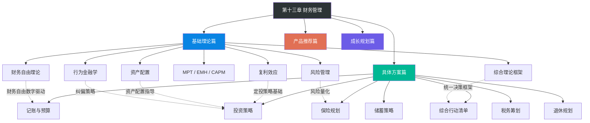
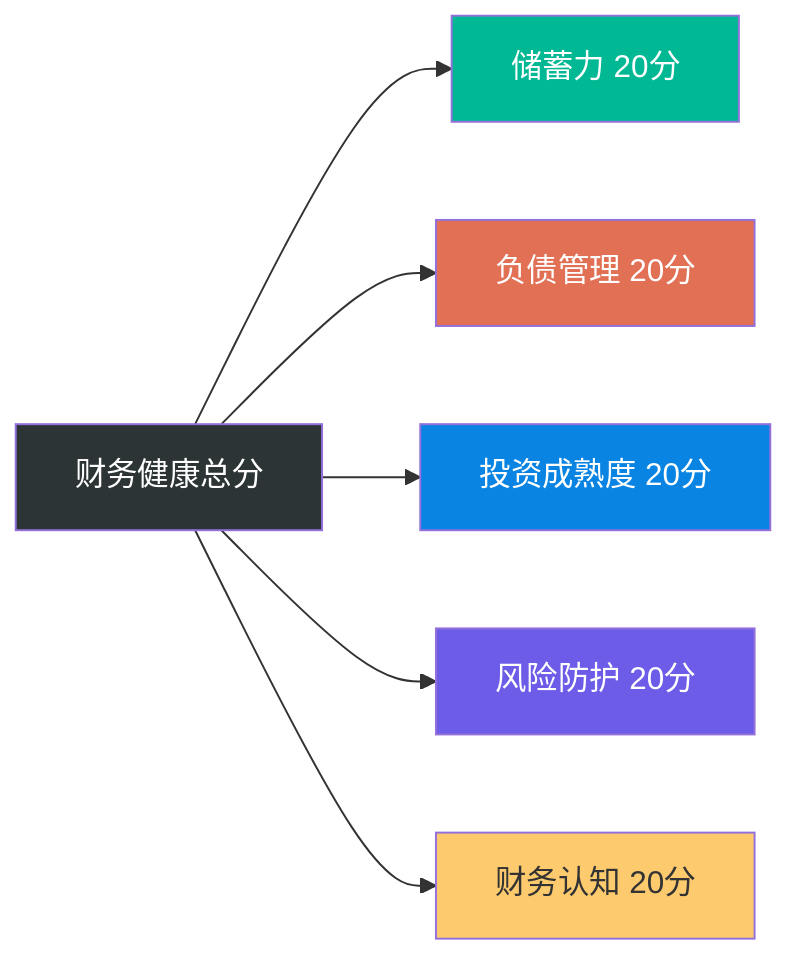
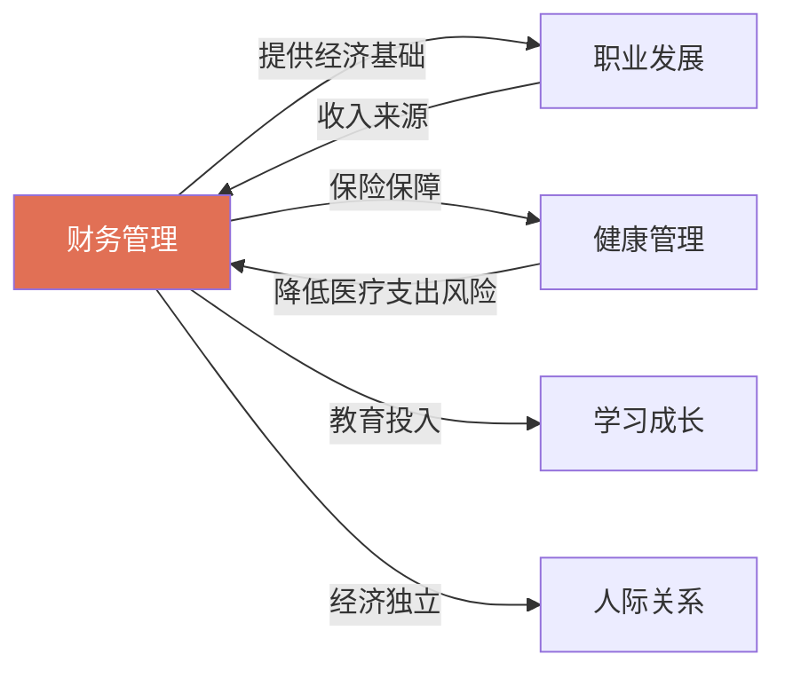

# 本章小结

本章从认知重塑到行动落地，从理论框架到工具推荐，构建了一套完整的个人财务管理知识体系。全章包含基础理论篇（7个模块）、具体方案篇（7个模块）、产品推荐篇（4个模块）和成长规划篇（3个模块），总计约20万字。本节的目的不是简单复述，而是帮你将所有内容编织成一张完整的知识网络——让你在合上这一章时，手里握着一张清晰的财务地图。

***

## 一、本章知识架构全景

本章的四大板块之间存在清晰的逻辑递进关系：理论是底层操作系统，方案是应用程序，资源是工具箱，成长规划是升级路径。

**核心逻辑链**：财务自由理论定义目标 → 复利理论计算路径 → MPT/EMH指导组合构建 → 资产配置确定骨架 → 风险管理设定安全阀 → 行为金融学纠正执行偏差。这条链从"我想达成什么"到"如何避免在执行中犯错"，覆盖了财务决策的完整生命周期。

***

## 二、六大核心理论回顾

基础理论篇是整章的认知地基。六个理论各自回答财务管理中的一个根本问题，合在一起构成完整的决策思维模型。

### 2.1 财务自由理论：你需要多少钱？

| 核心概念 | 关键公式 / 数值 | 实际意义 |
|---------|---------------|---------|
| 4%法则 | 财务自由数字 = 年支出 × 25 | 每年提取4%，理论上可维持30年以上 |
| 中国修正版 | 财务自由数字 = 年支出 × 28-33 | 提取率调至3-3.5%，适应中国更高波动市场 |
| 五个阶段 | 财务保障→稳定→安全→自由→丰盛 | 从"能应对突发"到"资产为自由数字3倍以上" |
| 储蓄率 > 收入 | 月入1万储蓄率50% 胜过 月入3万储蓄率10% | 储蓄率是决定财务自由时间线的第一变量 |

**关键认知**：财务自由不是一个模糊的愿景，而是一个可以用公式精确计算的数字。FIRE运动的四种变体（精益FIRE、肥厚FIRE、咖啡师FIRE、海岸FIRE）为不同生活方式提供了不同的实现路径。中国读者需要特别注意：4%法则基于美国股市近百年数据（年化约10%），中国市场波动更大、工具更有限，保守起见应按3-3.5%的提取率规划。

### 2.2 复利效应：时间是最稀缺的资源

| 核心概念 | 关键数据 | 实际意义 |
|---------|---------|---------|
| 72法则 | 翻倍年数 ≈ 72 ÷ 年化收益率% | 年化8%时约9年翻倍，年化7%时约10.3年 |
| 定投复利 | 每月投2000元，年化8%，30年 ≈ 298万 | 投入72万，收益226万——复利贡献76% |
| 早10年的价值 | 25岁投2000元/月到60岁 ≈ 700万 vs 35岁才开始 ≈ 300万 | 差10年，差400万 |
| 负债的复利 | 信用卡1万只还最低额，5年膨胀到2.4万 | 高息负债的复利是财富的反向引擎 |

**关键认知**：复利是"世界第八大奇迹"，但大多数人只理解了正向复利（投资增长），忽视了反向复利（负债膨胀）和通胀侵蚀（中国近20年CPI年均约2.5%，实际购买力每28年缩水一半）。今天的100万，按3%通胀折算，20年后只值55.4万——不投资才是最大的风险。

### 2.3 投资理论：科学构建组合

| 理论 | 核心观点 | 对普通投资者的意义 |
|------|---------|-----------------|
| 现代投资组合理论（MPT） | 分散化能降低非系统性风险 | 两个各20%风险的资产，相关系数为0时组合风险降至14.14% |
| 有效市场假说（EMH） | 超过90%的主动型大盘基金15年期跑输标普500 | 指数基金是最优选择——省心、低费率、长期表现更好 |
| CAPM模型 | 预期收益 = 无风险利率 + β×风险溢价 | Beta>1意味着比市场波动更大，<1更稳健 |
| 适应性市场假说 | 市场效率是动态变化的 | 不能教条地应用任何单一理论 |

**关键认知**：MPT从数学上证明了"不要把所有鸡蛋放在一个篮子里"的正确性——但仅限于相关性低的资产之间。EMH的核心实践意义是：对于绝大多数人，选择低成本指数基金并长期持有，是最优策略。

### 2.4 资产配置：投资收益的决定性因素

诺贝尔经济学奖得主马科维茨的研究表明，资产配置决定了投资组合90%以上的收益差异——远超选股和择时。

| 年龄段 | 权益类 | 固收类 | 现金 | 另类资产 |
|-------|-------|-------|------|---------|
| 25岁·进取型 | 70-80% | 10-15% | 5-10% | 5-10% |
| 35岁·稳健型 | 50-60% | 25-30% | 5-10% | 5-10% |
| 45岁·平衡型 | 35-45% | 35-40% | 10-15% | 5-10% |
| 55岁·保守型 | 20-30% | 45-55% | 15-20% | 5% |

**再平衡规则**：当任一资产类别偏离目标超过5个百分点时触发再平衡；或者每半年/每年定期检视。对大多数人而言，"现金流再平衡法（新资金优先买入比例偏低的资产）+ 年度阈值检视"是最佳组合。达利欧的全天候策略（30%股票+40%长期国债+15%中期国债+7.5%黄金+7.5%大宗商品）则适用于追求在任何经济环境下都获得正收益的投资者。

### 2.5 风险管理：控制损失比追求收益更重要

| 风险指标 | 含义 | 实际用途 |
|---------|------|---------|
| 标准差（σ） | 收益率的波动幅度 | 衡量投资的"颠簸程度" |
| 最大回撤 | 从最高点到最低点的跌幅 | 评估"最坏能亏多少" |
| 夏普比率 | （收益率-无风险利率）/ 标准差 | 每承受1单位风险获得多少超额收益 |
| 在险价值（VaR） | 一定置信水平下的最大可能损失 | 量化极端情况下的损失 |

**关键认知**：投资的首要原则不是赚钱，而是控制风险。塔勒布的"杠铃策略"（90%极安全资产+10%高风险高回报资产）是对抗黑天鹅事件的有效方法。系统性风险（整个市场下跌）无法通过分散化消除，只能通过资产配置（股债平衡）和风险承受能力评估来管理；非系统性风险（个股风险）可以通过分散持仓消除。

### 2.6 行为金融学：你最大的敌人是自己

研究表明，普通投资者的实际收益率比市场低3-5个百分点，其中大部分损失来自行为偏差而非市场本身。

| 认知偏差 | 核心机制 | 纠偏策略 |
|---------|---------|---------|
| 损失厌恶 | 亏损1万的痛苦是赚1万快乐的2.5倍 | 问自己：如果没有持仓，现在还会买入吗？ |
| 锚定效应 | 执着于买入价——"等回本了再卖" | 忘掉成本价，只看未来走势 |
| 过度自信 | 80%散户认为自己能跑赢市场 | 记住：专业基金经理也跑不赢指数 |
| 从众效应 | 高点最想买入，低点最想卖出 | 当菜市场都在聊股票时，往往是见顶信号 |
| 心理账户 | 对不同来源的钱有不同消费态度 | 所有1元钱的购买力都一样 |

**核心纠偏工具**：决策清单（每笔投资前对照检查）、48小时冷静期（超过月收入10%的决策强制等待）、投资日记（记录每笔交易的理由和情绪）。

***

## 三、七大行动方案回顾

具体方案篇将理论转化为可执行的操作步骤。以下是每个模块的核心要点：

### 3.1 记账与预算管理

**核心原则**：你无法改善你无法衡量的东西。

| 记账方法 | 适合人群 | 核心操作 |
|---------|---------|---------|
| 手动记账 | 刚起步者 | 每天2分钟，手机APP记录 |
| 半自动记账 | 大多数人 | 导入银行/支付宝账单 + 手动分类 |
| 全自动记账 | 技术型用户 | API对接 + 自动分类规则 |

**预算方法**：50/30/20法则（必要支出50%/弹性消费30%/储蓄投资20%）、信封法（物理隔离各预算类别）、零基预算法（每一分钱都有归属）。重点是发现"拿铁因子"——那些单笔不大但积少成多的高频消费。

### 3.2 储蓄策略

**核心操作**：先储蓄后消费——工资到账日自动转出20%到专用账户，剩下的才是可花的钱。行为经济学证实，"看不见的钱就不会被花掉"。

| 储蓄方法 | 操作方式 | 适合场景 |
|---------|---------|---------|
| 先储蓄后消费 | 工资日自动转出 | 所有人的默认选择 |
| 阶梯储蓄法 | 分为1/2/3年期存款 | 兼顾流动性和收益 |
| 目标储蓄法 | 为旅行/应急/购房分别设账户 | 有明确储蓄目标的人 |

**负债管理**：雪球法（先还最小的债，获得心理激励）vs 雪崩法（先还利率最高的债，节省利息）。信用卡分期年化13-18%、花呗分期约14-16%——这些高息负债是第一优先清偿对象。

### 3.3 投资策略

**入门方案**：选择一只宽基指数基金（沪深300或中证500），在支付宝/天天基金/蛋卷基金开户，设置每月自动定投。定投金额 = (月收入-月支出) × 30%。

| 定投策略 | 操作方式 | 适合阶段 |
|---------|---------|---------|
| 普通定投 | 固定金额固定日期 | 零基础入门 |
| 价值平均定投 | 维持目标市值，跌多买涨少买 | 有一定经验 |
| 估值定投 | 低估多买、高估少买 | 进阶投资者 |

**定投纪律**：下跌时不暂停反而加大金额、至少坚持3年、设置止盈（累计30-50%时分批卖出）不设止损。沪深300全收益指数过去15年年化约9%。

### 3.4 保险规划

**配置优先级**：意外险（100-300元/年）→ 百万医疗险（200-800元/年）→ 定期寿险（500-2000元/年）→ 重疾险（3000-8000元/年）。

| 险种 | 解决的问题 | 关键选择标准 |
|------|-----------|------------|
| 意外险 | 意外身故/伤残 | 一年期消费型，不买返还型 |
| 百万医疗险 | 大额医疗费 | 优先选"保证续保20年" |
| 定期寿险 | 家庭经济支柱身故 | 保障到60-65岁 |
| 重疾险 | 大病导致的收入损失 | 预算紧先买纯重疾（不含身故） |

**保费控制**：双十原则——保费不超过年收入10%，保额不低于年收入10倍。

### 3.5 税务筹划

**最简单的节税方式**：检查个税专项附加扣除。7项扣除（子女教育、继续教育、大病医疗、住房贷款利息、住房租金、赡养老人、3岁以下婴幼儿照护），很多人白白多交了税。

| 节税工具 | 年缴上限 | 节税效果 |
|---------|---------|---------|
| 个人养老金账户 | 12000元 | 边际税率10%→节税1200元/年，20%→2400元/年 |
| 商业健康险税优 | 2400元 | 每月抵扣200元 |
| 公积金 | 按当地上限 | 税前扣除 |

**注意**：个人养老金取出时按3%补税，边际税率3%档的人不划算（等于没省），10%及以上值得参与。

### 3.6 退休规划

**养老金三支柱**：社保养老金（替代率约40-60%）+ 企业年金（覆盖有限）+ 个人养老金（年缴上限12000元）。

**退休金缺口计算示例**：28岁，月支出8000元，计划60岁退休。
- 退休后年支出 = 96000 × 70% = 67200元
- 考虑3%通胀，32年后实际年支出 ≈ 172,680元
- 假设社保养老金60000元/年，缺口 ≈ 112,680元/年
- 所需储蓄 = 112,680 × 25 ≈ 281.7万元
- 每月定投约1,900元（年化8%）即可达成——越早开始越轻松

### 3.7 综合行动时间表

| 时间阶段 | 核心任务 | 验收标准 |
|---------|---------|---------|
| 第1周 | 开始记账、清点负债、计算储蓄率和财务自由数字 | 3件事全部完成 |
| 第1个月 | 首月记账完成、制定预算、启动先储蓄后消费、评估保险需求 | 预算已制定，自动转账已设置 |
| 第1季度 | 建立紧急备用金（至少1个月）、开始基金定投、配置意外险+百万医疗、开通个人养老金 | 备用金到位，定投已扣款 |
| 第6个月 | 备用金达标3个月、定投系统稳定运行、全部基础保险到位、建立季度复盘机制 | 五项全部验收通过 |
| 第1年 | 净资产持续增长、储蓄率≥30%、投资年化≥8%、保险覆盖完整 | 年度财务体检达标 |

***

## 四、十大误区与纠正

本章揭示了十个最具破坏力的财务误区。以下是完整速查表：

| 误区 | 认知根源 | 真实危害 | 正确认知 |
|------|---------|---------|---------|
| 等有钱了再理财 | "全有或全无"思维 | 错失复利最大的盟友——时间 | 理财从记账开始，零门槛 |
| 省钱就是理财 | 将理财等同于节流 | 收入天花板决定了财富上限 | 开源节流并重，提高储蓄率 |
| 投资就是炒股 | 对投资工具认知狭隘 | 高风险投机，可能血本无归 | 从指数基金定投开始 |
| 高收益=好产品 | 忽视风险调整后收益 | 年化20%但回撤50%不如年化10%回撤10% | 看夏普比率，不看绝对收益 |
| 买保险浪费钱 | 混淆产品设计与销售误导 | 一场大病掏空数十年积蓄 | 意外险+百万医疗每年不到500元 |
| 定投稳赚不赔 | 对定投机制理解不完整 | 不选标的、不坚持、不止盈都会亏损 | 需要选标的、坚持、设止盈 |
| 负债都是不好的 | 不区分良性与恶性负债 | 可能错过低成本杠杆的机会 | 房贷（3-4%）是良性负债，信用卡分期（13-18%）是恶性负债 |
| 投资需要天天盯盘 | 将投资等同于交易 | 频繁操作增加交易成本，放大情绪决策 | 关注长期趋势，每月看一次足够 |
| 跟风投资 | 从众效应+近因偏差 | 高点入场低点割肉 | 独立思考，用决策清单检查 |
| 忽视通货膨胀 | 对隐形成本无感知 | 不投资才是最大风险——28年购买力缩水一半 | 真实收益率 = 名义收益 - 通胀率 |

**最致命的三个误区**（按破坏力排序）：
1. **忽视通货膨胀**——它是静默的财富杀手，每年2-3%的侵蚀在20-30年后累积成巨大的购买力差距
2. **等有钱再理财**——每晚10年开始，复利损失可能达到数百万
3. **高收益=好产品**——这是所有金融骗局的共同入口，年化>8%且"保本"的承诺基本都是骗局

***

## 五、理论框架的现实修正

任何理论都有适用边界。以下是将理论应用于中国现实时需要做的关键修正：

### 5.1 4%法则的中国适用性

4%法则基于美国股市近百年数据。中国市场的差异：沪深300年化波动率约25%（标普500约15%），无风险利率和通胀走势不同，投资工具有限（资本管制）。

**修正方案**：将安全提取率下调至3-3.5%，对应财务自由数字 = 年支出 × 28-33。使用动态提取法（市场好多提≤5%，市场差少提≥3%），配置部分全球资产（QDII基金）降低单一市场风险。

### 5.2 MPT假设的理想化

MPT假设收益率服从正态分布，但在金融危机期间各类资产的相关性会同时上升——"分散化在你最需要它的时候失效"。

**修正方案**：配置"危机对冲资产"（长期国债、黄金），它们在股市大跌时通常上涨。保留足够现金缓冲，避免被迫在低点卖出。

### 5.3 "知道"与"做到"之间的鸿沟

行为金融学完美描述了人的非理性，但知道自己有偏差不等于能避免偏差——即使金融专业人士也无法免疫。

**修正方案**：不要依赖意志力，要用系统约束行为——自动定投、自动再平衡、预设止损止盈。找一个"财务伙伴"互相监督，建立"投资日记"记录交易理由和情绪状态。

***

## 六、财务健康自测工具

在回顾完所有理论和方案之后，你需要一个客观的"仪表盘"来评估自己当前的财务健康状况。以下自测体系基于本章核心指标设计，覆盖五个维度，每个维度20分，满分100分。

### 6.1 五维评分体系

### 6.2 逐项评分细则

#### 维度一：储蓄力（20分）

| 评分项 | 0分 | 5分 | 10分 |
|-------|-----|-----|------|
| 储蓄率 | <10% | 10-30% | >30% |
| 储蓄自动化 | 手动转账，常忘 | 已设置自动转账但偶尔中断 | 工资日自动转出，从未中断 |

#### 维度二：负债管理（20分）

| 评分项 | 0分 | 5分 | 10分 |
|-------|-----|-----|------|
| 高息负债 | 有信用卡分期/花呗分期/网贷 | 仅房贷（良性负债） | 零负债或仅低息房贷且还款计划清晰 |
| 负债收入比 | >50% | 30-50% | <30% |

#### 维度三：投资成熟度（20分）

| 评分项 | 0分 | 5分 | 10分 |
|-------|-----|-----|------|
| 投资行为 | 存银行/炒股跟风 | 有定投但经常中断 | 按资产配置方案系统执行，定期再平衡 |
| 投资知识 | 不了解任何投资理论 | 了解基本概念（复利、分散化） | 理解MPT/EMH/资产配置并能应用 |

#### 维度四：风险防护（20分）

| 评分项 | 0分 | 5分 | 10分 |
|-------|-----|-----|------|
| 紧急备用金 | 无 | 1-3个月支出 | 3-6个月支出，存放货币基金 |
| 保险配置 | 无任何商业保险 | 有意外险+百万医疗 | 四大基础险种齐全，保额充足 |

#### 维度五：财务认知（20分）

| 评分项 | 0分 | 5分 | 10分 |
|-------|-----|-----|------|
| 财务规划 | 不知道自己每月花多少 | 有记账习惯，知道储蓄率 | 知道自己的财务自由数字和退休缺口 |
| 认知偏差 | 完全凭感觉做决策 | 偶尔反思决策 | 使用决策清单、投资日记 |

### 6.3 评分结果与行动指引

| 分数区间 | 财务健康等级 | 核心问题 | 优先行动 |
|---------|-----------|---------|---------|
| 0-20分 | 亚健康 | 基础习惯未建立 | 从记账开始，清除高息负债，设置自动储蓄 |
| 21-40分 | 初级 | 有意识但未系统化 | 建立预算体系，开始基金定投，配置基础保险 |
| 41-60分 | 中级 | 系统已运转但有短板 | 优化资产配置，完善保险，启动税务筹划 |
| 61-80分 | 良好 | 系统运转良好 | 定期再平衡，深化投资知识，优化退休规划 |
| 81-100分 | 优秀 | 持续精进 | 年度体检，传承规划，考虑更多投资工具 |

**关键提醒**：这个评分不是一次性考试，而是定期检视的工具。建议每季度重新评估一次，追踪分数变化趋势比绝对分数更有意义。一个从30分提升到50分的人，比一直停留在60分的人，财务前景更好。

***

## 七、关键公式与速算表

以下是贯穿全章的核心公式，随时查阅：

### 7.1 基础公式

| 公式 | 表达式 | 用途 |
|------|--------|------|
| 财务自由数字 | 年支出 × 25（保守×28-33） | 计算财务自由目标金额 |
| 72法则 | 翻倍年数 ≈ 72 ÷ 年化收益率% | 快速心算资产翻倍时间 |
| 储蓄率 | （月收入-月支出）/ 月收入 × 100% | 衡量财务健康的核心指标 |
| 净资产 | 资产合计 - 负债合计 | 个人/家庭财富的终极衡量 |

### 7.2 投资公式

| 公式 | 表达式 | 用途 |
|------|--------|------|
| 复利终值 | A = P × (1+r)^n | 一次性投入的未来价值 |
| 定投终值 | FV = PMT × [((1+r)^n-1)/r] | 定期定额投入的未来价值 |
| 夏普比率 | SR = (Rp-Rf)/σp | 风险调整后收益衡量 |
| 真实收益率 | 实际收益 ≈ 名义收益 - 通胀率 | 扣除通胀后的实际购买力增长 |

### 7.3 速算参考表

| 年化收益率 | 72法则翻倍年数 | 10万本金10年后 | 10万本金20年后 | 10万本金30年后 |
|-----------|-------------|-------------|-------------|-------------|
| 3% | 24年 | 13.4万 | 18.1万 | 24.3万 |
| 5% | 14.4年 | 16.3万 | 26.5万 | 43.2万 |
| 7% | 10.3年 | 19.7万 | 38.7万 | 76.1万 |
| 10% | 7.2年 | 25.9万 | 67.3万 | 174.5万 |

### 7.4 定投速算表（每月定投1000元）

| 年化收益率 | 10年后总值 | 20年后总值 | 30年后总值 | 30年总投入 |
|-----------|----------|----------|----------|----------|
| 5% | 15.5万 | 40.7万 | 83.2万 | 36万 |
| 7% | 17.3万 | 52.0万 | 121.9万 | 36万 |
| 8% | 18.3万 | 58.9万 | 149.0万 | 36万 |
| 10% | 20.5万 | 75.9万 | 226.0万 | 36万 |

**使用场景**：这张表的意义在于让你直观看到"坚持"的回报。每月1000元、年化8%、30年——你只投入了36万，最终拿到149万，其中113万是复利贡献的。这就是"时间的魔法"最具体的体现。

***

## 八、不同人生阶段的重点策略

六大理论在不同人生阶段的侧重不同。找到你当前的阶段，了解此刻最该关注什么：

| 人生阶段 | 年龄参考 | 核心理论侧重 | 关键行动 | 最大陷阱 |
|---------|---------|------------|---------|---------|
| 起步期 | 22-28岁 | 复利理论（时间优势最大） | 建立记账习惯、开始定投、清除高息负债 | "我还年轻不着急" |
| 积累期 | 28-35岁 | 资产配置 + 风险管理 | 提高储蓄率、优化投资组合、配置保险 | 生活方式通胀吞噬储蓄率 |
| 增长期 | 35-45岁 | 全面应用六大理论 | 最大化投资、平衡家庭责任、税务筹划 | 为了孩子牺牲自己的退休规划 |
| 巩固期 | 45-55岁 | 风险管理优先级上升 | 降低波动、增加固收比例、完善退休规划 | 恐惧过度导致全转存款 |
| 收获期 | 55岁以上 | 风险管理 + 行为金融学 | 资产提取策略、保本为主 | 被高收益骗局吸引 |

**一个关键原则**：无论你处于哪个阶段，有一件事永远不变——储蓄率是第一变量。月入1万储蓄率50%的人，比月入3万储蓄率10%的人更快实现财务自由。

### 8.1 各阶段典型困境与突破策略

**起步期（22-28岁）的典型困境**：收入低、消费欲望强、觉得自己"没钱可理"。突破策略：不在金额大小，在于习惯建立。哪怕月入5000，每月存500开始定投，重点是让"自动化储蓄"成为默认行为。这个阶段最大的优势是时间——25岁开始每月投1000元（年化8%），到60岁是247万；35岁才开始同样的投入，到60岁只有113万。时间差10年，结果差134万。

**积累期（28-35岁）的典型困境**：收入增长带来消费升级——换了更好的房子、更好的车、更好的餐厅，储蓄率反而没提高。这就是"生活方式通胀"。突破策略：每次加薪时，将增量的50%直接转入储蓄，只有50%用于改善生活。这样储蓄率随收入自然增长，生活质量也在提升。

**增长期（35-45岁）的典型困境**：上有老下有小，教育支出猛增，很容易"为了孩子牺牲一切"。突破策略：记住一个原则——"先给自己戴好氧气面罩"。孩子的教育可以贷款，你的退休不行。确保退休储蓄不低于收入的15%之后，再规划教育支出。

**巩固期（45-55岁）的典型困境**：经历过市场大跌后，恐惧心理导致全转银行存款，年化不到2%，被通胀侵蚀。突破策略：理解"波动不等于亏损"。短期波动是正常的，只有卖出才会锁定亏损。这个阶段应降低权益比例（35-45%），但不应降至零。

**收获期（55岁以上）的典型困境**：退休后收入骤降，同时被各种"高收益理财产品"盯上。突破策略：建立"提取规则"——每年提取不超过总资产的3-4%，市场好时可多提一点，市场差时压缩支出。对任何承诺"年化>6%且保本"的产品，一律拒绝。

***

## 九、与个人提升其他章节的关系

在个人提升的完整框架中，财务管理是"器"的层面——它是实现其他目标的工具和杠杆：

- **职业发展**赚来的收入，需要通过财务管理来保值增值——没有财务管理，高收入也可能陷入"高收入贫困"
- **健康管理**所需的医疗支出，需要通过保险和储蓄来保障——一场大病可以摧毁一个没有保险的家庭数十年的积蓄
- **学习成长**的教育投入，需要通过财务规划来支撑——无论是自己深造还是子女教育，都需要提前规划
- **人际关系**中的经济独立，需要通过财务管理来实现——经济依附是很多不健康关系的根源

**跨章节协同效应**：当财务管理与职业发展协同工作时，产生正向飞轮——职业发展提升收入 → 财务管理提升储蓄率和投资收益 → 经济安全感降低职业焦虑 → 更从容地做出职业决策（比如跳槽到更有前景但短期收入可能降低的岗位）。反之，如果没有财务管理，即使收入翻倍也可能陷入"越赚越穷"的陷阱。

***

## 十、学习路径与成长阶梯

### 10.1 五阶段渐进式学习路径

| 阶段 | 时间跨度 | 核心目标 | 关键行动 | 验收标准 |
|------|---------|---------|---------|---------|
| 财务启蒙 | 第1-2周 | 建立认知 | 完成财务体检，计算净资产和储蓄率 | 知道自己的财务自由数字 |
| 习惯养成 | 第3-6周 | 建立纪律 | 记账、储蓄、清除高息负债 | 自动储蓄已运行1个月 |
| 投资入门 | 第7-16周 | 启动投资 | 学习基金知识，开始定投 | 定投已稳定扣款3次 |
| 体系完善 | 第17-30周 | 系统化管理 | 保险、资产配置、税务筹划、退休规划 | 全部基础保险到位，季度复盘已启动 |
| 进阶提升 | 第31周起 | 持续深化 | 深化投资知识，优化财务结构 | 年度财务体检达标 |

### 10.2 分层阅读策略

**入门读者（财务健康自测0-6分）**：四周渐进式阅读。第一周读基础理论（财务自由+复利），同时开始记账。第二周读投资理论+资产配置+风险管理，计算财务自由数字。第三周读具体方案（记账→储蓄→投资→保险），启动定投。第四周读行为金融学+学习路径+误区+产品推荐，制定个人计划。

**进阶读者（7-12分）**：两周重点突破。重点读资产配置、风险管理、行为金融学、税务筹划和退休规划，优化现有方案。

**高阶读者（13分以上）**：针对性查阅。重点读行为金融学中的认知偏差修正、全天候策略和再平衡方法、产品推荐中的高级工具。

***

## 十一、常见障碍与解决方案

在将知识转化为行动的过程中，几乎每个人都会遇到以下障碍。提前了解它们，当障碍出现时你不会措手不及。

### 11.1 行动启动障碍

**障碍1："我收入太低，存不下钱"**

这是最常见的启动障碍。真实情况是：你不需要等到收入高了才开始理财，你需要通过理财来改变收入状况。

**解决方案**：从极小金额开始。月入5000，先存500（10%）。关键不是金额，而是建立"先储蓄后消费"的神经通路。三个月后你发现500并没有影响生活质量，自然会提升到20%。

**障碍2："我试过记账，坚持不下来"**

80%的人在开始记账后的两周内放弃。原因是记账太繁琐，每次消费都要手动输入。

**解决方案**：降低记账标准。第一个月只记"大额消费"（>50元的），忽略零散小额。用半自动记账——导入支付宝/微信账单，每周花10分钟分类。记账的目的是"知道钱去了哪里"，不是追求每一笔都精确到分。

**障碍3："我不懂投资，怕亏钱"**

对未知领域的恐惧是正常的。但不投资的确定性亏损（通胀侵蚀）远大于投资的不确定性波动。

**解决方案**：从"几乎不可能亏"的品种开始——货币基金（年化约2%）先存着，同时花两周学习指数基金知识。当你理解了"沪深300代表中国最大的300家公司"时，恐惧就会降低。

### 11.2 持续执行障碍

**障碍4："市场跌了，定投亏了，想停"**

这是最危险的时刻——恰恰是定投最有价值的时刻。下跌时定投同样的金额可以买到更多份额，拉低平均成本。

**解决方案**：不看账户。将定投APP从手机主屏移走，设置为每月自动扣款后不再关注。如果实在焦虑，就把关注频率从"每天"降到"每季度"。历史数据证明：沪深300任意时点开始定投，坚持3年以上，亏损概率不到15%。

**障碍5："朋友推荐了一个高收益产品，年化15%且保本"**

所有承诺"高收益+保本"的产品都是骗局或准骗局。这不是偏见，而是金融学的基本原理——收益永远与风险成正比。

**解决方案**：应用"3秒判断法"——听到"保本"就走。这不是保守，而是理性。记住：庞氏骗局的平均持续时间是18个月，前18个月的"投资者"都赚到了钱，直到崩盘的那一天。

**障碍6："太忙了，没时间管财务"**

财务管理不需要大量时间。建立好自动化系统后，每月花1小时就够了。

**解决方案**：一次性投入3小时完成"自动化设置"——自动转账储蓄、自动定投、自动还信用卡。之后每季度花1小时复盘。这4小时/季度的投入，可能价值数十万甚至数百万的长期收益。

### 11.3 认知突破障碍

**障碍7："我自己选股比基金强"**

研究表明，80%的散户认为自己能跑赢市场，但实际数据是：长期来看，超过90%的主动型基金都跑不赢指数。个人投资者的表现更差。

**解决方案**：做一个诚实的测试——回顾你过去3年的所有投资记录，计算真实收益率（包括手续费、时间成本），与同期沪深300对比。大多数人会发现，自己费心费力的结果，还不如闭眼买指数基金。

**障碍8："等房价跌了再买/等股票跌了再投"**

没有人能持续准确预测市场底部。等待"最佳时机"的人，往往等来了更高的价格。

**解决方案**：用定投替代择时。定投的本质是"放弃预测，拥抱平均"。每月固定日期投入固定金额，自然实现"跌了多买、涨了少买"。这比任何择时策略都更可靠。

***

## 十二、三个真实场景的完整推演

为了让理论真正"落地"，以下是三个典型财务场景的完整决策过程推演。

### 场景一：月薪8000的应届毕业生如何起步？

**背景**：小李，23岁，应届毕业生，月薪8000元（税后），坐标深圳，每月房租2500元，无存款无负债。

**第一步：建立财务体检（第1天）**

计算月支出：房租2500 + 餐饮1500 + 交通300 + 通讯100 + 日用500 + 社交500 = 5400元。月储蓄能力 = 8000 - 5400 = 2600元，储蓄率 = 2600/8000 = 32.5%。财务自由数字 = 5400 × 12 × 25 = 162万元。

**第二步：设置自动化（第1周）**

工资日自动转出2000元到专用储蓄账户。其中1000元进入货币基金（紧急备用金种子），1000元设置沪深300指数基金定投。

**第三步：保险配置（第1个月）**

购买意外险（约150元/年）和百万医疗险（约200元/年），年总保费350元，占年收入0.37%，远低于10%红线。

**预期成果**：第一年储蓄2.4万（含基金定投收益），紧急备用金1.2万（货币基金），保险覆盖到位。5年后净资产约15-18万，28岁时已建立完整的财务体系。

### 场景二：月薪2万的"月光族"如何自救？

**背景**：小王，30岁，互联网从业者，月薪20000元（税后），坐标北京，月光，信用卡分期余额3万元（年化15%），无存款。

**诊断**：小王的问题不是收入不够，而是"生活方式通胀"——收入从8000涨到20000，消费也同步膨胀。3万元信用卡分期每年产生4500元利息，相当于每月白白蒸发375元。

**第一步：止血（第1周）**

清点所有负债和自动扣费。信用卡分期3万，用储蓄（如果有的话）或向家人借款一次性还清，立刻停止每年4500元的利息流失。取消所有不常用的订阅服务。

**第二步：重建预算（第1个月）**

采用50/30/20法则：必要支出10000元（房租、餐饮、交通）、弹性消费6000元、储蓄投资4000元。发薪日自动转出4000元。

**第三步：投资启动（第2个月）**

还清负债后的第一个月开始，2000元定投沪深300 + 1000元定投中证500 + 1000元入货币基金（紧急备用金）。

**预期成果**：第一年净资产从-3万变为+4.8万，彻底扭转财务方向。三年后净资产约20万，储蓄率稳定在20%以上。

### 场景三：40岁家庭支柱如何做全面规划？

**背景**：老张，40岁，已婚有1子（8岁），家庭月收入35000元（夫妻合计），房贷余额80万（月供6000元），现有投资资产50万（全在银行理财），无商业保险。

**风险诊断**：家庭经济支柱无保险是最大隐患——如果老张出意外，80万房贷和孩子的教育费用将全部压在配偶身上。50万全部放在银行理财（年化约3%），被通胀侵蚀。

**第一步：保险配置（立即）**

老张：定期寿险（保额200万，保至60岁，约3000元/年）+ 重疾险（保额50万，约6000元/年）+ 百万医疗（约800元/年）+ 意外险（约300元/年）。配偶：百万医疗 + 意外险 + 定期寿险（保额100万）。孩子：意外险 + 百万医疗。家庭年保费总额控制在2万元以内。

**第二步：资产重新配置（第1-2个月）**

保留10万货币基金（紧急备用金 ≈ 6个月支出）。剩余40万重新配置：60%权益类（沪深300+中证500指数基金）+ 30%固收类（债券基金）+ 10%黄金ETF。每月新增投资20000元按同样比例分配。

**第三步：退休规划（第1个月完成计算）**

退休后年支出 = 当前年支出 × 70% × (1.03)^20（20年后通胀调整）≈ 42万/年。假设社保养老金15万/年，缺口27万/年。所需退休储蓄 = 27 × 25 = 675万。现有50万按年化7%增长20年 ≈ 193万。缺口482万，每月需额外投入约10000元（年化7%，20年）。

**预期成果**：保险覆盖到位，投资从"银行理财3%"升级为"资产配置6-7%"，退休规划从"完全空白"变为"清晰路径"。20年后家庭净资产预计可达800-1000万。

***

## 十三、关键行动清单

如果你只记住三件事，请记住这三件：

**1. 今天就开始记账**
不需要等到"准备好了"。打开手机下载一个记账APP，记录今天的每一笔支出。2分钟搞定。记账不需要完美分类，先记起来再说。

**2. 设置自动储蓄**
在银行设置发薪日自动转账，将收入的20%转入专门的储蓄或投资账户。"看不见的钱就不会被花掉"——这是行为经济学验证过的最有效的单一理财动作。

**3. 开始第一笔定投**
在支付宝或天天基金上，选择一只沪深300指数基金，设置每月定投。金额不用大，重要的是开始。自动扣款，不要每次手动操作。

**进阶清单**（本季度内完成）：
- [ ] 建立紧急备用金，目标3-6个月支出，存放在货币基金
- [ ] 配置意外险和百万医疗险，每年总费用不到500元
- [ ] 检查个税专项附加扣除，很多人每年多交几千元税
- [ ] 开通个人养老金账户（边际税率≥10%的人值得参与）
- [ ] 建立季度财务复盘机制，每季度末花1小时审视

***

## 十四、持续精进：年度必做的五件事

财务管理不是一次性工程，以下五件事需要每年执行一次：

| 时间 | 事项 | 预计耗时 |
|------|------|---------|
| 每年1月 | 年度消费分析、预算调整、检视资产配置 | 半天 |
| 每年保单续费前1个月 | 检查保单有效性、评估保额是否需要调整、确认受益人信息 | 1小时 |
| 每年3-6月 | 个税汇算清缴——检查专项附加扣除、对比年终奖计税方式 | 30分钟 |
| 每季度末 | 检查投资组合是否偏离目标、评估定投执行情况 | 1小时 |
| 每年12月 | 更新退休储蓄目标、评估个人养老金缴存、全面财务体检 | 半天 |

### 14.1 年度财务体检清单

每年花半天时间完成以下检查，这是你财务系统的"年度维护"：

**资产端**：
- [ ] 更新所有账户余额（银行、基金、股票、公积金）
- [ ] 计算年度投资收益率，与沪深300对比
- [ ] 检查资产配置是否偏离目标（超过5%需要再平衡）

**负债端**：
- [ ] 清点所有负债余额和利率
- [ ] 确认无新增高息负债
- [ ] 评估是否需要提前还贷（房贷利率>投资预期收益率时考虑）

**保障端**：
- [ ] 所有保单续费状态正常
- [ ] 保额是否需要随收入增长调整
- [ ] 受益人信息是否需要更新

**规划端**：
- [ ] 储蓄率是否达标（≥20%）
- [ ] 财务自由数字是否需要重新计算（支出变化时）
- [ ] 退休储蓄进度是否在正轨上

***

## 最后的话

财务管理不是一次性任务，而是一种生活方式。它不需要你成为金融专家，不需要你每天盯盘，不需要你承担巨大风险。

它需要的只是五样东西：

1. **一个记账的习惯**——掌控资金流向，发现消费盲区
2. **一份储蓄的纪律**——先储蓄后消费，让自动化替你坚持
3. **一个定投的计划**——让复利和时间成为你的盟友
4. **一份保险的保障**——用确定的小额支出对冲不确定的大额风险
5. **一颗持续学习的心**——识别认知偏差，用系统约束人性弱点

正如查理·芒格所说："走到人生的某个阶段时，我决心要成为一个富有之人。这并不是因为爱钱的缘故，而是为了追求那种独立自主的感觉。"

财务自由的终极意义不在于拥有多少金钱，而在于拥有选择的自由——选择如何度过自己的时间，选择做自己想做的事，选择成为自己想成为的人。

从今天开始，掌控你的财务，掌控你的人生。

***

> **本章关键词**：财务自由、复利效应、资产配置、投资组合理论、有效市场假说、行为金融学、风险管理、记账、储蓄策略、基金定投、保险规划、税务筹划、退休规划、认知偏差、夏普比率
>
> **核心公式速查**：财务自由数字 = 年支出 × 25 | 72法则：翻倍年数 ≈ 72 ÷ 收益率% | 夏普比率 = (收益-无风险利率) / 标准差
>
> **下一步行动**：完成财务体检（计算净资产、储蓄率、财务自由数字）→ 开始记账 → 设定自动储蓄 → 开始第一笔定投
>
> **推荐阅读路径**：《小狗钱钱》（启蒙）→《指数基金投资指南》（入门）→《漫步华尔街》（进阶）→《思考，快与慢》（行为金融学）→《聪明的投资者》（经典）
