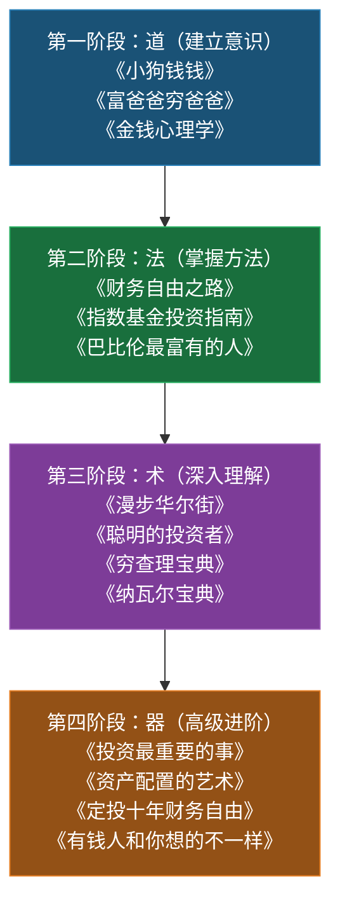

## 一、推荐书籍

读书是成本最低的投资——用几十块钱买下别人几十年的经验，这笔账怎么算都划算。但理财书籍浩如烟海，选错书不仅浪费时间，还可能被误导。本节按照"道→法→术→器"的逻辑，将书籍分为五个层级，从建立财商意识的入门读物，到系统掌握投资理论的专业著作，再到面向中国市场的实操指南，帮你用最短的阅读路径建立完整的财务知识体系。

### 1.1 选书标准：什么样的理财书值得读

在推荐具体书目之前，先建立一套选书标准。理财类畅销榜上充斥着"成功学"和"鸡汤"，用以下四个维度筛选，能帮你避开80%的烂书：

**维度一：作者背景**

| 类型 | 可信度 | 判断标准 | 典型代表 |
|------|--------|---------|---------|
| 学术型 | ★★★★★ | 有金融/经济学博士学位，在顶尖大学任教或有长期研究成果 | 格雷厄姆、马尔基尔、卡尼曼 |
| 实战型 | ★★★★☆ | 有可验证的长期投资业绩（10年以上），管理过大规模资金 | 马克斯、达利欧、彼得·林奇 |
| 传播型 | ★★★☆☆ | 采访/整理大量专家经验，自身不一定有投资业绩 | 托尼·罗宾斯、博多·舍费尔 |
| 营销型 | ★☆☆☆☆ | 主要靠卖课程/加盟赚钱，投资业绩无法验证或已知有失败记录 | 部分畅销书作者（需谨慎甄别） |

**维度二：数据与案例支撑**

好的理财书会用历史数据、学术研究、真实案例来支撑论点。警惕那些只有"我有个朋友……"式故事、没有数据的书。具体检查清单：

- 书中是否引用了学术论文或权威研究？（如Brinson的资产配置研究、法玛的有效市场假说）
- 案例是否有具体的时间、数字、结果？（如"2008年标普500下跌37%，但坚持定投的投资者在2010年回本"）
- 作者是否展示了反面案例和失败教训？（只讲成功故事的书要警惕）

**维度三：时效性与版本**

投资领域的书需要注意出版时间和版本。经典理论（如价值投资、有效市场）永不过时，但具体操作指南（如基金产品推荐、税收政策）会过期。优先选择最新修订版。

**维度四：读者验证**

豆瓣评分>7.0且评价人数>1000，Goodreads评分>3.8，是基本门槛。但要注意：评分高不代表适合你——一本9分的学术著作可能对你毫无用处，一本7.5分的入门书可能正好是你需要的。

### 1.2 道：财商启蒙——重塑金钱认知（适合零基础读者）

入门阶段的核心目标不是学技术，而是**重塑对金钱的认知**。很多人一辈子财务困顿，根本原因不是不懂投资，而是从未认真思考过"钱是什么、钱从哪来、钱该去哪"。以下四本书从不同角度帮你完成这个思维转变。

#### 1. 《小狗钱钱》——博多·舍费尔（Bodo Schäfer）

**推荐理由**：这是一本用童话故事包装的理财启蒙书，通过一只会说话的小狗"钱钱"教12岁女孩吉娅理财的故事，将复杂的财务概念用最简单的方式呈现。全球销量超过500万册，被翻译成30多种语言，是公认的"最好的理财第一本书"。

**核心收获**：

- **梦想储蓄罐**：把大目标拆成具体的、可衡量的小目标，为每个梦想设立独立的储蓄账户。这个方法看似简单，实际上击中了大多数人"想存钱但不知道为什么存"的痛点。具体做法：列出3个最想实现的梦想，为每个梦想算出具体金额和时间，然后每月按比例分配
- **鹅与金蛋的隐喻**：本金是"鹅"，利息是"金蛋"。永远不要杀死你的鹅（花掉本金），让金蛋越下越多。这是复利思维的最直观表达——假设年化收益8%，10万元本金10年后变成21.6万，30年后变成100.6万
- **成功日记**：每天记录5件做成功的事，建立自信。听起来跟理财无关，但自信是敢于行动的前提——很多人不是没有理财能力，而是不相信自己能做到
- **72小时法则**：当你决定做一件事，必须在72小时内开始行动，否则很可能永远不会做

**阅读建议**：全书约6万字，2-3小时即可读完。适合完全没有理财概念的读者，建议在开始任何理财行动之前阅读。中文译本质量不错，建议读纸质书，方便做笔记。读完后不要急着投资，先把书中的三个方法（梦想储蓄罐、鹅与金蛋、成功日记）实践一个月。

#### 2. 《富爸爸穷爸爸》——罗伯特·清崎（Robert Kiyosaki）

**推荐理由**：全球销量超过4000万册的理财启蒙经典。通过作者两位"爸爸"——亲生父亲（大学教授，高收入但终身为钱发愁）和朋友父亲（没上过大学，但成为夏威夷最富有的人之一）——的不同财务观念对比，彻底颠覆了"好好读书→找好工作→努力升职"的传统路径。

**核心收获**：

- **资产与负债的重新定义**：资产是把钱放进你口袋的东西，负债是从你口袋拿走钱的东西。按这个标准，自住房产在很多情况下是负债而非资产（每月要还贷、交物业费、维修费）。这个定义虽然过于简化（忽略了房产增值和抗通胀功能），但作为思维工具极其有效
- **现金流象限**：ESBI四象限——Employee（雇员）、Self-employed（自雇）、Business（企业主）、Investor（投资者）。穷人和中产在左边（E和S），富人在右边（B和I）。核心洞察：从E/S象限跨越到B/I象限，需要完全不同的技能和思维模式
- **财商四要素**：会计（财务知识，能读懂财务报表）、投资（钱生钱的科学，理解风险与回报）、市场（供给与需求的科学，理解市场周期）、法律（合法保护资产，利用税法优化）
- **老鼠赛跑**：大多数人陷入"赚钱→消费→赚更多钱→消费更多"的循环，收入增长永远追不上欲望膨胀。打破这个循环的关键不是赚更多，而是改变消费模式

**阅读建议**：重点读前8章（建立思维），后半部分的实操建议（如房地产投资、税务策略）需要结合中国实际情况批判性阅读。清崎的公司后来破产过，书中的投资建议不全是对的，但思维方式的价值是永恒的。建议搭配下面的《财务自由之路》一起读，一个讲"为什么"，一个讲"怎么做"。

**争议与警示**：清崎后来频繁推销高价课程和加盟项目，书中的部分投资建议（如大量使用杠杆炒房）风险极高。取其思维方式的精华，弃其具体操作的糟粕。核心价值在于"资产vs负债"的思维框架，而非任何具体投资建议。

#### 3. 《财务自由之路》——博多·舍费尔（Bodo Schäfer）

**推荐理由**：《小狗钱钱》作者的成人版理财书，全名"财务自由之路：7年内赚到你的第一个1000万"。如果说《小狗钱钱》是告诉你"为什么要理财"，这本书就是告诉你"具体怎么理"。系统性地讲解了从财务保障到财务自由的完整路径。

**核心收获**：

- **财务三阶段**：财务保障（6个月紧急储备金，覆盖基本生活支出）→财务安全（被动收入覆盖基本支出，即使不工作也能维持生存）→财务自由（被动收入覆盖所有理想生活支出，包括旅行、教育、兴趣爱好）。每个阶段有明确的数字目标，不再是模糊的"我要有钱"
- **收入公式**：收入 = 能力 × 精力 × 影响力 × 自我推销。提高收入不能只靠加班，要从这四个维度同时发力。能力是基础，精力决定你能投入多少时间，影响力决定你的市场价值，自我推销决定别人是否知道你的价值
- **50/50法则**：加薪或额外收入的50%用于提高生活品质，50%直接投入投资。这比极端节俭更可持续——纯粹的节俭会让人产生匮乏感，最终导致报复性消费
- **教练与专家网络**：找到你所在领域的成功者，付费学习他们的经验。自学的天花板远低于有人指点。具体方法：列出你想提升的3个领域，在每个领域找到一个已经做到了的人，想办法向他学习

**阅读建议**：适合已有基础理财意识、准备开始行动的读者。书中有很多实操练习，不要光看，要做。建议准备一个笔记本，把每个练习都认真完成。中文版翻译质量可以，但部分案例是基于欧洲市场，换算时注意汇率和税制差异。

#### 4. 《金钱心理学》——摩根·豪塞尔（Morgan Housel）

**推荐理由**：2020年出版后迅速成为全球现象级理财书，销量超过300万册，豆瓣评分8.3。与其他理财书不同，这本书不讲具体投资策略，而是专注于**财富与人性的关系**——为什么有些人在财务上做出看似不理性的决策？因为金钱决策从来不是纯理性的，它深受个人经历、情绪和社会环境的影响。

**核心收获**：

- **没有人是疯狂的**：每个人的财务决策在他们自己的人生经历中都是合理的。一个经历过大萧条的人极度保守，一个在牛市中长大的人极度冒险——这不是愚蠢，是经验塑造的理性。理解这一点，你就能理解为什么别人做出"不合理"的决策，也能审视自己的决策是否被经历过度影响
- **复利的真正力量**：巴菲特99%的财富是在50岁之后赚到的。复利需要时间，而时间需要耐心。大多数人高估了一年能做的事，低估了十年能做的事
- **尾部事件驱动一切**：在投资中，绝大多数的回报来自极少数的决策。你不需要每次都对，只需要在关键时刻做对。这意味着允许大量"普通"甚至"失败"的决策存在，只要保护好自己不被任何一次失败摧毁
- **真正的财富是你看不见的**：开豪车的人不一定有钱，真正有钱的人往往过着低于自己收入水平的生活。财富是你没有花掉的钱，是你选择不消费而积累的资产
- **储蓄率比收益率更重要**：一个储蓄率50%、收益率4%的人，比储蓄率10%、收益率12%的人更快实现财务自由。收益率有上限（你无法控制市场），储蓄率没有上限（取决于你的选择）

**阅读建议**：每章独立成篇，可以按任何顺序阅读。建议从第1章开始，因为"没有人是疯狂的"这个观点是全书的基石。适合作为第一本或第二本理财书——它不会教你任何具体操作，但会改变你看待金钱的方式。篇幅不长，约5-6小时可读完。这本书适合反复翻阅，每隔半年重读一次，你都会有新的理解。

### 1.3 法：投资方法——系统掌握投资理论（适合有一定基础的读者）

当你建立了基本的财务意识，下一步是理解投资市场的运作逻辑。这个阶段的核心目标是**学会区分好建议和坏建议**，避免成为被收割的韭菜。

#### 5. 《指数基金投资指南》——银行螺丝钉

**推荐理由**：国内最系统、最接地气的指数基金投资指南，豆瓣评分7.5。作者雪球大V"银行螺丝钉"从2014年开始在公众号"定投十年赚十亿"连载指数基金内容，累计更新超过百万字。这本书是其精华浓缩，非常适合中国投资者。

**核心收获**：

- **什么是指数**：沪深300（沪深两市市值最大、流动性最好的300只股票）、中证500（排除沪深300后的中等市值500只股票）、恒生指数（香港股市最大50只股票）、标普500（美国股市最大500家公司）等主流指数的编制规则、成分股选择逻辑、历史收益率。理解指数是理解被动投资的基础
- **基金选择标准**：四看原则——看费率（管理费+托管费+申赎费，指数基金管理费应在0.5%以下）、看规模（2亿以上，太小有清盘风险）、看跟踪误差（越小越好，年化<2%为佳）、看成立时间（3年以上，有足够的业绩可评估）
- **估值方法**：PE（市盈率=股价/每股收益，反映市场愿意为每元利润付多少钱）、PB（市净率=股价/每股净资产，适合重资产行业）、股息率（年度分红/股价，反映真实回报）。PE百分位低于30%时低估适合买入，高于70%时高估适合卖出。百分位的意义：当前PE在历史所有PE中排在什么位置
- **定投策略**：定期不定额——低估时多买，高估时少买或不买。不是傻瓜式定投，而是有纪律的价值定投。具体操作：每月固定日期，根据当前估值百分位决定投入金额——低估（<30%）投入2倍，正常（30%-70%）投入1倍，高估（>70%）投入0.5倍或不投
- **中国主流指数基金清单**：沪深300（如华泰柏瑞沪深300ETF 510300）、中证500（如南方中证500ETF 510500）、创业板（如易方达创业板ETF 159915）、恒生指数（如华夏恒生ETF 159920）、纳斯达克100（如国泰纳斯达克100ETF 513100）等，每个指数推荐对应的基金代码和场外联接基金

**阅读建议**：这是开始基金定投前的必读书目，实操性极强。建议边读边在天天基金或支付宝上查看对应的基金产品，把理论和实际产品对应起来。重点关注第4-6章（估值方法）和第8-9章（定投策略）。读完后不要急着大额投入，先用小额（每月500-1000元）实践3个月，熟悉整个操作流程。

#### 6. 《定投十年财务自由》——银行螺丝钉

**推荐理由**：《指数基金投资指南》的进阶版，豆瓣评分7.2。不再解释基础知识，而是聚焦于一个核心问题：**定投策略的长期执行**。大多数人定投失败不是因为策略不好，而是坚持不下来。这本书就是解决"坚持"这个问题的。

**核心收获**：

- **定投的心理建设**：市场下跌时是最应该加仓的时候，但也是最害怕的时候。书中用历史数据证明：以沪深300为例，任意时点开始定投3年以上的投资者，正收益概率超过85%。这不是运气，是市场长期向上的规律。用具体数据说服自己的大脑，是克服恐惧的最好方法
- **不同市场环境的应对**：牛市（高估逐步止盈，分批卖出锁定利润）、熊市（低估加倍定投，这是"别人恐惧我贪婪"的具体执行）、震荡市（保持纪律不折腾，市场横盘时频繁操作只会增加手续费和心理负担）。每种市场环境对应具体的操作策略，不是空泛的"坚持就好"
- **止盈策略**：三种方法——目标收益率法（达到年化15-20%分批卖出，适合保守型投资者）、估值止盈法（PE百分位>80%开始分批卖出，与估值体系一致）、回撤止盈法（从最高点回撤10%卖出，适合不想精确择时的投资者）。三种方法各有优劣，选择一种并坚持执行比切换策略更重要
- **养老定投**：如何用指数基金定投替代养老金，用30年的时间尺度规划被动收入。假设每月定投3000元，年化收益8%，30年后本金108万，总资产约367万。即使考虑通胀，这也能提供可观的退休补充收入

**阅读建议**：适合已经读完《指数基金投资指南》并开始定投3个月以上的读者。重点是第5章（心理建设）和第7章（止盈策略），这两章是大多数人最缺的部分。书中的养老定投计算表可以直接拿来用，根据自己的收入和年龄调整参数。

#### 7. 《漫步华尔街》——伯顿·马尔基尔（Burton Malkiel）

**推荐理由**：投资领域的经典之作，自1973年首版以来已修订12版，全球销量超过150万册，被《纽约时报》评为"有史以来最佳投资书之一"。全面介绍了各种投资理论和工具，最终得出结论：**对于大多数普通投资者，低成本指数基金是最佳选择**。

**核心收获**：

- **有效市场假说（EMH）**：市场价格已经反映了所有已知信息，个人投资者几乎不可能持续跑赢市场。这不是说市场永远正确，而是说你没有信息优势。三种形式——弱式（历史价格已反映在股价中，技术分析无效）、半强式（所有公开信息已反映，基本面分析也无效）、强式（所有信息包括内幕信息都已反映，只有极少数情况成立）
- **技术分析的局限**：通过研究K线图、均线、MACD等技术指标来预测股价，长期来看无法持续获得超额收益。书中用大量统计数据和实验证明了这一点。技术分析的逻辑漏洞在于：如果某个技术指标真的有效，当所有人都使用它时，它的效果就会消失
- **基本面分析的局限**：专业基金经理长期跑赢指数的比例不到30%，扣除费用后更低。即使彼得·林奇这样的传奇经理，其超额收益也可以用风格因子（小盘、价值）来解释，而非选股能力
- **随机漫步理论**：股价短期波动是随机的，无法预测。但这不意味着股市是赌场——长期来看，股市反映了企业的真实盈利能力。关键区别：短期是随机漫步，长期是向上趋势
- **生命周期投资策略**：书中根据年龄给出了具体的资产配置建议——股票比例约等于（115-年龄）%，剩余配置债券。30岁时85%股票+15%债券，60岁时55%股票+45%债券

**阅读建议**：内容较为学术，建议有一定投资经验后阅读。重点读第一部分（投资理论）和第四部分（生命周期投资策略）。第11版增加了关于ETF、行为金融学、金融危机的新内容，建议读最新版。中文版翻译质量尚可，有能力的建议读英文原版。

#### 8. 《聪明的投资者》——本杰明·格雷厄姆（Benjamin Graham）

**推荐理由**：巴菲特称之为"有史以来最伟大的投资著作"，价值投资的奠基之作。1949年首版以来持续再版，至今仍是华尔街的必读书目。巴菲特说："在我的血管里，80%流淌的是格雷厄姆的血液。"

**核心收获**：

- **"市场先生"隐喻**：想象你有一个合伙人叫"市场先生"，他每天给你报价买你的股份。有时他乐观出高价，有时他悲观出低价。你不必接受他的报价，可以利用他的情绪波动——低价时买入，高价时卖出。这个隐喻的核心是：市场是为你服务的，不是你的主人
- **安全边际**：买入价格必须显著低于内在价值，这个差额就是你的"安全垫"。即使你的估值有误，安全边际也能保护你不亏损。格雷厄姆建议至少30%的安全边际。具体操作：如果你估算一只股票的内在价值是100元，你最多在70元时买入
- **防御型投资者策略**：选股标准——大型企业（市值前30%）、财务稳健（流动比率>2:1，即流动资产至少是流动负债的两倍）、连续20年分红（证明公司有稳定的现金流）、近10年盈利增长>33%（约年化3%的增长）、PE<15（不为增长支付过高溢价）、PB<1.5（有资产支撑）。这套标准看似简单，但严格执行的人很少
- **进取型投资者策略**：在防御型基础上，可以投资被低估的中小盘股、特殊情况（并购、分拆、破产重组）等。但格雷厄姆警告：进取型策略需要投入大量时间和精力，如果你每周不能花10小时以上研究投资，请做防御型投资者

**阅读建议**：建议阅读杰森·茨威格（Jason Zweig）注疏的最新版本，每一章后都有当代分析师的解读和案例，把格雷厄姆1949年的理论和2020年代的市场连接起来。第8章（市场先生）和第20章（安全边际）是全书精华，必读。部分内容（如债券分析）较为艰深，初读可跳过。

**重要提醒**：格雷厄姆的价值投资方法诞生于大萧条之后，偏向"捡烟蒂"（买极便宜的股票），巴菲特后来在芒格的影响下进化为"用合理价格买优秀公司"。两种方法都对，但适用场景不同——在市场恐慌时，格雷厄姆的方法更有效；在正常市场中，巴菲特的进化版更实用。

### 1.4 术：投资哲学与高级策略（适合深入学习的读者）

这个阶段的读者已经掌握了基本的投资方法，需要的是**更深层次的理论框架和更宏观的投资视野**。以下书籍帮助你从"会投资"升级到"理解投资"。

#### 9. 《投资最重要的事》——霍华德·马克斯（Howard Marks）

**推荐理由**：巴菲特说"我会第一时间阅读霍华德·马克斯寄来的备忘录"，这本书是马克斯20年投资备忘录的精华合集。豆瓣评分8.7，是专业投资者公认的投资哲学经典。

**核心收获**：

- **第二层思维**：第一层思维说"这是一家好公司，买"；第二层思维说"这是一家好公司，但所有人都知道，所以估值过高，卖"。投资超额收益来自比市场共识更正确的判断。第二层思维需要你回答三个问题：①市场共识是什么？②共识反映在价格中了吗？③如果共识是错的，真实情况是什么？
- **风险不是波动，是永久性亏损**：标准差不是风险，真正的风险是你无法承受的损失。高波动不等于高风险，低波动不等于低风险。一个每年稳定亏损5%的组合，风险比一个偶尔大跌但长期上涨的组合高得多
- **周期**：市场像钟摆，在贪婪和恐惧之间摇摆。它很少停在"合理"的位置。识别你处在周期的什么位置，是投资最重要的判断之一。判断方法：当媒体头条全是"创新高""XX概念股暴涨"时，钟摆可能接近贪婪端；当媒体头条全是"崩盘""恐慌抛售"时，钟摆可能接近恐惧端
- **逆向投资**：在所有人都恐惧时买入，在所有人都贪婪时卖出。但逆向不是简单地做反方向，而是要有充分的理由相信市场共识是错的。盲目逆向和盲目跟随一样危险
- **合理预期**：投资中最大的风险不是低回报，而是为了追求高回报而承担了不自知的风险。问自己：如果这笔投资亏损50%，我能承受吗？如果不能，说明风险超出了你的承受能力

**阅读建议**：每一章都是独立的投资备忘录，可以按任何顺序阅读。建议先读第2章（理解市场有效性及局限性）、第5章（理解风险）、第11章（逆向投资）。读完后过3个月再重读一遍——你会有完全不同的理解。这本书更像是一本哲学书而非操作手册，它的价值在于帮你建立投资的世界观。

#### 10. 《资产配置的艺术》——大卫·达斯特（David Darst）

**推荐理由**：资产配置领域的权威教科书，作者是摩根士丹利前首席投资策略师。系统性地讲解了各大资产类别（股票、债券、大宗商品、房地产、另类投资）的特点、历史表现和配置方法。

**核心收获**：

- **资产配置决定90%的收益**：Brinson、Hood和Beebower在1986年发表于《金融分析师期刊》的经典研究表明，投资组合收益的91.5%来自资产配置决策，而非个股选择或择时。这意味着你花在"买什么股票"上的时间，远不如花在"股票和债券各配多少"上有价值
- **核心-卫星策略**：60-80%配置低成本指数基金（核心，提供市场平均回报），20-40%配置主动管理的行业/主题基金（卫星，争取超额回报），兼顾成本和收益。这个策略的精髓是：用大部分资金确保"不会太差"，用小部分资金争取"更好"
- **战略vs战术配置**：战略配置是长期的（3-5年调整一次），基于你的风险承受能力和投资目标；战术配置是短期的（季度调整），基于市场估值和宏观环境。大多数人只做战略配置就够了，战术配置需要大量的研究和判断能力
- **各类资产的风险收益特征**：美国股票长期年化约10%（波动率约20%）、债券约5%（波动率约6%）、房地产约7%（波动率约12%）、大宗商品约6%（波动率约20%）、黄金约5%（波动率约15%）。理解风险收益的关系是资产配置的基础
- **再平衡策略**：每年或每半年将组合恢复到目标比例，这自动实现了"卖高买低"。例如目标60%股票+40%债券，一年后股票涨到70%、债券跌到30%，就卖掉部分股票买入债券，恢复60/40。再平衡是纪律化的逆向投资

**阅读建议**：内容偏专业，适合已经有一定投资经验的读者。重点读第3-4章（资产类别详解）和第10-12章（组合构建与再平衡）。如果你不打算自己做资产配置，至少要理解书中的核心原理，这样你才能判断理财顾问给你的建议是否合理。

#### 11. 《穷查理宝典》——查理·芒格（Charlie Munger）

**推荐理由**：巴菲特搭档芒格的智慧合集，豆瓣评分9.0。芒格是"多元思维模型"的倡导者，他主张用多个学科的核心概念来理解投资和商业。这本书不是教你买什么，而是教你**怎么想**。

**核心收获**：

- **多元思维模型**：不要只用经济学的框架看投资，还要用心理学、物理学、生物学、数学等学科的核心概念。芒格自己有超过100个思维模型。例如：用物理学的临界质量理解网络效应，用生物学的进化论理解竞争淘汰，用心理学的认知偏误理解市场情绪
- **逆向思维**："反过来想，总是反过来想。如果你想成功，先研究怎样会失败，然后避开那些事。"芒格举了二战中飞行员的例子：不是想"怎样让飞行员飞得更好"，而是想"什么会让飞行员送命"，然后排除那些因素
- **能力圈**：只在你真正理解的领域投资。"知道自己能力圈的边界，比能力圈有多大重要得多。"大多数人亏损不是因为能力圈太小，而是以为自己的能力圈比实际大得多
- **人类误判心理学**：芒格总结了25种常见的认知偏误，每一种都会导致投资决策失误。最重要的几种：①奖励/惩罚超级反应（人们会为激励做任何事）、②喜爱/厌恶倾向（喜欢一个公司就忽略它的缺点）、③避免不一致性倾向（已经买入就倾向于坚持，不愿承认错误）、④社会认同倾向（别人买我也买）
- **检查清单**：芒格投资前会对照检查清单逐一确认，确保没有遗漏重要风险。这个方法看似简单，但能避免80%的冲动决策

**阅读建议**：这是一本可以反复读的书。第一遍通读，了解芒格的思维框架。之后可以当作工具书，在遇到具体投资决策时翻阅相关章节。重点读"人类误判心理学"（附录）和"论学院派经济学"（第11讲）。篇幅较长，建议分3-4周读完。

#### 12. 《纳瓦尔宝典》——埃里克·乔根森（Eric Jorgenson）编

**推荐理由**：硅谷知名天使投资人纳瓦尔·拉维坎特（Naval Ravikant）的智慧合集，被称为"21世纪的穷查理宝典"。纳瓦尔是Twitter和AngelList的早期投资人，他关于财富、幸福和人生哲学的推文和播客在全球产生了巨大影响。与传统理财书不同，这本书从第一性原理出发，重新定义了"什么是财富"和"如何创造财富"。

**核心收获**：

- **财富的本质**：财富不是金钱（金钱只是转移财富的工具），财富是你在睡觉时仍能为你赚钱的资产——企业、股权、知识产权、投资组合。追求财富，不要追求金钱或地位
- **杠杆理论**：创造财富需要杠杆。三种杠杆——①劳动力（最古老的杠杆，但管理人很难）、②资本（需要别人把钱给你，门槛高）、③代码和媒体（边际成本为零的杠杆，最适合个人）。21世纪的致富之路：学习编程或创作内容，用代码和媒体作为杠杆
- **专属知识**：每个人都有独特的知识组合，这不是通过培训能学到的，而是你在追求热爱和好奇心的过程中自然形成的。找到你的专属知识，然后用杠杆放大它
- **长期博弈**：与值得信赖的人做长期博弈。短期博弈赚小钱，长期博弈赚大钱。在商业关系中，选择那些你能长期合作的人，即使短期收益较低
- **判断力比努力更重要**：杠杆时代，判断力的价值远超努力。一个正确的决策可能值1000万美元，而你能做的最好的事是提升自己的判断力——通过学习、阅读和实践

**阅读建议**：这本书不厚，3-4小时可以读完，但每一句话都值得思考。建议慢慢读，每天读一小节，用笔记本记录让你有触动的句子。与芒格的书相比，纳瓦尔更现代、更直接、更适合互联网时代。适合已有一些人生阅历的读者——太年轻可能无法理解其中的深意。

### 1.5 器：中国市场实操——把原则落地到你的生活

全球通用的投资原则需要落地到中国具体的市场环境、税制、社保体系和投资品种。以下是中国本土作者的优秀作品，以及特别针对中国市场有落地价值的全球经典。

#### 13. 《有钱人和你想的不一样》——哈维·艾克（T. Harv Eker）

**推荐理由**：这本书专注于一个被大多数理财书忽略的维度——**你的金钱心理蓝图**。艾克提出了"财富蓝图"概念：每个人对金钱的潜意识信念（通常在7岁前由家庭环境塑造）决定了你的财务上限。这个概念对理解中国读者尤其重要——我们的金钱观念深受家庭和文化影响。

**核心收获**：

- **17种财富档案**：有钱人和穷人在思维方式上的17个根本差异。核心对比——"有钱人玩金钱游戏是为了赢，穷人玩金钱游戏是为了不输"、"有钱人专注于机会，穷人专注于障碍"、"有钱人让钱为他们工作，穷人为钱工作"
- **宣言与视觉化**：通过重复积极的财务宣言来重写潜意识中的限制性信念。这听起来很"玄"，但认知行为疗法（CBT）的原理是类似的——通过反复的认知练习改变自动化思维模式。具体做法：每天早晚各读一遍你的财务宣言，坚持90天
- **收入容器理论**：每个人的收入有一个"容器"，当收入超过容器容量时，你会无意识地把钱花掉。扩大容器（改变信念）比增加收入更重要。很多中了彩票的人几年后比中奖前更穷，就是因为他们的"收入容器"没有扩大

**阅读建议**：适合觉得自己"总是存不住钱"或者"赚得不少但总觉得不够"的读者。建议先做书中的财富蓝图测试，了解自己的金钱心理类型。书中有些内容偏"成功学"，但核心观点是有心理学研究支撑的。重点读前8章（财富档案），后半部分的宣言练习可以选择性执行。

#### 14. 《巴比伦最富有的人》——乔治·克拉森（George S. Clason）

**推荐理由**：用古巴比伦的寓言故事讲述理财智慧，1926年首版至今近百年，仍然畅销。书中"巴比伦首富"的五大法则简洁有力，是所有理财原则的底层逻辑。这本书之所以放在中国市场章节，是因为它的极简原则特别适合中国储蓄文化——不需要复杂的投资工具，从最朴素的"先存钱"开始。

**核心收获**：

- **五大黄金法则**：①把收入的至少10%存下来（先支付给自己）；②让钱为你工作（投资，而不是让钱躺在银行）；③听取聪明人的建议（不要听没有投资经验的朋友的建议）；④在你了解的领域投资（不懂的东西不要碰）；⑤不听信"快速致富"的骗局（所有承诺高回报低风险的都是骗局）
- **债务处理七条建议**：核心思路是——不要逃避债务，制定计划逐步偿还；优先偿还高利率债务；控制消费，确保还债金额>新增债务；必要时与债权人协商还款条件
- **财富的五道门**：赚钱→存钱→投资→守财→享受。大多数人只知道第一道门，或者跳过中间三道直接到第五道

**阅读建议**：篇幅很短，2小时读完。适合作为入门第一本书，或在理财行动遇到挫折时重新翻阅——它能帮你回到最朴素的理财常识。中文版推荐田伟华译本。

#### 15. 《钱：7步创造终身收入》——托尼·罗宾斯（Tony Robbins）

**推荐理由**：托尼·罗宾斯采访了全球最顶尖的50位投资大师（包括达利欧、巴菲特、博格等），将其精华浓缩为7步行动方案。虽然作者是美国人，但书中的资产配置原则具有普适性，中文版由中信出版社出版并添加了中国市场相关的注释，对中国读者有实际参考价值。

**核心收获**：

- **达利欧全天候策略的简化版**：30%股票（如沪深300ETF）、40%长期国债（如十年国债ETF）、15%中期国债、7.5%黄金（如黄金ETF）、7.5%大宗商品。这个组合在各种经济环境下都能保持正收益——经济好时股票涨，经济差时债券和黄金涨，通胀时大宗商品涨。2008年金融危机中，该组合仅下跌3.9%，而纯股票组合下跌超过37%
- **费用的毁灭性影响**：每年1%的管理费差异，30年后的总收益差距可达40%以上。假设初始投资100万，年化收益8%，30年后：无费用时1006万，1%费用时761万，2%费用时574万。差额高达400万——这就是为什么一定要选低费率基金
- **收入保障策略**：如何用年金和其他工具确保退休后有稳定的现金流。在中国语境下，这对应的是社保+企业年金+个人商业养老保险+投资收益的组合

**阅读建议**：全书较厚（600+页），建议重点读第1-4步（财务目标设定和资产配置）和第7步（终身收入计划）。其他章节可以选择性阅读。书中大量美国税务和退休账户的讨论需要替换为中国语境，但核心的资产配置原则是通用的。

### 1.6 阅读路径与方法

#### 按阶段规划阅读顺序

盲目地拿起一本书就读，效果远不如按正确的顺序系统阅读。以下是经过验证的四阶段阅读路径：



各阶段的预估时间和目标如下：

| 阶段 | 核心目标 | 书籍 | 预估时间 | 完成标志 |
|------|---------|------|---------|---------|
| 道：建立意识 | 重塑金钱认知 | 小狗钱钱、富爸爸穷爸爸、金钱心理学 | 2-3 周 | 能清楚说出"资产"和"负债"的区别，开始记录支出 |
| 法：掌握方法 | 学会具体投资工具 | 财务自由之路、指数基金投资指南、巴比伦最富有的人 | 3-4 周 | 已开立基金账户，开始第一笔定投 |
| 术：深入理解 | 建立投资哲学 | 漫步华尔街、聪明的投资者、穷查理宝典、纳瓦尔宝典 | 1-2 月 | 能解释有效市场假说和价值投资的区别，有自己的投资检查清单 |
| 器：高级进阶 | 构建完整体系 | 投资最重要的事、资产配置的艺术、定投十年、有钱人和你想的不一样 | 2-3 月 | 有自己的资产配置方案，能评估理财顾问的建议质量 |

#### 高效阅读理财书的方法

理财书不同于小说，需要**边读边做**才能真正吸收：

1. **三遍阅读法**：第一遍快速通读（2-3小时，标记重点，建立全局认识）→第二遍精读（做笔记、画思维导图、标注可执行的行动项）→第三遍实践读（边读边操作，把书中的方法在真实环境中测试）

2. **一页纸笔记法**：每本书读完后，用一页A4纸总结：①这本书的核心观点是什么？（一句话）②对我有什么具体启发？（三点）③我要立刻采取的3个行动是什么？（可执行的，有时间节点的）

3. **建立个人投资检查清单**：每读完一本书，提取1-2条可执行的规则，加入你的投资检查清单。决策前对照清单，避免情绪化操作。清单示例：
   - 我是否理解这个投资产品的底层资产？
   - 如果亏损50%，我能承受吗？
   - 我是在恐惧还是贪婪中做出这个决策？
   - 这笔投资的时间框架是多久？
   - 有没有更低费率的替代品？

4. **对比阅读**：同一主题读两本不同立场的书。例如读完格雷厄姆的价值投资，再读马尔基尔的有效市场假说——两者看似矛盾，实际互补。价值投资告诉你如何选个股，有效市场告诉你大多数人选不过指数

5. **读书会/社群**：找3-5个志同道合的人一起读，每周讨论一章。教别人是最好的学习方式——当你能把一个概念讲清楚时，你才算真正理解了它

#### 读书笔记模板

每读完一本理财书，建议填写以下模板：

```markdown
## 《书名》读书笔记

**阅读日期**：YYYY-MM-DD
**评分**：★★★★☆ （满分5星）
**一句话总结**：（用一句话概括全书核心观点）

### 三个核心收获
1. 
2. 
3. 

### 三个立即行动项
1. 
2. 
3. 

### 与已有知识的连接
（这本书和之前读的哪本书有关联？是补充还是矛盾？）

### 值得重读的章节
- 第X章：原因
- 第X章：原因

### 给朋友的推荐语
（如果你只能推荐一个人读这本书，你会对他说什么？）
```

### 1.7 常见误区与避坑指南

#### 误区一：只读书不行动

读了20本理财书，但银行账户一分钱没多。知识不转化为行动，就只是娱乐。**读完一本，立刻执行一个具体动作**——哪怕是记账这种小事。建议设定一个规则：每读完一本书，必须在72小时内完成一个与书相关的具体操作。

#### 误区二：追求"完美知识"才开始

"等我把所有书读完再开始投资"——这是一个永远不会开始的借口。你不需要成为金融专家才能开始定投指数基金。入门阶段只需要读完前两本书（《小狗钱钱》+《金钱心理学》），就能做出比大多数人都好的投资决策。完美是行动的敌人。

#### 误区三：迷信单一作者

某个作者说的都对？不。清崎的公司破产过，李笑来的争议不小，甚至格雷厄姆的"捡烟蒂"策略在今天的市场环境下效果也不如从前。**取各家之长，建立自己的判断框架**。判断标准：这个观点有没有数据支撑？这个方法在我的市场环境下有效吗？如果这个作者错了，我最大的损失是什么？

#### 误区四：只读翻译不读原版

理财书的翻译质量参差不齐。如果英文阅读能力允许，优先读原版。如果读中文版，优先选择机械工业出版社、中信出版社、中国人民大学出版社的版本，翻译质量相对有保障。遇到翻译生涩的地方，对照英文原版理解。

#### 误区五：忽略实操类书籍

只读理论不读实操，就像只学医学理论不做临床实习。《指数基金投资指南》和《定投十年财务自由》这种"手把手教你操作"的书，价值不亚于任何投资理论经典。理论告诉你方向，实操教你落地。

#### 误区六：把畅销书等同于好书

理财类畅销榜上充斥着"成功学"和"鸡汤"。判断一本书是否值得读，用1.1节的四维标准：作者背景、数据支撑、时效性、读者验证。不要被封面上"百万销量"的标签迷惑。

#### 误区七：读太多同一层级的书

如果已经读了3本入门书还在读入门书，说明你在用"学习"逃避"行动"。每个层级读2-3本足够，然后进入下一层级。读10本入门书不等于读了1本进阶书。

### 1.8 延伸阅读与数字资源

#### 补充书单

| 书名 | 作者 | 适合阶段 | 关注领域 | 推荐理由 |
|------|------|---------|---------|---------|
| 《周期》 | 霍华德·马克斯 | 专业级 | 市场周期判断 | 《投资最重要的事》的续作，深入探讨各类周期 |
| 《共同基金常识》 | 约翰·博格 | 进阶级 | 指数基金之父的原始理论 | 指数基金发明者的理论根基，比《漫步华尔街》更聚焦基金行业 |
| 《金融心理学》 | 拉斯·特维德 | 进阶级 | 市场情绪与群体行为 | 从心理学角度理解市场泡沫和崩盘 |
| 《思考，快与慢》 | 丹尼尔·卡尼曼 | 专业级 | 认知偏误与决策心理学 | 诺贝尔经济学奖得主的代表作，理解人脑决策的系统性缺陷 |
| 《原则》 | 瑞·达利欧 | 专业级 | 系统化决策框架 | 桥水基金创始人的生活和工作原则 |
| 《手把手教你读财报》 | 唐朝 | 进阶级 | 财务报表分析 | 用真实A股上市公司案例讲解财报，适合中国投资者 |
| 《投资中最简单的事》 | 邱国鹭 | 进阶级 | A股投资策略 | 高毅资产创始人，将价值投资原则应用于中国市场 |
| 《文明、现代化、价值投资与中国》 | 李录 | 专业级 | 价值投资哲学 | 喜马拉雅资本创始人，芒格家族资产管理者，从文明史角度理解投资 |
| 《财务自由第一课》 | 帅健翔 | 入门级 | 个人财务规划 | 中国本土作者，贴合国内年轻人的实际情况 |

#### 不推荐/需警惕的书目

| 书名 | 问题 | 替代推荐 |
|------|------|---------|
| 《穷爸爸富爸爸》系列续作 | 后续作品质量递减，推销课程内容增加 | 只读第一本即可 |
| 《股票作手回忆录》 | 虽然经典，但传奇化了投机行为，容易误导新手 | 《漫步华尔街》更全面客观 |
| 各种"炒股秘籍""短线暴利" | 几乎全部是伪科学，没有任何长期有效的"秘籍" | 《聪明的投资者》建立正确框架 |
| 部分"财商教育"课程配套书 | 本质是课程引流工具，书本身质量低 | 本节推荐的任一本书 |

#### 免费数字资源

- **微信读书**：上述大部分书籍都有电子版，会员月费19元，性价比极高。新用户可免费试读
- **雪球/集思录**：国内投资社区，可以找到大量免费的投资分析和实操经验分享。雪球上关注银行螺丝钉等大V，获取实时的指数估值数据
- **Investopedia**：英文投资百科全书，遇到不懂的概念可以随时查询。Google搜索"概念名+Investopedia"直达
- **中国基金业协会官网**（amac.org.cn）：基金行业的官方信息源，有完整的基金数据和投资者教育内容
- **天天基金网**（fund.eastmoney.com）：查询基金费率、规模、跟踪误差等数据的首选工具
- **理杏仁**（lixinger.com）：A股和港股的估值数据查询工具，支持PE/PB百分位查询，是定投策略的数据基础

***

> **最后的建议**：不要试图读完所有书再开始行动。读完《小狗钱钱》的当天，就去开一个基金账户；读完《指数基金投资指南》的当周，就开始第一笔100元的定投。投资最好的时间是十年前，其次是现在。读书也是如此。
