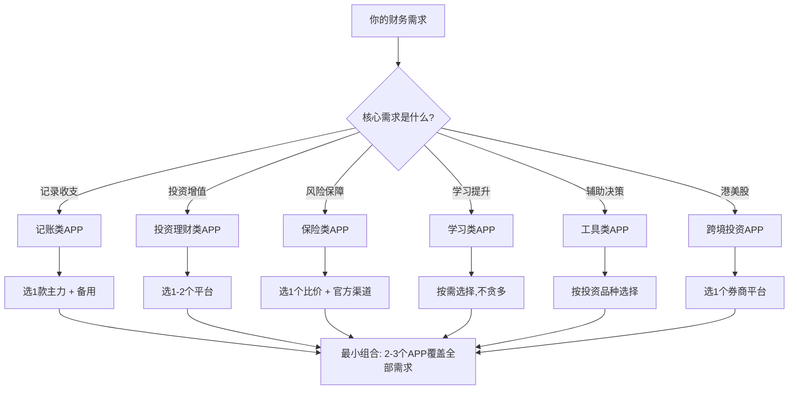
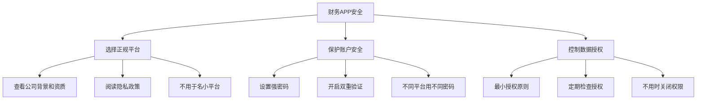

## 二、推荐APP

工欲善其事，必先利其器。财务管理的落地离不开趁手的工具——一款好的APP能让你把前文学到的预算、记账、投资、保险等知识真正融入日常生活。本节按功能场景分类，对主流APP做深度评测，并给出选择框架、数据迁移方案和安全指南，帮你找到最适合自己的工具组合。

### 2.0 选择APP的核心原则

在逐一看具体产品之前，先建立选型框架。很多人在APP选择上犯两个极端错误：要么什么都不用，全靠脑子记；要么装了十几个APP，每个都浅尝辄止。正确做法是**按需选型、最小组合**。

**选型四维度：**

| 维度 | 考察点 | 说明 |
|------|--------|------|
| 功能匹配 | 是否覆盖你的核心需求 | 不追求大而全，够用就好 |
| 使用成本 | 时间成本 + 金钱成本 | 免费但广告多 vs 付费但体验好 |
| 数据安全 | 隐私政策、数据加密、公司背景 | 涉及财务数据，安全是底线 |
| 生态互通 | 是否支持导入导出、与其他工具联动 | 避免数据孤岛，方便迁移 |

**选型前的三个自问：**

1. **我现在最需要解决什么问题？** 如果是"不知道钱花在哪里"→记账APP；如果是"有闲钱不知道怎么投"→投资APP；如果是"没有保险保障"→保险工具。不要同时开始所有事情。
2. **我愿意每天花多少时间？** 如果只能花2分钟→选极简记账APP；如果愿意花15分钟→选功能全面的系统。工具复杂度要匹配你的投入意愿。
3. **我的技术能力如何？** 纯小白选操作最简单的；有技术背景可以考虑自动化方案和自建仪表盘。

### 2.1 记账类APP

记账是财务管理的地基。一款好的记账APP应该让你**用最少的操作完成记录，用最直观的方式看到结果**。下面从入门到进阶逐级介绍。

#### 2.1.1 鲨鱼记账——入门首选

- **平台**：iOS / Android
- **定价**：基础免费，高级功能¥18/年
- **核心特点**：极简设计，3秒完成一笔记账

**为什么适合新手：**
鲨鱼记账的设计哲学是"能少一步就少一步"。打开APP直接进入记账界面，选分类→输金额→完成，整个过程不需要任何前置设置。它没有账本概念（或者说就一个默认账本），没有复杂的预算配置，适合刚接触记账、还没想好怎么管理的新手。

**主要功能：**

| 功能 | 说明 | 免费/付费 |
|------|------|-----------|
| 快速记账 | 3步完成，支持数字键盘直接输入 | 免费 |
| 分类管理 | 预设30+分类，支持自定义 | 免费 |
| 图表分析 | 饼图、柱状图、趋势图 | 免费 |
| 预算设置 | 按月设置总预算和分类预算 | 付费 |
| 多账本 | 支持创建多个账本 | 付费 |
| 数据导出 | 导出Excel表格 | 付费 |
| 提醒记账 | 每日定时提醒 | 免费 |

**实操建议：**
- 刚开始只用最基础的记账+图表功能，坚持2周形成习惯
- 分类不要自定义太多，用默认的就够，后期再调整
- 养成"消费后立刻记"的习惯，不要攒到晚上一起补
- 善用"备注"字段记录消费场景（如"和同事聚餐"），月末回顾时能发现消费模式

**局限性：**
- 不支持银行账单自动导入，所有账目需要手动输入
- 高级分析功能（如净资产追踪、投资记录）缺失
- 数据迁移不方便，如果后期想换APP，历史数据可能丢失
- 无Web端，只能在手机上操作

#### 2.1.2 随手记——功能最全面

- **平台**：iOS / Android / Web
- **定价**：基础免费，VIP ¥198/年
- **核心特点**：功能覆盖记账全场景，从日常消费到投资管理

**为什么功能最全：**
随手记是国内最早的记账APP之一（2010年上线），经过多年迭代，功能覆盖面极广。它不仅仅是一个记账工具，更像是一个个人财务管理系统——支持多账本、多账户、预算管理、报表分析、投资记录、信用卡管理，甚至家庭共享账本。

**核心功能深度解析：**

**（1）多账本体系**
随手记支持创建多个独立账本，比如：
- 日常账本：记录日常收支
- 旅行账本：单独记录旅行花销
- 副业账本：记录兼职/自由职业收支
- 家庭账本：与家人共享

每个账本有独立的分类体系和报表，互不干扰。这对于有多场景记账需求的用户非常实用。

**（2）预算管理**
支持按月设置总预算和分类预算，超支时会提醒。可以设置：
- 固定预算：每月固定金额
- 滚动预算：未用完的额度滚到下月
- 分类预算：餐饮¥2000、交通¥500、娱乐¥300等

**（3）报表分析**
随手记的报表是同类产品中最丰富的：
- 收支趋势图：按日/周/月/年查看
- 分类饼图：各分类占比
- 对比分析：本月vs上月、本季度vs上季度
- 净资产追踪：资产-负债的变动趋势
- 收支日历：日历视图查看每天花销

**（4）银行账单导入**
支持导入招商银行、工商银行等主流银行的信用卡账单，省去逐笔手动录入的麻烦。也支持微信、支付宝账单导入。

**实操流程——从零开始搭建随手记：**

第1步：下载注册，选择"个人记账"模式
第2步：设置账户（现金、银行卡、信用卡、支付宝、微信各建一个）
第3步：删除不需要的默认分类，保留你用到的（建议15-20个）
第4步：设置本月预算（先按感觉设，后面根据数据调整）
第5步：每天记账，坚持1个月
第6步：月末看报表，分析消费结构
第7步：根据分析结果调整下月预算

**缺点：**
- 功能太多反而让新手不知所措，界面略显杂乱
- 社区内容质量参差不齐，有些"理财大师"的内容不可靠
- 免费版有广告，VIP价格偏高
- 部分高级功能（如多账本同步）需要VIP

**适合人群：** 希望深度管理个人财务、有多账本需求、愿意花时间学习的用户。

#### 2.1.3 叨叨记账——让记账不再枯燥

- **平台**：iOS / Android
- **定价**：基础免费，高级角色付费
- **核心特点**：AI角色互动记账，用聊天的方式记账

**创新机制：**
叨叨记账的核心卖点是"AI陪伴"。你可以设置一个AI角色（虚拟男友/女友、二次元角色、明星等），每次记账时AI会根据你的消费给出有趣的回复。比如你记了一笔"奶茶 ¥15"，AI可能回复"又喝奶茶！今天已经是第三杯了哦～"。

**为什么能帮助坚持记账：**
记账最大的敌人是"坚持不下去"。传统记账APP的体验是：消费→掏手机→打开APP→选分类→输金额→保存。这个过程机械且无聊。叨叨记账通过社交反馈机制，把记账变成了一种互动，降低了心理负担。行为经济学中的"即时反馈"原理在此得到应用——每一次互动都是一次正向激励。

**功能评估：**

| 功能 | 完整度 | 说明 |
|------|--------|------|
| 基础记账 | ★★★★ | 操作流畅，分类清晰 |
| 图表分析 | ★★★ | 基础图表，够用但不丰富 |
| 预算管理 | ★★ | 功能较简单 |
| 多账本 | ★★ | 支持但不够灵活 |
| 数据导出 | ★★ | 支持但格式有限 |
| 趣味互动 | ★★★★★ | 核心卖点，体验最好 |

**适合人群：** 试过传统记账但总是坚持不下来的用户，尤其是年轻人。把它当作"养成记账习惯的过渡工具"——先用叨叨记账建立习惯（1-3个月），等习惯稳定后可以考虑迁移到功能更全的APP。

#### 2.1.4 Money Pro——跨平台专业之选

- **平台**：iOS / Android / Mac / Windows
- **定价**：买断制，iOS ¥68，桌面端 ¥128
- **核心特点**：跨平台同步、专业预算管理、账单提醒

**核心优势：**
Money Pro的最大卖点是**真正的跨平台同步**——手机、平板、电脑之间的数据实时同步，且UI设计在各平台上都保持一致。这对于同时用手机和电脑管理财务的用户来说非常方便。

**独特功能：**
- **日历视图**：在日历上直接查看每天的收支和待付账单，一目了然
- **账单提醒**：设置定期账单（房租、水电、信用卡还款），到期自动提醒
- **多币种支持**：内置汇率转换，适合有海外消费或外币账户的用户
- **预算轮转**：支持按月/季/年设置预算，未用完的额度可自动结转

**适合人群：** 有多设备同步需求、需要账单提醒、有外币账户的用户。买断制的定价模式也比订阅制更划算（长期使用的话）。

#### 2.1.5 微信/支付宝小程序记账——零安装方案

对于不想额外安装APP的用户，微信和支付宝生态内有多个轻量级记账小程序，打开即用、关闭即走。

**推荐小程序：**

| 小程序 | 平台 | 特点 | 适合场景 |
|--------|------|------|----------|
| 微信记账本 | 微信 | 自动同步微信支付记录 | 微信支付为主用户 |
| 钱迹 | 微信/支付宝 | 极简记账，无广告 | 追求干净体验 |
| 叨叨记账小程序 | 微信 | 与APP功能一致 | 不想装APP的叨叨用户 |
| 蚂蚁账本 | 支付宝 | 自动同步支付宝消费 | 支付宝为主用户 |

**微信记账本实操：**
微信搜索"微信记账本"小程序 → 授权微信支付数据 → 自动导入所有微信支付记录 → 手动补充现金消费 → 查看月度报表。

**优势**：零安装、自动同步微信/支付宝支付数据、不占手机空间。
**局限**：功能较基础，无法管理非电子支付的消费，数据导出能力弱。

**适合人群**：以微信/支付宝为主要支付方式、只想做简单记账、不愿安装额外APP的用户。可以作为主力记账的辅助——电子支付自动记录，只手动补录现金消费。

#### 2.1.6 记账APP对比总结

| 对比维度 | 鲨鱼记账 | 随手记 | 叨叨记账 | Money Pro | 微信小程序 |
|----------|----------|--------|----------|-----------|------------|
| 上手难度 | ★☆☆☆☆ | ★★★☆☆ | ★★☆☆☆ | ★★★☆☆ | ★☆☆☆☆ |
| 功能丰富度 | ★★☆☆☆ | ★★★★★ | ★★★☆☆ | ★★★★☆ | ★★☆☆☆ |
| 报表分析 | ★★★☆☆ | ★★★★★ | ★★☆☆☆ | ★★★★☆ | ★★☆☆☆ |
| 趣味性 | ★★☆☆☆ | ★★☆☆☆ | ★★★★★ | ★★☆☆☆ | ★☆☆☆☆ |
| 数据安全 | ★★★☆☆ | ★★★★☆ | ★★★☆☆ | ★★★★☆ | ★★★★☆ |
| 免费可用度 | ★★★★☆ | ★★★☆☆ | ★★★★☆ | ★☆☆☆☆ | ★★★★★ |
| 跨平台 | ★★☆☆☆ | ★★★★☆ | ★★☆☆☆ | ★★★★★ | ★★★★☆ |
| 银行导入 | ✗ | ✓ | ✗ | ✓ | 部分 |
| 适合阶段 | 入门 | 入门→精通 | 习惯养成 | 进阶 | 轻量辅助 |

**我的建议路径：** 鲨鱼记账（入门）→ 随手记（进阶）或 Money Pro（跨平台需求）。如果你连记账都坚持不下来，先用叨叨记账过渡。如果你的消费90%通过微信/支付宝完成，小程序方案也能覆盖基本需求。

### 2.2 投资理财类APP

投资理财类APP的核心价值是**让你以最低成本、最高效率完成投资操作**。选择时重点关注三点：费率、产品丰富度、数据工具。

#### 2.2.1 支付宝（蚂蚁财富）——基金定投首选

- **平台**：iOS / Android
- **费率**：基金申购费通常打一折（0.12%-0.15%）
- **核心优势**：用户基数最大，操作最便捷

**为什么是基金定投首选：**
1. **费率低**：大部分基金申购费打一折，与天天基金持平
2. **操作便捷**：大部分人手机上已经装了支付宝，零学习成本
3. **定投功能完善**：支持智能定投（高位少投、低位多投）、目标投（达到目标收益自动止盈）
4. **余额宝衔接**：闲置资金自动放入余额宝赚收益，需要投资时秒转

**实操——在支付宝设置基金定投：**

第1步：打开支付宝 → 理财 → 基金
第2步：搜索你选定的基金（如沪深300指数基金）
第3步：点击"定投" → 设置金额和周期（建议周定投，每周一/四）
第4步：选择"智能定投"模式（可选，系统会根据市场估值调整金额）
第5步：确认并开启
第6步：设置完毕后不要频繁查看，按计划执行即可

**注意事项：**
- 支付宝首页的"推荐基金"、"热销基金"不要盲目跟买，这些往往是近期涨幅大的基金，追高风险大
- 基金讨论区的"大V"观点参考价值有限，投资决策要基于自己的研究
- 赎回到账时间：货币基金T+0，股票基金T+3到T+7
- 余额宝本质是货币基金，7日年化收益率通常在1.5%-2.5%之间，仅适合短期闲置资金，不应作为主要投资渠道

#### 2.2.2 天天基金——深度研究首选

- **平台**：iOS / Android / Web
- **费率**：申购费打一折，部分基金费率更低
- **核心优势**：基金数据最全，筛选和分析工具最专业

**为什么适合深度研究：**
天天基金是东方财富旗下的基金销售平台，背靠东方财富的金融数据能力，在基金信息的全面性和专业性上是同类产品中最强的。

**核心工具：**

**（1）基金筛选器**
可以按以下维度筛选基金：
- 基金类型：股票型、混合型、债券型、指数型、QDII等
- 业绩排名：近1月/3月/6月/1年/3年/5年
- 基金规模：建议选2亿-100亿之间
- 基金经理任职年限：建议选3年以上
- 评级：晨星评级、海通评级
- 费率：管理费、托管费、申购费

**（2）基金对比**
最多选5只基金进行多维度对比，包括：
- 历史收益（各时间段）
- 最大回撤
- 夏普比率
- 持仓集中度
- 基金经理风格

**（3）基金诊断**
输入基金代码，系统会给出综合评分和分析报告，包括收益能力、抗风险能力、性价比等维度。

**（4）天天基金APP特有的实操技巧：**
- 使用"基金PK"功能对比同类基金，选出性价比最高的
- 关注"基金经理"页面，查看经理的投资风格、历史业绩、管理规模
- 利用"定投计算器"模拟不同定投策略的历史收益
- Web端的"Choice数据"功能更强大，适合深度研究

**适合人群：** 有一定投资基础、喜欢自己研究基金、需要专业数据工具的投资者。建议与支付宝配合使用——在天天基金做研究，在支付宝做定投执行。

#### 2.2.3 蛋卷基金——社区策略首选

- **平台**：iOS / Android
- **费率**：申购费打一折
- **核心优势**：雪球社区生态，基金组合产品丰富

**独特价值：**
蛋卷基金是雪球旗下的基金销售平台，最大特色是**基金组合**（也叫"蛋卷斗牛"系列）。你可以直接跟投由专业投资者创建的基金组合，省去自己选基金的麻烦。

**基金组合示例：**
- 二八轮动组合：80%股票基金+20%债券基金，根据市场趋势动态调整
- 蛋卷安睡全天候：全球资产配置，追求稳健收益
- 各类行业主题组合：消费、科技、医药等

**注意事项：**
- 基金组合不等于"稳赚"，历史业绩不代表未来收益
- 跟投前要理解组合的投资逻辑，不要盲目抄作业
- 组合调仓有时间差，实际收益可能与展示收益有差异
- 蛋卷基金的组合费率通常为0，但底层基金本身仍有管理费

**适合人群：** 希望参考专业投资者策略、对基金组合感兴趣的用户。

#### 2.2.4 且慢——投顾服务首选

- **平台**：iOS / Android
- **费率**：投顾费0.5%-1%/年（在基金费率基础上额外收取）
- **核心优势**：专业的基金投顾服务，有"跟投"和"自动驾驶"两种模式

**什么是基金投顾：**
基金投顾是持牌机构提供的"帮你买基金"服务。与普通基金销售不同，投顾机构会根据你的风险偏好和投资目标，为你定制基金组合，并持续管理和调仓。2019年证监会开放基金投顾试点以来，且慢是做得最好的平台之一。

**且慢的核心产品：**
- **长钱账户**：适合长期投资（3年以上），根据你的风险评估自动配置股债比例
- **稳钱账户**：适合中期理财（1-3年），追求稳健收益
- **活钱管理**：适合短期闲钱（1年以内），对接货币基金组合

**基金投顾 vs 自己买基金的区别：**

| 维度 | 自己买基金 | 基金投顾（且慢） |
|------|-----------|-----------------|
| 选基金 | 自己研究选择 | 专业团队帮你选 |
| 调仓 | 自己决定何时调 | 系统自动调仓 |
| 费用 | 只有基金费率 | 基金费率 + 投顾费 |
| 适合人群 | 有研究能力和时间 | 不想花时间研究 |
| 心理负担 | 需要自己做决策 | 交给专业团队 |

**适合人群：** 不想自己选基金、愿意支付一定投顾费换取专业管理的用户。尤其适合"知道应该投资但不知道怎么投"的人。

#### 2.2.5 有知有行——投资理念与实践一体化

- **平台**：iOS / Android
- **定价**：免费
- **核心优势**：投资教育 + 记账 + 组合跟踪一体化，强调"先学习再投资"

**为什么值得单独推荐：**
有知有行不只是一个投资工具，更是一套投资教育体系。它的核心理念是"投资之前先搞懂"，通过系统化的课程帮你建立正确的投资认知，再用实操工具帮你落地。这与本书"道法术器贯通"的理念完全一致。

**核心功能：**
- **投资第一课**：免费的系统化投资入门课程，覆盖资产配置、指数基金、长期投资等核心主题
- **记账功能**：自动记录投资操作，追踪持仓成本和收益
- **投资组合**：记录你在各平台的投资持仓，汇总查看整体资产配置
- **市场温度计**：用估值指标告诉你当前市场是偏贵还是偏便宜
- **有知有行周报**：每周的投资思考和市场分析

**与其他投资APP的区别：**
支付宝/天天基金是"买基金的地方"，有知有行是"学投资的地方+跟踪投资的地方"。它不直接卖基金（但可以跳转到合作平台购买），所以推荐内容更客观。建议把有知有行作为投资认知的起点，把支付宝/天天基金作为执行的终点。

**适合人群：** 投资新手、希望系统学习投资理念的用户、已经在投资但想统一管理各平台持仓的用户。

#### 2.2.6 港美股投资工具——跨境投资入门

随着中国投资者对全球资产配置需求的增长，港美股投资工具也成为值得关注的品类。

**主流港美股券商对比：**

| 券商 | 平台 | 佣金 | 开户门槛 | 特点 |
|------|------|------|----------|------|
| 富途牛牛 | iOS/Android/Web | 港股0.03%，美股$0.005/股 | 港股最低入金2万港币 | 界面美观，社区活跃，港股体验最好 |
| 老虎证券 | iOS/Android/Web | 港股0.03%，美股$0.005/股 | 无最低入金要求 | 打新中签率相对较高 |
| 长桥证券 | iOS/Android/Web | 港股0.03%，美股$0.005/股 | 无最低入金要求 | 费率有竞争力，新用户免佣活动多 |

**港美股投资注意事项：**
- **入金渠道**：需要通过境外银行卡入金，大陆银行直接汇款可能被退回。常见方式是办理香港银行卡（如中银香港、招商永隆）或使用跨境汇款服务
- **汇率风险**：港币/美元汇率波动会影响你的实际收益
- **税务问题**：美股分红需缴纳10%股息税（中美税收协定税率），港股无资本利得税
- **交易时间**：美股交易时间为北京时间21:30-次日4:00（夏令时），需要适应夜间交易节奏
- **信息获取**：港美股的财报、研报主要为英文，需要一定的英语阅读能力

**适合人群：** 有一定投资经验、希望配置海外资产、能接受较高复杂度的投资者。新手建议先把A股和基金搞明白，再考虑港美股。

#### 2.2.7 投资理财APP对比总结

| 对比维度 | 支付宝 | 天天基金 | 蛋卷基金 | 且慢 | 有知有行 |
|----------|--------|----------|----------|------|----------|
| 基金数量 | ★★★★★ | ★★★★★ | ★★★★ | ★★★ | ★★★ |
| 费率 | ★★★★ | ★★★★ | ★★★★ | ★★★ | ★★★★ |
| 定投功能 | ★★★★★ | ★★★★ | ★★★ | ★★★★ | ★★ |
| 数据工具 | ★★★ | ★★★★★ | ★★★★ | ★★★ | ★★★★ |
| 社区生态 | ★★★ | ★★★ | ★★★★★ | ★★★ | ★★★★ |
| 投顾服务 | ★★★ | ★★ | ★★★ | ★★★★★ | ★★ |
| 新手友好 | ★★★★★ | ★★★ | ★★★★ | ★★★★ | ★★★★★ |
| 投资教育 | ★★ | ★★ | ★★★ | ★★★ | ★★★★★ |
| 适合场景 | 日常定投 | 深度研究 | 跟投策略 | 专业投顾 | 学习+跟踪 |

### 2.3 保险类APP

保险购买不同于投资——它更依赖信息对称和产品对比。以下工具帮你建立保险认知、做出理性选择。

#### 2.3.1 深蓝保——保险测评首选

- **平台**：微信公众号 / 小程序 / APP
- **核心优势**：测评内容最专业、最客观，产品推荐有理据

**为什么推荐深蓝保：**
深蓝保是国内最大的保险测评自媒体之一，团队有精算师背景。他们的内容特点是：
1. **测评客观**：不代理任何保险公司的产品，评测不受利益影响
2. **内容深入**：不仅告诉你"买什么"，还解释"为什么买这个"
3. **更新及时**：新产品上市后通常1-2周内出测评
4. **理赔案例**：分享真实理赔案例，帮你理解保险的实际运作

**使用方法：**
- 关注微信公众号，阅读保险知识科普系列（建议先看"保险入门"和"四大险种"）
- 使用小程序的"保险方案定制"功能，输入年龄、预算，获得推荐方案
- 购买前用"产品对比"功能比较2-3款同类产品
- 关注"理赔实录"栏目，了解保险在实际场景中的运作方式

#### 2.3.2 蜗牛保险——学习+比价一站式

- **平台**：APP / 微信公众号
- **核心优势**：知识科普+产品比价+在线咨询三合一

**核心功能：**
- **保险课堂**：从零基础到进阶的系列课程，图文+视频结合
- **产品对比**：支持多款产品同时对比，展示保障范围、价格、免责条款等关键信息
- **在线咨询**：有持牌顾问提供免费咨询（注意：顾问可能会推荐产品，保持独立判断）
- **智能核保**：输入健康状况，系统会告诉你哪些产品可以投保

#### 2.3.3 蚂蚁保——购买执行首选

- **平台**：支付宝内置
- **核心优势**：操作最便捷，理赔流程最简单

**使用场景：**
当你通过深蓝保或蜗牛保险做好研究、选定产品后，如果该产品在蚂蚁保有售，建议在蚂蚁保购买，原因：
1. 支付宝账户体系，购买流程极简
2. 理赔时直接在支付宝提交，审核快
3. 保费扣款方便，支持自动续保

**蚂蚁保的"金选"标签：**
蚂蚁保会对平台上的产品打"金选"标签，表示经过平台筛选推荐。但"金选"≠"最适合你"，购买前仍需根据自身需求判断。

#### 2.3.4 保险类APP使用策略

正确的保险购买流程：

学习阶段（1-2周）
  ├── 深蓝保：阅读保险科普文章，建立基础认知
  └── 蜗牛保险：看入门课程，了解四大险种

研究阶段（3-5天）
  ├── 深蓝保：看具体险种的产品测评
  ├── 蜗牛保险：用产品对比功能比较候选产品
  └── 蚂蚁保：查看平台上有哪些可选产品

决策阶段（1-2天）
  ├── 确定保障方案（险种+保额+产品）
  ├── 如有健康异常，用智能核保功能确认可投保性
  └── 最终对比价格和条款

购买阶段
  └── 蚂蚁保/保险公司官网/保险经纪人渠道购买

注意：不要在保险APP的推荐页面直接购买，
先做好研究再行动。

### 2.4 学习类APP

财务管理能力的提升需要持续学习。以下资源覆盖从入门到进阶的各个阶段。

#### 2.4.1 得到——系统学习首选

- **平台**：iOS / Android
- **定价**：课程单独购买，¥29.9-¥399不等
- **核心优势**：内容质量高、体系化强、适合碎片时间学习

**推荐课程：**

| 课程 | 作者 | 价格 | 适合阶段 | 核心内容 |
|------|------|------|----------|----------|
| 《香帅的北大金融学课》 | 香帅（唐涯） | ¥199 | 入门→进阶 | 系统学习金融知识，从货币到投资 |
| 《张潇雨·个人投资课》 | 张潇雨 | ¥129 | 入门 | 个人投资实战方法论 |
| 《何帆·中国经济报告》 | 何帆 | ¥199 | 进阶 | 理解宏观经济，辅助投资决策 |
| 《刘润·5分钟商学院》 | 刘润 | ¥199 | 入门→进阶 | 商业思维，有助于理解投资标的 |
| 《吴军·信息论40讲》 | 吴军 | ¥199 | 进阶 | 用信息论思维理解投资和决策 |

**使用建议：**
- 不要一次性买太多课程，先买1门跟完再买下一门
- 通勤时间听音频版，重要章节看文字版加深理解
- 每门课做笔记，用自己的话总结核心观点
- 得到的"每天听本书"功能可以用很低成本快速了解一本财经书籍的核心观点，但不能替代深度阅读

#### 2.4.2 小宇宙——财经播客精选

- **平台**：iOS / Android
- **定价**：免费
- **核心优势**：高质量的中文财经播客聚合平台

**推荐播客：**

| 播客 | 风格 | 更新频率 | 推荐理由 |
|------|------|----------|----------|
| 《知行小酒馆》 | 轻松实用 | 每周2-3期 | 有知有行出品，投资知识+生活理财 |
| 《半拿铁》 | 深度叙事 | 每周1期 | 商业和财经故事，提升财商 |
| 《起朱楼宴宾客》 | 专业分析 | 每周1-2期 | 宏观经济和市场分析 |
| 《面基》 | 对话访谈 | 每周1期 | 采访各行各业的理财实践者 |
| 《投资奇葩说》 | 轻松辩论 | 每周1期 | 投资观点碰撞，启发思考 |
| 《保持通话》 | 保险+理财 | 每周1期 | 保险知识科普，接地气 |

**使用建议：**
- 通勤、做家务、运动时听，充分利用碎片时间
- 不需要每期都听，根据标题选感兴趣的
- 听到好的观点记下来，纳入自己的知识体系
- 小宇宙支持创建播客列表，可以把财经类播客单独分组

#### 2.4.3 B站——免费视频学习

- **平台**：iOS / Android / Web
- **定价**：免费
- **核心优势**：内容丰富、形式直观、社区互动性强

**推荐UP主：**

| UP主 | 内容方向 | 特点 |
|------|----------|------|
| 也谈钱 | 记账和储蓄实践 | 真实的记账分享，操作性强 |
| 小Lin说 | 金融知识科普 | 专业背景（前华尔街），讲解清晰 |
| 巫师财经 | 商业案例分析 | 深度商业故事，提升商业思维 |
| 温义飞的急救财经 | 财经热点解读 | 跟踪热点事件，理解市场逻辑 |
| 国富研究所 | 经济学原理 | 用经济学思维理解日常现象 |

**使用建议：**
- B站的内容质量参差不齐，关注几个靠谱的UP主即可
- 警惕"教你炒股""月入十万"类标题党内容
- 弹幕和评论区可以看，但不要被情绪化的言论影响判断
- 善用B站的收藏功能，把优质视频整理成"学习清单"

#### 2.4.4 其他值得推荐的学习资源

**微信公众号：**
- 有知有行（投资理念和方法论）
- 三折人生（用漫画讲金融知识）
- 也谈钱（个人理财实践）
- 银行螺丝钉（指数基金定投实操）

**书籍（配合APP使用效果更好）：**
- 《小狗钱钱》——理财入门，通俗易读，适合零基础
- 《指数基金投资指南》——基金定投实操，手把手教你
- 《穷查理宝典》——投资哲学和思维方式，进阶必读
- 《漫步华尔街》——投资理论经典，理解市场有效性
- 《有钱人和你想的不一样》——财富思维转变，改变金钱观念

### 2.5 工具类APP

工具类APP不直接参与投资操作，但能帮你获取信息、辅助决策。

#### 2.5.1 雪球——投资者社区

- **平台**：iOS / Android / Web
- **定价**：免费
- **核心功能**：投资者社区 + 行情数据 + 模拟组合

**使用方法：**
- **看行情**：查看A股、港股、美股的实时行情和K线图
- **读分析**：关注优质投资者的分析文章（注意辨别质量）
- **模拟盘**：用虚拟资金练习投资策略，零风险试错
- **自选股**：建立自选股列表，跟踪关注的标的

**注意事项：**
雪球社区的内容质量差异极大，有专业投资者的深度分析，也有散户的情绪宣泄。建议：
- 关注粉丝1万以上、持续输出优质内容的用户
- 不要被"XX股票翻倍""牛市来了"等标题吸引
- 独立思考，社区观点仅作参考
- 雪球的"组合"功能可以跟踪关注的投资者的实际持仓和调仓记录，比纯文字分析更有参考价值

#### 2.5.2 天眼查/企查查——企业信息查询

- **平台**：iOS / Android / Web
- **定价**：基础免费，高级功能付费
- **核心功能**：查询企业工商信息、股东结构、法律诉讼、经营风险

**投资场景使用：**
- **买股票前**：查看公司的股东结构、关联企业、诉讼记录
- **买基金前**：查看基金公司的规模、历史、合规情况
- **买理财产品前**：查看发行机构的资质和信用
- **防骗**：遇到"高收益理财"时，先查一下公司背景

**天眼查 vs 企查查：**
两者功能高度重叠，选一个用就行。天眼查的免费功能稍多一些，企查查的数据更新速度稍快一些。

#### 2.5.3 同花顺/东方财富——股票行情和交易

- **平台**：iOS / Android / Web / PC
- **定价**：免费（交易佣金由券商收取）
- **核心功能**：股票行情、K线图、财务数据、交易接口

**适用说明：**
这两个APP主要面向股票投资者。如果你的投资策略是基金定投（本书推荐的入门策略），暂时不需要用到。等你对投资有了深入理解、准备自己选个股时，再考虑使用。

**同花顺 vs 东方财富：**
- 同花顺：行情数据更全，技术分析工具更强，适合技术派
- 东方财富：资讯内容更丰富，社区活跃度高，适合基本面分析

#### 2.5.4 信用卡管理工具

如果你有多张信用卡，管理还款日期、额度、优惠活动是件麻烦事。以下工具可以帮你：

| 工具 | 平台 | 功能 |
|------|------|------|
| 卡牛 | iOS/Android | 自动解析信用卡账单邮件，汇总多张卡的账单和还款日 |
| 51信用卡管家 | iOS/Android | 账单管理+还款提醒+信用报告查询 |
| 随手记（信用卡模块） | iOS/Android/Web | 在记账的同时管理信用卡账单 |

**信用卡管理的最佳实践：**
- 设置每张卡的还款日提醒，避免逾期（逾期会上征信）
- 利用不同信用卡的优惠日（如招行周三半价、交行最红星期五）
- 控制信用卡使用总额度不超过月收入的50%
- 设置自动还款（全额还款），避免忘记还款产生利息

#### 2.5.5 其他实用工具

| 工具 | 用途 | 场景 |
|------|------|------|
| 中国人民银行征信中心 | 查询个人信用报告 | 贷款前了解自己的信用状况 |
| 个税APP | 个人所得税申报和查询 | 年度汇算清缴、专项扣除填报 |
| 计算器APP | 复利计算、房贷计算 | 投资收益测算、贷款比较 |
| Excel/WPS表格 | 自定义财务分析 | 建立个人资产负债表、投资追踪表 |
| 国家企业信用信息公示系统 | 查询企业注册信息 | 验证企业真实性，免费官方渠道 |

### 2.6 隐私与安全指南

涉及财务数据的APP，安全是第一优先级。以下是必须注意的安全要点。

#### 2.6.1 数据安全基本原则

#### 2.6.2 具体安全操作清单

**安装前：**
- 只从官方应用商店下载（App Store、Google Play、华为应用市场等）
- 查看APP的下载量、评分、评论，避免下载山寨版
- 检查APP要求的权限是否合理（记账APP不需要通讯录权限）

**使用中：**
- 设置独立的登录密码，不要与其他账号共用
- 开启指纹/面容识别登录
- 开启双重验证（短信验证码/身份验证器）
- 不要在公共WiFi下进行涉及资金的操作
- 定期检查账户的登录记录和设备列表

**数据管理：**
- 定期导出数据备份（大多数APP支持导出Excel/CSV）
- 不要将财务数据截图发送给他人
- 如果停用某个APP，先导出数据再注销账号

#### 2.6.3 常见安全陷阱

| 陷阱 | 表现 | 正确做法 |
|------|------|----------|
| 高收益诱导 | APP内推荐"年化收益20%+"的理财产品 | 超过6%的收益就要警惕，超过10%基本是骗局 |
| 过度授权 | 要求通讯录、相册、位置等无关权限 | 拒绝或选择"仅在使用时允许" |
| 钓鱼链接 | 收到"账户异常"短信，要求点击链接 | 不点击，直接打开APP查看 |
| 虚假客服 | 冒充客服要求提供验证码 | 官方客服绝不会索要验证码 |
| 套路贷款 | 以"免费体验"名义诱导借贷 | 仔细阅读条款，不签不明协议 |
| 杀猪盘 | 通过社交软件推荐"内幕消息"或"稳赚策略" | 任何承诺稳赚的都是骗局 |

### 2.7 进阶：构建个人财务工具体系

当你对财务管理有了系统认知后，可以构建一套适合自己的工具组合。

#### 2.7.1 最小可行工具组合

对于大多数人，以下3个APP就能覆盖核心需求：

基础组合（适合90%的人）：
├── 记账：随手记 或 鲨鱼记账（选一个）
├── 投资：支付宝（基金定投）
└── 学习：小宇宙（财经播客）或 得到（系统课程）

进阶组合（适合有一定投资经验的人）：
├── 记账：随手记
├── 投资研究：天天基金
├── 投资执行：支付宝
├── 投资跟踪：有知有行
├── 保险：深蓝保（研究）+ 蚂蚁保（购买）
├── 学习：得到 + 小宇宙
└── 工具：雪球 + 天眼查

全栈组合（适合深度管理财务的人）：
├── 记账：随手记（日常）+ Money Pro（跨平台）
├── 投资研究：天天基金 + 有知有行
├── 投资执行：支付宝 + 券商APP（股票）
├── 投资跟踪：有知有行（汇总各平台持仓）
├── 保险：深蓝保 + 蜗牛保险 + 蚂蚁保
├── 学习：得到 + 小宇宙 + B站
├── 工具：雪球 + 天眼查 + 同花顺
└── 信用卡管理：卡牛

#### 2.7.2 数据打通与自动化

当你使用多个APP时，数据孤岛是个真实痛点。以下是三个层级的解决方案，从简单到复杂逐步升级。

**（1）手动打通：月末汇总法（适合所有人）**

每月末花30分钟，用一张Excel表汇总各平台数据：

个人月度财务汇总表模板：
┌─────────────┬──────────┬──────────┬──────────┐
│ 类别         │ 本月金额  │ 上月金额  │ 变动趋势  │
├─────────────┼──────────┼──────────┼──────────┤
│ 总收入       │ ¥15,000  │ ¥15,000  │ →        │
│ 总支出       │ ¥8,500   │ ¥9,200   │ ↓        │
│ 储蓄率       │ 43.3%    │ 38.7%    │ ↑        │
│ 基金持仓     │ ¥50,000  │ ¥48,000  │ ↑        │
│ 基金本月收益  │ +¥2,000  │ +¥1,500  │ ↑        │
│ 保险年缴保费  │ ¥6,000   │ ¥6,000   │ →        │
│ 负债（房贷）  │ ¥800,000 │ ¥803,000 │ ↓        │
│ 净资产       │ ¥-20,000 │ ¥-25,000 │ ↑        │
└─────────────┴──────────┴──────────┴──────────┘

**（2）半自动化：善用导出功能（适合进阶用户）**

大部分APP支持导出CSV/Excel数据。具体操作：
- **随手记**：设置 → 数据管理 → 导出数据 → 选择时间范围和账本
- **支付宝**：账单页面 → 导出账单 → 发送到邮箱
- **天天基金**：交易记录 → 导出
- **微信支付**：钱包 → 账单 → 导出账单

导出后用Excel或Google Sheets建立一个"个人财务仪表盘"，每月导入一次数据，用数据透视表自动生成图表。

**（3）进阶方案：个人财务仪表盘（适合有技术背景的用户）**

如果你会一些基础编程或熟悉电子表格高级功能，可以构建自动化程度更高的方案：

**方案A：Google Sheets自动化**
- 用 `GOOGLEFINANCE("000300", "price")` 函数自动获取沪深300实时价格
- 用 `IMPORTRANGE` 函数从多个表格汇总数据
- 用条件格式自动标红超预算的分类
- 每月自动发送邮件汇总报告

**方案B：Notion财务管理看板**
- 建立"资产-负债-收入-支出"四个数据库
- 用关联和汇总功能自动计算净资产
- 用看板视图管理财务目标和里程碑
- 适合喜欢可视化管理的用户

**方案C：Python数据分析（适合开发者）**
- 用 `pandas` 读取各APP导出的CSV文件
- 用 `matplotlib` 生成自定义财务图表
- 用 `schedule` 库定时运行汇总脚本
- 可以对接银行API实现自动化数据采集（需要银行开放API支持）

#### 2.7.3 APP数据迁移指南

换记账APP是很多用户会遇到的问题。以下是通用的迁移流程：

**迁移前准备：**
1. 在旧APP中导出全部历史数据（CSV/Excel格式）
2. 确认新APP是否支持数据导入
3. 如果新APP不支持直接导入，准备手动迁移的方案

**支持数据导入的APP：**
- 随手记：支持导入CSV格式数据
- Money Pro：支持QIF/OFX格式导入
- 微信记账本：自动同步微信支付数据（无需导入）

**不支持数据导入时的替代方案：**
1. 在新APP中只记录新数据，旧数据保留在旧APP中（双APP并行一段时间）
2. 用Excel保存旧APP导出的历史数据，作为长期备份
3. 如果历史数据量不大（<500条），手动逐月录入关键月份的数据

**迁移注意事项：**
- 不要急于删除旧APP，至少保留3个月确认新APP运行正常
- 迁移后前2个月，检查新APP的分类体系是否合理，及时调整
- 导出的历史数据不仅是备份，还可以用来做长期消费趋势分析

### 2.8 常见误区

**误区1：装越多APP越好**
事实：APP太多反而增加管理成本。每个APP都需要花时间维护，分散注意力。选2-3个核心APP，用透比用广更重要。一个能坚持用的记账APP，比十个装了不用的APP有价值得多。

**误区2：只关注功能不关注安全**
事实：功能再好的APP，如果数据安全不过关就不该用。尤其是涉及银行账户、投资账户的APP，安全是底线。2022年某知名记账APP因安全漏洞导致用户数据泄露的事件就是前车之鉴。

**误区3：被APP内的推荐内容带偏**
事实：很多APP会推荐理财产品、基金、保险，这些推荐往往带有商业利益。APP推荐≠适合你，所有投资决策都应该基于自己的研究和判断。特别警惕APP内的"限时抢购""爆款推荐"等营销手段。

**误区4：只看免费不看成本**
事实：免费APP可能通过广告变现（浪费你的时间），或通过收集数据变现（牺牲你的隐私）。有时候付费买一个干净、专业的APP反而更划算。一个¥68的Money Pro买断，换来的是无广告、全功能、跨平台的体验，性价比远高于免费但满屏广告的替代品。

**误区5：频繁更换APP**
事实：记账APP最宝贵的是历史数据。频繁更换意味着数据分散在多个平台，无法进行长期趋势分析。选定一个主力APP，坚持使用至少6个月再考虑是否需要更换。更换时务必做好数据迁移（参见2.7.3节）。

**误区6：只在国内APP里选**
事实：如果你有海外消费、外币账户或港美股投资需求，国内APP可能无法满足。Money Pro等国际APP在多币种支持上有明显优势。选择APP时要考虑你的实际生活场景，不要被"国产"或"进口"的标签限制。

**误区7：忽视数据备份**
事实：APP可能下架、公司可能倒闭、手机可能丢失。如果不做数据备份，多年的记账数据可能一夜归零。建议至少每季度导出一次数据到本地存储，养成"数据主权"意识——你的数据应该在你自己手里有备份。

### 2.9 本节小结

| 场景 | 首选推荐 | 替代方案 | 核心理由 |
|------|----------|----------|----------|
| 入门记账 | 鲨鱼记账 | 叨叨记账 | 简单易上手 |
| 深度记账 | 随手记 | Money Pro | 功能全面 |
| 轻量记账 | 微信记账本 | 钱迹小程序 | 零安装，自动同步 |
| 基金定投 | 支付宝 | — | 便捷+低费率 |
| 基金研究 | 天天基金 | 蛋卷基金 | 数据工具强 |
| 投资学习 | 有知有行 | 得到 | 理念+实践一体化 |
| 专业投顾 | 且慢 | — | 持牌投顾服务 |
| 港美股 | 富途牛牛 | 老虎证券 | 体验好，社区活跃 |
| 保险学习 | 深蓝保 | 蜗牛保险 | 测评客观专业 |
| 保险购买 | 蚂蚁保 | 保险公司官网 | 便捷+理赔快 |
| 知识学习 | 得到 | B站 | 体系化+质量高 |
| 碎片学习 | 小宇宙 | — | 高质量播客 |
| 投资社区 | 雪球 | — | 内容丰富 |
| 企业查询 | 天眼查 | 企查查 | 防骗+辅助决策 |
| 信用卡管理 | 卡牛 | 51信用卡管家 | 多卡账单汇总 |

工具只是手段，不是目的。选好工具后，更重要的是坚持使用、持续学习、理性决策。下一节将讨论理财产品推荐，帮你了解各类金融产品的特点和选择标准。
