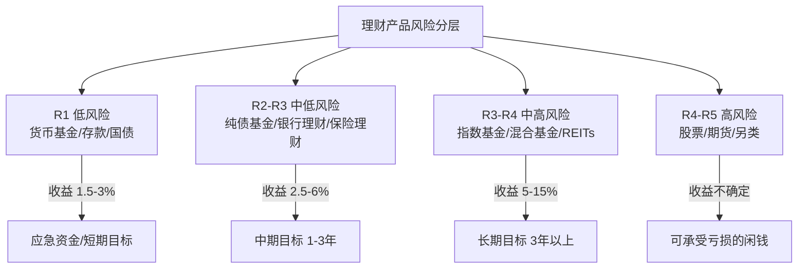
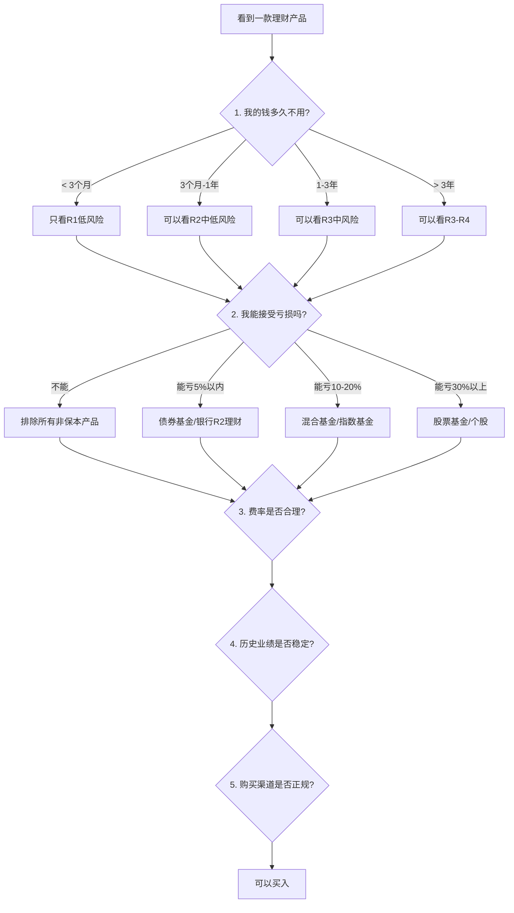

## 三、理财产品推荐

> 理论告诉你"为什么要投资"，本节告诉你"具体买什么、怎么买、买多少"。

上一章我们建立了资产配置的理论框架——知道了股债比例、风险分层、再平衡机制。但真正落地时，面对银行APP里上百款理财产品、基金平台上几千只基金，大多数人依然无从下手。本节的目标很明确：**把你从"知道该投资"带到"知道具体买哪个"**。

我们按风险等级从低到高逐层展开。每一层都会讲清楚三个问题：

1. **这类产品是什么**——底层资产、收益来源、风险来源
2. **怎么选**——关键指标、费率对比、筛选方法
3. **怎么买**——购买渠道、操作步骤、注意事项



---

### 3.1 低风险产品（R1-R2）：你的安全垫

低风险产品的核心功能不是"赚钱"，而是**保住本金、随时可用、跑赢活期**。在资产配置中，它们对应的是应急资金池和短期目标资金。

#### 3.1.1 货币基金

**什么是货币基金？**

货币基金主要投资于短期货币市场工具——国债、央行票据、银行存单、回购协议等，期限通常在1年以内。它的本质是"一群人把钱凑在一起，去银行谈一个更高的存款利率"。

**收益机制**：货币基金的收益来自两部分——债券利息和资本利得。因为投资标的期限极短、信用极高，所以亏损概率极低，但收益也不会高。2024-2025年主流货币基金年化收益在1.5%-2.5%之间，相比2013-2014年高峰期的5-7%已经大幅下降。

**核心产品对比**：

| 产品 | 对接基金 | 7日年化(2025参考) | 赎回规则 | 单日快取限额 | 适用场景 |
|------|---------|-------------------|---------|-------------|---------|
| 余额宝 | 天弘余额宝（多只可选） | 1.5-2.0% | T+0实时到账 | 1万元 | 支付宝生态内消费/转账 |
| 微信零钱通 | 华夏/嘉实等（可切换） | 1.5-2.0% | T+0实时到账 | 1万元 | 微信生态内消费/转账 |
| 银行T+0理财 | 各银行自研产品 | 2.0-3.0% | T+0或T+1 | 因行而异 | 不常用资金增值 |
| 天天基金活期宝 | 多只货基可选 | 1.6-2.2% | T+0快速赎回 | 1万元 | 基金投资者资金归集 |

**怎么选——三个关键指标**：

1. **7日年化收益率**：这是最直观的指标，但要注意它是一个"过去7天的平均值"，不代表未来收益。看的时候拉长到30日、90日年化更靠谱，避免被短期冲高的基金误导。
2. **万份收益**：每1万元每天实际赚多少。这个数字比7日年化更真实，因为它反映的是"今天实际到手多少钱"。
3. **基金规模**：规模在100亿-500亿之间的货币基金通常表现最稳定。太小（<50亿）的基金可能面临大额赎回冲击；太大（>2000亿）的基金在资产配置上可能受限。

**一个容易忽略的细节**：余额宝和零钱通都支持切换底层基金。如果你发现当前基金收益偏低，可以手动切换到收益更高的基金——操作路径是"余额宝→右上角详情→切换基金"，零钱通类似。切换当天没有收益，所以不要频繁切换，一个月检查一次就够了。

**常见误区**：

- **误区一**："余额宝收益太低，不值得放钱"。错。货币基金的价值不是高收益，而是"随取随用+略高于活期"。应急资金放这里是最佳选择，追求高收益应该用其他资金。
- **误区二**："把所有闲钱都放货币基金"。错。货币基金只能让你"不亏"，长期来看跑不赢通胀。超过6个月不需要用的钱，应该考虑债券基金或指数基金。
- **误区三**："7日年化3%的基金一定比2%的好"。不一定。短期冲高可能是因为基金经理卖出了部分债券兑现了浮盈，后续收益可能回落。看30日年化更靠谱。

#### 3.1.2 银行存款

银行存款是所有理财产品中**唯一受存款保险制度保护**的产品——同一银行同一存款人，50万以内全额赔付。这意味着即使银行倒闭，你的50万也是安全的。

**存款产品全景**：

| 类型 | 起存金额 | 1年期利率(2025参考) | 流动性 | 适合谁 |
|------|---------|-------------------|--------|--------|
| 活期存款 | 无 | 0.2% | 随时取 | 不建议大量存放 |
| 定期存款 | 50元 | 1.5-2.0% | 到期取，提前取按活期计 | 1年内确定不用的钱 |
| 大额存单 | 20万 | 2.0-2.5% | 可转让，提前支取靠档计息 | 有20万以上闲钱的人 |
| 结构性存款 | 1万起 | 1.5-4.0%（浮动） | 通常不可提前支取 | 能接受收益浮动的人 |
| 智能存款 | 因行而异 | 2.0-3.0% | 部分支持提前支取 | 中小银行用户 |

**定期存款的高级技巧——阶梯存款法**：

假设你有10万元，1年内可能需要用，但不确定什么时候。与其全部存活期（0.2%），不如用阶梯法：

```text
第1步：将10万分成4份，每份2.5万
第2步：分别存3个月、6个月、1年、2年定期
第3步：每份到期后，都续存为2年期定期
第4步：从第13个月开始，每个月都有一笔2年期存款到期

结果：随时有流动性，同时大部分资金享受2年期利率
```

**结构性存款的真实面目**：

结构性存款的收益由"固定部分+衍生品部分"组成。银行用你的利息去买一个期权，如果赌对了你拿高收益，赌错了只拿保底收益。

- 看清"预期收益率区间"：如果写的是1.5%-4%，1.5%是保底，4%是理想情况
- 看清"触发条件"：比如"挂钩黄金价格在1800-2000美元之间才能拿4%"——这个条件越苛刻，拿到高收益的概率越低
- 建议：**只买保底收益≥1.5%的结构性存款**，这样即使触发条件不满足，你的损失也仅是"没多赚"而不是"亏了"

**大额存单的购买技巧**：

大额存单利率由各银行自主定价，国有大行通常最低，股份制银行居中，城商行和农商行最高。同样是一年期大额存单，工商银行可能给1.8%，而某城商行可能给2.5%。差别不大？10万元存一年差700元，存十年复利差距更大。

**注意事项**：
- 确认银行参与了存款保险（正规银行门口会贴存款保险标识）
- 单家银行存款不超过50万（保险上限）
- 如果追求更高利率，可以在多家银行各存50万以内
- 大额存单可以在银行间市场转让，急需用钱时不必提前支取损失利息——转让价格通常比提前支取更划算

**互联网银行存款的特殊说明**：

微众银行、网商银行、百信银行等互联网银行通常提供比传统银行更高的存款利率（1年期可达2.5-3.0%）。它们同样受存款保险保护，50万以内安全。但需注意：
- 确认是"存款"而非"理财产品"——产品页面会标注"存款产品，受存款保险保护"
- 互联网银行存款通常只能通过其APP操作，没有线下网点
- 部分产品可能有"随存随取"的限制，实际是靠档计息而非活期利率

#### 3.1.3 国债

国债是**国家信用背书**的债券，在所有固定收益产品中信用等级最高。中国国债历史上从未违约，可以认为是"无风险资产"的代表。

**储蓄国债 vs 记账式国债**：

| 特性 | 储蓄国债（电子式） | 储蓄国债（凭证式） | 记账式国债 |
|------|------------------|------------------|-----------|
| 购买渠道 | 银行柜台/网银 | 银行柜台 | 证券账户 |
| 利息支付 | 按年付息 | 到期一次性付息 | 按半年付息 |
| 流动性 | 可提前兑取（扣部分利息） | 可提前兑取（扣部分利息） | 可在二级市场交易 |
| 收益水平(2025) | 3年约2.5%，5年约2.7% | 3年约2.5%，5年约2.7% | 随市场波动 |
| 适合谁 | 追求稳定收益的保守投资者 | 不急用资金的长期投资者 | 有证券账户的投资者 |

**购买储蓄国债的实操要点**：

1. **发行时间**：储蓄国债每年3-11月发行，通常在每月10日。具体日期关注财政部公告或各大银行APP通知。
2. **抢购策略**：热门期限（尤其是3年期）经常在发行当天就售罄。建议：发行前在银行APP上预约，发行日早上8:30准时操作，准备好资金。
3. **提前兑取规则**：持有不满6个月不计息；满6个月按票面利率计息但扣除一定天数。具体扣除标准以当期公告为准。所以，**6个月内可能用到的钱不要买国债**。
4. **电子式 vs 凭证式选择**：电子式国债利息每年打到银行账户，可以再投资产生复利效应；凭证式到期才付息，没有复利优势。金额较大时优先选电子式。

**记账式国债的投资策略**：

记账式国债在证券交易所交易，价格随市场利率变动——利率上升时价格下跌，利率下降时价格上涨。如果你想在国债上获得超额收益，需要对利率走势有判断能力。

简单策略：如果你认为未来利率会下降（经济下行周期），可以买入中长期记账式国债，享受价格上涨带来的资本利得。如果你不确定，储蓄国债更省心。

**国债逆回购——被忽视的短期理财工具**：

国债逆回购本质是"你把钱借给持有国债的机构，对方用国债做抵押"。它的特点是：
- 安全性极高（有国债抵押）
- 收益浮动（平时2-3%，季末/年末可能飙升到5-10%）
- 期限灵活（1天、2天、3天、4天、7天、14天、28天、91天、182天）
- 需要证券账户

操作方法：在证券APP中搜索"逆回购"，选择对应期限的产品，输入金额下单即可。**季末（3月、6月、9月、12月最后一周）和年末是做逆回购的最佳时机**，因为银行缺钱，利率会飙升。

#### 3.1.4 低风险产品配置建议

```text
应急资金（3-6个月生活费）的最优分配：

┌─────────────────────────────────────────────┐
│  1个月生活费 → 货币基金（余额宝/零钱通）       │
│  2-3个月生活费 → 银行T+0理财 或 短债基金       │
│  不确定是否需要的部分 → 定期存款（阶梯法）      │
│  有证券账户 → 季末国债逆回购（提升收益）        │
└─────────────────────────────────────────────┘
```

---

### 3.2 中低风险产品（R2-R3）：稳健增值的主力

当你的应急资金已经安排妥当，接下来需要的是**让钱在相对安全的前提下多赚一点**。中低风险产品就是这个角色——它们通常有小幅波动，但长期持有大概率获得高于存款的收益。

#### 3.2.1 纯债基金

纯债基金是**只投资债券、不投资股票**的基金。它的收益来源是债券利息+债券价格波动。因为不含股票，波动比混合基金小得多，但比货币基金大——短期内可能出现1-3%的回撤。

**纯债基金的分类与选择**：

| 类型 | 投资范围 | 年化收益(参考) | 最大回撤 | 持有建议 | 代表产品 |
|------|---------|---------------|---------|---------|---------|
| 短债基金 | 剩余期限<1年的债券 | 2-3.5% | 0.5%以内 | 1个月以上 | 嘉实超短债、易方达短债 |
| 中短期纯债 | 剩余期限1-3年 | 2.5-4.5% | 1-2% | 3个月以上 | 广发纯债债券、招商产业债券 |
| 中长期纯债 | 剩余期限3年以上 | 3-6% | 2-5% | 6个月以上 | 易方达增强回报债券、博时信用债券 |

**选基金的五个关键指标**：

1. **基金规模**：2亿-100亿之间最佳。低于2亿有清盘风险；规模过大，基金经理操作灵活性降低。
2. **成立时间**：至少3年以上，这样才有足够的历史业绩来评估。
3. **最大回撤**：过去3年最大回撤是多少？如果一个纯债基金最大回撤超过5%，你需要问自己"如果一个月亏5%我能不能扛住"。
4. **基金经理任职时间**：换手频繁的基金经理，业绩稳定性存疑。优先选择基金经理任职2年以上的产品。
5. **费率**：管理费+托管费+销售服务费合计超过0.6%的纯债基金偏贵。A类份额适合持有1年以上（申购费通常打1折后约0.06-0.08%），C类份额适合短期持有（无申购费但有销售服务费约0.2-0.4%/年）。

**A类还是C类？一个简单的判断方法**：

```text
持有时间 < 1年 → 选C类（省申购费）
持有时间 ≥ 1年 → 选A类（长期费率更低）

具体计算：
A类总费率 = 申购费(0.06%) + 管理费(0.3%) × 年数
C类总费率 = 销售服务费(0.3%) × 年数

持有1年：A = 0.36%，C = 0.3% → C略优
持有2年：A = 0.66%，C = 0.6% → 接近
持有3年：A = 0.96%，C = 0.9% → 接近
结论：纯债基金A/C类差别不大，持有1年以上选A即可
```

**纯债基金的信用风险——如何避免"踩雷"**：

纯债基金的风险不只是利率风险，还有信用风险——基金持有的债券可能违约。2020年以来，多只纯债基金因持有违约债券而出现单日暴跌。防范方法：

1. **看持仓集中度**：前五大债券持仓占比超过30%的基金，一旦某只债券违约，影响会很大。优选持仓分散的基金。
2. **看债券评级**：基金季报会披露前五大持仓债券的评级。优选以AAA/Aaa级债券为主的基金。如果持仓中有大量AA级以下债券，收益可能更高但风险也更大。
3. **避开"网红债基"**：某段时间收益远高于同类的纯债基金，很可能是通过买入低评级债券"搏收益"，一旦踩雷损失巨大。稳健的纯债基金年化收益应该在同类中处于中等水平，而不是远超同类。
4. **关注基金公司的固收团队实力**：大型基金公司（如易方达、广发、招商、南方等）的信用研究团队更强大，踩雷概率相对较低。

**纯债基金的买入时机**：

纯债基金不需要像股票基金那样择时，但有两个相对较好的买入时机：
- **利率高位时**：债券利率高，债券价格低，买入后如果利率下降，债券价格上涨，你同时赚利息和资本利得。
- **股市大跌时**：避险资金涌入债市，推动债券价格上涨。

简单判断方法：看10年期国债收益率。如果在3%以上，纯债基金的买入机会不错；如果在2.5%以下，收益空间可能有限。

#### 3.2.2 银行理财产品

资管新规（2022年正式实施）后，银行理财发生了根本性变化：**不再保本保息**。这意味着银行理财和基金一样，存在亏损可能。但很多投资者的观念还停留在"银行理财=安全"的时代，这是一个危险的认知滞后。

**银行理财的风险等级**：

| 风险等级 | 标识 | 投资范围 | 预期收益 | 本金损失可能 |
|---------|------|---------|---------|-------------|
| R1(低风险) | 绿色 | 货币市场工具、国债 | 2-3% | 极低 |
| R2(中低风险) | 蓝色 | 债券为主，少量权益 | 2.5-4.5% | 低 |
| R3(中风险) | 黄色 | 债券+股票+衍生品 | 3-6% | 中等 |
| R4(中高风险) | 橙色 | 权益类占比较高 | 4-8% | 较高 |
| R5(高风险) | 红色 | 高杠杆、另类投资 | 不确定 | 高 |

**选择银行理财的实操要点**：

1. **看清产品代码中的风险等级**：产品代码通常包含"C"代表风险等级，如"CC"代表R2。不确定时在产品说明书里搜索"风险等级"四个字。
2. **区分"业绩比较基准"和"预期收益"**：业绩比较基准只是银行"希望"达到的目标，实际收益可能高于也可能低于这个数字。不要把它当成承诺。
3. **关注"开放日"**：封闭式理财在到期前无法赎回；定开式理财有固定的申赎日（如每周一、每月1日）。如果你可能需要提前用钱，选择日开型或周开型产品。
4. **关注费率**：银行理财的费率通常比基金低，但也要注意：固定管理费（0.1-0.3%）、托管费（0.02-0.05%）、超额业绩报酬（部分产品收取超出基准收益部分的20-50%）。超额业绩报酬是一把双刃剑——赚得多银行也多收。
5. **看清底层资产**：银行理财产品说明书中有"投资范围"一栏，重点关注"非标资产"（非标准化债权资产）的比例。非标资产占比越高，流动性越差，风险越高。优选标准化资产（债券、存款等）占比高的产品。

**银行理财的"破净"是怎么回事？**

2022年底，大量R2/R3级银行理财产品出现"破净"（净值跌破1元），很多投资者第一次意识到银行理财也会亏钱。破净的原因是：理财产品持有的债券在利率上升时价格下跌，而封闭期内无法赎回，投资者只能眼睁睁看着净值缩水。

教训：
- 不要把所有中期资金都放在银行理财里
- 关注产品的"久期"——久期越长，利率变动对净值影响越大
- 短期资金（3个月内）优选日开型产品，避免封闭期内被动承受损失

**银行理财 vs 纯债基金，怎么选？**

| 对比维度 | 银行理财(R2) | 纯债基金 |
|---------|-------------|---------|
| 收益水平 | 2.5-4.5% | 2.5-6% |
| 流动性 | 较差（封闭/定开） | 好（随时可赎，T+1到账） |
| 透明度 | 较低（看不到实时净值） | 高（每天公布净值） |
| 费用 | 较低但有超额报酬 | 透明，A类约0.4%/年 |
| 适合谁 | 不想操心、追求省事 | 愿意花10分钟选基金的人 |

**结论**：如果你不想花时间研究，银行R2理财是"懒人选择"；如果你愿意花10分钟选一只好的纯债基金，长期来看收益和透明度都更优。

#### 3.2.3 保险理财：年金险与增额终身寿

保险理财是很多投资者忽略的品类，但在利率下行的大背景下，**锁定长期利率**的价值越来越突出。保险理财的核心产品是年金险和增额终身寿险。

**增额终身寿险**：

增额终身寿的本质是"保额逐年递增的终身寿险"，但大多数人买它不是为了保障，而是为了**现金价值的稳定增长**。它的现金价值写在合同里，按约3.0%（2025年监管上限）的复利增长，不受市场利率波动影响。

| 特性 | 说明 |
|------|------|
| 收益确定性 | 现金价值写入合同，100%确定 |
| 收益水平 | 约3.0%复利（2025年监管上限） |
| 流动性 | 前5年退保有损失，5年后可减保取现 |
| 灵活性 | 支持减保（部分领取）、保单贷款（借出现金价值的80%） |
| 适合谁 | 有5年以上不用的资金，追求确定性收益 |

**年金险**：

年金险是"先交钱，后领钱"的保险产品。核心价值是在利率下行时代锁定一个终身领取的现金流。

| 类型 | 特点 | 适合谁 |
|------|------|--------|
| 养老年金 | 55/60/65岁开始领取，终身领取 | 为养老做长期准备的人 |
| 教育年金 | 在孩子18-22岁期间领取 | 为子女教育储备的家庭 |
| 快返年金 | 第5年开始领取 | 追求中期稳定现金流的人 |

**保险理财 vs 银行存款的利率锁定对比**：

```text
假设你有50万，想锁定长期利率：

方案A：银行定期存款（5年期，利率2.5%）
  - 5年后利率可能降到1.5%，你需要重新找产品
  - 10年后可能只有1.0%
  - 利率持续下降，你的再投资收益越来越低

方案B：增额终身寿（锁定3.0%复利）
  - 无论市场利率如何变化，你的保单按3.0%复利增长
  - 第10年现金价值约67.2万
  - 第20年现金价值约90.3万
  - 利率越下行，这份保单越"值钱"

2025年后的新产品预定利率上限已降至2.5%，
越早锁定高利率产品越有利
```

**保险理财的注意事项**：

1. **前5年退保有损失**：保险理财的现金价值在前几年低于已交保费，退保会亏钱。所以**必须是5年以上不用的钱才适合买**。
2. **不要被"万能账户"的演示利率迷惑**：部分年金险会搭配一个万能账户，演示利率分"低中高"三档。**只有保底利率（通常1.75-2.0%）是确定的**，中档和高档只是假设。
3. **保险理财不是存款替代品**：它的流动性远不如存款，更适合做"养老储备"或"子女教育金"等超长期规划。
4. **购买渠道**：通过保险经纪人购买通常比银行柜台更专业、选择更多。经纪人可以帮你对比多家保险公司的产品。

#### 3.2.4 中低风险产品的配置建议

```text
中期目标资金（1-3年后要用的钱）的分配：

方案A（省心型）：
  70% 银行R2理财 + 30% 短债基金

方案B（收益优化型）：
  40% 中短期纯债基金 + 30% 短债基金 + 30% 大额存单

方案C（进取型）：
  60% 中长期纯债基金 + 40% 中短期纯债基金

长期锁定利率配置（5年以上不用的钱）：
  50% 增额终身寿（锁定3.0%复利）
  30% 养老年金（锁定终身领取现金流）
  20% 中长期纯债基金（保持一定流动性）
```

---

### 3.3 中高风险产品（R3-R4）：长期增值的核心引擎

中高风险产品是资产配置中**贡献长期收益的主力军**。短期可能亏损20-30%，但长期（5年以上）大概率获得5-15%的年化收益。这一层的核心品种是指数基金和混合型基金。

#### 3.3.1 指数基金：普通人投资的最佳选择

为什么指数基金被巴菲特反复推荐？因为它解决了普通投资者最大的三个难题：选股难、择时难、控制情绪难。

**指数基金的核心优势**：

1. **分散风险**：一只沪深300指数基金包含300只股票，任何一只股票暴雷对整体影响不到0.3%。
2. **费率极低**：指数基金管理费通常0.15-0.5%/年，远低于主动基金的1-1.5%。
3. **长期表现优于多数主动基金**：标普SPIVA报告显示，10年期85%以上的主动基金跑不赢对应指数。
4. **不需要研究个股**：你只需要判断"中国经济长期会增长吗"，而不需要判断"哪家公司会涨"。
5. **不会"跑路"**：指数基金完全跟踪指数，不依赖基金经理的个人判断，不存在基金经理离职导致业绩崩塌的风险。

**主要宽基指数基金对比**：

| 指数 | 覆盖范围 | 估值参考(PE百分位) | 适合谁 | 定投建议 |
|------|---------|-------------------|--------|---------|
| 沪深300 | A股前300大公司 | 30%以下低估 | 核心配置，必买 | 每月定投 |
| 中证500 | A股第301-800大公司 | 30%以下低估 | 搭配300，分散大小盘 | 每月定投 |
| 中证1000 | A股第801-1800大公司 | 30%以下低估 | 进取型投资者 | 低估时买入 |
| 创业板指 | 创业板前100大公司 | 波动大，估值参考意义有限 | 看好科技创新 | 小比例配置 |
| 标普500 | 美股前500大公司 | 适合全球配置 | 分散地域风险 | 长期定投 |
| 纳斯达克100 | 美股科技100强 | 波动大 | 看好科技趋势 | 小比例配置 |

**怎么判断指数基金"贵不贵"——估值方法**：

指数基金不像股票那样需要分析财报，但你需要知道当前价格相对于历史是偏贵还是偏便宜。最常用的指标是**市盈率百分位（PE百分位）**：

```text
PE百分位的含义：
  当前PE在过去N年中处于什么位置

  百分位 < 20%：极度低估 → 大胆买入
  百分位 20-40%：偏低估 → 正常定投或加仓
  百分位 40-60%：合理 → 正常定投
  百分位 60-80%：偏高 → 减少定投金额
  百分位 > 80%：高估 → 停止定投，考虑分批卖出

查询渠道：
  - 且慢APP（有"温度计"功能，直观显示估值）
  - 中证指数官网（www.csindex.com.cn）
  - 乌龟量化（guorn.com）
  - 且慢/天天基金的指数估值页面
```

**PE百分位之外的辅助估值指标**：

单一指标容易误判，建议综合使用以下指标：

| 指标 | 含义 | 适用场景 | 局限性 |
|------|------|---------|--------|
| PE百分位 | 市盈率在历史中的位置 | 大多数宽基指数 | 周期性行业可能失真 |
| PB百分位 | 市净率在历史中的位置 | 重资产行业（银行、地产） | 轻资产公司PB意义不大 |
| 股息率 | 每股分红/股价 | 红利指数、价值型指数 | 成长型指数股息率低 |
| 股债性价比 | 股票收益率/国债收益率 | 判断股债切换时机 | 需要结合宏观环境 |

**具体指数基金推荐**（以2025年主流产品为例）：

**A股核心配置**：

| 指数 | 推荐产品(场外) | 推荐产品(场内ETF) | 管理费 | 跟踪误差 |
|------|---------------|-------------------|--------|---------|
| 沪深300 | 天弘沪深300A(000961) | 华泰柏瑞沪深300ETF(510300) | 0.15% | <0.05% |
| 中证500 | 天弘中证500A(000962) | 南方中证500ETF(510500) | 0.15% | <0.05% |
| 创业板指 | 天弘创业板ETF联接A(001592) | 易方达创业板ETF(159915) | 0.15% | <0.05% |

**全球配置**：

| 指数 | 推荐产品(场外) | 管理费 | 注意事项 |
|------|---------------|--------|---------|
| 标普500 | 博时标普500ETF联接A(050025) | 0.6% | 有QDII额度限制，可能暂停申购 |
| 纳斯达克100 | 广发纳斯达克100A(270042) | 0.8% | 同上，额度紧张时溢价购买不划算 |
| 恒生指数 | 华夏恒生ETF联接A(000071) | 0.6% | 港股估值通常较低 |
| MSCI中国A50 | 易方达MSCI中国A50联接A(013091) | 0.5% | 外资视角的A股核心资产 |

**场内ETF vs 场外联接基金怎么选？**

| 对比 | 场内ETF | 场外联接基金 |
|------|--------|-------------|
| 交易方式 | 证券账户，像买股票一样 | 支付宝/天天基金/银行APP |
| 费率 | 更低（无申购费，交易佣金万1-2） | 申购费通常打1折(0.06-0.12%) |
| 定投方便度 | 需要手动操作或设置条件单 | 可自动定投 |
| 适合谁 | 有证券账户、交易经验 | 普通投资者、自动定投 |

**结论**：如果你是定投为主，场外联接基金更方便（可以设置自动扣款）；如果你有证券账户且喜欢灵活操作，场内ETF费率更低。

#### 3.3.2 指数基金的定投策略

定投不是"无脑每月买"——科学的定投策略可以让收益提升20-50%。

**基础版——普通定投**：

```text
每月固定日期（如每月15号）买入固定金额
优点：操作简单，养成习惯
缺点：不区分市场高低，效率一般
```

**进阶版——估值定投法**：

```text
根据PE百分位决定每月定投金额：

PE百分位 < 20%：定投基准金额 × 2.0（加倍投）
PE百分位 20-40%：定投基准金额 × 1.5
PE百分位 40-60%：定投基准金额 × 1.0（正常投）
PE百分位 60-80%：定投基准金额 × 0.5（减半投）
PE百分位 > 80%：停止定投

基准金额 = 每月可用于投资的金额 ÷ 1.2（预留调节空间）

示例：基准金额3000元/月
  低估时投6000，合理时投3000，高估时投1500
  比每月固定投3000的收益通常高20-40%
```

**高级版——目标市值法**：

```text
设定一个"目标持有市值"的增长曲线，每月根据实际持有市值和目标的差距来决定买入或卖出。

目标：每月市值增长5000元
实际情况：
  - 本月市场涨了，你持有的基金市值已经增加了3000元
    → 你只需要再买2000元就能达标
  - 本月市场跌了，你持有的基金市值缩水了2000元
    → 你需要买7000元才能达标

优点：自动实现"低买高卖"
缺点：需要每月计算，操作稍复杂
```

**定投的退出策略（同样重要）**：

很多人只关注"怎么买"却忽略"怎么卖"。定投的退出策略直接影响最终收益：

```text
分批止盈法（推荐）：

第1步：设定止盈目标（建议年化15-20%）
第2步：达到目标后，不全部卖出，先卖出30%
第3步：如果继续涨10%，再卖出30%
第4步：如果继续涨10%，再卖出20%
第5步：保留20%作为底仓，除非市场明显高估

为什么分批卖出？
  - 如果卖出后继续涨，你还有仓位享受收益
  - 如果卖出后跌了，你已经锁定了大部分利润
  - 比"全部卖出"或"全部持有"的心理压力小得多
```

**定投常见的心理陷阱**：

1. **"跌了不敢投了"**：定投最怕的就是在低位停止——恰恰是低位积累的份额，会在未来带来最高收益。把定投当成"每月交水电费"一样，不管涨跌都执行。
2. **"涨了想加码"**：市场涨的时候人会兴奋，想追加投资。这恰恰是应该谨慎的时候。严格按估值定投的规则执行，不要被情绪左右。
3. **"投了3个月没赚钱就放弃"**：定投至少坚持2-3年才能看到效果。3个月的盈亏完全是噪音。

#### 3.3.3 养老目标基金与FOF基金

**养老目标基金**：

养老目标基金是证监会专门批准的一类基金，分为"目标日期型"和"目标风险型"两种。

| 类型 | 运作方式 | 适合谁 | 代表产品 |
|------|---------|--------|---------|
| 目标日期型 | 设定一个退休年份（如2050），基金自动随时间推移降低股票比例 | 不想自己调整配置的人 | 华夏养老2050、中欧预见养老2050 |
| 目标风险型 | 固定一个风险等级（如"稳健"），始终保持固定的股债比例 | 明确自己风险偏好的人 | 兴全安泰平衡养老、南方富元稳健养老 |

养老目标基金的特点：
- **封闭期**：通常1-5年封闭运作，期间不能赎回。这是为了强制长期持有，避免追涨杀跌。
- **费率较低**：因为是FOF（基金中的基金），底层基金已经收了一层管理费，所以养老目标基金的管理费通常较低（0.3-0.6%）。
- **一站式配置**：你不需要自己挑选基金，基金经理帮你做资产配置。

**FOF基金（基金中的基金）**：

FOF不直接买股票或债券，而是买其他基金。它的价值是"帮你选基金+做配置"。但FOF有一个天然劣势——**双重收费**（FOF本身收管理费+底层基金也收管理费），总费率可能达到1-1.5%。

建议：如果你愿意花时间自己选3-5只指数基金做配置，不需要买FOF。FOF更适合完全没有投资知识、只想"交给专业人士"的人。

#### 3.3.4 混合型基金

混合型基金同时投资股票和债券，由基金经理决定股债比例。它介于纯债基金和股票基金之间，适合**想要股票收益但又怕波动太大**的投资者。

**混合型基金的分类**：

| 类型 | 股票比例 | 年化收益(参考) | 最大回撤 | 适合谁 |
|------|---------|---------------|---------|--------|
| 偏债混合型 | 20-40% | 4-8% | 5-15% | 稳健投资者 |
| 平衡混合型 | 40-60% | 5-10% | 10-20% | 均衡投资者 |
| 偏股混合型 | 60-80% | 6-15% | 15-30% | 有风险承受能力 |
| 灵活配置型 | 0-95% | 取决于基金经理 | 不确定 | 看基金经理能力 |

**选择混合型基金的三个关键**：

1. **看基金经理**：主动基金的表现90%取决于基金经理。优先选择：
   - 任职5年以上（经历过完整牛熊）
   - 年化收益排名同类前30%
   - 最大回撤控制在同类前50%
   - 管理规模10-100亿（太大操作受限，太小稳定性差）

2. **看持仓集中度**：前十大持仓股占比超过50%的基金，本质上是在赌几只股票，风险比分散持仓的基金高得多。

3. **看换手率**：年换手率超过500%的基金，交易成本会显著侵蚀收益。优秀的基金经理通常换手率在200-400%之间。

**如何看懂基金季报——三个核心信息**：

基金季报是了解基金真实运作的窗口。每季度结束后15个工作日内发布，在天天基金网或基金公司官网可以查到。重点关注：

1. **前十大持仓**：看基金经理买了什么股票，是否与你理解的投资风格一致。如果一个"价值型"基金重仓了大量高估值成长股，说明风格漂移了。
2. **持仓变动**：对比上一期季报，看基金经理加仓了什么、减仓了什么。频繁大幅换仓的基金经理可能在追热点。
3. **基金经理的观点**：季报末尾有基金经理的"投资策略与运作分析"，这是了解基金经理思路的最佳途径。逻辑清晰、观点一致的基金经理更值得信赖。

#### 3.3.5 中高风险产品的配置建议

```text
长期目标资金（3年以上不用的钱）的分配方案：

方案A（新手入门，10万以内）：
  60% 沪深300指数基金
  30% 中证500指数基金
  10% 标普500指数基金

方案B（进阶投资者，10-50万）：
  30% 沪深300指数基金
  20% 中证500指数基金
  15% 标普500/纳斯达克100
  20% 优质混合型基金
  15% 纯债基金（降低整体波动）

方案C（成熟投资者，50万以上）：
  25% A股宽基指数（沪深300+中证500）
  15% 港股（恒生/恒生科技）
  15% 美股（标普500+纳斯达克100）
  15% 优质主动混合基金
  10% 行业主题基金（消费/医药/科技）
  10% 纯债基金
  10% 黄金ETF（对冲极端风险）
```

---

### 3.4 高风险产品（R4-R5）：需要专业能力的领域

高风险产品的特点是**潜在收益高但亏损风险也高**。在资产配置中，它们应该只占很小的比例（通常不超过总资产的20%），而且必须是你**"亏了也不会影响生活"的钱**。

#### 3.4.1 主动管理型股票基金

主动管理型基金由基金经理主动选股，目标是跑赢指数。但正如前文提到的，长期来看85%以上的主动基金跑不赢指数。所以选择主动基金，本质上是在赌你选的基金经理是那15%的赢家。

**筛选标准**：

| 指标 | 合格线 | 优秀线 |
|------|--------|--------|
| 基金经理任职年限 | ≥5年 | ≥8年 |
| 年化收益(同类排名) | 前50% | 前20% |
| 最大回撤(同类排名) | 前50% | 前30% |
| 管理规模 | 5-200亿 | 10-100亿 |
| 换手率 | <500% | 200-400% |

**行业主题基金**：

行业基金的风险远大于宽基指数——押对行业可能翻倍，押错行业可能腰斩。常见行业及投资逻辑：

| 行业 | 投资逻辑 | 风险 | 适合配置比例 |
|------|---------|------|-------------|
| 消费 | 14亿人的刚需，护城河深 | 增速放缓 | 5-10% |
| 医药 | 老龄化趋势，长期确定性高 | 政策风险（集采） | 5-10% |
| 科技 | 高成长性，政策支持 | 高波动，竞争激烈 | 3-8% |
| 新能源 | 碳中和趋势 | 产能过剩，政策变化 | 3-5% |
| 金融 | 估值低，分红高 | 经济周期影响大 | 3-5% |

**重要提醒**：行业基金不适合定投，适合在行业估值处于历史低位时一次性或分批买入，在估值恢复后卖出。行业轮动很难预测，普通人不建议重仓单一行业。

#### 3.4.2 可转债基金

可转债（可转换公司债券）是一种"进可攻、退可守"的特殊债券——它既有债券的保底属性（到期还本付息），又有转股期权（可以转换为股票享受上涨收益）。

**可转债的核心逻辑**：

```text
可转债 = 债券 + 看涨期权

下有保底：到期按面值（100元）还本付息，加上每年的利息
上有弹性：如果正股涨了，可转债价格会跟着涨（甚至涨更多）

实际表现：
  - 正股跌：可转债跌，但跌幅通常小于正股（因为有债底保护）
  - 正股涨：可转债涨，涨幅可能接近正股
  - 正股大涨：可转债可能涨得比正股还多（因为转股溢价率压缩）
```

**可转债的投资方式**：

| 方式 | 门槛 | 风险 | 适合谁 |
|------|------|------|--------|
| 直接买可转债 | 需要证券账户，10张起（约1000元） | 个券风险（可能违约） | 有研究能力的投资者 |
| 可转债基金 | 10元起 | 分散了个券风险 | 普通投资者 |
| 可转债打新 | 需要证券账户，中签后缴款 | 极低（几乎稳赚） | 所有有证券账户的人 |

**可转债打新——几乎稳赚的小钱**：

可转债打新是指在新可转债发行时申购，中签后以面值（100元）买入，上市后通常能涨10-30%。虽然单次收益不高（中签通常只有10张=1000元），但胜在：
- 零成本（不需要预缴款，中签才交钱）
- 胜率高（2024年以来上市首日破发率极低）
- 操作简单（证券APP里点"申购"即可，每只新债都打）

操作建议：开通证券账户后，每只新发行的可转债都点一下申购。中签后缴款，上市首日卖出。一年下来能赚几百到几千元的零花钱。

#### 3.4.3 公募REITs（不动产投资信托基金）

公募REITs是中国资本市场2021年才推出的新品种——它让你用几百元就能"当房东"，投资高速公路、产业园、仓储物流、保障性租赁住房等基础设施项目。

**REITs的核心特点**：

| 特性 | 说明 |
|------|------|
| 收益来源 | 租金/过路费等现金流分红 + 二级市场价格波动 |
| 强制分红 | 每年至少分配可供分配金额的90% |
| 分红收益率 | 通常4-8%（2024-2025年水平） |
| 风险 | 底层资产经营风险、利率风险、流动性风险 |
| 购买渠道 | 证券账户（场内交易）或基金APP（场外认购） |

**已上市的公募REITs分类**：

| 底层资产类型 | 特点 | 代表产品 | 风险等级 |
|-------------|------|---------|---------|
| 高速公路 | 现金流稳定，受经济周期影响 | 浙江杭徽REIT、中金安徽交控REIT | R3 |
| 产业园 | 租金收入，受经济环境影响 | 华安张江光大REIT、东吴苏园REIT | R3 |
| 仓储物流 | 电商驱动需求，现金流稳定 | 中金普洛斯REIT、红土盐田港REIT | R3 |
| 保障性租赁住房 | 政策支持，现金流可预测 | 华夏北京保障房REIT、中金厦门安居REIT | R2-R3 |
| 能源基础设施 | 受政策和能源价格影响 | 鹏华深圳能源REIT | R3-R4 |

**REITs的投资建议**：

1. **优先选择经营稳定的资产类型**：高速公路和仓储物流的现金流最可预测，适合作为REITs投资的入门选择。
2. **关注分红收益率**：分红收益率低于4%的REITs，吸引力不如纯债基金。优选分红收益率在5%以上的产品。
3. **注意流动性**：部分REITs日成交额很低（几百万），买卖价差大。优选日成交额在1000万以上的产品。
4. **不要追涨**：REITs上市初期往往被炒作，价格可能远高于实际价值。等价格回归合理后再买入。

#### 3.4.4 个股投资

个股投资是风险最高的投资方式之一——单只股票可能暴涨10倍，也可能退市归零。**不建议投资经验不足3年、可投资资产不足50万的投资者直接参与个股投资。**

如果你确实想尝试，以下是最基本的安全规则：

```text
新手个股投资的安全边际：

1. 单只个股仓位 ≤ 总资产的5%
2. 个股总仓位 ≤ 总资产的20%
3. 不买自己看不懂的公司
4. 不买上市不足3年的公司
5. 不买市盈率>50或为负的公司
6. 不追涨停板
7. 设置止损线：单只股票亏损15%强制卖出
8. 先模拟交易6个月再投入真金白银
```

**新手最容易犯的个股投资错误**：

| 错误 | 后果 | 正确做法 |
|------|------|---------|
| 听消息炒股 | 你听到的消息已经是"旧闻" | 只基于自己的研究做决策 |
| 重仓单只股票 | 一只股票暴雷可能损失惨重 | 单只不超过5%，总仓位不超过20% |
| 不设止损 | "等回本"可能越等越亏 | 亏损15%强制执行 |
| 频繁交易 | 手续费+印花税侵蚀收益 | 每月交易不超过2次 |
| 融资加杠杆 | 放大亏损，可能爆仓 | 新手绝对不碰杠杆 |
| 只看K线不看基本面 | 技术分析对个股准确率很低 | 至少看3年财报和行业前景 |

#### 3.4.5 其他高风险产品（了解即可）

| 产品 | 风险等级 | 最低门槛 | 核心风险 | 建议 |
|------|---------|---------|---------|------|
| 期货 | R5 | 几万元 | 杠杆放大亏损，可能爆仓 | 普通人远离 |
| 期权 | R5 | 几千元/张 | 时间价值衰减，方向判断难 | 普通人远离 |
| 私募基金 | R4-R5 | 100万 | 流动性差，信息不透明 | 高净值人群可考虑 |
| 信托 | R3-R5 | 100万（部分30万） | 底层资产质量难以判断 | 需要很强的鉴别能力 |
| 加密货币 | R5 | 无门槛 | 波动极大，监管不确定 | 最多配置总资产的2-5% |
| 黄金 | R3 | 无门槛 | 不产生现金流，靠价格上涨获利 | 作为对冲工具配置5-10% |

**黄金配置的特殊说明**：

黄金不产生利息和股息，它的收益完全来自价格上涨。但黄金有一个独特价值——**在极端风险事件中（战争、金融危机、恶性通胀）表现突出**。在资产配置中，5-10%的黄金配置可以有效降低组合的整体波动。

购买渠道：
- **黄金ETF**（如华安黄金ETF 518880）：最方便，证券账户可买，费率低
- **银行积存金**：每月定额买入实物黄金，适合长期积累
- **实物金条**：各大银行和金店可买，但有加工费和保管问题

**黄金的配置逻辑——不是为了赚钱，而是为了"保险"**：

```text
2008年金融危机：
  沪深300：-65%
  黄金：+5.8%

2020年疫情冲击：
  沪深300：-15%（3月低点）
  黄金：+24%（全年）

2022年全球加息：
  沪深300：-21%
  黄金：-1%（几乎持平）

结论：黄金在极端恐慌时表现最好，
      但在正常市场中可能跑输股票和债券
      配置5-10%作为"保险"，不是主力仓位
```

---

### 3.5 产品选择的系统方法

#### 3.5.1 五步决策框架

面对一款理财产品，按照以下五步判断：



#### 3.5.2 费率的长期影响

很多人觉得"管理费差0.5%不算什么"，但复利效应下，费率差距会被放大到惊人的程度。

```text
假设投资10万元，年化收益8%，投资30年：

费率0.2%/年（指数基金）：终值 = 100,000 × (1+7.8%)^30 = 938,793元
费率0.8%/年（主动基金）：终值 = 100,000 × (1+7.2%)^30 = 805,326元
费率1.5%/年（高费率基金）：终值 = 100,000 × (1+6.5%)^30 = 661,437元

费率0.2% vs 1.5%，30年终值差距：277,356元
→ 仅仅因为费率不同，你的最终收益差了近28万
```

**费率的隐藏组成部分**：

很多人只看"管理费"，忽略了基金的全部成本：

| 费用类型 | 说明 | 指数基金(参考) | 主动基金(参考) |
|---------|------|---------------|---------------|
| 管理费 | 基金公司收取 | 0.15-0.5% | 1-1.5% |
| 托管费 | 托管银行收取 | 0.05-0.1% | 0.1-0.25% |
| 申购费 | 买入时收取 | 0.06-0.12%(1折后) | 0.06-0.15%(1折后) |
| 赎回费 | 卖出时收取 | 0-0.5% | 0-1.5% |
| 销售服务费 | C类份额收取 | 0.2-0.4% | 0.4-0.8% |
| 交易佣金 | 基金买卖股票的费用 | 几乎为零 | 0.05-0.15% |

**年持有总成本**：指数基金约0.2-0.5%，主动基金约1.2-2.0%。看似只差1%，30年复利差距巨大。

#### 3.5.3 购买渠道对比

| 渠道 | 可买产品 | 费率 | 优点 | 缺点 |
|------|---------|------|------|------|
| 支付宝/蚂蚁财富 | 基金、存款、黄金 | 申购费1折 | 操作方便，产品齐全 | 容易被推荐高费率产品 |
| 天天基金 | 基金 | 申购费1折 | 基金数据最全 | 只有基金 |
| 各银行APP | 银行理财、基金、存款、国债 | 基金申购费4折-1折 | 银行理财产品最全 | 基金费率通常比第三方高 |
| 证券账户 | ETF、个股、国债、可转债、REITs | 佣金万1-2 | 产品最全，费率最低 | 需要开户，操作门槛略高 |
| 且慢/盈米 | 基金组合 | 因策略而异 | 有智能定投策略 | 可选产品有限 |
| 保险经纪平台 | 年金险、增额终身寿 | 无额外费用 | 产品对比方便 | 需要辨别经纪人专业度 |

**最优组合**：银行APP买银行理财和国债 + 天天基金/支付宝买基金 + 证券账户买ETF、可转债和REITs + 保险经纪平台买保险理财。四个渠道覆盖所有主流产品。

#### 3.5.4 必须警惕的产品陷阱

**陷阱一：名字里有"稳""安"字样的不一定是低风险**

很多基金名字叫"XX稳健增长""XX安心回报"，但实际持仓可能是大量股票。判断风险等级看名字不靠谱，要看：
- 招募说明书里的"投资范围"
- 最新季报里的"持仓明细"
- 基金的风险等级标识（R1-R5）

**陷阱二：过往业绩不代表未来收益**

基金销售页面上醒目的"成立以来收益XXX%"是最大的营销陷阱。你需要关注的是：
- 同一基金经理管理期间的业绩
- 不同市场环境下的表现（牛市、熊市、震荡市）
- 同类基金中的排名百分位

**陷阱三："新基金1元很便宜"**

基金净值1元不比净值3元的基金"便宜"。基金的收益取决于持仓资产的涨跌，而不是净值的高低。净值3元的基金说明它过去涨了200%，这恰恰证明了它的盈利能力。

**陷阱四：追涨杀跌**

这是投资者亏损的最大原因。数据显示，基金投资者的平均收益远低于基金本身的收益——因为大多数人在涨的时候买入、跌的时候卖出，完美错过收益。

```text
一个真实的案例（某沪深300指数基金）：

基金净值：2020年初1.0 → 2021年初1.5(+50%) → 2022年初1.2(-20%)
基金10年年化：8%

但投资者行为：
  - 2020年底看到大涨，大量买入（平均成本1.4）
  - 2022年初看到大跌，恐慌卖出（平均卖出价1.1）
  - 投资者实际收益：-21%

同样的基金，投资者亏了21%，基金本身年化8%
差距 = 行为偏差造成的损失
```

**陷阱五：银行柜台推荐的"高收益"产品**

银行柜台推荐的产品，理财经理有销售提成。提成高的产品（如某些保险理财、新基金、高费率基金）更容易被推荐，但不一定最适合你。永远记住：**银行推荐 ≠ 最优选择**。

**陷阱六：微信群/QQ群里的"老师"带单**

任何在社交群里"带你炒股""内部消息""保证收益"的都是骗局或违规操作。正规的投资建议来自持牌机构，不是微信群。

#### 3.5.5 产品选择速查表

当你不确定买什么的时候，查这张表：

| 我的情况 | 推荐产品 | 购买渠道 |
|---------|---------|---------|
| 刚工作，月入5000 | 余额宝+每月500定投沪深300 | 支付宝 |
| 工作3年，存款10万 | 3万应急(货币基金)+4万纯债基金+3万指数基金定投 | 天天基金+银行APP |
| 工作5年，存款30万 | 6万应急+10万纯债/银行理财+14万指数基金组合 | 三个渠道都用 |
| 工作10年，存款100万 | 15万应急+25万中低风险+50万指数+混合组合+10万黄金 | 三个渠道+证券账户 |
| 有房贷且利率>4% | 优先还贷(相当于无风险4%+收益) | - |
| 有子女教育需求 | 月收入10%定投指数基金+教育年金险 | 天天基金+保险经纪 |
| 35岁开始规划养老 | 增额终身寿+养老目标基金+指数基金定投 | 保险经纪+天天基金 |

---

### 3.6 进阶：构建你的投资组合

#### 3.6.1 经典组合参考

以下是几种经过时间检验的投资组合方案：

**极简组合——永续组合（适合懒人）**：

```text
50% 沪深300指数基金 + 50% 纯债基金
每年12月31日再平衡一次（恢复50:50比例）
历史年化收益约6-8%，最大回撤约15-20%
操作：一年只需要花10分钟
```

**全天候组合（桥水风格）**：

```text
30% 沪深300指数基金
15% 中证500指数基金
10% 标普500指数基金
30% 纯债基金（中长期）
10% 黄金ETF
5%  货币基金

目标：任何经济环境下都不会大跌
历史年化收益约7-10%，最大回撤约10-15%
每季度再平衡一次
```

**进取组合（适合年轻人）**：

```text
40% 沪深300指数基金
20% 中证500指数基金
15% 纳斯达克100指数基金
15% 优质混合型基金
10% 纯债基金

目标：追求更高收益，接受更大波动
预期年化收益8-12%，最大回撤可能25-35%
每月定投+每年再平衡
```

**生命周期组合（自动调整风险）**：

```text
核心思路：股票比例 = 100 - 年龄

25岁：75%股票 + 25%债券
35岁：65%股票 + 35%债券
45岁：55%股票 + 45%债券
55岁：45%股票 + 55%债券

股票部分：沪深300(60%) + 中证500(20%) + 标普500(20%)
债券部分：纯债基金(70%) + 货币基金(30%)

每年生日再平衡一次，自动降低风险
```

#### 3.6.2 再平衡的操作指南

再平衡是投资组合管理中**最容易被忽略但最重要的操作**。它的核心逻辑是"强制低买高卖"——当某类资产涨多了（占比超过目标），卖掉一部分；跌多了（占比低于目标），买入一部分。

```text
再平衡操作步骤（以50:50股债组合为例，本金20万）：

第1步：年末检查
  股票基金市值：12万（占比60%）
  债券基金市值：8万（占比40%）

第2步：计算目标
  目标各50%，即各10万

第3步：执行
  卖出2万股票基金 → 买入2万债券基金

第4步：记录
  记录调整日期和金额，用于后续对比

注意：再平衡可能触发赎回费，建议持有超过免赎回费期（通常7天-1年不等）
```

**再平衡的进阶技巧——阈值再平衡**：

不必严格按时间再平衡，可以设定一个"偏离阈值"（如±5%）。当任何一类资产的占比偏离目标超过5%时才触发再平衡。这样可以减少不必要的交易成本。

```text
阈值再平衡示例（目标50:50，阈值±5%）：

检查时股债比为53:47 → 偏离3%，未触及阈值 → 不操作
检查时股债比为57:43 → 偏离7%，超过阈值 → 触发再平衡
检查时股债比为44:56 → 偏离6%，超过阈值 → 触发再平衡

检查频率：每月或每季度检查一次即可
```

#### 3.6.3 投资记录的重要性

**为什么要做投资记录？**

投资记录不是为了"记账"，而是为了**回顾和改进**。没有记录，你无法知道自己的实际收益率是多少，也无法发现自己的行为偏差。

**投资记录模板**：

```text
每月记录一次（5分钟就够）：

日期：2025-06
本月投入金额：3000元
各账户市值：
  - 货币基金：50,000元
  - 纯债基金：80,000元
  - 沪深300：60,000元
  - 中证500：30,000元
  - 标普500：20,000元
总市值：240,000元
累计投入：225,000元
总收益：15,000元（收益率6.7%）

本月操作记录：
  - 6月15日定投沪深300 1500元
  - 6月15日定投中证500 1000元
  - 6月15日定投标普500 500元

本月市场观察（可选）：
  沪深300本月涨3.2%，PE百分位35%
  本月没有恐慌卖出，心态稳定 ✓
```

---

### 3.7 投资中的税收知识

很多投资者忽略了一个隐形成本——**税收**。不同理财产品的税收待遇差异很大，合理利用税收规则可以提升实际收益。

#### 3.7.1 各类理财产品的税收对比

| 产品 | 利息/分红税 | 资本利得税 | 税收优势 |
|------|-----------|-----------|---------|
| 银行存款利息 | 20%（实际暂免征收） | - | 目前免税 |
| 国债利息 | 免税 | - | 最优税收待遇 |
| 基金分红 | 个人投资者暂免 | 暂免 | 与国债同等优惠 |
| 股票分红 | 持有>1年免税，1个月-1年10%，<1个月20% | - | 长期持有有税收优惠 |
| 股票买卖差价 | - | 暂免（A股个人投资者） | - |
| 可转债 | 免税 | 暂免 | 税收优势明显 |
| 保险理赔/满期金 | 免税 | - | 不计入个人所得税 |
| 黄金买卖差价 | - | 暂免 | - |

**关键结论**：
- 国债和基金的税收待遇最优惠，个人投资者几乎不需要额外缴税
- 股票分红的税收与持有时间挂钩：持有超过1年免税，这是"长期持有"的另一个理由
- 保险理财的满期金和身故赔偿免征个人所得税，是高净值人群的税收规划工具

#### 3.7.2 税收友好的投资策略

1. **优先用国债和基金**：税收待遇最优，不需要额外考虑税后收益
2. **股票分红策略**：如果你买高分红股票，持有超过1年再卖出，分红部分免税
3. **保险理财**：增额终身寿的现金价值增长不产生应税事件，只有退保取现时才可能涉及（目前实操中暂无征税案例）
4. **基金定投的赎回顺序**：基金赎回时按"先进先出"原则计算持有时间。如果你定投了2年，需要赎回时，最早买入的份额已经持有超过1年，赎回费更低

---

### 3.8 常见误区与纠正

| 误区 | 真相 | 正确做法 |
|------|------|---------|
| "基金分红=白赚" | 分红只是把你的钱从左口袋换到右口袋 | 不要因为分红而选择基金 |
| "净值低的基金更便宜" | 净值高低与未来涨跌无关 | 看收益率和持仓质量 |
| "每天都看收益" | 日常波动是噪音，频繁查看增加焦虑 | 宽基指数基金每月看一次足够 |
| "定投不用管了" | 高估时应该减少或停止定投 | 结合估值调整定投金额 |
| "分散就是买很多只基金" | 买10只沪深300基金不是分散 | 分散是指不同资产类别/地域 |
| "亏了就一直等回本" | 沉没成本谬误，可能越等越亏 | 定期审视基金基本面是否变化 |
| "银行推荐的都是好产品" | 银行推荐的产品可能是佣金高的 | 自己做功课，不依赖销售推荐 |
| "等市场跌到底再买" | 没人能准确预测底部 | 坚持定投，低估时加仓 |
| "保险理财都是坑" | 现在的增额终身寿和年金险是合法金融工具 | 5年以上长期资金可以考虑 |
| "REITs就是炒房" | 公募REITs投资的是基础设施，不是住宅 | 关注分红收益率而非价格波动 |
| "可转债太复杂不碰" | 可转债打新几乎稳赚，门槛极低 | 开通证券账户，每只新债都申购 |

---

### 3.9 实用工具与资源汇总

#### 3.9.1 估值查询工具

| 工具 | 功能 | 地址 | 费用 |
|------|------|------|------|
| 且慢APP | 指数温度计，直观显示估值 | 应用商店搜索"且慢" | 免费 |
| 中证指数官网 | 权威指数估值数据 | www.csindex.com.cn | 免费 |
| 乌龟量化 | A股/港股指数估值 | guorn.com | 免费 |
| 天天基金 | 基金筛选、对比、排名 | fund.eastmoney.com | 免费 |
| 理杏仁 | 详细估值数据和图表 | lixinger.com | 部分付费 |

#### 3.9.2 基金筛选工具

| 工具 | 特色功能 | 适用场景 |
|------|---------|---------|
| 天天基金-基金筛选 | 多维度筛选，数据最全 | 选基金的第一站 |
| 晨星中国 | 专业基金评级（五星评级） | 评估基金质量 |
| 且慢-基金比较 | 多只基金对比图表 | 在2-3只基金间做选择 |
| 蛋卷基金 | 组合投资，一键跟投 | 不想自己选基金的人 |

#### 3.9.3 投资学习资源

| 资源 | 类型 | 推荐理由 |
|------|------|---------|
| 《指数基金投资指南》(银行螺丝钉) | 书 | 入门必读，实操性强 |
| 《共同基金常识》(约翰·博格) | 书 | 指数基金之父的经典著作 |
| 《漫步华尔街》(伯顿·马尔基尔) | 书 | 投资理论入门经典 |
| 银行螺丝钉公众号 | 公众号 | 每日估值更新，适合跟投 |
| 天天基金-基金学堂 | 在线课程 | 免费基金知识学习 |

---

### 3.10 行动清单

读完本节，你可以立即执行以下动作：

```text
□ 第1天：打开支付宝/天天基金，查看当前余额宝/零钱通收益
          如果低于1.8%，切换到收益更高的货币基金

□ 第1周：确定自己每月可用于投资的金额
          开通天天基金或支付宝基金账户（如果还没有）
          如有证券账户，尝试申购一只新发行的可转债

□ 第2周：选一只沪深300指数基金，设置每月自动定投
          金额从月收入的10%开始，不要一开始就投太多

□ 第1月：学习查看PE百分位（且慢APP或中证指数官网）
          建立一个简单的投资记录表格
          了解自己的风险承受能力（回忆3.5.1的五步框架）

□ 第3月：在定投的基础上，逐步建立适合自己的资产配置方案
          不要急，慢慢来
          考虑是否需要增配保险理财（如有5年以上长期资金）

□ 第6月：回顾收益和心态，根据实际情况调整方案
          这时你已经有了6个月的投资经验，比90%的人更有发言权
          做第一次再平衡（如果需要）
```

> 最后提醒：本节所有产品推荐仅供学习参考，不构成投资建议。市场有风险，投资需谨慎。但"不投资"本身也是一种风险——通胀每年都在侵蚀你的购买力。最好的开始时间是十年前，其次是现在。
