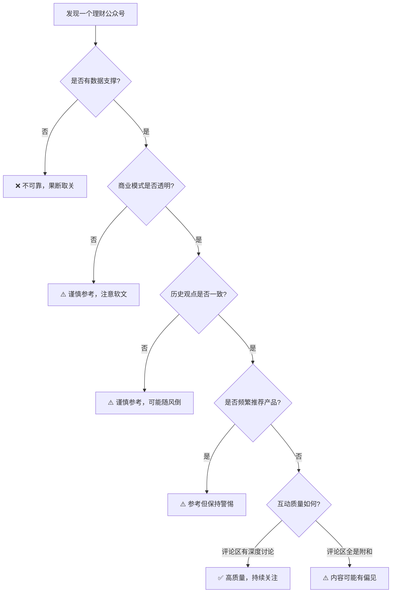
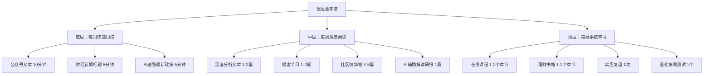
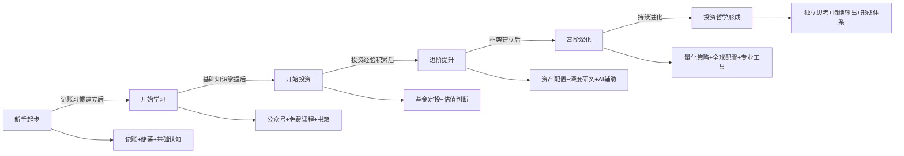

## 四、其他实用资源

书籍提供了系统的知识框架，APP解决了日常操作需求，理财产品是资金的落脚点——但真正让你在理财路上走得更远的，是持续的信息输入、社群支持和工具辅助。本章整理了公众号、网站与数据平台、AI与量化工具、播客与音频内容、在线课程与学习平台、社区与论坛、实用计算器、税务与合规资源、官方权威信息源九大类资源，并在最后提供资源整合方法论，帮助你构建一个完整的理财信息生态系统。

选择资源的核心原则是**匹配你的阶段和需求**。新手不需要Wind终端，老手不需要入门公众号。资源不在多，在于精用。每个板块都会按"入门→进阶→专业"分层推荐，方便你快速定位。

### 4.1 微信公众号推荐

公众号是中国互联网生态中独特的知识传播渠道。优质的理财公众号能够每天用5-10分钟帮你筛选出最有价值的财经信息，省去你自己在海量资讯中淘金的时间。2025年微信公众号生态虽然受到短视频冲击，但理财类公众号因其深度和专业性，依然是文字内容消费的核心阵地。

#### 4.1.1 入门级公众号（适合零基础读者）

| 公众号 | 内容方向 | 更新频率 | 适合人群 | 核心价值 |
|--------|---------|---------|---------|---------|
| 也谈钱 | 记账和储蓄实践 | 每周2-3篇 | 理财新手 | 用真实经历展示普通人如何通过记账和储蓄积累财富，接地气，可复制性强。作者公开自己的资产变化，是国内理财透明度最高的自媒体之一 |
| 银行螺丝钉 | 指数基金定投 | 每日更新 | 基金定投者 | 每日发布指数估值数据，用数据驱动投资决策。螺丝钉星级系统（1-5星）直观反映市场估值水平，是国内定投圈最有影响力的自媒体 |
| 三折人生 | 保险知识科普 | 每周1-2篇 | 保险入门者 | 用漫画和故事讲解复杂的保险概念，让零基础读者也能看懂保险条款。擅长将晦涩的条款转化为生活化的场景 |
| 她理财 | 女性理财教育 | 每日更新 | 女性投资者 | 从女性视角切入理财话题，涵盖消费、储蓄、投资、保险全方位内容。社区活跃度高，有大量真实案例分享 |
| 简七理财 | 理财入门科普 | 每周3-4篇 | 理财小白 | 用"说人话"的方式解释金融概念，适合完全没有基础的读者建立认知框架。有配套的入门训练营 |

#### 4.1.2 进阶级公众号（适合有一定基础的读者）

| 公众号 | 内容方向 | 更新频率 | 适合人群 | 核心价值 |
|--------|---------|---------|---------|---------|
| 小Lin说 | 金融宏观分析 | 每周1-2篇 | 想理解宏观经济的投资者 | 前华尔街分析师创办，用可视化方式讲解复杂宏观经济事件，制作精良。擅长将全球性金融事件拆解为普通读者能理解的逻辑链条 |
| 韭圈儿 | 基金深度研究 | 每周2-3篇 | 基金投资者 | 提供专业的基金分析工具和数据（基金持仓、风格漂移检测），帮助投资者识别"名不副实"的基金 |
| 套利喵 | 可转债投资 | 每日更新 | 可转债投资者 | 专注于可转债投资策略，提供实盘数据和策略分析，有可转债双低排名等实用工具 |
| 滚雪球笔记 | 价值投资 | 每周1-2篇 | 价值投资实践者 | 深入分析上市公司基本面，用价值投资框架解读财报和商业模式，适合想自己做个股分析的投资者 |
| 投资眼 | ETF与指数投资 | 每周2-3篇 | ETF投资者 | 聚焦ETF领域，涵盖策略构建、费率比较、流动性分析等实操内容 |

#### 4.1.3 专业级公众号（适合深度学习者）

| 公众号 | 内容方向 | 适合人群 | 核心价值 |
|--------|---------|---------|---------|
| 民间股神 | 宏观经济与政策分析 | 关注宏观政策的投资者 | 对重大财经政策的第一时间解读，帮助理解政策对市场的影响机制，擅长从政策文件中提取投资信号 |
| 思投社 | 全球资产配置 | 有全球视野的投资者 | 覆盖A股、港股、美股、债券、商品等多市场分析，提供跨境投资的实操视角 |
| 格上财富 | 私募基金研究 | 高净值投资者 | 深度研究私募行业，提供专业的私募产品分析、策略归因和管理人评价 |
| 饕餮海 | 可转债深度研究 | 可转债专业投资者 | 可转债领域最专业的分析公众号之一，覆盖定价模型、条款博弈、策略回测等深度内容 |
| 宁稳网 | 可转债与期权 | 衍生品投资者 | 提供可转债和期权的量化分析，是低风险策略爱好者的宝藏资源 |

#### 4.1.4 如何筛选优质理财公众号

公众号的质量参差不齐，选择时需要擦亮眼睛。以下是系统化的筛选框架：

**内容质量评估（权重40%）**：

优质公众号的文章通常有数据支撑、逻辑清晰、观点明确。评估方法：随机抽取3篇文章，检查是否有可验证的数据来源、是否有完整的逻辑链条（问题→分析→结论）、是否区分了事实和观点。如果一篇文章全是"我觉得""我认为"而没有任何数据或案例支撑，那它的参考价值就有限。

**商业模式评估（权重25%）**：

如果一个公众号的主要收入来源是卖课或卖产品，那它的内容很可能有倾向性。判断方法：翻看历史文章中软文的比例。优先选择以广告或流量分成作为主要收入的公众号，它们的立场相对中立。偶尔的软文可以接受，但如果每周都有"推荐"文章，就需要警惕。

**历史记录评估（权重20%）**：

翻看公众号过去一年的文章，重点关注三点：观点是否一致（不是死板不改，而是有逻辑地更新观点）、是否承认过错误（一个从不认错的"老师"是危险的）、是否在持续进化（内容深度是否在提升）。

**互动质量评估（权重15%）**：

评论区的互动质量能反映公众号的真实水平。如果评论区全是"老师说得对"式的附和，说明社区缺乏批判性思维。好的公众号评论区应该有不同观点的碰撞。

**必须警惕的危险信号**：

- 承诺"稳赚不赔""年化收益XX%"——任何承诺收益的都是骗局
- 要求加微信群、推荐个股——这是典型的收割模式
- 频繁推荐同一款金融产品——大概率是利益驱动
- 用煽动性标题（"再不买就晚了""错过等十年"）——利用焦虑心理收割流量
- 文章末尾放收款码或课程链接——内容为商业服务，客观性存疑



### 4.2 网站与数据平台

网站和数据平台是理财决策的信息基础设施。当你需要深入研究某只基金、某个指数、某家上市公司时，这些平台提供的数据和工具是不可或缺的。选择数据平台时，关键考量因素是**数据准确性、更新时效性、工具丰富度和使用成本**。

#### 4.2.1 基金数据平台

| 网站 | 网址 | 核心功能 | 适合场景 |
|------|------|---------|---------|
| 天天基金网 | fund.eastmoney.com | 基金数据查询、筛选、对比、排行 | 日常基金研究和筛选的首选平台，数据最全，覆盖公募基金全品类 |
| 晨星中国 | cn.morningstar.com | 基金评级、投资风格分析、风险评估 | 专业基金评估，晨星评级（1-5星）是全球通用的基金质量参考标准 |
| 好买基金 | www.howbuy.com | 基金筛选、组合分析、定投计算器 | 提供丰富的定投回测工具，可以模拟不同定投策略的历史收益 |
| 且慢 | www.qieman.com | 基金投顾策略、跟投功能 | 提供经过筛选的基金投顾组合，适合希望有专业指导但不想付高额管理费的投资者 |
| 蛋卷基金 | danjuanapp.com | 指数估值、组合投资、Smart Beta策略 | 提供直观的指数估值温度计，帮助判断买入时机 |

**天天基金网深度使用指南**：

天天基金网是最常用的基金数据平台，掌握以下功能可以大幅提升研究效率：

1. **基金筛选器**：在"基金筛选"页面，可以按类型、规模、业绩、费率等多维度筛选基金。建议设置条件：基金规模>2亿（避免清盘风险）、成立时间>3年（有足够历史数据）、基金经理任职时间>2年（稳定性验证）。高级筛选还可以加入夏普比率>1（风险调整后收益优秀）、最大回撤<20%（风险可控）等条件。

2. **基金对比功能**：选中多只基金后点击"对比"，可以直观地看到它们在不同时间段（近1月/3月/6月/1年/3年/5年）的收益、波动率、最大回撤、夏普比率等指标的差异。这个功能适合在最终选择基金时做决策比较。

3. **基金经理档案**：查看基金经理的从业年限、管理规模、历史业绩、投资风格。重点关注两个维度：一是其在不同市场环境（牛市、熊市、震荡市）下的表现是否稳定；二是其管理多只基金时业绩是否一致（如果不一致，说明可能存在"造星"操作）。

4. **基金持仓分析**：查看基金的股票持仓、债券持仓、行业分布、重仓股变化。这些数据每季度更新一次。对比连续几个季度的持仓变化，可以判断基金经理是否"言行一致"——如果他声称是价值投资者但持仓频繁换手，就需要警惕。

5. **基金评价与讨论区**：天天基金的讨论区虽然质量参差不齐，但可以作为了解市场情绪的窗口。重点关注讨论量异常放大时的信号——这往往意味着基金净值出现了较大波动。

#### 4.2.2 指数与估值数据

| 网站 | 网址 | 核心功能 | 适合场景 |
|------|------|---------|---------|
| 中证指数官网 | www.csindex.com.cn | 查看A股各类指数的编制规则、成分股、估值数据 | 理解指数的构成和估值水平，是指数基金投资的基础 |
| 国证指数 | www.cnindex.com.cn | 深交所旗下指数数据 | 查询深证系列指数的详细信息 |
| 韭圈儿（网页版） | funddb.cn | 指数估值百分位、行业估值热力图 | 直观判断当前市场和各行业的估值水平，是定投决策的核心参考 |
| 乌龟量化 | guorn.com | 指数估值、定投回测、组合分析 | 提供简洁的估值数据和实用的回测工具 |
| 理杏仁 | www.lixinger.com | 指数估值、个股估值、财务数据分析 | 专业级估值数据，支持自定义估值区间和多维度筛选 |

**指数估值数据怎么看**：

指数估值是判断"贵不贵"的核心工具。最常用的指标是市盈率（PE）和市净率（PB）的百分位。百分位的含义是"当前估值在历史上处于什么位置"——百分位30%意味着历史上只有30%的时间比现在便宜。

| 估值区间 | PE百分位 | 操作建议 | 适合策略 |
|---------|---------|---------|---------|
| 极度低估 | <10% | 大幅加仓，这是难得的机会 | 单笔大额买入 + 定投加倍 |
| 较低估值 | 10%-30% | 正常偏多投，可以适当加码 | 定投金额上浮50% |
| 正常估值 | 30%-70% | 按计划定投，不做特殊操作 | 维持正常定投金额 |
| 较高估值 | 70%-90% | 减少定投金额，开始考虑止盈 | 定投金额减半或暂停 |
| 极度高估 | >90% | 分批止盈，落袋为安 | 逐步卖出，保留底仓 |

需要注意的三个陷阱：

1. **周期性行业不能用PE**：银行、钢铁、煤炭等行业在盈利高峰期PE反而最低，这时买入可能正好买在顶部。周期性行业应该用PB估值。
2. **成长型指数用PEG更合理**：对于高成长的科技指数，PE百分位可能长期偏高，这时应该用PEG（PE÷盈利增速）来判断。
3. **估值不等于择时**：低估值不代表马上涨，高估值不代表马上下跌。市场可以在低估区域待很久，也可以在高估区域待很久。估值只是概率工具，不是精确工具。

#### 4.2.3 股票与企业研究

| 网站 | 网址 | 核心功能 | 适合场景 |
|------|------|---------|---------|
| 雪球 | xueqiu.com | 投资社区、行情数据、个股讨论 | 获取投资信息、参考他人分析，是国内最大的投资者社区 |
| 巨潮资讯 | www.cninfo.com.cn | 上市公司公告、财报下载 | 查询上市公司官方信息的第一手来源，所有A股上市公司的公告都在这里 |
| 天眼查 | www.tianyancha.com | 企业工商信息、股东结构、法律诉讼 | 投资个股前了解公司背景和关联关系，排查关联交易和潜在风险 |
| 东方财富网 | www.eastmoney.com | 综合财经信息、行情数据、研报 | 最全面的中文财经网站之一，几乎涵盖所有投资所需数据 |
| 同花顺 | www.10jqka.com.cn | 行情数据、技术分析、选股器 | 提供丰富的技术分析工具和智能选股功能 |
| 爱问财 | www.iwencai.com | 自然语言选股、财务数据查询 | 用自然语言描述选股条件（如"连续3年ROE大于15%"），自动筛选符合条件的股票 |

**雪球使用技巧**：

雪球既是信息平台也是社交平台，使用时需要注意信息筛选：

1. **关注高质量用户**：雪球上有大量专业投资者分享分析，但也有不少"股神"在带节奏。筛选标准：有长期实盘记录（至少1年以上）、分析逻辑清晰（不是只喊口号）、敢于承认错误（从不认错的人不值得信任）、持仓公开透明。
2. **善用"讨论"功能**：每只股票的讨论区可以看到投资者的多空观点。读讨论区不是为了找答案，而是为了看到自己可能忽略的角度——特别是与你观点相反的分析。
3. **警惕"信息茧房"**：如果你只关注看好某只股票的用户，你的信息源就会越来越窄。建议同时关注持不同观点的用户，构建多元化的信息输入。
4. **利用"组合"功能跟踪策略**：雪球允许创建模拟组合，可以用来跟踪某位投资者的策略表现，也可以自己建立组合进行回测验证。

**巨潮资讯使用指南**：

巨潮资讯是证监会指定的上市公司信息披露平台。关键使用场景：

- 查询年报/季报：搜索公司代码 → 定期报告 → 选择报告类型
- 下载原始财报PDF：确保你看到的是官方版本，而非第三方解读
- 查看公告时间线：了解公司重大事件的先后顺序
- 设置公告提醒：关注的公司有新公告时及时通知

#### 4.2.4 银行与保险产品查询

| 网站 | 网址 | 核心功能 | 适合场景 |
|------|------|---------|---------|
| 中国理财网 | www.chinawealth.com.cn | 银行理财产品登记和查询 | 验证银行理财产品的真实性，所有正规银行理财产品都有登记编码 |
| 中国保险行业协会 | www.iachina.cn | 保险产品查询、公司评级 | 查询保险产品的备案信息和保险公司的经营数据 |
| 国家金融监督管理总局 | www.cbirc.gov.cn | 监管政策、处罚信息、消费者投诉 | 了解最新的监管政策，查询机构的合规情况和处罚记录 |
| 银率网 | www.bankrate.com.cn | 银行产品对比（存款、贷款、信用卡） | 横向比较不同银行的同类产品，选择性价比最高的 |

**中国理财网使用指南**：

中国理财网是银保监会指定的银行理财产品信息登记系统。购买任何银行理财产品前，都应该在这里查询确认，这是验证理财产品真伪的最后一道防线：

1. 在首页点击"理财产品"查询
2. 输入产品登记编码（银行理财合同上会标注，格式通常为"C开头+14位数字"）
3. 核对产品名称、发行机构、期限、收益类型是否与银行告知的一致
4. 特别注意：如果查不到，说明该产品可能不是正规的银行理财产品——曾有不法分子伪造银行理财产品进行诈骗

#### 4.2.5 宏观经济与行业数据

| 网站 | 网址 | 核心功能 | 适合场景 |
|------|------|---------|---------|
| 国家统计局 | www.stats.gov.cn | GDP、CPI、PPI、PMI等宏观经济数据 | 了解经济运行状况，判断经济周期位置 |
| 中国人民银行 | www.pbc.gov.cn | 货币政策、利率公告、社融数据、M2 | 了解货币政策走向，社融数据是判断流动性的重要指标 |
| 海关总署 | www.customs.gov.cn | 进出口数据 | 判断外贸形势，对出口导向型行业有参考价值 |
| Wind经济数据库 | data.eastmoney.com（免费版） | 宏观经济数据可视化 | 免费版已足够个人投资者使用，数据呈现直观 |

**关键宏观指标解读指南**：

| 指标 | 含义 | 对投资的影响 | 关注频率 |
|------|------|------------|---------|
| PMI（采购经理指数） | >50表示扩张，<50表示收缩 | PMI回升通常利好股市，特别是周期性行业 | 每月1日 |
| CPI（消费者价格指数） | 通胀水平 | CPI过高可能引发加息，利空债券和股市 | 每月10日左右 |
| M2增速 | 货币供应量增速 | M2增速上升通常利好资产价格 | 每月中旬 |
| 社融增量 | 社会融资规模 | 反映实体经济融资需求，是经济先行指标 | 每月中旬 |
| LPR（贷款市场报价利率） | 贷款基准利率 | LPR下调利好房贷和债券市场 | 每月20日 |

### 4.3 AI与量化工具

AI工具正在深刻改变个人投资者获取和分析信息的方式。2024年以来，大语言模型（LLM）的普及使得普通人也能获得过去只有专业分析师才具备的信息处理能力。

#### 4.3.1 AI辅助理财研究

| 工具 | 类型 | 核心功能 | 理财应用场景 | 使用成本 |
|------|------|---------|-------------|---------|
| ChatGPT (OpenAI) | 通用LLM | 自然语言问答、文档分析、数据解读 | 解读财报、分析政策、解释金融概念、生成投资分析框架 | 免费版可用，Plus版20美元/月 |
| Claude (Anthropic) | 通用LLM | 长文本分析、逻辑推理、代码生成 | 分析长篇研报、对比多个公司的财务数据、编写量化脚本 | 免费版可用，Pro版20美元/月 |
| Perplexity AI | AI搜索引擎 | 实时联网搜索、引用来源、多轮对话 | 查询最新的市场数据、公司公告、政策变化，自带来源链接可验证 | 免费版可用，Pro版20美元/月 |
| Kimi (月之暗面) | 国产LLM | 超长文本处理、中文优化 | 分析长篇财报PDF、中文财经资料的理解和总结 | 免费使用 |
| 豆包 (字节跳动) | 国产LLM | 中文对话、信息检索 | 日常理财问题解答、金融概念解释 | 免费使用 |
| DeepSeek | 国产LLM | 代码生成、数学推理、深度思考 | 量化策略编写、复杂财务计算、逻辑推演 | 免费使用 |

**AI辅助理财的正确使用方式**：

AI工具的核心价值不是替你做决策，而是帮你**提高信息处理效率**和**拓展思考角度**。以下是高价值的使用场景：

1. **财报速读**：把上市公司年报PDF丢给Kimi或Claude，提问"请总结这家公司的核心竞争优势、主要风险、近三年营收和利润增速"。3分钟获得过去需要30分钟阅读的信息。
2. **概念学习**：遇到不理解的金融概念（如"可转债下修""期权希腊字母"），直接问AI，比搜索引擎高效得多。
3. **政策解读**：央行发布新政策时，把原文丢给AI，提问"这个政策对债券市场、股票市场、房贷利率分别有什么影响"。
4. **量化脚本**：让DeepSeek帮你写Python脚本，计算投资组合的波动率、最大回撤、夏普比率等指标。

**AI辅助理财的注意事项**：

- **不要用AI做投资决策**：AI可以帮你分析，但最终决策必须由你自己做出
- **验证AI的回答**：AI可能会"幻觉"，生成看似合理但实际错误的数据。关键数据一定要去官方渠道核实
- **不要输入敏感个人信息**：不要把你的银行账户、身份证号、持仓明细等信息输入AI
- **AI的滞后性**：大部分AI模型的训练数据有截止日期，最新信息需要用联网搜索工具补充

#### 4.3.2 量化投资与回测平台

对于想尝试量化策略的投资者，以下平台提供了从学习到实盘的完整链路：

| 平台 | 网址 | 核心功能 | 适合人群 | 使用成本 |
|------|------|---------|---------|---------|
| 聚宽 (JoinQuant) | www.joinquant.com | 量化策略编写、回测、模拟交易、实盘交易 | 想学习量化的投资者，有Python基础更佳 | 免费版可用，专业版按需付费 |
| 米筐 (RiceQuant) | www.ricequant.com | 量化研究平台、策略回测、数据分析 | 量化研究者和策略开发者 | 基础功能免费 |
| 优矿 (Uqer) | uqer.datayes.com | 量化策略开发、因子研究、组合优化 | 有量化基础的专业投资者 | 基础功能免费 |
| Backtrader | github.com/mementum/backtrader | Python开源回测框架 | 有编程能力的投资者 | 完全免费开源 |
| AkShare | github.com/akfamily/akshare | Python开源金融数据接口 | 需要批量获取A股数据的投资者 | 完全免费开源 |

**量化入门路径**：

量化投资的门槛没有想象中那么高。基本路径如下：

1. **学Python基础**（2-4周）：变量、循环、函数、pandas数据处理。B站搜索"Python量化"有大量免费教程。
2. **在聚宽平台练习**（1-2月）：聚宽提供了完整的教程和数据，不需要自己配置环境。从最简单的双均线策略开始。
3. **理解回测陷阱**（持续）：过拟合（策略在历史数据上表现好但未来不行）、幸存者偏差（只看到活下来的股票）、忽略交易成本（佣金、滑点、印花税）。
4. **模拟盘验证**（3-6月）：策略在回测中表现良好后，先在模拟盘运行至少3个月，验证其在实时市场中的表现。
5. **小资金实盘**（持续）：模拟盘验证通过后，用小资金开始实盘，逐步增加。

**量化策略示例——PE估值定投策略**：

```python
# 一个简单的PE估值定投策略逻辑（伪代码示意）
# 每月初根据沪深300的PE百分位决定定投金额

def monthly_invest(pe_percentile, base_amount=1000):
    """
    pe_percentile: 当前PE在历史中的百分位 (0-100)
    base_amount: 基础定投金额
    """
    if pe_percentile < 20:
        return base_amount * 2.0    # 极度低估，双倍投
    elif pe_percentile < 40:
        return base_amount * 1.5    # 较低估，1.5倍投
    elif pe_percentile < 60:
        return base_amount * 1.0    # 正常估值，正常投
    elif pe_percentile < 80:
        return base_amount * 0.5    # 较高估，半额投
    else:
        return 0                     # 极度高估，暂停定投

# 示例：当前PE百分位为25%，基础定投1000元
# 本月定投金额 = 1000 * 1.5 = 1500元
```

#### 4.3.3 Excel/表格模板

对于不想写代码的投资者，Excel是性价比最高的分析工具。以下是常用的理财分析模板：

| 模板类型 | 用途 | 关键字段 | 获取方式 |
|---------|------|---------|---------|
| 家庭资产负债表 | 梳理家庭财务全貌 | 资产（现金/房产/基金/保险现金价值）、负债（房贷/车贷/信用卡）、净资产 | 自建或搜索"家庭资产负债表模板" |
| 投资组合追踪表 | 跟踪各资产的收益表现 | 资产名称、买入价、当前价、持仓数量、盈亏比例、占比 | 自建 |
| 定投记录表 | 记录每次定投的金额和净值 | 日期、基金名称、金额、买入净值、持有份额、累计收益 | 自建 |
| 年度理财复盘表 | 年终回顾全年理财表现 | 各资产类别收益率、总收益率、与基准对比、经验教训 | 自建 |
| 保险保障分析表 | 梳理已有保险保障缺口 | 险种、保额、年缴保费、保障期限、受益人 | 搜索"保险保障分析模板" |

**定投记录表核心公式**：

持仓成本 = SUMPRODUCT(每次买入金额) / SUM(每次买入份额)
浮动盈亏 = (当前净值 - 持仓成本) × 持有份额
年化收益率 = (当前净值/持仓成本)^(365/持有天数) - 1

### 4.4 播客与音频内容

播客是利用碎片时间学习理财知识的最佳方式。通勤路上、做家务时、散步时，都可以听。相比文字阅读，播客的优势在于：可以多任务处理、叙述方式更生动、经常有嘉宾对话带来多元视角。

#### 4.4.1 理财入门类播客

| 播客名称 | 平台 | 更新频率 | 内容特点 |
|---------|------|---------|---------|
| 知行小酒馆 | 小宇宙、Apple Podcasts、喜马拉雅 | 每周1-2期 | 由雪球团队制作，邀请各领域专家分享投资理财知识，风格轻松，嘉宾质量高 |
| 半拿铁 | 小宇宙、Apple Podcasts | 每周1期 | 讲述商业和财经故事，用叙事方式让复杂的金融知识变得生动有趣，制作水平极高 |
| 贝望录 | 小宇宙、Apple Podcasts | 每周1-2期 | 关注消费、商业和生活方式，帮助理解"钱从哪来、花到哪去" |
| 保持通话 | 小宇宙、Apple Podcasts | 每周1期 | 聚焦个人理财和职业发展，对话式风格，贴近普通人的生活场景 |

#### 4.4.2 投资进阶类播客

| 播客名称 | 平台 | 更新频率 | 内容特点 |
|---------|------|---------|---------|
| 硅谷101 | 小宇宙、Apple Podcasts | 每周1期 | 聚焦科技行业和全球商业趋势，帮助理解科技对投资的影响 |
| 泡腾VC | 小宇宙、Apple Podcasts | 不定期 | 两位VC投资人讨论创业和投资话题，视角独特，经常有反直觉的观点 |
| 商业就是这样 | 小宇宙、Apple Podcasts | 每周1期 | 深入分析商业模式和行业逻辑，帮助建立商业判断力 |
| 起朱楼宴宾客 | 小宇宙、Apple Podcasts | 每周1期 | 讨论宏观经济和金融市场，适合有一定基础的投资者 |
| 贝乐斯的投资观察 | 小宇宙、Apple Podcasts | 不定期 | 前专业投资人分享投资思考，深度较高，适合有经验的投资者 |

#### 4.4.3 如何高效利用播客学习

**建立收听习惯**：每天固定一个时间段听播客，比如通勤的30分钟。习惯一旦建立，学习就不再需要额外的意志力。用播客APP的订阅功能，新节目自动下载，打开即听。

**做结构化笔记**：不要只是被动听。准备一个笔记模板，每期记录：核心观点（1-2句）、有价值的数据点、与我相关的信息、待深入研究的议题。推荐用Flomo或备忘录随时记录关键词，周末整理。

**主动搜索**：不要只听推荐的，利用播客平台的搜索功能，主动搜索你感兴趣的理财话题。比如搜索"定投""保险""税务""可转债"等关键词，往往能发现小众但高质量的节目。

**倍速播放的正确姿势**：大多数播客支持1.5倍或2倍速播放。建议：信息密度高的深度分析用1.25倍速（保证理解），轻松对话类用1.5-2倍速（提高效率），首次听的新领域用正常速度（打好基础）。

**建立播客笔记复盘机制**：每月月底花30分钟回顾本月的播客笔记，把有价值的信息整理到你的理财知识库中。这个复盘步骤是将碎片化信息转化为系统化知识的关键。

### 4.5 在线课程与学习平台

系统性的学习比碎片化阅读更有效。课程的优势在于：有逻辑递进的知识体系、有讲师的讲解和答疑、有配套练习帮助巩固。选择课程时，关键是匹配你的水平和学习目标。

#### 4.5.1 付费精品课程

| 平台 | 课程名称 | 讲师 | 价格 | 内容概述 | 适合人群 |
|------|---------|------|------|---------|---------|
| 得到 | 《香帅的北大金融学课》 | 香帅（唐涯） | 199元 | 从金融学原理出发，系统讲解货币、银行、证券、保险等核心知识，建立金融学全景图 | 希望系统学习金融知识的读者 |
| 得到 | 《张潇雨·个人投资课》 | 张潇雨 | 99元 | 聚焦个人投资实操，涵盖资产配置、基金选择、投资心理等，每节课都有可执行的行动建议 | 有一定基础想提升实操能力的投资者 |
| 得到 | 《薛兆丰的经济学课》 | 薛兆丰 | 199元 | 用经济学思维理解世界，帮助建立理性的决策框架。经济学思维对理财有底层支撑作用 | 所有人，经济学思维是理财的底层操作系统 |
| 网易云课堂 | 《基金投资入门与实战》 | 各类讲师 | 99-299元 | 从基金基础知识到定投实操的完整课程 | 基金投资入门者 |
| 长投学堂 | 《14天理财训练营》 | 长投团队 | 9元（引流价） | 低门槛入门课程，涵盖记账、保险、基金基础 | 完全零基础的理财小白 |

#### 4.5.2 免费优质课程

| 平台 | 课程名称 | 来源 | 内容概述 | 语言 |
|------|---------|------|---------|------|
| 网易公开课 | 《金融市场》 | 耶鲁大学（Robert Shiller） | 诺贝尔经济学奖得主讲授的金融市场课程，系统介绍金融市场的运作机制和投资原理 | 英文原声+中文字幕 |
| 网易公开课 | 《博弈论》 | 耶鲁大学 | 理解策略思维，对投资决策中的博弈分析有启发 | 英文原声+中文字幕 |
| B站 | 各类理财入门系列 | 各类UP主 | 内容丰富但质量参差不齐，建议选择播放量高、评价好的系列 | 中文 |
| 中国大学MOOC | 《个人理财》 | 各高校 | 多所高校开设的个人理财课程，内容系统且免费，有作业和考试帮助巩固 | 中文 |
| 可汗学院 | 《金融学》 | 可汗学院 | 从最基础的概念讲起，适合完全零基础的学习者，交互式练习体验好 | 英文（有中文字幕） |
| Coursera | 《Financial Markets》 | 耶鲁大学 | Shiller教授的金融市场课程英文原版，可免费旁听 | 英文 |

#### 4.5.3 B站推荐UP主

B站（哔哩哔哩）是中国最大的学习视频平台之一，理财类内容非常丰富。相比公众号和播客，视频的优势在于可视化演示和实时操作展示。

| UP主 | 内容方向 | 风格特点 | 适合人群 |
|------|---------|---------|---------|
| 也谈钱 | 记账和储蓄实践 | 用真实数据展示理财过程，透明度高，每月公开资产变化 | 理财新手，想看真实案例 |
| 小Lin说 | 金融知识科普 | 动画+讲解，制作精良，深入浅出，每期都是高质量的商业分析 | 想理解复杂金融概念的读者 |
| 李自然说 | 创业和投资 | 创业者视角的投资思考，经常分享硅谷见闻 | 对创业和投资都感兴趣的人 |
| 老石谈芯 | 科技行业分析 | 深入分析科技行业和公司，硬核技术+投资视角 | 关注科技股投资的投资者 |
| 巫师财经 | 商业案例分析 | 深度分析商业事件和公司，叙事能力强 | 理解商业逻辑，辅助投资判断 |
| 半佛仙人 | 商业与金融评论 | 犀利点评金融乱象，用幽默方式揭示行业套路 | 想了解金融行业"暗面"的读者 |

#### 4.5.4 课程学习方法论

**选择课程的四维评估**：

1. **看讲师背景**：优先选择有实际从业经验的讲师，而非纯学术背景的"理论家"。比如讲基金定投的人，最好自己有多年的定投记录且能公开验证。
2. **看课程大纲**：好的课程大纲应该是逻辑递进的（从基础到进阶），而非知识点的随意堆砌。如果大纲看起来像百科全书，大概率是"大而全但不深"。
3. **看评价和完课率**：评价高且完课率高的课程通常质量不错。完课率低可能意味着课程太难、太无聊或太长。
4. **看时效性**：金融课程有保质期。3年前的课程可能在税收政策、监管规则、产品结构等方面已经过时。优先选择近1-2年更新的课程。

**学习的"输入-处理-输出"循环**：

- **输入**：不要同时开始多门课程，一次只学一门，学完再开始下一门。多线并行会导致每门都学不深。
- **处理**：学完一个章节后，用自己的话总结核心要点（费曼学习法）。如果某个概念你解释不清楚，说明你还没真正理解。
- **输出**：把学到的知识立即应用到实际理财操作中。学了基金定投，当天就开始设置定投计划。学了保险配置，本周就开始梳理家庭保障缺口。课程只是起点，真正的学习发生在实践中。

### 4.6 社区与论坛

与其他投资者交流是加速学习的重要途径。社区的价值在于：看到多元观点、学习他人经验、获得情绪支持。但需要注意，社区中既有有价值的经验分享，也有大量的噪音和误导信息。

#### 4.6.1 投资社区

| 社区 | 平台 | 特点 | 适合人群 |
|------|------|------|---------|
| 雪球 | xueqiu.com | 国内最大的投资者社区，覆盖股票、基金、债券等全品类 | 各类投资者，尤其是股票和基金投资者 |
| 集思录 | jisilu.cn | 专注于低风险投资，社区氛围理性，讨论质量高 | 可转债、分级基金、债券、套利等低风险投资者 |
| 天天基金社区 | fund.eastmoney.com | 基金投资者交流平台，有基金吧功能 | 基金投资者，尤其是定投者 |
| V2EX | v2ex.com | 技术社区中的投资讨论区，理性且数据驱动 | 有技术背景的投资者 |
| 知乎 | zhihu.com | 理财话题下的深度回答 | 想了解某个理财话题全貌的读者 |

#### 4.6.2 学习型社群

| 社群类型 | 获取方式 | 特点 | 注意事项 |
|---------|---------|------|---------|
| 读书会 | 公众号/知识星球 | 围绕某本理财书籍组织共读和讨论，有主持人引导 | 选择有讨论规则、有输出要求的读书会，"读完就算"的读书会效果有限 |
| 定投打卡群 | 公众号/微信群 | 每日或每周定投打卡，互相监督，分享心得 | 警惕群内推荐具体产品的行为，打卡群的核心价值是坚持而非选股 |
| 理财学习群 | 知识星球/付费社群 | 系统学习理财知识，有答疑服务和作业批改 | 付费社群质量参差不齐，先看免费内容再决定是否付费。年费超过1000元的要慎重 |
| 实盘分享群 | 雪球/知识星球 | 跟踪真实投资者的操作和思考 | 实盘可造假（只展示盈利不展示亏损），要验证实盘的真实性 |

#### 4.6.3 社区信息筛选的"三看三不看"原则

在投资社区中，90%的信息是噪音，只有10%是有价值的。系统化的筛选方法：

**三看**：

1. **看逻辑不看结论**：一个帖子如果只有结论（"这只股票要涨"）而没有逻辑推导过程，那它对你没有任何价值。相反，一个逻辑清晰但结论可能错误的帖子，反而能启发你的思考。
2. **看数据不看情绪**：如果一个帖子充满了感叹号和表情包，它大概率是情绪宣泄而非理性分析。优先阅读那些用数据说话的帖子——即使结论与你预期相反。
3. **看历史不看预测**：社区中最有价值的内容是对历史事件的复盘和总结，而非对未来的预测。因为历史可以验证，预测无法验证。

**三不看**：

1. **不看匿名爆料**：匿名信息无法追溯来源，可能是竞争对手的抹黑或利益相关方的吹捧。
2. **不看没有时间戳的分析**：金融分析有很强的时效性，没有时间戳的分析可能已经过时。
3. **不看只展示收益不展示回撤的**：只晒收益不晒风险的人要么在营销自己，要么对自己投资方法的风险认知不足。

**独立思考的底线**：社区中别人的分析只能作为参考，最终的投资决策必须由你自己做出。不要因为社区中大多数人看好某只股票就跟风买入，也不要因为大多数人看空就恐慌卖出。判断一个社区是否有价值，看的是它是否鼓励独立思考，而非是否提供"正确答案"。

### 4.7 实用工具与计算器

工欲善其事，必先利其器。精确的计算工具能帮你做出更理性的决策，避免"感觉"代替"数据"。以下工具覆盖了个人理财中最常见的计算需求。

#### 4.7.1 定投计算器

| 工具 | 来源 | 功能 |
|------|------|------|
| 天天基金定投计算器 | fund.eastmoney.com | 输入基金代码、定投金额、起止日期，计算历史定投收益率，支持不同频率 |
| 好买基金定投回测 | howbuy.com | 支持多种定投策略的回测对比（普通定投、智能定投、价值平均策略） |
| 且慢定投回测 | qieman.com | 提供多种指数的定投回测数据和策略分析 |
| 定投计算器小程序 | 微信小程序搜索 | 手机端快速计算，支持普通定投和慧定投（估值定投）模拟 |

**定投计算器使用示例**：

假设你计划每月定投1000元到沪深300指数基金，可以用定投计算器回答以下关键问题：

- **收益验证**：过去5年每月定投1000元，累计投入60000元，最终收益是多少？年化收益率是多少？
- **策略对比**：如果在估值低时加倍投入、估值高时减半投入（智慧定投），收益会比普通定投高多少？历史数据显示，智慧定投的年化收益通常比普通定投高1-3个百分点。
- **起始时间影响**：不同的定投起始时间（牛市起点 vs 熊市起点），3年后的收益差异有多大？答案可能让你惊讶——在熊市开始定投的人，3年后的收益往往远高于牛市开始的人。
- **止盈策略对比**：不设止盈 vs 年化15%止盈 vs 估值百分位>80%止盈，哪种策略的长期收益更好？

#### 4.7.2 贷款与房贷计算器

| 工具 | 来源 | 功能 |
|------|------|------|
| 房贷计算器 | 各银行官网/App | 计算等额本息、等额本金两种还款方式的月供和总利息 |
| 提前还款计算器 | 各银行官网/App | 计算提前还款能节省多少利息、缩短多少还款期限 |
| 公积金贷款计算器 | 各地公积金中心官网 | 计算公积金贷款额度和月供，考虑缴存基数和年限 |
| 组合贷款计算器 | 银行官网或第三方 | 计算公积金+商业贷款组合的最优比例和月供 |

**房贷计算器的实用价值**：

很多人在买房时只关注房价，却忽略了贷款方式和还款策略对总支出的巨大影响。以100万元贷款、30年期限、利率3.5%为例：

| 还款方式 | 月供（元） | 总利息（元） | 总还款（元） |
|---------|-----------|------------|------------|
| 等额本息 | 4,490 | 616,560 | 1,616,560 |
| 等额本金 | 首月5,694，逐月递减 | 526,458 | 1,526,458 |

两者总利息相差约9万元。选择建议：

- **等额本息**：月供固定，适合收入稳定的借款人。前期还款中利息占比高，适合前期收入不高但预期收入会增长的人。
- **等额本金**：总利息少，但前期月供压力大。适合当前收入较高、希望少付利息的人。

**提前还款的决策框架**：

是否提前还款，取决于一个简单的比较：提前还款节省的利息 vs 这笔钱用于投资的预期收益。

- 如果你的房贷利率是3.5%，而你投资的长期年化收益是7%，那不提前还款更划算
- 如果你的房贷利率是5%，而你投资经常亏损，那提前还款更划算
- 如果你心理上无法承受负债压力，那提前还款的"安心感"也有价值

#### 4.7.3 复利计算器

| 工具 | 来源 | 功能 |
|------|------|------|
| 在线复利计算器 | 搜索"复利计算器"即可找到 | 计算不同本金、利率、时间下的复利终值 |
| 72法则速算 | 心算 | 用72除以年化收益率，得到资产翻倍所需年数 |

**72法则的实战应用**：

72法则是一个快速估算复利效果的心算方法：用72除以年化收益率百分比的数字，就是资产翻倍所需的年数。

| 年化收益率 | 对应产品 | 翻倍所需年数 |
|-----------|---------|------------|
| 2% | 银行定期存款 | 36年 |
| 3% | 货币基金/国债 | 24年 |
| 5% | 债券基金长期平均 | 14年 |
| 7% | 指数基金长期平均 | 10年 |
| 10% | 优秀主动基金/美股长期 | 7年 |
| 15% | 顶级投资者的长期年化 | 5年 |

这个简单的计算能帮助你建立对复利的直觉：时间是最强大的投资武器。一个25岁开始、年化收益7%、每月定投2000元的人，到60岁时本息合计约340万元（本金仅84万元）。如果他35岁才开始，同样条件下只有约160万元。10年的差距，就是180万元。

#### 4.7.4 资产配置与风险评估工具

| 工具 | 来源 | 功能 | 适合人群 |
|------|------|------|---------|
| 晨星X-Ray | cn.morningstar.com | 分析你的投资组合中各类资产的实际比例、行业分布、地区分布 | 持有多只基金的投资者 |
| 且慢组合分析 | qieman.com | 评估你的基金组合的风险收益特征、相关性分析 | 想优化基金组合的投资者 |
| Riskalyze | riskalyze.com（英文） | 量化你的风险承受能力，推荐匹配的资产配置方案 | 想科学评估风险偏好的投资者 |
| Vanguard风险评估问卷 | investor.vanguard.com（英文） | 经典的风险容忍度问卷，结果直接对应资产配置建议 | 所有投资者 |

**如何使用晨星X-Ray**：

1. 在晨星中国注册账号
2. 输入你持有的所有基金及其份额
3. X-Ray会生成一份报告，显示你的组合实际配置在：大盘/中盘/小盘的比例、成长/价值风格的分布、各行业的实际暴露、各地区的分布
4. 对比你的目标配置（如"60%股票+40%债券"），找出偏差并调整

很多投资者以为自己做了分散投资，但X-Ray往往能揭示出"伪分散"——比如你买了5只基金，但它们重仓的都是消费行业，实际上风险非常集中。

#### 4.7.5 人生规划计算器

| 计算器 | 功能 | 关键输入 |
|-------|------|---------|
| 退休金计算器 | 计算退休时需要多少钱、每月需要存多少 | 当前年龄、退休年龄、预期寿命、月消费、通胀率、投资回报率 |
| 教育金计算器 | 计算子女大学教育需要储备多少 | 子女当前年龄、入学年龄、学费增速、投资回报率 |
| 财务自由计算器 | 计算需要多少被动收入才能覆盖生活开支 | 月消费、安全提取率（通常4%）、已有资产 |

**财务自由计算的4%法则**：

4%法则（源自美国Trinity Study）：如果你每年从投资组合中提取不超过4%用于生活开支，那么你的钱大概率可以支撑30年以上。

计算公式：财务自由所需资产 = 年支出 ÷ 4% = 年支出 × 25

| 月消费 | 年支出 | 财务自由所需资产 |
|-------|-------|----------------|
| 5,000元 | 6万 | 150万 |
| 10,000元 | 12万 | 300万 |
| 15,000元 | 18万 | 450万 |
| 20,000元 | 24万 | 600万 |

注意：4%法则基于美国股市历史数据，在中国需要适当调整。考虑到A股波动性更大，建议将安全提取率调整为3%-3.5%，对应乘数约28-33倍年支出。

### 4.8 税务与合规资源

税务筹划是理财的重要组成部分，但很多人忽略了合法节税的工具和资源。本节介绍与个人投资者最相关的税务资源。

#### 4.8.1 个人所得税相关

| 资源 | 网址/来源 | 功能 |
|------|---------|------|
| 个人所得税APP | 各应用商店下载 | 个税申报、专项附加扣除填报、年度汇算清缴 |
| 国家税务总局官网 | www.chinatax.gov.cn | 查询最新税收政策、个税税率表、优惠政策 |
| 12366纳税服务热线 | 电话12366 | 税务政策咨询、纳税申报指导 |
| 各省电子税务局 | 搜索"XX省电子税务局" | 网上办税、发票查询、完税证明打印 |

**个人投资者需要关注的税种**：

| 税种 | 税率 | 适用场景 | 优化策略 |
|------|------|---------|---------|
| 个人所得税（工资薪金） | 3%-45%累进 | 工资收入 | 充分利用专项附加扣除（子女教育、房贷利息、赡养老人、继续教育等） |
| 个人所得税（股息红利） | 20%（持有>1年免税） | 股票分红 | 持有股票超过1年，股息红利免征个税 |
| 印花税 | 0.05%（卖出方） | 股票交易 | 无法避免，但频繁交易会累积大量印花税成本 |
| 个人所得税（财产转让） | 20% | 房产出售 | 满五唯一免征个税，合理规划出售时机 |

**专项附加扣除清单**（每年可节税数千元）：

| 扣除项目 | 每月扣除标准 | 条件 |
|---------|-----------|------|
| 子女教育 | 2,000元/子女 | 3岁到博士阶段的子女 |
| 继续教育 | 400元（学历）或3,600元/年（职业资格） | 在学或取得证书当年 |
| 大病医疗 | 超过15,000元部分，最高80,000元/年 | 医保目录内自付部分 |
| 住房贷款利息 | 1,000元 | 首套房贷，最长240个月 |
| 住房租金 | 800-1,500元（按城市） | 在工作城市无自有住房 |
| 赡养老人 | 3,000元 | 赡养60岁以上老人 |
| 3岁以下婴幼儿照护 | 2,000元/婴幼儿 | 3岁以下婴幼儿 |

#### 4.8.2 投资相关税务知识

| 投资品种 | 税务处理 | 节税策略 |
|---------|---------|---------|
| 银行存款利息 | 目前暂免征收个税 | 无需特别操作 |
| 基金分红 | 暂免征收个税 | 无需特别操作 |
| 基金赎回收益 | 暂免征收个税（个人投资者） | 无需特别操作 |
| 股票股息 | 持有>1年免税，1月-1年税率10%，<1月税率20% | 长期持有享受免税待遇 |
| 股票转让收益 | 目前暂免征收个税（个人投资者） | 无需特别操作 |
| 房产转让收益 | 20%（可扣除原值和合理费用） | 满五唯一免征，合理保留装修发票等成本凭证 |
| 期货收益 | 暂免征收个税（个人投资者） | 无需特别操作 |
| 境外投资收益 | 需要申报，税率20% | 通过正规渠道投资，按时申报 |

### 4.9 官方权威信息源

在理财过程中，有些信息必须从官方渠道获取，不能依赖二手信息。二手信息可能有延迟、有偏差、甚至有误导。以下是最重要的官方信息源，按使用场景分类。

#### 4.9.1 监管机构

| 机构 | 网址 | 核心功能 | 使用场景 |
|------|------|---------|---------|
| 中国证监会 | www.csrc.gov.cn | 证券市场监管政策、上市公司处罚信息、投资者保护 | 查询最新的证券监管政策，了解违规行为和处罚案例 |
| 国家金融监督管理总局 | www.cbirc.gov.cn | 银行和保险监管政策、消费者保护、机构处罚 | 查询银行和保险机构的合规情况，投诉金融机构 |
| 中国人民银行 | www.pbc.gov.cn | 货币政策、利率公告、金融统计数据 | 了解货币政策走向，查询基准利率、LPR等关键数据 |
| 国家税务总局 | www.chinatax.gov.cn | 税收政策、个税申报指南、优惠政策 | 了解最新的税收政策和优惠政策 |

#### 4.9.2 数据统计机构

| 机构 | 网址 | 核心数据 | 更新频率 |
|------|------|---------|---------|
| 国家统计局 | www.stats.gov.cn | GDP、CPI、PPI、PMI、居民收入等宏观经济数据 | 月度/季度/年度 |
| 中国人民银行调查统计司 | www.pbc.gov.cn | 社融数据、货币供应量（M0/M1/M2）、外汇储备 | 月度 |
| Wind万得 | www.wind.com.cn（付费） | 最全面的中国金融数据终端，专业投资者的标配 | 实时 |
| 国家外汇管理局 | www.safe.gov.cn | 外汇储备、跨境资金流动、汇率数据 | 月度 |

#### 4.9.3 投资者保护

| 平台 | 网址/方式 | 功能 |
|------|---------|------|
| 中国投资者网 | www.investor.org.cn | 投资者教育、投诉维权、风险提示、案例警示 |
| 12386热线 | 电话12386 | 中国证监会投资者服务热线，受理证券期货投诉 |
| 中国裁判文书网 | wenshu.court.gov.cn | 查询金融纠纷的司法判决，了解维权案例和判决标准 |
| 全国12315平台 | www.12315.cn | 消费者投诉平台，适用于金融消费纠纷 |
| 中证中小投资者服务中心 | www.isc.org.cn | 证券纠纷调解、持股行权、投资者教育 |

#### 4.9.4 信用与征信

| 平台 | 网址 | 功能 |
|------|------|------|
| 中国人民银行征信中心 | www.pbccrc.org.cn | 个人信用报告查询，每年2次免费查询 |
| 百行征信 | www.baihangcredit.com | 个人征信补充数据，覆盖互联网金融领域 |
| 信用中国 | www.creditchina.gov.cn | 企业/个人信用信息查询、失信被执行人名单 |

**定期查询征信报告的重要性**：

每年至少查询一次个人征信报告，关注以下几点：是否有你不知情的贷款记录（可能是身份被盗用）、信用卡是否有逾期记录（影响房贷审批）、查询记录是否正常（频繁被"硬查询"可能影响信用评分）。

### 4.10 信息获取的系统化方法

有了这么多资源，如何把它们整合成一个高效的信息获取系统？核心问题是：**如何在信息不足和信息过载之间找到平衡点**。

#### 4.10.1 建立信息输入的"金字塔"



**底层——每日快速扫描（20分钟）**：利用早起或通勤时间，快速浏览2-3个你最信任的公众号，了解当天的市场动态和重要新闻。用Perplexity或Kimi快速搜索当天是否有重大政策发布。不需要深入阅读，只需要知道"今天发生了什么"。

**中层——每周深度阅读（2-3小时）**：周末安排一段完整的时间，深入阅读本周最有价值的文章、听1-2期播客、浏览社区中的精华帖。这个层次的目标是"理解为什么"——为什么市场这样走、为什么政策这样制定、为什么某个策略有效。

**顶层——每月系统学习（4-6小时）**：每月安排半天时间，学习一门在线课程的一个模块、读一章理财书籍、复盘自己本月的投资操作。这个层次的目标是"构建知识体系"——把碎片化的信息整合到你的个人理财框架中。

#### 4.10.2 避免信息过载

信息过多和信息过少一样有害。信息过载会导致三个核心问题：

**决策瘫痪**：看的分析越多，越不知道该听谁的，最终什么都不敢做。你看到A专家说"现在应该买"，B专家说"现在应该卖"，结果你既不买也不卖，错过了时间价值。

**频繁操作**：每天看行情和分析，容易产生"不操作就亏了"的冲动，导致频繁买卖。数据显示，交易越频繁的投资者，收益往往越差。原因很简单：每次交易都有成本（佣金+印花税+时间），而频繁交易往往是情绪驱动的非理性决策。

**情绪波动**：每天接触市场涨跌的信息，容易被情绪左右。大涨时贪婪加仓，大跌时恐惧割肉——这正好做反了。

**四步信息管理方案**：

1. **限定信息源数量**：公众号关注不超过10个，播客订阅不超过5个，社区只浏览1-2个。宁可深读少数高质量信息源，也不要在大量低质量信息中浪费时间。
2. **设定信息消费预算**：每天花在理财信息上的时间不超过30分钟（不含课程学习）。时间一到就停止，强制自己从信息流中抽离。
3. **定期清理信息源**：每季度清理一次关注列表，取消那些不再有价值的信息源。如果一个公众号你连续一个月都没点开过，说明它已经不在你的信息金字塔中了。
4. **屏蔽市场噪音**：不在交易时间看行情。设置好定投计划后，关闭行情推送。你不需要知道今天涨了还是跌了——你只需要知道你的计划是否在正常执行。

#### 4.10.3 从信息消费者到信息生产者

学习理财知识的最高境界是能向别人解释清楚。当你能把一个复杂的理财概念用简单的语言讲给朋友听，说明你真正理解了它。这就是"费曼学习法"在理财领域的应用。

**实践方式**：

- **写理财笔记或博客**：记录自己的学习心得和投资复盘。不一定要公开发布，给自己看也有价值。关键是通过写作强迫自己把模糊的想法变成清晰的文字。
- **在社区中回答新手的问题**：当你能回答别人的问题时，说明你对这个领域的理解已经超越了"知道"的层次，达到了"理解"的层次。
- **组织身边的朋友进行理财学习讨论**：教是最好的学。准备一个话题、分享你的理解、听取别人的反馈，这个过程会暴露你认知中的盲区。
- **做投资复盘**：每月或每季度复盘一次自己的投资操作，总结成功和失败的原因。把复盘记录下来，半年后回看，你会发现自己的认知在持续进化。

这个过程不仅能加深你自己的理解，还能帮助到其他人，形成正向循环。而且，当你习惯了输出，你会更主动地寻找输入——因为你需要新的内容来支撑你的输出。

### 4.11 资源整合：构建你的个人理财信息体系

每个人的情况不同，不需要也不应该使用所有资源。关键是根据你所处的阶段，选择最合适的资源组合，并随着能力提升逐步升级。

#### 4.11.1 新手起步组合（0-1年）

| 类别 | 推荐 | 理由 | 每周时间预算 |
|------|------|------|-----------|
| 书籍 | 《小狗钱钱》《富爸爸穷爸爸》 | 建立基础理财意识，用故事激发行动力 | 每天30分钟 |
| 公众号 | 也谈钱、简七理财 | 内容通俗易懂，适合入门 | 每天10分钟 |
| APP | 随手记/鲨鱼记账 | 养成记账习惯，了解自己的消费模式 | 每天5分钟 |
| 课程 | B站免费理财系列 | 零成本开始学习，边学边做 | 每周1-2小时 |
| 网站 | 天天基金网 | 开始了解基金 | 需要时查阅 |
| AI工具 | 豆包/Kimi | 遇到不懂的概念直接问 | 需要时使用 |

**新手阶段的核心目标**：养成记账习惯 → 建立应急基金 → 了解基本投资工具。不要急于投资，先打好基础。

#### 4.11.2 进阶提升组合（1-3年）

| 类别 | 推荐 | 理由 | 每周时间预算 |
|------|------|------|-----------|
| 书籍 | 《指数基金投资指南》《漫步华尔街》 | 系统学习投资知识，建立投资框架 | 每天30分钟 |
| 公众号 | 银行螺丝钉、小Lin说 | 获取估值数据和宏观分析 | 每天15分钟 |
| 播客 | 知行小酒馆、半拿铁 | 利用碎片时间深度学习 | 每周1-2小时 |
| 课程 | 得到《香帅的北大金融学课》 | 系统建立金融知识框架 | 每周2-3小时 |
| 网站 | 中证指数官网、雪球 | 深入研究指数和个股 | 需要时查阅 |
| 社区 | 雪球、集思录 | 与其他投资者交流，拓展视角 | 每周30分钟 |
| AI工具 | ChatGPT/Claude + Perplexity | 辅助研究和分析 | 需要时使用 |

**进阶阶段的核心目标**：建立完整的投资框架 → 开始定投 → 学会看估值 → 建立资产配置意识。

#### 4.11.3 高阶深化组合（3年以上）

| 类别 | 推荐 | 理由 | 每周时间预算 |
|------|------|------|-----------|
| 书籍 | 《聪明的投资者》《投资最重要的事》 | 深入理解投资哲学和风险管理 | 每天30分钟 |
| 公众号 | 滚雪球笔记、思投社、饕餮海 | 深度分析和全球视野 | 每天15分钟 |
| 课程 | 耶鲁大学《金融市场》 | 顶级学术课程，建立理论深度 | 按需学习 |
| 工具 | Wind万得、晨星X-Ray、聚宽 | 专业级数据分析和量化回测 | 按需使用 |
| 官方源 | 证监会、央行、统计局 | 第一手政策和数据 | 每周关注关键数据日 |
| 社区 | 集思录深度帖、知识星球 | 高质量的策略讨论 | 每周1小时 |
| AI工具 | 全部AI工具 + 量化平台 | 量化策略开发、深度研究 | 按需使用 |

**高阶阶段的核心目标**：优化资产配置 → 尝试量化策略 → 关注全球资产 → 建立投资哲学。

#### 4.11.4 资源升级路径图



每个阶段的升级信号：当你觉得当前阶段的资源已经不能满足你的需求时，就是升级的时候。不要跳跃式升级——没有基础就用高级工具，只会增加困惑而不会提升能力。

***

> **使用建议**：产品和平台会不断更新迭代，建议定期关注最新的评测和推荐。以上内容仅作为参考，不构成任何投资建议。投资有风险，入市需谨慎。信息资源是理财决策的辅助工具，最终的投资决策应基于你自己的研究和判断。好的信息习惯比好的信息源更重要——持续学习、独立思考、理性决策，才是理财成功的根本。
