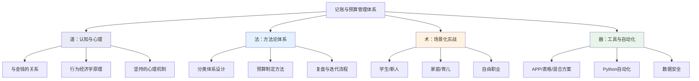
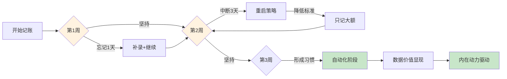
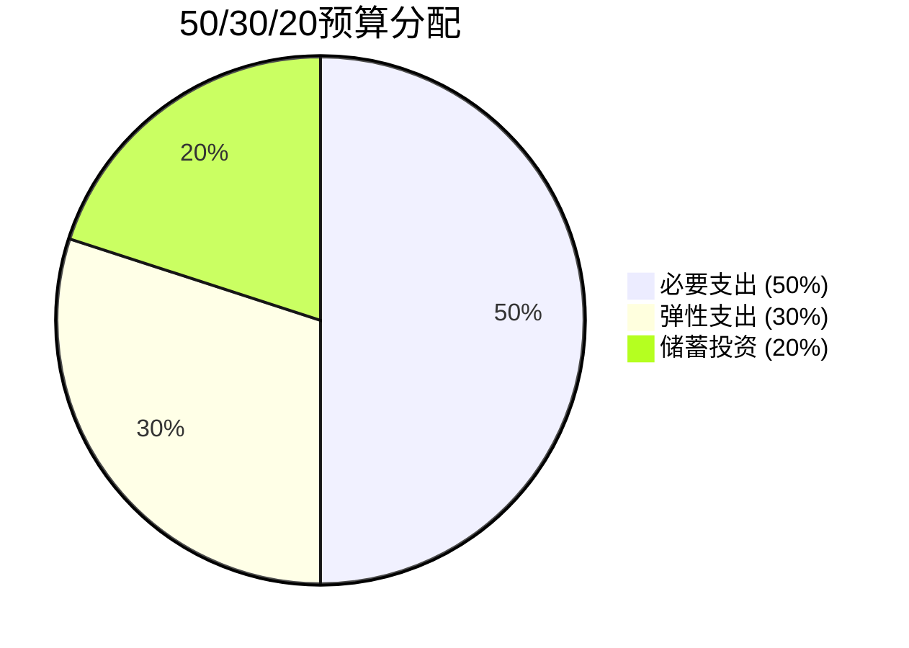
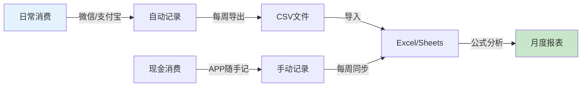
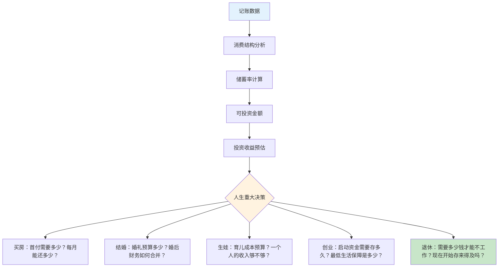

## 记账与预算管理：掌握你的资金流向

> 一个月薪两万的互联网从业者，记账三年后告诉我："记账带给我的最大改变，不是省了多少钱，而是我终于知道自己是谁——一个在消费主义浪潮中能做出清醒选择的人。"

这句话道出了记账的本质：它不是会计技术，而是一种认知工具。当你能清晰地看到每一分钱的流向，你看到的不仅是账单，而是自己生活的真实投影——你的优先级、你的焦虑、你的欲望、你的盲区。

本章将从"道法术器"四个层次，系统讲解记账与预算管理的完整体系。无论你是从未记过账的零基础读者，还是已经坚持记账多年的老手，都能找到适合自己的进阶路径。



---

## 一、道：与金钱建立正确关系

### 1.1 记账的哲学根基——你和钱是什么关系？

大多数理财文章跳过了一个根本问题：**你对金钱的态度是什么？** 记账不是一项机械操作，它首先是一种"与金钱对话"的行为。如果你内心深处认为"谈钱俗气""钱是万恶之源"或"赚钱靠运气"，那么任何记账技巧都无法让你坚持下去。

心理学家Brad Klontz提出了"金钱脚本"（Money Script）理论，认为每个人对金钱的深层信念源于童年经历，主要分为四类：

| 金钱脚本类型 | 核心信念 | 典型表现 | 记账倾向 |
|------------|---------|---------|---------|
| 金钱逃避 | "钱是麻烦的根源" | 不愿谈钱，回避财务问题 | 抗拒记账，觉得"太功利" |
| 金钱崇拜 | "钱能解决一切问题" | 过度追求收入，忽略生活质量 | 只记收入不记支出 |
| 金钱地位 | "一个人的价值等于他的财富" | 炫耀性消费，与人攀比 | 记账变成攀比工具 |
| 金钱警觉 | "必须时刻警惕财务风险" | 过度节俭，对每笔支出焦虑 | 记账过于精细，反而崩溃 |

**觉察练习**：在开始记账之前，花10分钟写下你对金钱的第一反应。不用分析，只写"当我想到钱，我感到______"。这个练习能帮你识别自己的金钱脚本，从而选择适合自己的记账方式。

### 1.2 记账心理学：为什么90%的人两周内放弃

你可能已经尝试过记账，然后放弃了。这不怪你——放弃有深刻的心理学原因。

**原因一：即时反馈缺失**

刷短视频能在1秒内获得多巴胺，而记账的回报是延迟的——你需要坚持至少3个月才能看到数据价值。行为经济学家George Loewenstein的研究表明，人类大脑对"即时奖励"的估值是"延迟奖励"的3-5倍。记账本质上是在对抗你的神经系统。

**原因二：自我损耗效应**

心理学家Roy Baumeister的"自我损耗"（Ego Depletion）理论指出，意志力是有限资源。如果你同时在节食、健身、早起、学英语，还要记账——大脑会优先放弃"看起来不紧急"的任务。记账往往成为第一个牺牲品。

**原因三：完美主义陷阱**

"今天忘了记3笔，算了不记了。" 这种"全有或全无"的思维模式，是记账失败的头号杀手。一项对1200名记账APP用户的追踪研究显示：**中断后放弃的概率是连续坚持者的7.2倍**。

**破解方案——基于行为科学的坚持策略**：

| 策略 | 原理 | 具体做法 |
|-----|------|---------|
| 习惯叠加 | 将新习惯绑定已有习惯 | "刷牙后立刻记昨晚的账" |
| 最小可行行动 | 降低启动门槛到荒谬的程度 | "每天只记1笔，多记算赚到" |
| 损失厌恶 | 利用害怕失去的心理 | "连续打卡7天后断掉，你会感到损失" |
| 社交承诺 | 公开承诺增加坚持动力 | 在朋友圈宣布记账计划 |
| 游戏化 | 激活内在动机 | 设置成就勋章、连续天数、月度挑战 |



### 1.3 行为经济学视角：你的大脑如何欺骗你

记账的意义不仅是记录数字，更是**纠正认知偏差**。以下是直接影响你财务决策的六大心理效应：

**1）支付脱敏（Payment Decoupling）**

移动支付让你失去"花钱的痛感"。现金支付时，大脑的脑岛皮层（处理痛苦的区域）会激活；刷卡或扫码时，这个反应显著减弱。MIT的Drazen Prelec教授的实验证明：**用信用卡支付时，人们愿意多付100%的价格**。

记账的作用：重新建立"数字"与"感知"的连接。当你看到月度外卖总额显示"¥2,847"时，这个具体数字比"感觉没花多少"更有冲击力。

**2）心理账户（Mental Accounting）**

诺贝尔经济学奖得主Richard Thaler发现：人们会在脑中为钱设立不同的"账户"，并区别对待。比如，年终奖5万元你可能舍得花3万去旅行，但如果是从每月工资里省出来的5万，你一分钱都不舍得花——尽管它们的购买力完全相同。

记账的作用：打破心理账户的壁垒，让你看到"所有的钱都是钱"，从而做出更理性的分配。

**3）锚定效应（Anchoring）**

"原价999，现价299，省了700！" 你的大脑自动锚定在999上，觉得299很便宜。但实际上你花了299——如果这个东西你不需要，你一分钱都在浪费。

记账的作用：当你回看月度账单时，看到的是实际支出总额，而不是"省了多少钱"。

**4）沉没成本谬误（Sunk Cost Fallacy）**

"健身房年卡花了3000，不去就亏了。" 但实际上，3000元已经花出去了，无论你去不去都不会回来。强迫自己去一个不喜欢的健身房，不仅浪费钱，还浪费时间。

记账的作用：帮你识别"为了不浪费而浪费"的陷阱。当你在账单上看到3000元的年卡，可以冷静评估："如果我现在退出，剩余时间能退多少钱？"

**5）现状偏差（Status Quo Bias）**

"这个自动续费的会员，反正也没多少钱。" 结果你同时在为6个不常用的会员付费，每月白白流失200多元。

记账的作用：定期审视固定支出，识别那些"已经习惯了但其实不需要"的开支。

**6）可得性偏差（Availability Bias）**

"上个月好像没怎么花钱。" 因为你只记得最近几天的消费，而忽略了月初的几笔大额支出。人类大脑倾向于用最容易回忆的信息来判断整体。

记账的作用：用数据替代记忆，消除"感觉"与"现实"之间的差距。

---

## 二、法：记账的方法论体系

### 2.1 记账四大基本原则

#### 原则一：简单优先，降低启动门槛

记账最大的敌人是复杂。如果记账流程需要每笔消费花2分钟分类和录入，你一定会在一周内放弃。

**实操建议**：
- 第一周只记录金额和大类，不纠结细分
- 使用"拍照记账法"：消费后拍下小票，晚上统一录入
- 选择支持快捷输入的工具（下拉选择而非手动输入）
- 接受"80%准确"比"100%放弃"好得多

#### 原则二：坚持为王，允许不完美

一个不完美但持续执行的记账系统，远胜于一个完美但三天就放弃的系统。

**实操建议**：
- 设定"最低标准"：每天至少记录3笔主要消费
- 忘记记录时不要放弃，第二天查看支付记录补上
- 每周给自己一个"补录时间"（如周日晚上20分钟）
- 用"连续打卡"激励自己，但断了也不要自责

#### 原则三：定期复盘，数据转化为洞察

没有复盘的记账只是在做会计，不是在做理财。复盘频率与深度建议如下：

| 复盘周期 | 耗时 | 检查内容 | 输出物 |
|---------|------|---------|-------|
| 每日 | 2分钟 | 浏览当天支出，确认无遗漏 | 无（仅检查） |
| 每周 | 15分钟 | 各分类支出是否异常，对比上周数据 | 周支出快报 |
| 每月 | 30分钟 | 深度复盘，计算储蓄率，分析超支原因 | 月度财务报告 |
| 每季 | 1小时 | 季度趋势分析，评估财务目标进度 | 季度调整方案 |
| 每年 | 2小时 | 年度财务报告，制定下年计划 | 年度财务白皮书 |

#### 原则四：适度分类，平衡精度与负担

分类太粗无法发现问题（所有消费都归入"其他"），分类太细难以坚持（买瓶水要想归哪个二级分类）。

**推荐标准**：
- 一级分类：8-12个（覆盖95%以上的日常消费场景）
- 二级分类：每个一级分类下3-5个（按需细化，不必每个都设）
- "其他"分类占比控制在总支出的5%以内（超过说明分类体系有问题）

### 2.2 科学的分类体系

以下是一套经过实践验证的分类体系，覆盖绝大多数个人和家庭的消费场景：

| 一级分类 | 说明 | 二级分类示例 | 月度参考占比 |
|---------|------|-------------|------------|
| 餐饮美食 | 日常饮食相关 | 早餐、午餐、晚餐、零食饮品、外卖、食材采购 | 15-25% |
| 居住费用 | 住房相关开支 | 房租/房贷、水电气、物业费、维修、家具家电 | 25-35% |
| 交通出行 | 出行相关 | 公共交通、打车/网约车、油费、停车费、保养维修 | 5-10% |
| 日用百货 | 日常生活用品 | 洗护用品、家居用品、清洁用品、数码配件 | 3-5% |
| 服饰美容 | 穿着打扮 | 衣物、鞋帽、护肤品、理发、化妆品 | 3-8% |
| 医疗健康 | 健康相关 | 门诊看病、药品、体检、健身、心理咨询 | 2-5% |
| 教育学习 | 自我提升 | 网课、书籍、培训、考试费、学习工具 | 2-5% |
| 休闲娱乐 | 放松享受 | 电影/演出、游戏/会员、旅行、聚会、兴趣爱好 | 5-10% |
| 社交人情 | 人际交往 | 礼物、红包、请客、份子钱 | 2-5% |
| 金融保险 | 财务相关 | 保险费、投资、还款、手续费 | 10-20% |
| 子女教育 | 孩子相关 | 学费、兴趣班、文具、衣物、医疗 | 0-15% |
| 其他 | 无法归类的支出 | 捐赠、罚款、意外支出 | <5% |

**分类动态调整规则**：
- 如果某个分类月均支出超过总支出的40%，考虑拆分它
- 如果某个分类连续3个月为0，考虑合并到上级
- "其他"类超过总支出5%时，检查是否有新的分类需求
- 每半年审视一次分类体系，根据生活变化调整

### 2.3 预算管理方法论

记账是"向后看"——记录已经发生的消费；预算则是"向前看"——规划未来的资金分配。两者结合，才是完整的财务管理体系。

#### 2.3.1 预算制定三步法

**第一步：分析历史数据**

用过去3个月的记账数据，计算以下关键指标：
- 各分类的月均支出
- 固定支出总额（房租、保险、通讯费等每月不变的）
- 可变支出总额（餐饮、娱乐、日用等每月波动的）
- 历史储蓄率

**第二步：设定预算目标**

| 支出类型 | 预算策略 | 压缩幅度 | 说明 |
|---------|---------|---------|------|
| 固定支出 | 保持不变 | 0% | 房租、保险等短期内无法改变 |
| 半固定支出 | 小幅优化 | 5-10% | 通讯费换套餐、水电节能等 |
| 弹性支出 | 重点压缩 | 10-20% | 餐饮、娱乐、日用等有优化空间 |
| 冲动支出 | 大幅削减 | 30-50% | 非计划消费、冲动购物等 |

**第三步：跟踪执行与动态调整**

- **每周检查**：各分类支出是否在预算范围内
- **预警机制**：支出达到预算的80%时发出提醒
- **月末复盘**：超支原因分析，下月预算调整
- **季度校准**：根据实际情况调整预算框架

#### 2.3.2 四种经典预算方法

**方法一：50/30/20法则（入门级）**

最简单也最知名的预算分配法则：



- **50% 必要支出**：房租/房贷、餐饮、交通、保险、最低还款
- **30% 弹性支出**：娱乐、外出就餐、购物、旅行、兴趣爱好
- **20% 储蓄投资**：应急基金、投资、提前还贷、养老金

适用人群：预算管理新手、收入稳定的上班族。当月入超过2万时，必要支出比例通常低于50%，可调整为40/30/30。

**方法二：信封预算法（Envelope Method）**

将预算具象化的经典方法。每个"信封"对应一个支出类别，信封花完了这个月就不能再在这个类别上花钱。

数字化实施方案：
- **微信**：利用零钱通的多个子账户功能
- **支付宝**：利用余额宝的"心愿储蓄"功能
- **银行**：开立多个活期账户，分别用于不同用途
- **APP**：Money Pro、YNAB等支持"虚拟信封"功能

**方法三：零基预算法（Zero-Based Budgeting）**

每一分钱都必须有明确的去向——不是花掉，就是存起来或投资。

月收入: ¥15,000
- 房租:    -¥4,500
- 餐饮:    -¥2,500
- 交通:    -¥500
- 通讯:    -¥200
- 保险:    -¥800
- 储蓄:    -¥3,000
- 投资:    -¥2,000
- 娱乐:    -¥1,000
- 学习:    -¥300
- 弹性:    -¥200
= ¥0  ✓ 全部分配完毕

适用场景：收入稳定、需要精确控制每一笔支出的人。对收入波动大的自由职业者不友好。

**方法四：反向预算法（Pay Yourself First）**

先储蓄，后消费——把储蓄当作第一笔"支出"。

操作流程：
1. 发工资当天，自动转出20-30%到储蓄/投资账户
2. 剩余的钱就是本月可支配金额
3. 在可支配金额内自由消费，无需逐项记账

适用场景：消费自控力较强、不想被记账束缚的人。

#### 2.3.3 预算管理进阶技巧

**技巧一：三级预警线**

| 预警级别 | 触发条件 | 响应动作 |
|---------|---------|---------|
| 🟢 绿色 | 支出 < 预算60% | 正常消费 |
| 🟡 黄色 | 支出 = 预算60-80% | 减少非必要消费 |
| 🔴 红色 | 支出 > 预算80% | 只允许必要支出 |

**技巧二：时薪等价法**

将大额消费换算为你需要工作多少小时才能赚到。这个方法能有效抑制冲动消费。

计算公式：
时薪 = 月收入 / (月工作天数 × 每日工作时长)

示例（月入¥10,000）：
时薪 = 10000 / (22 × 8) ≈ ¥57/小时

消费换算：
- 一双¥1,000的鞋 = 17.5小时工作
- 一部¥5,000的手机 = 87.7小时工作
- 一次¥3,000的旅行 = 52.6小时工作

**技巧三：弹性预算机制**

设定总预算的5-10%作为"弹性预算"，用于应对突发或意外支出。月底有剩余转入储蓄；连续3个月使用弹性预算，说明预算设置需要调整。

---

## 三、术：不同人生阶段的记账实战

不同人生阶段的财务重点截然不同。一个大学生和一个三口之家的记账方式，不应该是同一套模板。

### 3.1 学生阶段：培养财务意识的黄金期

**核心目标**：建立金钱感知力，不求精确，但求"知道自己在花钱"。

**分类体系**（精简版，4-5个大类即可）：
- 餐饮：食堂、外卖、零食
- 学习：书籍、文具、课程
- 社交：聚餐、礼物、娱乐
- 交通：公交、打车
- 其他：衣物、数码、杂项

**实操方案**：
- 每周日晚上用5分钟回顾本周消费
- 重点关注"社交"和"餐饮"的占比——这两项通常是学生最大的隐形支出
- 使用微信/支付宝的"账单"功能月度回顾，无需专门APP

**常见陷阱**：不要为了记账而记账。学生阶段最大的价值是"感知"而非"优化"——你还没赚钱，不需要苛求储蓄率。

### 3.2 职场新人：从月光到有余

**核心目标**：从"不知道钱花哪了"到"每月有结余"。

**真实案例**：

小李，25岁，月入8000元，坐标杭州。记账前自认为每月花5000左右，实际记账后发现：

| 分类 | 记账前估计 | 记账后实际 | 差距 |
|-----|-----------|-----------|------|
| 餐饮 | 1,500 | 2,340 | +56% |
| 交通 | 200 | 480 | +140% |
| 娱乐 | 500 | 1,260 | +152% |
| 购物 | 800 | 1,850 | +131% |
| 其他 | 2,000 | 2,070 | +3.5% |
| **合计** | **5,000** | **8,000** | **+60%** |

小李的月储蓄率从"估计40%"变成了"实际0%"。经过3个月的预算优化：
- 餐饮：改为工作日带饭+周末外食，降至1,800元
- 娱乐：取消3个不常用的会员，降至800元
- 购物：执行"30天冷静期"规则，降至1,000元
- **优化后月储蓄：1,400元（储蓄率17.5%）**

### 3.3 已婚家庭：多人协作的财务治理

家庭记账面临三个核心问题：归口不清、分类分歧、隐私边界。

**最佳实践方案**：

**方案一：统一账本，分人标记**

所有家庭成员在同一账本中记录，每笔消费标注记账人。适合财务透明度高的家庭。

**方案二：三账本制（推荐）**

┌─────────────────────────────────────────────┐
│              家庭财务三账本制                    │
├─────────────────────────────────────────────┤
│                                             │
│  ┌─────────┐  ┌─────────┐  ┌─────────┐    │
│  │ 公共账本 │  │ 甲方私账 │  │ 乙方私账 │    │
│  │         │  │         │  │         │    │
│  │ 房贷    │  │ 个人购物 │  │ 个人购物 │    │
│  │ 餐饮    │  │ 个人爱好 │  │ 个人爱好 │    │
│  │ 孩子教育│  │ 社交应酬 │  │ 社交应酬 │    │
│  │ 水电气  │  │         │  │         │    │
│  │ 保险    │  │         │  │         │    │
│  └─────────┘  └─────────┘  └─────────┘    │
│       ↑            ↑            ↑          │
│    双方共同      个人自主      个人自主       │
│    管理复盘      无需汇报      无需汇报       │
│                                             │
└─────────────────────────────────────────────┘

**方案三：家庭财务月度会议**

每月第一个周末，花30分钟进行家庭财务会议：

| 议程 | 内容 | 耗时 |
|-----|------|------|
| 数据回顾 | 上月各分类支出、储蓄率、预算执行率 | 10分钟 |
| 问题讨论 | 超支原因、下月特殊支出（旅行、礼物等） | 10分钟 |
| 目标确认 | 短期目标（本月）和长期目标（年度）进度 | 5分钟 |
| 行动计划 | 需要调整的预算、需要执行的动作 | 5分钟 |

**注意事项**：
- 财务会议不是"批斗会"——目的是协作优化，不是互相指责
- 尊重彼此的个人消费空间，不要对对方的私人账本指手画脚
- 对于"谁来记公共账"这个问题，建议轮流负责或指定更擅长数字的一方

### 3.4 为人父母：教育支出的精细化管理

有孩子的家庭，"子女教育"往往是最大的弹性支出——也是最容易失控的。

**子女教育支出分类**：

| 子分类 | 月均参考 | 年度波动 | 管理建议 |
|-------|---------|---------|---------|
| 学费/托费 | 1,000-5,000 | 低（固定） | 纳入固定预算 |
| 兴趣班 | 500-3,000 | 中 | 设置上限，超过需家庭会议讨论 |
| 学习用品 | 100-300 | 低 | 纳入日常预算 |
| 衣物鞋帽 | 200-500 | 中（换季） | 按季度预算 |
| 医疗保健 | 100-500 | 高（生病时） | 纳入弹性预算 |

**关键原则**：教育支出不是越多越好。每增加一个兴趣班，先问三个问题：
1. 孩子真的感兴趣吗？（不是家长的兴趣）
2. 这笔钱的回报是什么？（不一定是金钱回报）
3. 取消这个班，省下的时间和钱能用来做什么？

### 3.5 自由职业者：收入波动下的记账策略

自由职业者面临的核心挑战是：收入不稳定，但支出需要稳定。

**特殊策略**：

**策略一：平均收入法**

用过去6个月的平均收入作为预算基准，而不是用上个月的收入。

近6个月收入：¥8,000 / ¥15,000 / ¥6,000 / ¥12,000 / ¥9,000 / ¥10,000
平均月收入：¥10,000
预算基准：¥10,000

高收入月份（>¥12,000）：超出部分的50%存入"缓冲基金"
低收入月份（<¥8,000）：从"缓冲基金"补充差额

**策略二：收入三分法**

每笔收入到账后立即分配：
├── 50% → 生活账户（日常开支）
├── 30% → 储蓄/投资账户
└── 20% → 税务/社保预留账户

**策略三：季度预算替代月度预算**

自由职业者的收入波动通常按季度平滑。用季度预算比月度预算更合理，避免高收入月过度消费、低收入月过度焦虑。

---

## 四、器：工具与自动化

### 4.1 四种记账方式详解

#### 4.1.1 手动记账：培养金钱意识的最佳起点

**适用人群**：刚开始记账的新手、希望对每笔消费有强烈感知的人。

**记录模板**：
日期：2024-01-15
───────────────────────────
早餐  包子+豆浆    ¥8     餐饮
地铁  往返         ¥6     交通
午餐  外卖黄焖鸡   ¥25    餐饮
咖啡  瑞幸拿铁     ¥10    餐饮
晚餐  超市买菜     ¥35    餐饮
───────────────────────────
日合计：¥84

**优点**：对每笔支出有最强的感知和"痛感"；零门槛。
**缺点**：耗时较多（每天约10分钟）；数据汇总不方便。

#### 4.1.2 APP记账：效率与功能的平衡之选

**主流记账APP对比**：

| APP名称 | 核心特色 | 适合人群 | 价格 | 平台 |
|---------|---------|---------|------|------|
| 随手记 | 功能全面，支持多账本 | 需要详细分类管理的人 | 基础免费，高级版¥128/年 | iOS/Android |
| 鲨鱼记账 | 极简设计，操作快捷 | 追求简单高效的人 | 免费，去广告¥30/年 | iOS/Android |
| Money Pro | 专业预算管理 | 重度预算管理需求 | ¥68买断 | iOS/Android/Mac |
| 叨叨记账 | AI对话式记账 | 喜欢趣味交互的年轻人 | 免费 | iOS/Android |
| 钱迹 | 纯记账，无理财推荐 | 讨厌广告和推荐的人 | 免费 | Android |
| MoneyWiz | 多币种，专业报表 | 有海外收支的人 | $49.99/年 | 全平台 |

**关键设置建议**：
- 开启"消费提醒"推送，避免忘记记录
- 设置常用消费模板（如"午餐-外卖-¥25"可一键记录）
- 关闭APP内的理财产品推荐（避免干扰）
- 定期导出数据备份（防止APP停服导致数据丢失）

#### 4.1.3 表格自动化记账：数据控的终极方案

**适用人群**：有Excel/Sheets基础、追求数据完全掌控的人。

**核心公式（Google Sheets）**：

```excel
# 计算各分类月度支出
=SUMIFS(明细表!B:B, 明细表!C:C, "餐饮",
        明细表!A:A, ">="&DATE(2024,1,1),
        明细表!A:A, "<"&DATE(2024,2,1))

# 计算预算使用率
=已支出/月预算*100

# 计算储蓄率
=(月收入-SUM(已支出列))/月收入*100

# 条件格式：使用率>90%标红，>80%标黄
```

#### 4.1.4 半自动化混合方案（推荐）

大多数人最适合的方案：用自动化处理大多数消费，只对少数现金消费手动记录。



**具体操作**：
1. **日常消费**（占80%以上）：通过微信/支付宝支付，数据自动留痕
2. **现金消费**（占20%以下）：用APP随手记录
3. **每周日**（15分钟）：导出本周支付数据，整理到统一表格
4. **月末**（30分钟）：生成月度报表，复盘分析

### 4.2 Python自动化脚本（完整版）

以下是一个完整的Python脚本，能够自动读取支付宝和微信账单，进行清洗、分类和汇总分析：

```python
import pandas as pd
import os
from datetime import datetime

# ========== 配置区 ==========
# 自动分类规则：关键词 → 分类
CATEGORY_RULES = {
    '餐饮': ['美团', '饿了么', '肯德基', '麦当劳', '星巴克', '瑞幸',
             '海底捞', '外卖', '餐饮', '食品', '奶茶', '咖啡', '火锅'],
    '交通': ['滴滴', '高德', '地铁', '公交', '高铁', '12306', '加油',
             '停车', '出租车', '共享单车', '哈啰', '青桔'],
    '购物': ['淘宝', '京东', '拼多多', '天猫', '苏宁', '唯品会',
             '超市', '便利店', '711', '全家'],
    '娱乐': ['爱奇艺', '腾讯视频', 'B站', 'Netflix', 'Steam', '电影',
             'KTV', '游戏', '会员', 'VIP'],
    '医疗': ['医院', '药房', '药店', '体检', '口腔', '眼科'],
    '教育': ['得到', '网易云课堂', '知乎', '图书', '书店', '培训'],
    '居住': ['房租', '水费', '电费', '燃气', '物业', '宽带'],
    '通讯': ['中国移动', '中国联通', '中国电信', '话费', '流量'],
}

def classify_transaction(description: str) -> str:
    """根据交易描述自动分类"""
    desc_lower = str(description).lower()
    for category, keywords in CATEGORY_RULES.items():
        for keyword in keywords:
            if keyword.lower() in desc_lower:
                return category
    return '其他'

def load_alipay(filepath: str) -> pd.DataFrame:
    """读取并清洗支付宝账单"""
    # 支付宝账单通常从第几行开始是数据，需要跳过头部说明
    df = pd.read_csv(filepath, encoding='gbk', skiprows=0)
    # 标准化列名（根据实际导出格式调整）
    df = df.rename(columns={
        '交易时间': '日期',
        '交易对方': '对方',
        '商品说明': '描述',
        '金额': '金额',
        '收/支': '类型',
        '交易状态': '状态',
    })
    # 只保留交易成功的支出记录
    df = df[df['状态'] == '交易成功']
    df = df[df['类型'] == '支出']
    df['金额'] = df['金额'].abs()
    df['来源'] = '支付宝'
    return df[['日期', '描述', '金额', '来源']]

def load_wechat(filepath: str) -> pd.DataFrame:
    """读取并清洗微信账单"""
    df = pd.read_csv(filepath, encoding='utf-8', skiprows=0)
    df = df.rename(columns={
        '交易时间': '日期',
        '交易对方': '对方',
        '商品': '描述',
        '金额(元)': '金额',
        '收/支': '类型',
        '当前状态': '状态',
    })
    df = df[df['类型'] == '支出']
    df['金额'] = df['金额'].str.replace('¥', '').astype(float)
    df['来源'] = '微信'
    return df[['日期', '描述', '金额', '来源']]

def analyze_expenses(df: pd.DataFrame) -> dict:
    """对账单进行多维分析"""
    df['日期'] = pd.to_datetime(df['日期'])
    df['月份'] = df['日期'].dt.to_period('M')
    df['分类'] = df['描述'].apply(classify_transaction)

    results = {
        '月度汇总': df.groupby('月份')['金额'].sum(),
        '分类汇总': df.groupby('分类')['金额'].sum().sort_values(ascending=False),
        '分类月度': df.groupby(['月份', '分类'])['金额'].sum().unstack(fill_value=0),
        '日均消费': df.groupby(df['日期'].dt.date)['金额'].sum().mean(),
        '单笔最大': df.nlargest(5, '金额')[['日期', '描述', '金额', '分类']],
    }
    return results

def generate_report(results: dict, monthly_income: float = None):
    """生成财务分析报告"""
    print("=" * 50)
    print("         财务分析报告")
    print("=" * 50)

    print("\n📊 月度支出汇总：")
    print(results['月度汇总'].to_string())

    print("\n📊 支出分类排名：")
    for cat, amount in results['分类汇总'].items():
        pct = amount / results['分类汇总'].sum() * 100
        bar = '█' * int(pct / 2)
        print(f"  {cat:<6} ¥{amount:>8,.0f}  {bar} {pct:.1f}%")

    print(f"\n📊 日均消费：¥{results['日均消费']:.0f}")

    print("\n📊 最大单笔支出TOP5：")
    for _, row in results['单笔最大'].iterrows():
        print(f"  {row['日期'].strftime('%Y-%m-%d')}  "
              f"{row['描述'][:20]:<20}  ¥{row['金额']:>8,.0f}  [{row['分类']}]")

    if monthly_income:
        savings_rate = (monthly_income - results['月度汇总'].mean()) / monthly_income * 100
        print(f"\n💰 平均储蓄率：{savings_rate:.1f}%")
        if savings_rate >= 20:
            print("   ✅ 优秀！超过20%的储蓄率目标")
        elif savings_rate >= 10:
            print("   ⚠️  良好，建议进一步优化支出结构")
        else:
            print("   ❌ 偏低，建议重点削减非必要支出")

# ========== 主程序 ==========
if __name__ == '__main__':
    # 使用示例：将账单文件放在脚本同目录下
    alipay_file = 'alipay_record.csv'
    wechat_file = 'wechat_record.csv'

    all_records = pd.DataFrame()

    if os.path.exists(alipay_file):
        all_records = pd.concat([all_records, load_alipay(alipay_file)])
    if os.path.exists(wechat_file):
        all_records = pd.concat([all_records, load_wechat(wechat_file)])

    if all_records.empty:
        print("未找到账单文件。请将支付宝/微信导出的CSV文件放在脚本同目录下。")
    else:
        results = analyze_expenses(all_records)
        generate_report(results, monthly_income=15000)  # 修改为你的实际月收入
```

**使用说明**：
1. 从支付宝/微信导出账单CSV文件
2. 将文件命名为 `alipay_record.csv` 和 `wechat_record.csv`
3. 放在脚本同目录下运行 `python finance_analysis.py`
4. 根据实际账单的列名，调整 `load_alipay` 和 `load_wechat` 中的列名映射

**账单导出方法**：
- **支付宝**：我的 → 账单 → 右上角"..." → 开具交易流水证明 → 选择时间范围
- **微信**：我 → 服务 → 钱包 → 账单 → 右上角"..." → 账单下载

### 4.3 财务健康仪表盘

用Google Sheets搭建一个自动更新的财务仪表盘，包含以下关键指标：

| 指标 | 计算方式 | 健康标准 | 预警线 |
|-----|---------|---------|-------|
| 储蓄率 | (收入-支出)/收入 | ≥ 20% | < 10% |
| 必要支出比 | 必要支出/总收入 | ≤ 50% | > 65% |
| 负债收入比 | 月还款额/月收入 | ≤ 36% | > 50% |
| 应急基金倍数 | 应急基金/月支出 | ≥ 6个月 | < 3个月 |
| 投资收入比 | 投资金额/月收入 | ≥ 15% | < 5% |
| 非必要消费率 | 非必要支出/总支出 | ≤ 20% | > 35% |
| 恩格尔系数 | 食品支出/总支出 | ≤ 30% | > 40% |

### 4.4 财务数据安全与隐私保护

记账数据是你最敏感的个人信息之一。一旦泄露，别人不仅知道你有多少钱，还知道你的消费习惯、生活规律、社交关系。

**核心原则**：

| 风险场景 | 风险等级 | 防护措施 |
|---------|---------|---------|
| 记账APP数据泄露 | 高 | 选择本地存储优先的APP；开启应用锁 |
| 微信/支付宝账单导出后泄露 | 高 | 导出后立即导入，删除原始CSV文件 |
| 云端表格被他人访问 | 中 | 设置文件权限为"仅自己可见" |
| 手机丢失导致账本泄露 | 中 | 开启手机锁屏+APP加密 |
| 家庭成员看到私密消费 | 低-中 | 使用三账本制，保护个人隐私空间 |

**具体操作建议**：
1. **备份策略**：每月将账本数据导出一份加密压缩包，存储在本地硬盘或私有云
2. **权限管理**：Google Sheets/Notion等在线工具，务必检查分享权限设置
3. **定期清理**：微信/支付宝导出的原始CSV文件，导入完成后立即永久删除
4. **密码管理**：记账APP和云存储使用独立密码，不要与其他账号共用
5. **避免敏感备注**：账本中的备注字段不要写银行卡号、身份证号等信息

---

## 五、进阶：数据分析与投资整合

### 5.1 记账数据的深度分析

当你积累了3个月以上的记账数据，就可以进行超越"看看花了多少钱"的深度分析。

#### 5.1.1 异常检测

识别那些"不正常"的支出——要么是意外，要么是坏习惯的信号。

**方法**：计算每个分类的月均值和标准差，超出2个标准差的月份标记为异常。

示例：餐饮分类（近6个月数据）
月均值：¥2,500
标准差：¥300
异常阈值：¥2,500 + 2×300 = ¥3,100

1月: ¥2,400  ✓ 正常
2月: ¥3,800  ⚠️ 异常（春节聚餐）
3月: ¥2,600  ✓ 正常
4月: ¥2,300  ✓ 正常
5月: ¥2,700  ✓ 正常
6月: ¥3,200  ⚠️ 异常（需排查原因）

#### 5.1.2 趋势分析

关注支出是否在"膨胀"——收入增长的同时，支出是否以更快的速度增长。

指标：支出增长率 vs 收入增长率

假设：
- 年收入增长：8%（涨薪）
- 年支出增长：15%（生活方式膨胀）

结论：如果支出增长率持续超过收入增长率，储蓄率会逐年下降。
      这就是"Lifestyle Inflation"——生活方式膨胀。

**生活方式膨胀的识别信号**：
- 收入涨了，但月底结余没有增加
- "必需品"的定义在不断扩大（以前坐公交，现在觉得必须打车）
- 消费档次在不知不觉中提高（咖啡从瑞幸变成了星巴克）

#### 5.1.3 相关性分析

发现不同支出类别之间的隐藏关系。

示例发现：
- "娱乐"支出高的月份，"餐饮"支出也高 → 娱乐活动通常伴随外出就餐
- "教育学习"支出高的月份，"购物"支出低 → 学习时减少了逛街时间
- "社交人情"支出集中在1月、5月、10月 → 对应春节、五一、十一

这些发现能帮你更精准地制定预算——把相关的类别放在一起规划，而不是独立预算。

### 5.2 与投资跟踪整合

记账不应该止步于"花了多少钱"。完整的财务管理体系需要将投资纳入视野。

**投资跟踪记录表**：

| 日期 | 投资类型 | 标的 | 买入金额 | 当前市值 | 收益率 | 备注 |
|-----|---------|------|---------|---------|-------|------|
| 2024-01 | 基金定投 | 沪深300 | 1,000 | - | - | 每月自动扣款 |
| 2024-01 | 货币基金 | 余额宝 | 5,000 | 5,012 | 0.24% | 应急基金 |

**关键指标**：
- **投资占比**：月投资额 / 月收入（目标≥15%）
- **投资回报率**：(当前市值 - 投入成本) / 投入成本
- **资产配置比**：股票类 / 债券类 / 现金类（根据风险偏好调整）
- **投资纪律执行率**：实际定投次数 / 计划定投次数

**将投资数据与记账数据打通**：

每月复盘时，不仅看"花了多少"，还要看"赚了多少"——包括工资收入和投资收益。当投资收益能覆盖基本生活支出时，你就实现了初步的财务自由。

### 5.3 记账与人生规划

记账的终极价值不是"省钱"，而是**为人生重大决策提供数据支撑**。



**实例：用记账数据规划买房**

小王的记账数据：
- 月均收入：¥15,000
- 月均支出：¥10,000
- 月均储蓄：¥5,000
- 已有存款：¥200,000

目标：购买一套总价¥300万的房子
- 首付30%：¥90万
- 缺口：¥70万
- 按当前储蓄速度：70万 ÷ 5,000/月 = 140个月 ≈ 11.7年

优化方案：
1. 削减支出至¥8,000/月 → 月储蓄¥7,000 → 100个月 ≈ 8.3年
2. 增加副业收入至¥3,000/月 → 月储蓄¥10,000 → 70个月 ≈ 5.8年
3. 投资年化收益7% → 复利计算约4.5年

没有记账数据，这些数字都是空中楼阁。

---

## 六、常见误区与纠正

### 误区一：记账太细，把自己逼疯

**表现**：买瓶水要纠结是"餐饮"还是"日用"，每个分类下设十几个二级分类。

**纠正**：记账的目的是看清消费结构，不是做审计。如果一笔消费无法在10秒内归类，就扔进"其他"。

### 误区二：只记不看，账本变摆设

**表现**：每天勤勤恳恳记账，但从不看报表。

**纠正**：记账只占20%的工作量，分析和行动才是80%。设定每周日晚上为"财务复盘时间"。

### 误区三：预算过于严苛，执行两周崩溃

**表现**：第一次做预算就把餐饮从3000压到1500，结果第一周就超支。

**纠正**：预算应该是"比现在好一点"，不是"一步到位"。采用渐进式压缩：第一个月压10%，适应后再压10%。

### 误区四：忽略季节性和大额支出

**表现**：每月预算都一样，但每年春节、十一、双11都会大幅超支。

**纠正**：在年度预算中预留季节性支出。每月多存500元到"节日基金"账户。

### 误区五：和别人比较预算金额

**表现**：看到别人月餐饮只花1500，自己花3000觉得浪费。

**纠正**：每个人的收入水平、城市、生活状态不同，绝对金额没有可比性。关注的是"占比"和"趋势"。

### 误区六：把记账当目的而非手段

**表现**：痴迷于记录的完整性，花大量时间在分类和格式上，却从不思考数据背后的含义。

**纠正**：记账是达到财务目标的工具。如果你的储蓄率已经达到目标、消费结构合理，简化记账甚至偶尔"放个假"都是可以的。

---

## 七、从记账到财务自由的路径

记账不是终点，而是起点。完整的财务成长路径如下：


| 阶段 | 目标 | 关键指标 | 时间投入 |
|-----|------|---------|---------|
| 习惯养成期 | 坚持每天记账，了解消费结构 | 记账完整率 > 90% | 每天10分钟 |
| 预算建立期 | 制定并执行月度预算 | 预算执行偏差 < 10% | 每周30分钟 |
| 消费优化期 | 削减非必要支出，提高储蓄率 | 储蓄率 ≥ 20% | 每周15分钟 |
| 安全垫期 | 建立6个月支出的应急基金 | 应急基金 = 6×月支出 | 每月30分钟 |
| 投资起步期 | 开始基金定投等投资 | 投资金额 ≥ 月收入15% | 每月1小时 |
| 财务自由期 | 被动收入覆盖基本生活支出 | 被动收入 ≥ 基本支出 | 按需管理 |

---

## 八、真实案例：记账如何改变生活

### 案例一：从月光族到年存10万

**人物**：小陈，28岁，互联网运营，坐标深圳，月入12,000元。

**记账前**：每月"感觉"花7,000左右，但从来没存下钱。信用卡经常分期。

**记账3个月后发现**：
- 外卖+外出就餐：¥3,200/月（占收入27%）
- 各类会员订阅：¥380/月（其中60%不常用）
- 冲动购物：¥1,500/月（主要来自直播间）
- 实际月均支出：¥11,800（几乎等于收入）

**优化措施**：
1. 自己做饭+周末外食，餐饮降至¥2,000/月
2. 取消不常用会员，降至¥120/月
3. 执行"直播间冷静24小时"规则，购物降至¥600/月
4. 设置工资日自动转¥3,000到理财账户

**结果**（一年后）：月均储蓄¥4,000，年终奖+副业收入存入¥30,000，**年度总储蓄¥78,000**。

### 案例二：家庭财务从混乱到有序

**人物**：张先生和李女士，35岁，有一个5岁孩子，坐标成都，家庭月入25,000元。

**记账前**：两人各花各的，月底经常互相问"这个月钱花哪了"。孩子兴趣班费用每月超预算。

**实施方案**：
1. 建立三账本制：公共账本+各自私账
2. 公共账户每人每月转入¥10,000
3. 孩子教育支出设上限¥3,000/月，超出需家庭会议讨论
4. 每月第一个周日开30分钟家庭财务会议

**结果**（半年后）：
- 家庭月储蓄从¥2,000提升至¥6,000
- 孩子兴趣班从5个精简到3个（孩子反而更开心了）
- 夫妻因财务问题的争吵减少了80%

---

## 九、本节行动清单

**今天就能做的**：
- [ ] 选择一种记账方式（APP或表格），现在就开始
- [ ] 回顾上个月的支付宝/微信账单，了解自己的消费结构
- [ ] 写下你对金钱的第一反应（金钱脚本觉察练习）

**本周目标**：
- [ ] 设置8-12个一级分类，先用起来，月底再优化
- [ ] 导出本月支付宝/微信账单，用Python脚本或手动分析
- [ ] 识别3个"隐形支出"（自动续费、小额累积消费等）

**本月目标**：
- [ ] 坚持每天记账，完整率 > 80%
- [ ] 月末做第一次深度复盘，生成月度财务报告
- [ ] 根据记账数据制定下月预算

**本季目标**：
- [ ] 建立稳定的记账习惯（连续90天）
- [ ] 完成消费结构分析报告，识别优化空间
- [ ] 储蓄率提升至20%以上
- [ ] 建立财务健康仪表盘，关键指标可视化

---

> **最后的话**：记账不是一种苦行，而是一种清醒。当你能清晰地看到自己的资金流向，你看到的不仅是数字，而是生活的真相。这个真相可能让你不舒服，但正是这种不舒服，推动你做出改变。改变不是一夜之间发生的，但每一笔记录，都是向更好的自己迈出的一小步。
