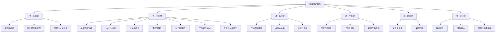
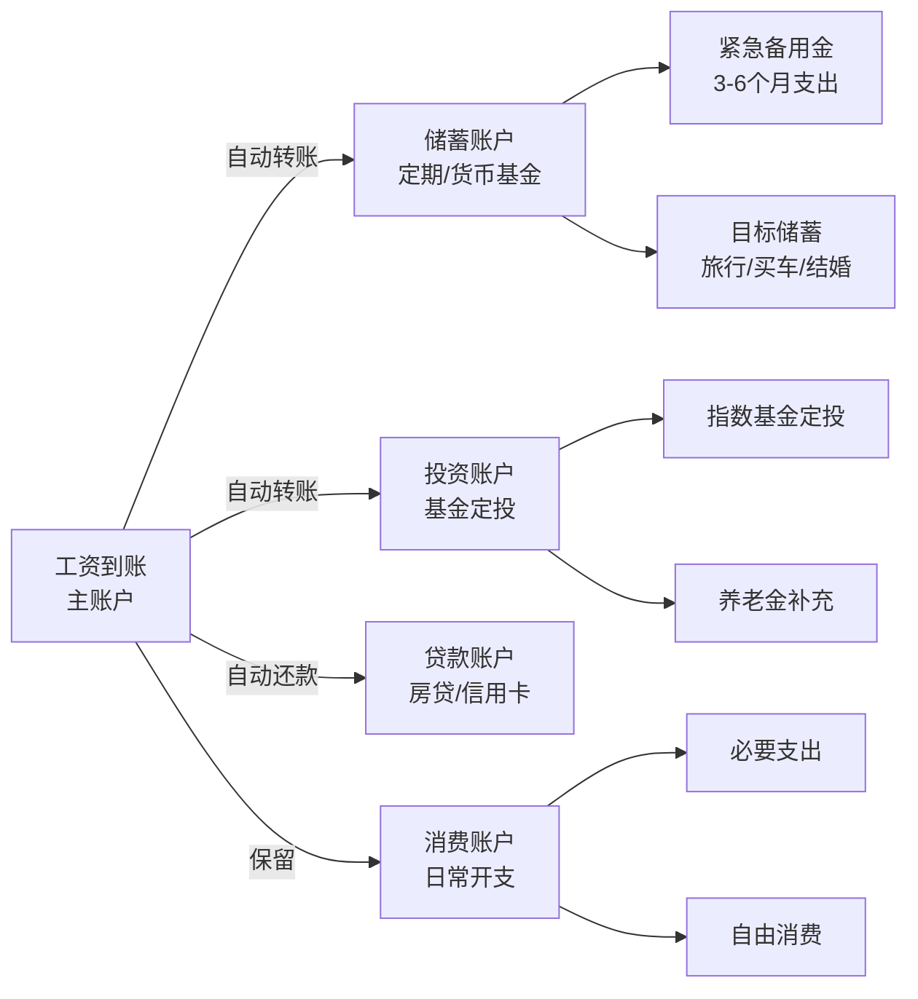
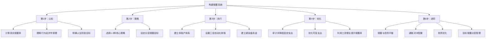

## 二、储蓄策略：积少成多的艺术

> 储蓄不是克制欲望的苦行，而是用今天的确定性对冲明天的不确定性。

储蓄是所有财务规划的基石。没有储蓄，就没有投资的本金、没有抵御风险的缓冲、没有实现梦想的资本。然而，储蓄绝不仅仅是"少花钱多存钱"这么简单——它涉及行为经济学、自动化系统设计、心理账户管理、税务优化等多个维度。本章将从底层原理到高阶技巧，系统性地构建你的储蓄能力体系。



---

### 2.1 道 · 理解储蓄的本质

#### 2.1.1 储蓄率——财务健康的核心指标

储蓄率是衡量个人财务健康程度最直观、最核心的单一指标。它的计算公式简单：

**储蓄率 = 每月储蓄额 ÷ 月收入 × 100%**

但这里有两个关键细节需要注意：

**收入的定义**：建议使用税后到手收入作为分母。因为税前收入中有一部分你根本无法支配（个税、社保个人缴纳部分），用税后收入才能真实反映你的可支配能力。

**储蓄的定义**：储蓄不仅包括银行存款的增加，还应包括：

- 公积金个人缴纳部分（这是强制储蓄，且享受单位等比例缴纳，实际回报率极高）
- 养老保险个人缴纳部分（长期储蓄，退休后可领取）
- 医疗保险个人缴纳部分（进入个人账户，可用于医疗消费）
- 偿还贷款本金的部分（减少负债 = 增加净资产）
- 投资账户的新增投入（基金定投、股票等）
- 企业年金/职业年金个人缴纳部分（部分央企和事业单位提供）

> **为什么不建议只看"银行存款增加额"？**
>
> 一个月薪15000元的白领，如果只看银行账户，可能觉得"每月只能存2000元"（储蓄率13%）。但加上公积金个人+单位缴纳共3600元、社保个人部分1200元、房贷本金偿还3500元、基金定投1500元，实际储蓄总额为11800元，储蓄率高达78.7%。计算方式的巨大差异会直接影响你对自身财务状况的判断——前者让人焦虑，后者让人安心。两种计算方式都有意义，但"全景储蓄率"更能反映真实的财务积累速度。

#### 储蓄率评级对照表

| 储蓄率 | 财务健康评级 | 含义说明 | 应对策略 |
|--------|------------|----------|----------|
| < 10% | 危险 | 收支紧绷，任何意外都可能导致负债。月薪1万只能存不到1000元，一次意外开支就会打破平衡 | 立即审计支出，砍掉所有非必要消费，寻找增加收入的途径 |
| 10-20% | 及格 | 能缓慢积累，但财务自由遥遥无期。月薪1万存1000-2000元 | 优化支出结构，重点削减固定开支中的低效部分 |
| 20-30% | 良好 | 大多数理财书籍推荐的标准区间。月薪1万存2000-3000元 | 保持节奏，开始将储蓄系统化、自动化 |
| 30-50% | 优秀 | 可以较快实现重大财务目标。月薪1万存3000-5000元 | 优化储蓄配置，让储蓄产生更多被动收入 |
| > 50% | 卓越 | FIRE运动的核心策略。月薪1万存5000元以上 | 关注投资回报和税务优化，加速财富积累 |

#### 储蓄率与财务自由时间线

储蓄率直接决定了你实现财务自由所需的时间。假设你从零开始，投资年化回报率为5%（扣除通胀后），财务自由的定义为积累年支出25倍的资产（4%提取率法则）：

| 储蓄率 | 达到财务自由所需年数 | 加速效果（比上一档少几年） |
|--------|-------------------|----------------------|
| 10% | 约51年 | — |
| 20% | 约37年 | -14年 |
| 30% | 约28年 | -9年 |
| 40% | 约22年 | -6年 |
| 50% | 约17年 | -5年 |
| 60% | 约12.5年 | -4.5年 |
| 70% | 约8.5年 | -4年 |

这张表揭示了一个反直觉的事实：**储蓄率的边际效用在高区间依然显著**。很多人认为存够一定比例后就不值得再压缩了，但数据显示，从50%提升到60%仍然能缩短4.5年。当然，这个模型假设你的支出水平在储蓄率提升后保持不变——如果你通过降低生活支出来提高储蓄率，那么达到财务自由所需的资产总额也会随之降低，效果更加显著。

**真实案例**：小王和小李同年入职，月薪均为10000元。小王储蓄率20%，小李储蓄率50%。5年后，小王积累了约15万元（含投资收益），而小李积累了约40万元。差距不仅来自储蓄金额的差异，更来自小李较低的生活支出基数——小李实现财务自由所需的资产目标本身就更小。

#### 如何精确计算自己的储蓄率

```python
def calculate_savings_rate(monthly_income_after_tax, savings_components):
    """
    计算真实储蓄率（全景版）

    参数:
        monthly_income_after_tax: 税后月收入（到手工资）
        savings_components: 储蓄组成部分字典
    """
    total_savings = sum(savings_components.values())
    savings_rate = total_savings / monthly_income_after_tax * 100

    print(f"税后月收入: ¥{monthly_income_after_tax:,.0f}")
    print("---储蓄明细---")
    for item, amount in savings_components.items():
        print(f"  {item}: ¥{amount:,.0f} ({amount/monthly_income_after_tax*100:.1f}%)")
    print(f"---合计---")
    print(f"月储蓄总额: ¥{total_savings:,.0f}")
    print(f"全景储蓄率: {savings_rate:.1f}%")

    # 评级
    if savings_rate < 10:
        grade = "危险"
    elif savings_rate < 20:
        grade = "及格"
    elif savings_rate < 30:
        grade = "良好"
    elif savings_rate < 50:
        grade = "优秀"
    else:
        grade = "卓越"
    print(f"评级: {grade}")

    # 估算财务自由时间（简化模型）
    annual_savings = total_savings * 12
    annual_expense = (monthly_income_after_tax - total_savings) * 12
    if annual_expense > 0:
        fi_target = annual_expense * 25  # 4%法则
        years_to_fi = fi_target / annual_savings if annual_savings > 0 else float('inf')
        print(f"\n财务自由估算（简化模型，未计投资收益）:")
        print(f"  年支出: ¥{annual_expense:,.0f}")
        print(f"  财务自由目标: ¥{fi_target:,.0f} (年支出×25)")
        print(f"  纯储蓄达标: 约{years_to_fi:.0f}年")
        print(f"  含5%投资收益达标: 约{years_to_fi*0.65:.0f}年")

    return savings_rate

# 示例：月薪15000元的白领
savings = {
    "银行定存": 2000,
    "基金定投": 1500,
    "公积金个人缴纳": 1800,
    "公积金单位缴纳": 1800,  # 很多人忽略这部分
    "养老/医保个人部分": 1200,
    "房贷本金偿还": 3500,
}
calculate_savings_rate(15000, savings)
# 全景储蓄率 = 78.7%（含公积金单位部分）
# 个人视角储蓄率 = 66.7%（不含单位缴纳）
# 窄义储蓄率 = 23.3%（仅银行+基金）
```

#### 2.1.2 储蓄背后的行为经济学原理

理解储蓄的心理机制，比掌握任何单一技巧都重要。储蓄本质上是"现在的自己"与"未来的自己"之间的博弈。

##### 延迟满足与双曲贴现

人类天生倾向于即时满足。行为经济学中的"双曲贴现"（Hyperbolic Discounting）理论解释了为什么大多数人存不下钱：**人们会过度低估未来收益的现值**。

经典实验：给你两个选择——今天拿100元，或者一个月后拿120元。理性计算显示等待的月化收益率是20%（年化约792%），但多数人仍然会选择今天拿100元。

这个倾向意味着：**纯粹靠意志力储蓄注定失败**。有效的储蓄策略必须通过系统设计来对抗人性弱点，而不是依赖自律。

**实战启示**：

- 不要问自己"这个月要不要存钱"，而是让系统自动扣款
- 不要把钱放在随手可取的账户中，增加取款的物理障碍
- 不要给自己"这个月先不存"的选项，因为大脑总会找到理由

##### 心理账户理论

诺贝尔经济学奖得主理查德·塞勒（Richard Thaler）提出的"心理账户"（Mental Accounting）理论指出：人们会在心理上将钱分到不同的"账户"中，并对不同账户采用不同的消费规则。

**储蓄的实战应用**：给不同的储蓄目标开立不同的账户，利用心理账户效应让每笔钱都有"使命"。例如：

- "旅行基金"账户——这笔钱你不会轻易动用，因为它的心理标签是"旅行"
- "应急金"账户——只有真正的紧急情况才会触发
- "买房首付"账户——明确的目标让消费冲动难以入侵

这就是为什么"一个大账户存所有钱"的效果远不如"多个专用账户各存各的"。

##### 默认效应与选择架构

行为经济学的另一个核心发现是：**默认选项具有巨大的力量**。当储蓄是默认行为（自动转账）时，人们不会觉得"损失"了这笔钱；但如果需要手动操作储蓄，每次操作都会触发"损失厌恶"心理。

这就是"先储蓄后消费"策略的理论基础——将储蓄设置为默认选项，让消费去适应剩余的资金，而不是反过来。

##### 损失厌恶在储蓄中的双面性

损失厌恶（Loss Aversion）是指人们对损失的痛苦感约为获得同等金额快乐感的2倍。这个心理特征可以被巧妙利用：

- **正面利用**：将储蓄描述为"保护未来的自己不陷入困境"，利用损失厌恶来增强储蓄动机
- **正面利用**：使用"承诺机制"（如定存、封闭基金），让提前取出变成"损失"，从而降低冲动消费
- **负面陷阱**：过度储蓄导致生活质量严重下降，这是损失厌恶的反面——害怕"浪费"任何一分钱

##### 峰终定律与储蓄体验

诺贝尔奖得主丹尼尔·卡尼曼提出的"峰终定律"（Peak-End Rule）指出，人们对一段经历的记忆主要由两个时刻决定：体验最强烈的时刻和结束时的时刻。

**在储蓄中的应用**：

- **峰值设计**：在储蓄的里程碑时刻（如存到第一个1万元、第一个10万元）制造仪式感，强化正向记忆
- **终值设计**：每次记账或查账时，看到的是"累计储蓄总额"而非"本月少花了多少"，让"终值"是积极的

#### 2.1.3 储蓄与人生阶段

不同人生阶段的储蓄策略应有不同侧重：

| 人生阶段 | 年龄参考 | 储蓄重点 | 推荐储蓄率 | 关键策略 |
|----------|---------|---------|-----------|---------|
| 职场新人 | 22-25岁 | 建立习惯，积累紧急备用金 | 10-20% | 先储蓄后消费、365天存钱法 |
| 职场成长期 | 25-30岁 | 加速积累，为买房/结婚准备 | 20-35% | 工资增长储蓄法、零基预算 |
| 家庭建设期 | 30-35岁 | 平衡还贷与储蓄，子女教育基金 | 15-25% | 目标分层储蓄、保险配置 |
| 事业稳定期 | 35-45岁 | 提高投资比例，养老金规划 | 25-40% | 多账户自动化、税务优化 |
| 财务冲刺期 | 45-55岁 | 最大化储蓄，为退休做准备 | 30-50% | 降低负债、集中投资 |
| 退休准备期 | 55岁+ | 保守储蓄，保障流动性 | 20-30% | 稳健理财、减少风险敞口 |

> **关键洞察**：25-35岁是储蓄的"黄金窗口期"。这个阶段收入开始增长但消费习惯尚未完全膨胀，如果能在收入增长时保持储蓄率不降甚至提升，复利效应将在未来20-30年产生巨大威力。错过这个窗口，后面追赶的难度会指数级增加。

---

### 2.2 法 · 六大核心储蓄策略

#### 2.2.1 先储蓄后消费法（Pay Yourself First）

**核心理念**：在花钱之前先存钱。这不是一个技巧，而是一个哲学——你值得被优先支付。

**行为经济学基础**：这个方法利用了"默认效应"——当储蓄成为默认选项时，人们自然会调整消费习惯来适应剩余的资金。心理学研究表明，人们对"剩下的钱"的消费弹性远大于对"总收入"的消费弹性。

**具体操作步骤**：

1. **确定储蓄比例**：建议从收入的20%起步，逐步提升到30%或更高
2. **选择储蓄账户**：开设一个专门的储蓄账户，与日常消费账户物理隔离（不同银行更佳）
3. **设置自动转账**：在银行APP中设置"工资日+1天"的自动转账规则
   - 为什么是"+1天"而非"当天"？因为部分企业的工资到账时间不固定（可能提前1-2天），设置+1天可以避免因工资延迟到账导致转账失败
4. **锁定账户**：考虑使用需要到柜台才能取款的账户，增加取款摩擦力
5. **逐步提升比例**：每3个月审视一次，如果生活没有受到影响，将储蓄比例提升5个百分点

**常见误区与纠正**：

| 误区 | 为什么是错的 | 正确做法 |
|------|------------|---------|
| "等月底有剩余再存" | 消费会自动膨胀到填满所有可支配金额，月底几乎不会有剩余 | 设置工资日自动转账，让储蓄先于消费发生 |
| "这个月有大额支出，下个月多存点补回来" | 大额支出每个月都有，"下个月"永远不会到来 | 在零基预算中预设"大额支出桶"，专门应对这类情况 |
| "收入太低存不了多少" | 关键是建立储蓄习惯而非储蓄金额。习惯比金额重要100倍 | 从月收入的5%甚至1%开始，让系统自动运转 |
| "存太多影响生活质量" | 如果20%的储蓄就严重影响生活质量，说明消费结构有问题 | 先审计支出，找出"隐形浪费"后再决定储蓄比例 |

#### 2.2.2 50/30/20法则

由美国参议员伊丽莎白·沃伦（Elizabeth Warren）在其著作《All Your Worth》中提出。这是一个简单但强大的预算框架，适合作为储蓄入门者的起点。

**三大类别的详细划分**：

**50% 必要支出**（Needs）：

- 住房：房租或房贷月供（含物业费）
- 餐饮：在家做饭的基本食材费用
- 交通：通勤费用（公交/地铁/油费/停车费）
- 保险：医疗险、意外险等基础保障
- 通讯：手机话费、宽带费
- 水电气：基本生活能源费用
- 必要教育：孩子学费、必需的职业培训
- 医疗：常规药物、体检费用

**30% 个人消费**（Wants）：

- 外出就餐和外卖
- 娱乐：电影、游戏、KTV
- 购物：服装、电子产品、家居装饰
- 旅行度假
- 兴趣爱好：健身卡、乐器、手工材料
- 订阅服务：视频会员、音乐会员、付费App
- 社交：聚会、人情往来

**20% 储蓄和投资**（Savings & Debt Repayment）：

- 紧急备用金
- 投资（基金、股票、债券等）
- 超额偿还贷款（如提前还房贷）
- 退休金补充（个人养老金账户）

**在中国语境下的调整建议**：

一线城市的生活成本较高，住房支出可能单独就占收入的30-40%。对此有两种处理方式：

1. **调整比例**：将必要支出放宽到60%，个人消费压缩到20%，储蓄维持20%（即60/20/20）
2. **精细分类**：将房贷中"偿还本金"的部分计入储蓄（因为这是在增加你的净资产），只有利息部分计入必要支出

```python
def check_budget_50_30_20(monthly_income, expenses):
    """
    检查预算是否符合50/30/20法则

    参数:
        monthly_income: 月税后收入
        expenses: 支出字典，格式为 {"类别": (金额, "need"/"want")}
    """
    needs = sum(amt for amt, cat in expenses.values() if cat == "need")
    wants = sum(amt for amt, cat in expenses.values() if cat == "want")
    savings = monthly_income - needs - wants

    needs_pct = needs / monthly_income * 100
    wants_pct = wants / monthly_income * 100
    savings_pct = savings / monthly_income * 100

    print(f"月收入: ¥{monthly_income:,.0f}")
    print(f"必要支出: ¥{needs:,.0f} ({needs_pct:.1f}%) [目标: ≤50%] {'✓' if needs_pct <= 50 else '⚠ 超标'}")
    print(f"个人消费: ¥{wants:,.0f} ({wants_pct:.1f}%) [目标: ≤30%] {'✓' if wants_pct <= 30 else '⚠ 超标'}")
    print(f"储蓄投资: ¥{savings:,.0f} ({savings_pct:.1f}%) [目标: ≥20%] {'✓' if savings_pct >= 20 else '⚠ 不足'}")

    if savings_pct < 20:
        over_needs = max(0, needs_pct - 50)
        over_wants = max(0, wants_pct - 30)
        print(f"\n建议调整:")
        if over_needs > 0:
            print(f"  必要支出超标 {over_needs:.1f}%，建议寻找降低固定开支的方法")
        if over_wants > 0:
            print(f"  个人消费超标 {over_wants:.1f}%，建议削减非必要消费")
        shortfall = monthly_income * 0.20 - savings
        if shortfall > 0:
            print(f"  距离20%储蓄目标还差: ¥{shortfall:,.0f}/月")

# 示例
expenses = {
    "房租": (4000, "need"),
    "餐饮-自己做": (1500, "need"),
    "交通通勤": (500, "need"),
    "水电燃气": (300, "need"),
    "手机话费": (100, "need"),
    "外卖+外出就餐": (1200, "want"),
    "娱乐": (800, "want"),
    "购物": (600, "want"),
    "订阅服务": (200, "want"),
}
check_budget_50_30_20(15000, expenses)
```

#### 2.2.3 阶梯储蓄法

**核心理念**：通过渐进式提升储蓄率，让身体和心理逐步适应更紧缩的消费水平，避免一次性大幅削减带来的反弹。

**标准阶梯方案**（适合月入8000-20000元的上班族）：

| 月份 | 储蓄率 | 月薪10000元对应储蓄额 | 累计储蓄 | 心理状态 |
|------|--------|---------------------|---------|---------|
| 第1月 | 10% | ¥1,000 | ¥1,000 | 轻松启动，几乎无痛感 |
| 第2月 | 15% | ¥1,500 | ¥2,500 | 开始适应，略有挑战 |
| 第3月 | 20% | ¥2,000 | ¥4,500 | 里程碑达成，正反馈增强 |
| 第4月 | 25% | ¥2,500 | ¥7,000 | 需要一些消费调整 |
| 第5月 | 30% | ¥3,000 | ¥10,000 | 五位数里程碑！ |
| 第6月 | 30% | ¥3,000 | ¥13,000 | 巩固期，让习惯固化 |

**关键执行要点**：

1. **每一步的调整日选在发薪日**，不要在月中切换储蓄率，否则计算会混乱
2. **每提升一档，先观察2周**，确认不会影响必要的生活品质后再固定
3. **如果某一档让你感到明显痛苦，暂停在该档位**，多停留1-2个月再继续
4. **记录每一档的消费感受**，这有助于找到你的"舒适储蓄率上限"

**阶梯储蓄法的心理学优势**：

- **渐进适应**：大脑的适应机制让你不会感到过度痛苦，类似于健身中的渐进超负荷
- **正反馈循环**：每提升一档都是一个可庆祝的里程碑，储蓄的成就感会逐步增强
- **自我认知**：通过逐级尝试，你能精确找到自己的"最优储蓄率"——即在不影响生活满意度的前提下能达到的最高储蓄率

#### 2.2.4 零基预算法（Zero-Based Budgeting）

**核心理念**：每一分钱都要有去处。月初将全部收入分配到不同的"桶"中，收入减去所有支出（包括储蓄）后，结果为零。

**桶的设置建议**：

| 桶名 | 比例 | 用途 | 管理方式 |
|------|------|------|----------|
| 生活桶 | 50% | 房租、餐饮、交通、水电等必要支出 | 主账户直接支付 |
| 储蓄桶 | 20% | 紧急备用金、长期投资 | 自动转入专用账户 |
| 自由桶 | 20% | 个人消费、娱乐、购物 | 转入独立消费账户 |
| 弹性桶 | 10% | 应对意外支出、人情往来、临时需求 | 保留在主账户 |
| 债务桶 | 视情况 | 信用卡还款、贷款偿还 | 自动还款设置 |

**零基预算法的月度执行流程**：

1. **月初（发薪日）**：
   - 确认当月总收入（含工资、副业、利息等）
   - 按比例分配到各桶
   - 设置自动转账

2. **月中（第15天）**：
   - 检查各桶的使用情况
   - 如果某桶即将超支，从弹性桶调剂
   - 如果某桶有剩余，可以转入储蓄桶

3. **月末（最后一天）**：
   - 统计各桶的实际使用情况
   - 弹性桶的剩余部分全部转入储蓄桶
   - 分析偏差原因，为下月调整提供依据

**零基预算 vs 传统记账的区别**：

传统记账是"先花钱再记录"，本质上是事后追认；零基预算是"先分配再花钱"，本质上是事前规划。前者只能让你知道钱花在了哪里，后者能让你控制钱花在了哪里。

```python
def zero_based_budget(monthly_income, custom_ratios=None):
    """
    零基预算分配器

    参数:
        monthly_income: 月税后总收入
        custom_ratios: 自定义比例字典，如 {"生活": 0.55, "储蓄": 0.25}
    """
    default_ratios = {
        "生活桶（必要支出）": 0.50,
        "储蓄桶（储蓄投资）": 0.20,
        "自由桶（个人消费）": 0.20,
        "弹性桶（灵活备用）": 0.10,
    }

    ratios = custom_ratios or default_ratios
    total_ratio = sum(ratios.values())

    if abs(total_ratio - 1.0) > 0.001:
        print(f"⚠ 比例之和为 {total_ratio:.2f}，不等于1.0，请调整")
        return

    print(f"月收入: ¥{monthly_income:,.0f}")
    print("=" * 50)
    remaining = monthly_income
    for bucket, ratio in ratios.items():
        amount = round(monthly_income * ratio)
        remaining -= amount
        print(f"{bucket}: ¥{amount:,.0f} ({ratio*100:.0f}%)")

    if remaining != 0:
        print(f"尾差调整: ¥{remaining:,.0f}（归入弹性桶）")
    print("=" * 50)
    print(f"分配完毕，余额: ¥0（零基预算目标达成）")

zero_based_budget(15000)
```

#### 2.2.5 365天存钱法

**基本规则**：第1天存1元，第2天存2元……第365天存365元。一年下来总储蓄额 = 1+2+3+...+365 = 66,795元。

**这个方法的优势**：

- 游戏化设计降低了储蓄的心理门槛
- 前期金额很小，几乎无痛感
- 每天都有完成任务的成就感
- 适合培养储蓄习惯

**但这个方法有一个严重的结构性问题**：

后期金额急剧增大。第300天需要存300元（约月均9000元），第365天需要存365元。对于月薪不高的人来说，后期的单日储蓄额可能超过日收入。这就是很多人在第100-150天左右放弃的原因。

**改良版方案**：

| 变体 | 规则 | 年储蓄总额 | 适合人群 |
|------|------|-----------|---------|
| 经典版 | 第N天存N元 | ¥66,795 | 月入2万+且自律性强 |
| 小额版 | 第N天存N×0.1元 | ¥6,679.5 | 学生、刚工作的人 |
| 倒序版 | 第1天存365元，逐日递减 | ¥66,795 | 有年终奖/年初收入高的人 |
| 随机版 | 准备365个数字的签筒，每天抽一个并存入对应金额 | ¥66,795 | 喜欢新鲜感和随机性的人 |
| 周递增版 | 每周增加10元，第1周存10元，第52周存520元 | ¥13,780 | 大多数工薪阶层 |
| 双周版 | 每两周一个周期，每周期比上一周期多存50元 | ¥17,290 | 双周发薪制的公司 |

**推荐替代方案——"周阶梯法"**：

第1周：存 50 元
第2周：存 60 元
第3周：存 70 元
...
第52周：存 560 元

年储蓄总额 = (50+560)×52/2 = 15,860 元

这个方案的单周最大储蓄额（560元）对大多数人来说是可承受的，同时年储蓄总额也相当可观。

#### 2.2.6 无消费日挑战

**基本规则**：设定每周有2-3天为"无消费日"，在这些天里不进行任何非必要的消费（交通、紧急医疗等必要支出除外）。

**执行技巧**：

1. **选择固定的日子**：比如每周二和周四。固定的日子更容易形成习惯
2. **提前准备**：在前一天准备好次日的午餐、确认不需要打车等
3. **找到替代行为**：用免费活动替代消费活动（看书替代逛商场，跑步替代健身房）
4. **记录节省金额**：每次无消费日结束后，记录当天省下的钱，月底汇总
5. **社交无消费日**：与朋友/家人一起挑战，增加趣味性和坚持动力

**预期收益**：假设每个无消费日平均节省80-150元（因人而异），每周2天，一年可节省约8,000-15,000元。

**进阶版——"30天极简消费挑战"**：

在一个月内，只允许以下支出：

- 固定账单（房租、水电、通讯）
- 基本食材（不含外卖和外出就餐）
- 必要交通
- 紧急医疗

这个挑战的目的不是让你永远这样生活，而是通过30天的极端体验，让你清楚地认识到：哪些消费是真正必要的，哪些只是习惯性的。很多人在挑战结束后会自发地降低20-30%的月消费。

#### 2.2.7 工资增长储蓄法（最被低估的高效策略）

每当工资增长，将增长部分的至少50%直接转入储蓄，而非全部用于消费升级。

例如：月薪从10000涨到12000，增长2000元——

- 将其中1500元（75%）自动转入储蓄
- 剩余500元用于提升生活品质

这样做的好处是：你的生活质量仍然有所提升（不会感到"白涨了"），但储蓄率大幅提高。如果每次涨薪都这样操作，几年后你的储蓄率将远超同龄人。

**实战案例**：

| 年份 | 月薪 | 涨幅 | 增长储蓄（75%） | 生活提升（25%） | 储蓄率变化 |
|------|------|------|---------------|---------------|-----------|
| 第1年 | 8000 | — | — | — | 20% |
| 第2年 | 10000 | +2000 | +1500 | +500 | 25% |
| 第3年 | 12000 | +2000 | +1500 | +500 | 29% |
| 第4年 | 15000 | +3000 | +2250 | +750 | 33% |
| 第5年 | 18000 | +3000 | +2250 | +750 | 36% |

5年后，月薪从8000涨到18000（涨了125%），但储蓄率从20%提升到36%。如果完全消费升级，储蓄率仍然是20%——两种策略下，5年累计储蓄差距可达20-30万元。

---

### 2.3 术 · 储蓄的自动化系统设计

手动储蓄的最大敌人是"执行损耗"——每个月你需要做出一次"是否储蓄、储蓄多少"的决定，而每次决定都消耗意志力，都给了自己一个"这次少存一点"的机会。

**自动化的核心原则**：让储蓄在你不知不觉中发生。

#### 2.3.1 多账户体系设计



#### 2.3.2 推荐的账户配置

以主流银行为例，以下是推荐的账户架构：

| 账户 | 用途 | 推荐产品 | 设置方式 |
|------|------|----------|----------|
| 工资卡（主账户） | 收入归集、自动转账源头 | 工资代发行默认卡 | 保持默认 |
| 货币基金账户 | 紧急备用金，T+0赎回 | 余额宝/朝朝宝/零钱通 | 设置工资日+1自动转入 |
| 定期存款账户 | 中长期储蓄（1-3年目标） | 银行定期存款/大额存单 | 设置每月自动转入 |
| 基金定投账户 | 长期投资（3年以上目标） | 指数基金定投 | 设置每周/每月自动定投 |
| 消费专用账户 | 日常开支，绑定微信/支付宝 | 任意银行储蓄卡 | 从主账户转入固定金额 |
| 个人养老金账户 | 退休储蓄，享受税收优惠 | 个人养老金专用账户 | 每年存满12000元上限 |

#### 2.3.3 自动转账的时机设置

最佳实践是设置**三层自动化**：

1. **第一层（工资日+1天）**：从主账户自动转入储蓄账户和投资账户（先储蓄）
2. **第二层（工资日+2天）**：从主账户自动转入消费账户（设定月度消费预算）
3. **第三层（工资日+3天）**：自动还款设置（房贷、信用卡等）
4. **剩余资金**：留在主账户中，作为弹性支出和月末结余

> **为什么不设置在工资日当天？**
>
> 部分企业的工资发放存在1-2天的浮动（尤其在节假日前后），设置+1/+2天可以避免因工资延迟到账导致自动转账失败。转账失败本身不是大问题，但它会打破"无感储蓄"的心理状态——你会开始关注"钱到了没有"，增加决策负担。

#### 2.3.4 信封法的数字化实操

传统的信封法（将现金分装到不同信封中）在移动支付时代已不太实用，但其核心思想——"为每笔钱赋予使命"——依然有效。以下是数字化的信封法：

**实操步骤**：

1. 在记账APP中创建不同的"账户"（非真实银行账户，而是虚拟分类）
2. 每月发薪后，将金额分配到各虚拟账户
3. 每次消费后，在APP中从对应账户扣除
4. 如果某账户余额不足，说明该类别的预算已用完

**推荐的信封分类**：

| 信封名称 | 月预算 | 包含内容 |
|----------|--------|---------|
| 餐饮 | 2000元 | 自己做饭、外卖、外出就餐 |
| 交通 | 500元 | 公交地铁、打车、共享单车 |
| 日用 | 300元 | 生活用品、清洁用品 |
| 娱乐 | 800元 | 电影、游戏、聚会 |
| 购物 | 600元 | 服装、电子产品、家居 |
| 人情 | 500元 | 礼物、请客、红包 |
| 学习 | 300元 | 书籍、课程、工具 |
| 医疗 | 200元 | 药品、体检、门诊 |

---

### 2.4 器 · 储蓄工具箱

#### 2.4.1 记账工具对比

| 工具 | 平台 | 自动记账 | 价格 | 推荐场景 |
|------|------|---------|------|---------|
| 随手记 | iOS/Android/Web | 支持银行卡绑定 | 免费+VIP | 全功能记账，适合重度用户 |
| 钱迹 | iOS/Android | 支持银行+支付宝+微信 | 免费+Pro | 界面简洁，适合轻度用户 |
| 鲨鱼记账 | iOS/Android | 部分支持 | 免费 | 极简入门 |
| YNAB | Web/iOS/Android | 支持 | 付费（$99/年） | 零基预算法用户首选 |
| Excel/Notion | 全平台 | 手动 | 免费 | 自定义程度最高 |

#### 2.4.2 储蓄率自动追踪脚本

```python
import json
import os
from datetime import datetime

SAVINGS_LOG_FILE = "savings_log.json"

def load_log():
    """加载历史记录"""
    if os.path.exists(SAVINGS_LOG_FILE):
        with open(SAVINGS_LOG_FILE, 'r', encoding='utf-8') as f:
            return json.load(f)
    return {"records": [], "summary": {}}

def save_log(data):
    """保存记录"""
    with open(SAVINGS_LOG_FILE, 'w', encoding='utf-8') as f:
        json.dump(data, f, ensure_ascii=False, indent=2)

def record_month(income, savings_components, month=None):
    """
    记录每月储蓄数据

    参数:
        income: 税后月收入
        savings_components: 储蓄明细字典 {"项目": 金额}
        month: 月份字符串，如 "2025-01"，默认当月
    """
    if month is None:
        month = datetime.now().strftime("%Y-%m")

    total_savings = sum(savings_components.values())
    rate = total_savings / income * 100

    record = {
        "month": month,
        "income": income,
        "savings": savings_components,
        "total_savings": total_savings,
        "rate": round(rate, 1),
    }

    log = load_log()
    # 更新或添加记录
    existing = [i for i, r in enumerate(log["records"]) if r["month"] == month]
    if existing:
        log["records"][existing[0]] = record
    else:
        log["records"].append(record)

    # 更新汇总
    rates = [r["rate"] for r in log["records"]]
    log["summary"] = {
        "avg_rate": round(sum(rates) / len(rates), 1),
        "max_rate": max(rates),
        "min_rate": min(rates),
        "months_tracked": len(rates),
        "total_saved": sum(r["total_savings"] for r in log["records"]),
    }

    save_log(log)
    print(f"✓ {month} 储蓄率: {rate:.1f}% (¥{total_savings:,.0f})")
    return record

def show_trend():
    """显示储蓄率趋势"""
    log = load_log()
    if not log["records"]:
        print("暂无记录")
        return

    print("\n储蓄率趋势")
    print("=" * 50)
    for r in sorted(log["records"], key=lambda x: x["month"]):
        bar = "█" * int(r["rate"] / 2)
        print(f"{r['month']}: {bar} {r['rate']}% (¥{r['total_savings']:,.0f})")

    s = log["summary"]
    print("=" * 50)
    print(f"平均储蓄率: {s['avg_rate']}% | 最高: {s['max_rate']}% | 最低: {s['min_rate']}%")
    print(f"累计储蓄: ¥{s['total_saved']:,.0f} | 追踪月数: {s['months_tracked']}")
```

#### 2.4.3 银行产品选择指南

在中国，储蓄相关的主要银行产品如下：

| 产品类型 | 代表产品 | 年化收益 | 流动性 | 起投金额 | 适合场景 |
|----------|---------|---------|--------|---------|---------|
| 活期存款 | 各银行活期 | 0.2-0.25% | 即时 | 无 | 日常零用，不推荐大额存放 |
| 货币基金 | 余额宝/零钱通 | 1.5-2.5% | T+0 | 1元 | 紧急备用金首选 |
| 银行T+0理财 | 招行朝朝宝等 | 2.0-3.0% | T+0 | 1元 | 短期闲置资金 |
| 定期存款 | 各银行定期 | 1.5-2.0%（1年） | 到期取出 | 50元 | 中期储蓄目标 |
| 大额存单 | 各银行大额存单 | 2.0-2.5%（1年） | 可转让 | 20万元 | 大额闲置资金 |
| 国债 | 储蓄国债 | 2.5-3.0% | 按年付息 | 100元 | 稳健保守型投资者 |
| 个人养老金 | 专属产品 | 视产品而定 | 退休后取出 | 无上限（年缴≤12000） | 享受税收优惠的退休储蓄 |

> **2024-2025年利率环境提示**：中国处于低利率周期，银行存款利率持续走低。纯银行存款已很难跑赢通胀，建议将储蓄分为"安全垫"（货币基金+定期）和"增长部分"（基金定投），具体比例根据个人风险承受能力调整。

---

### 2.5 防 · 紧急备用金的建立与管理

紧急备用金是个人财务安全的第一道防线。没有紧急备用金的人，一旦遇到失业、疾病或意外，就会被迫借高利贷或低价变卖资产，陷入恶性循环。

#### 2.5.1 备用金的目标金额

**标准建议**：3-6个月的基本生活支出。

**具体情况调整**：

| 个人情况 | 建议备用金月数 | 理由 |
|----------|-------------|------|
| 双薪家庭，工作稳定 | 3个月 | 收入来源多元，风险分散 |
| 单一收入来源 | 6个月 | 失业即零收入，需要更长缓冲 |
| 自由职业/创业者 | 9-12个月 | 收入波动大，可能有长期无收入期 |
| 有慢性病/高龄父母 | 6-9个月 | 医疗支出可能突然增加 |
| 刚毕业/工作不满1年 | 3个月 | 先建立基础防线，逐步增加 |
| 公务员/事业单位 | 3个月 | 工作极其稳定，失业风险极低 |

**计算示例**：

月基本生活支出：
  房租/房贷：4,000元
  餐饮（自己做饭）：1,500元
  交通通勤：500元
  水电气通讯：400元
  保险费用：300元
  日用品：200元
  ——————————
  月基本支出合计：6,900元

  6个月备用金目标：6,900 × 6 = 41,400元

#### 2.5.2 备用金的存放策略

备用金的核心要求是**安全性**和**流动性**，收益率是次要考量。

| 存放方式 | 年化收益 | 流动性 | 安全性 | 推荐度 |
|----------|---------|--------|--------|--------|
| 活期存款 | 0.2-0.25% | 即时 | 极高 | ⭐⭐ 不推荐（收益太低） |
| 货币基金（余额宝/朝朝宝） | 1.5-2.5% | T+0 | 高 | ⭐⭐⭐⭐⭐ 首选 |
| 银行T+0理财 | 2.0-3.0% | T+0 | 高 | ⭐⭐⭐⭐ 推荐 |
| 短期定存（3个月） | 1.5-2.0% | 到期取出 | 极高 | ⭐⭐⭐ 可配置部分 |
| 国债逆回购 | 1.5-5.0%（波动） | 1-28天 | 极高 | ⭐⭐⭐ 适合有经验者 |

**推荐方案**：将备用金分为两部分——

- **即时可用部分**（30%）：放在货币基金中，应对需要当天用钱的紧急情况
- **快速可用部分**（70%）：放在银行T+1理财或短期定存中，收益稍高，次日可用

#### 2.5.3 备用金的使用规则

建立备用金容易，正确使用备用金更难。很多人的备用金在第一次"紧急"使用后就再也没有补充回来。

**什么算"紧急"**：

✅ **可以动用备用金**：

- 失业期间的生活费（需要有明确的再就业计划）
- 紧急医疗费用（医保报销前的垫付，或医保不覆盖的项目）
- 家庭成员突发重大事件（直系亲属住院等）
- 必要的房屋维修（水管爆裂、电路故障、屋顶漏水）
- 法律紧急事项（被起诉、需要紧急法律援助）

❌ **不可以动用备用金**：

- "打折促销太划算了"的购物——再便宜也不是紧急事件
- 旅行——再便宜也不是紧急事件
- 投资机会——"这只股票一定会涨"是投机，不是紧急
- 借钱给朋友——即使是好朋友，也不应该动用备用金
- 电子产品更新换代——新iPhone发布不是紧急事件
- 孩子的兴趣班报名——可以等下个月正常储蓄支付

**使用后的补充计划**：

动用备用金后的24小时内，制定补充计划：

1. 计算动用了多少
2. 确定补充时间表（建议在3-6个月内补回）
3. 临时提高储蓄率或削减自由消费来加速补充
4. 在补充完成前，暂停非必要投资
5. 在备用金补满之前，不进行任何新的非必要大额消费

---

### 2.6 进 · 提高储蓄率的实用方法

#### 2.6.1 降低固定支出——效果最大的杠杆

固定支出是每月必须支付的费用。降低固定支出的效果远大于压缩可变支出，因为固定支出每月自动扣款，节约效果是持续的、复利式的。

**住房成本优化**（通常是最大的单一支出）：

| 优化策略 | 预估节省 | 适用条件 | 注意事项 |
|----------|---------|----------|----------|
| 合租 | 30-50%的房租 | 单身、刚工作 | 选择靠谱室友，签好协议 |
| 搬到远郊 | 20-40%的房租 | 远程办公或通勤可接受 | 计算交通成本增加是否抵消房租节省 |
| 与房东谈判续约优惠 | 5-10% | 租约到期前 | 长期租客有谈判筹码 |
| 转为公积金贷款买房 | 长期节省大量利息 | 有购房资格和首付 | 公积金利率3.1% vs 商贷4.2%+，差距显著 |
| 申请租房补贴/人才公寓 | 30-50% | 符合当地政策条件 | 关注当地住建局/人社局公告 |

**交通成本优化**：

| 优化策略 | 月节省估算 | 实施难度 |
|----------|-----------|---------|
| 私家车→地铁+公交 | 1500-3000元 | 低 |
| 加入拼车群 | 500-1000元 | 低 |
| 电动自行车通勤（<10km） | 1000-2000元 | 中 |
| 与公司谈远程办公（部分天数） | 500-1500元 | 中 |

**订阅服务审计**：

这是最容易被忽视的"小额高频"支出漏洞。建议每季度做一次订阅审计：

```python
def audit_subscriptions(subscriptions):
    """
    审计所有订阅服务，计算年度总支出并标注优化建议

    参数:
        subscriptions: 列表，每项为 (名称, 月费, 使用频率, 必要性)
        使用频率: "每天" / "每周" / "偶尔" / "几乎不用"
        必要性: "必须" / "想要" / "可替代" / "可取消"
    """
    print("订阅服务审计报告")
    print("=" * 70)
    total_monthly = 0
    cancelable = 0

    for name, monthly_fee, usage, necessity in subscriptions:
        annual_cost = monthly_fee * 12
        total_monthly += monthly_fee

        if necessity == "可取消" or (necessity == "可替代" and usage in ["偶尔", "几乎不用"]):
            status = "❌ 建议取消"
            cancelable += annual_cost
        elif necessity == "想要" and usage == "几乎不用":
            status = "⚠️ 建议暂停"
            cancelable += annual_cost
        else:
            status = "✅ 保留"

        print(f"{name}: ¥{monthly_fee}/月 (¥{annual_cost}/年) | 使用:{usage} | {status}")

    print("=" * 70)
    print(f"月度总支出: ¥{total_monthly:,.0f}")
    print(f"年度总支出: ¥{total_monthly*12:,.0f}")
    if cancelable > 0:
        print(f"可节省金额: ¥{cancelable:,.0f}/年 ({cancelable/12:,.0f}元/月)")
        # 计算复利效果
        future_value = cancelable * ((1.05**10 - 1) / 0.05)
        print(f"→ 这笔钱如果每年投入年化5%的投资，10年后将变成 ¥{future_value:,.0f}")

# 示例
subscriptions = [
    ("爱奇艺会员", 25, "每周", "想要"),
    ("网易云音乐", 15, "每天", "想要"),
    ("WPS会员", 30, "偶尔", "可替代"),
    ("健身房年卡(折月)", 200, "几乎不用", "可取消"),
    ("视频网站B", 25, "几乎不用", "可取消"),
    ("笔记软件高级版", 12, "每周", "可替代"),
    ("iCloud 200GB", 21, "每天", "必须"),
    ("VPN服务", 40, "每天", "必须"),
]
audit_subscriptions(subscriptions)
```

#### 2.6.2 优化可变支出

可变支出的优化核心是"花得聪明"而非"完全不花"。

**餐饮优化**（通常占月支出的15-25%）：

- **学会做饭**：一个基本的做饭能力可以在餐饮上节省40-60%。不需要成为厨师，掌握10道简单菜式就够了——番茄炒蛋、蒜蓉西兰花、可乐鸡翅、酸辣土豆丝、蛋炒饭、煮面条、炒青菜、红烧肉、炖鸡汤、凉拌黄瓜
- **批量备餐（Meal Prep）**：每周日花2-3小时准备好一周的午餐便当，既省钱又省时间
- **买菜策略**：晚上8点后去超市买打折蔬菜和肉类；利用社区团购平台（美团优选、多多买菜）；关注菜市场尾市（通常下午4点后有折扣）
- **减少外卖频率**：外卖的溢价通常在30-50%（配送费+包装费+平台抽成转嫁），每周减少2-3次外卖可月省300-500元

**购物优化**：

- **24小时规则**：任何超过200元的非必要购物，强制等待24小时再决定。研究表明，约60-70%的冲动购物欲望会在24小时内消退
- **建立"愿望清单"**：想买的东西先记在清单上，月底统一审视——你会发现很多东西过了一个月就不想买了
- **比价习惯**：使用比价工具（如慢慢买、什么值得买）查看历史价格，避免在高点买入
- **二手交易**：电子产品、书籍、家具等，在闲鱼等平台购买二手可以节省30-70%
- **反季节购买**：冬季买夏装，夏季买冬装，通常能节省40-60%

#### 2.6.3 增加收入——储蓄率公式分子端的优化

储蓄率 = 储蓄 / 收入。分母增大，即使储蓄金额不变，储蓄率也会提升。更重要的是，增加收入不像降低支出那样有下限——你可以无限增加收入，但支出不能压缩到零。

**增加收入的路径**：

| 路径 | 预期收益 | 时间投入 | 风险 | 详细说明 |
|------|---------|---------|------|----------|
| 争取加薪 | 年增5-30% | 准备1-2个月 | 低 | 见本书"职场提升"章节 |
| 跳槽涨薪 | 年增20-50% | 准备2-3个月 | 中 | 需要评估新环境的稳定性 |
| 技术接单 | 月增1000-10000 | 每周5-15小时 | 低 | 编程、设计、翻译、写作 |
| 知识付费 | 月增500-5000 | 前期投入大，后期被动 | 低 | 课程、咨询、付费社群 |
| 闲置变现 | 一次性2000-20000 | 清理1-2天 | 无 | 闲鱼出售闲置物品 |
| 理财收入 | 年化3-10% | 学习时间 | 中 | 详见本书投资章节 |

---

### 2.7 心 · 储蓄的心理学技巧与习惯养成

储蓄不仅是数学问题，更是心理学问题。以下技巧基于行为科学研究，帮助你建立持久的储蓄习惯。

#### 2.7.1 视觉化与进度追踪

**储蓄目标可视化**：将储蓄目标具象化。不要只写"存够10万"，而是：

- 找一张你想买的房子的照片，设为手机壁纸
- 在记账APP中设置目标进度条
- 在冰箱上贴一张"存钱进度表"，每存1000元涂满一格
- 用玻璃罐装硬币/纸币，直观看到储蓄增长（适合小额储蓄习惯培养）

**进度追踪的科学依据**：心理学中的"目标梯度效应"（Goal Gradient Effect）表明，人们越接近目标，行动力越强。可视化进度能持续激活这个效应。

#### 2.7.2 奖励机制设计

- **每达到一个阶段性目标，给自己一个预设的奖励**。但奖励不能破坏储蓄目标——用"体验型奖励"（看一场电影、吃一顿好的）而非"物质型奖励"（买一个新手机）
- **奖励金额不超过该阶段储蓄额的2-3%**。存了5000元，奖励自己100-150元是合理的
- **预设奖励比临时决定更有效**：在开始储蓄时就写好"如果存到1万，就奖励自己XXX"

#### 2.7.3 "未来自我"练习

斯坦福大学的研究表明，人们对"未来的自己"的心理距离类似于对"陌生人"的心理距离——这就是为什么大多数人不愿意为退休储蓄。

**练习方法**：

1. 每周花5分钟，闭上眼睛，具体想象10年后的自己
2. 想象那时的生活场景：住在哪里？做什么工作？身体状况如何？
3. 思考：如果现在的我多存500元/月，10年后的我会多出多少？（加上投资回报，可能是8-12万元）
4. 把这个想象写下来，存在手机备忘录里，偶尔翻看
5. 如果可能，使用AI工具生成一张"10年后的自己"的照片，设为手机壁纸

#### 2.7.4 社交储蓄

- **找一个储蓄伙伴**：与朋友互相分享储蓄进度，互相监督和鼓励
- **加入储蓄打卡社群**：在小红书、豆瓣等平台有很多"储蓄打卡"小组
- **家庭储蓄挑战**：与家人一起设定储蓄目标，达到后一起庆祝
- **公开承诺**：在社交媒体上宣布你的储蓄目标，利用社交压力增强执行力

#### 2.7.5 环境设计

行为科学家BJ Fogg提出的"微习惯"理论强调：**改变环境比改变意志力更有效**。

- **卸载购物APP**：如果发现自己总是忍不住在淘宝/京东上购物，卸载APP（网页版可以保留，但增加了操作步骤）
- **取消免密支付**：让每次支付都需要输入密码，增加"摩擦力"
- **关注储蓄类内容**：在小红书/抖音上关注"极简生活"、"储蓄打卡"类博主，用环境暗示替代消费暗示
- **清理收件箱**：取消所有电商平台的促销邮件和短信推送

---

### 2.8 通货膨胀对储蓄的影响与应对

储蓄面临的一个隐形敌人是通货膨胀。如果通胀率高于储蓄利率，你的钱虽然数字在增加，但实际购买力在下降。

**近10年中国CPI数据参考**：

| 年份 | CPI涨幅 | 余额宝年化收益 | 实际收益（近似） |
|------|---------|--------------|----------------|
| 2015 | 1.4% | 约3.5% | +2.1% |
| 2018 | 2.1% | 约3.5% | +1.4% |
| 2020 | 2.5% | 约2.0% | -0.5% |
| 2022 | 2.0% | 约1.8% | -0.2% |
| 2024 | 约0.5% | 约1.8% | +1.3% |

> **注意**：CPI是官方统计的消费价格指数，实际生活感受的通胀可能高于CPI（因为CPI的权重结构与个人消费结构可能不同）。尤其是一线城市的住房成本、教育成本、医疗成本的涨幅往往远超CPI。

**应对策略**：

1. **不要把所有储蓄放在银行活期**：至少使用货币基金，收益通常高于活期存款3-5倍
2. **将中长期储蓄配置抗通胀资产**：指数基金、REITs、通胀保值债券等
3. **提高收入是最根本的抗通胀手段**：工资增长通常能跑赢CPI
4. **减少持有大量现金**：超出紧急备用金需求的现金应投入投资
5. **利用公积金贷款买房**：公积金贷款利率（3.1%）低于实际通胀率时，贷款本身就是一种"抗通胀"策略——你用"更值钱"的今天的钱借出，用"更不值钱"的未来的钱偿还

---

### 2.9 储蓄与债务的平衡策略

很多人同时面临"有负债"和"想储蓄"的矛盾。应该先还债还是先存钱？

**决策框架**：

| 情况 | 策略 | 理由 |
|------|------|------|
| 有高息债务（信用卡分期、网贷，年化>10%） | 优先还债，同时维持最低储蓄 | 债务利息远高于储蓄收益，先堵住出血点 |
| 只有低息债务（房贷，年化3-5%） | 同时储蓄和还债 | 低息债务的"成本"不高，储蓄+投资可能获得更高回报 |
| 有紧急备用金需求 | 先存够1个月的基本备用金 | 即使有债务，也需要基本的应急能力 |
| 债务即将还清 | 加速储蓄 | 债务还清后储蓄率会自然跃升 |

**"雪球法"还债 + 储蓄并行方案**：

1. 列出所有债务，按利率从高到低排序
2. 对高息债务（>10%）：每月最大限度偿还
3. 对低息债务（<5%）：按最低还款额偿还
4. 同时将收入的5-10%存入紧急备用金
5. 高息债务还清后，将原还款金额的50%转入储蓄，50%用于加速偿还下一笔债务
6. 所有债务还清后，将全部"还款"金额转为储蓄和投资

**信用卡的正确使用方式**：

信用卡本身不是问题，问题在于使用方式。正确使用信用卡可以提升储蓄效率：

- **利用免息期**：信用卡有最长56天的免息期，合理利用可以让储蓄资金多赚一个月利息
- **积分和返现**：选择有积分或返现功能的信用卡，日常消费获得的返现直接转入储蓄
- **绝对不要分期**：信用卡分期的实际年化利率通常在12-18%，远高于任何储蓄收益
- **设置自动全额还款**：避免忘记还款产生利息和影响征信

---

### 2.10 储蓄的税务优化

在中国，储蓄和投资的税务优化空间虽然不如美国等国家大，但仍有一些合法的优化手段：

#### 2.10.1 个人养老金账户

2022年11月起，中国正式实施个人养老金制度，每人每年可缴纳上限12000元，享受税收优惠。

**税收优惠计算**（适用于缴纳个税的人群）：

| 年应纳税所得额 | 适用税率 | 年缴12000元节税额 | 说明 |
|---------------|---------|-----------------|------|
| 36,000-144,000元 | 10% | 1,200元 | 最常见的受益区间 |
| 144,000-300,000元 | 20% | 2,400元 | 中高收入人群 |
| 300,000-420,000元 | 25% | 3,000元 | 高收入人群 |
| 420,000-660,000元 | 30% | 3,600元 | — |
| 660,000-960,000元 | 35% | 4,200元 | — |
| >960,000元 | 45% | 5,400元 | 最高节税额 |

> **注意**：个人养老金在领取时需缴纳3%的税。因此，如果你当前适用税率就是3%（年应纳税所得额≤36000元），则没有节税效果。

#### 2.10.2 公积金的隐性收益

住房公积金是中国特有的"储蓄加速器"：

- **单位等比例缴纳**：你缴纳1800元，单位也缴纳1800元，相当于50%的即时回报
- **免征个税**：公积金缴纳部分不计入应税收入
- **账户余额计息**：公积金余额按一年期定期存款利率计息（目前约1.5%）
- **低息贷款**：公积金贷款利率（3.1%）远低于商业贷款利率

**建议**：如果单位允许，尽量按最高比例缴纳公积金。这是中国劳动者能获得的"最划算"的储蓄方式——没有之一。

#### 2.10.3 其他税务优化思路

- **专项附加扣除**：确保充分利用子女教育、继续教育、住房贷款利息、住房租金、赡养老人、3岁以下婴幼儿照护等专项附加扣除
- **商业健康保险**：税优健康险每年可抵扣2400元个税
- **年终奖计税方式**：选择"单独计税"还是"并入综合所得"会影响税负，建议用个税计算器比较两种方式

---

### 2.11 常见误区与纠正

#### 误区一："等有钱了再存"

**真相**：你永远不会觉得"有钱了"。收入从5000涨到10000，你会觉得10000也不够；涨到20000，你会发现20000也有新的"必需"消费。这就是"生活方式膨胀"（Lifestyle Inflation）。

**纠正**：从现在开始，存多少不重要，重要的是养成储蓄的习惯。即使每月只存100元，也比"等有钱了再存"强一万倍——因为习惯比金额重要。

#### 误区二："存银行跑不赢通胀，不如花掉"

**真相**：这个逻辑有两个致命错误——

1. 储蓄的目的不仅仅是"跑赢通胀"，更重要的是建立财务安全垫和投资本金
2. "花掉"的替代选项不是"存银行"，而是"合理配置"（货币基金+指数基金+债券等）

**纠正**：先建立紧急备用金（安全），再将多余的储蓄投入投资（增长）。"花掉"永远是最差的选择。

#### 误区三："我已经很节省了，没有可以再省的"

**真相**：大多数人在审计自己的支出后，会发现至少10-20%的"隐形浪费"——这些消费你甚至不记得发生过（自动续费、随手买的零食、闲置的会员卡）。

**纠正**：坚持记账1个月，然后用上面的审计工具逐项检查。你会惊讶于那些"消失的钱"去了哪里。

#### 误区四："收入太低，存不了钱"

**真相**：储蓄率与收入的关系远没有想象中那么大。月薪5000存500（10%）和月薪50000存5000（10%），储蓄率相同。低收入者面临的真正挑战不是"存不了"，而是"觉得存那么少没意义"。

**纠正**：10%的储蓄率，无论收入多少，都在建立同样的财务习惯。而且，低收入时养成的储蓄习惯，在收入增长后会带来巨大的复利效应。

#### 误区五："记账太麻烦，坚持不下来"

**真相**：手动记账确实难以坚持，但现代自动记账工具已经解决了大部分问题。

**纠正**：

- 使用自动记账APP（如随手记、钱迹）绑定银行卡，自动记录每笔交易
- 不需要记录到每一笔——按周汇总比按笔记录更容易坚持
- 记账的目的是"发现问题"而非"记录一切"，每月审视一次就够了

#### 误区六："储蓄 = 降低生活质量"

**真相**：好的储蓄策略不是让你什么都不买，而是让你把钱花在真正重要的事情上。很多人发现，当他们开始有意识地储蓄后，反而更清楚什么对自己重要，消费满意度反而提高了。

**纠正**：储蓄不是"少花钱"，而是"花对钱"。减少无意义的消费，把预算集中在真正提升幸福感的领域。

---

### 2.12 储蓄目标的分层规划

不同的人生目标需要不同的储蓄策略。将所有储蓄放在一个"大池子"里，既容易混淆优先级，也容易在非紧急目标上动用紧急资金。

#### 目标分层模型

| 层级 | 目标类型 | 时间跨度 | 储蓄工具 | 年化收益预期 |
|------|---------|---------|----------|------------|
| 第一层 | 紧急备用金 | 立即建立 | 货币基金、银行活期理财 | 1.5-3% |
| 第二层 | 短期目标（旅行、电子产品、培训） | 6-12个月 | 短期定存、货币基金 | 2-3% |
| 第三层 | 中期目标（买车、结婚、装修） | 1-3年 | 银行理财、债券基金 | 3-5% |
| 第四层 | 长期目标（买房首付、子女教育） | 3-10年 | 指数基金定投、混合基金 | 5-8% |
| 第五层 | 超长期目标（退休、财务自由） | 10年+ | 股票、指数基金、养老金 | 6-10% |

**核心原则**：时间越长的目标，可以承受越高的风险，因为长期可以平滑短期波动。短期目标必须放在安全、流动性好的产品中。

#### 目标储蓄规划工具

```python
def goal_savings_planner(goals):
    """
    为多个储蓄目标制定储蓄计划

    参数:
        goals: 列表，每项为 {
            "name": 目标名称,
            "target": 目标金额,
            "deadline_months": 距目标月数,
            "current": 已有储蓄,
            "priority": 优先级 (1最高)
        }
    """
    print("储蓄目标规划报告")
    print("=" * 60)

    total_monthly = 0
    for goal in sorted(goals, key=lambda x: x["priority"]):
        name = goal["name"]
        target = goal["target"]
        current = goal["current"]
        months = goal["deadline_months"]
        remaining = target - current
        monthly_needed = remaining / months if months > 0 else remaining
        total_monthly += monthly_needed

        progress = current / target * 100
        status = "🟢" if progress >= 50 else "🟡" if progress >= 20 else "🔴"

        print(f"\n{status} P{goal['priority']} {name}")
        print(f"   目标: ¥{target:,.0f} | 已有: ¥{current:,.0f} ({progress:.0f}%)")
        print(f"   期限: {months}个月 | 还需: ¥{remaining:,.0f}")
        print(f"   每月需存: ¥{monthly_needed:,.0f}")
        if monthly_needed > 5000:
            print(f"   ⚠️ 月储蓄额较高，建议延长目标时间或降低目标金额")

    print(f"\n{'=' * 60}")
    print(f"每月总储蓄需求: ¥{total_monthly:,.0f}")
    return total_monthly

# 示例
goals = [
    {"name": "紧急备用金", "target": 40000, "current": 15000, "deadline_months": 12, "priority": 1},
    {"name": "日本旅行", "target": 20000, "current": 5000, "deadline_months": 8, "priority": 2},
    {"name": "买车首付", "target": 80000, "current": 10000, "deadline_months": 24, "priority": 3},
]
goal_savings_planner(goals)
```

---

### 2.13 总结：构建你的个人储蓄系统

储蓄不是一时的行为，而是一个需要系统化设计的长期工程。



**立即行动清单**：

| 时间 | 行动 | 预期效果 |
|------|------|---------|
| 今天 | 计算你当前的真实储蓄率（用全景版公式） | 了解真实财务状况 |
| 本周 | 选择一种核心储蓄策略（推荐"先储蓄后消费法"） | 确定储蓄方法论 |
| 本月 | 开设至少一个专用储蓄账户，设置自动转账 | 建立自动化储蓄 |
| 3个月内 | 建立至少1个月基本支出的紧急备用金 | 获得基本财务安全感 |
| 6个月内 | 完成订阅审计和固定支出优化，储蓄率提升到20% | 系统性降低浪费 |
| 1年内 | 建立完整的多账户自动化系统，储蓄率达到30%+ | 形成稳定的储蓄体系 |

**最后的话**：

记住：**最好的储蓄策略是你能坚持执行的策略**。不需要一步到位，从最简单的改变开始，让系统替你完成剩下的工作。储蓄是一场马拉松，不是百米冲刺。那些看起来"存不下钱"的人，往往只是还没有找到适合自己的系统。一旦系统建立起来，储蓄就会像呼吸一样自然。
