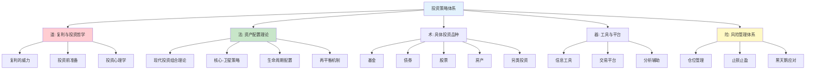
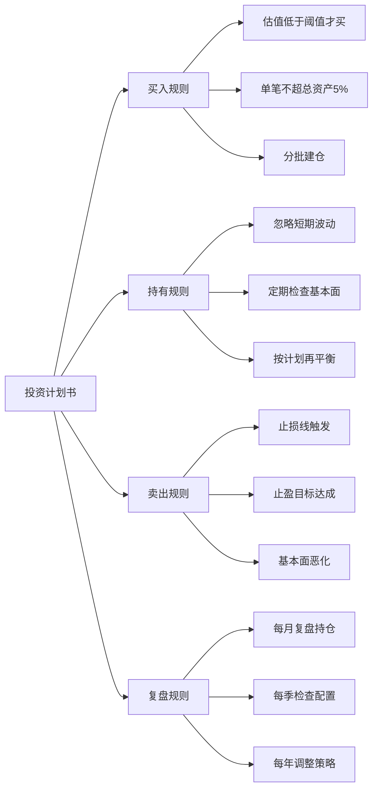
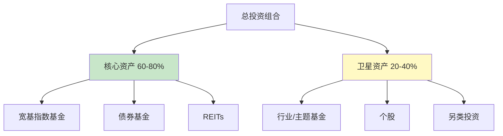
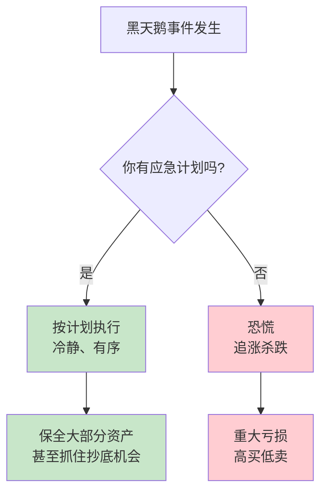
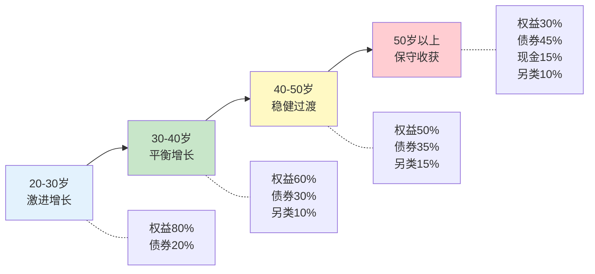

## 三、投资策略

投资不是赌博，不是投机，而是一套基于认知、纪律和耐心的系统工程。本章将从投资的第一性原理——复利出发，经过投资前的心理和知识准备、各类资产的深度分析，到资产配置的科学方法、风险管理的完整框架，构建一套从入门到精通的投资策略体系。



### 3.1 道：复利——投资的第一性原理

在讨论任何投资策略之前，必须先理解驱动一切财富增长的根本力量——复利。爱因斯坦曾说："复利是世界第八大奇迹。理解它的人赚取它，不理解它的人付出它。"这句话不是鸡汤，而是可以精确计算的数学事实。

#### 3.1.1 复利的数学本质

单利是线性增长，复利是指数增长。两者的差距随时间推移越来越大：

假设年化收益率 10%，初始投入 10 万元：

         单利终值        复利终值        差距
第5年      15万           16.1万         1.1万
第10年     20万           25.9万         5.9万
第20年     30万           67.3万         37.3万
第30年     40万           174.5万        134.5万
第40年     50万           452.6万        402.6万

→ 第40年，复利是单利的9倍

复利公式：**A = P × (1 + r)^n**

其中 P 是本金，r 是年化收益率，n 是年数。这个公式揭示了三个关键变量：

| 变量 | 影响方式 | 你能控制的 |
|------|----------|-----------|
| 本金 P | 线性影响终值 | 增加收入、减少支出、提高储蓄率 |
| 收益率 r | 指数影响终值 | 学习投资知识、优化资产配置 |
| 时间 n | 指数影响终值 | 尽早开始投资，越早越好 |

**关键洞察**：时间是复利中最强大的变量。一个25岁开始每月定投2000元的人，到60岁时的资产，远超一个35岁开始每月定投4000元的人（假设相同收益率）。前者只多投了10年，本金少了一半，但终值却更高。

假设年化收益率 8%：

25岁开始，每月2000元，投35年：
  总投入：84万元
  终值：约453万元

35岁开始，每月4000元，投25年：
  总投入：120万元
  终值：约378万元

→ 晚开始10年，多投了36万本金，反而少了75万

#### 3.1.2 复利的敌人

复利有两个天敌，它们会悄无声息地侵蚀你的财富：

**1. 通货膨胀**

如果年通胀率为3%，你的钱每年实际购买力下降3%。这意味着：

| 名义年化收益 | 实际年化收益（扣除3%通胀） | 30年后100万的实际购买力 |
|-------------|--------------------------|---------------------|
| 3% | 0% | 约100万（白忙一场） |
| 5% | 约2% | 约181万 |
| 8% | 约5% | 约432万 |
| 10% | 约7% | 约761万 |

**结论**：如果投资收益跑不赢通胀，你不是在投资，而是在"体面地亏钱"。银行活期存款（0.2%）和定期存款（约2%）的实际收益率都是负的。

**2. 费用**

投资中的各种费用——管理费、托管费、申购费、赎回费、交易佣金——看似微小，但在复利作用下被放大到惊人：

投资100万，年化收益10%，持有30年：

费率0.2%（低成本指数基金）：终值约1,574万
费率1.5%（主动管理基金）：终值约993万
费率2.5%（某些银行理财产品）：终值约762万

→ 0.2% vs 2.5%的费率差距：812万
→ 这812万就是你白白送给金融机构的"管理费"

这就是为什么本章反复强调低成本投资——费率是投资中唯一确定的变量，收益不确定，但费用是确定会发生的。

#### 3.1.3 投资的正确心态

理解了复利之后，投资的正确心态就清晰了：

| 错误心态 | 正确心态 |
|---------|---------|
| 追求一夜暴富 | 追求长期稳定的复利增长 |
| 关注每天的涨跌 | 关注5年、10年的趋势 |
| 想要最高收益 | 想要风险调整后的最优收益 |
| 把投资当赌博 | 把投资当系统工程 |
| 频繁交易 | 减少交易，让复利发挥作用 |

### 3.2 投资前的准备

#### 3.2.1 财务基础检查清单

投资的钱必须是"闲钱"——即在满足所有刚性需求和安全垫之后的资金。在开始投资之前，逐项确认以下条件：

| 检查项 | 合格标准 | 为什么重要 |
|--------|----------|-----------|
| 记账系统 | 连续记账3个月以上，清楚每笔收支 | 不知道自己有多少钱，就不知道能投多少钱 |
| 紧急备用金 | 至少覆盖6个月家庭支出，存放在货币基金或活期 | 失业/生病时不需要被迫卖出投资 |
| 高息负债 | 已清除所有信用卡分期、消费贷、网贷 | 年化18%的负债 vs 年化8%的投资收益，先还债就是最好的投资 |
| 保险保障 | 已配置医疗险、重疾险、意外险、定期寿险 | 一场大病可以清零十年积蓄，保险是投资的地基 |
| 稳定收入 | 有持续的工资或经营收入 | 投资是长跑，现金流中断会导致在最差时机被迫离场 |

**紧急备用金的计算方法**：

紧急备用金 = 月均刚性支出 × 月数

刚性支出包括：房租/房贷、餐饮、交通、水电、通讯、保险费等不可压缩的支出。不包括娱乐、旅游、购物等弹性支出。

月数建议：
- 双薪家庭、工作稳定：3-6个月
- 单一收入来源：6-12个月
- 自由职业/收入不稳定：12-18个月
- 有房贷的家庭：额外预留6个月房贷

**紧急备用金的存放方式**：

不要放在活期账户（利率太低），也不要放在定期存款（紧急时取不出来）。最佳方案是货币基金（如余额宝、零钱通），兼顾流动性和收益：

| 存放方式 | 年化收益 | 流动性 | 推荐度 |
|---------|---------|--------|--------|
| 活期存款 | 0.2% | 即时 | ⭐⭐ |
| 货币基金 | 1.5-2.5% | T+0（单日限额1万） | ⭐⭐⭐⭐⭐ |
| 短债基金 | 2-3% | T+1 | ⭐⭐⭐⭐ |
| 国债逆回购 | 1.5-3%（波动） | 按期限 | ⭐⭐⭐ |

#### 3.2.2 风险承受能力评估

风险承受能力由两个维度决定：**客观能力**（你能承受多大亏损）和**主观意愿**（你愿意承受多大波动）。

**客观风险承受能力评估**：

得分计算（满分100分）：

年龄因素（30分）：
  - 25岁以下：30分（投资期限最长）
  - 25-35岁：25分
  - 35-45岁：20分
  - 45-55岁：15分
  - 55岁以上：10分

收入稳定性（25分）：
  - 公务员/事业单位：25分
  - 大企业正式员工：20分
  - 中小企业员工：15分
  - 自由职业/创业：10分
  - 无固定收入：5分

家庭负担（20分）：
  - 无负担（单身无贷）：20分
  - 轻负担（有贷无孩）：15分
  - 中负担（有贷有孩）：10分
  - 重负担（多孩+赡养老人）：5分

可投资资产占比（25分）：
  - 可投资资产 > 家庭年收入10倍：25分
  - 5-10倍：20分
  - 3-5倍：15分
  - 1-3倍：10分
  - < 1倍：5分

**主观风险偏好测试**：

回答以下问题，每个A=1分，B=2分，C=3分，D=4分，E=5分：

1. 投资亏损10%时，你会？
   A. 立即全部卖出 B. 卖出大部分 C. 观望不动 D. 少量加仓 E. 大量加仓

2. 你更看重投资的哪个方面？
   A. 本金安全 B. 稳定收益 C. 收益与安全平衡 D. 较高收益 E. 最大收益

3. 一笔投资可能翻倍也可能亏损50%，你会？
   A. 绝不参与 B. 只用极小部分 C. 用少量资金 D. 用较多资金 E. 全部投入

4. 你的投资期限是？
   A. 1年以内 B. 1-3年 C. 3-5年 D. 5-10年 E. 10年以上

5. 投资收益波动多大你能接受？
   A. 5%以内 B. 5-15% C. 15-30% D. 30-50% E. 50%以上

**评分与资产配置建议**：

| 总分 | 风险类型 | 建议配置 |
|------|----------|----------|
| 6分以下 | 极度保守 | 现金类60% + 债券30% + 权益类10% |
| 6-10分 | 保守型 | 现金类30% + 债券40% + 权益类30% |
| 10-15分 | 稳健型 | 现金类10% + 债券30% + 权益类50% + 另类10% |
| 15-20分 | 进取型 | 现金类5% + 债券15% + 权益类65% + 另类15% |
| 20分以上 | 激进型 | 债券10% + 权益类75% + 另类15% |

**重要提醒**：风险承受能力不是一成不变的。随着年龄增长、家庭结构变化、收入波动，你的风险承受能力会变化。建议每2-3年重新评估一次。

#### 3.2.3 投资目标设定

没有明确目标的投资，就像没有目的地的航行。使用SMART原则设定投资目标：

**短期目标（1-3年）**：
- 应急储备金积累：12个月内积累6个月支出
- 旅行基金：为特定旅行攒够预算
- 配置：货币基金 + 短债基金

**中期目标（3-10年）**：
- 购房首付：在X年内积累Y万首付
- 子女教育基金：在孩子上大学前积累足够学费
- 配置：股债混合基金 + 指数基金定投

**长期目标（10年以上）**：
- 退休基金：在退休时积累足够的被动收入资产
- 财务自由：投资收益覆盖生活支出
- 配置：以权益类资产为主，逐步降低波动

**目标量化示例**：

目标：10年后积累100万购房首付
假设年化收益率8%：

方案A：一次性投入
  需要本金：100万 / (1.08^10) = 46.3万

方案B：每月定投
  月定投金额 = 100万 × 0.08/12 / ((1+0.08/12)^120 - 1)
             ≈ 5,466元/月

方案C：初始投入20万 + 每月定投
  20万10年后终值：20万 × (1.08^10) = 43.2万
  剩余需要定投积累：100万 - 43.2万 = 56.8万
  月定投金额 ≈ 3,105元/月

### 3.3 投资心理学与行为金融

在讨论具体投资品种之前，必须先理解投资中最不可控的因素——人的情绪。学术研究表明，普通投资者的实际收益率长期落后于市场指数，其中70%的差距来自行为偏误而非技术不足。

诺贝尔经济学奖得主丹尼尔·卡尼曼的研究揭示了一个残酷事实：人类的大脑是在狩猎时代进化出来的，它在面对投资决策时会产生系统性的判断偏差。认识到这些偏差并建立对抗机制，是投资成功的关键前提。

#### 3.3.1 六大致命投资偏误

**1. 损失厌恶（Loss Aversion）**

人类对损失的痛感是同等收益快感的2-2.5倍。这意味着：
- 亏损1万元的痛苦，需要盈利2-2.5万元才能弥补
- 导致投资者过早卖出盈利股票（锁定快乐），长期持有亏损股票（逃避痛苦）
- 这就是"处置效应"——卖盈留亏

**真实案例**：2015年A股牛市中，大量投资者在5000点时因为"还在涨"而不愿卖出，跌到3000点时因为"已经亏了这么多"而不愿割肉，最终在2500点附近恐慌性抛售——完美地"卖在了最低点"。

应对方法：建立机械化的止损规则，比如"亏损超过15%必须复盘决定是否卖出"，用规则代替感觉。

**2. 锚定效应（Anchoring）**

人们倾向于用某个参考点（锚）来做判断：
- "这只股票最高到过100元，现在50元肯定便宜"——但公司基本面可能已经恶化
- "我买入价是80元，不涨回80元我不卖"——买入价与未来走势无关
- "去年涨了30%，今年应该也能涨30%"——过去的收益不代表未来

应对方法：每次评估投资时，假装自己是第一次看到这个标的，问自己"如果今天第一次看到，我会买吗？"

**3. 从众效应（Herd Behavior）**

"大家都在买，我也应该买"——这是投资亏损的最大来源之一。
- 牛市后期，身边不炒股的人都开始讨论股票时，往往是最危险的信号
- 熊市底部，没有人谈论股票时，往往是最好的买入时机
- 巴菲特名言："在别人贪婪时恐惧，在别人恐惧时贪婪"

**历史案例**：2007年A股6124点时，出租车司机都在讨论股票；2008年1664点时，证券营业部门可罗雀。2021年初比特币突破6万美元时，社交媒体上满是"to the moon"的口号；2022年底跌到1.6万美元时，几乎无人讨论。

应对方法：建立独立的投资决策体系，不与非专业人士讨论投资决策。

**4. 过度自信（Overconfidence）**

- 高估自己的选股能力，频繁交易
- 低估市场风险，重仓单一标的
- 把运气当成能力，把偶然盈利当成稳定策略

数据佐证：学术研究显示，交易越频繁的投资者，收益率越低。台湾证券市场的一项经典研究发现，最活跃的交易者年化收益率比最不活跃的低7个百分点。美国的研究同样印证：日间交易者（day trader）中，超过90%最终亏损。

应对方法：每笔交易前写下买入理由，定期复盘。如果理由经常被推翻，说明你过度自信了。

**5. 确认偏误（Confirmation Bias）**

买入一只股票后，你会不自觉地只关注支持你判断的信息，忽略相反的证据：
- 只看利好新闻，过滤利空消息
- 在论坛里只找认同自己观点的帖子
- 对反对意见产生抵触情绪

应对方法：在投资笔记中专门开辟"反方论点"栏目，强制自己列出3条看空理由。定期阅读与自己观点相反的分析报告。

**6. 近因效应（Recency Bias）**

过度重视最近发生的事情，忽略长期规律：
- 刚经历牛市就认为"永远涨"
- 刚经历熊市就认为"再也回不去了"
- 最近表现好的资产类别被过度追捧

**数据提醒**：沪深300指数在2005-2007年上涨了约500%，当时很多人认为"黄金十年"已经开始。随后2008年暴跌了约65%。2019-2020年又上涨了约80%，2021-2023年又下跌了约40%。市场永远在周期中运行。

应对方法：定期回顾历史数据，提醒自己市场是有周期的。在投资笔记中贴一张"市场周期图"，时刻提醒自己身处哪个阶段。

#### 3.3.2 建立投资纪律系统

对抗情绪的唯一方法是建立机械化的投资系统：



**投资计划书模板**（每笔投资前必须填写）：

```markdown
## 投资决策记录

### 基本信息
- 标的名称：
- 买入日期：
- 买入价格：
- 买入金额：占总投资资产的 ____%
- 买入理由：（至少写3条）

### 看多论点
1. 
2. 
3. 

### 看空论点（强制填写）
1. 
2. 
3. 

### 退出计划
- 止损条件：亏损 ____% 或基本面发生 ____ 变化
- 止盈条件：盈利 ____% 或估值达到 ____ 水平
- 持有期限：预期 ____ 个月/年

### 复盘记录
- 日期：
- 当前盈亏：
- 买入理由是否成立？
- 是否需要调整退出计划？
```

### 3.4 资产配置核心理论

资产配置是投资中最重要的决策——研究表明，投资组合收益的90%以上由资产配置决定，而非选股或择时。这一结论来自布林森、胡德和比鲍尔1986年发表在《金融分析师期刊》上的经典论文，后被无数实证研究反复验证。

#### 3.4.1 现代投资组合理论（MPT）

1952年，哈里·马科维茨提出现代投资组合理论，核心思想是：通过将相关性低的资产组合在一起，可以在不降低预期收益的情况下降低风险。这一理论为他赢得了1990年诺贝尔经济学奖。

**关键概念**：

- **预期收益率**：投资组合中各资产预期收益率的加权平均
- **波动率（标准差）**：衡量投资收益的不确定性
- **相关系数**：两种资产价格变动的关联程度，范围 -1 到 +1
  - +1：完全同向变动（如两只同行业股票）
  - 0：完全无关
  - -1：完全反向变动（如股票与看跌期权）

**有效前沿**：在给定风险水平下，预期收益最高的投资组合构成的曲线。理性投资者应该选择有效前沿上的组合。

**常见资产的相关系数矩阵**（基于近20年历史数据）：

| | 沪深300 | 中证500 | 标普500 | 中国国债 | 黄金 | 货币基金 |
|---|---------|---------|---------|---------|------|---------|
| 沪深300 | 1.00 | 0.85 | 0.30 | -0.10 | 0.05 | 0.01 |
| 中证500 | 0.85 | 1.00 | 0.25 | -0.08 | 0.03 | 0.01 |
| 标普500 | 0.30 | 0.25 | 1.00 | -0.20 | 0.05 | 0.01 |
| 中国国债 | -0.10 | -0.08 | -0.20 | 1.00 | 0.15 | 0.30 |
| 黄金 | 0.05 | 0.03 | 0.05 | 0.15 | 1.00 | 0.05 |

**关键洞察**：A股与美股的相关性仅约0.30，这意味着同时配置A股和美股可以显著降低组合波动。中国国债与A股呈负相关，是天然的风险对冲工具。

#### 3.4.2 核心-卫星策略

这是最适合普通投资者的资产配置框架：



**核心资产（60-80%）**：
- 目标：获取市场平均收益，低成本，低维护
- 标的：沪深300、中证500、标普500等宽基指数基金 + 纯债基金
- 特点：分散化程度高，费率低，不需要频繁调仓
- 定期再平衡：每年或每半年调整一次

**卫星资产（20-40%）**：
- 目标：获取超额收益，提高组合回报
- 标的：行业主题基金、个股、另类投资
- 特点：需要更多研究和关注，波动更大
- 可以根据市场机会灵活调整

#### 3.4.3 生命周期资产配置模型

不同人生阶段有不同的风险承受能力和投资目标，资产配置应随之调整：

**经典"100法则"**：权益类资产比例 = 100 - 年龄

更精细的生命周期模型：

| 年龄段 | 权益类（股票/基金） | 债券类 | 现金类 | 策略重点 |
|--------|---------------------|--------|--------|----------|
| 20-30岁 | 70-80% | 15-25% | 5% | 最大化增长，承受波动能力强 |
| 30-40岁 | 60-70% | 20-30% | 5-10% | 平衡增长与稳定，开始考虑子女教育 |
| 40-50岁 | 50-60% | 25-35% | 10-15% | 降低波动，增加稳定收入类资产 |
| 50-60岁 | 30-40% | 35-45% | 15-20% | 保本为主，准备退休现金流 |
| 60岁以上 | 20-30% | 40-50% | 20-30% | 稳健保守，确保退休生活质量 |

**注意**：这只是一个框架，实际配置需要根据个人风险承受能力、收入稳定性、家庭负担等因素调整。一个30岁的高收入单身人士和一个30岁有房贷有孩子的中年人，配置应该截然不同。

#### 3.4.4 再平衡策略

再平衡是指定期将投资组合恢复到目标配置比例。这是投资中"反人性"但极其重要的操作。

**为什么需要再平衡**：

假设初始配置为60%股票+40%债券。一年后股票涨了30%，债券涨了5%：
- 股票占比变成：60% × 1.3 / (60% × 1.3 + 40% × 1.05) = 65%
- 债券占比变成：35%
- 实际风险已经偏离目标

再平衡就是卖出部分股票（锁定利润），买入债券（抄底低配资产），恢复60/40的比例。

**再平衡的方法**：

| 方法 | 操作 | 优点 | 缺点 |
|------|------|------|------|
| 定期再平衡 | 每半年或每年调整一次 | 简单易执行 | 可能错过极端机会 |
| 阈值再平衡 | 偏离目标超过5%时调整 | 更灵活，能捕捉极端机会 | 需要频繁监控 |
| 混合法 | 每季度检查，偏离5%时调整 | 兼顾简单和灵活 | 规则稍复杂 |

**再平衡的注意事项**：
- 优先通过新增资金调整，减少卖出带来的税费和交易成本
- 在税率较低的账户（如基金转换免费的平台）内操作
- 不要在市场剧烈波动时恐慌性再平衡——那不叫再平衡，叫追涨杀跌

**再平衡的实证价值**：研究表明，定期再平衡的投资组合，长期年化收益率比不再平衡的组合高出约0.5-1%，同时波动率更低。这个差距看似不大，但在复利作用下，30年后的终值差距可达20-30%。

### 3.5 基金投资策略

基金是普通投资者参与资本市场最高效的工具。它解决了个人投资者最头疼的问题：选股难、分散不足、时间精力有限。

#### 3.5.1 基金类型全览

| 基金类型 | 风险等级 | 预期年化收益 | 适合人群 | 典型费率 |
|----------|----------|-------------|----------|----------|
| 货币基金 | 极低 | 1.5-3% | 所有人（现金管理） | 管理费0.15-0.33% |
| 纯债基金 | 低 | 3-6% | 保守型投资者 | 管理费0.3-0.7% |
| 混合债基 | 中低 | 4-8% | 稳健型投资者 | 管理费0.5-1.0% |
| 指数基金 | 中 | 8-15%（长期） | 所有投资者 | 管理费0.1-0.5% |
| 主动股票基金 | 中高 | 8-20%（但分化大） | 有选基能力的投资者 | 管理费1.0-1.5% |
| QDII基金 | 中高 | 取决于海外市场 | 需要全球配置的投资者 | 管理费0.8-1.5% |

#### 3.5.2 指数基金定投——最适合普通人的策略

指数基金是以特定指数为跟踪目标的被动基金。为什么说它最适合普通人？

**优势一：费率碾压主动基金**

假设投资100万元，持有30年，年化收益10%：
- 费率0.2%（指数基金）：终值约1,652万元
- 费率1.5%（主动基金）：终值约1,006万元
- 差距：646万元——仅因为费率差异

**优势二：长期跑赢大多数主动基金**

标普道琼斯指数公司每年发布SPIVA报告，统计主动基金 vs 指数的表现。以美国市场为例：
- 5年期：约80%的主动基金跑输标普500
- 10年期：约85%的主动基金跑输标普500
- 20年期：约90%的主动基金跑输标普500

中国市场数据同样印证这一点：以10年期为例，约75%的主动偏股基金跑输沪深300指数。

**优势三：永不退市、永不踩雷**

单只股票可能退市、财务造假、行业衰退。而指数会定期调换成分股，永远保持"优胜劣汰"——沪深300指数的成分股每半年调整一次。

**主要指数及适用场景**：

| 指数 | 代码 | 覆盖范围 | 风险特征 | 适用场景 |
|------|------|----------|----------|----------|
| 沪深300 | 000300.SH | A股大盘蓝筹前300 | 波动适中，年化约8-10% | 核心配置，入门首选 |
| 中证500 | 000905.SH | A股中盘成长500只 | 波动较大，年化约10-12% | 核心配置，成长补充 |
| 中证1000 | 000852.SH | A股小盘1000只 | 波动大，弹性高 | 卫星配置，高风险偏好 |
| 创业板指 | 399006.SZ | 创业板龙头100只 | 波动大，科技成长 | 卫星配置 |
| 标普500 | SPX | 美国大盘500强 | 与A股低相关 | 全球配置必需 |
| 纳斯达克100 | NDX | 美国科技100强 | 波动大，科技集中 | 卫星配置 |
| 恒生指数 | HSI | 港股大盘50只 | 估值低，受外资影响大 | 全球配置补充 |

#### 3.5.3 定投实操指南

**第一步：选择平台**

| 平台类型 | 代表 | 申购费率 | 优点 | 缺点 |
|----------|------|----------|------|------|
| 第三方互联网平台 | 天天基金、蚂蚁基金、蛋卷基金 | 通常1折（0.12-0.15%） | 费率低、产品全、功能强 | 需要额外开户 |
| 银行APP | 各大银行手机银行 | 通常4-8折 | 信任度高 | 费率高、产品少 |
| 券商APP | 华泰、中信等 | 通常1折 | 可同时买ETF | 需要证券账户 |
| 基金公司直销 | 易方达、华夏等官网 | 通常1折 | 部分基金费率更低 | 只能买该公司产品 |

**推荐**：使用天天基金或蚂蚁基金等第三方平台，费率低、产品覆盖全面、支持智能定投等功能。

**第二步：选择基金**

入门组合推荐（每月定投金额按此分配）：

方案A（保守入门）：
  沪深300指数基金  40%
  中证500指数基金  30%
  纯债基金         30%

方案B（均衡配置）：
  沪深300指数基金  30%
  中证500指数基金  20%
  标普500指数基金  20%
  纯债基金         30%

方案C（进取配置）：
  沪深300指数基金  25%
  中证500指数基金  25%
  标普500指数基金  20%
  纳斯达克100基金  15%
  纯债基金         15%

**如何挑选具体的指数基金**：

选择跟踪同一指数的基金时，比较以下指标：

| 指标 | 说明 | 优选标准 |
|------|------|----------|
| 跟踪误差 | 基金收益率与指数收益率的偏差 | 越小越好，<0.5%为优秀 |
| 管理费率 | 每年收取的管理费用 | 越低越好，<0.5% |
| 托管费率 | 每年收取的托管费用 | 越低越好，<0.1% |
| 基金规模 | 基金的总资产规模 | 太小有清盘风险，建议>2亿元 |
| 成立时间 | 基金的成立年限 | 越长越好，至少>3年 |
| 基金公司 | 基金管理人的品牌和实力 | 选择头部基金公司 |

**第三步：设置定投参数**

金额设定：
  月定投金额 = (月收入 - 月支出 - 月储蓄) × 投资比例
  建议投资比例：50-80%（剩余作为灵活备用金）
  最低门槛：多数基金100元/月起

频率选择：
  月定投：最推荐，与工资周期匹配
  周定投：波动略小，但差异不大（长期年化差异<0.5%）
  双周定投：折中选择

日期选择：
  推荐：发薪日后2-3天（确保资金到账）
  避开：月初1-3日（很多人同时定投，可能略高）
  学术研究表明：定投日期对长期收益影响极小（<0.3%年化）
  结论：不必纠结日期，坚持更重要

**第四步：坚持与进阶**

定投的核心纪律：
- **至少坚持3年**，最好覆盖一个完整的牛熊周期（约5-7年）
- **下跌时不停止定投**——下跌时同样的金额买到更多份额，这就是"微笑曲线"
- **不频繁查看收益**——建议每月或每季度看一次，每天看只会增加焦虑


#### 3.5.4 定投进阶策略

**策略一：估值定投法（价值平均定投）**

根据指数的估值水平动态调整定投金额，本质是"低买多、高买少"：

估值数据来源：中证指数官网、理杏仁、且慢等平台

PE百分位判断（以沪深300为例，历史数据约15年）：

PE百分位 < 20%（极度低估）：
  → 定投金额 × 2.0（加倍买入）
  → 例如：原定投2000元，本月投4000元

PE百分位 20%-40%（低估）：
  → 定投金额 × 1.5

PE百分位 40%-60%（适中）：
  → 定投金额 × 1.0（正常定投）

PE百分位 60%-80%（高估）：
  → 定投金额 × 0.5（减半定投）

PE百分位 > 80%（极度高估）：
  → 停止定投，开始分批止盈

**PE百分位的含义**：PE百分位是指当前PE值在过去N年中所处的位置。比如PE百分位为30%，意味着当前PE比过去70%的时间都低，说明估值相对便宜。

**估值数据查询方法**：
1. 理杏仁（lixinger.com）：提供各指数的PE/PB百分位，免费用户可查部分数据
2. 且慢（qieman.com）：提供"估值地图"功能，一目了然
3. 中证指数官网（csindex.com.cn）：官方数据，最权威
4. 乌龟量化（guorn.com）：提供多维度估值数据

**策略二：目标止盈法**

设定明确的止盈目标，达到后分批卖出：

止盈方案（以初始投入10万元为例）：

阶梯止盈法：
  收益率达30%时：卖出30%的份额（锁定约9000元收益）
  收益率达50%时：再卖出30%的份额
  收益率达80%时：卖出剩余全部份额
  止盈后重新开始新一轮定投

目标收益率止盈法：
  设定年化收益目标（如12%），达到后全部卖出
  适合保守型投资者，落袋为安

估值止盈法（推荐）：
  当指数PE百分位>80%时开始分批卖出
  >85%时卖出50%
  >90%时卖出剩余全部
  这种方法能更好地捕捉大周期

**策略三：均线偏离法（智慧定投）**

以250日均线（年线）为基准，判断市场相对位置：

当前指数 / 250日均线 的比值：

比值 < 0.9（低于年线10%以上）：
  → 定投金额 × 2.0（市场低迷，加大投入）

比值 0.9 - 1.0（低于年线）：
  → 定投金额 × 1.5

比值 1.0 - 1.1（在年线附近）：
  → 定投金额 × 1.0（正常定投）

比值 > 1.1（高于年线10%以上）：
  → 定投金额 × 0.5（市场偏高，减少投入）

比值 > 1.2（高于年线20%以上）：
  → 暂停定投，开始考虑止盈

#### 3.5.5 ETF投资

ETF（交易所交易基金）是指数基金的升级版，在证券交易所买卖，实时交易。

**ETF vs 场外指数基金对比**：

| 对比项 | ETF | 场外指数基金 |
|--------|-----|-------------|
| 交易方式 | 股票账户实时买卖 | 基金平台申购赎回 |
| 交易费率 | 券商佣金（约万分之1-3） | 申购费（打一折约0.12%） |
| 管理费率 | 通常更低（0.15-0.5%） | 略高（0.2-0.5%） |
| 跟踪误差 | 通常更小 | 略大 |
| 定投便利性 | 需要手动操作或券商条件单 | 支持自动定投 |
| 最低金额 | 1手（100份，通常约100元） | 通常10元起 |
| 适合人群 | 有经验的投资者 | 入门投资者 |

**推荐做法**：入门阶段用场外指数基金自动定投，积累经验后逐步转向ETF以获得更低费率。

**ETF折溢价问题**：ETF在二级市场交易时，价格可能偏离其实际净值（IOPV）。溢价过高时买入会多付钱，折价过大时卖出会少收钱。建议：
- 溢价率超过1%时不要买入
- 折价率超过1%时可以考虑买入
- 在交易软件中查看"溢价率"指标

### 3.6 债券投资策略

债券是投资组合中的"压舱石"——在股市大跌时，债券往往能提供正收益，起到平滑波动的作用。

#### 3.6.1 债券基础知识

**债券是什么**：债券是政府、企业等机构为筹集资金而发行的债务凭证。你借钱给发行方，对方承诺定期支付利息，到期归还本金。

**债券的核心要素**：

| 要素 | 说明 | 示例 |
|------|------|------|
| 面值 | 债券的票面金额 | 通常100元 |
| 票面利率 | 每年支付的利息占面值的比例 | 3% |
| 到期日 | 到期归还本金的日期 | 2030年12月31日 |
| 信用评级 | 反映发行方的偿债能力 | AAA（最高）、AA、A、BBB... |
| 到期收益率 | 按当前价格买入并持有到期的年化收益率 | 3.5% |

**债券收益的来源**：
1. **票息收入**：定期获得的利息，是债券收益的主要来源
2. **资本利得**：债券价格上涨带来的收益（利率下降时债券价格上涨）
3. **再投资收益**：利息再投资产生的复利

**债券价格与利率的关系**（这是债券投资最重要的概念）：

债券价格与市场利率呈反向变动关系。理解这一点的关键是：当市场利率上升时，新发行的债券票面利率更高，旧债券的吸引力下降，价格下跌；反之亦然。

利率变动对债券价格的影响（近似公式）：

价格变动 ≈ -久期 × 利率变动

示例：
  持有一只久期为5年的债券
  市场利率上升1%
  债券价格约下跌5%

  持有一只久期为10年的债券
  市场利率上升1%
  债券价格约下跌10%

→ 久期越长，利率敏感度越高
→ 预期利率上升时，缩短久期
→ 预期利率下降时，拉长久期

#### 3.6.2 债券的种类与风险

**按发行主体分类**：

| 类型 | 发行方 | 风险等级 | 收益率 | 特点 |
|------|--------|----------|--------|------|
| 国债 | 中央政府 | 极低 | 2.5-3.5% | 最安全，利息免个税 |
| 地方政府债 | 地方政府 | 低 | 2.8-3.8% | 有政府信用背书 |
| 政策性金融债 | 国开行等 | 低 | 3.0-4.0% | 准政府信用 |
| 企业债/公司债 | 企业 | 中 | 3.5-6% | 需关注企业信用 |
| 可转债 | 上市公司 | 中高 | 不确定 | 兼具债券和股票特性 |

**债券的主要风险**：

1. 利率风险
   影响：市场利率上升 → 债券价格下跌
   规律：期限越长，受利率影响越大
   例子：利率上升1%，10年期国债价格约下跌8-9%

2. 信用风险
   影响：发行方无法按时支付利息或归还本金
   规律：评级越低，信用风险越高，收益率也越高
   注意：高收益债券（垃圾债）的高收益是对你承担高风险的补偿

3. 流动性风险
   影响：需要卖出时找不到买家，或只能以很低的价格卖出
   规律：国债流动性最好，小企业债流动性最差

4. 通胀风险
   影响：通胀高于债券收益率时，实际购买力下降
   例子：债券收益率3%，通胀率5%，实际收益率为-2%

#### 3.6.3 债券投资实操

**方式一：直接购买国债**

储蓄国债（电子式/凭证式）：
- 购买渠道：银行柜台、网银、手机银行
- 购买时间：每年3-11月的10日发行（具体以财政部公告为准）
- 起购金额：100元
- 持有期限：3年期或5年期
- 优点：安全性最高、利息免个税
- 缺点：持有期限固定，提前支取会损失部分利息

记账式国债：
- 购买渠道：证券交易所
- 特点：可以在二级市场买卖，流动性好
- 注意：价格会波动，可能亏本

**方式二：债券基金**

| 基金类型 | 投资范围 | 风险等级 | 适合场景 |
|----------|----------|----------|----------|
| 短债基金 | 短期限债券 | 低 | 替代货币基金，收益略高 |
| 中长期纯债 | 中长期国债、金融债 | 低 | 稳健配置 |
| 一级债基 | 债券+打新股 | 中低 | 追求略高收益 |
| 二级债基 | 债券+少量股票（<20%） | 中 | 接受小幅波动换取更高收益 |

**债券基金选择标准**：
- 基金规模：2-50亿元为佳（太小有清盘风险，太大影响操作灵活性）
- 成立时间：至少3年以上
- 历史最大回撤：纯债基金<3%，二级债基<10%
- 基金经理任职时间：最好>2年
- 费率：管理费+托管费 < 0.6%

**方式三：可转债**

可转债是一种特殊的债券，持有人可以在约定条件下将债券转换为发行公司的股票。它兼具债券的保底特性和股票的上涨潜力：

| 特性 | 说明 |
|------|------|
| 保底性 | 到期前如果股价低迷，可以持有到期拿回本金+利息 |
| 上涨潜力 | 如果股价上涨，可以转股享受股价上涨收益 |
| 下修条款 | 股价持续低迷时，公司可能下调转股价，对持有人有利 |
| 强赎条款 | 股价持续高于转股价130%时，公司可能强制赎回 |

**可转债投资策略**：
- **双低策略**：选择价格低（<110元）+ 溢价率低（<20%）的可转债，既有保底又有弹性
- **打新策略**：参与可转债打新，中签后上市首日卖出，历史胜率约80%
- **注意事项**：可转债有涨跌幅限制但比股票宽松（±20%/±30%），且T+0交易，波动较大

#### 3.6.4 债券在资产配置中的角色

债券与股票的相关性通常为负或低正相关，这意味着债券在股市下跌时往往能提供保护。

**经典60/40组合（美国市场历史数据）**：
- 60%标普500 + 40%美国国债
- 历史年化收益约9%，最大回撤约-30%
- 纯股票的年化收益约10%，但最大回撤约-50%
- 债券的加入显著降低了波动，提高了风险调整后收益

**不同风险偏好的债券配置建议**：

| 风险类型 | 债券占比 | 推荐债券类型 |
|----------|----------|-------------|
| 保守型 | 40-60% | 国债+纯债基金 |
| 稳健型 | 20-40% | 纯债基金+一级债基 |
| 平衡型 | 15-25% | 纯债基金+二级债基 |
| 进取型 | 10-15% | 纯债基金（作为安全垫） |
| 激进型 | 5-10% | 仅保留少量作为流动性缓冲 |

### 3.7 股票投资策略

#### 3.7.1 给新手的忠告

**初期不建议直接投资个股**，原因如下：

1. **信息劣势**：机构投资者有专业的研究团队、数据终端、调研资源，散户在信息上处于绝对劣势
2. **时间成本**：深度研究一只股票需要阅读年报、季报、行业报告、竞争对手分析，至少需要几十个小时
3. **情绪管理**：个股波动远大于基金，一天涨跌5-10%是常态，普通人很难承受
4. **幸存者偏差**：你听到的都是别人赚钱的故事，亏钱的人不会到处说

**如果一定要投资个股，必须满足以下前提**：
1. 通过指数基金积累了至少2年投资经验
2. 个股投资金额不超过总投资资产的20%
3. 单只个股不超过总投资资产的5%
4. 只投资你深入研究过的行业和公司
5. 不借钱炒股，不加杠杆，不融资
6. 做好亏损50%以上的心理准备

#### 3.7.2 基本面分析框架

基本面分析是通过研究公司的财务状况、行业地位、竞争优势来评估股票价值的方法。

**第一步：行业分析**

在看公司之前，先看行业：
- 行业规模和增速：是朝阳行业还是夕阳行业？
- 竞争格局：是垄断、寡头还是完全竞争？
- 进入壁垒：技术壁垒、资金壁垒、政策壁垒有多高？
- 产业链位置：是上游供应商、中游制造商还是下游品牌商？

**行业分析的实用工具**：
- 波特五力模型：分析行业竞争强度——供应商议价能力、买方议价能力、新进入者威胁、替代品威胁、现有竞争者
- 产业链图谱：理清行业上下游关系，找到最有定价权的环节
- 政策导向：关注国家产业政策、补贴方向、监管变化

**第二步：公司竞争护城河**

巴菲特提出的"护城河"概念，指公司的持久竞争优势：

| 护城河类型 | 含义 | 典型案例 |
|-----------|------|----------|
| 品牌优势 | 消费者愿意为品牌支付溢价 | 茅台、苹果 |
| 网络效应 | 用户越多，产品越有价值 | 微信、淘宝 |
| 转换成本 | 用户换产品的成本很高 | 企业ERP系统、银行账户 |
| 成本优势 | 比竞争对手的成本更低 | 规模经济、独特资源 |
| 无形资产 | 专利、牌照、特许经营权 | 医药专利、电信牌照 |

**判断护城河是否真实的三个问题**：
1. 如果竞争对手投入10亿，能否复制这家公司的优势？
2. 这家公司的客户如果转向竞争对手，成本有多高？
3. 10年后这家公司的竞争优势还会存在吗？

**第三步：关键财务指标分析**

| 指标 | 计算方式 | 优秀标准 | 警戒标准 | 含义 |
|------|----------|----------|----------|------|
| 市盈率PE | 股价/每股收益 | 因行业而异 | 远高于同行 | 估值高低 |
| 市净率PB | 股价/每股净资产 | <1.5（非科技） | >5 | 资产溢价程度 |
| ROE | 净利润/净资产 | >15%持续3年 | <8% | 盈利能力 |
| 毛利率 | (营收-成本)/营收 | 因行业而异 | 远低于同行 | 产品竞争力 |
| 资产负债率 | 总负债/总资产 | <60% | >75% | 财务安全性 |
| 自由现金流 | 经营现金流-资本支出 | 持续为正 | 持续为负 | 真实赚钱能力 |
| 营收增长率 | 年收入增长速度 | >15% | <0%（连续） | 成长性 |
| 分红率 | 分红/净利润 | >30% | 0%（连续多年） | 回馈股东意愿 |

**财务指标的交叉验证**：单一指标容易被操纵，但多个指标同时异常则很难造假。例如：
- 如果营收增长很快但现金流为负，可能是应收账款堆积（收入质量差）
- 如果ROE很高但资产负债率也很高，可能是靠杠杆驱动（不健康）
- 如果毛利率远高于同行，需要找到合理解释（品牌溢价？数据造假？）

**第四步：估值方法**

**相对估值法**：
- PE对比：与同行业公司对比、与自身历史对比
- PB对比：适合重资产行业（银行、地产）
- PEG对比：PE/盈利增长率，PEG<1通常认为被低估

**绝对估值法（DCF模型简化版）**：
内在价值 = 未来10年自由现金流的现值 + 永续价值的现值

简化估算：
  假设未来10年自由现金流年增长10%，折现率8%
  第1年现金流1亿，第10年现金流约2.6亿
  10年现金流现值合计约15亿
  永续价值 = 第11年现金流 / (折现率 - 永续增长率)
           = 2.86亿 / (8% - 3%) = 57亿
  永续价值现值 = 57亿 / (1.08^10) = 26.4亿
  总内在价值 ≈ 15 + 26.4 = 41.4亿

  如果当前市值30亿，说明被低估
  如果当前市值60亿，说明被高估

**DCF模型的局限性**：DCF对假设非常敏感——增长率从10%改为8%，内在价值可能变化30%以上。因此，DCF更适合作为"模糊的正确"，而不是精确的计算器。建议对关键假设做敏感性分析（乐观/中性/悲观三种情景）。

#### 3.7.3 价值投资核心理念

价值投资的核心理念由本杰明·格雷厄姆创立，经沃伦·巴菲特和查理·芒格发扬光大。

**五大核心原则**：

**1. 买股票就是买公司**

不要把股票当作K线图上的筹码，而要当作公司的所有权。买入前问自己：如果这家公司不上市，我愿意以这个价格买下整个公司吗？

**2. 安全边际**

以低于内在价值的价格买入，留出足够的安全缓冲。格雷厄姆建议至少30%的安全边际。如果你估算公司值100亿，那就在70亿以下才买入。

**3. 长期持有**

好公司的价值会随时间增长。频繁交易不仅增加成本，还容易被情绪左右。巴菲特的大部分财富是在50岁之后获得的——复利需要时间。

**4. 能力圈**

只投资你理解的公司和行业。如果你无法用简单的话向别人解释这家公司是怎么赚钱的，那你就不要买它的股票。

**5. 逆向思维**

在市场恐慌时寻找机会，在市场狂热时保持警惕。最好的买入时机，往往是你感到最不舒服的时候。

#### 3.7.4 技术分析基础

技术分析通过研究价格走势和成交量来预测未来价格。虽然基本面分析是核心，但了解技术分析的基本概念有助于把握买卖时机。

**常用技术指标**：

| 指标 | 含义 | 使用方法 |
|------|------|----------|
| 均线（MA） | N日收盘价的平均值 | 金叉（短期穿越长期向上）看多，死叉看空 |
| MACD | 趋势跟踪指标 | DIF穿越DEA向上为买入信号 |
| RSI | 相对强弱指标 | RSI>70超买，RSI<30超卖 |
| 成交量 | 当日成交的股数 | 放量上涨为强势，放量下跌为弱势 |
| 布林带 | 价格波动通道 | 触及下轨可能反弹，触及上轨可能回落 |

**技术分析的使用原则**：
- 技术分析是辅助工具，不是决策依据
- 不要同时使用太多指标，2-3个足够
- 技术分析在趋势市场中更有效，在震荡市场中容易失灵
- 所有技术指标都有滞后性，不能预测未来

#### 3.7.5 股票投资的常见错误

| 错误 | 表现 | 后果 | 纠正方法 |
|------|------|------|----------|
| 追涨杀跌 | 涨了就买，跌了就卖 | 买在高点，卖在低点 | 建立估值体系，低买高卖 |
| 频繁交易 | 每天都想操作 | 手续费吃掉利润，情绪消耗 | 设定最低持有期限 |
| 重仓单只股票 | 把大部分资金押在一只股票上 | 一次黑天鹅就可能归零 | 单只不超过总资产5% |
| 不设止损 | 亏损后死扛不卖 | 小亏变大亏，甚至退市 | 买入前就设定止损条件 |
| 听消息炒股 | 跟着"内幕消息"、大V推荐 | 你听到的消息已经是旧闻 | 独立研究，独立决策 |
| 加杠杆 | 融资炒股、借钱炒股 | 波动被放大，可能爆仓 | 绝对不加杠杆 |
| 忽视基本面 | 只看K线图、技术指标 | 技术分析在A股的有效性有限 | 以基本面为主，技术面为辅 |

### 3.8 另类投资

除了传统的股债基金，还有一些另类投资品种值得了解。另类投资的核心价值在于与传统资产的低相关性，能在股债双杀时提供分散化保护。

#### 3.8.1 黄金投资

黄金是人类历史上最古老的财富储存工具，在投资组合中具有独特的对冲价值。

**黄金的投资逻辑**：
- 避险资产：地缘政治风险、经济危机时黄金往往上涨
- 抗通胀：长期来看，黄金能跑赢通胀
- 与股票低相关：股市大跌时黄金通常上涨
- 美元对立：美元走弱时黄金走强

**黄金的历史表现**：
- 1971年（布雷顿森林体系解体）至今：黄金从35美元/盎司涨至约2300美元/盎司，年化约8%
- 2008年金融危机：标普500下跌37%，黄金上涨5.5%
- 2020年新冠疫情：标普500下跌34%，黄金上涨25%
- 但黄金也有长期低迷期：1980-2000年，黄金从850美元跌至250美元，20年跌了70%

**黄金投资方式**：

| 方式 | 门槛 | 费率 | 优点 | 缺点 |
|------|------|------|------|------|
| 实物金条 | 较高 | 加工费+保管成本 | 真实持有，最安心 | 买卖不便，有保管风险 |
| 纸黄金 | 低 | 点差约0.4-0.8元/克 | 银行平台，操作方便 | 不能提取实物 |
| 黄金ETF | 低 | 管理费约0.5% | 流动性好，费率低 | 需要证券账户 |
| 黄金基金（QDII） | 低 | 管理费约0.8% | 可投资全球黄金 | 汇率风险 |
| 积存金 | 低 | 约0.5% | 支持定投 | 灵活性一般 |

**黄金配置建议**：在投资组合中配置5-15%的黄金，作为风险对冲工具。不需要择时，以定投方式积累即可。

#### 3.8.2 数字货币

数字货币（以比特币为代表）是一种高风险、高波动的新兴资产类别。

**客观分析**：
- 优点：去中心化、总量有限（比特币2100万枚）、全球流通、与传统资产低相关
- 缺点：波动极大（年化波动率60-80%）、监管不确定、技术风险、被用于非法活动

**比特币的历史波动**：
- 2017年：从1000美元涨到20000美元（涨20倍），又跌到3200美元（跌84%）
- 2021年：从30000美元涨到69000美元（涨2.3倍），又跌到16000美元（跌77%）
- 这种波动意味着：即使长期方向正确，中间的回撤也可能让你恐慌性抛售

**如果要配置数字货币，必须遵守的原则**：
- 配置比例不超过总资产的5%——这是"归零也不影响生活"的比例
- 只买比特币和以太坊等主流币——不要碰山寨币
- 使用合规交易所（如Coinbase、币安等头部平台）
- 做好私钥管理——丢失私钥等于丢失资产
- 长期持有，不要试图短线交易

#### 3.8.3 REITs（不动产投资信托基金）

REITs让你用很少的钱就能投资商业地产，享受租金收入和资产增值。

中国公募REITs现状（2024年）：
  - 产品数量：30+只
  - 底层资产：产业园区、高速公路、仓储物流、保障性租赁住房等
  - 购买渠道：证券交易所（需要证券账户）
  - 起购金额：1000元左右（1手）
  - 分红要求：每年至少分配可供分配金额的90%
  - 历史分红率：约4-8%（因底层资产而异）

REITs vs 直接买房对比：

| 对比项 | REITs | 直接买房 |
|--------|-------|----------|
| 门槛 | 几百-几千元 | 几十万-几百万元 |
| 流动性 | 随时买卖 | 卖出需数月 |
| 分散化 | 一只REITs持有多处房产 | 只有一处房产 |
| 杠杆 | 基金层面有杠杆 | 个人房贷杠杆 |
| 管理 | 专业团队管理 | 自己管理或找中介 |
| 税费 | 分红税 | 契税、增值税、个税等 |

**REITs投资注意事项**：
- 关注底层资产质量：产业园区、仓储物流的现金流稳定性优于高速公路
- 关注分红率趋势：分红率持续下降可能意味着底层资产运营恶化
- 关注折溢价率：溢价过高时不宜买入
- 中国REITs市场仍在发展初期，产品数量和流动性有限

#### 3.8.4 其他另类投资

**大宗商品**：
- 通过商品期货基金参与，如原油基金、有色金属基金
- 与股票和债券的相关性低，可分散风险
- 波动大，适合少量配置（5%以内）

**收藏品**：
- 艺术品、名酒、邮票、钱币等
- 流动性极差，需要专业知识
- 不建议作为主要投资手段，仅作为爱好附带投资

**P2P/民间借贷**：
- 已被监管全面整顿，风险极高
- **强烈不建议**参与任何形式的民间借贷平台

### 3.9 房产投资策略

#### 3.9.1 房产投资的基本逻辑

房产投资的收益来源：
1. **资本增值**：房价上涨带来的收益
2. **租金收入**：出租房产获得的现金流
3. **杠杆效应**：通过房贷，用20-30%的首付撬动100%的资产

**杠杆的双刃剑效应**：

示例：购买一套300万的房产，首付30%（90万），贷款210万

情景1：房价上涨20%（涨到360万）
  房产增值：60万
  首付投资收益率：60万 / 90万 = 66.7%
  杠杆放大了收益（房价涨20%，你赚了66.7%）

情景2：房价下跌20%（跌到240万）
  房产贬值：-60万
  首付投资收益率：-60万 / 90万 = -66.7%
  杠杆同样放大了亏损

情景3：房价下跌30%（跌到210万）
  房产贬值：-90万
  首付投资收益率：-90万 / 90万 = -100%
  首付全部亏光，还倒欠银行利息
  这就是"负资产"——房子价值低于贷款余额

#### 3.9.2 买房vs租房的经济分析

这是一个经典的个人理财问题。答案取决于多个变量，没有标准答案。

**分析模型**：

假设条件：
- 房产价值：500万元
- 首付比例：30%（150万元）
- 贷款利率：4.0%，30年期等额本息
- 月供：约16,700元
- 总利息：约252万元
- 买房总成本：500 + 252 = 752万元
- 对比租房：同地段月租约8,000元
- 租房投资：150万用于指数基金定投，预期年化8%

| 年限 | 买房总支出 | 租房总租金 | 租房投资终值 | 租房净资产 |
|------|-----------|-----------|-------------|-----------|
| 5年 | 75万+100万=175万 | 48万 | 221万 | 173万 |
| 10年 | 75万+200万=275万 | 96万 | 324万 | 228万 |
| 20年 | 75万+400万=475万 | 192万 | 699万 | 507万 |
| 30年 | 75万+600万=675万 | 288万 | 1,507万 | 1,219万 |

> 注：以上为高度简化的模型。买房方案未考虑房产增值、物业费、维修基金、房产税；租房方案未考虑租金增长、投资波动、搬家成本。实际决策需要更详细的计算。

**买房更有利的情况**：
- 房价持续上涨（年涨幅>5%）
- 租金持续上涨（通胀环境下）
- 房贷利率很低（<3%）
- 有强烈的自住需求和定居意愿
- 需要户口、学区等附加价值

**租房更有利的情况**：
- 房价停滞或下跌
- 租售比很低（租金/房价 < 2%）
- 房贷利率很高（>5%）
- 工作流动性大，不确定长期定居城市
- 有很强的投资能力，能获得>10%的年化收益

#### 3.9.3 投资性购房的评估标准

**关键指标**：

| 指标 | 计算方式 | 合理标准 | 中国一线城市现状 |
|------|----------|----------|----------------|
| 租金收益率 | 年租金/房价 | >5% | 约1.5-2% |
| 房价收入比 | 房价/家庭年收入 | 3-6倍 | 约30-50倍 |
| 租金回报期 | 房价/年租金 | <20年 | 约50-70年 |

从纯财务角度看，中国一线城市的房产目前不是好的投资品——租金收益率远低于房贷利率，买房出租是"负现金流"投资。但在以下情况下仍有投资价值：
- 有强烈的房价上涨预期
- 需要杠杆来放大收益
- 有户口、学区等非财务价值

### 3.10 国际化投资与全球配置

不要把所有资产都放在一个国家。全球化配置是降低单一市场风险的重要手段。

#### 3.10.1 为什么要全球化配置

| 原因 | 说明 |
|------|------|
| 分散国家风险 | 政策变化、经济周期、地缘政治都可能影响单一市场 |
| 获取全球增长机会 | 不同国家在不同阶段有不同的增长动力 |
| 降低汇率集中风险 | 人民币贬值时，海外资产反而增值 |
| 对冲通胀 | 不同国家的通胀周期不同 |

**A股与全球主要市场的相关性**：

| 市场 | 与A股的相关系数 | 配置价值 |
|------|----------------|----------|
| 美股（标普500） | 0.30 | 高——低相关，全球最大市场 |
| 港股（恒生指数） | 0.65 | 中——同属中国市场，但估值更低 |
| 日股（日经225） | 0.25 | 高——低相关，日本经济复苏 |
| 欧洲（STOXX600） | 0.20 | 高——低相关，分散化效果好 |
| 新兴市场 | 0.45 | 中——增长潜力大，但波动也大 |

#### 3.10.2 全球化配置的实操方式

**方式一：QDII基金**

通过国内基金公司发行的QDII基金投资海外市场，不需要境外账户：

| QDII类型 | 跟踪标的 | 费率 | 推荐度 |
|----------|---------|------|--------|
| 标普500指数QDII | 标普500 | 0.6-0.8% | ⭐⭐⭐⭐⭐ |
| 纳斯达克100 QDII | 纳斯达克100 | 0.6-0.8% | ⭐⭐⭐⭐⭐ |
| 恒生指数QDII | 恒生指数 | 0.5-0.8% | ⭐⭐⭐⭐ |
| 日经225 QDII | 日经225 | 0.6-0.8% | ⭐⭐⭐⭐ |
| 德国DAX QDII | DAX | 0.8-1.0% | ⭐⭐⭐ |

**注意事项**：
- QDII基金有额度限制，热门基金可能暂停申购
- 存在汇率风险（人民币升值会侵蚀海外收益）
- 费率通常高于国内指数基金

**方式二：港股通**

通过A股证券账户直接买卖港股：
- 门槛：证券账户资产≥50万元
- 优点：直接持有港股，选择范围广
- 缺点：门槛高，港股市场规则与A股不同

**方式三：境外券商**

通过富途、盈透等券商直接投资美股、港股：
- 优点：选择范围最广，可以买个股和ETF
- 缺点：需要境外银行卡，资金出入境有外汇管制
- 注意：个人每年5万美元换汇额度

### 3.11 风险管理体系

投资中，管理风险比追求收益更重要。因为亏损50%需要盈利100%才能回本——亏损和盈利的数学关系是不对称的。

#### 3.11.1 仓位管理

仓位管理是控制风险的第一道防线。

**核心原则**：

| 原则 | 说明 | 具体执行 |
|------|------|----------|
| 单只上限 | 任何单只标的不超过总资产的5-10% | 超过就减仓 |
| 行业上限 | 任何行业不超过总资产的20% | 避免行业集中风险 |
| 总仓位控制 | 根据市场估值调整总仓位 | 高估时降低仓位，低估时提高仓位 |
| 分批建仓 | 不要一次性全部买入 | 分3-5批买入，降低择时风险 |

**仓位管理的实操方法**：

市场估值与仓位对照表（以A股为例）：

沪深300 PE百分位 < 20%：
  → 权益仓位 80-90%（重仓）

沪深300 PE百分位 20%-40%：
  → 权益仓位 60-80%（偏多）

沪深300 PE百分位 40%-60%：
  → 权益仓位 50-60%（均衡）

沪深300 PE百分位 60%-80%：
  → 权益仓位 30-50%（偏空）

沪深300 PE百分位 > 80%：
  → 权益仓位 10-30%（轻仓）

#### 3.11.2 止损与止盈

**止损规则**：

| 投资类型 | 建议止损线 | 止损方式 |
|----------|----------|----------|
| 指数基金定投 | 不设传统止损 | 通过估值判断是否继续 |
| 个股投资 | 亏损15-20% | 触发后强制复盘，决定是否卖出 |
| 卫星资产 | 亏损25-30% | 无条件止损 |
| 短期投机 | 亏损5-10% | 严格执行 |

**止损的心理障碍**：
- "再等等就会涨回来"——可能等来更大的亏损
- "已经亏了这么多，卖了就亏实了"——不卖也是亏，只是浮亏
- "这次不一样"——每次都觉得不一样，但市场规律不会变

**止盈规则**：

| 止盈方法 | 适用场景 | 操作 |
|----------|----------|------|
| 目标收益率 | 所有投资 | 达到预设收益率后分批卖出 |
| 估值止盈 | 指数基金 | PE百分位>80%时开始减仓 |
| 移动止盈 | 趋势投资 | 从最高点回撤10%时止盈 |
| 分批止盈 | 大额投资 | 每涨10%卖出20%的仓位 |

#### 3.11.3 黑天鹅应对

黑天鹅事件是指极端的、不可预测的、影响巨大的事件。在投资中，黑天鹅事件包括：
- 2008年全球金融危机
- 2015年A股异常波动
- 2020年新冠疫情
- 2022年俄乌冲突

**应对黑天鹅的原则**：

1. **永远不要满仓**：保留至少10-20%的现金，在黑天鹅来临时有资金抄底
2. **分散是唯一的免费午餐**：跨资产、跨市场、跨行业分散
3. **不要加杠杆**：杠杆在黑天鹅面前是致命的——2015年A股暴跌中，大量融资盘被强制平仓
4. **建立应急卖出规则**：在投资计划书中预先设定"极端情况下的退出策略"
5. **保持流动性**：不要把所有资金都锁在流动性差的资产中



### 3.12 投资工具与平台

#### 3.12.1 必备投资工具

**信息获取工具**：

| 工具 | 用途 | 推荐 |
|------|------|------|
| 财报查询 | 上市公司年报、季报 | 巨潮资讯网（cninfo.com.cn） |
| 基金筛选 | 基金对比、排名、持仓 | 天天基金网、晨星中国 |
| 估值数据 | PE/PB百分位 | 理杏仁、且慢、中证指数官网 |
| 宏观数据 | GDP、CPI、PMI等 | 国家统计局、东方财富 |
| 行业研报 | 券商行业分析报告 | 慧博投研、萝卜投研 |

**交易执行工具**：

| 需求 | 推荐平台 | 原因 |
|------|----------|------|
| 基金定投 | 天天基金/蚂蚁基金 | 费率1折，支持自动定投 |
| ETF交易 | 华泰证券/东方财富证券 | 佣金低，APP好用 |
| 债券购买 | 银行APP（储蓄国债）/ 券商APP（记账式） | 渠道最直接 |
| 全球投资 | 富途证券/盈透证券 | 美股港股一站式 |

**分析辅助工具**：

| 工具 | 用途 | 说明 |
|------|------|------|
| Portfolio Visualizer | 组合回测 | 验证资产配置方案的历史表现 |
| 且慢/蛋卷 | 智能定投 | 估值定投自动执行 |
| 记账APP | 投资记账 | 记录每笔买卖，计算真实收益 |

#### 3.12.2 账户体系规划

一个完善的投资者应该有以下账户：

1. 银行账户
   用途：工资收入、日常支出、紧急备用金
   推荐：选择网银功能完善的银行

2. 基金账户
   用途：基金定投、场外基金交易
   推荐：天天基金或蚂蚁基金
   建议：与银行账户关联，方便扣款

3. 证券账户
   用途：ETF交易、国债逆回购、可转债
   推荐：选择佣金低、APP好用的券商
   建议：开通国债逆回购功能，闲置资金不浪费

4. 养老金账户（可选）
   用途：个人养老金（每年12000元额度）
   优点：投资收益暂不征税
   适合：年收入较高、需要节税的人群

### 3.13 投资中的税务规划

#### 3.13.1 各类投资的税务处理

| 投资品 | 税种 | 税率 | 说明 |
|--------|------|------|------|
| 股票分红 | 个人所得税 | 持有>1年免税，1月-1年10%，<1月20% | 长期持有有税务优势 |
| 股票买卖差价 | 个人所得税 | A股暂免 | 境外股票需缴税 |
| 基金分红 | 个人所得税 | 暂免 | 仅指公募基金 |
| 基金买卖差价 | 个人所得税 | 暂免 | 仅指公募基金 |
| 国债利息 | 个人所得税 | 免税 | 储蓄国债和记账式国债均免 |
| 银行存款利息 | 个人所得税 | 暂免 | 2008年起暂免 |
| 房产交易 | 增值税+个税+契税 | 综合约5-15% | 持有年限和套数影响税率 |

#### 3.13.2 合理节税策略

1. **长期持有股票**：持有超过1年，股息红利免税
2. **优先投资国债**：利息免税，实际收益率高于同等级税后企业债
3. **利用个人养老金账户**：每年12000元额度，投资收益暂不征税
4. **基金分红再投资**：利用基金分红免税的优势，选择红利再投资
5. **合理规划房产交易**：满足"满五唯一"条件可免个税和增值税

### 3.14 常见投资误区与纠正

| 误区 | 错误逻辑 | 正确认知 |
|------|----------|----------|
| "低买高卖"是废话 | 谁都知道但做不到 | 关键是建立估值体系，用数据代替感觉 |
| "分散投资就是买很多基金" | 买了10只基金就分散了 | 如果10只都是A股偏股基金，风险并没有分散 |
| "基金分红就是赚到了" | 分红越多越好 | 分红只是把钱从左口袋放到右口袋，基金净值会相应下降 |
| "新基金比老基金好" | 新基金净值1元，便宜 | 净值高低与是否值得投资无关 |
| "基金定投一定赚钱" | 定投就是躺赢 | 定投需要选对标的、坚持足够时间、适时止盈 |
| "这只股票跌了这么多，肯定要涨" | 越跌越买 | 下跌可能是基本面恶化的反映，要分析原因 |
| "我看好这个行业，全部买这个行业" | 集中投资最看好的行业 | 行业集中投资风险极高，黑天鹅随时可能出现 |
| "投资就是理财的全部" | 只关注投资收益 | 投资只是财务管理的一部分，保险、税务、现金流管理同样重要 |
| "收益率越高越好" | 追求最高收益 | 收益与风险成正比，超出能力的收益意味着超出承受能力的风险 |
| "我可以预测市场" | 通过技术分析/消息面判断短期走势 | 短期市场不可预测，专注于长期价值 |
| "定投不用管" | 设好就忘了 | 需要根据估值调整定投金额，达到止盈目标要卖出 |
| "亏损了就一直拿着" | 总会涨回来 | 有些公司会退市，有些指数10年不创新高 |

### 3.15 实战案例：从零搭建投资组合

以下是一个完整的实战案例，展示如何从零开始搭建一个投资组合。

**案例背景**：
- 小王，28岁，互联网公司程序员
- 月收入20000元，月支出8000元
- 已有紧急备用金6万元（覆盖6个月支出）
- 无负债，已配置基础保险
- 风险承受能力评估：稳健偏进取型
- 投资目标：10年后积累150万元

**第一步：确定定投金额**

月可投资金额 = 20000 - 8000 - 2000（弹性备用）= 10000元
投资比例：定投80%，灵活资金20%
月定投金额：8000元
灵活资金：2000元/月（积累后择机投入）

**第二步：确定资产配置方案**

基于小王的风险类型和年龄，采用均衡偏进取配置：

核心资产（70%，5600元/月）：
  沪深300指数基金    25%（2000元/月）
  中证500指数基金    15%（1200元/月）
  标普500指数基金    15%（1200元/月）
  纯债基金           15%（1200元/月）

卫星资产（30%，2400元/月）：
  纳斯达克100基金    10%（800元/月）
  黄金ETF            5%（400元/月）
  行业主题基金       10%（800元/月，轮换选择）
  可转债基金         5%（400元/月）

**第三步：选择具体基金**

以天天基金平台为例，选择费率低、规模大、跟踪误差小的基金：

沪深300：天弘沪深300ETF联接A（000961）—— 管理费0.5%，规模大
中证500：天弘中证500ETF联接A（000962）—— 管理费0.5%，规模大
标普500：博时标普500ETF联接A（050025）—— 管理费0.6%
纯债基金：易方达纯债债券A（110037）—— 管理费0.3%，长期稳定
纳斯达克100：广发纳斯达克100ETF联接A（270042）—— 管理费0.8%
黄金ETF联接：华安黄金ETF联接A（000216）—— 管理费0.5%

注：以上仅为示例，不构成投资建议。实际选择需根据最新数据。

**第四步：设置定投规则**

定投日期：每月15日（发薪日后3天）
定投方式：自动定投
估值定投规则：
  - 沪深300 PE百分位<30%时，定投金额×1.5
  - 沪深300 PE百分位>70%时，定投金额×0.5

再平衡规则：每半年检查一次，偏离目标超过5%时调整
止盈规则：单一指数基金收益达50%时，分批止盈

**第五步：预估终值**

假设核心资产年化收益7%，卫星资产年化收益10%
加权年化收益：7%×70% + 10%×30% = 7.9%

每月定投8000元，年化7.9%，10年后：
  终值 ≈ 8000 × 12 × ((1+0.079/12)^120 - 1) / (0.079/12)
      ≈ 约145万元

加上灵活资金的不定期投入，150万的目标可以实现。

### 3.16 不同人生阶段的投资策略

#### 3.16.1 20-30岁：积累期

**特点**：收入较低但增长潜力大，投资期限最长，风险承受能力最强。

**策略**：
- 重点：建立投资习惯，积累本金
- 配置：80%权益类（指数基金为主）+ 20%债券
- 定投金额：收入的30-50%
- 关键行动：开始定投、学习投资知识、避免消费主义陷阱

#### 3.16.2 30-40岁：成长期

**特点**：收入快速增长，可能有房贷和子女，责任增加。

**策略**：
- 重点：平衡增长与稳健，开始考虑中期目标
- 配置：60%权益类 + 30%债券 + 10%另类
- 关键行动：增加定投金额、配置保险、开始子女教育基金定投

#### 3.16.3 40-50岁：成熟期

**特点**：收入达到高峰，子女教育支出大，开始考虑退休。

**策略**：
- 重点：降低波动，增加稳定收入类资产
- 配置：50%权益类 + 35%债券 + 10%另类 + 5%现金
- 关键行动：开始规划退休金、减少高风险投资、考虑提前还贷

#### 3.16.4 50岁以上：收获期

**特点**：收入可能下降，投资期限缩短，需要稳定现金流。

**策略**：
- 重点：保本为主，确保退休生活质量
- 配置：30%权益类 + 45%债券 + 15%现金 + 10%另类
- 关键行动：逐步降低权益比例、增加分红类资产、确保流动性



### 3.17 本章小结

投资是一场终身的修行，核心不是追求最高收益，而是在风险可控的前提下实现财务目标。

**投资成功的五个关键词**：

1. **认知**：理解你投资的每一样东西，不懂的不要碰
2. **纪律**：建立规则并严格执行，用系统对抗情绪
3. **耐心**：复利需要时间，不要期望一夜暴富
4. **分散**：不要把鸡蛋放在一个篮子里
5. **持续学习**：市场在变化，你的知识也需要更新

**行动清单**（按优先级排序）：

□ 第1步：完成紧急备用金（6个月支出）
□ 第2步：清除所有高息负债
□ 第3步：配置基础保险
□ 第4步：评估风险承受能力
□ 第5步：开立基金账户和证券账户
□ 第6步：开始指数基金定投（先从沪深300开始）
□ 第7步：制定资产配置方案
□ 第8步：定期复盘和再平衡
□ 第9步：逐步学习进阶策略（估值定投、个股分析）
□ 第10步：根据人生阶段调整配置

> 记住：投资中最重要的不是收益率，而是你能坚持执行的策略。一个年化8%但你能坚持30年的策略，远胜于一个年化15%但你只坚持了2年就放弃的策略。
