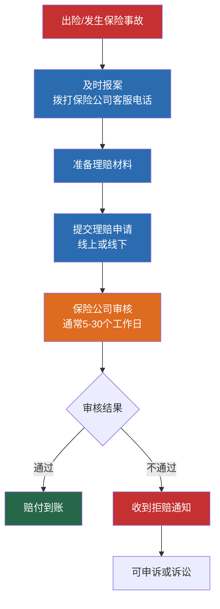
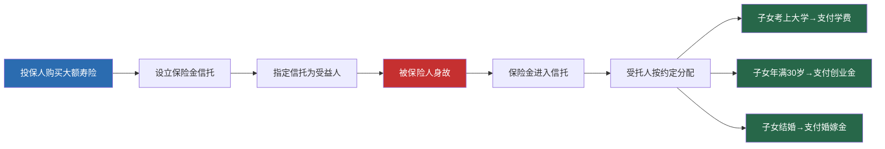
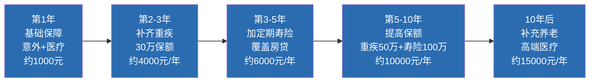
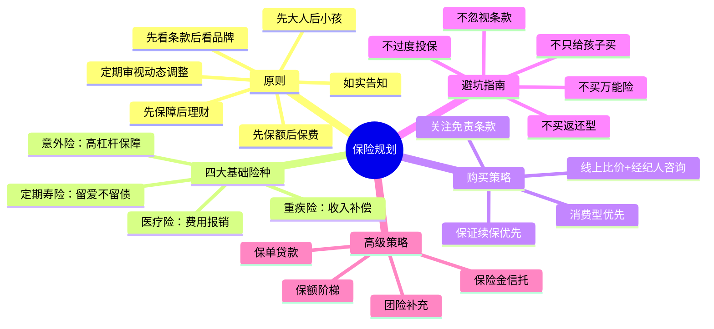

## 四、保险规划：为人生系上安全带

### 4.1 保险的本质与底层逻辑

#### 4.1.1 为什么需要保险？——风险的数学真相

保险的本质是：**用确定的小额支出（保费），转移不确定的大额风险（疾病、意外、身故等）。**

这句话人人都会说，但真正理解它的人不多。我们用数字来说明：

| 风险事件 | 发生概率 | 经济影响 | 是否可承受 |
|---------|---------|---------|-----------|
| 重大疾病（一生中） | 约72% | 30-100万元 | 单次不可承受 |
| 意外伤残 | 约3-5‰/年 | 50-200万元（终身护理） | 不可承受 |
| 交通意外身故 | 约1‰/年 | 家庭收入断流数十年 | 不可承受 |
| 住院医疗 | 约10-15%/年 | 1-10万元 | 勉强可承受 |
| 小额门诊 | 约60-80%/年 | 几百到几千元 | 完全可承受 |

**核心规律：发生概率越低的事件，一旦发生造成的损失越大，个人越无法承受。这正是保险存在的意义——用高频小额支出对冲低频高额损失。**

从经济学角度看，保险利用了大数法则（Law of Large Numbers）：单个个体的风险是不确定的，但当样本足够大时，群体的平均损失是可以精确预测的。保险公司正是基于这个原理，将众多投保人的保费汇集起来，用以赔付少数真正遭遇不幸的人。

**从个人视角理解保险的杠杆效应：**

| 投入 | 产出 | 杠杆倍数 |
|-----|-----|---------|
| 意外险200元/年 | 100万身故/伤残保障 | 5000倍 |
| 百万医疗300元/年 | 400万医疗报销额度 | 13333倍 |
| 重疾险3500元/年 | 50万确诊即赔 | 143倍 |
| 定期寿险1200元/年 | 100万身故赔付 | 833倍 |

没有任何一种金融工具能提供如此高的杠杆。保险不是消费，是用最小成本构建财务安全网。

#### 4.1.2 社保够不够？——商业保险的不可替代性

很多人觉得"我有社保，不需要商业保险"，这是一个危险的误解。社保和商业保险的关系不是替代，而是互补：

| 保障维度 | 社保（医保/工伤） | 商业保险 |
|---------|-----------------|---------|
| 医疗费用报销 | 有起付线、封顶线、报销比例限制（通常60-80%） | 百万医疗险可覆盖社保外用药、进口药、靶向药 |
| 重大疾病 | 无额外赔付 | 重疾险确诊即赔，不限用途 |
| 意外身故/伤残 | 仅工伤保险覆盖（有严格认定条件） | 意外险覆盖面更广，赔付更灵活 |
| 身故保障 | 无（或仅丧葬补助） | 定期寿险赔付保额给家人 |
| 收入损失 | 不覆盖 | 重疾险赔付可弥补收入中断期间的损失 |
| 特需/国际部 | 不覆盖 | 中高端医疗险可覆盖 |
| 海外就医 | 不覆盖 | 高端医疗险可覆盖 |

**社保的三大缺口：**

1. **报销上限**：职工医保年度封顶线通常为30-50万元（各地不同），超过封顶线的部分完全自费。以癌症治疗为例，一个完整的治疗周期（手术+化疗+靶向药）花费通常在30-80万元，社保报销后自费部分可能仍有15-40万元。

2. **自费项目**：进口药、靶向药、质子重离子治疗、PET-CT检查等不在社保目录内的项目，全部需要自费。目前国家医保目录收录药品约3000种，而临床常用药品超过20万种，大量疗效更好但价格更贵的药品不在社保覆盖范围内。2023年国家医保谈判纳入了一批高价药，但仍有大量创新药（特别是刚上市的新药）需要患者自费。

3. **收入补偿**：社保不赔付你因病无法工作的收入损失。一个年收入20万的白领患癌后治疗康复2年，直接收入损失40万元，加上治疗费用自费部分，总损失可能超过60万元。社保一分钱都不补偿这个损失。

**一个真实的对比案例：**

王先生，35岁，确诊肺癌中期，治疗总费用62万元：
- 社保报销：28万元（含大病二次报销）
- 自费部分：34万元（靶向药18万 + 进口化疗药8万 + 质子重离子8万）
- 如果有百万医疗险：报销约33万元（34万-1万免赔额）
- 如果有50万重疾险：一次性赔付50万元（不限用途）
- 如果只有社保：自掏34万元 + 2年无法工作的收入损失约40万元 = 总损失74万元

#### 4.1.3 保险的经济学本质——风险管理工具

从个人理财的角度看，保险是风险管理金字塔中的基石：

**没有保险的投资是裸奔。** 你辛辛苦苦攒下的20万理财收益，可能在一场大病中瞬间归零。保险的作用是保护你的资产底线，确保无论发生什么风险，你和家人的基本生活不会崩塌。

**保险与投资的正确关系：**

| 阶段 | 保险 | 投资 | 关系 |
|-----|-----|-----|-----|
| 未配置保险 | 先停 | 暂缓高风险投资 | 保险优先 |
| 基础保障已配齐 | 维持 | 可以开始投资 | 并行推进 |
| 保障充足 | 动态调整 | 积极投资 | 投资为主，保险为盾 |

核心原则：**保险是防守，投资是进攻。先守好底线，再追求收益。**

---

### 4.2 保险配置的六大原则

#### 原则一：先保障，后理财

优先配置纯保障型保险，而非储蓄型或分红型保险。

**为什么？** 保险的核心功能是风险转移，不是投资增值。储蓄型保险（如两全险、分红险）的内部收益率通常只有1.5-3%，远低于同期银行理财和基金定投的收益。用保险来理财，既没有获得足够的保障，也没有获得好的收益——两头不讨好。

**正确做法：** 买纯保障型产品（消费型），把省下来的保费差额用于真正的投资理财。

| 对比项 | 消费型重疾险（推荐） | 返还型重疾险（不推荐） |
|-------|-------------------|---------------------|
| 30岁男性，30万保额，保至70岁 | 约3000-4000元/年 | 约8000-12000元/年 |
| 70岁未出险 | 保费不退 | 返还已交保费（不含利息） |
| 实际杠杆率 | 极高（保费撬动保额） | 极低（接近1:1） |
| 省下差额投资收益 | 年化5%定投30年约35-50万 | 无 |

**深入理解"消费型"并不亏：** 很多人觉得消费型保险"钱白花了"，这是一种心理误区。你每年花200元买意外险，没有出险，这200元买到的是过去一年的安心——万一出了事，有100万兜底。你花300元买百万医疗险，没有住院，这300元买到的是过去一年看病不心疼钱的底气。这才是保险真正的价值。

#### 原则二：先大人，后小孩

优先保障家庭经济支柱。很多家长只给孩子买保险，自己裸奔——这是最典型的保险误区。

**逻辑很简单：** 孩子生病，大人还可以赚钱治病；大人生病或身故，孩子的生活、教育、成长全部受波及。保险保的不是人的身体，而是人的经济价值。家庭经济支柱的"经济价值"远高于孩子。

**正确的家庭保障优先级：**
1. 家庭主要收入者（通常是父母）
2. 家庭次要收入者
3. 孩子
4. 老人（如果预算允许）

**一个直观的计算：** 假设家庭年收入30万，主要收入者年收入20万。如果主要收入者因病无法工作3年，家庭直接收入损失60万元。如果孩子生病需要30万治疗费，家庭还可以通过另一方收入、借款、众筹等方式筹措。两者的经济冲击完全不在一个量级。

**特别提醒：** 不要被"爱孩子"的情感绑架了理性判断。给孩子买一份5000元/年的储蓄型保险，却让自己裸奔——这不是爱孩子，是害孩子。真正爱孩子的方式是先确保自己有足够的保障。

#### 原则三：先保额，后保费

在预算有限的情况下，优先确保保额足够，再考虑保费控制。

**为什么？** 买保险的核心目的是在风险发生时获得足够的赔付。如果保额不够，保险就失去了意义。一份保额只有10万的重疾险，在大病面前杯水车薪。

**控制保费的方法（不影响保额）：**
- 缩短保障期限：终身→保至70岁
- 延长缴费期限：10年交→20年交或30年交
- 选择消费型而非返还型
- 去掉不必要的附加险（如身故返还保费）

**具体示例——同样是5000元预算：**

| 方案 | 重疾险保额 | 保障期限 | 附加责任 | 科学性 |
|-----|----------|---------|---------|-------|
| 方案A：保额优先 | 50万 | 保至70岁 | 无 | ✅ 保额充足 |
| 方案B：品牌优先 | 30万 | 保终身 | 含身故返还 | ❌ 保额不足 |
| 方案C：期限优先 | 20万 | 保终身 | 含身故+多次赔付 | ❌ 保额严重不足 |

方案A虽然"看起来不那么高级"，但在风险发生时能提供50万的赔付；方案C看起来很全面，但20万保额在大病面前根本不够用。

#### 原则四：如实告知，诚实投保

投保时必须如实告知健康状况，这是《保险法》的明确要求，也是理赔能否成功的关键。

**如实告知的内容：**
- 既往病史（包括已治愈的疾病）
- 当前健康异常（如体检发现的结节、囊肿、血脂异常等）
- 家族病史（部分产品要求）
- 职业类别（高危职业可能被拒保或加费）

**告知的边界：**
- 已确诊、已治疗的疾病必须告知
- 体检报告中明确提示的异常必须告知
- 没有确诊的"怀疑"不需要告知
- 保险公司没问到的不需要主动告知

**错误做法示例：**
- 体检发现甲状腺结节3级→不告知→后续确诊甲状腺癌→理赔被拒
- 3年前做过阑尾炎手术→不告知→与理赔无关→不影响理赔（但最好告知，避免争议）

**健康告知的正确姿势——有限告知原则：**

中国保险实行"有限告知"，即保险公司问了什么就答什么，没问的不用主动说。这和很多人的直觉相反——他们觉得"多说点更安全"，但过度告知反而可能给自己制造麻烦。

**实操技巧：**
1. 逐条阅读健康告知问卷，只回答问到的问题
2. 问卷问"是否被诊断过XX疾病"——如果没被诊断过，即使体检有异常指标，也可以选"否"
3. 问卷问"近2年内是否有体检异常"——如果异常是2年前发现的，可以选"否"
4. 不确定的情况，走智能核保或人工核保，获得明确结论再投保

**常见健康异常的投保策略：**

| 健康异常 | 投保影响 | 应对策略 |
|---------|---------|---------|
| 甲状腺结节1-2级 | 大部分产品可标体承保 | 选择对甲状腺友好的产品，如达尔文系列、超级玛丽系列 |
| 甲状腺结节3级 | 通常除外甲状腺癌承保 | 接受除外承保，仍有其他保障 |
| 甲状腺结节4级及以上 | 多数产品拒保 | 先做穿刺明确性质，良性可再投保 |
| 乳腺结节BI-RADS 2级 | 大部分产品可标体承保 | 选择对乳腺友好的产品 |
| 乳腺结节BI-RADS 3级 | 通常除外乳腺癌承保 | 接受除外承保 |
| 乙肝病毒携带 | 医疗险多数可承保，重疾险需看具体产品 | 选择对乙肝友好的重疾险，走人工核保 |
| 乙肝小三阳 | 部分产品可加费承保或除外承保 | 多家产品尝试智能核保 |
| 脂肪肝（轻度） | 大部分产品可标体承保 | 影响较小 |
| 高血压（140/90以下） | 部分产品可标体承保 | 选择对血压宽松的产品 |
| 高血压（160/100以上） | 多数产品拒保 | 先控制血压再投保 |
| 抑郁症/焦虑症 | 重疾险多数拒保，医疗险除外精神疾病 | 选择对精神疾病宽松的产品，或等康复后投保 |

#### 原则五：先看条款，后看品牌

保险产品的好坏取决于合同条款，而非保险公司的品牌大小。中国所有保险公司都受银保监会（现为国家金融监督管理总局）严格监管，不存在"小公司不赔"的问题。

**重点关注的条款：**
- **保障责任**：什么情况下赔、赔多少
- **免责条款**：什么情况下不赔
- **等待期**：投保后多久开始生效（通常90-180天）
- **续保条件**：医疗险是否保证续保、费率如何调整
- **理赔标准**：重疾险的疾病定义和理赔条件

**中国保险公司的安全保障机制：**

很多人担心"小保险公司倒闭了怎么办"，这个担心可以理解但其实多余：

1. **设立门槛极高**：保险公司注册资本最低2亿元（实缴），主要股东净资产不低于2亿元，且需经国家金融监督管理总局批准。
2. **保证金制度**：保险公司需将注册资本的20%缴存为保证金，用于保障被保险人利益。
3. **责任准备金**：保险公司必须按照精算规则提取责任准备金，确保有足够资金兑付未来理赔。
4. **保险保障基金**：所有保险公司都需缴纳保险保障基金，当公司出现重大风险时用于救助。
5. **偿付能力监管**：保险公司必须保持充足的偿付能力（综合偿付能力充足率不低于100%），低于标准会被限制业务。
6. **再保险机制**：保险公司会将部分风险转移给再保险公司，分散风险。
7. **接管与转让**：即使保险公司真的经营不善，监管部门会安排其他公司接管或转让保单，被保险人权益不受影响。历史上安邦保险、华夏人寿等案例都得到了妥善处理。

**结论：买保险看条款不看品牌，条款好才是真正好。**

#### 原则六：定期审视，动态调整

保险配置不是一劳永逸的。随着人生阶段、收入水平、家庭结构的变化，保险方案也需要相应调整。

**触发调整的事件：**
- 结婚（配偶需要保障）
- 生子（增加定期寿险保额）
- 买房（增加定期寿险保额覆盖房贷）
- 升职加薪（提高重疾险保额）
- 原有产品到期或有更好的替代产品

**建议审视频率：** 每2-3年全面审视一次保险方案，每年检查一次保单状态。

---

### 4.3 四大基础保险详解

#### 4.3.1 重疾险——收入损失的补偿器

**功能定位：** 确诊重大疾病后一次性赔付保额，不限用途。可以用于治疗费用、康复费用、收入损失补偿、房贷还款、子女教育等任何用途。

**为什么需要重疾险？** 很多人误以为医疗险可以替代重疾险，其实不然：

| 对比项 | 医疗险 | 重疾险 |
|-------|-------|-------|
| 赔付方式 | 报销制（凭发票报销） | 定额给付（确诊即赔） |
| 用途限制 | 仅限医疗费用 | 不限用途 |
| 收入补偿 | 不覆盖 | 可弥补治疗期间的收入损失 |
| 治疗期间生活费 | 不覆盖 | 可用于维持家庭日常开支 |
| 是否需要发票 | 需要 | 不需要 |

**重疾险的"三重保障"逻辑：**
1. **治疗费用**：覆盖医保外的自费部分（靶向药、进口药、质子重离子等）
2. **康复费用**：重大疾病治疗后的康复期通常需要1-3年，期间营养、护理、复查费用不菲
3. **收入补偿**：患病期间无法工作，重疾险赔付可以替代收入，保障家庭正常运转

**保额设计公式：**
重疾险保额 = 年收入 × 3~5 + 康复期预估费用（10-20万）
最低保额 = 30万元

**保障期限选择：**
- 预算充足：保终身（含身故责任的终身重疾险）
- 预算适中：保终身（纯重疾责任的终身重疾险）
- 预算紧张：保至70岁（消费型定期重疾险）

**产品类型深度对比：**

| 特征 | 消费型定期重疾险 | 消费型终身重疾险 | 储蓄型终身重疾险 |
|-----|----------------|----------------|----------------|
| 保至70岁/终身 | 保至70岁 | 保终身 | 保终身 |
| 身故赔付 | 无 | 无或赔保额 | 赔保额 |
| 保费（30岁男性30万） | 约3000-4000元/年 | 约4500-6000元/年 | 约8000-12000元/年 |
| 杠杆率 | 最高 | 较高 | 较低 |
| 适合人群 | 预算有限的年轻人 | 预算适中的主力人群 | 预算充足且追求确定性 |

**重疾险的疾病定义（28种必保重疾）：**

中国保险行业协会和中国医师协会统一定义了28种重大疾病，占所有重疾理赔的95%以上。所有重疾险产品都必须包含这28种，因此不必过度关注"保障100种还是120种重疾"——多出来的病种发生率极低。

前6种高发重疾（占理赔80%以上）：
1. 恶性肿瘤（重度）——即癌症
2. 较重急性心肌梗死
3. 严重脑中风后遗症
4. 重大器官移植术或造血干细胞移植术
5. 冠状动脉搭桥术
6. 严重慢性肾衰竭

**轻症/中症责任：**
现代重疾险通常包含轻症和中症责任，赔付比例分别为保额的20-30%和50-60%。例如：
- 轻度恶性肿瘤（原位癌等）→赔保额的30%
- 不典型急性心肌梗死→赔保额的50%
- 轻微脑中风→赔保额的50%

**选择重疾险的核心指标：**

| 指标 | 重要程度 | 说明 |
|-----|---------|-----|
| 保额 | ★★★★★ | 最核心，直接决定赔付金额 |
| 高发轻/中症覆盖 | ★★★★ | 关注6种高发重疾对应的轻/中症是否覆盖 |
| 等待期 | ★★★ | 90天优于180天 |
| 赔付比例 | ★★★ | 轻症30%、中症60%为当前主流 |
| 被保人豁免 | ★★★ | 确诊轻/中/重疾后免交后续保费 |
| 投保人豁免 | ★★ | 夫妻互保时有价值 |

**年缴保费参考**（30岁，保额30万，保至70岁，缴费30年）：
- 男性：约3000-4000元/年
- 女性：约2500-3500元/年

#### 4.3.2 医疗险——社保的强力补充

**功能定位：** 报销医疗费用，弥补社保的报销缺口。采用报销制，需要凭医疗发票报销，且报销金额不超过实际花费。

**医疗险的核心指标：**

| 指标 | 含义 | 关注要点 |
|-----|-----|---------|
| 保额 | 最高报销上限 | 百万医疗险通常100-600万，足够 |
| 免赔额 | 自己承担的部分 | 通常1万元，社保报销后的部分抵扣免赔额 |
| 报销比例 | 超出免赔额后的报销比例 | 有社保100%报销，无社保通常60% |
| 报销范围 | 哪些费用可以报销 | 是否包含社保外用药、进口药、靶向药 |
| 续保条件 | 产品停售或理赔后能否续保 | 最重要！选择保证续保的产品 |

**医疗险分类详解：**

**百万医疗险（推荐首选）**
- 保额：100-600万元
- 免赔额：1万元（社保报销后，自费部分超过1万才报销）
- 年保费：200-1000元（30岁约200-400元）
- 覆盖范围：住院、特殊门诊、门诊手术、住院前后门急诊
- 续保条件：优先选择保证续保20年的产品
- 代表产品：长相安、好医保长期医疗、平安e生保等

**中端医疗险**
- 保额：100-500万元
- 免赔额：0-5000元（可选）
- 年保费：2000-8000元
- 覆盖范围：住院+门诊，部分覆盖公立医院特需部/国际部
- 适合人群：追求更好就医体验的人群

**高端医疗险**
- 保额：1000万元-无上限
- 免赔额：可选
- 年保费：1-5万元
- 覆盖范围：全球就医、私立医院、孕产保障、齿科、体检等
- 适合人群：高净值人群、有海外就医需求的人群

**选择百万医疗险的五大关键点：**

1. **续保条件**：选择保证续保15-20年的产品，避免因产品停售或健康变化失去保障。保证续保期内，即使理赔过也能继续续保。注意区分"保证续保"和"连续投保"——前者写进合同，后者只是承诺不因健康变化拒绝续保，但产品停售就没了。

2. **院外特药**：是否包含院外购药（靶向药、免疫治疗药物等），这部分费用往往是大头。很多靶向药医院没有，需要到院外药房购买，如果医疗险不覆盖院外特药，这部分费用完全自费。

3. **质子重离子**：是否覆盖质子重离子治疗（一种先进的癌症治疗手段，单次治疗费约30-50万）。目前国内质子重离子医院主要有上海质子重离子医院、淄博万杰肿瘤医院等。

4. **增值服务**：住院垫付（保险公司直接垫付住院押金）、就医绿通（快速安排专家门诊和住院）、二次诊疗意见等实用服务。住院垫付特别重要——很多大病住院需要先交几万甚至十几万押金，如果手头现金不够，垫付服务能解燃眉之急。

5. **费率调整**：保证续保产品通常有费率调整条款，关注调整条件和幅度。费率调整通常是整体调整（针对所有投保人），不会因个人理赔单独涨价。

**百万医疗险的理赔计算示例：**

假设总医疗费用50万元，其中社保报销25万元：
自费部分 = 50万 - 25万 = 25万
扣除免赔额 = 25万 - 1万 = 24万
百万医疗险报销 = 24万 × 100% = 24万
个人实际承担 = 1万元（仅免赔额部分）

**百万医疗险的常见理赔场景：**

| 场景 | 总费用 | 社保报销 | 自费部分 | 医疗险报销 | 个人承担 |
|-----|-------|---------|---------|----------|---------|
| 阑尾炎手术 | 2万 | 1.2万 | 0.8万 | 0（未超免赔额） | 0.8万 |
| 骨折住院 | 5万 | 3万 | 2万 | 1万 | 1万 |
| 心脏支架手术 | 15万 | 8万 | 7万 | 6万 | 1万 |
| 癌症化疗+靶向 | 50万 | 20万 | 30万 | 29万 | 1万 |
| 白血病骨髓移植 | 80万 | 25万 | 55万 | 54万 | 1万 |

**核心结论：** 小病用不上（免赔额1万），大病真救命。百万医疗险的本质是"大病兜底"。

#### 4.3.3 意外险——高杠杆的基础保障

**功能定位：** 保障因意外事故导致的身故、伤残和医疗费用。意外险是所有保险中杠杆率最高的，用极低的保费获得高额保障。

**意外险的"意外"定义：** 外来的、突发的、非本意的、非疾病的客观事件。

包含：交通事故、高空坠物、溺水、烧伤烫伤、动物咬伤、运动受伤等。
不包含：猝死（属于疾病）、中暑（可预见）、食物中毒（通常归疾病）等。

**意外险的三大保障责任：**

1. **意外身故**：因意外导致身故，赔付保额给受益人
2. **意外伤残**：因意外导致伤残，按伤残等级比例赔付（1-10级，分别赔付100%-10%）
3. **意外医疗**：因意外产生的医疗费用报销

**伤残赔付的意义：** 这是意外险最核心的价值。很多人只关注身故赔付，实际上伤残的概率远高于身故。伤残按等级比例赔付：
- 1级伤残（全残）：赔付100%保额
- 5级伤残：赔付60%保额
- 10级伤残（最轻）：赔付10%保额

以100万保额为例：5级伤残赔付60万，这笔钱可以用于康复、护理、收入补偿。

**意外伤残等级示例（部分）：**

| 伤残等级 | 赔付比例 | 典型情况 |
|---------|---------|---------|
| 1级 | 100% | 双目永久失明、四肢瘫痪 |
| 2级 | 90% | 一目永久失明+一肢完全丧失功能 |
| 3级 | 80% | 一肢缺失+另一肢丧失功能 |
| 5级 | 60% | 一肢完全丧失功能 |
| 7级 | 40% | 一目永久失明 |
| 8级 | 30% | 一耳听力完全丧失+一眼低视力 |
| 10级 | 10% | 一手指缺失、一颗牙齿缺失 |

**选择意外险的关键指标：**

| 指标 | 建议 | 说明 |
|-----|-----|-----|
| 意外身故保额 | 50-100万 | 越高越好 |
| 意外伤残保额 | 与身故保额相同 | 注意：部分产品伤残保额低于身故保额，这是坑 |
| 意外医疗保额 | 2-5万 | 足够覆盖大部分意外医疗 |
| 意外医疗免赔额 | 0元 | 最好选无免赔额的产品 |
| 意外医疗报销范围 | 不限社保 | 社保外用药也能报销 |
| 猝死保障 | 包含 | 部分产品不含猝死，需要单独关注 |
| 住院津贴 | 有最好 | 每天100-200元，锦上添花 |

**年缴保费参考：** 100-300元/年（杠杆率极高，100万保额仅需200元左右）

**特别注意：**
- 意外险通常有职业限制，1-4类职业可正常投保，5-6类高危职业需要特殊产品
- 猝死保障需要单独确认，部分意外险不含猝死责任
- 驾驶私家车发生的意外属于保障范围，但酒驾、无证驾驶除外

**职业分类参考：**

| 职业类别 | 典型职业 | 意外险投保 |
|---------|---------|----------|
| 1类（低风险） | 内勤办公人员、教师、程序员 | 正常投保 |
| 2类（较低风险） | 外勤销售人员、导游 | 正常投保 |
| 3类（中等风险） | 厨师、快递员（非骑手） | 正常投保 |
| 4类（较高风险） | 交警、出租车司机 | 部分产品可投保 |
| 5类（高危） | 建筑工人、消防员 | 需要专门的高危职业意外险 |
| 6类（极高危） | 矿工、爆破工 | 可选产品极少，保费很高 |

#### 4.3.4 定期寿险——对家人的爱与责任

**功能定位：** 在保障期限内身故或全残，赔付保额给受益人。定期寿险是"留爱不留债"的工具，确保万一自己不在了，家人的生活质量不会断崖式下降。

**为什么叫"定期"？** 保障期限固定（如保至60岁、65岁、70岁），到期后保障结束，保费不退。与之对应的是"终身寿险"，保费贵很多，适合有财富传承需求的人群。

**适合人群：**
- 有房贷（尤其是高额房贷）的家庭经济支柱
- 有未成年子女的父母
- 有赡养老人义务的子女
- 家庭收入严重依赖单一成员的家庭

**保额计算公式：**
定期寿险保额 = 房贷余额 + 子女教育金（至大学毕业） + 家庭5年生活费 + 赡养父母费用

**具体示例：**
房贷余额：100万
子女教育金：15万/年 × 4年大学 = 60万（假设1个孩子）
家庭5年生活费：10万/年 × 5年 = 50万
赡养父母：5万/年 × 10年 = 50万
合计：约260万
→ 建议保额：200-300万

**保障期限选择：**
- 保至60岁：覆盖房贷还款期和子女成长期，性价比最高
- 保至65岁：覆盖延迟退休后的时间
- 保至70岁：更全面但保费更高

**年缴保费参考**（30岁，保额100万，保至60岁，缴费30年）：
- 男性：约1000-1500元/年
- 女性：约500-800元/年

**定期寿险的"全残"责任：** 除了身故，全残也会赔付。全残通常包括双目永久失明、两上肢腕关节以上缺失、两下肢踝关节以上缺失等严重情况。

**定期寿险 vs 终身寿险：**

| 对比项 | 定期寿险 | 终身寿险 |
|-------|---------|---------|
| 保障期限 | 固定期限（至60/65/70岁） | 终身 |
| 保费（30岁男100万） | 约1000-1500元/年 | 约10000-15000元/年 |
| 杠杆率 | 极高 | 较低 |
| 现金价值 | 极低或无 | 有，持续增长 |
| 适合场景 | 纯保障需求 | 保障+财富传承 |
| 推荐人群 | 普通家庭 | 高净值人群 |

---

### 4.4 不同人生阶段的保险配置方案

#### 4.4.1 单身期（22-28岁）

**特点：** 收入不高，负债少，父母健康，抗风险能力相对较强。

**核心需求：** 保障自己的健康和意外风险，避免因病返贫。

| 险种 | 优先级 | 保额建议 | 年缴保费参考 | 说明 |
|------|--------|---------|------------|------|
| 意外险 | ★★★★★ | 50-100万 | 150-300元 | 杠杆率最高，必买 |
| 百万医疗险 | ★★★★★ | 200-400万 | 200-400元 | 解决大病医疗费用 |
| 重疾险 | ★★★★ | 30万 | 2000-3000元 | 消费型定期，保至70岁 |

**年缴保费合计：约2500-4000元**

**配置策略：**
- 预算紧张：先买意外险+百万医疗险（500元以内搞定），等收入提升再加重疾险
- 预算充裕：三者都买，重疾险选保至70岁的消费型产品
- 注意：趁年轻投保，保费便宜，健康告知容易通过

#### 4.4.2 家庭形成期（28-35岁）

**特点：** 结婚、买房、生子，负债增加，责任加重。

**核心需求：** 保障家庭经济支柱，确保房贷有人还、孩子有人养。

| 险种 | 优先级 | 保额建议 | 年缴保费参考 | 说明 |
|------|--------|---------|------------|------|
| 定期寿险 | ★★★★★ | 100-200万 | 1000-2000元 | 覆盖房贷+子女教育 |
| 重疾险 | ★★★★★ | 30-50万 | 3000-5000元 | 保额提高到年收入3-5倍 |
| 百万医疗险 | ★★★★★ | 200-400万 | 300-500元 | 保证续保20年的产品 |
| 意外险 | ★★★★★ | 100万 | 200-300元 | 保额提高 |
| 配偶保险 | ★★★★ | 同上 | 4000-8000元 | 配偶也需要完整保障 |
| 子女医疗险 | ★★★★ | — | 500-1000元 | 少儿医保+百万医疗 |

**年缴保费合计：约9000-17000元（夫妻双方）**

**配置策略：**
- 夫妻双方都需要定期寿险和重疾险，保额根据各自收入占比分配
- 孩子优先买百万医疗险和意外险，重疾险可以等预算充足再加
- 定期寿险保额要覆盖房贷余额，确保万一出事房子不被银行收走

**夫妻保额分配示例：**
家庭年收入40万（丈夫25万，妻子15万）
丈夫收入占比：62.5%
妻子收入占比：37.5%

定期寿险分配：
- 丈夫：200万 × 62.5% = 125万 → 取150万
- 妻子：200万 × 37.5% = 75万 → 取100万

重疾险分配：
- 丈夫：50万
- 妻子：40万

#### 4.4.3 家庭成长期（35-45岁）

**特点：** 收入达到高峰，房贷压力减轻，但子女教育费用增加。

**核心需求：** 提高保障额度，开始关注养老规划。

| 调整项 | 说明 |
|-------|-----|
| 提高重疾险保额 | 35岁后重疾发病率明显上升，保额提高到50-80万 |
| 增加养老年金险 | 如果基础保障已配齐，可以开始配置养老年金 |
| 关注父母保障 | 为父母配置防癌医疗险或意外险（老人买重疾险性价比极低） |
| 子女教育金 | 可以用年金险或基金定投替代（保险收益太低） |

**父母保险配置策略：**

| 父母年龄 | 推荐险种 | 说明 |
|---------|---------|-----|
| 50-60岁 | 百万医疗险+意外险 | 百万医疗险保费约1000-2000元/年 |
| 60-65岁 | 防癌医疗险+意外险 | 百万医疗险可能无法投保，退而求其次选防癌医疗险 |
| 65-70岁 | 意外险+惠民保 | 健康险选择极少，意外险是底线 |
| 70岁以上 | 意外险+惠民保 | 基本只能买意外险和当地惠民保 |

**防癌医疗险的优势：** 健康告知宽松，三高、糖尿病、心脏病患者都能投保，专门报销癌症相关的医疗费用，保额通常100-400万，年保费约500-1500元（50-60岁）。

#### 4.4.4 家庭成熟期（45-55岁）

**特点：** 子女逐渐独立，收入可能达到顶峰，健康风险增加。

**核心需求：** 维持保障，逐步转向养老和财富传承。

**关键调整：**
- 检查重疾险保额是否充足（45岁后重疾险保费急剧上升，如果之前没买，现在买非常贵）
- 定期寿险可以适当降低保额（房贷还清、子女独立后，保障需求下降）
- 开始配置养老年金，确保退休后有稳定的现金流
- 关注高端医疗险（如果预算允许），覆盖更好的就医资源

#### 4.4.5 特殊人群的保险配置

**自由职业者/个体户：**
- 没有单位社保，医保需要自己缴纳（居民医保或灵活就业社保），这是第一优先级
- 重疾险和定期寿险的保额要更高（因为没有单位提供的团体保障）
- 意外险要注意职业类别限制

**备孕/怀孕女性：**
- 孕前配置好重疾险和医疗险（怀孕后投保可能被限制）
- 部分高端医疗险覆盖孕产保障（产检、分娩、新生儿保障）
- 怀孕期间通常不能投保新的健康险

**高危职业从业者（建筑工人、消防员、快递员等）：**
- 意外险需要选择专门的高危职业意外险（5-6类职业）
- 保费比普通意外险贵2-5倍
- 部分重疾险和医疗险可能拒保或加费

**已有慢性病的人群（非标体投保攻略）：**

| 策略 | 适用情况 | 操作方法 |
|-----|---------|---------|
| 智能核保 | 轻微异常 | 在线填写健康告知，系统自动给出核保结论 |
| 人工核保 | 较复杂情况 | 提交病历资料，由核保员人工审核 |
| 多家尝试 | 被一家拒保 | 不同公司核保标准不同，多试几家 |
| 先治疗再投保 | 可治愈的异常 | 治愈后提供复查报告，可能标体承保 |
| 选择宽松产品 | 常见异常 | 选择对特定疾病友好的产品 |
| 退而求其次 | 重疾险被拒 | 改投防癌险（健康告知更宽松） |

---

### 4.5 保险合同阅读指南

保险合同是理赔的唯一依据。很多人买了保险却不知道自己保的是什么，等到理赔时才发现"原来不赔"。以下是阅读保险合同的关键要点：

#### 4.5.1 合同结构速览

一份保险合同通常包含以下部分（按重要性排序）：

1. **保险责任**：什么情况下赔、赔多少（最重要！仔细看）
2. **责任免除**：什么情况下不赔（非常重要！逐条看）
3. **保险期间**：保障多长时间
4. **保险金额**：赔多少钱
5. **等待期**：投保后多久开始生效
6. **宽限期**：忘记缴费后的缓冲期（通常60天）
7. **犹豫期**：投保后可以全额退保的期限（通常10-15天）
8. **如实告知条款**：健康告知的要求

#### 4.5.2 重点关注的免责条款

所有保险都有免责条款，常见的包括：

| 免责类型 | 常见内容 | 是否合理 |
|---------|---------|---------|
| 故意行为 | 故意自伤、故意犯罪 | 合理 |
| 违法行为 | 酒驾、无证驾驶、吸毒 | 合理 |
| 战争/暴乱 | 战争、军事行动、恐怖袭击 | 合理 |
| 先天性疾病 | 先天性心脏病等 | 需关注 |
| 等待期内发病 | 等待期内确诊的疾病 | 合理 |
| 既往症 | 投保前已有的疾病 | 合理 |

**不同险种的免责条款差异：**

| 险种 | 免责条款数量 | 常见特殊免责 |
|-----|------------|------------|
| 重疾险 | 较少（通常7-10条） | 等待期内确诊不赔 |
| 医疗险 | 较多（通常15-20条） | 整形美容、不孕不育、牙科（非意外）不赔 |
| 意外险 | 中等（通常10-15条） | 猝死（部分产品）、高风险运动不赔 |
| 定期寿险 | 最少（通常3-5条） | 投保后2年内自杀不赔 |

#### 4.5.3 犹豫期和退保

- **犹豫期**（通常10-15天）：投保后可以无条件全额退保
- **犹豫期后退保**：只能退现金价值（远低于已交保费），损失很大
- **建议**：投保后仔细阅读合同，犹豫期内发现问题及时退保

**现金价值的含义：** 现金价值是保险合同中载明的一张表，显示在不同年度退保能拿回多少钱。以一份终身重疾险为例：

| 缴费年限 | 已交保费累计 | 现金价值 | 退保损失比例 |
|---------|-----------|---------|------------|
| 第1年 | 5000元 | 约500元 | 90% |
| 第5年 | 25000元 | 约8000元 | 68% |
| 第10年 | 50000元 | 约25000元 | 50% |
| 第20年 | 100000元 | 约70000元 | 30% |
| 第30年（缴满） | 150000元 | 约130000元 | 13% |

**结论：** 前几年退保损失极大，投保前一定要想清楚。如果确实买错了，犹豫期内退保是最优选择。

---

### 4.6 保险购买渠道与选择策略

#### 4.6.1 四大购买渠道对比

| 渠道 | 优点 | 缺点 | 适合人群 |
|------|------|------|---------|
| 线上平台 | 产品丰富、价格透明、比价方便、自主性强 | 需要自己研究产品、缺乏专业指导、理赔需自助 | 有一定保险知识、愿意花时间研究的人 |
| 保险经纪人 | 代表客户利益、产品选择范围广（多家公司）、专业建议 | 需要找到靠谱的经纪人、经纪人水平参差不齐 | 对保险不了解、需要专业指导的人 |
| 保险代理人 | 一对一服务、售后服务方便 | 通常只代理一家公司产品、可能有销售误导 | 对某品牌有信任感的人 |
| 银行渠道 | 方便、信任度高 | 产品选择有限、费率可能较高、容易被推销储蓄型产品 | 不推荐（除非确实需要储蓄型产品） |

**推荐策略：** 线上平台做产品研究和比价 → 确定几款候选产品 → 咨询专业保险经纪人确认选择 → 线上投保。

#### 4.6.2 主流线上保险平台

- **蚂蚁保**（支付宝）：产品丰富，操作便捷，适合入门
- **微保**（微信）：腾讯系，操作简单
- **蜗牛保险**：专业第三方平台，产品评测详细
- **深蓝保**：保险知识科普+产品推荐，内容质量高
- **慧择网**：老牌互联网保险平台，产品线丰富

**互联网保险的监管保障：**

很多人担心"网上买保险靠谱吗"，其实互联网保险和线下保险的监管标准完全一样：
- 所有在售产品都必须在国家金融监督管理总局备案
- 电子保单和纸质保单具有同等法律效力（《保险法》第13条）
- 理赔标准完全相同，不会因为购买渠道不同而区别对待
- 可以通过保险公司官网、官方APP、客服电话查询和验证保单

#### 4.6.3 保险经纪人的选择标准

如果选择通过保险经纪人购买，关注以下几点：
1. **持有执业资格证**：保险经纪人需要通过国家考试
2. **不只推荐一家公司的产品**：好的经纪人会根据需求推荐多家公司的产品
3. **能清晰解释条款**：而不是只说"这个产品好"
4. **有理赔协助经验**：出险时能指导你准备材料、提交申请
5. **不夸大收益**：如果一个经纪人向你推销"收益很高"的储蓄型保险，换一个

---

### 4.7 保险理赔全流程

#### 4.7.1 理赔的基本流程

#### 4.7.2 不同险种的理赔材料

| 险种 | 核心材料 |
|-----|---------|
| 重疾险 | 诊断证明、病理报告、出院小结、身份证、银行卡 |
| 医疗险 | 医疗费用发票原件、费用清单、诊断证明、出院小结、社保报销凭证 |
| 意外险（身故） | 死亡证明、户籍注销证明、受益人身份证明、意外事故证明 |
| 意外险（伤残） | 伤残鉴定报告、事故证明、诊断证明 |
| 意外险（医疗） | 同医疗险 |
| 定期寿险 | 死亡证明、户籍注销证明、受益人身份证明 |

**理赔材料准备清单（建议收藏）：**

【通用材料】
□ 身份证复印件（被保险人+受益人）
□ 银行卡复印件（受益人）
□ 保险合同/电子保单

【医疗类理赔】
□ 住院病历（入院记录+出院小结+手术记录）
□ 医疗费用发票原件（最重要！丢失难补）
□ 费用明细清单
□ 检查报告（CT、MRI、病理等）
□ 社保报销凭证（如有社保报销）

【重疾险理赔】
□ 病理报告（癌症必须有）
□ 诊断证明（需包含ICD-10编码）
□ 出院小结

【身故理赔】
□ 死亡证明（医院或公安机关出具）
□ 户籍注销证明
□ 受益人身份证明
□ 受益人与被保险人关系证明

#### 4.7.3 理赔的注意事项

1. **及时报案**：出险后尽快报案，通常要求10天内。拖延报案可能影响理赔。
2. **保留所有单据**：医疗发票、诊断证明、检查报告等，原件妥善保管。
3. **如实陈述**：理赔时如实描述事故经过，不要夸大或隐瞒。
4. **配合调查**：保险公司可能要求补充材料或进行调查，积极配合。
5. **了解理赔时效**：根据《保险法》，保险公司应在30天内作出核定，10天内赔付。超过时限可以投诉。
6. **拒赔可申诉**：如果认为拒赔不合理，可以向保险公司申诉，或向银保监会投诉（12378热线），甚至提起诉讼。

**拒赔后的完整申诉路径：**

| 阶段 | 方式 | 时效 | 说明 |
|-----|-----|-----|-----|
| 第一步 | 保险公司内部申诉 | 30天 | 拨打客服电话或书面申诉，要求复核 |
| 第二步 | 拨打12378热线 | 即时受理 | 国家金融监督管理总局消费者投诉热线，非常有效 |
| 第三步 | 申请调解 | 30-60天 | 向当地保险行业协会申请调解 |
| 第四步 | 仲裁 | 60-90天 | 向仲裁委员会申请仲裁（需合同中有仲裁条款） |
| 第五步 | 诉讼 | 3-6个月 | 向法院提起诉讼，依据《保险法》和合同条款 |

**12378投诉技巧：**
- 投诉时提供保单号、被保险人姓名、拒赔原因、你的诉求
- 12378会将投诉转给保险公司，保险公司通常会在7-15天内回复
- 12378的投诉会被记录在案，影响保险公司的监管评级，因此保险公司非常重视
- 如果保险公司存在明显不合理拒赔，12378介入后通常能解决

---

### 4.8 保险常见陷阱与误区

#### 陷阱一：返还型保险"不花钱"

**销售话术：** "买返还型保险，没出险保费全退，相当于不花钱买保障。"

**真相：** 返还型保险的保费通常是消费型的2-3倍。以重疾险为例：
- 消费型：3000元/年 × 30年 = 9万元
- 返还型：8000元/年 × 30年 = 24万元（70岁返还24万）
- 差额：15万元
- 如果把15万差额按年投入，年化5%收益，30年后约33万

**结论：** 返还型保险"返还"的不是免费的钱，而是你自己多交的保费加上极低的利息。自己投资的收益远高于"返还"。

#### 陷阱二：万能险"保障+理财两不误"

**销售话术：** "万能险既有保障又有收益，一举两得。"

**真相：** 万能险的保障部分保额通常很低（几万到十几万），理财部分扣除各种费用后实际收益率只有1.5-3%。保障不够，理财不划算，两头不讨好。

**万能险的费用扣除结构：**
你交的保费 10000元
- 初始费用（第1年）：约50% = 5000元
- 保障成本（风险保费）：约1000元
- 管理费用：约200元
→ 进入投资账户：约3800元
→ 实际用于投资的比例：仅38%

前几年的初始费用非常高，真正进入投资账户的钱很少。即使投资收益率达到5%，考虑到前期费用损失，前5-7年你的账户价值可能都低于已交保费。

#### 陷阱三：只给孩子买保险

**销售话术：** "给孩子最好的保障，让孩子赢在起跑线。"

**真相：** 孩子不赚钱，孩子生病大人可以赚钱治疗。但大人生病或身故，孩子的生活和教育全部受影响。保险保的是经济价值，应该优先保障家庭经济支柱。

#### 陷阱四：过度投保，保费占比过高

**标准：** 家庭年保费支出建议控制在年收入的5-10%以内。超过10%会挤压生活开支和投资空间。

**正确做法：** 先保障后理财，用消费型产品控制保费，把省下来的钱用于真正的投资。

**保费占比的合理区间：**

| 家庭年收入 | 建议年保费 | 上限 |
|-----------|----------|-----|
| 10万以下 | 3000-5000元 | 8000元 |
| 10-20万 | 5000-10000元 | 15000元 |
| 20-40万 | 10000-20000元 | 30000元 |
| 40-80万 | 20000-40000元 | 60000元 |
| 80万以上 | 按需配置 | 不超过收入10% |

#### 陷阱五：忽视免责条款

**常见案例：**
- 驾驶证过期期间出险→免责→不赔
- 在非指定医院就医→部分产品不赔
- 高风险运动（蹦极、潜水、攀岩）受伤→普通意外险不赔
- 等待期内体检发现异常→不赔

**防范方法：** 投保前仔细阅读免责条款，不确定的地方直接问客服或经纪人，做好记录。

#### 陷阱六：盲目追求大公司

**误区：** "小保险公司不靠谱，理赔会扯皮。"

**真相：** 中国所有保险公司都受国家金融监督管理总局严格监管，注册资本最低2亿元。理赔依据是合同条款，与公司大小无关。有些大公司的产品反而不如小公司的好，因为品牌溢价高、产品性价比低。

**数据佐证：** 银保监会公布的理赔数据显示，各家保险公司的理赔率都在97%以上，大小公司差异不大。

#### 陷阱七：保险可以"带病投保"

**误区：** "先买了再说，过了两年保险公司就一定赔。"

**真相：** 《保险法》确实有"两年不可抗辩条款"（第16条），但这不意味着可以故意隐瞒病情投保。如果投保时故意不如实告知，保险公司有权解除合同并拒赔。两年不可抗辩条款保护的是"非故意"的未告知情况。

**两年不可抗辩条款的正确理解：**

| 情况 | 是否适用两年不可抗辩 | 说明 |
|-----|-------------------|-----|
| 投保时不知道自己有病 | 适用 | 非故意隐瞒，两年后保险公司不得解除合同 |
| 投保时知道但忘记告知 | 视情况而定 | 法院判决不一，风险较大 |
| 投保时故意隐瞒重大疾病 | 不适用 | 故意欺诈，保险公司有权解除合同并拒赔 |
| 代理人代填健康告知导致未告知 | 视情况而定 | 如果能证明是代理人代填，可能适用 |

**司法实践中的趋势：** 近年来法院判决越来越倾向于保护消费者，但"故意隐瞒"仍然是硬伤。最安全的做法永远是如实告知。

#### 陷阱八：买保险就是买"大而全"

**误区：** "一份保险解决所有问题。"

**真相：** 没有任何一款产品能覆盖所有风险。正确的做法是四大基础险种组合搭配，各司其职：

| 风险 | 由哪个险种覆盖 | 说明 |
|-----|-------------|-----|
| 大病医疗费用 | 百万医疗险 | 报销制，覆盖社保外费用 |
| 大病收入损失 | 重疾险 | 定额给付，不限用途 |
| 意外身故/伤残 | 意外险 | 高杠杆，含伤残保障 |
| 疾病/意外身故 | 定期寿险 | 覆盖所有身故原因（除免责） |
| 小病门诊 | 社保+自付 | 商业保险不覆盖，费用可控 |

---

### 4.9 保险与税务、法律

#### 4.9.1 保险的税务优惠

| 税收政策 | 内容 | 适用条件 |
|---------|------|---------|
| 个人税优健康险 | 每年最高2400元（每月200元）可税前扣除 | 需购买税优型健康险产品 |
| 企业年金 | 个人缴费部分不超过工资4%可税前扣除 | 需要单位有企业年金计划 |
| 商业养老保险（递延纳税） | 每年最高12000元可税前扣除 | 个人养老金账户购买 |
| 保险赔款免税 | 保险理赔金免征个人所得税 | 所有保险理赔均适用 |
| 人寿保险免遗产税 | 目前中国无遗产税，未来如有，人寿保险可能有优势 | 需关注未来政策变化 |

**个人养老金账户的保险产品：** 2022年11月起，个人养老金制度在全国推行。每年最高存入12000元，可以购买特定的养老保险产品，享受税收递延优惠。对于年收入超过10万的人群，这是一个值得关注的节税渠道。

#### 4.9.2 保险与婚姻财产

- **婚前投保**：婚前缴纳的保费对应的现金价值属于个人财产
- **婚后投保**：婚后用共同财产缴纳的保费，现金价值属于夫妻共同财产
- **受益人指定**：指定受益人的保险金不属于遗产，不用于偿还被保险人生前债务
- **未指定受益人**：保险金作为遗产处理，可能被用于偿还债务

**离婚时保险的处理：**

| 情况 | 处理方式 |
|-----|---------|
| 婚前购买，婚前缴清 | 属于个人财产，不分割 |
| 婚前购买，婚后继续缴费 | 婚后缴费对应的现金价值需分割 |
| 婚后购买，用共同财产缴费 | 现金价值属于共同财产，需分割 |
| 为子女购买的保险 | 一般不分割，由抚养方继续缴费 |

#### 4.9.3 受益人指定的技巧

- **务必指定受益人**：不指定受益人，保险金作为遗产处理，可能引发继承纠纷
- **指定顺序和比例**：可以指定多个受益人，明确受益顺序和比例
- **定期更新**：离婚、再婚等情况下及时变更受益人
- **指定"法定"vs"指定"**：写"法定"等于未指定，应写明具体姓名、身份证号、与被保险人关系

**受益人指定的正确写法：**

错误写法：受益人——法定
正确写法：
  第一顺序受益人：张三（身份证号：xxx，关系：配偶），受益比例100%
  第二顺序受益人：李四（身份证号：xxx，关系：子女），受益比例100%

**为什么"法定"等于没指定？** 因为"法定"意味着按照《继承法》的法定继承顺序分配，所有法定继承人都有权分一杯羹，可能导致复杂的继承纠纷，甚至保险金被用于偿还被保险人生前债务。指定具体受益人则保险金直接给到受益人，不进入遗产分配流程。

---

### 4.10 保险方案实操模板

#### 4.10.1 个人保险方案规划表

【基本信息】
姓名：________
年龄：________
年收入：________ 万元
家庭角色：□ 主要收入者  □ 次要收入者  □ 无收入者
负债情况：房贷余额____万，车贷余额____万，其他____万
家庭成员：配偶____人，子女____人，需赡养老人____人

【已有保障】
社保：□ 职工医保  □ 居民医保  □ 无
企业补充保险：□ 有（覆盖范围：____） □ 无
已有商业保险：
  - 意外险：□ 有（保额____万） □ 无
  - 医疗险：□ 有（保额____万） □ 无
  - 重疾险：□ 有（保额____万） □ 无
  - 定期寿险：□ 有（保额____万） □ 无

【保障缺口分析】
重疾险缺口 = 目标保额（年收入×3-5）- 已有保额 = ____万
定期寿险缺口 = 目标保额（房贷+教育+生活费）- 已有保额 = ____万
医疗险缺口 = 是否有保证续保的百万医疗险：□ 有  □ 无
意外险缺口 = 是否有50万以上的意外险：□ 有  □ 无

【年度保费预算】
建议：年收入的 5-10%
预算：________ 元/年

【配置方案】
优先级1：________（保费：____元/年）
优先级2：________（保费：____元/年）
优先级3：________（保费：____元/年）
优先级4：________（保费：____元/年）
合计：________ 元/年

#### 4.10.2 家庭保险方案示例

**案例：张先生家庭**
- 张先生32岁，IT工程师，年收入25万
- 李女士30岁，教师，年收入15万
- 女儿2岁
- 房贷余额120万，月供8000元
- 家庭年收入40万，年保费预算约2-4万

**方案设计：**

| 成员 | 险种 | 产品类型 | 保额 | 年缴保费 |
|-----|-----|---------|-----|---------|
| 张先生 | 定期寿险 | 保至60岁 | 150万 | 1500元 |
| 张先生 | 重疾险 | 消费型终身 | 50万 | 5500元 |
| 张先生 | 百万医疗险 | 保证续保20年 | 400万 | 350元 |
| 张先生 | 意外险 | 综合意外 | 100万 | 250元 |
| 李女士 | 定期寿险 | 保至60岁 | 100万 | 600元 |
| 李女士 | 重疾险 | 消费型终身 | 40万 | 4000元 |
| 李女士 | 百万医疗险 | 保证续保20年 | 400万 | 300元 |
| 李女士 | 意外险 | 综合意外 | 100万 | 200元 |
| 女儿 | 百万医疗险 | 保证续保20年 | 400万 | 600元 |
| 女儿 | 意外险 | 少儿意外 | 20万 | 60元 |
| **合计** | | | | **约13360元/年** |

**方案说明：**
- 年保费约1.3万，占家庭年收入3.3%，在合理范围内
- 夫妻双方都有完整的四大保障
- 孩子优先配百万医疗险和意外险，重疾险等预算充足再加
- 定期寿险保额覆盖房贷余额+子女教育+生活费

#### 4.10.3 保单管理表（建议每年更新一次）

【家庭保单总览】

保单1：
  保险公司：________
  产品名称：________
  险种类型：□意外险 □医疗险 □重疾险 □定期寿险 □其他
  被保险人：________
  保额：________万
  年缴保费：________元
  缴费期限：________年
  保障期限：________
  生效日期：________
  缴费日期：每年____月____日
  保单号：________
  受益人：________
  备注：________

（重复以上格式，列出所有保单）

【年度检查清单】
□ 所有保单缴费状态是否正常
□ 受益人信息是否需要更新
□ 保障额度是否仍能满足当前需求
□ 是否有新增的家庭保障需求
□ 是否有更好的替代产品（不建议频繁换保，但可以关注）
□ 医疗险续保状态是否正常

---

### 4.11 进阶：保险配置的高级策略

#### 4.11.1 多次赔付重疾险 vs 单次赔付重疾险

| 对比项 | 单次赔付 | 多次赔付（分组） | 多次赔付（不分组） |
|-------|---------|----------------|-----------------|
| 重疾赔付次数 | 1次 | 2-6次（分组） | 2-3次（不分组） |
| 赔付后状态 | 合同终止 | 同组疾病不赔，不同组可赔 | 再次确诊其他重疾可赔 |
| 保费（30岁男50万） | 约5000元/年 | 约6500元/年 | 约8000元/年 |
| 性价比 | 最高 | 适中 | 较低 |
| 推荐人群 | 预算有限 | 预算适中 | 预算充足 |

**建议：** 预算有限选单次赔付，把保额做足比赔付次数更重要。预算充足可以考虑不分组多次赔付。

**分组的含义：** 多次赔付重疾险通常将100多种重疾分为3-6组，同一组内的疾病只能赔付一次。分组是否合理直接影响产品价值——如果6种高发重疾被分在同一组，那多次赔付的意义就大打折扣。

**优质分组 vs 劣质分组：**

| 分组方式 | 6种高发重疾分布 | 评价 |
|---------|---------------|-----|
| 优质分组 | 每种高发重疾单独一组或分散在不同组 | ★★★★★ |
| 一般分组 | 高发重疾分散在3-4组中 | ★★★ |
| 劣质分组 | 3种以上高发重疾在同一组 | ★ |

#### 4.11.2 保单贷款

长期保险（如终身重疾险、终身寿险）具有现金价值，可以申请保单贷款：
- 贷款额度：现金价值的70-80%
- 贷款利率：通常4-6%
- 贷款期限：通常6个月（可续贷）
- 不影响保障：贷款期间保障仍然有效

**适用场景：** 短期资金周转困难时，保单贷款比退保更划算。

**保单贷款 vs 退保：**

| 对比项 | 保单贷款 | 退保 |
|-------|---------|-----|
| 能拿回的钱 | 现金价值的70-80%（需还） | 现金价值（一次性） |
| 保障是否继续 | 继续有效 | 终止 |
| 后续能否恢复 | 还款后恢复 | 退保后无法恢复 |
| 适合场景 | 短期周转，之后还会继续持有 | 确实不需要这份保障了 |

#### 4.11.3 保险金信托

对于高净值人群（家庭资产500万以上），可以考虑保险金信托：
- 将保险金装入信托，按约定条件分配给受益人
- 防止子女一次性挥霍大额保险金
- 实现财富的有序传承
- 可以设定分配条件（如考上大学、结婚、创业等）

**保险金信托的运作流程：**

#### 4.11.4 家庭保障的"保额阶梯"策略

随着收入增长，保障也需要逐步增加：

#### 4.11.5 团体保险的补充作用

很多公司为员工提供团体保险（团险），这是很好的福利，但不能完全替代个人保险。

**团体保险的特点和局限：**

| 特点 | 优势 | 局限 |
|-----|-----|-----|
| 价格 | 公司承担或补贴，个人成本低 | 离职后保障消失 |
| 健康告知 | 通常无需健康告知或告知宽松 | 保额通常较低（10-30万） |
| 覆盖范围 | 可能覆盖门诊、齿科等 | 不够全面，可能缺少重疾和寿险 |
| 稳定性 | 在职期间稳定 | 换工作或公司取消福利就没了 |

**正确策略：** 以个人保险为基础保障，团体保险作为额外补充。不要因为有团险就不买个人保险。

---

### 4.12 保险的认知升级

#### 4.12.1 保险不是"骗人的"

"保险是骗人的"这句话的来源通常是以下几种情况：
1. **买错了产品**：本想买保障，被推销了储蓄型/分红型产品
2. **没有如实告知**：隐瞒健康状况，理赔时被拒
3. **不了解条款**：不知道免责条款，以为"什么都赔"
4. **销售误导**：个别销售人员夸大保障范围或收益

**这些都不是保险的问题，而是人的问题。** 保险合同白纸黑字，条款清清楚楚。只要选对产品、如实告知、看懂条款，保险就是你最可靠的财务安全网。

#### 4.12.2 保险的心理账户

很多人觉得"花几千块买保险心疼"，但花几千块买包、吃饭、旅游却毫不犹豫。这是典型的"心理账户"偏差。

**换个角度思考：**
- 你每年花5000元买保险 → 万一出事，保险公司赔你50万
- 你每年花5000元买包 → 万一出事，包不会赔你50万

保险费不是"花掉了"，而是"存了一个随时可能翻100倍的保障池"。

#### 4.12.3 最好的保险是预防

保险是事后补偿，预防才是事前保障。在配置保险的同时，不要忽视：
- **定期体检**：早发现早治疗，治疗费用低、治愈率高
- **健康生活方式**：规律运动、健康饮食、充足睡眠、戒烟限酒
- **安全意识**：遵守交通规则、注意安全生产、避免高风险行为
- **心理健康**：关注压力管理，必要时寻求专业帮助

---

### 4.13 总结：保险配置的核心要点

**保险的本质是一种财务安排：用今天确定的小额支出，锁定明天不确定的大额风险。它不会让你变富，但能防止你变穷。在个人理财的全盘棋局中，保险是防守的底线——先把底线守住，再去追求进攻的收益。**

记住：买保险不是消费，是给自己和家人留一条后路。你永远不知道意外和明天哪个先来，但你可以提前做好准备。

**最后的行动清单：**
1. 立即检查自己和家人的社保状态
2. 用本章的规划表计算保障缺口
3. 优先配置意外险+百万医疗险（成本最低，杠杆最高）
4. 在预算允许时补齐重疾险和定期寿险
5. 每年花30分钟检查一次保单状态
6. 保单信息整理好，告知家人保单存放位置

***
