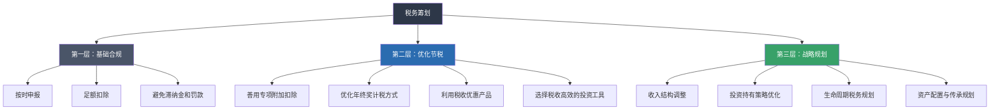
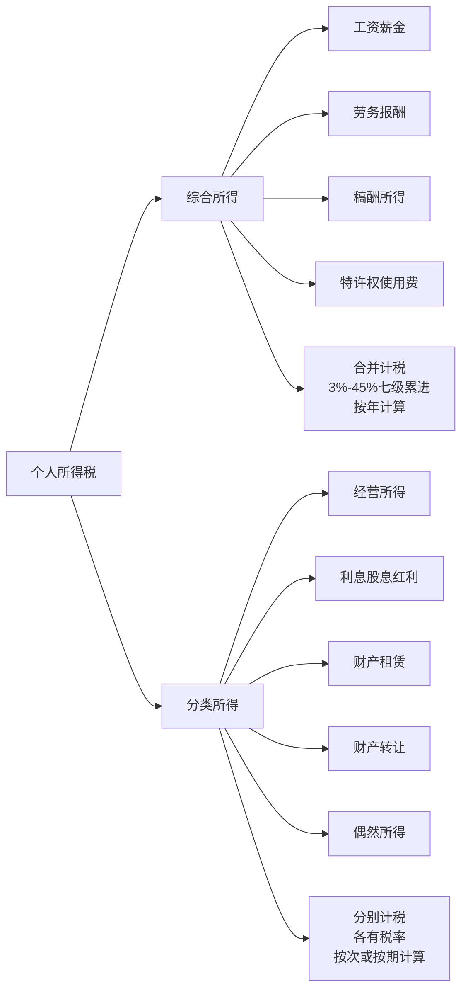
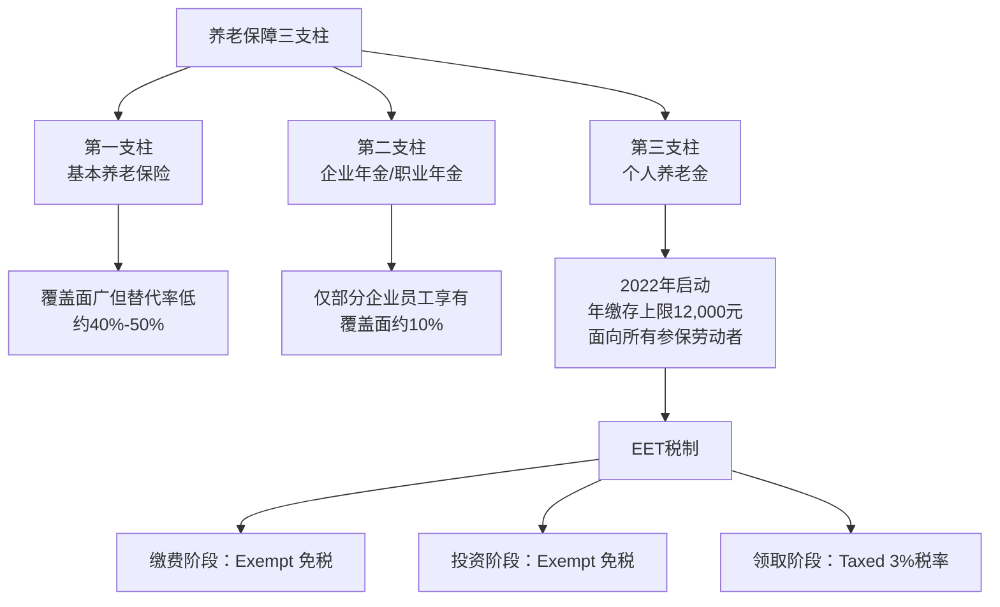
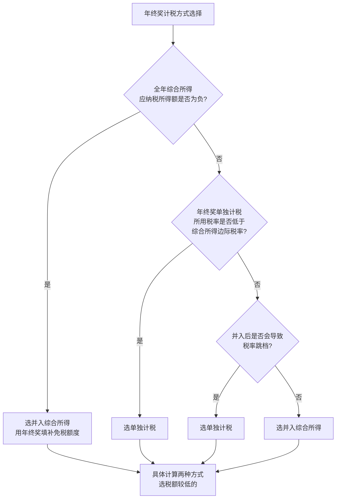
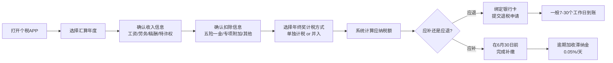
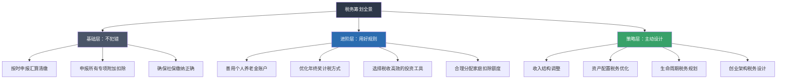

## 五、税务筹划：合法节税的艺术

> "税收是我们为文明社会付出的代价。"——奥利弗·温德尔·霍姆斯

> "在这个世界上，除了死亡和税收，没有什么是确定的。"——本杰明·富兰克林

税务筹划是财务管理中被严重低估的一环。大多数人只在每年3月到6月汇算清缴时才关注自己的税，而真正懂税务的人，会在每一次收入确认、每一笔投资决策、每一个生活安排中，都把税务因素纳入考量。这不是偷税漏税，而是在法律框架内，充分利用规则赋予你的每一分权利。

### 5.1 为什么必须懂税务？

#### 5.1.1 一个真实的数字差距

假设两位同龄人，月薪都是3万，工作30年。一个人从不做税务优化，另一位充分利用所有合法节税工具。我们来做一个详细的测算：

| 项目 | 不做优化 | 充分优化 | 30年累计差距 |
|------|---------|---------|------------|
| 专项附加扣除 | 未申报或部分申报 | 全部足额申报 | 约15-30万元 |
| 年终奖计税 | 默认单独计税 | 每年选择最优方式 | 约3-8万元 |
| 个人养老金 | 未开通 | 每年满额缴存 | 约6-15万元 |
| 投资税务效率 | 随意交易 | 税收高效配置 | 约5-20万元 |
| **合计** | | | **约30-70万元** |

这不是理论推演，而是税法条款的数学必然。一个边际税率20%的人，仅专项附加扣除一项（子女教育2,000+赡养老人3,000+房贷利息1,000=6,000元/月），年节税就是6,000×12×20% = 14,400元。30年就是43.2万元——这还没算复利效应。

#### 5.1.2 税务筹划的三层含义

第一层是"不犯错"——很多人连按时申报都没做到，白白损失了退税。据统计，每年约有数百万人忘记或错过汇算清缴，导致多缴的税款无法退回。第二层是"用好规则"——充分利用税法给你提供的各项扣除和优惠，这是大多数人的主要节税空间。第三层是"主动设计"——根据自己的收入结构和生活规划，提前做出最优的税务安排，这需要对税法有系统性的理解。

#### 5.1.3 税务筹划与逃税的本质区别

| 维度 | 税务筹划 | 逃税 | 避税（灰色地带） |
|------|---------|------|----------------|
| 合法性 | 完全合法 | 违法犯罪 | 合法但可能被税务机关调整 |
| 时间点 | 事前规划 | 事后隐瞒 | 事前安排 |
| 手段 | 利用优惠政策、合理安排 | 隐匿收入/虚报支出 | 利用税法漏洞或模糊地带 |
| 风险 | 无法律风险 | 刑事责任，最高无期徒刑 | 补税+滞纳金+特别纳税调整 |
| 典型案例 | 申报专项附加扣除、合理选择投资工具 | 隐瞒工资外收入、虚开发票 | 利用关联交易转移利润、阴阳合同 |
| 罚则 | 无 | 偷税额1-5倍罚款，严重的判刑 | 特别纳税调整+加收利息（基准利率+5个百分点） |
| 社会评价 | 理性纳税人的正当权利 | 严重损害国家利益 | 钻法律空子，道德存疑 |

**关键界限**：税务筹划的核心是"合理商业目的"。你做的每一个税务安排，都应该有合理的非税务理由（比如投资养老、教育子女、改善住房），税务优惠只是附带收益。如果某项安排的唯一目的就是少缴税，没有其他合理商业目的，就可能被税务机关认定为避税行为。

### 5.2 个人所得税基础：你的钱是怎么被"切"走的

#### 5.2.1 税法框架概览

中国个人所得税采用综合与分类相结合的税制，这是2018年个税改革后的重大变化。理解这个框架是所有税务筹划的前提：

**综合所得**（工资、劳务、稿酬、特许权使用费）合并在一起，按年度计算，适用3%到45%的七级超额累进税率。**分类所得**则各有各的税率和计算方式——经营所得5%-35%五级累进，利息股息红利20%，财产转让20%（有诸多优惠），偶然所得20%。

这个区分很重要——它决定了你在不同收入来源上的税务策略完全不同。综合所得可以通过扣除项降低税基，分类所得则各有各的优惠规则。

#### 5.2.2 综合所得税率表（详解）

| 级数 | 全年应纳税所得额 | 税率 | 速算扣除数 | 边际税负分析 |
|------|----------------|------|-----------|-------------|
| 1 | 不超过36,000元 | 3% | 0 | 年收入≤96,000元时适用（扣除6万起征点后） |
| 2 | 36,000-144,000元 | 10% | 2,520 | 年收入96,000-204,000元区间 |
| 3 | 144,000-300,000元 | 20% | 16,920 | 年收入204,000-360,000元区间 |
| 4 | 300,000-420,000元 | 25% | 31,920 | 年收入360,000-480,000元区间 |
| 5 | 420,000-660,000元 | 30% | 52,920 | 年收入480,000-720,000元区间 |
| 6 | 660,000-960,000元 | 35% | 85,920 | 年收入720,000-1,020,000元区间 |
| 7 | 超过960,000元 | 45% | 181,920 | 年收入超过1,020,000元 |

**计算公式**：

应纳税所得额 = 年收入总额 - 60,000元（基本减除费用）- 专项扣除 - 专项附加扣除 - 其他依法确定的扣除
应纳税额 = 应纳税所得额 × 适用税率 - 速算扣除数

**速算扣除数的原理**：累进税率下，本应分段计算。速算扣除数是数学简化——直接用全额乘以最高适用税率，再减去扣除数，等同于分段计算的结果。

推导过程：以144,000元应纳税所得额为例。
- 分段计算：36,000×3% + (144,000-36,000)×10% = 1,080 + 10,800 = 11,880元
- 速算计算：144,000×10% - 2,520 = 14,400 - 2,520 = 11,880元
- 结果一致。速算扣除数2,520正是"分段计算比全额计算多算的部分"的修正值。

#### 5.2.3 计算实例：逐月详解

以月薪20,000元、五险一金个人缴纳4,000元为例，无专项附加扣除，演示全年纳税过程：

| 月份 | 累计收入 | 累计基本减除 | 累计五险一金 | 累计应纳税所得额 | 适用税率 | 当月预扣税额 | 累计已缴税额 |
|------|---------|-------------|-------------|----------------|---------|-------------|-------------|
| 1月 | 20,000 | 5,000 | 4,000 | 11,000 | 3% | 330 | 330 |
| 2月 | 40,000 | 10,000 | 8,000 | 22,000 | 3% | 330 | 660 |
| 3月 | 60,000 | 15,000 | 12,000 | 33,000 | 3% | 330 | 990 |
| 4月 | 80,000 | 20,000 | 16,000 | 44,000 | 10% | 1,430 | 2,420 |
| 5月 | 100,000 | 25,000 | 20,000 | 55,000 | 10% | 1,100 | 3,520 |
| 6月 | 120,000 | 30,000 | 24,000 | 66,000 | 10% | 1,100 | 4,620 |
| 7月 | 140,000 | 35,000 | 28,000 | 77,000 | 10% | 1,100 | 5,720 |
| 8月 | 160,000 | 40,000 | 32,000 | 88,000 | 10% | 1,100 | 6,820 |
| 9月 | 180,000 | 45,000 | 36,000 | 99,000 | 10% | 1,100 | 7,920 |
| 10月 | 200,000 | 50,000 | 40,000 | 110,000 | 10% | 1,100 | 9,020 |
| 11月 | 220,000 | 55,000 | 44,000 | 121,000 | 10% | 1,100 | 10,120 |
| 12月 | 240,000 | 60,000 | 48,000 | 132,000 | 10% | 1,100 | 11,220 |

**全年应纳税额** = 132,000×10% - 2,520 = 10,680元。但累计预扣了11,220元，说明如果此人有专项附加扣除未申报，汇算清缴时可以退税540元。

这种"累计预扣法"导致一个常见现象：年初几个月扣税少，越到年底扣税越多。这不是公司多扣了你的税，而是累计收入跨入了更高的税率档位。4月份累计应纳税所得额从33,000跳到44,000，跨过了36,000的门槛，税率从3%升到10%，所以4月当月的预扣税额明显增加。

### 5.3 专项附加扣除：最易被忽视的"合法捡钱"

专项附加扣除是2019年个税改革引入的最重大福利。据国家税务总局数据，超过七成纳税人未充分享受所有可申报的专项附加扣除，每年因此多缴税数百到数千元不等。

#### 5.3.1 完整扣除清单（含实操要点）

| 扣除项目 | 扣除标准 | 扣除主体 | 时间范围 | 扣除方式 | 关键实操要点 |
|---------|---------|---------|---------|---------|-------------|
| 子女教育 | 每个子女每月2,000元 | 父母各50%或一方100% | 满3岁至博士毕业 | 定额扣除 | 子女在境外上学也适用；学前教育和学历教育分开计算，可同时享受 |
| 继续教育 | 学历教育每月400元 | 本人 | 最长48个月 | 定额扣除 | 只能扣学历继续教育（自考、成考、网教等），短期培训不算 |
| 继续教育 | 职业资格当年3,600元 | 本人 | 取得证书当年 | 定额扣除 | 证书必须在《国家职业资格目录》内，包括CPA、法考、一建等 |
| 大病医疗 | 超15,000部分最高80,000元 | 本人或配偶 | 医保范围内自付部分 | 据实扣除 | 需在年度汇算时扣除，平时预扣不扣；保留好医疗票据 |
| 住房贷款利息 | 每月1,000元 | 首套房贷借款人 | 最长240个月（20年） | 定额扣除 | 只能享受一次；夫妻可约定由谁扣；首套认定以"认房又认贷"为准 |
| 住房租金 | 800/1,100/1,500元 | 无自有住房的承租人 | 租赁期间 | 定额扣除 | 与房贷利息不可同时享受；按城市级别分三档 |
| 赡养老人 | 每月3,000元 | 子女 | 被赡养人年满60岁起 | 定额扣除 | 独生子女全额扣；非独生分摊，每人不超过1,500元 |
| 3岁以下婴幼儿照护 | 每个婴幼儿每月2,000元 | 父母各50%或一方100% | 出生当月至满3岁前一个月 | 定额扣除 | 2023年起从1,000元提高到2,000元 |

**重要更新（2023年起实施）**：子女教育、3岁以下婴幼儿照护、赡养老人三项标准均大幅提高——子女教育和婴幼儿照护从1,000元/月提高到2,000元/月，赡养老人从2,000元/月提高到3,000元/月。如果你还在按老标准申报，一定要及时更新，每年多省几千元。

#### 5.3.2 容易忽略的扣除细节

**住房租金扣除的三档标准**：
- 第一档（1,500元/月）：直辖市、省会（首府）城市、计划单列市以及国务院确定的其他城市。包括北京、上海、广州、深圳、天津、重庆、各省会城市、大连、青岛、宁波、厦门、成都、武汉等
- 第二档（1,100元/月）：除第一档外，市辖区户籍人口超过100万的城市。包括大多数地级市
- 第三档（800元/月）：市辖区户籍人口不超过100万的城市

**选择建议**：如果你在大城市租房，务必确认自己申报的是正确档位。很多人不知道自己所在城市属于哪一档，导致少扣了钱。

**赡养老人的分摊技巧**：非独生子女家庭，兄弟姐妹之间可以协商分摊比例。策略是把更多的扣除额度给边际税率最高的那个人。

举例：三兄弟，大哥月薪40,000元（边际税率25%），二哥月薪15,000元（边际税率10%），三弟月薪8,000元（边际税率3%）。
- 平均分摊：每人1,000元/月。总节税 = 1,000×12×(25%+10%+3%) = 4,560元
- 全部给大哥（上限1,500元，其余给二哥）：大哥1,500+二哥1,500。总节税 = 1,500×12×(25%+10%) = 6,300元
- 差距：1,740元/年。注意每人不能超过1,500元，所以不能全部给一个人。

**大病医疗的特殊规则**：只能在次年3月至6月汇算清缴时扣除，平时预扣预缴时不扣。所以很多人不知道自己可以申请。医保目录范围内的个人自付部分，超过15,000元就可以扣除，上限80,000元。这笔钱可以由本人或配偶扣除，未成年子女的医疗费用由父母扣除。

实操提示：在"国家医保服务平台"APP上可以查询全年的医疗费用明细，导出自付金额，非常方便。

**继续教育扣除的时间窗口**：
- 学历继续教育：入学当月开始扣除，最长48个月。如果中途休学，休学期间不扣除。
- 职业资格：只能在取得证书的当年扣除3,600元，不能跨年。所以如果12月底才考过，赶紧去申请证书。

#### 5.3.3 扣除组合优化案例

**案例一：双职工家庭最大扣除方案**

小王（月薪25,000）和小李（月薪15,000），育有一子（5岁），有首套房贷，双方父母均满60岁，小王是独生子女，小李有一兄弟。

| 扣除项 | 分配方案 | 月扣除额 | 年节税效果 |
|--------|---------|---------|-----------|
| 子女教育 | 小王申报100% | 2,000元 | 王：4,800元（边际税率20%） |
| 住房贷款利息 | 小王申报 | 1,000元 | 王：2,400元 |
| 赡养老人（小王方） | 小王独生子女全扣 | 3,000元 | 王：7,200元 |
| 赡养老人（小李方） | 小李兄弟各50% | 1,500元 | 李：1,800元（边际税率10%） |
| **合计** | | **7,500元** | **年节省16,200元** |

如果错误分配——比如子女教育给收入低的小李申报（节税2,000×12×10%=2,400元），而小王的高边际税率优势就浪费了（损失2,000×12×20%-2,400=2,400元）。

**案例二：租房 vs 房贷利息的选择**

小张在某二线城市工作，名下有一套外地房产（有贷款），在工作地租房居住。这种情况下，房贷利息和租金不能同时扣除。需要计算哪个更划算：
- 房贷利息：每月1,000元 = 年12,000元
- 二线城市租金（市辖区人口>100万）：每月1,100元 = 年13,200元
- 选择租金扣除，每年多扣除1,200元

如果小张边际税率20%，选择租金扣除每年多省240元。虽然金额不大，但这是白捡的钱。

**案例三：多子女家庭的叠加效应**

小赵夫妇有两个孩子（一个5岁、一个1岁），有首套房贷，双方父母均满60岁，小赵是独生子女。

| 扣除项 | 月扣除额 | 年扣除额 |
|--------|---------|---------|
| 子女教育（大宝） | 2,000 | 24,000 |
| 婴幼儿照护（二宝） | 2,000 | 24,000 |
| 住房贷款利息 | 1,000 | 12,000 |
| 赡养老人 | 3,000 | 36,000 |
| **合计** | **8,000** | **96,000** |

如果小赵月薪30,000元（边际税率20%），仅专项附加扣除年节税 = 96,000×20% = 19,200元。加上基本减除60,000元和五险一金约60,000元，总共扣除216,000元，应纳税所得额仅144,000元，落在10%税率区间。

### 5.4 个人养老金账户：被低估的税收利器

#### 5.4.1 制度设计与税收优惠

2022年11月起，中国正式实施个人养老金制度。这是"三支柱"养老保障体系的重要组成部分：

EET税制（Exempt-Exempt-Taxed）意味着：缴存时从应纳税所得额中扣除，投资收益暂不征税，领取时按3%的税率单独计税。这个设计的核心价值在于：如果你当前的边际税率高于3%，就能获得"税率差"带来的节税收益。

**2024年重大更新**：个人养老金制度从36个试点城市扩展到全国，所有参加城镇职工基本养老保险或城乡居民基本养老保险的劳动者均可参加。年缴存上限维持12,000元。

#### 5.4.2 不同收入水平的节税效果

| 月收入区间 | 边际税率 | 年缴存12,000元节税 | 领取时缴税（3%） | 净节税额 | 节税比例 | 30年累计净节税 |
|-----------|---------|-------------------|----------------|---------|---------|--------------|
| 5,000-8,000元 | 3% | 省360元 | 缴360元 | 0元 | 0% | 0元 |
| 8,000-17,000元 | 10% | 省1,200元 | 缴360元 | 840元 | 7% | 25,200元 |
| 17,000-30,000元 | 20% | 省2,400元 | 缴360元 | 2,040元 | 17% | 61,200元 |
| 30,000-40,000元 | 25% | 省3,000元 | 缴360元 | 2,640元 | 22% | 79,200元 |
| 40,000-60,000元 | 30% | 省3,600元 | 缴360元 | 3,240元 | 27% | 97,200元 |
| 60,000-85,000元 | 35% | 省4,200元 | 缴360元 | 3,840元 | 32% | 115,200元 |
| 85,000元以上 | 45% | 省5,400元 | 缴360元 | 5,040元 | 42% | 151,200元 |

**关键结论**：边际税率在10%及以上的人群，都应该认真考虑开通个人养老金账户。以30年工作生涯计算，一个边际税率20%的人，仅节税收益就累计达到6万多元（不含投资收益）。如果把每年省下的2,040元也拿去投资（假设年化5%），30年后这笔钱本身也增值到约13.5万元。

#### 5.4.3 个人养老金的可投资范围与选择策略

个人养老金账户内的资金可以投资四大类产品：

| 产品类型 | 风险等级 | 预期收益 | 适合人群 | 代表产品特征 |
|---------|---------|---------|---------|------------|
| 储蓄存款 | 极低 | 2%-3% | 保守型、临近退休 | 特定养老储蓄，利率略高于普通定存 |
| 理理财产品 | 低-中 | 3%-5% | 稳健型 | 养老理财产品，以固收+策略为主 |
| 公募基金 | 中-高 | 5%-10%（长期） | 成长型、年轻投资者 | 养老目标基金（FOF），目标日期/目标风险 |
| 商业养老保险 | 低 | 3%-4% | 保障型 | 专属商业养老保险，含身故/全残保障 |

**选择策略**：
- **30岁以下**：建议80%配置养老目标基金（目标日期2055或2060），利用30年的复利效应。A股长期年化收益约8%-10%，公募基金在长期维度上大概率跑赢其他品类
- **30-45岁**：建议60%基金+30%理财+10%储蓄，平衡收益与风险
- **45岁以上**：建议30%基金+40%理财+30%储蓄或保险，逐步降低风险
- **临近退休**：建议80%储蓄+20%保险，确保本金安全

**重要提醒**：个人养老金账户每年可以调整投资组合，但资金一旦缴存就不能取出（除丧失劳动能力、出国定居等特殊情况）。所以要根据自己的年龄和风险承受能力谨慎选择。

#### 5.4.4 开通与缴存实操

1. **选择开户银行**：目前23家银行可开立个人养老金资金账户（包括工农中建交、招商、兴业等主流银行）。选择标准：基金产品丰富度、APP操作便利性、是否有开户奖励
2. **开户流程**：通过银行APP即可在线开户，需要身份证和银行卡，一般5分钟内完成
3. **缴存时间**：每年12月31日前缴存，才能在当年汇算清缴时扣除。建议不要拖到最后一天，提前一周完成
4. **缴存方式**：可以一次性缴满12,000元，也可以分次缴存。建议年初一次性缴满，让资金尽早享受投资收益
5. **注意事项**：一旦缴存，原则上要到退休时才能领取（男性60岁、女性55岁/50岁，具体以法定退休年龄为准）。丧失劳动能力、出国定居、完全丧失劳动能力等特殊情况可提前领取

**节税效果最大化技巧**：如果你的年收入在税率临界点附近（比如年应纳税所得额刚好超过36,000元，跨入10%税率），缴存12,000元可能把你拉回3%税率区间，节税效果会放大。具体来说，如果36,000×3%=1,080元本应缴税，但缴存后变为(36,000-12,000)×3%=720元，省了360元；但如果你的应纳税所得额是48,000元，缴存后变为36,000元，税从48,000×10%-2,520=2,280元降为36,000×3%=1,080元，省了1,200元——效果远超简单计算的12,000×10%=1,200元，因为还享受了税率跳档的额外收益。

### 5.5 投资收益的税务全景图

#### 5.5.1 各类投资的税务处理对比

| 投资类型 | 税种/税率 | 优惠政策 | 税务优化策略 | 政策稳定性 |
|---------|----------|---------|-------------|-----------|
| 银行存款利息 | 免税 | 2008年起全面免征 | 无需特别优化 | 极高 |
| 国债利息 | 免税 | 国家信用担保+免税 | 大额资金配置首选，尤其在利率下行期 | 极高 |
| 地方债利息 | 免税 | 同国债 | 与国债组合配置 | 极高 |
| A股转让差价 | 暂免 | 个人投资者暂免资本利得税 | 长期持有降低交易成本（佣金+印花税） | 中等，政策可调整 |
| A股分红（持股>1年） | 免税 | 长期持有激励 | 坚持持有超过1年 | 高 |
| A股分红（1月-1年） | 10% | 差异化税率 | 尽量跨过1年门槛 | 高 |
| A股分红（<1月） | 20% | 最高税率 | 避免短期频繁交易 | 高 |
| 公募基金分红 | 免税 | 个人投资者暂免 | 优先选择分红型基金 | 高 |
| 公募基金转让差价 | 暂免 | 个人投资者暂免 | 基金比个股有税收优势 | 高 |
| 住房转让 | 20%或1-2% | 满五唯一免个税 | 规划持有时间，确保满五年 | 高 |
| 个人出租住房 | 10%综合税率 | 减按10%征收 | 实际税负远低于名义税率 | 高 |
| 企业债券利息 | 20% | 无优惠 | 考虑免税替代品（国债、地方债） | 高 |
| 新三板转让差价 | 暂免 | 与A股类似 | 注意挂牌公司质量 | 中等 |
| 银行理财收益 | 视产品类型 | 部分暂免 | 关注产品税务说明 | 中等 |

#### 5.5.2 股票投资的税务策略详解

**分红持有期的"临界点"问题**

A股分红的差异化税率设计，创造了一个明显的"税收悬崖"：

持股期 < 1个月：分红税率 20%
持股期 1个月-1年：分红税率 10%
持股期 > 1年：分红税率 0%

对于高分红股票，这个差异是实质性的。假设你持有某银行股10,000股，年分红0.30元/股，分红总额3,000元：
- 持股不足1个月：缴税600元，实际到手2,400元
- 持股1-12个月：缴税300元，实际到手2,700元
- 持股超过1年：缴税0元，实际到手3,000元

如果你的股票组合年分红总额是30,000元，持股超过1年比持股不足1个月多拿6,000元——这相当于一个不错的理财产品收益。

**持股期的计算规则**：先进先出法（FIFO）。如果你分批买入同一只股票，卖出时按最早买入的时间计算持股期。这意味着做T（日内交易）会"打断"你的持股期，让你永远享受不到免税待遇。

**具体计算示例**：
- 1月买入A股票1,000股
- 3月再买入A股票500股
- 6月卖出800股
- 按FIFO规则，卖出的800股全部来自1月的买入，持股期已达5个月，适用10%税率
- 如果1月只买了600股，则卖出的800股中600股来自1月（持股5个月，10%），200股来自3月（持股3个月，10%），税率相同但持股期不同

**税务亏损收割（Tax-Loss Harvesting）**：虽然A股资本利得暂免征税，但这个概念在海外投资中非常重要。核心思路是：在亏损时卖出，实现账面亏损用于抵消其他收益，然后立即买回（注意洗售规则）。A股虽然暂免资本利得税，但如果你有海外投资（港股通、美股等），这个策略就很有价值了。

#### 5.5.3 基金投资的税收优势

基金在税收上有一个隐藏的优势：基金在买卖股票时产生的资本利得，个人投资者不需要缴纳个人所得税。也就是说，通过基金间接投资股票，你获得了一个"税收递延"的效果。

对比：
- **自己买股票**：赚了1万元差价，暂免征税（但政策可能调整）
- **通过基金**：基金帮你赚了1万元，分红免税，卖出差价暂免
- **基金的核心优势**：即使未来恢复征收个人资本利得税，基金的交易在基金层面完成，个人投资者只有在赎回时才确认收益，相当于天然的税收递延

基金的优势在于政策稳定性更高——鼓励机构投资者和长期投资是明确的政策导向，短期内取消基金税收优惠的可能性很低。

**ETF的额外税收优势**：
- 场内交易免印花税（股票卖出要收0.05%印花税）
- 管理费低于主动基金
- 分红免税
- 综合税负最低的股票投资方式之一

#### 5.5.4 房产交易的税务要点

**"满五唯一"免个税规则**：个人转让自用5年以上、并且是家庭唯一生活用房取得的所得，免征个人所得税。这里的"5年"从取得房产证（或契税完税证明）之日起算。"家庭"指夫妻双方及未成年子女。

**房产交易中的主要税种**：

| 税种 | 税率 | 计算方式 | 优化要点 | 说明 |
|------|------|---------|---------|------|
| 增值税 | 5%（满2年免征） | 差额或全额 | 满2年后再交易 | 不满2年按全额/(1+5%)×5% |
| 个人所得税 | 20%或1% | 差额的20%或全额的1% | 满五唯一免征 | 无法提供原值凭证的按全额1% |
| 契税 | 1%-3% | 面积和套数相关 | 首套房90㎡以下仅1% | 买方承担 |
| 印花税 | 0.05% | 合同金额 | 2023年起优惠税率 | 买卖双方各付 |
| 土地增值税 | 免征 | 个人住宅转让免征 | 无需关注 | 仅对企业征收 |

**实际案例**：一套买入价150万、卖出价250万的房产，增值100万。
- 不满两年：增值税 = 250万/(1+5%)×5% ≈ 11.9万；个税 = 100万×20% = 20万；合计约31.9万
- 满两年不满五年：增值税免；个税 = 100万×20% = 20万（或250万×1% = 2.5万，取低者2.5万）；合计约2.5万
- 满五唯一：增值税免；个税免。省下超过30万的税款

**多套房产的出售顺序优化**：如果你有多套房产要出售，应该先卖非唯一的（正常缴税），确保最后一套满足"满五唯一"条件后出售。如果同时卖两套，任何一套都无法享受"唯一"优惠。

**房产赠与 vs 买卖的税务对比**：

| 方式 | 增值税 | 个人所得税 | 契税 | 印花税 | 适用场景 |
|------|--------|-----------|------|--------|---------|
| 买卖 | 满2年免 | 满五唯一免 | 1%-3% | 0.05% | 有合理对价，最常用 |
| 赠与（直系亲属） | 免 | 免 | 3% | 0.05% | 直系亲属间无偿转让 |
| 赠与（非直系） | 免 | 20% | 3% | 0.05% | 成本高，一般不推荐 |
| 继承 | 免 | 免 | 3% | 0.05% | 产权人去世后，成本最低 |

注意：赠与取得的房产，未来再出售时，原值按赠与人取得时的成本计算。如果赠与人取得成本很低，受赠人未来出售可能面临高额个税。所以"赠与省税"是一个常见误区——需要综合考虑未来再出售的税务成本。

### 5.6 年终奖的税务优化：一个"临界点陷阱"

#### 5.6.1 年终奖单独计税的税率表

年终奖可以单独按照以下月度税率表计税（将年终奖除以12个月，按商数确定适用税率）：

| 全年奖金÷12 | 适用税率 | 速算扣除数 |
|-------------|---------|-----------|
| 不超过3,000元 | 3% | 0 |
| 3,000-12,000元 | 10% | 210 |
| 12,000-25,000元 | 20% | 1,410 |
| 25,000-35,000元 | 25% | 2,660 |
| 35,000-55,000元 | 30% | 4,410 |
| 55,000-80,000元 | 35% | 7,160 |
| 超过80,000元 | 45% | 15,160 |

#### 5.6.2 年终奖的"税收陷阱"

年终奖存在一个臭名昭著的"临界点"问题。以下是最常见的几个坑：

| 年终奖金额 | 税后所得 | 多发1元后的税后所得 | 损失金额 |
|-----------|---------|-------------------|---------|
| 36,000元 | 34,920元 | 34,310.80元（36,001元） | 多发1元反而少拿609元 |
| 144,000元 | 137,400元 | 131,640.80元（144,001元） | 多发1元反而少拿5,759元 |
| 300,000元 | 283,200元 | 275,660.75元（300,001元） | 多发1元反而少拿7,539元 |
| 420,000元 | 397,920元 | 389,560.70元（420,001元） | 多发1元反而少拿8,359元 |
| 660,000元 | 603,000元 | 590,360.65元（660,001元） | 多发1元反而少拿12,639元 |
| 960,000元 | 853,200元 | 834,560.60元（960,001元） | 多发1元反而少拿18,639元 |

这些"断崖点"是：36,000、144,000、300,000、420,000、660,000、960,000。

**为什么会出现这种情况？** 因为年终奖除以12后确定税率，但税额是按全额计算的。当金额刚好跨过临界点时，全额适用了更高的税率，税额的跳增超过了金额的增加。

**建议**：跟HR或财务确认年终奖金额时，一定要自己算一遍税后所得。如果发现落在临界点附近，可以主动与公司协商调整发放金额——少发的部分可以并入月薪或通过其他方式补偿。

#### 5.6.3 单独计税 vs 并入综合所得：决策框架

**实操建议**：最稳妥的方式是两种方式各算一遍。在"个人所得税"APP上，汇算清缴时可以分别选择两种方式，系统会自动显示两种方式下的应纳税额，你选择金额较低的那个即可。

**注意**：单独计税政策目前延续到2027年底。之后是否会延续，需要关注政策变化。如果政策取消单独计税选项，年终奖将全部并入综合所得，届时需要重新评估发放策略。

#### 5.6.4 案例详解

**案例一：月薪25,000元，年终奖60,000元**

五险一金每月5,000元，有一个子女教育扣除2,000元/月，赡养老人3,000元/月。

**方式一：年终奖单独计税**
- 综合所得应纳税所得额 = 25,000×12 - 60,000 - 5,000×12 - 2,000×12 - 3,000×12 = 300,000 - 60,000 - 60,000 - 24,000 - 36,000 = 120,000元
- 综合所得应纳税额 = 120,000×10% - 2,520 = 9,480元
- 年终奖应纳税额 = 60,000×10% - 210 = 5,790元（60,000÷12=5,000，适用10%）
- **合计：15,270元**

**方式二：年终奖并入综合所得**
- 综合所得应纳税所得额 = 360,000 - 60,000 - 60,000 - 24,000 - 36,000 = 180,000元
- 应纳税额 = 180,000×20% - 16,920 = 19,080元
- **合计：19,080元**

**结论**：单独计税节省3,810元。原因：并入后180,000元跨越了20%税率档，而单独计税时年终奖和综合所得都落在10%税率区间。

**案例二：月薪8,000元，年终奖10,000元**

五险一金每月2,000元，有子女教育扣除2,000元/月。

**方式一：年终奖单独计税**
- 综合所得应纳税所得额 = 96,000 - 60,000 - 24,000 - 24,000 = -12,000元（负数，不缴税）
- 年终奖应纳税额 = 10,000×3% = 300元（10,000÷12=833，适用3%）
- **合计：300元**

**方式二：年终奖并入综合所得**
- 综合所得应纳税所得额 = 106,000 - 60,000 - 24,000 - 24,000 = -2,000元（负数，不缴税）
- **合计：0元**

**结论**：并入综合所得更优，省300元。因为综合所得有剩余的免税额度，年终奖刚好填补了这个额度。

### 5.7 劳务报酬和副业收入的税务处理

#### 5.7.1 劳务报酬的预扣预缴

自由职业、兼职、稿费等劳务报酬，在支付时会被预扣税款：

| 每次收入 | 预扣率 | 速算扣除数 |
|---------|--------|-----------|
| 不超过20,000元 | 20% | 0 |
| 20,000-50,000元 | 30% | 2,000 |
| 超过50,000元 | 40% | 7,000 |

**重要提醒**：劳务报酬的预扣率（20%-40%）通常远高于综合所得的实际税率（3%-45%累进）。这意味着如果你的主要收入是劳务报酬，汇算清缴时大概率会获得退税。

**计算示例**：某设计师全年劳务报酬收入30万元
- 预扣预缴税款：约68,000元（每次按20%-40%预扣）
- 汇算清缴应纳税所得额：300,000×(1-20%) - 60,000 - 专项扣除 = 240,000 - 60,000 - 五险一金 ≈ 180,000元
- 应纳税额：180,000×20% - 16,920 = 19,080元
- **可退税约48,920元**

注意：劳务报酬在汇算时按收入的80%计入综合所得（即扣除20%的费用），这个扣除比例对高收入者非常有利。

这个数字足以让每个自由职业者重视每年的汇算清缴。很多自由职业者不知道可以退税，白白损失了几万元。

#### 5.7.2 稿酬所得的特殊优惠

稿酬所得在计算应纳税所得额时，先打七折（减按70%计算），再并入综合所得。同时还能扣除20%的费用。也就是说，你赚了10,000元稿费，计税基数是10,000×80%×70% = 5,600元。这个优惠叠加综合所得的各项扣除，对有正式工作又兼职写作的人非常有利。

**计算示例**：某上班族月薪20,000元，全年稿费收入60,000元
- 稿酬计入综合所得 = 60,000×80%×70% = 33,600元
- 稿酬的预扣预缴 = 60,000×80%×70%×20% - 0 = 6,720元（按次预扣）
- 汇算时如果综合所得总税率低于预扣率，可以退回差额

#### 5.7.3 经营所得的税务优势

如果你有持续的副业收入，可以考虑注册个体工商户或个人独资企业，将收入转化为"经营所得"，享受5%-35%的五级累进税率：

| 全年应纳税所得额 | 税率 | 速算扣除数 |
|----------------|------|-----------|
| 不超过30,000元 | 5% | 0 |
| 30,000-90,000元 | 10% | 1,500 |
| 90,000-300,000元 | 20% | 10,500 |
| 300,000-500,000元 | 30% | 40,500 |
| 超过500,000元 | 35% | 65,500 |

**经营所得的优势**：
1. 可以扣除实际经营成本（设备、材料、交通、通讯等）
2. 部分地区对小规模纳税人有核定征收政策，实际税负可能很低
3. 可以享受小规模纳税人增值税优惠（月销售额10万元以下免征）

**适用场景**：年副业收入超过10万元、有明确的成本支出、业务持续稳定的情况。如果只是偶尔的零星收入，注册企业的成本（记账、报税、年检）可能得不偿失。

### 5.8 年度汇算清缴：必须掌握的实操技能

#### 5.8.1 汇算清缴的时间与流程

每年3月1日至6月30日，需要对上一年度的综合所得进行汇算清缴。具体流程：

**3月1日-3月20日需要预约**：这段时间需要在APP上预约办理时间，3月21日后无需预约可直接办理。建议错峰办理，3月初预约，中旬办理。

#### 5.8.2 汇算清缴的常见场景

**场景一：只有工资收入，扣除项目齐全**
通常不需要补税，可能有小额退税。直接在APP上确认即可。这类人群占汇算清缴的大多数。

**场景二：有多处收入**
两份工资或工资+劳务报酬，很可能需要补税。预扣预缴时各自独立计算（都享受了基本减除费用），合并后可能跳档，且基本减除费用只能扣一次。

**场景三：年中换过工作**
新公司从零开始累计预扣，导致前期预扣不足（因为累计收入从零开始，前期税率低），汇算时需要补税。这是最常见的"补税"场景。解决方案：换工作时告知新公司自己的累计收入情况。

**场景四：有劳务报酬且未申报扣除**
汇算清缴时把专项附加扣除补上，大概率获得大额退税。自由职业者尤其要注意这一点。

**场景五：有境外收入**
需要在汇算清缴时申报境外所得，并填写境外已缴税款的抵免信息。需要准备好境外的完税证明。

#### 5.8.3 退税到账时间

一般提交申请后7-30个工作日到账。经验规律：
- 3月初提交：通常3月中旬到账（初期待审核积压）
- 3月中下旬：3月底-4月初到账
- 4月以后：一般1-2周到账
- 退税金额超过一定数额：可能需要人工审核，时间更长

#### 5.8.4 更正申报与补救

如果发现汇算清缴申报有误，可以在APP上进行"更正申报"：
- 更正次数不限
- 更正期限：汇算清缴期结束后3年内
- 多缴的可以申请退税，少缴的需要补税加滞纳金
- 超过3年的一般不能再更正

### 5.9 不同收入水平的税务筹划策略

#### 5.9.1 月薪8,000以下（边际税率3%或免税）

- 确保申报所有专项附加扣除，可能直接降到免税线以下
- 个人养老金节税效果为零（边际税率=领取税率），不必考虑
- 重点关注：确保公司足额缴纳社保（社保基数影响未来养老金和医保待遇）
- 如果有子女教育、房贷利息等扣除，年收入低于96,000元的人大概率免税

#### 5.9.2 月薪8,000-25,000（边际税率10%-20%）

- 专项附加扣除是核心节税工具
- 个人养老金每年可节税840-2,040元
- 年终奖计税方式选择影响显著
- 开始关注投资的税务效率（优先选择基金而非个股）
- 如果有副业收入，务必参加汇算清缴，大概率有退税

#### 5.9.3 月薪25,000-60,000（边际税率20%-30%）

- 每一项扣除都价值不菲，不可遗漏
- 个人养老金每年可节税2,040-3,240元
- 年终奖临界点问题必须关注
- 投资选择要考虑税收因素（基金优于个股，长期持有优于短线）
- 考虑是否适合签订劳动合同还是劳务合同（劳务报酬有20%费用扣除）
- 公益捐赠扣除开始有实际价值

#### 5.9.4 月薪60,000以上（边际税率30%-45%）

- 税务筹划的边际收益最高，每一分优化都有实质回报
- 每项合法扣除都不可错过
- 个人养老金每年可节税3,840-5,040元
- 考虑收入结构调整的可能性（股权激励、经营所得转化）
- 公益捐赠（扣除上限30%应纳税所得额）成为重要的节税工具
- 建议咨询专业税务师进行个性化筹划
- 关注税收协定（如果有境外收入）

### 5.10 税务筹划的常见误区

#### 误区一："我的工资不高，不需要税务筹划"

事实：月薪8,000元的人，如果有一个子女教育扣除（2,000元/月），全年节税可达2,400元。这比很多理财产品的年收益都高，而且是"无风险收益"。税务筹划不是高收入人群的专属——越是收入不高，每一分钱的节省越重要。

#### 误区二："申报专项附加扣除很麻烦"

事实：在个税APP上，大部分扣除项目只需填写基本信息并上传少量凭证，10分钟内即可完成。每年更新一次即可。对比每年可能省下的数千元，这10分钟的"时薪"高达数万元。这是你做过的性价比最高的事情之一。

#### 误区三："个人养老金锁定期太长，不划算"

事实：个人养老金的锁定期确实长，但它的税收优惠是即时兑现的。对边际税率20%的人，每年净省2,040元。这笔钱即使放在货币基金里，30年后复利效果也很可观（约8万元）。更何况账户内的资金本身也在投资增值。

#### 误区四："年终奖计税方式不用我操心，公司会帮我选"

事实：很多公司默认选择单独计税，但这不一定是对你最有利的方式。汇算清缴时你有权自行选择，系统会分别显示两种方式的税额。每年花2分钟比较一下，可能省下几千元。

#### 误区五："换工作时社保断缴无所谓"

事实：社保断缴不仅影响医保报销（断缴次月起不能报销）、购房资格（部分城市要求连续缴纳），还会影响个人所得税的专项扣除基数。换工作时务必确认社保衔接，最好在新公司入职当月就缴纳。

#### 误区六："退税要趁早申请，过期就没有了"

事实：汇算清缴期（3月1日至6月30日）内随时可以申请退税，不存在"过期作废"。但如果需要补税且超过6月30日，会被加收滞纳金（每日万分之五）。更正申报在3年内都可以办理。不过建议还是尽早办理，早办早退。

#### 误区七："只有工资需要缴税，副业收入不用管"

事实：所有收入都需要依法纳税。劳务报酬、稿酬、经营所得都有相应的纳税义务。不申报不仅面临补税风险，还可能被处以罚款。好消息是，副业收入预扣率通常偏高，汇算时大概率有退税。

#### 误区八："夫妻双方扣除项目随便分配就行"

事实：扣除项目的分配直接影响整个家庭的总税负。核心原则是把扣除额度分配给边际税率更高的一方。错误的分配可能每年多缴数千元税款。

### 5.11 税务筹划的生命周期视角

不同人生阶段的税务筹划重点完全不同：

| 阶段 | 年龄段 | 税务重点 | 核心策略 | 预计年节税 |
|------|--------|---------|---------|-----------|
| 职场新人 | 22-28岁 | 确保基础扣除足额 | 申报继续教育扣除（学历/职业资格）；开始缴存个人养老金 | 1,000-3,000元 |
| 成家立业 | 28-35岁 | 专项附加扣除全面铺开 | 子女教育+婴幼儿照护+房贷利息+赡养老人组合申报 | 5,000-15,000元 |
| 事业发展期 | 35-45岁 | 收入结构优化 | 关注年终奖临界点、投资税收效率、副业收入税务处理 | 10,000-30,000元 |
| 财富积累期 | 45-55岁 | 资产配置的税务效率 | 个人养老金满额缴存、长期持有策略、房产规划 | 15,000-50,000元 |
| 退休规划期 | 55-60岁 | 领取阶段税务规划 | 养老金领取策略、房产传承规划、公益捐赠规划 | 视资产规模 |

**每个阶段的关键动作**：
- **22-28岁**：这个阶段收入不高，扣除项少，但要养成税务意识。重点是申报继续教育扣除（如果在读研或考证），开始缴存个人养老金。养成每年做汇算清缴的习惯。
- **28-35岁**：这是扣除项爆发的阶段——结婚、买房、生子、赡养老人，几乎每一项都能带来节税。确保所有扣除项都申报了，扣除额度分配给高收入方。
- **35-45岁**：收入进入快速增长期，边际税率跳升。年终奖临界点、投资税务效率成为关注重点。如果副业收入稳定，考虑是否注册个体工商户。
- **45-55岁**：资产规模较大，需要从整体资产配置的角度考虑税务效率。个人养老金满额缴存，投资以长期持有为主，房产交易要充分规划。
- **55-60岁**：开始规划退休后的税务安排。个人养老金的领取策略、房产传承方式（买卖vs赠与vs继承）都需要提前考虑。

### 5.12 税务风险与稽查应对

#### 5.12.1 常见的税务风险行为

以下行为虽然不一定违法，但容易引起税务机关的关注：

| 风险行为 | 风险等级 | 可能后果 | 建议 |
|---------|---------|---------|------|
| 大额现金交易 | 高 | 触发反洗钱监控 | 尽量使用银行转账 |
| 频繁大额转账 | 高 | 可能被要求说明资金来源 | 保留合法收入证明 |
| 多处收入不合并申报 | 高 | 补税+滞纳金+罚款 | 如实申报所有收入 |
| 虚假申报专项附加扣除 | 高 | 补税+0.5-5倍罚款 | 确保信息真实 |
| 买卖发票抵扣 | 极高 | 刑事责任 | 绝对不要碰 |
| 私户收款不报税 | 高 | 补税+罚款 | 所有收入都要申报 |

#### 5.12.2 金税四期的影响

金税四期系统已经上线，实现了"以数治税"。相比金税三期，主要变化：
- **银行信息联网**：个人银行账户的大额交易、频繁交易会被自动监控
- **多部门数据共享**：税务与银行、房管、社保、公安等部门数据打通
- **智能分析**：系统自动比对收入与申报数据，发现异常自动预警

**应对策略**：如实申报、保留凭证、合理筹划。金税四期的目标是打击偷逃税，不是打击合法的税务筹划。只要你所有的安排都有真实的业务基础和合法依据，不需要担心。

#### 5.12.3 被稽查时的应对

如果收到税务机关的询问或稽查通知：
1. **不要恐慌**：税务询问不等于被认定违法，很多时候只是信息核实
2. **积极配合**：按要求提供相关资料和说明
3. **保留证据**：所有收入凭证、扣除凭证、交易记录都要妥善保管
4. **必要时请专业人士**：如果涉及金额较大或情况复杂，建议咨询税务师或律师
5. **申诉权利**：对税务处理决定不服的，可以申请行政复议或提起行政诉讼

### 5.13 税务工具与资源

#### 5.13.1 必备工具

- **个人所得税APP**：国家税务总局官方APP，汇算清缴、扣除申报、完税证明均在此办理。功能齐全，操作简便，是每个纳税人必须安装的APP
- **国家税务总局网站**（www.chinatax.gov.cn）：政策查询、法规全文、办税指南
- **12366纳税服务热线**：税务问题咨询，工作时间拨打，可转接当地税务机关

#### 5.13.2 实用计算器

- 个税APP自带的"税款计算器"功能——最权威，实时更新
- 各大银行APP的个税计算模块
- 第三方个税计算器（注意以官方规则为准，可能存在更新不及时的问题）

#### 5.13.3 信息获取渠道

- 关注"国家税务总局"微信公众号，第一时间获取政策变化
- 每年年初关注专项附加扣除标准是否有调整
- 重大税改通常在年底或次年年初公布
- 关注当地税务局的官方通知，部分地区有地方性优惠政策

### 5.14 年度税务筹划检查清单

每年年初花30分钟做一次"税务体检"，确保没有遗漏任何优惠：

**年初检查（1-2月）**：
- [ ] 检查专项附加扣除信息是否需要更新（子女升学、老人年龄、租房/房贷变化等）
- [ ] 确认个人养老金账户是否已开通并足额缴存（上年12月31日前完成）
- [ ] 确认五险一金缴纳基数是否正确
- [ ] 年终奖金额是否落在"税收陷阱"附近，提前与HR沟通
- [ ] 投资持仓是否有需要关注持有期的标的

**汇算清缴期（3-6月）**：
- [ ] 在APP上预约办理时间（3月1日-20日需要预约）
- [ ] 确认所有收入信息完整（检查是否有遗漏的劳务报酬、稿酬等）
- [ ] 选择最优的年终奖计税方式（两种方式各算一遍）
- [ ] 确认所有扣除信息完整（专项附加扣除、大病医疗等）
- [ ] 有退税的及时申请，有补税的在6月30日前完成
- [ ] 保留好完税证明和退税记录

**年中持续关注**：
- [ ] 关注税法政策变化（新的扣除标准、优惠政策等）
- [ ] 换工作时确认社保衔接
- [ ] 重大生活变化时及时更新扣除信息（生子、买房、离婚等）

### 5.15 进阶：特殊情况的税务处理

#### 5.15.1 股权激励的税务处理

如果公司给予股票期权或限制性股票（RSU），税务处理较为复杂：

**股票期权**：
- 授予时：不征税
- 行权时：按"工资薪金所得"计税，收入 = 行权日市价 - 行权价。这笔收入并入当年综合所得，可能造成税率大幅跳升
- 卖出时：按"财产转让所得"计税（A股暂免）
- 策略：行权时机选择很重要。如果可以选择，尽量在收入较低的年份行权，或者分批行权避免单年收入过高

**限制性股票（RSU）**：
- 解禁时：按"工资薪金所得"计税，收入 = 解禁日市价 × 股数
- 卖出时：同上
- 策略：解禁日无法选择，但可以在解禁后选择合适的时机卖出。如果预计股价会下跌，可以考虑在解禁日卖出一部分立即变现

**计算示例**：RSU解禁1,000股，解禁日市价50美元/股，汇率7.0
- 收入 = 1,000×50×7.0 = 350,000元
- 如果此人月薪30,000元，加上这笔收入，当年综合所得跳入更高税率区间
- 假设边际税率从20%跳到25%，仅RSU部分的额外税负 = 350,000×(25%-20%) = 17,500元

#### 5.15.2 海外收入的税务义务

中国税务居民（在境内有住所或无住所但在一个纳税年度内居住满183天）需就全球所得纳税。已缴纳的境外税款可以按规定抵免，但需要提供完税凭证。

**关键规则**：
- 抵免限额 = 境外所得 × 中国税率（分国不分项）
- 超过限额的部分可以向后5年结转
- 需要提供境外税务机关的完税证明

**常见场景**：
- 港股通收益：A股暂免资本利得税，但港股通的股息需要缴税（H股20%，红筹股等有差异）
- 美股收益：资本利得需在中国缴税20%，已缴美国税款可抵免
- 海外工资：已在境外缴纳的个人所得税可抵免

#### 5.15.3 公益捐赠的税前扣除

个人通过公益性社会组织或政府部门的捐赠，不超过应纳税所得额30%的部分可以扣除。

**计算示例**：
- 年应纳税所得额200,000元，边际税率20%
- 捐赠60,000元（=200,000×30%，达到上限）
- 节税 = 60,000×20% = 12,000元
- 实际捐赠成本 = 60,000 - 12,000 = 48,000元

**注意事项**：
- 捐赠必须通过合规的公益性社会组织或政府部门，直接给个人不算
- 需要取得捐赠票据（公益事业捐赠统一票据）
- 捐赠可以在当年汇算清缴时扣除
- 对特定事项的捐赠（如抗震救灾）可能有100%全额扣除的特殊政策

#### 5.15.4 个人创业的税务架构选择

如果你计划创业或开展副业，税务架构的选择至关重要：

| 架构 | 所得税 | 增值税 | 设立成本 | 适合场景 |
|------|--------|--------|---------|---------|
| 个体工商户 | 经营所得5%-35% | 小规模免征（月≤10万） | 最低 | 小规模副业、自由职业 |
| 个人独资企业 | 经营所得5%-35% | 同上 | 低 | 有稳定客户的服务业务 |
| 合伙企业 | 先分后税，各合伙人分别缴 | 同上 | 中等 | 多人合作项目 |
| 有限责任公司 | 企业所得税25%+分红20% | 一般纳税人6%-13% | 较高 | 需要法人资格、融资、品牌 |

**关键决策因素**：
1. **年收入规模**：10万以下，个体户最优；10-50万，个体户或个独；50万以上，需要更细致的测算
2. **成本结构**：如果实际成本占比高（如咨询、设计），个体户可以据实扣除，比工资薪金划算
3. **客户要求**：有些客户要求开发票，个体户/企业比个人方便
4. **风险隔离**：有限责任公司可以隔离个人财产风险

### 5.16 本节总结

税务筹划不是高收入人群的专属，而是每一个纳税人都应该掌握的基本技能。

核心要点回顾：

1. **基础层**：确保申报所有可享受的专项附加扣除，这是最容易操作、收益最确定的节税方式。一个普通家庭每年通过专项附加扣除可以省下数千到数万元
2. **进阶层**：善用个人养老金账户，优化年终奖计税方式，选择税收高效的投资工具。这些操作需要一定的税务知识，但学习成本很低
3. **策略层**：根据收入水平和人生阶段，系统性地规划税务安排。高收入人群可以考虑收入结构调整、创业架构设计等进阶策略

记住一个原则：**税务筹划的每一分钱节省，都是"确定性收益"**——不像投资可能亏损，合法节税是稳赚不赔的。与其在投资市场上费尽心思多赚1%的收益，不如先确保自己没有在税务上白白损失确定的钱。

一个值得铭记的公式：

真实投资回报 = 投资名义回报 × (1 - 税率)

一个年化收益8%的投资，如果你的资本利得税率为20%，真实回报只有6.4%。但如果通过合理筹划（比如利用免税的国债或基金），你可以拿到接近8%的全回报。这个差异在复利作用下，30年后就是一笔巨大的财富差距。

从今天开始，把税务筹划纳入你的财务管理清单。每年花30分钟做一次税务体检，每年可能省下数千到数万元。这是你做过的"时薪"最高的30分钟。
