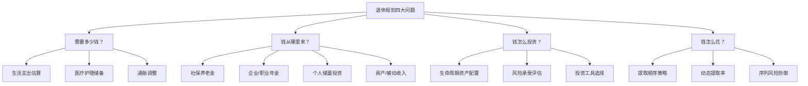
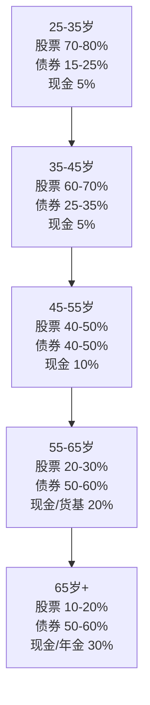
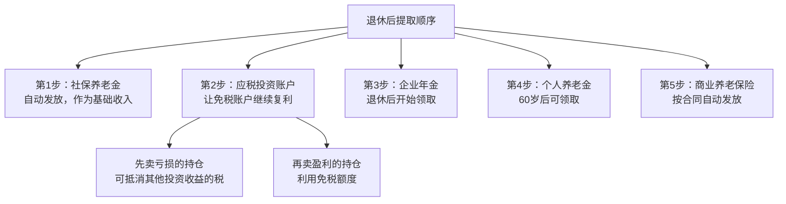

## 六、退休规划：为未来的自己负责

退休规划不是老年人的话题，而是每个还在领工资的人最紧迫的财务课题。它的本质是一个简单的数学问题：你需要在有收入的几十年里，攒够未来没有收入的几十年的生活费。越早开始，这个数学题越容易解；越晚开始，你需要付出的代价越大——要么存更多钱，要么降低生活标准，要么推迟退休。

### 6.1 为什么退休规划是财务管理的终极命题

#### 6.1.1 一个你可能忽视的残酷现实

假设你 25 岁开始工作，60 岁退休，活到 85 岁。你的工作年限是 35 年，而退休生活长达 25 年——这意味着你人生中将近 **42% 的成年时间**是没有工资收入的。更关键的是，这 25 年恰恰是你医疗开支最高、身体机能下降、最需要安全感的阶段。

中国的基本国情让退休规划更加紧迫：

| 指标 | 数据 | 含义 |
|------|------|------|
| 社保替代率 | 40-50% | 退休后收入仅为退休前的一半左右 |
| 城镇职工平均养老金 | ~3,500 元/月（2024年） | 仅能维持基本生活 |
| 60岁以上人口占比 | ~20%（2024年） | 老龄化加速，社保压力增大 |
| 人均预期寿命 | 78.6 岁（2024年） | 且仍在增长，退休期可能更长 |
| 通胀率（近10年均值） | ~2-3% | 30年后购买力缩水一半以上 |
| 延迟退休政策 | 2025年起逐步实施 | 男性延至63岁，女性延至55/58岁 |

社保替代率 40-50% 是什么概念？如果你退休前月薪 15,000 元，退休后社保养老金大约 6,000-7,500 元。你的生活水平直接腰斩。而国际劳工组织建议的最低替代率是 55%，舒适退休需要 70-80%。这个缺口，只能靠你自己来填。

2025 年起正式实施的渐进式延迟退休政策进一步增加了不确定性：男性职工退休年龄从 60 岁逐步延至 63 岁，女性职工从 50/55 岁延至 55/58 岁。这意味着你的工作年限会延长，但同时也意味着社保缴费年限增加、养老金领取起始时间推迟。对于原本计划提前退休的人，需要重新评估规划。

#### 6.1.2 复利的时间杠杆

复利被爱因斯坦称为"世界第八大奇迹"，退休规划是复利最典型的应用场景。假设每月定投 3,000 元，年化收益 7%：

| 开始年龄 | 投资年限 | 60岁时总额 | 本金占比 |
|----------|----------|------------|----------|
| 25岁 | 35年 | ~524万 | 24% |
| 30岁 | 30年 | ~366万 | 25% |
| 35岁 | 25年 | ~253万 | 29% |
| 40岁 | 20年 | ~166万 | 36% |
| 45岁 | 15年 | ~104万 | 48% |

每晚开始 5 年，最终金额大约减少 30-40%。25 岁开始的人，最终资产是 45 岁才开始的人的 **5 倍**——但总投入只多了不到 2.3 倍。差额全部来自复利的魔法。这就是为什么退休规划的第一条铁律是：**现在就开始，不管多少钱**。

复利的威力在退休场景中还有一个常被忽视的维度：**退休后的复利**。即使退休后不再有新的储蓄，已积累的资产仍在持续产生收益。如果退休时有 500 万，按 5% 年化收益计算，即使每年提取 20 万作为生活费，30 年后仍有约 300 万的余额。这就是为什么"钱生钱"比"人赚钱"更持久——前提是你的资产配置和提取策略是合理的。

#### 6.1.3 退休规划的决策全景

在展开具体方法之前，先建立一个全局视角。退休规划涉及的所有决策可以归纳为四个核心问题：

本章将按这四个问题逐一展开，每个部分都提供理论框架、具体方法和实操工具。

### 6.2 你需要多少钱：退休资金需求的精确计算

#### 6.2.1 核心计算框架

退休资金需求的计算遵循一个清晰的逻辑链：

**第一步：估算退休后年生活支出**

退休后的支出通常低于退休前，因为通勤、社交应酬、职业着装、子女教育等开支会减少。但医疗、休闲、养老护理的开支会增加。通常的估算方法：

- **简化法**：退休前年支出 × 70%
- **明细法**：逐项列出退休后的各项开支（见下表）
- **分段法**：将退休期分为活跃期（60-75岁）、平稳期（75-85岁）、护理期（85岁+），分别估算

| 支出类别 | 退休前月支出 | 退休后月支出 | 变化原因 |
|----------|-------------|-------------|----------|
| 饮食 | 3,000 | 3,500 | 更注重营养，但减少外食 |
| 居住（含物业） | 5,000 | 5,000 | 房贷还清则大幅降低 |
| 交通 | 1,500 | 500 | 通勤消失，出行减少 |
| 医疗保健 | 500 | 2,000 | 慢性病、体检、保健品 |
| 休闲娱乐 | 2,000 | 2,500 | 旅游、兴趣爱好 |
| 日用品 | 1,000 | 800 | 消费欲望降低 |
| 通讯/网络 | 300 | 300 | 基本不变 |
| 其他 | 1,700 | 1,400 | 社交应酬减少 |
| **合计** | **15,000** | **16,000** | **约107%** |

注意：这张表显示退休后月支出可能并不少于退休前，尤其是医疗开支会大幅增加。不要想当然地假设退休后花得更少。

**分段法更贴近实际**——退休不同阶段的支出差异很大。活跃期（60-75岁）旅游、社交、兴趣开支较高；平稳期（75-85岁）消费下降但医疗上升；护理期（85岁+）如果需要长期护理，费用可能急剧增加。建议对三个阶段分别估算，然后加权平均。

**第二步：计算年资金缺口**

年资金缺口 = 退休后年支出 - 社保养老金 - 企业年金 - 其他被动收入

**第三步：计算所需退休储蓄总额**

这里有四种主流方法，从简单到精细：

**4% 法则（经典法则）**：退休第一年提取退休储蓄的 4%，之后每年按通胀调整提取额。基于美国历史数据回测，30 年不破产的概率约 95%。公式：`年资金缺口 × 25`。

**3.5% 法则（保守法则）**：考虑到中国市场波动更大、债券收益率更低，用 3.5% 的提取率更稳妥。公式：`年资金缺口 × 29`。

**动态提取法则**：根据市场表现调整提取率。牛市少提（2-3%），熊市也少提，正常年份按计划提。这种方法最灵活但需要纪律。

**分段提取法则**：将退休期按 10 年分段，每段使用不同的提取率。前 10 年活跃期提取率稍高（4-5%），中间 10 年回归正常（3.5%），最后 10 年降低（2-3%），因为后期有更多医疗支出且投资组合更保守。

**第四步：计算每月储蓄额**

使用定投终值公式反推：

每月储蓄额 = FV × r / ((1+r)^n - 1)

其中 FV = 所需退休储蓄总额，r = 月投资收益率，n = 投资月数。

#### 6.2.2 完整案例计算

**案例一：保守型规划（适合大多数上班族）**

| 参数 | 数值 | 说明 |
|------|------|------|
| 当前年龄 | 30 岁 | |
| 计划退休年龄 | 60 岁 | 投资期 30 年 |
| 当前年支出 | 18 万元 | 月均 15,000 元 |
| 退休后年支出（当前价值） | 14.4 万元 | 取退休前的 80% |
| 预期通胀率 | 3% | |
| 社保养老金（当前价值） | 6 万元/年 | 月均 5,000 元 |
| 投资年化收益率 | 6% | 保守估计 |
| 提取率 | 3.5% | 保守法则 |

计算过程：
1. 退休时年支出 = 14.4万 × (1.03)^30 ≈ **34.96万**
2. 退休时社保养老金 = 6万 × (1.03)^30 ≈ **14.57万**
3. 年资金缺口 = 34.96 - 14.57 = **20.39万**
4. 所需退休储蓄总额 = 20.39万 ÷ 3.5% ≈ **582.6万**
5. 每月定投额（年化 6%，30年）≈ **5,800元**

这意味着月薪 15,000 元的 30 岁上班族，需要每月拿出约 39% 的收入用于退休储蓄——这是一个很高的比例，但并非不可能。

**案例二：晚起步追赶型规划**

| 参数 | 数值 |
|------|------|
| 当前年龄 | 40 岁 |
| 计划退休年龄 | 63 岁 | 投资期 23 年 |
| 其他参数同上 | |

计算过程：
1. 退休时年支出 = 14.4万 × (1.03)^23 ≈ **28.37万**
2. 退休时社保养老金 = 6万 × (1.03)^23 ≈ **11.82万**
3. 年资金缺口 = 28.37 - 11.82 = **16.55万**
4. 所需退休储蓄总额 = 16.55万 ÷ 3.5% ≈ **472.9万**
5. 每月定投额（年化 7%，23年，稍微提高风险）≈ **9,200元**

40 岁开始的人需要每月投入 9,200 元——比 30 岁开始的人多出 58%，但晚了 10 年。时间的代价是昂贵的。

**案例三：FIRE 提前退休**

| 参数 | 数值 |
|------|------|
| 当前年龄 | 28 岁 |
| 计划退休年龄 | 45 岁 | 投资期 17 年 |
| 退休后年支出（当前价值） | 10 万元 | 极简生活 |
| 社保养老金 | 0（45岁退休不满足领取条件） |
| 提取率 | 3.5% |

计算过程：
1. 退休时年支出 = 10万 × (1.03)^17 ≈ **16.52万**
2. 所需退休储蓄总额 = 16.52万 ÷ 3.5% ≈ **471.9万**
3. 每月定投额（年化 8%，17年）≈ **12,800元**

FIRE 的核心逻辑是：大幅降低支出 + 极高储蓄率（50-70%）+ 早期开始投资。45 岁退休看起来美好，但需要 17 年的高强度储蓄，且退休后几十年没有任何收入缓冲，容错率极低。

**案例四：双职工家庭协同规划**

| 参数 | 数值 |
|------|------|
| 丈夫年龄 | 32 岁，月薪 18,000 |
| 妻子年龄 | 30 岁，月薪 12,000 |
| 家庭月支出 | 20,000 元 |
| 计划退休年龄 | 均为 60 岁 |
| 社保养老金合计 | 10 万元/年（当前价值） |
| 投资年化收益率 | 6% |
| 提取率 | 3.5% |

计算过程：
1. 退休后年支出（当前价值）= 20,000 × 12 × 70% = **16.8万元**
2. 年资金缺口（当前价值）= 16.8 - 10 = **6.8万元**
3. 以丈夫 30 年投资期计算：退休时年资金缺口 = 6.8万 × (1.03)^30 ≈ **16.51万**
4. 所需退休储蓄总额 = 16.51万 ÷ 3.5% ≈ **471.7万**
5. 家庭每月定投额 ≈ **4,700元**（占家庭收入的 15.7%）

双职工家庭的优势在于：两份社保养老金大幅降低了资金缺口，储蓄压力显著小于单职工家庭。此外，两人的企业年金和各自的个人养老金账户可以叠加使用。

#### 6.2.3 敏感性分析：不同假设下的结果差异

退休规划的计算高度依赖假设参数。一个小参数的变动可能带来百万级的差异。以下是关键参数的敏感性分析：

| 参数变动 | 对所需退休总额的影响 | 说明 |
|----------|-------------------|------|
| 通胀率 2% → 4% | 所需总额增加 40-60% | 通胀是最敏感的参数 |
| 提取率 4% → 3% | 所需总额增加 33% | 越保守需要越多本金 |
| 投资收益 7% → 5% | 每月储蓄额增加 25-35% | 收益率假设需要审慎 |
| 退休年龄 60 → 65 | 所需总额减少 15-20% | 多工作5年效果显著 |
| 生活标准 70% → 80% | 所需总额增加 30-40% | 生活标准假设影响巨大 |

**实操建议**：做三套计算——乐观、中性、悲观。乐观方案假设高投资收益、低通胀、社保充足；悲观方案假设低投资收益、高通胀、社保缩水。以中性方案为基准，以悲观方案做安全边际。如果悲观方案下你也能负担，说明规划是稳健的。

### 6.3 退休收入的三大支柱

#### 6.3.1 第一支柱：社保养老金

社保养老金是国家强制的基本养老保障，是退休收入的底线。理解它的工作机制，才能做出正确的优化决策。

**社保养老金的计算**

中国城镇职工基本养老金由两部分组成：

月养老金 = 基础养老金 + 个人账户养老金

基础养老金 = 退休时当地社平工资 × (1 + 本人平均缴费指数) / 2 × 缴费年限 × 1%
个人账户养老金 = 个人账户余额 / 计发月数（60岁退休为139个月）

**用具体数字说明**：假设你在某二线城市（社平工资 8,000 元/月），平均缴费指数 1.0（按社平工资缴费），缴费 30 年，个人账户余额 20 万元：
- 基础养老金 = 8,000 × (1+1.0) / 2 × 30 × 1% = **2,400 元/月**
- 个人账户养老金 = 200,000 / 139 = **1,439 元/月**
- 合计 = **3,839 元/月**

如果缴费 15 年、个人账户余额 8 万元：
- 基础养老金 = 8,000 × 1.0 × 15 × 1% = **1,200 元/月**
- 个人账户养老金 = 80,000 / 139 = **576 元/月**
- 合计 = **1,776 元/月**

缴 30 年的养老金是缴 15 年的 **2.2 倍**，差距巨大。

**影响养老金的关键因素**：

- **缴费年限**：每多缴 1 年，基础养老金增加约 1% 的社平工资。缴 15 年和缴 35 年，差距巨大
- **缴费基数**：缴费基数越高，平均缴费指数越高，基础养老金越高
- **退休年龄**：越晚退休，计发月数越小，每月领取的个人账户养老金越多
- **所在城市**：社平工资越高的城市，基础养老金越高
- **个人账户投资收益**：个人账户资金按记账利率计息（近年约 6-8%），缴得越早、积累越多，复利效应越明显

**优化社保的实操建议**：

1. **绝对不要断缴**：断缴不仅影响累计年限，还可能影响医保待遇。灵活就业期间也要想办法续缴
2. **缴费基数尽量高**：在经济允许的情况下，按实际工资甚至更高基数缴费。每多缴 1% 的基数，退休后每年多拿的钱远超当下多缴的部分
3. **延长缴费年限**：15 年是最低门槛，不是目标。缴费 30 年的养老金可能是缴费 15 年的 2.5-3 倍
4. **选择社平工资高的城市退休**：如果在多个城市缴过社保，尽量在社平工资最高的城市满足 10 年缴费条件
5. **了解当地补贴政策**：部分城市对大龄就业人员、灵活就业人员有社保补贴
6. **灵活就业人员的社保策略**：如果没有固定工作，以灵活就业身份缴纳社保，虽然个人承担全部费用（约 20% 进入统筹 + 8% 进入个人账户），但长期来看仍然划算——因为统筹部分的回报远高于个人缴费

**社保养老金的隐藏风险**：

- **替代率可能进一步下降**：随着老龄化加剧，养老金增幅可能低于工资增幅，实际替代率持续走低
- **个人账户空账问题**：历史原因导致个人账户资金被挪用用于支付当前退休人员养老金，部分账户是"空账"
- **全国统筹推进中**：2022 年起实施养老保险全国统筹，经济发达地区的养老金可能被调剂到欠发达地区
- **延迟退休的影响**：延迟退休意味着多缴几年、少领几年，对个人的净收益需要重新计算

**估算你的社保养老金**：登录"国家社会保险公共服务平台"（si.12333.gov.cn）或当地社保 APP，使用"养老金测算"功能，输入缴费信息即可获得估算值。

#### 6.3.2 第二支柱：企业年金/职业年金

企业年金是企业自愿为员工建立的补充养老保险。截至 2024 年，全国参加企业年金的职工约 3,200 万人，覆盖率不到城镇职工的 10%。如果你的公司提供企业年金，一定要珍惜——这相当于变相加薪。

**企业年金的关键信息**：
- **缴费比例**：企业缴费不超过工资总额的 8%，企业和职工合计不超过 12%
- **归属规则**：企业缴费部分通常有归属期（3-8 年），离职过早可能损失企业缴纳部分
- **投资选择**：大部分企业年金计划提供 2-3 种风险等级不同的投资组合，年轻时可选偏股型
- **领取方式**：退休后可一次性领取、分期领取或购买商业养老保险

**职业年金**（机关事业单位）：强制缴纳，单位 8% + 个人 4%，合计 12%。这是体制内退休待遇好的重要原因之一。以月薪 10,000 元为例，每月职业年金缴纳 1,200 元（单位 800 + 个人 400），30 年后加上投资收益，职业年金账户可能积累 80-120 万元，每月额外领取 5,700-8,600 元。

**如何最大化企业年金**：
1. 入职时确认企业年金方案的具体条款，特别是企业缴费的归属条件
2. 如果有投资组合选择权，40 岁前选偏股型，40 岁后逐步转向偏债型
3. 离职时确认企业缴费部分的归属情况，不要白白损失——如果归属期还差 1-2 年，值得考虑多留一段时间
4. 不要提前支取（除非符合大病、出国定居等特殊条件）

#### 6.3.3 第三支柱：个人养老储蓄

第三支柱是你完全自主控制的部分，也是拉开退休生活质量差距的关键。

**工具一：个人养老金账户**

2022 年 11 月起，中国正式实施个人养老金制度。2024 年底进一步扩大了可投资产品范围。这是国家层面推动的第三支柱养老产品：

- **开户条件**：参加城镇职工或城乡居民基本养老保险的劳动者
- **年度缴存上限**：12,000 元（未来可能提高）
- **税收优惠**：缴存金额在综合所得或经营所得中据实扣除；投资收益暂不征税；领取时按 3% 单独计税
- **可投资产品**：储蓄存款、理财产品、商业养老保险、公募基金、指数基金（2024年底新增）

**税收优惠的真实价值**：

| 边际税率 | 年缴存 12,000 元节税额 | 领取时税额（3%） | 净节税 |
|----------|----------------------|-----------------|--------|
| 3% | 360 | 360 | 0 |
| 10% | 1,200 | 360 | 840 |
| 20% | 2,400 | 360 | 2,040 |
| 25% | 3,000 | 360 | 2,640 |
| 30% | 3,600 | 360 | 3,240 |
| 35% | 4,200 | 360 | 3,840 |

边际税率 3% 的人（年应税所得 ≤ 36,000 元）享受不到税收优惠，因为现在省的税和以后交的税一样多。**边际税率 10% 及以上的人才值得开通**。

**个人养老金的局限性**：年缴存上限 12,000 元对于高收入人群来说杯水车薪，每月仅 1,000 元。即便加上税收优惠，其对退休总资金的贡献有限。因此，个人养老金账户应该作为第三支柱的补充，而非主力。真正的退休储蓄主力仍然是基金定投和其他投资。

**工具二：基金定投**

基金定投是退休储蓄的核心武器。具体策略参见前文投资章节，这里强调退休场景的特殊性：

- **标的首选宽基指数基金**：沪深 300、中证 500、MSCI 中国 A50 等，长期持有 20-30 年的收益大概率超越主动基金
- **定投纪律比择时重要**：每月固定日期自动扣款，不看涨跌，不中断
- **年龄递减策略**：随着退休临近，逐步降低股票型基金占比，增加债券和货币基金占比（详见 6.4 节资产配置）
- **定投金额应随收入增长**：每年加薪后同步提高定投金额，保持储蓄率不降
- **退休专用账户分离**：为退休储蓄开设独立的投资账户，与日常投资账户分开，避免心理上将退休资金挪作他用

**定投的实操细节**：
1. 选择费率低的指数基金（管理费 + 托管费 < 0.6%/年），费率差异在 30 年维度上影响巨大
2. 定投日期选在每月发工资后的第二天，确保扣款时账户有足够余额
3. 每年 1 月根据上年收入增长情况调整定投金额
4. 牛市高估时可暂停新增定投（已有的继续持有），将资金转入债券基金；熊市低估时加大定投力度
5. 基金分红方式选"红利再投资"，确保复利不中断

**工具三：商业养老保险**

商业养老保险适合追求确定性的人。它的核心价值是：**与生命等长的现金流**——你活得越久，领得越多，不用担心"人活着，钱没了"。

主要类型：
- **养老年金险**：一次性或分期缴费，退休后每月/每年领取固定金额
- **增额终身寿险**：保额按固定比例（如 3%）逐年增长，可通过减保取现用于养老
- **税延养老保险**：享受税收递延优惠的商业养老保险（目前已并入个人养老金体系）

选择要点：
1. 看 IRR（内部收益率），而非宣传的"保额增长率"——IRR 才是真实收益。用 Excel 的 IRR 函数或 XIRR 函数计算真实收益率，大多数养老年金险的真实 IRR 在 2-3.5% 之间
2. 看保证领取年限：至少 20 年，否则早逝会亏损
3. 看是否有万能账户二次增值
4. 不要用超过个人养老储蓄总额 30% 的资金购买保险产品——流动性太差

**养老年金险 vs 指数基金定投对比**：

| 维度 | 养老年金险 | 指数基金定投 |
|------|-----------|-------------|
| 预期收益 | IRR 2-3.5% | 长期年化 6-8% |
| 确定性 | 极高（合同保证） | 低（随市场波动） |
| 流动性 | 极差（退保损失大） | 较好（可随时赎回） |
| 抗通胀 | 弱（固定金额） | 强（股票长期跑赢通胀） |
| 长寿风险 | 解决（终身领取） | 不解决（可能花完） |
| 适合人群 | 风险厌恶、追求确定性 | 风险承受力强、追求增长 |

**最优组合**：用 20-30% 的退休储蓄购买养老年金险保障底线，剩余 70-80% 通过指数基金定投追求增长。这样既有"保底收入"不怕活太久，又有"增长引擎"对抗通胀。

**工具四：房产**

房产在中国家庭资产中占比超过 60%，是退休规划中不可忽视的因素：

- **自住房产**：退休后最大的支出（房租/房贷）消失，等效于大幅降低退休资金需求。如果退休前还清房贷，每月可节省 3,000-10,000 元的住房开支
- **出租房产**：提供稳定的被动收入，但需考虑空置期（通常每年 1-2 个月）、维修成本（每年租金的 5-10%）、管理精力、房产税预期
- **以房养老（反向抵押）**：将房产抵押给保险公司，每月领取养老金，去世后房产归保险公司。目前在中国推广有限，条款通常不利于房主——评估价偏低（通常为市价的 50-70%），月领金额有限，且利率不透明
- **换房策略**：退休后从大城市搬到生活成本较低的中小城市，差价可以大幅补充退休资金。例如从北京卖房 600 万，到成都购房 200 万，释放 40 万现金
- **养老社区入住权**：部分保险公司提供"买保险送养老社区入住权"的方案，适合有高端养老需求的人

**房产在退休规划中的正确定位**：自住房产是降低退休资金需求的工具，投资房产是产生被动收入的工具，但都不应成为退休规划的唯一支柱。房产的最大问题是流动性差——急需用钱时无法迅速变现，且变现时机可能正好是市场低点。

### 6.4 退休资产配置：生命周期策略

#### 6.4.1 核心原则：年龄决定风险

退休资产配置的核心原则是：**越接近退休，越需要确定性**。年轻时有时间承受波动，退休后没有。

经典的生命周期配置法则：

**简化公式**：股票占比 = (110 - 年龄)%。30 岁人股票占 80%，50 岁人股票占 60%。

但这个公式只是起点，实际配置还需要考虑以下因素：

- **风险承受能力**：如果你除了投资资产外还有稳定的被动收入（房租、版税等），可以适当提高股票比例
- **已积累资产规模**：如果已积累的退休资金远超需求（超过 150%），可以更保守
- **社保充足度**：如果社保养老金较高，覆盖了大部分基本支出，投资部分可以更激进
- **是否有企业年金**：企业年金本身提供了确定性收入，投资部分的风险承受能力更强

#### 6.4.2 各阶段的配置策略

**25-35 岁：激进增长期**

- 核心持仓：A 股宽基指数基金（60%）+ 港股/美股指数基金（10-20%）
- 债券部分：可转债基金（5-10%）+ 纯债基金（10-15%）
- 特殊配置：可配置 5-10% 到商品基金（黄金 ETF）作为对冲
- 策略重点：**高储蓄率 + 高风险承受能力 = 最大化长期收益**

这个阶段最重要的是**开始定投并坚持下去**，而不是纠结具体的配置比例。即使配置不完美，30 年的复利也会让任何合理的配置都产生可观的回报。比配置更重要的是：不要中断、不要恐慌卖出、随收入增长同步提高定投金额。

**35-45 岁：稳健增长期**

- 股票部分：降低个股比例，增加指数基金比例
- 债券部分：增加中长期纯债基金比例
- 开始关注：企业年金投资选择、个人养老金账户产品选择
- 策略重点：**在保持增长的同时，开始建立安全垫**

这个阶段通常面临"上有老下有小"的多重财务压力，退休储蓄容易被搁置。但这也是收入增长最快的阶段，储蓄率的提升空间最大。建议将加薪部分的至少 50% 直接转入退休储蓄，避免生活方式膨胀侵蚀储蓄率。

**45-55 岁：防御转换期**

- 股票部分：逐步降低到 40-50%，优先保留分红稳定的蓝筹指数
- 债券部分：增加国债、政策性金融债等高等级债券
- 开始配置：商业养老年金险（如果需要）
- 策略重点：**降低波动比追求收益更重要**

这个阶段需要做一次精确的退休资金缺口测算。如果发现缺口较大，需要考虑：提高储蓄率、延迟退休 1-3 年、降低退休后生活标准、或者增加投资风险（但需谨慎）。

**55-65 岁：退休准备期**

- 股票部分：控制在 20-30%，以高股息蓝筹为主
- 债券部分：锁定中长期国债，确定退休初期的现金流
- 准备 2-3 年的生活费在货币基金中，避免退休初期被迫在低点卖出
- 策略重点：**确保退休头 3 年的钱是确定的、不受市场波动影响的**

这个阶段还需要开始处理一些"软性"准备：了解退休后的社保领取流程、规划退休后的生活安排（居住地、社交圈、兴趣爱好）、考虑财产传承和遗嘱。

**65 岁以上：退休执行期**

- 核心配置：养老年金 + 国债 + 大额存单
- 股票部分：保留 10-20% 作为通胀对冲
- 现金管理：保持 1 年生活费在随时可取的账户中
- 策略重点：**现金流的稳定性压倒一切**

#### 6.4.3 具体基金配置示例

以 30 岁投资者为例，月定投 5,000 元，股债比 75:25：

| 类别 | 配置比例 | 推荐标的 | 月投金额 |
|------|---------|---------|---------|
| A股宽基 | 40% | 沪深300指数基金 | 2,000 |
| A股成长 | 15% | 中证500指数基金 | 750 |
| 港股/全球 | 10% | MSCI中国A50或恒生科技指数 | 500 |
| 黄金 | 10% | 黄金ETF | 500 |
| 纯债基金 | 15% | 中长期纯债基金 | 750 |
| 货币基金 | 10% | 余额宝等货币基金 | 500 |

以 50 岁投资者为例，月定投 8,000 元，股债比 40:60：

| 类别 | 配置比例 | 推荐标的 | 月投金额 |
|------|---------|---------|---------|
| A股红利 | 25% | 中证红利指数基金 | 2,000 |
| 港股高股息 | 10% | 恒生高股息指数 | 800 |
| 黄金 | 5% | 黄金ETF | 400 |
| 国债/政金债 | 30% | 国债ETF或政金债基金 | 2,400 |
| 中长期纯债 | 20% | 中长期纯债基金 | 1,600 |
| 货币基金 | 10% | 货币基金 | 800 |

### 6.5 退休提取策略：让钱够花一辈子

#### 6.5.1 提取顺序的学问

退休后从哪些账户先取钱，直接影响总税负和投资寿命：

详细说明：
1. **社保养老金作为基础**：自动发放，不需要主动操作，是退休收入的基石
2. **先取应税账户**（普通投资账户）：让免税账户（个人养老金、企业年金）继续复利增长。在应税账户中，先卖出亏损的持仓（可以抵税），再卖出盈利的持仓
3. **再取免税账户**：个人养老金账户 60 岁后可领取，企业年金退休后领取
4. **保险金最后动用**：养老年金险按合同自动发放，增额终身寿险作为最后的安全网

**税务优化提示**：个人养老金领取时按 3% 单独计税，不并入综合所得。如果你退休后的其他收入较低（边际税率可能降至 3%），个人养老金的税收优惠会缩水。因此，如果你的边际税率在退休前后变化不大，优先使用应税账户；如果退休后边际税率大幅下降，可以考虑调整顺序。

#### 6.5.2 应对市场暴跌：序列风险

**序列风险（Sequence of Returns Risk）**是退休规划中最被低估的风险。同样 5% 的平均年化收益，如果退休头几年连续亏损，可能在退休中期就耗尽储蓄。

举例说明：

| 场景 | 退休储蓄 500 万，每年提取 20 万 | 第 15 年余额 |
|------|-------------------------------|-------------|
| A：前 5 年大亏（-15%/年），后 10 年大赚（+12%/年） | 先亏后赚 | ~180万 |
| B：前 5 年大赚（+12%/年），后 10 年大亏（-15%/年） | 先赚后亏 | ~410万 |
| C：15 年平稳（+2%/年） | 平稳 | ~350万 |

同样的平均收益，先亏后赚比先赚后亏少了 230 万——几乎翻倍的差距。这就是序列风险的残酷之处：**退休初期的市场表现，对最终结果的影响远大于后期**。

**防御序列风险的四种方法**：

**方法一：现金缓冲策略**（最简单）
退休时准备 2-3 年生活费在货币基金中。市场暴跌时不动股票，先花现金。等市场恢复后再补充现金缓冲。
- 优点：简单易执行
- 缺点：现金收益率低，机会成本高

**方法二：动态提取策略**（最灵活）
牛市少提（不超过 3%），正常年份按计划提，熊年少提或不提。
- 优点：适应市场变化，延长投资寿命
- 缺点：需要纪律，收入不稳定

**方法三：债券阶梯策略**（最确定）
用国债构建 5-10 年的债券到期阶梯。每年都有确定的债券到期金额用于生活开支。
- 优点：现金流确定，不受市场波动影响
- 缺点：构建和管理较复杂，收益率有限

**方法四：部分年金化**（最安全）
将 30-50% 的退休储蓄购买终身年金，确保底线收入。剩余部分继续投资。
- 优点：终身收入保证，消除长寿风险
- 缺点：流动性丧失，收益率低

**实操建议**：组合使用以上方法。例如，用 30% 购买终身年金确保基本生活，用 20% 构建 5 年债券阶梯，剩余 50% 继续投资（其中 10% 作为现金缓冲）。这样既有确定性收入，又有增长空间，还有应急资金。

#### 6.5.3 动态提取率的实操方法

固定 4% 提取率虽然简单，但并非最优。以下是更精细的动态提取方法：

**方法一：基于投资组合价值调整**
每年初按投资组合当前价值的 3.5-4% 提取。组合涨了多提，跌了少提。但设置一个下限（不低于初始提取额的 70%）和上限（不高于初始提取额的 120%），避免收入大幅波动。

**方法二：基于市场估值调整**
当沪深 300 市盈率低于历史均值（约 12-13 倍）时，提取率降至 3%；当市盈率高于历史均值时，提取率提高到 4.5%。这种方法利用了均值回归的特性。

**方法三："分割水桶"策略**
将退休储蓄分为三个"水桶"：
- **短期水桶**（1-3 年生活费）：货币基金和短期理财，用于日常开支
- **中期水桶**（3-10 年生活费）：债券基金和银行理财，用于补充短期水桶
- **长期水桶**（10 年以上生活费）：股票基金和混合基金，用于增长

每年从短期水桶取钱。市场好的年份从长期水桶卖出一部分补充中期水桶，再从中期水桶补充短期水桶。市场差的年份只从短期水桶取钱，不动长期水桶。这种方法在心理上也更容易执行——你看到的是短期水桶始终充足，不需要每天看股票涨跌。

### 6.6 退休规划的进阶议题

#### 6.6.1 FIRE 运动：提前退休的可能性

FIRE（Financial Independence, Retire Early）的核心公式：

FIRE 数字 = 年支出 × 25（基于 4% 法则）

如果年支出 10 万，需要 250 万即可提前退休。如果年支出 30 万，需要 750 万。

FIRE 的三种变体：

| 类型 | 特点 | 适合人群 |
|------|------|----------|
| Fat FIRE | 不大幅降低生活标准，需要更多储蓄 | 高收入人群 |
| Lean FIRE | 极简生活，年支出 < 10 万 | 物欲低、有副业能力的人 |
| Barista FIRE | 半退休，做轻松的兼职覆盖部分支出 | 想要自由但不想完全退出的人 |

**FIRE 的真实挑战**：
- 4% 法则基于美国 30 年数据，对中国市场不一定适用，保守起见用 3-3.5%
- 提前退休意味着没有社保养老金（不满足 15 年缴费），需要完全自给自足
- 医疗保险需要自己缴纳（灵活就业医保或商业保险），这是一笔不小的开支
- 40 岁退休后可能活到 90 岁——50 年的退休期需要极高的安全边际
- 心理准备：长期无所事事可能导致空虚感，需要找到退休后的人生意义

**中国 FIRE 实践者的特殊考量**：
1. **社保续缴**：即使提前退休，也建议以灵活就业身份继续缴纳社保至少 15 年，确保 60 岁后有基本养老金和医保
2. **医保不能断**：没有医保的一次重大疾病可能直接摧毁整个 FIRE 计划。灵活就业医保每年约 3,000-6,000 元，是必须的支出
3. **住房问题**：如果已经拥有无贷款的自住房，FIRE 的门槛大幅降低——住房开支通常占总支出的 30-40%
4. **副业收入缓冲**：FIRE 后从事自由职业、兼职或兴趣变现的收入，可以大幅降低对投资收益的依赖
5. **家庭压力**：中国社会对"不工作"的接受度较低，需要处理好来自家人和社会的压力

#### 6.6.2 医疗与长期护理：退休最大的不确定因素

退休规划中最大的变量不是投资收益，而是**健康**和**医疗费用**。

**医疗费用估算**：
- 60-70 岁：年均医疗支出约 1-2 万元（慢性病管理、常规体检）
- 70-80 岁：年均医疗支出约 3-5 万元（可能需要手术、住院）
- 80 岁以上：年均医疗支出约 5-10 万元（护理、康复、重大疾病）
- 一次重大疾病（癌症、心脑血管）：自费部分可能 20-50 万元

**退休后的医疗保障组合**：
1. **基本医保**：退休后免缴费继续享受，报销比例 70-90%（各地不同）。注意：退休后享受医保需要满足当地规定的最低缴费年限（通常男 25 年、女 20 年），未满年限的需要一次性补缴
2. **大病医保**：基本医保的补充，降低大病自费比例。超过一定金额的大病费用，报销比例可提高到 80-95%
3. **商业医疗险（百万医疗）**：60 岁前投保，保证续保到 80-100 岁。年保费随年龄增长，60 岁后可能每年 3,000-8,000 元。但与重大疾病的自费金额相比，保费微不足道
4. **长期护理保险**：覆盖失能后的护理费用（社保长护险已在 49 个城市试点）。商业长护险产品也在逐步增加
5. **专项医疗储蓄**：在退休储蓄中单独留出 30-50 万元作为医疗基金，不动用、不投资高风险资产，仅放货币基金或大额存单

**长期护理的现实**：中国 65 岁以上老人中，约 15% 存在不同程度的失能。养老院费用因地区和等级差异巨大：

| 护理类型 | 月费用范围 | 说明 |
|---------|-----------|------|
| 公立养老院 | 3,000-6,000 元 | 排队时间长，条件一般 |
| 中档民营养老院 | 6,000-15,000 元 | 条件较好，服务标准化 |
| 高端养老社区 | 15,000-30,000 元 | 设施一流，医疗配套完善 |
| 居家保姆（24小时） | 6,000-12,000 元 | 环境熟悉，但需自备住房 |
| 日间照料中心 | 2,000-5,000 元 | 白天托管，晚上回家 |

如果需要 5 年的长期护理，费用可能在 40-180 万元之间。这笔钱必须纳入退休规划。

**提前规划护理需求**：
1. 50 岁前购买百万医疗险和长期护理险，此时保费最低、核保最易通过
2. 了解所在城市的长护险试点政策，提前了解申请条件和报销标准
3. 与配偶/子女讨论护理意愿——居家养老还是机构养老，这决定了资金需求的不同量级
4. 保持健康的生活方式是最经济的"护理保险"：定期运动、合理饮食、定期体检

#### 6.6.3 通货膨胀：退休规划的隐形杀手

通货膨胀是退休规划中最容易被低估的风险。3% 的通胀率看似温和，但其累积效应惊人：

| 通胀率 | 10年后购买力 | 20年后购买力 | 30年后购买力 |
|--------|------------|------------|------------|
| 2% | 82% | 67% | 55% |
| 3% | 74% | 55% | 41% |
| 4% | 68% | 46% | 31% |
| 5% | 61% | 38% | 23% |

如果退休后每月需要 10,000 元（当前价值），30 年后在 3% 通胀下你需要 24,273 元才能维持同样的购买力。

**对抗通胀的方法**：
- 退休前：股票类资产是长期对抗通胀的最佳工具
- 退休后：保留 20-30% 的股票配置，同时考虑通胀保护债券（TIPS 类产品）
- 社保养老金会随社平工资增长，在一定程度上对冲通胀
- 房租收入通常随通胀增长，是天然的通胀对冲工具
- 商业养老年金如果选择了"增额领取"条款，也能部分对冲通胀

#### 6.6.4 退休生活的心理准备

退休不仅是财务问题，更是生活方式的根本转变。许多退休者面临的最大挑战不是钱不够花，而是**不知道怎么花时间**。

**退休后的心理挑战**：
- **身份丧失**：从"某公司某职位"变成"退休人员"，社会角色的丧失可能导致自我价值感下降
- **社交圈萎缩**：离开职场后，每天见面的同事消失了，社交活动大幅减少
- **时间空虚**：突然拥有大量自由时间，如果缺乏规划，可能陷入无所事事的状态
- **夫妻关系紧张**：退休后两人 24 小时相处，生活习惯差异可能引发摩擦
- **健康焦虑**：身体机能下降带来的恐惧和焦虑

**提前准备的建议**：
1. **退休前 3-5 年开始培养兴趣爱好**：不要等到退休后才开始找事情做
2. **建立工作以外的社交圈**：加入社区活动、兴趣小组、志愿者组织
3. **规划退休后的"第二事业"**：可以是咨询、教学、写作、创业——保持智力活跃
4. **与配偶提前沟通**：讨论退休后的生活安排、空间分配、财务分工
5. **保持规律的作息**：退休后最容易出现的问题是生活节奏混乱

#### 6.6.5 家庭退休协同规划

对于已婚人士，退休规划不是一个人的事，而是夫妻双方的协同规划。

**夫妻退休规划的关键协调点**：

1. **退休时间协调**：两人是否同时退休？如果一人先退，另一人的收入能否支撑？如果错开退休，先退休的一方需要独立的退休资金来源
2. **社保策略协调**：两人的社保缴费基数和年限应分别优化，而非简单地"一人缴高一人缴低"
3. **投资风格协调**：如果夫妻风险偏好差异大，可以各自管理各自的退休账户，或者协商一个双方都能接受的配置方案
4. **保险协调**：百万医疗险、重疾险、长护险应分别配置，互为保障
5. **遗嘱和财产传承**：提前规划财产的分配方式，避免日后家庭纠纷

**特殊情况处理**：
- **全职主妇/主夫**：没有独立收入的一方更需要关注社保续缴（以灵活就业身份）、商业养老保险配置、以及离婚风险下的财产保护
- **再婚家庭**：涉及前婚子女和现婚配偶的利益平衡，需要更精细的遗嘱和财产规划
- **独生子女家庭**：养老压力集中在一个人身上，需要更多依靠社会化养老服务和充足的退休资金

#### 6.6.6 退休地点选择

退休后住在哪里，直接影响生活成本、医疗资源和生活质量。

**国内热门退休城市对比**：

| 城市 | 优势 | 劣势 | 月生活成本（2人） |
|------|------|------|-----------------|
| 昆明 | 气候宜人、物价低、空气好 | 医疗资源一般、远离子女 | 6,000-10,000 |
| 成都 | 生活便利、美食、医疗好 | 冬天阴冷、夏季闷热 | 8,000-12,000 |
| 厦门 | 海滨城市、环境优美 | 物价较高、房价高 | 10,000-15,000 |
| 珠海 | 气候温暖、靠近港澳医疗 | 夏季台风、物价中等 | 8,000-12,000 |
| 苏州 | 园林城市、医疗好、靠近上海 | 冬天湿冷 | 9,000-14,000 |
| 北海 | 物价极低、海滨 | 医疗资源有限 | 5,000-8,000 |

**选择退休地点的决策框架**：
1. **医疗资源**（权重最高）：70 岁以后最需要的是好的医院，而非好的风景
2. **生活成本**：直接影响退休资金的消耗速度
3. **气候环境**：对健康有长期影响，尤其是呼吸道和关节疾病患者
4. **社交网络**：是否有亲友在附近？孤独是老年人健康的最大威胁之一
5. **子女距离**：需要照顾孙辈或需要子女照顾时的距离成本
6. **交通便利性**：是否方便出行、就医、探亲

### 6.7 退休规划的常见误区与纠正

**误区 1："我还年轻，退休以后再说"**

纠正：每晚 5 年开始，最终退休储蓄可能减少 30-40%。25 岁开始每月存 2,000 元的效果，相当于 35 岁开始每月存 4,500 元。时间是退休规划最大的盟友，你浪费的每一天都在增加未来的负担。

**误区 2："有社保就够了"**

纠正：社保替代率只有 40-50%，月薪 15,000 的人退休后可能只拿到 6,000-7,000 元。社保是底线保障，不是舒适退休的保障。而且随着老龄化加剧，未来社保替代率可能进一步下降。

**误区 3："退休后花得少"**

纠正：医疗费用、护理费用、休闲费用可能比你想象的高得多。退休后有大量空闲时间，如果缺乏规划，反而可能因为无聊而增加消费（频繁旅游、购物、社交）。

**误区 4："把钱存银行最安全"**

纠正：银行存款的实际收益率（扣除通胀后）经常是负的。如果通胀 3%，存款利率 2%，你的购买力每年缩水 1%。30 年下来，100 万的实际购买力只剩 74 万。安全不等于不亏——在通胀面前，现金是最危险的资产。

**误区 5："退休后就不需要投资了"**

纠正：退休后可能还有 20-30 年的寿命，不投资就意味着坐等购买力缩水。退休后的投资策略需要调整（降低风险），但不能完全停止。保留 20-30% 的股票配置是对抗通胀的必要手段。

**误区 6："房子就是最好的养老资产"**

纠正：房子不能当饭吃。自住房产虽然省了房租，但不产生现金流。如果需要变现，卖房需要时间，且可能在市场低点被迫出售。多套房产还需要考虑房产税预期、维护成本、空置风险。房产应该是退休资产的一部分，但不应是全部。

**误区 7："买了很多养老保险就万事大吉"**

纠正：保险产品的实际收益率（IRR）通常只有 2-3%，远低于指数基金长期 6-8% 的收益。保险的价值在于确定性，而非高收益。用 30-50% 的退休资金买保险确保底线，剩余部分通过投资追求增长，才是合理的组合。

**误区 8："退休规划做一次就够了"**

纠正：退休规划需要每年复盘一次。收入变化、市场波动、政策调整、家庭状况变动都会影响规划。建议每年生日月做一次全面的退休规划复盘：更新社保缴费情况、检查投资组合表现、重新计算资金缺口、调整储蓄率和配置比例。

**误区 9："子女会养老"**

纠正：独生子女一代面临巨大的养老压力——一对夫妻可能需要赡养 4 位老人。依赖子女养老既不现实也不公平。自己做好退休规划，才是对子女最大的关爱。

**误区 10："身体好就不用考虑医疗费用"**

纠正：健康时恰恰是购买医疗险和长护险的最佳时机——保费低、核保容易。等到生病了再想买保险，要么买不了，要么贵得离谱。医疗储备应该在健康时就开始建立。

### 6.8 行动清单：不同人生阶段的退休规划

#### 6.8.1 20-30 岁：打地基

- [ ] 开通社保账户，确保连续缴纳不断缴
- [ ] 了解公司是否有企业年金，有则确认归属规则
- [ ] 开通个人养老金账户（边际税率 10% 以上者）
- [ ] 开始指数基金定投，每月至少 1,000 元，设置自动扣款
- [ ] 建立应急基金（3-6 个月生活费），避免动用投资资金
- [ ] 用养老金测算工具估算退休后的社保养老金
- [ ] 计算自己的 FIRE 数字，设定初步的退休储蓄目标
- [ ] 培养 1-2 个可持续的兴趣爱好（为退休生活做心理准备）

#### 6.8.2 30-40 岁：加速积累

- [ ] 提高定投金额至月收入的 20-30%
- [ ] 开始考虑资产配置：股债比例约 70:30
- [ ] 配置商业医疗险（百万医疗），趁年轻保费低
- [ ] 评估是否需要养老年金险（确定性需求）
- [ ] 每年复盘一次退休规划，调整储蓄率和投资策略
- [ ] 确保社保缴费基数合理，不按最低基数缴
- [ ] 开始关注长期护理保险
- [ ] 与配偶讨论退休规划（如已婚）

#### 6.8.3 40-50 岁：巩固防御

- [ ] 逐步降低股票配置至 50-60%
- [ ] 增加债券和稳健型资产比例
- [ ] 精确计算退休资金缺口，制定弥补方案
- [ ] 考虑是否需要延迟退休 1-3 年
- [ ] 评估企业年金的积累情况和投资表现
- [ ] 开始规划退休后的生活安排（居住、社交、兴趣）
- [ ] 如有子女教育支出重叠，确保两者平衡
- [ ] 购买或续保长期护理险
- [ ] 与配偶协调退休时间和财务策略

#### 6.8.4 50-60 岁：最后冲刺

- [ ] 将 2-3 年生活费转入货币基金，锁定退休初期现金流
- [ ] 股票配置降至 20-30%
- [ ] 确认社保缴费年限是否满足最优条件
- [ ] 完善医疗保障组合（基本医保 + 百万医疗 + 长护险）
- [ ] 详细了解退休后的社保领取流程和金额
- [ ] 制定详细的退休生活计划（包括日常作息、社交活动、旅行计划）
- [ ] 考虑部分年金化：将 30% 的储蓄转为终身年金
- [ ] 开始关注养老社区和居家养老服务信息
- [ ] 起草或更新遗嘱，安排财产传承

#### 6.8.5 60 岁以后：退休执行

- [ ] 按计划开始领取社保养老金
- [ ] 启动个人养老金和企业年金的领取
- [ ] 执行预设的提取策略，每年检视一次
- [ ] 保持 10-20% 的股票配置对抗通胀
- [ ] 每年评估一次资产是否足以支撑后续退休生活
- [ ] 保持健康的生活方式，控制医疗开支
- [ ] 关注认知衰退信号，提前安排财产托管和遗嘱
- [ ] 保持社交活跃，参与社区活动或志愿服务
- [ ] 每 3-5 年重新评估养老方式（居家/社区/机构）

### 6.9 退休规划自检清单

在完成以上所有内容的学习后，用以下清单检验你的退休规划是否完整：

| 检查项 | 是否完成 | 说明 |
|--------|---------|------|
| 计算了退休资金需求总额 | □ | 用 6.2 节的方法精确计算 |
| 了解自己的社保养老金预估金额 | □ | 登录 si.12333.gov.cn 查询 |
| 确认了企业年金/职业年金情况 | □ | 有则确认金额和归属规则 |
| 已开通个人养老金账户 | □ | 边际税率 10% 以上者必须开通 |
| 建立了退休专用投资账户 | □ | 与日常投资分开管理 |
| 设定了每月定投金额并自动执行 | □ | 金额应占收入的 15-30% |
| 制定了生命周期资产配置方案 | □ | 参考 6.4 节的配置建议 |
| 配置了医疗保障组合 | □ | 基本医保 + 百万医疗 + 长护险 |
| 制定了退休提取策略 | □ | 参考 6.5 节的提取顺序 |
| 做过敏感性分析 | □ | 乐观/中性/悲观三套方案 |
| 与配偶/家人沟通过退休规划 | □ | 协调退休时间和财务策略 |
| 设定了年度复盘机制 | □ | 每年生日月做一次全面复盘 |
| 起草了遗嘱/财产传承计划 | □ | 50 岁前完成初稿 |
| 对退休后的生活有初步规划 | □ | 居住、社交、兴趣、"第二事业" |

### 6.10 工具与资源

**养老金计算工具**：
- 国家社会保险公共服务平台：si.12333.gov.cn — 官方养老金测算
- 各地人社局 APP — 个人社保信息查询

**投资定投工具**：
- 天天基金、蚂蚁财富、蛋卷基金 — 基金定投和养老目标基金
- 各大银行 APP — 定投功能

**退休规划计算器**：
- Excel/Google Sheets — 自建退休规划模型（最灵活）
- 各保险公司官网 — 养老年金险收益测算

**学习资源**：
- 《漫步华尔街》（伯顿·马尔基尔）— 投资入门经典
- 《你的钱：你需要知道的 99 件事》（乔治·克拉森）— 理财思维
- 《不上班也有钱》（曾琬铃）— 中国人的 FIRE 实践
- 《百岁人生》（琳达·格拉顿）— 长寿时代的退休规划思维
- B 站/YouTube 上的 FIRE 案例分享 — 了解不同人的退休实践

***

退休规划的本质是：**用今天的自律，换明天的自由**。不需要一步到位，但需要现在就开始。打开手机，做三件事：查一下你的社保缴费记录，算一下你的 FIRE 数字，设置一个每月自动定投。这三步花不了 30 分钟，但可能是你这辈子做的最有价值的财务决策。
