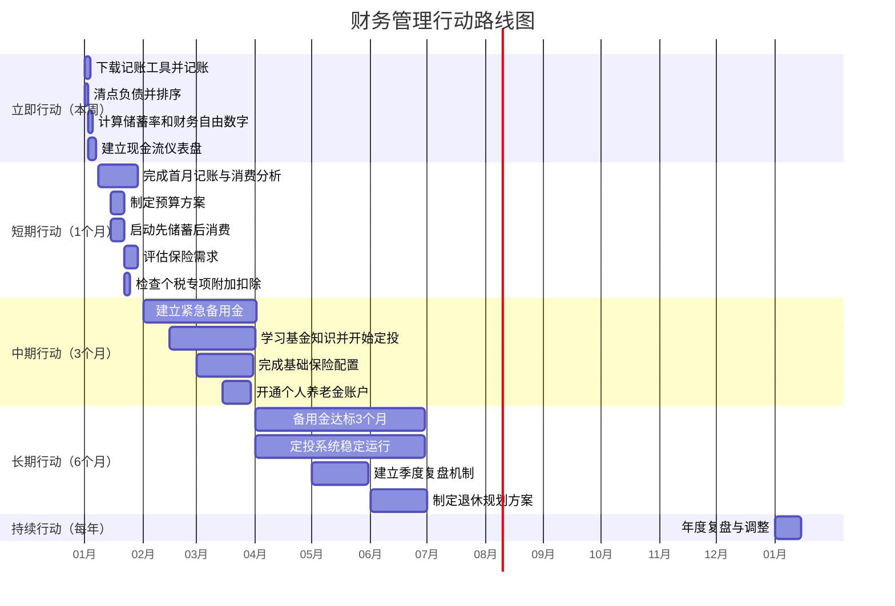
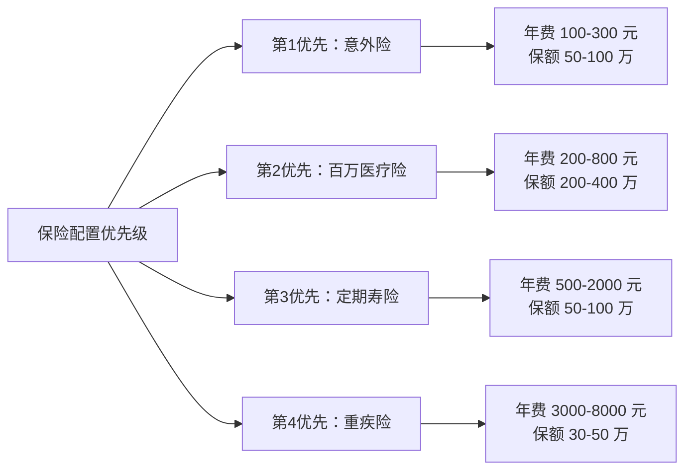

## 七、综合行动清单

前面六节分别讲解了记账与预算、储蓄策略、投资策略、保险规划、税务筹划和退休规划的理论与方法。知识学完不等于能力到手——财务管理的本质是一套需要持续执行的行为系统。本节将所有核心动作拆解为可执行的阶段清单，配合具体的执行模板、里程碑标准和常见陷阱，让你拿到就能做，做完就能看到结果。

**本节定位**：这不是前六节的简单汇总，而是一份**作战手册**。它解决的核心问题是「我知道该做哪些事，但不知道先做哪件、怎么做、做到什么程度算合格」。每个行动项都有明确的执行步骤、验收标准和时间框架。

### 7.1 行动路线总览



#### 7.1.1 优先级矩阵：不是所有事都同样紧急

上述路线图是线性展开的，但实际执行中你可能同时面对多件事。下面的优先级矩阵帮你决定**当下最该做什么**：

| 紧急程度 \ 重要程度 | 重要 | 不重要 |
|-------------------|------|-------|
| **紧急** | 清点高利率负债、建立记账习惯、检查个税扣除 | 处理逾期账单、补缴漏交社保 |
| **不重要** | 基金定投、保险配置、退休规划 | 优化记账分类细节、研究小众理财产品 |

**决策原则**：先处理右上角（紧急+重要），再推进左下角（重要+不紧急），左上角和右下角尽量委托或简化。

**按人群快速定位你的起点：**

| 你的情况 | 最优先行动 | 次优先行动 | 可以延后 |
|---------|-----------|-----------|---------|
| 月光族，无存款 | 停止一切非必要消费，建立记账习惯 | 清点负债，制定还款计划 | 投资、退休规划 |
| 有少量存款，无投资 | 计算储蓄率，启动先储蓄后消费 | 建立紧急备用金 | 退休规划 |
| 已有投资，无保险 | 配置意外险+百万医疗险 | 审视资产配置合理性 | 记账习惯优化 |
| 已有保险和投资 | 建立季度复盘机制 | 优化资产配置再平衡 | 负债清点 |
| 高收入但无规划 | 全面记账+税务筹划 | 开通个人养老金 | 急于还清低利率负债 |

---

### 7.2 立即行动：本周内启动（第 1-7 天）

这一周的目标只有一个：**让财务管理系统运转起来**。不需要完美，只需要开始。

**本周结束时你应达到的状态**：至少记了 3 天账，知道自己的储蓄率是多少，知道自己的负债总额和利率排序，了解了自己的财务自由数字。

#### 7.2.1 搭建记账系统

**选择工具（二选一即可）：**

| 工具类型 | 推荐选项 | 适合人群 | 上手难度 | 费用 |
|---------|---------|---------|---------|------|
| 手机 APP | 随手记、钱迹、MoneyWiz | 日常消费为主，习惯手机操作 | ⭐ | 免费-68元/年 |
| 电子表格 | Google Sheets / WPS 表格 | 喜欢自定义分类，需要多维度分析 | ⭐⭐ | 免费 |
| 桌面软件 | 财智Money、Money Manager | 需要复杂的报表和图表 | ⭐⭐⭐ | 100-300元 |

**操作步骤：**

1. **下载并注册**：选择一个工具，花 10 分钟熟悉界面。如果纠结选哪个，直接用「钱迹」——界面干净、免费够用、支持自动导入微信/支付宝账单。
2. **设置分类**：建立以下一级分类（不要超过 8 个，太细会坚持不下去）：
   - 餐饮：早中晚餐、外卖、零食饮料
   - 交通：公交地铁、打车、油费停车
   - 居住：房租/房贷、水电燃物业
   - 购物：衣服、日用品、电子产品
   - 娱乐：电影、聚会、旅行
   - 学习：课程、书籍、培训
   - 医疗：看病、药品、体检
   - 其他：无法归类的支出
3. **第一笔记录**：今天就记一笔，体验整个流程。哪怕只记一杯咖啡的钱，关键是打破「零」的状态。
4. **设置提醒**：在手机设一个每晚 21:30 的闹钟，标题写「今天花了多少？」，坚持一周后这个习惯就会开始自动化。

**关键原则**：不要追求完美分类，先记起来再说。分类可以在一个月后根据实际消费模式调整。很多人失败的原因不是选错了工具，而是在选工具上花了两周时间，热情耗尽后就放弃了。

**常见错误及避免方法：**

| 错误 | 为什么会犯 | 正确做法 |
|------|-----------|---------|
| 分了 20 多个细分类 | 想要「精确」 | 一级分类不超过 8 个，二级分类不超过 5 个/类 |
| 每笔记完还要打标签 | 追求「完美数据」 | 只填金额和分类，30 秒内完成一笔 |
| 月底才想起来补记 | 觉得「今天没花什么」 | 当天记，微信账单可以辅助回忆 |
| 记了两周觉得没用 | 没有分析数据 | 第一周不需要分析，第四周才看趋势 |

#### 7.2.2 清点所有负债

打开这张表格，逐项填写：

```markdown
| 负债类型 | 金额（元） | 年利率 | 每月最低还款 | 剩余期数 | 优先级 |
|---------|-----------|-------|------------|---------|-------|
| 信用卡A  |           |       |            |         |       |
| 花呗     |           |       |            |         |       |
| 借呗/微粒贷 |        |       |            |         |       |
| 消费贷   |           |       |            |         |       |
| 车贷     |           |       |            |         |       |
| 房贷     |           |       |            |         |       |
| 亲友借款 |           | 协商   |            |         |       |
```

**填写要点：**

- **信用卡**：不是看你「每月全额还款」还是「分期」。如果全额还款且无分期，利率为 0%，优先级最低。如果有分期，年化利率通常在 13-18%，查看分期详情页面的真实利率，不是「月费率×12」那种算法。
- **花呗**：如果每月全额还清等同于免息借贷，优先级低。如果有分期，年化约 14-16%。
- **借呗/微粒贷**：日利率万分之 2-5，年化 7.3-18.25%，查看你的实际利率。
- **房贷**：用房贷计算器算出真实年利率。2024 年后的新房贷利率普遍在 3-4%，老房贷如果利率高于 4.5%，考虑提前还贷或转贷。
- **亲友借款**：利率写「协商」，但一定要有一个明确的还款计划，不要因为是亲友就拖着不还——人情债比金钱债更贵。

**排序规则**：**利率最高的排在最前面**。信用卡分期年化利率通常在 13-18%，花呗分期约 14-16%，这些高利率负债是第一优先级清偿对象。房贷利率相对较低（3-4%），不需要急于还清。

**负债清算策略**：

- **雪崩法（推荐数学最优）**：先还利率最高的，还清后把这笔还款金额叠加到次高利率的负债上。总利息支出最少。
- **滚雪球法（推荐心理激励）**：先还金额最小的，快速消灭一个债务带来的成就感会推动你继续。适合需要正反馈才能坚持的人。
- **选择标准**：如果你自制力强，用雪崩法；如果你需要快速看到成果来保持动力，用滚雪球法。两者最终结果差异不超过总利息的 5-10%，选你能坚持的那个。

**负债程度自评：**

| 指标 | 健康 | 警戒 | 危险 |
|------|------|------|------|
| 月还款/月收入 | < 30% | 30-50% | > 50% |
| 高息负债总额 | 0 | < 3个月收入 | > 6个月收入 |
| 信用卡分期笔数 | 0 | 1-2 笔 | 3 笔以上 |
| 以贷养贷 | 无 | 偶尔 | 经常 |

如果处于「危险」区间，停止一切投资行为，集中火力消灭高息负债。负债利率 15% 的确定亏损，比投资可能的 8% 收益重要得多。

#### 7.2.3 计算两个关键数字

**数字一：当前储蓄率**

储蓄率 = (月收入 - 月支出) / 月收入 × 100%

- 低于 10%：红色警报，必须立刻优化支出
- 10-30%：正常水平，有提升空间
- 30-50%：良好，可以加速投资积累
- 50% 以上：优秀，离财务自由的距离正在快速缩短

**注意事项**：计算时收入用税后到手收入（包括公积金个人缴纳部分），支出包括所有消费+负债还款。如果你把还房贷算成「投资」（因为房产是资产），在储蓄率里要注明口径，和后面的投资回报率计算保持一致。

**数字二：你的财务自由数字**

财务自由数字 = 年支出 × 25

这个公式来自经典的「4% 安全提取率」研究：如果你的投资组合规模达到年支出的 25 倍，每年提取 4% 作为生活费，理论上可以无限期维持。这个比例基于美国市场过去 150 年的回测数据（Trinity Study），在中国市场由于通胀较高和投资工具差异，建议用 3.5% 提取率，即年支出 × 28-30 倍更为安全。

举例：每月支出 8000 元，年支出 9.6 万元，财务自由数字 = 240 万元（按 4%）或 288 万元（按 3.5%）。

**两个数字的关系**：储蓄率决定了你需要多长时间达到财务自由数字。假设年化投资回报 8%，不同储蓄率对应的到达时间：

| 储蓄率 | 达到财务自由所需年数（从零开始） |
|-------|---------------------------|
| 10% | 约 45 年 |
| 20% | 约 33 年 |
| 30% | 约 26 年 |
| 40% | 约 21 年 |
| 50% | 约 17 年 |
| 60% | 约 13 年 |
| 70% | 约 10 年 |

这就是为什么储蓄率是最核心的指标——它同时受收入和支出控制，提高 10% 的储蓄率（涨薪 10% 或降支出 10%）可能缩短 5-8 年的到达时间。

#### 7.2.4 建立现金流仪表盘

除了上面三个动作，本周还建议花 1-2 小时建立一个「现金流仪表盘」——一页纸看清你的财务全貌。

```markdown
## 我的财务仪表盘

### 资产端
| 资产类型 | 金额（元） | 说明 |
|---------|-----------|------|
| 现金及活期 | | 银行卡余额+支付宝+微信零钱 |
| 货币基金 | | 余额宝/零钱通 |
| 定期/理财 | | 银行理财、定期存款 |
| 基金/股票 | | 市值（当前净值） |
| 公积金 | | 个人账户余额 |
| 其他资产 | | 房产市值、车辆残值等 |

### 负债端
| 负债类型 | 金额（元） | 年利率 |
|---------|-----------|-------|
| （从 7.2.2 表格复制） | | |

### 关键指标
- 总资产：____元
- 总负债：____元
- **净资产（总资产-总负债）**：____元
- 月储蓄率：____%
- 财务自由数字：____元
- 当前进度：净资产/财务自由数字 = ____%
```

**每月更新一次**（月末花 10 分钟刷新数据），你会看到净资产的增长曲线，这是最直接的正反馈。

---

### 7.3 短期行动：第一个月（第 8-30 天）

这一个月的核心任务是**建立财务纪律**——让记账变成习惯，让预算变成约束。

#### 7.3.1 完成首月记账与消费分析

**执行要求：**

- **每日记录**：当天消费当天记，不要攒到周末一起补（会遗忘）
- **时间选择**：建议每天晚上洗漱前花 2 分钟回顾当天消费
- **不要遗漏**：微信/支付宝账单可以辅助核对，确保没有遗漏
- **记录完整信息**：金额+分类+备注（备注写「买了什么」就够了，不需要写长篇日记）

**月末分析模板：**

```markdown
## [月份] 消费分析报告

### 一、总览
- 本月总收入：____元
- 本月总支出：____元
- 本月储蓄率：____%
- 与上月相比：收入±____% / 支出±____%

### 二、各分类支出占比
| 分类 | 金额 | 占比 | 与上月对比 | 评价 |
|-----|------|------|-----------|------|
| 餐饮 |      |      |           |      |
| 交通 |      |      |           |      |
| 居住 |      |      |           |      |
| 购物 |      |      |           |      |
| 娱乐 |      |      |           |      |
| 学习 |      |      |           |      |
| 医疗 |      |      |           |      |
| 其他 |      |      |           |      |

### 三、异常消费标注
（标注本月超过日常水平 2 倍以上的单笔消费）

### 四、消费模式发现
- 最大的非必要支出是：____
- 最被低估的隐性支出是：____（比如每天一杯奶茶，每月 450+ 元）
- 如果砍掉一类消费，储蓄率可以从 ____% 提升到 ____%

### 五、下月优化点
1. ____
2. ____
3. ____
```

**分析的关键不是「花了多少」，而是「钱花在了哪里，是否符合我的价值观」。** 如果你认为学习比购物重要，但数据显示购物支出是学习的 10 倍，这就是一个需要调整的信号。

#### 7.3.2 制定月度预算

预算不是限制自由，而是**给钱安排工作**。每一笔钱都有去处，就不会在不知不觉中流失。

**50/30/20 预算法（入门版）：**

| 类别 | 占比 | 包含项目 | 说明 |
|-----|------|---------|------|
| 必要支出 | 50% | 房租、餐饮、交通、水电、通讯 | 不可压缩的生活基本需求 |
| 弹性消费 | 30% | 购物、娱乐、外出就餐、旅行 | 有弹性，可以根据目标压缩 |
| 储蓄投资 | 20% | 紧急备用金、基金定投、保险 | 最低标准，理想应达到 30%+ |

**进阶预算法——631 预算法（适合有一定储蓄基础的人）：**

| 类别 | 占比 | 包含项目 | 说明 |
|-----|------|---------|------|
| 必要支出 | 60% | 房租、餐饮、交通、水电、保险、债务还款 | 含保险和还债 |
| 储蓄投资 | 30% | 备用金、基金定投、个人养老金 | 核心积累期 |
| 弹性消费 | 10% | 购物、娱乐、社交 | 严格控制但不完全砍掉 |

**高阶预算法——反向预算法（适合自律性强的人）：**

1. 发工资后先转走储蓄目标金额（比如 40%）
2. 剩下的 60% 随便花，不需要分分类
3. 月底看结果：如果 60% 够花，下月储蓄率可以再提高 5%

**操作步骤：**

1. 根据上月消费分析，确定每个分类的实际花费
2. 为每个分类设定本月上限，总支出不超过月收入的 80%
3. 把预算写在记账 APP 或表格里，设置超支提醒
4. 发工资当天就执行「先储蓄后消费」（见下一节）

**预算设定的常见误区：**

| 误区 | 正确做法 |
|------|---------|
| 参照别人的预算模板 | 用自己上月真实数据为基准，逐步优化 |
| 一刀切砍掉所有娱乐 | 保留 5-10% 的「快乐基金」，否则必然反弹 |
| 每个分类精确到元 | 允许 10% 的弹性，生活不是精密仪器 |
| 月底才看预算执行情况 | 每周检查一次，及时调整 |

#### 7.3.3 执行「先储蓄后消费」

这是改变财务状况最简单也最有效的单一动作。

**具体操作：**

1. **发工资当天**，立即把储蓄比例的钱转入专用储蓄账户（不是日常消费的那个账户）
2. 储蓄比例建议从 10% 起步，每两个月提升 5%，目标 30%+
3. 剩下的钱才是本月可以花的

**为什么有效**：行为经济学研究证实，人倾向于花完手头的钱（心理账户效应）。把钱先转走，「看不见的钱就不会被花掉」。这个原理叫做「支付自己优先」（Pay Yourself First），是所有个人理财书籍的第一条建议。

**自动化设置：**

- 支付宝/微信：设置「工资自动转入」余额宝/零钱通
- 银行 APP：设置工资日自动转账到储蓄卡
- 基金 APP：设置工资日自动定投（进一步锁定储蓄）
- 多账户策略：开一张不绑定任何支付工具的储蓄卡，专门用来存钱。物理隔离是最强的自律。

**储蓄比例递增计划：**

| 阶段 | 储蓄率目标 | 持续时间 | 策略 |
|------|----------|---------|------|
| 适应期 | 10% | 第 1-2 个月 | 先养成习惯，金额不重要 |
| 过渡期 | 20% | 第 3-4 个月 | 压缩餐饮和购物中的低价值消费 |
| 加速期 | 30% | 第 5-6 个月 | 优化居住成本（合租/搬家）、降低通讯套餐 |
| 冲刺期 | 40%+ | 第 7 个月起 | 提升收入为主，支出优化为辅 |

#### 7.3.4 评估保险需求

**快速自查清单：**

- [ ] 是否有职工医保？（有的话基本医疗有保障）
- [ ] 是否有公司补充商业保险？（部分大公司有团险福利）
- [ ] 作为家庭经济支柱，万一出事家人怎么办？（需要寿险）
- [ ] 得大病时医保能报多少？自费部分能承受吗？（需要百万医疗险）
- [ ] 日常意外风险覆盖了吗？（需要意外险）
- [ ] 父母养老是否需要你承担？（影响保险额度计算）

把以上结果记录下来，等到中期行动阶段集中配置。

**不同家庭结构的保险优先级：**

| 家庭结构 | 最优先 | 次优先 | 可暂缓 |
|---------|-------|-------|-------|
| 单身无负债 | 百万医疗险 | 意外险 | 寿险、重疾险 |
| 单身有负债 | 意外险+百万医疗 | 定期寿险（覆盖负债） | 重疾险 |
| 已婚无孩 | 夫妻双方百万医疗 | 意外险 | 定期寿险 |
| 已婚有孩 | 家庭支柱定期寿险+百万医疗 | 意外险+少儿医保 | 重疾险 |
| 有房贷 | 定期寿险（覆盖房贷余额） | 百万医疗 | 意外险 |

#### 7.3.5 检查个税专项附加扣除

这是合法减税的最简单方式，很多人白白多交了税。

**逐项核对：**

| 扣除项 | 标准（元/月） | 你是否适用？ |
|-------|-------------|------------|
| 子女教育 | 2000/子女 | |
| 继续教育 | 400（学历）/ 3600（职业资格/年） | |
| 大病医疗 | 超 1.5 万部分，最高 8 万/年 | |
| 住房贷款利息 | 1000 | |
| 住房租金 | 800-1500（视城市） | |
| 赡养老人 | 3000 | |
| 3 岁以下婴幼儿照护 | 2000/子女 | |

**操作方式**：登录「个人所得税」APP → 常用业务 → 专项附加扣除填报 → 逐项检查已填报项是否完整、金额是否正确。

**常见遗漏**：
- 住房租金和住房贷款利息不能同时享受
- 赡养老人只要父母年满 60 岁即可填报，不要求你实际给钱
- 继续教育扣除需要在取得证书的当年填报，过期不能补
- 大病医疗可以在年度汇算时补填，保留好医疗票据
- 夫妻间可以选择由收入较高的一方扣除（节省更多税）

---

### 7.4 中期行动：第一个季度（第 31-90 天）

这个阶段开始**搭建财务安全网并启动投资**。前三个月的记账数据已经足够支持你做出更精准的决策。

#### 7.4.1 建立紧急备用金

**目标金额：1 个月支出（起步）→ 3 个月支出（达标）→ 6 个月支出（理想）**

**存放原则：**

- **必须随时可取**：不能买定期理财、不能买基金（可能亏损）
- **推荐工具**：货币基金（余额宝、零钱通、银行活期+）或银行 T+0 理财
- **收益参考**：年化 1.5-2.5%（不高但安全和流动性最重要）
- **单独存放**：不要和日常消费账户混在一起，降低被消费掉的概率
- **分散存放**：建议放在 2-3 个平台，避免单一平台故障时无法取出

**不同人群的备用金目标：**

| 人群 | 建议金额 | 理由 |
|------|---------|------|
| 稳定工薪，无负债 | 3 个月支出 | 失业后有缓冲期找新工作 |
| 自由职业/合同工 | 6 个月支出 | 收入不稳定，需要更大缓冲 |
| 有房贷/车贷 | 6 个月支出+月供 | 断供后果严重 |
| 单收入家庭 | 9-12 个月支出 | 唯一收入来源断掉风险极高 |
| 创业者 | 12 个月支出 | 现金流可能剧烈波动 |

**积累策略：**

如果每月能存 2000 元，月支出 8000 元：
- 1 个月备用金 = 8000 元 → 约 4 周可达成
- 3 个月备用金 = 24000 元 → 约 3 个月可达成
- 6 个月备用金 = 48000 元 → 约 6 个月可达成

**加速积累的临时措施**：
- 出售闲置物品（闲鱼、转转），一举两得：既清空间又补备用金
- 暂停所有非必要订阅服务 3 个月
- 做一次性的兼职或技能变现（翻译、设计、家教等）

**备用金使用纪律**：

紧急备用金只用于以下场景：
1. 突发失业（无收入期间的生活开支）
2. 重大疾病或意外（医疗险未覆盖的部分）
3. 必要的紧急维修（房屋漏水、车辆故障等影响基本生活的问题）

**不属于紧急情况的**：换新手机、旅行、朋友婚礼份子钱、黑五打折。这些应该从预算的弹性消费里出。

使用后必须制定补充计划——如果用了 2 个月的备用金，就要在 3-6 个月内补回来。

#### 7.4.2 启动基金定投

**入门方案（适合零基础）：**

| 步骤 | 具体操作 | 耗时 |
|-----|---------|------|
| 1. 开户 | 选择一个基金销售平台（支付宝/天天基金/蛋卷基金/银行APP），完成注册和风险评估 | 15 分钟 |
| 2. 选基金 | 选择一只宽基指数基金（沪深 300 或中证 500） | 10 分钟 |
| 3. 设定金额 | 月定投金额 = (月收入 - 月支出) × 30%（起步可以更低） | 1 分钟 |
| 4. 设定日期 | 选择每月固定日期（发工资后 1-2 天） | 1 分钟 |
| 5. 设置自动扣款 | 开启自动定投，不要每次手动操作 | 2 分钟 |

**为什么推荐指数基金：**

- 不需要选股能力，追踪整个市场
- 费率低（管理费通常 0.5% 以下，主动型基金 1.2-1.5%）
- 长期年化收益 8-12%（过去 15 年沪深 300 全收益指数年化约 9%）
- 避免追涨杀跌的人性弱点

**新手推荐的宽基指数基金：**

| 指数 | 代码前缀 | 覆盖范围 | 特点 |
|------|---------|---------|------|
| 沪深 300 | 510300/159919 | A 股前 300 大公司 | 大盘蓝筹为主，波动适中 |
| 中证 500 | 510500/159922 | A 股第 301-800 名公司 | 中盘成长为主，波动较大 |
| 创业板指 | 159915 | 创业板 100 大公司 | 科技成长，高波动 |
| 中证 A500 | 159338 | A 股各行业龙头 500 家 | 更均衡的行业分布 |

**建议组合**：沪深 300（60%）+ 中证 500（40%），覆盖大中盘，行业和风格互补。

**定投纪律（必须牢记）：**

1. **坚持扣款**：下跌时不要停，反而应该加大金额（同样的钱买更多份额）
2. **不要频繁查看**：每天看涨跌会让你焦虑，建议每月看一次
3. **至少坚持 3 年**：定投是长跑，短期亏损是正常的
4. **设置止盈不设止损**：当累计收益达到 30-50% 时可以考虑分批止盈
5. **不在社交平台晒收益**：炫耀会让你产生「我是投资天才」的错觉，导致冒进

**定投金额的进阶调整：**

定投不是一成不变的固定金额。可以采用「估值定投法」：

- 当指数 PE（市盈率）低于历史 30% 分位时：定投金额 × 1.5（低估值多买）
- 当指数 PE 处于历史 30-70% 分位时：正常金额
- 当指数 PE 高于历史 70% 分位时：定投金额 × 0.5（高估值少买）

查询估值的免费工具：且慢 APP「温度计」、蛋卷基金「指数估值」、中证指数官网。

#### 7.4.3 完成基础保险配置

**优先级排序：**



**第一阶段（本月完成）：意外险 + 百万医疗险**

- 意外险：推荐一年期消费型，不买返还型（返还型性价比极低，相当于用多交的保费去做了一个低收益理财）
- 百万医疗险：注意续保条件，优先选「保证续保 20 年」的产品。不保证续保的产品可能在你生病后拒绝续保
- 购买渠道：支付宝/微信/保险经纪平台（如蜗牛保险、奶爸保等）

**意外险选购要点：**

| 关注点 | 要求 | 说明 |
|-------|------|------|
| 保额 | ≥ 50 万 | 身故/伤残保额 |
| 意外医疗 | ≥ 2 万，0 免赔，100% 报销 | 最实用的保障部分 |
| 猝死保障 | 包含 | 很多意外险不保猝死，要看清 |
| 住院津贴 | 有更好 | 每天 100-200 元 |
| 职业限制 | 确认你的职业在承保范围 | 高危职业需要专门的产品 |

**百万医疗险选购要点：**

| 关注点 | 要求 | 说明 |
|-------|------|------|
| 续保条件 | 保证续保 20 年 | 最核心的指标 |
| 免赔额 | 1 万 | 绝大多数产品都是 1 万 |
| 报销范围 | 不限社保目录 | 自费药、进口药都能报 |
| 增值服务 | 住院绿通、外购药 | 实际就医体验差异很大 |
| 健康告知 | 如实告知 | 隐瞒病史未来会被拒赔 |

**第二阶段（根据预算逐步补充）：定期寿险 + 重疾险**

- 定期寿险：家庭经济支柱必备，保障到 60-65 岁即可。保额 = 房贷余额 + 子女教育费用 + 5 年家庭生活费
- 重疾险：预算紧张时先买纯重疾（不含身故责任），降低保费。保额建议 30-50 万，覆盖大病期间的收入损失和康复费用

**保险费用控制原则：**

家庭年度保险总费用（不含储蓄型保险）不超过家庭年收入的 5-10%。如果超过这个比例，说明要么保额设置过高，要么选了不划算的产品。

#### 7.4.4 开通个人养老金账户

**开户流程：**

1. 选择一家银行（工/农/中/建/交/招商等均可），在 APP 搜索「个人养老金」
2. 开立个人养老金账户（二类账户，不占一类户名额）
3. 年度缴存上限 12000 元，存入即可抵扣个税
4. 账户内可购买：存款、理财、基金、保险

**节税效果计算：**

| 边际税率 | 年缴 12000 元节税额 | 说明 |
|---------|-------------------|------|
| 3% | 360 元 | 年应税所得 ≤ 36000 元 |
| 10% | 1200 元 | 年应税所得 36000-144000 元 |
| 20% | 2400 元 | 年应税所得 144000-300000 元 |
| 25% | 3000 元 | 年应税所得 300000-420000 元 |
| 30% | 3600 元 | 年应税所得 420000-660000 元 |
| 35% | 4200 元 | 年应税所得 660000-960000 元 |
| 45% | 5400 元 | 年应税所得 > 960000 元 |

**注意**：取出时按 3% 补缴个税，所以边际税率在 3% 档的人不划算（等于没省），10% 及以上的人值得参与。

**个人养老金账户内产品选择建议：**

| 产品类型 | 适合人群 | 风险等级 | 预期收益 |
|---------|---------|---------|---------|
| 特定养老储蓄 | 保守型，退休临近 | 极低 | 2-3% |
| 养老理财 | 稳健型 | 低 | 3-5% |
| 养老目标基金 | 平衡型，退休较远 | 中 | 5-8% |
| 养老保险 | 需要确定性收益 | 低 | 2.5-3.5% |

**建议**：距离退休 15 年以上的人，选养老目标基金（目标日期型，自动调整股债比例）；距离退休 10 年以内的人，选养老理财或特定养老储蓄。

#### 7.4.5 收入提升行动计划

前面所有行动都集中在「省钱」和「理钱」，但财务健康的第三个维度是**赚钱**。在中期阶段，应该同步启动收入提升计划。

**短期增收（1-3 个月见效）：**

| 方式 | 门槛 | 预期增收 | 时间投入 |
|------|------|---------|---------|
| 技能变现（设计/翻译/编程/写作） | 需要已有技能 | 2000-8000元/月 | 每周 5-10 小时 |
| 闲置出售（闲鱼/转转） | 有闲置物品 | 一次性 3000-10000 元 | 前期集中处理 |
| 平台兼职（外卖/网约车/代驾） | 低 | 3000-6000元/月 | 每周 10-20 小时 |
| 知识付费（小红书/知乎/B站） | 需要某领域积累 | 前期 0，后期 2000-20000元/月 | 每周 3-5 小时 |

**中期增收（3-12 个月见效）：**

| 方式 | 门槛 | 预期增收 | 时间投入 |
|------|------|---------|---------|
| 考取高价值证书 | 需要学习 | 薪资提升 10-30% | 3-6 个月备考 |
| 跳槽涨薪 | 需要能力积累 | 薪资提升 20-50% | 面试周期 1-3 个月 |
| 转岗到高薪方向 | 需要新技能 | 薪资提升 30-100% | 6-12 个月转型 |
| 副业变主业 | 需要副业收入超过主业 | 收入翻倍+ | 1-2 年培育期 |

**收入提升的投资回报率**：花 100 小时学习一个新技能导致薪资涨 2000 元/月，相当于每小时投入产生了 240 元/年的回报，持续 10 年就是 2400 元/小时。这是所有投资中回报率最高的。

---

### 7.5 长期行动：半年内完成（第 91-180 天）

这一阶段的核心是**系统化和自动化**——把之前手动操作的环节变成自动运转的系统。

#### 7.5.1 备用金达标至 3 个月

到这个阶段，紧急备用金应该已经达到 3 个月支出的水平。如果还没达到，检查以下几点：

- 储蓄率是否太低？考虑进一步压缩弹性消费
- 是否有意外大额支出打乱计划？这正是需要备用金的原因
- 是否可以开辟额外收入来源？（副业、兼职、闲置物品出售）

**验收标准**：账户余额 ≥ 3 个月平均支出，且存放于货币基金或活期理财中。

#### 7.5.2 定投系统稳定运行

**3 个月后检查清单：**

- [ ] 自动扣款是否正常执行了 3 次？
- [ ] 是否在市场下跌时坚持了扣款（没有手动暂停）？
- [ ] 是否开始理解了「微笑曲线」的原理？
- [ ] 是否想追加投入其他基金？（建议先加中证 500，和沪深 300 互补）
- [ ] 是否计算过自己持仓的加权成本和当前收益率？
- [ ] 是否因为看了某篇文章就想换基金？（不要，坚持宽基指数）

**定投系统的「自动驾驶」验证标准**：

如果以下条件全部满足，说明你的定投系统已经进入「自动驾驶」模式：
1. 工资日自动扣款，你不需要记起这件事
2. 看到市场暴跌的新闻时，你的第一反应不是恐慌而是「我的定投会买到更便宜的份额」
3. 你已经一个月没有打开过基金 APP 查看收益
4. 你清楚地知道自己的投资目标和时间框架（至少 3-5 年）

#### 7.5.3 建立季度财务复盘机制

**每季度末（3 月/6 月/9 月/12 月最后一周）执行：**

```markdown
## [年份] Q[季度] 财务复盘报告

### 一、核心指标
| 指标 | 期初 | 期末 | 变化 | 目标 |
|-----|------|------|------|------|
| 净资产 |      |      |      |      |
| 储蓄率 |      |      |      | 30%+ |
| 备用金 |      |      |      | 3个月支出 |
| 投资持仓 |    |      |      |      |
| 保险覆盖 |    |      |      | 完整 |
| 高息负债 |    |      |      | 0 |

### 二、本季度亮点
（列出做得好的 2-3 件事）

### 三、本季度问题
（列出偏离计划的 1-3 个问题，附原因分析）

### 四、下季度目标
1. ____
2. ____
3. ____
```

**复盘的关键原则**：

- **数据说话**：不要凭感觉判断「这个季度还行」，要看储蓄率、净资产增长率等具体数字
- **对标而非攀比**：和自己的上个季度比，不要和别人比
- **问题导向**：找到 1 个最需要改进的问题比列出 10 个目标更有效
- **调计划不调目标**：如果目标没达成，调整方法而不是降低目标（除非目标本身不合理）

#### 7.5.4 制定退休规划方案

**简易计算流程：**

1. 确定目标退休年龄（假设 60 岁）
2. 估算退休后年支出 = 当前年支出 × 70%（退休后消费通常降低）
3. 考虑通胀：假设年通胀率 3%，计算退休时的实际年支出
4. 估算社保养老金（可通过「国家社会保险公共服务平台」测算）
5. 计算资金缺口 = 退休后年支出 - 社保养老金
6. 计算所需退休储蓄总额 = 资金缺口 × 25（按 4% 提取率）
7. 制定定投计划填补缺口

**举例**：28 岁，月支出 8000 元，计划 60 岁退休
- 退休后年支出 = 96000 × 70% = 67200 元
- 32 年后考虑 3% 通胀：67200 × (1.03)^32 ≈ 172,680 元/年
- 假设社保养老金 60000 元/年，资金缺口 ≈ 112,680 元/年
- 所需退休储蓄 = 112,680 × 25 ≈ 281.7 万元
- 距退休还有 32 年，假设年化 8% 收益：每月定投约 1,900 元即可达成

**退休规划的变量敏感性分析**：

| 变量 | 乐观假设 | 中性假设 | 悲观假设 |
|------|---------|---------|---------|
| 通胀率 | 2% | 3% | 4% |
| 投资回报 | 10% | 8% | 6% |
| 社保养老金 | 70000 元/年 | 60000 元/年 | 50000 元/年 |
| 退休后支出比例 | 60% | 70% | 80% |
| 退休年龄 | 55 岁 | 60 岁 | 65 岁 |

**建议用悲观假设做规划**——如果悲观情况下都能退休，乐观情况下就是提前退休。每年用最新数据更新一次计算。

---

### 7.6 持续行动：每年必做的 5 件事

财务管理不是一次性工程，以下五件事需要每年执行一次。

#### 7.6.1 年度消费分析与预算调整

**时间**：每年 1 月
**内容**：
- 汇总上一年各月消费数据，生成年度消费报告
- 分析消费结构变化：哪些类别在增长？哪些可以压缩？
- 根据收入变化调整新一年的预算分配
- 检查是否有订阅服务忘记取消（视频会员、云盘、健身房等）
- 计算年度储蓄率和净资产增长率

**年度消费分析中的关键指标**：

| 指标 | 计算方式 | 健康标准 |
|------|---------|---------|
| 年度储蓄率 | (年收入-年支出)/年收入 | ≥ 20% |
| 恩格尔系数 | 食品支出/总支出 | < 30% |
| 住房支出比 | 住房支出/月收入 | < 30% |
| 发展型消费比 | 学习+健康支出/总支出 | ≥ 10% |
| 隐性消费比 | 订阅+小额零散支出/总支出 | < 5% |

#### 7.6.2 检视和优化资产配置

**时间**：每年 1 月或市场出现大幅波动时
**内容**：

| 检查项 | 具体操作 |
|-------|---------|
| 持仓比例 | 股票类:债券类:现金类 是否偏离目标超过 5%？超过则需要再平衡 |
| 定投执行 | 检查过去一年定投是否全部正常扣款 |
| 收益评估 | 计算加权年化收益率，与基准指数对比 |
| 基金质量 | 所持基金是否出现基金经理更换、规模异常缩水、长期跑输基准等问题 |
| 新增配置 | 是否需要增加海外配置（如纳斯达克 100 指数基金）？ |

**再平衡操作方法**：

1. 计算当前各类资产的实际比例
2. 与目标比例对比，找出偏差超过 5% 的类别
3. 偏差的调整方式优先用「新增资金」（即新的定投投入买低配的类别），避免卖出高配资产产生交易成本和税费
4. 如果偏差超过 10%，可以考虑卖出部分高配资产再平衡

#### 7.6.3 个税汇算清缴

**时间**：每年 3 月 1 日 - 6 月 30 日
**内容**：

1. 打开「个人所得税」APP
2. 进入综合所得年度汇算
3. 核对全年收入和已预缴税款
4. 检查专项附加扣除是否完整填报
5. 确认是否有年终奖单独计税/合并计税的最优选择（APP 通常会提供两种方案的对比）
6. 提交并等待退税（或补缴）

**省钱技巧**：
- 年终奖「单独计税」和「合并计税」两种方式分别试算，选税额更低的那个
- 如果有大病医疗支出，记得上传医疗票据申报扣除
- 如果年内有换工作，可能存在多扣或少扣税的情况，汇算时会多退少补
- 3 月 1 日-3 月 15 日需要预约，3 月 16 日起随时可以办理

#### 7.6.4 保险保障方案更新

**时间**：每年保单续费前 1 个月
**内容**：
- 检查保单是否仍在有效期内
- 评估保额是否需要调整（收入增长、结婚、生子等人生变化）
- 检查是否有更好的产品可以替换（医疗险升级、意外险续保等）
- 确认受益人信息是否需要更新
- 检查是否有重复保险（同一风险买多份不赔多份的险种是浪费）
- 确认缴费方式和日期是否正确（避免断保）

#### 7.6.5 评估退休规划进度

**时间**：每年 12 月
**内容**：
- 更新退休储蓄目标金额（考虑通胀和收入变化）
- 检查个人养老金账户缴存是否达到 12000 元上限
- 评估当前投资组合的预期收益是否能覆盖退休目标
- 如有大幅偏离，调整定投金额或资产配置
- 检查社保缴纳记录是否连续（断缴会影响退休金）

---

### 7.7 各阶段里程碑与验收标准

```mermaid
graph LR
    S[开始] --> W1[第1周]
    W1 --> M1[第1个月]
    M1 --> Q1[第1季度]
    Q1 --> H1[第6个月]
    H1 --> Y1[第1年]
    Y1 --> R[持续循环]
    
    W1 -->|验收| C1[记账习惯已建立<br>负债已清点<br>两个关键数字已计算<br>现金流仪表盘已建]
    M1 -->|验收| C2[预算已制定<br>先储蓄后消费已执行<br>保险需求已评估<br>个税扣除已检查]
    Q1 -->|验收| C3[1个月备用金到位<br>首笔基金定投已扣款<br>意外险+百万医疗已购买<br>个人养老金已开户]
    H1 -->|验收| C4[3个月备用金到位<br>定投系统稳定运行<br>全部基础保险到位<br>季度复盘机制已建立<br>退休规划初版完成]
    Y1 ->|验收| C5[净资产为正且持续增长<br>储蓄率≥30%<br>投资年化≥8%<br>保险覆盖完整<br>税务优化到位]
```

**详细验收清单**：

**第 1 周验收（5 项全过即达标）：**

| # | 验收项 | 达标标准 | 自评 |
|---|-------|---------|------|
| 1 | 记账工具 | 已安装并使用 3 天以上 | □ |
| 2 | 消费分类 | 一级分类 ≤ 8 个，已设置完成 | □ |
| 3 | 负债清单 | 已填写完整负债表格，含利率和优先级 | □ |
| 4 | 储蓄率 | 已计算本月储蓄率 | □ |
| 5 | 财务自由数字 | 已计算并记录 | □ |

**第 1 个月验收（6 项全过即达标）：**

| # | 验收项 | 达标标准 | 自评 |
|---|-------|---------|------|
| 1 | 记账连续性 | 30 天中至少记了 25 天 | □ |
| 2 | 月度分析 | 已完成消费分析报告 | □ |
| 3 | 月度预算 | 已制定并执行 | □ |
| 4 | 先储蓄后消费 | 工资日已执行自动转账 | □ |
| 5 | 保险需求 | 已完成自查清单 | □ |
| 6 | 个税扣除 | 已检查并补填缺失项 | □ |

**第 1 季度验收（5 项全过即达标）：**

| # | 验收项 | 达标标准 | 自评 |
|---|-------|---------|------|
| 1 | 紧急备用金 | ≥ 1 个月支出 | □ |
| 2 | 基金定投 | 已自动扣款 3 次 | □ |
| 3 | 意外险+百万医疗 | 已购买且保单生效 | □ |
| 4 | 个人养老金 | 已开户并缴存 | □ |
| 5 | 季度复盘 | 已完成首次季度复盘报告 | □ |

**第 6 个月验收（6 项全过即达标）：**

| # | 验收项 | 达标标准 | 自评 |
|---|-------|---------|------|
| 1 | 紧急备用金 | ≥ 3 个月支出 | □ |
| 2 | 定投系统 | 连续 6 个月自动扣款，无手动中断 | □ |
| 3 | 基础保险 | 意外+医疗+寿险已配置（按需） | □ |
| 4 | 季度复盘 | 已完成 2 次 | □ |
| 5 | 退休规划 | 已完成初版计算 | □ |
| 6 | 收入提升 | 已启动至少 1 项增收计划 | □ |

---

### 7.8 不同人生阶段的差异化行动清单

上述清单是一个通用框架。不同人生阶段的财务重点截然不同，下面按阶段细化。

#### 7.8.1 职场新人（22-26 岁，工作 0-3 年）

**核心目标**：建立习惯 + 积累第一桶金

| 行动 | 优先级 | 具体建议 |
|------|-------|---------|
| 建立记账习惯 | 最高 | 工资低更要记，知道钱去了哪里 |
| 学习理财知识 | 最高 | 读《小狗钱钱》《穷爸爸富爸爸》入门 |
| 建立应急储蓄 | 高 | 至少 1 个月支出，金额不大但习惯重要 |
| 开始基金定投 | 高 | 每月 500 元起，时间是你最大的优势 |
| 个税专项扣除 | 中 | 检查租房扣除、继续教育扣除 |
| 保险配置 | 中 | 意外险 + 百万医疗，每年不到 500 元 |
| 开通个人养老金 | 低 | 边际税率 10% 以下暂不急 |

**这个阶段最容易犯的错误**：觉得「工资太低，存不了钱」。真相是——这个阶段的储蓄率比金额更重要。月薪 5000 存 1000（20%）比月薪 15000 存 2000（13%）有更好的财务习惯。

#### 7.8.2 职场成长期（27-35 岁，工作 3-10 年）

**核心目标**：加速积累 + 完成重大支出规划

| 行动 | 优先级 | 具体建议 |
|------|-------|---------|
| 提高储蓄率到 30%+ | 最高 | 收入增长的部分至少存 50% |
| 完成保险配置 | 最高 | 结婚生子后必须配齐寿险+重疾 |
| 投资组合多元化 | 高 | 从纯债到股债混合，提高股票类占比 |
| 购房规划 | 高 | 首付积累+房贷压力测试 |
| 个人养老金 | 高 | 边际税率 10% 以上必须参与 |
| 税务筹划 | 中 | 年终奖计税方式优化、专项扣除最大化 |
| 提升收入 | 最高 | 跳槽/转岗/考证，这是收入增长最快的窗口 |

**这个阶段最关键的决策**：买不买房、什么时候买。买房会大幅降低储蓄率（月供通常占收入 30-50%），但也是强制储蓄的一种形式。决策框架：如果买房后储蓄率仍能保持 15% 以上，且月供不超过收入 40%，可以考虑。

#### 7.8.3 家庭建设期（30-45 岁）

**核心目标**：保障家庭 + 平衡多重财务需求

| 行动 | 优先级 | 具体建议 |
|------|-------|---------|
| 家庭支柱保险加码 | 最高 | 寿险保额 = 房贷+子女教育+5 年生活费 |
| 子女教育基金 | 高 | 从出生开始定投，时间复利最大 |
| 住房升级规划 | 中 | 换房时机、贷款策略 |
| 父母赡养规划 | 高 | 评估父母医疗和养老需求，提前储备 |
| 家庭现金流管理 | 最高 | 夫妻共同记账，统一财务目标 |
| 教育金专项储蓄 | 高 | 每月定投 1000-3000 元到教育金账户 |

**家庭财务管理的关键**：夫妻双方必须在财务目标上达成共识。建议每月一次「家庭财务会议」，内容包括：上月收支回顾、下月预算确认、重大支出讨论、财务目标进度检查。会议不超过 30 分钟，但效果远超各自管各自的模式。

#### 7.8.4 中年稳健期（45-55 岁）

**核心目标**：降低风险 + 加速退休储蓄

| 行动 | 优先级 | 具体建议 |
|------|-------|---------|
| 降低投资风险 | 最高 | 逐步降低股票类占比，增加债券类 |
| 退休储蓄冲刺 | 最高 | 个人养老金满额缴存+额外退休定投 |
| 医疗保障升级 | 高 | 补充中高端医疗险、防癌险 |
| 债务清零计划 | 高 | 目标退休前还清所有负债 |
| 遗产规划 | 中 | 立遗嘱、更新保险受益人 |
| 职业风险对冲 | 高 | 培养第二技能或副业收入，避免单一收入依赖 |

**这个阶段的警示**：中年失业是最大的财务风险之一。确保紧急备用金达到 6-12 个月支出，且投资组合中至少 30% 是流动性好的资产（基金、存款），而不是房产这类不易变现的资产。

#### 7.8.5 退休准备期（55-65 岁）

**核心目标**：从积累转向保护和提取

| 行动 | 优先级 | 具体建议 |
|------|-------|---------|
| 资产配置保守化 | 最高 | 股票类占比 ≤ 30%，债券+现金类 ≥ 70% |
| 社保养老金测算 | 最高 | 确认缴费年限和预估金额 |
| 退休生活预算 | 最高 | 精确计算退休后每月开支 |
| 医疗保障确认 | 最高 | 医保+商业医疗险是否覆盖老年高发病 |
| 负债清零 | 最高 | 退休前必须还清所有贷款 |
| 个人养老金领取规划 | 高 | 确定领取时间和方式 |

---

### 7.9 常见陷阱与应对

| 陷阱 | 表现 | 后果 | 应对 |
|-----|------|------|------|
| 完美主义拖延 | 「等我研究透了再开始记账」 | 永远不开始 | 先用最简单的工具记起来，一周后再优化 |
| 三天打鱼两天晒网 | 记账一周后嫌麻烦放弃 | 无法掌握消费模式 | 设置每晚提醒，每次只需 2 分钟 |
| 预算过紧 | 把所有娱乐消费都砍到零 | 坚持不到一个月就报复性消费 | 保留 10-15% 的「快乐基金」 |
| 追涨杀跌 | 看到基金涨了就加仓，跌了就割肉 | 高买低卖，越炒越亏 | 开启自动定投，卸载行情软件 |
| 忽视保险 | 「我还年轻不需要保险」 | 一场大病掏空积蓄 | 意外险 + 百万医疗每年不到 500 元，是最划算的保障 |
| 税务盲区 | 不知道可以填报专项附加扣除 | 每年多交几千元税 | 花 30 分钟检查一遍「个人所得税」APP |
| 盲目跟风 | 听朋友说某基金好就 all in | 集中风险，可能巨亏 | 坚持宽基指数基金 + 分散配置 |
| 信息焦虑 | 每天看财经新闻，频繁调仓 | 交易成本吃掉收益 | 每月看一次，每年调一次 |
| 以贷养贷 | 用借呗还信用卡，用信用卡还花呗 | 债务雪球越滚越大 | 立即停止，找家人帮忙或协商分期 |
| 过度保险 | 买了 5 份不同公司的重疾险 | 保费挤占生活和投资预算 | 同类险种一份足额即可，保险总费用不超年收入 10% |

**陷阱的底层逻辑**：90% 的财务管理失败不是因为「不知道」，而是因为「做不到」。行为经济学的研究告诉我们，人的大脑天生不擅长处理长期规划和延迟满足。所以最重要的不是找到最优方案，而是找到你能坚持的方案。

---

### 7.10 执行力保障：让清单真正落地

知道该做什么和真正去做之间隔着一道鸿沟。以下是经过验证的落地策略。

#### 7.10.1 环境设计——让正确的事变简单

行为设计学的核心原则：**改变环境比改变意志力有效 10 倍**。

**降低摩擦（让好习惯更容易执行）：**

- 记账 APP 放在手机首屏，不要藏在文件夹里
- 记账模板做成快捷输入（多数 APP 支持常消费项一键记录）
- 把「查看预算」设置为手机 widget，一划就能看到
- 储蓄卡绑定自动转账，你不需要记起这件事

**增加阻力（让坏习惯更难执行）：**

- 卸载电商平台 APP，需要买东西时用网页版（增加购买的摩擦成本）
- 取消信用卡的快捷支付绑定，每次付款多一步确认
- 删除基金/股票 APP，只用网页版查看（每月一次）
- 设置购物车「冷静期」：加入购物车后等 48 小时再决定是否购买

#### 7.10.2 习惯叠加——把新习惯挂在旧习惯上

习惯叠加是行为科学家 BJ Fogg 提出的方法：把你想培养的新习惯绑定到一个已有的习惯后面。

**财务管理习惯叠加示例：**

| 已有习惯 | 叠加的新习惯 | 触发条件 |
|---------|------------|---------|
| 每天刷牙 | 打开记账 APP 回顾今天消费 | 刷完牙后 |
| 每月发工资 | 自动转入储蓄账户 | 工资到账通知 |
| 每天看手机 | 顺手记一笔刚发生的消费 | 支付完成后 |
| 每周五下班 | 回顾本周消费和预算执行 | 关电脑前 |
| 每月 1 号 | 检查上月消费分析报告 | 日历提醒 |

#### 7.10.3 问责机制——外部约束比自律更可靠

- **找一个同行者**：和伴侣或朋友互相监督，每周分享一次记账数据
- **公开承诺**：在社交平台上宣布开始记账和定投，利用社交压力维持执行
- **承诺装置**：把一笔钱交给信任的朋友，如果一个月内没有坚持记账，这笔钱就归对方所有（金额不用大，500-1000 元即可产生足够的行为激励）
- **奖励机制**：每完成一个阶段目标，奖励自己一个不超过预算的小礼物

#### 7.10.4 允许不完美——系统弹性设计

一个无法容错的系统注定崩溃。给你的财务系统设计弹性：

- 偶尔漏记一天不要紧，补上就好，不要因为一次漏记就放弃整个系统
- 预算超支 10% 是正常的，分析原因并在下月调整
- 投资短期亏损是正常的，记住你投资的是未来 10-30 年
- 每年允许自己有 2 次「预算外大额支出」的额度（旅游、换手机等），提前规划比临时超支好
- 如果某个月实在撑不住预算，降低储蓄率比完全放弃好——5% 也比 0% 强

#### 7.10.5 应急预案——当计划被打断时

生活中总会有意外打乱你的财务计划。提前准备好应急预案：

| 打断事件 | 应急方案 | 恢复计划 |
|---------|---------|---------|
| 突发失业 | 启用紧急备用金，暂停定投，减少一切非必要开支 | 找到新工作后 3 个月内补充备用金 |
| 重大疾病 | 百万医疗险报销+备用金补充 | 康复后重新评估保险额度 |
| 意外大额支出 | 先用备用金，再考虑暂缓部分投资 | 制定 3-6 个月的补充计划 |
| 收入大幅下降 | 重新制定预算，降低储蓄率到 10% 保底 | 收入恢复后逐步回调 |
| 市场暴跌（>30%） | 不操作，坚持定投，反而可以加码 | 不设止损，等待周期修复 |

---

### 7.11 推荐工具与资源清单

#### 7.11.1 记账工具

| 工具 | 平台 | 费用 | 特色功能 |
|------|------|------|---------|
| 钱迹 | iOS/Android | 免费基础版 | 界面干净，支持微信/支付宝账单导入 |
| 随手记 | iOS/Android | 免费基础版 | 功能全面，社区活跃 |
| MoneyWiz | iOS/Android/Mac | 68元/年 | 多币种，支持同步银行账单 |
| Google Sheets | 全平台 | 免费 | 完全自定义，适合进阶用户 |

#### 7.11.2 投资工具

| 工具 | 用途 | 费用 | 说明 |
|------|------|------|------|
| 支付宝/蚂蚁财富 | 基金定投 | 申购费 1 折 | 最方便，适合入门 |
| 天天基金 | 基金交易 | 申购费 1 折 | 基金种类最全 |
| 且慢 | 智能定投 | 免费策略 | 估值定投、温度计工具 |
| 雪球 | 投资社区 | 免费 | 学习和交流 |

#### 7.11.3 学习资源

| 资源 | 类型 | 适合阶段 | 推荐理由 |
|------|------|---------|---------|
| 《小狗钱钱》 | 书 | 入门 | 故事化讲述，零基础友好 |
| 《穷爸爸富爸爸》 | 书 | 入门 | 建立财务思维框架 |
| 《指数基金投资指南》（银行螺丝钉） | 书 | 初级 | 中国市场指数基金实操 |
| 《富足一生的幸福理财课》 | 书 | 初级 | 日本视角，实操性强 |
| 《漫步华尔街》 | 书 | 中级 | 投资理论经典 |
| 「国家社会保险公共服务平台」 | 网站 | 所有阶段 | 测算社保养老金 |
| 「个人所得税」APP | APP | 所有阶段 | 个税申报和汇算 |

---

> **本节核心理念**：财务管理不是一次性任务，而是一种生活方式。从记账开始，用储蓄积累，以投资增长，靠保险保障，通过税务优化提高效率，为退休做好长远准备——六者缺一不可。这份清单是你的行动蓝图，打印出来贴在书桌前，每完成一项就打勾，半年后回头看，你会感谢今天迈出第一步的自己。
>
> **最后一句话**：不要等到「准备好了」再开始。你永远不会准备好。**现在就开始——打开手机，下载一个记账 APP，记下你今天的最后一笔消费。** 这就是你的第一步。
