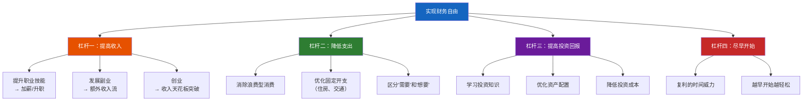
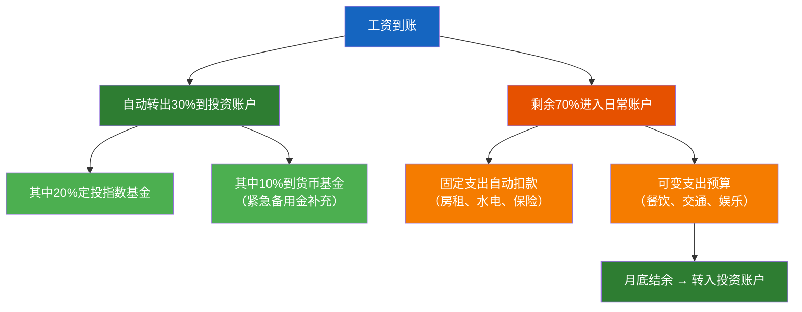
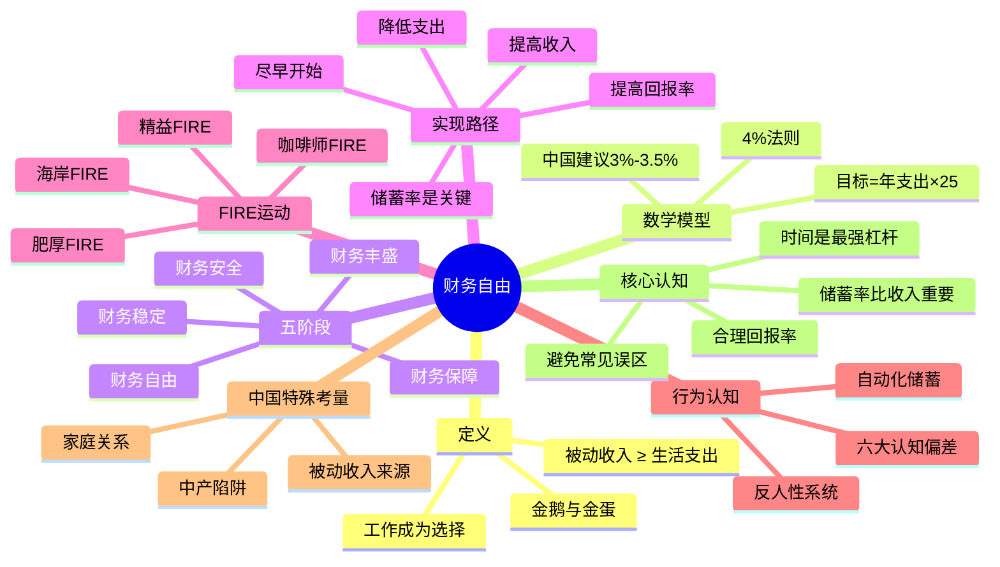

## 一、财务自由：从梦想走向现实

财务自由是个人理财领域最核心的目标概念。它不是一个遥不可及的幻想，而是一个可以用数学公式衡量、用系统方法实现的人生里程碑。本节将从概念本质出发，带你深入理解财务自由的底层逻辑、计算模型、实现路径，以及在中国语境下的实际应用策略。

### 1.1 什么是财务自由？

#### 核心定义

财务自由（Financial Independence）的本质定义是：**你的被动收入持续覆盖你的全部生活开支，工作从"必须"变为"可选"**。

这个定义中有三个关键词值得拆解：

- **被动收入**：不需要你持续投入时间和精力就能获得的收入。它与"主动收入"（工资、劳务报酬）形成对立。被动收入的来源包括：投资收益（股息、利息、基金分红）、不动产租金、知识产权版税、自动化经营的商业利润等。
- **持续覆盖**：不是某一个月被动收入够了就算自由，而是需要一个稳定、可预期的长期现金流。一次性的投资获利不算，因为它不可持续。
- **全部生活开支**：不仅仅是"活着"的最低成本，而是你当前实际的生活水准——包括住房、饮食、交通、教育、医疗、娱乐、社交等所有开销。

需要特别强调的是，财务自由**不等于不工作**。它意味着你拥有了选择权——你可以继续从事自己热爱的事业，也可以花更多时间陪伴家人、追求兴趣爱好，或者投身公益。区别在于：你工作是因为想做，而不是因为必须做。

#### 金鹅寓言：理解本金与收益的关系

理解财务自由最经典的比喻来自《富爸爸穷爸爸》和《巴比伦最富有的人》：想象你养了一只"金鹅"，它每天下一个金蛋。当金蛋的数量足以满足你每天的生活需要时，你就不必再为生存而工作了。

在这个寓言中：
- **金鹅** = 你的投资本金（资产）
- **金蛋** = 被动收入（资产产生的现金流）
- **杀鹅取卵** = 消耗本金以维持生活（这是财务自由的大忌）

这个寓言揭示了一个关键原则：**永远不要消耗你的本金**。本金是你产生被动收入的"生产工具"，一旦本金减少，被动收入就会下降，形成恶性循环。

但金鹅寓言还隐藏着一个更深层的智慧：**你需要喂养你的金鹅**。很多人犯的错误是，一旦有了结余就全部花掉，从不"喂鹅"。正确的做法是：先把一部分收入喂给金鹅（储蓄和投资），然后用剩余的钱生活。这就是"先支付自己"（Pay Yourself First）原则——在花钱之前，先把储蓄和投资的钱划走。

**"先支付自己"的实操方法：**

1. 工资到账当天，自动转出固定比例（建议20%-50%）到专用投资账户
2. 剩余的钱才是你这个月可支配的金额
3. 如果月底发现不够花，调整的是消费习惯，而不是储蓄比例

这个顺序的改变看似微小，却是从"月光族"到"财富积累者"的根本性转变。大多数人是先花钱、再把剩下的存起来——但永远没有"剩下的"。

#### 财务自由与财富自由的区别

很多人将"财务自由"和"财富自由"混为一谈，但两者有本质区别：

| 维度 | 财务自由 | 财富自由 |
|------|---------|---------|
| 目标 | 被动收入覆盖生活开支 | 拥有远超生活所需的巨额财富 |
| 标准 | 因人而异（与生活水准挂钩） | 通常指千万级以上资产 |
| 可达性 | 普通人通过规划可实现 | 需要特殊机遇或长期积累 |
| 核心能力 | 储蓄+投资+规划 | 创业+资本运作+资源整合 |
| 心态 | 够用即自由 | 追求更多 |
| 社会认知 | 不需要被理解 | 往往被广泛关注 |

对于大多数普通人而言，追求的是**财务自由**——它更务实、更可衡量、更可实现。本书后续讨论的"财务自由"均指这一含义。

#### 财务自由的三层内涵

财务自由不仅仅是一个数字目标，它包含三层递进的内涵：

**第一层：物质安全层**——不再为基本生存焦虑。有房住、有饭吃、有医疗保障、有紧急备用金。这一层对应的是"马斯洛需求层次"中的安全需求。很多人一辈子都被困在这一层，不是因为收入太低，而是因为消费习惯导致永远存不下钱。

**第二层：时间自主层**——你的时间不再被金钱绑架。你可以选择工作内容、工作时间、工作地点。这一层对应的是"自我实现"的入口——你终于有时间思考"我想成为什么样的人"，而不仅仅是"我需要赚多少钱"。

**第三层：价值创造层**——金钱成为你实现更大价值的工具。你可以资助公益、投资创新、培养下一代、留下精神遗产。这一层对应的是"超越自我"——你的财务自由开始惠及他人。

理解这三层内涵很重要，因为它帮助你在追求财务自由的过程中，不至于迷失在数字游戏中。很多人在积累了足够的资产后，反而不知道该做什么——因为他们从未思考过财务自由的"然后呢"。

### 1.2 财务自由的数学公式

财务自由不是一个模糊的概念，它可以用精确的数学模型来描述和计算。

#### 核心公式：4%法则

**财务自由数字 = 年生活支出 × 25**

这个公式的倒数就是4%法则（4% Rule）：如果你每年从投资组合中提取不超过4%用于生活开支，那么你的本金在大多数情况下可以支撑30年以上。25是4%的倒数（1 ÷ 0.04 = 25）。

4%法则由美国财务规划师威廉·本根（William Bengen）在1994年发表于《Journal of Financial Planning》的论文中首次提出。他分析了美国1926年至1992年长达67年的市场数据，涵盖了大萧条、二战、石油危机、滞胀等多个极端市场环境，测试了不同资产配置比例和提取率对投资组合存续时间的影响。

**核心研究发现：**

| 提取率 | 资产配置 | 30年存续概率 | 失败场景 |
|--------|---------|-------------|---------|
| 3% | 60%股票/40%债券 | ~100% | 几乎没有失败案例 |
| 4% | 60%股票/40%债券 | ~95% | 仅在最糟糕的起始年份（如1966年）接近耗尽 |
| 5% | 60%股票/40%债券 | ~80% | 在多个历史时点下失败 |
| 6% | 60%股票/40%债券 | ~60% | 失败概率显著 |

**具体计算示例：**

假设你的家庭年支出为24万元（月均2万元），那么：
- 财务自由数字 = 24万 × 25 = **600万元**
- 如果采用更保守的3.5%提取率：24万 ÷ 0.035 = **686万元**
- 如果采用3%提取率：24万 ÷ 0.03 = **800万元**

这三个数字之间的差异提醒我们：提取率的微小变化会显著影响目标金额。

**4%法则的直觉理解：**

为什么是4%而不是6%或2%？理解这个数字背后的逻辑比记住数字更重要：

- 投资组合的长期名义回报约为7%-8%（扣除通胀前）
- 扣除3%的通胀后，实际回报约为4%-5%
- 提取4%意味着你只花掉了实际回报部分，本金在理论上不会减少
- 留出1%的缓冲（5%-4%）用于应对市场波动和不可预见因素

这就是4%法则的本质：**只花收益，不动本金，留有余量**。

#### 4%法则的前提假设

理解一个模型的局限性与理解它的原理同样重要。4%法则建立在以下假设之上：

1. **资产配置**：投资组合由60%美国股票和40%美国债券组成
2. **通胀调整**：每年的提取金额根据通胀率上调（第一年提4%，之后按通胀率递增）
3. **时间跨度**：30年存续期（适用于65岁退休、活到95岁的场景）
4. **市场基础**：基于美国市场的历史数据——而美国是20世纪表现最好的股票市场之一
5. **定期提取**：无论市场涨跌，每年年初提取固定比例

任何一个假设不成立，4%法则的结论都可能需要修正。

#### 4%法则在中国的调整

中国市场与美国市场存在显著差异，直接套用4%法则需要谨慎：

**差异一：市场回报率不同**

| 指标 | 美国（1926-2023） | 中国A股（2005-2023） |
|------|-------------------|---------------------|
| 股票年化回报 | ~10% | ~8-9%（但波动性远高于美国） |
| 债券年化回报 | ~5% | ~3-4% |
| 通胀率 | ~3% | ~2.5% |

**差异二：投资工具受限**
- 中国缺乏美国那样成熟的REITs市场（公募REITs刚起步，标的有限）
- 债券市场以国债和政策性金融债为主，企业债市场不够发达
- 全球化资产配置受限（QDII额度有限，且部分时段暂停申购）
- 中国版TIPS（通胀保值债券）尚未成型

**差异三：社会结构差异**
- 中国有"养儿防老"和家庭互助的传统，但独生子女政策改变了这一结构（4-2-1家庭结构意味着两个年轻人可能需要赡养四个老人）
- 社会保障体系仍在完善中，医疗和养老的不确定性更大
- 教育支出（尤其是子女教育）在中国家庭预算中占比远高于美国
- 住房压力：一线城市房价收入比高达30-50倍，房贷占收入比例远高于美国
- 中国特有的"三座大座"：住房、教育、医疗，构成刚性支出的主要来源

**差异四：文化心理差异**
- 美国人接受"租房一辈子"的概念，中国人普遍认为"有房才有安全感"
- 中国家庭的代际财务绑定更深——子女买房需要父母资助、父母养老需要子女承担
- "面子消费"在中国社会文化中占据重要位置，社交开支往往高于个人意愿
- 对"风险"的厌恶程度更高，更偏好"确定性"（如银行存款、国债）

**实际操作建议：**

考虑到上述差异，在中国市场应用4%法则时，建议做以下调整：

- **保守提取率**：采用3%-3.5%的提取率，对应30-33倍年支出作为财务自由目标
- **全球分散**：投资组合中包含一定比例的全球资产（通过QDII基金、港股通等渠道），建议全球资产占比20%-40%
- **安全垫**：在目标金额上额外增加20%-30%的安全边际
- **动态调整**：市场低迷年份主动降低提取比例（如降到2.5%-3%），市场高涨年份适当多提取（如4%-4.5%），但不要超过5%
- **房产单独计算**：自住房产不计入投资组合，投资性房产的租金收入单独核算，不与金融资产混在一起
- **家庭互助准备金**：为父母医疗、子女教育等中国特有的刚性支出单独建立基金

#### 4%法则的五大局限性

即使在美国市场，4%法则也并非完美。理解这些局限性，才能更审慎地使用它：

**局限一：序列风险（Sequence of Returns Risk）**

这是4%法则最大的盲点。假设两个人拥有同样的投资组合（500万元）和同样的长期年化回报率（8%），但回报的顺序不同：

| 年份 | 投资者A（先涨后跌） | 投资者B（先跌后涨） |
|------|-------------------|-------------------|
| 第1年 | +25% | -25% |
| 第2年 | +25% | -15% |
| 第3年 | -15% | +10% |
| 第4年 | -25% | +25% |
| 第5年 | +10% | +25% |

投资者B在前两年遭受巨额亏损的同时还在提取生活费，本金缩水速度远快于A。即使长期平均回报相同，B的组合可能在第20年就耗尽，而A的组合可以支撑30年以上。

**为什么序列风险如此危险？** 因为它违背了我们的直觉——大多数人认为"长期平均回报相同，结果就应该相同"。但数学事实是：在持续提取的条件下，回报的顺序比平均回报更重要。下跌50%后需要上涨100%才能回本，而你在这段时间里还在花钱。

**应对策略**：
1. 保留2-3年的现金等价物（货币基金、短期国债），在市场大跌时用现金而非卖出投资来覆盖生活开支
2. 采用"动态提取策略"——市场下跌超过20%的年份，降低提取比例到3%甚至更低
3. 在退休初期（前5年）特别保守，因为这段时间的序列风险影响最大

**局限二：通胀不确定性**

4%法则假设通胀率与历史平均水平一致。但如果出现类似20世纪70年代的高通胀时期（美国年通胀率一度超过13%），实际购买力的下降速度会远超预期。

在中国，虽然近年来CPI相对温和（2%-3%），但以下因素可能导致实际通胀高于CPI：
- 教育费用年均增长8%-12%（远超CPI）
- 医疗费用年均增长6%-10%
- 核心城市住房成本持续上升
- 服务类消费价格涨幅高于商品类

**应对策略**：
1. 在投资组合中配置抗通胀资产——大宗商品ETF、黄金ETF、通胀保值债券
2. 将财务自由目标中的"年支出"按每年5%的增长率（而非CPI）来计算
3. 保持投资组合中有一定比例的股票（股票长期来看是最佳的通胀对冲工具）

**局限三：寿命延长风险**

4%法则基于30年存续期。但随着医疗技术进步，一个60岁退休的人完全有可能活到95岁甚至100岁。35年甚至40年的退休期意味着更大的资金需求。

中国人的预期寿命已从1990年的69岁增长到2023年的78.6岁，且仍在持续上升。如果你在50岁实现财务自由，你需要准备40-50年的生活费。

**应对策略**：
1. 将目标从"年支出×25"提升到"年支出×30"甚至更高
2. 考虑购买终身年金保险（如果性价比合理）作为基础保障层
3. 在退休初期保持一定的兼职收入或咨询收入，减轻投资组合的压力
4. 建立"分阶段退休"思维：50-65岁可以适当工作，65-75岁半退休，75岁以后完全退休

**局限四：医疗费用的非线性增长**

退休后的医疗支出通常呈现"先低后高"的特征——60-75岁相对健康，75岁以后医疗开支急剧增加。4%法则的均匀提取模型无法很好地适应这种非线性需求。

在中国，这个挑战更加严峻：
- 大病自费部分可能高达数十万元
- 优质医疗资源集中在大城市，异地就医成本高
- 长期护理（如失能老人护理）费用每月可达8000-20000元
- 医保报销存在上限和目录限制

**应对策略**：
1. 单独建立医疗基金（建议50-100万元），与日常投资组合分开管理
2. 配置充足的医疗保险：百万医疗险（解决大额医疗费）+ 重疾险（解决收入损失）+ 长期护理险（解决失能护理）
3. 在75岁之前，医疗基金保持较高比例的股票配置以追求增长；75岁之后逐步转向保守
4. 提前规划养老方式（居家养老、社区养老、机构养老），并为每种方式估算费用

**局限五：税收影响**

4%法则的原始研究未考虑税收。在中国，虽然个人投资收益的税收政策与美国不同，但未来政策变化是不确定的。

目前中国的相关税收政策：
- A股股息红利：持股超过1年免征个人所得税；持股1个月以内全额征税（20%）
- 基金分红：暂免个人所得税
- 基金资本利得：暂免个人所得税（但未来可能开征）
- 房产租金收入：按财产租赁所得征收20%个人所得税（实际征管不严）
- 利息收入：国债利息免税，其他利息按20%征税

**应对策略**：
1. 在计算财务自由目标时，将税后实际可支配金额作为支出基数
2. 优先使用税收优惠工具（如个人养老金账户，每年12000元可抵扣个税）
3. 合理安排资产持有期限（如A股持股超过1年免红利税）
4. 建立"税收效率"意识——同样的投资回报，选择税收更友好的实现方式

#### 4%法则的进阶替代方案

除了标准的4%法则，还有几种更精细的提取策略值得了解：

**固定比例提取法**
- 每年提取投资组合当前市值的固定比例（如4%）
- 优点：永远不会耗尽本金（因为提取金额随市值下降而减少）
- 缺点：收入不稳定，市场大跌时收入骤降
- 适合：有其他收入来源补充的半退休人士

**动态提取法（Guyton-Klinger规则）**
- 设定基础提取率（如5%），但在市场表现特别好或特别差时调整
- 如果上一年投资回报超过18%，当次提取金额增加10%
- 如果累计通胀超过基线24%，当次提取金额增加10%
- 如果投资组合价值低于初始值的80%（扣除通胀），当次提取金额减少10%
- 优点：更灵活，历史回测存续率更高
- 缺点：规则较复杂，需要持续监控

**桶策略（Bucket Strategy）**
- 将投资组合分成三个"桶"：
  - 桶1（1-3年开支）：现金和货币基金，提供短期流动性
  - 桶2（3-10年开支）：债券和低风险投资，提供中期稳定回报
  - 桶3（10年以上开支）：股票和增长型投资，提供长期增长
- 每年从桶1提取生活费，桶3的收益定期补充桶1
- 优点：心理上更容易度过市场大跌（桶1里的钱不受股市影响）
- 缺点：管理较复杂，需要定期再平衡

### 1.3 财务自由的五个阶段

财务自由不是一个非此即彼的状态，而是一个可以分解、可以量化的渐进过程。将它划分为五个阶段，有助于你准确定位自己的当前位置，设定合理的阶段性目标。

#### 阶段一：财务保障（Financial Security）

**定义**：拥有3-6个月的紧急备用金，能够应对突发状况而不陷入经济困境。

**核心指标**：
- 紧急备用金 = 3-6个月 × 月均必要支出
- 无逾期债务
- 基本的保险覆盖（至少有医保）

**达成路径**：
1. 计算你的月均必要支出（房租/房贷、水电、交通、饮食、通讯）
2. 在活期存款或货币基金中存满3个月的必要支出金额
3. 如果工作不稳定（如自由职业、合同工），目标提升到6个月

**典型时间**：大多数人可在3-12个月内达成。这是最容易实现的阶段，也是最重要的——它是你所有后续规划的安全网。

**为什么这是第一步？** 没有紧急备用金的人，一旦遇到突发情况（失业、疾病、意外），就不得不借高利贷或变卖投资资产，不仅前功尽弃，还可能陷入债务螺旋。

**紧急备用金的存放原则**：
- 流动性第一：随时可取，不受市场波动影响
- 推荐工具：银行活期存款（用于1个月内可能用到的部分）、货币基金（如余额宝、零钱通，用于1-3个月的部分）、短期国债或大额存单（用于3-6个月的部分）
- 不要追求收益：紧急备用金的目的是"安全"和"随时可用"，不是"赚钱"。放在货币基金年化2%-3%就足够了

#### 阶段二：财务稳定（Financial Stability）

**定义**：消除所有高息负债，建立稳定的储蓄习惯，每月有固定的储蓄流入投资账户。

**核心指标**：
- 零高息负债（信用卡分期、消费贷、网贷已全部清偿）
- 信用卡按时全额还款（不使用最低还款）
- 月储蓄率 ≥ 20%
- 开始进行定期定额投资（定投）

**达成路径**：
1. **债务清零**：列出所有负债，按利率从高到低排序，优先偿还利率最高的债务（"雪崩法"）
2. **预算系统**：建立月度预算，使用记账APP（如随手记、MoneyWiz、YNAB）追踪每一笔支出
3. **自动化储蓄**：设置工资到账日自动转出20%-30%到投资账户

**典型时间**：6-24个月，取决于负债金额和收入水平。

**关键突破点**：从"月光"到"有结余"是心态的根本转变。这个阶段需要的是纪律——不是赚更多钱，而是花更少钱、存更多钱。

**债务清零的两种策略对比**：

| 策略 | 雪崩法（Avalanche） | 雪球法（Snowball） |
|------|-------------------|-------------------|
| 原理 | 优先还利率最高的债务 | 优先还金额最小的债务 |
| 优点 | 总利息支出最少（数学最优） | 快速获得成就感，心理激励强 |
| 缺点 | 可能长期看不到明显进展 | 总利息支出略多 |
| 适合 | 理性、自律的人 | 需要正反馈激励的人 |

**推荐做法**：如果自律能力一般，先用雪球法还掉2-3笔小债务建立信心，然后切换到雪崩法处理剩余的大额高息债务。

#### 阶段三：财务安全（Financial Safety）

**定义**：拥有足够的保险保障和投资组合，被动收入可以覆盖基本生活开支。即使失去主动收入，基本生活不受影响。

**核心指标**：
- 被动收入 ≥ 基本生活支出（不含娱乐、旅游等非必要开支）
- 保险配置齐全（重疾险、医疗险、意外险、定期寿险）
- 投资组合金额 = 基本年支出 ÷ 3%（保守提取率）

**达成路径**：
1. **保险规划**：配置充足的保障型保险，确保大额医疗支出不会击穿投资组合
2. **投资组合搭建**：按照资产配置理论（详见第四节），建立多元化的投资组合
3. **被动收入管道**：逐步建立至少2-3个被动收入来源

**典型时间**：5-15年，取决于储蓄率和投资回报率。

**实际案例**：假设基本月支出为8000元，年支出为9.6万元。按3%提取率，你需要积累320万元的投资资产。如果每月定投1.2万元，年化回报8%，大约需要14年。

**为什么保险是财务安全的前提？** 试想一个场景：你辛苦积累了200万元的投资组合，突然被诊断出重大疾病，需要50万元治疗费。如果没有保险，你就得从投资组合中取出50万——不仅损失了这50万未来产生的被动收入（每年约3-4万），还可能因为急需用钱而在市场低点卖出投资。一份每年几千元的重疾险+百万医疗险，就能避免这种灾难性损失。

#### 阶段四：财务自由（Financial Independence）

**定义**：被动收入可以覆盖当前的全部生活开支（包含所有消费，不仅是基本需求），工作完全成为选择。

**核心指标**：
- 被动收入 ≥ 全部生活支出
- 投资组合金额 = 当前年支出 ÷ 3%
- 多元化收入来源已建立

**典型时间**：10-25年。

**与阶段三的区别**：阶段三是"活下来"，阶段四是"活得好"。阶段三覆盖的是基本生活，阶段四覆盖的是你当前的实际生活水准。

**达到阶段四后的常见状态**：
- 继续工作但不再焦虑——因为你知道随时可以停下来
- 开始思考工作的意义而非报酬
- 有更多时间陪伴家人、追求兴趣
- 可以拒绝自己不认同的工作要求
- 消费决策更加理性——因为不需要用消费来"补偿"工作压力

#### 阶段五：财务丰盛（Financial Abundance）

**定义**：被动收入远超生活开支，有余力实现更大的人生目标——资助子女教育、回馈社会、追求更高层次的人生意义。

**核心指标**：
- 被动收入 ≥ 2倍以上生活支出
- 投资组合金额 = 当前年支出 ÷ 1.5%（或更高）

**典型时间**：15-30年。

**心态转变**：到达这个阶段，金钱不再是焦虑的来源，而是实现更大价值的工具。你开始思考"如何用钱做有意义的事"，而不是"如何赚更多的钱"。

**财务丰盛的人生选择**：
- 建立家庭信托或教育基金，确保子女接受优质教育
- 投资社会企业或公益项目
- 支持家人追求他们的梦想（如创业、留学）
- 设立奖学金、捐赠图书馆等社会回馈
- 培养下一代的财商和价值观

#### 自我评估清单：你处于哪个阶段？

在继续阅读之前，请花5分钟诚实回答以下问题，确定你当前所处的阶段：

| 问题 | 是 | 否 |
|------|-----|-----|
| 1. 你是否有3-6个月的紧急备用金？ | +1 | +0 |
| 2. 你是否没有任何高息负债（年利率>6%）？ | +1 | +0 |
| 3. 你是否有记账习惯并能控制月支出？ | +1 | +0 |
| 4. 你的月储蓄率是否达到20%以上？ | +1 | +0 |
| 5. 你是否配置了基本的保障型保险？ | +1 | +0 |
| 6. 你是否有正在运转的投资组合（基金/股票/债券等）？ | +1 | +0 |
| 7. 你的被动收入是否能覆盖基本生活开支？ | +1 | +0 |
| 8. 你的被动收入是否能覆盖全部生活开支？ | +1 | +0 |
| 9. 你的被动收入是否超过生活开支的2倍？ | +1 | +0 |

**评分解读**：
- 0-2分：处于阶段一（财务保障）或之前——你当前的核心任务是建立紧急备用金和消除高息负债
- 3-4分：处于阶段二（财务稳定）——你已经有了良好的基础，接下来重点是提高储蓄率和开始投资
- 5-6分：处于阶段三（财务安全）——你正在正确的轨道上，接下来重点是优化资产配置和扩大被动收入来源
- 7-8分：处于阶段四（财务自由）——恭喜你，你已经实现了大多数人梦寐以求的目标
- 9分：处于阶段五（财务丰盛）——你已经超越了个人财务的范畴，可以思考如何让财富创造更大的社会价值

### 1.4 财务自由的实现路径

理解了"什么是"和"多少"之后，接下来要回答"怎么做"。实现财务自由的路径可以用一个核心公式来描述：

**财务自由达成时间 = f(储蓄率, 投资回报率, 起始资产)**

这个公式告诉我们，影响财务自由速度的有四个核心杠杆。

#### 四大核心杠杆

**杠杆一：提高收入**

提高收入是扩大储蓄缺口最直接的方式。路径包括：

- **职业技能精进**：在本职领域成为专家，获得更高的薪资。数据显示，在同一行业深耕5年以上的人，薪资通常是入门时的2-3倍。具体策略：每年投入收入的3%-5%用于自我提升（课程、认证、行业会议）；主动承担高价值项目；建立行业人脉网络。
- **副业收入**：利用专业技能或兴趣爱好发展副业（写作、教学、咨询、电商等）。关键原则是：副业应该能产生"睡后收入"（如课程、电子书、自动化电商），而非仅仅出售更多时间。一个好的副业测试标准是：你停止投入时间后，收入是否还能持续3个月以上？
- **收入结构转型**：从纯劳动收入逐步过渡到"劳动+资本"的混合收入结构。理想状态是：劳动收入占比逐年下降，资本收入占比逐年上升。当资本收入超过劳动收入时，你就已经接近财务自由了。

**杠杆二：降低支出**

在收入不变的情况下，降低支出等同于提高收入，而且更可控。但降支出有上限——你不可能把支出降到零。

**关键原则**：削减的是"浪费"，不是"生活质量"。以下是有巨大削减空间的领域：

- **住房**：住房支出占收入30%以上是最大的财务负担。考虑合租、搬到次优地段、或选择小户型。在中国一线城市，一个人住两居室每月多花2000-3000元——这笔钱如果用于投资，20年后价值超过100万元。
- **交通**：一辆15万元的车，5年持有成本（折旧+保险+油费+保养+停车）约为25-30万元，相当于每月4000-5000元。如果改用公共交通+偶尔打车，每月交通支出可降到1000-1500元。
- **餐饮**：外卖和外出就餐的费用通常是自炊的3-5倍。一个月薪1万的人，如果每天外卖改为自炊为主，每月可节省1500-2500元。
- **订阅服务**：大多数人有3-5个长期不用的付费订阅（视频会员、云存储、APP会员等），合计每月200-500元。
- **冲动消费**：设置"48小时冷静期"——任何超过500元的非必需消费，等待48小时再决定是否购买。统计显示，70%以上的冲动消费在48小时后会被放弃。

**"三问消费法"**：在每一笔大额消费前问自己三个问题：
1. 我是"需要"还是"想要"？（需要 = 不买会影响正常生活；想要 = 不买只是少了一些便利或快感）
2. 这笔钱如果用于投资，10年后值多少？（帮助你建立"机会成本"意识）
3. 如果这东西只能我一个人享受、不能发朋友圈，我还会买吗？（帮助你识别"面子消费"）

**杠杆三：提高投资回报率**

投资回报率的微小差异，在复利作用下会带来巨大的终值差异：

| 每月定投1万 | 年化5% | 年化8% | 年化10% |
|------------|--------|--------|---------|
| 10年后 | 155万 | 183万 | 205万 |
| 20年后 | 407万 | 589万 | 759万 |
| 30年后 | 832万 | 1490万 | 2260万 |

提高投资回报率的核心方法是：学习投资知识、优化资产配置、控制投资成本（管理费、交易费、税费）。具体内容将在本章后续小节详述。

**杠杆四：尽早开始（时间杠杆）**

时间是最强大也最不可逆的杠杆。下面这个例子清楚地展示了复利的时间威力：

| 起始年龄 | 每月定投 | 年化回报 | 60岁时资产 |
|---------|---------|---------|-----------|
| 25岁 | 3000元 | 8% | 约770万 |
| 30岁 | 3000元 | 8% | 约500万 |
| 35岁 | 3000元 | 8% | 约315万 |
| 40岁 | 3000元 | 8% | 约195万 |

每晚开始5年，最终资产减少约30%-40%。这就是为什么说"最好的投资时间是十年前，其次是现在"。

#### 复利的时间威力：深入理解

复利被称为"世界第八大奇迹"（据传是爱因斯坦说的，但无法考证），但大多数人低估了它的力量。让我们用更直观的方式来理解：

**72法则**：用72除以年化回报率，就是资产翻倍所需的年数。
- 年化6%：72 ÷ 6 = 12年翻倍
- 年化8%：72 ÷ 8 = 9年翻倍
- 年化10%：72 ÷ 10 = 7.2年翻倍
- 年化12%：72 ÷ 12 = 6年翻倍

**复利的三个阶段**：

大多数人放弃投资，是因为他们只经历了"种子期"的缓慢增长，就误以为投资没什么用。事实上，一个每月定投5000元、年化8%的投资组合：
- 第5年：约37万（本金投入30万，收益7万）
- 第10年：约91万（本金投入60万，收益31万）
- 第20年：约294万（本金投入120万，收益174万）
- 第30年：约745万（本金投入180万，收益565万）

注意第30年的数据：你投入的本金只有180万，但收益是565万——收益是本金的3倍多。这就是复利后期"指数增长"的威力。**你的耐心，就是你最大的投资优势。**

#### 储蓄率的决定性作用

在所有变量中，**储蓄率**是影响财务自由速度最核心的因素。财务自由研究者Mr. Money Mustache做过一个著名的分析：

| 储蓄率 | 财务自由所需年数 |
|--------|----------------|
| 10% | 51年 |
| 20% | 37年 |
| 30% | 28年 |
| 40% | 22年 |
| 50% | 17年 |
| 60% | 12.5年 |
| 70% | 8.5年 |
| 80% | 5.5年 |

> 注：假设起始资产为0，投资年化回报5%（扣除通胀后），提取率4%。

储蓄率从10%提升到50%，财务自由时间从51年缩短到17年——差距高达34年。这就是为什么高储蓄率比高收入更重要。

**储蓄率的两个倍增效应**：

储蓄率之所以如此重要，是因为它同时影响了财务自由公式中的两个变量：

1. **提高储蓄率 = 增加投资本金流入**——你能存更多钱，投资组合增长更快
2. **提高储蓄率 = 降低生活支出**——你的财务自由目标更低（因为目标 = 年支出 × 25）

举个例子：
- 月入2万，月支出1.5万，月储蓄5000，储蓄率25%。财务自由目标 = 18万 × 25 = 450万
- 月入2万，月支出1万，月储蓄1万，储蓄率50%。财务自由目标 = 12万 × 25 = 300万

同样的收入，储蓄率从25%提升到50%：目标降低了150万（从450万到300万），同时每月投入增加了5000元。一升一降，财务自由时间大幅缩短。

#### 不同收入水平的财务自由路径

| 月收入 | 月支出 | 月储蓄 | 储蓄率 | 财务自由目标（年支出×25） | 达成时间（年化8%） |
|--------|--------|--------|--------|--------------------------|-------------------|
| 8000元 | 5000元 | 3000元 | 37.5% | 150万 | 约18年 |
| 15000元 | 8000元 | 7000元 | 46.7% | 240万 | 约15年 |
| 25000元 | 12000元 | 13000元 | 52% | 360万 | 约13年 |
| 40000元 | 18000元 | 22000元 | 55% | 540万 | 约12年 |

> 注：以上为简化的理想模型，未考虑收入增长、通胀、大额支出（如购房、子女教育）等因素。实际路径会更复杂，但方向是明确的——储蓄率越高，达成时间越短。

### 1.5 FIRE运动：财务自由的实践浪潮

FIRE（Financial Independence, Retire Early）运动起源于1992年维基·罗宾（Vicki Robin）和乔·多明格斯（Joe Dominguez）合著的《Your Money or Your Life》，后经网络社区（尤其是Reddit的r/financialindependence板块）发展壮大，成为全球性的财务自由实践运动。

#### FIRE的四种变体

FIRE并非只有一种形态，不同人可以根据自己的价值观和生活偏好选择不同的路径：

**精益FIRE（Lean FIRE）**
- 定义：通过极简生活方式将年支出控制在极低水平
- 年支出标准：通常在10万元以下（单身）或15万元以下（家庭）
- 财务自由目标：250万-375万
- 适合人群：崇尚极简主义、物欲较低、享受简单生活的人
- 风险点：抗风险能力较弱，大额意外支出可能打破平衡
- 中国实践建议：考虑到医疗和教育的不确定性，中国的精益FIRE目标建议上浮30%-50%

**肥厚FIRE（Fat FIRE）**
- 定义：保持较高的生活水准，追求更高的财务自由数字
- 年支出标准：通常在50万元以上
- 财务自由目标：1250万元以上
- 适合人群：高收入者、不愿降低生活品质的人
- 优势：生活弹性大，抗风险能力强
- 中国实践建议：在一线城市可能需要2000万以上才能实现

**咖啡师FIRE（Barista FIRE）**
- 定义：实现部分财务自由后，从事轻松的兼职工作以补充收入和获取社保
- 核心逻辑：投资组合承担大部分生活支出，兼职收入填补缺口
- 适合人群：不喜欢全职工作强度但也不想完全不工作的人
- 典型场景：投资组合覆盖70%-80%的支出，兼职收入覆盖剩余部分
- 中国实践建议：兼职工作最好能缴纳社保（五险），这在中国的医疗和养老体系中非常重要

**海岸FIRE（Coast FIRE）**
- 定义：投资本金已经足够大，即使不再追加投入，仅靠复利就能在退休年龄达到目标
- 核心逻辑：前半段拼命积累本金，后半段只需赚够日常开支即可
- 计算公式：当前资产 × (1 + 年化回报率)^距退休年数 ≥ 财务自由目标
- 适合人群：年轻时高强度工作、希望中年后大幅降低工作强度的人
- 计算示例：你35岁，已有100万投资资产，希望60岁达到600万目标。100万 × (1.08)^25 = 100万 × 6.85 = 685万——你已经实现海岸FIRE！从现在起只需要赚够日常开支即可

#### FIRE在中国的本土化实践

FIRE运动在中国有其独特的挑战和机遇。以下是几位中国FIRE实践者的公开分享（已做脱敏处理）：

**案例一：小城市精益FIRE**
- 背景：35岁，三线城市，已婚无孩
- 年支出：8万元（房贷已还清，月均6700元）
- 投资资产：280万元（主要为指数基金+货币基金）
- 提取率：8万 ÷ 280万 = 2.9%
- 生活方式：自炊为主，二手物品，社区图书馆，免费公园运动
- 心得："FIRE不是不花钱，而是只花在真正重要的事情上。"

**案例二：一线城市咖啡师FIRE**
- 背景：42岁，上海，已婚一孩
- 投资资产：500万元
- 当前年支出：25万元
- 策略：辞去互联网公司高强度工作，转为自由职业技术顾问
- 顾问年收入：10-15万元（工作时间约为全职的40%）
- 组合年提取：10-15万元
- 心得："最珍贵的不是不工作，而是有选择地工作。我可以拒绝我不认同的项目，也可以在孩子放假时陪他旅行两周。"

**案例三：数字游民FIRE**
- 背景：30岁，单身，远程工作者
- 投资资产：150万元
- 策略：住在生活成本低的东南亚城市（月支出6000-8000元），远程做软件开发
- 年支出：约10万元
- 提取率（如果完全不工作）：10万 ÷ 150万 = 6.7%（尚未达标）
- 现状：远程工作年收入20万，储蓄率50%以上，预计5年内达到完全FIRE
- 心得："地理套利是FIRE的加速器。同样的钱，在清迈的生活质量是上海的三倍。"

**中国FIRE的独特挑战：**
1. **医疗不确定性**：虽然有医保，但重大疾病的自费部分仍然可观。没有美国那样的COBRA（延续前雇主保险）机制
2. **社保断缴**：FIRE后如果不再缴纳社保，医保和养老金都会受影响。建议以灵活就业身份继续缴纳
3. **家庭期望压力**：中国社会普遍期望"有正经工作"，提前退休可能面临家人的不理解和质疑
4. **房产因素**：很多中国家庭的最大资产是房产，流动性差，不能产生稳定的现金流（除非出租）
5. **通货膨胀预期**：中国过去20年的通胀速度高于官方CPI（教育、医疗、住房等领域的实际涨幅远超CPI）

**中国FIRE的独特机遇：**
1. **生活成本弹性大**：从一线城市搬到二三线城市，生活成本可降低50%-70%
2. **互联网基础设施完善**：远程工作、在线创业、数字游民的条件成熟
3. **社保体系的基本保障**：医保覆盖广，基础医疗有保障
4. **丰富的低成本生活选择**：社区团购、拼多多、自炊文化等让低成本生活更容易实现

#### FIRE的核心启示

FIRE运动最深刻的启示不是"如何提前退休"，而是它揭示了一个反直觉的真相：

**财务自由不是高收入者的专利，而是高储蓄率者的选择。**

一个月薪1万但储蓄率50%的人，比月薪3万但储蓄率10%的人更快实现财务自由。前者每月存5000元，年存6万；后者每月存3000元，年存3.6万。前者不仅存得更多，而且因为生活支出更低（5000元 vs 27000元），财务自由目标也更低（150万 vs 810万）。

这个对比告诉我们：**降低欲望比增加收入更可控、更快速地缩短财务自由的距离**。

### 1.6 行为金融学：为什么知道和做到之间有鸿沟

理论上，大多数人都知道应该"少花钱、多储蓄、早投资"。但实际上，绝大多数人做不到。原因不在于知识不足，而在于人类大脑的认知偏差。理解这些偏差，是跨越"知道"和"做到"之间鸿沟的关键。

#### 六大致命认知偏差

**偏差一：即时满足偏好（Present Bias）**

人类天生偏好即时的满足感，而低估未来的收益。一块蛋糕现在就吃 vs. 一个月后拥有更健康的身体——大多数人选择前者。这就是为什么"消费"总比"储蓄"更有吸引力。

**实操对策**：
- 自动化储蓄：在你"看到"工资之前，先把投资的钱划走。看不到的钱就不会花
- 设置可视化里程碑：每攒够10万就标记一下，让抽象的数字变成具象的成就
- 用"未来的自己"做决策：想象60岁的自己会给现在的你什么建议

**偏差二：损失厌恶（Loss Aversion）**

人们对损失的痛苦感受是同等金额收益快感的2-2.5倍。这意味着：亏1万块的痛苦，需要赚2万块才能抵消。这导致两个问题：
- 太害怕亏损而不敢投资，把钱存在银行被通胀侵蚀
- 在投资中急于卖出盈利的股票（怕利润消失），却死扛亏损的股票（不愿承认损失）

**实操对策**：
- 理解"不投资也是一种风险"——银行存款30年的实际购买力可能缩水50%以上
- 使用定投策略，忽略短期波动
- 设置自动再平衡机制，用规则代替情绪

**偏差三：锚定效应（Anchoring）**

人们会过度依赖第一个接触到的信息。例如：
- 看到一双鞋原价2000元、打折800元，觉得"太划算了"——但它可能只值400元
- 股票从100元跌到50元，觉得"便宜了"——但它可能本来就不值100元
- 同事年薪50万，觉得自己30万"太低了"——但这个比较本身可能是不理性的

**实操对策**：
- 在做任何财务决策前，先问自己"如果没有锚定信息，我还会做同样的决定吗？"
- 评估投资时看基本面（PE、PB、股息率），而不是看它"比高点跌了多少"
- 建立自己的"财务标准"，而非参照别人的消费水平

**偏差四：从众效应（Herd Mentality）**

"大家都在买房"、"大家都在买基金"、"这个理财产品同事都买了"——从众心理让人放弃独立思考，在市场高点跟风买入，在市场低点恐慌卖出。

**实操对策**：
- 建立自己的投资策略并写下来，在情绪波动时回顾
- 记住巴菲特的名言："别人贪婪时恐惧，别人恐惧时贪婪"——但更重要的是，你要有在别人恐惧时仍然坚持的底气（这来自于你的紧急备用金和长期规划）
- 远离投资噪音：不看每天的市场涨跌，不加入投资群聊

**偏差五：心理账户（Mental Accounting）**

人们会把钱分成不同的"心理账户"——工资要省着花，奖金可以随便花；现金要存着，信用卡可以刷。但从数学角度看，钱就是钱，无论来源如何。

**实操对策**：
- 将所有收入视为同一个"池子"
- 奖金、退税、意外之财，直接转入投资账户
- 信用卡只用于便利（积分、免息期），不用于透支消费

**偏差六：过度自信（Overconfidence）**

"我比一般人更懂投资"——这是最常见的自我欺骗。研究表明，74%的基金经理认为自己的业绩高于平均水平，但实际只有不到50%的人做到。

**实操对策**：
- 记录每一笔投资决策和理由，定期回顾——你会发现自己的判断远没有想象中准确
- 使用"事前验尸法"：在做重大财务决策前，假设这个决策已经失败了，然后倒推可能的失败原因
- 承认自己的无知，选择被动投资（指数基金）而非主动择时

#### 建立"反人性"的财务系统

既然人性靠不住，就要用系统来约束人性。以下是经过验证的"反人性"财务系统：

**系统的核心原则**：
1. **自动化**：所有储蓄和投资都设为自动转账，不依赖意志力
2. **不可见性**：投资账户不绑定任何支付工具，取出需要额外步骤
3. **约束性**：信用卡额度设置为月收入的30%，避免过度消费
4. **反馈性**：每月月底查看一次投资账户余额（不是每天），感受复利增长

### 1.7 中国语境下的特殊考量

在中国追求财务自由，有一些独特的社会文化因素需要纳入考量。

#### 中产陷阱

中国城市中产阶级面临一个独特的"收入-支出膨胀螺旋"：随着收入增加，生活水准同步升级——换更好的房子、买更好的车、孩子上更好的学校、更频繁的旅行——最终储蓄率并没有显著提高。

**中产陷阱的典型路径**：
1. 月薪1万时，月支出8000，储蓄率20%
2. 月薪涨到2万，搬进更好的小区，月支出1.5万，储蓄率25%
3. 月薪涨到3万，买了车，孩子上私立学校，月支出2.5万，储蓄率17%
4. 月薪涨到5万，换了学区房，房贷+教育+车贷，月支出4.5万，储蓄率10%

注意：收入涨了5倍，但储蓄率反而降低了。这就是中产陷阱——**收入增长被消费升级完全吞噬**。

**跳出中产陷阱的方法**：
1. **设定储蓄率红线**：无论收入多少，储蓄率不低于30%。收入增加时，先提高储蓄金额，再提高消费
2. **延迟消费升级**：加薪后等6个月再考虑升级生活方式，让新增收入先流入投资
3. **定义"足够"**：为每个消费类别设定上限，超过上限的部分自动转入投资
4. **警惕"生活方式通胀"**：定期审视你的支出，问自己"如果收入不变，我还会买这些吗？"

#### 财务自由与家庭关系

在中国的财务自由之路上，家庭关系是一个不可回避的因素：

**伴侣之间的财务协调**
- 财务自由需要伴侣双方的共识。如果一方追求极简储蓄，另一方崇尚高消费，矛盾不可避免
- 建议做法：共同制定家庭财务目标、建立"个人自由支配金"制度（每人每月固定金额可自由花费，不需解释）、定期（每季度）进行家庭财务回顾
- 核心原则：财务自由是共同目标，但实现路径允许差异

**代际财务责任**
- 中国传统文化要求子女赡养父母，这是一笔不可回避的支出
- 独生子女一代面临"4-2-1"结构：一对夫妻赡养四个老人、抚养一个孩子
- 建议做法：在财务自由目标中预留"父母赡养基金"（每年3-5万元/人），并购买补充商业医疗保险为父母
- 同时也要注意：不要因为孝道而完全牺牲自己的财务安全——"先戴好自己的氧气面罩，再帮助他人"

**子女教育投资的理性思考**
- 中国家庭在子女教育上的投入往往是最大的"非理性支出"来源
- 国际学校、留学、各种培训班的总费用可能高达数百万元
- 建议做法：区分"必要的教育投入"和"焦虑驱动的教育消费"，为子女教育单独建立基金，设定合理上限

#### 中国特色的被动收入来源

在中国，以下被动收入来源具有独特优势：

1. **A股股息投资**：部分银行股、电力股的股息率可达5%-7%，远高于美国同类股票
2. **国债和银行理财**：3年期国债利率约2.5%-3%，5年期大额存单约2.5%，虽然不高但非常稳定
3. **公募REITs**：中国公募REITs市场自2021年启动，目前已有30+只产品，分红率约3%-8%
4. **知识付费**：中国知识付费市场规模超过600亿元，制作一门在线课程可以持续产生收入
5. **自媒体**：公众号、B站、抖音等平台的创作者收益，虽然不稳定但门槛较低
6. **租赁收入**：除房产外，车位、储物间、设备等都可以产生租金收入

### 1.8 常见误区与认知纠偏

在追求财务自由的路上，以下误区最容易让人误入歧途：

**误区一："等我赚够了再开始理财"**

真相：理财（尤其是投资）最大的优势是时间。每等一年，你就损失了一年的复利增长。即使每月只投资500元，从25岁开始和从35岁开始，到60岁时的差距可以超过100万元。

纠正：现在就开始。金额不重要，习惯才重要。

**误区二："财务自由就是不工作"**

真相：财务自由的核心是"选择的自由"。数据显示，实现财务自由后继续工作的人比例超过70%——区别在于他们工作是因为热爱，而非被迫。

纠正：将目标定义为"做自己想做的事"，而非"什么都不做"。

**误区三："高风险才有高回报"**

真相：长期投资中，风险和回报的关系并非线性的。一个年化8%-10%的多元化投资组合，风险远低于追求年化30%的投机行为。过度冒险往往导致本金永久性损失——这是复利最大的敌人。

纠正：追求合理的风险调整后回报，而非最高回报。夏普比率（Sharpe Ratio）比绝对回报率更能衡量投资质量。

**误区四："房产是最好的投资"**

真相：在中国过去20年的特殊历史时期，房产确实产生了惊人的回报。但这不意味着未来会重复。当房价收入比超过30倍（一线城市现状）、人口开始下降、城镇化率已超过65%时，房产的投资回报逻辑已经根本性改变。

纠正：房产可以是资产配置的一部分，但不应是全部。过度集中在单一资产类别本身就是最大的风险。考虑房产的真实持有成本（物业费、维修、折旧、机会成本）后，实际回报率往往低于预期。

**误区五："我需要预测市场才能赚钱"**

真相：没有任何人能持续准确预测市场走势。包括专业基金经理在内，90%以上的主动管理基金在10年以上的周期里跑输指数基金。SPIVA（S&P Indices Versus Active）的长期追踪数据持续证明了这一点。

纠正：采用被动投资策略（指数基金定投），利用时间和复利，而非试图预测市场。

**误区六："记账太麻烦，没必要"**

真相：不记账就像蒙着眼睛开车——你不知道钱去了哪里，也就无法做出改进。记账不是目的，了解自己的消费模式才是目的。

纠正：不需要一辈子记账。建议至少认真记账3-6个月，摸清自己的消费结构后，建立预算系统，后续只需要每月检查一次即可。

**误区七："我数学不好，不会投资"**

真相：财务自由需要的数学知识不超过小学六年级水平。复利计算可以用手机计算器完成，资产配置可以用现成的公式和模板。投资中最难的不是计算，而是坚持。

纠正：从最简单的定投指数基金开始，不需要任何复杂计算。每月自动扣款，持有20年以上，大概率获得可观回报。

**误区八："理财是有钱人的事"**

真相：理财的核心是管理现金流——有收入和支出就需要管理。月入5000的人和月入50000的人，面临的核心问题是一样的：如何让收入大于支出、如何让结余产生更多价值。

纠正：月入5000时养成的理财习惯，会在月入50000时产生巨大的复利效应。起步越早、金额越小，试错成本越低。

### 1.9 行动指南：从今天开始的第一步

读完这一节，你可能已经对财务自由有了全面的理解。但理解不等于行动。以下是"今天就能做的5件事"：

**第一步：计算你的财务自由数字（5分钟）**
1. 打开手机计算器
2. 计算你过去12个月的平均月支出（如果有记账习惯直接查数据，没有的话估算一下）
3. 月支出 × 12 × 25 = 你的财务自由数字
4. 写下来，贴在你看得到的地方

**第二步：检查你的紧急备用金（10分钟）**
1. 查看你的活期存款和货币基金余额
2. 除以你的月均必要支出
3. 如果不到3个月，下个月的第一件事就是开始存紧急备用金

**第三步：列出你的所有负债（15分钟）**
1. 打开每一个借贷APP，记录当前余额和年利率
2. 按利率从高到低排序
3. 制定还款计划：每月除了最低还款外，所有额外资金用于偿还利率最高的债务

**第四步：开通一个投资账户（30分钟）**
1. 选择一个主流券商APP（如华泰、东方财富、同花顺等）或第三方基金平台（如天天基金、蛋卷基金）
2. 完成开户和风险评估
3. 设置一个每月自动定投——哪怕只有500元

**第五步：阅读一本推荐书籍（持续进行）**

| 书名 | 作者 | 推荐理由 |
|------|------|---------|
| 《富爸爸穷爸爸》 | 罗伯特·清崎 | 财务自由的入门启蒙 |
| 《小狗钱钱》 | 博多·舍费尔 | 最通俗易懂的理财入门书 |
| 《你的钱或你的生活》 | 维基·罗宾 | FIRE运动的思想源头 |
| 《漫步华尔街》 | 伯顿·马尔基尔 | 理解投资市场的经典之作 |
| 《指数基金投资指南》 | 银行螺丝钉 | 中国市场实操性强的定投指南 |
| 《钱：7步创造终身收入》 | 托尼·罗宾斯 | 全面的个人财务规划框架 |

### 1.10 本节核心要点总结

**一句话总结**：财务自由 = 足够的本金 × 合理的回报率 × 足够的时间。三个变量中，你今天能改变的是前两个——开始积累本金，学习投资知识。第三个变量"时间"，从你开始行动的那一刻起就已经在为你工作了。

---

> **下一步**：理解了财务自由的全貌之后，下一节将深入探讨"复利效应"——那个让时间和金钱产生化学反应的核心机制。
