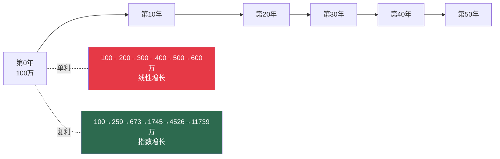
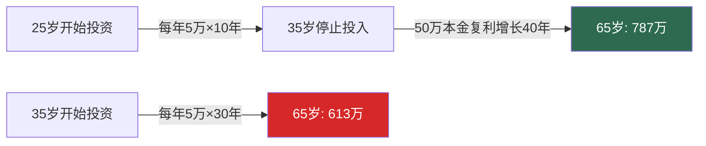
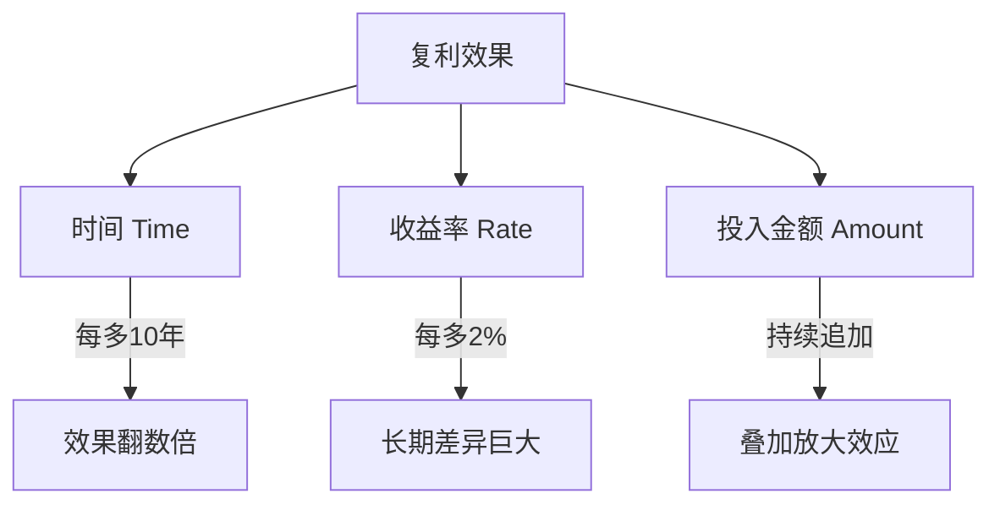

## 二、复利效应：世界第八大奇迹

### 2.1 什么是复利？

复利（Compound Interest）的本质可以用一句话概括：**利息产生利息**。当你把一笔钱存入银行或投入某个资产，第一年产生的利息如果没有取出，第二年它会和本金一起继续产生利息——这就是"利滚利"。

用数学语言表达：

**A = P × (1 + r)^n**

| 符号 | 含义 | 说明 |
|------|------|------|
| A | 最终金额（终值） | 经过 n 期后的总金额 |
| P | 初始本金（现值） | 起始投入的金额 |
| r | 每期收益率 | 必须与 n 的时间单位一致（年/月/日） |
| n | 期数 | 投资持续的时间长度 |

与复利相对的是单利（Simple Interest），其公式为：

**A = P × (1 + r × n)**

单利只在原始本金上计算利息，利息本身不再生息。这个差异在短期内看似微不足道，但时间一拉长，差距会呈指数级拉开：

| 年限 | 单利终值（100万，10%） | 复利终值 | 差额 | 复利/单利比 |
|------|----------------------|---------|------|------------|
| 5年 | 150万 | 161万 | 11万 | 1.07倍 |
| 10年 | 200万 | 259万 | 59万 | 1.30倍 |
| 20年 | 300万 | 673万 | 373万 | 2.24倍 |
| 30年 | 400万 | 1,745万 | 1,345万 | 4.36倍 |
| 50年 | 600万 | 11,739万 | 11,139万 | 19.57倍 |

> **关键洞察**：前10年复利只比单利多59万（多30%），但到第50年复利是单利的近20倍。复利的威力不在于前几年的领先，而在于**后期的爆发式增长**——数学上叫做指数函数的"曲棍球杆效应"。

#### 复利增长的视觉化：指数曲线

下图直观展示了复利与单利的增长路径差异：



为什么指数增长如此违反直觉？因为人类大脑是线性思考的机器。线性增长是"加法"（每年加10万），指数增长是"乘法"（每年乘以1.1）。乘法在后期会碾压加法，但我们的直觉系统很难"感受"到这一点。理解这条曲线，是理解整个投资理财的起点。

#### 复利频率：实际中利息并非只按年计算

现实中，利息的计算频率各不相同。以年化名义利率12%为例，不同复利频率下100万元本金一年后的终值：

| 复利频率 | 计算方式 | 一年终值 | 实际年化收益率 |
|---------|---------|---------|--------------|
| 年复利 | 100万×(1+12%) | 112.00万 | 12.000% |
| 半年复利 | 100万×(1+6%)² | 112.36万 | 12.360% |
| 季度复利 | 100万×(1+3%)⁴ | 112.55万 | 12.551% |
| 月复利 | 100万×(1+1%)¹² | 112.68万 | 12.683% |
| 日复利 | 100万×(1+0.0329%)³⁶⁵ | 112.75万 | 12.748% |
| 连续复利 | 100万×e^(0.12) | 112.75万 | 12.750% |

连续复利公式为 **A = P × e^(rt)**，其中 e ≈ 2.71828 是自然常数。这是复利频率趋于无穷大的极限情况。虽然实际中很少用连续复利计算，但它是许多金融定价模型（如Black-Scholes期权定价模型）的数学基础。

> **实操提示**：比较理财产品时，不要只看"年化收益率"，要看**实际年化收益率**（Effective Annual Rate, EAR）。月复利1%的实际年化收益率是12.683%，而不是12%。这个差异在大额资金和长时间维度下不容忽视。

#### 爱因斯坦与"世界第八大奇迹"的传说

"复利是世界第八大奇迹"这句话常被归于爱因斯坦，但实际上**没有可靠的文献记录**表明他说过这句话。通过查阅爱因斯坦的著作、信件和公开发言，学者们从未找到这句话的出处。它最早可追溯到1983年《纽约时报》的一篇商业文章中被引用，而更早的类似表述出现在20世纪初的保险行业宣传材料中。

这句话更可能是后人的演绎和金融行业的营销用语。不过，这不影响复利本身的伟大——它不需要名人背书，数学本身就是最好的证明。有趣的是，本杰明·富兰克林在遗嘱中确实留下了关于复利的著名实验：他分别给波士顿和费城各留下1000英镑，以5%复利增长200年后用于公共事业，最终两座城市各获得数百万美元的基金。这个真实案例比任何名人名言都更能说明复利的力量。

### 2.2 复利的惊人力量：时间的力量

让我们通过一个经典的对比实验来感受复利的真实威力：

假设小A和小B都进行年化收益率8%的投资：

- **小A**：25岁开始，每年投入5万元，连续投入10年（到34岁），共投入50万，之后**不再追加**但继续持有
- **小B**：35岁开始，每年投入5万元，连续投入30年（到64岁），共投入155万

| 年龄 | 小A累计投入 | 小A账户余额 | 小B累计投入 | 小B账户余额 |
|------|------------|------------|------------|------------|
| 25岁 | 5万 | 5.4万 | 0 | 0 |
| 30岁 | 25万 | 29.4万 | 0 | 0 |
| 35岁 | 50万 | 78.2万 | 5万 | 5.4万 |
| 40岁 | 50万 | 115.0万 | 30万 | 29.4万 |
| 45岁 | 50万 | 168.9万 | 55万 | 78.2万 |
| 50岁 | 50万 | 248.1万 | 80万 | 145.7万 |
| 55岁 | 50万 | 364.7万 | 105万 | 187.3万 |
| 60岁 | 50万 | 535.7万 | 130万 | 373.9万 |
| 65岁 | 50万 | 787.2万 | 155万 | 613.2万 |

结果令人深思：
- 小A只投入50万，最终获得787.2万——**本金放大15.7倍**
- 小B投入155万，最终获得613.2万——本金放大4.0倍
- 小A少投105万，反而多赚174万

**这10年的差距值多少钱？** 按终值差额174万除以少投入的105万，这10年的时间产生了约166%的额外回报——时间本身就是最稀缺的资源。



### 2.3 72法则：心算翻倍时间

72法则是一个快速估算资产翻倍时间的经验公式：

**翻倍所需年数 ≈ 72 ÷ 年化收益率（%）**

| 年化收益率 | 72法则估算 | 精确值 | 误差 |
|-----------|-----------|--------|------|
| 3% | 24.0年 | 23.4年 | +2.6% |
| 6% | 12.0年 | 11.9年 | +0.8% |
| 8% | 9.0年 | 9.0年 | 0.0% |
| 10% | 7.2年 | 7.3年 | -1.4% |
| 12% | 6.0年 | 6.1年 | -1.6% |
| 15% | 4.8年 | 5.0年 | -4.0% |
| 24% | 3.0年 | 3.2年 | -6.3% |

**为什么是72而不是69.3？** 精确的翻倍条件是 (1+r)^n = 2，取对数得 n = ln2/ln(1+r) ≈ 0.693/r。69.3是最精确的分子，但72有两个实用优势：(1) 能被2、3、4、6、8、9、12整除，方便心算；(2) 在6%-10%的常见收益率范围内，72的误差反而比69.3更小。

对于更低的收益率（如2-3%的通胀率），用**70法则**更精确（70÷通胀率≈购买力减半的年数）。对于更高收益率（>15%），**73法则**误差更小。这三个法则的本质区别只在于分子不同，背后的数学推导完全一致。

#### 72法则的扩展应用

72法则不仅用于计算翻倍时间，还能灵活应用于多种场景：

**1. 反向推算**：想在N年内翻倍，需要的年化收益率 = 72 ÷ N
- 想6年翻倍 → 需要12%年化收益率
- 想10年翻倍 → 需要7.2%年化收益率

**2. 通胀侵蚀**：货币贬值一半的时间 = 72 ÷ 通胀率
- 通胀率3% → 购买力减半需要约24年
- 通胀率6% → 购买力减半需要约12年

**3. 负债翻倍**：高息债务翻倍的时间 = 72 ÷ 年利率
- 信用卡18% → 债务4年翻倍
- 网贷36% → 债务2年翻倍

**4. 多倍计算**：翻3倍用114法则（114÷收益率），翻4倍用144法则（144÷收益率），翻10倍用240法则（240÷收益率）。这些法则的推导逻辑与72法则完全一致，只是分子换成了 ln(N)/ln(2)×69.3 的近似整数值。

**5. GDP与经济增速**：中国GDP增速7%意味着约10年翻一番（72÷7≈10.3）。这意味着每10年经济总量翻倍，10年后的人均GDP将是今天的两倍——理解这个数字，就能理解为什么"中国速度"如此惊人。

### 2.4 复利的三个关键要素

复利效果由三个变量共同决定，每个变量的改变都会对最终结果产生巨大影响：



#### 要素一：时间——最不可替代的杠杆

时间是复利最核心的要素，因为它是**唯一无法弥补的变量**。晚开始10年，不是损失10%的收益，而是损失数倍的终值。

用数据说话：假设年化收益率8%，每月投入2000元：

| 开始年龄 | 投资年数 | 总投入 | 65岁时终值 | 与25岁开始的差距 |
|---------|---------|--------|-----------|----------------|
| 25岁 | 40年 | 96万 | 698万 | — |
| 30岁 | 35年 | 84万 | 459万 | -239万（-34%） |
| 35岁 | 30年 | 72万 | 298万 | -400万（-57%） |
| 40岁 | 25年 | 60万 | 190万 | -508万（-73%） |
| 45岁 | 20年 | 48万 | 118万 | -580万（-83%） |

**每晚5年，终值减少约30-35%。** 这个规律在常见收益率范围内基本稳定。

更直观地说：25岁开始的人，每月只需投入2000元就能在65岁获得698万；而35岁开始的人，要获得同样的698万，每月需要投入约4680元——**多了134%的月投入，只因为晚了10年**。时间的价值，远超大多数人的想象。

#### 要素二：收益率——在风险边界内最大化

收益率每提高1个百分点，长期效果差异巨大。以100万本金投资30年为例：

| 年化收益率 | 30年后终值 | 与4%的差距 |
|-----------|-----------|-----------|
| 2%（银行定存） | 181万 | — |
| 4%（债券基金） | 324万 | +143万 |
| 6%（混合基金） | 574万 | +393万 |
| 8%（指数基金长期） | 1,006万 | +825万 |
| 10%（权益类长期） | 1,745万 | +1,564万 |
| 12%（优质成长股） | 2,996万 | +2,815万 |

但必须警惕：**高收益必然伴随高风险**。年化12%不是每年稳定赚12%，更可能的形态是某年赚+40%，某年亏-25%，长期平均下来约12%。如果在亏损年恐慌卖出，实际收益可能远低于此。

> **核心原则**：在你能承受的风险范围内追求最高收益，而不是盲目追求最高收益。

#### 要素三：持续投入——放大复利的加速器

持续投入（定投）的意义在于：你不仅享受存量资金的复利增长，还在不断注入新的"种子"让复利生长。

一个简单的对比：100万本金在8%年化收益率下投资30年：

- **纯持有**：100万 → 1,006万
- **每年追加10万**：累计追加300万 → 2,260万
- **每月定投8000元**：累计追加288万 → 2,174万

持续投入使终值翻倍以上，而追加的金额本身也在享受复利增长。

### 2.5 定期定额投入的复利放大效应

定投的数学本质是**等比数列求和**。每期投入的金额，因持有时间不同，复利倍数也不同：

**定投终值公式**：

FV = PMT × [((1 + r)^n - 1) / r]

其中 PMT 为每期投入金额，r 为每期收益率，n 为投入期数。

#### 定投的详细收益拆解

每月定投2000元，年化收益率8%（月收益率约0.667%）：

| 投资年限 | 总投入 | 账户终值 | 收益部分 | 收益/投入比 |
|---------|--------|---------|---------|------------|
| 5年 | 12万 | 14.7万 | 2.7万 | 0.23 |
| 10年 | 24万 | 36.5万 | 12.5万 | 0.52 |
| 15年 | 36万 | 69.0万 | 33.0万 | 0.92 |
| 20年 | 48万 | 118.0万 | 70.0万 | 1.46 |
| 25年 | 60万 | 191.3万 | 131.3万 | 2.19 |
| 30年 | 72万 | 298.2万 | 226.2万 | 3.14 |
| 35年 | 84万 | 460.5万 | 376.5万 | 4.48 |
| 40年 | 96万 | 698.2万 | 602.2万 | 6.27 |

**规律**：投资到第15年左右，收益追平投入；到第20年，收益是投入的1.5倍；到第30年，收益是投入的3倍以上。时间越长，投入金额本身越微不足道。

#### 定投中的本金-收益结构演变

定投最被忽视的特征是：**随着持有时间增长，账户增长的驱动力从"你的投入"转向"复利本身"**。

以每月定投2000元、年化8%为例：

| 时间节点 | 当月投入占比 | 当月复利收益占比 | 账户价值来源 |
|---------|------------|---------------|------------|
| 第1年 | 95% | 5% | 几乎全靠你的投入 |
| 第5年 | 85% | 15% | 投入为主，复利开始贡献 |
| 第10年 | 68% | 32% | 复利占三分之一 |
| 第20年 | 41% | 59% | 复利超过投入 |
| 第30年 | 24% | 76% | 复利是投入的3倍 |
| 第40年 | 14% | 86% | 复利是投入的6倍 |

这意味着：**在投资的前10年，你可能觉得"每月投2000元没什么用"，但到了后期，复利本身产生的收益远超你的投入。** 坚持度过前期的"无聊期"，是享受复利的关键。

#### 定投 vs 一次性投入

一个常见的问题是：既然复利讲"尽早投入"，那有钱一次性投进去是不是更好？

| 场景 | 条件 | 30年后终值 |
|------|------|-----------|
| 一次性投入72万 | 第1个月投入72万，年化8% | 746万 |
| 定投2000元/月 | 360期，年化8% | 298万 |

如果手上有72万且市场不会大幅波动，一次性投入终值远高于定投。但现实中：
- 很多人没有大额闲钱一次性投入
- 市场波动意味着一次性投入可能"买在山顶"
- 定投的**成本平均法**能平滑买入成本，降低择时风险

**结论**：有大额闲钱时，可考虑"金字塔式建仓"（分3-6批投入）；没有大额闲钱时，定投是最优策略。两者不矛盾，可以结合使用。

#### 定投的进阶策略：智能定投

基础定投（固定金额、固定时间）是最简单的策略，但进阶投资者可以考虑以下优化：

**1. 价值平均定投**：设定目标资产增长曲线，低于目标时多投、高于目标时少投甚至赎回。数学上比普通定投的收益率高1-2个百分点，但操作更复杂。

**2. 均线偏离定投**：以指数的长期均线（如250日均线）为基准，价格低于均线时加大投入，高于均线时减少投入。实操中可简化为"跌得多投得多"。

**3. 盈利再投资**：基金分红选择"红利再投"而非"现金分红"。这是最容易被忽略的复利加速器——分红如果不取出再投入，就自动成为新的"本金"开始产生收益。

### 2.6 复利的反面：负债的复利

复利是中性的数学规律——它可以让你的财富增长，也可以让债务膨胀。在开始任何投资之前，必须先理解负债的复利有多可怕。

#### 不同负债的复利增长对比

以1万元负债为例，只还最低还款额或不还：

| 负债类型 | 典型年利率 | 1年后 | 3年后 | 5年后 | 10年后 |
|---------|-----------|-------|-------|-------|--------|
| 信用卡（最低还款） | 18% | 11,956元 | 17,024元 | 24,116元 | 58,164元 |
| 消费贷款 | 12% | 11,200元 | 14,049元 | 17,623元 | 31,058元 |
| 网贷/现金贷 | 24% | 12,400元 | 19,066元 | 29,316元 | 85,944元 |
| 高利贷 | 36% | 13,600元 | 25,155元 | 46,526元 | 216,466元 |
| 房贷（对比参考） | 4% | 10,400元 | 11,249元 | 12,167元 | 14,802元 |

高利贷36%年利率下，1万元10年后变成21.6万——**21.6倍**。这就是为什么"利滚利"是债务陷阱的代名词。

#### 负债优先级矩阵

| 优先级 | 行动 | 原因 |
|--------|------|------|
| 🔴 最高 | 消灭年利率>15%的负债 | 利率超过几乎所有投资的收益率 |
| 🟠 高 | 消灭年利率8-15%的负债 | 与投资收益基本持平，但投资有风险 |
| 🟡 中 | 低息负债（房贷3-5%） | 利率低于长期投资收益，可边还边投 |
| 🟢 低 | 利用免息期合理使用信用卡 | 0成本的短期资金周转 |

**核心判断标准**：如果负债的利率高于你确定能获得的投资收益率，就应该优先还债。因为"偿还18%利率的信用卡"相当于获得18%的无风险收益——没有任何投资能稳定做到这一点。

#### 信用卡最低还款的陷阱

信用卡最低还款额通常为欠款的5-10%。听起来压力不大，但实际代价惊人：

假设信用卡欠款5万元，月利率1.5%（年化18%），每月只还最低还款额（5%即2500元起）：

| 时间点 | 剩余欠款 | 已还总额 | 其中利息 |
|--------|---------|---------|---------|
| 第6个月 | 38,412元 | 14,338元 | 4,750元 |
| 第1年 | 28,651元 | 26,499元 | 7,150元 |
| 第2年 | 15,287元 | 45,763元 | 11,050元 |
| 第3年 | 4,891元 | 57,609元 | 12,499元 |
| 第3年3个月 | 0 | 62,499元 | 12,499元 |

**5万元信用卡债务，最终还了6.25万元，其中1.25万是利息**——额外付出25%。而且这还没算各种手续费。

#### 消费贷与"分期免息"的真相

很多电商平台推出"12期免息"的消费分期，看起来没有利息成本，但暗藏两层陷阱：

**第一层：价格溢价**。商家在提供免息分期时，通常已将利息成本计入商品价格。同一商品，分期价格往往比全款价格高3-8%。

**第二层：消费心理**。分期付款将大额支出拆成"每月只要XX元"，降低了心理门槛，导致消费者购买超出实际需求和支付能力的商品。一个人每月3000元的分期看起来不多，但如果同时有5-6个分期在跑，每月现金流就被吞噬了。

**实操建议**：真正的0息分期（确认全款价格与分期价格一致）可以利用，因为你可以把本该一次性支付的钱放在货币基金里赚取利息。但如果有任何溢价，立即计算真实成本再做决定。

### 2.7 通胀的侵蚀效应：看不见的复利"小偷"

通胀是与复利方向相反的力量。如果年通胀率为3%，你的钱每年自动贬值3%——这不是亏损，而是**购买力的隐性流失**。

#### 通胀对购买力的侵蚀

| 时间跨度 | 100元的购买力（3%通胀） | 损失比例 |
|---------|----------------------|---------|
| 5年后 | 86.3元 | -13.7% |
| 10年后 | 74.4元 | -25.6% |
| 15年后 | 64.2元 | -35.8% |
| 20年后 | 55.4元 | -44.6% |
| 25年后 | 47.8元 | -52.2% |
| 30年后 | 41.2元 | -58.8% |

**30年后，100元的购买力只剩41元。** 如果你的钱只是放在银行活期（利率约0.2%），30年后的实际购买力为 100×(1.002/1.03)^30 ≈ 43.1元——几乎没有抵御通胀的效果。

#### 中国历史通胀数据

| 时期 | 年均CPI涨幅 | 宏观背景 | 100元购买力变化（期末） |
|------|------------|---------|---------------------|
| 2000-2010年 | 约2.5% | 经济高速增长，加入WTO | 约78元 |
| 2010-2020年 | 约2.8% | 经济转型，供给侧改革 | 约75元 |
| 2020-2025年 | 约1.5-2% | 经济放缓，需求不足 | 约92元（5年） |

CPI看起来不高（2-3%），但CPI的统计口径并不完全反映个人的真实生活成本。教育、医疗、住房、养老服务等领域的价格涨幅往往远超CPI：

| 领域 | 近10年实际涨幅（估算） | CPI反映程度 |
|------|---------------------|-----------|
| 一线城市房价 | 100-300% | 间接、滞后 |
| 子女教育（K12+大学） | 80-150% | 部分反映 |
| 医疗费用 | 50-100% | 部分反映 |
| 养老服务 | 60-120% | 反映不足 |

> **实际感受通胀率**：对于有子女教育、购房贷款、父母养老等刚性支出的家庭，实际感受到的"生活成本年增幅"可能在4-6%之间。这意味着你的投资收益率必须超过4-6%才能真正实现财富增值。

#### 实际收益率：投资的真正回报

**实际收益率 ≈ 名义收益率 - 通胀率**

（更精确的公式为：实际收益率 = (1+名义收益率)/(1+通胀率) - 1，但在低通胀环境下差异很小）

| 投资方式 | 名义年化收益率 | 通胀率（3%） | 实际收益率 |
|---------|--------------|------------|----------|
| 银行活期 | 0.2% | 3% | -2.8% |
| 银行定期（3年） | 2.0% | 3% | -1.0% |
| 货币基金 | 1.8% | 3% | -1.2% |
| 债券基金 | 4.5% | 3% | +1.5% |
| 指数基金（长期） | 8-10% | 3% | +5-7% |
| 优质权益类（长期） | 10-15% | 3% | +7-12% |

**只有实际收益率为正，你的财富才真正在增长。** 银行定存名义上"不亏"，但扣掉通胀后实际是亏的——这是一种安全的贬值。

### 2.8 货币的时间价值：金融学第一原理

货币的时间价值（Time Value of Money, TVM）是金融学最基础的概念，也是复利效应的理论根基。它的核心命题是：**同等金额的钱，今天比未来更有价值。**

原因有三：

1. **投资机会**：今天的钱可以投资产生收益（机会成本）
2. **通胀侵蚀**：未来的钱购买力更低
3. **不确定性**：未来的钱存在无法收到的风险（违约、变故）

#### 终值与现值的互算

**终值（Future Value）**——今天的钱未来值多少：

FV = PV × (1 + r)^n

**现值（Present Value）**——未来的钱今天值多少：

PV = FV / (1 + r)^n

**实际案例**：有人承诺10年后给你100万元，假设折现率8%（你要求的年化收益率）：

PV = 1,000,000 / (1.08)^10 = 1,000,000 / 2.1589 ≈ 463,193元

这意味着：如果给你两个选择——"今天拿46.3万"或"10年后拿100万"——在8%折现率下，这两个选择的经济价值是相等的。

#### 年金的现值与终值

现实中，我们更常面对的是**定期等额现金流**（年金），而非一次性金额：

**普通年金终值**（每期末投入）：

FV = PMT × [((1 + r)^n - 1) / r]

**普通年金现值**（每期末收到）：

PV = PMT × [(1 - (1 + r)^(-n)) / r]

**案例**：你计划退休后每年取20万元生活，持续25年，假设投资收益率4%。那么退休时需要准备多少？

PV = 200,000 × [(1 - (1.04)^(-25)) / 0.04] = 200,000 × 15.622 ≈ 312.4万元

也就是说，你需要在退休前积累312.4万元的退休金（4%收益率假设下），才能每年取出20万、持续25年不枯竭。

#### TVM在日常决策中的应用

| 场景 | TVM分析 | 结论 |
|------|--------|------|
| 分期付款买手机（0利息 vs 一次付清省200元） | 0利息分期的每期金额折现后<一次性金额，差额<200元 | 如果0息，选分期更划算 |
| 年终奖发3万（现在）vs 年底发3.2万 | 3万投资10个月的终值 vs 3.2万 | 取决于你的投资收益率 |
| 买房选等额本息 vs 等额本金 | 两者月供的现值对比 | 等额本息实际付更多利息但月供压力小 |
| 30年后100万退休金够不够 | 100万在3%通胀下的现值约41万 | 不够，需要更早规划 |

### 2.9 复利效应的心理障碍

理解复利的数学公式很容易，但在行为层面坚持复利策略却极其困难。以下是阻碍大多数人享受复利效应的心理陷阱：

#### 陷阱一：指数增长的直觉偏差

人类的大脑天生擅长**线性思维**，不擅长**指数思维**。一个经典的实验：一张纸对折42次的厚度可以到达月球（约38万公里），但大多数人的直觉估计远低于此。

同样的偏差发生在复利上：8%的年化收益率听起来"没什么了不起"，但30年后的10倍增长超出了大多数人的直觉范围。

**对策**：不要凭感觉判断，定期用72法则和复利计算器验证实际效果。

#### 陷阱二：短期波动的过度反应

复利的年化收益率是**长期平均值**，而不是每年稳定增长。实际路径可能是：

年份1:  +22%   累计: 1.22倍
年份2:  -15%   累计: 1.04倍
年份3:  +31%   累计: 1.36倍
年份4:  -8%    累计: 1.25倍
年份5:  +18%   累计: 1.48倍
年均约: +9.3%

年均9.3%看起来不错，但中间经历了两次亏损。大多数人会在年份2（-15%）时恐慌卖出，完美错过后续的反弹。

**对策**：理解波动是复利的"票价"，制定规则后严格执行，不看短期涨跌。

#### 陷阱三："等有钱了再开始"

这是复利最大的敌人。很多人觉得"我现在每月只能存2000元，等收入翻倍了再开始投资"。但根据前文数据，每晚5年，终值减少30-35%。

| 策略 | 每月投入 | 开始年龄 | 65岁终值 |
|------|---------|---------|---------|
| A：立刻开始 | 2000元 | 25岁 | 698万 |
| B：等5年，投入翻倍 | 4000元 | 30岁 | 918万 |
| C：等10年，投入翻3倍 | 6000元 | 35岁 | 895万 |

即使B和C的月投入是A的2-3倍，终值也只是略高于A。**立即开始小额投入，远胜于等待"完美时机"投入大额。**

#### 陷阱四：追求暴富，忽视复利的"慢力量"

8%的年化收益率听起来不够刺激，很多人因此转向高风险投机（加密货币、期货、山寨币等），期望一夜暴富。但高收益对应的高波动可能导致本金永久性亏损——一旦本金损失50%，需要100%的收益才能回本。

| 本金亏损幅度 | 回本所需收益率 | 回本所需年数（8%复利） |
|-------------|-------------|---------------------|
| -10% | +11.1% | 1.4年 |
| -20% | +25.0% | 2.9年 |
| -30% | +42.9% | 4.6年 |
| -50% | +100.0% | 9.0年 |
| -70% | +233.3% | 15.8年 |
| -90% | +900.0% | 30.6年 |

**复利的"慢"恰恰是它的安全——8%的稳定复利远胜于时赚时亏的高波动投机。**

#### 陷阱五：心理账户与"纸面损失"

行为经济学中的"心理账户"（Mental Accounting）理论指出：人们会把钱分到不同的"心理账户"中区别对待。例如：

- 工资收入花起来"心疼"，但意外之财（年终奖、中奖）花起来"不心疼"——尽管1万元就是1万元
- 投资赚了10万觉得是"白赚的"，可以大胆追加风险；亏了10万觉得是"自己的钱"，反而变得极度保守

在复利投资中，最常见的心理账户陷阱是：**把投资收益当作"不属于自己的钱"而随意处置**。20万本金赚了5万，有人会觉得"这5万是白赚的，拿去花掉或投个高风险的试试"。但实际上，这25万都是你的资产，每一元都在为你产生复利。

**对策**：把所有资产视为一个整体，不区分"本金"和"收益"。定期查看总资产的变化，而不是只看某一笔投资的盈亏。

#### 陷阱六：锚定效应与沉没成本

**锚定效应**：如果你以10元买入某只股票，当它跌到8元时，你会觉得自己"亏了2元"，不愿卖出等待"回本"。但理性的决策应该是：如果今天手上有8元现金，你会选择以8元买入这只股票吗？如果答案是"不会"，那持有就是非理性的——你在被买入价格"锚定"。

**沉没成本**：已经投入的时间和金钱不应影响未来的决策。买了一只基金亏了30%，你觉得"卖了就亏定了"，于是继续持有甚至加仓——但亏损的30%已经是沉没成本，未来的决策应该只基于这只基金未来的预期表现。

**对策**：定期问自己"如果我现在手上没有任何持仓，我会在当前价格买入这只股票/基金吗？"这个思维实验能帮你摆脱锚定效应。

### 2.10 复利在不同资产类别中的实际表现

理解了复利的理论，下一步是把它落到实处：不同资产的长期复利表现差异巨大。

#### 主要资产类别的长期年化收益率（中国市场，扣除通胀后）

| 资产类别 | 名义年化收益率（长期） | 实际年化收益率（扣通胀3%） | 适合人群 |
|---------|---------------------|-------------------------|---------|
| 银行活期 | 0.2% | -2.8% | 不适合长期持有 |
| 货币基金 | 1.5-2% | -1.0% ~ -1.5% | 短期现金管理 |
| 银行大额存单 | 2.5-3% | -0.5% ~ 0% | 极度保守者 |
| 国债 | 2.5-3.5% | -0.5% ~ +0.5% | 保守型投资者 |
| 债券基金 | 3.5-5% | +0.5% ~ +2% | 稳健型投资者 |
| 沪深300指数基金 | 8-10% | +5% ~ +7% | 长期投资者 |
| 中证500指数基金 | 9-12% | +6% ~ +9% | 能承受波动的投资者 |
| 偏股混合基金（优秀） | 12-15% | +9% ~ +12% | 选基能力强的投资者 |
| 房产（一线城市，含租金） | 6-10% | +3% ~ +7% | 有首付能力的投资者 |

> **注意**：以上数据为历史长期平均，不代表未来。尤其是权益类资产，任何单一年份的波动都可能在±30%以上。

#### 资产配置对复利的影响

不同资产配置比例下的预期复利效果（假设各资产保持历史长期收益率，100万本金投资20年）：

| 配置方案 | 股票/债券/现金比例 | 预期年化 | 波动率 | 20年终值 |
|---------|-------------------|---------|--------|---------|
| 保守型 | 20/60/20 | 4.5% | 低 | 241万 |
| 稳健型 | 40/50/10 | 6.0% | 中低 | 321万 |
| 平衡型 | 60/35/5 | 7.5% | 中 | 425万 |
| 成长型 | 80/15/5 | 9.0% | 中高 | 560万 |
| 激进型 | 95/5/0 | 10.0% | 高 | 673万 |

配置越激进，长期复利效果越好，但短期波动也越大。**选择你能"睡得着觉"的配置，比选择收益最高的配置更重要——因为你只有不恐慌卖出，才能享受复利。**

#### 序列风险：复利的隐形杀手

前面提到过"高波动侵蚀复利"，这里用数学解释为什么。序列风险（Sequence of Returns Risk）指的是：**即使长期平均收益率相同，收益出现的顺序不同，最终结果可能天差地别。**

假设100万本金，连续投资4年，每年收益率分别为 +30%、-20%、+30%、-20%：

| 年份 | 年度收益率 | 年终资产 |
|------|----------|---------|
| 0 | — | 100万 |
| 1 | +30% | 130万 |
| 2 | -20% | 104万 |
| 3 | +30% | 135.2万 |
| 4 | -20% | 108.16万 |

算术平均收益率 = (+30-20+30-20)/4 = +5%
实际年化收益率 = (108.16/100)^(1/4) - 1 = +1.98%

**算术平均5%，实际只有1.98%——损失了60%的"理论收益"。** 原因在于：亏损发生在高基数时（130万亏20%=亏26万），盈利发生在低基数时（104万赚30%=赚31.2万），基数不对称导致几何平均远低于算术平均。

这就是为什么**降低波动比追求高收益更能提高实际复利效果**。一个年化8%、波动10%的组合，长期终值可能优于年化12%、波动30%的组合——因为前者没有"大起大落"对复利基数的侵蚀。

### 2.11 税收对复利的影响

在计算复利时，很多人忽略了税收这个"隐形杀手"。在中国：

- **股票转让所得**：目前免征个人所得税（A股）
- **基金分红**：免征个人所得税
- **利息收入**（存款、债券）：20%个人所得税（实际中银行存款利息暂免征收）
- **股息红利**：持股>1年免税，1个月-1年10%，<1个月20%

税收对复利的实际影响：假设年化收益率8%，不同税率下的30年终值（100万本金）：

| 有效税率 | 税后年化收益率 | 30年终值 | 相比免税的损失 |
|---------|--------------|---------|-------------|
| 0%（免税） | 8.0% | 1,006万 | — |
| 10% | 7.2% | 805万 | -201万 |
| 20% | 6.4% | 641万 | -365万 |
| 30% | 5.6% | 509万 | -497万 |

**30年维度下，20%的税率导致终值减少36%。** 这就是为什么长期投资者应该优先选择税收优惠的账户和产品（如个人养老金账户、长期持有的基金份额等）。

#### 中国的税收优惠投资渠道

| 渠道 | 税收优惠 | 年度上限 | 适合人群 |
|------|---------|---------|---------|
| 个人养老金账户 | 缴费抵扣个税+投资收益暂不征税 | 12,000元/年 | 有稳定收入的上班族 |
| 公募基金（持有>1年） | 基金分红免个税、基金转让暂免个税 | 无上限 | 所有投资者 |
| A股长期持有（>1年） | 股息红利免税 | 无上限 | 有选股能力的投资者 |
| 企业年金/职业年金 | 缴费阶段税前扣除 | 依政策 | 国企/事业单位员工 |
| 商业养老保险（税延型） | 缴费阶段税前扣除 | 依政策 | 高收入人群 |

**实操建议**：充分利用个人养老金账户——每年12,000元的额度虽然不大，但如果从25岁开始、年化8%、到60岁退休，累计投入42万，终值约38万（因为是税前收入投入，实际成本更低），相当于白赚的税收优惠复利。

### 2.12 常见误区与纠正

| 误区 | 真相 | 为什么重要 |
|------|------|----------|
| "复利只对有钱人有意义" | 复利对小额同样有效，关键在时间和持续投入 | 月投2000元30年可达近300万 |
| "年化8%太低，不如去炒股" | 8%稳定30年的终值是本金的10倍，散户炒股长期大多跑输指数 | 稳定>暴利 |
| "我还年轻，以后再开始" | 每晚5年终值减少30-35%，时间无法弥补 | 立即开始是最优策略 |
| "银行存款最安全" | 扣除通胀后实际是负收益，安全地在贬值 | 安全≠不亏 |
| "复利公式很简单，我懂了" | 懂公式和坚持执行是两回事，行为障碍才是最大敌人 | 知行合一 |
| "分散投资会降低复利效果" | 适度分散降低波动，避免恐慌卖出，反而更好地实现复利 | 控制回撤比追求收益更重要 |
| "收益越高复利效果越好" | 如果高收益伴随高波动，实际复利效果可能更差（序列风险） | 几何平均<算术平均 |
| "复利只适用于金融投资" | 复利是通用规律：技能学习、人脉积累、知识储备都遵循复利效应 | 把复利思维应用到生活的方方面面 |

**关于"序列风险"的补充**：假设两年收益率分别为+50%和-40%，算术平均是+5%，但实际复利结果是 1.5×0.6=0.9，即亏了10%。这就是为什么高波动会侵蚀复利——收益和亏损的顺序以及幅度会对最终结果产生非对称影响。

### 2.13 实操工具与下一步行动

#### 推荐的复利计算工具

| 工具 | 用途 | 获取方式 |
|------|------|---------|
| Excel/Google Sheets的FV函数 | 复利终值计算 | FV(rate, nper, pmt, pv) |
| Excel的PV函数 | 现值计算 | PV(rate, nper, pmt, fv) |
| 投资计算器App（如"复利计算器"） | 移动端快速计算 | 各应用商店搜索 |
| 理财魔方/天天基金的定投计算器 | 定投收益测算 | 各基金平台内置工具 |

#### Excel实操示例

```excel
# 计算100万本金，年化8%，30年后的终值
=FV(8%, 30, 0, -1000000)
# 结果: 10,062,656.89

# 计算每月定投2000元，年化8%，30年后的终值
=FV(8%/12, 30*12, -2000, 0)
# 结果: 2,981,743.40

# 计算10年后的100万，按8%折现到现在值多少
=PV(8%, 10, 0, -1000000)
# 结果: 463,193.49

# 计算100万本金，年化8%，需要多少年翻倍
=NPER(8%, 0, -1000000, 2000000)
# 结果: 9.006年（验证72法则：72/8=9）
```

#### Python复利计算器

```python
"""
复利计算器 —— 涵盖单利、复利、定投、现值等常用场景
运行方式：python compound_interest.py
"""

def compound_interest(principal, rate, years):
    """一次性投入的复利终值"""
    return principal * (1 + rate) ** years

def simple_interest(principal, rate, years):
    """一次性投入的单利终值"""
    return principal * (1 + rate * years)

def dca_future_value(pmt, rate_annual, years):
    """定投终值：每月投入pmt，年化收益率rate，投资years年"""
    r = rate_annual / 12
    n = years * 12
    if r == 0:
        return pmt * n
    return pmt * ((1 + r) ** n - 1) / r

def present_value(fv, rate, years):
    """现值：years年后的fv按rate折现到现在"""
    return fv / (1 + rate) ** years

def years_to_double(rate):
    """翻倍所需年数"""
    import math
    return math.log(2) / math.log(1 + rate)

def rule_of_72(rate_percent):
    """72法则估算翻倍年数"""
    return 72 / rate_percent

def inflation_adjusted_return(nominal_rate, inflation_rate):
    """实际收益率"""
    return (1 + nominal_rate) / (1 + inflation_rate) - 1


if __name__ == "__main__":
    print("=" * 60)
    print("复利计算器")
    print("=" * 60)

    # 场景1：一次性投入
    p, r, n = 1000000, 0.08, 30
    fv = compound_interest(p, r, n)
    print(f"\n一次性投入 {p/10000:.0f}万，年化{r*100:.0f}%，{n}年后：{fv/10000:.1f}万")

    # 场景2：定投
    pmt, r, n = 2000, 0.08, 30
    fv = dca_future_value(pmt, r, n)
    total_invested = pmt * 12 * n
    print(f"每月定投{pmt}元，年化{r*100:.0f}%，{n}年后：{fv/10000:.1f}万"
          f"（总投入{total_invested/10000:.1f}万，收益{fv/10000-total_invested/10000:.1f}万）")

    # 场景3：72法则验证
    rate = 8
    estimated = rule_of_72(rate)
    exact = years_to_double(rate / 100)
    print(f"\n72法则：{rate}%收益率翻倍需{estimated:.1f}年（精确值{exact:.2f}年）")

    # 场景4：通胀影响
    nominal, inflation = 0.06, 0.03
    real = inflation_adjusted_return(nominal, inflation)
    print(f"名义收益{nominal*100:.0f}%，通胀{inflation*100:.0f}%，实际收益{real*100:.2f}%")

    # 场景5：退休规划
    annual_expense = 200000
    retirement_years = 25
    rate = 0.04
    pv_annuity = annual_expense * (1 - (1 + rate) ** (-retirement_years)) / rate
    print(f"\n退休规划：每年取{annual_expense/10000:.0f}万，持续{retirement_years}年，"
          f"收益率{rate*100:.0f}%，需准备{pv_annuity/10000:.1f}万")
```

输出示例：

============================================================
复利计算器
============================================================

一次性投入 100万，年化8%，30年后：1006.3万
每月定投2000元，年化8%，30年后：298.2万（总投入72.0万，收益226.2万）

72法则：8%收益率翻倍需9.0年（精确值9.01年）
名义收益6%，通胀3%，实际收益2.91%

退休规划：每年取20万，持续25年，收益率4%，需准备312.4万

#### 立即可执行的行动清单

1. **今日**：计算你当前的净资产（资产-负债），了解起点
2. **本周**：用72法则计算你当前投资组合的翻倍时间，评估是否满意
3. **本月**：开通一个指数基金定投账户，设定每月自动扣款（金额不重要，重要的是开始）
4. **本季度**：检查并消灭所有年利率>10%的负债
5. **本年**：建立3-6个月的应急基金（放在货币基金），然后全力投入长期投资
6. **每年**：复利检视——检查实际收益率，调整资产配置，确保在正确轨道上

---

> **本章核心结论**：复利不需要你有多少钱，不需要你有多高的收益率，它只需要你做对一件事——**尽早开始，然后不要停下来**。时间是复利最大的盟友，而时间是每个人每天都在失去的东西。你今天不做决定，本身就是一个决定——决定放弃复利给你的时间优势。
