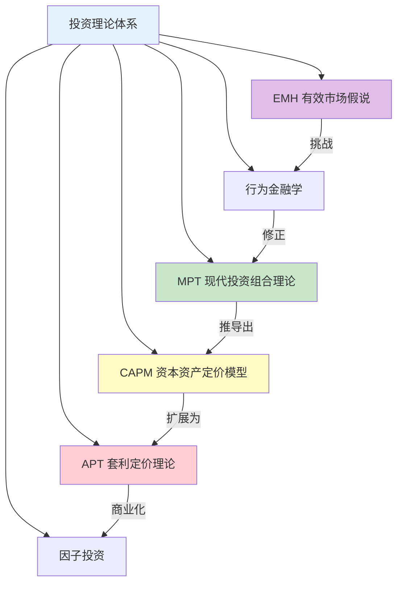
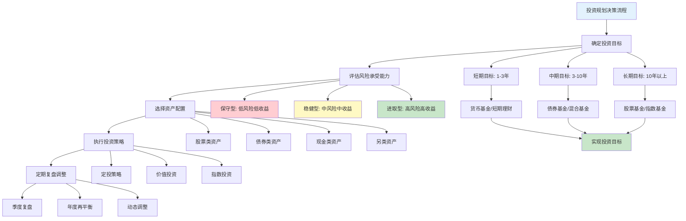
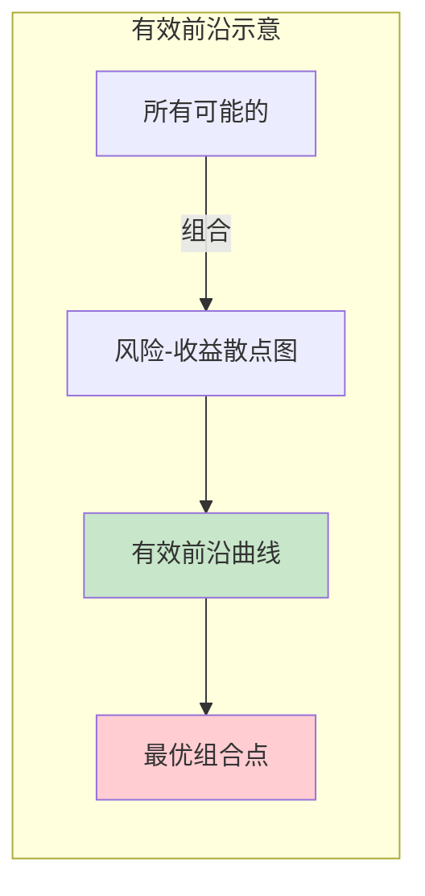
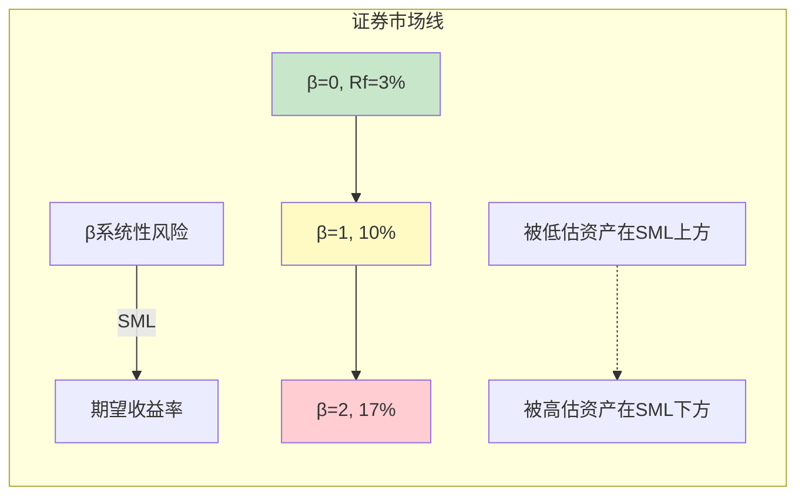
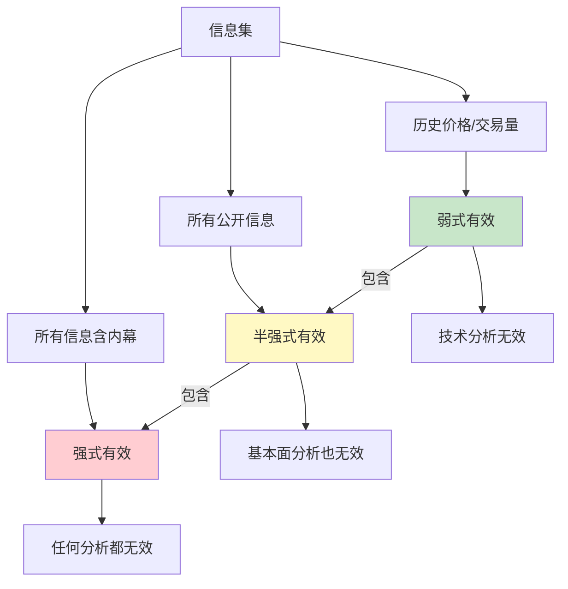
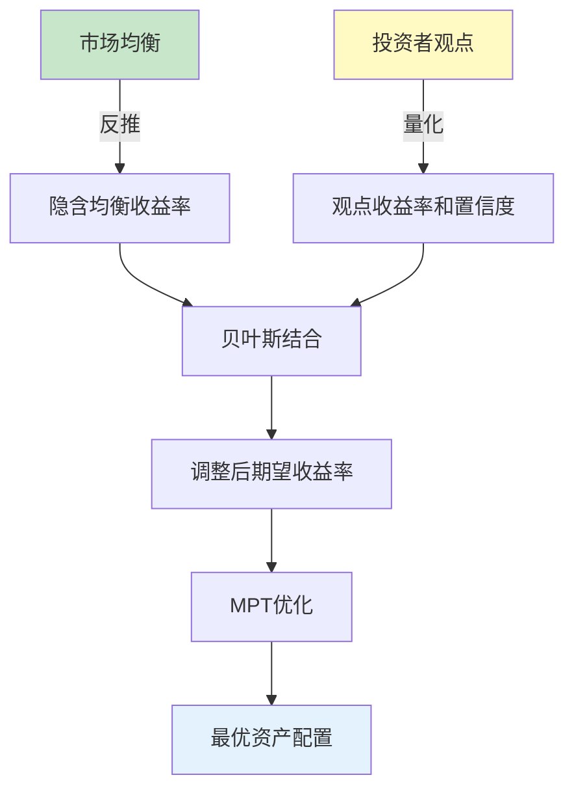
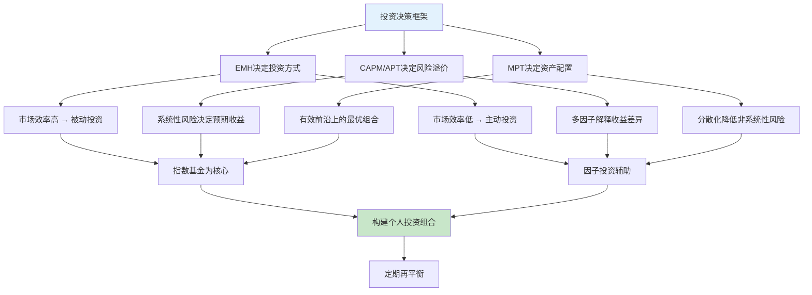

## 三、投资理论：现代投资组合理论与有效市场假说

投资不是赌博，不是凭感觉的下注，而是一门建立在严密数学和经济学理论之上的科学。本章将系统讲解支撑现代投资决策的理论基石——**现代投资组合理论（MPT）**、**资本资产定价模型（CAPM）**、**套利定价理论（APT）**、**有效市场假说（EMH）**，并延伸到因子投资、行为金融学、风险平价等前沿领域，最终落实到可执行的资产配置方案。



### 3.1 现代投资组合理论（MPT）

#### 3.1.1 理论诞生背景

1952年，年仅25岁的哈里·马科维茨（Harry Markowitz）在芝加哥大学完成了博士论文《投资组合选择》（Portfolio Selection），首次用数学方法证明了一个直觉上显而易见但此前无人严格论证的事实：**分散投资可以降低风险**。这篇论文开启了量化金融的时代，马科维茨因此获得1990年诺贝尔经济学奖。

在此之前，投资者虽然知道"不要把鸡蛋放在一个篮子里"，但没有人能精确回答：到底该放几个篮子？每个篮子放多少？MPT第一次给出了数学上的最优解。

**MPT诞生前的投资世界**：在1952年之前，投资管理基本上靠经验和直觉。格雷厄姆的价值投资（1934年《证券分析》）虽然提供了分析框架，但本质上仍是选股的艺术，而非组合构建的科学。MPT的革命性在于：它把投资问题从"选哪只股票"转变为"如何构建组合"，从此投资管理成为一门可以量化的工程学科。

#### 3.1.2 核心假设与观点

MPT建立在以下关键假设之上：

1. **投资组合视角**：投资者应该关注整个投资组合的风险和收益，而非单个资产
2. **分散化的力量**：通过将相关性低的资产组合在一起，可以在不降低预期收益的情况下降低风险
3. **有效前沿**：存在一个"有效前沿"（Efficient Frontier），即在给定风险水平下收益最高（或给定收益水平下风险最低）的投资组合集合
4. **理性投资者选择**：理性投资者应该选择有效前沿上的投资组合
5. **单一投资期限**：所有投资者在同一投资期限内做出决策
6. **无摩擦市场**：不存在交易成本、税收和借贷限制
7. **信息免费且即时可得**：所有投资者可以无成本地获取相同信息

这些假设在现实中当然不完全成立，但正因如此，后续的理论（APT、行为金融学等）才有了发展的空间。理解假设条件，是正确应用理论的前提。



#### 3.1.3 关键概念详解

**期望收益率（Expected Return）**

投资组合的期望收益率是各资产期望收益率的加权平均：

$$E(R_p) = \sum_{i=1}^{n} w_i \times E(R_i)$$

其中 $w_i$ 是第 $i$ 个资产的权重，$E(R_i)$ 是第 $i$ 个资产的期望收益率。

**示例**：假设一个组合包含60%的股票（期望收益率10%）和40%的债券（期望收益率4%），则组合的期望收益率为：
$$E(R_p) = 0.6 \times 10\% + 0.4 \times 4\% = 7.6\%$$

**风险（标准差）**

投资组合的风险用收益率的标准差来衡量。关键在于，**投资组合的风险不等于各资产风险的加权平均**——当资产之间的相关性小于1时，组合的风险会低于加权平均值。这就是分散化的数学本质。

两资产组合的风险公式为：

$$\sigma_p = \sqrt{w_1^2\sigma_1^2 + w_2^2\sigma_2^2 + 2w_1w_2\rho_{12}\sigma_1\sigma_2}$$

其中 $\rho_{12}$ 是两个资产的相关系数。

**多资产组合的一般公式**：

对于 $n$ 个资产的组合，风险公式推广为：

$$\sigma_p = \sqrt{\sum_{i=1}^{n}\sum_{j=1}^{n} w_i w_j \sigma_i \sigma_j \rho_{ij}}$$

展开来看，这个公式包含 $n^2$ 项：$n$ 个方差项（对角线）和 $n(n-1)$ 个协方差项（非对角线）。当 $n$ 较大时，协方差项的数量远超方差项——这说明**组合风险主要由资产之间的相关性决定，而非单个资产的风险**。

**实际数字感受**：一个包含50只股票的等权重组合，有50个方差项和2450个协方差项。协方差项占总权重的98%。这就是为什么"选什么资产"不如"资产之间如何搭配"重要。

**相关系数（Correlation）**

相关系数衡量两个资产收益率之间的联动程度，取值范围为-1到+1：

| 相关系数值 | 含义 | 分散化效果 | 实际案例 |
|-----------|------|-----------|---------|
| +1 | 完全正相关，同涨同跌 | 无效 | 同一行业的两只股票 |
| +0.5~+0.8 | 较强正相关 | 有限 | A股大盘股与中盘股 |
| 0~+0.3 | 弱相关或不相关 | 良好 | 股票与债券（牛市期间） |
| -0.3~0 | 弱负相关 | 较好 | 股票与黄金（部分时期） |
| -1 | 完全负相关，此涨彼跌 | 最佳 | 理论上的完美对冲 |

**关键提醒：相关性是动态的**

相关系数不是固定不变的。在市场极端时期（如金融危机），各类资产的相关性往往急剧上升——原本分散的资产突然同涨同跌。2008年金融危机期间，全球股票、商品、REITs几乎同步暴跌，只有美国国债和日元提供了真正的分散化。这意味着：

- 用历史相关性估算的组合风险，在极端情况下可能被严重低估
- 真正的分散化需要包含"危机alpha"资产——即在市场崩盘时反而上涨的资产（如长期国债、做空波动率策略的对冲头寸）

**分散化的数学验证**

假设两个资产A和B，各自的风险（标准差）都是20%，它们组成等权重（各50%）的投资组合：

| 相关系数 | 组合风险（标准差） | 相比单一资产风险降低 |
|---------|------------------|-------------------|
| +1.0 | 20.00% | 0%（无分散化效果） |
| +0.5 | 17.32% | 13% |
| 0 | 14.14% | 29% |
| -0.5 | 10.00% | 50% |
| -1.0 | 0% | 100%（完全对冲） |

计算过程（以相关系数=0为例）：
$$\sigma_p = \sqrt{0.5^2 \times 0.2^2 + 0.5^2 \times 0.2^2 + 2 \times 0.5 \times 0.5 \times 0 \times 0.2 \times 0.2}$$
$$= \sqrt{0.01 + 0.01 + 0} = \sqrt{0.02} = 14.14\%$$

这个数字清楚地说明：即使两个资产风险一样高，只要它们不是完全正相关，组合就能降低风险。

**分散化的边际效应**：随着组合中资产数量增加，边际分散化效果递减。学术研究表明：

| 组合中股票数量 | 非系统性风险占总风险比例 | 分散化效果 |
|-------------|---------------------|-----------|
| 1只 | ~100% | 无 |
| 5只 | ~50% | 显著 |
| 15只 | ~20% | 良好 |
| 30只 | ~10% | 接近饱和 |
| 50只 | ~5% | 基本饱和 |
| 500只（指数基金） | ~2% | 完全分散 |

结论：持有15-30只低相关性股票，就能消除大部分非系统性风险。持有更多股票的边际收益极小。但对于普通投资者来说，直接购买指数基金是最简单的实现完全分散化的方式。

#### 3.1.4 有效前沿与最优组合



**有效前沿（Efficient Frontier）** 是将所有可能的资产组合在"风险-收益"坐标系中画出来后，形成的一条上边界曲线。有效前沿上的每一个点都代表一个"帕累托最优"的组合——在给定风险水平下收益最高，或者在给定收益水平下风险最低。

有效前沿的几个重要性质：

1. **向右上方倾斜**：要获得更高的收益，必须承担更高的风险
2. **凹形曲线**：随着风险增加，边际收益递减
3. **只有曲线上的点是有效的**：曲线下方的组合可以通过调整权重获得更好的风险-收益比
4. **投资者的最优选择在曲线上**：具体在哪一点取决于投资者的风险偏好

**有效前沿的计算过程**

给定 $n$ 个资产的期望收益率向量 $\mu$ 和协方差矩阵 $\Sigma$，有效前沿的求解是一个二次规划问题：

$$\min_w \quad w^T \Sigma w$$
$$\text{s.t.} \quad w^T \mu = R_{target}, \quad w^T \mathbf{1} = 1$$

其中 $w$ 是资产权重向量，$R_{target}$ 是目标收益率。对每个 $R_{target}$ 求解一次，就能画出整条有效前沿曲线。

**手动计算示例**：假设只有两个资产——股票（期望收益10%，标准差20%）和债券（期望收益4%，标准差6%），相关系数0.2。我们来计算不同权重组合的风险和收益：

| 股票权重 | 债券权重 | 组合期望收益 | 组合风险（标准差） | 夏普比率 |
|---------|---------|------------|----------------|---------|
| 0% | 100% | 4.00% | 6.00% | 0.17 |
| 20% | 80% | 5.20% | 5.80% | 0.38 |
| 40% | 60% | 6.40% | 7.38% | 0.51 |
| 60% | 40% | 7.60% | 10.06% | 0.56 |
| 80% | 20% | 8.80% | 13.19% | 0.55 |
| 100% | 0% | 10.00% | 20.00% | 0.45 |

（假设无风险利率3%，夏普比率 = (组合收益-3%) / 组合风险）

可以看到：60%股票+40%债券的组合夏普比率最高（0.56），是最优的风险-收益组合。注意，组合风险（10.06%）远低于60%×20%+40%×6%=14.4%（加权平均），这就是分散化的效果。

**资本市场线（Capital Market Line, CML）**

当引入无风险资产（如国债）后，有效前沿会发生变化。投资者可以将资金分配在无风险资产和风险资产组合之间，形成一条从无风险利率出发、与有效前沿相切的直线，这就是**资本市场线**。切点处的组合被称为**市场组合（Market Portfolio）**。

CML的公式为：

$$E(R_p) = R_f + \frac{E(R_m) - R_f}{\sigma_m} \times \sigma_p$$

这条直线上的每一个组合都优于有效前沿上除切点以外的所有组合——这就是引入无风险资产后的最优解。

**CML的经济含义**：

- CML的截距 $R_f$ 代表无风险收益——不承担任何风险也能获得的回报
- CML的斜率 $\frac{E(R_m) - R_f}{\sigma_m}$ 是**风险的市场价格**——每承担一单位标准差风险，能获得多少超额收益
- 在CML上，投资者只需做两个决策：（1）借出还是借入资金；（2）将风险资产部分全部投入市场组合

#### 3.1.5 MPT的实践启示

**1. 不要把所有鸡蛋放在一个篮子里**

这是MPT最通俗的表达。但MPT告诉我们，不仅要放在不同的篮子里，还要确保这些篮子不是在同一辆车上——即资产之间的相关性要低。

**2. 选择相关性低的资产组合**

| 组合策略 | 典型相关性 | 分散化效果 | 适用场景 |
|---------|-----------|-----------|---------|
| 股票+债券 | 0~0.3（牛市中可能变负） | 良好 | 最经典的资产配置 |
| 国内股票+海外股票 | 0.3~0.6 | 较好 | 地域分散 |
| 股票+黄金 | -0.1~0.2 | 良好 | 避险需求 |
| 股票+REITs | 0.3~0.5 | 一般 | 另类资产配置 |
| 股票+商品 | 0~0.3 | 良好 | 通胀对冲 |
| 股票+长期国债 | -0.3~0.1 | 优秀 | 危机对冲 |
| 发达市场+新兴市场 | 0.5~0.8 | 有限 | 增长差异 |

**3. 关注风险调整后的收益**

不是收益越高越好，而是每承担一单位风险获得的收益越高越好。衡量这一指标的常用工具是**夏普比率（Sharpe Ratio）**：

$$Sharpe = \frac{E(R_p) - R_f}{\sigma_p}$$

夏普比率越高，说明每单位风险带来的超额收益越多。一般认为：

- 夏普比率 < 0.5：较差
- 夏普比率 0.5~1.0：一般
- 夏普比率 1.0~2.0：良好
- 夏普比率 > 2.0：优秀（持续保持几乎不可能）

**其他风险调整收益指标**：

| 指标 | 公式 | 特点 | 适用场景 |
|------|------|------|---------|
| 夏普比率 | $(R_p-R_f)/\sigma_p$ | 最常用，用标准差衡量风险 | 正态分布假设下 |
| 索提诺比率 | $(R_p-R_f)/\sigma_{downside}$ | 只考虑下行风险 | 收益分布不对称时 |
| 特雷诺比率 | $(R_p-R_f)/\beta_p$ | 用β衡量系统性风险 | 评估基金经理选股能力 |
| 信息比率 | $(R_p-R_b)/\sigma_{R_p-R_b}$ | 相对于基准的超额收益 | 主动管理基金评估 |
| 卡尔马比率 | 年化收益/最大回撤 | 关注极端下行 | 评估策略稳健性 |

**4. 市场组合是最优的**

MPT的延伸理论（CAPM）认为，在所有可能的投资组合中，持有整个市场组合（如宽基指数基金）在风险调整后是最优的。这为指数投资提供了坚实的理论基础。

#### 3.1.6 MPT的局限性与改进

MPT虽然伟大，但其假设条件在现实中往往不成立：

| 局限性 | 具体表现 | 实际影响 |
|-------|---------|---------|
| 收益率服从正态分布 | 现实中市场具有"肥尾"特征，极端事件概率远高于正态分布预测 | 2008年金融危机中，许多"不可能"的事件发生了 |
| 基于历史数据 | 用历史数据估算的期望收益率、风险和相关性，可能不适用于未来 | 2008年前，房贷相关资产被认为低风险 |
| 忽略交易成本和税收 | 理论假设无摩擦市场 | 频繁再平衡会产生大量交易费用 |
| 对输入参数高度敏感 | 微小的参数变化可能导致完全不同的最优组合 | 预期收益率差1%，最优组合可能完全不同 |
| 假设投资者完全理性 | 现实中投资者受情绪影响 | 行为金融学的核心批评 |
| 单期模型 | 不考虑多期投资和现金流 | 不适用于有定期收入/支出的个人投资者 |

**参数敏感性问题的严重性**：MPT要求输入三个关键参数——期望收益率、标准差和相关系数。研究表明，输入参数的微小误差会被优化过程放大，导致输出的"最优组合"权重剧烈波动。例如，将某资产的期望收益率从8%调整到8.5%，最优权重可能从15%跳到35%。这个问题被称为"误差最大化"（error maximization），是MPT在实践中面临的最大挑战。

**MPT的改进方向**：

1. **Black-Litterman模型**（1992年）：解决参数敏感性问题，将在3.7节详细展开
2. **鲁棒优化（Robust Optimization）**：在参数不确定性下寻找稳健的最优组合
3. **收缩估计（Shrinkage Estimation）**：将样本统计量向某个先验值收缩，减少估计误差
4. **重采样有效前沿（Resampled Efficient Frontier）**：通过蒙特卡洛模拟生成多条有效前沿，取平均值作为最终结果
5. **行为金融学**（修正理性人假设）：将在3.6节详细展开

### 3.2 资本资产定价模型（CAPM）

#### 3.2.1 CAPM的推导与公式

CAPM由威廉·夏普（William Sharpe）、约翰·林特纳（John Lintner）和简·莫辛（Jan Mossin）在1960年代分别独立推导出来，是MPT的直接延伸。它回答了一个核心问题：**一个资产应该获得多少回报才合理？**

**CAPM的推导逻辑**：

1. MPT告诉我们存在一条有效前沿
2. 引入无风险资产后，所有理性投资者都持有同一个风险资产组合——市场组合
3. 如果所有人都持有市场组合，那么市场组合中每只股票的权重就是其市值占比
4. 在均衡状态下，每只股票的期望收益率必须恰好补偿其对市场组合风险的贡献
5. 这个贡献用贝塔系数（β）来衡量

**CAPM公式**：

$$E(R_i) = R_f + \beta_i \times (E(R_m) - R_f)$$

其中：
- $E(R_i)$ = 资产 $i$ 的期望收益率
- $R_f$ = 无风险收益率（通常用短期国债收益率）
- $\beta_i$ = 资产 $i$ 的贝塔系数（衡量系统性风险）
- $E(R_m)$ = 市场组合的期望收益率
- $E(R_m) - R_f$ = 市场风险溢价（Market Risk Premium）

**通俗理解**：一个资产的期望收益率 = 无风险利率 + 风险补偿。风险补偿的大小取决于两个因素：市场整体的风险溢价有多大（$E(R_m) - R_f$），以及这个资产对市场风险有多敏感（$\beta_i$）。

#### 3.2.2 贝塔系数（Beta）详解

贝塔系数是CAPM中最核心的概念，它衡量一个资产相对于整个市场的波动敏感度：

| β值 | 含义 | 收益特征 | 典型资产 |
|-----|------|---------|---------|
| β = 0 | 与市场无关 | 仅获得无风险利率 | 国债、现金 |
| 0 < β < 1 | 波动小于市场 | 收益低于市场平均 | 公用事业股、消费必需品股 |
| β = 1 | 波动与市场一致 | 收益等于市场平均 | 宽基指数基金 |
| β > 1 | 波动大于市场 | 收益高于市场平均 | 科技股、小盘成长股 |
| β < 0 | 与市场反向 | 市场跌时可能涨 | 黄金（部分时期）、看跌期权 |

**贝塔系数的计算**：

$$\beta_i = \frac{Cov(R_i, R_m)}{Var(R_m)}$$

**用Python计算β系数**：

```python
import numpy as np

def calculate_beta(stock_returns, market_returns):
    """
    计算股票相对于市场的贝塔系数
    stock_returns: 股票收益率序列（日度或月度）
    market_returns: 市场指数收益率序列
    """
    covariance = np.cov(stock_returns, market_returns)[0][1]
    market_variance = np.var(market_returns)
    beta = covariance / market_variance
    return round(beta, 2)

# 示例：用过去3年月度数据计算
# stock_monthly_returns = [0.02, -0.01, 0.03, ...]  # 36个月
# market_monthly_returns = [0.01, -0.02, 0.02, ...]  # 沪深300月度收益
# beta = calculate_beta(stock_monthly_returns, market_monthly_returns)
```

**实际案例**：假设无风险利率为3%，市场风险溢价为7%（即市场期望收益率为10%）。

| 资产 | β值 | CAPM期望收益率 | 计算过程 |
|------|-----|---------------|---------|
| 国债 | 0 | 3% | 3% + 0 × 7% |
| 银行股 | 0.6 | 7.2% | 3% + 0.6 × 7% |
| 沪深300指数 | 1.0 | 10.0% | 3% + 1.0 × 7% |
| 科技成长股 | 1.5 | 13.5% | 3% + 1.5 × 7% |
| 新兴行业概念股 | 2.0 | 17.0% | 3% + 2.0 × 7% |

#### 3.2.3 证券市场线（SML）

CAPM可以用一条直线来表示，横轴为β（系统性风险），纵轴为期望收益率。这条直线叫做**证券市场线（Security Market Line, SML）**。

SML的几个重要性质：

1. **SML的截距**是无风险利率 $R_f$
2. **SML的斜率**是市场风险溢价 $E(R_m) - R_f$
3. **在SML上的资产定价合理**：期望收益率与风险匹配
4. **在SML上方的资产被低估**：实际收益率高于CAPM预测——值得买入
5. **在SML下方的资产被高估**：实际收益率低于CAPM预测——应该卖出或回避



**Alpha（α）——超越CAPM的收益**

如果一个资产的实际收益率偏离了CAPM的预测，这个偏离量就是**Alpha**：

$$\alpha_i = R_i^{实际} - [R_f + \beta_i \times (R_m - R_f)]$$

- **正Alpha**：资产表现优于CAPM预测（被低估，或基金经理有超额能力）
- **负Alpha**：资产表现劣于CAPM预测（被高估，或基金经理缺乏能力）
- **Alpha接近0**：定价合理，或基金经理没有超额能力

**Alpha的现实意义**：在有效市场中，Alpha应该接近0。如果某人持续获得正Alpha，要么他发现了市场定价错误（主动投资的价值），要么只是运气（大数定律下会被抹平）。

#### 3.2.4 CAPM的核心启示

**只有承担系统性风险才能获得额外收益**

这是CAPM最重要的结论。风险分为两类：

| 风险类型 | 定义 | 能否分散 | 市场是否补偿 |
|---------|------|---------|------------|
| 非系统性风险（特有风险） | 单个公司或行业的特有风险 | 能（通过分散投资） | 否 |
| 系统性风险（市场风险） | 影响整个市场的风险 | 不能 | 是 |

**实际含义**：如果你持有一只高风险的个股（比如某只科技股），它的高波动性有一部分是非系统性风险——你可以通过持有更多股票来消除这部分风险。市场不会因为你承担了可以分散的风险而给你额外回报。只有承担了不可分散的系统性风险（β），你才能获得风险补偿。

**这个结论的反面推论**：如果你只持有1-3只股票，你承担了大量非系统性风险，但市场不为此买单。你的风险高于市场组合，但预期收益却不一定更高——你白白承受了不必要的波动。这就是为什么分散化不是可选项，而是必须。

#### 3.2.5 CAPM的局限性与改进

CAPM虽然优雅，但其假设过于理想化，实际应用中面临诸多挑战：

**主要局限性**：

1. **市场组合不可观测**：理论上，市场组合应该包含所有风险资产（股票、债券、房产、人力资本等），但实际上无法构建。学者理查德·罗尔（Richard Roll）在1977年提出"罗尔批评"（Roll's Critique），认为CAPM在实践中是不可检验的，因为我们永远无法观测到真正的市场组合。
2. **单一因子模型过于简化**：仅用β一个因子来解释收益差异，忽略了其他重要因素
3. **β的不稳定性**：一个资产的β会随时间变化，用历史数据估计的β可能不准确。牛市中β偏低的股票，在熊市中可能变成高β
4. **无风险利率的选择**：不同期限的国债利率不同，选哪个作为无风险利率存在争议
5. **市场风险溢价难以精确估计**：不同时期、不同市场的风险溢价差异很大

**CAPM的改进模型——Fama-French三因子模型**：

法玛和弗伦奇（French）在1993年提出了三因子模型，用三个因子来解释股票收益：

$$E(R_i) - R_f = \alpha_i + \beta_1(R_m - R_f) + \beta_2 \cdot SMB + \beta_3 \cdot HML$$

其中：
- $R_m - R_f$ = 市场因子（与CAPM相同）
- $SMB$（Small Minus Big）= 市值因子，小盘股相对大盘股的超额收益
- $HML$（High Minus Low）= 价值因子，高账面市值比（价值股）相对低账面市值比（成长股）的超额收益

后续又扩展为**五因子模型**（2015年），增加了：
- $RMW$（Robust Minus Weak）= 盈利因子，高盈利公司相对低盈利公司的超额收益
- $CMA$（Conservative Minus Aggressive）= 投资因子，保守投资公司相对激进投资公司的超额收益

### 3.3 套利定价理论（APT）

#### 3.3.1 APT的理论基础

套利定价理论（Arbitrage Pricing Theory, APT）由斯蒂芬·罗斯（Stephen Ross）于1976年提出，是对CAPM的重要扩展和替代。APT与CAPM的核心区别在于：CAPM用一个因子（市场组合的β）解释收益，APT用多个因子解释收益。

**APT的核心假设**：

1. 资产收益由多个共同因子驱动
2. 投资者是风险厌恶的，偏好更多财富
3. 不存在无风险套利机会（核心假设）
4. 市场中存在大量资产可供分散化

**APT与CAPM的关键区别**：

| 对比维度 | CAPM | APT |
|---------|------|-----|
| 因子数量 | 1个（市场组合） | 多个（理论上不限） |
| 因子来源 | 理论推导 | 经验识别 |
| 假设强度 | 强（需要市场组合、效用函数等） | 弱（仅需无套利条件） |
| 对市场组合的依赖 | 强依赖 | 不依赖 |
| 可检验性 | 受罗尔批评 | 更易检验 |
| 灵活性 | 低 | 高 |

**APT公式**：

$$E(R_i) = R_f + \beta_{i1} \cdot \lambda_1 + \beta_{i2} \cdot \lambda_2 + \cdots + \beta_{ik} \cdot \lambda_k$$

其中：
- $\beta_{ij}$ = 资产 $i$ 对第 $j$ 个因子的敏感度
- $\lambda_j$ = 第 $j$ 个因子的风险溢价

#### 3.3.2 APT的因子识别

APT本身不指定具体有哪些因子，这是它的优势也是劣势。实践中，研究者通常通过统计方法（如主成分分析）或经济直觉来识别因子。常见的因子包括：

| 因子类别 | 具体因子 | 经济含义 |
|---------|---------|---------|
| 宏观经济因子 | GDP增长率 | 经济扩张期股票表现好 |
| 宏观经济因子 | 通胀率 | 通胀上升利好商品、利空债券 |
| 宏观经济因子 | 利率变动 | 利率上升利空债券和成长股 |
| 宏观经济因子 | 汇率变动 | 本币贬值利好出口企业 |
| 市场结构因子 | 市场风险溢价 | 承担系统性风险的补偿 |
| 市场结构因子 | 信用利差 | 信用风险的补偿 |
| 市场结构因子 | 期限利差 | 期限风险的补偿 |
| 基本面因子 | 市值（SMB） | 小盘股溢价 |
| 基本面因子 | 价值（HML） | 价值股溢价 |
| 基本面因子 | 盈利质量（RMW） | 高盈利溢价 |
| 基本面因子 | 投资风格（CMA） | 保守投资溢价 |

#### 3.3.3 APT的实践应用

**应用场景一：归因分析**

APT框架可以将一个投资组合的收益分解为多个因子贡献：

$$R_p - R_f = \alpha + \beta_1 \cdot F_1 + \beta_2 \cdot F_2 + \beta_3 \cdot F_3 + \epsilon$$

例如，某基金去年收益15%，无风险利率3%，可以分解为：
- 市场因子贡献：β=1.1 × 市场收益10% = 11%
- 价值因子贡献：β=0.3 × 价值因子收益4% = 1.2%
- 动量因子贡献：β=0.2 × 动量因子收益3% = 0.6%
- Alpha（未解释部分）：15% - 3% - 11% - 1.2% - 0.6% = -0.8%

结论：这个基金的收益主要来自市场暴露（β），而不是基金经理的选股能力（α为负）。

**应用场景二：风险预算**

通过APT，投资者可以精确控制组合对各因子的暴露。例如：
- 想要降低利率风险：控制组合对利率因子的β
- 想要获取价值溢价：增加对HML因子的β
- 想要保持市场中性：让组合对市场因子的β接近0

#### 3.3.4 APT与CAPM的关系

APT和CAPM并非互相排斥，而是互为补充：

- 当APT只有一个因子且该因子是市场组合时，APT就退化为CAPM
- CAPM提供了一个清晰的理论直觉（只有系统性风险才有补偿）
- APT提供了更灵活的实证框架（多个因子解释收益）
- Fama-French三/五因子模型本质上是APT的具体化

### 3.4 有效市场假说（EMH）

#### 3.4.1 理论起源与核心命题

有效市场假说（Efficient Market Hypothesis, EMH）由尤金·法玛（Eugene Fama）于1970年在其著作中正式提出。法玛因此获得2013年诺贝尔经济学奖。EMH是金融学中最具争议也最具影响力的理论之一——它直接挑战了每一个试图"战胜市场"的投资者。

**EMH的核心命题**：在一个有效的市场中，资产价格已经完全反映了所有可获得的信息。这意味着，投资者无法通过分析已知信息来持续获得超额收益。

用更通俗的话说：**如果你在新闻里看到了某个消息，市场早就已经消化了这个消息**。

**EMH的数学表达**：

$$E(R_{i,t+1} | \Phi_t) = E(R_{i,t+1} | \Phi_t^*)$$

其中 $\Phi_t$ 是 $t$ 时刻所有可获得的信息集，$\Phi_t^*$ 是已经反映在价格中的信息集。当 $\Phi_t = \Phi_t^*$ 时，市场是信息有效的。

#### 3.4.2 三种形式的市场效率

法玛将市场效率分为三个层次，每一层都比前一层更强：

**弱式有效（Weak Form Efficiency）**

- **价格已反映**：所有历史价格和交易量信息
- **含义**：技术分析（看K线图、画趋势线、MACD、布林带等）无法获得超额收益
- **但基本面分析可能仍然有效**：通过分析公司财务报表、行业前景等，可能找到被低估的股票
- **检验方法**：自相关检验、游程检验、过滤规则检验
- **学术共识**：多数研究表明，成熟市场（如美股）已接近弱式有效

**半强式有效（Semi-Strong Form Efficiency）**

- **价格已反映**：所有公开信息（包括财务报表、新闻、分析师报告、宏观经济数据等）
- **含义**：技术分析和基本面分析都无法获得超额收益
- **只有内幕信息可能带来超额收益**：但这在大多数国家是违法的
- **检验方法**：事件研究法——观察重大信息发布后价格调整的速度
- **实际证据**：研究发现，价格通常在信息公布后几分钟内完成调整

**强式有效（Strong Form Efficiency）**

- **价格已反映**：所有信息，包括内幕信息
- **含义**：任何人、任何方法都无法持续获得超额收益
- **即使公司内部人也无法通过内幕信息获利**
- **实际证据**：这个形式几乎不被任何市场完全满足——内部人确实能通过内幕信息获利，这也是为什么各国法律禁止内幕交易



#### 3.4.3 支持EMH的证据

**1. 主动型基金的长期表现**

SPIVA（标普指数与主动型基金对比）是最权威的主动管理 vs 被动指数对比报告。数据持续表明：

| 时间跨度 | 跑输标普500的主动型大盘基金比例 |
|---------|------------------------------|
| 1年期 | 约60-70% |
| 5年期 | 约80-85% |
| 10年期 | 约85-90% |
| 15年期 | 超过90% |
| 20年期 | 超过95% |

中国市场同样如此。根据各大基金评级机构数据，主动型偏股基金在5年以上的长期维度中，跑赢沪深300指数的比例不到30%。

**2. 基金经理的持续性悖论**

如果市场是无效的，那么优秀的基金经理应该持续优秀。但数据表明：过去3年排名前25%的基金经理，未来3年仍然排名前25%的概率不到10%。基金经理的优秀表现更多是运气而非能力。

**2020年的经典案例**：2020年公募基金冠军赵诣管理的农银汇理工业4.0，全年收益166.56%。但2021年该基金收益仅16.51%，排名大幅下滑。类似的"冠军魔咒"在A股市场反复出现，印证了业绩持续性差的结论。

**3. 信息传播速度**

在互联网时代，信息几乎瞬间传播。一条利好消息从发布到反映在股价中，通常只需要几毫秒到几分钟。普通投资者很难比市场更快地获取和处理信息。

**4. 随机漫步理论**

经济学家伯顿·马尔基尔（Burton Malkiel）在《漫步华尔街》中论证：股票价格的短期变动就像醉汉的随机漫步，无法被预测。大量的统计检验也支持股价变动接近随机游走的假设。

**随机漫步的数学检验**：如果股价是随机游走的，那么收益率序列应该没有自相关。对沪深300指数日收益率的自相关检验显示，滞后期1-20天的自相关系数均接近0，且统计上不显著——这支持弱式有效。

#### 3.4.4 反对EMH的证据

**1. 市场泡沫和崩盘**

如果市场是有效的，为什么会出现以下情况？

| 事件 | 时间 | 特征 | 持续时间 |
|------|------|------|---------|
| 南海泡沫 | 1720年 | 股价从100英镑涨到1000英镑再跌回100英镑 | 约9个月 |
| 日本资产泡沫 | 1989年 | 日经指数从39000点跌至7000点 | 持续20年 |
| 互联网泡沫 | 2000年 | 纳斯达克指数从5000点跌至1100点 | 约2.5年 |
| 全球金融危机 | 2008年 | 标普500指数下跌57% | 约1.5年 |
| A股疯牛与股灾 | 2015年 | 上证指数从5178点跌至2850点 | 约2个月 |
| GameStop事件 | 2021年 | 散户抱团推高股价1600%，随后暴跌 | 约3周 |

这些极端事件表明，市场价格可以系统性地偏离内在价值。

**2. 异象（Anomalies）**

学术研究发现了一些似乎能持续获得超额收益的策略：

| 异象名称 | 描述 | 可能的解释 |
|---------|------|-----------|
| 价值效应 | 低估值（高B/P）股票长期跑赢高估值股票 | 风险补偿或投资者过度反应 |
| 动量效应 | 过去3-12个月涨势好的股票继续上涨 | 投资者反应不足 |
| 小盘股效应 | 小市值股票长期跑赢大市值股票 | 流动性溢价 |
| 低波动率异象 | 低波动率股票的收益不低于高波动率股票 | 彩票偏好效应 |
| 盈余公告后漂移 | 好消息公布后股价继续上涨 | 投资者对信息反应不足 |
| 一月效应 | 一月份的股票收益率显著高于其他月份 | 税收效应、窗口粉饰 |
| 星期一效应 | 星期一的收益率显著低于其他工作日 | 投资者情绪周期 |

**3. 巴菲特的挑战**

沃伦·巴菲特从1965年至2023年，伯克希尔·哈撒韦的年化收益率约20%，大幅跑赢标普500的约10%。58年持续跑赢市场，这在统计上几乎不可能是纯粹的运气。

巴菲特自己在2005年提出了一个著名的赌约：用标普500指数基金对冲任何一组对冲基金。Protégé Partners接受了挑战，结果10年后指数基金完胜。

这说明两个看似矛盾的事情：
- 市场并非完全有效（巴菲特能找到定价错误）
- 对大多数人来说，市场足够有效（普通基金经理无法跑赢指数）

#### 3.4.5 中间立场：适应性市场假说

安德鲁·罗（Andrew Lo）于2004年提出的**适应性市场假说（Adaptive Market Hypothesis, AMH）**调和了EMH和行为金融学的矛盾。AMH的核心观点：

1. **市场效率不是恒定的**：它随时间、市场结构和竞争程度变化
2. **竞争程度决定效率**：在竞争激烈、信息透明的市场（如美股大盘股），效率更高；在竞争较少、信息不对称的市场（如小盘股、新兴市场），效率较低
3. **投资者行为受进化和适应影响**：成功的策略会被模仿，直到超额收益消失；失败的策略会被淘汰
4. **市场存在周期性**：当投资者适应了某种模式后，新模式会出现

AMH对投资者的实际启示：

- **不要教条地相信或否定EMH**：市场效率是动态的
- **在效率高的市场用被动策略**：如大盘股指数投资
- **在效率低的市场可以用主动策略**：如小盘股、新兴市场
- **持续适应**：过去有效的策略未来可能失效

#### 3.4.6 不同市场的效率比较

| 市场 | 效率水平 | 主要原因 | 投资策略建议 |
|------|---------|---------|------------|
| 美股大盘股 | 高 | 机构占比高、信息透明、流动性好 | 被动指数投资为主 |
| 美股小盘股 | 中等 | 关注度低、分析师覆盖少 | 可考虑主动选股 |
| A股大盘股 | 中等偏低 | 散户占比高、政策影响大 | 指数+适度主动 |
| A股小盘股 | 较低 | 散户主导、信息不对称 | 主动选股可能有效 |
| 港股 | 中等 | 机构主导但流动性分化 | 精选个股 |
| 新兴市场 | 较低 | 制度不完善、信息不对称 | 主动管理有价值 |
| 加密货币 | 低 | 监管缺失、操纵严重 | 高度投机，谨慎参与 |

### 3.5 因子投资：从理论到实践

#### 3.5.1 什么是因子

因子（Factor）是能够系统性解释资产收益差异的共同变量。因子投资的核心思想是：**资产的收益不是随机的，而是可以用少数几个因子来解释**。

**因子的经济学含义**：每一个有效因子都对应着一种系统性风险或投资者行为偏差。因子溢价（即因子的超额收益）来源于两个可能的原因：
1. **风险补偿**：承担了某种特定的系统性风险，获得相应补偿（如小盘股流动性风险）
2. **行为偏差**：投资者系统性地犯错，创造了可被利用的定价错误（如过度推断）

目前学术界和业界公认的长期有效因子包括：

| 因子名称 | 英文 | 含义 | 长期超额收益（年化） | 溢价来源 |
|---------|------|------|-------------------|---------|
| 市场因子 | Market | 股票相对无风险资产的超额收益 | 约5-8% | 风险补偿 |
| 价值因子 | Value | 便宜股相对贵股的超额收益 | 约2-5% | 风险+行为 |
| 规模因子 | Size | 小盘股相对大盘股的超额收益 | 约2-3% | 风险补偿 |
| 动量因子 | Momentum | 过去涨势好的股票继续上涨 | 约3-6% | 行为偏差 |
| 质量因子 | Quality | 高质量公司相对低质量公司的超额收益 | 约2-4% | 行为偏差 |
| 低波动因子 | Low Volatility | 低波动股票相对高波动股票的超额收益 | 约1-3% | 行为偏差 |

**因子溢价的时变性**：因子溢价不是恒定的。价值因子在2007-2020年经历了长达十几年的低迷期，许多"价值投资已死"的文章大量出现。然而2021-2022年价值因子强势回归。这提醒投资者：因子投资需要耐心，短期表现不佳不代表因子失效。

#### 3.5.2 因子投资的实践方式

**方式一：因子指数基金/ETF**

这是最简单的方式。国内外都有基于因子构建的指数基金：

| 因子 | A股代表性指数 | 基金示例 | 费率范围 |
|------|-------------|---------|---------|
| 价值 | 中证红利指数、沪深300价值指数 | 红利ETF | 0.15-0.50% |
| 质量 | MSCI中国A股质量指数 | 质量ETF | 0.30-0.60% |
| 低波动 | 中证500行业中性低波动指数 | 低波ETF | 0.20-0.50% |
| 动量 | 国证动量指数 | 动量ETF | 0.30-0.60% |
| 多因子 | 中证Alpha系列指数 | 多因子ETF | 0.30-0.80% |

**方式二：多因子策略**

将多个因子组合起来，构建更稳健的投资组合。常见做法：
1. 先按价值因子筛选出估值较低的股票
2. 再按质量因子剔除财务质量差的股票
3. 最后按动量因子选出近期趋势向上的股票

**多因子组合的注意事项**：

- **因子之间的相关性**：价值因子和动量因子通常负相关（价值股往往近期表现差），组合使用可以降低策略波动
- **因子拥挤度**：当太多资金追逐同一个因子时，因子溢价会下降甚至反转
- **因子择时的困难**：研究表明，因子择时比股票择时更难，建议长期持有

**方式三：Smart Beta ETF**

Smart Beta是因子投资的商业化产品，它在传统市值加权指数的基础上引入因子加权。国内外均有大量Smart Beta产品可选。

**Smart Beta vs 传统指数 vs 主动管理**：

| 对比维度 | 传统指数 | Smart Beta | 主动管理 |
|---------|---------|-----------|---------|
| 加权方式 | 市值加权 | 因子加权（等权、基本面等） | 基金经理决定 |
| 费率 | 最低（0.05-0.20%） | 中等（0.20-0.60%） | 最高（1.0-2.0%） |
| 透明度 | 最高 | 高 | 低 |
| 因子暴露 | 被动接受市值权重 | 主动暴露于特定因子 | 取决于基金经理 |
| 超额收益来源 | 无（跟踪误差最小） | 因子溢价 | 基金经理能力 |
| 适合人群 | 所有人 | 了解因子理论的投资者 | 愿意为超额收益付费的投资者 |

#### 3.5.3 因子投资的风险

**因子回撤（Factor Drawdown）**：因子溢价可能长期为负。例如：
- 价值因子在2007-2020年（约13年）持续跑输成长股
- 规模因子在2010年代的美股中几乎消失
- 动量因子在2009年3月经历了剧烈的"动量崩溃"

**因子拥挤（Factor Crowding）**：当太多投资者追逐同一因子时，买入行为推高了因子内股票的估值，反而降低了未来收益。2020年成长股/科技股的估值泡沫就是一个例子。

**因子挖掘的陷阱**：学术论文中发现了数百个"有效因子"，但许多是数据挖掘（data snooping）的产物——在足够多的数据中总能找到统计上显著但经济上无意义的模式。真正长期有效的因子可能只有5-8个。

### 3.6 行为金融学的挑战

#### 3.6.1 投资者并非完全理性

行为金融学从心理学角度挑战了传统金融理论的"理性人"假设。丹尼尔·卡尼曼（Daniel Kahneman）和阿莫斯·特沃斯基（Amos Tversky）的前景理论揭示了人类决策的系统性偏差。

**前景理论的核心发现**：

1. **参考点依赖**：人们关心的是相对于参考点的收益和损失，而非绝对财富水平
2. **损失厌恶**：损失的痛苦约是同等收益快乐的2-2.5倍
3. **敏感度递减**：从100元收益到200元收益的快乐增量，小于从0元到100元的快乐增量
4. **概率权重**：人们高估小概率事件（买彩票），低估大概率事件（不买保险）

**投资者常见的认知偏差**：

| 偏差名称 | 表现 | 对投资的影响 | 对抗方法 |
|---------|------|------------|---------|
| 过度自信 | 高估自己的判断能力 | 频繁交易，承担过多风险 | 记录预测准确率 |
| 损失厌恶 | 损失的痛苦是同等收益快乐的2倍 | 过早卖出盈利股，过晚卖出亏损股 | 设定机械止损规则 |
| 锚定效应 | 过度依赖第一个接触到的信息 | 用买入价格作为判断标准 | 关注基本面而非成本价 |
| 从众心理 | 跟随大多数人的行为 | 追涨杀跌，加剧市场波动 | 独立思考，逆向思维 |
| 近因偏差 | 过度重视最近的信息 | 忽视长期趋势，短期过度反应 | 回顾5-10年历史数据 |
| 确认偏差 | 只寻找支持自己观点的信息 | 忽视反面证据，固守错误判断 | 主动寻找反面论据 |
| 处置效应 | 倾向于卖出盈利股、持有亏损股 | 降低投资组合整体收益 | 定期再平衡 |
| 心理账户 | 对不同来源的钱区别对待 | 非理性地分配资金 | 将所有资产视为统一组合 |
| 可得性偏差 | 根据容易回忆的事件判断概率 | 过度关注近期热门事件 | 用数据代替直觉 |
| 代表性偏差 | 根据相似性而非概率做判断 | 过度推断短期趋势 | 理解均值回归 |
| 后视偏差 | "我早就知道了" | 高估自己的预测能力 | 记录决策时的理由 |
| 沉没成本谬误 | 因为已经投入而不愿放弃 | 持有亏损头寸过久 | 只看未来预期，不看过去成本 |

#### 3.6.2 市场中的行为偏差效应

行为金融学发现了多个由投资者偏差导致的市场异象：

**动量效应**：过去3-12个月表现好的股票在接下来的3-12个月继续表现好。这可能是因为投资者对好消息反应不足，价格调整缓慢。在全球主要市场中，动量效应都有显著表现，年化超额收益约3-6%。

**反转效应**：过去1个月表现极端的股票在下个月倾向于反转。这可能是因为投资者短期过度反应。短期反转（1周-1月）和长期反转（3-5年）都有实证支持。

**盈余公告后漂移**：公司公布好于预期的盈利后，股价在随后数周继续上涨。这说明市场对新信息的消化不是瞬间完成的。这个异象从1960年代被发现至今仍然存在，是EMH最强有力的反面证据之一。

**彩票股效应**：投资者偏好具有高偏度（小概率大收益）的股票——类似彩票的收益分布。这类股票往往被高估，长期收益偏低。A股中的"妖股"（连续涨停的小盘股）就体现了这种偏好。

**注意力效应**：当某只股票或某个行业获得大量媒体报道和社交网络关注时，短期内价格往往被推高（注意力驱动的买入），但随后回归基本面。2021年初的GameStop事件就是典型案例。

#### 3.6.3 对普通投资者的启示

行为金融学最重要的教训是：**认识到自己的认知偏差，然后建立系统化的投资纪律来对抗它们**。

具体建议：

1. **建立投资规则并严格执行**：预先设定买入和卖出条件，避免情绪化决策。例如："当个股亏损达到20%时无条件卖出"或"每年1月和7月进行再平衡"
2. **定期再平衡**：机械地卖出涨多的、买入跌多的，对抗处置效应
3. **减少交易频率**：过度自信会导致过度交易，而交易越多收益越差。Barber和Odean（2000年）的研究发现，交易最频繁的投资者年化收益比交易最少的投资者低约7%
4. **分散投资**：对抗过度自信和集中持仓的倾向
5. **定投策略**：对抗择时冲动和从众心理
6. **写投资日记**：记录每次决策的理由，事后复盘，识别自己的偏差模式
7. **设置"冷静期"**：在做出重大投资决策前，强制等待24-72小时
8. **避免在极端情绪下交易**：大涨时的贪婪和大跌时的恐惧都会导致错误决策

### 3.7 实战工具：Black-Litterman模型与风险平价

#### 3.7.1 Black-Litterman模型：解决MPT的参数敏感性问题

MPT最大的实践难题是参数敏感性——对期望收益率的微小估计误差会导致最优组合权重剧烈波动。1992年，高盛的Fischer Black和Robert Litterman提出了Black-Litterman模型（BL模型），从根本上解决了这个问题。

**BL模型的核心思想**：

1. 从市场均衡出发：假设当前市场价格是合理的，反推出隐含的均衡收益率（equilibrium returns）
2. 将投资者的观点（views）与均衡收益率结合，通过贝叶斯方法得到调整后的期望收益率
3. 用调整后的收益率作为MPT优化的输入

**BL模型的优势**：

| 对比维度 | 传统MPT | BL模型 |
|---------|--------|--------|
| 输入 | 直接估计期望收益率 | 市场均衡 + 投资者观点 |
| 参数敏感性 | 高（误差最大化） | 低（均衡收益作为锚点） |
| 空头头寸 | 经常产生不合理的空头头寸 | 通常不会 |
| 输出合理性 | 取决于输入质量 | 即使没有观点，也得到市场组合 |
| 复杂度 | 低 | 中等 |

**BL模型的实际应用流程**：



**示例**：假设你管理一个包含A股、美股、债券、黄金的组合。市场均衡配置（按市值加权）给出的隐含收益率为：A股8%、美股9%、债券3%、黄金2%。你认为A股未来一年会跑赢美股3个百分点（置信度60%）。BL模型会将你的观点与均衡收益率结合，生成调整后的收益率向量，再进行优化。结果可能是：在均衡配置基础上适度超配A股、低配美股，而不是传统MPT可能给出的极端集中配置。

#### 3.7.2 风险平价（Risk Parity）

风险平价是一种资产配置策略，其核心思想是：**让每个资产对组合总风险的贡献相等**，而不是让每个资产的资金权重相等。

**为什么需要风险平价？**

传统的60/40组合（60%股票+40%债券）看起来是分散的，但实际上：
- 股票的风险（标准差约20%）远高于债券（标准差约6%）
- 60%的股票权重贡献了组合约90%的风险
- 这个组合本质上是"赌股票"

**风险平价的计算**：

资产 $i$ 对组合风险的贡献为：

$$RC_i = w_i \times \frac{\partial \sigma_p}{\partial w_i} = w_i \times \frac{(\Sigma w)_i}{\sigma_p}$$

风险平价要求：$RC_1 = RC_2 = \cdots = RC_n = \frac{\sigma_p}{n}$

**实际案例**：

| 配置方式 | 股票权重 | 债券权重 | 股票风险贡献 | 债券风险贡献 |
|---------|---------|---------|------------|------------|
| 传统60/40 | 60% | 40% | ~90% | ~10% |
| 等权重 | 50% | 50% | ~85% | ~15% |
| 风险平价 | ~25% | ~75% | 50% | 50% |

注意：风险平价中，低风险资产（债券）的配置比例反而更高。为了提高收益，风险平价策略通常会使用杠杆——借入资金来放大债券配置。

**风险平价的代表产品**：桥水基金（Bridgewater）的"全天候策略"（All Weather Strategy）就是基于风险平价思想构建的。该策略的目标是在任何经济环境（增长/衰退 × 通胀/通缩）下都能获得合理收益。

**风险平价的局限性**：
1. 需要杠杆来提高收益，杠杆本身带来风险
2. 依赖历史波动率和相关性估计，在极端情况下可能失效
3. 低利率环境下，债券的风险-收益特征可能发生变化
4. 实施成本较高，不适合小资金投资者

#### 3.7.3 仓位管理与Kelly准则

Kelly准则（Kelly Criterion）是一个用于确定最优投注比例的数学公式，源自信息论，后被引入投资管理。

**Kelly准则公式**：

$$f^* = \frac{p \times b - q}{b}$$

其中：
- $f^*$ = 最优投注比例（占总资金的比例）
- $p$ = 获胜概率
- $b$ = 赔率（盈亏比）
- $q = 1 - p$ = 失败概率

**示例**：假设一个投资策略有60%的概率盈利，盈亏比为1.5:1（赚时赚15%，亏时亏10%）：

$$f^* = \frac{0.6 \times 1.5 - 0.4}{1.5} = \frac{0.5}{1.5} = 33.3\%$$

这意味着你应该将总资金的33.3%投入到这个策略中。

**半Kelly策略**：实践中，由于参数估计不准确，通常使用"半Kelly"（$f^*/2$），即只投入理论最优值的一半。这牺牲了约25%的预期收益，但大幅降低了破产风险和波动性。

**Kelly准则的实际应用建议**：

| 投资场景 | Kelly建议比例 | 实际建议（半Kelly） |
|---------|-------------|----------------|
| 高确信度个股（70%把握，盈亏比2:1） | 55% | 25-30% |
| 中等确信度策略（55%把握，盈亏比1.5:1） | 18% | 8-10% |
| 宽基指数定投（长期正期望） | 理论上很高 | 适配个人储蓄率 |
| 投机性交易（50%把握，盈亏比1:1） | 0% | 不参与 |

**Kelly准则的核心启示**：即使是一个正期望的策略，过度集中也会导致灾难性的回撤。仓位管理的核心是"在不破产的前提下最大化长期收益"。

### 3.8 综合应用：从理论到个人资产配置

#### 3.8.1 三大理论的整合框架

将MPT、EMH和CAPM/APT整合起来，可以形成一套完整的投资决策框架：



#### 3.8.2 基于理论的资产配置方案

根据不同风险偏好，推荐以下配置框架：

**保守型投资者（风险承受能力低）**

| 资产类别 | 配置比例 | 代表标的 | 理论依据 |
|---------|---------|---------|---------|
| 国债/银行存款 | 50% | 国债、大额存单 | β≈0，无风险资产 |
| 债券基金 | 30% | 纯债基金、短债基金 | β≈0.2，低系统性风险 |
| 股票指数基金 | 15% | 沪深300ETF | β≈1，提供长期增长 |
| 黄金 | 5% | 黄金ETF | 低相关性，分散化 |
| 现金 | 5% | 货币基金 | 流动性储备 |

预期年化收益：4-6%，最大回撤：5-10%

**稳健型投资者（中等风险承受能力）**

| 资产类别 | 配置比例 | 代表标的 | 理论依据 |
|---------|---------|---------|---------|
| 股票指数基金 | 40% | 沪深300+中证500 | β≈1，市场组合核心 |
| 债券基金 | 30% | 中长期纯债基金 | 低相关性，降低组合波动 |
| 海外股票基金 | 15% | 纳斯达克100、标普500 | 地域分散，降低相关性 |
| 黄金 | 10% | 黄金ETF | 避险资产，低相关性 |
| 现金 | 5% | 货币基金 | 流动性储备 |

预期年化收益：6-10%，最大回撤：15-25%

**进取型投资者（高风险承受能力）**

| 资产类别 | 配置比例 | 代表标的 | 理论依据 |
|---------|---------|---------|---------|
| 股票指数基金 | 60% | 沪深300+创业板+科创50 | β>1，追求高风险溢价 |
| 海外股票基金 | 20% | 纳斯达克100、全球新兴市场 | 地域分散 |
| 债券基金 | 10% | 可转债基金 | β适中，有一定进攻性 |
| 黄金/商品 | 5% | 黄金ETF | 避险分散 |
| 现金 | 5% | 货币基金 | 流动性储备 |

预期年化收益：10-15%，最大回撤：30-40%

**风险平价型配置（全天候思路）**

| 资产类别 | 配置比例 | 理论依据 |
|---------|---------|---------|
| 股票指数基金 | 25% | 高风险，低权重控制风险贡献 |
| 长期国债 | 40% | 低风险，高权重平衡风险贡献 |
| 中期债券 | 15% | 补充固定收益部分 |
| 黄金 | 10% | 通胀对冲，低相关性 |
| 商品 | 10% | 通胀对冲，增长对冲 |

预期年化收益：5-8%，最大回撤：8-15%

#### 3.8.3 再平衡策略

再平衡是MPT理论的重要实践。当资产价格变动导致实际配置偏离目标时，需要通过买卖来恢复目标配置。

**再平衡的三种方式**：

| 方式 | 触发条件 | 优点 | 缺点 |
|------|---------|------|------|
| 定期再平衡 | 每季度或每半年 | 简单机械，执行力强 | 可能在不需要时交易 |
| 阈值再平衡 | 偏离目标超过5%时 | 只在必要时交易 | 需要持续监控 |
| 混合再平衡 | 定期检查+阈值触发 | 兼顾两者优点 | 稍复杂 |

**再平衡的理论依据**：再平衡本质上是一个系统化的"卖高买低"过程——卖出涨得多的资产、买入跌得多的资产。这与行为金融学中的处置效应（倾向于卖出盈利股、持有亏损股）恰好相反，是一种对抗人性弱点的纪律化操作。

**再平衡的实证收益**：研究表明，定期再平衡可以将组合的年化收益提高约0.3-0.5%，同时降低波动率。更重要的是，再平衡能显著改善最差年份的表现（降低最大回撤），这对投资者的长期坚持至关重要。

**再平衡中的税收和成本考量**：

- 在A股中，基金赎回费通常持有2年以上为0，1-2年为0.25%，1年以内为0.5-1.5%
- 建议优先通过新增资金（定投）来调整偏离，而非卖出已有头寸
- 利用年终奖、奖金等一次性收入进行再平衡，避免触发赎回费

#### 3.8.4 实际操作中的注意事项

**1. 中国市场特殊性**

| 特征 | 对投资理论应用的影响 | 应对策略 |
|------|-------------------|---------|
| 散户占比高 | 市场效率相对较低，存在更多定价错误 | 适度关注主动选股机会 |
| 涨跌停制度 | 限制了价格的连续调整，可能导致信息反映延迟 | 避免追涨杀跌 |
| T+1交易制度 | 无法日内止损，增加了短期风险 | 降低个股集中度 |
| 政策影响大 | 系统性风险中包含较大的政策风险成分 | 关注政策动向，适度分散 |
| 衍生品不发达 | 对冲工具少，分散化手段有限 | 利用ETF和QDII进行分散 |
| 基金费率偏高 | 长期侵蚀收益 | 选择低费率指数基金 |

**2. 无风险利率的选择**

在中国市场，常用的无风险利率参考：
- 1年期国债收益率（约2-3%）
- 1年期定期存款利率（约1.5-2%）
- 同业存单利率（约2-2.5%）

建议根据投资期限选择：短期投资参考1年期国债收益率，长期投资参考10年期国债收益率。

**3. 市场风险溢价的估计**

中国市场历史风险溢价约在5-8%之间，但由于A股历史较短且波动较大，这个估计存在较大不确定性。保守起见，可取6%作为基准。

**4. 交易成本的考量**

| 费用类型 | A股典型费率 | 对长期收益的影响 |
|---------|-----------|---------------|
| 基金管理费（指数基金） | 0.15-0.5%/年 | 30年累计约5-15% |
| 基金托管费 | 0.05-0.1%/年 | 30年累计约1.5-3% |
| 交易佣金 | 万2-万3 | 频繁交易时影响显著 |
| 印花税 | 卖出千1 | 仅卖出时收取 |

选择低费率的指数基金，长期来看对收益的影响非常显著。以100万元投资30年为例：

| 年费率 | 30年后终值（年化8%） | 相比0.2%费率多损耗 |
|-------|-------------------|-----------------|
| 0.2% | 936万 | 基准 |
| 0.5% | 875万 | 61万 |
| 1.0% | 786万 | 150万 |
| 1.5% | 707万 | 229万 |
| 2.0% | 637万 | 299万 |

0.3%的费率差异，30年就是61万。这就是为什么巴菲特反复强调"选择低费率的指数基金"。

**5. 定投策略的优化**

定投（Dollar-Cost Averaging, DCA）是行为金融学对抗择时冲动的最佳工具。优化要点：

- **坚持时间**：定投至少持续3-5年才能体现优势
- **扣款频率**：月度和周度差异不大，选择方便的即可
- **智能定投**：在估值低时多投、估值高时少投（价值平均策略），可以提高约1-2%的年化收益
- **止盈不止损**：定投获利后可以分批止盈，但下跌时应坚持甚至加码

### 3.9 常见误区与纠正

| 误区 | 真相 | 纠正建议 |
|------|------|---------|
| 分散投资就是买很多只股票 | 分散化的核心是低相关性，而非数量 | 3-5只低相关性的指数基金比20只同行业股票更分散 |
| 高风险一定高收益 | 只有系统性风险才有补偿，非系统性风险没有 | 通过分散化消除非系统性风险，只承担有补偿的风险 |
| 既然市场有效，就不需要研究 | 市场效率是动态的，且存在多个层次 | 在效率低的领域寻找超额收益，如小盘股、新兴市场 |
| β高就是好股票 | β高意味着高波动，不一定意味着高收益 | 关注风险调整后收益（夏普比率），而非单纯β |
| 历史收益好的基金未来也好 | 基金经理的超额收益难以持续 | 关注费率和策略透明度，而非历史排名 |
| 择时交易能提高收益 | 大量研究证明择时的期望收益为负 | 坚持定投，减少择时冲动 |
| 因子投资是免费午餐 | 因子溢价可能消失，且存在跟踪误差 | 理解因子的经济逻辑，做好长期持有准备 |
| 理论模型可以直接套用 | 所有模型都有假设前提和局限性 | 理解原理，灵活应用，不教条 |
| 涨得多的股票要卖掉 | 可能是动量效应在起作用 | 区分"涨过头"和"趋势延续"，用再平衡纪律代替直觉 |
| 亏了就不卖，等回本 | 沉没成本谬误 | 只看未来预期收益，不看买入成本 |
| 跟着大V/基金经理买 | 公开持仓有滞后，且大V也有认知偏差 | 独立思考，建立自己的投资框架 |
| 全仓一只股票 | 承担了大量无法获得补偿的非系统性风险 | 至少持有3-5只低相关性资产 |

### 3.10 进阶阅读与延伸

#### 3.10.1 必读经典

| 书名 | 作者 | 核心内容 | 难度 |
|------|------|---------|------|
| 《漫步华尔街》 | Burton Malkiel | EMH的通俗解读，指数投资的圣经 | 入门 |
| 《投资学》 | Zvi Bodie | 全面的投资学教科书，涵盖MPT/CAPM/EMH | 中级 |
| 《主动投资组合管理》 | Grinold & Kahn | 因子投资和组合优化的理论基础 | 高级 |
| 《思考，快与慢》 | Daniel Kahneman | 行为金融学的心理学基础 | 入门 |
| 《周期》 | Howard Marks | 理解市场周期和风险 | 中级 |
| 《共同基金常识》 | John Bogle | 指数基金之父的投资哲学 | 入门 |
| 《资产配置的艺术》 | David Darst | 资产配置的理论与实践 | 中级 |
| 《因子投资》 | 石川等 | 系统讲解因子投资的中文著作 | 中级 |

#### 3.10.2 理论发展的脉络

投资理论的发展脉络清晰地展示了从简单到复杂、从理想化到现实化的演进：

1. **1952年**：马科维茨提出MPT——分散化可以降低风险
2. **1964年**：夏普等人提出CAPM——系统性风险决定预期收益
3. **1970年**：法玛提出EMH——价格反映信息
4. **1976年**：罗斯提出APT（套利定价理论）——多因子模型
5. **1979年**：卡尼曼和特沃斯基提出前景理论——行为金融学基础
6. **1992年**：Black和Litterman提出BL模型——解决参数敏感性
7. **1993年**：法玛和弗伦奇提出三因子模型——价值和规模因子
8. **2004年**：安德鲁·罗提出AMH——市场效率是动态的
9. **2010年代**：因子投资商业化——Smart Beta产品爆发
10. **2015年**：法玛和弗伦奇扩展为五因子模型

每一个新理论都是对前一个理论的补充和修正，而非完全推翻。理解这个脉络，就能把握投资理论的全貌。

#### 3.10.3 理论与实践的对照表

| 理论概念 | 实践对应 | 个人投资者行动 |
|---------|---------|--------------|
| 有效前沿 | 找到最优风险-收益组合 | 配置3-5只低相关性指数基金 |
| β系数 | 系统性风险暴露 | 控制组合整体β在可承受范围 |
| α | 超额收益 | 选择低费率指数基金（放弃追求α） |
| 夏普比率 | 风险调整后收益 | 比较基金时看夏普比率而非绝对收益 |
| 相关系数 | 分散化效果 | 跨资产类别、跨地域配置 |
| 再平衡 | 卖高买低的纪律 | 每半年检查一次，偏离5%即调整 |
| 因子溢价 | 长期超额收益来源 | 通过Smart Beta ETF暴露于有效因子 |
| 行为偏差 | 人性弱点 | 建立规则并机械执行，写投资日记 |
| Kelly准则 | 最优仓位 | 单只个股不超过总资金的10-15% |
| 风险平价 | 风险均衡配置 | 让高波动资产的权重更低 |

掌握了这些理论，你就拥有了理解投资世界的完整框架。理论不能保证赚钱，但能让你避免犯系统性的错误——而避免犯错，本身就是投资中最重要的事。
