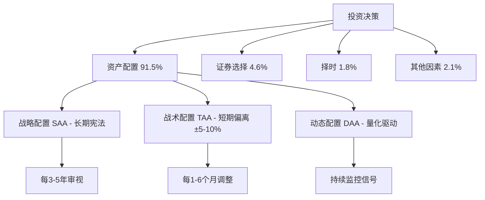
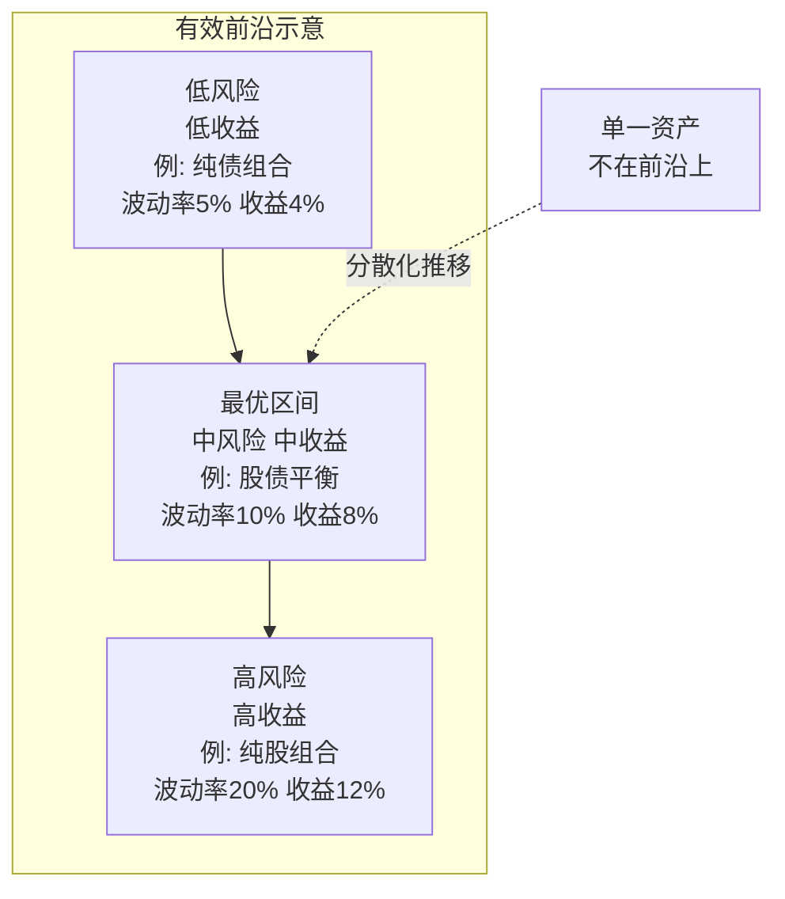
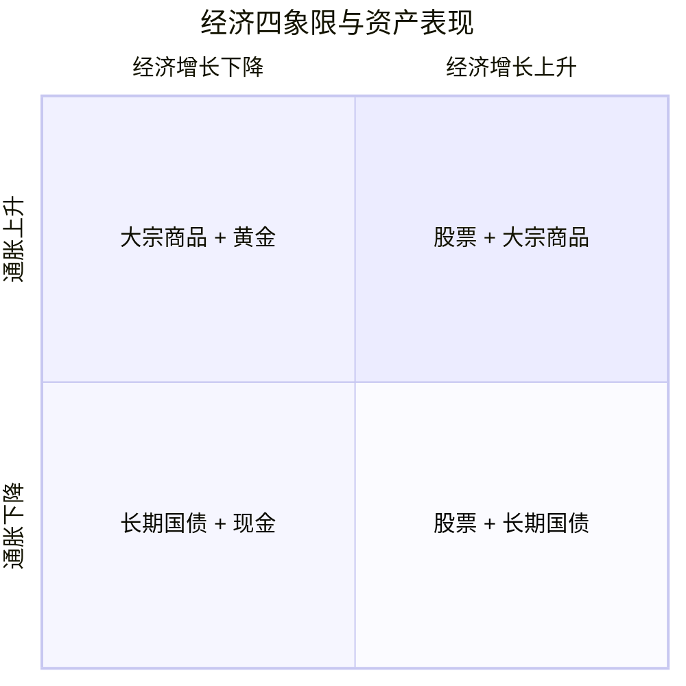
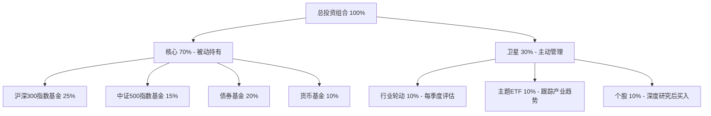
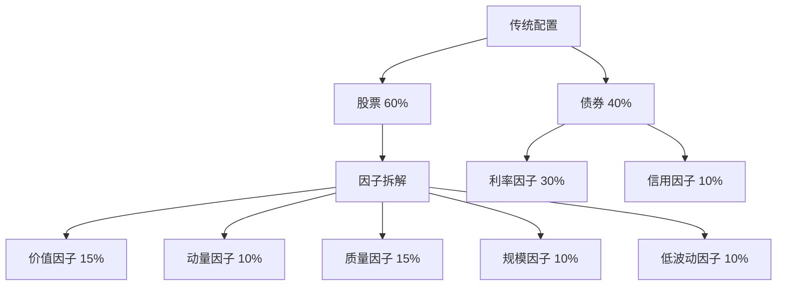

## 四、资产配置：投资的基石

资产配置是投资世界中最被低估、也最容易被忽视的环节。绝大多数投资者把时间花在"买哪只股票"上，而诺贝尔奖级别的研究反复证明：**你把多少钱放在股票、债券、黄金、现金之间，这个比例决策对收益的影响力，远远超过你选了哪只具体的股票。** 本章将从理论根基到实操落地，系统性地拆解资产配置的每一个关键环节。

### 4.1 什么是资产配置？

资产配置（Asset Allocation）是投资决策中最核心的环节，指的是将投资资金按一定比例分配到不同类别的资产中，在风险和收益之间取得最优平衡。通俗地说，资产配置回答的不是"买哪只股票"的问题，而是"在股票、债券、黄金、现金之间各放多少钱"的问题。

这个区别至关重要。大多数投资新手把精力花在选股和择时上，而真正决定长期收益的，是大类资产之间的配比。

#### 4.1.1 五大资产类别

理解资产配置的第一步，是认识你手中的"弹药"——每类资产的风险收益特征、流动性、以及在组合中扮演的角色。

| 资产类别 | 代表品种 | 风险等级 | 预期收益 | 流动性 | 核心功能 |
|---------|---------|---------|---------|-------|---------|
| 现金及等价物 | 银行存款、货币基金、短期国债 | 极低 | 1-3% | 极高 | 应急储备、等待机会 |
| 固定收益类 | 国债、企业债、债券基金 | 低-中 | 3-6% | 中-高 | 稳定现金流、降低波动 |
| 权益类 | 股票、股票基金、指数基金 | 高 | 8-12% | 高 | 长期增值、跑赢通胀 |
| 不动产 | 自住房、投资房产、REITs | 中-高 | 5-10% | 低 | 抗通胀、租金收入 |
| 另类投资 | 黄金、大宗商品、私募、对冲基金 | 中-高 | 不确定 | 低-中 | 分散风险、对冲特殊场景 |

**每一类资产的核心逻辑：**

- **现金及等价物**：这是你的"弹药库"和"安全垫"。收益虽然最低，但在市场暴跌时，它是你能抄底的唯一弹药来源。货币基金（如余额宝）本质上是把钱借给银行和金融机构，风险极低但并非零风险——2022年末债市波动曾导致部分货币基金短暂出现净值下跌。
- **固定收益类**：债券是你组合的"减震器"。当股票暴跌时，债券通常会涨（因为央行会降息救市），起到对冲作用。但2022年的教训告诉我们：在极端加息周期下，股债可能同跌。债券不是"无风险"，信用债违约、利率上行都会造成损失。
- **权益类**：股票是长期增值的核心引擎。过去200年，全球股票的长期实际回报率（扣除通胀后）约为6-7%/年，远超其他所有资产类别。代价是波动极大——A股在任何单一年份的涨跌幅都可能超过±30%。
- **不动产**：房产是中国家庭最大的资产类别，占居民总资产的60%以上。它兼具使用价值（自住）和投资价值（增值+租金），但流动性极差（卖一套房可能需要3-6个月）。REITs（不动产投资信托基金）提供了流动性更好的替代方案。
- **另类投资**：黄金是"终极避险资产"，在地缘政治危机、货币贬值、极端通胀时表现突出。大宗商品（石油、农产品等）与经济周期高度相关。这些资产在正常时期可能是拖累，但在极端场景下能拯救你的组合。

#### 4.1.2 资产配置的三层含义

资产配置不是一次性的"设置好就不管"，而是一个包含三个层次的动态系统：

**战略资产配置（SAA, Strategic Asset Allocation）**：确定长期目标比例。比如"股6债4"，这是你的投资"宪法"，通常3-5年审视一次。SAA决定了你投资组合的长期风险收益特征，是最重要的一层。它的依据是你的风险承受能力、投资期限、财务目标。

**战术资产配置（TAA, Tactical Asset Allocation）**：在SAA基础上进行短期偏离。比如当前市场估值极低（沪深300市盈率低于10倍），你暂时将股票比例从60%提高到65%。偏离幅度通常在±5-10%范围内，偏离时间通常为1-6个月。TAA的本质是"在安全边际充足时适度激进，在估值过高时适度保守"。

**动态资产配置（DAA, Dynamic Asset Allocation）**：根据市场信号（估值、动量、波动率）系统性地调整比例，介于被动和主动之间。DAA通常有明确的量化规则，比如"当沪深300市盈率低于12倍时，股票仓位上限为80%；高于15倍时，股票仓位上限为50%"。它比TAA更系统化，减少了主观判断。

**三层配置的协作关系：** SAA决定了你组合的"地基"，TAA和DAA是地基上的"微调"。没有好的SAA，TAA和DAA就是空中楼阁。大多数普通投资者只需要做好SAA，辅以简单的再平衡规则即可。TAA和DAA更适合有一定量化基础的进阶投资者。

### 4.2 为什么资产配置是投资的基石？

#### 4.2.1 Brinson研究的真正含义

1986年，Gary Brinson、Hood和Beebower在《Financial Analysts Journal》发表了著名研究，分析了91家大型养老金1974-1983年的数据。1991年他们更新了研究。核心结论是：**投资组合收益差异（cross-sectional variation）的91.5%可以由资产配置政策来解释**。

这项研究被引用超过万次，但也被广泛误解。让我们澄清三个常见误区：

| 误解 | 事实 | 准确解读 |
|------|------|---------|
| "91.5%的收益来自资产配置" | 研究说的是**收益差异的解释比例**，不是收益来源 | 不同基金之间业绩差距的大小，91.5%取决于它们的股债配比不同 |
| "选股和择时不重要" | 研究说的是相对贡献小，不是零贡献 | 选股和择时确实有影响，但远不如资产配置 |
| "随便买就行，不需要研究" | 资产配置本身就是需要深思熟虑的决策 | 选对股债比例本身就是最难的决策之一 |

后续研究进一步验证了这一结论。Ibbotson和Kaplan（2000年）用不同方法确认：资产配置解释了约40%的收益水平差异和接近90%的收益时间序列变动。Roger Ibbotson在2010年的更新研究中进一步指出：**资产配置不仅解释了基金之间的业绩差异，也解释了单个基金业绩随时间的变化**。

无论用哪种口径分析，结论一致：**资产配置是投资回报最重要的决定因素**。

#### 4.2.2 数学原理：分散化的力量

资产配置的核心数学基础是**现代投资组合理论（Modern Portfolio Theory, MPT）**，由Harry Markowitz在1952年提出（他因此获得1990年诺贝尔经济学奖）。

关键公式——组合预期收益：

$$E(R_p) = \sum_{i=1}^{n} w_i \cdot E(R_i)$$

组合方差（风险）：

$$\sigma_p^2 = \sum_{i=1}^{n} \sum_{j=1}^{n} w_i \cdot w_j \cdot \sigma_i \cdot \sigma_j \cdot \rho_{ij}$$

其中 $\rho_{ij}$ 是资产 $i$ 和 $j$ 的相关系数。当 $\rho_{ij} < 1$ 时，组合风险小于各资产风险的加权平均——这就是**分散化的免费午餐**。

公式的核心启示：**组合的风险不等于各资产风险的简单加权平均。** 当资产之间的相关性小于1时，组合风险会低于加权平均值。相关性越低，风险缩减效果越明显。

用一个具体例子说明：

| 场景 | 资产A收益 | 资产B收益 | 组合收益（各50%） |
|-----|----------|----------|-----------------|
| 牛市 | +30% | +10% | +20% |
| 熊市 | -20% | +5% | -7.5% |
| 平稳 | +5% | +8% | +6.5% |

如果A和B的相关性很低（比如股票和债券的相关系数长期在0-0.3之间），组合的波动远小于单独持有任何一个资产。从表中可以看到：牛市时组合不如单独持有A，但熊市时组合的亏损远小于A。**分散化的本质是用"放弃部分上行空间"换取"大幅缩减下行风险"**——对于长期投资者而言，这是一笔极划算的交易。

#### 4.2.3 有效前沿与最优组合

Markowitz理论的核心概念是**有效前沿（Efficient Frontier）**：在给定风险水平下能获得最高预期收益的组合集合。

**有效前沿的实际意义：**

- 有效前沿上的组合，每承受1单位风险获得的收益最高（夏普比率最大）
- 有效前沿下方的组合都"不够好"——同样的风险可以有更高收益，或者同样的收益可以承受更低风险
- 分散化是把你从有效前沿下方推向前沿的工具——**不花一分钱，只靠合理配比就能提升风险调整后收益**
- 有效前沿不是一个点，而是一条曲线——你可以根据自己的风险偏好在曲线上选择适合的点

**有效前沿的局限：** 它依赖于历史数据估算预期收益、波动率和相关性，而这些参数会随时间变化。因此有效前沿是"参考框架"而非"精确地图"。实际操作中，用历史数据计算的最优组合在未来的风险收益特征可能偏离预期。

#### 4.2.4 一个直觉性的例子

假设你有100万元，面临两个选择：

**方案A：全仓买入A股基金**
- 如果明年A股涨30%，你赚30万
- 如果明年A股跌25%，你亏25万
- 你完全押注于A股的表现

**方案B：50万A股基金 + 30万债券基金 + 10万黄金ETF + 10万货币基金**
- 如果明年A股涨30%，你的收益约为17万（因为其他资产涨幅小）
- 如果明年A股跌25%，你的亏损约为8万（债券和黄金可能涨，缓冲了损失）
- 你的命运不取决于任何单一资产

方案B的"上限"更低，但"下限"也高得多。对于需要用这笔钱养老、买房、供孩子上学的人来说，方案B的可预测性远比方案A的"上限"重要。**资产配置的核心价值不是最大化收益，而是在你能承受的风险范围内最大化收益。**

### 4.3 核心资产配置策略

#### 4.3.1 生命周期投资理论（Age-Based Allocation）

该理论的核心假设：投资者的风险承受能力随年龄下降。年轻时有更长的投资期限来消化短期波动，接近退休时则需要更多稳定性。

**年龄分段配置建议：**

| 年龄段 | 股票 | 债券 | 现金 | 核心逻辑 |
|-------|------|------|------|---------|
| 25-35岁 | 70-80% | 15-25% | 5% | 时间是最大的武器，全力追求增长 |
| 35-45岁 | 60-70% | 20-30% | 5-10% | 收入高峰但家庭支出增加，适度降风险 |
| 45-55岁 | 45-55% | 30-40% | 10-15% | 退休临近，开始转向保值 |
| 55-65岁 | 30-40% | 40-50% | 10-20% | 保本优先，构建收入型组合 |
| 65岁以上 | 20-30% | 40-50% | 20-30% | 最大化稳定性，确保取用便利 |

**经验法则的进化：**

| 法则 | 公式 | 适用场景 | 时代背景 |
|-----|------|---------|---------|
| 100法则 | 股票占比 = 100 - 年龄 | 传统保守建议 | 20世纪的利率和寿命环境 |
| 110法则 | 股票占比 = 110 - 年龄 | 现代中等风险 | 人均寿命突破75岁 |
| 120法则 | 股票占比 = 120 - 年龄 | 寿命延长+低利率环境 | 退休后仍需20-30年投资期 |

为什么法则在"进化"？两个原因：一是人均寿命延长，退休后仍需要20-30年的投资期来对抗通胀；二是全球利率长期下行，纯债券组合的收益已不足以支撑退休生活。

**举个具体例子：** 一个60岁的人，按100法则只配40%股票。但如果他预期寿命85岁，还有25年投资期——这比很多年轻人的投资期还长。如果只持有40%股票+60%债券，假设债券年化收益3%，25年后他的购买力将被通胀侵蚀超过40%。因此按120法则配60%股票可能更合理。

**生命周期理论的局限：**

- 同龄人的风险承受能力差异巨大（有房vs无房、单身vs养娃、稳定工作vs创业）
- 忽略了个人收入的稳定性和增长性——公务员和自由职业者的配置应截然不同
- 年龄只是一个粗略的代理变量，不应机械套用
- 没有考虑已有资产规模——一个30岁已积累500万资产的人，和一个30岁刚开始存钱的人，配置应完全不同

更精确的做法是综合评估：年龄、收入稳定性、家庭负担、已有资产、心理承受力。本书4.6节会给出完整的风险评估工具。

#### 4.3.2 60/40经典组合

60%股票+40%债券，是西方投资界最广泛使用的基准配置。其逻辑是：股票提供增长，债券提供缓冲和收入，两者历史上负相关或低相关。

**60/40组合的历史表现（美股+美国国债，1928-2023）：**
- 年化收益：约8.5%
- 年化波动率：约11%
- 最大回撤：约-30%（2008年金融危机）
- 夏普比率：约0.40-0.50

**60/40组合在不同时代的表现差异巨大：**

| 时代 | 宏观环境 | 60/40表现 | 关键事件 |
|------|---------|-----------|---------|
| 1980-2000 | 利率长期下行+经济繁荣 | 黄金时代，股债双牛 | 沃尔克加息后利率从15%降至5% |
| 2000-2010 | 互联网泡沫+金融危机 | 表现尚可，债券对冲了股票暴跌 | 两次大熊市中债券均上涨 |
| 2010-2020 | 超低利率+QE | 表现不错，但债券收益被压缩 | 股票牛市拉动整体收益 |
| 2020-2023 | 零利率→暴力加息 | 遭遇几十年来最大挑战 | 2022年股债同跌，组合回撤-17% |

**60/40组合面临的挑战：**

- 2022年股债同跌（美联储暴力加息），暴露了"股债负相关"在高通胀+加息周期下可能失效的问题
- 低利率环境下债券收益率过低，40%债券严重拖累收益
- 不包含另类资产（黄金、商品），在极端通胀环境下缺乏对冲工具
- 名义上的60/40，在风险贡献上其实是"90/10"——因为股票波动率是债券的4-5倍，对组合风险的实际贡献超过90%

**结论：60/40仍是一个不错的起点，但现代投资者需要更丰富的配置——至少加入黄金和少量大宗商品来覆盖通胀场景。**

#### 4.3.3 永久投资组合（Permanent Portfolio）

由Harry Browne在1980年代提出，核心理念是：经济运行只有4种状态，配置4种资产各25%来覆盖所有场景。

| 经济状态 | 对应资产 | 该资产的表现 | 触发信号 |
|---------|---------|------------|---------|
| 繁荣（Prosperity） | 股票 | 企业盈利增长，股价上涨 | GDP增长加速，就业改善 |
| 通胀（Inflation） | 黄金 | 货币贬值，黄金保值 | CPI持续高于央行目标 |
| 衰退（Recession） | 长期国债 | 央行降息，债券价格上涨 | GDP负增长，失业率上升 |
| 通缩（Deflation） | 现金 | 购买力上升，现金为王 | CPI转负，资产价格全面下跌 |

**永久投资组合的历史表现（美国数据，1972-2023）：**
- 年化收益：约8-9%
- 年化波动率：约7%
- 最大回撤：约-12%
- 没有任何单一年份亏损超过-5%

**优点：**
- 极度简单，任何人都能执行——只需记住"各25%"这一个规则
- 不需要预测经济走势——无论发生什么，总有1-2类资产在赚钱
- 波动极低，持有体验好——适合容易焦虑的投资者
- 适合不想花时间研究市场的人

**缺点：**
- 黄金和现金各25%意味着一半资金在"沉睡"，长期收益不如股票主导的组合
- 中国市场长期国债流动性不如美国，且久期选择有限
- 没有不动产和另类资产的配置
- 25%黄金在非极端通胀环境下拖累收益——黄金在1980-2000年间几乎没有正收益

**永久投资组合的中国适配版：**

| 资产 | 原版 | 中国适配版 | 调整原因 |
|------|------|-----------|---------|
| 股票 | 美国股票25% | A股宽基15%+海外指数10% | 分散单一市场风险 |
| 长期国债 | 美国长期国债25% | 中国10年期国债ETF 25% | 中国国债久期偏短，可适当放大比例 |
| 黄金 | 实物黄金25% | 黄金ETF 15%+大宗商品ETF 10% | 增加大宗商品覆盖更广的通胀场景 |
| 现金 | 美元现金25% | 货币基金25% | 保持高流动性 |

#### 4.3.4 全天候策略（All Weather Strategy）

由桥水基金创始人Ray Dalio提出，是永久投资组合的升级版。核心思想不是简单的四等分，而是基于**风险平价（Risk Parity）**——让每类资产对组合的风险贡献相等。

**经典全天候配置：**

| 资产类别 | 配置比例 | 对应经济环境 | 风险贡献 |
|---------|---------|------------|---------|
| 股票 | 30% | 经济增长上升+通胀上升 | ~25% |
| 长期国债 | 40% | 经济增长下降+通胀下降 | ~25% |
| 中期国债 | 15% | 降低整体波动 | ~25% |
| 黄金 | 7.5% | 通胀上升 | ~12.5% |
| 大宗商品 | 7.5% | 通胀上升 | ~12.5% |

注意：虽然国债名义上占55%，但由于其波动率远低于股票，对组合风险的实际贡献只约50%。这正是风险平价的精髓——**按风险贡献配比，而非按资金配比**。

**全天候的本质——四象限模型：**

**全天候策略的关键特征：**
- 使用杠杆（Dalio的原版通过杠杆放大低波动资产的收益，普通投资者不建议模仿杠杆部分）
- 年化波动率约7-8%，但收益可达9-12%
- 最大回撤控制在10-15%
- 核心是"等风险贡献"而非"等金额分配"
- 在任何单一经济环境下都不会遭受毁灭性打击，但也不会在任何环境下获得最高收益

**在中国复刻全天候的调整：**
- 中国国债久期选择需考虑国内利率周期——建议用10年期国债ETF而非30年期
- 大宗商品可通过商品期货基金（如华夏饲料豆粕期货ETF、有色ETF）实现
- 可加入公募REITs增强不动产配置
- 股票部分建议分散到A股+港股+美股——单一市场风险过高

#### 4.3.5 风险平价策略（Risk Parity）

风险平价是全天候策略的数学化版本，核心原则：**让每个资产对组合总风险的贡献相等**。

传统60/40组合的问题：虽然债券占40%，但由于股票波动率远高于债券，股票对组合风险的贡献可能超过90%。名义上是60/40，实际上是"风险上的90/10"。

风险平价的计算步骤：

1. **计算每类资产的年化波动率**：比如股票20%、债券5%、黄金15%
2. **计算波动率的倒数**：股票1/20%=5、债券1/5%=20、黄金1/15%=6.67
3. **归一化为配置比例**：总和=31.67，股票=5/31.67=15.8%、债券=20/31.67=63.2%、黄金=6.67/31.67=21%

简化示例：

| 资产 | 年化波动率 | 传统配比 | 风险平价配比 | 风险贡献（平价后） |
|-----|----------|---------|------------|-----------------|
| 股票 | 20% | 60% | 25% | ~33% |
| 债券 | 5% | 40% | 65% | ~33% |
| 黄金 | 15% | 0% | 10% | ~33% |

注意：风险平价给债券极高的资金配比（65%），这意味着如果不使用杠杆，组合的预期收益会偏低。这也是为什么桥水的全天候基金使用杠杆来放大收益——他们用杠杆把低波动资产的收益放大到可接受的水平。**普通投资者如果不用杠杆，风险平价组合的长期收益可能只有5-7%，低于60/40组合。**

#### 4.3.6 核心-卫星策略（Core-Satellite）

将投资组合分为两部分，兼顾纪律性和灵活性：

**核心（Core）：60-80%**
- 宽基指数基金（沪深300、中证500、标普500）
- 低费率、长期持有、被动管理
- 目标：获取市场平均收益（Beta）
- 这部分"不需要动脑子"，纪律性是唯一要求

**卫星（Satellite）：20-40%**
- 行业基金、主题ETF、个股
- 主动管理、灵活调整
- 目标：获取超额收益（Alpha）
- 这部分允许你表达自己的投资观点

**核心-卫星策略的优势：**
- 核心部分纪律性强，不会因为追涨杀跌而偏离
- 卫星部分满足"参与感"和"超额收益"的追求——很多投资者不买个股会觉得"无聊"
- 即使卫星部分亏损严重，核心部分提供了安全垫
- 适合大部分投资者——既不想完全被动，又不想完全主动

**核心-卫星策略的执行纪律：**
- 核心部分每年再平衡一次即可，不需要频繁操作
- 卫星部分设定止损线——单个卫星仓位亏损超过30%必须检视逻辑是否成立
- 卫星部分的总占比不超过30%——即使全部亏损也不会伤筋动骨
- 卫星部分的每笔交易都要有明确的买入理由和卖出条件

#### 4.3.7 定投策略（Dollar-Cost Averaging）

定投是资产配置的"执行层"——它决定了你如何把钱投入到已经确定的配置方案中。

**定投的核心原理：** 在固定时间间隔投入固定金额。价格高时买得少，价格低时买得多，自动实现"低买多、高买少"的效果，从而摊平成本。

**定投 vs 一次性投入的对比：**

| 维度 | 一次性投入 | 定投 |
|------|-----------|------|
| 最佳场景 | 持续上涨的市场 | 先跌后涨或震荡的市场 |
| 最差场景 | 买在最高点 | 持续上涨的市场（错过前期涨幅） |
| 心理压力 | 高（全部身家在市场中） | 低（分批进入，逐步适应） |
| 平均成本 | 等于买入时点的价格 | 低于买入期间的平均价格（波动越大效果越好） |
| 适合人群 | 有经验、能判断估值的投资者 | 大多数普通投资者 |

**定投的实操要点：**

1. **频率选择**：周定投和月定投的长期收益差异极小（<0.5%）。月定投更省心，选发工资后的第二天自动扣款即可。
2. **标的选择**：定投最适合波动大的品种（如股票指数基金），波动越大，"微笑曲线"效果越明显。波动小的品种（如债券基金、货币基金）定投意义不大。
3. **坚持时间**：定投至少坚持3年以上才能体现摊平成本的效果。1年以内的定投和一次性投入差别不大。
4. **止盈不止损**：定投达到目标收益（如年化15%）时可以分批止盈；但定投亏损时不应停止——恰恰是积累便宜筹码的好时机。
5. **估值辅助**：进阶版定投可以在估值低时加倍投入（"智慧定投"），估值高时减少投入。蚂蚁基金、天天基金等平台都提供智慧定投功能。

**定投的"微笑曲线"：**

在市场先跌后涨的过程中，定投的平均成本低于市场平均价格——因为你在低位买到了更多份额。这是定投最核心的优势。但要注意：如果市场持续下跌不反弹（如日本1990年后），定投也会持续亏损。定投的前提是你定投的标的长期会向上——所以**只定投宽基指数基金，不定投行业基金或个股**。

### 4.4 适合中国投资者的资产配置方案

#### 4.4.1 保守型（风险承受能力低）

适合人群：退休人士、风险厌恶者、短期（1-3年内）需要用钱的人。

| 资产类别 | 配置比例 | 推荐产品 | 选品要点 |
|---------|---------|---------|---------|
| 货币基金 | 30% | 余额宝、零钱通、天弘余额宝 | 选规模大、赎回快的 |
| 纯债基金 | 35% | 易方达纯债、招商产业债A | 选成立3年以上、规模>5亿的 |
| 银行理财 | 20% | R2级别理财产品 | 注意净值型产品也有波动 |
| 沪深300指数基金 | 10% | 华泰柏瑞沪深300ETF | 定投摊薄成本 |
| 黄金ETF | 5% | 华安黄金ETF(518880) | 少量配置对冲极端风险 |

**预期指标：** 年化收益3-5%，最大回撤控制在-3%以内

**保守型配置的关键提醒：**
- 货币基金收益虽然低，但它是你的"弹药库"——市场大跌时有现金加仓
- 纯债基金不是零风险，信用债违约、利率上行都会导致净值回撤
- 银行理财已打破刚兑，R2级也可能出现短期亏损——2022年11月债市调整期间，大量R2级理财产品出现净值回撤
- 10%的股票仓位看似不多，但在长期（10年以上）中会贡献显著的收益增量——这就是"少量股票+大量债券"优于"纯债券"的原因

#### 4.4.2 稳健型（风险承受能力中等）

适合人群：有稳定收入的上班族、3-5年投资期限、能接受10-15%的短期回撤。

| 资产类别 | 配置比例 | 推荐产品 | 选品要点 |
|---------|---------|---------|---------|
| 货币基金 | 10% | 场内货币ETF | 保持流动性 |
| 债券基金 | 25% | 中短债基金+二级债基 | 二级债基可配少量股票增厚收益 |
| A股宽基指数 | 30% | 沪深300ETF + 中证500ETF | 大盘+中小盘分散 |
| 港股指数 | 10% | 恒生科技指数ETF | 估值较低，分散A股集中风险 |
| 海外指数 | 15% | 标普500ETF联接(QDII) | 全球分散，对冲人民币风险 |
| 黄金ETF | 5% | 华安黄金ETF | 对冲尾部风险 |
| REITs | 5% | 公募REITs（如中金普洛斯） | 不动产敞口 |

**预期指标：** 年化收益6-10%，最大回撤控制在-15%以内

**稳健型配置的执行细节：**
- A股指数基金用"沪深300+中证500"组合比单买沪深300分散性更好——前者代表大盘蓝筹，后者代表中小盘成长
- 海外配置建议不低于15%——不要把所有鸡蛋放在一个市场。如果人民币贬值，海外资产是天然的对冲
- 债券部分用"中短债打底+二级债基增强"的结构，中短债波动小、流动性好，二级债基可以小仓位参与股市
- REITs是2021年才在中国上市的新品种，流动性还在改善中，建议选择底层资产为仓储物流或产业园的REITs，收益稳定性更好

#### 4.4.3 进取型（风险承受能力高）

适合人群：年轻投资者（25-40岁）、有高收入来源、5年以上投资期限、能承受-25%以上的回撤。

| 资产类别 | 配置比例 | 推荐产品 | 选品要点 |
|---------|---------|---------|---------|
| 货币基金 | 5% | 场内货币ETF | 最低限度流动性 |
| 债券基金 | 10% | 可转债基金 | 可转债有"下有保底、上不封顶"特征 |
| A股宽基指数 | 30% | 沪深300 + 中证500 + 创业板 | 全市场覆盖 |
| 行业/主题ETF | 15% | 科技、医药、新能源 | 根据产业趋势轮动 |
| 海外指数 | 20% | 标普500 + 纳斯达克100 | 美股科技龙头是全球增长引擎 |
| 港股 | 10% | 恒生科技 + 中概互联 | 高弹性、高波动 |
| 黄金/另类 | 10% | 黄金ETF + 商品ETF | 极端对冲 |

**预期指标：** 年化收益8-15%，最大回撤可能达到-25%甚至-30%

**进取型配置的风险提示：**
- 高权益仓位意味着你必须能承受"账面亏损20万还能睡着觉"的心理压力
- 行业/主题ETF是双刃剑——选对赛道可能翻倍，选错可能腰斩。建议单个行业不超过10%
- 港股和中概股波动极大，2021-2022年恒生科技指数跌幅超过70%，你确定你能承受？
- 可转债基金不是"稳赚不赔"——在极端熊市中，可转债也会大幅下跌（2024年初可转债曾出现大面积破面）
- 进取型配置不是"越激进越好"——即使是最激进的投资者，也需要10-15%的债券和现金作为"缓冲垫"和"弹药库"

#### 4.4.4 中国市场的特殊考量

投资中国市场有一些独特的结构性特征，必须纳入配置决策：

**A股的高波动性：** A股历史上年化波动率约25-30%，远高于美股的15-18%。这意味着同等股票仓位下，A股组合的波动更大，需要更多债券来缓冲。一个包含60%A股的组合，其波动率可能相当于包含80%美股的组合。

**散户占比高：** A股散户交易占比约60-70%，机构化程度不如美股。散户情绪驱动的暴涨暴跌更为频繁，定投和分散化的价值更大。反过来说，散户占比高也意味着"逆向投资"的超额收益空间更大——当所有人都恐慌时，往往是最好的买入时机。

**政策敏感性：** A股受政策影响极大——教育双减、互联网反垄断、房地产调控都曾导致相关板块暴跌。行业集中配置的风险比成熟市场更高。建议单一行业配置不超过总仓位的10%。

**QDII额度限制：** 海外基金（QDII）经常出现额度不足导致暂停申购的情况。建议：趁额度充裕时买入，或者通过港股通购买港股ETF替代。如果QDII暂停，可以考虑通过沪港通/深港通直接购买港股ETF来实现海外暴露。

**A/H溢价：** 同一家公司的A股通常比H股贵20-30%（A/H溢价指数长期在120-140）。从价值角度，港股有天然的估值优势。但港股的流动性不如A股，且受美元流动性影响更大。

**分红税差异：** A股持有超过1年免红利税；港股通过港股通持有需缴纳20%红利税（H股）或0-20%不等。这个税收差异会影响实际收益，高分红策略在A股更有税收优势。

### 4.5 再平衡策略

#### 4.5.1 为什么必须再平衡？

资产配置不是"设好就忘"的操作。市场涨跌会导致实际配比偏离目标。假设你的目标是"股6债4"：

| 时间 | 股票涨跌 | 债券涨跌 | 实际股债比 | 偏离幅度 |
|-----|---------|---------|----------|---------|
| 初始 | - | - | 60:40 | 0% |
| 1年后 | +20% | +3% | 66.5:33.5 | +6.5% |
| 2年后 | +15% | +4% | 70.3:29.7 | +10.3% |
| 3年后 | -25% | +5% | 54.6:45.4 | -5.4% |

如果不做再平衡，3年后你的配置已经严重偏离目标——在股市高位时股票仓位过重（风险放大），在股市低位时股票仓位又过轻（错过抄底）。

再平衡的本质是**纪律性的"高卖低买"**——卖出涨幅大的资产，买入涨幅小的资产。这违反人性（人总是想追涨杀跌），但长期有效。

**再平衡的收益来源：**
1. **均值回归收益**：资产价格长期会向均值回归，卖出涨多的、买入跌多的，长期能获得超额收益
2. **波动率收割**：即使资产价格最终回到原点，过程中的波动也能通过再平衡转化为收益
3. **纪律性收益**：避免了人类"追涨杀跌"的本能操作

#### 4.5.2 三种再平衡方法

**定期再平衡（Calendar Rebalancing）：**
- 频率：每季度或每年执行一次
- 优点：简单明确，不需要盯盘
- 缺点：可能在不需要调整时也调整（增加交易成本和税费）
- 实操：每年1月或生日当天统一调整一次即可

**阈值再平衡（Threshold Rebalancing）：**
- 规则：当任何一类资产偏离目标比例超过5个百分点时触发
- 优点：只在真正需要时才调整，减少不必要的交易
- 缺点：需要定期监控
- 实操：每月检查一次持仓，偏差>5%才动手

**定期+阈值混合法（推荐）：**
- 每季度检查一次，但只有偏差>5%时才执行再平衡
- 兼顾纪律性和效率
- 大多数智能投顾（如蚂蚁帮你投、且慢等）采用这种模式

**三种方法的对比：**

| 维度 | 定期法 | 阈值法 | 混合法（推荐） |
|------|-------|-------|--------------|
| 复杂度 | 最低 | 中等 | 中等 |
| 交易频率 | 固定（可能过多） | 仅在需要时 | 仅在需要时 |
| 交易成本 | 可能偏高 | 较低 | 较低 |
| 纪律性 | 最强 | 需要自律 | 较强 |
| 适合人群 | 完全不想管的人 | 有时间关注的人 | 大多数人 |

#### 4.5.3 再平衡的实操细节

**用新增资金再平衡（最优方法）：** 如果你每月有新增投资资金，优先投向占比偏低的资产，而不是卖出占比偏高的资产。这样可以避免触发赎回费和资本利得税。

**操作示例：** 假设你的目标配置是股票60%、债券30%、黄金10%。当前实际配置是股票70%、债券25%、黄金5%。你每月新增投资1万元。
- 不要卖出股票基金
- 将1万元全部投入债券基金（7000元）和黄金ETF（3000元）
- 持续2-3个月后，配置会自然回归目标比例

**再平衡触发阈值：**

| 资产类别 | 建议阈值 | 理由 |
|---------|---------|------|
| 货币基金 | ±5% | 波动小，偏离通常不大 |
| 债券基金 | ±5% | 波动中等 |
| 股票基金 | ±10% | 波动大，频繁触发会增加成本 |
| 黄金/另类 | ±5% | 占比小，偏离影响有限 |

**为什么股票的阈值更高？** 因为股票波动率大，短期偏离5%是常态。如果每偏离5%就再平衡，你会被频繁触发，产生不必要的交易成本。给股票10%的阈值，意味着只在真正"偏离严重"时才动手。

**再平衡的成本考量：**
- 基金赎回费：持有<7天通常1.5%，>7天0-0.5%——再平衡时注意持有期
- 短期交易的摩擦成本：尽量避免频繁买卖
- 税费：目前中国个人买卖公募基金免资本利得税（但政策可能变化）
- 场内ETF交易费用：万分之三左右，远低于场外基金的申购赎回费

**心理挑战：** 再平衡最难的不是技术操作，而是心理执行。2020年底，再平衡要求你卖出涨了60%的A股基金买入债券——你会犹豫。2022年底，再平衡要求你卖出债券买入跌了30%的股票——你会恐惧。**能做到反人性操作的投资者，长期收益远超追涨杀跌的投资者。**

克服心理障碍的技巧：
1. **自动化**：设置提醒日历，到期就执行，不给自己犹豫的时间
2. **小步执行**：如果一次卖出太多心理压力大，可以分3次执行，每次调整1/3
3. **记录日志**：每次再平衡时记录市场情绪和你的心理状态，事后复盘会发现"最难的操作往往是收益最高的"

### 4.6 风险承受能力评估

#### 4.6.1 客观风险承受能力

这是你"能承受"多少风险，取决于你的财务状况：

| 评估维度 | 低承受力（1分） | 中承受力（2分） | 高承受力（3分） |
|---------|---------|---------|---------|
| 投资期限 | <3年 | 3-7年 | >7年 |
| 收入稳定性 | 不确定/自由职业 | 一般稳定 | 非常稳定（公务员等） |
| 应急储备 | 不足 | 3-6个月支出 | >6个月支出 |
| 负债率 | >50% | 30-50% | <30% |
| 投资占总资产比 | >80% | 50-80% | <50% |
| 家庭负担 | 重（多子女/老人） | 中等 | 轻 |

**评分方法：** 6项相加，总分6-10分为低承受力，11-15分为中承受力，16-18分为高承受力。

#### 4.6.2 主观风险容忍度

这是你"愿意承受"多少风险，取决于你的心理特征：

**自我测试：** 假设你投资10万元，一个月后变成8万元（亏损20%），你会：
- A. 立即全部卖出，不能再亏了 → 低容忍度（1分）
- B. 卖出一部分，保留一部分 → 中容忍度（2分）
- C. 不动，甚至考虑加仓 → 高容忍度（3分）

**更全面的容忍度测试：**

| 场景 | 低容忍度 | 中容忍度 | 高容忍度 |
|------|---------|---------|---------|
| 亏损20%时 | 立即全部卖出 | 卖出一部分 | 不动或加仓 |
| 看到别人赚钱时 | 立即跟风买入 | 关注但不动 | 坚持自己方案 |
| 市场暴跌时 | 恐慌、失眠 | 焦虑但能忍 | 冷静甚至兴奋 |
| 持有亏损资产时 | 每天看盘 | 每周看一次 | 每月看一次 |

**最终配置 = min(客观承受能力, 主观容忍度)**

如果客观上你能承受高风险但主观上不能（看到亏损就失眠），就选中等方案。投资的第一原则是"活下来"——如果你因为恐慌在最低点卖出，再好的配置方案也没用。

**一个重要的认知：** 风险容忍度是可以训练的。从小额投资开始，逐步增加仓位，在实践中适应波动。很多投资老手的容忍度远高于新手——不是因为他们天生胆大，而是经历过多次牛熊后，对波动有了"免疫"。

### 4.7 常见资产配置误区

#### 误区一：把"分散"理解为"多买几只基金"

买了10只A股基金≠分散。如果这10只基金都是大盘成长股，你的风险是高度集中的。真正的分散需要三个维度：

| 分散维度 | 伪分散 | 真分散 |
|---------|--------|--------|
| 跨资产类别 | 只买股票基金 | 股票+债券+商品+现金 |
| 跨市场 | 只买A股基金 | A股+港股+美股+新兴市场 |
| 跨风格 | 只买成长型 | 大盘+小盘、成长+价值 |

一个简单的检验方法：看你的基金持仓前十重仓股。如果多只基金的重仓股高度重合（比如都持有茅台、宁德时代），那你实际上并没有分散。

#### 误区二：追逐去年的冠军资产

2020年白酒涨了80%，很多人2021年初重仓白酒基金，结果2021-2023年白酒回撤超过40%。这种现象在投资中反复出现，被称为"冠军魔咒"：

| 年份 | 当年冠军板块 | 次年表现 |
|------|------------|---------|
| 2019 | 半导体 +95% | 2020年继续涨但波动加大 |
| 2020 | 白酒 +80% | 2021年回撤-15%，2022年暴跌-30% |
| 2021 | 新能源 +60% | 2022年暴跌-35% |
| 2022 | 煤炭 +40% | 2023年回调-10% |

资产配置的意义恰恰在于**不预测哪个资产会涨**，而是做好准备应对任何情况。

#### 误区三：过高的期望收益

很多人期望年化收益20%以上。现实是：巴菲特长期年化约20%，全球顶级对冲基金长期年化约15%。一个普通投资者能做到8-12%的年化收益，就已经跑赢了90%的人。

**复利的力量：** 即使"只是"年化10%，30年后1万元会变成17.4万元。年化15%会变成66.2万元。不需要追求20%以上的收益率，时间和复利才是普通投资者最大的武器。

#### 误区四：不做海外配置

只投A股是把所有鸡蛋放在一个篮子里。A股过去10年的表现不如美股，过去3年不如日本、印度、越南。全球配置不是"崇洋媚外"，是理性的风险管理。

**全球配置的额外好处：**
- 对冲人民币贬值风险——如果你的收入、房产、投资全部以人民币计价，一旦人民币大幅贬值，你的全部财富都会缩水
- 不同市场的经济周期不同步——A股和美股的相关性约0.3-0.5，同时持有能显著降低组合波动
- 获取中国没有的投资机会——如美国科技巨头、欧洲奢侈品公司、日本半导体设备商

#### 误区五：忽视债券的作用

"年轻人不需要债券"是错误的观点。债券在组合中的作用不仅是收益，更重要的是**降低波动**和**提供再平衡的弹药**。2008年A股跌了65%，同期债券涨了12%。有20%债券仓位的人，回撤从65%降到50%——少亏的15%就是"救命钱"。

更关键的是：当股票暴跌30%后，有债券仓位的人可以卖出部分债券抄底股票，而满仓股票的人只能眼睁睁看着——没有弹药可用。

#### 误区六：一次性全仓买入

即使是最好的配置方案，如果买在市场最高点，也需要很长时间才能回本。2007年10月A股6124点买入的人，到2015年才回本——等了8年。

建议用**3-6个月时间分批建仓**，或者采用"目标市值法"：设定目标持仓金额，每月买入差额部分。比如你的目标是持有10万元股票基金，当前持有6万元，这个月就买入4万元；如果下个月股票涨了，当前持有变成11万元，就不再买入甚至卖出1万元。

#### 误区七：频繁调整配置方案

今天看到一篇文章说"价值投资好"就换成价值基金，明天看到一个视频说"量化基金牛"就换成量化基金——这是最常见的自毁行为。频繁调整意味着：
- 不断在高位买入热门基金
- 产生大量交易费用
- 永远无法体验"持有3年以上"的复利效果

**选择一个配置方案后，至少坚持1年以上再评估。** 每次想调整时，问自己："是我的配置方案逻辑出了问题，还是我被短期波动影响了情绪？"

### 4.8 资产配置的实操工具

#### 4.8.1 基金选择清单

**A股指数基金：**

| 基金类型 | 推荐标的 | 费率（管理+托管） | 适合配置 | 跟踪指数特征 |
|---------|---------|----------------|---------|------------|
| 沪深300ETF | 华泰柏瑞510300 | 0.2%+0.1% | 大盘核心 | 300只大盘蓝筹，代表中国经济核心 |
| 中证500ETF | 南方510500 | 0.15%+0.05% | 中小盘补充 | 500只中盘股，成长性更强 |
| 创业板ETF | 易方达159915 | 0.15%+0.05% | 成长风格 | 创业板100只龙头，科技成长属性 |
| 科创50ETF | 华夏588000 | 0.5%+0.1% | 科技创新 | 50只科创板龙头，研发投入高 |
| 中证1000ETF | 南方512100 | 0.15%+0.05% | 小盘风格 | 1000只小盘股，弹性最大 |

**债券基金：**

| 基金类型 | 推荐标的 | 特点 | 适合场景 |
|---------|---------|------|---------|
| 短债基金 | 嘉实超短债 | 货币基金替代，波动极小 | 现金管理、等待机会 |
| 中长期纯债 | 广发纯债A | 纯债，不含股票 | 组合中的稳定器 |
| 二级债基 | 易方达增强回报A | 含少量股票（<20%），增厚收益 | 稳健型投资者的核心债券仓位 |
| 可转债基金 | 兴全可转债 | 进可攻退可守 | 进取型投资者的债券替代 |

**海外及另类：**

| 基金类型 | 推荐标的 | 注意事项 |
|---------|---------|---------|
| 标普500联接 | 博时标普500ETF联接 | QDII额度可能暂停，趁额度充裕时买入 |
| 纳斯达克100 | 广发纳斯达克100 | 科技股集中度高，波动大于标普500 |
| 黄金ETF | 华安黄金ETF(518880) | 跟踪上海金交所金价，T+0交易 |
| 恒生科技ETF | 华夏恒生科技ETF | 港股科技龙头，估值较低 |

#### 4.8.2 智能投顾参考

| 平台 | 产品 | 特点 | 费率 |
|-----|------|------|-----|
| 蚂蚁基金 | 蚂蚁帮你投 | 基于风险评估自动配比 | 管理费0.5%+基金费 |
| 盈米基金 | 且慢 | 多种策略组合 | 策略不同费率不同 |
| 天天基金 | 智投组合 | 基于目标风险配比 | 基金费率 |

**智能投顾的优势：** 自动再平衡、纪律性强、省时省力。
**智能投顾的局限：** 收费不透明（部分产品在基金费率上加收服务费）、策略黑箱、灵活性不如自己操作、超额收益难以证明。

**建议：** 如果你完全不想花时间管理投资，智能投顾是一个可接受的选择。但如果你愿意花每月30分钟检查持仓，自己做资产配置的性价比更高——省下的0.5%管理费在30年复利下会是一笔可观的金额。

#### 4.8.3 一个完整的DIY资产配置模板

以稳健型投资者（月收入2万元，月投资能力1万元）为例，展示从零开始的完整执行流程：

**第一步：建立应急储备金（一次性投入）**
- 金额：月支出×6 = 约3.6万元
- 放置位置：货币基金（余额宝或银行活期理财）
- 重要性：这是你的"安全气囊"，必须在任何投资之前建立

**第二步：确定配置方案**

月度投资计划（1万元/月）：
├── 核心部分（80% = 8000元）
│   ├── 沪深300ETF定投：2500元（25%）
│   ├── 中证500ETF定投：1500元（15%）
│   ├── 海外指数基金（标普500联接）：1500元（15%）
│   ├── 中短期债基：1500元（15%）
│   └── 黄金ETF：1000元（10%）
├── 卫星部分（20% = 2000元）
│   ├── 行业/主题ETF：1000元（每季度轮动评估）
│   └── 港股ETF：1000元
└── 再平衡规则
    ├── 每季度末检查一次（1月/4月/7月/10月）
    ├── 偏差>5%则调整
    └── 优先用新增资金调整，减少卖出

**第三步：具体执行操作**

1. **开设账户**：选择一家费率低的券商（如华泰证券、东方财富证券），开通基金账户和ETF交易权限。ETF场内交易费率通常为万分之三，远低于场外基金的申购费（通常0.1-0.15%）。
2. **设置定投**：在基金APP（如天天基金、蛋卷基金）中设置每月自动定投，绑定工资卡，发工资后第二天自动扣款。
3. **记录持仓**：用一个Excel表格或记账APP记录每月买入的基金份额和成本，方便后续再平衡计算。

**第四步：年度审视清单**

每年1月做一次全面检查：

| 检查项 | 操作 | 工具 |
|-------|------|------|
| 配置偏离度 | 计算各资产实际占比vs目标占比 | Excel表格 |
| 再平衡需求 | 偏差>5%则执行再平衡 | 基金转换功能 |
| 风险承受能力变化 | 收入、家庭、年龄是否发生变化 | 4.6节评估表 |
| 产品审视 | 手中基金是否跑输同类平均水平 | 天天基金/晨星评级 |
| 海外额度 | QDII基金是否暂停申购 | 基金公司公告 |

**第五步：进阶优化（第2-3年后）**

- 增加因子投资配比（4.9节）
- 尝试估值辅助的智慧定投
- 根据积累的经验调整卫星部分的策略
- 考虑是否需要增加另类资产（商品ETF、REITs）

### 4.9 资产配置中的税务优化

#### 4.9.1 中国投资者需要关注的税务规则

目前中国个人投资者在公募基金投资方面的税务环境相对友好，但规则在不断变化：

| 税种 | 股票/ETF | 公募基金 | 债券 | 说明 |
|------|---------|---------|------|------|
| 资本利得税 | 免征 | 免征 | 免征 | 个人买卖公募基金和股票暂免 |
| 印花税 | 卖出0.05% | 免征 | 免征 | 只有股票交易收取 |
| 红利税 | 持有>1年免征 | 基金分红免征 | 利息收入免征 | 持有<1年需缴10-20% |
| 港股通红利税 | 20% | - | - | 通过港股通持有H股需缴税 |

**税务优化的核心原则：**

1. **长期持有减少交易频率**——频繁交易增加印花税和佣金成本
2. **优先选择ETF而非场外基金**——ETF交易费率更低（万三 vs 千一）
3. **高分红策略优先在A股实施**——A股持有>1年免红利税，港股通需缴20%
4. **关注政策变化**——资本利得税的免税政策并非永久，未来可能调整

#### 4.9.2 资产配置的税收效率排序

不同资产类别的税收效率不同，应该将税收效率低的资产放在免税账户（如有），税收效率高的资产放在普通账户：

| 资产类别 | 税收效率 | 原因 |
|---------|---------|------|
| 指数基金（低换手） | 最高 | 很少实现资本利得，红利再投资免税 |
| 货币基金 | 高 | 收益以"份额增加"形式体现，不涉及分红税 |
| 债券基金 | 中等 | 利息收入免税，但频繁交易的债券基金可能产生应税事件 |
| 主动管理基金 | 较低 | 高换手率可能在基金内部产生隐性税负 |
| 个股 | 较低 | 需要缴纳印花税，短期持有需缴红利税 |

### 4.10 进阶：因子投资与Smart Beta

#### 4.10.1 什么是因子投资？

传统的资产配置基于"大类资产"（股/债/商品），因子投资更进一步，基于"风险因子"（Value、Momentum、Size、Quality、Low Volatility）来构建组合。

研究发现，长期跑赢市场的收益来源可以归结为几个系统性因子：

| 因子 | 含义 | 长期超额收益来源 | 代表指数/基金 | 历史超额收益 |
|-----|------|----------------|-------------|------------|
| 价值（Value） | 低估值股票跑赢高估值 | 市场对困境企业的过度悲观 | 中证红利指数 | 年化2-4% |
| 动量（Momentum） | 过去涨得好的继续涨 | 趋势延续效应 | 动量因子ETF | 年化2-5% |
| 规模（Size） | 小盘股跑赢大盘股 | 流动性溢价 | 中证1000指数 | 年化1-3% |
| 质量（Quality） | 高ROE、低杠杆企业跑赢 | 稳定盈利的溢价 | MSCI Quality | 年化1-3% |
| 低波动（Low Vol） | 低波动股票跑赢高波动 | 彩票偏好偏差 | 中证800低波 | 年化1-3% |

**为什么因子能跑赢市场？** 两种解释：
1. **风险补偿**：承担了额外的风险，获得了额外的补偿（如小盘股流动性差，需要更高收益来补偿）
2. **行为偏差**：投资者系统性地犯错（如过度追捧热门股、忽视困境企业），因子策略利用了这些错误

#### 4.10.2 因子投资的实操

Smart Beta ETF将因子策略产品化，投资者可以直接购买：

**红利策略（最适合中国投资者的因子）：** 中证红利指数(000922.CSI)——选取沪深两市现金股息率高、分红稳定的100只股票。过去10年年化收益约10-12%，且在熊市中表现更抗跌。红利策略在中国特别有效，因为：
- A股高分红股票往往是成熟行业的龙头企业，基本面扎实
- 持有>1年免红利税，税收效率高
- 高分红提供了"强制止盈"效果——不管市场涨跌，每年都有现金流入

**价值策略：** 沪深300价值指数——从沪深300中选取市净率、市盈率、股息率等指标最优的100只股票。

**组合使用：** 选择2-3个低相关性的因子组合配置，比单一因子更稳健。推荐组合：
- 红利+低波动：防守型组合，适合稳健投资者
- 红利+质量：攻守兼备，适合长期持有
- 价值+动量：进攻型组合，适合进取投资者

**因子投资的注意事项：**
- 因子会"失效"——没有任何因子能每年都跑赢市场，价值因子在2010-2020年的美股中就长期落后
- 因子之间存在周期轮动，需要长期持有（5-10年）才能体现效果
- 因子拥挤（太多人做同一策略）会削弱超额收益——当某个因子策略被广泛采用后，其超额收益会下降
- 不要同时追逐太多因子——2-3个已经足够，因子之间可能在某些环境下同时失效

#### 4.10.3 从资产配置到因子配置

进阶投资者可以从"资产类别配置"升级为"因子配置"：

这种视角让你更精确地理解自己的风险暴露——你可能以为自己"分散投资了"，但实际上你所有的基金都暴露在同一个"成长因子"上。因子视角能帮你识别这种隐性集中。

### 4.11 建仓策略：从零开始的完整流程

#### 4.11.1 分批建仓 vs 一次性建仓

对于大多数投资者，分批建仓是更稳妥的选择：

| 建仓方式 | 操作 | 适合场景 | 心理压力 |
|---------|------|---------|---------|
| 一次性建仓 | 第一天全部买入 | 市场明显低估时 | 高（担心买在高点） |
| 分批建仓（3个月） | 每月买入1/3 | 大多数情况 | 中等 |
| 分批建仓（6个月） | 每月买入1/6 | 高波动市场或大额资金 | 低 |
| 估值驱动建仓 | 低估时多买，高估时少买 | 有估值判断能力的投资者 | 低 |

**分批建仓的实操示例：** 假设你有30万元一次性资金需要建仓（目标配置：股票60%、债券30%、黄金10%）。

第一个月（总投入10万）：
├── 沪深300ETF：3万
├── 中证500ETF：2万
├── 海外指数ETF：1万
├── 债券基金：3万
└── 黄金ETF：1万

第二个月（总投入10万）：
├── 沪深300ETF：3万
├── 中证500ETF：2万
├── 海外指数ETF：1万
├── 债券基金：3万
└── 黄金ETF：1万

第三个月（总投入10万）：
├── 沪深300ETF：3万
├── 中证500ETF：2万
├── 海外指数ETF：1万
├── 债券基金：3万
└── 黄金ETF：1万

#### 4.11.2 建仓期间的心理管理

建仓期间最大的挑战是：**你可能刚买完第一笔，市场就跌了10%。** 这时你会想："是不是应该等一等？"答案是：不要停。分批建仓的意义恰恰在于——下跌时你第二笔、第三笔能买到更多便宜筹码。

建仓期间的三条铁律：
1. **写好计划就执行**——不要因为短期波动修改计划
2. **不看盘**——建仓期间每天看盘只会增加焦虑，对决策毫无帮助
3. **预留"加仓弹药"**——如果建仓期间市场暴跌15%以上，可以用额外资金加速建仓

### 4.12 本章小结

| 要点 | 核心结论 |
|-----|---------|
| 重要性 | 资产配置决定90%以上的收益差异，选股择时是次要的 |
| 理论基础 | 现代投资组合理论（MPT）——分散化是免费的午餐 |
| 策略选择 | 没有"最好"的策略，只有最适合你风险承受能力的策略 |
| 生命周期 | 年龄是参考而非铁律，综合评估个人情况 |
| 中国市场 | A股高波动、政策敏感、散户占比高，需要更注重分散化 |
| 再平衡 | 纪律性"高卖低买"，是资产配置长期有效的关键保障 |
| 定投 | 波动越大越适合定投，至少坚持3年以上 |
| 税务优化 | 长期持有、优先ETF、关注政策变化 |
| 因子投资 | 进阶工具，红利因子在中国特别有效 |
| 常见错误 | 伪分散、追热点、忽视债券、不做海外配置、频繁换方案 |
| 行动指南 | 先做风险评估→选配置比例→选具体产品→分批建仓→设再平衡规则→坚持执行 |

**最后一句话：资产配置的核心不是聪明，而是纪律。选择一个合理的方案，然后坚持10年、20年、30年。时间会奖励那些有耐心的人。**
