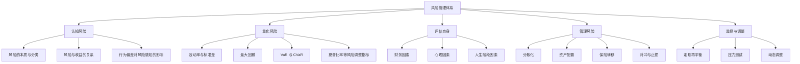
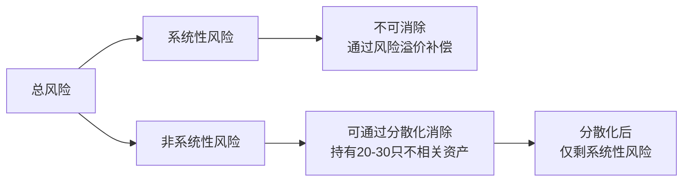
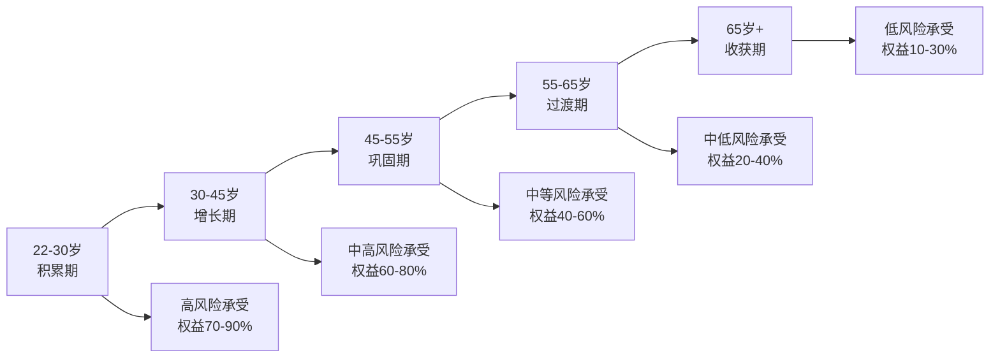
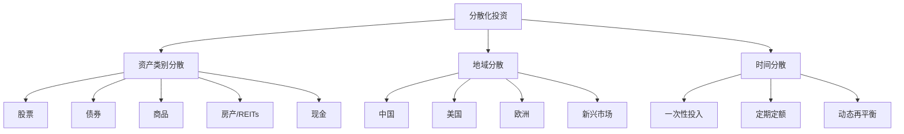
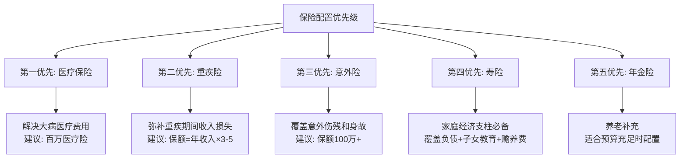
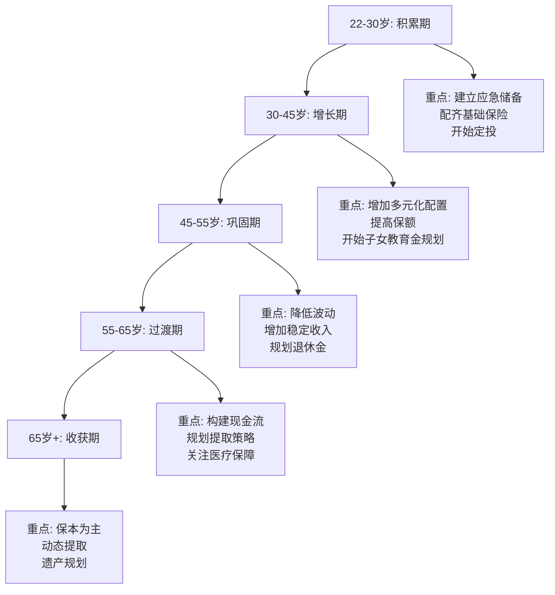

## 五、风险管理理论

投资的本质不是追求收益最大化，而是在**可承受的风险范围内**获取最优回报。正如诺贝尔奖得主威廉·夏普所言："投资管理的核心是风险管理，而非收益追逐。"本章将系统性地拆解风险的本质、量化方法、评估框架和管理策略，帮助你建立科学的风险认知体系。



### 5.1 风险的本质

在金融学中，风险（Risk）被定义为**未来收益的不确定性**——实际收益偏离预期收益的可能性。这个定义包含三层含义：

- **不确定性不等于损失**：风险既包含"可能亏损"的下行，也包含"可能超额收益"的上行。但在实际投资中，大多数人更关注下行风险，因为亏损带来的心理痛苦是同等金额收益带来快乐的2-2.5倍（损失厌恶效应）。
- **风险是概率性的**：风险描述的是多种可能结果的分布，而非单一确定的结果。一个预期收益10%的投资，可能在-20%到+40%之间波动。
- **风险具有时间维度**：短期波动和长期亏损是两种完全不同的风险。一只股票单日下跌5%是波动，但如果你持有10年且最终亏损，这才是真正的损失风险。

理解风险的本质是所有后续决策的基础。很多投资者把"波动"等同于"风险"，这是一个危险的简化。波动是价格的短期上下震荡，而风险是永久性资本损失的可能性。一只股票可以在一个月内下跌30%后又涨回来——这是波动；但如果一家公司破产了，你的投资归零——这才是风险。

#### 5.1.1 系统性风险与非系统性风险

这是金融学中最重要的风险分类，直接决定了你的投资策略应该怎么做。

**系统性风险（Systematic Risk）**：

也称为市场风险或不可分散风险，是指影响整个市场或大部分资产的风险因素。

| 风险来源 | 作用机制 | 典型案例 |
|---------|---------|---------|
| 宏观经济周期 | GDP下滑导致企业盈利整体下降 | 2008年全球金融危机 |
| 利率变动 | 央行加息/降息影响所有资产估值 | 2022年美联储激进加息 |
| 通货膨胀 | 货币购买力下降侵蚀实际回报 | 2021-2022年全球通胀 |
| 地缘政治 | 战争、贸易摩擦引发市场恐慌 | 2022年俄乌冲突 |
| 突发公共事件 | 疫情等黑天鹅事件冲击经济 | 2020年新冠疫情 |

系统性风险的衡量指标是**贝塔系数（Beta）**：

- Beta = 1：与市场波动一致
- Beta > 1：波动大于市场（如科技股Beta通常在1.2-1.5之间）
- Beta < 1：波动小于市场（如公用事业股Beta通常在0.5-0.7之间）
- Beta = 0：与市场无关（如国债）

**关键机制**：市场通过**风险溢价**来补偿承担系统性风险的投资者。这就是为什么股票长期回报高于债券——股票投资者承担了更多的系统性风险，获得了相应的补偿。根据资本资产定价模型（CAPM），预期收益 = 无风险利率 + Beta × 市场风险溢价。

**非系统性风险（Unsystematic Risk）**：

也称为特有风险或可分散风险，是指只影响特定公司、行业或地区的风险。

| 风险来源 | 示例 |
|---------|------|
| 公司经营风险 | 管理层决策失误、产品失败、财务造假 |
| 行业风险 | 技术颠覆、政策监管、供需失衡 |
| 事件风险 | 诉讼、自然灾害、供应链中断 |

**核心结论**：根据马科维茨的投资组合理论，持有20-30只不同行业、不同地区的股票，可以消除约70-90%的非系统性风险。**投资者只能从承担系统性风险中获得补偿，承担非系统性风险不会获得额外收益，只会增加不必要的波动。** 分散化是投资中唯一的"免费午餐"。



#### 5.1.2 更完整的风险分类体系

除了系统/非系统分类外，个人投资者还需要理解以下风险维度：

| 风险类型 | 定义 | 示例 | 应对策略 |
|---------|------|------|---------|
| 流动性风险 | 资产无法快速变现或变现成本过高 | 房产急售折价20%+、小盘股跌停无法卖出 | 保持一定比例高流动性资产 |
| 信用风险 | 交易对手无法履行承诺 | P2P暴雷、企业债违约 | 分散投资、选择高信用等级 |
| 通胀风险 | 收益率低于通胀率导致实际购买力下降 | 存款利率2%但通胀3% | 配置抗通胀资产（股票、房产、TIPS） |
| 汇率风险 | 外币资产因汇率变动产生损失 | 人民币升值导致美元资产缩水 | 多币种配置、对冲 |
| 政策风险 | 政府法规变化导致资产价值变动 | 教培双减政策、房产限购 | 关注政策趋势、行业分散 |
| 再投资风险 | 到期资金无法以同等收益率再投资 | 降息周期中债券到期 | 梯形配置、锁定长期利率 |
| 集中度风险 | 单一资产占比过高 | 全仓一只股票或单一行业 | 控制单一资产占比上限（建议<15%） |
| 机会成本风险 | 资金锁定在低收益资产中错失更好机会 | 大量资金存定期存款 | 保持合理的流动性配比 |
| 序列风险 | 退休提取阶段，早期大幅亏损导致资金提前耗尽 | 退休头两年遭遇熊市 | 梯形提取、动态提取率 |
| 操作风险 | 交易失误、系统故障、密码泄露 | 下单手误多输一个零 | 双重确认、限额交易、密码管理 |

#### 5.1.3 序列风险——退休阶段的隐形杀手

序列风险（Sequence of Returns Risk）是个人投资者最容易忽视、却最具破坏力的风险之一。它指的是：**在你需要从投资组合中定期取钱的阶段，市场下跌的先后顺序会决定你的钱能用多久**。

**为什么序列风险如此重要？**

假设两位投资者A和B，都在60岁时拥有100万，每年提取5万（5%提取率），投资30年。两人的平均年化收益完全相同（7%），但收益的**顺序**不同：

| 年份 | 投资者A（先涨后跌） | 投资者B（先跌后涨） |
|------|-------------------|-------------------|
| 第1年 | +25% → 120万 | -25% → 70万 |
| 第2年 | +25% → 145万 | -15% → 55万 |
| 第3年 | -25% → 104万 | +25% → 64万 |
| 第4年 | -15% → 83万 | +25% → 75万 |
| 30年后 | 剩余约85万 | 第22年资金耗尽 |

同样的平均收益，同样的提取率，**先跌后跌导致提前8年耗尽资金**。这就是序列风险的残酷之处。

**应对序列风险的策略**：

1. **现金缓冲桶**：退休初期保留2-3年生活费的现金/短债，熊市时不卖出股票资产
2. **动态提取率**：牛市年份多提（如6%），熊市年份少提（如3%），而非固定比例
3. **梯形债券配置**：每年到期一笔债券覆盖当年支出，确保5年内不需要卖出股票
4. **延迟退休或兼职**：在市场大跌时推迟退休，避免在低点锁定亏损

### 5.2 风险的量化指标

"无法衡量的东西，就无法管理。"——彼得·德鲁克。以下是个人投资者需要掌握的核心风险量化工具。

#### 5.2.1 波动率（Volatility）与标准差

标准差是最基础的风险衡量指标，衡量收益率围绕均值的离散程度。

**计算公式**：

σ = √[Σ(Ri - R̄)² / (n-1)]

其中 Ri 为各期收益率，R̄ 为平均收益率，n 为观测期数。

**各类资产的历史波动率参考**：

| 资产类别 | 年化标准差 | 波动等级 | 含义 |
|---------|----------|---------|------|
| 货币基金 | 0.3-0.5% | 极低 | 几乎无波动，日收益稳定 |
| 国债 | 3-5% | 低 | 年度波动通常在±5%以内 |
| 投资级债券基金 | 4-7% | 低至中 | 受利率和信用环境影响 |
| A股沪深300 | 20-25% | 高 | 典型年份波动±25%，极端年份更大 |
| 美股标普500 | 15-20% | 中至高 | 长期年化约15%，但年际差异大 |
| 新兴市场股票 | 25-35% | 极高 | 受政治和汇率双重影响 |
| 比特币 | 60-80% | 极端 | 年度波动可达数倍 |

**标准差的局限性**：

1. **假设正态分布**：实际金融市场的收益分布往往呈现"肥尾"特征——极端事件发生的概率远高于正态分布预测。2008年金融危机中，标普500单日跌幅超过7%的"7个标准差事件"在正态分布下应该每几亿年才出现一次。
2. **对称性假设**：标准差将上行波动和下行波动同等对待，但投资者只关心下行风险。
3. **历史依赖性**：用过去数据计算的波动率不一定能预测未来。2007年的低波动率指标完全没有预警2008年的危机。

#### 5.2.2 最大回撤（Maximum Drawdown）

最大回撤衡量投资组合从历史最高点到最低点的最大跌幅，直观地回答了一个问题："一笔投资最多会亏多少？"

**计算公式**：

最大回撤 = (谷值 - 峰值) / 峰值 × 100%

**各类资产的历史最大回撤**：

| 资产类别 | 历史最大回撤 | 发生时段 | 恢复时长 |
|---------|------------|---------|---------|
| 货币基金 | ≈0% | — | — |
| 国债（10年期） | -5%至-10% | 利率快速上升期 | 1-2年 |
| A股沪深300 | -72% | 2007年10月-2008年11月 | 约10年（至2015年） |
| 美股标普500 | -56% | 1929-1932年大萧条 | 约25年 |
| 美股标普500 | -49% | 2007年10月-2009年3月 | 约4年 |
| 日经225 | -82% | 1989-2009年 | 35年后仍未完全恢复 |

**最大回撤的实用价值**：

最大回撤比标准差更贴近投资者的真实体验。一个标准差15%的投资，你可能会遇到50%的最大回撤。在投资前，你需要问自己：**如果我的100万变成50万，我能否承受而不恐慌卖出？** 如果答案是否定的，说明你的仓位超出了风险承受能力。

**最大回撤的三个维度**：

评估最大回撤时，不能只看跌幅，还要看另外两个维度：

- **持续时间**：从峰值到谷底经历了多久？2008年金融危机的下跌持续了约17个月，而2015年A股股灾仅用了2个月。持续时间越长，对投资者心理的折磨越大。
- **恢复时间**：从谷底恢复到前高需要多久？A股2007年高点到2015年才恢复，整整8年。如果你在2007年高点入场，需要8年才能回本——这还不算通胀侵蚀。
- **回撤深度 vs 恢复幅度**：下跌50%需要上涨100%才能回本，下跌70%需要上涨233%才能回本。亏损和盈利的数学关系是不对称的。

| 回撤深度 | 回本所需涨幅 | 难度指数 |
|---------|------------|---------|
| -10% | +11% | ★ |
| -20% | +25% | ★★ |
| -30% | +43% | ★★★ |
| -40% | +67% | ★★★★ |
| -50% | +100% | ★★★★★ |
| -60% | +150% | ★★★★★★ |
| -70% | +233% | ★★★★★★★ |

#### 5.2.3 在险价值（VaR）与条件在险价值（CVaR）

**VaR（Value at Risk）** 回答的是："在正常市场条件下，给定置信水平，我在一段时间内最多会亏多少？"

例如，"95%置信度下，日VaR为2%"意味着：有95%的把握，单日亏损不会超过2%；但有5%的概率，亏损会超过2%。

| 置信水平 | 含义 | 适用场景 |
|---------|------|---------|
| 90% | 10天中有1天可能超过此亏损 | 日常监控 |
| 95% | 20天中有1天可能超过此亏损 | 常规风险管理 |
| 99% | 100天中有1天可能超过此亏损 | 保守风控 |

**CVaR（Conditional VaR，又称预期短缺 ES）** 是VaR的升级版，回答的是："当我真的突破VaR线时，平均亏损有多大？"

CVaR比VaR更适合管理极端风险，因为它关注的是尾部损失的平均值而非分界点。机构投资者普遍采用CVaR作为风险限额指标。

**个人投资者的简化应用**：

虽然精确计算VaR需要专业软件，但你可以用简化公式快速估算：

简化日VaR ≈ 组合价值 × 波动率 × 1.65（95%置信度）

例如：100万投资组合，年化波动率20%，则日波动率 ≈ 20%/√252 ≈ 1.26%，日VaR ≈ 100万 × 1.26% × 1.65 ≈ 2.08万。即95%置信度下，单日亏损通常不超过2.08万。

**VaR的三大局限**：

1. **不告诉你最坏能亏多少**：VaR只告诉你"95%的情况下最多亏2%"，但那5%的极端情况可能亏10%、20%甚至更多。这就是为什么需要CVaR来补充。
2. **假设历史会重复**：VaR基于历史数据计算，但下一次危机的形态可能完全不同。
3. **在危机中失效**：2008年之前，各大银行的VaR模型都显示风险很低。危机爆发后，实际亏损远超VaR预测。VaR在最需要它的时候反而失灵了。

**用Python快速计算VaR的示例**：

```python
import numpy as np

def calculate_var(returns, confidence=0.95):
    """计算历史模拟法VaR"""
    sorted_returns = np.sort(returns)
    index = int((1 - confidence) * len(sorted_returns))
    var = -sorted_returns[index]
    return var

def calculate_cvar(returns, confidence=0.95):
    """计算条件VaR（预期短缺）"""
    sorted_returns = np.sort(returns)
    index = int((1 - confidence) * len(sorted_returns))
    cvar = -np.mean(sorted_returns[:index])
    return cvar

# 示例：假设你有252个交易日的收益率数据
np.random.seed(42)
daily_returns = np.random.normal(0.0003, 0.015, 252)  # 日均0.03%，日波动1.5%

var_95 = calculate_var(daily_returns, 0.95)
cvar_95 = calculate_cvar(daily_returns, 0.95)

print(f"95%置信度日VaR: {var_95:.2%}")
print(f"95%置信度日CVaR: {cvar_95:.2%}")
print(f"假设100万组合，日最大亏损约: {1000000 * var_95:,.0f}元")
```

运行这段代码可以快速估算你的投资组合在正常市场条件下的最大日亏损。建议每月用最新数据重新计算一次。

#### 5.2.4 风险调整后收益指标

单独看收益或风险都不够，关键是要看**每承担一单位风险获得了多少超额回报**。

**夏普比率（Sharpe Ratio）**：

夏普比率 = (投资组合收益率 - 无风险收益率) / 投资组合标准差

这是最广泛使用的风险调整指标。它衡量的是每承担一单位总风险所获得的超额回报。

| 夏普比率 | 评级 | 说明 |
|---------|------|------|
| < 0 | 差 | 承担了风险但连无风险收益都没跑赢 |
| 0 - 0.5 | 一般 | 风险调整后收益偏低 |
| 0.5 - 1.0 | 良好 | 风险补偿合理 |
| 1.0 - 2.0 | 优秀 | 风险调整后收益出色 |
| > 2.0 | 卓越 | 长期维持此水平极为罕见 |

**实战案例对比**：

| 投资组合 | 年化收益 | 年化波动率 | 夏普比率 | 评价 |
|---------|---------|----------|---------|------|
| 组合A | 15% | 25% | (15%-3%)/25% = 0.48 | 一般——高收益但风险更大 |
| 组合B | 10% | 10% | (10%-3%)/10% = 0.70 | 良好——风险调整后更优 |
| 组合C | 8% | 5% | (8%-3%)/5% = 1.00 | 优秀——低波动高性价比 |

从绝对收益看组合A最好，但从风险调整角度看组合C最优。这就是为什么风险管理如此重要——**不管理风险的高收益可能只是运气，而非能力**。

**索提诺比率（Sortino Ratio）**：

索提诺比率 = (投资组合收益率 - 无风险收益率) / 下行标准差

与夏普比率的区别：只计算下行波动率（亏损波动），忽略上行波动。这更符合投资者的心理——涨得多不算风险，跌得多才算。

**卡玛比率（Calmar Ratio）**：

卡玛比率 = 年化收益率 / 最大回撤

直接衡量收益与最坏情况的关系。例如，年化12%收益、最大回撤20%的投资，卡玛比率为0.6。一般认为卡玛比率>1为优秀。

**信息比率（Information Ratio）**：

信息比率 = (投资组合收益率 - 基准收益率) / 跟踪误差

衡量的是主动管理相对于基准的超额收益与跟踪误差的比值。信息比率>0.5说明基金经理的主动管理有价值，>1说明非常优秀。对于选择主动基金的投资者，这个指标比夏普比率更有参考意义。

**各指标适用场景对比**：

| 指标 | 最关心的问题 | 优势 | 局限 |
|------|------------|------|------|
| 夏普比率 | 每单位总风险的超额回报 | 最通用，易于比较 | 不区分上下行波动 |
| 索提诺比率 | 每单位下行风险的超额回报 | 更符合投资者心理 | 下行样本可能不足 |
| 卡玛比率 | 收益与最坏情况的关系 | 直观，关注极端风险 | 受单一极端事件影响大 |
| 信息比率 | 主动管理相对于基准的价值 | 评估基金经理能力 | 需要合适的基准 |

### 5.3 风险承受能力评估

风险承受能力（Risk Capacity）和风险容忍度（Risk Tolerance）是两个不同但常被混淆的概念：

- **风险承受能力**是客观的——你**能**承担多少风险（取决于财务状况）
- **风险容忍度**是主观的——你**愿意**承担多少风险（取决于心理特质）

两者中取较低值，才是适合你的风险水平。

#### 5.3.1 财务因素评估

| 评估维度 | 高承受能力特征 | 低承受能力特征 |
|---------|-------------|-------------|
| 收入稳定性 | 体制内/大型企业，收入可预测 | 自由职业/创业，收入波动大 |
| 收入增长性 | 职业上升期，收入逐年增长 | 收入停滞或面临裁员风险 |
| 资产规模 | 投资资产远超生活必需资金 | 投资资金占比接近生活底线 |
| 负债水平 | 无负债或低负债，月供<收入30% | 高杠杆，月供>收入50% |
| 投资期限 | 10年以上（如30岁投资养老） | 3年以内（如近期购房首付） |
| 应急储备 | 6个月以上生活费的紧急备用金 | 无应急储备或不足1个月 |
| 保险覆盖 | 配齐重疾/医疗/意外/寿险 | 基本无保险保障 |

**核心原则**：投资的钱必须是"闲钱"——即使全部亏损也不会影响基本生活的资金。如果你的投资资金与生活资金混在一起，任何市场波动都会影响你的投资决策。

**一个简单的计算方法**：

安全投资金额 = 总资产 - 应急储备（6个月生活费）- 近期大额支出（3年内） - 保险费用

例如：
- 总资产：100万
- 应急储备：12万（月生活费2万 × 6个月）
- 3年内计划买房首付：30万
- 年保险费用：2万 × 3年 = 6万
- **可用于投资的闲钱 = 100 - 12 - 30 - 6 = 52万**

这52万才是你真正可以承受风险的资金。用总资产100万来计算风险承受能力，会让你严重高估自己能承受的波动。

#### 5.3.2 心理因素自测

以下问题帮助你评估自己的风险容忍度：

1. 投资组合下跌10%时，你会：A. 加仓 B. 持有不动 C. 减少仓位 D. 全部卖出
2. 你的投资决策更多基于：A. 数据分析 B. 专家建议 C. 直觉感受 D. 朋友推荐
3. 你关注投资账户的频率：A. 每季度 B. 每月 C. 每周 D. 每天甚至实时
4. 面对"保本但低收益"和"可能亏损但高收益"的选择，你倾向于：A. 后者 B. 看情况 C. 前者

**结果解读**：选择越多A，风险容忍度越高；选择越多D，风险容忍度越低。注意，风险容忍度会随投资经验和市场环境变化而改变。

**心理承受力的"压力测试"**：

在确定风险等级之前，做一个自我压力测试。闭上眼睛，认真想象以下场景，注意你的身体反应（心跳加速、胃部不适、焦虑感）：

- 场景1：你的100万投资组合，一个月内变成了85万（-15%），且还在继续下跌。新闻头条全是"股灾""崩盘"。
- 场景2：你的100万变成了65万（-35%），你的同事朋友都在割肉离场，社交媒体上一片哀嚎。
- 场景3：你的100万变成了50万（-50%），你的配偶问你"我们的钱还能回来吗"。

**如果场景2已经让你感到强烈的不安，你的风险等级应该是"稳健型"而非"进取型"**。诚实面对自己的心理承受力，比任何模型计算都重要。

#### 5.3.3 人生阶段与风险承受能力的关系

风险承受能力不是静态的，它随人生阶段而变化。理解这种变化规律，可以帮助你提前调整资产配置，避免在错误的时间承担过多风险。



| 人生阶段 | 年龄范围 | 财务特征 | 风险承受能力 | 建议权益占比 | 核心策略 |
|---------|---------|---------|------------|------------|---------|
| 积累期 | 22-30岁 | 收入起步，资产少，时间长 | 高（有时间弥补亏损） | 70-90% | 积极定投，大胆配置成长型资产 |
| 增长期 | 30-45岁 | 收入上升，有家庭责任 | 中高（收入增长可覆盖风险） | 60-80% | 增加配置多元化，开始配置债券 |
| 巩固期 | 45-55岁 | 收入高峰，子女教育开支大 | 中等（距离退休有限） | 40-60% | 降低波动，增加稳定收入型资产 |
| 过渡期 | 55-65岁 | 收入下降，退休临近 | 中低（亏损恢复时间不足） | 20-40% | 防守为主，构建现金流资产 |
| 收获期 | 65岁+ | 退休收入，医疗开支增加 | 低（无工资收入补充） | 10-30% | 保本为主，关注提取策略 |

**关键提醒**：上述比例是参考值，具体取决于你的财务状况。一个65岁但有丰厚退休金和多套房产的人，风险承受能力可能比一个30岁背着房贷的年轻人还高。

#### 5.3.4 综合风险等级与资产配比建议

| 风险等级 | 适合人群画像 | 能承受的最大年度亏损 | 建议权益类占比 | 核心配置思路 |
|---------|------------|----------------|-------------|------------|
| 保守型 | 退休人士、短期内需用资金、极度厌恶波动 | -5%以内 | 10-20% | 以债券和货币基金为主，少量指数基金 |
| 稳健型 | 有一定积蓄的中年人、风险意识较强 | -10%至-15% | 30-50% | 股债平衡，债券为压舱石 |
| 平衡型 | 收入稳定的年轻专业人士、有一定投资经验 | -15%至-20% | 50-70% | 权益为主、债券为辅、适当另类资产 |
| 进取型 | 高收入、长投资期限、投资经验丰富 | -20%至-30% | 70-90% | 重仓权益、少量债券对冲 |
| 激进型 | 极高收入、极长投资期限、能完全接受高波动 | -30%以上 | 90-100% | 几乎全部权益配置 |

**重要提醒**：不要高估自己的风险承受能力。牛市中人人都觉得自己是进取型投资者，但熊市来临时才发现自己其实承受不了。**用你经历过的最痛苦的投资亏损来校准**——如果你曾因20%的亏损而失眠，那你的风险等级就不是进取型。

### 5.4 风险管理的六大核心策略

#### 策略一：分散化投资——免费的午餐

分散化是最基础也最有效的风险管理手段，但很多人对分散化的理解存在误区。

**分散化的三个维度**：



**分散化的数学原理**：

假设你持有n只资产，每只资产的波动率为σ，资产间的平均相关系数为ρ，则组合波动率近似为：

σ_组合 ≈ σ × √[ρ + (1-ρ)/n]

当ρ=0（完全不相关）时，持有16只资产可以将波动率降低到单只资产的1/4。当ρ=0.3（正相关）时，分散效果减弱，但仍能降低约30%的波动。

**分散化效果的直观理解**：

| 持有资产数量 | 相关系数=0时波动率降幅 | 相关系数=0.3时波动率降幅 | 相关系数=0.7时波动率降幅 |
|------------|---------------------|------------------------|------------------------|
| 1只 | 0%（基准） | 0%（基准） | 0%（基准） |
| 4只 | 50% | 38% | 18% |
| 10只 | 68% | 49% | 23% |
| 20只 | 78% | 55% | 25% |
| 50只 | 86% | 59% | 26% |
| 100只 | 90% | 60% | 27% |

可以看到：当资产高度相关（ρ=0.7）时，即使持有100只资产，也只能降低27%的波动。**分散化的关键不在于数量，而在于相关性**。

**常见分散化误区**：

| 误区 | 正确做法 |
|------|---------|
| 持有10只同一行业的股票 | 不同行业、不同风格的20-30只股票或基金 |
| A股买了很多只基金但都跟踪沪深300 | 配置不同指数+主动基金+债券基金 |
| 买了黄金和股票，认为已经分散 | 黄金与股票在极端行情中可能同向下跌（流动性危机时全部资产被抛售） |
| 基金数量多就是分散 | 5只同类基金不如1只宽基+1只债券基金 |

**真正的分散需要低相关性**：关键不是持有多少资产，而是持有多少**不相关**的资产。以下是常见资产的相关性矩阵：

| | A股 | 美股 | 中国国债 | 美国国债 | 黄金 | 房产 |
|---|-----|------|---------|---------|------|------|
| A股 | 1.0 | 0.3 | -0.1 | -0.2 | 0.0 | 0.2 |
| 美股 | 0.3 | 1.0 | 0.0 | -0.3 | -0.1 | 0.1 |
| 中国国债 | -0.1 | 0.0 | 1.0 | 0.2 | 0.1 | -0.1 |
| 黄金 | 0.0 | -0.1 | 0.1 | 0.2 | 1.0 | 0.0 |

（注：相关性为示意值，实际相关性会随市场环境变化）

**中国国债与A股呈轻微负相关**，是天然的对冲工具。这就是为什么股债组合（如经典的60/40组合）长期表现优于纯股票投资。

**分散化的"伪分散"陷阱**：

很多投资者以为自己做了分散，实际上只是做了"表面分散"。以下是几种常见的伪分散：

1. **行业集中型**：买了5只基金，但全部重仓白酒和新能源。看似分散，实际暴露在同一行业风险下。
2. **风格集中型**：全是成长型基金或全是价值型基金。风格轮动时会同时下跌。
3. **市场集中型**：全部投资A股，没有任何海外配置。当A股系统性下跌时无处可躲。
4. **相关性幻觉**：在正常时期看起来不相关的资产，在危机中突然变得高度相关。

**真正的分散配置示例**（以100万为例）：

| 资产 | 配比 | 金额 | 相关性特征 |
|------|------|------|-----------|
| A股宽基指数 | 25% | 25万 | 与国内经济正相关 |
| 美股指数（QDII） | 15% | 15万 | 与A股低相关 |
| 中国国债/债券基金 | 25% | 25万 | 与股市负相关 |
| 黄金ETF | 10% | 10万 | 与股债均低相关 |
| REITs/房产信托 | 10% | 10万 | 介于股债之间 |
| 货币基金/现金 | 15% | 15万 | 与一切低相关 |

#### 策略二：定期定额投资——时间维度的分散

定投通过分散买入时间来降低择时风险。无论市场涨跌，都按固定金额定期买入，在市场低迷时买入更多份额，在市场高涨时买入较少份额，自动实现"低买多、高买少"的成本均摊效果。

**定投的数学本质**：

假设每月定投1000元：
- 基金净值1元时，买入1000份
- 基金净值0.5元时，买入2000份
- 基金净值2元时，买入500份
- 平均成本 = 3000元 / 3500份 ≈ 0.857元 < 均价1.167元

定投的平均成本始终低于算术平均价格，这就是定投的数学优势。

**定投的适用场景与局限**：

| 场景 | 定投效果 | 原因 |
|------|---------|------|
| 震荡市 | 优秀 | 低买高卖自动实现 |
| 单边下跌 | 良好 | 持续摊薄成本，反弹时更快回本 |
| 单边上涨 | 一般 | 不如一次性投入，但至少不会踏空 |
| 先跌后涨（微笑曲线） | 最佳 | 定投的经典获利模式 |

**定投增强策略**：

1. **估值定投法**：当指数PE低于历史30%分位时加倍定投，高于70%分位时减半定投或暂停
2. **目标止盈法**：定投收益达到预设目标（如30%）时，分批止盈，然后重新开始新一轮定投
3. **均线偏离法**：当指数价格低于250日均线10%以上时加码，高于10%时减码

#### 策略三：止损与仓位管理

止损是投资纪律的最后一道防线。

**止损的适用场景**：

- **适用于**：个股投资、趋势交易、衍生品交易
- **不适用于**：指数基金长期定投、资产配置再平衡

**常见止损方法**：

| 方法 | 规则 | 优缺点 |
|------|------|--------|
| 固定比例止损 | 亏损达到预设比例（如-10%）时卖出 | 简单明确，但可能频繁触发 |
| 移动止损 | 以最高点为基准，回撤一定比例（如-15%）时卖出 | 能锁定部分利润，但可能过早离场 |
| 技术止损 | 跌破关键支撑位（如200日均线）时卖出 | 有技术依据，但支撑位可能被假突破 |
| 时间止损 | 持有超过预定期限仍未盈利时卖出 | 控制资金占用效率 |

**仓位管理比止损更重要**：

单只个股的仓位上限建议不超过总资产的15%。即使某只股票跌到零，你的总损失也只有15%——痛苦但不致命。

**凯利公式——科学的仓位计算**：

凯利公式最初用于赌场投注，后被广泛应用于投资仓位管理。它告诉你在有正期望值的机会面前，应该投入多大比例的资金：

最优仓位比例 = (p × b - q) / b

其中：p = 胜率，q = 1-p（败率），b = 盈亏比（平均盈利/平均亏损）

**示例**：假设你的投资策略胜率为55%，平均盈利为15%，平均亏损为10%：

最优仓位 = (0.55 × 1.5 - 0.45) / 1.5 = 0.30 = 30%

实际操作中，建议使用"半凯利"（即凯利公式结果的一半），因为：
- 你的胜率和盈亏比估计可能不准确
- 减少波动对心理的冲击
- 留出安全边际应对估计误差

上例中半凯利 = 15%，与"单只资产不超过15%"的经验法则吻合。

金字塔仓位法：
- 第一层（40%）：核心仓位，持有宽基指数基金
- 第二层（30%）：卫星仓位，持有行业/主题基金
- 第三层（20%）：机会仓位，择时操作个股
- 第四层（10%）：现金储备，等待极端机会

#### 策略四：保持流动性——应对不确定性

流动性风险是个人投资者最容易忽视的风险。在市场恐慌时，流动性差的资产可能无法变现，或者必须大幅折价出售。

**流动性阶梯设计**：

| 层级 | 资产类型 | 金额 | 变现时间 | 用途 |
|------|---------|------|---------|------|
| 第一层 | 现金/活期存款 | 1个月生活费 | 即时 | 日常开支 |
| 第二层 | 货币基金 | 2-3个月生活费 | T+0至T+1 | 应急储备 |
| 第三层 | 短债基金/国债 | 3-6个月生活费 | T+1至T+3 | 重大意外 |
| 第四层 | 股票/长期基金 | 全部投资资金 | T+1 | 长期增值 |
| 第五层 | 房产/私募 | 大额资产 | 数周至数月 | 长期配置 |

**流动性陷阱案例**：

2022年末，某大型债券基金遭遇大额赎回，基金经理被迫在流动性差的债券市场折价抛售资产，导致净值单日暴跌超过12%。原本"低风险"的债券基金，因为流动性危机变成了高风险资产。

**流动性风险的识别信号**：

以下信号表明你可能面临流动性风险：

1. **应急储备不足**：没有6个月以上的现金/货币基金储备
2. **资产锁定**：大量资金在封闭期产品中（如3年期理财、私募基金）
3. **变现成本高**：持有的资产如果急售需要大幅折价（如房产、非标债权）
4. **收入单一**：只有工资收入，没有任何被动收入来源
5. **负债过高**：月供超过收入50%，没有任何缓冲空间

**检验你的流动性健康度**：

用"失业压力测试"来检验——假设你明天失业，没有任何收入，在不卖出任何投资资产的前提下，你能维持现有生活水平多久？

- 能撑12个月以上：流动性优秀
- 能撑6-12个月：流动性良好
- 能撑3-6个月：流动性一般，需要改善
- 不到3个月：流动性危险，立即补充应急储备

#### 策略五：保险——将极端风险转移给专业机构

保险是个人风险管理中不可替代的工具。它解决的核心问题是：**小概率但毁灭性的事件**。

**保险配置的优先级**：



**保险的核心原则**：

1. **先保障后理财**：纯保障型保险（消费型）的杠杆远高于储蓄型/返还型保险。花同样的钱，消费型重疾险的保额可能是返还型的3-5倍。
2. **先大人后小孩**：大人才是家庭经济支柱，大人的保障优先于小孩。
3. **先保额后保费**：保额充足是第一位的，在预算范围内优先确保保额足够。
4. **定期优于终身**：对于预算有限的年轻人，定期重疾险（保至70岁）的性价比远高于终身重疾险。

**不同家庭角色的保险配置方案**：

| 家庭角色 | 必备险种 | 保额建议 | 年预算参考 |
|---------|---------|---------|-----------|
| 家庭经济支柱 | 百万医疗+重疾+意外+定期寿险 | 重疾:年收入×3-5; 寿险:负债+子女教育 | 8000-15000元 |
| 配偶（有收入） | 百万医疗+重疾+意外 | 重疾:年收入×3 | 5000-10000元 |
| 配偶（无收入） | 百万医疗+意外 | 意外50-100万 | 1000-2000元 |
| 儿童 | 百万医疗+意外 | 意外20-50万 | 500-1500元 |
| 老人（60岁以下） | 百万医疗+意外+防癌险 | 意外50万 | 3000-6000元 |
| 老人（60岁以上） | 意外+防癌险 | 意外20万 | 1000-3000元 |

**保险与投资的关系**：

保险不能替代投资，投资也不能替代保险。两者解决不同的问题：
- 保险解决：**如果我出事了怎么办？**（极端风险兜底）
- 投资解决：**如何让钱为我工作？**（财富增长）

#### 策略六：定期再平衡——纪律性风险管理

再平衡是指定期将投资组合恢复到目标资产配置比例。

**再平衡的必要性**：

假设你的目标配置是60%股票+40%债券。一年后股票涨了30%，债券涨了5%：
- 股票占比变为：60%×1.3 / (60%×1.3 + 40%×1.05) ≈ 65%
- 债券占比变为：35%

你的组合已经偏离了目标风险水平——变成了65/35而非60/40。再平衡就是卖出部分股票、买入债券，恢复60/40的比例。

**再平衡的本质是"逆人性"操作**：卖出涨得多的（止盈），买入涨得少的（补仓）。这天然符合"低买高卖"的原则。

**再平衡方法对比**：

| 方法 | 规则 | 优缺点 |
|------|------|--------|
| 定期再平衡 | 每季度/半年/年度执行一次 | 简单，但可能错过最佳时机 |
| 阈值再平衡 | 任何资产偏离目标超过5%时执行 | 更精确，但需要更频繁监控 |
| 现金流再平衡 | 用新增资金调整比例，优先买入偏低的资产 | 无交易成本，适合持续定投者 |
| 混合法 | 定期检查+阈值触发 | 最实用：每季度检查，偏离>5%则再平衡 |

**再平衡的税务考量**：

在有资本利得税的环境下，再平衡可能触发税务事件。优先使用以下方法减少税负：
1. 用新增资金（而非卖出）调整比例
2. 在免税账户（如养老金账户）中再平衡
3. 利用亏损资产抵消盈利资产的资本利得（税务亏损收割）

### 5.5 风险与收益的关系

金融学最基本的原理之一：**风险与收益成正比。** 但这个原理需要更精确的理解。

**风险-收益的三层含义**：

1. **事前（预期）**：高风险资产有更高的**预期**收益率，这是投资者承担风险的补偿
2. **事后（实现）**：高风险资产不一定有更高的**实际**收益率——可能大赚也可能大亏
3. **长期**：风险-收益关系在**长期**才稳定，短期内可能完全反转（低风险资产可能短期跑赢高风险资产）

**各类资产的风险-收益全景图**：

| 资产类别 | 预期年化收益 | 年化波动率 | 最大回撤 | 风险等级 | 建议持有期 |
|---------|------------|----------|---------|---------|----------|
| 货币基金 | 1.5-2.5% | 0.3% | ≈0% | 极低 | 随时 |
| 银行存款 | 1.5-3% | 0% | 0% | 极低 | 按期限 |
| 国债 | 2.5-3.5% | 3-5% | -5%至-10% | 低 | 1-5年 |
| 债券基金 | 3-6% | 4-7% | -5%至-15% | 低至中 | 1-3年 |
| 宽基指数基金 | 8-12% | 15-25% | -50%至-70% | 中至高 | 5年以上 |
| 行业/主题基金 | 5-15% | 20-35% | -40%至-80% | 高 | 3-7年 |
| 个股 | 不确定 | 25-60% | -100% | 高 | 无保证 |
| 私募/风投 | 15-25%（顶级） | 极高 | -100% | 极高 | 7-10年 |

**"高收益低风险"产品的识别清单**：

任何承诺以下特征的产品，都应视为潜在骗局：

| 骗局特征 | 话术示例 | 真实情况 |
|---------|---------|---------|
| 固定高收益 | "年化15%，保本保息" | 真正保本的收益不可能超过国债收益率太多 |
| 超出常识的回报 | "每天1%，月收益30%" | 巴菲特年化才20%，凭什么你每天1%？ |
| 神秘的交易策略 | "量化AI交易，稳赚不赔" | 所有量化策略都有失效的时候 |
| 限时抢购压力 | "名额有限，明天就没了" | 正规投资产品不会用饥饿营销 |
| 无法解释资金去向 | "你不需要知道具体怎么操作" | 不透明=高风险 |
| 发展下线返佣 | "推荐朋友投资给你返5%" | 典型庞氏骗局特征 |

### 5.6 行为偏差与风险管理

风险管理最大的敌人往往不是市场，而是我们自己的心理。行为金融学研究发现，人类在面对风险时存在系统性的认知偏差。

#### 5.6.1 影响风险管理的八大心理偏差

**1. 损失厌恶（Loss Aversion）**

人们面对损失时的痛苦是面对同等收益时快乐的2-2.5倍。这导致：
- 过早卖出盈利的股票（锁定收益太急切）
- 死扛亏损的股票（不愿意承认损失）
- 过度规避风险，错过合理的投资机会

**应对方法**：设定机械化的买卖规则，用纪律替代情绪。例如，每季度根据目标配置再平衡，而非凭感觉操作。

**2. 锚定效应（Anchoring）**

人们倾向于以某个参考点（如买入价）来判断当前价值，而非基于基本面分析。
- "我在100元买的，现在跌到80元，等涨回100元再卖"——买入价与未来走势无关
- "这个股票以前涨到过50元，现在才30元，肯定能回去"——历史高点不是估值依据

**应对方法**：问自己一个关键问题——"如果我现在没有任何仓位，我会以当前价格买入吗？"如果答案是否定的，就应该卖出。

**3. 过度自信（Overconfidence）**

投资者普遍高估自己的投资能力和信息优势。
- 80%的投资者认为自己的投资水平高于平均（数学上不可能）
- 过度交易导致收益下降——研究表明，交易越频繁的投资者收益越低

**应对方法**：记录每一笔投资的逻辑和结果，定期复盘。用数据而非感觉来评估自己的投资能力。

**4. 确认偏差（Confirmation Bias）**

人们倾向于寻找支持自己观点的信息，忽略相反的证据。
- 买了某只股票后，只关注利好消息，忽略利空
- 在投资论坛中只和观点相同的人交流

**应对方法**：在做投资决策前，主动列出3个反对理由。强迫自己考虑对立观点。

**5. 近因效应（Recency Bias）**

人们倾向于过度依赖最近的经历来预测未来。
- 牛市中认为"市场永远涨"，忽略下跌风险
- 熊市中认为"市场还会继续跌"，错过底部机会
- 过去3年表现好的基金不代表未来3年也会好

**应对方法**：回看至少20年的市场历史数据，了解周期规律。不要让最近1-2年的经历主导你的风险认知。

**6. 羊群效应（Herding）**

跟随大多数人的投资决策，而非独立思考。
- 周围人都在买基金时跟风入场
- 市场恐慌时随大流卖出
- "大家都这样做"不等于"这样做是对的"

**应对方法**：建立自己的投资计划并坚持执行。巴菲特名言——"别人贪婪时恐惧，别人恐惧时贪婪"——反人性但长期有效。

**7. 心理账户（Mental Accounting）**

人们对不同来源的钱有不同的风险态度，即使钱的购买力完全相同。
- 把年终奖视为"意外之财"，敢于冒更大风险
- 把工资收入视为"辛苦钱"，过于保守
- 把股市赚的钱视为"白赚的"，随意挥霍

**应对方法**：钱就是钱，不论来源。所有资金应该统一管理，按照相同的风险框架配置。

**8. 沉没成本谬误（Sunk Cost Fallacy）**

因为已经投入了时间、金钱或精力，而不愿意放弃明显错误的决策。
- "我已经亏了30%了，现在卖出就亏定了，不如继续持有等回本"
- "我花了3个月研究这只股票，不能白费"

**应对方法**：只看未来——当前持仓的未来预期收益是多少？过去的亏损已经发生，无法改变，不应该影响未来的决策。

#### 5.6.2 克服行为偏差的系统化方法

仅仅"知道"偏差是不够的，你需要建立系统化的机制来对抗它们。

**方法一：投资决策日志**

每笔投资决策前，填写以下表格：

| 项目 | 内容 |
|------|------|
| 决策日期 | |
| 投资标的 | |
| 买入/卖出理由 | （至少3条具体的、可验证的理由） |
| 反对理由 | （至少2条你不应该买入/卖出的理由） |
| 目标价格/退出条件 | |
| 最大亏损预期 | |
| 写下时的情绪状态 | （1-10分，1=极度恐慌，10=极度乐观） |

每月回顾一次日志。你会发现：情绪评分在8分以上时做出的决策，错误率明显更高。当情绪极端时（无论恐惧还是贪婪），暂停24小时再做决策。

**方法二：预承诺机制（Pre-commitment）**

在冷静状态下提前制定规则，并承诺遵守：
- 买入前写好止损条件和目标价，贴在显示器旁边
- 设置自动再平衡提醒（手机日历）
- 将"投资决策检查清单"打印出来，每次操作前必须逐项打勾
- 找一个"投资问责伙伴"——互相监督对方是否遵守投资纪律

**方法三：决策暂停技术**

当你感到以下任何一种情绪时，强制暂停24小时再做决策：
- 兴奋（"这只股票要起飞了！"）
- 恐惧（"完了，要崩盘了！"）
- 愤怒（"基金经理太蠢了，我要赎回！"）
- 后悔（"早知道就该买/卖！"）
- FOMO（"别人都赚了，我不能错过！"）

**24小时规则**：没有任何投资机会紧迫到不能等24小时。如果有，那大概率是骗局。

#### 5.6.3 风险管理决策检查清单

在做任何重大投资决策前，对照以下清单：

- [ ] 这笔投资的最大可能亏损是多少？我能承受吗？
- [ ] 我是在冷静状态下做出的决策，还是被情绪驱动？
- [ ] 我是否充分考虑了相反的观点？
- [ ] 这笔投资占总资产的比例是否合理（<15%）？
- [ ] 我是否有足够的流动性储备来应对意外？
- [ ] 如果这笔投资亏损50%，我的整体财务状况会如何？
- [ ] 我是否有明确的退出策略（止盈和止损）？
- [ ] 我的投资决策日志中，情绪评分是否在4-7之间？
- [ ] 我是否已经等待了至少24小时？
- [ ] 如果巴菲特看到这笔交易，他会怎么说？

### 5.7 进阶：高级风险管理概念

#### 5.7.1 尾部风险与黑天鹅

纳西姆·塔勒布在《黑天鹅》一书中指出：**金融市场中，极端事件发生的概率远高于正态分布的预测**。

| 正态分布预测 | 实际发生频率（标普500历史数据） |
|------------|--------------------------|
| 3个标准差事件：0.3%（每333天1次） | 实际约每3-4年出现一次 |
| 4个标准差事件：0.01%（每1万天1次） | 实际约每10年出现一次 |
| 5个标准差事件：0.00003%（每350万天1次） | 实际约每20-30年出现一次 |

**尾部风险管理策略**：

1. **肥尾意识**：永远不要假设"最坏情况就是历史最大回撤"。未来可能出现更极端的情况。
2. **压力测试**：定期问自己——如果股市明天跌50%、同时失业，我能撑多久？
3. **尾部对冲**：配置少量与股市负相关的资产（如长期国债、黄金），在危机中提供保护。
4. **避免极端杠杆**：杠杆放大的不仅是收益，更是亏损。10倍杠杆意味着10%的下跌就会爆仓。

**杠杆的数学毁灭性**：

| 杠杆倍数 | 触发爆仓的跌幅 | 10万本金爆仓后 |
|---------|--------------|--------------|
| 1倍（无杠杆） | 不存在爆仓 | 亏损后仍可持有 |
| 2倍 | -50% | 归零 |
| 3倍 | -33% | 归零 |
| 5倍 | -20% | 归零 |
| 10倍 | -10% | 归零 |
| 20倍 | -5% | 归零 |

A股历史上，沪深300单日跌幅超过5%的交易日并不少见。20倍杠杆意味着一个交易日就可能血本无归。

#### 5.7.2 相关性崩溃

在正常市场中，资产之间的相关性相对稳定。但在极端市场中，**相关性会趋向于1**——几乎所有资产同时下跌。

**2008年金融危机中的相关性崩溃**：

- 正常时期：股票和债券的相关系数约为-0.2
- 2008年危机中：股票和债券的相关系数一度变为正相关
- 原因：流动性危机迫使投资者抛售一切资产换取现金

**应对策略**：

不要只依赖历史相关性来做风险管理。在构建投资组合时，假设极端情况下相关性会上升，预留更大的安全边际。

**相关性崩溃的三种模式**：

| 模式 | 触发因素 | 表现 | 历史案例 |
|------|---------|------|---------|
| 流动性驱动 | 信贷紧缩、保证金追缴 | 所有资产同时被抛售 | 2008年金融危机、2020年3月 |
| 恐慌驱动 | 地缘冲突、黑天鹅事件 | 风险资产全面下跌，只有现金和国债安全 | 2022年俄乌冲突初期 |
| 通胀驱动 | 央行紧缩、通胀失控 | 股债双杀（传统对冲失效） | 2022年美联储加息周期 |

2022年尤为值得关注：美股下跌19%，美国国债下跌13%，60/40组合经历了近40年来最差表现。这打破了"股债负相关"的传统假设。教训是：**没有任何对冲关系是永远可靠的**。

#### 5.7.3 风险预算（Risk Budgeting）

风险预算是将投资组合的总风险额度分配到各个资产类别中，比简单的资金分配更科学。

**风险预算示例**（假设总风险预算为15%年化波动率）：

| 资产类别 | 资金占比 | 波动率 | 贡献风险 | 风险占比 |
|---------|---------|--------|---------|---------|
| A股 | 40% | 22% | ~8.8% | 59% |
| 中国国债 | 30% | 4% | ~1.2% | 8% |
| 美股 | 15% | 18% | ~2.7% | 18% |
| 黄金 | 10% | 16% | ~1.6% | 11% |
| 现金 | 5% | 0% | 0% | 0% |
| **合计** | **100%** | — | **~14.3%** | **100%** |

风险预算方法揭示了一个反直觉的事实：**资金占比40%的A股贡献了59%的风险**，而资金占比30%的国债只贡献了8%的风险。如果你觉得组合风险过高，首先应该减少的是A股的比例，而非国债。

#### 5.7.4 风险平价（Risk Parity）

风险平价是一种资产配置方法，其核心思想是：**让每个资产类别贡献相同的风险**，而非配置相同的资金。

**风险平价 vs 传统配置**：

| 对比维度 | 传统60/40配置 | 风险平价配置 |
|---------|-------------|------------|
| 资金分配 | 60%股票 + 40%债券 | 按风险贡献分配 |
| 风险来源 | 90%+来自股票 | 各资产各贡献约25% |
| 杠杆使用 | 通常无 | 债券部分可能加杠杆 |
| 再平衡频率 | 半年/年度 | 更频繁 |
| 优势 | 简单直观 | 风险分散更均匀 |
| 劣势 | 风险集中在股票 | 需要杠杆，操作复杂 |

**个人投资者的简化风险平价**：

不需要精确计算，可以通过以下近似方法实现：

1. 计算每个资产类别的波动率倒数：权重 ∝ 1/σ
2. 波动率越低的资产，配置越多的资金
3. 例如：A股波动率22%、债券波动率4%、黄金波动率16%，则倒数比为 1/22 : 1/4 : 1/16 ≈ 1 : 5.5 : 1.4
4. 归一化后：A股约13%、债券约69%、黄金约18%

这个结果看起来债券比例极高，但这就是风险平价的本质——让高波动资产少配、低波动资产多配，使风险贡献均衡。

#### 5.7.5 压力测试的系统化方法

压力测试不是随便想想"如果股市跌了怎么办"，而是需要系统化的分析框架。

**三步压力测试法**：

**第一步：定义压力场景**

| 场景类型 | 具体假设 | 历史参照 |
|---------|---------|---------|
| 温和调整 | 股票-20%，债券+5% | 2018年A股熊市 |
| 严重衰退 | 股票-40%，债券+10%，失业 | 2008年金融危机 |
| 极端危机 | 股票-60%，债券-10%，失业，通胀 | 1929年大萧条/委内瑞拉 |
| 滞胀 | 股票-30%，债券-15%，高通胀 | 1970年代美国 |
| 流动性危机 | 所有资产-20%至-40%，变现困难 | 2020年3月 |

**第二步：计算你的组合在每个场景下的损失**

例如，你的配置是50万A股+30万债券+10万黄金+10万现金：

| 场景 | A股损益 | 债券损益 | 黄金损益 | 现金 | 总损益 | 剩余资产 |
|------|--------|---------|---------|------|--------|---------|
| 温和调整 | -10万 | +1.5万 | 0 | 0 | -8.5万 | 91.5万 |
| 严重衰退 | -20万 | +3万 | +2万 | 0 | -15万 | 85万 |
| 极端危机 | -30万 | -3万 | -2万 | 0 | -35万 | 65万 |
| 滞胀 | -15万 | -4.5万 | +3万 | 0 | -16.5万 | 83.5万 |

**第三步：评估你的承受力**

问自己：在"严重衰退"场景下损失15万（剩余85万），你是否能承受？如果不能，你需要降低权益配置。在"极端危机"场景下损失35万（剩余65万），你是否还能维持生活？如果不能，你需要增加应急储备和保险覆盖。

### 5.8 生命周期风险管理

风险管理和资产配置不是一成不变的，它需要随人生阶段动态调整。

#### 5.8.1 不同人生阶段的风险管理重点



**积累期（22-30岁）的风险管理清单**：

1. 建立3-6个月应急储备（优先级最高）
2. 配齐百万医疗险和意外险（年花费约1000-2000元）
3. 开始指数基金定投，金额不重要，重要的是养成习惯
4. 学习投资知识，用小资金实践
5. 避免杠杆、避免借钱投资、避免高风险投机

**增长期（30-45岁）的风险管理清单**：

1. 提高保险覆盖（增加重疾险和定期寿险）
2. 建立系统化的资产配置框架（股债比例根据风险画像确定）
3. 开始子女教育金规划（定投+教育年金保险）
4. 增加国际配置（通过QDII基金配置海外市场）
5. 开始每年一次的压力测试

**巩固期（45-55岁）的风险管理清单**：

1. 逐步降低权益比例（每5年降低约5-10%）
2. 开始构建稳定收入型资产（高股息股票、债券基金、REITs）
3. 增加医疗保障额度
4. 开始退休规划——计算退休所需资金和缺口
5. 减少集中度风险，确保单一资产<10%

**过渡期（55-65岁）的风险管理清单**：

1. 权益比例降至30-40%以下
2. 构建2-3年支出的现金/短债缓冲
3. 梯形债券配置覆盖5年支出
4. 了解社保养老金和企业年金的具体金额
5. 开始考虑遗产规划

**收获期（65岁+）的风险管理清单**：

1. 权益比例保持10-30%（对抗通胀仍需一定股票配置）
2. 制定动态提取策略（非固定金额提取）
3. 关注医疗和长期护理保障
4. 遗产规划和税务优化
5. 定期评估是否需要调整提取率

#### 5.8.2 人生重大事件的风险管理调整

| 事件 | 风险管理调整 |
|------|------------|
| 结婚 | 合并财务规划，增加配偶保险，调整应急储备金额 |
| 购房 | 降低权益配置，增加流动性储备，增加寿险保额覆盖房贷 |
| 生子 | 增加保险保额，开始教育金规划，增加应急储备 |
| 换工作 | 暂停新增投资，增加现金储备至12个月，评估新收入稳定性 |
| 失业 | 立即停止一切非必要投资，切换至最低风险配置，优先使用现金储备 |
| 离婚 | 重新评估风险承受能力，重建个人财务计划 |
| 继承遗产 | 不急于投资，先纳入整体财务规划，逐步配置 |
| 退休 | 执行退休风险管理方案，启动提取策略 |

### 5.9 个人风险管理实操框架

将上述理论落地为可执行的个人风险管理框架。

#### 第一步：评估自身风险画像

| 评估项目 | 你的情况 | 得分（1-5） |
|---------|---------|-----------|
| 收入稳定性 | | |
| 投资期限长度 | | |
| 应急储备充足度 | | |
| 保险覆盖完整度 | | |
| 投资经验年限 | | |
| 亏损心理承受力 | | |

得分15以下：保守型 | 15-20：稳健型 | 20-25：平衡型 | 25以上：进取型

#### 第二步：建立风险管理清单

1. **保险保障是否到位**：医疗险→重疾险→意外险→寿险
2. **应急储备是否充足**：6个月生活费的货币基金
3. **资产配置是否合理**：根据风险画像确定股债比例
4. **单一资产是否过度集中**：任何单一资产不超过总资产15%
5. **是否有明确的投资纪律**：写下来的投资计划和再平衡规则

#### 第三步：定期监控与调整

| 频率 | 检查内容 | 行动 |
|------|---------|------|
| 每月 | 查看账户总体情况 | 记录，不做调整 |
| 每季度 | 对比目标配置与实际配置 | 偏差>5%则再平衡 |
| 每半年 | 评估风险承受能力变化 | 人生阶段变化时调整 |
| 每年 | 全面复盘投资表现 | 对比基准，调整策略 |

#### 第四步：应对市场危机的预案

提前制定危机应对预案，避免在恐慌中做出非理性决策：

| 市场情景 | 预设行动 | 不做的事情 |
|---------|---------|----------|
| 市场下跌10% | 检查资产配置是否偏移 | 不恐慌，不做任何操作 |
| 市场下跌20% | 评估是否需要再平衡（买入低估值资产） | 不卖出，不听小道消息 |
| 市场下跌30%+ | 用预留资金加仓（如果风险画像允许） | 不借钱抄底，不放弃长期计划 |
| 个人突发用钱 | 从流动性储备中支出 | 不在低点卖出投资资产 |

#### 第五步：年度全面复盘模板

每年年底（或你的投资周年日），花2-3小时做一次全面复盘：

=== 年度风险管理复盘 ===

一、业绩回顾
  - 今年投资总收益：___% 
  - 同期基准收益（沪深300/你的基准）：___%
  - 超额收益/落后：___%
  - 最大回撤：___%
  - 夏普比率：___

二、风险指标检查
  - 年初目标股债比例：___/___
  - 实际年末股债比例：___/___
  - 单一资产最大占比：___%（是否超过15%？）
  - 应急储备：___个月生活费

三、保险检查
  - 各险种是否在保？保额是否足够？
  - 家庭变化是否需要调整保额？

四、行为复盘
  - 今年有多少次冲动交易？___
  - 今年有多少次因为恐惧/贪婪而做出的非理性决策？___
  - 投资决策日志中最常出现的情绪评分：___

五、下一年计划
  - 需要调整的资产配置：
  - 需要补充的保险：
  - 需要修正的投资行为：
  - 需要学习的投资知识：

### 5.10 常见风险管理误区

| 误区 | 错误逻辑 | 正确认知 |
|------|---------|---------|
| "我不需要风险管理，我只买基金" | 基金也会亏损，甚至可能亏损50%+ | 基金投资同样需要风险管理 |
| "分散就是买很多只基金" | 10只沪深300指数基金不叫分散 | 分散要看底层资产的相关性 |
| "我设了止损就不会大亏" | 跳空低开时止损可能无效 | 止损是最后防线，仓位管理才是核心 |
| "年轻人不需要保守投资" | 年轻不等于能承受所有风险 | 关键看你是否有"闲钱"和稳定收入 |
| "保险是浪费钱" | 小概率事件不会发生在我身上 | 保险保的正是你无法承受的小概率事件 |
| "过去涨得好就继续买" | 过去表现不代表未来 | 反转效应在投资中非常普遍 |
| "等市场跌到底再买" | 你无法预测底部在哪里 | 定投才是应对不确定性的最佳策略 |
| "风险管理会降低收益" | 分散投资的收益不如集中投资 | 长期来看，风险管理提升了复合收益 |
| "我已经亏了这么多了，不能卖" | 等回本再卖 | 沉没成本不应影响未来决策 |
| "我的投资期限很长，可以承受任何风险" | 时间长不代表不需要风险管理 | 序列风险在提取阶段尤为致命 |

### 5.11 本章小结

风险管理不是投资的附属品，而是投资的**核心能力**。总结本章的关键要点：

1. **风险的本质是不确定性**，不等于损失。投资者只能从系统性风险中获得补偿。
2. **量化风险是管理风险的前提**：掌握标准差、最大回撤、VaR、夏普比率等核心指标。
3. **了解自己的风险承受能力**：客观评估财务状况，诚实面对心理承受力，取两者较低值。
4. **分散化是免费的午餐**：持有低相关性的资产组合，消除不必要的非系统性风险。
5. **保险转移极端风险**：先保障后投资，用确定的小额支出对冲不确定的巨额损失。
6. **克服行为偏差**：最大的风险管理敌人是你自己的贪婪和恐惧。
7. **建立投资纪律**：写下计划，设定规则，严格执行，在平静时做决策，在风暴中保持冷静。
8. **风险管理是动态的**：随人生阶段、市场环境、个人状况的变化而持续调整。

正如霍华德·马克斯在《投资最重要的事》中所说："投资中最重要的不是进攻，而是防守。优秀的投资者不是那些赚最多的人，而是那些能在别人亏钱时少亏或不亏的人。"

***
