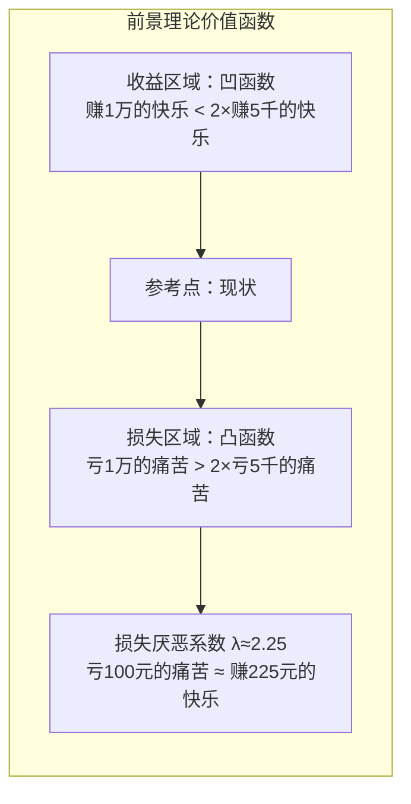
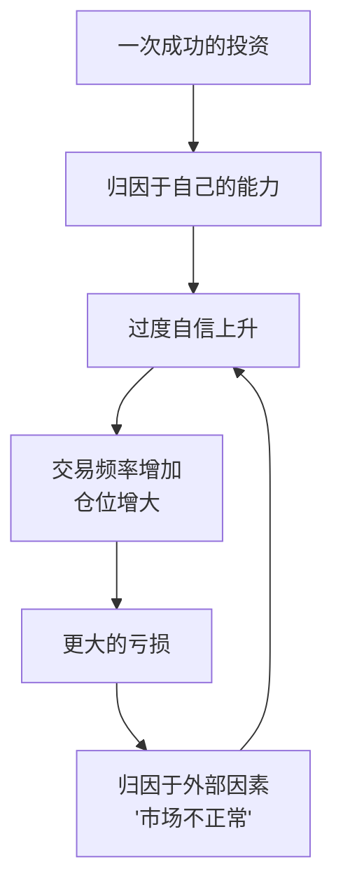
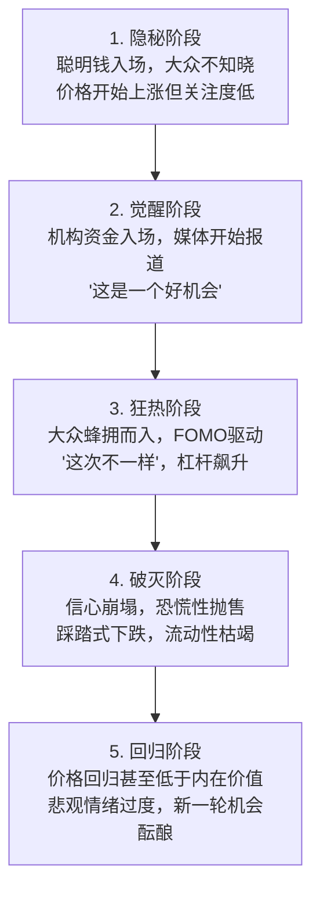

## 六、行为金融学：理解你的投资心理

传统金融学假设投资者是理性的、市场是有效的。但现实中的股市泡沫、恐慌性抛售、追涨杀跌——这些现象反复证明：**人不是理性的经济机器。** 行为金融学（Behavioral Finance）正是研究人的心理偏差如何影响投资决策的学科，它揭示了一个残酷的事实：**你在投资中犯的大多数错误，不是因为信息不足，而是因为你的大脑在"欺骗"你。**

本章将从理论根基出发，逐一拆解影响投资决策的核心认知偏差，分析A股市场的特殊行为陷阱，最终帮你构建一套可落地的"防偏差"投资系统。这不仅是知识，更是武器——你的对手不是市场，而是你自己的大脑。

### 6.1 行为金融学的理论根基

#### 6.1.1 从传统金融学到行为金融学

传统金融学建立在"有效市场假说"（EMH）之上——价格反映一切信息，投资者总是理性的。这个理论由尤金·法玛（Eugene Fama）在1970年系统化提出，其逻辑链条是：如果所有投资者都是理性的，他们会迅速消化所有信息，价格将始终反映内在价值，因此没有人能持续跑赢市场。

但现实中存在大量"市场异象"无法用传统理论解释：

| 市场异象 | 传统金融学解释 | 行为金融学解释 | 量化规模 |
|----------|--------------|--------------|---------|
| 泡沫与崩盘 | 不存在（价格总是合理的） | 投资者情绪的过度反应 | 历史上泡沫破裂平均跌幅超过50% |
| 动量效应 | 不应存在（价格应随机游走） | 投资者对信息的反应不足与过度反应 | 过去12个月赢家组合跑输输家组合约8%/年（Jegadeesh & Titman） |
| 日历效应 | 不应存在 | 投资者情绪的周期性波动 | A股"春季躁动"发生率超过70% |
| 小盘股溢价 | 风险补偿 | 投资者对小盘股的过度悲观后修正 | A股小盘股历史年化超额收益约5-8% |
| 封闭式基金折价 | 不应存在（净值=价格） | 投资者情绪波动影响交易价格 | 折价幅度通常在10-20%之间波动 |
| 盈余公告后漂移 | 信息应被瞬间消化 | 投资者对新信息反应不足 | 好消息公布后60天内继续上涨约2% |

行为金融学并不是否定传统金融学，而是补充。市场大部分时间大部分资产确实是接近有效的，但**在极端情绪下、在某些特定类型的投资中、在短时间内，系统性的非理性会创造可识别的定价错误。**

行为金融学的发展历程：

| 年份 | 里程碑 | 关键人物 |
|------|--------|---------|
| 1951 | 《以心理学为基础的投资理论》——行为金融学先驱论文 | Burrell & Bauman |
| 1974 | 三大启发式论文发表 | Tversky & Kahneman |
| 1979 | 前景理论（Prospect Theory） | Kahneman & Tversky |
| 1985 | 《股票市场过度反应了吗？》 | De Bondt & Thaler |
| 1990 | 处置效应实证研究 | Shefrin & Statman |
| 1998 | 散户交易行为大规模实证 | Barber & Odean |
| 2002 | 卡尼曼获诺贝尔经济学奖 | Kahneman |
| 2013 | 希勒获诺贝尔经济学奖（非理性繁荣） | Shiller |
| 2017 | 行为经济学在政策"助推"中的应用 | Thaler（诺贝尔奖） |

#### 6.1.2 前景理论：行为金融学的基石

丹尼尔·卡尼曼（Daniel Kahneman）和阿莫斯·特沃斯基（Amos Tversky）在1979年提出的**前景理论（Prospect Theory）**是行为金融学最重要的理论基础。卡尼曼因此获得2002年诺贝尔经济学奖。这篇论文是经济学中被引用次数最多的论文之一，截至目前被引用超过60000次。

传统金融学的期望效用理论（Expected Utility Theory）假设人们会计算每个选项的期望价值，然后选择最优方案。但卡尼曼和特沃斯基通过大量实验发现，人们并不这样做。前景理论描述了人们实际的决策行为。

前景理论的核心发现：

**第一，人们评估收益和损失的参照点是"现状"，而非最终财富水平。** 你不会计算"如果卖出这只股票，我的总财富是多少"，而是计算"这只股票让我赚了还是亏了多少钱"。这意味着同一笔投资，对不同买入价的人会产生完全不同的心理体验——即使两人的总财富完全相同。

**第二，价值函数呈S型曲线——收益端是凹的（边际效用递减），损失端是凸的（边际痛苦递减），且损失端的斜率远大于收益端。**



用公式表达：V(x) = x^α（x≥0，收益）；V(x) = -λ(-x)^β（x<0，损失），其中 λ≈2.25，α≈0.88，β≈0.88。这个公式的关键参数λ=2.25意味着损失的心理权重是收益的2.25倍。

**第三，人们对概率的感知是非线性的。** 极低概率事件被高估（所以人们买彩票），中高概率事件被低估（所以人们不买保险时犹豫）。这解释了为什么深度虚值期权总是被高估——投资者高估了小概率暴赚的机会。

概率权重函数的具体特征：
- 概率从0%到1%的权重增加，远大于从50%到51%的增加（小概率被高估）
- 概率从99%到100%的权重增加，远大于从50%到51%的增加（确定性被高估）
- 中等概率（20%-80%）整体被低估

**第四，确定性效应。** 人们偏好确定的收益，厌恶确定的损失。面对"确定赚3000元"和"80%概率赚4000元"，大多数人选择前者（期望值3200元）；但面对"确定亏3000元"和"80%概率亏4000元"，大多数人会选择赌一把。这种不对称性称为"四重模式"（Fourfold Pattern）：

| | 收益 | 损失 |
|---|------|------|
| **高概率** | 风险厌恶（确定赚1万 vs 95%赚1.1万 → 选确定的） | 风险寻求（确定亏1万 vs 95%亏1.1万 → 赌一把） |
| **低概率** | 风险寻求（0.01%赚1万 vs 确定赚10元 → 买彩票） | 风险厌恶（0.01%亏1万 vs 确定亏10元 → 买保险） |

前景理论直接解释了投资中最普遍的错误——**处置效应（Disposition Effect）**：投资者倾向于过早卖出盈利的股票（锁定确定收益），过久持有亏损的股票（避免确定损失）。Odean（1998）对美国某券商10000个账户的研究发现：投资者卖出盈利股票的概率比卖出亏损股票高1.5倍，但被卖出的盈利股票后续平均涨幅比被持有的亏损股票高出3.4个百分点。

在A股市场，处置效应更为严重。研究显示A股投资者的"卖盈持亏"倾向比美国投资者更强，这与A股散户占比更高、赌博文化更浓厚有关。韩立岩等（2007）的研究发现A股处置效应系数约为美国市场的1.3-1.5倍。

#### 6.1.3 双系统思维：快与慢

卡尼曼在《思考，快与慢》中提出人类有两套思维系统。这不是字面上的大脑分区，而是一种描述人类认知的框架——系统1代表自动化的快速处理，系统2代表刻意的慢速处理。

| 特征 | 系统1（快思维） | 系统2（慢思维） |
|------|---------------|---------------|
| 运行方式 | 自动、直觉、无意识 | 刻意、逻辑、需要努力 |
| 速度 | 毫秒级 | 秒到分钟级 |
| 能耗 | 低（省力） | 高（费力） |
| 进化历史 | 古老（与动物共有） | 较新（人类独有） |
| 投资中的表现 | "这只股票涨了好多，赶紧买！" | "让我分析一下估值和基本面" |
| 对应偏差 | 大部分认知偏差的来源 | 需要刻意调用才能启用 |
| 可靠性 | 快但容易出错 | 慢但更准确 |
| 能量依赖 | 受血糖水平影响小 | 血糖低时表现显著下降 |

**系统1在投资中的典型触发场景**：

- 看到连续3天涨停 → 系统1自动产生"还会涨"的直觉
- 打开账户看到亏损5万 → 系统1触发"战或逃"反应，心率加快，决策质量骤降
- 朋友说"我这只股票翻倍了" → 系统1触发社交比较和嫉妒情绪
- 财经新闻标题"重大利好！" → 系统1自动赋予过高权重

**系统2的激活条件**：系统2是"懒惰的"，只在以下情况被激活：
- 你刻意强迫自己慢下来思考
- 你使用了结构化的决策工具（清单、框架）
- 外部环境迫使你仔细思考（如大额交易的审批流程）
- 你事先设定了"触发系统2"的规则（如"超过月薪的操作必须等48小时"）

投资中90%的错误决策来自系统1的自动反应。**行为金融学的核心实践意义，就是学会在关键决策时激活系统2，抑制系统1的冲动。** 但这并不意味着完全压制系统1——在信息过载、时间紧迫的情况下，系统1的经验法则有时也是合理的。关键是在**高风险、不可逆**的决策中确保系统2介入。

#### 6.1.4 有限理性与启发式

赫伯特·西蒙（Herbert Simon，1978年诺贝尔奖）提出"有限理性"概念：人类大脑的计算能力有限，面对复杂决策时会使用"启发式"（Heuristics）——即经验法则来简化判断。启发式在大多数情况下是高效的捷径，但在投资中常常导致系统性偏差。

三大经典启发式：

1. **可得性启发式（Availability Heuristic）**：容易想到的事件被认为更可能发生。最近看到飞机失事新闻就觉得坐飞机危险，尽管统计数据表明开车比坐飞机危险得多。投资中，最近暴涨的股票更容易被记住，让人觉得"追高赚钱很容易"。大脑有一个隐含假设："如果我能轻松想到某件事，那它一定很常见"——这在进化中是合理的（频繁出现的危险确实更容易被记住），但在投资中会导致对近期事件的过度反应。

2. **代表性启发式（Representative Heuristic）**：根据事物的"典型特征"来判断概率。看到一家公司连续5年利润增长，就认为它"一定是好公司"——却忽视了均值回归的力量。看到K线图出现某种"经典形态"就预测走势——实际上短期价格走势近乎随机。代表性启发式的核心错误是**忽略基准概率（base rate）**：即使某类"好公司"中只有30%能持续增长5年以上，连续增长5年的"典型特征"会让你高估持续增长的概率。

3. **锚定与调整启发式（Anchoring and Adjustment）**：从一个初始值开始调整，但调整往往不充分。分析师给出目标价100元，即使基本面恶化，投资者心中的"锚"仍然停留在100附近。锚定效应之所以强大，是因为它在完全意识不到的情况下运作——你甚至不知道自己的判断被锚定了。

除三大经典启发式外，投资中常见的启发式还包括：

4. **情感启发式（Affect Heuristic）**：用"感觉好不好"来判断风险和收益。对某只股票有好感（比如你使用它的产品）→ 低估风险、高估收益。苹果公司的散户投资者中，大量人是因为"喜欢iPhone"而买股票，而非基于估值分析。

5. **熟悉度启发式（Familiarity Heuristic）**：倾向于投资自己熟悉的事物。A股投资者大量重仓国内股票，几乎不配置海外资产——不是因为理性分析后认为A股更好，而是因为"熟悉"让大脑产生了"安全"的错觉。这导致了严重的本土偏好（Home Bias）。

6. **稀缺性启发式（Scarcity Heuristic）**：越难获得的东西越有价值。新股中签的稀缺性让投资者高估新股价值；涨停封板的"买不到"状态激发更强的买入欲望。

#### 6.1.5 神经金融学：投资决策的脑科学基础

行为金融学的发现得到了神经科学的独立验证。功能性磁共振成像（fMRI）和脑电图（EEG）研究揭示了投资决策时大脑内部的"战争"。

**大脑中的投资决策地图**：

| 脑区 | 功能 | 在投资中的角色 | 关键研究发现 |
|------|------|--------------|-------------|
| 前额叶皮层（PFC） | 理性分析、计划 | 评估基本面、计算估值 | 损伤后无法做长期规划 |
| 杏仁核（Amygdala） | 恐惧、威胁检测 | 恐慌性抛售的来源 | 恐惧时激活程度与卖出行为正相关 |
| 脑岛（Insula） | 内脏感觉、风险感知 | 对亏损的"直觉厌恶" | 激活程度高的人更倾向于卖出亏损股票 |
| 纹状体（Striatum） | 奖赏、快感 | 赚钱时的愉悦感 | 与赌博成瘾的脑区重叠 |
| 前扣带回（ACC） | 冲突检测、错误监控 | 发现投资错误时的不适感 | 过度活跃可能导致过度交易 |
| 腹侧被盖区（VTA） | 多巴胺分泌 | 交易的"快感"来源 | 频繁交易的神经基础类似成瘾 |

**关键发现**：

克努森（Kuhnen & Knutson, 2005）的fMRI实验发现，在做出投资选择之前，纹状体的激活模式就能预测投资者会选择风险更高还是更低的选项——你的大脑在你"决定"之前就已经替你做了选择。

科恩等（Knutson et al., 2008）发现，当投资者面对可能盈利的情景时，伏隔核（Nucleus Accumbens）的激活程度越高，越倾向于做出风险更高的投资决策；而当面对可能亏损的情景时，脑岛的激活程度越高，越倾向于规避风险。这意味着投资决策不是"深思熟虑"的结果，而是两个脑区的"拔河比赛"。

**为什么这对投资者很重要**：你的投资决策在很大程度上受到你无法直接控制的神经过程的影响。认识这一点不是为了"控制"大脑（那几乎不可能），而是为了设计外部机制来弥补大脑的系统性弱点——自动化规则、决策清单、冷却期制度都是有效的"外部干预"手段。

### 6.2 影响投资决策的12种核心认知偏差

#### 6.2.1 损失厌恶（Loss Aversion）

**定义**：人们对损失的痛苦感是同等收益快乐感的2-2.5倍。

**神经科学依据**：脑成像研究显示，损失激活的脑区（杏仁核和脑岛）与身体疼痛的反应区域重叠。损失不是抽象的数字变化，而是真实的大脑"疼痛"信号。德雷塞尔大学的研究发现，投资者在经历损失后，大脑中的疼痛反应与被热烫伤时的反应模式高度相似。这意味着你不愿意"割肉"不是因为懒惰或缺乏纪律——你的大脑真的在经历疼痛。

**投资中的典型表现**：
- 亏损的股票不愿卖出（"不卖就不算亏"——这是大脑在逃避"疼痛"）
- 盈利的股票过早卖出（锁定"快乐"，避免它消失）
- 为了避免确定的小损失，愿意承担更大的不确定风险
- 对"割肉"产生强烈的生理不适感
- 在亏损状态下更容易做出"赌博式"决策（试图一把回本）

**损失厌恶的递进效应**：损失厌恶会随着亏损幅度的增加而加剧。研究发现，当亏损达到投资额的20%时，投资者的"割肉"心理阻力达到最大值——此时卖出需要克服的不是理性分析，而是大脑的疼痛抑制机制。超过这个阈值后，许多投资者会进入"麻木"状态——"反正已经亏这么多了"——这反而降低了止损的意愿。

**A股典型案例**：2015年股灾后，大量投资者深套50%-70%但拒绝止损。某投资者持有某创业板股票从80元跌到25元，期间多次反弹到35-40元但始终不肯卖出，最终该股票因公司财务造假退市，损失全部本金。"不卖就不亏"的逻辑，最终变成了"不卖就全亏"。

更值得注意的是**损失厌恶的代际传递**：经历过2015年股灾的投资者，在2020-2021年牛市中表现出明显更强的风险厌恶——他们的大脑对"股灾"的记忆仍然活跃，导致他们在应该进取时过于保守。

**量化影响**：处置效应每年给散户带来约3-5%的收益损失（Barber & Odean, 2000）。如果一个投资者年化收益本应是10%，处置效应可能将实际收益压缩到5-7%。换算成具体金额：假设你投资100万，年化收益从10%降到6%，20年后的终值差异高达：按10%是673万，按6%是321万——损失厌恶让你少赚了352万。

**应对策略**：
1. **止损规则制度化**：买入时就设定止损点（如亏损15%强制卖出），写下来贴在屏幕旁。用条件单自动执行，不给自己犹豫的机会
2. **用"如果我现在没有持仓，我会买入吗？"替代"要不要卖出"的思考框架**——这把"卖出"重新框架为"不买入"，降低了损失厌恶的影响
3. **关注投资组合整体表现**，而非盯着单只股票的盈亏——将注意力从"这一只亏了多少"转移到"组合整体赚了多少"
4. **采用"预先承诺"（Pre-commitment）策略**：在冷静时制定规则，在情绪波动时执行规则
5. **减小仓位规模**：亏损带来的痛苦与仓位大小正相关，减小单只股票的仓位可以降低"疼痛感"，让你做出更理性的决策
6. **使用"心理分离"技术**：把每笔投资视为独立的"项目"，一个项目失败不影响其他项目的评估

#### 6.2.2 过度自信（Overconfidence）

**定义**：人们系统性地高估自己的知识准确性、判断能力和控制力。

过度自信是人类最根深蒂固的偏差之一，它有进化上的优势——在原始环境中，过度自信的猎人更愿意冒险去捕猎猛兽，即使成功率不高，但偶尔的成功带来的收益足以维持生存。但在投资市场中，这种本能是致命的。

**三种形式**：
- **校准偏差（Calibration Bias）**：当你说"我有90%把握"时，实际上只有70%的正确率。大量研究表明，当人们表示"99%确定"时，实际正确率约为85-90%
- **过度精确（Overprecision）**：对预测的区间设定过窄，低估不确定性。如果你让投资者预测某只股票一年后的价格区间（90%置信区间），实际价格落在区间外的比率远高于10%，通常达到30-50%
- **控制幻觉（Illusion of Control）**：认为自己能影响实际上无法控制的结果。自己选号的彩票比随机分配的彩票被认为中奖概率更高；自己选择的投资比"专家推荐"的投资被认为风险更低

**实证数据**：
- Barber & Odean（2001）研究发现：交易最频繁的20%散户，年化收益比最不频繁的20%低7个百分点。扣除交易成本后，频繁交易者年化收益仅6.5%，而低频交易者为18.5%
- 男性投资者交易频率比女性高45%，但年化收益低1.4个百分点（Barber & Odean, 2001）。过度自信存在明显的性别差异
- 一项调查中，93%的美国司机认为自己的驾驶水平"高于平均水平"——这种统计学上不可能的比例说明了过度自信的普遍性
- Grinblatt & Keloharju（2009）研究芬兰全市场的投资者数据发现：投资者最近的交易盈利会导致未来30天内交易频率显著增加——成功正在"喂养"过度自信

**A股特殊环境加剧过度自信**：
- A股散户占比高，"消息面""技术分析"文化盛行，容易给人"我比别人知道得多"的错觉
- 牛市中"人人都是股神"，收益被错误归因于能力而非市场β
- 社交媒体上的"晒单"文化放大了赢家的声音，幸存者偏差让人误以为赚钱很容易
- A股的"炒消息"文化——知道一个"内幕消息"（往往是过时的或虚假的）会产生巨大的虚假控制感

**过度自信的恶性循环**：



**应对策略**：
1. **记录每笔交易的决策逻辑和预期**，3个月后回顾——你会惊讶于自己的错误率。建议使用结构化的投资日志模板（详见6.5节）
2. **使用"事前验尸"（Pre-mortem）技术**：在做出投资决策前，假设这笔投资已经失败，列出所有可能的失败原因。Gary Klein的研究表明，这种方法能将发现问题的比率提高30%
3. **采用系统化策略**（定投、再平衡），减少主观判断的介入
4. **给自己设定交易频率上限**——每月最多操作N次
5. **计算并公开你的"击球率"**：你的投资决策中，正确率到底是多少？很多人发现，即使自认为"选股能力强"，正确率也不过50-55%——与扔硬币差不多
6. **"谦逊训练"**：定期阅读你不同意的、但最终被证明正确的分析师报告

#### 6.2.3 锚定效应（Anchoring）

**定义**：人们在做数值估计时，会不自觉地以最先接收到的信息为"锚"，后续调整不充分。

锚定效应是卡尼曼和特沃斯基最早发现的认知偏差之一，也是最"顽固"的偏差之一——即使你知道锚定效应的存在，它仍然会影响你的判断。研究表明，即使明确告知受试者锚定值是随机的，它仍然会影响他们的估计。

**经典实验**：Tversky和Kahneman让受试者先转一个随机数字转盘（10或65），然后估计联合国中非洲国家的百分比。转到10的人平均估计25%，转到65的人平均估计45%——一个完全随机的数字显著影响了判断。

**投资中的表现**：
- **买入价锚定**：以买入价作为"锚"，认为"股价一定会回到我的成本价"。这是最普遍也最有害的锚定——你的买入价是一个完全随机的数字（取决于你哪天买的），与股票的内在价值没有任何关系
- **历史高点锚定**：某股票从100元跌到30元，觉得"便宜了70%"——但如果公司基本面恶化，30元可能仍然高估
- **整数关口锚定**：股价接近50元、100元等整数关口时，投资者会对这些数字赋予特殊意义。学术研究证实，股价在整数关口附近会表现出异常的支撑和阻力效应
- **分析师目标价锚定**：分析师给出目标价后，投资者会不自觉地围绕这个数字做决策
- **市盈率锚定**："这只股票PE只有10倍，历史平均是20倍，所以便宜"——但行业格局、增长预期可能已经永久改变了"合理PE"
- **百分比锚定**："已经跌了50%了，不可能再跌50%了吧"——实际上完全可以，从100跌到50是跌50%，从50跌到25也是跌50%

**A股案例**：中石油（601857）2007年上市首日开盘价48.62元，此后持续下跌。大量投资者在30元、20元、10元分别买入，理由都是"已经比开盘价便宜多了"。到2024年股价仍在8-10元区间。锚定在上市首日价格上的投资者，17年过去仍然深度亏损。

另一个典型案例是乐视网：从最高90元跌到40元时，大量投资者认为"已经腰斩，够便宜了"而买入。最终乐视网退市，股价定格在0.18元。"已经跌了很多"从来不是买入的理由——你需要评估的是当前价格与内在价值的关系，而不是当前价格与历史价格的关系。

**应对策略**：
1. **决策时完全忽略买入价格**——问自己"如果我今天第一次看到这只股票，以当前价格，我会买吗？"
2. **使用多种估值方法交叉验证**：PE、PB、DCF、EV/EBITDA、PEG，避免单一指标的锚定
3. **设定独立于价格的基本面评估框架**——公司竞争力、行业前景、管理层质量
4. **避免看别人的"目标价"**，先形成自己的判断再看参考
5. **"零基础"练习**：假装你从未听说过这只股票，只基于当前的基本面数据做出评估
6. **用相对估值替代绝对估值**：不问"这只股票值多少钱"，问"这只股票相对于同类公司的估值合理吗"

#### 6.2.4 从众心理与羊群效应（Herd Behavior）

**定义**：人们倾向于模仿他人的行为，尤其在不确定的环境中。放弃独立判断，跟随"大多数"。

从众心理有深刻的进化根源。在原始环境中，与群体保持一致意味着安全——离开群体意味着死亡。你的大脑将"孤独"与"危险"直接关联，这解释了为什么逆向投资在心理上如此痛苦。

**心理学机制**：
- **信息级联（Information Cascade）**：当看到前面的人都做了相同选择，人们会推断"他们一定有道理"，从而忽略自己的私人信息。实验表明，当连续3-4个人做出相同选择后，第5个人跟随的概率超过90%——即使他自己的信息指向相反方向
- **社会认同（Social Proof）**："这么多人买，应该不会错"——大脑的隐含假设是"大多数人不会同时犯错"
- **职业风险规避**：机构投资者"随大流"即使错了也是大家一起错，但"特立独行"错了就独自承担后果。约翰·梅纳德·凯恩斯说过："常规的失败优于非常规的成功"
- **信息瀑布（Informational Cascades）**：当一个群体中前几个行动者恰好做出相同选择，后续个体即使拥有相反的私有信息，也会选择跟随。这是一种"理性"的非理性——每个人都做了"最优"的局部决策，但群体结果却是灾难性的

**经典案例**：
- **2015年A股牛市**：融资余额从2014年底的1万亿飙升到2015年6月的2.27万亿。新开户数单月突破700万。大量缺乏投资经验的新股民在4000-5000点区间冲入市场，杠杆买入。股灾后上证指数从5178点跌至2850点，跌幅45%，无数家庭财富灰飞烟灭
- **2021年"赛道股"行情**：白酒、新能源、半导体被冠以"核心资产""黄金赛道"之名。某明星基金经理管理规模从百亿膨胀到千亿。追高买入的投资者在随后两年普遍亏损30-50%
- **比特币周期**：每次加密货币牛市都有大量新手在高位入场，2021年11月BTC达到69000美元后，到2022年底跌至16000美元，跌幅77%

**群体极化与投资社区**：

投资社区中的讨论不仅不能纠正偏差，反而会**放大**偏差。这就是群体极化（Group Polarization）效应：


雪球、东方财富股吧等投资社区中，持有同一股票的投资者聚集在一起，分享看多观点、过滤看空信息、互相鼓励"坚守"。这种"同温层"效应让投资者的确认偏差成倍放大。

**应对策略**：
1. **建立独立的投资框架**——你的买入理由必须独立于"别人都在买"
2. **反向指标检验**：当你发现出租车司机、理发师、菜市场大妈都在讨论股票时，这往往是市场见顶的信号
3. **量化"热度"指标**：融资余额增速、新开户数、百度搜索指数等，设阈值触发警惕
4. **巴菲特名言的深层含义**："在别人贪婪时恐惧，在别人恐惧时贪婪"——不是简单地反着来，而是当群体情绪导致价格严重偏离价值时，逆向操作
5. **定期"独处"**：离开投资社区，独自审视你的持仓。噪音越少，判断越准
6. **寻找"异见者"**：主动关注与主流观点相反的分析师，即使你不同意他们的结论，他们的论据也值得你思考

#### 6.2.5 确认偏差（Confirmation Bias）

**定义**：人们倾向于寻找、解释和记忆支持自己已有观点的信息，而忽视或贬低相反的证据。这是最"隐蔽"也最危险的偏差——因为你意识不到自己在选择性接收信息。

确认偏差在大脑中的机制：大脑处理与已有信念一致的信息时，前额叶皮层的活动更流畅（"认知流畅性"），而处理相反信息时会产生不适感——这被称为"信念防御"。本质上，大脑在生理层面就在"保护"你的既有观点。

**投资中的表现**：
- 买入某只股票后，只关注利好研报和正面新闻，对利空消息自动过滤或找理由反驳
- 在投资论坛中只看支持自己观点的帖子，遇到反对意见直接划走
- 将模糊信息解读为对自己有利——公司宣布裁员，你解读为"降本增效"
- 用过去的成功案例强化当前决策，忽视反面案例
- 对"看多"研报和"看空"研报使用不同的审查标准——对看空报告要求更高的证据标准

**社交媒体时代的加剧效应**：
- 推荐算法会不断推送你"喜欢"看的内容，形成信息茧房
- 投资社区的"同温层"效应——关注某只股票后，信息流全是看多内容
- 短视频平台的"情绪化财经"内容，强化而非挑战你的认知偏差
- **"信息蒙太奇"效应**：社交媒体的碎片化信息让你误以为自己做了"全面研究"——看了10个帖子都是看多，感觉"研究很充分"，但实际上这10个帖子可能来源于同一个信息源

**确认偏差的"升级"过程**：

| 阶段 | 行为 | 心理机制 |
|------|------|---------|
| 1. 选择性接触 | 只关注支持自己观点的信息源 | 主动避免认知不适 |
| 2. 选择性解读 | 模糊信息被解读为支持自己的 | 解释弹性 |
| 3. 选择性记忆 | 更容易记住支持性的证据 | 记忆巩固偏差 |
| 4. 选择性标准 | 对反对证据要求更高的证明标准 | 信念防御 |
| 5. 选择性分享 | 只分享支持自己观点的内容 | 社会强化 |

**应对策略**：
1. **"魔鬼代言人"练习**：每次做出投资决策前，强迫自己写出至少3条反对理由——而且必须是有力的反对理由，不是敷衍
2. **主动订阅不同观点的分析师和媒体**——看多的和看空的都要看
3. **设定"反面信息清单"**：明确列出什么信息出现时，你应该推翻当前判断。例如："如果公司下季度营收下降超过15%，立即卖出"
4. **定期问自己："如果我完全错了，最大的损失是什么？我能承受吗？"**
5. **"红队"机制**：找一个持相反观点的人定期辩论你的投资决策
6. **记录反面观点**：在投资日志中专门留一栏记录反对意见和你当时的回应——事后回看会发现很多反对意见是正确的

#### 6.2.6 近因效应与可得性偏差（Recency & Availability Bias）

**定义**：过度重视最近发生的信息，低估长期历史规律。

近因效应（Recency Effect）是可得性偏差在时间维度上的表现。大脑的记忆检索机制天然偏向最近和最鲜明的信息——你在做投资决策时，最先"浮现在脑海中"的信息对你的影响最大，而这些信息通常是最近发生的。

**投资中的典型循环**：
1. 市场上涨6个月 → "这次不一样，会一直涨" → 追高买入
2. 市场下跌6个月 → "永远不会涨了" → 恐慌卖出
3. 看到某基金最近3个月涨了30% → "这个基金经理真厉害" → 追买
4. 同一只基金随后回撤20% → "这个基金经理不行了" → 赎回

**数据佐证**：晨星数据显示，投资者的资金流入与基金近期业绩高度正相关——过去1年业绩排名前10%的基金，在随后3年有超过70%的概率跌出前50%。投资者追逐"热基金"的结果，往往是买在高点、卖在低点。

**"近因效应"的时间窗口**：

| 看多久的历史 | 产生的偏差类型 | 典型表现 |
|------------|--------------|---------|
| 1周 | 极度近因偏差 | "昨天涨停了，今天一定还涨" |
| 1个月 | 短期趋势外推 | "这个月涨了15%，趋势确立了" |
| 1年 | 年度业绩追逐 | "过去一年表现最好，买它" |
| 3年 | 较少但仍存在 | 3年刚好覆盖一个完整周期的某一段 |
| 10年以上 | 偏差显著降低 | 能看到多次牛熊转换，建立真实的历史感 |

**应对策略**：
1. **用至少5年的业绩数据评估投资策略**，而非3个月或1年
2. **回测时包含熊市、牛市和震荡市**，避免只看到好时光
3. **制作"历史周期表"**：记录A股过去20年每次大跌后的回升情况，建立心理锚定
4. **"时间旅行"练习**：想象自己处在2008年10月（全球金融危机最恐慌时），会怎么做决策？再看现在的市场，恐慌程度是否真的到了那种级别？
5. **关注均值回归**：过去1年表现最好的资产类别，未来3年大概率跑输；反之亦然。买入"去年最差"的资产类别是一个经过验证的逆向策略

#### 6.2.7 心理账户（Mental Accounting）

**定义**：人们在心理上将钱分为不同的"账户"，对不同来源和用途的钱采取不同的态度。理性的金钱应该是可替代的（fungible），但实际上人们不这么认为。

心理账户由理查德·塞勒（Richard Thaler）系统提出，他因此获得2017年诺贝尔经济学奖。心理账户的本质是大脑对"金钱"的编码方式——不是所有"100元"在大脑中都是等价的。

**典型表现**：
- 把年终奖视为"意外之财"，花起来比工资更大方
- 把股票投资赚的钱视为"白赚的钱"，愿意冒更大风险
- 省下50元停车费会很高兴，但买一件2000元的奢侈品眼都不眨
- 借着3%利率的贷款，同时持有1.5%利率的存款

**心理账户的分类维度**：

| 维度 | 分类方式 | 对投资的影响 |
|------|---------|------------|
| 来源 | 工资 vs 意外之财 vs 投资收益 | 意外之财风险偏好更高 |
| 用途 | 生活费 vs 教育基金 vs 养老金 | 不同用途使用不同标准 |
| 时间 | 短期 vs 长期 | 短期账户对波动更敏感 |
| 资产类别 | 存款 vs 股票 vs 房产 | 分别管理，缺乏全局视角 |

**投资中的危害**：
- 把"工资收入"和"投资收入"分开管理，导致投资部分风险偏好过高
- "这只股票是用利润买的，亏了也不心疼"——风险偏好被来源改变了
- 不同账户使用不同的投资标准，导致整体配置混乱
- 把"浮盈"视为"白赚的钱"，冒不必要的风险去追求更高的收益

**心理账户与"赌场效应"**：心理账户的一个典型表现是"赌场效应"（House Money Effect）——在赌场赢了钱的人，愿意用"赢来的钱"冒更大的风险，因为这些钱在心理上已经被归入"赌场的钱"账户，而非"自己的钱"。投资中同样如此：用股票赚的钱去买高风险的投机品种，因为心理上觉得"这是用赚来的钱"。

**应对策略**：
1. **总财富视角**：定期查看所有资产的综合净值，而非分类看
2. **统一风险预算**：无论钱从哪来，对每一元钱使用相同的风险标准
3. **避免"免费钱"心态**：任何一笔投资的亏损都是真金白银的损失
4. **合并账户审视**：每月做一次"所有账户合并"的资产盘点，用统一的标准审视每个部分
5. **"归零"练习**：想象你今天从零开始配置所有资产，每个账户都会放多少？如果答案和现在不一样，说明心理账户在影响你的决策

#### 6.2.8 沉没成本谬误（Sunk Cost Fallacy）

**定义**：因为已经投入了时间、金钱或精力，而继续投入，即使理性分析表明应该放弃。

沉没成本谬误在心理学中也叫"协和效应"（Concorde Effect）——英法两国明知协和飞机项目在经济上不可行，但因为已经投入了巨额资金而继续追加投入，最终亏损更多。

**投资中的表现**：
- "我已经研究这只股票3个月了，不买太可惜"
- "我已经亏了2万了，如果现在卖出就白亏了，不如继续持有等回本"
- "我在这家公司工作，了解它，所以重仓买它的股票"（熟悉的公司不代表是好的投资）
- "我花了大量时间学习技术分析，一定是有用的"——已经投入的学习成本不应该决定未来的策略选择
- 在某只股票上反复加仓试图"摊低成本"，而不是基于基本面分析做出独立的加仓决策

**与损失厌恶的区别**：损失厌恶是害怕"确认损失"的心理痛苦；沉没成本是"已经投入了不甘心浪费"的心理。两者经常叠加出现，强化持有亏损股票的行为。区分它们很重要，因为应对策略不同：

| | 损失厌恶 | 沉没成本谬误 |
|---|---------|------------|
| 核心驱动 | 确认损失的痛苦 | 已投入资源的浪费感 |
| 情绪色彩 | 疼痛/恐惧 | 不甘心/后悔 |
| 典型表述 | "卖出就亏了" | "不卖前面就白亏了" |
| 主要应对 | 止损规则/重新框架 | 白纸测试/面向未来 |

**应对策略**：
1. **"白纸测试"**：如果你今天手里没有这只股票，账户里是现金，你会以当前价格买入吗？如果不会，就应该卖出
2. **已经投入的研究时间、交易成本都是沉没成本**——它们与未来的收益预期无关
3. **"增量决策"原则**：每个决策都只考虑从现在开始的增量成本和增量收益，不考虑已经发生的成本
4. **定期"归零"审视**：每季度假设你全部清仓，然后重新构建投资组合——你会买回现在的所有持仓吗？

#### 6.2.9 禀赋效应（Endowment Effect）

**定义**：人们对已经拥有的东西赋予更高的估值，仅仅因为"它是我的"。

禀赋效应与损失厌恶密切相关——失去拥有的东西的痛苦大于获得新东西的快乐，因此人们对已拥有的东西要求更高的卖出价格。

**经典实验**：Thaler（1980）让一组人给一个杯子标价，拥有杯子的人平均要价7.12美元，没有杯子的人平均出价2.87倍——同一个东西，拥有它的瞬间价值就翻了2.5倍。

**神经科学验证**：fMRI研究发现，当人们考虑出售自己拥有的物品时，脑岛（与厌恶情绪相关的脑区）会显著激活。这种"不情愿卖出"的反应是自动化的、非意识的。

**投资中的表现**：
- 高估自己持有的股票的价值，低估同类但未持有的股票
- 对"打新"中签的股票舍不得卖出，即使估值已经很高
- 不愿意卖出亏损股票，部分原因是对"手中的股票"赋予了过高价值
- 对"自选股"中的股票过度关注，赋予它们比市场整体更高的权重
- "这是我精挑细选出来的股票"——选股过程本身增加了对持仓的估值偏差

**应对策略**：
1. 每次审视持仓时，用"白纸测试"——如果这些股票不在你手中，你会以当前价格买入吗？
2. 不要给持仓股票"特殊感情"——它们只是一堆代码和数字
3. 定期做"盲评"——遮住股票名称，只看财务数据，评估哪些值得持有
4. 使用第三方评估工具——机器人投顾、量化评分系统——它们不受禀赋效应影响

#### 6.2.10 框架效应（Framing Effect）

**定义**：同一个信息用不同方式表述，会导致截然不同的决策。

框架效应由卡尼曼和特沃斯基通过著名的"亚洲疾病问题"实验发现：当同一个方案被描述为"拯救200人"时，大多数人选择它；当被描述为"400人会死亡"时，大多数人拒绝它——尽管数学上完全等价。

**经典案例**：
- "这个手术的成功率是90%" vs "这个手术的死亡率是10%"——同样的信息，前者的接受率显著更高
- "这只基金过去5年平均年化收益15%" vs "这只基金过去5年有2年亏损超过20%"——同样是真话

**投资中的表现**：
- 基金广告总是在最佳时间窗口展示业绩——"过去3年收益80%"
- 券商研报倾向用积极框架描述——"营收增长放缓"而不是"营收增速腰斩"
- 损失被描述为"浮亏"而非"亏损"，让人觉得不那么严重
- "回调"和"崩盘"描述的是同一现象，但引发的情绪完全不同
- "市盈率10倍"和"盈利收益率10%"——同一个数据的不同框架，后者可能让你更关注收益而非估值

**框架效应在投资营销中的应用**：

| 营销话术 | 实际含义 | 心理效果 |
|---------|---------|---------|
| "成立以来收益120%" | 如果选了表现最好的起始日期 | 选择性起点框架 |
| "近3年排名前10%" | 但近1年排名后50% | 选择性时间窗口 |
| "年化收益15%" | 包含一次性的超额收益 | 平均化框架 |
| "最大回撤仅20%" | 同类基金最大回撤15% | 缺少对比框架 |
| "明星基金经理掌舵" | 历史业绩不代表未来 | 权威框架 |

**应对策略**：
1. 主动将所有信息"翻译"成统一框架来比较
2. 对同一数据同时计算绝对值和百分比
3. 将好消息和坏消息用相同的标准来表述
4. 对任何投资宣传材料做"框架解构"——拆解它用了哪些框架技巧来美化信息
5. 要求看到"最差情况"的数据：最差的1年期收益、最大的回撤、最长时间的亏损

#### 6.2.11 自归因偏差（Self-Attribution Bias）

**定义**：把成功归因于自己的能力，把失败归因于运气或外部因素。

自归因偏差有深刻的文化和心理基础。在东亚文化中，虽然表面上强调"谦虚"，但在投资领域，自归因偏差反而可能更强——因为投资成功带来了"面子"，而承认失败则意味着"丢脸"。

**投资中的表现**：
- 赚钱了 → "我的分析能力真强"
- 亏钱了 → "市场不正常""政策黑天鹅""庄家操控"
- 牛市中赚了50%，认为是自己选股能力强，而非市场普涨
- 偶然买入后暴涨的股票被反复提起，频繁亏损的交易被选择性遗忘

**自归因偏差与过度自信的恶性循环**：

自归因偏差是过度自信最重要的"养料"。每次成功的投资都会被归因于能力，强化自信，导致更大的仓位和更频繁的交易——直到一次大的失败打破循环。但即使在失败后，自归因偏差也会把原因推给外部因素，阻止真正的反思和学习。

**长期后果**：自归因偏差会不断强化过度自信，形成恶性循环——成功→自信→更大仓位→更大的失败→归因外部→不调整策略→更大的失败。

**应对策略**：
1. **"记录-对照"法**：每次交易前写下预期和逻辑，3个月后对照实际结果——用事实而非感觉来评估自己的能力
2. **分离"能力"和"运气"**：问自己"如果市场整体下跌20%，我的组合会怎样？"——如果答案也是下跌20%左右，说明你的收益主要来自市场β（运气），而非选股能力
3. **计算"信息比率"**：你的超额收益（相对基准）与跟踪误差的比值——这才是衡量能力的真正指标
4. **引入外部评估**：定期让投资合伙人或第三方评估你的决策质量

#### 6.2.12 事后诸葛亮（Hindsight Bias）

**定义**：事后觉得"我早就知道了"，高估自己预测事件的能力。

事后诸葛亮偏差的机制是：大脑在事件发生后会"重写"记忆，将事后知识"投射"回事前，产生一种虚假的"预见感"。这不是故意撒谎——你真的"觉得"自己事前就知道，但这种感觉是大脑虚构的。

**投资中的表现**：
- "我早就说这只股票会涨"——但当时并没有买
- 每次股灾后都有人说"我早就看出来了"——但当时并没有卖
- 用结果来评价决策质量，而非用决策过程的合理性
- "我之前就分析过这个问题"——但你的分析结论可能和现在完全不同

**危害**：阻止你从错误中学习。如果每次亏钱都觉得自己"其实早就知道"，你就永远不会反思决策过程中的真正问题。

**"事前-事后"对比法**：这是对抗事后诸葛亮最有效的工具。具体做法是：在做出重大投资决策时，写下你对未来的预测和理由，并注明当时的确定程度。封存这些记录。6个月或1年后打开，对照实际结果。你会惊讶地发现：
- 你实际的正确率远低于你"记忆中"的正确率
- 你"确定"的判断，正确率并不比"不确定"的判断高多少
- 你事后"记得"的很多判断，实际上从未被记录过

**应对策略**：**在做决策时写下预期和理由**，事后对照——这能有效地刺破事后诸葛亮的幻觉。同时，用"过程导向"替代"结果导向"来评估决策——一次正确的决策可能因为运气而亏损，一次错误的决策可能因为运气而盈利。长期来看，好的决策过程才会带来好的结果。

### 6.3 市场情绪、泡沫与逆向投资

#### 6.3.1 市场情绪指标体系

市场情绪（Market Sentiment）是投资者群体心理状态的综合反映。量化情绪可以帮你判断市场是否处于极端状态。单一情绪指标可能失灵，但多个指标同时指向极端时，信号的可靠性大幅提升。

| 指标 | 含义 | 极端悲观信号 | 极端乐观信号 | 数据来源 |
|------|------|------------|------------|---------|
| VIX恐慌指数 | 市场对未来波动性的预期 | >40（极度恐慌） | <12（极度自满） | CBOE |
| 融资余额增速 | 杠杆资金流入速度 | 快速下降 | 单月增长>20% | 交易所 |
| 新开户数 | 散户入场热情 | 持续低迷 | 月新增>300万 | 中国结算 |
| 基金发行规模 | 资金入市意愿 | 发行困难，延期 | 单日百亿爆款频出 | 基金公司公告 |
| 百度/微信搜索指数 | 大众关注度 | "股市"搜索量极低 | "开户""牛市"搜索量暴增 | 百度指数 |
| 证券化率（巴菲特指标） | 总市值/GDP | <60% | >120% | 交易所+统计局 |
| 破净股比例 | 市净率<1的股票占比 | >15% | <2% | Wind |
| 偏股基金仓位 | 基金经理的实际仓位 | <60% | >88% | 基金季报 |
| 换手率 | 市场交易活跃度 | 持续低于0.5% | 日均>3% | 交易所 |
| 隐含波动率偏斜 | 看跌期权vs看涨期权的相对定价 | 极度偏斜（极度恐惧） | 偏斜消失（极度贪婪） | 期权交易所 |

**综合情绪评分方法**：将以上指标转化为标准化分数（0-100），加权平均得出综合情绪指数。当综合指数低于20时，市场处于极度恐慌区域，历史上是较好的建仓时机；当高于80时，市场处于极度贪婪区域，历史上是较好的减仓时机。

#### 6.3.2 泡沫的生命周期

历史上每次泡沫都遵循惊人相似的模式。经济学家海曼·明斯基（Hyman Minsky）的"金融不稳定性假说"揭示了泡沫的内在逻辑：稳定本身会滋生不稳定——长时间的繁荣会让人们低估风险，过度使用杠杆，最终导致崩溃。



**泡沫的识别信号**（每个阶段的关键特征）：

| 阶段 | 价格行为 | 媒体态度 | 大众反应 | 资金流向 | 叙事特征 |
|------|---------|---------|---------|---------|---------|
| 隐秘 | 缓慢上涨 | 不关注 | 无知 | 聪明钱流入 | "有个小机会" |
| 觉醒 | 加速上涨 | 开始报道 | 好奇 | 机构进入 | "这是个好赛道" |
| 狂热 | 抢眼上涨 | 热炒 | 蜂拥而入 | 散户涌入 | "这次不一样" |
| 破灭 | 暴跌 | 恐慌报道 | 恐惧逃跑 | 资金外逃 | "市场要完了" |
| 回归 | 底部震荡 | 淡出视野 | 漠不关心 | 聪明钱再次进入 | 循环重新开始 |

**A股历史上的典型泡沫周期**：

| 时期 | 催化剂 | 峰值 | 随后跌幅 | 恢复时间 | 核心叙事 |
|------|--------|------|---------|---------|---------|
| 2007年牛市 | 股改+流动性泛滥 | 6124点 | -73%至1664点 | 7年仍未回到高点 | "黄金十年""万点论" |
| 2015年杠杆牛 | 融资融券+场外配资 | 5178点 | -45%至2850点 | 至今未回到高点 | "改革牛""国家牛市" |
| 2020-2021赛道牛 | 核心资产叙事+基金抱团 | 各板块分化见顶 | 白酒-50%、新能源-60% | 持续调整中 | "核心资产""黄金赛道" |

**泡沫的心理学解析**：泡沫不仅仅是"人们不理性"——在泡沫中，每个参与者的局部决策都有其"理性"基础：
- "我买了，如果继续涨，我赚了"
- "我不买，如果继续涨，我错过了"（FOMO）
- "我知道可能是泡沫，但我要在泡沫破灭前卖掉"（博傻理论）
- "别人都赚了，我不买显得我很傻"（社交压力）

这种"理性"的叠加效应创造了集体的"非理性"——这就是泡沫的悖论。

#### 6.3.3 逆向投资的正确姿势

逆向投资不是简单地"别人卖我买，别人买我卖"。正确的逆向投资需要满足三个条件：

1. **价格确实偏离了内在价值**——不是因为市场"不理性"，而是情绪导致了定价错误
2. **基本面没有发生永久性恶化**——下跌原因是情绪而非基本面的，才是机会
3. **有足够的时间和资金承受波动**——逆向投资的时间成本可能很高

**逆向投资的三个层次**：

| 层次 | 策略 | 难度 | 适合人群 |
|------|------|------|---------|
| 初级 | 逆向定投 | 低 | 所有投资者 |
| 中级 | 估值驱动的动态配置 | 中 | 有一定分析能力的投资者 |
| 高级 | 个股级别的逆向选择 | 高 | 专业投资者 |

**适合普通投资者的逆向策略**：
- **恐惧-贪婪指数定投法**：当CNN恐惧与贪婪指数低于20（极度恐惧）时，定投金额加倍；高于80（极度贪婪）时，定投金额减半
- **估值分位定投法**：当沪深300 PE低于历史30%分位时加倍定投，高于70%分位时减半定投
- **最大回撤加仓法**：当市场从高点回撤30%以上时，分批加仓指数基金
- **"股债利差"法**：当沪深300的盈利收益率（PE的倒数）与10年期国债收益率之差大于历史均值+1倍标准差时，增加股票配置

**逆向投资的心理挑战**：逆向投资在执行层面极其困难，因为你在做与"所有人"相反的事情。当市场暴跌时，你买入后继续下跌，会承受巨大的心理压力——"如果我是错的呢？"。应对方法是：分批建仓（降低单次决策的压力）、事先设定好加仓计划（规则化而非冲动化）、确保使用的是"闲钱"（不会被迫卖出）。

### 6.4 A股市场的行为金融学陷阱

A股市场的特殊制度环境和投资者结构，使得行为金融学的影响被进一步放大。

#### 6.4.1 散户主导的"博弈市"

A股散户持股比例虽然在下降（从2015年的约50%降到2024年的约30%），但交易量占比仍超过60%。散户集中的市场意味着：
- 情绪驱动的价格波动更剧烈——A股的波动率约为美国市场的1.5-2倍
- 短期投机氛围更浓厚——A股平均持股周期仅约2个月，远低于美国的2年以上
- "讲故事"比"看基本面"更有效——至少在短期是这样
- 机构投资者也被迫参与这种"博弈"，加剧了短期波动

**散户行为的统计画像**：

| 指标 | A股散户 | 美国散户 | 说明 |
|------|---------|---------|------|
| 平均持股周期 | ~2个月 | ~2年以上 | A股投机性更强 |
| 账户盈利比例 | ~10-20% | ~30-40% | 散户整体亏损面更大 |
| 交易频率 | 年换手率>300% | 年换手率~100% | 频繁交易侵蚀收益 |
| 重仓单一标的比例 | 较高 | 较低 | 分散化不足 |
| 追涨行为强度 | 较强 | 中等 | 动量追逐更明显 |

#### 6.4.2 T+1和涨跌停的放大效应

- **T+1制度**：当天买入不能卖出，意味着一旦买入后发现判断错误，只能眼看着亏损扩大。这加大了"冲动决策"的代价。T+1本质上是一个"强制冷静期"，但对已经买入的人来说，它是一个"强制承受期"——你被迫承受至少一天的风险暴露
- **10%/20%涨跌停板**：涨停时买不进，跌停时卖不出。这放大了从众效应——涨停封板的"安全感"吸引更多人追入，跌停封板的"恐慌感"促使更多人挂单卖出
- **涨跌停板制度人为制造了稀缺性**：越是买不到，越想买。涨停封板产生一种虚假的"共识"——"这么多人抢着买，一定很好"——实际上，封板背后可能是游资的对敲和散户的盲从
- **"打板"文化的形成**：涨跌停板制度催生了A股独特的"打板"（追涨停板）文化，这是一种纯粹的行为金融学现象——稀缺性+从众效应+控制幻觉的混合体

#### 6.4.3 政策敏感性与"政策底"

A股历史上"政策市"特征明显，投资者形成了强烈的政策依赖心理：
- 市场下跌时，总在等待"政策底"而非评估估值底
- "国家队"入市信号被过度解读——社保基金、汇金公司的每次增持都被视为"政策信号"
- 每次政策利好都被视为"抄底信号"，导致过早入场
- 政策预期反复落空后，又产生更强烈的悲观情绪
- **"政策预期博弈"**：投资者不仅在博弈基本面，还在博弈"政策出不出"——这增加了额外的认知负担

**政策依赖的心理机制**：
- **控制幻觉**：政策是人为的、可预期的，让人觉得"有人在管"，降低不确定感
- **外部归因**：把投资失败归因于"政策不到位"，而非自己的判断错误
- **简单归因**：复杂的市场走势被简化为"政策利好=涨、政策利空=跌"，忽略了经济基本面、流动性、估值等多元因素

#### 6.4.4 "打新"和"炒小"文化

- **打新不败神话**：A股新股上市首日很少破发（注册制改革前），形成了"无脑打新"的习惯。但实际上，注册制后新股破发率显著上升，2022年破发率一度超过30%。"打新必赚"的心理正在被打破
- **炒小、炒新、炒差**：小盘股因流通盘小容易被拉升，ST股因"摘帽重组"预期被爆炒——这些都是行为金融学中"彩票偏好"和"控制幻觉"的体现。散户对小盘股的偏好本质上与买彩票相同：以小博大的心理，高估小概率暴赚的机会
- **"壳价值"心理**：即使公司基本面极差，只要"壳"有价值就有人炒——这本质上是在赌政策和重组。全面注册制推行后，壳价值正在系统性缩水，但散户的投机惯性仍在

#### 6.4.5 "龙头战法"与动量追逐

A股市场存在浓厚的"龙头战法"文化——追逐板块龙头股，期望它持续涨停。这种策略的行为金融学基础是：
- **动量效应**：短期内趋势确实可能延续
- **从众效应**：龙头股吸引了最多关注和资金，形成正反馈循环
- **可得性偏差**：龙头股的名字被反复提及，让人觉得"买了准没错"
- **自我实现预言**：当足够多的人相信龙头会继续涨时，他们的买入行为确实推动了上涨——直到资金接力断裂

#### 6.4.6 板块轮动的"叙事经济学"

诺贝尔奖得主罗伯特·希勒（Robert Shiller）提出的"叙事经济学"在A股体现得淋漓尽致。A股的板块轮动本质上是"叙事轮动"：

| 时期 | 主流叙事 | 典型板块 | 叙事破灭原因 |
|------|---------|---------|------------|
| 2013-2015 | "互联网+" | 互联网、传媒、计算机 | 并购泡沫破裂 |
| 2016-2017 | "漂亮50" | 大盘蓝筹 | 估值过高后回落 |
| 2019-2021 | "赛道论" | 新能源、半导体、白酒 | 增速放缓+估值消化 |
| 2023-2024 | "AI革命" | 人工智能、算力 | 商业化不及预期 |

识别当前的主流叙事，并对其保持警惕，是A股投资者的必备能力。**当一个叙事变得"不证自明"时，往往就是它即将失效的时候。**

### 6.5 构建你的"防偏差"投资系统

#### 6.5.1 投资决策清单（Investment Checklist）

查理·芒格和莫尼什·帕伯莱都强调决策清单的价值。清单不是限制你的灵活性，而是确保你在做出决策前不会遗漏关键的考量因素。以下是一份融合行为金融学的投资决策清单：

**买入前检查**：
- [ ] 我是否被最近的上涨/新闻影响了判断？（近因效应）
- [ ] 我是否只看了支持买入的信息？（确认偏差）
- [ ] 这只股票被推荐是因为我真的分析过，还是因为别人都在买？（从众心理）
- [ ] 我设定的目标价是否受到了分析师/历史价格的锚定？（锚定效应）
- [ ] 如果明天跌20%，我会怎么做？（压力测试）
- [ ] 这笔投资占我总资产的比例是否合适？（仓位管理）
- [ ] 我的买入理由，能否用3句话说清楚？
- [ ] 我有没有考虑过3个最强的反对理由？（魔鬼代言人）
- [ ] 这只股票的估值是否在合理范围内？（多维估值验证）
- [ ] 我的情绪状态如何？如果感到兴奋/焦虑，强制等待24小时

**卖出前检查**：
- [ ] 我是否因为"已经亏了所以不想卖"？（损失厌恶/沉没成本）
- [ ] 我是否因为"已经赚了所以想锁定"？（处置效应）
- [ ] 卖出的理由是什么？买入时设定的卖出条件是否已触发？
- [ ] 如果我现在是空仓，我会在这个价格买入吗？
- [ ] 我是在恐慌/兴奋中做出这个决策的吗？（情绪状态检查）

#### 6.5.2 投资日志系统

记录并定期复盘是识别自身行为偏差最有效的方法。研究表明，坚持写投资日志的投资者，长期收益比不写的投资者高出2-3个百分点——这可能是因为日志帮助他们发现了系统性的行为模式。

**投资日志模板**：

```markdown
## 交易记录 #[编号]

**日期**：YYYY-MM-DD
**操作**：买入/卖出 [标的名称]
**价格**：XX元
**金额**：XX元，占总仓位XX%
**决策依据**：
  - 基本面因素：
  - 技术面因素：
  - 市场环境：
**当时情绪状态**：（诚实记录：焦虑/兴奋/恐惧/贪婪/平静/犹豫）
**预设条件**：什么情况下我会改变判断？
**止损点/止盈点**：XX元
**魔鬼代言人**：至少3条反对理由

### 复盘（交易后1周/1月/3月填写）
**结果**：盈亏XX元，XX%
**决策质量评价**：过程合理吗？（不看结果，只看过程）
**识别到的偏差**：（如果有）
**改进措施**：
```

**月度行为审计**：
- 本月交易了多少次？是否超过了设定的频率上限？
- 盈利交易和亏损交易中，哪些决策过程合理、哪些不合理？
- 有没有出现"事后诸葛亮"的情况？
- 情绪日志中最常出现的情绪是什么？
- 本月最大的认知偏差是什么？下月如何改进？
- 本月是否违反了自己设定的投资规则？违反了几次？

#### 6.5.3 信息环境管理

信息过载是非理性决策的主要催化剂。大脑的处理能力有限，过多的信息不仅不会改善决策质量，反而会导致"分析瘫痪"（Analysis Paralysis）和更多的认知偏差。

**具体操作**：
1. **限制行情查看频率**：设定每天只在固定时间查看1-2次行情，关闭实时推送。研究表明，每天查看行情超过5次的投资者，收益率显著低于每天只查看1次的投资者
2. **清理信息源**：取关制造焦虑的财经自媒体，保留3-5个有深度的研究型信息源
3. **设定"信息摄入预算"**：每天用于投资信息的时间不超过30分钟
4. **建立"冷信息"习惯**：读年报、招股书、行业研究报告，而非刷社交媒体上的"股评"
5. **"信息斋戒"**：每月设定1-2天完全不看任何投资相关信息，给大脑"冷却"的时间
6. **区分"信号"和"噪音"**：股价的短期波动是噪音，公司的基本面变化是信号。把注意力放在信号上

#### 6.5.4 预先承诺机制（Pre-commitment）

预先承诺是指在冷静状态下提前制定规则，在情绪波动时强制执行。这个概念来自于尤利西斯的故事——他让船员把他绑在桅杆上，这样即使被塞壬的歌声诱惑，也无法跳入海中。

**实操方法**：
1. **投资政策声明（IPS）**：写下你的投资目标、风险承受能力、资产配置比例、再平衡规则。在想冲动操作时，先读一遍IPS。IPS应该包括：
   - 投资目标（收益率目标、时间范围）
   - 风险承受能力（最大可接受回撤）
   - 资产配置比例（各资产类别的目标权重和浮动范围）
   - 再平衡规则（触发条件和执行方式）
   - 禁止事项（如：不使用杠杆、不投资ST股）
2. **自动化执行**：设好自动定投、自动再平衡，消除"要不要投"的决策环节
3. **冷却期制度**：任何计划外的操作，强制等待48小时。如果48小时后仍然想做，再执行
4. **操作权限隔离**：把投资App从手机主屏移走，增加操作的"摩擦成本"。甚至可以将密码交给信任的人保管，增加提取资金的难度
5. **"断路器"规则**：设定组合单日/单周亏损阈值，触发后强制停止交易，进行冷静评估

#### 6.5.5 投资合伙人制度

找一个投资理念相近但性格可能不同的朋友，建立"互相挑战"的机制：
- 任何超过总仓位5%的投资，必须向对方阐述逻辑
- 对方有义务提出反对意见
- 定期（如每季度）互相复盘投资决策
- 这本质上是在外部化"系统2"——让另一个人帮你激活理性思维

**合伙人选择标准**：
- 投资理念大致一致（否则会陷入无意义的争论）
- 性格上形成互补（如果你偏冲动，找一个保守的合伙人）
- 有足够的时间和意愿参与讨论
- 能够坦诚地提出反对意见，而不是碍于面子附和

#### 6.5.6 认知偏差的"免疫训练"

与接种疫苗的原理类似，你可以通过"预暴露"来降低认知偏差的影响力。具体方法是：

1. **偏差识别训练**：每次做投资决策前，花30秒过一遍12种认知偏差的清单，检查自己当前正在经历哪些
2. **"偏差日记"**：记录你在投资中犯的每一种认知偏差，统计最常犯的3种，针对性地建立应对机制
3. **角色扮演**：想象自己是卖方分析师（只看利空）和买方分析师（只看利好），分别写一份报告
4. **"10-10-10"法则**：问自己这个决策在10分钟后、10个月后、10年后分别会怎么看待？这能帮你跳出当下的情绪
5. **定期"心理检查"**：每月花15分钟回顾本月的投资行为，用12种偏差清单逐一对照检查

### 6.6 行为金融学进阶：从认知到实践

#### 6.6.1 大师如何运用行为金融学

| 投资大师 | 核心策略 | 运用的行为金融学原理 | 关键名言 |
|----------|---------|-------------------|---------|
| 沃伦·巴菲特 | 在恐慌时买入优质公司 | 利用他人的损失厌恶和从众恐惧 | "别人贪婪时我恐惧，别人恐惧时我贪婪" |
| 霍华德·马克斯 | "敢于持有与众不同的观点" | 对抗确认偏差和从众心理 | "你不能做和其他人一样的事情然后指望表现优于他们" |
| 乔治·索罗斯 | 利用市场趋势的自我强化与逆转 | 反身性理论：认知偏差→价格偏差→进一步偏差→崩塌 | "金融市场不是反映现实，而是创造现实" |
| 约翰·邓普顿 | "在极度悲观时买入" | 利用市场情绪的过度反应 | "行情在绝望中诞生，在怀疑中成长，在乐观中成熟，在狂热中死亡" |
| 赛斯·卡拉曼 | 要求"安全边际" | 对冲过度自信和不确定性 | "价值投资的精髓不是买好的，而是买得好" |
| 查理·芒格 | 使用"心理模型清单"对抗偏差 | 系统性地识别和规避25种人类误判心理 | "如果我知道我会死在哪里，我就永远不去那个地方" |
| 雷·达里奥 | 系统化决策+极度透明 | 用规则替代直觉，用外部视角对抗自归因 | "痛苦+反思=进步" |

#### 6.6.2 行为金融学的局限性

行为金融学并非万能。以下是需要警惕的局限：

1. **知道不等于做到**：理解偏差是第一步，但克服偏差需要长期刻意练习。读了这本书不代表你不会再犯这些错误。心理学研究表明，认知偏差具有"免疫"特性——了解它并不能消除它，只能让你在特定情境下更容易"想起"它
2. **市场可以保持非理性的时间比你能保持偿付能力的时间更长**（凯恩斯）。逆向投资需要足够的资金和耐心
3. **偏差的利用本身也是博弈**：当所有人都知道"恐慌时应该买入"，恐慌时的价格可能不会跌到真正便宜的位置
4. **过度纠偏也是偏差**：刻意反着来本身也是一种非理性——不是每一次下跌都是买入机会
5. **文化差异**：行为金融学的很多研究基于西方（主要是美国）被试者。不同文化背景下，认知偏差的强度和表现形式可能不同。A股投资者的某些行为模式（如更强的处置效应、更强的投机偏好）可能有其独特的文化基础
6. **复杂交互**：在真实的投资环境中，多种认知偏差同时作用，彼此强化或抵消，远比实验室中的单一变量研究复杂

#### 6.6.3 行为金融学在资产配置中的应用

行为金融学不仅适用于个股投资，也深刻影响资产配置的决策。

**行为资产配置（Behavioral Asset Allocation）的核心思想**：

传统资产配置（如Markowitz均值-方差模型）假设投资者是理性的，能够精确估计预期收益率和协方差矩阵。但现实中：
- 投资者对风险的态度不是恒定的，而是随近期盈亏经历而变化
- 投资者对不同资产类别有不同的心理"舒适区"
- 投资者对相关性的估计受到近因效应的影响

**实践建议**：
1. **预设再平衡规则**：不依赖情绪判断，而是按照固定规则（如每季度、或偏离目标5%时）进行再平衡
2. **"核心-卫星"配置法**：将大部分资金（80%）配置在低成本指数基金（核心），少部分资金（20%）用于主动投资（卫星）。这样既满足了"主动投资"的心理需求，又控制了行为偏差对整体收益的影响
3. **"桶"策略**：将资金分为不同"桶"（如：日常开支桶、安全桶、增长桶），每个桶有明确的风险等级和时间框架——这利用了心理账户的"正面"效应
4. **自动化再平衡**：利用机器自动再平衡，消除"要不要卖涨买跌"的人为决策

#### 6.6.4 自我诊断：你最容易犯哪种偏差？

回答以下问题，诚实计分（1=完全不符合，5=完全符合）：

**损失厌恶倾向**：
1. 我经常不愿意卖出亏损的股票（___）
2. 看到账面亏损我会感到生理不适（___）
3. 我卖出盈利股票的速度比卖出亏损股票快得多（___）

**过度自信倾向**：
4. 我认为自己对市场的判断比大多数人准确（___）
5. 我交易比较频繁（___）
6. 我经常重仓单一标的（___）

**从众倾向**：
7. 我买入某只股票的主要原因是因为朋友/网友推荐（___）
8. 看到别人赚钱我会感到焦虑（___）
9. 我很难在所有人都看空时保持信心（___）

**确认偏差倾向**：
10. 买入后我主要关注利好消息（___）
11. 我会对反对意见感到烦躁（___）
12. 我倾向于在支持自己观点的社区中活动（___）

**锚定倾向**：
13. 我经常用买入价来判断是否卖出（___）
14. 我会被"已经跌了XX%"影响决策（___）
15. 我很难忽略分析师给出的目标价（___）

**心理账户倾向**：
16. 我对"赚来的钱"和"工资"的风险态度不同（___）
17. 我把不同来源的投资收益分开看待（___）
18. 我会对不同账户使用不同的投资标准（___）

**评分**：
- 每组总分12-15分：该偏差高度警觉，需要立即建立应对机制
- 每组总分8-11分：存在明显倾向，需要有意识地纠正
- 每组总分4-7分：相对健康，但仍需保持觉察

**行动建议**：找出你得分最高的2种偏差，为每种偏差建立一个具体的应对规则。规则必须是可执行的、具体的、有触发条件的。例如：
- 损失厌恶得分高 → 规则："每只股票买入时必须设置15%的止损单，由券商自动执行"
- 从众倾向得分高 → 规则："任何被3个以上朋友推荐的股票，强制等待一周后再决定是否买入"

### 6.7 核心启示与行动清单

**五个核心认知**：

1. **你的大脑不是为投资设计的**——进化赋予人类的生存本能（恐惧、贪婪、从众）在投资市场中恰恰是最大的敌人。认识这一点不是为了自卑，而是为了设计弥补机制
2. **系统优于直觉**——在投资领域，预先设定的规则几乎总是优于临场的"感觉"。你不需要更聪明，你需要更有纪律
3. **简单优于复杂**——长期来看，定投宽基指数基金大概率跑赢大部分主动管理策略。这不是因为指数基金"聪明"，而是因为它帮你绕过了认知偏差
4. **承认自己的非理性是理性的第一步**——没有人生来就是理性投资者，但每个人都可以通过刻意练习减少偏差
5. **情绪是反向信号而非操作指南**——当你感到极度恐惧或极度兴奋时，这通常意味着市场已经到了极端

**即刻行动清单**：
- [ ] 开始写投资日志，今天就开始
- [ ] 制定你的投资政策声明（IPS），写下来
- [ ] 将行情App通知关闭，设定每天只查看1次
- [ ] 做一次自我诊断，识别你最突出的行为偏差
- [ ] 制定买入/卖出的检查清单，打印出来放在电脑旁
- [ ] 找一个投资合伙人，建立互相挑战的机制
- [ ] 完成一次"所有账户合并"的资产盘点
- [ ] 设定你的交易频率上限，本月开始执行

**最后的忠告**：行为金融学告诉你大脑有哪些弱点，但"知道"和"做到"之间有一道巨大的鸿沟。不要指望读完这一章就能变成理性投资者——认知偏差是人类大脑的"出厂设置"，你无法卸载它，但你可以通过建立外部系统（规则、清单、自动化、合伙人）来绕过它。**最好的投资者不是最聪明的人，而是最了解自己的人。**

***
