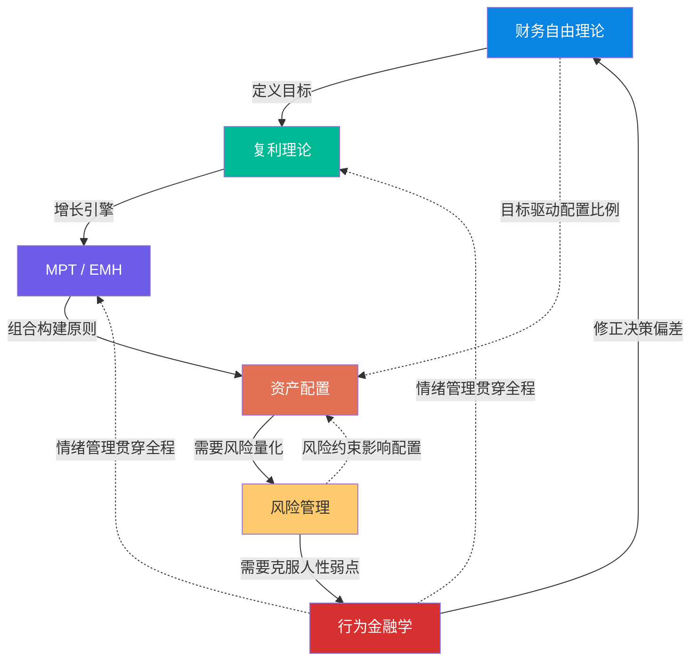
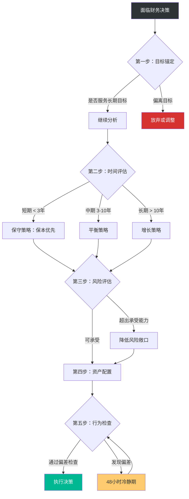
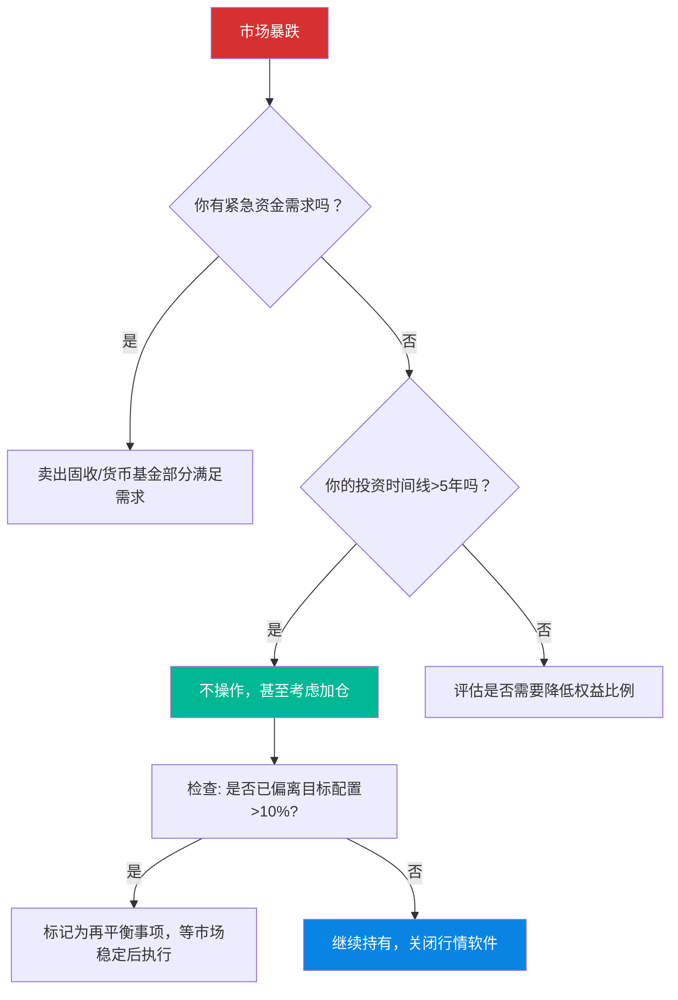

## 七、综合应用：建立个人财务理论框架

前面六节分别拆解了财务自由理论、复利效应、现代投资组合理论（MPT）与有效市场假说（EMH）、资产配置策略、风险管理理论和行为金融学。它们各自回答了财务管理中的一个核心问题：

| 理论 | 回答的核心问题 | 核心洞见 |
|------|---------------|---------|
| 财务自由理论 | 我需要多少钱？目标是什么？ | 财务自由是一个可量化的数学问题，不是遥不可及的梦想 |
| 复利理论 | 财富如何增长？时间的价值有多大？ | 时间是最稀缺的资源，早开始10年可能多赚一倍 |
| MPT / EMH | 我该如何科学地构建投资组合？ | 分散化消除非系统性风险，主动选股大概率跑不赢指数 |
| 资产配置 | 我的钱应该放在哪些篮子里？ | 配置决定了90%以上的长期收益差异 |
| 风险管理 | 我可能损失多少？如何控制？ | 风险不是敌人，不受控的风险才是 |
| 行为金融学 | 我会在哪里犯错？如何避免？ | 最大的风险不在市场里，在你的脑袋里 |

但现实中，财务决策从来不是单一理论能覆盖的。你决定是否买房，同时涉及资产配置（集中度风险）、复利（房贷利息的长期成本）、行为金融学（锚定效应和从众心理）、风险管理（流动性风险）等多个维度。你决定是否跳槽创业，同样需要同时调用收入规划、风险评估、时间价值计算和情绪管理。

本节的目标就是把这些理论编织成一张网，让你面对任何财务决策时都能快速调用正确的分析框架，并给出从诊断到落地的完整实施系统。

---

### 7.1 六大理论的内在逻辑关系

六大理论不是并列的，它们之间存在清晰的层次关系和依赖链。



**自下而上的依赖链**：

1. **财务自由理论是起点**——没有明确目标，后面所有的投资行为都是盲目的。你需要先知道"我需要多少钱"，才能倒推"我每月需要存多少、投资回报率需要达到多少"。一个没有目标的人，即使掌握了所有投资技巧，也只是在"为投资而投资"。

2. **复利理论是增长引擎**——它告诉你时间是最稀缺的资源。目标确定后，复利公式帮你计算出"以当前储蓄率和预期回报率，我需要多久才能达到目标"。这个计算会反过来告诉你：要么提高储蓄率，要么接受更长的时间，要么调整目标——三者必选其一。

3. **MPT/EMH是组合构建的科学依据**——知道了目标和时间线，你需要选择投资工具。MPT告诉你分散化的数学原理（为什么不要把所有钱放在一只股票上），EMH告诉你主动选股大概率跑不赢指数（为什么低成本指数基金是普通人的最优解）。

4. **资产配置是投资组合的骨架**——理论落地的第一步就是确定股债比例和资产类别。Brinson等人1986年的经典研究表明，资产配置解释了投资组合收益差异的93.6%。换句话说，你选择"几成股票几成债券"对收益的影响，远远大于你选择"哪只股票哪只债券"。

5. **风险管理是安全阀**——配置确定后，你需要量化可能的最大损失，确保在极端情况下不会被迫割肉离场。风险管理回答的是："如果明天股市跌30%，我还能睡着觉吗？"

6. **行为金融学是贯穿全程的"操作系统补丁"**——无论你理论多扎实，执行时都会受到情绪干扰。恐惧让你在低点卖出，贪婪让你在高点加仓，过度自信让你忽视风险。行为金融学帮你识别并纠正这些系统性偏差。

**自上而下的反馈环**：

行为金融学的纠偏反馈回财务自由目标（防止目标被情绪左右而频繁修改），并通过情绪管理影响复利执行（防止定投中断）和组合管理（防止追涨杀跌）。这个反馈环是整个框架能够长期运转的关键——没有它，再完美的理论都会在人性面前崩溃。

#### 理论间的协同效应矩阵

六大理论不仅有线性依赖链，还有广泛的协同关系。理解这些协同关系，才能在实际决策中同时调用多个理论：

| | 财务自由 | 复利 | MPT/EMH | 资产配置 | 风险管理 | 行为金融 |
|---|---|---|---|---|---|---|
| **财务自由** | — | 目标决定时间线 | — | 目标决定收益需求 | — | 目标锚定防情绪漂移 |
| **复利** | 时间线反馈目标 | — | — | 时间决定权益比例 | — | 坚持定投防中断 |
| **MPT/EMH** | — | — | — | 分散化理论基础 | 协方差矩阵量化风险 | — |
| **资产配置** | 配置服务目标 | 配置放大复利 | 配置基于MPT | — | 配置控制风险敞口 | — |
| **风险管理** | 风险容忍度影响目标 | — | 风险量化基于MPT | 风险约束配置 | — | 风控防止恐慌操作 |
| **行为金融** | 修正目标漂移 | 修正定投中断 | 修正过度交易 | 修正追涨杀跌 | 修正风险忽视 | — |

读法：行理论对列理论的影响。例如"复利→资产配置"表示"时间维度影响配置决策"。

---

### 7.2 个人财务决策的统一分析框架

面对任何重大财务决策，你可以用以下五步框架来分析。这个框架融合了六大理论的核心洞见，形成一个可重复使用的决策引擎。

#### 第一步：目标锚定（财务自由理论）

**核心问题**：这个决策是否服务于我的长期财务目标？

每个财务决策都应该能回答"这让我离财务自由更近还是更远"。你需要一张清晰的财务目标地图：


**实操模板**：

| 阶段 | 定义 | 量化标准 | 你的数字 |
|------|------|---------|---------|
| 财务保障 | 能应对突发状况 | 紧急备用金覆盖3个月基本支出 | 月支出×3 = ____元 |
| 财务稳定 | 无高息负债，有基本保障 | 高息负债清零 + 基础保险配置 | 当前高息负债：____元 |
| 财务安全 | 被动收入能覆盖基本生活 | 被动收入 ≥ 基本月支出 | 基本月支出×12×20 = ____元 |
| 财务自由 | 被动收入能覆盖理想生活 | 被动收入 ≥ 理想月支出 | 年支出×25 = ____元 |
| 财务丰盛 | 财务资源远超需求 | 资产为财务自由数字的3倍以上 | 财务自由数字×3 = ____元 |

**目标锚定的常见陷阱**：

- **目标模糊**："我想有钱"不是目标，"我希望在45岁时拥有500万元可投资资产"才是。模糊的目标无法指导行动。
- **目标过高导致放弃**：财务自由数字500万，当前存款5万——如果只盯着终点，很容易因为"差太远"而放弃。解法是将大目标拆解为小里程碑（先到50万，再到100万）。
- **目标频繁修改**：每次看到别人晒收益就改目标。解法是每年只在年度财务体检时调整目标，平时锁定不动。
- **忽视非财务目标**：纯用数字衡量一切。陪伴家人、身体健康、职业满足感也是"富有"的一部分。

#### 第二步：时间维度评估（复利理论）

**核心问题**：这个决策的时间框架是什么？时间是朋友还是敌人？

复利理论教会我们：同样的钱，投入时间不同，结果天差地别。在评估任何投资决策时，必须考虑时间维度。

**关键判断**：

- **短期需求（< 3年）**：本金安全优先。货币基金、短期理财、银行存款。不要用短期要用的钱冒险。如果这笔钱3年内必须用（买房首付、子女学费、婚礼费用），它不应该出现在股票市场上。
- **中期目标（3-10年）**：适度承担波动。债券基金为主（60-70%），搭配少量指数基金（30-40%）。可以承受一定程度的短期亏损，但不能承受本金永久性损失。
- **长期目标（> 10年）**：时间是你的盟友。高比例权益类资产（指数基金为主），充分利用复利效应。短期内的市场波动在10年以上的尺度上几乎可以忽略。

**复利效应的直观对比**：

| 每月定投金额 | 投资10年（年化7%） | 投资20年（年化7%） | 投资30年（年化7%） |
|------------|-----------|-----------|-----------|
| 1,000元 | 17.3万 | 52.0万 | 122.0万 |
| 2,000元 | 34.6万 | 104.0万 | 244.0万 |
| 3,000元 | 51.9万 | 156.0万 | 366.0万 |
| 5,000元 | 86.5万 | 260.0万 | 610.0万 |
| 10,000元 | 173.1万 | 520.1万 | 1,220.3万 |

> 注意：以上数据基于定投公式 FV = PMT × [((1+r)^n - 1) / r]，其中 r=月收益率（0.583%），n=月数。实际收益会因市场波动而偏离。

**时间维度的关键洞察——"早"比"多"更重要**：

假设目标是在60岁时积累500万元（年化7%）：
- 25岁开始：每月只需投入约4,100元
- 35岁开始：每月需要投入约9,600元（2.3倍）
- 45岁开始：每月需要投入约25,800元（6.3倍）

每推迟10年，月投入额增加一倍以上。这就是"时间是最贵的资源"的数学证明。

#### 第三步：风险评估（MPT + 风险管理理论）

**核心问题**：这个决策的风险有多大？我能否承受最坏情况？

MPT告诉我们：风险和收益是一对共生体，关键不是消除风险，而是获得与风险相匹配的收益，并通过分散化消除不必要的非系统性风险。

**风险评估矩阵**：

| 风险维度 | 低 | 中 | 高 |
|---------|---|---|---|
| 本金损失概率 | 银行存款、国债 | 债券基金、银行理财 | 股票、股票基金 |
| 波动性（年化标准差） | < 3% | 3%-15% | > 15% |
| 流动性 | 随时可取（活期） | 1-7天到账（基金） | 锁定期长（房产、PE） |
| 最大回撤历史 | < 5% | 5%-30% | > 30% |
| 适合资金用途 | 紧急备用金、短期目标 | 中期目标 | 长期目标（>10年） |

**关键风险指标及其用途**：

| 指标 | 计算方式 | 实际用途 | 在哪查 |
|------|---------|---------|--------|
| 标准差（σ） | 收益率的离散程度 | 衡量投资波动大小 | 基金详情页的"波动率" |
| 最大回撤 | 最高点到最低点的跌幅 | 评估"最坏能亏多少" | 基金详情页的"最大回撤" |
| 夏普比率 | (收益率-无风险利率)/标准差 | 每承受1单位风险获得多少超额收益 | 越高越好，>1算优秀 |
| Beta系数 | 与市场基准的协方差/市场方差 | 衡量系统性风险敞口 | β>1比市场波动大，β<1比市场波动小 |

**风险承受能力的双维度评估**：

风险承受能力不是一个单一数字，而是由两个独立维度组成的：

- **风险承受意愿**（心理维度）：你愿意承受多大波动？这取决于性格、经验和情绪稳定性。
- **风险承受能力**（财务维度）：你能承受多大损失？这取决于收入稳定性、资产规模、负债水平和时间跨度。

两者取较低值，才是你真正的风险承受水平。一个年入百万但极度厌恶波动的人，和一个月入5千但心态极好的人，最优配置可能完全不同。

**个人风险承受能力自评问卷**：

在做任何投资决策前，回答以下五个问题，每个问题选择最符合你的选项：

1. 如果你的投资组合一个月内下跌20%，你会怎么做？
   - A. 立即全部卖出（风险承受力：低，+1分）
   - B. 卖出一部分（风险承受力：中低，+2分）
   - C. 不做操作，等待回升（风险承受力：中，+3分）
   - D. 加仓买入更多（风险承受力：高，+4分）

2. 你距离需要动用投资资金的时间有多远？
   - A. 1年内需要（+1分） B. 3年内（+2分） C. 5年以上（+3分） D. 10年以上（+4分）

3. 你的收入稳定性如何？
   - A. 高度不稳定/自由职业（+1分） B. 有一定波动（+2分） C. 相对稳定/体制内（+3分） D. 多元收入来源（+4分）

4. 你的投资占总资产的比例是多少？
   - A. 超过80%（+1分） B. 50%-80%（+2分） C. 20%-50%（+3分） D. 不到20%（+4分）

5. 你有多少年投资经验？
   - A. 0年（+1分） B. 1-3年（+2分） C. 3-5年（+3分） D. 5年以上（+4分）

**评分与对应配置建议**：

| 总分 | 风险类型 | 建议权益类占比 | 建议固收类占比 |
|------|---------|--------------|--------------|
| 5-9分 | 保守型 | 15-25% | 60-75% |
| 10-14分 | 稳健型 | 35-50% | 40-55% |
| 15-18分 | 平衡型 | 50-65% | 25-40% |
| 19-20分 | 进取型 | 70-85% | 10-25% |

> 注意：这个自评只是起点。真正的风险承受能力需要在实际经历市场下跌后才能验证。建议先用较小金额试水，观察自己在亏损时的真实反应，再调整配置。

#### 第四步：分散化与配置（资产配置理论）

**核心问题**：如何在风险可控的前提下获得最优收益？

资产配置是前几步分析的综合输出——目标决定了收益需求，时间决定了持有周期，风险评估决定了波动上限，最终这些因素共同决定了你的资产配置方案。

**按年龄和风险偏好的配置模板**：

| 投资者画像 | 权益类（股票/指数基金） | 固收类（债券/理财） | 现金及等价物 | 另类资产（黄金/REITs） |
|-----------|---------------------|-------------------|------------|---------------------|
| 25岁·进取型 | 70-80% | 10-15% | 5-10% | 5-10% |
| 35岁·稳健型 | 50-60% | 25-30% | 5-10% | 5-10% |
| 45岁·平衡型 | 35-45% | 35-40% | 10-15% | 5-10% |
| 55岁·保守型 | 20-30% | 45-55% | 15-20% | 5% |

**核心配置中的具体标的选择原则**：

| 资产类别 | 推荐工具类型 | 选择标准 | 费率参考 |
|---------|------------|---------|---------|
| A股宽基指数 | 沪深300ETF、中证500ETF | 规模>100亿，跟踪误差小 | 管理费<0.5%/年 |
| 港股/美股 | QDII基金、港股通ETF | 注意额度限制和汇率风险 | 管理费<0.8%/年 |
| 债券 | 纯债基金、中短债基金 | 最大回撤<3%，历史业绩稳定 | 管理费<0.4%/年 |
| 货币 | 货币基金 | 规模>50亿，支持T+0赎回 | 七日年化2-3% |
| 黄金 | 黄金ETF | 跟踪上海金，规模>10亿 | 管理费<0.5%/年 |

**再平衡规则**：

- **阈值触发法**：当任一资产类别偏离目标配置超过5个百分点时触发再平衡。例如目标权益60%，实际涨到67%时卖出部分权益买入固收。
- **定期再平衡法**：每半年或每年固定日期检视并调整一次。简单但可能错过最佳再平衡时机。
- **现金流再平衡法**：新资金投入时，优先买入比例偏低的资产类别，而非卖出已有资产。避免触发交易成本和税费。

**实践建议**：对大多数人而言，"现金流再平衡法 + 年度阈值检视"是最省心且有效的组合。具体操作：每次定投时，先检查当前各类资产的实际占比，然后将新资金全部投入占比偏低的类别。每年年底做一次全面检视，如果偏差超过5个百分点，通过调整来年定投比例来修正。

#### 第五步：行为检查（行为金融学）

**核心问题**：我的决策是理性的还是被情绪驱动的？

这是最后也是最容易被忽视的一步。前面四步即使分析得再完美，如果执行时被恐惧或贪婪劫持，一切都是白费。

**决策偏差检查清单**：

在做出任何重大财务决策之前，对照以下清单逐项自检：

| 偏差 | 自检问题 | 如果回答"是" | 纠正方法 |
|------|---------|-------------|---------|
| 损失厌恶 | 我是否因为"已经亏了"而不愿卖出？ | 问自己：如果现在没有持仓，我还会买入吗？ | 用"归零思维"重新评估 |
| 锚定效应 | 我是否在执着于某个买入价格？ | 价格锚点与未来走势无关，忘掉成本价 | 只看当前市值和未来预期 |
| 过度自信 | 我是否觉得自己"看准了"？ | 记住：专业基金经理也跑不赢指数 | 写下你"看准"的历史成功率 |
| 从众效应 | 我是否因为别人都在买所以我也要买？ | 当菜市场都在聊股票时，往往是见顶信号 | 查看历史上的群体狂热结局 |
| 近因偏差 | 我是否被最近的市场走势过度影响？ | 拉长时间线看3-5年历史数据 | 看月线而非日线 |
| 心理账户 | 我是否对"意外之财"更随意？ | 所有1元钱的购买力都一样 | 奖金到账直接转入投资账户 |
| 禀赋效应 | 我是否因为"是我的"而不愿放弃？ | 问自己：如果重新来过，我还会选择它吗？ | 假装自己没有这笔资产再决策 |
| 确认偏差 | 我是否只找支持自己观点的信息？ | 主动搜索反对意见 | 每次投资决策前至少读一篇看空观点 |
| 沉没成本 | 我是否因为"已经投入很多"而继续？ | 已经花的钱不应该影响未来决策 | 只考虑从今天起的增量成本和收益 |
| 可得性偏差 | 我是否因为某件事容易想起就高估其概率？ | 媒体报道的极端事件不代表概率 | 查看统计数据而非依赖印象 |

**"冷静期"制度**：

对于任何超过月收入10%的财务决策，强制执行48小时冷静期。具体操作：
1. 写下决策理由（包括你想买/卖什么、为什么、金额多少）
2. 写下你此刻的情绪状态（焦虑、兴奋、恐惧、贪婪）
3. 设定48小时后的闹钟
4. 48小时后重新阅读你写的内容，问自己："如果这是朋友的决策，我会怎么建议他？"

你会惊讶地发现，很多"非做不可"的决策，48小时后就不再那么迫切了。研究显示，强制冷静期能减少约30%的冲动性交易。

---

### 7.3 统一框架的完整应用流程

将五步分析法整合为一个完整的决策流程：



#### 案例一：用统一框架分析"是否应该买房"

假设条件：28岁，月收入15,000元，存款30万元，所在城市房价约200万/套。

**第一步：目标锚定**
- 当前阶段：财务稳定（基本保险已配，无高息负债）
- 财务自由数字：假设理想年支出20万，财务自由数字 = 20万×25 = 500万
- 买房后：首付60万（需要借款30万）+ 月供约7,000元（30年期，利率3.5%），储蓄率从当前30%降至约15%
- **判断**：买房会显著推迟财务自由的时间线，但自住房有居住使用价值，不能纯用投资视角评估

**第二步：时间评估**
- 房产是超长期资产（持有通常>10年）
- 30年房贷的总利息约为本金的60%（按3.5%等额本息计算，总还款约360万，其中利息约160万）
- 30万元如果投入年化7%的指数基金，30年后约为228万
- **判断**：从纯投资角度看，租房+投资可能优于买房；但需要考虑租金上涨、居住稳定性、心理安全感等非财务因素

**第三步：风险评估**
- 流动性风险：房产变现周期长（3-6个月），急需资金时可能被迫折价
- 集中度风险：一套房产占总资产比例超过80%，远超建议的单一资产集中度上限
- 杠杆风险：房贷放大了波动，房价下跌10%意味着首付款损失33%（3倍杠杆）
- 收入风险：月供占收入47%，如果失业或收入下降，偿还压力很大
- **判断**：风险较高，尤其是集中度和流动性风险。建议：如果买房，月供不应超过收入的30%

**第四步：配置建议**
- 如果决定买房：优先攒够首付（至少30%，避免20%首付带来的高杠杆），保留6个月紧急备用金不被挪用
- 如果决定不买：将30万按60/20/20分配到指数基金/债券基金/货币基金，月投10,000元定期定额

**第五步：行为检查**
- 从众效应？——是否因为"同龄人都在买房"而焦虑？
- 损失厌恶？——是否因为"房价一直涨怕错过"而急于入场？
- 锚定效应？——是否因为"之前房价更高所以现在是便宜的"而判断？
- 禀赋效应？——是否因为"看中了那套房不想放弃"而非理性决策？

**结论**：买房本身没有绝对的对错，关键在于你的财务状况是否足以承受其风险，以及你是否在用理性框架而非情绪做决策。如果月供控制在收入30%以内、保有紧急备用金、且确定会长期居住（>5年），买房是合理的；否则，推迟并先积累资本可能是更优选择。

#### 案例二：用统一框架分析"是否应该辞职创业"

假设条件：32岁，月收入25,000元，存款50万元，有一个副业项目月收入约5,000元且在增长中，已婚无子女。

**第一步：目标锚定**
- 财务自由数字：年支出18万×25 = 450万
- 当前净资产：约80万（存款+投资），达成进度17.8%
- 辞职后：收入从25,000元/月降至5,000元/月（副业），储蓄率从35%变为负值（需要消耗存款）
- **判断**：创业如果成功，可能大幅加速财务自由进程；如果失败，会倒退3-5年

**第二步：时间评估**
- 50万存款以月支出12,000元计算，可支撑约42个月（3.5年）
- 这是你的"runway"——创业项目需要在3年内达到盈亏平衡
- 副业月收入5,000元，需要增长到12,000元才能覆盖基本生活
- **判断**：时间窗口有限但合理，关键问题是增长路径是否清晰

**第三步：风险评估**
- 收入风险：从确定的25,000元变为不确定的副业收入
- 家庭风险：已婚，需要配偶完全同意且家庭有第二收入来源
- 职业风险：离开职场2-3年后，重返职场的难度和薪资折扣
- 机会成本：2年×25,000元×12月 = 60万的工资收入损失
- **判断**：风险较高，但有3.5年缓冲期。关键是设定明确的"止损线"

**第四步：配置建议**
- 创业资金和生活资金严格分开：留20万为"生活保障金"（不动），30万为"创业启动金"
- 配偶收入必须能覆盖家庭基本支出的60%以上
- 保留基本社保和商业医疗险不断缴

**第五步：行为检查**
- 过度自信？——副业月入5,000就认为一定能做大？查看同类项目的成功率
- 从众效应？——是否因为看到别人创业成功就冲动？
- 损失厌恶反向？——是否因为"太害怕失去稳定收入"而一直在犹豫？理性评估继续打工的机会成本
- 确认偏差？——是否只在看创业成功的故事而忽略了失败案例？

**结论**：建议采用"渐进式创业"——先不辞职，用6个月时间将副业做到月入10,000元以上再考虑全职。设定止损线：如果辞职后18个月副业收入未达到月入15,000元，启动重返职场计划。

#### 案例三：用统一框架分析"要不要给孩子报天价早教班"

假设条件：夫妻月入合计30,000元，一个2岁孩子，早教班年费60,000元。

**第一步：目标锚定**
- 早教班费用占家庭年收入的16.7%，是一笔重大支出
- 这笔钱如果用于定投指数基金（年化7%），16年后（孩子上大学时）约为17.6万
- **判断**：需要评估早教班的实际教育回报 vs 同等金额的投资回报

**第二步：时间评估**：短期消费决策，非投资。重点评估消费价值。

**第三步：风险评估**：财务风险较低（不会造成负债），但存在机会成本风险——这6万元如果用于更有价值的教育投入（阅读、户外活动、亲子互动），效果可能更好。

**第四步：配置建议**：如果决定投入教育，可以考虑更经济的替代方案——社区免费早教活动、图书馆亲子阅读、户外探索，年花费可控制在5,000-10,000元。

**第五步：行为检查**
- 从众效应？——是否因为"别人家孩子都在上"而焦虑？
- 损失厌恶？——是否因为"怕孩子输在起跑线"而冲动消费？
- 心理账户？——是否因为"为了孩子花多少钱都愿意"而忽视理性评估？

**结论**：6万元早教班的边际收益远低于同等金额的长期投资。建议将早教预算控制在1-2万元/年，剩余资金投入孩子的教育基金。

---

### 7.4 突发危机的决策框架

生活不总是风平浪静。市场崩盘、失业、重大疾病等突发事件会打乱你的计划。以下是三类常见危机的快速决策框架。

#### 危机一：市场暴跌（股市单日跌幅>5%或月跌幅>15%）



**暴跌时的"四不原则"**：
1. **不看盘**——越看越焦虑，越焦虑越想操作。设置一个"暴跌周不看盘"的规则。
2. **不操作**——所有卖出决策必须通过48小时冷静期。历史数据表明，暴跌后的反弹往往在几天内发生。
3. **不改变计划**——你的定投计划是基于长期目标设计的，不应因短期波动而修改。
4. **不听"专家"预测**——没有人能准确预测底部。所有的"这次不一样"最终都一样。

**暴跌后的检视清单**（冷静后执行）：
- 检查资产配置是否偏离目标>10%——如果是，标记为再平衡事项
- 检查是否有加仓机会——如果有闲钱且目标配置未满，可以分批加仓
- 检查紧急备用金是否充足——确保至少6个月的生活费不受影响
- 回顾投资日记——记录此刻的情绪和决策，用于未来的行为校准

#### 危机二：突然失业或收入大幅下降

**紧急行动清单（失业后第1周内完成）**：

1. 立即停止所有非必要支出（娱乐、订阅、外出就餐）
2. 暂停定投（这是你之前积累的紧急备用金发挥作用的时刻）
3. 评估紧急备用金能支撑多少个月
4. 确认社保/医保续缴方式（避免断缴影响医疗和养老）
5. 盘点可变现的非核心资产（闲置物品、不需要的会员资格等）

**收入恢复期的财务策略**：

| 阶段 | 时间 | 行动 |
|------|------|------|
| 应急期 | 失业后0-3个月 | 消耗紧急备用金，大幅压缩支出，全力找工作 |
| 调整期 | 3-6个月 | 如果仍未就业，考虑降低薪资预期或转行 |
| 恢复期 | 重新就业后 | 先重建紧急备用金，再恢复定投 |
| 加速期 | 备用金重建后 | 提高储蓄率弥补失业期间的"缺口" |

#### 危机三：重大疾病或意外

**事前准备（如果你还没有，请立刻行动）**：
- 医保确保不断缴（这是最基础的保障）
- 商业医疗险（百万医疗险，年费几百元覆盖数百万保额）
- 重疾险（保额建议为年收入的3-5倍）
- 意外险（保额100万以上，年费仅几百元）

**事后的财务应急处理**：
1. 第一时间确认保险覆盖范围，提交理赔申请
2. 评估医疗费用中自费部分的金额
3. 如果自费部分超过紧急备用金，按以下顺序变现：货币基金→债券基金→股票基金（先卖亏损的，可以抵税）
4. 绝对不要动用退休金和子女教育基金
5. 如果需要借款，优先选择低息渠道（公积金贷款、亲友借款），远离高息网贷

---

### 7.5 不同人生阶段的财务框架应用

六大理论在不同人生阶段的侧重点不同：

| 人生阶段 | 年龄参考 | 核心理论侧重 | 关键行动 | 常见陷阱 |
|---------|---------|------------|---------|---------|
| 起步期 | 22-28岁 | 复利理论（时间优势最大）+ 财务自由理论 | 建立记账习惯，开始定投，清除高息负债 | "我还年轻不着急"、月光消费 |
| 积累期 | 28-35岁 | 资产配置 + 风险管理 | 提高储蓄率，优化投资组合，配置保险 | 过度消费（买房买车后）、忽视保险 |
| 增长期 | 35-45岁 | 全面应用 | 最大化投资，平衡家庭责任，税务筹划 | 过度集中于房产、子女教育金忽视自身养老 |
| 巩固期 | 45-55岁 | 风险管理（优先级上升） | 降低波动，增加固收比例，完善退休规划 | 风险厌恶过度导致"现金为王"、错失增长 |
| 收获期 | 55岁以上 | 风险管理 + 行为金融学 | 资产提取策略，保本为主，防止被骗 | 被高收益骗局吸引、过度帮助子女 |

#### 起步期（22-28岁）的框架应用

**理论侧重**：复利理论是这个阶段的绝对主角。25岁开始每月定投2,000元（年化7%），到60岁时约有327万元。如果推迟到35岁才开始，同样条件下只有约154万元。早10年的差距是173万元——这就是复利的时间价值。

**具体配置建议**：
- 权益类占比：70-80%（以宽基指数基金为核心，如沪深300、中证500）
- 固收类占比：10-15%（债券基金或货币基金）
- 现金：5-10%（紧急备用金，放在货币基金中）
- 另类：5%（可选黄金ETF）

**具体行动清单**：
1. 下载一款记账APP，连续记录3个月支出，找出"隐形开支"
2. 开设独立的投资账户（建议选费率低的互联网券商）
3. 设置工资日自动扣款，将月收入的20-30%转入投资账户
4. 选择1-2只宽基指数基金开始定投（先从每月500元开始，逐步增加）
5. 配置基础保险：百万医疗险 + 意外险（年费总计<1,000元）

**行为要点**：这个阶段最大的行为挑战是"坚持"。刚开始定投时金额小、见效慢，很容易半途而废。解决方案是设置工资日自动扣款，让投资变成"默认行为"而非需要意志力的决定。另一个挑战是"消费升级"——同学朋友开始买名牌、出入高档场所，你需要抵御社交压力。

#### 积累期（28-35岁）的框架应用

**理论侧重**：资产配置和风险管理成为核心。收入增长带来更多可投资资金，但结婚、买房、生子等重大事件也增加了财务复杂度和风险敞口。

**关键变化**：
- 保险配置从"可选"变为"必需"——有了家庭责任后，定期寿险成为刚需（保额建议为年收入的10倍）
- 资产配置开始多元化——不再只是指数基金，需要考虑债券、黄金等降低组合波动
- 建立家庭财务报表——收入、支出、资产、负债四张表，每年更新
- 开始关注税务优化——了解个税专项附加扣除（子女教育、房贷利息、住房租金、赡养老人等）

**行为要点**：这个阶段最大的行为挑战是"消费升级"。收入增长带来的"生活方式通胀"会吞噬储蓄率的提升。每当你加薪时，应该将加薪部分的至少50%直接转入投资账户，而非全部用于提升生活水平。例如月入从20,000涨到25,000元——将至少2,500元转入投资，剩余2,500元改善生活。

#### 增长期（35-45岁）的框架应用

**理论侧重**：全面应用六大理论。这是财务框架最复杂的阶段——既要为子女教育存钱，又要为自己的退休积累，还要照顾年迈的父母。

**三笔钱的分账管理**：

| 资金用途 | 时间框架 | 配置策略 | 占总投资比例建议 |
|---------|---------|---------|----------------|
| 子女教育金 | 5-15年 | 中等风险：债券为主+少量权益 | 20-30% |
| 退休金 | 15-25年 | 长期增长：权益为主 | 40-50% |
| 应急/弹性资金 | 随时 | 高流动性：货币基金 | 10-15% |
| 其他目标（旅行、大件等） | 1-5年 | 低风险：短债/理财 | 10-20% |

**行为要点**：最大的陷阱是"为了孩子牺牲自己的退休规划"。记住：你能贷款给孩子上学，但没人能贷款给你养老。退休规划的优先级应高于子女教育金。另一个陷阱是"过度自信"——这个阶段的人往往在职场上很成功，容易把职场自信延伸到投资领域，做出高风险的集中投资决策。

#### 巩固期（45-55岁）的框架应用

**理论侧重**：风险管理的优先级显著上升。距离退休越近，投资组合承受大幅波动的能力越低——因为恢复时间不够了。一个50岁的人如果投资组合亏损50%，需要在60岁前翻倍才能回本，这在固收为主的配置下几乎不可能。

**配置调整方向**：
- 权益类逐步降低至35-45%
- 固收类提高至35-45%
- 增加保本型资产（国债、大额存单）占比
- 检视保险是否充足，尤其是医疗险和重疾险（50岁后投保成本急剧上升，甚至可能被拒保）

**行为要点**：这个阶段最大的陷阱是"恐惧过度"——看到市场下跌就全部转为存款，结果错失后续上涨。解决方案是设定一个"最低权益比例"（比如30%），无论市场如何波动都不低于这个底线。另一个陷阱是"追赶损失"——因为前期投资不够积极，现在想通过高风险操作"补回来"，这往往适得其反。

#### 收获期（55岁以上）的框架应用

**理论侧重**：风险管理 + 行为金融学。核心任务从"积累"转变为"保值+提取"。

**资产提取策略**：
- **4%法则**：第一年提取总资产的4%，之后每年根据通胀调整。如果投资组合年化收益>4%，本金基本不减少
- **动态提取法**：市场好时多提一点（不超过5%），市场差时少提一点（不低于3%）。具体规则：当年投资组合收益率>10%时，提取率上调至4.5%；收益率在0-10%时，维持4%；收益率<0时，下调至3.5%
- **桶型策略**：将资产分为三个"桶"——短期桶（1-2年生活费，货币基金）、中期桶（3-7年，债券基金）、长期桶（8年以上，指数基金）。短期桶始终满仓，每年从中期桶补充短期桶，每3年从长期桶补充中期桶

**行为要点**：这个阶段最危险的行为陷阱有两个：一是被"高收益理财产品"诈骗（年化>8%且"保本"的承诺基本都是骗局）；二是过度补贴子女，导致自己的退休金不足。记住：你把钱全部给了孩子，将来生病时还是要他们负担——与其如此，不如自己管好自己的钱。

#### 特殊场景：家庭财务的协同管理

对于已婚人士，个人财务框架需要升级为家庭财务框架。

**家庭财务的三种模式**：

| 模式 | 描述 | 适合情况 | 优缺点 |
|------|------|---------|--------|
| 完全共管 | 所有收入进一个账户，统一管理 | 收入差距不大、消费观一致 | 效率高但可能产生权力不对等 |
| AA制 | 各管各的，公共支出AA | 收入相近、独立性强 | 自由度高但缺乏协同效应 |
| 混合制 | 共同账户+个人账户 | 多数家庭的最佳选择 | 兼顾协同和自主 |

**推荐的混合制方案**：

1. 开设一个家庭共同账户，双方按收入比例（或对半）存入"家庭基金"
2. 家庭基金覆盖：房贷/房租、子女教育、家庭保险、家庭旅行、日常生活
3. 各自保留个人账户，用于个人消费、个人投资和礼物
4. 家庭财务决策采用"双人五步法"——两人都独立完成五步分析，然后对比结果，讨论分歧

**家庭财务沟通的要点**：
- 每月一次"财务约会"——边吃饭边讨论本月收支和下月计划，不要在吵架时谈钱
- 大额支出设定"门槛"——超过一定金额（如5,000元）需要双方同意
- 各自保留"不需要解释"的个人消费额度——减少因为"你又买了什么"引发的冲突
- 共同学习财务知识——两个人的认知水平越接近，决策效率越高

---

### 7.6 税务筹划基础

税务是很多个人财务框架中被忽视的一环。合法的税务筹划能显著提升你的实际收益率。

#### 个人所得税专项附加扣除

| 扣除项目 | 每月扣除上限 | 条件 |
|---------|------------|------|
| 子女教育 | 2,000元/每个子女 | 满3岁至博士毕业 |
| 继续教育 | 400元（学历）或3,600元/年（职业资格） | 在学或取得证书当年 |
| 大病医疗 | 实际支出超1.5万部分，最高8万/年 | 医保目录内自付部分 |
| 住房贷款利息 | 1,000元 | 首套房贷，最长240个月 |
| 住房租金 | 800-1,500元（按城市） | 在工作城市无自有住房 |
| 赡养老人 | 3,000元 | 父母年满60岁 |
| 3岁以下婴幼儿照护 | 2,000元/每个婴幼儿 | 满3岁前 |

> 很多人不知道或忘记填报这些扣除项，每年可能多缴数千元税款。建议在每年年初更新一次专项附加扣除信息。

#### 投资收益的税务考量

| 投资品种 | 税务处理 | 优化建议 |
|---------|---------|---------|
| 股票/基金分红 | 个人投资者暂免个人所得税 | — |
| 股票转让差价 | 个人投资者暂免个人所得税 | — |
| 基金赎回差价 | 个人投资者暂免个人所得税 | — |
| 银行存款利息 | 暂免个人所得税 | — |
| 国债利息 | 免征个人所得税 | 高收入者可适当配置国债 |
| 房产转让 | 满五唯一免征个税；否则差额20%或全额1-3% | 自住房尽量满足"满五唯一"条件 |

> 注意：以上为中国大陆个人投资者的税务政策，政策可能调整，请以最新税法为准。

---

### 7.7 量化工具箱：关键公式速查

以下是贯穿六大理论的核心公式和计算工具，在构建和评估你的个人财务框架时随时查阅：

#### 基础公式

| 公式 | 表达式 | 用途 | 示例 |
|------|--------|------|------|
| 财务自由数字 | 年支出 × 25 | 计算你需要多少钱才能财务自由 | 年支出20万 → 需要500万 |
| 4%安全提取率 | 年提取 = 总资产 × 4% | 退休后每年可安全提取的金额 | 总资产500万 → 年提20万 |
| 72法则 | 翻倍年数 ≈ 72 ÷ 年化收益率% | 快速估算资产翻倍时间 | 年化8% → 约9年翻倍 |
| 69.3法则（精确版） | 翻倍年数 ≈ 69.3 ÷ ln(1+r) | 更精确的翻倍时间计算 | 年化8% → 约9.0年 |
| 储蓄率公式 | 储蓄率 = (收入-支出) / 收入 | 评估你的积累速度 | 月入2万存6千 → 30% |

#### 投资公式

| 公式 | 表达式 | 用途 |
|------|--------|------|
| 复利终值 | A = P × (1 + r)^n | 一次性投入的未来价值 |
| 定投终值 | FV = PMT × [((1+r)^n - 1) / r] | 定期定额投入的未来价值 |
| CAPM | E(Ri) = Rf + βi × (E(Rm) - Rf) | 预期收益率的理论计算 |
| 夏普比率 | SR = (Rp - Rf) / σp | 风险调整后的收益衡量 |
| 真实收益率 | 实际收益 ≈ 名义收益 - 通胀率 | 扣除通胀后的实际购买力增长 |

#### 速算参考表

| 年化收益率 | 72法则翻倍年数 | 10万本金10年后 | 10万本金20年后 | 10万本金30年后 |
|-----------|-------------|-------------|-------------|-------------|
| 3% | 24年 | 13.4万 | 18.1万 | 24.3万 |
| 5% | 14.4年 | 16.3万 | 26.5万 | 43.2万 |
| 7% | 10.3年 | 19.7万 | 38.7万 | 76.1万 |
| 10% | 7.2年 | 25.9万 | 67.3万 | 174.5万 |

#### Python 快速计算工具

以下Python脚本涵盖了个人财务框架中最常用的计算，可以直接运行：

```python
"""
个人财务框架核心计算器
涵盖：财务自由数字、复利计算、定投计算、风险指标、提取策略
"""

def financial_freedom_number(annual_expense, multiplier=25):
    """计算财务自由数字
    
    Args:
        annual_expense: 年支出（元）
        multiplier: 倍数，默认25（4%法则），保守用30
    Returns:
        需要的总金额
    """
    return annual_expense * multiplier


def compound_interest(principal, rate, years):
    """复利终值计算
    
    Args:
        principal: 本金
        rate: 年化收益率（小数，如0.07表示7%）
        years: 投资年数
    Returns:
        终值
    """
    return principal * (1 + rate) ** years


def dca_future_value(monthly_payment, annual_rate, years):
    """定投终值计算（期末定投）
    
    Args:
        monthly_payment: 每月定投金额
        annual_rate: 年化收益率（小数）
        years: 投资年数
    Returns:
        终值
    """
    r = annual_rate / 12
    n = years * 12
    if r == 0:
        return monthly_payment * n
    return monthly_payment * ((1 + r) ** n - 1) / r


def rule_of_72(annual_rate_pct):
    """72法则：资产翻倍年数"""
    return 72 / annual_rate_pct


def years_to_freedom(annual_expense, current_savings, monthly_savings, annual_return):
    """计算达到财务自由需要的年数
    
    Args:
        annual_expense: 年支出
        current_savings: 当前储蓄
        monthly_savings: 每月储蓄
        annual_return: 年化收益率
    Returns:
        需要的年数（如果永远达不到返回-1）
    """
    target = financial_freedom_number(annual_expense)
    r = annual_return / 12
    # FV = PV*(1+r)^n + PMT*((1+r)^n - 1)/r
    # target = current*(1+r)^n + monthly*((1+r)^n - 1)/r
    # 解方程求n
    import math
    if r == 0:
        if current_savings >= target:
            return 0
        months_needed = (target - current_savings) / monthly_savings
        return months_needed / 12
    
    # 变形: target*r/monthly = (current + monthly/r)*(1+r)^n * r/monthly - 1
    # 简化求解
    for month in range(1, 600):  # 最多50年
        fv = current_savings * (1 + r) ** month + monthly_savings * ((1 + r) ** month - 1) / r
        if fv >= target:
            return month / 12
    return -1


def withdrawal_simulation(total_assets, annual_withdrawal_rate, annual_return, years):
    """模拟资产提取过程
    
    Args:
        total_assets: 初始总资产
        annual_withdrawal_rate: 年提取率（小数，如0.04）
        annual_return: 年化收益率（小数）
        years: 模拟年数
    Returns:
        每年末的资产列表
    """
    assets = []
    balance = total_assets
    for year in range(1, years + 1):
        withdrawal = total_assets * annual_withdrawal_rate  # 基于初始金额提取
        balance = (balance - withdrawal) * (1 + annual_return)
        assets.append((year, round(balance, 2)))
    return assets


def sharpe_ratio(portfolio_return, risk_free_rate, std_dev):
    """夏普比率计算
    
    Args:
        portfolio_return: 组合收益率
        risk_free_rate: 无风险利率
        std_dev: 收益率标准差
    Returns:
        夏普比率
    """
    if std_dev == 0:
        return float('inf')
    return (portfolio_return - risk_free_rate) / std_dev


def real_return(nominal_return, inflation_rate):
    """真实收益率（费雪方程近似）"""
    return nominal_return - inflation_rate


def inflation_impact(amount, inflation_rate, years):
    """计算通胀对购买力的侵蚀
    
    Args:
        amount: 当前金额
        inflation_rate: 年通胀率（小数）
        years: 年数
    Returns:
        未来的实际购买力
    """
    return amount / (1 + inflation_rate) ** years


# ========== 使用示例 ==========
if __name__ == "__main__":
    print("=" * 50)
    print("个人财务框架计算示例")
    print("=" * 50)
    
    # 1. 财务自由数字
    annual_expense = 200000  # 年支出20万
    ff_number = financial_freedom_number(annual_expense)
    print(f"\n1. 财务自由数字: {ff_number/10000:.0f}万元 (年支出{annual_expense/10000:.0f}万×25)")
    
    # 2. 定投计算
    monthly = 3000  # 每月定投3000元
    rate = 0.07     # 年化7%
    for years in [10, 20, 30]:
        fv = dca_future_value(monthly, rate, years)
        total_invested = monthly * 12 * years
        profit = fv - total_invested
        print(f"\n2. 每月定投{monthly}元×{years}年(年化7%):")
        print(f"   终值: {fv/10000:.1f}万 | 投入: {total_invested/10000:.1f}万 | 收益: {profit/10000:.1f}万")
    
    # 3. 财务自由时间
    current = 300000   # 当前存款30万
    monthly_save = 8000  # 每月存8000
    years_needed = years_to_freedom(annual_expense, current, monthly_save, rate)
    print(f"\n3. 达成财务自由需要: {years_needed:.1f}年")
    print(f"   (当前存款{current/10000:.0f}万, 月存{monthly_save}元, 年化{rate*100:.0f}%)")
    
    # 4. 72法则
    for r in [3, 5, 7, 10]:
        print(f"\n4. 年化{r}% → 翻倍需要{rule_of_72(r):.1f}年")
    
    # 5. 通胀影响
    amount = 1000000  # 100万
    inflation = 0.03  # 3%通胀
    for years in [10, 20, 30]:
        real_value = inflation_impact(amount, inflation, years)
        print(f"\n5. 100万在{years}年后的实际购买力(通胀{inflation*100:.0f}%): {real_value/10000:.1f}万")
    
    # 6. 4%提取模拟
    print(f"\n6. 500万资产，4%提取率，30年模拟(年化5%):")
    simulation = withdrawal_simulation(5000000, 0.04, 0.05, 30)
    for year, balance in simulation:
        if year in [1, 5, 10, 15, 20, 25, 30]:
            print(f"   第{year:2d}年末: {balance/10000:.1f}万元")
```

运行结果预览（部分）：

1. 财务自由数字: 500万元 (年支出20万×25)

2. 每月定投3000元×10年(年化7%):
   终值: 51.9万 | 投入: 36.0万 | 收益: 15.9万
   每月定投3000元×20年(年化7%):
   终值: 156.0万 | 投入: 72.0万 | 收益: 84.0万
   每月定投3000元×30年(年化7%):
   终值: 366.0万 | 投入: 108.0万 | 收益: 258.0万

3. 达成财务自由需要: 17.2年
   (当前存款30万, 月存8000元, 年化7%)

5. 100万在20年后的实际购买力(通胀3%): 55.4万

---

### 7.8 理论框架的局限性与现实修正

任何理论框架都有其适用边界。在应用上述框架时，需要注意以下几个关键局限：

#### 局限一：4%法则的中国适用性

4%法则基于美国市场历史数据（1926-至今），其中包含了美国股市长期年化约10%的增长。中国市场的历史表现、通胀结构和投资工具有显著差异：

- 中国股市波动更大（沪深300年化波动率约25%，标普500约15%）
- 中国股市的长期年化收益率约8-10%，但波动剧烈，散户亏损比例超过70%
- 中国的无风险利率和通胀走势与美国不同
- 中国的投资工具有限（资本管制、衍生品不发达）
- 中国的养老金体系尚不完善，不能像美国那样依赖401(k)和社保

**现实修正**：
- 保守方案：将安全提取率下调至3-3.5%，对应财务自由数字 = 年支出 × 28-33
- 使用动态提取法而非固定比例
- 配置部分全球资产（如QDII基金）降低单一市场风险
- 考虑中国的社保养老金作为补充收入来源

#### 局限二：MPT假设的理想化

MPT假设收益率服从正态分布、投资者能精确估计相关参数——现实远非如此。金融危机期间，各类资产的相关性会同时上升（"分散化在你最需要它的时候失效"）。

**现实修正**：
- 不要过度依赖历史相关性数据，在极端情况下假设相关性趋向1
- 配置一定比例的"危机对冲资产"（如长期国债、黄金），它们在股市大跌时通常上涨
- 保留足够的现金缓冲，避免被迫在低点卖出
- 接受"完美分散"是不存在的，目标是"足够好"的分散

#### 局限三：行为偏差的"知道"与"做到"之间的鸿沟

行为金融学完美地描述了人的非理性，但"知道"自己有偏差并不等于能"避免"偏差。研究表明，即使是金融专业人士也无法免疫认知偏差。

**现实修正**：
- 不要依赖意志力，要用系统来约束行为：自动定投、自动再平衡、预设止损止盈
- 找一个"财务伙伴"（配偶、朋友），互相监督重大决策
- 建立"投资日记"，记录每笔交易的理由和情绪状态，定期回顾
- 使用"承诺机制"——提前公开自己的投资计划，让社会压力帮助你执行

#### 局限四：理论无法覆盖的"黑天鹅"

所有理论都基于历史数据和概率分布，但真正的重大事件（2008年金融危机、2020年疫情、地缘政治冲突）往往超出历史经验。

**现实修正**：
- 永远保留6-12个月的紧急备用金（而非教科书说的3-6个月）
- 不要使用杠杆投资——杠杆让你无法"熬过"极端波动
- 保险是对冲黑天鹅的最佳工具，尤其是重疾险和意外险
- 接受"有些风险是无法对冲的"——过度追求安全感本身就是一种风险（机会成本）

#### 局限五：理论框架的"静态假设"

很多理论假设经济环境是稳定的——利率不会剧烈变化、通胀率可预测、就业市场平稳。但现实是中国过去30年经历了利率从10%+降到2%、从高增长到新常态、产业结构剧烈调整。

**现实修正**：
- 每年至少检视一次你的假设是否仍然成立
- 为多种情景做准备，而不是只基于"最可能"的情况规划
- 保持财务弹性——不要把资产配置做到极致优化（那意味着没有调整空间）

---

### 7.9 建立你的个人财务框架：分步实施指南

理论理解完后，以下是将框架落地为个人财务系统的具体步骤：

#### 阶段一：诊断当前状态（第1-2周）

**任务清单**：

1. **编制个人资产负债表**

资产：
  现金及银行存款：      ____元
  货币基金/余额宝：     ____元
  基金/股票：           ____元
  房产市值：            ____元
  其他资产（车、黄金等）：____元
  资产合计：            ____元

负债：
  房贷余额：            ____元
  车贷余额：            ____元
  信用卡欠款：          ____元
  其他负债：            ____元
  负债合计：            ____元

净资产 = 资产合计 - 负债合计 = ____元

2. **计算月度收支表**

月收入：
  税后工资：            ____元
  副业/兼职：           ____元
  投资收益：            ____元
  其他收入：            ____元
  收入合计：            ____元

月支出：
  固定支出（房贷/房租、保险、通讯等）：____元
  生活支出（餐饮、交通、水电等）：      ____元
  弹性支出（娱乐、购物、社交等）：      ____元
  支出合计：                            ____元

月结余 = 收入合计 - 支出合计 = ____元
储蓄率 = 月结余 / 月收入 × 100% = ____%

3. **计算关键指标**

| 指标 | 计算方式 | 健康标准 | 你的数值 |
|------|---------|---------|---------|
| 储蓄率 | 月结余/月收入 | ≥ 20% | ____% |
| 负债收入比 | 月还款/月收入 | ≤ 30% | ____% |
| 流动比率 | 流动资产/月支出 | ≥ 3 | ____ |
| 财务自由数字 | 年支出 × 25 | — | ____万元 |
| 达成进度 | 净资产/财务自由数字 | 越高越好 | ____% |
| 应急覆盖月数 | 流动资产/月支出 | ≥ 6 | ____个月 |
| 投资集中度 | 最大单一资产/总资产 | ≤ 30% | ____% |

#### 阶段二：设定目标体系（第3-4周）

根据诊断结果，建立分层目标：

1. **紧急目标（1个月内）**：清除所有年化利率>8%的高息负债（信用卡分期、网贷等）
2. **短期目标（3个月内）**：建立覆盖3个月支出的紧急备用金
3. **中期目标（1年内）**：储蓄率达到20%以上，配置基础保险（百万医疗+意外险）
4. **中长期目标（3年）**：建立完整的投资组合，净资产达到财务自由数字的10%
5. **长期目标（5-10年）**：净资产达到财务自由数字的50%
6. **终极目标**：实现财务自由

**目标设定的SMART原则**：
- **S**pecific（具体的）：不是"多存钱"，而是"每月存8,000元"
- **M**easurable（可衡量的）：不是"减少支出"，而是"月支出控制在12,000元以内"
- **A**chievable（可实现的）：不要一开始就设定50%的储蓄率，从当前水平提高5个百分点开始
- **R**elevant（相关的）：每个目标都应服务于最终的财务自由
- **T**ime-bound（有期限的）：每个目标都应有明确的截止日期

#### 阶段三：搭建执行系统（第5-8周）

1. **自动化储蓄系统**：设置工资日自动转账，将储蓄率目标金额自动转入投资账户。让"先储蓄后消费"成为默认模式。
2. **定投系统**：选择2-3只宽基指数基金，设置每月自动定投。建议选择不同市场的基金（如沪深300+中证500+恒生科技）。
3. **记账系统**：选择一款记账APP（如随手记、MoneyWiz、YNAB），设置分类预算和超支提醒。关键不是记得多详细，而是能坚持记下去。
4. **保险检视**：对照保险配置清单，补足缺失的险种。优先级：百万医疗险 > 意外险 > 定期寿险 > 重疾险。
5. **再平衡日历**：在日历上标记每季度最后一天为投资组合检视日，每年12月为全面财务体检日。

**记账的最小可行方案**——如果你觉得逐笔记账太繁琐，至少做到以下三步：
1. 只记大额支出（>100元）
2. 每周花5分钟浏览银行和信用卡账单
3. 每月底花15分钟看总支出和各分类占比

#### 阶段四：持续优化循环（长期）


**年度全面体检清单**：

- [ ] 更新资产负债表和净资产
- [ ] 计算年度实际储蓄率
- [ ] 评估投资组合收益率 vs 基准（沪深300）
- [ ] 检查资产配置是否偏离目标>5%
- [ ] 检视保险是否需要调整（保额、险种）
- [ ] 更新财务自由进度百分比
- [ ] 设定下一年的财务目标
- [ ] 检查是否有遗漏的税务优化机会（专项附加扣除是否填全）
- [ ] 检视行为偏差日记，识别反复出现的模式
- [ ] 评估家庭成员的财务状况变化（是否需要调整家庭财务计划）

---

### 7.10 关键认知总结

将六大理论融会贯通后，以下是最重要的认知：

1. **财务自由是一个数学问题，不是运气问题**。它取决于三个可控变量：储蓄率、投资回报率和时间。提高任何一个变量都能加速你的进程。你不需要选股天才的天赋，只需要基本的数学常识和足够的耐心。

2. **复利需要耐心，但回报是非线性的**。前10年看起来很慢，后10年是指数级增长。大多数人在"前10年"放弃了——这是复利效应中最大的悲剧。在最应该坚持的时候放弃，等于主动放弃了回报最丰厚的后半程。

3. **资产配置决定了你投资收益的绝大部分**。与其花时间研究哪只股票会涨，不如花时间确定正确的股债比例。普通投资者花在"选股"上的时间，有90%是浪费的——这些时间应该用来思考"配置"。

4. **低成本是普通人唯一确定的优势**。你无法控制市场走势，但你可以控制管理费、交易成本和税收。每年多付1%的管理费，30年后的差距可能是总资产的25-30%。选择费率最低的指数基金，是你能做的最确定的正确决策。

5. **不投资的风险远大于投资的风险**。以3%的通胀率计算，100万元在20年后的实际购买力只有约55万元。把钱放在银行"等准备好了再投资"是在确定地亏钱。你不需要等到"完全准备好"——因为那一天永远不会到来。

6. **你的行为比你的策略更重要**。一个60分的策略加上90分的执行，远胜于90分的策略加上60分的执行。世界上最完美的投资计划，如果在市场下跌时被恐慌性抛售，就毫无价值。

7. **系统胜过意志力**。自动定投、自动储蓄、自动再平衡——把好的行为变成默认设置，把坏的行为变成需要额外努力才能做的事情。不要和人性对抗，要用系统绕过人性。

8. **分散化在你最需要它的时候可能会失效**，但这不是放弃分散化的理由。分散化降低的是"常态风险"，应对"极端风险"需要保险和现金缓冲。两者缺一不可。

9. **理论的价值在于提供思考框架，而非精确答案**。不要教条地套用公式，要理解原理后灵活应用。你的个人情况（收入、家庭、风险偏好、人生阶段）才是决策的核心输入。理论告诉你方向，你的情况告诉你具体怎么走。

10. **现在就开始比任何完美的计划都重要**。如果这篇文章让你只做一件事，那就是：今天就开始记账，明天就设置一笔自动定投。10年后的你会感谢今天的决定。不需要一步到位，从每月500元的定投开始就好——重要的不是金额，而是习惯的建立。

11. **财务自由不是终点，而是起点**。真正的目标不是"不工作"，而是"可以选择做什么工作"。当你不再为钱焦虑时，你反而更可能做出好的职业决策、更愿意承担有意义的风险、更能享受工作的过程。

12. **你的财务框架应该像你的人生一样——持续迭代**。没有一劳永逸的方案。每年检视一次、根据人生阶段调整一次、根据市场环境微调一次——这就是"持续优化"的含义。

***

> **本节核心公式**：
> - 财务自由数字 = 年支出 × 25（保守版：× 30）
> - 4%法则：每年提取不超过4%，本金可支撑30年以上
> - 复利公式：A = P × (1 + r)^n
> - 定投终值：FV = PMT × [((1+r)^n - 1) / r]
> - 72法则：翻倍年数 ≈ 72 ÷ 年化收益率
> - CAPM：E(Ri) = Rf + βi × (E(Rm) - Rf)
> - 夏普比率 = (Rp - Rf) / σp
> - 真实收益率 ≈ 名义收益率 - 通胀率

> **本节核心工具**：
> - 五步决策分析框架（目标→时间→风险→配置→行为检查）
> - 突发危机决策框架（市场暴跌/失业/重大疾病）
> - 个人资产负债表模板
> - 月度收支表模板
> - 风险承受能力双维度评估问卷
> - 行为偏差检查清单（10项）
> - 家庭财务协同管理方案
> - 税务筹划速查表
> - Python财务计算器
> - 年度财务体检清单
