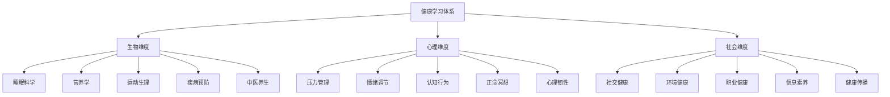
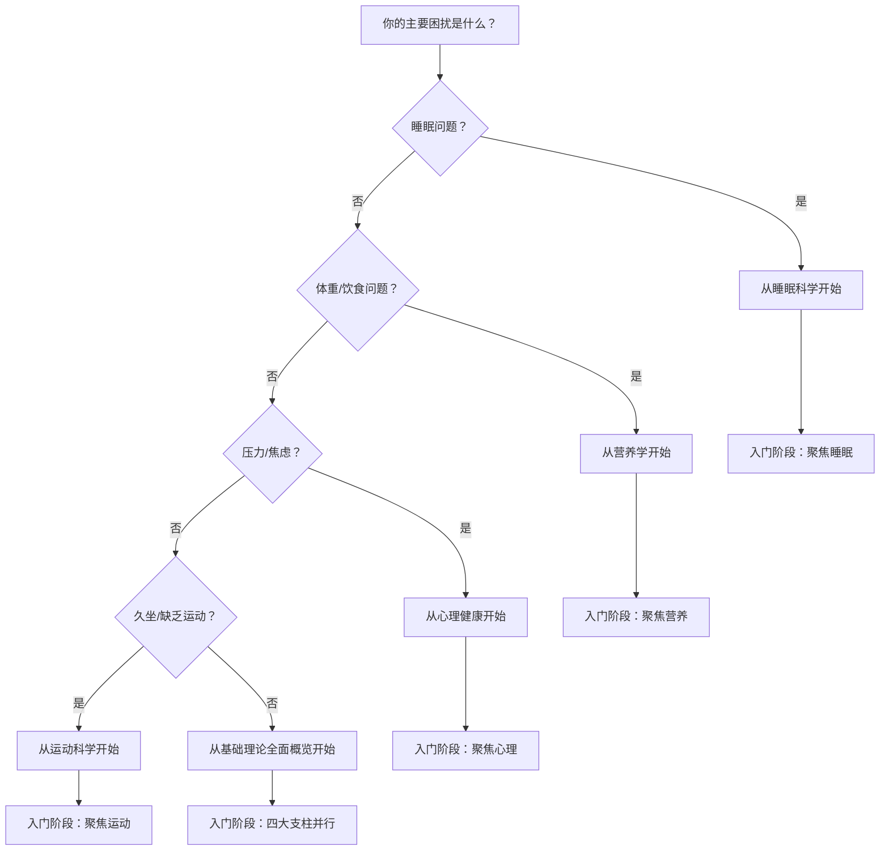
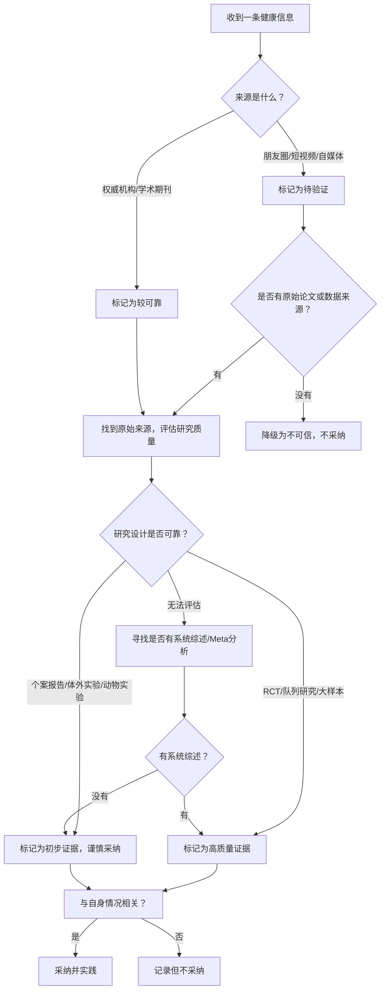
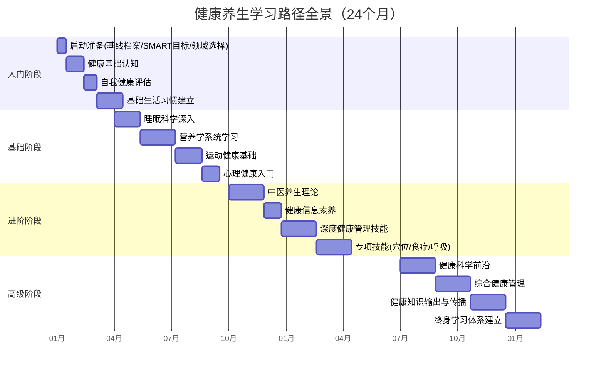

# 学习路径

> 学习健康知识不是为了成为医生，而是为了成为自己健康的第一责任人。本章提供一套经过验证的系统化学习框架，帮助你从零基础出发，在两年内建立起完整的健康知识体系和实践能力。

## 一、健康学习的认知科学基础

### 1.1 为什么大多数人学不会健康管理

大多数人对健康学习的认知停留在"看点养生文章"的层面，这种碎片化学习存在三个致命缺陷：

**信息孤岛问题**：你读了一篇关于益生菌的文章，知道了酸奶有好处；又读了一篇关于膳食纤维的文章，知道了全谷物很重要。但这两条信息之间没有连接——你不知道肠道菌群才是背后的统一逻辑，更不知道抗生素使用会同时影响两者。碎片化学习让你拥有了很多"知识点"，却没有形成"知识网络"。

认知心理学家将这种现象称为"惰性知识"（inert knowledge）——知识存在大脑中但无法被激活和应用。Whitehead在1929年首次描述了这一现象：学生能背诵公式却不会解题。健康领域的惰性知识更危险——你知道吸烟有害却戒不掉，你知道该早睡却刷手机到凌晨。解决惰性知识的关键是建立知识之间的**连接密度**：每学到一个新概念，至少追问三个问题——它与已知的哪些知识相关？它的底层机制是什么？它在什么情境下不成立？

**信噪比困境**：微信朋友圈、抖音、小红书上的健康信息，准确率不足30%（中国科协2023年发布的《中国公民科学素质调查》数据）。你花大量时间筛选信息，最后记住的可能恰恰是那些错误的——因为它们往往更耸人听闻，更容易形成记忆。心理学中这叫做"鲜活性效应"（vividness effect）：一个生动的个案（"我邻居吃了XX就好了"）比一个大规模统计数据（"双盲实验显示有效率仅3%"）更容易影响你的判断。健康学习的第一课不是学习知识，而是学习如何**抵抗错误信息的记忆优势**。

**知行脱节陷阱**：知道"早睡早起身体好"和真正做到之间，隔着一条巨大的鸿沟。行为科学的研究表明，仅靠知识传递，行为改变率不到10%（Glanz et al., 《健康行为与健康教育》第5版）。你需要的不仅是知识，还有行为改变的系统方法。知行脱节的根源不在于意志力薄弱，而在于**缺少行为设计**——把一个大目标拆解成环境提示、微小行动和即时反馈的闭环。

### 1.2 学习科学的三大核心原理

将认知科学和行为科学的原理应用于健康学习，可以显著提升学习效果：

**间隔重复（Spaced Repetition）**：德国心理学家艾宾浩斯发现的遗忘曲线表明，新学到的信息如果不复习，24小时后遗忘66%，一周后遗忘77%。但如果你在关键时间点（学后1天、3天、7天、14天、30天）进行复习，记忆保持率可以提升到90%以上。具体到健康学习：

- 第1天：学习"膳食纤维每日推荐摄入量25-30g"
- 第1天复习：用自己的话复述，查证记忆是否准确
- 第3天复习：做一道相关的实践题——记录今天的饮食，计算纤维摄入量
- 第7天复习：解释给朋友听，或写一段笔记
- 第14天复习：在饮食日记中标注含纤维丰富的食物
- 第30天复习：评估一个月的饮食改善情况

**间隔重复的进阶应用**：不只是被动复习，而是用不同形式激活同一个知识点。第1天用文字记忆，第3天用图表可视化，第7天用口语解释，第14天用实践验证。这种"变式复习"（varied retrieval practice）比简单重复的效果高出40%以上（Roediger & Butler, 2011, *Nature Reviews Neuroscience*）。

**刻意练习（Deliberate Practice）**：心理学家安德斯·埃里克森提出的刻意练习理论强调，能力提升不是靠简单重复，而是需要在"舒适区边缘"有目的地练习，并获得及时反馈。应用到健康学习：

- 不要反复阅读已知内容（这是舒适区，没有提升）
- 主动寻找自己理解薄弱的环节（比如你知道蛋白质重要，但不清楚不同来源的蛋白质吸收率差异）
- 刻意练习具体的技能（比如独立解读一次体检报告、独立制定一周膳食计划）
- 每次练习后获得反馈（对比标准答案、请教专业人士、用APP验证）

**刻意练习在健康领域的独特挑战**：与弹钢琴或下棋不同，健康行为的反馈周期很长——你今天多吃了一份蔬菜，不会明天就看到体检指标改善。这意味着你需要创造**短反馈回路**：用可穿戴设备追踪睡眠质量、用饮食APP记录营养摄入、用运动APP记录训练数据。数据就是你的"教练"，它把模糊的身体感受转化为可量化的进步信号。

**费曼学习法（Feynman Technique）**：诺贝尔物理学家理查德·费曼的学习方法——如果你不能用简单的语言向一个外行解释清楚一个概念，说明你还没有真正理解它。应用到健康学习：

```text
费曼学习法四步循环：

第一步：学习 → 选择一个健康概念（如"胰岛素抵抗"）
第二步：教授 → 假装向一个12岁孩子解释这个概念
   "你吃了太多糖，身体里的胰岛素一直在喊'把糖收起来'，
    喊了太多年，细胞们就'听烦了'，不再响应了——这就是胰岛素抵抗。"
第三步：回顾 → 发现解释不清楚的地方，回到原始材料学习
第四步：简化 → 用更精炼的语言重新解释，去除不必要的术语
```

**费曼法的升级版——"教学相长"实践**：找到一个真实的学习伙伴（家人、朋友、同事），每周用10分钟向对方讲解一个健康概念。真实听众的提问会暴露你理解中的盲区，这是独自学习无法获得的反馈。研究表明，"教学式学习"（learning by teaching）可以将知识保持率从被动学习的10%提升到90%（学习金字塔理论，National Training Laboratories）。

### 1.3 健康学习的生物心理社会模型

世界卫生组织1948年就提出了健康的三维定义，但大多数人仍然把"学健康"等同于"学营养学"。真正的健康学习必须覆盖生物-心理-社会三个维度：



每个维度都不是孤立的。例如：长期失眠（生物）会导致焦虑（心理），焦虑会影响工作效率和人际关系（社会），社会压力又会加重失眠——这是一个恶性循环。有效的健康学习必须理解这些交叉影响，而不是头痛医头。

**三个维度的协同学习策略**：不要把三个维度当成三个独立的学科来学。每学到一个知识点，都要问：它在另外两个维度上有什么关联？例如学到"运动改善情绪"（生物→心理），进一步追问：运动如何影响社交？（参加跑团增加社交连接，社会维度）。这种"三维联想法"能帮你构建更完整的知识网络，也能让你更容易记住和应用知识。

### 1.4 学习风格自测与匹配

不同的人有不同的学习风格偏好，匹配适合自己的学习方式可以提升40%以上的效果（Dunn & Dunn学习风格模型）。以下是四种主要学习风格及对应的健康学习策略：

| 学习风格 | 特征 | 健康学习策略 | 推荐资源类型 |
|---------|------|------------|------------|
| **视觉型** | 喜欢图表、思维导图、视频 | 用思维导图梳理知识体系，制作信息图卡片 | 视频课程、Infographic、彩色笔记 |
| **听觉型** | 喜欢听讲、讨论、播客 | 加入学习小组讨论，用语音笔记记录 | 播客、音频课程、学习社群 |
| **读写型** | 喜欢阅读、笔记、写作 | 建立个人健康笔记系统，撰写学习心得 | 书籍、论文、文字课程 |
| **动觉型** | 喜欢动手操作、亲身体验 | 边学边做，每学一个概念就去实践 | 实操工作坊、实验课程、DIY项目 |

大多数人是混合型，但通常有一个主导风格。你可以通过以下问题快速自测：

- 学习新知识时，你倾向于先看图还是先看文字？（视觉 vs 读写）
- 你更喜欢听讲座还是看课本？（听觉 vs 读写）
- 理解一个概念后，你会想画个图、写段话，还是找个人讨论？（三选一）
- 学到新的健康技能后，你是否迫不及待想要尝试？（动觉）

**超越学习风格——多模态学习的威力**：2008年Pashler等人的元分析发现，严格按学习风格匹配教学方式并没有显著提升效果。更有效的方法是**多模态学习**——对同一个知识点同时使用视觉、听觉、读写和动手四种方式。例如学习"膳食纤维"：看一张食物纤维含量对比图（视觉）、听一期营养学播客（听觉）、写一段学习笔记（读写）、亲手做一顿高纤维餐（动觉）。四种方式叠加，记忆保持率远超单一方式。

## 二、分阶段学习路径

### 2.0 启动准备：学习前的三件事

在正式开始学习之前，先花1-2周完成以下准备工作：

**第一件：建立健康基线档案**

在改善之前，你需要知道自己的起点在哪里。用一周时间记录以下数据：

```text
个人健康基线档案模板
========================

一、基础指标（体检或自测）
  身高：___cm    体重：___kg    BMI：___
  血压：___/___mmHg    静息心率：___bpm
  空腹血糖：___mmol/L    血脂四项（如可获得）：___

二、睡眠基线（记录7天取平均值）
  平均入睡时间：___:___    平均起床时间：___:___
  平均睡眠时长：___小时    主观睡眠质量（1-10）：___
  夜间醒来次数：___次/晚    白天疲劳感（1-10）：___

三、饮食基线（记录3天工作日+1天休息日）
  日均热量摄入（估算）：___kcal
  蔬菜水果摄入量：___份/天（1份≈拳头大小）
  饮水量：___ml/天    外餐频率：___次/周
  零食/含糖饮料频率：___次/周

四、运动基线
  每周运动次数：___次    每次运动时长：___分钟
  日均步数：___步    主要运动类型：___
  久坐时间（估算）：___小时/天

五、心理状态基线
  压力水平（1-10）：___    焦虑频率：___次/周
  情绪低落频率：___次/周    社交活动频率：___次/周
  自我评估整体健康感（1-10）：___

六、主要健康困扰（最多列3项）
  1. ___
  2. ___
  3. ___
```

**基线档案的常见误区**：很多人记录基线时追求"精确"——买一台食物秤精确到克、用专业设备测量体脂。这反而会成为行动的障碍。基线的目的是建立**大致的感知**，不是医学诊断。用手机拍每顿饭的照片、用智能手表的粗略数据、凭感觉打分，这些"80%准确"的数据已经足够作为起点。等你进入进阶阶段，再考虑精确测量工具。

**第二件：设定SMART健康目标**

将模糊的愿望转化为可衡量的目标。每个目标必须满足SMART原则：Specific（具体）、Measurable（可衡量）、Achievable（可实现）、Relevant（相关）、Time-bound（有时限）。

| 错误目标 | SMART目标 |
|---------|----------|
| 我要更健康 | 3个月内将BMI从26降到24，通过每周运动3次+控制晚餐热量实现 |
| 我要早睡 | 在1个月内将平均入睡时间从凌晨1点提前到23:30，通过22:30放下手机+睡前阅读实现 |
| 我要少焦虑 | 每天练习10分钟正念冥想，持续30天后用GAD-7量表自评，目标从"中度焦虑"降到"轻度" |
| 我要学养生 | 6个月内读完3本推荐书籍+完成1门在线课程+能独立制定月度饮食计划 |

**目标设定的"阶梯原则"**：不要把最终目标直接设为SMART目标。把最终目标分解为3-5个阶梯式的小目标。例如最终目标是"完成半程马拉松"，阶梯目标是：第1个月能连续跑3公里 → 第3个月能跑10公里 → 第6个月能跑15公里 → 第9个月完成半马。每个阶梯都是一个独立的SMART目标，完成一个再设定下一个。这样你永远只面对"下一个合理的挑战"，而不会被遥远的终极目标吓退。

**第三件：选择学习启动领域**

不要试图同时学所有东西。根据你基线档案中的"主要健康困扰"，选择一个最紧迫的领域先突破。建议的选择优先级：



**为什么睡眠排在第一优先级**：很多人觉得"减肥"或"吃健康"更紧迫，但睡眠是所有健康行为的底层基础。睡眠不足（<7小时）会导致：食欲激素失调（瘦素下降18%、饥饿素上升28%，使你自然多吃300-400kcal/天）、运动意愿和能力下降、情绪调节困难、免疫功能受损。改善睡眠后，其他领域的改善会自然发生——这不是鸡汤，是内分泌学的基本事实（Spiegel et al., 1999, *The Lancet*）。

### 2.1 入门阶段（第1-3个月）：建立认知框架

这个阶段的核心目标不是成为专家，而是**建立正确的认知框架和基础习惯**。就像盖房子先打地基，这个阶段看似进展缓慢，但决定了后续所有学习的上限。

#### 2.1.1 健康基础认知（第1-4周）

**学习内容**：

**健康定义的全面理解**：世界卫生组织1948年的定义"身体、心理和社会适应的良好状态"不是一句口号，而是一个可操作的评估框架。你需要理解这个定义背后的三层含义——身体层面：各项生理指标在正常范围内，没有已知疾病，体能可以应对日常需求；心理层面：情绪稳定，能够应对日常压力，有基本的自我接纳；社会层面：有基本的社交关系，能够参与社会活动，有归属感。

**影响健康的核心因素**：根据WHO的报告，影响个人健康的因素按权重排列为：生活方式和行为习惯占60%，遗传因素占15%，社会因素占10%，医疗条件占8%，气候环境占7%。这意味着你能够控制的因素（主要是生活方式）占了最大比重。不要因为"基因不好"就放弃努力——即使携带某些疾病易感基因，良好的生活方式仍然可以显著降低发病风险（表观遗传学的核心发现）。2016年发表在*PLOS Medicine*上的一项大规模研究（UK Biobank, 45万人数据）显示，健康生活方式可以抵消约62%的短寿基因风险。

**预防医学的三级体系**：

| 预防层级 | 目标 | 具体措施 | 举例 |
|---------|------|---------|------|
| **一级预防** | 防止疾病发生 | 健康生活方式、疫苗接种、安全教育 | 均衡饮食预防高血压、接种HPV疫苗预防宫颈癌 |
| **二级预防** | 早发现早治疗 | 定期体检、筛查项目 | 年度体检发现早期糖尿病、肠镜筛查发现息肉 |
| **三级预防** | 减少并发症和残疾 | 康复训练、慢病管理 | 糖尿病患者血糖管理防止并发症、术后康复训练 |

大多数人的健康管理停留在"生病了才去医院"的被动模式。你需要建立的是"三级预防全覆盖"的主动模式。一级预防的投入产出比最高——每在预防上投入1元，可以节省8-10元的医疗费用（WHO预防经济学报告）。

**学习资源**：

| 资源类型 | 推荐内容 | 时间投入 | 学习方式 |
|---------|---------|---------|---------|
| 书籍 | 《中国居民膳食指南（2022）》——不必通读，重点看"核心推荐"和"实践应用"章节 | 6-8小时 | 精读+笔记 |
| 书籍 | 《睡眠革命》（尼克·利特尔黑尔斯）——用R90周期理论重新理解睡眠 | 4-6小时 | 通读+实践 |
| 视频课程 | 中国大学MOOC《营养与健康》（北京大学）——系统的营养学入门 | 20-30小时 | 视频+笔记+作业 |
| APP | 薄荷健康——记录饮食3天，了解自己的热量和营养素摄入 | 每天10分钟 | 实操记录 |
| APP | Keep——选择一个入门级运动计划，开始规律运动 | 每天20-30分钟 | 跟练 |

**每周学习安排（入门阶段）**：

```text
周一：理论学习日（1-1.5小时）
  - 阅读指定书籍章节30-40分钟
  - 做思维导图笔记20分钟
  - 用费曼学习法自测理解程度10分钟

周三：实践操作日（30分钟）
  - 记录当天饮食数据（薄荷健康APP）
  - 完成一次运动（Keep入门课程）

周五：知识巩固日（30分钟）
  - 回顾本周学习笔记
  - 复习间隔重复卡片（如果有）
  - 记录本周的实践发现和疑问

周末：综合实践日（1-2小时）
  - 完成一次完整的健康数据记录
  - 预习下周学习内容
  - 如有学习社群，参与一次讨论
```

**入门阶段的时间投入预期**：每周总计4-6小时，约等于每天不到1小时。这个投入量是可持续的——不要在热情高涨时每天学3小时，然后两周后因为疲惫而完全放弃。健康学习本身就是一场马拉松，学习节奏也要"健康"。

#### 2.1.2 自我健康评估（第3-6周）

学会评估自己的健康状态是健康管理的第一步。你需要掌握以下评估工具和方法：

**基础健康指标解读**：

| 指标 | 正常范围 | 测量方法 | 意义 |
|-----|---------|---------|------|
| BMI | 18.5-23.9（中国标准） | 体重(kg)÷身高(m)² | 肥胖风险评估，但不能区分肌肉和脂肪 |
| 血压 | <120/80mmHg（理想） | 电子血压计，安静休息5分钟后测量 | 心血管疾病风险评估 |
| 静息心率 | 60-100bpm | 早晨醒来未起床时测量 | 心脏功能和体能水平指标 |
| 腰围 | 男<85cm，女<80cm | 肋骨下缘与髂嵴之间中点水平 | 内脏脂肪评估，比BMI更准确 |
| 体脂率 | 男15-20%，女20-25% | 体脂秤或皮脂钳 | 真实的体脂状态评估 |
| 腰臀比 | 男<0.9，女<0.85 | 腰围÷臀围 | 脂肪分布模式，心血管风险预测优于BMI |

**关键指标的深层理解**：仅仅知道数字的正常范围是不够的，你还需要理解数字背后的含义。例如：

- 血压130/85mmHg虽然"不算高血压"，但已经属于"正常高值"，如果不干预，5年内发展为高血压的概率超过50%
- BMI 23.9（正常上限）配合腰围88cm（超标），实际上比BMI 25（超重）但腰围正常的健康风险更高
- 静息心率从75降到65，意味着心脏每次搏动的泵血效率提升了，这是心肺功能改善的直接证据
- 体脂率比BMI更有诊断价值：一个BMI 24但体脂率15%的人，比BMI 22但体脂率28%的人更健康——后者被称为"瘦胖子"（skinny fat），代谢综合征风险反而更高

**测量工具的选择与校准**：

| 测量项目 | 入门工具 | 进阶工具 | 注意事项 |
|---------|---------|---------|---------|
| 体重/体脂 | 小米/华为体脂秤（200元级） | InBody体脂测试（健身房/医院） | 每天同一时间（晨起排便后）、同一状态测量，关注趋势而非绝对值 |
| 血压 | 欧姆龙/鱼跃上臂式电子血压计 | 动态血压监测（ABPM，医院） | 测量前静坐5分钟，不说话，双脚平放，袖带与心脏同高 |
| 心率 | 智能手表/手环 | 心率带（Polar等） | 光电式手环在运动时误差可达±10bpm，静息状态较准确 |
| 睡眠 | 智能手环（小米手环等） | Oura Ring/多导睡眠监测（PSG） | 消费级设备的睡眠分期准确率约70-80%，足够用于趋势追踪 |
| 血糖 | 家用血糖仪（鱼跃/三诺） | 连续血糖监测（CGM，如雅培瞬感） | 糖尿病前期或有家族史的人建议定期监测 |

**学会解读体检报告**：大多数人拿到体检报告只会看"有没有箭头"，但实际上：

- 要看趋势：连续3年的体检数据比单次数据更有意义——血糖从5.2→5.6→6.1，虽然每次都"在正常范围内"，但趋势是持续上升的
- 要看关联：血脂偏高+腰围超标+血糖偏高，三个单独看都"不算严重"，但组合在一起是代谢综合征的典型表现
- 要看阈值：有些指标的"正常范围"和"理想范围"是不同的——比如空腹血糖6.0mmol/L在"正常"范围内（上限6.1），但已经处于糖尿病前期

**体检报告的"红绿灯"解读法**：

```text
绿灯指标（理想范围）：
  - 空腹血糖 <5.6mmol/L
  - 总胆固醇 <5.2mmol/L
  - LDL胆固醇 <3.4mmol/L
  - 血压 <120/80mmHg
  - BMI 18.5-23.9
  → 继续保持，关注趋势变化

黄灯指标（正常高值/边缘值）：
  - 空腹血糖 5.6-6.0mmol/L（糖尿病前期）
  - 总胆固醇 5.2-6.2mmol/L（边缘升高）
  - 血压 120-139/80-89mmHg（正常高值）
  - BMI 24-27.9（超重）
  → 3-6个月内通过生活方式干预，安排复查

红灯指标（异常/需要就医）：
  - 空腹血糖 ≥7.0mmol/L（糖尿病诊断标准）
  - 血压 ≥140/90mmHg（高血压）
  - LDL胆固醇 ≥4.1mmol/L
  - 任何新出现的结节、肿块
  → 尽快就医，不要自行处理
```

#### 2.1.3 基础生活习惯建立（第4-12周）

**习惯建立的行为科学方法**：不要试图一次性改变所有习惯。行为科学家BJ·福格（Stanford大学）提出的"微习惯"方法是最有效的起步策略：

```text
福格行为模型：B = MAP
  B（Behavior行为）= M（Motivation动机）× A（Ability能力）× P（Prompt提示）

核心原则：从极小的行为开始，小到不可能失败。

举例：
  × 错误做法："我要每天运动1小时"（能力门槛太高，坚持不了3天）
  √ 正确做法："每天穿上运动鞋"（微习惯，然后自然延伸为出门走路）
  
  × 错误做法："我要每天11点睡觉"（一次性改变太大）
  √ 正确做法："每天22:50把手机放到卧室外充电"（一个微小的提示动作）

微习惯启动清单（选1-2个开始）：
  1. 每天起床后喝一杯温水（放在床头的提示物：水杯）
  2. 每天午饭后散步10分钟（提示物：午餐结束=散步信号）
  3. 每天睡前记录3件今天感恩的事（提示物：手机放在卧室外=写日记信号）
  4. 每天在手机备忘录记录一顿饭的内容（提示物：吃饭时手机放桌上=记录信号）
```

**21天到66天：习惯养成的真实时间线**：流行的说法是"21天养成一个习惯"，但伦敦大学学院的研究（Phillippa Lally, 2009）表明，习惯的自动化平均需要66天，范围从18天到254天不等。这意味着：

- 前21天是最痛苦的，需要刻意提醒和意志力
- 21-66天是过渡期，行为开始变得轻松但还没完全自动化
- 66天之后，行为开始自动化，不需要太多意志力就能执行
- 复杂习惯（如系统运动）比简单习惯（如喝水）需要更长时间

不要在第30天因为"还没养成习惯"就放弃——你还在正常的过渡期内。

**习惯叠加策略**：把新习惯绑定到已有的稳定习惯上（habit stacking），成功率比单独建立新习惯高2-3倍（James Clear, *Atomic Habits*）。公式是："在[已有习惯]之后，我会[新习惯]"。例如：

- 在"刷牙"之后，我会"做10个深蹲"
- 在"坐到工位"之后，我会"喝一杯水"
- 在"吃午饭"之后，我会"散步10分钟"
- 在"关掉电脑"之后，我会"写下明天最重要的3件事"

**入门阶段的三个核心习惯**（按优先级排序）：

1. **睡眠习惯**：设定固定的上床时间（±30分钟），比闹钟更早的是"困了就睡"的信号
2. **饮食记录**：每天至少记录一顿饭（不需要精确到克数，拍照+简要备注即可）
3. **每日运动**：从每天10分钟的散步或拉伸开始

**入门阶段的里程碑检查清单**（第3个月末自评）：

```text
□ 能用自己的话解释"健康的三维定义"
□ 知道影响健康的五大因素及其权重
□ 理解预防医学三级体系，知道自己应重点关注哪一级
□ 完成了个人健康基线档案
□ 设定了至少1个SMART健康目标
□ 能解读自己的体检报告（不是只看箭头）
□ 建立了1-2个微习惯并坚持了30天以上
□ 能用"四格法"安排一餐的营养搭配
□ 知道间隔重复、刻意练习、费曼学习法的基本用法
□ 开始使用至少1个健康追踪工具（APP或设备）
```

### 2.2 基础阶段（第4-6个月）：深入四大领域

在入门阶段建立了认知框架和基础习惯后，这个阶段的目标是**深入学习健康四大支柱的具体知识，并开始制定个性化方案**。

**阶段过渡提醒**：从入门到基础阶段的过渡，很多人会经历一个"知识消化不良"的阶段——学了太多理论但还没内化。如果你发现自己在入门阶段的里程碑检查清单中只有6项以下达标，建议延长入门阶段1-2个月。基础阶段的学习建立在入门阶段的框架之上，框架不稳则后续学习效率极低。

#### 2.2.1 睡眠科学深入

**学习内容**：

**睡眠周期与生理机制**：人类的睡眠由4-6个周期组成，每个周期约90分钟，包含以下阶段：

```text
一个完整的睡眠周期（约90分钟）：

NREM 第1阶段（入睡期，5%）
  ↓ 脑波从α波过渡到θ波，肌肉放松
  ↓ 容易被唤醒，可能有"坠落感"

NREM 第2阶段（浅睡期，45%）
  ↓ 体温下降，心率减慢
  ↓ 睡眠纺锤波和K复合波出现
  ↓ 大脑开始将短期记忆转化为长期记忆

NREM 第3阶段（深睡期，25%）★ 最关键的修复阶段
  ↓ δ波（慢波）占主导
  ↓ 生长激素大量分泌，免疫系统修复
  ↓ 血压最低，肌肉完全放松
  ↓ 如果在这个阶段被闹钟叫醒，会感觉极度困倦

REM 快速眼动期（25%）★ 梦境和情绪调节阶段
  ↓ 大脑活跃度接近清醒状态
  ↓ 眼球快速运动，身体肌肉暂时麻痹
  ↓ 情绪记忆整合，创造性问题解决
  ↓ 学习和记忆巩固的关键阶段
```

理解这些阶段的意义在于：**睡眠质量不仅仅取决于时长，更取决于各阶段的比例**。一个人睡了8小时但深睡比例很低，可能比睡6.5小时但深睡充足的人更疲惫。

**深睡不足的信号与对策**：白天即使睡够了8小时仍然疲惫、需要多个闹钟才能醒来、起床后30分钟内仍然昏沉——这些都是深睡不足的信号。常见原因和对策：

- 睡前饮酒：酒精虽然帮助入睡，但会严重抑制深睡和REM阶段。对策：睡前3小时不饮酒
- 卧室温度过高：核心体温需要下降1-2°C才能进入深睡。对策：卧室温度控制在18-20°C
- 夜间噪音：即使你没有"醒来"，噪音也会打断深睡周期。对策：使用白噪音机或耳塞
- 晚间运动过晚：运动后核心体温升高需要2-3小时恢复。对策：剧烈运动在睡前4小时完成

**实用睡眠改善方案**：

| 改善措施 | 作用机制 | 预期效果 | 实施难度 |
|---------|---------|---------|---------|
| 固定起床时间 | 稳定昼夜节律，比固定入睡时间更重要 | 2-3周内入睡时间自然规律化 | 低 |
| 睡前90分钟停止蓝光 | 蓝光抑制褪黑素分泌，延迟入睡 | 入睡时间提前15-30分钟 | 中（需要改变晚间习惯） |
| 卧室温度18-20°C | 核心体温下降是入睡的必要条件 | 入睡速度提升，深睡比例增加 | 低 |
| 下午2点后不喝咖啡 | 咖啡因半衰期5-6小时，影响入睡 | 入睡时间提前，深睡质量改善 | 低-中 |
| 白天光照30分钟以上 | 调节褪黑素分泌节律 | 夜间褪黑素分泌更规律 | 低 |
| R90睡眠法 | 以90分钟周期为单位安排睡眠 | 醒来时精力更好，减少睡眠惯性 | 中 |

**认知行为疗法（CBT-I）基础技术**：CBT-I是治疗失眠的一线推荐疗法（美国医师学会2016年指南），效果优于安眠药且无副作用。核心技术包括：

- **刺激控制**：床只用于睡觉，不在床上看手机、工作、看电视。如果20分钟内无法入睡，起来做点轻松的事，困了再回床上。这打破了"床=焦虑/清醒"的条件反射。
- **睡眠限制**：如果你躺在床上8小时但实际只睡了6小时，先把在床时间限制为6小时。虽然前几天会很困，但会大幅提升睡眠效率（实际睡着时间÷在床时间>85%后逐步延长在床时间）。
- **认知重构**：识别和挑战关于睡眠的灾难化想法。例如："我今晚又失眠了，明天一定完蛋"→"偶尔一晚睡眠不足对第二天的表现影响比想象的小得多，人类有很强的适应能力"。

**CBT-I的实操注意事项**：睡眠限制法在执行前3-5天会非常困，这是正常的。不建议在需要高度警觉的工作期间（如长途驾驶）开始实施。如果你有严重的睡眠问题（持续3个月以上的慢性失眠），建议寻求专业的CBT-I治疗师指导，而不是完全自行操作。国内部分三甲医院的睡眠科和心理科提供CBT-I服务。

#### 2.2.2 营养学系统学习

**学习内容**：

**三大宏量营养素的深层理解**：

| 营养素 | 每克热量 | 主要功能 | 推荐占比 | 优质来源 |
|-------|---------|---------|---------|---------|
| 碳水化合物 | 4kcal | 大脑首选能源、运动燃料、蛋白质节省效应 | 50-65% | 全谷物、薯类、水果（复合碳水优于精制碳水） |
| 蛋白质 | 4kcal | 组织修复、酶和激素合成、免疫功能 | 10-15% | 鸡蛋、鱼、瘦肉、豆制品、乳制品 |
| 脂肪 | 9kcal | 细胞膜构成、脂溶性维生素吸收、激素合成 | 20-30% | 橄榄油、坚果、深海鱼、牛油果 |

**蛋白质摄入的常见误区**：很多健身爱好者追求"每公斤体重2g蛋白质"，但对普通人来说，每公斤体重0.8-1.2g已经足够。过量蛋白质不会变成更多肌肉——多余的蛋白质会被转化为能量或脂肪，同时增加肾脏代谢负担。更关键的问题是蛋白质的**质量**（氨基酸评分）和**分配**（每餐均匀分配比集中在一餐效果好30-50%）。

**蛋白质质量的评估方法**：不是所有蛋白质来源都一样。评估蛋白质质量的两个关键指标：

- **PDCAAS**（蛋白质消化率校正氨基酸评分）：满分1.0。鸡蛋、牛奶、酪蛋白=1.0；大豆=0.91；牛肉=0.92；全麦=0.42；花生=0.52
- **每100g食物的蛋白质含量**：鸡胸肉31g、鸡蛋13g、豆腐8g、牛奶3.3g、米饭2.6g

实用建议：每天的蛋白质来源至少包含2-3种不同类型（动物+植物），这样可以互补氨基酸谱。素食者特别需要注意大豆制品的充足摄入，必要时补充B12。

**微量营养素的优先级**：不要试图记住所有维生素和矿物质的RDA值。优先关注以下中国人群中最常见的缺乏：

- **维生素D**：约80%的中国人缺乏（日照不足+饮食来源少）。影响骨骼健康、免疫功能、情绪。建议：每日补充400-800IU，或定期检测血清25(OH)D水平。
- **铁**：育龄女性约30%存在铁缺乏。导致疲劳、注意力下降、免疫力下降。建议：月经量大的女性定期检查铁蛋白水平。
- **钙**：成人每日推荐800mg，实际摄入量平均不到500mg。建议：乳制品+豆制品+深绿色蔬菜组合摄入。
- **膳食纤维**：推荐25-30g/天，实际平均摄入不到15g。影响肠道菌群、血糖控制、饱腹感。
- **Omega-3脂肪酸**：大多数人Omega-6/Omega-3比例严重失衡（理想为4:1，实际高达15-20:1）。建议：每周至少吃2次深海鱼（三文鱼、鲭鱼、沙丁鱼），或每日补充1-2g鱼油。

**食物搭配的实用框架**：

```text
一餐的"四格法"配餐：

┌──────────────┬──────────────┐
│              │              │
│   蛋白质     │   蔬菜       │
│  （拳头大小） │ （双手一捧）  │
│              │              │
├──────────────┼──────────────┤
│              │              │
│   主食       │   蔬菜       │
│ （拳头大小）  │ （双手一捧）  │
│              │              │
└──────────────┴──────────────┘

  + 一汤匙好油（橄榄油/亚麻籽油）
  + 一个水果（饭后2小时）
  + 一杯奶/豆浆

举例：
  早餐：鸡蛋1个 + 全麦面包1片 + 牛奶1杯 + 苹果半个
  午餐：鸡胸肉100g + 糙米饭1拳 + 西兰花1捧 + 橄榄油拌沙拉
  晚餐：豆腐100g + 杂粮粥1碗 + 时蔬1捧 + 少量坚果
```

**外出就餐的健康策略**：现代人不可能每餐都自己做。掌握以下策略可以在外就餐时也保持基本的营养平衡：

- **点餐原则**：一份蛋白质（鱼/肉/豆腐）+ 一份蔬菜 + 一份主食，避免"全碳水"点餐（如炒饭+凉面+汤）
- **烹饪方式优先级**：蒸/煮/炖 > 烤/炒 > 炸/煎。蒸煮类菜品热量通常只有油炸类的1/3
- **控油控盐技巧**：用一碗清水涮掉菜品表面多余的油脂和盐分（简单但有效，可减少30-40%的油脂摄入）
- **份量控制**：用"拳头法则"估量——一拳大小的主食、一掌大小的蛋白质、双手一捧的蔬菜
- **饮品选择**：白水/无糖茶 > 鲜榨果汁（含糖量惊人）> 含糖饮料

**饮食评估工具**：用薄荷健康或MyFitnessPal记录3天饮食，重点分析：

1. 总热量是否在合理范围（基础代谢率×活动系数±300kcal）
2. 三大营养素比例是否合理
3. 蔬菜水果摄入是否达标（每天5份以上）
4. 是否存在明显缺乏的微量营养素
5. 添加糖摄入是否超标（建议<25g/天）
6. 钠摄入是否超标（建议<6g盐/天）

**基础代谢率（BMR）的快速估算**（Mifflin-St Jeor公式，最准确的估算公式之一）：

```text
男性 BMR = 10 × 体重(kg) + 6.25 × 身高(cm) - 5 × 年龄 - 161 + 166
女性 BMR = 10 × 体重(kg) + 6.25 × 身高(cm) - 5 × 年龄 - 161

总日消耗（TDEE）= BMR × 活动系数
  久坐（几乎不运动）：× 1.2
  轻度活动（每周运动1-3次）：× 1.375
  中度活动（每周运动3-5次）：× 1.55
  高度活动（每周运动6-7次）：× 1.725

减脂目标：TDEE - 300~500 kcal（每周减0.3-0.5kg，健康减脂速度）
增肌目标：TDEE + 200~300 kcal + 充足蛋白质
```

#### 2.2.3 运动健康基础

**运动处方的FITT原则**：

| 要素 | 含义 | 入门推荐 | 进阶推荐 |
|-----|------|---------|---------|
| F（Frequency频率） | 每周运动次数 | 3次/周 | 5次/周 |
| I（Intensity强度） | 运动强度 | 中等（可以说话但不能唱歌） | 中高（说话略喘） |
| T（Time时间） | 每次时长 | 20-30分钟 | 40-60分钟 |
| T（Type类型） | 运动类型 | 快走、游泳、骑车 | 力量训练+有氧+柔韧性组合 |

**三种运动类型及其独特价值**：

1. **有氧运动**（跑步、游泳、骑车）：心肺功能、脂肪代谢、情绪改善。研究表明，每周150分钟中等强度有氧运动可降低心血管疾病风险35%。
2. **力量训练**（哑铃、自重、器械）：肌肉量维持、骨密度保护、基础代谢提升。25岁后每10年流失3-5%的肌肉量，力量训练是唯一能逆转这一趋势的方法。
3. **柔韧性训练**（瑜伽、拉伸、太极）：关节活动度、运动损伤预防、身体协调性。

**"最小有效运动量"**：如果你觉得每周150分钟的运动目标遥不可及，记住这个数据：每天只需11分钟（每周75分钟）的中等强度运动，就能降低23%的早期死亡风险和17%的心血管疾病风险（2023年*British Journal of Sports Medicine*荟萃分析，涉及196项研究、3000万人数据）。这是"聊胜于无"的升级版——从不运动到每天11分钟，收益是最大的。

**新手运动计划模板**（第1-4周）：

```text
周一：有氧运动
  热身：5分钟快走
  主练：快走/慢跑交替20分钟（走3分钟+跑2分钟，循环4次）
  拉伸：5分钟

周三：力量训练（自重）
  热身：5分钟关节活动
  主练：俯卧撑（可跪姿）3组×8次
        深蹲3组×10次
        平板支撑3组×20秒
        弓步蹲3组×每侧8次
  拉伸：5分钟

周五：有氧运动
  热身：5分钟快走
  主练：快走/慢跑交替25分钟
  拉伸：5分钟

周末：柔韧性/恢复
  瑜伽或全身拉伸20-30分钟
```

**力量训练动作质量优先原则**：以下是新手最容易犯错的4个动作及其纠正方法：

- **深蹲**：膝盖内扣（膝外翻）→ 在膝盖外侧套一条弹力带，做深蹲时向外撑开弹力带，强化臀中肌激活
- **俯卧撑**：塌腰或撅臀 → 保持从头到脚一条直线，想象身体是一块木板。如果标准俯卧撑做不到，先从墙壁俯卧撑→桌面俯卧撑→跪姿俯卧撑逐步进阶
- **平板支撑**：抬头或低头 → 目光看向前方地面，颈椎保持中立。如果腰部下塌，说明核心力量不足，先缩短支撑时间
- **硬拉**：弓背 → 脊柱保持中立，想象"挺胸、收腹、臀部后推"三个同时进行的动作

**运动安全红线**：出现以下情况应立即停止运动并就医——运动中胸痛或胸闷、头晕或眼前发黑、心率异常（超过最大心率的85%且无法恢复）、关节锐痛（不同于正常的肌肉酸痛）。35岁以上且长期不运动的人，建议在开始规律运动前做一次心肺运动测试。

**运动后恢复的科学**：恢复不是"偷懒"，而是训练效果的必要组成部分：

- **48小时规则**：同一个肌群的两次力量训练间隔至少48小时，让肌纤维修复和生长
- **主动恢复**：高强度训练后的第二天进行轻度活动（散步、轻度拉伸），比完全不动恢复更快
- **睡眠是最强恢复工具**：生长激素的70%在深睡期间分泌，睡眠不足直接削弱训练效果
- **营养恢复窗口**：运动后30-60分钟内摄入蛋白质（20-30g）+碳水化合物，促进肌肉修复和糖原补充

#### 2.2.4 心理健康入门

**压力的生理机制**：理解压力才能管理压力。当大脑感知到威胁（无论是真实的老虎还是deadline焦虑），下丘脑-垂体-肾上腺轴（HPA轴）被激活，释放皮质醇和肾上腺素。短期内这是有益的——提升注意力、反应速度和能量供给。但当压力成为慢性状态，皮质醇长期偏高会带来一系列问题：免疫功能下降、腹部脂肪堆积、记忆和学习能力受损、睡眠质量下降、情绪调节困难。

**压力的"倒U型曲线"**（Yerkes-Dodson定律）：压力不是越少越好。压力太低（无聊、缺乏挑战）和压力太高（焦虑、不堪重负）都会导致表现下降。最佳表现处于"适度压力"区间——有足够的挑战感但不至于焦虑。识别自己当前处于曲线的哪个位置，是压力管理的第一步：

- 太低：感觉无聊、缺乏动力、拖延症严重 → 需要增加挑战、设定新目标
- 适度：有挑战感但可控、注意力集中、有成就感 → 保持当前状态
- 太高：焦虑、失眠、易怒、注意力涣散 → 需要减压干预

**三种实用减压技术**（每种都有具体操作步骤）：

**4-7-8呼吸法**（哈佛大学Andrew Weil推广）：
1. 用鼻子吸气4秒（心里默数1-2-3-4）
2. 屏住呼吸7秒（1-2-3-4-5-6-7）
3. 用嘴缓慢呼气8秒，发出"呼"的声音（1-2-3-4-5-6-7-8）
4. 重复4个循环

这通过激活副交感神经系统降低心率和血压。适用场景：睡前、面试前、焦虑发作时。

**正念冥想入门**（每天10分钟）：
1. 找一个安静的地方坐下，脊背挺直但不僵硬
2. 闭上眼睛，把注意力放在呼吸上——感受空气从鼻孔进入和离开
3. 思绪一定会跑开（这是正常的），当你发现自己在想别的事时，不要评判，轻轻地把注意力拉回到呼吸上
4. 持续10分钟。可以用手机计时器或Headspace/小睡眠APP引导

关键认知：**正念不是"让大脑停止思考"，而是"观察自己的思绪而不被它们卷走"**。走神100次、拉回100次，这就是练习。

**渐进式肌肉放松法（PMR）**：适合睡前使用，对失眠和身体紧张特别有效。原理是"先紧后松"——通过主动收紧肌肉再放松，让身体体验到"完全放松"的感觉，打破肌肉紧张的恶性循环。

```text
PMR操作步骤（约15分钟）：

找一个舒适的位置躺下或坐好，闭上眼睛。

按以下顺序依次进行（每个部位：紧绷5秒→放松15秒）：
  1. 双手：握拳→松开
  2. 前臂：弯曲手腕→放松
  3. 上臂：弯曲手肘→放松
  4. 肩膀：耸肩到耳朵→放下
  5. 面部：皱眉+紧闭眼睛→放松
  6. 下巴：咬紧牙关→放松
  7. 颈部：低头压下巴→放松
  8. 胸部：深吸气屏住→缓慢呼出
  9. 腹部：收紧腹肌→放松
  10. 大腿：绷紧→放松
  11. 小腿：脚尖上翘→放松
  12. 双脚：脚趾蜷缩→放松

完成后全身放松2-3分钟，感受"放松"和"紧张"的对比。
```

**认知重构三问法**（认知行为疗法核心技术）：当你感到焦虑或压力时，问自己三个问题：

1. "我现在的想法是什么？"（把它具体写出来）
2. "这个想法的证据是什么？有没有反面证据？"
3. "如果我最好的朋友遇到同样的情况，我会对他说什么？"

大多数人会发现，对自己的想法远比对朋友苛刻得多。这种"自我同情"视角转换可以显著降低自我批评带来的额外压力。

### 2.3 进阶阶段（第7-12个月）：深化与整合

这个阶段的学习者已经有了基础认知和实践经验，目标是**深化专业知识、学习中医养生智慧、掌握健康信息素养**。

#### 2.3.1 中医养生理论

中医养生不是"玄学"，而是一套经过数千年实践验证的经验医学体系。现代研究越来越多地证实了其核心理念的科学基础——例如，中医的"上医治未病"理念与现代预防医学高度一致；"天人合一"理念与时间生物学（chronobiology）的发现吻合。

**阴阳五行的实际应用**：不要把阴阳五行当成抽象的哲学概念。在养生实践中，阴阳平衡的实际含义是：

- **阴阳失衡的识别**：怕冷、手脚凉、腹泻、舌淡苔白=阳虚倾向；怕热、口干、便秘、舌红苔黄=阴虚倾向。根据倾向调整饮食和生活习惯（阳虚者避免寒凉食物、冬季注意保暖；阴虚者避免辛辣燥热、保证充足睡眠）。
- **五行与脏腑**：不是用来算命，而是用来理解脏腑之间的相互影响。例如，"肝木克脾土"的含义是——长期情绪紧张（肝气郁结）会影响消化功能（脾胃虚弱），这在现代医学中对应的是"脑-肠轴"（gut-brain axis）的概念。

**中医体质辨识**：北京中医药大学王琦教授团队经过30年研究，将中国人的体质分为9种类型。了解自己的体质类型，可以更精准地选择养生方案：

| 体质类型 | 特征 | 饮食建议 | 运动建议 | 占比（约） |
|---------|------|---------|---------|----------|
| 平和质 | 精力充沛、面色红润、睡眠好 | 均衡饮食，不偏不倚 | 各类运动均可 | 33% |
| 气虚质 | 容易疲劳、气短、易出汗 | 多食山药、大枣、黄芪炖鸡 | 太极、散步等低强度运动 | 13% |
| 阳虚质 | 怕冷、手脚凉、喜热饮 | 温补食物（羊肉、韭菜、桂圆），忌生冷 | 八段锦、慢跑，避免大量出汗 | 9% |
| 阴虚质 | 怕热、口干、手足心热 | 滋阴食物（银耳、百合、枸杞），忌辛辣 | 游泳、瑜伽，避免高温运动 | 8% |
| 痰湿质 | 体型偏胖、腹部肥满、痰多 | 清淡饮食，多吃薏米、冬瓜、荷叶 | 中高强度有氧运动，出汗排湿 | 7% |
| 湿热质 | 面部油腻、口苦、大便黏腻 | 清热利湿（苦瓜、绿豆、芹菜），忌酒和辛辣 | 跑步、球类等出汗运动 | 10% |
| 血瘀质 | 面色暗沉、唇色紫暗、易长斑 | 活血食物（山楂、黑木耳、玫瑰花茶） | 有氧运动促进血液循环 | 8% |
| 气郁质 | 情绪低落、容易叹气、胸闷 | 疏肝理气（玫瑰花、佛手、柑橘类） | 户外运动、团体运动 | 8% |
| 特禀质 | 过敏体质，易起风疹、鼻炎 | 避免已知过敏原，增强体质 | 适度运动，注意过敏季节防护 | 4% |

可以在中国中医药出版社的官方渠道找到标准化的《中医体质量表》进行自测。

**四季养生的具体方案**：

| 季节 | 养生原则 | 饮食要点 | 运动建议 | 起居要点 |
|-----|---------|---------|---------|---------|
| 春季 | 养阳疏肝 | 多吃绿色蔬菜、芽菜，减少酸味增加甘味 | 户外散步、太极、慢跑 | 早睡早起，注意保暖防风 |
| 夏季 | 养心防暑 | 清淡饮食，多食苦味（苦瓜、莲子心），适度寒凉 | 清晨或傍晚运动，避免烈日 | 午休20-30分钟，空调不低于26°C |
| 秋季 | 润肺防燥 | 梨、百合、银耳、蜂蜜等润燥食物 | 登山、慢跑，运动量适中 | 早睡早起，注意保湿 |
| 冬季 | 补肾藏精 | 适量温补（羊肉、核桃、黑芝麻），忌过度进补 | 室内运动为主，减少大汗 | 早睡晚起，注意保暖特别是脚和腰 |

**穴位按摩实用技能**（学习3-5个最常用的穴位即可）：

| 穴位 | 位置 | 功效 | 按摩方法 |
|-----|------|------|---------|
| 合谷 | 虎口处，第1-2掌骨之间 | 头痛、牙痛、感冒 | 拇指按压，每次3-5分钟，酸胀感为度 |
| 足三里 | 膝盖下3寸（四横指），胫骨外侧 | 消化不良、疲劳、免疫力 | 拇指或指关节按压，每次3-5分钟 |
| 三阴交 | 内踝尖上3寸，胫骨后缘 | 月经不调、失眠、消化问题 | 拇指按压，每次3-5分钟，孕妇禁用 |
| 太冲 | 足背第1-2跖骨之间 | 头痛、眩晕、情绪焦躁 | 拇指按压，每次3-5分钟 |
| 内关 | 腕横纹上2寸，两筋之间 | 恶心、心悸、焦虑 | 拇指按压，每次3-5分钟 |

**穴位按摩的科学解释**：多项随机对照试验表明，穴位按摩（acupressure）确实能产生可测量的生理效应：按压足三里可以促进胃肠蠕动（*Journal of Gastroenterology*, 2017）；按压内关穴可以缓解术后恶心（Cochrane系统综述，2015）。虽然经络的解剖学基础仍有争议，但穴位处密集的神经末梢和机械感受器提供了合理的生物学解释。穴位按摩不是替代医学，而是补充医学——它不能治病，但可以缓解症状和改善舒适度。

#### 2.3.2 健康信息素养

这是进阶阶段最重要的技能之一。在信息过载的时代，**辨别信息真伪的能力比获取信息的能力更重要**。

**健康信息可靠性评估的CRAAP标准**：

```text
C（Currency时效性）
  - 这条信息是什么时候发布的？
  - 健康领域知识更新很快，5年以上的建议可能已过时
  - 例外：基础生理学知识更新较慢

R（Relevance相关性）
  - 这条信息与你的具体情况相关吗？
  - 注意：研究对象是老年人，结论未必适用于年轻人
  - 注意：研究对象是欧美人群，结论未必适用于亚洲人

A（Authority权威性）
  - 信息来源是谁？是否有专业背景？
  - 可靠来源：同行评审期刊、政府卫生部门、大学研究机构
  - 可疑来源：匿名博客、朋友圈转发、"祖传秘方"、带货博主

A（Accuracy准确性）
  - 信息是否有证据支持？是否引用了原始研究？
  - 注意区分：相关性≠因果性（"吃巧克力的人更长寿"可能是混杂因素）
  - 注意区分：体外实验≠人体效果（"试管中杀死癌细胞"不等于能治病）

P（Purpose目的性）
  - 这条信息的发布目的是什么？
  - 如果是为了卖产品，要格外警惕——利益冲突是健康伪科学的最大温床
```

**识别伪科学的六个红旗信号**：

1. **"一个方法治百病"**——真正有效的治疗方法都是针对特定疾病的
2. **"震惊！医生不想让你知道的秘密"**——煽动性的标题是点击率驱动的，不是科学驱动的
3. **"XX%的人不知道"**——统计数字没有来源，百分比可能是编造的
4. **"纯天然无副作用"**——天然不等于安全（砒霜、毒蘑菇也是天然的）
5. **"名人/明星推荐"**——名人不是医学专家，他们的推荐可能是付费广告
6. **"几千年的历史"**——传统≠有效（历史上人类还用过放血疗法）

**推荐阅读论文摘要的技巧**：进入进阶阶段后，你可能开始接触学术论文。普通读者不需要读懂全文，重点关注以下部分：

- **标题和摘要（Abstract）**：1分钟了解研究做了什么、发现了什么
- **研究设计**：是随机对照试验（RCT，最高证据级别）还是观察性研究（相关性≠因果性）？
- **样本量**：100人和10000人的研究，可信度差异很大
- **结论和局限性（Limitations）**：作者自己承认的局限性，比结果本身更重要
- **是否被重复验证**：单一研究不能定论，多个独立研究得出一致结论才可靠

**推荐的信息来源层次**：

```text
第1层（最可靠）：同行评审的医学期刊
  - The Lancet, NEJM, JAMA, BMJ
  - 中文：《中华预防医学杂志》、《营养学报》
  - 普通人读法：看摘要和结论即可，关注研究设计和样本量

第2层（可靠）：权威机构指南
  - WHO健康主题页面、CDC指南
  - 中国居民膳食指南、中国高血压防治指南
  - 特点：经过专家委员会审议，综合了大量研究证据

第3层（参考）：科普书籍和专业媒体
  - 选择有专业背景作者的书籍
  - 丁香医生、果壳网等有专业审核的内容
  - 注意：即使是科普内容也可能有简化和偏见

第4层（谨慎）：社交媒体和自媒体
  - 可以作为信息发现的起点，但不能作为决策依据
  - 任何健康建议都应回溯到第1-3层来源验证
```

#### 2.3.3 深度健康管理技能

**体检报告深度解读**：不要只看"↑↓"箭头，要学会看趋势和关联。

```text
体检报告解读的三层思维：

第一层：单项指标是否异常？
  - 这是最基础的，大多数人只看到这一层
  - 注意"正常高值"和"正常低值"，它们可能预示趋势

第二层：连续多年的数据趋势
  - 血糖：5.2 → 5.6 → 5.9 → 6.1（3年内持续上升）
  - 即使每次都"在正常范围内"，趋势已提示糖尿病前期风险
  - 建议：用Excel或健康管理APP追踪3-5年的体检数据

第三层：指标间的关联分析
  - 血脂偏高 + 腰围超标 + 空腹血糖偏高 = 代谢综合征
  - 血压偏高 + 尿酸偏高 + 肾功能轻微异常 = 需要综合评估
  - 建议：拿到体检报告后，花30分钟做一次系统的指标关联分析
```

**个性化健康方案制定框架**：

1. **评估**：基于体检报告、日常监测数据、自评问卷，确定当前健康状态
2. **优先级**：根据风险等级和改善可行性排列（用Impact-Effort矩阵）
3. **目标设定**：每个改善领域设定1-2个SMART目标
4. **行动计划**：分解为每日/每周/每月的具体行动
5. **监测**：设定检查点（每2周自评，每3个月复测关键指标）
6. **调整**：根据监测结果调整方案（行为改变不是线性的，需要耐心和灵活性）

**Impact-Effort矩阵在健康决策中的应用**：

```text
                    影响大
                     │
   ┌─────────────────┼─────────────────┐
   │                 │                 │
   │   快速胜利      │   重大项目      │
   │   (立即做)      │   (规划后做)    │
   │                 │                 │
   │  固定起床时间    │  系统性减重     │
   │  戒含糖饮料     │  学习营养学     │
   │  每天走10分钟    │  治疗慢性失眠   │
   │                 │                 │
容易├─────────────────┼─────────────────┤困难
   │                 │                 │
   │   填充任务      │   避免投入      │
   │   (有空就做)    │   (不值得做)    │
   │                 │                 │
   │  多喝水         │  追求完美体脂率  │
   │  饭后散步       │  学习所有营养素  │
   │                 │   的RDA值       │
   │                 │                 │
   └─────────────────┼─────────────────┘
                     │
                    影响小
```

### 2.4 高级阶段（第13-24个月）：系统化与输出

#### 2.4.1 健康科学前沿

**个性化营养（Nutrigenomics）**：不同的人对同样的食物反应可能截然不同。2015年魏茨曼研究所发表在《Cell》上的研究表明，即使吃同样的食物，不同人的血糖反应差异可达4倍以上。这意味着"一刀切"的饮食建议存在根本性的局限。未来方向：

- 基因检测指导营养方案（如MTHFR基因变异影响叶酸代谢）
- 肠道菌群检测指导饮食调整
- 连续血糖监测（CGM）个性化优化饮食结构

**功能医学理念**：功能医学关注"为什么生病"而非"得了什么病"。它用系统生物学的方法，寻找疾病的根本原因（Root Cause）。例如，传统医学可能诊断"抑郁症"并开抗抑郁药；功能医学会追问：抑郁症的背后可能是甲状腺功能低下、维生素D缺乏、肠道菌群失调、慢性炎症中的一个或多个。

**时间生物学（Chronobiology）**：2017年诺贝尔生理学或医学奖授予了生物钟研究。核心发现是——同样的行为在不同时间执行，效果可能完全不同：

- 早晨6-8点：皮质醇高峰，适合需要警觉性的任务
- 下午2-4点：体温最高，运动表现最佳
- 晚上9-10点：褪黑素开始分泌，应开始准备睡眠
- 药物服用时间也影响疗效（时间药理学）

**肠道微生物组**：这是近十年健康科学最激动人心的前沿领域之一。人体肠道中生活着约38万亿微生物（比人体细胞还多），它们影响的远不止消化功能：

- **免疫系统**：70%的免疫细胞位于肠道，肠道菌群失调与自身免疫疾病密切相关
- **情绪调节**：肠道产生约95%的血清素（"快乐激素"），肠道菌群通过"肠-脑轴"直接影响情绪
- **代谢健康**：肠道菌群的组成影响你从食物中提取热量的效率——同样的食物，不同菌群的人吸收的热量可能相差数百卡
- **实用建议**：多样化的植物性饮食是维护肠道菌群多样性的最有效方法。每周摄入30种以上不同的植物性食物（包括蔬菜、水果、全谷物、豆类、坚果、香料），比任何益生菌补充剂都更有效。

#### 2.4.2 健康知识的输出与传播

**费曼学习法的高级应用——教是最好的学**：

当你能够做到以下任何一项时，说明你已经达到了相当高的水平：

1. **写一篇1000字的健康科普文章**，让没有医学背景的朋友能理解并受益
2. **为家人制定一份个性化的饮食改善方案**，考虑到他们的口味偏好、经济条件和健康状况
3. **在社群中回答健康问题**，引用可靠来源，解释推理过程，而不是简单给结论
4. **制作一份健康知识信息图**，将复杂概念用视觉方式呈现

输出不仅是检验学习效果的手段，更是深度学习的过程——你必须真正理解才能教会别人。

**健康科普写作的"三层翻译"技巧**：

```text
第1层：学术语言 → 专业术语
  "维生素D缺乏与血清25(OH)D水平低于20ng/mL相关，
   可增加骨质疏松和免疫功能障碍的风险"

第2层：专业术语 → 通俗语言
  "维生素D不够的话，骨头会变脆，而且容易生病"

第3层：通俗语言 → 生活化表达 + 行动指引
  "你可能不知道，维生素D其实是身体的'阳光维生素'——
   它主要靠晒太阳产生，食物里很难补够。
   如果你每天在办公室待到天黑，大概率缺它。
   建议：每天午休时出去走15分钟，晒晒手臂和脸，
   或者每天吃一粒400IU的维生素D补充剂（几毛钱一天）。"
```

好的健康科普应该是第3层的水平。如果你写出来的东西读起来像论文，说明你还没有完全消化这个知识。

#### 2.4.3 建立终身学习体系

**信息输入管道**：

```text
每日（5-10分钟）：
  - 订阅2-3个权威健康媒体的推送
  - 浏览标题，只精读与自己相关的内容

每周（1-2小时）：
  - 阅读一篇科普文章或论文的摘要
  - 回顾本周的健康实践日志
  - 更新知识卡片（间隔重复）

每月（2-3小时）：
  - 阅读一章专业书籍
  - 参加一次线上或线下健康活动
  - 复盘当月的健康数据趋势

每季度（半天）：
  - 回顾体检或健康评估数据
  - 调整下一季度的学习重点和健康目标
  - 更新个人健康知识体系结构

每年（1天）：
  - 全面体检+深度报告解读
  - 年度健康复盘
  - 下一年学习和健康计划制定
```

**知识管理系统建议**：

使用Obsidian、Notion或类似的笔记工具建立个人健康知识库。推荐的结构：

```text
健康知识库/
├── 基础理论/
│   ├── 睡眠科学.md
│   ├── 营养学.md
│   ├── 运动科学.md
│   └── 心理健康.md
├── 中医养生/
│   ├── 阴阳五行.md
│   ├── 四季养生.md
│   └── 穴位按摩.md
├── 个人数据/
│   ├── 体检记录/（按年份归档）
│   ├── 饮食日志/
│   ├── 运动记录/
│   └── 睡眠数据/
├── 学习笔记/
│   ├── 读书笔记/
│   ├── 课程笔记/
│   └── 实践心得/
├── 工具资源/
│   ├── APP推荐.md
│   ├── 书籍清单.md
│   └── 信息源评估.md
└── 健康方案/
    ├── 当前执行方案.md
    ├── 历史方案/（按日期归档）
    └── 家人方案/
```

**笔记系统的核心原则**：不要把笔记系统建成"资料仓库"（存了1000条笔记但从不回顾）。每条笔记都应该包含三个要素：**原始信息**（你学到了什么）、**个人理解**（用自己的话重新表述）、**行动链接**（这个知识如何改变我的行为）。没有行动链接的笔记，只是在自欺欺人地"学习"。

## 三、专题学习路径

以下五个专题路径可以独立使用，也可以作为阶段化学习的补充。每个专题都经过时间线压缩设计，适合在已有基础的前提下集中突破。

### 3.1 睡眠优化专题（10-16周）

| 阶段 | 时间 | 学习内容 | 实践任务 | 检验标准 |
|-----|------|---------|---------|---------|
| 认知建立 | 第1-2周 | 睡眠周期、昼夜节律、睡眠债务概念 | 建立睡眠日记（记录入睡时间、醒来时间、主观质量评分） | 能解释"为什么被闹钟在深睡期叫醒会特别困" |
| 自我评估 | 第3-4周 | PSQI量表（匹兹堡睡眠质量指数）自测，了解自己的睡眠问题类型 | 连续14天睡眠日记，计算平均睡眠效率 | 完成PSQI评估，明确自己的睡眠问题分类 |
| 睡眠卫生 | 第5-8周 | 优化卧室环境（温度、光线、噪音）、建立睡前仪式、控制咖啡因和酒精 | 逐一实施6项睡眠卫生措施，每周增加1-2项 | 入睡时间缩短至30分钟内，夜间醒来≤1次 |
| CBT-I技术 | 第9-12周 | 刺激控制法、睡眠限制法、认知重构 | 如果失眠严重，系统实施CBT-I程序 | 睡眠效率>85%，主观质量评分>7/10 |
| 长期维护 | 第13周起 | 压力期/旅行/时差等特殊情况的睡眠管理策略 | 建立灵活但稳定的睡眠模式 | 能快速从睡眠紊乱中恢复 |

**书籍**：《我们为什么要睡觉》（Matthew Walker）——深入但可读性强；《睡眠革命》——实用的R90方法论。**APP**：AutoSleep/睡眠周期（自动监测）、小睡眠（白噪音和冥想引导）。

### 3.2 营养管理专题（12-18周）

| 阶段 | 时间 | 学习内容 | 实践任务 | 检验标准 |
|-----|------|---------|---------|---------|
| 基础知识 | 第1-3周 | 三大营养素、微量营养素、食物分类 | 用薄荷健康记录7天饮食 | 能说出自己每天三大营养素的大致比例 |
| 饮食评估 | 第4-6周 | 分析自己的饮食数据，识别缺乏和过量 | 对照膳食指南评估自己的饮食质量 | 完成一份自我饮食评估报告 |
| 方案制定 | 第7-10周 | 学习食物替换、配餐方法、外出就餐策略 | 制定一周食谱并执行 | 连续4周蔬果摄入≥5份/天 |
| 专项调整 | 第11-14周 | 针对自己的具体情况（增肌/减脂/改善消化等）调整 | 优化宏量营养素比例，尝试新的烹饪方法 | 关键营养指标改善（如铁蛋白、维生素D） |
| 习惯巩固 | 第15周起 | 不计算热量也能吃得健康（直觉饮食） | 建立稳定的饮食模式 | 不依赖APP也能保持健康饮食 |

**书籍**：《范志红：吃出健康好身材》——实用配餐指南；《中国居民膳食指南（2022）》——权威参考。**工具**：食物秤（初期校准份量感知）、薄荷健康APP。

### 3.3 运动健身专题（12-24周）

| 阶段 | 时间 | 学习内容 | 实践任务 | 检验标准 |
|-----|------|---------|---------|---------|
| 体能评估 | 第1-2周 | 基础体能测试（最大俯卧撑、平板支撑、1km跑步时间） | 完成体能基线测试 | 获得自身体能基准数据 |
| 基础体能 | 第3-8周 | 正确的运动姿态、呼吸方法、热身和拉伸 | 每周3次训练（有氧+力量交替） | 连续6周不断训练，体能指标有改善 |
| 专项提升 | 第9-16周 | 根据目标选择专项（力量/耐力/柔韧/体态纠正） | 系统化训练计划，渐进增加强度 | 达到进阶体能标准（如俯卧撑20+、5km跑进30分钟） |
| 习惯内化 | 第17周起 | 运动心理学、长期动力维持、伤病预防 | 运动成为日常习惯，不需要刻意提醒 | 缺少运动时会感到不适 |

**安全提醒**：所有力量训练动作在学习初期务必从最轻的重量或自重开始，关注动作质量而非负重量。有条件的话，前4-6周请一位认证教练指导基础动作，避免养成错误的运动模式。

### 3.4 中医养生专题（12-24周）

| 阶段 | 时间 | 学习内容 | 实践任务 | 检验标准 |
|-----|------|---------|---------|---------|
| 理论框架 | 第1-6周 | 阴阳五行基础、脏腑功能、体质辨识 | 完成中医体质自测（9种体质） | 能说出自己属于哪种体质及对应特征 |
| 食疗实践 | 第7-12周 | 食物四气五味、常用食疗方、药食同源 | 针对自己的体质选择食疗方，实践3-4周 | 能根据体质和季节选择合适的食材 |
| 经络保健 | 第13-18周 | 十二正经走向、常用穴位、按摩手法 | 每日按摩2-3个穴位，坚持4周以上 | 能准确定位和按摩10个常用穴位 |
| 综合应用 | 第19周起 | 季节养生方案制定、中医体质调理方案 | 融入日常生活的养生实践 | 能为家人提供基本的养生建议 |

**重要提醒**：中医养生是"治未病"的保健方法，不能替代现代医学的疾病治疗。如果有疾病症状，应该先就医获得诊断，再结合中医养生进行辅助调理。不要因为"吃中药调理"而延误需要现代医学治疗的疾病。

### 3.5 心理健康专题（12-20周）

| 阶段 | 时间 | 学习内容 | 实践任务 | 检验标准 |
|-----|------|---------|---------|---------|
| 认知基础 | 第1-3周 | 压力生理学、情绪理论、心理韧性概念 | 压力量表自测（PSS-10），情绪日记 | 能识别自己的压力源和情绪模式 |
| 技能学习 | 第4-8周 | 正念冥想、呼吸技术、渐进式肌肉放松 | 每日正念10分钟+选择1种减压技术实践 | 正念连续坚持30天 |
| 认知重构 | 第9-14周 | CBT核心技术：识别认知扭曲、三栏法记录、行为实验 | 用三栏法处理3个困扰自己的想法 | 主观焦虑/压力评分下降2-3分 |
| 关系健康 | 第15-18周 | 有效沟通、边界设定、冲突处理 | 在实际关系中练习"非暴力沟通" | 能在冲突中使用"观察-感受-需要-请求"框架 |
| 长期维护 | 第19周起 | 心理韧性建设、意义感培养、自我同情实践 | 建立个人心理健康维护体系 | 能在压力期快速运用已有技能自我调节 |

**关键认知**：心理健康学习不是"有心理问题才需要"的补救措施，而是每个人都需要的基础素养。就像你不需要等到心脏出问题才学心肺复苏，你不需要等到崩溃才学心理健康技能。

**危机提醒**：如果出现以下情况，请立即寻求专业帮助（拨打心理援助热线或就诊）——持续2周以上的情绪低落、无法正常工作和生活、自伤或自杀的想法、严重的睡眠和饮食紊乱。专业帮助不是软弱，而是智慧。

## 四、学习方法与工具

### 4.1 高效学习方法详解

**主题学习法的实施模板**：

```text
以"睡眠优化"为主题的学习计划（4周）：

第1周：广泛输入
  - 阅读《睡眠革命》前半部分
  - 观看2-3个睡眠科学科普视频
  - 浏览知乎/豆瓣上的睡眠话题高赞回答
  - 目标：建立整体认知框架

第2周：深入学习
  - 阅读《我们为什么要睡觉》重点章节
  - 学习CBT-I的基础技术
  - 查阅中国睡眠研究会的科普资料
  - 目标：理解核心机制和方法论

第3周：实践应用
  - 实施睡眠卫生措施
  - 开始使用睡眠监测工具
  - 建立睡前仪式并严格执行
  - 目标：获得初步的实践数据

第4周：总结输出
  - 分析2周的睡眠数据
  - 写一篇"我的睡眠改善实践"总结
  - 制作睡眠知识卡片用于复习
  - 调整和优化方案
  - 目标：形成可长期执行的睡眠方案
```

**问题导向学习（PBL）的健康应用**：从一个真实的健康问题出发，展开学习。比"系统学营养学"更高效，因为它有明确的目标和动力。

```text
PBL示例："我总是下午3点犯困"

步骤1：定义问题
  - 何时开始的？每天都有还是特定日子？
  - 午餐后多久出现？持续多长时间？
  - 是否伴随其他症状？

步骤2：建立假设
  假设A：午餐吃得太多/太精制，血糖飙升后下降
  假设B：夜间睡眠质量差，白天需要补充
  假设C：咖啡因戒断反应（如果习惯早上喝咖啡）
  假设D：久坐导致血液循环下降

步骤3：收集信息
  - 学习血糖调节机制
  - 学习咖啡因代谢动力学
  - 了解久坐对认知功能的影响
  - 检查自己的午餐内容和睡眠数据

步骤4：设计实验
  - 实验1（控制变量：睡眠不变）：连续3天午餐减少精制碳水，增加蛋白质和蔬菜
  - 实验2（控制变量：午餐不变）：连续3天午休15分钟
  - 实验3（控制变量：都不变）：下午3点犯困时站起来走5分钟

步骤5：分析结果
  - 哪个实验改善最明显？改善了多少？
  - 是否需要组合多个策略？

步骤6：形成方案
  - 制定长期的午餐调整策略
  - 建立下午提神的应急方案
```

### 4.2 知识管理系统

**间隔重复卡片制作示例**（推荐工具：Anki）：

```text
卡片1（基础）：
  正面：成年人每日蛋白质推荐摄入量是多少？
  背面：每公斤体重0.8-1.2g。一个60kg的人需要48-72g蛋白质。
         约等于：1个鸡蛋(6g) + 100g鸡胸肉(31g) + 200ml牛奶(6g) + 100g豆腐(8g) = 51g

卡片2（理解）：
  正面：为什么"空腹血糖正常"不等于"没有糖尿病风险"？
  背面：①空腹血糖受损的诊断标准是6.1-7.0mmol/L，这个范围内"正常"但已属高危
         ②糖化血红蛋白(HbA1c)反映2-3个月的平均血糖，更全面
         ③餐后血糖可能比空腹血糖更早出现异常

卡片3（应用）：
  正面：如何判断一个健康信息来源是否可靠？
  背面：用CRAAP标准评估：时效性(Currency)、相关性(Relevance)、
         权威性(Authority)、准确性(Accuracy)、目的性(Purpose)
         红旗信号：治百病、纯天然、医生不让你知道、名人推荐

卡片4（辨析）：
  正面："体重不变但腰围增加"意味着什么？
  背面：可能发生了"肌肉流失+脂肪增加"的体重重组。
         这比单纯的体重增加更危险——内脏脂肪增加的风险高于皮下脂肪。
         行动：增加力量训练，关注体脂率和腰围而非体重。

卡片5（决策）：
  正面：同事推荐一个"排毒果汁3天断食方案"，我该怎么判断？
  背面：①查证：搜索"juice cleanse"或"排毒断食"是否有RCT支持 → 几乎没有
         ②机制：人体肝脏和肾脏已经是最强的"排毒"系统
         ③风险：3天极低热量可能导致肌肉流失、代谢率下降
         ④结论：不采纳。把钱和精力花在长期均衡饮食上。
```

### 4.3 学习效果评估

**三个维度的评估框架**：

| 评估维度 | 频率 | 方法 | 合格标准 |
|---------|------|------|---------|
| **知识掌握** | 每月 | 自测：能否向朋友解释核心概念？能否回答相关问题？ | 能清晰解释80%以上已学内容 |
| **行为改变** | 每2周 | 日志：新习惯是否在执行？执行率是多少？ | 核心习惯执行率>80% |
| **健康指标** | 每季度 | 数据：体检指标、体能测试、主观感受评分 | 至少2项指标有可衡量的改善 |

**学习停滞的常见原因和对策**：

| 问题 | 原因 | 对策 |
|-----|------|------|
| 学了记不住 | 只输入不复习，没有间隔重复 | 制作知识卡片，严格按间隔重复时间复习 |
| 学了不会用 | 理论和实践脱节 | 每学一个知识点，设计一个小实践任务 |
| 坚持不下去 | 目标太大、缺乏即时反馈 | 把目标拆小到每天10分钟，用日历打卡获得即时满足感 |
| 感觉学不完 | 试图同时学太多领域 | 回到优先级框架，先聚焦一个领域突破 |
| 信息冲突 | 不同来源的建议互相矛盾 | 回到可靠来源层次，以同行评审期刊和官方指南为准 |
| 感觉没效果 | 期望过高或测量方式不对 | 关注趋势而非绝对值，用数据而非感觉评估 |
| 知识焦虑 | 总觉得学得不够，不敢开始行动 | 设定"够用"标准——能解决当前问题就行动，边做边学 |

## 五、学习资源深度指南

### 5.1 在线学习平台评估

| 平台 | 健康类课程质量 | 费用 | 适合阶段 | 优势 | 局限 |
|-----|------------|------|---------|------|------|
| 中国大学MOOC | ★★★★★ | 免费 | 入门-基础 | 权威高校授课、系统性强、有作业和证书 | 部分课程更新较慢 |
| Coursera | ★★★★★ | 可旁听免费 | 基础-进阶 | 国际顶尖大学课程、前沿性强 | 英语为主（部分有中文字幕） |
| 得到APP | ★★★★ | 付费（年费） | 入门-基础 | 内容精炼、实用导向、适合碎片化学习 | 深度有限，不适合专业研究 |
| B站 | ★★★ | 免费 | 入门 | 内容丰富、形式多样 | 质量参差不齐，需要自行甄别 |
| 丁香医生 | ★★★★ | 部分付费 | 入门 | 专业医生团队创作、审核严格 | 内容偏向疾病科普，系统性不足 |
| 可汗学院（Khan Academy） | ★★★★★ | 免费 | 基础 | 健康/医学板块讲解清晰，适合打基础 | 英文为主 |

### 5.2 专业书籍分层推荐

**第一层：入门必读**（建立正确框架）

| 书名 | 作者 | 核心价值 | 阅读方式 |
|-----|------|---------|---------|
| 《中国居民膳食指南（2022）》 | 中国营养学会 | 权威的饮食指导，直接告诉你该怎么吃 | 精读核心推荐章节（约3小时） |
| 《睡眠革命》 | Nick Littlehales | R90睡眠法，重新定义睡眠质量 | 通读（约4小时） |
| 《运动改造大脑》 | John Ratey | 运动对大脑的深远影响，运动动力的来源 | 通读（约6小时） |

**第二层：进阶深读**（深化专业理解）

| 书名 | 作者 | 核心价值 | 阅读方式 |
|-----|------|---------|---------|
| 《我们为什么要睡觉》 | Matthew Walker | 最全面的睡眠科学科普 | 精读（约8小时） |
| 《范志红：吃出健康好身材》 | 范志红 | 中国营养学家的实操指南 | 精读+实践（约6小时） |
| 《黄帝内经》（白话版） | 译注版 | 中医养生的源头理论 | 选择性阅读，重点看四气调神大论等核心篇章 |
| 《当下的力量》 | Eckhart Tolle | 正念和自我觉察的哲学基础 | 通读（约5小时） |
| 《情绪急救》 | Guy Winch | 心理健康的实用自助指南 | 精读（约4小时） |
| 《原子习惯》 | James Clear | 习惯建立的系统方法论 | 精读+实践（约5小时） |

**第三层：专业参考**（按需查阅）

| 书名 | 作者 | 核心价值 |
|-----|------|---------|
| 《营养学——概念与争论》 | Frances Sizer | 大学教材级别的营养学系统知识 |
| 《运动生理学》 | 高校教材 | 运动科学的生理学基础 |
| 《中医基础理论》 | 高校教材 | 中医药大学教材，系统严谨 |
| 《健康行为与健康教育》 | Glanz et al. | 健康行为改变的理论与方法 |

### 5.3 信息筛选决策树

面对一条健康信息时的处理流程：



## 六、不同年龄段的学习侧重

健康学习不是"一套方案适用所有人"。不同年龄阶段面临不同的健康挑战，学习重点也应调整。

### 6.1 20-30岁：打基础、建习惯

这个阶段身体机能处于巅峰，但也是最容易忽视健康的时期。"年轻就是资本"的错觉会让你在30岁后付出代价。

**学习重点**：
- 建立基础的营养和运动知识体系
- 学会压力管理（初入职场的压力、人际关系的复杂性）
- 了解体检指标的含义，开始建立健康基线
- 建立可持续的运动习惯（这个阶段建立的习惯最容易维持终身）

**常见误区**：
- "我还年轻，不需要体检" → 错。25岁后应该每1-2年做一次基础体检，建立指标趋势
- "熬夜没关系，周末补觉就行" → 错。补觉可以缓解困倦但不能逆转代谢损伤（Watanabe et al., 2019, *Current Biology*）
- "随便吃都行，反正代谢快" → 错。代谢率从20岁开始就缓慢下降，不健康的饮食习惯会加速这个过程

### 6.2 30-45岁：防慢病、调状态

这是事业和家庭压力最大的阶段，也是慢性病风险开始显著上升的阶段。

**学习重点**：
- 深入学习代谢综合征的预防（血糖、血脂、血压、腰围的综合管理）
- 力量训练的必要性（肌肉流失加速期）
- 家庭健康管理（如何为孩子和老人制定健康方案）
- 心理健康的维护（职业倦怠、中年危机的预防）

**关键指标**：30岁后重点关注空腹血糖、糖化血红蛋白、血脂四项、血压、腰围。如果这些指标出现"正常高值"的趋势，立即启动生活方式干预——这是防止它们发展为慢性病的最后窗口期。

### 6.3 45-60岁：早筛查、稳管理

这个阶段是癌症和心脑血管疾病的高发期，筛查和早期发现的重要性显著提升。

**学习重点**：
- 了解各年龄段的推荐筛查项目（肠镜、胃镜、乳腺检查、前列腺检查等）
- 骨密度和肌肉量的维护（围绝经期女性尤其重要）
- 认知功能的保护（学习新技能、保持社交活动、规律运动）
- 慢性病管理知识（如果已经确诊高血压、糖尿病等）

### 6.4 60岁以上：保功能、提质量

这个阶段的学习重点不是"延长寿命"，而是"延长健康寿命"（healthspan）——保持独立生活能力和生活质量。

**学习重点**：
- 跌倒预防（这是65岁以上人群因伤致死的首要原因）
- 认知衰退的预防和早期识别
- 合理用药知识（多重用药的相互作用风险）
- 营养调整（蛋白质需求增加、热量需求下降、消化功能减弱）

## 七、常见学习陷阱与应对

### 7.1 信息过载陷阱

**症状**：收藏了100+篇健康文章，关注了50+个健康博主，但没有一篇认真读完；总是觉得"等我多学一点再开始行动"。

**对策**：采用"3-2-1法则"——每周只关注3个可靠信息源，只精读2篇文章，只实践1个新知识点。信息少而精，远好过多而杂。

### 7.2 完美主义陷阱

**症状**：制定了一份完美的健康计划，一旦某天没执行就自暴自弃；要求自己每天运动1小时+严格控制饮食+11点睡觉+冥想20分钟，三天后崩溃。

**对策**：采用"80/20法则"——目标是做到80%的时间执行计划，而不是100%。偶尔的放纵不会毁掉你的健康，但完美主义带来的挫败感会让你彻底放弃。记住一句行为科学的格言："不要因为错过了一顿就放弃一整天的饮食计划"（Don't let a slip become a fall）。

### 7.3 速效期望陷阱

**症状**：健身一个月没看到腹肌就放弃；吃了两周健康饮食体重没变化就怀疑方法无效。

**对策**：理解健康改善的时间尺度——体能改善需要4-6周，体型变化需要8-12周，代谢指标改善需要3-6个月，慢性病风险降低需要以年为单位。急于求成是健康学习最大的敌人。

**各指标的合理改善时间线**：

| 指标 | 开始改善的时间 | 显著改善的时间 | 备注 |
|-----|-------------|-------------|------|
| 睡眠质量 | 1-2周 | 4-8周 | 固定起床时间是见效最快的干预 |
| 体能（心肺） | 2-3周 | 6-12周 | 从完全不动到规律运动，心肺改善最明显 |
| 情绪/焦虑 | 2-4周 | 8-12周 | 正念冥想的改善在8周左右显著 |
| 体重/体脂 | 4-6周 | 12-24周 | 健康减脂速度为每周0.3-0.5kg |
| 血压 | 4-8周 | 12-24周 | 运动+减盐+减重的综合效果 |
| 血脂 | 8-12周 | 6-12个月 | 饮食调整对血脂的影响较慢 |
| 血糖 | 4-8周 | 3-6个月 | 减少精制碳水+运动的综合效果 |

### 7.4 盲从权威陷阱

**症状**：某位"专家"说什么就信什么，不看证据；用某位名人的方法照搬，不考虑个体差异。

**对策**：尊重专业，但保持批判性思维。再权威的专家也可能有认知偏见或利益冲突。最终的决策应该基于：证据的质量+与你个人情况的相关性+你的实际体验反馈。

### 7.5 学习替代行动陷阱

**症状**：读了20本健康书籍，能讲出各种理论和数据，但自己的生活习惯完全没有改变。用"我在学习"来逃避"该行动了"。

**对策**：设定"学习-行动比例"——学习1小时，至少产生1个可执行的行动项。如果你连续一周的学习都没有产生任何行动改变，说明你已经掉入了这个陷阱。停下来，先执行一个最简单的微习惯。

## 八、学习路径总览图



## 本章总结

### 关键要点

1. **健康学习的本质是行为改变**——知识只是起点，持续的行动才是关键。没有行动的学习是自欺欺人。
2. **学习科学的原理同样适用于健康学习**——间隔重复、刻意练习、费曼学习法可以让你的学习效率翻倍。
3. **分阶段学习，每个阶段有明确目标**——不要试图一步到位，从最紧迫的问题入手，逐步扩展到全领域。
4. **健康是生物-心理-社会三维一体的**——只关注营养和运动而忽视心理和社交，健康体系是不完整的。
5. **信息素养是健康学习的核心能力**——在信息过载的时代，辨别真伪的能力比获取信息的能力更重要。
6. **输出是最好的学习**——当你能够教会别人时，你才真正学会了。
7. **健康学习因人而异**——年龄、体质、生活阶段都影响学习重点，不存在"一套方案适用所有人"。

### 立即行动清单

不要再"等准备好再开始"，以下是今天就可以做的三件事：

1. **今天**：花15分钟填写"个人健康基线档案"（见2.0节模板）
2. **本周**：选择一个最紧迫的健康领域，找到对应的入门资源开始学习
3. **本月**：建立第一个微习惯——选择2.1.3节中的一个微习惯开始执行

记住：**完美是行动的敌人，今天开始永远比明天准备好更有效。**
