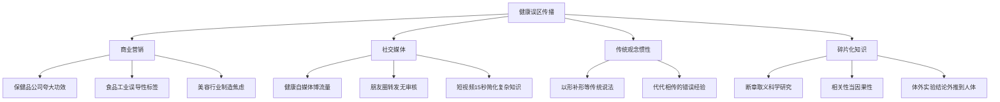
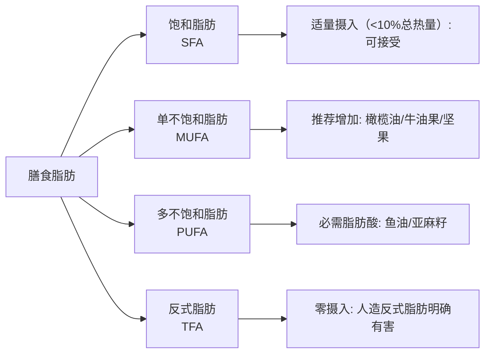
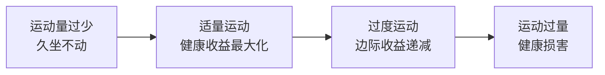
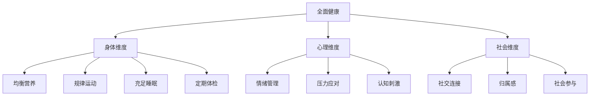

# 常见误区：科学破除健康养生迷思

> 人类对健康的认识史，就是一部不断推翻旧观念、建立新认知的历史。16世纪欧洲人相信放血能治百病，19世纪的医生认为洗手是多此一举，20世纪初的广告宣称吸烟有助于消化。今天被奉为金科玉律的"常识"，明天可能被证实为谬误。本章系统梳理当代最常见的15个健康养生误区，从科学原理层面剖析其成因与危害，帮助你建立真正的科学养生思维。

## 误区从何而来：认知偏差与信息污染

在逐一拆解具体误区之前，有必要理解一个根本问题：**为什么人们会相信错误的健康观念？** 这不是智力问题，而是人类认知系统的固有偏差。诺贝尔经济学奖得主Daniel Kahneman在《思考，快与慢》中指出，人类大脑有两套思维系统——快速直觉的"系统1"和慢速理性的"系统2"。大多数健康误区之所以顽固，正是因为它们迎合了系统1的偏好：简单、直觉、有故事性。

### 常见的认知偏差

| 偏差类型 | 定义 | 健康领域的典型表现 | 为什么难以纠正 |
|---------|------|-------------------|-------------|
| 确认偏误 | 只关注支持自己观点的信息 | "我吃了XX确实感觉好了"——忽略了安慰剂效应和自然恢复 | 主动回避反面证据，形成信息茧房 |
| 可得性偏误 | 容易想到的事例被高估概率 | 听说一个名人猝死就认为某种生活方式极度危险 | 情绪记忆比理性分析更持久 |
| 权威偏误 | 盲目相信权威人士的说法 | 某位"专家"在电视上说的就一定对 | 不区分"真正的专家"和"自称的专家" |
| 从众效应 | 大家都这么做应该没问题 | "我身边所有人都说有效" | 社会认同感比事实更有说服力 |
| 自然主义谬误 | 天然的就等于好的、安全的 | "纯天然无副作用" | 忽略了砒霜、毒蘑菇也是"纯天然" |
| 确认时间偏误 | 短期改善被归因于某种干预 | "吃了三天XX，精神好了" | 无法排除安慰剂、自愈、其他变量 |
| 幸存者偏差 | 只看到成功案例 | "我爷爷抽烟活到90" | 没活到能说话的人不会发声 |
| 沉没成本谬误 | 已经投入了，不舍得放弃 | "都吃了三个月了，不能白费" | 承认错误的心理代价太高 |

### 信息污染的四条管道

**一个典型的误区传播案例：**

2018年，一项关于"红酒中的白藜芦醇能延缓衰老"的研究在社交媒体上被传播了数百万次。但鲜有人知道：原始研究是在酵母细胞上进行的体外实验，使用的白藜芦醇浓度相当于每天喝1000瓶红酒。从"酵母细胞实验"到"每天喝红酒有益健康"，中间经历了至少四次信息失真：体外→动物→人体→媒体标题。这就是碎片化知识传播的典型路径。

理解了误区的根源，接下来我们逐一拆解最常见的15个健康养生误区。

---

## 一、睡眠相关误区

睡眠占据人生约三分之一的时间，却长期被误解和轻视。2022年《柳叶刀》全球睡眠调查显示，全球约45%的成年人存在不同程度的睡眠问题，但大多数人没有意识到自己的睡眠观念本身就是错误的。以下三个误区几乎影响了绝大多数人。

### 误区一：每天必须睡满8小时

**这个观念怎么来的：**

"8小时睡眠"的说法源于工业革命时期——工人们争取"8小时工作、8小时休闲、8小时睡眠"的劳工权益运动，本质上是社会运动口号，不是科学结论。但因为数字简洁好记，逐渐被误认为医学标准。就像"每天8杯水"一样，一个好记的数字被反复引用后就变成了"科学真理"。

**科学事实：**

2015年，加州大学圣地亚哥分校Daniel Kripke团队在《Sleep》期刊上发表了一项覆盖110万人的大规模荟萃分析，核心发现是：

- **睡眠需求存在显著个体差异**：基因决定了每个人的最佳睡眠时长。DEC2基因突变携带者（约占人口1-3%）每天只需4-6小时即可保持正常功能，这种突变在2009年被加州大学旧金山分校傅嫈惠团队首次鉴定
- **成人推荐睡眠时间为7-9小时**，而非固定的8小时——美国国家睡眠基金会（NSF）和美国睡眠医学学会（AASM）均采用区间制推荐
- **睡眠质量比时长更关键**：深度睡眠（N3期）和快速眼动睡眠（REM期）的比例才是决定恢复效果的核心指标。一个睡6小时但深度睡眠充足的人，可能比睡8小时但频繁浅睡的人更精神
- **过长睡眠同样有害**：研究显示，习惯性睡眠超过9小时的人群，全因死亡率反而升高——这可能是因为长睡眠本身是潜在疾病的信号（如抑郁症、甲状腺功能减退、睡眠呼吸暂停导致的低质量睡眠被迫延长）

**一张表看懂你的推荐睡眠时长：**

| 年龄段 | 推荐时长 | 可接受范围 | 不推荐 | 说明 |
|-------|---------|-----------|-------|------|
| 新生儿（0-3月） | 14-17小时 | 11-19小时 | <11或>19小时 | 睡眠周期短，频繁醒来正常 |
| 婴儿（4-11月） | 12-15小时 | 10-18小时 | <10或>18小时 | 开始建立昼夜节律 |
| 幼儿（1-2岁） | 11-14小时 | 9-16小时 | <9或>16小时 | 午睡仍很重要 |
| 学龄前（3-5岁） | 10-13小时 | 8-14小时 | <8或>14小时 | 逐步减少午睡 |
| 学龄期（6-13岁） | 9-11小时 | 7-12小时 | <7或>12小时 | 睡眠不足影响学习和发育 |
| 青少年（14-17岁） | 8-10小时 | 7-11小时 | <7或>11小时 | 生物钟自然后移，早起困难是生理性的 |
| 青年（18-25岁） | 7-9小时 | 6-11小时 | <6或>11小时 | 大学期间常被严重忽视 |
| 成人（26-64岁） | 7-9小时 | 6-10小时 | <6或>10小时 | 工作压力是最大干扰因素 |
| 老年（65岁以上） | 7-8小时 | 5-9小时 | <5或>9小时 | 深度睡眠自然减少，白天小睡可补偿 |

**如何找到你的个人最佳睡眠时长：**

1. 选一个1-2周的假期，不设闹钟
2. 每天自然醒，记录就寝和起床时间
3. 记录白天精神状态（用1-10分自评）
4. 取平均值——这就是你的自然睡眠需求
5. 以白天精力充沛、不需要午睡、情绪稳定为判断标准

**常见陷阱：** 很多人用手机上的睡眠追踪App来判断睡眠质量，但这些App主要依据体动来推算睡眠分期，准确率远低于医学级多导睡眠监测（PSG）。2019年《Journal of Clinical Sleep Medicine》的一项对比研究发现，消费级睡眠追踪器在判断睡眠分期上的准确率仅为约60-70%，且倾向于高估睡眠时长、低估觉醒次数。App数据可以作为趋势参考（比如连续几周的平均值变化），但不要过度焦虑于单晚的数据波动。

### 误区二：周末补觉可以弥补平时睡眠不足

**这个观念怎么来的：**

工作日早起赶通勤，周末自然醒睡到中午——这种生活方式在现代社会极其普遍，人们本能地觉得"欠的觉可以周末还"。这个观念看似符合直觉，因为周末多睡确实能暂时缓解困倦感。但"感觉好了一些"和"真正恢复了"是两回事。

**科学事实：**

2019年，《Current Biology》发表了一项由科罗拉多大学Boulder分校Kenneth Wright团队主导的研究，实验设计如下：

- **实验组一**：每天限制睡眠5小时，持续3天，然后周末自由补觉2天，再限制睡眠2天
- **实验组二**：持续每天限制睡眠5小时
- **对照组**：每天保持8小时睡眠

关键发现：

| 指标 | 持续缺觉组 | 周末补觉组 | 充足睡眠组 |
|-----|----------|----------|----------|
| 胰岛素敏感性 | 下降约13% | 改善但未恢复 | 正常 |
| 晚餐后血糖峰值 | 显著升高 | 仍比正常高7% | 正常 |
| 体重变化 | 平均增重 | 仍增重约0.5kg | 稳定 |
| 生物钟偏移 | 无变化 | 出现"社交时差" | 正常 |
| 白天嗜睡程度 | 严重 | 仅部分改善 | 正常 |

**"社交时差"（Social Jet Lag）是什么：**

周末晚睡晚起相当于每周末飞到一个时区、周一再飞回来。研究表明，社交时差每增加1小时，肥胖风险增加11%，心血管疾病风险增加约11%。频繁的生物钟切换打乱了内分泌节律，尤其影响皮质醇和褪黑素的分泌节奏。这就是为什么很多人周一上午感觉比周五还累——不是因为工作辛苦，而是因为生物钟在"倒时差"。

**更深层的机制——睡眠债不能简单"偿还"：**

慢性睡眠不足造成的损害包括：神经突触间的代谢废物（如β-淀粉样蛋白）清除不足、免疫系统中自然杀伤细胞活性下降、炎症因子（IL-6、TNF-α）水平升高。周末补觉只能部分缓解困倦感（腺苷积累的清除），但无法逆转已经发生的代谢和免疫紊乱。

**正确做法：**

- **目标：工作日和周末的就寝/起床时间差不超过1小时**
- 如果确实严重缺觉，采取渐进策略：每周提前15分钟入睡，逐步调整
- 短期补救方案：20-30分钟的午间小睡（不超过30分钟，避免进入深度睡眠后被叫醒导致的"睡眠惯性"——那种越睡越困的感觉）
- 长期方案：重新评估时间管理，优先保障每晚7小时以上的睡眠
- **如果只能改一件事**：固定起床时间（而非就寝时间）。起床时间是校准生物钟最有力的信号

### 误区三：睡前喝酒有助于睡眠

**这个观念怎么来的：**

酒精确实能缩短入睡时间（sleep onset latency），让人感觉"喝了酒更容易睡着"。这种直观体验强化了错误认知。加上红酒被包装成"浪漫""放松"的符号，睡前一杯酒成了许多人的"仪式"。

**科学事实：**

酒精对睡眠的影响是一个分阶段的过程，远比"助眠"复杂：

**第一阶段（入睡后0-3小时）——看似有益：**
- 酒精增强腺苷（促进睡眠的神经递质）的作用，加快入睡
- 初期增加慢波睡眠（深度睡眠）比例

**第二阶段（入睡后3-5小时）——反弹期：**
- 酒精代谢产生乙醛和乙酸，激活交感神经系统
- 频繁微觉醒（大部分不被记忆），深度睡眠被打断
- REM睡眠被显著抑制——REM期是情绪调节、记忆巩固和创造力整合的关键阶段

**第三阶段（整晚效果）——净损失：**
- 总睡眠时间可能减少
- 睡眠效率下降（实际睡眠时间/在床时间的比例降低）
- 夜间排尿增多（酒精抑制抗利尿激素ADH的分泌）
- 打鼾和睡眠呼吸暂停风险增加（酒精使上呼吸道肌肉松弛）

**剂量-效应关系（《Alcoholism: Clinical and Experimental Research》2013年综述）：**

| 饮酒量 | 入睡时间 | 深度睡眠 | REM睡眠 | 后半夜觉醒 | 次日表现 |
|-------|---------|---------|---------|----------|---------|
| 1杯（约14g纯酒精） | 轻微缩短 | 轻微增加 | 轻微减少 | 不明显 | 轻微影响 |
| 2-3杯 | 明显缩短 | 初期增加后下降 | 显著减少 | 增多 | 注意力下降 |
| 4杯以上 | 大幅缩短 | 严重紊乱 | 几乎消失 | 频繁 | 明显认知损害 |

**重要提醒：** 即使是"少量"饮酒（睡前1-2杯红酒），也会对睡眠质量产生可测量的负面影响。2018年《JMIR Mental Health》的系统综述明确指出：**不存在"不影响睡眠"的安全睡前饮酒量**。2023年《Sleep Medicine Reviews》的更新综述进一步确认，即便每周仅饮酒1-2次，深度睡眠质量也会出现可检测的下降。

**一个常见的误区叠加：** 很多人用"睡前红酒"来"改善睡眠"，当睡眠仍然不好时又增加了剂量，形成恶性循环。实际上，酒精导致的睡眠质量下降可能是失眠的真正原因之一。

**如果你有睡前饮酒的习惯：**

1. 最后一杯酒至少在睡前4小时以上
2. 用其他助眠方式替代：温水浴（睡前1-2小时，水温40-42.5℃，浸泡10-15分钟，核心体温先升后降能促进睡意）、深呼吸练习（4-7-8呼吸法：吸气4秒，屏气7秒，呼气8秒）、渐进性肌肉放松
3. 如果是因为焦虑失眠而饮酒，优先处理焦虑问题——认知行为疗法（CBT-I）是国际公认的一线推荐方案，效果优于安眠药且无依赖性
4. 戒酒初期可能出现短期睡眠恶化（反弹性失眠），通常在2-4周内改善
5. 如果无法自行戒除睡前饮酒习惯，建议咨询成瘾医学科或睡眠医学科

---

## 二、饮食营养误区

饮食是健康的基础，也是误区最密集的领域。食品工业的营销投入巨大——仅2023年，全球食品饮料行业的广告支出就超过300亿美元，普通消费者很难分辨科学与商业话术。更要命的是，营养学本身是一个还在快速发展的学科，很多结论在近20年内经历了重大修正。

### 误区四：碳水化合物是减肥的敌人

**这个观念怎么来的：**

Atkins饮食法（1972年提出）和后续的生酮饮食热潮把"碳水"塑造成了肥胖的元凶。一些人确实在低碳饮食后体重下降，但**机制被误读了**。Robert Atkins本人在2003年因意外摔倒去世后，纽约市首席法医办公室公布的报告显示他有心脏病史——这当然不能简单归因于低碳饮食，但也提醒我们不要神化任何单一饮食法。

**科学事实——你需要了解的碳水化合物分类：**

碳水化合物
├── 简单碳水（快碳）
│   ├── 单糖：葡萄糖、果糖、半乳糖
│   └── 双糖：蔗糖、乳糖、麦芽糖
├── 复杂碳水（慢碳）
│   ├── 淀粉：直链淀粉（慢消化）、支链淀粉（快消化）
│   └── 膳食纤维：可溶性纤维、不可溶性纤维
└── 糖醇/代糖：赤藓糖醇、木糖醇等

**关键指标——血糖生成指数（GI）和血糖负荷（GL）：**

| 食物 | GI值 | 每100g碳水含量 | 说明 |
|-----|------|-------------|------|
| 白米饭 | 83 | 26g | 高GI，快速升糖 |
| 糙米饭 | 56 | 23g | 中GI，含膳食纤维 |
| 燕麦（纯） | 55 | 66g | β-葡聚糖减缓吸收 |
| 红薯 | 63 | 20g | 中GI，富含纤维和维生素A |
| 全麦面包 | 69 | 41g | 注意看配料表，很多"全麦"是假的 |
| 白面包 | 75 | 49g | 高GI，精制碳水 |
| 意大利面（煮熟） | 49 | 25g | 低GI，直链淀粉含量高 |
| 苹果 | 36 | 14g | 低GI，果糖+纤维 |
| 藜麦 | 53 | 21g | 低GI，完全蛋白 |

**2017年《柳叶刀》（The Lancet）大型队列研究的关键数据：**

- 追踪了18个国家13.5万人，中位随访7.4年
- 碳水化合物供能比<40%的人群，死亡风险增加20%
- 碳水化合物供能比>70%的人群，死亡风险增加23%
- **最健康的碳水供能比为50-55%**——这正是中国居民膳食指南推荐的范围

**为什么低碳饮食初期体重下降快：**

初期掉的主要是水分（每克糖原结合3-4克水），而非脂肪。当碳水摄入不足时，身体先消耗储存的糖原，释放大量结合水，体重秤数字下降很快，但脂肪减少有限。这就是为什么很多人低碳2-3周后进入平台期——水分已经减完了，真正的脂肪减少才刚刚开始。

**科学的碳水摄入策略：**

1. **优先选择低GI复合碳水**：糙米、燕麦、全麦、豆类、薯类
2. **控制精制碳水**：白米、白面、含糖饮料不是不能吃，而是控制频率和量
3. **搭配蛋白质和健康脂肪**：碳水+蛋白质+脂肪的混合餐比纯碳水餐的升糖反应更平缓
4. **餐后运动**：饭后15-30分钟的轻度活动（散步即可）能显著降低餐后血糖峰值——2022年《Sports Medicine》荟萃分析显示，餐后散步可使血糖峰值降低约17%
5. **根据活动量调整**：高强度训练日可以适当增加碳水摄入，久坐日减少
6. **进食顺序有讲究**：先吃蔬菜和蛋白质，最后吃碳水——2015年《Diabetes Care》的研究证实，这种进食顺序可使餐后血糖峰值降低约73%

### 误区五：脂肪对健康有害，应该尽量少吃

**这个观念怎么来的：**

1958年，美国生理学家Ancel Keys提出了"脂肪假说"——认为膳食脂肪（尤其是饱和脂肪）是心血管疾病的主要原因。这个理论在1980年代被美国政府采纳为官方膳食指南的基石，催生了整整一代"低脂食品"。

**但历史证明Keys的研究存在严重缺陷：**

2016年，《JAMA Internal Medicine》披露了美国糖业协会在1960年代资助哈佛科学家发表偏颇研究、把心血管疾病的锅从糖甩给脂肪的丑闻。Keys的"七国研究"也被批评为选择性使用数据——他最初收集了22个国家的数据，但只选用了其中7个符合其假说的国家。"低脂运动"实际上推动了食品工业用大量添加糖来弥补低脂食品的口感损失，反而加剧了肥胖和糖尿病的流行。讽刺的是，美国在推行低脂饮食指南的30年间，肥胖率从15%飙升至42%。

**脂肪的科学分类及健康效应：**

**各类脂肪的食物来源和推荐摄入：**

| 脂肪类型 | 主要来源 | 对健康的影响 | 推荐摄入 |
|---------|---------|------------|---------|
| 单不饱和脂肪 | 橄榄油、牛油果、坚果、花生 | 降低LDL胆固醇，保护心血管 | 占总热量15-20% |
| 多不饱和脂肪（ω-3） | 深海鱼、亚麻籽、核桃 | 抗炎、保护脑血管、支持视网膜发育 | 每周至少2次深海鱼 |
| 多不饱和脂肪（ω-6） | 大豆油、玉米油、葵花籽油 | 适量有益，过量促炎（ω-6/ω-3比值应<4:1） | 控制总量 |
| 饱和脂肪 | 红肉、全脂乳制品、椰子油、棕榈油 | 适量可接受，过量升高LDL | <总热量10% |
| 反式脂肪 | 人造黄油、酥油、反复加热的油 | 明确有害，升高LDL+降低HDL+促炎 | 零摄入 |

**2013年《新英格兰医学杂志》的里程碑研究（PREDIMED试验）：**

- 7447名心血管高风险受试者
- 地中海饮食组（高单不饱和脂肪）vs 低脂饮食对照组
- 结果：地中海饮食组心血管事件风险降低约30%
- 该研究因结果太过显著而被提前终止——这在临床试验中极为罕见

**实用脂肪摄入指南：**

1. 烹饪用油首选特级初榨橄榄油（低温烹饪，烟点约190℃）或茶籽油（可耐高温，烟点约220℃）
2. 每周吃2-3次深海鱼（三文鱼、鲭鱼、沙丁鱼），补充ω-3脂肪酸
3. 每天一小把坚果（约30g），优选核桃（ω-3含量最高）、杏仁
4. 严格避免反式脂肪：看配料表中的"氢化植物油""植物奶油""起酥油""植脂末"
5. 脂肪总量占每日热量的20-35%，其中饱和脂肪<10%
6. **特别注意ω-6与ω-3的比例**：中国家庭常用的大豆油ω-6含量极高，建议与亚麻籽油或紫苏油交替使用

### 误区六：蛋白粉是健身必需品

**这个观念怎么来的：**

健身产业（2024年全球市场规模超过1500亿美元）的营销策略之一就是将蛋白粉塑造成"增肌必备"。社交媒体上健身博主几乎人手一桶蛋白粉，形成了强烈的暗示效应。当你关注的每个健身博主都在推荐蛋白粉时，你很难不认为这是必需品——这就是"可得性偏误"的典型运作方式。

**科学事实：**

**蛋白质需求量到底多少？**

| 人群 | 每日蛋白质需求 | 70kg体重折算 | 是否需要蛋白粉 |
|-----|-------------|------------|-------------|
| 普通成人 | 0.8g/kg | 56g | 不需要 |
| 耐力运动者 | 1.2-1.4g/kg | 84-98g | 多数不需要 |
| 力量运动者 | 1.6-2.2g/kg | 112-154g | 部分需要 |
| 老年人（>65岁） | 1.0-1.2g/kg | 70-84g | 食欲差时可考虑 |
| 素食者 | 按需求量+10% | 多种植物蛋白互补 | 可考虑 |
| 术后恢复期 | 1.5-2.0g/kg | 105-140g | 常需要 |

**一份普通饮食能否满足蛋白质需求？**

以一位70kg、每周健身3次的普通人为例（需求约112g/天）：

- 早餐：2个鸡蛋（12g）+ 1杯牛奶（8g）= 20g
- 午餐：150g鸡胸肉（46g）+ 米饭配菜 = 46g
- 加餐：200g酸奶（7g）+ 30g坚果（6g）= 13g
- 晚餐：150g豆腐（12g）+ 100g鱼肉（20g）= 32g
- **总计：约111g——通过正常饮食完全可以满足**

**蛋白粉的真正适用场景：**

- 训练后需要快速补充蛋白质，但没条件准备食物（如在办公室健身后）
- 素食者难以从食物中获取足够的优质蛋白
- 老年人食欲差、进食量少，需要高效蛋白质来源
- 术后恢复期蛋白质需求增加
- 高强度训练期间（如备赛期健美运动员），食物体积过大难以吃完

**蛋白粉的潜在风险：**

1. **肾脏负担**：长期过量蛋白质摄入（>2.5g/kg/天）对已有肾脏问题的人可能加速肾功能下降。健康人群短期内不会有问题，但长期超量摄入的长期安全性数据不足
2. **消化问题**：乳清蛋白可能导致乳糖不耐受者腹胀、腹泻
3. **重金属污染**：2018年《Clean Label Project》检测发现，部分蛋白粉产品铅、镉含量超标
4. **营销陷阱**：很多蛋白粉添加了大量糖、人工甜味剂和填充剂，一份蛋白粉的热量可能高达300kcal——和一顿小餐差不多
5. **心理依赖**：形成"不吃蛋白粉就练不好"的心理暗示，忽略了训练本身才是增肌的核心驱动力

**选购建议（如果你确实需要蛋白粉）：**

- 选择经过第三方检测（如NSF Certified for Sport、Informed Sport）的产品
- 每份蛋白质含量>20g，糖含量<3g
- 乳糖不耐受者选择分离乳清蛋白（Whey Isolate）或植物蛋白（大豆蛋白是唯一含有完整必需氨基酸的植物蛋白）
- 每日补充量不超过总蛋白质需求的1/3
- **性价比提示**：普通浓缩乳清蛋白和分离乳清蛋白的蛋白质含量差异约10%，但价格可能差一倍。如果没有乳糖不耐受，浓缩乳清蛋白性价比更高

---

## 三、运动健身误区

运动是健康的基石，但错误的运动观念不仅降低效率，还可能造成伤害。2023年《英国运动医学杂志》的一项调查显示，约60%的运动损伤与错误的运动观念和方法直接相关。

### 误区七：运动时间越长越好

**这个观念怎么来的：**

"No pain, no gain"（没有付出就没有收获）这句口号深入人心。很多人觉得练得越久、越累，效果就越好。健身房里有人一练就是3小时，跑步机上有人一口气跑2小时——他们坚信"量变引起质变"。

**科学事实——运动剂量-反应曲线：**

运动与健康之间不是线性关系，而是呈**倒U型曲线**：

**具体数据（《英国运动医学杂志》2015年荟萃分析）：**

| 每周运动量 | 全因死亡风险变化 | 说明 |
|----------|---------------|------|
| 0分钟（久坐） | 基准值 | 最高风险 |
| 150分钟中等强度 | 降低约31% | WHO推荐量 |
| 300分钟中等强度 | 降低约37% | 收益继续增加但趋缓 |
| 500分钟以上高强度 | 收益平台期或下降 | 过度训练风险 |

**过度训练综合征（Overtraining Syndrome, OTS）的识别信号：**

| 信号类别 | 具体表现 |
|---------|---------|
| 运动表现 | 力量或耐力持续下降，相同负荷感觉更吃力 |
| 心血管 | 静息心率升高5-10次/分钟，心率变异性（HRV）下降 |
| 睡眠 | 入睡困难、睡眠质量下降、早醒 |
| 情绪 | 烦躁、缺乏动力、注意力下降 |
| 免疫 | 反复感冒、伤口愈合变慢 |
| 肌肉关节 | 持续性酸痛（超过72小时不恢复）、反复受伤 |
| 激素 | 女性月经紊乱，男性性欲下降 |

**一个真实的过度训练案例：**

某30岁男性，原本每周跑步3次（每次5公里），为了备战马拉松，在3个月内将周跑量从15公里增加到80公里。结果出现了持续疲劳、失眠、膝关节疼痛、反复感冒。医学检查显示：静息心率从58次/分升高到72次/分，皮质醇水平异常，睾酮水平下降30%。这就是典型的过度训练综合征。恢复方案：停训2周，之后每周跑量递减至原来的50%，用8周时间逐步恢复。

**科学运动方案的原则：**

1. **渐进超负荷**：每周训练量增幅不超过10%
2. **训练-恢复平衡**：高强度训练日之间至少间隔48小时
3. **周期化训练**：每4-6周安排一个减量周（训练量降低40-60%）
4. **倾听身体**：如果HRV连续3天低于个人基线，当天改为低强度活动或休息
5. **量化追踪**：使用心率监测器或运动手表追踪训练负荷
6. **区分"好的酸痛"和"坏的疼痛"**：延迟性肌肉酸痛（DOMS）在24-72小时内消退属于正常；关节锐痛、肿胀、活动受限则需要停止训练并就医

### 误区八：出汗越多减肥效果越好

**这个观念怎么来的：**

健身房里穿暴汗服、裹保鲜膜运动的人不在少数。体重秤上运动后掉的1-2kg让人有成就感，但这完全是假象。这个误区的流行有两个推手：一是拳击、摔跤等需要赛前称重的运动项目中使用减重服的做法被不当推广；二是暴汗服厂商的营销。

**科学事实——脂肪到底去哪了：**

2014年，澳大利亚新南威尔士大学的Ruben Meerman和Andrew Brown在《BMJ》上发表了一篇有趣的研究，追踪了脂肪代谢的原子去向：

**每减掉10kg脂肪：**
- **8.4kg以CO₂形式通过呼吸排出**（占84%）
- **1.6kg以H₂O形式通过汗液、尿液、泪液等排出**（占16%）

这意味着，**脂肪的"燃烧"本质上是一个呼吸过程**。你呼出去的二氧化碳才是脂肪代谢的主要产物——这和出汗量几乎没有直接关系。

**出汗的本质是什么：**

出汗是体温调节机制，不是脂肪代谢指标。影响出汗量的因素：

- **环境温度和湿度**：夏天比冬天出汗多，与脂肪燃烧无关
- **运动强度**：高强度运动产热多，出汗多——但产热和脂肪氧化是两个独立过程
- **个体差异**：汗腺数量和活跃度因人而异，有人天生多汗
- **身体水分状态**：脱水状态下出汗反而减少
- **训练水平**：经常运动的人出汗更早、更多——这恰恰是身体更高效散热的表现，而非脂肪燃烧更多的证据

**暴汗服的真实效果：**

- 运动前后体重差：1-3kg（几乎全部是水分）
- 补水后体重恢复：完全恢复
- 脂肪消耗量：与不穿暴汗服无显著差异
- 真实风险：脱水、电解质紊乱、热射病、晕厥

**2018年一项发表在《Journal of Strength and Conditioning Research》的研究：**

受试者穿暴汗服和普通运动服进行相同运动，结果：
- 两组的脂肪氧化率无统计学差异
- 暴汗服组的核心体温高1.2℃
- 暴汗服组的脱水程度高42%
- 暴汗服组运动后的认知功能测试成绩下降

**桑拿和泡热水澡也不能"减脂"：**

虽然有研究显示桑拿能短暂提高代谢率（约增加15-20%的热量消耗），但实际增加的热量消耗微乎其微——一次20分钟桑拿大约多消耗30-50kcal，相当于半个苹果。桑拿的主要益处是放松和改善循环，而非减脂。

**科学减脂的正确做法：**

1. **热量缺口是减脂的唯一物理条件**——消耗>摄入，缺口约300-500kcal/天最可持续
2. **力量训练比纯有氧更有效**——增加肌肉量→提高基础代谢率→持续消耗更多热量
3. **关注体脂率而非体重**——同体重下，体脂率低的人看起来更瘦
4. **合理速度**：每周减脂0.5-1kg为宜，过快说明丢失的主要是水分和肌肉
5. **监测方式**：晨起空腹体重取7天平均值，比单次测量更可靠
6. **有氧和力量的最佳组合**：先做30分钟力量训练，再做20-30分钟中等强度有氧——力量训练消耗糖原，后续有氧更容易动用脂肪供能

---

## 四、中医养生误区

中医养生有数千年的智慧积淀，但也有大量被误读、曲解和商业化利用的内容。区分真正的中医理念和伪中医营销，是现代人必须具备的健康素养。真正的中医强调"辨证论治"和"因人制宜"，这恰恰与"一刀切"的养生营销背道而驰。

### 误区九：所有人都适合同一种养生方法

**这个观念怎么来的：**

社交媒体上流行的"全民养生法"——今天说红枣枸杞茶人人必喝，明天说每天泡脚包治百病。信息传播的简化倾向把个性化方案扭曲成了"一刀切"。一个拥有百万粉丝的养生博主说"每天喝姜枣茶"，底下评论区就是清一色的跟风——但没有人问"我适不适合"。

**科学事实——中医体质辨识体系：**

2009年，中华中医药学会正式发布了《中医体质分类与判定》标准（王琦教授团队主导），将中国人体质分为9种基本类型：

| 体质类型 | 人口占比 | 核心特征 | 适合的养生方向 | 不适合的做法 |
|---------|---------|---------|-------------|------------|
| 平和质 | 约33% | 精力充沛、睡眠好、适应力强 | 维持即可，适度运动 | 无需特殊进补 |
| 气虚质 | 约13% | 容易疲乏、气短、自汗 | 补气健脾（黄芪、党参） | 剧烈运动、过度节食 |
| 阳虚质 | 约9% | 怕冷、手脚凉、喜热饮 | 温补阳气（肉桂、干姜） | 生冷食物、寒凉药 |
| 阴虚质 | 约9% | 怕热、口干、手脚心热 | 滋阴降火（百合、麦冬） | 辛辣燥热食物 |
| 痰湿质 | 约7% | 体胖、痰多、口黏腻 | 化痰祛湿（薏米、茯苓） | 甜腻食物、久坐不动 |
| 湿热质 | 约10% | 面部油腻、口苦、大便黏 | 清热利湿（苦瓜、绿豆） | 烟酒、辛辣油腻 |
| 血瘀质 | 约8% | 面色暗沉、唇色紫暗 | 活血化瘀（山楂、三七粉） | 久坐不动 |
| 气郁质 | 约8% | 情绪低落、胸闷、叹气 | 疏肝理气（玫瑰花、佛手） | 压抑情绪、缺乏社交 |
| 特禀质 | 约4% | 过敏体质、易起疹 | 增强体质、远离过敏原 | 接触过敏原 |

**举例说明：同样"补气"，不同体质的效果完全不同**

- 气虚质的人喝黄芪水：对症，会感觉精力改善
- 阴虚质的人喝黄芪水：阴虚火旺者会越喝越上火（口干、咽痛、失眠）
- 痰湿质的人喝黄芪水：气有余而化火，湿热更重

**更多"全民养生法"的体质陷阱：**

| 流行做法 | 适合的体质 | 不适合的体质 | 可能的不良反应 |
|---------|----------|------------|-------------|
| 每天泡脚（水温>42℃） | 阳虚质、气虚质 | 阴虚质、湿热质 | 上火、口干、失眠 |
| 红枣枸杞茶 | 气虚质、血虚质 | 痰湿质、湿热质 | 助湿生痰、腹胀 |
| 阿胶进补 | 血虚质 | 痰湿质、气郁质 | 滋腻碍胃、消化不良 |
| 艾灸 | 阳虚质、寒湿质 | 阴虚质、湿热质 | 加重热象 |
| 绿豆汤清热 | 湿热质 | 阳虚质、气虚质 | 加重寒凉 |

**如何判断自己的体质：**

1. **专业途径**：到正规中医院进行体质辨识（一般包含问卷+舌诊+脉诊）
2. **自测工具**：中华中医药学会官方九种体质测试问卷（各中医院网站可找到）
3. **动态观察**：体质不是固定的，会随季节、年龄、生活方式变化——建议每1-2年重新评估
4. **混合体质**：大多数人是2-3种体质的混合，以占比最高的为主
5. **季节调整**：同一个人夏天可能偏湿热，冬天偏阳虚——养生方案应随季节微调

### 误区十：保健品可以替代药物治疗疾病

**这个观念怎么来的：**

中国保健品市场规模超过4000亿元，部分保健品企业采用夸大宣传、暗示疗效的营销手段。特别是面向老年群体的"健康讲座"营销模式，利用信息不对称和情感关怀诱导消费。销售人员嘘寒问暖、叫"爸妈"，比亲生子女还贴心——老年人买的不是保健品，是情感关怀。

**科学事实——药品与保健品的根本区别：**

| 维度 | 药品 | 保健食品 |
|-----|------|---------|
| 审批要求 | 严格的临床试验（I-IV期） | 仅需安全性试验，不要求有效性验证 |
| 功效声称 | 可以声称治疗特定疾病 | 不得声称疾病治疗、预防功能 |
| 监管机构 | 国家药品监督管理局（NMPA） | 国家市场监督管理总局 |
| 审批文号 | 国药准字H/Z+8位数字 | 国食健字G/J+4位数字+4位数字 |
| 副作用监测 | 上市后持续监测（药物警戒） | 基本无上市后监测 |
| 作用机制 | 明确的药理学机制 | 多数机制不明确或仅有体外/动物实验数据 |

**真实案例——保健品延误治疗的代价：**

- 2018年中国裁判文书网数据显示，因"保健品替代药物治疗"导致延误就医的纠纷案件中，涉及糖尿病、高血压、癌症三类疾病最多
- 典型模式：停用降压药/降糖药→改用保健品→血压/血糖失控→心脑血管事件或酮症酸中毒
- 一个典型判例：某65岁糖尿病患者在保健品销售人员建议下停用二甲双胍，改服某品牌"蜂胶胶囊"，3个月后因酮症酸中毒入院，抢救无效死亡。法院判决保健品公司赔偿47万元——但生命无法用金钱衡量

**识别保健品骗局的"四看"法：**

1. **看批号**：正规保健品有"国食健字"批准文号，可在国家市场监督管理总局网站查询
2. **看声称**：如果声称能"治愈""根治"某种疾病，100%是虚假宣传
3. **看渠道**：通过"健康讲座""免费体检""旅游推销"方式销售的保健品，骗局概率极高
4. **看成分**：如果成分表含糊不清、用"保密配方""祖传秘方"搪塞，立即远离

**如何正确看待保健品：**

1. **保健品的合理定位**：补充饮食中可能不足的营养素，如维生素D（日照不足人群）、ω-3（不吃鱼的人群）、铁（经期女性）、叶酸（备孕女性）
2. **选择标准**：有国家批准文号、通过第三方检测、成分剂量透明
3. **警惕信号**：声称能"治愈"某种疾病、需要大量购买才有优惠、通过"讲座"销售、没有正规批号
4. **正在服药的人**：任何保健品使用前必须咨询医生——某些保健品与药物存在严重相互作用（如银杏叶+抗凝血药=出血风险，圣约翰草+抗抑郁药=5-HT综合征，葡萄柚汁+他汀类药物=肌肉毒性）

---

## 五、体检与健康管理误区

### 误区十一：体检指标正常就代表完全健康

**这个观念怎么来的：**

人们对健康的理解往往停留在"没有生病"的层面，而常规体检的设计初衷是筛查常见疾病，不是评估整体健康状态。拿到一张"全部正常"的体检报告，很多人就放心了——但这种放心可能是一种"虚假的安全感"。

**科学事实——常规体检的盲区：**

常规体检项目覆盖的主要是：
- 血常规、尿常规（感染、血液病筛查）
- 肝肾功能（器官功能筛查）
- 血脂血糖（代谢疾病筛查）
- 心电图（心脏电活动筛查）
- 胸片/腹部超声（器质性病变筛查）

**以下重要健康维度在常规体检中不被覆盖：**

| 健康维度 | 常规体检覆盖 | 需要额外检查 | 何时开始关注 |
|---------|-----------|------------|-----------|
| 心理健康 | 不覆盖 | 心理评估量表（PHQ-9、GAD-7） | 任何年龄 |
| 睡眠质量 | 不覆盖 | 多导睡眠监测（PSG） | 出现打鼾/日间嗜睡时 |
| 骨密度 | 通常不做（<50岁） | DEXA扫描 | 女性50岁/男性65岁 |
| 早期肿瘤 | 基础筛查覆盖有限 | 低剂量CT（肺）、肠镜（结直肠）、胃镜 | 40岁起 |
| 血管弹性 | 不覆盖 | 颈动脉超声、脉搏波速度（PWV）检测 | 40岁起 |
| 营养状态 | 部分覆盖 | 25-羟维生素D、铁蛋白、B12等 | 任何年龄 |
| 肠道菌群 | 不覆盖 | 粪便微生物检测 | 出现消化问题时 |
| 激素水平 | 部分覆盖 | 甲状腺功能、性激素、皮质醇 | 30岁起 |
| 认知功能 | 不覆盖 | 认知功能评估（MoCA量表） | 60岁起 |

**"参考范围"不等于"最优范围"：**

很多体检指标的"正常范围"是基于人群统计（取95%置信区间），而非"最优健康区间"。举例：

- 空腹血糖参考范围3.9-6.1mmol/L，但5.6-6.1已经是"糖前期"（美国糖尿病协会标准）
- TSH（促甲状腺激素）参考范围0.27-4.2mIU/L，但>2.5就可能提示亚临床甲减
- 同型半胱氨酸（Hcy）参考范围<15μmol/L，但>10μmol/L就与心血管风险相关
- 维生素D参考范围30-100ng/mL，但最优水平应>40ng/mL

**建议的体检策略：**

- **20-30岁**：每2年一次常规体检+心理评估
- **30-40岁**：每年一次常规体检+甲状腺功能+维生素D+空腹胰岛素
- **40-50岁**：每年一次+低剂量CT（有吸烟史者）+肠镜/胃镜（首次）+颈动脉超声
- **50岁以上**：每年一次+骨密度+肿瘤标志物+颈动脉超声+认知评估
- **有家族史者**：相关检查提前10年开始，加密检查频率

**如何看懂自己的体检报告：**

1. 不要只看"正常/异常"的箭头，关注数值的趋势变化——连续3年的数据比单次更有意义
2. 如果某项指标在"正常范围"的高限或低限，建议3-6个月后复查
3. 保存所有体检报告，建立个人健康档案——纵向对比比横向参考更有价值
4. 对"建议进一步检查"的项目务必跟进，不要拖

### 误区十二：年轻不需要关注健康

**这个观念怎么来的：**

年轻时身体代偿能力强，不良生活习惯的后果不会立即显现。这种"延迟反馈"导致年轻人低估了健康投资的重要性。20多岁的人熬夜后第二天照样精力充沛，所以觉得"熬夜没什么大不了"——但30岁以后就会发现，身体的恢复能力在悄悄下降。

**科学事实——慢性病的"种子期"远比你想象的早：**

- **动脉粥样硬化**：尸检研究显示，美军朝鲜战争阵亡士兵（平均22岁）中，77%已有冠状动脉粥样硬化的早期迹象。病变可能从青少年时期就开始积累
- **骨质疏松**：骨密度在25-30岁达到峰值，之后逐年下降（女性更年期后加速）。年轻时不积累足够的骨密度峰值，中老年骨折风险大幅升高
- **2型糖尿病**：胰岛素抵抗的病理过程可能在确诊前10-20年就已经开始
- **认知衰退**：2020年《柳叶刀》痴呆预防委员会指出，45%的痴呆风险因素可在中年及更早时期干预（包括教育水平、听力损失、高血压、肥胖、吸烟、抑郁、缺乏社交、缺乏运动、糖尿病、过度饮酒、空气污染、头部外伤）

**年轻时建立健康习惯的复利效应：**

以运动为例——假设从25岁开始每周运动150分钟：
- **5年内**：心血管疾病风险降低约20%
- **10年内**：2型糖尿病风险降低约40%
- **20年内**：全因死亡风险降低约30%
- **终身效应**：预期寿命延长3-7年

而如果从45岁才开始同样的运动，各项收益下降约40-60%。这不是说45岁运动没用——任何时候开始都比不开始好——但越早开始，复利越大。

**年轻人最应该避免的4个习惯：**

1. **久坐不动**：每天坐8小时以上且不运动，心血管风险等同于吸烟。每坐60分钟，站起来活动5分钟。一个简单的方法：设置每小时的闹钟
2. **长期熬夜**：2023年《Annals of Internal Medicine》研究显示，长期夜班工作者（>5年）的心血管事件风险增加24%。即使不是夜班，习惯性凌晨1点后入睡也会打乱皮质醇节律
3. **频繁外卖**：高盐高油饮食对血管的损害从20岁就开始累积。一份外卖的平均钠含量约3000-4000mg，而WHO推荐每日钠摄入<2000mg
4. **忽视心理健康**：焦虑和抑郁如果在年轻时未被干预，会形成慢性化模式，增加中年期身心疾病风险。中国18-25岁人群中，抑郁症状的检出率约为24%（2021年《柳叶刀-精神病学》数据）

---

## 六、食物与营养补充误区

### 误区十三：健康食品可以随便吃

**这个观念怎么来的：**

食品包装上的"低脂""无糖""高纤维""天然"等标签给消费者一种"随便吃也没关系"的安全感。这些标签是精心设计的营销工具。食品公司雇佣了大量食品科学家和心理学家来研究如何让消费者在不看配料表的情况下产生"这个很健康"的错觉。

**科学事实——常见食品标签的陷阱：**

| 标签声称 | 实际含义 | 可能的陷阱 |
|---------|--------|----------|
| "低脂" | 脂肪含量<3g/100g | 往往添加更多糖来补偿口感 |
| "无糖" | 糖含量<0.5g/100g | 可能含有人工甜味剂或糖醇（过量可致腹泻） |
| "0反式脂肪" | 反式脂肪<0.3g/100g | 仍含少量反式脂肪，吃多了就超标 |
| "全麦" | 可能只含少量全麦粉 | 看配料表第一位是否为"全麦粉" |
| "天然" | 无法律定义 | 不代表健康，蔗糖也是"天然"的 |
| "高钙" | 钙含量>120mg/100g | 不代表好吸收，草酸/植酸影响吸收 |
| "无麸质" | 不含小麦蛋白 | 对无乳糜泻的人无特殊健康益处 |
| "含果汁" | 果汁含量可能仅5% | 其余95%是水和糖 |
| "非油炸" | 不是油炸工艺 | 可能是喷油烘焙，脂肪含量未必低 |

**如何正确阅读食品标签：**

1. **先看配料表，而非正面包装**——配料按含量降序排列，前3位决定了产品的本质
2. **计算每份实际摄入量**——"每100g含糖5g"看着不多，但一瓶500ml饮料就是25g糖（WHO建议每日游离糖<25g）
3. **注意隐藏糖的名称**：果葡糖浆、麦芽糖浆、浓缩果汁、蜂蜜、转化糖、结晶果糖、蔗糖素——都是糖的变体
4. **关注钠含量**——加工食品的钠含量往往是最大的健康隐患
5. **营养成分表的"份量"陷阱**——很多产品用不合理的"每份"来降低数字。一包薯片标"每份30g"，但一包实际有100g——你以为摄入的数字要乘以3.3

### 误区十四：单一食物可以解决健康问题

**这个观念怎么来的：**

每当新的研究发表某种食物的健康益处（如蓝莓的抗氧化能力），媒体就将其包装成"超级食物"，暗示吃了就能防病治病。从蓝莓到牛油果到奇亚籽到藜麦，每隔几年就有一个新的"超级食物"被推上神坛。

**科学事实——"超级食物"是营销概念，不是科学术语：**

没有任何权威营养学组织（WHO、美国膳食指南委员会、中国营养学会）使用"超级食物"这个概念。它的流行始于2004年美国的蓝莓营销运动。

**为什么单一食物不能"治病"：**

1. **营养素协同效应**：人体需要40多种营养素，它们之间存在复杂的协同和拮抗关系。维生素C促进铁吸收，钙抑制铁吸收——单一食物无法满足所有需求
2. **剂量问题**：实验室研究中使用的是浓缩提取物，剂量远超日常饮食摄入量。在培养皿中能杀死癌细胞的浓度，你可能需要吃100kg蓝莓才能达到
3. **食物基质效应**：食物中的营养素不是孤立存在的，它们与食物基质（纤维、其他化合物）的相互作用影响实际吸收率
4. **个体差异**：同一种食物对不同人的影响可能完全不同——这与基因多态性有关

**"超级食物"的性价比真相：**

| "超级食物" | 声称的功效 | 等效平价替代方案 |
|----------|----------|-------------|
| 奇亚籽（约80元/500g） | 富含ω-3和纤维 | 亚麻籽（约15元/500g）的ω-3含量更高 |
| 牛油果（约10元/个） | 健康脂肪 | 花生（约10元/500g）脂肪组成相似 |
| 藜麦（约40元/500g） | 完全蛋白 | 豆腐+米饭的组合蛋白质互补 |
| 蓝莓（约30元/100g） | 抗氧化 | 紫甘蓝（约5元/500g）花青素含量相当 |
| 椰子油（约60元/500g） | "超级健康" | 橄榄油（约40元/500g）证据更充分 |

**与其迷信"超级食物"，不如关注整体饮食模式：**

全球公认的健康饮食模式及其核心特征：

| 饮食模式 | 核心原则 | 主要证据 |
|---------|--------|---------|
| 地中海饮食 | 大量蔬果、橄榄油、鱼类、适量红酒 | PREDIMED试验，心血管风险↓30% |
| DASH饮食 | 高钾低钠、丰富蔬果、低脂乳制品 | 降低收缩压8-14mmHg |
| 日本冲绳饮食 | 多蔬果、豆腐鱼肉、低热量、七分饱 | 冲绳百岁老人比例全球最高 |
| 中国居民膳食指南 | 食物多样、谷类为主、吃动平衡 | 基于中国人群数据的循证推荐 |

**每天摄入12种以上食物的操作方法：**

- 早餐：燕麦+牛奶+蓝莓+核桃 = 4种
- 午餐：米饭+鸡胸肉+西兰花+胡萝卜+木耳 = 5种
- 晚餐：面条+鸡蛋+番茄+菠菜+豆腐 = 5种
- 加餐：苹果+酸奶 = 2种
- **总计：16种**——轻松达标

### 误区十五：养生就是吃补品

**这个观念怎么来的：**

中国传统文化中有"药食同源""食补"的概念，但这些概念被商业力量扭曲为"养生=吃补品"。保健品行业有动力强化这个认知，因为每多一个信奉者就多一个消费者。打开社交媒体，满屏都是"每天吃这个，百病不侵""XX岁开始吃XX，远离XX病"——它们的共同特点是把复杂的健康问题简化为"吃"这一个动作。

**科学事实——世界卫生组织（WHO）对健康的定义：**

> "健康是身体、心理和社会适应的完好状态，而不仅仅是没有疾病或虚弱。"

这意味着，养生是一个多维度的系统工程：

**各维度对健康的贡献权重（基于多项流行病学研究的估算）：**

| 维度 | 对健康和寿命的影响权重 | 说明 |
|-----|-------------------|------|
| 生活方式（饮食+运动+睡眠） | 约50-60% | 可控性最强，收益最大 |
| 社交连接与心理健康 | 约20-25% | 孤独感的死亡风险等同于每天吸15支烟 |
| 遗传因素 | 约15-20% | 不可控，但可以通过生活方式对冲 |
| 医疗条件 | 约10-15% | 体检、预防接种、及时就医 |
| 保健品 | 证据不足 | 对健康人群的额外益处缺乏高质量证据 |

**最有价值的"养生投资"排名：**

1. **每天30分钟中等强度运动**——成本几乎为零，收益最高
2. **每晚7-8小时优质睡眠**——免费的自我修复
3. **每天与亲友的有意义社交**——对心理健康至关重要
4. **学习一项新技能或保持认知刺激**——预防认知衰退
5. **每天吃够5份蔬果+多样化的全谷物**——比任何补品都有效
6. **定期体检和心理健康检查**——早发现早干预
7. **管理压力**——慢性压力是万病之源，皮质醇长期升高会损害免疫、消化、心血管和认知功能

---

## 七、如何建立科学的养生思维

知道了具体误区只是第一步，更重要的是建立一套**识别和避免未来误区的思维框架**。因为新的"养生潮流"会不断出现——今天是生酮饮食，明天是NMN抗衰，后天是某种新的"超级食物"。你需要的是一把万能钥匙，而不是逐条记忆。

### 7.1 评估健康信息的五步法

面对任何健康信息，用以下五个问题过滤：

**第一步：信息来源是什么？**

可信度排序（从高到低）：
1. 多中心随机对照试验的荟萃分析/Cochrane系统综述
2. 大型随机对照试验（RCT）
3. 前瞻性队列研究
4. 病例对照研究
5. 横断面研究/观察性研究
6. 专家意见/案例报告
7. 动物实验/体外实验
8. 个人经验/轶事证据 ←── 大多数养生谣言停留在这一层

**第二步：是否有利益冲突？**

- 研究是否由相关企业资助？
- 推荐某产品的人是否从中获利？
- "专家"是否有商业代言关系？
- 注意：企业资助的研究不一定不可信，但需要更高的审查标准

**第三步：是否区分了相关性和因果性？**

- "吃X的人更长寿"不等于"X导致长寿"——可能是吃X的人同时有更好的经济条件和医疗资源
- 只有随机对照试验才能建立因果关系
- 一个经典的例子："每天喝红酒的人更健康"——但喝红酒的人往往收入更高、医疗条件更好、生活方式更健康

**第四步：剂量是否现实？**

- 实验室里有效的剂量，日常饮食可能根本达不到
- "一天吃XXg才有效"——你真的能每天坚持吃那么多吗？
- "红酒中的白藜芦醇能抗衰老"——你需要每天喝1000瓶

**第五步：是否得到多个独立来源的验证？**

- 一项研究说明不了问题——科学共识需要多项独立研究反复验证
- 如果只有一个来源声称某件事，保持怀疑
- 真正的科学结论经得起重复验证

### 7.2 获取可靠健康信息的渠道

**中文权威来源：**

| 机构/平台 | 网址 | 特点 |
|----------|-----|------|
| 国家卫生健康委员会 | nhc.gov.cn | 官方政策和健康指南 |
| 中国营养学会 | cnsoc.org | 中国居民膳食指南 |
| 丁香医生 | dxy.com | 循证医学健康科普 |
| 中华医学会 | cma.org.cn | 学术期刊和指南 |
| 国家药品监督管理局 | nmpa.gov.cn | 药品和保健品审批信息 |

**英文权威来源：**

| 机构/平台 | 网址 | 特点 |
|----------|-----|------|
| WHO | who.int | 全球健康指南和建议 |
| Cochrane Library | cochranelibrary.com | 最高质量的系统综述 |
| PubMed | pubmed.ncbi.nlm.nih.gov | 生物医学文献数据库 |
| Mayo Clinic | mayoclinic.org | 循证医学科普 |
| NHS (英国) | nhs.uk | 详细的健康信息和建议 |
| Examine.com | examine.com | 营养素和补剂的循证分析 |

**信息甄别红旗清单——看到以下信号立即提高警惕：**

- ✗ "震惊！医生不想让你知道的XX真相"
- ✗ "XX天见效" "100%有效"
- ✗ "一种食物/方法解决所有问题"
- ✗ 需要大量囤货或购买才有优惠
- ✗ 只有个人经验，没有研究支持
- ✗ 打着"传统秘方""宫廷御方"旗号
- ✗ 负面信息被大量删除，只保留好评
- ✗ 用"排毒""排湿""打通经络"等无法证伪的概念
- ✗ 声称"西医无法解释"或"颠覆现代医学"

### 7.3 与医疗专业人士有效沟通

**看诊前的准备清单：**

1. 列出你想咨询的健康问题（按优先级排序）
2. 记录你的症状、持续时间、变化趋势
3. 列出你正在服用的所有药物和保健品（包括剂量）
4. 准备好你的近期体检报告
5. 如实告知生活习惯（饮酒、吸烟、运动、睡眠）

**需要特别咨询专业人士的情况：**

- 准备开始新的运动计划（特别是>45岁或有慢性病史）
- 考虑使用任何保健品
- 出现持续2周以上的症状
- 家族中有遗传性疾病史
- 心理状态持续低落或焦虑
- 体检结果有"临界值"项目

**如何判断一个健康建议是否靠谱：**

| 靠谱的建议 | 不靠谱的建议 |
|----------|------------|
| 引用具体研究和数据 | "据说""专家说""老祖宗说" |
| 承认局限性和不确定性 | "100%有效""包治百病" |
| 考虑个体差异 | "所有人都适合" |
| 给出具体、可执行的步骤 | 笼统的"多注意""要重视" |
| 提醒可能的风险和副作用 | "纯天然无副作用" |
| 建议咨询医生 | "不用看医生""比药还好" |

---

## 八、误区速查表

以下汇总15个误区的核心信息，方便快速查阅和分享。

| 编号 | 误区 | 真相 | 一句话行动建议 |
|-----|------|------|-------------|
| 1 | 必须睡满8小时 | 7-9小时，因人而异 | 找到让你白天精力充沛的个人时长 |
| 2 | 周末可以补觉 | 无法完全弥补，且打乱生物钟 | 工作日和周末起床时间差<1小时 |
| 3 | 喝酒助眠 | 缩短入睡但破坏睡眠结构 | 睡前4小时内不饮酒 |
| 4 | 碳水是减肥敌人 | 选对碳水（低GI复合型）是关键 | 每餐一半盘子是蔬菜，1/4是主食 |
| 5 | 脂肪有害 | 类型决定好坏，反式脂肪零摄入 | 橄榄油+坚果+深海鱼 |
| 6 | 必须吃蛋白粉 | 大多数人食物即可满足 | 肉蛋奶豆吃够就不需要 |
| 7 | 运动越久越好 | 倒U型曲线，过度有害 | 每周150分钟中等强度 |
| 8 | 出汗多=减脂多 | 出汗是体温调节，脂肪通过呼吸排出 | 关注热量缺口，不关注出汗量 |
| 9 | 一种养生法适合所有人 | 九种体质，因人而异 | 先辨体质再养生 |
| 10 | 保健品可替代药 | 保健品是食品，不能治病 | 有病看医生，保健品是补充 |
| 11 | 体检正常=完全健康 | 常规体检有盲区 | 根据年龄增加专项检查 |
| 12 | 年轻不需要养生 | 慢性病种子年轻时就种下 | 现在开始建立健康习惯 |
| 13 | 健康食品随便吃 | 标签可能误导，热量仍需控制 | 看配料表，不看正面营销语 |
| 14 | 超级食物能治病 | 没有单一食物能替代整体饮食 | 每天吃12种以上食物 |
| 15 | 养生=吃补品 | 养生是全面的生活方式 | 运动+睡眠+社交 > 任何补品 |

---

**本章总结：**

15个误区覆盖了睡眠、饮食运动、中医养生、体检管理和食物选择五大领域。这些误区的共同特征是：**将复杂问题简单化，将个体差异标准化，将科学结论极端化**。

真正的科学养生不需要花大价钱买补品，也不需要跟风流行的"排毒""断食"法。它只需要三件事：**用科学思维过滤信息，用个性化方案管理健康，用长期主义心态投资身体。**

> 养生的最高境界不是吃了什么神奇的东西，而是日复一日地做对那些简单的事——睡好、吃好、动好、心态好。这听起来平淡无奇，却是唯一经得起科学检验的真理。

---

**行动建议：**

1. 用本章的"五步法"评估你当前深信不疑的一个健康观念
2. 对照"误区速查表"，检查自己是否有需要纠正的习惯
3. 预约一次适合你年龄的体检（如果超过1年没做的话）
4. 选择一个最容易执行的改善点，从今天开始行动
5. 把"误区速查表"分享给家人——特别是容易被保健品营销误导的长辈
