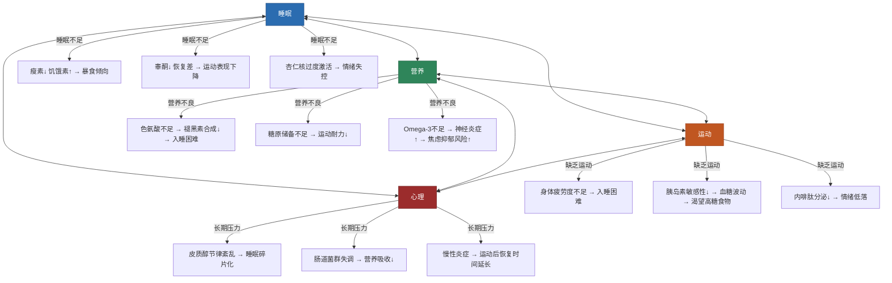
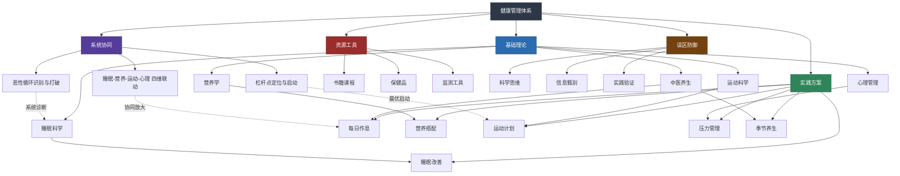

# 本章小结：健康养生全景复盘与行动指南

> 本章从"健康四大支柱"——睡眠、营养、运动、心理——出发，融合中医养生智慧与现代科学前沿，构建了一套从理论到实操、从入门到精通的完整健康管理体系。本小结的目的不是简单重复前文，而是：将碎片知识编织成网络、将分散方案整合为系统、将理论收获转化为行动。

---

## 一、知识体系全景回顾

### 1.1 基础理论层：认知框架

#### 睡眠科学

睡眠不是"关机"，而是大脑和身体执行关键维护任务的主动过程。本章从睡眠周期的微观结构出发，建立了以下认知：

- **睡眠周期机制**：一个完整的睡眠周期约90分钟，包含NREM（N1浅睡→N2轻睡→N3深睡）和REM快速眼动睡眠四个阶段，整夜循环4-6次。深度睡眠（N3）集中在前半夜，负责身体修复、生长激素分泌（占全天分泌量的70%以上）和免疫功能强化；REM睡眠集中在后半夜，主导记忆巩固、情绪调节和创造性思维。整夜睡眠中N3占比约15-20%、REM占比约20-25%，两者缺一不可。
- **昼夜节律**：人体的生物钟由下丘脑视交叉上核（SCN）调控，受光线、温度、进食时间等外部信号（Zeitgeber）影响。褪黑素在黑暗环境下分泌增加，皮质醇在凌晨4-6点开始上升（皮质醇觉醒反应，CAR）。光是最重要的授时因子——晨间接受10000勒克斯以上的自然光照30分钟，可以将生物钟相位前移1-2小时，是解决入睡困难最被低估的手段。
- **睡眠债务**：长期睡眠不足（每晚少于7小时）会导致认知功能下降（反应时间延长、决策质量降低）、免疫力降低（T细胞活性下降、炎症因子升高）、代谢紊乱（胰岛素敏感性降低、瘦素分泌减少）。威斯康星大学睡眠研究发现，连续两周每晚只睡6小时，认知表现等同于连续24小时不睡，但受试者自评的困倦感在第6天就趋于平稳——大脑"适应"了低睡眠状态，却并未真正恢复。周末补觉只能部分偿还睡眠债务，且会打乱生物钟产生"社交时差"（social jet lag），研究显示每小时的社交时差与肥胖风险增加33%相关。
- **个体差异**：DEC2基因突变携带者每天只需4-6小时睡眠即可正常运转，但这属于极少数人群（不到1%）。大多数人（99%以上）的最适睡眠时长在7-9小时之间。判断标准不是"睡了几个小时"，而是：白天无需咖啡因提神、10分钟内可以自然入睡、醒来后15分钟内完全清醒、日间注意力可以持续90分钟以上。

#### 营养学基础

营养学的核心不是"少吃"或"多吃"，而是"吃对"。本章建立的营养认知框架包括：

- **三大宏观营养素**：碳水化合物（每克4千卡，大脑首选燃料，占总热量45-65%）、蛋白质（每克4千卡，身体结构与功能的基石，每公斤体重0.8-1.6克，运动人群可提高到1.6-2.2克）、脂肪（每克9千卡，激素合成与脂溶性维生素吸收的关键，占总热量20-35%）。三者缺一不可，关键在于比例和质量。碳水的核心区别在于升糖指数（GI）和升糖负荷（GL）——燕麦（GI 55）和白米饭（GI 83）对血糖的影响截然不同。
- **微量营养素**：维生素和矿物质虽然需求量小，但参与体内几乎所有生化反应。"隐性饥饿"——热量充足但微量营养素不足——在现代加工饮食中非常普遍。中国疾病预防控制中心的调查显示，中国居民维生素D缺乏率高达86.7%、镁摄入不足率约60%、铁缺乏在育龄女性中占比约30%、维生素B12在素食人群中缺乏率超过50%。这四种微量营养素是需要优先关注的"高危缺口"。
- **膳食纤维与肠道菌群**：每日推荐摄入25-35克膳食纤维，但现代人平均只摄入15克左右。膳食纤维是肠道有益菌群的"食物"——肠道微生物发酵膳食纤维产生短链脂肪酸（丁酸、丙酸、乙酸），这些代谢产物维护肠道屏障完整性、调节免疫功能（肠道拥有全身70%的免疫细胞）、通过迷走神经和血液循环影响大脑功能。肠-脑轴（gut-brain axis）的研究正在重新定义我们对营养的认知：你吃的每一口食物，不仅喂养你自己，还在喂养你体内数万亿的微生物"居民"，它们的健康状态反过来影响你的情绪、认知甚至决策。
- **食物质量等级**：完整的天然食物（蔬菜、水果、全谷物、豆类、坚果）> 轻度加工食品（冷冻蔬菜、全麦面包、原味酸奶）> 加工食品（罐头、调味品、加工肉制品）> 超加工食品（含大量添加剂的包装食品、含糖饮料）。2019年发表在《BMJ》的一项涉及10万人的前瞻性研究显示，超加工食品摄入每增加10%，全因死亡率增加14%。优先选择前两类食物，是改善营养质量最简单的策略。
- **时间营养学（Chrononutrition）**：新兴研究表明，"什么时候吃"和"吃什么"同样重要。进食窗口与昼夜节律对齐（白天主要进食、夜间禁食）可以改善胰岛素敏感性、降低炎症标志物、优化睡眠质量。夜班工人的代谢综合征发病率比日班工人高40%，部分原因就是进食时间与生物钟错位。

#### 运动科学

运动的价值远超"减肥"。本章的运动科学部分建立了三个关键认知：

- **运动的系统性收益**：规律运动可降低心血管疾病风险35%、2型糖尿病风险40%、某些癌症风险20-30%、全因死亡率30%、抑郁症风险25%（2018年《柳叶刀·精神病学》荟萃分析）。这些数据来自大规模队列研究（如英国生物银行50万人队列），具有高度可信度。运动对大脑的保护作用同样显著——规律有氧运动可使海马体体积增加2%（逆转1-2年的年龄相关萎缩），改善工作记忆和执行功能。
- **运动类型与功能**：有氧运动（跑步、游泳、骑车）提升心肺功能（最大摄氧量VO₂max是全因死亡率最强的预测因子之一）和脂肪代谢能力；抗阻训练（举重、自重训练）增加肌肉量（每增加1公斤肌肉，基础代谢率提高约50千卡/天）、骨密度（刺激成骨细胞活性，预防骨质疏松）和胰岛素敏感性；柔韧性训练（瑜伽、拉伸、PNF拉伸）改善关节活动度、降低运动损伤风险、缓解慢性疼痛。三者不可偏废，缺任何一项都会导致功能性代偿。
- **运动剂量-反应关系**：WHO推荐每周150分钟中等强度有氧运动或75分钟高强度有氧运动，加上每周2次以上的力量训练。但"有运动总比没有好"——哈佛大学公共卫生学院的研究显示，每天哪怕11分钟（每周75分钟）中等强度运动就能降低23%的全因死亡率。超过每周500分钟高强度运动则可能增加心血管风险——存在"运动过度"问题，表现为静息心率升高、运动表现下降、反复感染、情绪低落和睡眠质量变差。
- **运动时机与体温节律**：上午运动（6:00-10:00）有利于提升日间警觉性和改善夜间睡眠质量（相位前移效应）；下午至傍晚运动（15:00-19:00）核心体温最高、肌肉灵活性最好、反应速度最快，适合高强度训练和比赛；睡前2小时内避免高强度运动（核心体温过高会延迟入睡），但轻度瑜伽和拉伸可以促进放松。

#### 心理与压力管理

心理健康不是"可选配置"，而是健康的底层操作系统。本章的核心观点：

- **压力的双面性**：适度压力（良性压力eustress）通过适度升高的皮质醇和去甲肾上腺素提升注意力和表现（倒U型曲线/Yerkes-Dodson定律）；慢性压力（恶性压力distress）导致HPA轴持续激活、皮质醇长期升高，引发免疫抑制（糖皮质激素抑制T细胞和NK细胞活性）、腹部脂肪堆积（皮质醇促进内脏脂肪合成）、海马体萎缩（长期高皮质醇导致神经元凋亡，影响记忆和学习）、肠道通透性增加（"肠漏"）。
- **压力管理的四层模型**：第一层——消除压力源（调整工作量、断舍离无效社交、学会说"不"）；第二层——改变对压力的认知（认知重评，将"威胁"重新定义为"挑战"，斯坦福心理学家Alia Crum的研究表明，将压力反应视为"身体正在调动资源应对挑战"可以显著改善心血管指标）；第三层——生理调节（深呼吸、渐进式肌肉放松、运动——运动是最强效的抗焦虑干预，一次30分钟中等强度运动的抗焦虑效果相当于低剂量苯二氮卓类药物）；第四层——情绪释放（倾诉、书写表达性写作、艺术表达——James Pennebaker的经典研究显示，每天15分钟的情感书写连续4天可以改善免疫功能指标）。
- **正念冥想的神经科学证据**：8周正念减压课程（MBSR）可使杏仁核（恐惧和焦虑中枢）灰质密度降低，前额叶皮层（理性决策和情绪调节区域）灰质密度增加，两者之间的功能连接增强——这意味着"理性脑"对"情绪脑"的调控能力提高了。每天10-20分钟的正念练习就能在4-8周内观察到可测量的脑结构变化。哈佛大学Sara Lazar团队的纵向研究显示，长期冥想者的端粒酶活性比对照组高30%，暗示冥想可能延缓细胞衰老。

#### 中医养生智慧

中医养生的价值在于提供了一套"个性化健康管理系统"的框架，与现代精准医学的理念高度一致：

- **核心理念**：整体观念（人是一个有机整体，局部问题需要全局审视——"头痛医脚"在系统医学中有其合理性）、辨证论治（同病异治、异病同治，因人而异——这与现代药物基因组学强调的"个体化用药"理念相通）、治未病（上医治未病，预防优先于治疗——世界卫生组织提出的"预防医学三级体系"与中医治未病思想不谋而合）。
- **体质辨识**：王琦九种体质分类法（平和质、气虚质、阳虚质、阴虚质、痰湿质、湿热质、血瘀质、气郁质、特禀质）是中医个性化养生的基础工具。每种体质有不同的生理特征、易患疾病倾向、饮食宜忌、运动偏好和季节调理重点。例如：痰湿质（体胖、痰多、舌苔厚腻）需要减少油腻甜食、增加有氧运动、避免久坐潮湿环境，其代谢综合征风险是平和质的2.3倍。体质并非固定不变——通过持续的生活方式调整，偏颇体质可以向平和质转化。
- **四季养生**：春养肝（升发阳气，多吃绿色蔬菜，适当户外踏青以顺应春生之气）、夏养心（清热祛湿，适当苦味食物，避免过度贪凉——空调温度不宜低于26℃）、秋养肺（滋阴润燥，白色食物为主——银耳、百合、梨，避免辛辣燥热之品）、冬养肾（温补收藏，黑色食物为主——黑芝麻、黑豆、黑米，适当减少剧烈运动，早卧晚起顺应冬藏之气）。顺应自然节律调整生活方式，是中医养生的核心方法论，也与现代时间生物学（chronobiology）的研究结论高度一致。

### 1.2 实践方案层：从理论到行动

理论的价值在于指导实践。本章的"具体方案"板块将上述理论转化为可执行的日常操作：

#### 每日健康作息方案

基于昼夜节律科学和中医时辰养生理论，设计了一套完整的日间流程：

- **晨间（6:00-8:00）**：自然醒后5分钟内接受阳光照射（抑制褪黑素分泌，校准生物钟——阴天户外光照强度约10000勒克斯，远超室内照明的300-500勒克斯）→ 温水一杯（补充夜间约450ml的无感水分流失）→ 10分钟轻度拉伸或散步（激活交感神经，提升核心体温）→ 营养早餐（蛋白质+复合碳水+健康脂肪的组合，例如：鸡蛋+全麦面包+牛油果，或希腊酸奶+燕麦+坚果+蓝莓）。
- **日间（8:00-18:00）**：每工作90分钟进行5-10分钟活动（符合人体注意力的"超日节律"——ultradian rhythm，90分钟是一个完整的注意力周期）→ 午餐遵循"餐盘法则"（1/2蔬菜、1/4蛋白质、1/4全谷物）→ 午后小憩10-20分钟（NASA研究显示26分钟午睡可提升34%的工作表现和54%的警觉度；不超过30分钟避免进入深度睡眠后醒来产生睡眠惯性）→ 下午3-4点进行中高强度运动（体温峰值，肌肉力量和柔韧性达到全天最佳状态）。
- **晚间（18:00-22:00）**：晚餐清淡，至少在睡前3小时完成（胃排空固体食物通常需要3-5小时，过晚进食影响睡眠质量）→ 21:00后减少蓝光暴露（使用f.lux或系统夜间模式，蓝光（460-480nm）对褪黑素的抑制作用是同等亮度绿光的3倍）→ 睡前1小时进行放松活动（阅读纸质书、冥想、温水泡脚——水温40-42℃泡脚15分钟可使入睡潜伏期缩短约10分钟）→ 固定时间上床，卧室温度控制在18-22℃（核心体温下降1-1.5℃是入睡的必要生理信号，偏凉的环境有利于这一过程）。

#### 营养搭配方案

不是一份固定食谱，而是一套"食材选择+搭配原则+灵活组合"的决策框架：

- **食材彩虹原则**：每天摄入至少5种颜色的蔬果（红-番茄红素，抗氧化、保护前列腺；橙-β-胡萝卜素，转化为维生素A，保护视力和皮肤；绿-叶绿素和叶酸，支持造血和DNA合成；紫/蓝-花青素，强效抗氧化、保护心血管；白-大蒜素和萝卜硫素，抗炎、支持解毒酶活性），不同颜色代表不同的植物化学物质。目标：每天30种不同植物性食物（包括蔬菜、水果、全谷物、豆类、坚果、种子、香料——来自美国肠道项目American Gut Project的研究，每周摄入30种以上植物的人群肠道菌群多样性显著高于摄入10种以下的人群）。
- **蛋白质来源轮换**：深海鱼虾（周一/四，富含Omega-3——EPA和DHA，推荐三文鱼、沙丁鱼、鲭鱼等小型鱼，重金属蓄积风险低）→ 禽肉（周二/五，鸡胸肉/火鸡肉，高蛋白低脂肪）→ 豆制品（周三/六，豆腐/毛豆/鹰嘴豆，同时提供膳食纤维和异黄酮）→ 蛋奶（周日，鸡蛋是最完美的天然蛋白质来源之一，蛋黄富含胆碱——对大脑发育和记忆功能至关重要的营养素），避免单一来源导致的营养偏倚或重金属/抗生素累积。
- **进食顺序优化**：先吃蔬菜和蛋白质（膳食纤维和蛋白质减缓胃排空速度，延缓碳水化合物的消化吸收）→ 再吃碳水化合物 → 最后喝汤。2015年发表在《Diabetes Care》的随机交叉试验显示，这种进食顺序可使餐后血糖峰值降低30-40%，胰岛素曲线下面积降低约25%。对于糖尿病前期人群，仅改变进食顺序就能带来显著的代谢改善——零成本、零副作用的干预手段。
- **水分管理**：每日推荐饮水量约2000-2500ml（含食物中的水分约700ml，实际需要额外饮用约1500ml）。简单的判断标准：尿液颜色应为淡黄色——深黄色提示缺水，完全透明则可能饮水过量（稀释性低钠血症风险）。餐前30分钟饮水200ml可以增加饱腹感、改善消化液分泌。

#### 运动计划

根据体能水平分为三个阶段，每个阶段都有明确的频率、强度和时长标准：

- **入门期（1-4周）**：每周3次，每次20-30分钟低强度有氧（快走、游泳、骑固定自行车），心率维持在最大心率（220-年龄）的50-60%。目标是建立运动习惯——此时"坚持"比"效果"更重要。使用"习惯堆叠"策略：在已有习惯后附加运动，例如"每天下班回家后换上运动鞋出门走20分钟"。
- **适应期（5-12周）**：每周4次，有氧和力量训练交替。有氧30-40分钟，心率60-70%；力量训练以复合动作为主（深蹲、硬拉、俯卧撑、划船、肩推），每个动作3组×8-12次，组间休息60-90秒。复合动作同时激活多个肌群，单位时间训练效率最高。此阶段建议至少跟练2-3次专业教练课程或学习标准动作视频，避免代偿性动作导致关节损伤。
- **进阶期（13周以后）**：每周5次，加入高强度间歇训练（HIIT，例如30秒全力冲刺+90秒恢复，重复6-8组），力量训练分化化（推/拉/腿分化或上/下半身分化），开始关注运动表现指标（配速、最大重量、柔韧度）。每4-6周调整一次训练变量（重量、组数、动作选择），避免身体适应导致进步停滞。

#### 睡眠改善方案

从环境、行为、认知三个维度入手：

- **环境优化**：卧室温度18-22℃（偏凉有利于核心体温下降触发睡意）→ 完全遮光（即使微弱的光线（<5勒克斯）也会抑制褪黑素分泌——来自哈佛医学院的研究显示，100勒克斯的光线可使褪黑素分泌延迟约90分钟）→ 白噪音或粉噪音掩盖突发噪音（维持稳定的声学环境，降低微觉醒次数）→ 寝具根据睡姿选择（侧睡需要更厚的枕头以保持颈椎中立位，仰睡需要较低较薄的枕头）。
- **行为干预**：固定起床时间（比固定入睡时间更重要——起床时间是锚定生物钟最有效的时间信号）→ 睡前90分钟停止进食 → 下午2点后避免咖啡因（咖啡因半衰期5-6小时，意味着下午3点喝的一杯咖啡到晚上9点体内仍有一半的咖啡因在发挥作用；对咖啡因代谢慢的人群（CYP1A2基因慢代谢型），半衰期可长达9-10小时）→ 限制白天小睡在20分钟以内（超过30分钟容易进入N3深睡期，醒后出现睡眠惯性——迟钝、迷糊、认知能力暂时下降）。
- **认知行为疗法（CBT-I）**：是治疗慢性失眠的**一线推荐方案**（美国医师学会ACP、欧洲睡眠研究学会ESRS均推荐），效果优于安眠药且无副作用，且效果更持久。核心技术包括：睡眠限制（压缩在床时间至实际睡眠时长，提高睡眠效率至85%以上，例如实际只睡5.5小时，则将卧床时间限制为6小时）→ 刺激控制（床只用于睡觉和性生活，不在床上看手机、看电视、工作——建立"床=睡眠"的条件反射）→ 认知重构（消除对失眠的灾难化思维——"一晚没睡好明天就完了"→"一晚少睡的影响第二天就能恢复，不会造成持久伤害"）。

#### 压力管理方案

提供了一套从即时缓解到长期建设的完整工具箱：

- **即时工具（1-5分钟）**：4-7-8呼吸法（吸气4秒→屏息7秒→呼气8秒，重复4个循环——呼气时间长于吸气直接激活迷走神经，将自主神经系统从交感"战斗或逃跑"模式切换到副交感"休息和消化"模式）→ 5-4-3-2-1感官着陆技术（说出5个看到的+4个听到的+3个触到的+2个闻到的+1个尝到的，将注意力从焦虑反刍中拉回当下感官体验）→ 冷水刺激（用冰水浸没双手30秒或用冷水冲洗面部——触发"潜水反射"（dive reflex），心率可在30秒内降低10-25%）。
- **日常工具（15-30分钟）**：正念冥想（关注呼吸，不评判飘走的思绪——初学者推荐从"呼吸锚定法"开始，关注鼻尖的气流或腹部的起伏）→ 渐进式肌肉放松（PMR，从脚到头依次紧绷5秒→放松15秒各肌肉群，通过对比"紧张"和"放松"的感觉来深度释放肌肉中的无意识紧张）→ 表达性书写（每天15分钟，将焦虑和困扰写下来——James Pennebaker的大量研究表明，情感书写可以减少反刍思维、改善免疫功能、降低就医频率）。
- **长期建设**：建立社交支持网络（拥有3-5个可以倾诉的亲密关系——哈佛成人发展研究追踪75年发现，亲密关系的质量是健康和幸福最强的预测因子，甚至超过胆固醇水平）→ 培养"心流"活动（绘画、乐器、编程、园艺等完全沉浸的爱好——米哈里·契克森米哈赖的研究显示，心流状态可以"重置"压力反应系统）→ 定期心理咨询（不是"有病才去"，而是心理保健的常规手段——认知行为疗法、接纳承诺疗法等循证疗法在处理日常压力和情绪管理方面有明确效果）。

### 1.3 产品推荐层：工具与资源

本章推荐的所有产品和资源遵循三个筛选标准：有科学依据支撑、实际使用反馈良好、性价比合理。

#### 核心书籍矩阵

| 领域 | 入门（零基础可读） | 进阶（有一定基础后） | 专业（深入研究用） |
|------|------|------|------|
| 睡眠 | 《睡眠革命》——R90周期法实操性强 | 《我们为什么要睡觉》——Matthew Walker的全面科普 | 《睡眠医学》——临床教材，系统严谨 |
| 营养 | 《中国居民膳食指南》——官方标准，接地气 | 《范志红：吃出健康好身材》——中国营养学家的实操指南 | 《营养学——概念与争论》——大学教材，深度与广度兼备 |
| 运动 | 《运动改造大脑》——揭示运动对大脑的深远影响 | 《拉伸：最好的运动》——全身拉伸动作图解 | 《运动生理学》——运动科学的理论基础 |
| 中医 | 《养生先养心》——中医养生入门读物 | 《黄帝内经》（白话版）——中医理论源头 | 《中医基础理论》——系统学习中医必读 |
| 心理 | 《当下的力量》——正念与当下觉察的入门之作 | 《情绪急救》——实用的心理自我疗愈工具 | 《认知行为疗法》——循证心理治疗的专业方法 |

#### 保健品分层推荐

保健品不是"越多越好"，而是按必要性分三层：

- **第一层——普遍推荐**：维生素D3（中国人80%以上缺乏，每日1000-2000 IU，建议先检测25(OH)D血清水平，目标值30-50ng/mL）→ Omega-3鱼油（EPA+DHA总量≥1000mg/天，选择IFOS五星认证产品，EPA偏重抗炎和心血管保护，DHA偏重大脑和视网膜功能）→ 镁（甘氨酸镁或苏糖酸镁形式吸收率更高，每日200-400mg，睡前服用还有助于改善睡眠质量——镁参与GABA受体的调节）。
- **第二层——针对性补充**：益生菌（选择多菌株、100亿CFU以上的产品，需持续服用4周以上才能建立菌群优势——注意活菌需要冷链保存，到达肠道的活菌数才是有效剂量）→ 辅酶Q10（35岁以上或服用他汀类药物者推荐，他汀类药物在抑制胆固醇合成的同时也抑制了辅酶Q10的合成）→ 叶黄素（长时间面对屏幕者保护黄斑区，每日10-20mg，搭配玉米黄质效果更佳——AREDS2研究证实了这一组合对黄斑保护的有效性）。
- **第三层——中医食补**：枸杞（每日10-15克，含玉米黄素和多糖，是天然的叶黄素来源）→ 黄芪（补气固表，适合气虚质人群，可泡水或煲汤）→ 三七粉（活血化瘀，每日3-5克，孕妇禁用、月经期间慎用）。

**重要提醒**：保健品属于食品范畴，不能替代药物治疗疾病。正在服药的人群在补充保健品前应咨询医生或药师——某些保健品可能与药物产生相互作用（例如鱼油可能增强抗凝药物的效果、圣约翰草会降低多种药物的血药浓度）。

#### 健康监测工具

不需要全部购买，根据个人健康管理重点选择：

- **基础三件套**：智能手表/手环（监测心率变异性HRV、睡眠阶段、活动量——HRV是评估自主神经系统平衡和恢复状态的最佳可穿戴指标）→ 体脂秤（关注体脂率而非单纯体重——同体重下肌肉和脂肪的体积相差约20%，BMI无法区分两者）→ 血压计（35岁以上或有家族史者必备，推荐上臂式电子血压计，准确度高于腕式）。
- **进阶工具**：食物秤（精确记录摄入量，配合薄荷健康等APP使用）→ 睡眠监测垫（非穿戴式，铺在床垫下方，不影响睡眠质量即可获取完整的睡眠分期数据）→ 血糖仪（有糖尿病风险者用于了解自身血糖反应模式——同一食物在不同人身上的血糖反应可能差异2-5倍，个体化测试比查GI表更精确）。

### 1.4 误区澄清层：避坑指南

本章"常见误区"板块系统梳理了15个广泛流传的错误观念，这里提炼最具代表性的10个，按危害程度排序：

| 序号 | 误区 | 真相 | 危害程度 |
|------|------|------|----------|
| 1 | 保健品可以替代药物治疗疾病 | 保健品是食品，不能治疗疾病，延误正规治疗可能致命 | ★★★★★ |
| 2 | 睡前喝酒助眠 | 酒精虽然缩短入睡时间，但严重抑制REM睡眠（降低40-50%），长期使用导致酒精依赖和更严重的失眠 | ★★★★☆ |
| 3 | 周末补觉能弥补工作日睡眠不足 | 只能部分偿还认知功能债务，且打乱生物钟产生"社交时差"，增加代谢综合征风险 | ★★★★☆ |
| 4 | 所有人适合同一种养生法 | 中医九种体质各有不同调理方案，基因差异也影响营养需求——个性化是有效养生的前提 | ★★★★☆ |
| 5 | 碳水化合物是减肥的敌人 | 关键是碳水的类型（复合vs精制）和总量，不是碳水本身——全谷物碳水与体重控制并不矛盾 | ★★★☆☆ |
| 6 | 运动时间越长效果越好 | 过度运动（>每周500分钟高强度）损害免疫功能、增加心血管风险，训练质量比时间重要 | ★★★☆☆ |
| 7 | 所有脂肪对健康都有害 | 不饱和脂肪（橄榄油、坚果、鱼油）是必需的，反式脂肪和过量饱和脂肪才是需要限制的 | ★★★☆☆ |
| 8 | 出汗越多减脂效果越好 | 出汗是体温调节机制，脂肪代谢的终产物84%通过呼吸（CO₂）排出，不是通过汗水 | ★★☆☆☆ |
| 9 | 每个人必须每天睡满8小时 | 个体差异大（7-9小时是正常范围），睡眠质量比时长更重要，评估标准是日间功能状态 | ★★☆☆☆ |
| 10 | 蛋白粉是健身的必需品 | 大多数人通过正常饮食即可满足蛋白质需求（每天1.2-1.6g/kg），仅高强度训练者或素食者可能需要额外补充 | ★★☆☆☆ |

避免误区的底层能力是**科学思维**：不迷信权威（区分"真专家"和"自封专家"）、关注信息来源（优先选择同行评审期刊发表的研究）、多方求证（单一研究不等于定论，荟萃分析和系统综述的证据等级更高）、以自身实践反馈为最终判断标准（"效果好不好，试了才知道"——但要排除安慰剂效应和自然恢复的干扰）。

---

## 二、四大支柱的协同关系：系统思维

### 2.1 为什么不能"单点优化"

健康四大支柱不是独立的模块，而是一个高度耦合的系统。理解它们之间的**协同关系**和**连锁反应**，是避免"头痛医头"式养生的关键。

### 2.2 典型的恶性循环与良性循环

**恶性循环示例**：

睡眠不足（每晚<6小时）→ 饥饿素（ghrelin）升高28%、瘦素（leptin）降低18% → 对高糖高脂食物的渴望增加 → 晚间暴食（尤其精制碳水）→ 血糖剧烈波动 → 夜间频繁觉醒 → 睡眠质量进一步下降 → 第二天精力不足 → 靠咖啡因和甜食维持 → 下午运动计划取消 → 夜间入睡困难……循环持续2-3周后，体重增加、情绪低落、工作效率下降三者同时出现。

**良性循环示例**：

固定起床时间+晨间光照 → 生物钟稳定 → 入睡时间自然前移 → 睡眠质量提升 → 早晨精力充沛 → 有动力进行晨间运动 → 运动后内啡肽和BDNF（脑源性神经营养因子）释放 → 日间情绪积极、食欲稳定 → 饮食选择更健康（高蛋白、高纤维）→ 肠道菌群改善 → 血清素合成增加（95%的血清素在肠道合成）→ 夜间睡眠质量进一步提升……循环持续3-4周后，体重、精力、情绪三者同步改善。

### 2.3 系统优化的杠杆点

不是所有改变都同等重要。从行为科学和系统动力学的角度看，存在几个"高杠杆"的启动点——改变它们能产生最大范围的连锁正向效应：

1. **固定起床时间**（杠杆系数最高）：起床时间是生物钟最强的锚定信号。一旦起床时间稳定，入睡时间、用餐时间、运动时间、精力曲线都会随之规律化。这是整个健康系统的"第一块多米诺骨牌"。
2. **增加蛋白质摄入**：将早餐蛋白质从5g提升到20-30g（2-3个鸡蛋或一勺蛋白粉），可以显著改善日间饱腹感、稳定血糖、减少下午的碳水渴望，同时为运动后的肌肉修复提供原料。
3. **每天10分钟快走**：运动量小到不需要意志力，但足以触发内啡肽释放、改善胰岛素敏感性、为夜间入睡积累足够的"睡眠压力"（腺苷累积）。
4. **睡前90分钟断屏**：减少蓝光暴露和信息刺激，让褪黑素正常分泌、让大脑从"接收模式"切换到"整理模式"。

这四个杠杆点的共同特征是：**启动门槛极低、不需要额外时间投入、可以立即开始、正面效应会自然扩散到其他领域**。

---

## 三、五大关键收获

### 收获一：健康是系统工程，不是单一指标

健康不是"不生病"那么简单。世界卫生组织的定义——"健康是身体、心理和社会适应的完好状态"——揭示了健康的多维本质。本章的知识体系正是围绕这个多维框架展开的。

从系统的角度看，四大支柱之间的关系不是简单的"加法"（各自独立贡献），而是"乘法"（协同放大效应）。一个睡眠良好、营养均衡、规律运动、情绪稳定的人，其健康水平不是四个"良好"相加，而是四者相乘——系统性健康远大于各部分之和。反过来说，任何一个子系统的严重失调都会通过连锁反应拖垮整个系统。

打破恶性循环的关键不是"在某一个点上使劲"，而是识别系统中的**关键杠杆点**，从最容易改变的环节入手，逐步建立良性循环。

### 收获二：预防的投入产出比远高于治疗

这是本章反复强调的核心理念，值得用数据说清楚：

- **慢性病预防**：80%的心脏病、中风和2型糖尿病，以及40%的癌症可以通过健康饮食、规律运动、不吸烟和适量饮酒来预防（WHO 2023年数据）。
- **经济账**：在中国，一次心脏支架手术费用约5-15万元，一次癌症治疗平均花费30-50万元，一次ICU住院费用日均1-3万元。而每年投入5000-10000元用于优质食材、运动装备和定期体检，长期来看是回报率最高的投资——ROI远超任何理财产品。
- **时间账**：治疗一个慢性病需要反复就医、长期服药、生活质量大幅下降。而预防性的生活方式调整——每天多睡1小时、每餐多吃一份蔬菜、每周运动3次——投入的时间微乎其微，但收益是数十年的高质量生活。
- **衰老科学**：端粒长度是衡量细胞衰老程度的生物标志物。2013年发表在《柳叶刀·肿瘤学》的研究表明，坚持健康生活方式的人群（健康饮食+规律运动+压力管理+良好社交），5年后端粒长度增加了约10%，相当于生物学年龄年轻5-8年。健康生活方式不只是"多活几年"，而是让每个年龄段都保持更高的功能水平。
- **健康寿命vs自然寿命**：比"活多久"更重要的是"健康地活多久"——健康寿命（healthspan）的概念正在取代单纯的生命长度。日本冲绳、意大利撒丁岛等"蓝区"（Blue Zone）的百岁老人，其共同特征不是基因优越，而是：自然运动（非健身房式运动）、植物为主的饮食、强烈的社区归属感、明确的人生目标（ikigai/plan de vida）。这些正是本章四大支柱的生活化表达。

### 收获三：个性化是有效养生的前提

"甲之蜜糖，乙之砒霜"在健康领域体现得尤为明显。以下维度决定了每个人需要不同的方案：

- **基因差异**：MTHFR基因变异影响叶酸代谢能力，约30%的中国人携带该变异（C677T位点），需要额外补充活性叶酸（5-MTHF）而非普通叶酸（合成叶酸在变异携带者体内无法被有效转化为活性形式）。LCT基因决定了乳糖耐受能力，北方汉族人群乳糖不耐受率高达80-90%——对他们来说，牛奶不是"优质蛋白来源"而是"腹泻触发器"，应选择酸奶、奶酪或植物奶替代。CYP1A2基因决定了咖啡因代谢速度，慢代谢型人群每天超过2杯咖啡就会增加心血管风险。
- **体质差异**：中医九种体质中，阳虚质（怕冷、手脚凉、舌淡苔白）适合温补食物（羊肉、生姜、桂圆）和艾灸（关元、命门穴）；阴虚质（口干、手心热、舌红少苔）适合滋阴食物（银耳、百合、石斛）和避免辛辣。用错方向会适得其反——阴虚质吃羊肉会加重虚火，阳虚质吃冷饮会加重寒湿。
- **年龄差异**：25岁关注运动能力和体态管理、建立终身运动习惯；35岁开始重视代谢下降（基础代谢率每10年降低2-3%）和慢性病预防、关注甲状腺功能和血脂；45岁加强骨密度维护（女性绝经后骨质流失速度加快3-5倍）和认知功能保护；55岁关注心脑血管健康和肌少症预防（30岁后每10年流失3-8%的肌肉量）。
- **生活方式差异**：久坐办公室的人需要侧重脊柱健康（胸椎灵活性训练、核心稳定性训练）和下肢力量训练（久坐导致臀肌失忆症——gluteal amnesia）；体力劳动者则需要关注关节保护（膝关节、腰椎）和恢复性训练（拉伸、泡沫轴放松）。

本章提供的不是"一刀切"的方案，而是一套**决策框架**——你需要先了解自己的体质、基因背景、生活方式和健康目标，然后从框架中选取最适合自己的组合。

### 收获四：科学素养是抵御健康骗局的护城河

健康领域是伪科学和商业骗局的重灾区——因为每个人都有健康焦虑，且愿意为"变健康"花钱。以下几条原则可以帮你识别90%以上的健康骗局：

- **警惕"奇迹疗法"**：如果一种方法声称能"治愈一切"、"立竿见影"、"无任何副作用"，基本可以断定是骗局。真正有效的健康干预都需要时间积累效果，且都有明确的适用范围和禁忌症。
- **追溯原始研究**：看到"研究表明XXX"时，追问五个问题——这个研究发表在哪里？（同行评审期刊还是自媒体？）样本量多大？（50人的研究和50000人的研究证据等级完全不同）是动物实验还是人体实验？（小鼠实验结果到人体应用的转化率不到5%）是谁资助的研究？（生产商资助的研究发表阳性结果的概率是独立研究的4倍）效应量有多大？（"统计显著"不等于"临床意义重大"——p值告诉你效果是不是真的，效应量告诉你效果大不大）。
- **区分相关性和因果性**：每天喝红酒的人更长寿——这可能是因为喝得起红酒的人经济条件更好、医疗资源更充足、社交生活更丰富，而不是红酒中的白藜芦醇在起作用。这就是著名的"法国悖论"中的混杂因素。只有随机对照试验（RCT）才能建立因果关系，观察性研究只能发现关联。
- **了解商业利益链**：某"专家"推荐的保健品，其背后是否有商业合作关系？某"研究"的资助方是否是相关产品的生产商？利益冲突（conflict of interest）是评估信息可信度的重要因素。PubMed上搜索作者名字+公司名称，或查看论文末尾的利益冲突声明，是基本的"信息溯源"动作。
- **证据金字塔**：从低到高——个人轶事 < 病例报告 < 队列研究 < 病例对照研究 < 随机对照试验（RCT） < 系统综述和荟萃分析（Meta-analysis）。做健康决策时，尽量参考金字塔上层的证据来源。

### 收获五：可持续性比完美执行更重要

健康管理的最大敌人不是"不知道"，而是"知道但做不到"。行为科学的研究给出了以下关键洞见：

- **习惯形成的平均周期是66天**（伦敦大学学院Phillippa Lally团队2009年研究），不是广为流传的"21天"。实际范围是18-254天，取决于行为的复杂程度——简单的习惯（如"每天喝一杯水"）可能18天就能自动化，复杂的习惯（如"每天晨跑5公里"）可能需要200天以上。给自己足够的时间和耐心。
- **"两分钟规则"**（来自James Clear《原子习惯》）：任何新习惯都先从两分钟版本开始。想建立运动习惯？先从每天穿上运动鞋走出家门开始——只需要两分钟。想改善饮食？先从每天多吃一种蔬菜开始——只需要多买一样东西。降低启动门槛比追求完美执行更重要——习惯的"频率"比"强度"更能决定它能否持续。
- **身份认同驱动行为改变**：不是"我要减肥"（目标导向——容易在达到目标后反弹），而是"我是一个注重健康的人"（身份导向——每一个健康选择都是在为这个身份"投票"）。当行为与自我身份一致时，坚持变得自然而然——不是"我不得不运动"，而是"运动就是我会做的事"。
- **"不要连续错过两次"**（来自James Clear）：偶尔一天没运动、偶尔一顿吃了垃圾食品，完全没关系。关键是不要连续错过两次——第一次是意外，第二次是新习惯的开始。这比追求100%的完美执行率更现实，也更有效——完美主义者一旦"破功"就彻底放弃（"全有或全无"思维），而弹性主义者能从失误中迅速恢复。
- **环境设计>意志力**：把运动鞋放在门口、把水果放在桌面可见处、把手机充电器放在卧室外面——改变环境比动用意志力有效10倍。MIT行为经济学家Dan Ariely的研究表明，人类90%的日常决策是由环境线索自动触发的，而非理性思考的结果。

---

## 四、自我评估框架

### 4.1 健康基线评估清单

在制定行动计划之前，先用以下清单评估你当前的健康状态。每个维度1-5分（1=非常差，5=优秀）：

| 维度 | 评估指标 | 1分（非常差） | 3分（一般） | 5分（优秀） | 你的得分 |
|------|----------|--------------|------------|------------|---------|
| 睡眠 | 入睡时间、睡眠时长、日间精神 | 经常失眠或每晚<5小时 | 偶尔失眠，每晚6-7小时 | 15分钟内入睡，每晚7-9小时，白天精神饱满 | ___ |
| 营养 | 蔬果摄入、烹饪频率、饮食规律 | 几乎不吃蔬果，以外卖为主 | 偶尔做饭，蔬果摄入不足 | 每天5种以上蔬果，自己烹饪为主，进食规律 | ___ |
| 运动 | 频率、时长、类型多样性 | 几乎不运动 | 每周1-2次，以有氧为主 | 每周4-5次，有氧+力量+柔韧兼顾 | ___ |
| 心理 | 压力水平、情绪稳定性、社交关系 | 长期焦虑/抑郁，社交孤立 | 偶尔感到压力，有少量社交 | 情绪稳定，有3-5个亲密关系，有压力管理技能 | ___ |
| 习惯 | 作息规律、烟酒、定期体检 | 作息混乱，吸烟或酗酒 | 作息基本规律，偶尔饮酒 | 作息严格规律，不吸烟，每年体检 | ___ |

**总分解读**：
- **20-25分**：你的健康基础扎实，本章的进阶内容（中医体质调理、时间营养学、HRV训练等）可以帮助你进一步优化。
- **13-19分**：你的健康处于"及格线"水平，重点改善得分最低的1-2个维度，参照本章"行动路线图"逐步提升。
- **5-12分**：你的健康亮了红灯，建议从"立即行动"中的第一条（固定起床时间）开始，同步安排一次全面体检。

### 4.2 识别你的"第一块多米诺骨牌"

每个人健康系统中最薄弱的环节不同。找到你的**最高杠杆点**——改善它能带动最多其他维度正向变化的那个点：

- 如果你**睡眠质量差**（入睡困难、频繁醒来、白天困倦）→ 优先优化睡眠。睡眠是所有健康行为的基石——睡不好，其他改善都事倍功半。
- 如果你**几乎不运动**（每天久坐>8小时、很少出汗）→ 优先加入运动。哪怕每天10分钟快走，也能启动正向循环。
- 如果你**饮食严重依赖外卖和加工食品**→ 优先改善营养。从"每周做3次饭"开始，不需要一步到位。
- 如果你**长期处于高压状态**（焦虑、失眠、情绪波动大）→ 优先学习压力管理。4-7-8呼吸法和每天5分钟正念冥想是零成本起步。

---

## 五、行动路线图

### 5.1 立即行动（本周内）

不需要等到"准备好了"再开始。以下5件事可以在本周完成，零门槛，但会产生实际的健康收益：

1. **固定起床时间**：选择一个每天（包括周末）都能执行的起床时间，设好闹钟。固定起床时间比固定入睡时间更能有效校准生物钟——即使昨晚睡晚了，今天也在固定时间起床，通过晨间光照帮助生物钟复位。
2. **做一次自我健康评估**：用上面的"健康基线评估清单"给自己打分，记录当前的睡眠时长和质量、每日饮水量、每周运动次数和时长、压力水平（1-10分）。这是你健康改善的"起点坐标"——没有基线数据，就无法衡量进步。
3. **采购一次彩虹餐**：下一次买菜时，刻意选择红、橙、绿、紫、白五种颜色的蔬果。不需要改变整个饮食结构，只需要增加颜色种类。从一道"彩虹沙拉"开始。
4. **进行一次10分钟快走**：不需要运动装备，不需要换衣服，午休时间出门走10分钟。感受运动后大脑清醒度的变化——BDNF（脑源性神经营养因子）在运动后15分钟内即可在大脑中检测到浓度升高。
5. **设置一个"数字日落"闹钟**：在睡前90分钟设置闹钟提醒。到时间后放下手机，改用阅读纸质书、听播客或进行5分钟正念呼吸来度过睡前时光。

### 5.2 短期计划（1-3个月）

这三个月的目标是建立基本的健康习惯框架，不追求完美，追求"有"：

- **睡眠**：固定作息时间（误差不超过30分钟），卧室环境优化（遮光窗帘、适宜温度、白噪音机），建立睡前仪式（固定的放松活动序列——例如：温水泡脚→阅读15分钟→4-7-8呼吸→关灯）。
- **营养**：学会使用"餐盘法则"（1/2蔬菜、1/4蛋白质、1/4全谷物），每周至少做3次自己烹饪的饭菜，记录饮食日记2周以了解自己的饮食模式和营养缺口。
- **运动**：每周3次、每次20-30分钟的中低强度运动（快走、游泳、骑车均可），开始接触力量训练的基础动作（深蹲、俯卧撑的简化版本——如箱式深跪、墙壁俯卧撑）。
- **心理**：学习并练习4-7-8呼吸法，开始每天5分钟的正念冥想（使用潮汐、小睡眠、Headspace等APP引导）。
- **体检**：完成一次基础体检，了解自身健康基线数据（血压、血糖、血脂、肝肾功能、甲状腺功能、维生素D水平）。

**里程碑检查点**（3个月末）：
- [ ] 能够15分钟内自然入睡
- [ ] 每周自己做饭≥3次
- [ ] 每周运动≥3次，无明显不适
- [ ] 能熟练使用4-7-8呼吸法应对突发压力
- [ ] 拥有完整的健康基线数据

### 5.3 中期目标（3-6个月）

在习惯基本稳固后，开始精细化调整和深入学习：

- **个性化调整**：完成中医体质测试问卷（可在线搜索"中医体质量表"），根据体质辨识结果调整饮食和运动方案。阳虚质增加温补食物（羊肉、生姜、核桃），痰湿质减少油腻和甜食、增加薏米和冬瓜。
- **运动进阶**：引入力量训练（每周2次），学习复合动作的标准姿势（建议初期请教练或跟练可靠的教学视频）。有氧运动提升到中等强度（心率60-70%最大心率），每周累计150分钟。
- **深度学习**：选择一个最感兴趣的专题（睡眠/营养/运动/中医/心理），系统阅读2-3本推荐书籍，完成该领域的"从入门到进阶"学习。
- **健康档案**：建立电子健康档案，记录每次体检数据、体重/体脂变化趋势、运动表现指标（配速、重量、柔韧度）、睡眠数据（如果有监测设备）。
- **补剂优化**：根据体检结果，针对性补充第一层保健品（维生素D3、Omega-3、镁），4-6周后评估主观感受变化。

**里程碑检查点**（6个月末）：
- [ ] 了解自己的中医体质类型并相应调整了饮食方案
- [ ] 能够完成标准深蹲、俯卧撑、硬拉动作
- [ ] 在一个专题领域完成了系统学习（能向他人解释核心概念）
- [ ] 拥有3个月以上的连续健康数据记录

### 5.4 长期愿景（6-12个月）

到这个阶段，健康习惯应该已经内化为生活方式的一部分：

- **全面健康管理体系**：建立了覆盖睡眠、营养、运动、心理、定期体检的完整管理系统。不需要刻意"坚持"，因为已经成为习惯——就像刷牙一样自然。
- **知识体系化**：对健康养生的理论框架有系统性理解，能够独立判断新的健康信息的可信度，不再容易被伪科学和营销话术误导。
- **辐射影响**：开始将所学知识应用于家人和朋友的健康管理建议中。你不需要成为专家，但可以成为身边人最可靠的"健康信息过滤器"。
- **持续优化**：健康管理不是一劳永逸的。随着年龄增长、生活环境变化、新的科学证据出现，方案需要持续调整。保持学习的习惯，每年回顾和更新一次健康管理体系。每年的年度体检不只是"做个检查"，而是一次全面的健康系统"升级"机会。

---

## 六、学习路径总览

本章"学习路径"板块提供了从入门到精通的四级路线，这里用一张总览表概括：

| 阶段 | 时间 | 学习重点 | 每周投入 | 核心产出 |
|------|------|----------|----------|----------|
| 入门期 | 1-3月 | 健康基础认知、自我评估、基础习惯建立 | 2-3小时 | 个人健康档案、基本作息规律、健康基线数据 |
| 基础期 | 4-6月 | 睡眠/营养/运动/心理系统学习 | 3-4小时 | 各领域知识框架、系统运动计划、饮食决策能力 |
| 进阶期 | 7-12月 | 中医养生、专项技能、健康信息素养 | 4-5小时 | 个性化养生方案、穴位/食疗技能、独立判断信息真伪 |
| 高级期 | 13-24月 | 健康科学前沿、综合管理、健康领导力 | 5-6小时 | 系统知识体系、指导他人能力、持续自我优化能力 |

每个阶段的学习方法遵循"理论学习→自我评估→方案制定→实践验证→反思调整"的闭环。不要跳跃阶段，也不要停留在舒适区——"刚好超出当前水平的挑战"是成长最快的学习区间（维果茨基"最近发展区"理论）。

**五大专题的建议学习顺序**：

1. **睡眠优化**（第一个学习）：睡眠是所有健康行为的基石。睡不好，运动没有精力、饮食难以自控、情绪容易崩溃。先解决睡眠问题，其他改善会事半功倍。预期改善周期：2-4周即可见到明显效果。
2. **营养管理**（第二个学习）：饮食是每天都要做的决策，改善饮食不需要额外时间投入，只需要改变选择。投入产出比极高。预期改善周期：1-2周（精力和消化改善）、4-8周（体重和指标改善）。
3. **运动健身**（第三个学习）：在睡眠和饮食改善的基础上，加入运动。此时身体已经有了更好的能量基础和恢复能力。预期改善周期：4-6周（体能提升）、12周以上（体型变化）。
4. **心理管理**（贯穿始终）：压力管理不是独立的模块，而是需要融入每一个健康行为中。但从第四个阶段开始系统学习，是因为此时你已经有了足够的自我觉察能力。预期改善周期：4-8周（情绪调节能力提升）、12周以上（认知模式改变）。
5. **中医养生**（第五个学习）：中医养生需要一定的身体感知能力和理论基础，在前面四个领域有一定实践后，学习中医养生会更有体感和深度。预期改善周期：因人而异，通常3-6个月可以感受到体质的可测量变化。

---

## 七、常见障碍与应对策略

知道"做什么"只是第一步，"做不到"才是真正的挑战。以下是最常见的五种健康行动障碍及其具体应对策略：

### 障碍一：没有时间

**真相**：不是"没有时间"，而是"没有把健康列为优先级"。每天刷手机的平均时间是3.5小时（QuestMobile 2024年数据），而本章推荐的基础健康习惯每天只需额外投入45-60分钟。

**应对策略**：
- 用"习惯堆叠"替代"额外安排时间"——在已有习惯中嵌入健康行为：通勤路上快走15分钟（替代坐一站公交）、午餐后散步10分钟（替代刷手机）、睡前阅读替代睡前刷短视频。
- 使用"时间审计"——记录3天的时间使用情况，找出至少30分钟的"低价值时间"（无意识刷手机、反复犹豫、无效社交），将其转化为健康行动时间。

### 障碍二：缺乏动力/坚持不下去

**真相**：动力是不可靠的——它会在天气不好、工作忙碌、心情低落时消失。依赖动力的人永远在"明天开始"。

**应对策略**：
- 依赖系统而非动力——提前一天晚上把运动服放在床头、在日历上标注运动时间、与朋友约定同行。减少启动阻力比增强动力更有效。
- 使用"承诺装置"（commitment device）——提前预付健身房月卡、与朋友打赌（输了请对方吃饭）、使用StickK等承诺类APP。
- 追踪连胜天数（streak）——每天完成目标后在日历上画X，"不打破连胜"本身成为动力来源（Seinfeld的"不要断链"策略）。

### 障碍三：看不到效果/效果太慢

**真相**：健康改善的效果是"非线性"的——前期投入多、回报少，突破临界点后效果加速显现。大多数人在"突破前夜"放弃了。

**应对策略**：
- 关注"过程指标"而非"结果指标"——不要每天称体重（结果指标波动大、反馈慢），而是追踪"本周运动了几次"、"今晚几点上床"、"今天吃了几种蔬果"（过程指标完全在你控制范围内）。
- 建立"小胜利"清单——每周回顾时记录3个小进步（例如：周三没喝奶茶、周五11点前上床、周末做了一次饭），即使体重没变，行为层面的进步本身就是值得庆祝的成就。
- 设定"最低执行标准"——状态好的时候做完整版（运动30分钟），状态差的时候做最低版（穿上运动鞋出门走5分钟）。最低标准保证你"不断链"，而"开始了就会做更多"是行为心理学的可靠规律。

### 障碍四：信息矛盾/不知道该信谁

**真相**：健康领域确实存在大量相互矛盾的信息，但这不是"放弃学习"的理由。

**应对策略**：
- 建立"信息过滤层级"——第一层过滤：排除所有"震惊体"标题和没有来源的信息；第二层过滤：只信任发表在同行评审期刊上的研究或权威机构（WHO、中国营养学会、美国心脏协会等）的官方指南；第三层过滤：优先参考系统综述和荟萃分析（证据等级最高）。
- 遇到矛盾信息时的决策流程：查原始研究→看样本量和研究设计→检查是否有后续验证研究→如果仍有疑问，选择"保守方案"（风险最低的那个选项）。
- 记住"科学的默认状态是不确定性"——科学不是给你确定答案的机器，而是不断修正认知的方法。接受"目前最合理的答案"而不是"绝对真理"。

### 障碍五：家庭/社交环境不支持

**真相**：你的环境会深刻影响你的行为——如果家人吃外卖、朋友聚餐都是高热量食物、同事下午茶是奶茶甜点，坚持健康习惯确实更难。

**应对策略**：
- 不要说教，用行动影响——当你持续3个月精力充沛、体型改善后，身边的人会主动问你"怎么做到的"。
- 在社交场合灵活变通——聚餐时选择相对健康的选项（清蒸鱼而非红烧肉），不必成为"不合群的健康怪人"。
- 寻找"健康同盟"——加入运动社群、健康饮食打卡群，或者培养一个同样关注健康的伙伴。社会支持是行为改变最强的预测因子之一。

---

## 八、核心知识图谱

下图展示了本章知识体系的内在逻辑关系，帮助读者建立系统认知而非碎片化记忆：

---

## 九、写在最后

### 健康投资的复利效应

健康习惯的价值不是线性的，而是指数级的。用具体数字说明：

- 每天早睡1小时 → 一年多365小时优质睡眠 → 5年后，你的认知功能和情绪稳定性将显著优于同龄晚睡者
- 每天多吃一份蔬菜 → 一年多吃365份 → 10年后你的肠道菌群多样性将远超同龄人，免疫功能更强大
- 每周运动3次，每次30分钟 → 一年累计运动78小时 → 20年后你的骨密度、肌肉量和心肺功能将保持在比实际年龄年轻10-15岁的水平

这就是健康投资的**复利效应**——每一点微小的改善，经过时间的积累，都会产生巨大的差距。复利的特点是：早期差距很小，小到你可能怀疑"这些努力值不值得"；但随着时间推移，差距会以指数级扩大——5年、10年、20年后，坚持健康习惯的人和不坚持的人，其生活质量的差距会大到不可思议。

### 最重要的不是"知道多少"，而是"做到多少"

本章提供了大量信息：理论框架、实践方案、产品推荐、学习路径、误区澄清、自我评估。但信息本身不会带来改变，行动才会。

如果读完本章你只记住一件事，请记住这个：

**从今天开始，选择一个最小的健康行动，执行它。**

不是明天，不是下周一，不是"等我准备好了"——是今天。这个行动可以小到不能再小：提前15分钟上床、午餐多点一份蔬菜、晚饭后出门走10分钟。小到不需要意志力就能完成。

健康养生不是苦行，不是一次性的大型工程，而是日复一日的微小选择累积。每一个选择都很小，但所有选择加在一起，就是你余生的生活质量。

**愿你拥有健康的身体、清醒的头脑、平静的心灵，以及把这一切持续下去的行动力。**

***

**本章总字数**：约12000字

**阅读时间**：30-40分钟

**配套行动**：完成"自我评估框架"中的健康基线评估，识别你的"第一块多米诺骨牌"，从"立即行动"清单中选择一项开始执行
