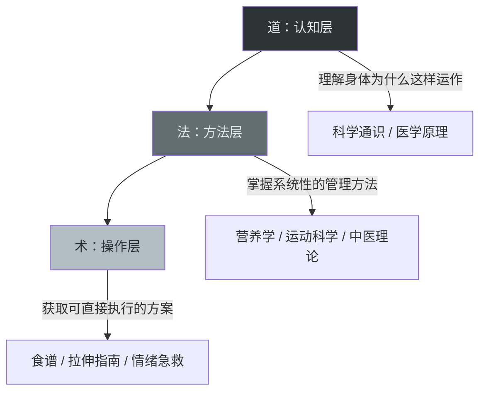
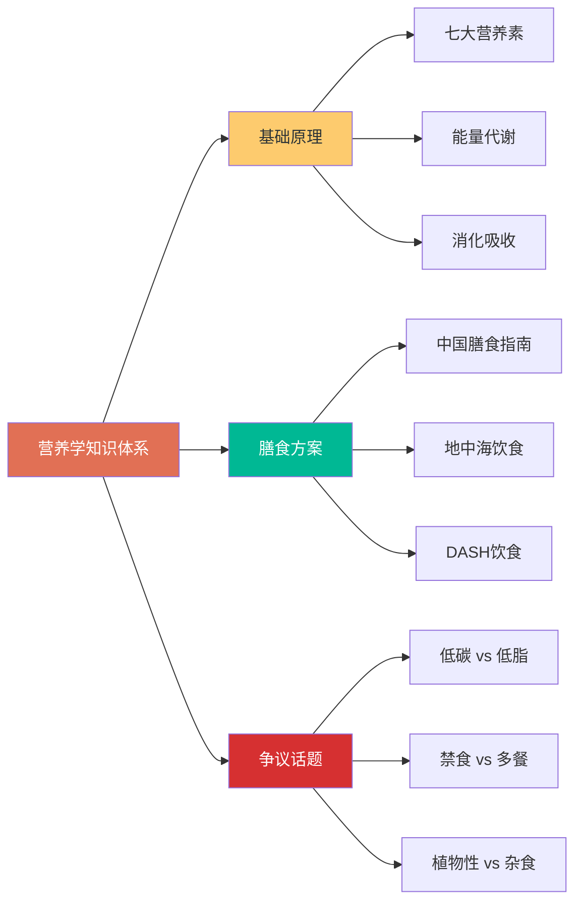
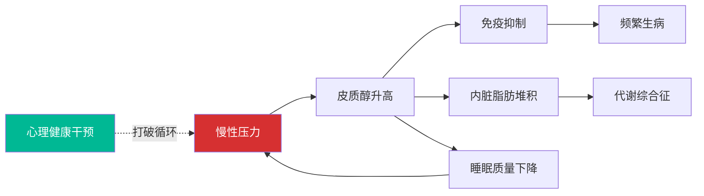
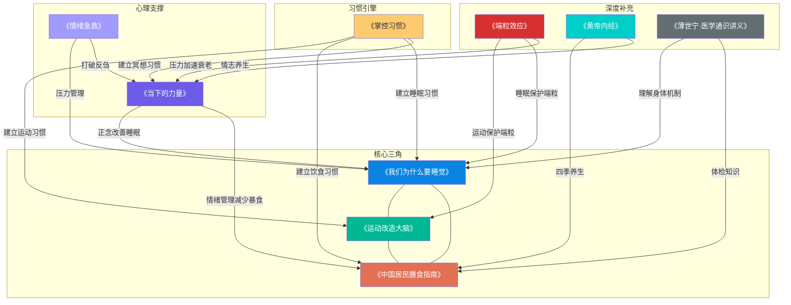
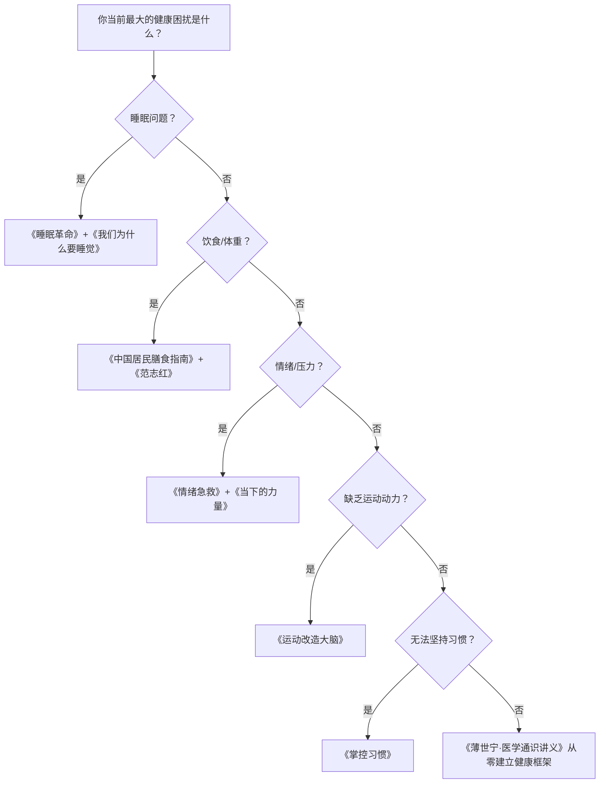

## 一、推荐书籍

健康养生不是一句口号，而是一门需要系统学习的学科。选对书，就等于找对了老师。本节按照健康知识的完整体系，从**睡眠、营养、中医、运动、心理、医学常识、习惯养成、衰老与长寿、工效学与急救、环境健康**十大维度，精选最具价值的书籍，并给出每本书的**核心论点、关键知识点、阅读策略和适用场景**，帮助你用最少的时间建立最扎实的健康知识框架。

### 1.1 为什么你需要读健康类书籍

大多数人获取健康知识的渠道是短视频、公众号和朋友圈转发。这些碎片化信息有三个致命缺陷：

1. **缺乏系统性**：你可能知道"每天要走一万步"，但不知道为什么、什么情况下不适用、和其他运动如何搭配
2. **立场不客观**：大量健康自媒体靠推销保健品或付费课程盈利，内容必然为商业目的服务
3. **信息滞后**：很多广泛流传的"健康常识"早已被新研究推翻（比如"每天八杯水""胆固醇是坏东西"）

一本好的健康书籍，经过作者多年研究、编辑多轮审校、学术同行评议，其信息密度和可靠性远非碎片内容可比。读书的投入产出比，远高于刷1000条短视频。

### 1.2 知识体系与阅读路径

在推荐具体书籍之前，先建立一个整体认知框架。健康养生的知识可以分为三个层次：

| 层次 | 定位 | 对应书籍类型 | 目标 |
|------|------|-------------|------|
| **道**（认知层） | 理解身体运作的基本规律 | 科学通识类、医学原理类 | 知道"为什么" |
| **法**（方法层） | 掌握系统性的健康管理方法 | 营养学、中医理论、运动科学 | 知道"怎么做" |
| **术**（操作层） | 获取可直接执行的方案和工具 | 食谱、拉伸指南、情绪急救手册 | 知道"做什么" |

理想的阅读顺序是**先道后法，先法后术**。但如果你时间有限，可以从"术"入手解决当下问题，再回头补理论。

### 1.3 如何读健康类书籍：四步精读法

很多人的阅读方式是"从头翻到尾，觉得有道理就点点头，合上书全忘了"。对于健康类书籍，这种读法基本等于白读。以下是经过验证的精读方法：

#### 第一步：定位（10分钟）

在正式阅读前，先回答三个问题：

1. **我为什么读这本书？** 是想解决具体问题（失眠、肥胖、焦虑），还是想建立系统认知？
2. **这本书的核心主张是什么？** 读目录、前言和结论，用一句话概括作者的核心观点
3. **我应该重点读哪些章节？** 不需要逐字逐句，根据你的需求标记优先级

#### 第二步：提取（每章20分钟）

读每一章时，只提取三类信息：

- **颠覆认知的事实**：那些和你之前想的不一样的结论（用高亮笔标出来）
- **可执行的行动项**：你能立刻用到日常生活中的具体做法（记在笔记本或手机备忘录里）
- **需要验证的观点**：作者的论据是否充分？有没有相反的研究？（标记待查）

#### 第三步：实践（1-4周）

读完一本健康书籍后，至少选一个核心建议坚持实践两周。没有实践的阅读只是"信息收集"，不是"知识内化"。例如：

- 读完《睡眠革命》→ 立刻试R90方案，记录两周睡眠质量变化
- 读完《掌控习惯》→ 用两分钟法则建立一个微习惯，观察执行率
- 读完《情绪急救》→ 在下次情绪低落时尝试"担忧时间"技术

#### 第四步：复盘（每月一次）

每读完2-3本健康书籍后，做一次知识整合：

1. 这些书的结论有哪些共通点？（那些被多本书反复提及的建议，大概率是靠谱的）
2. 有哪些互相矛盾的观点？（对比其证据质量，形成自己的判断）
3. 我的健康行为发生了哪些变化？哪些坚持下来了，哪些没有？

### 1.4 睡眠科学类

睡眠是所有健康的基础。睡眠不足会导致免疫力下降、认知衰退、情绪失控、代谢紊乱，长期睡眠剥夺甚至会增加阿尔茨海默病和心血管疾病的风险。理解睡眠科学，是健康管理的第一步。

#### 《我们为什么要睡觉》（Why We Sleep）

- **作者**：Matthew Walker（马修·沃克），加州大学伯克利分校神经科学与心理学教授，人类睡眠科学中心创始人
- **定位**：睡眠科学的"圣经级"科普著作，适合所有想从根本上理解睡眠的人
- **核心论点**：睡眠不是可有可无的奢侈品，而是进化赋予每个生物体的生存必需品。现代人平均每天只睡6.5小时，比一个世纪前少了近2小时，这场"睡眠缺失流行病"正在无声地摧毁我们的健康。

**关键知识点：**

1. **睡眠周期的科学机制**：人的睡眠由NREM（非快速眼动睡眠）和REM（快速眼动睡眠）交替组成，一个完整周期约90分钟。NREM深睡期负责身体修复和免疫增强，REM期负责记忆巩固和情绪调节。两者缺一不可。

2. **咖啡因的半衰期真相**：咖啡因的平均半衰期为5-7小时。这意味着下午3点喝的一杯咖啡，到晚上10点仍有四分之一的咖啡因在你的血液中循环，持续干扰腺苷受体，推迟入睡时间并减少深睡比例。更准确地说，咖啡因的代谢因个体CYP1A2基因型不同而差异巨大——"快代谢型"人群半衰期约3-4小时，"慢代谢型"可能长达8-10小时。如果你喝咖啡后下午明显心悸或晚上难以入睡，你可能是慢代谢型。

3. **睡眠不足的连锁反应**：
   - 免疫力：连续一周每晚只睡6小时，体内自然杀伤细胞（NK细胞）活性下降70%
   - 记忆力：深度睡眠是海马体将短期记忆转移到长期记忆的关键窗口
   - 代谢：每晚睡眠不足6小时，肥胖风险增加30%，2型糖尿病风险增加40%
   - 心血管：每年两次夏令时（少睡1小时），心脏病发作率第二天上升24%
   - 情绪：杏仁核（大脑的情绪报警器）在睡眠不足时反应性增加60%，而前额叶皮层（理性的刹车系统）活动减弱——这就是为什么缺觉时更容易暴怒和做出冲动决定

4. **做梦的功能**：REM睡眠中的梦境不是随机噪音，而是大脑在进行"情感急救"——通过在安全环境中重新激活创伤记忆，剥离其中的负面情绪，帮助心理恢复。PTSD患者的REM睡眠往往异常，梦境无法完成"情绪脱敏"，导致创伤记忆持续以噩梦形式反复出现。

5. **关于Walker的争议**：Walker的某些结论（如咖啡因影响的严重程度、安眠药的风险评估）在学术界存在争议。2019年神经科学家Andrew Best等人指出，书中部分数据引用存在选择性倾向。将其作为入门和激发兴趣的读物，而非绝对权威。

**阅读策略**：重点精读第三章（睡眠的运作机制）和第八章（睡眠与疾病的关系）。如果只读一本书来理解睡眠，选这本。

#### 《睡眠革命》（Sleep: The Myth of 8 Hours, the Power of Sleep and the New Plan for Your Night and Day）

- **作者**：Nick Littlehales（尼克·利特尔黑尔斯），英国睡眠教练，曾为曼联、天空车队等顶级运动团队提供睡眠咨询
- **定位**：实操导向的睡眠方案书，适合作息不规律、需要个性化睡眠策略的人
- **核心论点**："每天必须睡满8小时"是一个被过度简化的迷思。真正重要的是以90分钟为一个睡眠周期来规划睡眠，每周累计获得35个睡眠周期（约42小时）即可。

**关键知识点：**

1. **R90睡眠方案**：以90分钟为一个完整睡眠周期，根据你的起床时间反推入睡时间。例如你需要6点起床，那么你可以选择晚上10:30（4个周期=6小时）、12:00（3个周期=4.5小时）入睡。关键在于在周期结束时醒来，而不是在深睡中途被闹钟打断。

   **R90方案实操模板**：

   | 起床时间 | 5个周期（7.5h） | 4个周期（6h） | 3个周期（4.5h） |
   |---------|----------------|---------------|----------------|
   | 6:00 | 22:30 | 0:00 | 1:30 |
   | 6:30 | 23:00 | 0:30 | 2:00 |
   | 7:00 | 23:30 | 1:00 | 2:30 |
   | 7:30 | 0:00 | 1:30 | 3:00 |

2. **日间小憩的力量**：在下午1-3点之间进行一个30分钟的"可控恢复期"（CRP），相当于给大脑一次"重启"。NASA的研究显示，飞行员在小憩26分钟后，警觉性提高54%，表现提高34%。注意：小憩不要超过30分钟，否则会进入深睡期，醒来后反而更困（睡眠惰性）。

3. **睡眠环境五要素**：
   - **床品**：枕头高度应使颈椎保持自然弯曲，床垫应让脊椎在侧卧时保持水平
   - **光线**：睡前90分钟将室内光线调暗至不超过200勒克斯，刺激褪黑素分泌
   - **温度**：卧室温度控制在16-18°C（比多数人习惯的温度低2-3度）
   - **整洁**：卧室只用于睡眠和亲密关系，不放电视、不看手机
   - **触感**：选择透气性好的天然材质床品

4. **睡前和醒后的"90分钟缓冲区"**：睡前90分钟开始减缓节奏——调暗灯光、远离屏幕、做轻度拉伸或阅读。醒后90分钟内完成晨间例行程序，帮助身体从睡眠状态平稳过渡到清醒状态。

**与《我们为什么要睡觉》的互补关系**：Walker告诉你"为什么要睡好"（科学原理），Littlehales告诉你"怎样睡好"（实操方案）。两本配合阅读效果最佳。

**阅读策略**：全书不长，建议通读。重点实践R90方案和日间小憩策略，观察两周后根据自身反馈调整。

#### 补充推荐：《数眠革命》（The Sleep Solution）

- **作者**：W. Chris Winter，美国睡眠医学委员会认证神经科医生
- **定位**：针对失眠症患者的非药物干预指南，适合长期受失眠困扰的人
- **核心价值**：系统介绍了"认知行为治疗失眠症"（CBT-I）——这是目前国际公认的失眠一线治疗方案，效果优于安眠药且无副作用。书中详细拆解了CBT-I的五个核心步骤：睡眠限制、刺激控制、认知重构、睡眠卫生教育和放松训练。

### 1.5 营养学类

营养学是争议最多的健康领域之一——每隔几年就会出现"颠覆性"的新观点（低碳vs低脂、间歇性禁食vs少食多餐、生酮vs地中海饮食）。在信息混乱中建立判断力，需要从权威来源入手，先理解基础原理，再了解不同流派的证据和局限。

#### 《中国居民膳食指南（2022）》

- **作者**：中国营养学会（编著）
- **定位**：中国最权威的膳食指导标准，基于中国居民的营养状况、饮食习惯和流行病学数据制定，是制定个人饮食方案的"基线参考"
- **核心论点**：没有单一的"超级食物"，健康饮食的核心是**食物多样、比例合理、总量适当**。

**关键知识点：**

1. **膳食宝塔的量化指导**（2022版更新）：
   - 谷薯类：200-300g/天，其中全谷物和杂豆50-150g
   - 蔬菜：300-500g/天，深色蔬菜占一半以上
   - 水果：200-350g/天，注意果汁≠水果（果汁去除了膳食纤维，且容易过量摄入糖分）
   - 动物性食物：120-200g/天（鱼虾>禽肉>畜肉）
   - 奶及奶制品：300-500g/天
   - 大豆及坚果：25-35g/天
   - 烹调油：25-30g/天，盐<5g/天
   - 饮水：1500-1700ml/天（约7-8杯）

2. **"东方健康膳食模式"**：2022版首次提出的中国本土化膳食模式，核心特征为：清淡少盐、食物多样、蔬菜水果充足、鱼虾水产丰富、奶类豆类常吃、谷物为主。这一模式参考了浙江、上海、江苏等沿海地区的传统饮食结构，被认为是更适合中国人的健康饮食范本。

3. **反常识要点**：
   - 每天至少吃12种食物，每周至少25种——多样性比单一食物的营养价值更重要
   - 超重人群不要跳过早餐——规律进食有助于稳定血糖和代谢
   - 鸡蛋可以每天吃1个，不必担心胆固醇（2022版已取消胆固醇摄入上限）
   - 牛奶不"上火"——乳糖不耐受人群可以选择酸奶或低乳糖奶
   - 喝粥不养胃——白粥高GI、低营养密度，长期以粥为主食反而不利于血糖控制

**使用方法**：不要试图一次性记住所有数字。打印膳食宝塔贴在冰箱上，每次做饭前看一眼，两周后自然形成习惯。

#### 《范志红：吃出健康好身材》

- **作者**：范志红，中国农业大学食品科学与营养工程学院副教授，博士，中国营养学会理事
- **定位**：面向中国读者的实用营养学指南，用日常语言解释食物营养真相，破除常见饮食误区
- **核心论点**：减肥和健康管理不需要极端饮食法，核心是**理解食物的营养密度，学会聪明地吃**。

**关键知识点：**

1. **GI值（血糖生成指数）的实操应用**：
   - 白米饭GI=83，糙米饭GI=56，混合谷物饭GI≈45
   - 同一种食物，烹饪方式影响GI：土豆煮着吃GI=56，做成土豆泥GI=87（细胞壁被破坏后淀粉更容易被消化酶接触）
   - 先吃蔬菜和蛋白质，最后吃主食，可以将餐后血糖峰值降低30-40%——这就是"改变进食顺序"减肥法的科学基础

2. **减肥的科学原理**：
   - 热量缺口是唯一可靠的减脂方式——每减1公斤脂肪需要累计消耗约7700千卡
   - 极低热量饮食（<800千卡/天）会导致基础代谢率下降，形成"越减越肥"的恶性循环
   - 合理的减重速度是每周0.5-1公斤，过快意味着丢失大量肌肉
   - 基础代谢率受肌肉量影响最大——同体重下，肌肉多的人每天多消耗100-200千卡，这就是力量训练对减肥的长期价值

3. **常见饮食误区澄清**：
   - "水果代餐减肥"：大量果糖摄入→肝脏脂肪合成增加→脂肪肝风险。每天水果总量控制在200-350g
   - "不吃主食瘦得快"：前2周掉的主要是水分，长期会导致酮症、口臭、肌肉流失、女性月经紊乱
   - "酸奶助消化"：市售酸奶含糖量普遍在10-12%，一瓶200ml相当于吃了5块方糖。选酸奶看配料表，碳水化合物<5g/100ml的才是真正的低糖酸奶
   - "无糖食品可以随便吃"：无糖≠无热量，很多无糖食品用麦芽糊精、糊精等替代蔗糖，GI可能更高

**阅读策略**：第一章到第三章是核心（营养基础+减肥原理），后面的食谱部分可以按需查阅。

#### 《救命饮食》（The China Study）

- **作者**：T. Colin Campbell（柯林·坎贝尔），康奈尔大学终身教授，被誉为"世界营养学界的爱因斯坦"
- **定位**：营养学领域的里程碑式研究，基于中国农村65个县、6500人的大规模营养调查，揭示饮食与慢性疾病之间的深层关联
- **核心论点**：以动物蛋白（特别是酪蛋白）为主的饮食模式与癌症、心脏病、糖尿病等慢性疾病的发生率呈显著正相关；全食物植物性饮食（Whole-Food Plant-Based Diet）是最能预防和逆转慢性疾病的饮食方式。

**关键知识点：**

1. **酪蛋白与癌症的剂量关系**：Campbell的实验室发现，当饲料中酪蛋白含量从5%提升到20%时，大鼠的肝癌发病率从0%飙升到100%。而植物蛋白（如大豆蛋白）在同等条件下不促进肿瘤生长。

2. **中国健康调查的核心发现**：
   - 血液胆固醇水平越低的地区，癌症、心脏病发病率越低
   - 动物蛋白摄入量与血液胆固醇水平高度正相关
   - 即使是少量的动物性食品摄入，也会显著提升慢性病风险

3. **"富人病"与"穷人病"的分界线**：在发展中国家，随着收入增加，饮食从植物性转向动物性，慢性病发病率急剧上升——这不是基因问题，而是饮食模式问题。

**辩证阅读建议**：
- **价值**：提供了大量第一手研究数据，是理解"饮食-疾病"关系的重要参考
- **局限**：Campbell的结论偏向全植物性饮食的单一叙事，对动物性食品的某些营养价值（如维生素B12、血红素铁、Omega-3脂肪酸EPA/DHA）讨论不足。2017年《美国临床营养学杂志》的一篇元分析显示，适量（非过量）的动物蛋白摄入与全因死亡率之间并没有Campbell描述的那么强的正相关
- **读法**：将其作为理解营养学争议的一扇窗，而不是绝对的饮食圣经。对比阅读其他营养学观点，形成自己的判断

#### 《你是你吃出来的》（全两册）

- **作者**：夏萌，首都医科大学附属北京安贞医院临床营养科原主任
- **定位**：一位从临床实践中走出来的营养医生的"看病笔记"，用真实病例说明营养失衡如何导致疾病，以及如何通过饮食调整逆转
- **核心论点**：人是细胞组成的，细胞需要的营养素来自食物。当饮食长期偏离身体需求，细胞功能就会出问题，表现为各种慢性病。

**关键知识点：**

1. **七大营养素的协同作用**：蛋白质、脂肪、碳水化合物、维生素、矿物质、膳食纤维、水——缺乏任何一种都会引发连锁反应。例如缺镁→钙吸收障碍→肌肉痉挛→睡眠质量下降→情绪不稳。

2. **中国人的营养缺口**：
   - 钙：推荐800mg/天，实际平均摄入仅400mg，缺口高达50%
   - 维生素D：室内办公人群普遍严重不足，影响钙吸收和免疫力。夏萌建议室内工作者每天补充维生素D3 1000-2000IU
   - Omega-3脂肪酸：中国饮食中Omega-6与Omega-3比例高达20:1（理想值应为4:1），促进全身慢性炎症
   - 膳食纤维：推荐25-30g/天，实际平均摄入仅10-13g

3. **早餐的最低标准**：至少包含蛋白质（鸡蛋/牛奶/豆浆）+ 主食（全谷物）+ 果蔬（少量即可）。一碗白粥+咸菜的组合是最差的早餐——高GI碳水+高钠+几乎零蛋白质。

4. **夏萌的"临床营养处方"案例**：
   - 高血压患者：增加钾（香蕉、土豆、菠菜）+ 镁（坚果、深绿蔬菜）+ 钙（奶制品），限制钠，3个月后部分患者降压药剂量减半
   - 反复感冒：增加蛋白质摄入（肉蛋奶豆）至体重×1.2g/天 + 维生素C + 锌，免疫球蛋白合成恢复正常
   - 脂肪肝：不是不吃油，而是调整油脂比例——减少Omega-6（大豆油、玉米油），增加Omega-3（深海鱼、亚麻籽油）

**适合人群**：想通过饮食改善亚健康状态（疲劳、失眠、消化不良、皮肤问题等）的读者，以及需要理解"为什么医生让我多吃XX"的患者。

#### 补充推荐：《饮食的迷思》（The Diet Myth）

- **作者**：Tim Spector，伦敦国王学院遗传流行病学教授，ZOE个性化营养项目创始人
- **定位**：用肠道微生物组的最新研究打破营养学迷思——为什么同样的食物对不同人效果完全不同？
- **核心价值**：Spector的双胞胎研究显示，即使基因几乎相同的两个人，对同一食物的血糖反应也可能差异巨大。决定个体营养需求的不仅是基因，还有肠道菌群的组成。这本书帮助你理解"没有放之四海而皆准的完美饮食"，并提供了个性化营养的基本思路：多吃多样化的植物性食物（每周30种以上）来喂养多样化的肠道菌群。

### 1.6 中医养生类

中医养生的核心优势在于"治未病"——不等疾病发生，就通过调节生活方式来维护健康。但中医典籍年代久远，直接阅读原文对多数现代人有难度。以下推荐从经典入门到实践应用，覆盖不同深度需求。

#### 《黄帝内经》

- **作者**：传统医学经典（成书于战国至西汉时期，非一人所作）
- **定位**：中医理论的"宪法级"奠基文献，两千年来指导着中国人的养生实践
- **核心论点**：人体是一个与天地相通的有机整体，健康的标准不是"没有病"，而是**阴阳平衡、气血调和、脏腑功能协调**。

**关键知识点：**

1. **"法于阴阳，和于术数"**：养生的总纲——顺应自然界的阴阳变化规律来安排生活。具体包括：春夏养阳（早起晚睡、多运动），秋冬养阴（早睡晚起、减少消耗）。这与现代时间生物学（Chronobiology）的研究高度吻合——人体的激素分泌、体温调节、免疫功能都遵循昼夜节律和季节节律。

2. **"食饮有节，起居有常"**：两千年前提出的"生活方式医学"——饮食要节制（不过饱、不过饥、不偏食），作息要规律（日出而作、日落而息）。

3. **情志致病理论**：怒伤肝、喜伤心、思伤脾、忧伤肺、恐伤肾。过度的情绪波动直接影响对应脏腑的功能——这与现代心身医学（Psychosomatic Medicine）的研究结论高度一致。长期心理应激确实会导致消化系统紊乱（思伤脾）、免疫力下降（忧伤肺）、心血管问题（怒伤肝/高血压）。

4. **四季养生框架**：
   - 春（肝）：宜升发，食辛温，忌抑郁。春天肝气旺盛，容易出现情绪波动、眼睛干涩、偏头痛等问题
   - 夏（心）：宜清凉，食苦味，忌大汗。大量出汗伤心气心阴，容易心悸、失眠、烦躁
   - 秋（肺）：宜收敛，食酸味，忌悲伤。秋天干燥伤肺，容易干咳、皮肤干燥、便秘
   - 冬（肾）：宜封藏，食咸温，忌过劳。冬天应减少消耗、早睡晚起、适度进补

**阅读策略**：不建议直接读古文原文。推荐从以下入门路径开始：
1. **第一阶段**：读徐文兵、梁冬对话版《黄帝内经》，通俗易懂，适合零基础
2. **第二阶段**：读人民卫生出版社的白话文译注版，对照原文逐篇学习
3. **第三阶段**：读王冰注释版或张志聪集注版，深入理解学术内涵

#### 《饮食滋味》

- **作者**：徐文兵，厚朴中医学堂创办人，北京中医药大学副教授
- **定位**：用现代语言讲解中医食疗原理的入门佳作，将"食物的性味归经"这个看似玄妙的概念落地为可操作的饮食指导
- **核心论点**：每种食物都有自己的"性格"（寒热温凉）和"特长"（酸苦甘辛咸对应不同脏腑）。吃对了是养生，吃错了是伤身。

**关键知识点：**

1. **食物的四气五味**：
   - 四气（寒热温凉）：寒凉食物清热泻火（西瓜、绿豆、苦瓜），温热食物散寒补阳（羊肉、生姜、桂圆）
   - 五味入五脏：酸入肝、苦入心、甘入脾、辛入肺、咸入肾
   - 日常判断口诀：舌头红、口渴喜冷饮→偏热体质→适当多吃寒凉食物；舌头淡、怕冷喜热饮→偏寒体质→适当多吃温热食物

2. **"五谷为养"的科学性**：古人认为五谷（稻、黍、稷、麦、菽）是滋养人体的根本。现代营养学证实，全谷物提供稳定的碳水化合物、B族维生素和膳食纤维，是维持血糖稳定和肠道健康的基础。

3. **食物搭配的禁忌与宜忌**：
   - 螃蟹性寒，配生姜（温性）可中和其寒性
   - 绿豆性寒，脾胃虚寒者不宜多食（经常腹胀、大便溏稀、手脚冰凉的人）
   - 牛奶性平微寒，配红枣或姜汁可增加温性
   - 西瓜性寒，体质偏寒者可以撒少许盐来平衡（中医"咸能软坚，亦能引寒下行"）

4. **常见体质的食疗原则**（徐文兵总结）：

   | 体质类型 | 特征 | 宜食 | 忌食 |
   |---------|------|------|------|
   | 气虚 | 容易疲劳、气短、出虚汗 | 黄芪、山药、大枣、鸡肉 | 生冷、萝卜、浓茶 |
   | 阳虚 | 怕冷、手脚凉、腰膝酸软 | 羊肉、韭菜、核桃、桂圆 | 寒凉食物、冷饮 |
   | 阴虚 | 手足心热、口干、盗汗 | 银耳、百合、梨、鸭肉 | 辛辣、煎炸、羊肉 |
   | 痰湿 | 体胖、痰多、身体沉重 | 薏米、冬瓜、荷叶、陈皮 | 甜食、油腻、酒 |
   | 血瘀 | 面色晦暗、唇色紫暗 | 山楂、醋、红花、玫瑰花 | 寒凉收涩食物 |

**适合人群**：对中医食疗感兴趣，希望根据自身体质调整饮食的读者。

#### 《养生先养心》

- **作者**：吴中朝，国家级名老中医，中国中医科学院主任医师、博士生导师
- **定位**：中医养生的"心法"——强调心理健康是身体健康的根基
- **核心论点**：七情六欲的过度波动是现代人亚健康的主要原因之一。养生不在于吃多少补品，而在于**学会管理情绪、保持心态平和**。

**关键知识点：**

1. **情志养生的"三调法"**：
   - **调心**：通过静坐、冥想、书法等方式安定心神。吴中朝推荐"数息观"——静坐时默数呼吸，从1数到10，再从1开始，走神了就重新从1数。简单但极其有效
   - **调息**：腹式呼吸——吸气4秒→屏息4秒→呼气6秒，每天练习10分钟。腹式呼吸能激活迷走神经，降低皮质醇水平，是效果最快的减压技术之一
   - **调身**：八段锦、太极拳等传统功法，同时调节气血和情绪。八段锦仅需12分钟，适合每天练习

2. **四季情志要点**：
   - 春季宜"生"：多出门踏青，忌怒气（怒伤肝，春天肝气本旺，再发怒等于火上浇油）
   - 夏季宜"长"：保持心情开朗，忌过喜（大喜伤心，情绪过度兴奋消耗心气）
   - 秋季宜"收"：收敛情绪，忌忧思过度（秋天万物凋零，情绪容易低落，需要主动调节）
   - 冬季宜"藏"：减少社交消耗，养精蓄锐（冬天应适当减少高强度社交活动）

3. **食疗养生方选例**（吴中朝临床常用方）：
   - 失眠：酸枣仁15g + 百合10g + 茯苓10g，水煎代茶饮。酸枣仁养心安神，百合润肺清心，茯苓健脾宁心
   - 焦虑：玫瑰花5朵 + 佛手片3g + 合欢花3g，开水冲泡。玫瑰花疏肝解郁，佛手理气和中，合欢花安神解郁
   - 疲劳：黄芪15g + 党参10g + 枸杞10g，炖鸡汤。黄芪补气固表，党参补中益气，枸杞滋补肝肾
   - 注意：以上为日常保健方，非处方药。如有明确疾病，请在中医师指导下使用

**实用价值**：每个食疗方和穴位保健法都附有具体操作步骤和注意事项，可以直接按需使用。

### 1.7 运动健康类

"生命在于运动"这句话人人都会说，但很少有人真正理解运动对大脑、情绪和认知能力的深远影响。这一节的推荐不仅告诉你"该运动"，更用神经科学的证据告诉你"为什么运动能从根本上改变你"。

#### 《运动改造大脑》（Spark: The Revolutionary New Science of Exercise and the Brain）

- **作者**：John J. Ratey（约翰·瑞迪），哈佛大学医学院精神病学教授，注意力缺陷领域的权威专家
- **定位**：用神经科学证据重新定义运动的价值——运动不只是为了减肥或练肌肉，它是**最强效的天然大脑增强剂**
- **核心论点**：运动通过增加脑源性神经营养因子（BDNF）、促进神经发生、优化神经递质平衡，从根本上提升大脑功能。

**关键知识点：**

1. **BDNF——大脑的"肥料"**：运动会刺激大脑产生BDNF（Brain-Derived Neurotrophic Factor），这种蛋白质促进新神经元的生长和存活，增强突触可塑性。运动后BDNF水平可提升30-50%，效果持续数小时。这意味着：如果你想在考试或重要会议前让大脑处于最佳状态，先做20分钟中等强度运动。

2. **运动对注意力的即时提升**：伊利诺伊州内珀维尔中央高中的"零点体育课"实验——学生在上文化课之前先做20分钟中高强度运动，结果这些学生的阅读理解能力提升了17%，而对照组只提升了10%。这个实验后来被多个学校复制，结果一致。

3. **运动作为抑郁症的一线治疗**：一项针对156名老年抑郁症患者的研究显示，每周3次、每次30分钟的有氧运动，其抗抑郁效果与舍曲林（左洛复）相当，且运动组在随访10个月后的复发率显著低于药物组。2023年《英国运动医学杂志》的一项涵盖97篇综述的元分析进一步证实：运动对抑郁症、焦虑症和心理痛苦的疗效与心理治疗和药物治疗相当。

4. **不同类型运动的大脑效益**：
   - **有氧运动**（跑步、游泳、骑行）：最能提升BDNF水平，改善注意力和情绪
   - **力量训练**：促进IGF-1（胰岛素样生长因子）分泌，增强执行功能
   - **复杂运动**（舞蹈、球类、武术）：需要运动协调+策略思考，对认知提升最全面
   - **瑜伽/太极**：降低皮质醇水平，改善焦虑和压力反应

5. **运动与阿尔茨海默病**：2022年发表在《神经学》杂志上的一项长达10年的追踪研究发现，每周进行至少150分钟中等强度运动的老年人，患阿尔茨海默病的风险降低45%。运动不是治疗手段，但可能是目前最有效的预防手段。

**最佳运动处方**（综合书中研究）：每周150分钟中等强度有氧运动（心率维持在最大心率的65-75%），配合2次力量训练，再加入1-2次复杂运动（如学习一项新运动技能）。

**阅读策略**：第三章（运动对学习能力的影响）和第六章（运动对焦虑和抑郁的影响）是最核心的两章。如果你只读这两章，也能获得本书80%的价值。

#### 《拉伸：最好的运动》（Stretching）

- **作者**：Bob Anderson（鲍勃·安德森），全球最畅销的拉伸指南作者，其作品已被翻译成24种语言
- **定位**：拉伸运动的"百科全书"，覆盖全身各部位、各场景的拉伸方法
- **核心论点**：拉伸不是运动前后的"附属环节"，而是一项独立的、对所有人都有价值的运动形式——改善柔韧性、缓解肌肉紧张、预防运动损伤、减轻久坐带来的体态问题。

**关键知识点：**

1. **拉伸的生理机制**：肌肉通过"牵张反射"保护自身——当肌肉被快速拉长时，肌梭感知到拉伸并触发收缩以防止撕裂。缓慢、持续的拉伸（保持20-30秒）会激活"高尔基腱器官"，抑制牵张反射，使肌肉逐渐放松并延长。

2. **久坐族的"解救三件套"**（每天必做，耗时不到5分钟）：
   - **髋屈肌拉伸**：单膝跪地，前腿弓步，后腿膝盖着地，身体前移直到后侧髋前方有拉伸感。保持30秒，换边。缓解久坐导致的髋屈肌缩短——髋屈肌紧张是腰痛的主要原因之一
   - **胸肌拉伸**：站在门框旁，手臂抬至肩高，手掌贴在门框上，身体向前倾。保持30秒。打开因驼背而缩短的胸大肌
   - **梨状肌拉伸**：坐在椅子上，将一侧脚踝放在对侧膝盖上，身体前倾。保持30秒。缓解久坐压迫坐骨神经导致的臀部和腿部不适

3. **拉伸的黄金时间**：
   - 晨起：5-10分钟全身拉伸，唤醒肌肉和关节
   - 久坐后（每小时）：2-3分钟颈肩和髋部拉伸
   - 运动后：10-15分钟全身拉伸，利用肌肉温热状态最大化柔韧性提升

4. **拉伸的常见错误**：
   - 弹震式拉伸（快速弹跳）：容易触发牵张反射，反而增加受伤风险
   - 屏住呼吸：拉伸时应该保持缓慢深呼吸，呼气时逐渐加深拉伸幅度
   - 疼痛≠有效：拉伸应该有"牵拉感"而非"疼痛感"，疼痛说明过度拉伸了
   - 只拉伸不加强：柔韧性和力量需要平衡发展，过度柔韧而缺乏肌肉力量反而增加关节不稳定

**实用价值**：书中的400多幅手绘插图清晰展示了每个动作的起始位置、运动方向和注意事项，即使零基础也能照着做。按身体部位（颈、肩、背、腰、髋、腿）分章节组织，方便按需查阅。

#### 补充推荐：《囚徒健身》（Convict Conditioning）

- **作者**：Paul Coach Wade
- **定位**：纯徒手力量训练的系统指南，不需要任何器械，适合不想去健身房的人
- **核心价值**：将六大基本动作（俯卧撑、深蹲、引体向上、桥、举腿、倒立撑）各分解为10个递进阶段，从最简单的入门版本逐步过渡到高级版本。比如标准俯卧撑的入门版本是"墙壁俯卧撑"（站着推墙），逐步进阶到"单臂俯卧撑"。这套渐进系统确保零基础的人也能安全开始训练。

### 1.8 心理健康类

身体健康和心理健康不是两条平行线，而是紧密交织的网络。慢性压力会升高皮质醇水平→抑制免疫功能→促进内脏脂肪堆积→干扰睡眠→进一步加重压力——这是一个需要主动打破的恶性循环。

#### 《当下的力量》（The Power of Now）

- **作者**：Eckhart Tolle（埃克哈特·托利），当代最具影响力的心灵导师之一
- **定位**：正念觉知领域的奠基之作，不是教你"怎么做"，而是帮你从根本上改变"怎么看"
- **核心论点**：人类绝大多数的痛苦不是来自当下的处境，而是来自**对过去的反复回想（后悔）和对未来的持续焦虑（担忧）**。学会将注意力锚定在当下，是通往内在平静的唯一路径。

**关键知识点：**

1. **"思维认同"的概念**：多数人把自己等同于自己的思维——"我焦虑"变成了"我就是一个焦虑的人"。Tolle将这种现象称为"思维认同"，并指出：你能观察到你的思维，说明你不是你的思维。这个洞察是正念练习的哲学基础。

2. **情绪的身体锚点**：每种情绪都有对应的身体感受——焦虑通常表现为胸口发紧、胃部不适，愤怒表现为面部发热、拳头紧握。学会在情绪升起时观察身体感受，而不是被情绪的故事（"他不应该这样对我"）所裹挟，就能打破情绪反应的自动化模式。

3. **"观察者练习"**（正念冥想的核心技法）：
   - 闭上眼睛，把注意力放在呼吸上
   - 当思维出现时（一定会出现），不要对抗或评判，只需在心里默默标注"思考"
   - 将注意力温柔地拉回呼吸
   - 每次"走神→觉察→拉回"就是一个"正念俯卧撑"，就是练习本身
   - 初学者建议从每天5分钟开始，逐渐增加到20分钟。可以用手机计时器，不需要任何App

4. **正念的神经科学证据**：哈佛大学Sara Lazar的研究显示，8周正念冥想练习后，参与者大脑中与学习和记忆相关的海马体灰质密度增加，与压力和焦虑相关的杏仁核灰质密度减少。更关键的是，这些变化与参与者主观报告的"压力减轻"感受高度一致。

**阅读建议**：这本书不适合快速浏览。每天读一小节（2-3页），读完后静坐5分钟消化。实践中的体悟比文字上的理解重要得多。如果觉得文字太抽象，可以先从Tolle的《新世界：灵性的觉醒》入手，那本更通俗。

#### 《情绪急救》（Emotional First Aid）

- **作者**：Guy Winch（盖伊·温奇），临床心理学家，纽约大学心理学博士
- **定位**：情绪管理的"急救手册"——不是理论探讨，而是针对7种常见心理创伤给出具体的处理方案
- **核心论点**：我们有完善的生理急救知识（流血了要止血、骨折了要固定），却对心理创伤束手无策。心理伤害和身体伤害一样需要及时处理，否则会"感染恶化"。

**关键知识点：**

1. **七种心理创伤的急救方案**（核心摘要）：
   - **反刍思维**（反复回想负面事件）：设定"担忧时间"——每天固定15分钟允许自己担忧，其他时间出现担忧念头时，告诉自己"到担忧时间再想"
   - **孤独感**：不要等待别人来找你，主动发起3次社交互动（哪怕是发一条微信），打破"社交回避→孤独加重→更加回避"的恶性循环
   - **失败感**：将失败的原因归类为**可改变的因素**（准备不足、策略错误）而非**不可改变的因素**（能力不够、运气不好），这是从失败中恢复的心理基础
   - **自卑感**：制作"自我肯定清单"——写下10个你做得好的真实事件（不是抽象的"我很棒"），每次自卑感升起时拿出来阅读
   - **拒绝感**：拒绝激活的大脑区域与身体疼痛相同。缓解方法：用第三人称重新叙述被拒经历（"小明被拒绝了，他很难过"），这叫"自我距离化"，能降低情绪强度
   - **内疚感**：区分"合理内疚"（确实伤害了别人，需要道歉和弥补）和"非合理内疚"（过度承担责任），对后者使用"换位思考测试"——如果朋友处于你的位置，你会责怪他吗？
   - **反刍思维**与**悲伤**的区别：反刍是"为什么是我"，悲伤是"我很难过"。前者需要认知打断，后者需要允许自己悲伤

2. **"心理免疫系统"的概念**：就像身体有免疫系统来抵抗感染，心理也有自愈机制——但这个机制需要主动激活。心理学研究表明，简单的写作练习（每天花20分钟写下自己的感受和想法）可以显著降低焦虑和抑郁水平。这被称为"表达性写作"，由心理学家James Pennebaker首创。

3. **打破反刍的"认知干扰法"**：当大脑陷入负面思维循环时，不要试图"不去想"（这会适得其反——"白熊效应"），而是给大脑一个轻度认知任务——数数（从100倒数到1）、玩数独、做简单的心算。这会占用大脑的工作记忆，中断反刍回路。

**阅读策略**：不需要按顺序读。根据你当前面临的情绪问题，直接翻到对应章节。每个章节独立成篇，都包含问题识别、机制分析、具体干预方案三部分。

#### 《被讨厌的勇气》

- **作者**：岸见一郎、古贺史健
- **定位**：阿德勒心理学的通俗解读，通过一位哲人与青年的对话，拆解人际关系中的心理负担
- **核心论点**：一切烦恼都是人际关系的烦恼。自由的代价是被别人讨厌——当你不再需要所有人的认可时，你才真正获得了自由。

**关键知识点：**

1. **课题分离**：这是阿德勒心理学最核心的概念之一。判断一件事是谁的"课题"，标准是"这个选择的后果最终由谁承担"。你努力工作是你的课题，领导是否赏识你是领导的课题。不要把别人的课题扛在自己肩上。

2. **目的论vs原因论**：弗洛伊德说"因为童年受过创伤，所以现在有心理问题"（原因论）。阿德勒说"因为你想要达到某个目的（比如获得关注），所以选择了创伤作为手段"（目的论）。目的论不是否认痛苦的真实性，而是强调：你可以选择不同的目的，从而改变行为模式。

3. **共同体感觉**：幸福的终极来源不是与他人的竞争（纵向关系），而是与他人的合作和贡献（横向关系）。当你把"我对别人有什么用"作为行动的出发点，很多人际焦虑会自然消解。

4. **"甘于平凡的勇气"**：阿德勒心理学的一个反直觉观点——追求卓越本身不是问题，但把"必须卓越"当作生存前提就是问题。接受"我可能一辈子都很普通"不是认命，而是放下恐惧后才有可能真正发挥潜力。

**适合人群**：经常因为"别人的看法"而内耗的人、讨好型人格、过度在意评价的人。

#### 补充推荐：《也许你该找个人聊聊》（Maybe You Should Talk to Someone）

- **作者**：Lori Gottlieb，心理治疗师兼作家
- **定位**：用真实案例展示心理咨询是如何起效的——既是从治疗师视角，也从患者视角
- **核心价值**：这本书最独特的价值是"去神秘化"——它告诉你心理咨询不是"有病的人才去的"，治疗师自己也有心理问题，而"被倾听"和"被理解"本身就是一种治愈力量。如果你对心理咨询感兴趣但犹豫不决，这本书是最好的"入门前奏"。

### 1.9 医学常识类

不需要成为医生，但需要具备基本的医学常识——能听懂医生的话、看懂体检报告、识别需要及时就医的信号、避免被伪科学收割。这一类书籍是每个成年人的"必修课"。

#### 《薄世宁·医学通识讲义》

- **作者**：薄世宁，北京大学第三医院重症医学科副主任医师
- **定位**：面向普通人的医学通识教育，用19个核心概念帮你建立基本的医学认知框架
- **核心论点**：医学不是对抗疾病的战争，而是**帮助身体自愈的辅助手段**。理解身体的自愈机制和医学的辅助逻辑，是每个人应有的健康素养。

**关键知识点：**

1. **疾病的本质**：疾病不是"敌人入侵"，而是身体在某种刺激下的**适应性反应**。发烧是免疫系统在升温杀灭病原体，咳嗽是呼吸道在清除异物，腹泻是肠道在排出毒素。很多时候症状本身就是在"治病"。所以盲目退烧、止咳、止泻有时反而干扰了身体的自愈过程（当然，症状过于严重时仍需药物干预）。

2. **代偿机制**：人体有强大的代偿能力——一个肾脏坏了，另一个会增大来承担两个的工作；心脏冠状动脉堵塞50%以下，通常不会有任何症状。这意味着很多疾病在早期是"沉默"的，等到出现明显症状时，往往已经发展到中晚期。

3. **关于体检的正确认知**：
   - 体检的目的是**筛查高危因素**，不是确诊疾病
   - 某些指标轻度偏离正常范围，不等于有病——需要结合整体情况判断
   - 40岁以上应每年做一次全面体检，重点关注：血压、血糖、血脂、肝肾功能、甲状腺、肺部CT（吸烟者）、胃肠镜（45岁起）
   - 体检报告中的"建议复查"不等于"有问题"，但一定要去复查——很多人的做法是看到"复查"就忽视，这是最危险的

4. **关于抗生素的正确认知**：
   - 抗生素只对细菌感染有效，对病毒感染（感冒、流感）无效
   - 不要自行购买抗生素——滥用抗生素会导致细菌耐药性，这是全球公共卫生面临的最严重威胁之一
   - 如果医生开了抗生素，一定要按疗程服完，症状消失不代表细菌已被完全清除

**适合人群**：所有成年人，尤其是家里有老人和小孩、需要做医疗决策的人。

#### 《只有医生知道》（全3册）

- **作者**：张羽，北京协和医院妇产科副主任医师
- **定位**：从妇产科医生的视角，用真实病例讲述常见疾病的发生、发展和诊疗过程
- **核心论点**：普通人对疾病的恐惧，很大程度上来自无知。当你了解了疾病的真实面貌，就不会盲目恐慌，也不会盲目忽视。

**关键知识点：**

1. **女性健康高频问题**：
   - HPV感染≠宫颈癌：80%的女性一生中会感染HPV，90%的感染会在2年内被免疫系统自行清除。只有持续感染高危型HPV（16型、18型）才可能发展为宫颈癌。HPV疫苗可以预防约70-90%的相关癌症
   - 子宫肌瘤：育龄期女性中约20-30%有子宫肌瘤，绝大多数是良性的，没有症状的肌瘤通常不需要治疗。只有当肌瘤导致大量出血、压迫症状或快速增长时才考虑干预
   - 乳腺增生：约70%的女性有不同程度的乳腺增生，这是一种生理现象而非疾病，单纯的增生不会癌变。需要关注的是"不典型增生"，这需要病理活检确认

2. **"过度医疗"的识别**：
   - 宫颈糜烂（现在称为"宫颈柱状上皮异位"）是一种生理现象，不是疾病，不需要治疗。如果有人因为"宫颈糜烂"建议你做手术，换一家医院
   - 体检发现的甲状腺微小结节（<1cm、TI-RADS 2-3类），多数只需定期复查，不需要穿刺或手术
   - 盆腔积液在排卵期和月经前后少量出现是正常的，不需要"消炎"

3. **就医前的准备清单**：
   - 带齐既往病历和检查报告
   - 按时间顺序梳理症状（何时开始、如何变化、有无诱因）
   - 列出正在服用的药物和已知的过敏信息
   - 准备好要问医生的问题（不要怕"问得蠢"，这是你的权利）
   - 如果可能，带上一位信任的人——在焦虑状态下很难记住医生说的所有话

4. **与医生沟通的技巧**：
   - 描述症状用"描述性语言"而非"诊断性语言"（说"肚子右边偏上的位置一阵一阵地疼"，不说"我得了胆囊炎"）
   - 如果医生的方案你不理解或不认同，可以礼貌地问："除了这个方案，还有其他选择吗？各自的利弊是什么？"
   - 第二诊疗意见（Second Opinion）是国际惯例，不是对医生的不尊重

**阅读策略**：即使不是女性读者，第一册中关于"如何看病"的章节也极具价值——它教你如何与医生高效沟通、如何理解医疗决策背后的逻辑。

### 1.10 习惯养成类

知道"该做什么"和"真的去做"之间隔着一条巨大的鸿沟。这一类书籍专门解决"知道但做不到"的问题——不是告诉你该吃什么、该运动多久，而是帮你在日常生活中真正建立起健康习惯。

#### 《掌控习惯》（Atomic Habits）

- **作者**：James Clear（詹姆斯·克利尔），习惯研究专家，行为心理学实践者
- **定位**：习惯养成领域的"实操手册"，基于行为科学原理，给出了一套可执行的习惯建立和改变系统
- **核心论点**：习惯的改变不靠意志力，靠**系统设计**。每天进步1%，一年后你将进步37倍。

**关键知识点：**

1. **习惯的四步模型**（基于行为科学家BJ Fogg和Charles Duhigg的研究）：
   - **提示**（Cue）：触发行为的信号→让它显而易见
   - **渴望**（Craving）：想要做某事的动力→让它有吸引力
   - **响应**（Response）：实际的行为→让它简便易行
   - **奖赏**（Reward）：行为带来的满足感→让它令人愉悦

2. **习惯叠加策略**：把新习惯绑定在已有的习惯之后。例如："每天早上刷完牙之后（已有习惯），立刻做10个深蹲（新习惯）"。已有习惯成为新习惯的自然触发器。具体公式：**在[已有习惯]之后，我会[新习惯]**。

3. **两分钟法则**：任何新习惯的开始版本都应该在两分钟内完成。想养成跑步习惯？第一步不是"每天跑5公里"，而是"每天穿上跑鞋走出家门"。想养成阅读习惯？不是"每天读一小时"，而是"每天翻开书读一页"。先让行为发生，再逐步扩展。

4. **身份认同驱动行为改变**：不要说"我要减肥"（目标导向），而要说"我是一个注重健康饮食的人"（身份导向）。当行为成为身份的一部分，维持习惯就不再需要意志力。关键区分：目标导向是"达到目标就可以停"，身份导向是"这个人设永远不需要停"。

5. **环境设计比意志力重要10倍**：
   - 想坚持运动→把运动鞋放在门口最显眼的位置（增加提示）
   - 想多吃蔬菜→提前把洗净切好的蔬菜放在冰箱最显眼的位置（减少阻力）
   - 想减少睡前玩手机→买一个传统闹钟替代手机闹钟，然后把手机放在卧室外充电（增加阻力）
   - 想减少刷短视频→把App从手机首页移到第三屏的文件夹里（减少提示）

**健康习惯建立的推荐序列**（按难度递增）：

| 阶段 | 习惯 | 两分钟版本 | 完整版本 |
|------|------|-----------|---------|
| 第1周 | 早起喝水 | 醒来后喝一口水 | 醒来后喝300ml温水 |
| 第2周 | 晨间拉伸 | 站起来伸个懒腰 | 5分钟全身拉伸 |
| 第3周 | 午间小憩 | 闭眼休息1分钟 | 20分钟午睡 |
| 第4周 | 散步 | 穿鞋走出家门 | 饭后散步20分钟 |
| 第5周 | 健康早餐 | 吃一个鸡蛋 | 蛋白质+全谷物+果蔬 |
| 第6周 | 睡前断屏 | 睡前放下手机1分钟 | 睡前90分钟无屏幕 |

#### 《福格行为模型》（Tiny Habits）

- **作者**：BJ Fogg，斯坦福大学行为设计实验室创始人
- **定位**：习惯养成的"学术源头"——《掌控习惯》中的很多策略都源自BJ Fogg的研究
- **核心论点**：行为=动机×能力×触发（B=MAP）。要改变行为，最可靠的方式不是提高动机（波动太大），而是降低行为难度（让它简单到不可能失败）和设计精准的触发时机。

**关键知识点：**

1. **"庆祝"的力量**：完成微小习惯后，立刻给自己一个积极的情绪反馈——可以是心里默念"太棒了"、做一个胜利手势、或者微笑。Fogg的研究发现，这种即时的正面情绪是习惯回路固化的核心驱动力，比任何外在奖励都有效。

2. **锚点+新行为+庆祝**的公式：找到一个日常锚点（如"上完厕所后"），绑定一个微行为（如"做2个俯卧撑"），完成后立刻庆祝。这个三步循环重复足够多次后，行为会变成自动化习惯。

3. **习惯配方示例**（Fogg实验室常用）：
   - "我每天早上按下咖啡机按钮后，会做3次深呼吸"（锚点：按按钮；新行为：深呼吸）
   - "我每次坐到办公椅上后，会调整坐姿"（锚点：坐下；新行为：坐姿矫正）
   - "我每天脱掉鞋子后，会做1个拉伸动作"（锚点：脱鞋；新行为：拉伸）

**与《掌控习惯》的关系**：Fogg是学术研究者，Clear是实践传播者。Clear的四步模型是在Fogg的B=MAP基础上扩展的。如果你喜欢理论根基扎实的书，先读Fogg；如果你喜欢故事和案例丰富的书，先读Clear。

### 1.11 衰老与长寿类

衰老是不可避免的，但衰老的速度和质量是可以管理的。近年来"抗衰老"领域取得了突破性进展，从基因层面到生活方式层面都有了更深入的理解。

#### 《端粒效应》（The Telomere Effect）

- **作者**：Elizabeth Blackburn（伊丽莎白·布莱克本，诺贝尔生理学或医学奖得主）和 Elissa Epel
- **定位**：从端粒生物学的角度解释衰老的分子机制，以及哪些生活方式可以减缓端粒缩短
- **核心论点**：端粒（染色体末端的保护帽）的长度是细胞衰老的"生物钟"。端粒越短，细胞老化越快。但端粒的缩短速度是可以被生活方式影响的。

**关键知识点：**

1. **端粒与衰老的关系**：每次细胞分裂，端粒都会缩短一点。当端粒短到临界长度，细胞就进入衰老状态——停止分裂、释放炎症因子、影响周围健康细胞。端粒长度是预测心血管疾病、糖尿病、某些癌症和全因死亡率的独立指标。

2. **加速端粒缩短的因素**（按影响程度排序）：
   - 慢性心理压力（研究发现，长期照顾慢性病患儿的母亲，端粒比同龄人短相当于多老了9-17年）
   - 久坐不动
   - 睡眠不足
   - 高糖高加工食品饮食
   - 社会孤立
   - 负面思维模式（尤其是反刍思维）
   - 环境污染（空气污染、重金属暴露）

3. **保护端粒的生活方式**：
   - 有氧运动：每周150分钟中等强度有氧运动，端粒酶活性提升3倍
   - 冥想/正念：一项为期3个月的冥想静修结束后，参与者端粒酶活性提升了30%
   - 社会支持：拥有高质量人际关系的人端粒显著更长
   - Omega-3脂肪酸：血液中Omega-3水平越高，端粒缩短速度越慢
   - 充足的睡眠：每晚睡眠<5小时的人，端粒比睡眠7-8小时的人短6%
   - 多样化植物性饮食：富含多酚的食物（蓝莓、绿茶、黑巧克力）对端粒酶有保护作用

**阅读建议**：第一部分（端粒科学）和第三部分（保护端粒的生活方式）是核心。第二部分（细胞层面的机制）对非生物学背景的读者可能稍显艰深，可略读。

#### 补充推荐：《可不可以不变老》（Lifespan: Why We Age — and Why We Don't Have To）

- **作者**：David Sinclair，哈佛大学遗传学教授，抗衰老研究领域的领军人物
- **定位**：从表观遗传学角度重新定义衰老——衰老不是不可避免的命运，而是一种可以治疗的"疾病"
- **核心价值**：Sinclair提出的"信息论衰老假说"认为，衰老的根本原因是表观遗传信息的丢失（DNA本身没变，但读取DNA的"书签"乱了）。他的实验室已经在小鼠身上实现了逆转衰老的实验。书中还介绍了当前最有前景的抗衰老干预措施：
   - **热量限制或间歇性禁食**：激活Sirtuin长寿基因和AMPK能量感知通路
   - **NAD+前体补充**（NMN/NR）：NAD+随年龄下降，补充后在动物实验中显示改善代谢和心血管功能（人体临床试验仍在进行中）
   - **二甲双胍**：一种廉价的糖尿病药物，多项观察性研究显示服用二甲双胍的糖尿病患者比非糖尿病人群更长寿（大规模临床试验TAME正在招募中）
   - **运动**：Sinclair认为运动是目前最确凿的抗衰老手段，因为运动产生的代谢应激激活了与热量限制相同的长寿通路

### 1.12 工效学与急救类

这两个领域常被健康书籍忽视，但它们与日常生活直接相关——工效学保护你免受久坐和不良姿势的慢性伤害，急救知识在关键时刻可以救命。

#### 《人体工程学：每天的科学》（Deskbound）

- **作者**：Kelly Starrett，物理治疗师，MobilityWOD创始人
- **定位**：专门针对久坐人群的体态矫正和工效学指南
- **核心价值**：现代人平均每天坐8-12小时，久坐被世界卫生组织列为第四大致死风险因素。Starrett系统讲解了：如何设置办公桌椅高度（显示器上缘与眼睛平齐，肘部90度弯曲）、坐站交替的最佳比例（每坐30-45分钟站立活动5分钟）、以及缓解久坐伤害的每日运动方案。书中有一句话值得记住："最好的姿势是你下一个姿势——任何单一姿势保持太久都是有害的。"

#### 《急救手册》（美国红十字会版/中国红十字会版）

- **定位**：家庭必备的急救操作指南
- **核心价值**：在心脏骤停后的4分钟内开始心肺复苏（CPR），存活率可达50%以上；超过10分钟不施救，存活率接近0%。一本急救手册教你：CPR的操作流程（30次胸外按压+2次人工呼吸）、海姆立克急救法（气道异物梗阻）、止血包扎、烧伤处理、中暑急救。建议每个家庭至少有一个人掌握这些基本技能。

### 1.13 环境健康类

你的健康不仅取决于你吃什么、怎么动，还取决于你生活的环境——空气质量、水质、噪音、光照、化学物质暴露。

#### 补充推荐：《环境与健康》类实用指南

虽然没有一本"环境健康圣经"适合所有人，但以下方向值得关注：

- **室内空气质量**：中国室内环境监测协会数据显示，新装修住宅甲醛超标率超过70%。甲醛释放周期长达3-15年。建议：新装修后至少通风6个月再入住，入住后使用活性炭+新风系统持续净化，定期更换空调滤网
- **饮用水安全**：市政自来水经过处理后基本安全，但老旧小区的管道可能存在二次污染。建议：安装反渗透（RO）净水器，定期更换滤芯（不要等到出水量变小才换）
- **噪音污染**：长期噪音暴露（>65分贝）与心血管疾病、睡眠障碍、认知衰退相关。建议：卧室噪音控制在30分贝以下，必要时使用耳塞或白噪音机
- **蓝光与屏幕暴露**：睡前2小时的蓝光暴露会抑制褪黑素分泌约50%。建议：使用夜间模式/蓝光滤镜，或佩戴防蓝光眼镜

### 1.14 跨领域知识图谱：这些书如何互相关联

健康类书籍不是孤立存在的。睡眠、营养、运动、心理之间存在复杂的相互作用。以下图谱展示了本节推荐的核心书籍之间的知识关联：

**关键洞察**：睡眠、营养、运动三者构成"核心三角"——运动改善睡眠质量，良好的睡眠促进营养吸收和代谢，合理的营养为运动提供能量。心理管理是"润滑剂"，习惯养成是"引擎"，中医智慧和医学常识是"校准器"。孤立地改善其中任何一项，效果都有限；协同改善，效果会指数级放大。

### 1.15 数字资源补充

书籍是知识的骨架，但以下数字资源可以帮助你持续跟进最新研究、获取实操指导：

#### 中文播客

| 播客名 | 平台 | 特色 |
|--------|------|------|
| 薄世宁·医学通识 | 得到 | 与书籍互补，有更多临床案例 |
| 范志红·吃对你的食物 | 得到 | 每期讲一个具体食物的营养真相 |
| 徐文兵·黄帝内经 | 喜马拉雅 | 深入解读中医经典 |
| Huberman Lab（中文翻译版） | 各平台 | 斯坦福教授的神经科学播客，涵盖睡眠、运动、营养的最新研究 |

#### 英文播客（如果你的英语阅读能力允许）

| 播客名 | 特色 |
|--------|------|
| Huberman Lab | 每期2-3小时深度讲解一个健康话题，附有具体的行为建议（protocols） |
| The Peter Attia Drive | 长寿医学的前沿讨论，采访各领域顶级科学家 |
| FoundMyFitness（Rhonda Patrick） | 营养与衰老的科学证据汇总 |

#### 可靠的健康信息网站

| 网站 | 语言 | 权威性 |
|------|------|--------|
| 世界卫生组织（who.int） | 中/英 | 最高 |
| 中国疾病预防控制中心（chinacdc.cn） | 中 | 最高 |
| UpToDate（患者版） | 中/英 | 临床医生使用的循证医学数据库 |
| Mayo Clinic（mayoclinic.org） | 英 | 美国顶级医院的患者教育内容 |
| PubMed（pubmed.ncbi.nlm.nih.gov） | 英 | 医学研究论文数据库，适合深度查证 |

### 1.16 阅读策略总览

面对这么多书，不可能也不需要全部读完。以下是根据不同目标制定的阅读路径：

#### 三分钟决策图

#### 路径一：健康管理入门（3本书，约1个月）

第1周：《我们为什么要睡觉》→ 建立睡眠认知
第2周：《中国居民膳食指南》→ 了解合理饮食标准
第3周：《运动改造大脑》→ 理解运动的深层价值
第4周：整合以上三本的核心建议，制定个人健康方案

#### 路径二：深度健康管理（6本书，约2个月）

在路径一的基础上增加：
第5周：《掌控习惯》→ 解决"知道但做不到"的问题
第6周：《薄世宁·医学通识讲义》→ 建立基本医学常识
第7周：《当下的力量》或《情绪急救》→ 补全心理健康维度
第8周：综合实践，形成个人健康管理体系

#### 路径三：中国养生智慧（4本书，约1.5个月）

第1周：《饮食滋味》→ 中医食疗入门
第2-3周：《黄帝内经》白话译注版 → 理解中医养生的理论根基
第4周：《养生先养心》→ 情志养生实践
第5-6周：《范志红：吃出健康好身材》→ 中西医结合的实用营养学

#### 路径四：应对特定问题（按需选读）

| 你的问题 | 优先阅读 | 辅助阅读 | 补充建议 |
|---------|---------|---------|---------|
| 经常失眠 | 《睡眠革命》 | 《我们为什么要睡觉》 | 《数眠革命》（CBT-I方案） |
| 想减肥 | 《范志红：吃出健康好身材》 | 《你是你吃出来的》 | 《掌控习惯》（建立饮食习惯） |
| 情绪低落/焦虑 | 《情绪急救》 | 《当下的力量》 | 《被讨厌的勇气》（认知框架） |
| 久坐不动 | 《运动改造大脑》 | 《拉伸：最好的运动》 | 《囚徒健身》（徒手力量训练） |
| 经常生病 | 《薄世宁·医学通识讲义》 | 《你是你吃出来的》 | 定期体检（见体检建议） |
| 无法坚持习惯 | 《掌控习惯》 | 《福格行为模型》 | 微习惯+环境设计 |
| 想了解中医养生 | 《饮食滋味》 | 《黄帝内经》白话版 | 《养生先养心》（情志养生） |
| 关注抗衰老 | 《端粒效应》 | 《可不可以不变老》 | 运动+睡眠+饮食的核心三角 |
| 腰痛/体态问题 | 《拉伸：最好的运动》 | 《Deskbound》 | 工效学办公环境改造 |
| 想系统学习 | 本节全部推荐 | 按路径一→二的顺序 | 保持每月1本的节奏 |

#### 路径五：构建个人健康知识体系（完整方案，6个月+）

第1-2月：路径一（3本核心）→ 打基础
第3-4月：路径二（3本进阶）→ 补全维度
第5-6月：选择1个细分领域深入（中医/运动/营养/心理）
持续：每月保持1本健康类书籍的阅读，交替选择不同领域
记录：建立个人健康笔记本，记录关键知识、实践心得和身体变化

### 1.17 警惕：健康类书籍的常见陷阱

在选择和阅读健康类书籍时，需要注意以下几点：

1. **警惕"单一归因"论调**：如果一本书告诉你"一种食物能治百病"或"一种运动解决所有问题"，大概率是在贩卖简单化叙事。健康是多因素协同作用的结果。判断标准：书中是否承认自己主张的局限性？

2. **区分"作者观点"和"科学共识"**：很多健康书籍会引用研究来支持自己的观点，但引用的可能只是单一研究，甚至是有争议的研究。可靠的做法是看这是否被多个独立研究重复验证。一个简单的检验方法：搜索"[观点关键词] + systematic review"或"meta-analysis"，看看有没有综述级别的证据支持。

3. **注意作者的利益冲突**：如果作者在推荐特定产品、补充剂或付费课程，需要保持警觉。不是说他们的建议一定错，但要意识到商业动机可能影响推荐的客观性。查看作者是否有相关商业利益披露（conflict of interest disclosure）。

4. **"个案"不等于"规律"**：作者个人的康复经历或客户的成功案例，不能作为普遍适用的证据。个体差异很大，别人有效的方法对你不一定有效。

5. **时效性问题**：营养学和运动科学的知识更新很快。10年前的推荐可能已经被新的研究推翻。优先阅读近5年出版或更新的版本。

6. **"自然"不等于"安全"**：很多健康书籍推崇"天然疗法"，但天然物质同样有副作用和毒性。例如某些中草药有肝毒性，某些"天然"补充剂可能与处方药发生危险的相互作用。

7. **警惕恐惧营销**：如果一本书试图通过制造恐惧来推销解决方案（"你的食物正在杀死你""不这样做你就会得癌症"），这是营销策略，不是科学传播。

**一句话总结**：好书给你框架和方向，但最终的健康方案必须是**个性化的**——结合你的年龄、体质、生活方式和既往病史来制定。书籍是地图，不是目的地。

***

> **本节推荐书目总览**（共21本）：
>
> | 类别 | 书名 | 作者 | 难度 |
> |------|------|------|------|
> | 睡眠科学 | 《我们为什么要睡觉》 | Matthew Walker | ★★☆ |
> | 睡眠科学 | 《睡眠革命》 | Nick Littlehales | ★☆☆ |
> | 睡眠科学 | 《数眠革命》 | W. Chris Winter | ★★☆ |
> | 营养学 | 《中国居民膳食指南（2022）》 | 中国营养学会 | ★☆☆ |
> | 营养学 | 《范志红：吃出健康好身材》 | 范志红 | ★★☆ |
> | 营养学 | 《救命饮食》 | T. Colin Campbell | ★★★ |
> | 营养学 | 《你是你吃出来的》 | 夏萌 | ★★☆ |
> | 营养学 | 《饮食的迷思》 | Tim Spector | ★★★ |
> | 中医养生 | 《黄帝内经》 | 经典（白话译注版） | ★★★ |
> | 中医养生 | 《饮食滋味》 | 徐文兵 | ★★☆ |
> | 中医养生 | 《养生先养心》 | 吴中朝 | ★★☆ |
> | 运动健康 | 《运动改造大脑》 | John Ratey | ★★☆ |
> | 运动健康 | 《拉伸：最好的运动》 | Bob Anderson | ★☆☆ |
> | 运动健康 | 《囚徒健身》 | Paul Coach Wade | ★★☆ |
> | 心理健康 | 《当下的力量》 | Eckhart Tolle | ★★★ |
> | 心理健康 | 《情绪急救》 | Guy Winch | ★☆☆ |
> | 心理健康 | 《被讨厌的勇气》 | 岸见一郎、古贺史健 | ★★☆ |
> | 心理健康 | 《也许你该找个人聊聊》 | Lori Gottlieb | ★★☆ |
> | 医学常识 | 《薄世宁·医学通识讲义》 | 薄世宁 | ★★☆ |
> | 医学常识 | 《只有医生知道》 | 张羽 | ★★☆ |
> | 习惯养成 | 《掌控习惯》 | James Clear | ★★☆ |
> | 习惯养成 | 《福格行为模型》 | BJ Fogg | ★★☆ |
> | 抗衰老 | 《端粒效应》 | Elizabeth Blackburn | ★★★ |
> | 抗衰老 | 《可不可以不变老》 | David Sinclair | ★★★ |
> | 工效学 | 《Deskbound》 | Kelly Starrett | ★★☆ |
> | 急救 | 《急救手册》 | 红十字会 | ★☆☆ |
>
> ★☆☆ = 入门友好  ★★☆ = 需要一定基础  ★★★ = 需要耐心和时间
