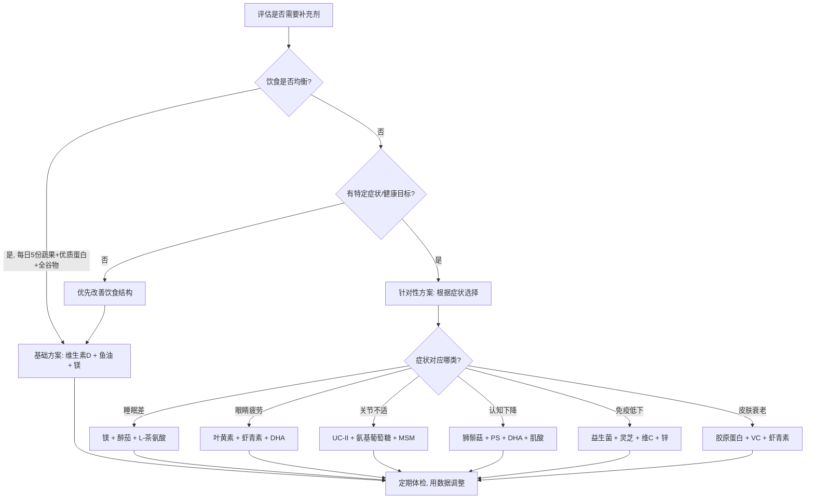

## 二、保健品推荐

保健品不是"智商税"，也不是"万能药"——关键在于选对、用对、补对。本章从科学证据出发，按照"为什么补→补什么→怎么补→怎么选"的逻辑，系统梳理值得考虑的保健品方案。

### 2.1 保健品选择的底层逻辑

在讨论具体产品之前，必须先建立正确的认知框架。

#### 2.1.1 食物优先原则

保健品（dietary supplement）的定位是"补充"，不是"替代"。天然食物中营养素的生物利用度、协同效应和基质效应，是单一补充剂无法复制的。例如：

- 西兰花中的萝卜硫素需要黑芥子酶激活，吃整颗西兰花才能获得完整效果
- 番茄中的番茄红素在加热+油脂条件下吸收率提升5-8倍，补充剂难以模拟这种食物基质
- 坚果中的镁与健康脂肪共存，吸收率优于单独补充

**判断标准**：只有当饮食无法满足需求（如维生素D、Omega-3），或特定生理阶段需要额外支持（如孕期叶酸、老年人B12），才考虑补充剂。

#### 2.1.2 科学证据分级

不是所有"研究表明"都值得信赖。学会判断证据强度，避免被营销话术误导：

| 证据等级 | 来源类型 | 可信度 | 示例 |
|---------|---------|-------|------|
| Ⅰ级 | 多项RCT的Meta分析 | ★★★★★ | 维生素D降低骨折风险 |
| Ⅱ级 | 单项大样本RCT | ★★★★ | Omega-3对心血管保护 |
| Ⅲ级 | 队列研究/病例对照 | ★★★ | 叶黄素预防黄斑变性 |
| Ⅳ级 | 病例报告/专家意见 | ★★ | 多数中药保健品 |
| Ⅴ级 | 体外实验/动物实验 | ★ | "抗氧化""抗衰老"宣传 |

**实操建议**：优先选择有Ⅰ-Ⅱ级证据支持的补充剂。对于只有Ⅳ-Ⅴ级证据的产品，如果价格不高且无安全风险，可以尝试但不要期望过高。

#### 2.1.3 个性化需求矩阵

没有一套"万能补充方案"适合所有人。决定补什么的因素包括：

- **年龄**：30岁后辅酶Q10合成下降，50岁后B12吸收率降低
- **性别**：女性经期需要更多铁，男性不需要额外补铁
- **饮食模式**：素食者缺B12、铁、锌、Omega-3的概率极高
- **生活方式**：室内工作者几乎必然缺乏维生素D
- **健康目标**：健身人群需要更多蛋白质和肌酸，用眼过度者需要叶黄素
- **地域因素**：高纬度地区日照不足，维生素D缺乏更普遍
- **用药情况**：他汀类药物使用者需补CoQ10，二甲双胍使用者需补B12
- **肠道健康**：肠漏症、IBS等消化问题会影响多种营养素吸收

#### 2.1.4 补充剂选择决策流程

### 2.2 基础营养补充（强烈推荐）

这一类是大多数现代人饮食中难以充足获取的营养素，有大量高质量研究支持。

#### 2.2.1 维生素D

**为什么必须补？**

中国成年人维生素D缺乏率高达60-90%（《中华内分泌代谢杂志》2019年数据）。维生素D不仅是钙吸收的"搬运工"，更参与免疫调节、情绪稳定、肌肉功能等200多个生理过程。缺乏维生素D与骨质疏松、抑郁、免疫力低下、甚至某些癌症风险增加相关。

**作用机制**：维生素D在肝脏转化为25(OH)D，再在肾脏转化为活性形式1,25(OH)₂D（骨化三醇），与细胞核内的VDR受体结合，调控超过1000个基因的表达。

**选购要点**：

| 维度 | 推荐 | 说明 |
|------|------|------|
| 形式 | 维生素D3（胆钙化醇） | D3提升血液25(OH)D水平的效率比D2高约87% |
| 剂量 | 1000-2000 IU/天 | 血液水平低于30ng/mL可增至4000IU |
| 搭配 | 同时补充维生素K2（MK-7型） | K2引导钙沉积到骨骼而非血管壁 |
| 载体 | 橄榄油/椰子油胶囊 | 脂溶性维生素需要脂肪载体提升吸收 |
| 检测 | 每6个月查一次25(OH)D | 目标值：40-60ng/mL（100-150nmol/L） |

**品牌参考**：Nature Made（性价比首选）、Doctor's Best（D3+K2组合）、Now Foods（液体滴剂方便儿童和老人）、Thorne（高纯度）。

**服用方法**：随含脂肪的餐食服用（早餐或午餐），脂溶性维生素在有油脂的情况下吸收率提升50%以上。不建议晚上服用——部分人群反映影响睡眠，可能与维生素D参与褪黑素代谢调节有关。

**过量风险**：连续数月每日超过10000 IU可能导致高钙血症（症状：恶心、口渴、尿频、肾结石）。但按推荐剂量服用极为安全，无需担忧。

#### 2.2.2 Omega-3鱼油

**为什么必须补？**

现代饮食中Omega-6与Omega-3的比例严重失衡——理想比例是1:1到4:1，实际达到15:1甚至25:1。这种失衡驱动全身慢性低度炎症，与心血管疾病、关节炎、抑郁症、认知衰退直接相关。

**作用机制**：EPA（二十碳五烯酸）竞争性抑制花生四烯酸代谢，减少促炎因子PGE2和LTB4的生成；DHA（二十二碳六烯酸）是大脑灰质和视网膜磷脂层的关键结构成分，占大脑脂肪酸总量的40%。

**选购要点**：

| 维度 | 推荐 | 说明 |
|------|------|------|
| 形式 | 甘油三酯型（rTG） | 比乙酯型（EE）吸收率高约70% |
| 纯度 | EPA+DHA含量≥60% | 很多便宜鱼油实际Omega-3含量不足30% |
| 来源 | 深海小型鱼（沙丁鱼、鲭鱼） | 食物链底层重金属积累少 |
| 认证 | IFOS五星认证 | 第三方检测氧化值、重金属、纯度 |
| 剂量 | EPA+DHA总量1000-2000mg/天 | 有炎症/心血管问题可增至3000mg |

**品牌参考**：Nordic Naturals（行业标杆，IFOS五星）、Life Extension（Super Omega-3高纯度）、Solgar（磷虾油适合对鱼油反胃的人群）、WHC UnoCardio（高浓度单粒即可达标）。

**服用方法**：随餐服用，分早晚两次。空腹服用容易产生鱼腥味反刍（fish burps），且吸收率降低。冷冻胶囊可以减轻反刍。

**替代方案**：素食者可选藻油DHA，但需额外注意EPA含量——多数藻油只含DHA不含EPA。亚麻籽油含ALA（α-亚麻酸），人体转化为EPA/DHA的效率仅5-15%，不能替代鱼油。

**氧化问题**：鱼油极易氧化，氧化后的鱼油不仅无效还可能有害。购买时注意：①选深色不透明瓶装 ②开封后冷藏保存 ③3个月内用完 ④如果闻到强烈腥臭味或酸败味，立即丢弃。

#### 2.2.3 镁

**为什么必须补？**

镁参与体内300多种酶促反应，包括能量代谢（ATP合成必须有镁参与）、蛋白质合成、肌肉收缩、神经信号传导和血糖调节。根据《中国居民膳食营养素参考摄入量》调查，超过60%的中国人镁摄入量低于推荐值。精加工食品、土壤镁含量下降、压力消耗，是三大原因。

**不同镁形式的区别**：

| 镁形式 | 吸收率 | 主要用途 | 价格 | 适合人群 |
|--------|-------|---------|------|---------|
| 甘氨酸镁 | ★★★★★ | 改善睡眠、放松神经 | 中等 | 睡前服用首选 |
| 柠檬酸镁 | ★★★★ | 通便、全身补充 | 较低 | 便秘人群 |
| 苏糖酸镁 | ★★★★ | 认知功能、大脑健康 | 较高 | 学生/脑力工作者 |
| 氧化镁 | ★★ | 缓解胃酸 | 最低 | 不推荐作为镁补充 |
| 氯化镁 | ★★★ | 外用（镁油喷雾） | 低 | 皮肤吸收途径 |
| 牛磺酸镁 | ★★★★ | 心血管保护、抗焦虑 | 中等 | 心血管关注人群 |

**推荐剂量**：元素镁200-400mg/天。注意看标签上"元素镁"含量，而非化合物总重量。例如甘氨酸镁1000mg只含约140mg元素镁。

**服用方法**：晚上睡前1-2小时服用甘氨酸镁，同时有助于改善睡眠质量。从低剂量（100mg元素镁）开始，逐步增加，避免腹泻。

**品牌参考**：Doctor's Best（甘氨酸镁性价比高）、Thorne（高纯度柠檬酸镁）、Now Foods（多种形式可选）、Magtein（苏糖酸镁专利品牌）。

#### 2.2.4 维生素B族

**为什么重要？**

B族维生素是能量代谢的"催化剂团队"——碳水化合物、脂肪、蛋白质的分解产能，每一步都离不开B族维生素的参与。现代人高精加工饮食、高压力生活、高酒精摄入，都在加速B族维生素的消耗。

**各成员的分工**：

| 维生素 | 关键功能 | 缺乏症状 | 推荐日剂量 |
|--------|---------|---------|-----------|
| B1（硫胺素） | 糖代谢、神经功能 | 疲劳、脚气病 | 1.2-1.4mg |
| B2（核黄素） | 能量代谢、皮肤健康 | 口角炎、畏光 | 1.2-1.4mg |
| B3（烟酸） | NAD+合成、DNA修复 | 糙皮病、疲劳 | 14-16mg |
| B5（泛酸） | 合成辅酶A、脂肪代谢 | 疲劳、失眠 | 5mg |
| B6（吡哆醇） | 神经递质合成、免疫 | 抑郁、贫血 | 1.5-2.0mg |
| B7（生物素） | 脱羧反应、皮肤毛发 | 脱发、皮疹 | 30μg |
| B9（叶酸） | DNA合成、细胞分裂 | 巨幼红细胞贫血 | 400μg |
| B12（钴胺素） | 神经髓鞘、红细胞 | 巨幼红细胞贫血、神经损伤 | 2.4μg |

**B12特别提醒**：50岁以上人群约30%存在萎缩性胃炎，胃酸分泌减少导致B12吸收率大幅下降。素食者几乎100%缺乏B12。B12补充剂应选择甲基钴胺素（methylcobalamin）形式，比氰钴胺素（cyanocobalamin）生物利用度更高，不需要肝脏额外转化。

**活性形式更优**：对于携带MTHFR基因突变（中国人群约25%携带）的人，普通叶酸（folic acid）无法有效转化为活性甲基叶酸（5-MTHF），应直接补充甲基叶酸。同理，B6选择P-5-P（磷酸吡哆醛）形式优于盐酸吡哆醇。

**品牌参考**：Thorne Basic B Complex（全面活性形式）、Jarrow Formulas B-Right（缓释配方）、Garden of Life（食物来源型）。

#### 2.2.5 锌

**为什么重要？**

锌是300多种酶的辅因子，参与DNA合成、免疫功能、伤口愈合、味觉嗅觉维持。中国膳食以植物性食物为主，其中的植酸（phytic acid）会螯合锌，降低吸收率50%以上。

**选购要点**：

- **形式**：吡啶甲酸锌（zinc picolinate）吸收率最高，其次为甘氨酸锌（zinc bisglycinate），葡萄糖酸锌性价比尚可
- **剂量**：元素锌15-30mg/天。长期超过40mg/天需配合补充铜（2mg），因为锌会竞争性抑制铜吸收
- **服用时机**：空腹服用吸收最好，但可能引起恶心。建议随餐服用或选择甘氨酸锌（对胃温和）

**品牌参考**：Thorne Zinc Picolinate、Now Foods Zinc Picolinate、Life Extension Zinc Caps。

#### 2.2.6 维生素C

**为什么需要关注？**

维生素C是人体无法自行合成的必需营养素，参与胶原蛋白合成、免疫细胞功能、铁吸收、抗氧化防御等多项关键生理过程。中国营养学会调查显示，城市居民维生素C摄入量普遍低于推荐的100mg/天，尤其在外卖频繁、蔬果摄入不足的人群中更为突出。

**核心功能解析**：

- **胶原蛋白合成**：维生素C是脯氨酸羟化酶和赖氨酸羟化酶的必需辅因子，没有VC，胶原蛋白无法正确折叠，血管壁、皮肤、肌腱都会变脆弱。这就是坏血病的根本原因
- **免疫增强**：高浓度VC可促进中性粒细胞趋化性和吞噬能力，增强NK细胞活性。感冒期间大剂量VC（1000-2000mg/天）可缩短病程约8%（Cochrane系统综述）
- **铁吸收促进**：VC将三价铁还原为二价铁（更易吸收的形式），非血红素铁的吸收率可提升3-6倍
- **抗氧化网络**：VC是水溶性抗氧化剂，能再生维生素E（脂溶性抗氧化剂），两者协同构成完整的抗氧化防线

**选购要点**：

| 维度 | 推荐 | 说明 |
|------|------|------|
| 形式 | 抗坏血酸（基础）、脂质体VC（高级） | 脂质体VC吸收率更高且不刺激胃 |
| 缓释 | 缓释型优于普通型 | VC半衰期短，缓释型维持血液浓度更稳定 |
| 剂量 | 日常200-500mg/天，免疫需求期1000-2000mg | 超过200mg吸收率开始递减，分次服用更优 |
| 搭配 | 生物类黄酮（如橙皮苷、槲皮素） | 类黄酮可增强VC的生物利用度和抗氧化效力 |

**品牌参考**：Thorne Vitamin C（含生物类黄酮）、NOW Foods C-1000（缓释型）、Lypo-Spheric Vitamin C（脂质体形式，吸收率最高但价格也最高）。

**服用方法**：分2-3次服用（每次不超过500mg），随餐服用减少胃部刺激。肾结石高风险人群每日不超过1000mg，并保持充足饮水。

### 2.3 运动与体能补充剂

无论你是规律健身者、办公室久坐族还是中老年运动爱好者，以下补充剂都与身体机能维护密切相关。

#### 2.3.1 蛋白粉

**为什么需要关注？**

蛋白质是肌肉修复、免疫球蛋白合成、酶和激素制造的基础原料。中国膳食调查数据显示，成年人蛋白质摄入量虽然达标，但分布极不均匀——早餐和午餐蛋白质偏低，晚餐过量。此外，健身人群、老年人（肌肉流失加速）、素食者的蛋白质需求量远高于普通标准。

**蛋白质需求计算**：

- 普通成人：0.8-1.0g/kg体重/天
- 规律运动者：1.2-1.6g/kg体重/天
- 力量训练增肌：1.6-2.2g/kg体重/天
- 老年人（防肌少症）：1.0-1.2g/kg体重/天
- 减脂期（保肌肉）：1.6-2.4g/kg体重/天

**蛋白粉类型对比**：

| 类型 | 吸收速度 | 乳糖含量 | 适合场景 | 价格 |
|------|---------|---------|---------|------|
| 乳清浓缩蛋白（WPC） | 快（1-2h） | 含少量 | 性价比首选 | 较低 |
| 乳清分离蛋白（WPI） | 快（1-2h） | 极低 | 乳糖不耐受者 | 中等 |
| 水解乳清蛋白（WPH） | 最快（30-60min） | 极低 | 术后恢复/训练后即刻补充 | 较高 |
| 酪蛋白（Casein） | 慢（6-8h） | 含少量 | 睡前服用、长时间抗饿 | 中等 |
| 大豆蛋白 | 中等 | 无 | 素食者 | 较低 |
| 豌豆/大米混合蛋白 | 中等 | 无 | 素食者、过敏体质 | 中等 |

**选购关键指标**：

- **蛋白质含量**：每份蛋白质占比≥80%（WPI标准），低于70%的说明添加了过多填充物
- **氨基酸谱**：完整的必需氨基酸谱，尤其关注亮氨酸（leucine）含量≥2.5g/份——亮氨酸是触发肌肉蛋白合成（MPS）的关键信号
- **第三方检测**：选择有NSF或Informed-Choice认证的产品，避免含有未标注的激素或违禁物质
- **重金属检测**：蛋白粉的原料来源和加工工艺可能导致重金属残留，选择有检测报告的品牌

**服用时机**：训练后30-60分钟内是蛋白质合成窗口期（实际窗口比传统认知的更宽，约4-6小时，但训练后及时补充仍有优势）。每餐分配20-40g蛋白质，比集中在一餐摄入效果更好。

**品牌参考**：Optimum Nutrition Gold Standard（全球销量标杆，性价比高）、MyProtein Impact Whey（价格优势明显）、Dymatize ISO100（水解分离蛋白，吸收快）、Vega Sport（植物蛋白中口碑最好）。

#### 2.3.2 肌酸（Creatine）

**为什么值得考虑？**

肌酸不仅是健身增肌的"老朋友"，近年研究发现它对大脑认知功能同样有益。大脑是仅次于肌肉的第二大肌酸消耗器官，补充肌酸可以提升短时记忆、减少精神疲劳，尤其在睡眠不足时效果显著（多项RCT证实）。

**作用机制**：肌酸在肌肉中以磷酸肌酸（PCr）形式储存，高强度运动时PCr快速分解为ATP（肌肉收缩的直接能量来源），补充肌酸可使肌肉PCr储备增加20-40%，从而延长高强度运动持续时间、加速组间恢复。

**选购与使用**：

- **形式**：一水肌酸（creatine monohydrate），这是研究最多、性价比最高的形式，其他形式（盐酸肌酸、缓冲肌酸等）均未证明优于一水肌酸
- **剂量**：3-5g/天，无需加载期（loading phase），持续4周后达到肌肉饱和
- **服用时机**：随餐服用即可，无需精确到训练前后
- **安全性**：超过500项人体研究，未发现对健康人群肾脏有不良影响。但肾功能已受损者应咨询医生
- **搭配**：与碳水化合物同服可增加肌酸摄取率（胰岛素促进肌酸转运），与蛋白质同服同样有效

**常见疑问解答**：

- "肌酸会让体重增加吗？"——初期会增加1-2kg水分（肌肉细胞内水分，非皮下水肿），这是肌酸起效的正常标志，反而让肌肉看起来更饱满
- "需要循环使用吗？"——不需要。目前没有证据表明持续使用肌酸会产生耐受性
- "女性可以服用吗？"——完全可以，女性同样受益于肌酸对认知和体能的提升

**品牌参考**：Creapure（德国产纯度最高的肌酸原料，很多品牌使用Creapure作为原料）、Thorne Creatine、Optimum Nutrition Micronized Creatine。

#### 2.3.3 HMB（β-羟基-β-甲基丁酸）

**为什么值得关注？**

HMB是亮氨酸的代谢产物，在肌肉蛋白质分解（MPB）的抑制方面有独特作用。与肌酸主要促进蛋白质合成不同，HMB主要通过减少肌肉分解来保护肌肉量，尤其适合以下人群：

- **老年人防肌少症**：多项RCT显示HMB（3g/天）配合运动可显著减缓老年人肌肉流失
- **减脂期保肌肉**：热量缺口状态下HMB可减少肌肉分解约50%（与安慰剂对比）
- **卧床恢复期**：术后或受伤卧床期间，HMB可减轻肌肉萎缩

**推荐剂量**：3g/天，分3次随餐服用（每次1g）。选择钙盐形式HMB（HMB-Ca），这是研究最充分的形式。

**品牌参考**：Optimum Nutrition HMB、Metabolic Technologies（HMB专利持有者，原料供应商）、NOW Foods HMB。

**注意事项**：HMB对于已经规律进行力量训练的年轻健康人群效果有限（身体已通过训练建立了抗分解机制），更适用于训练新手、老年人和特殊恢复期人群。

### 2.4 关节与骨骼保护类

关节不适和骨质退化是中老年人最常见的困扰，也是年轻运动人群不可忽视的风险。以下补充剂针对关节和骨骼提供结构层面的支持。

#### 2.4.1 氨基葡萄糖（Glucosamine）

**作用机制**：氨基葡萄糖是关节软骨中蛋白多糖合成的前体物质，理论上补充氨基葡萄糖可以促进软骨修复和维持关节液粘弹性。

**争议与证据**：

氨基葡萄糖的临床证据存在分歧，需要注意：

- **处方级硫酸氨基葡萄糖**（如欧洲处方药Rottapharm）：多项大型RCT证实可缓解骨关节炎疼痛、延缓关节间隙变窄，效果与非甾体抗炎药相当但安全性更好
- **非处方盐酸氨基葡萄糖**：多数大型研究（如NIH的GAIT试验）未能显示显著优于安慰剂的效果

**选购要点**：

| 维度 | 推荐 | 说明 |
|------|------|------|
| 形式 | 硫酸氨基葡萄糖（优先） | 处方级证据最充分；盐酸型效果不确定 |
| 剂量 | 1500mg/天，一次或分三次 | 坚持至少8-12周才能评估效果 |
| 来源 | 虾蟹壳提取或植物发酵 | 海鲜过敏者选植物发酵来源 |
| 搭配 | 硫酸软骨素400-800mg/天 | 两者可能有协同效应 |

**品牌参考**：Doctor's Best Glucosamine Chondroitin MSM（复合配方）、NOW Foods Glucosamine & Chondroitin、Solgar Glucosamine Hyalurobiotic Acid Complex。

**重要提示**：如果连续服用12周后无明显改善，说明氨基葡萄糖可能不适合你，不必继续消耗预算。

#### 2.4.2 非变性Ⅱ型胶原蛋白（UC-II）

**为什么比氨基葡萄糖更值得尝试？**

UC-II是一种通过低温提取保持天然三螺旋结构的Ⅱ型胶原蛋白，作用机制与氨基葡萄糖完全不同——它通过"口服免疫耐受"机制，训练免疫系统停止攻击关节软骨（骨关节炎本质上包含自身免疫成分）。

**临床证据**：多项RCT显示，每天仅需40mg UC-II的效果优于1500mg氨基葡萄糖+1200mg硫酸软骨素的组合（Ossieur et al., 2003）。症状改善率UC-II组为33%，氨基葡萄糖+软骨素组为14%。

**使用方法**：每天40mg，空腹服用（与食物同服可能降低免疫耐受效果），坚持至少3-6个月。

**品牌参考**：Doctor's Best UC-II（使用Lonza专利原料）、NOW Foods UC-II、Life Extension Bio-Collagen with UC-II。

#### 2.4.3 MSM（甲基磺酰甲烷）

MSM是一种有机硫化合物，硫是合成软骨基质（蛋白多糖和胶原蛋白）中二硫键的关键元素。临床研究显示MSM（3g/天）可减轻骨关节炎疼痛和改善关节功能。

**搭配建议**：MSM常与氨基葡萄糖和软骨素组合使用，三者通过不同机制（结构补充+免疫调节+抗炎抗氧化）协同保护关节。

**品牌参考**：Doctor's Best MSM、NOW Foods MSM、Jarrow Formulas MSM。

#### 2.4.4 钙与骨骼健康

**为什么不能只补钙？**

单纯补钙不等于骨骼健康。钙的吸收（维生素D决定）、转运（维生素K2决定）、沉积位置（K2再次关键）、流失速率（酸性饮食、咖啡因、高盐加速流失）都需要同时关注。

**骨骼健康完整方案**：

| 营养素 | 作用 | 推荐剂量 | 来源 |
|--------|------|---------|------|
| 钙 | 骨骼基质矿化 | 500-1000mg/天（饮食+补充） | 食物优先：奶制品、豆腐、芝麻 |
| 维生素D3 | 促进肠道钙吸收 | 1000-2000IU/天 | 阳光+补充剂 |
| 维生素K2 | 引导钙沉积到骨骼 | 100-200μg/天（MK-7型） | 纳豆、发酵食品、补充剂 |
| 镁 | 骨骼矿化+调节PTH | 200-400mg/天 | 绿叶蔬菜、坚果、补充剂 |
| 硅 | 促进胶原蛋白交联 | 6-10mg/天 | 竹子提取物、啤酒 |

**钙的形式选择**：

- **柠檬酸钙**：吸收率较高（约24%），不依赖胃酸，适合老年人和服用抑酸药的人群
- **碳酸钙**：价格最低但需胃酸辅助吸收（约39%空腹吸收率，随餐服用提升），可能引起胀气
- **羟基磷灰石钙**：模拟骨骼天然结构，含有钙+磷+微量矿物质，骨密度提升效果可能优于其他形式

**关键提醒**：钙的单次吸收上限约500mg，超过此量吸收率急剧下降。每天分2次服用，每次不超过500mg。

### 2.5 认知与神经系统类

随着年龄增长和高强度脑力劳动的普及，认知功能维护成为越来越多人关注的需求。以下补充剂有科学证据支持其对大脑功能的正面影响。

#### 2.5.1 磷脂酰丝氨酸（PS）

**作用机制**：PS是大脑细胞膜磷脂双分子层的关键组成成分，占大脑磷脂总量的15%。它通过维持细胞膜流动性、促进神经递质释放（乙酰胆碱、多巴胺）、调节皮质醇水平来支持认知功能。

**临床证据**：

- 2010年《J Clin Biochem Nutr》RCT：300mg/天PS持续90天，改善老年受试者记忆力和认知处理速度
- FDA允许PS标注"认知功能减退风险降低"的有限健康声明（qualified health claim）
- 运动前服用PS可降低运动后皮质醇水平，减轻训练应激

**选购与使用**：

- **来源**：大豆来源PS vs. 大脑磷脂来源PS——后者更接近人体天然PS结构，但价格极高；大豆来源PS已被多项临床研究验证有效
- **剂量**：100-300mg/天，建议从100mg开始
- **服用时机**：随含脂肪的餐食服用（磷脂是脂溶性的）
- **起效时间**：4-8周开始感知认知改善

**品牌参考**：Jarrow Formulas PS 100、NOW Foods Phosphatidyl Serine、Doctor's Best Phosphatidylserine。

#### 2.5.2 狮鬃菇（Lion's Mane / Hericium erinaceus）

**为什么值得关注？**

狮鬃菇是目前研究证据最充分的促智功能蘑菇。其活性成分猴头菌酮（hericenones）和猴头菌素（erinacines）是少数被证实能穿越血脑屏障、刺激神经生长因子（NGF）合成的天然物质。

**临床证据**：

- 2009年《Phytother Res》RCT：日本轻度认知障碍患者服用狮鬃菇提取物3000mg/天，持续16周，认知评分显著改善，停用后效果消退——说明需要持续服用
- 动物研究显示狮鬃菇可促进周围神经再生和髓鞘修复

**选购与使用**：

- **来源**：选择子实体（fruiting body）提取，而非菌丝体（mycelium on grain）——后者含大量淀粉填充物，活性成分浓度低
- **标准化提取物**：关注β-葡聚糖含量≥30%
- **剂量**：500-3000mg/天（标准化提取物）
- **服用时机**：随餐服用

**品牌参考**：Real Mushrooms（纯子实体提取，β-葡聚糖含量透明标注）、Host Defense（知名度高但部分产品使用菌丝体，注意区分）、Nootropics Depot Lion's Mane（高纯度标准化提取）。

#### 2.5.3 L-茶氨酸（L-Theanine）

**作用机制**：L-茶氨酸是绿茶中特有的氨基酸，能穿越血脑屏障，促进α脑波产生（放松而不困倦的脑波状态），增加GABA、血清素和多巴胺水平，同时降低皮质醇。

**核心效果**：

- **放松不嗜睡**：200mg L-茶氨酸可在30-40分钟内产生显著的放松感，不影响注意力和反应速度
- **咖啡因的完美搭档**：L-茶氨酸100-200mg + 咖啡因100mg的组合被多项研究证实可提升专注力、减少咖啡因引起的焦虑和心悸
- **改善睡眠质量**：睡前服用可缩短入睡时间、提升深度睡眠比例

**选购与使用**：

- **剂量**：100-400mg/天。日常提神100-200mg，焦虑缓解200-400mg，助眠200mg（睡前30分钟）
- **来源**：Suntheanine是专利发酵来源，纯度最高
- **安全性**：极佳，无已知严重副作用，不产生依赖

**品牌参考**：NOW Foods L-Theanine 200mg、Jarrow Formulas Theanine 200、Nootropics Depot L-Theanine（Suntheanine原料）。

#### 2.5.4 GABA（γ-氨基丁酸）

GABA是大脑中主要的抑制性神经递质，直接参与焦虑调节和睡眠诱导。

**补充剂GABA能否穿越血脑屏障？**

这是一个有争议的问题。传统观点认为外源GABA无法穿越血脑屏障，但近年研究（2015年《Frontiers in Psychology》）发现口服GABA确实能在短时间内改变脑波模式和主观焦虑评分，可能通过肠脑轴（肠道迷走神经通路）间接发挥作用。

**使用建议**：

- **剂量**：100-750mg/天，睡前30-60分钟服用
- **与L-茶氨酸搭配**：GABA 100mg + L-茶氨酸 200mg是经典的睡前放松组合
- **注意**：部分人服用后会有轻微刺痛感（"GABA flush"），这是正常的神经反应，通常10-15分钟消退

**品牌参考**：NOW Foods GABA、Pharma GABA（天然发酵来源，效果可能优于合成型）、Thorne PharmaGABA。

### 2.6 功能性补充剂（按需选择）

这一类针对特定健康需求，应根据个人情况选择性补充，而非人人必备。

#### 2.6.1 益生菌

**为什么值得考虑？**

肠道微生物组被称为"第二大脑"——它不仅消化食物、合成维生素，还通过"肠-脑轴"影响情绪、认知和免疫。抗生素使用、高糖饮食、压力都会破坏肠道菌群平衡。

**选购关键指标**：

| 指标 | 要求 | 说明 |
|------|------|------|
| 菌株数量 | 10种以上 | 多样性越高越好 |
| 活菌数 | ≥100亿CFU/粒 | 能存活到肠道的才是有效菌 |
| 耐酸技术 | 微胶囊/肠溶包衣 | 胃酸会杀死90%以上的菌 |
| 临床验证 | 有具体菌株编号 | 如Lactobacillus rhamnosus GG，而非只写"乳酸杆菌" |
| 保质期 | 冷藏或室温稳定技术 | 过期益生菌活菌数急剧下降 |

**核心菌株推荐**：

- **Lactobacillus rhamnosus GG**：临床研究最多（超过1000项），改善腹泻、增强免疫
- **Bifidobacterium longum BB536**：改善肠道环境、减少过敏反应
- **Lactobacillus plantarum 299v**：缓解IBS（肠易激综合征）效果显著
- **Saccharomyces boulardii**：酵母益生菌，抗生素相关腹泻的首选
- **Lactobacillus reuteri DSM 17938**：改善幽门螺杆菌感染、促进肠道屏障修复

**益生菌与益生元的关系**：

益生菌是有益活菌，益生元（prebiotics）是喂养益生菌的"食物"——主要是膳食纤维、低聚果糖（FOS）、低聚半乳糖（GOS）和抗性淀粉。单独补充益生菌而不摄入足够的益生元，就像往空房子里放人却不给食物——益生菌无法定殖。选择含益生元的合生元（synbiotics）产品，或日常多吃洋葱、大蒜、香蕉、燕麦等富含益生元的食物。

**服用建议**：空腹或餐前30分钟服用，此时胃酸pH值较高（酸性较弱），活菌存活率更高。抗生素期间需间隔2小时以上服用。持续服用4-8周才能看到明显效果。

**品牌参考**：Culturelle（含LGG菌株，证据最充分）、Garden of Life Raw Probiotics（菌株多样性高）、VSL#3（高浓度处方级）、Seed DS-01（双层胶囊技术）。

**饮食来源同样重要**：泡菜、酸奶、味噌、康普茶、酸菜等发酵食品含有天然益生菌和益生元，性价比远高于补充剂。

#### 2.6.2 辅酶Q10（CoQ10）

**为什么值得考虑？**

辅酶Q10是线粒体电子传递链的核心组分，直接参与ATP（细胞能量货币）的合成。人体从30岁开始CoQ10合成能力逐年下降——40岁时比20岁减少约30%，70岁时减少超过50%。此外，服用他汀类降脂药（如阿托伐他汀、辛伐他汀）会显著抑制CoQ10合成，这类人群尤其需要补充。

**两种形式的区别**：

- **泛醌（Ubiquinone）**：氧化型，价格较低，需在体内转化为泛醇才能发挥作用
- **泛醇（Ubiquinol）**：还原型，直接具有生物活性，吸收率比泛醌高约2-8倍，但价格更高

**推荐剂量**：日常维护100mg/天，心血管支持200mg/天，他汀类药物使用者200-300mg/天。随含脂肪的餐食服用，脂溶性物质吸收需要脂肪辅助。

**品牌参考**：Jarrow Formulas QH-Absorb（泛醇形式，吸收率高）、Life Extension Super Ubiquinol（高剂量）、Now Foods（泛醌形式性价比高）。

#### 2.6.3 叶黄素与玉米黄质

**为什么值得考虑？**

叶黄素和玉米黄质是视网膜黄斑区唯一存在的类胡萝卜素，形成"黄斑色素"，像天然太阳镜一样过滤有害蓝光、中和自由基。人体无法自行合成，只能从食物或补充剂获取。

长期使用电子屏幕（每天6小时以上）的人群，视网膜承受的蓝光氧化压力远超自然状态。AREDS2（年龄相关性眼病研究2号）大规模临床试验确认，叶黄素10mg+玉米黄质2mg每日可显著降低中晚期年龄相关性黄斑变性进展风险约26%。

**选购要点**：

- **配比**：叶黄素:玉米黄质 = 5:1（模拟黄斑天然比例）
- **来源**：万寿菊提取（Tagetes erecta）是主流来源，纯度高
- **形式**：游离态叶黄素（free lutein）比酯化态吸收率高约20%
- **剂量**：叶黄素10-20mg/天，玉米黄质2-4mg/天
- **起效时间**：需持续补充3-6个月黄斑色素密度才能显著提升
- **搭配**：与含脂肪的餐食同服（类胡萝卜素是脂溶性的），可搭配虾青素（astaxanthin）增强效果

**虾青素补充**：虾青素（astaxanthin）是已知最强的天然抗氧化剂之一（抗氧化能力是维E的550倍、维C的6000倍），同时能穿越血脑屏障和血视网膜屏障。4-12mg/天的虾青素可缓解视疲劳、改善眼球调节能力，与叶黄素协同保护眼部健康。

**品牌参考**：Life Extension MacuGuard（含叶黄素+玉米黄质+虾青素）、Doctor's Best Lutein with FloraGLO、Now Foods Lutein & Zeaxanthin。

#### 2.6.4 胶原蛋白

**为什么值得考虑？**

胶原蛋白占人体蛋白质总量的30%，是皮肤、肌腱、韧带、软骨的主要结构成分。从25岁开始，胶原蛋白每年流失约1-1.5%，皮肤松弛、关节不适是最早出现的信号。

**科学证据**：多项RCT显示，口服水解胶原蛋白肽（2.5-15g/天，持续8-12周）可以改善皮肤弹性、减少皱纹深度、增加皮肤水分含量。机制是胶原蛋白肽被消化为二肽三肽（特别是Pro-Hyp），这些小肽片段被吸收后刺激成纤维细胞增殖并促进新胶原合成。

**选购要点**：

| 维度 | 推荐 | 说明 |
|------|------|------|
| 类型 | Ⅰ型+Ⅲ型（皮肤）、Ⅱ型（关节） | 不同类型针对不同组织 |
| 来源 | 深海鱼皮（Ⅰ型）、牛软骨（Ⅱ型） | 鱼源分子量更小吸收更好 |
| 分子量 | 2000-5000道尔顿 | 水解胶原蛋白肽吸收率远高于未水解形式 |
| 剂量 | 皮肤：5-10g/天，关节：10-15g/天 | 空腹服用或随餐均可 |
| 搭配 | 维生素C | VC是胶原蛋白合成的必需辅因子 |

**品牌参考**：Vital Proteins（牛源Ⅰ+Ⅲ型）、Sports Research（鱼源水解肽）、NeoCell（多种类型可选）、Doctor's Best UC-II（Ⅱ型非变性胶原蛋白，关节专用40mg/天）。

#### 2.6.5 适应原类草本

适应原（adaptogens）是一类帮助身体抵抗压力、恢复平衡的天然植物。它们通过调节HPA轴（下丘脑-垂体-肾上腺轴）来优化皮质醇水平，不会过度刺激也不会过度抑制。

**南非醉茄（Ashwagandha）**：

- **核心功效**：降低皮质醇（多项RCT证实降低14-28%）、改善睡眠、减轻焦虑、支持甲状腺功能
- **有效成分**：withanolides（醉茄内酯），标准化含量≥5%
- **推荐剂量**：KSM-66专利提取物300-600mg/天，或Sensoril 125-250mg/天
- **注意事项**：甲状腺功能亢进者慎用（可能刺激甲状腺），孕期禁用
- **品牌参考**：Jarrow Formulas KSM-66、Life Extension Standardized Ashwagandha

**红景天（Rhodiola Rosea）**：

- **核心功效**：抗疲劳、提升认知、改善运动表现、调节情绪
- **有效成分**：rosavins（红景天苷）3% + salidroside（酪醇）1%
- **推荐剂量**：200-400mg/天，早晨空腹服用（下午服用可能影响睡眠）
- **注意事项**：双相情感障碍患者慎用，可能诱发躁狂期
- **品牌参考**：Gaia Herbs Rhodiola、Now Foods Rhodiola、Doctor's Best Rhodiola

**灵芝（Reishi）**：

- **核心功效**：免疫调节、改善睡眠、抗氧化、肝脏保护
- **有效成分**：β-葡聚糖、三萜类化合物
- **推荐剂量**：标准化提取物1000-2000mg/天
- **注意事项**：选择子实体（fruiting body）提取而非菌丝体（mycelium），三萜含量更高
- **品牌参考**：Real Mushrooms、Host Defense、Four Sigmatic

**其他值得关注的适应原**：

- **刺五加（Eleutherococcus senticosus）**：提升体力和耐力、增强免疫，前苏联宇航员和运动员的"秘密武器"。剂量300-1200mg/天标准化提取物
- **玛卡（Maca）**：改善性功能、提升能量、调节激素平衡，尤其对围绝经期女性有效。剂量1500-3000mg/天。选择Gelatinized Maca（糊化玛卡），更易消化吸收

#### 2.6.6 N-乙酰半胱氨酸（NAC）

NAC是谷胱甘肽（人体最强大的内源性抗氧化剂）的前体。直接补充谷胱甘肽口服吸收率极低，而NAC可以有效提升体内谷胱甘肽水平。

- **核心功效**：抗氧化、肝脏保护（对乙酰氨基酚中毒的临床解毒剂）、黏液溶解（化痰）、改善胰岛素敏感性
- **推荐剂量**：600-1200mg/天
- **注意事项**：空腹服用可能引起恶心，建议随餐。哮喘患者使用气雾剂形式需谨慎
- **品牌参考**：Jarrow Formulas NAC Sustain（缓释）、Now Foods NAC、Life Extension N-Acetyl-L-Cysteine

#### 2.6.7 NMN/NR与亚精胺（抗衰老方向）

**NMN（烟酰胺单核苷酸）与NR（烟酰胺核糖苷）**：

NMN和NR都是NAD+（烟酰胺腺嘌呤二核苷酸）的前体。NAD+是细胞能量代谢、DNA修复、Sirtuin（长寿蛋白）激活的关键辅酶，但NAD+水平从30岁开始显著下降——每20年下降约50%。

**作用机制**：补充NMN/NR可在数小时内提升血液和组织中的NAD+水平，激活SIRT1等长寿蛋白，改善线粒体功能、增强DNA修复能力。

**证据现状**：

- 动物研究（哈佛大学David Sinclair团队）：NMN显著逆转小鼠血管老化和肌肉萎缩
- 人体研究：多项小型RCT显示NR（300mg/天）可提升血液NAD+约40-50%，改善部分代谢指标
- NMN的人体数据正在快速积累，2022年发表在《Science》的研究确认NMN可改善中年人的胰岛素敏感性
- 目前仍属于Ⅲ-Ⅳ级证据水平，长期安全性和确切临床获益尚待更多大规模研究

**选购要点**：

| 维度 | NMN | NR |
|------|-----|-----|
| NAD+提升路径 | NMN → NAD+（一步） | NR → NMN → NAD+（两步） |
| 人体数据 | 快速增长中 | 更多更成熟 |
| 典型剂量 | 250-500mg/天 | 300mg/天 |
| 稳定性 | 对温度和湿度敏感 | 更稳定 |
| 价格 | 较高 | 中等 |

**品牌参考**：ProHealth Longevity NMN、Tru Niagen NR（唯一获得FDA GRAS认证的NR品牌）、Elysium Basis（NR+紫檀芪组合）。

**亚精胺（Spermidine）**：

亚精胺是一种天然多胺，存在于小麦胚芽、大豆、陈年奶酪等食物中。它是最强的天然自噬（autophagy）激活剂——自噬是细胞"自我清洁"机制，清除受损蛋白质和功能异常的细胞器，与延缓衰老密切相关。

- **流行病学证据**：2018年《The American Journal of Clinical Nutrition》：829名参与者中，膳食亚精胺摄入量最高组的全因死亡率比最低组低约40%
- **补充剂剂量**：1-6mg/天（小麦胚芽提取物）
- **品牌参考**：NOVOS Spermidine、Longevity Labs spermidineLIFE

#### 2.6.8 运动前补充剂与能量补剂

**咖啡因**：

咖啡因是全球使用最广泛的促效物质，被ISSN（国际运动营养学会）确认为有效的运动增效剂。

- **机制**：拮抗腺苷受体（减少疲劳感）、促进脂肪氧化、增强肌肉收缩力
- **剂量**：3-6mg/kg体重（70kg成人约200-420mg），运动前30-60分钟服用
- **耐受性管理**：连续使用会产生耐受性，建议周期性使用（2-3周后停1周）
- **来源**：咖啡（最经济）、咖啡因片（精确控制剂量）、绿茶提取物（含L-茶氨酸缓冲）

**β-丙氨酸**：

β-丙氨酸通过合成肌肽（carnosine）来缓冲肌肉中的乳酸堆积，延长高强度运动的持续时间。

- **剂量**：3.2-6.4g/天，分次服用减少皮肤刺痛感（paresthesia）
- **起效时间**：需要2-4周持续补充才能使肌肉肌肽水平充分升高
- **适合人群**：1-4分钟高强度运动（如400米跑、高强度间歇训练）效果最明显
- **品牌参考**：NOW Foods Beta-Alanine、Optimum Nutrition Beta-Alanine

### 2.7 中药保健品

中药养生有着数千年的实践积累，现代研究也在逐步验证其活性成分和作用机制。选择中药保健品时，应兼顾传统经验和现代科学证据。

#### 2.7.1 枸杞（Lycium barbarum）

**现代研究发现**：

枸杞多糖（LBP）是核心活性成分，具有免疫调节、抗氧化、神经保护和视网膜保护作用。2019年发表在《Nutrients》的系统综述确认，枸杞中的玉米黄质含量是已知食物中最高的（每100g含约150mg），对黄斑健康有显著保护作用。

**选择与使用**：

| 维度 | 要求 | 说明 |
|------|------|------|
| 产地 | 宁夏中宁 | 道地产区，多糖含量最高 |
| 外观 | 颜色自然暗红、不均匀 | 过于鲜亮可能是硫磺熏蒸 |
| 形态 | 干果粒、不粘连 | 粘连可能含糖或受潮 |
| 日剂量 | 10-15g（约20-30粒） | 不宜过量，温热性体质减半 |
| 食用方式 | 干嚼 > 泡水 > 煲汤 | 干嚼营养保留最完整 |

**禁忌人群**：感冒发热期间暂停（温补可能加重症状）、腹泻期间暂停、脾虚湿盛者（舌苔厚腻）减量。

#### 2.7.2 黄芪（Astragalus membranaceus）

**现代研究发现**：

黄芪多糖（APS）和黄芪甲苷（astragaloside IV）是两大核心成分。黄芪多糖能激活巨噬细胞和NK细胞，增强先天免疫；黄芪甲苷具有抗炎、抗氧化、甚至激活端粒酶的潜力（哈佛大学2009年发表在《Aging Cell》的研究）。

**选择与使用**：

- **选材**：内蒙古或甘肃产的蒙古黄芪，切片均匀、颜色黄白、断面有菊花心纹理
- **日剂量**：10-30g（泡水用10g，煲汤可用30g）
- **经典搭配**：黄芪+枸杞+红枣（气血双补），黄芪+当归（补气生血，比例5:1）
- **服用时机**：上午服用最佳（补气之品上午阳气上升时效果更佳）

**禁忌**：阴虚火旺者（手足心热、盗汗、口干不欲饮）慎用，感冒发热期间暂停。

#### 2.7.3 三七（Panax notoginseng）

**现代研究发现**：

三七总皂苷（PNS）能抑制血小板聚集、扩张血管、改善微循环，同时具有抗炎和神经保护作用。中国多项临床研究显示三七粉辅助改善血液循环和轻度高血压。

**选择与使用**：

- **选材**：文山三七为道地药材，"头数"越少个头越大品质越好——20头（每20个达一斤）优于40头
- **日剂量**：3-5g，分2次温水冲服
- **服用时机**：早晚各一次，饭前30分钟服用吸收更好

**重要禁忌**：

- 孕妇绝对禁用（活血化瘀可能导致流产）
- 月经期间暂停（可能增加经血量）
- 正在服用抗凝血药（华法林、阿司匹林等）者禁用
- 手术前2周停用

#### 2.7.4 灵芝与破壁灵芝孢子粉

**现代研究发现**：

灵芝三萜（ganoderic acids）和灵芝多糖（GLP）是两大活性成分群。三萜类具有抗肿瘤、保肝、抗炎活性；多糖类通过激活免疫细胞受体（如Dectin-1、TLR4）增强免疫应答。

**选购要点**：

- **优先破壁孢子粉**：灵芝孢子的细胞壁有几丁质外壳，不破壁吸收率仅10-20%，破壁后可达90%以上
- **破壁技术**：低温物理碾压破壁优于化学或高温方法，保留活性成分更完整
- **看三萜含量**：优质产品三萜含量≥5%
- **日剂量**：破壁孢子粉2-4g/天，灵芝提取物1000-2000mg/天

**品牌参考**：寿仙谷（国内知名品牌）、同仁堂、中科灵芝。

#### 2.7.5 其他值得了解的中药保健品

**当归**（Angelica sinensis）：补血活血、调经止痛。核心成分阿魏酸（ferulic acid）具有抗氧化和改善微循环的作用。适合血虚面色萎黄、月经不调的女性。日剂量6-12g。注意：月经量大者经期暂停，孕妇需遵医嘱。

**党参**（Codonopsis pilosula）：补中益气、健脾益肺。药力较人参温和，适合作为日常"气虚"调养。核心成分党参多糖能促进造血功能和免疫调节。日剂量10-30g。

**陈皮**（Citrus reticulata）：理气健脾、燥湿化痰。核心成分橙皮苷（hesperidin）具有抗炎、改善血管弹性的作用。存放越久药效越佳（"陈"皮之意）。日剂量6-10g。适合脾胃虚弱、痰湿体质。

**藏红花**（Crocus sativus）：活血化瘀、解郁安神。核心成分藏红花素（crocin）和藏红花醛（safranal）具有抗抑郁、改善PMS（经前综合征）的临床证据（多项RCT证实效果接近氟西汀）。日剂量3-5根花丝泡水。价格较高但用量极小。注意：孕妇禁用。

### 2.8 补充剂组合与服用策略

单独补充是一回事，多种补充剂如何搭配、何时服用又是另一门学问。

#### 2.8.1 最佳服用时间

| 服用时间 | 适合的补充剂 | 原因 |
|---------|------------|------|
| 早晨空腹 | 红景天、益生菌、NAC | 空腹吸收更好，红景天不影响睡眠 |
| 随早餐（含脂肪） | 维生素D3、鱼油、CoQ10、叶黄素 | 脂溶性成分需要脂肪辅助吸收 |
| 随午餐 | B族维生素、锌、铁 | B族可能影响睡眠，铁空腹易恶心 |
| 睡前1-2小时 | 镁（甘氨酸镁）、南非醉茄、GABA | 促进放松和睡眠 |
| 任意餐后 | 胶原蛋白、肌酸、灵芝 | 对服用时机不敏感 |
| 训练前30-60min | 咖啡因、β-丙氨酸 | 提升运动表现 |
| 训练后30min | 蛋白粉、肌酸 | 肌肉修复窗口 |

#### 2.8.2 协同增效组合

以下组合能产生1+1>2的效果：

- **维生素D3 + 维生素K2 + 钙**：D3促进钙吸收，K2引导钙沉积到骨骼。缺K2时补D3和钙，钙可能沉积到血管壁
- **鱼油 + 维生素E**：E保护鱼油中的Omega-3不被氧化
- **铁 + 维生素C**：VC可将非血红素铁的吸收率提升3-6倍
- **胶原蛋白 + 维生素C**：VC是脯氨酸羟化酶的辅因子，缺VC胶原蛋白无法正常合成
- **镁 + B6**：B6促进镁进入细胞内，两者协同改善神经功能
- **咖啡因 + L-茶氨酸**：茶氨酸消除咖啡因焦虑副作用，保留专注力提升效果
- **肌酸 + 碳水化合物**：胰岛素促进肌酸转运至肌肉细胞，同服提升摄取率
- **叶黄素 + 虾青素 + DHA**：三者协同保护视网膜，分别作用于蓝光过滤、抗氧化和细胞膜结构

#### 2.8.3 需要避免的组合

| 禁忌组合 | 原因 | 解决方案 |
|---------|------|---------|
| 铁 + 钙 | 钙竞争性抑制铁吸收 | 间隔2小时以上 |
| 铁 + 绿茶/咖啡 | 鞣酸螯合铁，降低吸收60%+ | 间隔1-2小时 |
| 锌 + 铜（高剂量锌） | 锌竞争性抑制铜吸收 | 长期补锌需同时补铜2mg |
| 甲状腺药物 + 钙/铁 | 影响甲状腺药物吸收 | 甲状腺药空腹服用，4小时后再补 |
| 华法林 + 维生素K/鱼油/三七 | 增加出血风险 | 必须咨询医生 |
| 高剂量VC + 铁过载 | VC促进铁吸收，对血色病患者危险 | 铁过载患者避免大剂量VC |
| 益生菌 + 抗生素（同服） | 抗生素杀死益生菌 | 间隔2小时以上 |
| NAC + 硝酸甘油 | 可能导致严重低血压 | 避免同服 |

#### 2.8.4 起效时间预期

补充剂不是药物，不会立竿见影。建立合理的预期很重要：

- **1-2周**：镁改善睡眠、B族提升能量、益生菌改善消化、L-茶氨酸即刻放松
- **4-6周**：维生素D提升血液水平、南非醉茄降低皮质醇、肌酸达到肌肉饱和
- **8-12周**：胶原蛋白改善皮肤弹性、叶黄素提升黄斑色素密度、狮鬃菇改善认知
- **3-6个月**：鱼油改善血脂指标、中药保健品的全身调理效果、UC-II改善关节

### 2.9 质量把控与选购指南

保健品市场监管差异大，学会辨别质量是保护自己的第一道防线。

#### 2.9.1 认证标志解读

| 认证机构 | 含义 | 可信度 |
|---------|------|-------|
| USP（美国药典） | 验证成分纯度、效力和溶出度 | ★★★★★ |
| NSF International | 第三方GMP认证+成分验证 | ★★★★★ |
| IFOS（国际鱼油标准） | 专门检测鱼油纯度、氧化度、重金属 | ★★★★★ |
| ConsumerLab | 独立消费者测试机构 | ★★★★ |
| Informed-Sport | 运动补充剂无违禁物质认证 | ★★★★ |
| GMP（良好生产规范） | 基本生产标准 | ★★★ |
| "蓝帽子"（中国） | 国家保健食品批准文号 | ★★★ |

**关键提醒**：有认证不等于有效，但无认证一定缺乏保障。对于进口产品，至少应有GMP认证；对于鱼油，优选IFOS五星产品。

#### 2.9.2 剂型选择指南

| 剂型 | 优点 | 缺点 | 适合 |
|------|------|------|------|
| 软胶囊 | 保护脂溶性成分、易吞服 | 含明胶（素食者不适用） | 鱼油、维生素D、CoQ10 |
| 硬胶囊 | 不含油脂、素食友好 | 不适合脂溶性成分 | 益生菌、B族、NAC |
| 片剂 | 成本低、剂量精确 | 崩解慢、可能含粘合剂 | 维生素C、钙 |
| 粉末 | 剂量灵活、吸收快 | 口感差、需计量 | 肌酸、胶原蛋白、镁 |
| 液体 | 吸收最快、可调剂量 | 保存不便、价格较高 | 维生素D（儿童/老人）、B12 |
| 软糖 | 口感好、易坚持 | 含糖、剂量通常偏低 | 儿童维生素、入门者 |

#### 2.9.3 预算分级方案

**基础方案（月均100-200元）**——覆盖最关键的补充：

- 维生素D3 2000IU：约30元/月
- 鱼油（EPA+DHA 1000mg）：约60元/月
- 镁（甘氨酸镁）：约40元/月
- 复合B族：约30元/月

**进阶方案（月均300-500元）**——增加功能性补充：

- 基础方案所有项目
- 益生菌：约80元/月
- 叶黄素10mg：约50元/月
- 辅酶Q10 100mg：约60元/月

**全面方案（月均500-800元）**——针对特定健康目标：

- 进阶方案所有项目
- 胶原蛋白肽：约100元/月
- 适应原（南非醉茄或红景天）：约60元/月
- 中药保健品（枸杞/黄芪）：约50元/月

**高阶抗衰方案（月均1000-1500元）**——面向健康优化极致人群：

- 全面方案所有项目
- NMN/NR：约200-400元/月
- 亚精胺：约100-150元/月
- 虾青素：约60元/月
- PS（磷脂酰丝氨酸）：约80元/月

**省钱技巧**：①选择大包装（180粒/瓶比60粒/瓶单价低30-50%） ②关注品牌官网促销活动 ③订阅自动配送通常有额外折扣 ④iHerb等跨境电商经常有满减活动 ⑤关注黑五、Prime Day等大促囤货 ⑥使用比价工具（如iHerb比价插件）

### 2.10 个性化方案设计

#### 2.10.1 按年龄段

**20-30岁**：
- 重点：维生素D、镁、B族（打基础）
- 特别关注：女性注意铁和叶酸（备孕期提前补充）
- 可选：肌酸（体能和认知双收益）、L-茶氨酸（应对学业/工作压力）
- 预算：基础方案即可

**30-40岁**：
- 重点：增加鱼油、CoQ10（从30岁开始CoQ10合成下降）
- 特别关注：久坐人群加叶黄素，高压人群加适应原
- 可选：胶原蛋白肽（25岁后开始流失）、益生菌
- 预算：进阶方案

**40-50岁**：
- 重点：增加胶原蛋白、NAC、更关注心血管健康
- 特别关注：他汀类药物使用者必补CoQ10，围绝经期女性关注大豆异黄酮
- 可选：关节保护（UC-II/氨基葡萄糖）、PS（认知维护）
- 预算：进阶到全面方案

**50岁以上**：
- 重点：B12（吸收率下降）、钙+D3+K2（骨质疏松预防）、认知功能支持
- 特别关注：定期检测同型半胱氨酸水平（B族缺乏的敏感指标）
- 可选：NMN/NR（抗衰方向）、狮鬃菇（认知保护）、HMB（防肌少症）
- 预算：全面方案+个性化调整

#### 2.10.2 按生活方式

**久坐办公族**：
- 核心组合：维生素D + 叶黄素 + 镁 + 鱼油 + 肌酸（抗脑疲劳）
- 眼部重点：叶黄素10mg + 虾青素4mg + DHA 500mg（屏幕蓝光防护三重奏）
- 肩颈肌肉：镁 400mg（缓解肌肉紧张）+ Omega-3（抗炎）
- 认知优化：PS 100mg + L-茶氨酸 200mg（配合咖啡使用效果翻倍）
- 预算：月均400-600元

**健身运动族**：
- 基础：肌酸 5g + 蛋白粉 1-2份/天 + 镁 + 鱼油 + 维生素D
- 增肌重点：增加HMB 3g/天（新手或减脂期）
- 关节保护：UC-II 40mg + MSM 3g（高冲击运动者）
- 恢复加速：NAC 600mg（减轻氧化应激）+ 胶原蛋白（关节+肌腱修复）
- 运动前：咖啡因 200mg + β-丙氨酸 3.2g（高强度训练日）
- 预算：月均500-800元

**素食/纯素食者**：
- 必须补充：B12（甲基钴胺素 1000μg/天）+ 藻油DHA 500mg + 维生素D 2000IU
- 高风险缺乏：铁（尤其女性）+ 锌（植酸影响吸收）+ 碘（海产品摄入少）
- 可选：牛磺酸（纯素饮食完全缺乏）+ 肌酸（素食者肌肉肌酸储备比杂食者低约20%）
- 预算：月均300-500元

**高压焦虑人群**：
- 核心组合：南非醉茄 KSM-66 300mg + 镁（甘氨酸镁）400mg + B族 + 鱼油 2000mg
- 睡前方案：甘氨酸镁 + GABA 100mg + L-茶氨酸 200mg
- 日间抗焦虑：L-茶氨酸 200mg（可配合咖啡因使用）
- 肠脑轴支持：益生菌（含L. rhamnosus GG和B. longum——有抗焦虑临床证据的菌株）
- 预算：月均400-600元

**孕期/哺乳期**：
- 必须补充：叶酸（400-800μg）+ DHA（200-300mg）+ 铁 + 碘 + 维生素D
- 可选：益生菌（降低婴儿湿疹风险）、钙（饮食不足时）
- 绝对禁忌：南非醉茄、三七、藏红花、高剂量维A、任何未咨询医生的草药
- 重要提醒：所有补充方案必须经产科医生确认
- 预算：月均200-400元

**熬夜/轮班工作者**：
- 核心问题：生物钟紊乱导致皮质醇节律失调、氧化应激增加、免疫力下降
- 建议组合：NMN 250mg（支持DNA修复）+ NAC 600mg（抗氧化）+ 镁（调节褪黑素）+ B族（能量代谢支持）
- 注意：红景天、南非醉茄等适应原建议在"起床后"服用，而非实际的早晨
- 预算：月均400-600元

### 2.11 药物-补充剂交互速查表

正在服用处方药的人群，补充任何保健品前都必须了解潜在的药物交互作用：

| 处方药类别 | 常见药物 | 需避免/谨慎的补充剂 | 风险说明 |
|-----------|---------|-------------------|---------|
| 抗凝血药 | 华法林、利伐沙班 | 鱼油（高剂量）、三七、当归、维K | 增加出血风险 |
| 降压药 | ACEI/ARB/钙通道阻滞剂 | 甘草、南非醉茄 | 可能影响药效 |
| 他汀类降脂药 | 阿托伐他汀、辛伐他汀 | 红曲米（含天然他汀） | 叠加毒性风险 |
| 降糖药 | 二甲双胍、格列美脲 | 铬、苦瓜提取物、硫辛酸 | 可能导致低血糖 |
| 甲状腺药物 | 左旋甲状腺素 | 钙、铁、大豆异黄酮 | 影响吸收，间隔4h |
| 抗抑郁药（SSRI） | 氟西汀、舍曲林 | 5-HTP、圣约翰草 | 血清素综合征风险 |
| 免疫抑制剂 | 环孢素、他克莫司 | 灵芝、黄芪、紫锥菊 | 可能刺激免疫，对抗药效 |
| 抗癫痫药 | 卡马西平、苯妥英 | 圣约翰草 | 降低药物血浓度 |
| 质子泵抑制剂 | 奥美拉唑、兰索拉唑 | 镁、B12、铁、钙 | 长期抑酸影响多种营养素吸收 |
| 抗生素 | 各类 | 益生菌（同服时） | 间隔2小时以上 |

**黄金法则**：服用处方药的人群在补充任何保健品前，务必咨询医生或药剂师。上述表格仅为参考，不能替代专业医疗建议。

### 2.12 常见误区与风险

#### 2.12.1 认知误区

**误区一："天然的就安全"**

事实：天然不等于安全。过量维生素A（视黄醇）可导致肝毒性，草药中的马兜铃酸具有肾毒性和致癌性。"天然"只是来源描述，不是安全保证。

**误区二："多吃总比少吃好"**

事实：脂溶性维生素（A、D、E、K）会在体内蓄积，长期超量可能中毒。水溶性维生素超量虽然大部分经尿液排出，但高剂量维生素C（>2000mg/天）可能增加肾结石风险。剂量是毒性和有效性的分界线。

**误区三："保健品能治病"**

事实：保健品是"补充"不是"治疗"。确诊疾病必须接受正规医疗，保健品可以作为辅助手段但绝不能替代药物。糖尿病患者停降糖药改吃苦瓜胶囊、高血压患者停药改吃三七粉，都是极其危险的行为。

**误区四："越贵越好"**

事实：价格与质量不完全成正比。很多高价产品包含品牌溢价和营销成本。关键看：活性成分含量、第三方认证、生产标准，而非包装和广告。

**误区五："别人吃了有效我也一定有效"**

事实：营养需求高度个性化。MTHFR基因突变者需要甲基叶酸，普通人普通叶酸就够了；LCT基因变异者乳糖不耐受，乳制品中的钙吸收就比别人差。不要盲目跟风，有条件的做基因检测和营养素血液检测。

**误区六："补充剂之间不会互相影响"**

事实：矿物质之间存在大量竞争性吸收（铁vs钙、锌vs铜），水溶性和脂溶性维生素的吸收条件截然不同，某些草药会改变肝脏药物代谢酶活性。乱吃一通可能比不吃更糟。

#### 2.12.2 安全风险清单

| 风险类型 | 具体表现 | 预防措施 |
|---------|---------|---------|
| 药物相互作用 | 鱼油+华法林→出血风险增加 | 服用处方药者必须咨询医生 |
| 过量风险 | 维生素A过量→肝毒性 | 严格遵循推荐剂量 |
| 质量问题 | 氧化鱼油→反式脂肪酸生成 | 选择有检测报告的品牌 |
| 污染物 | 重金属（铅、汞、砷） | 选择有第三方重金属检测的产品 |
| 过敏反应 | 贝壳类过敏→氨基葡萄糖风险 | 阅读成分表，了解自身过敏史 |
| 虚假宣传 | "治疗癌症""根治糖尿病" | 警惕一切治疗承诺 |
| 激素干扰 | 某些"壮阳""丰胸"产品含未标注激素 | 只选有第三方认证的知名品牌 |

#### 2.12.3 需要立即停用的信号

服用补充剂期间如果出现以下症状，应立即停用并就医：

- 皮肤发黄或尿液异常深色（可能是维生素A或某些草药的肝毒性信号）
- 异常出血或瘀斑（可能是鱼油、三七等影响凝血）
- 持续腹泻或消化不适（可能是镁过量或益生菌不耐受）
- 心悸或心律不齐（可能是某些"能量补充剂"含兴奋剂成分）
- 皮疹或过敏反应
- 头痛持续加重或视觉模糊（可能是某些补充剂引起颅内压变化）

### 2.13 定期监测与方案调整

补充方案不是"设定好就忘了"。定期监测血液指标，用数据指导调整，才是科学养生的正确姿势。

#### 2.13.1 推荐检测项目与频率

| 检测项目 | 反映什么 | 建议频率 | 目标范围 |
|---------|---------|---------|---------|
| 25(OH)D | 维生素D状态 | 每6个月 | 40-60ng/mL |
| 同型半胱氨酸（Hcy） | B族缺乏敏感指标 | 每年 | <10μmol/L |
| 血脂四项 | 鱼油效果评估 | 每6个月 | 个体化目标 |
| 血清铁蛋白 | 铁储备 | 每年 | 30-150ng/mL |
| 血清镁 | 镁状态（注意：血清镁正常不代表细胞内镁充足） | 每年 | >0.85mmol/L |
| 甲状腺功能（TSH） | 补碘/适应原影响 | 每年 | 0.5-4.0mIU/L |
| 肝功能（ALT/AST） | 排除补充剂肝毒性 | 每年 | 正常范围内 |
| 肾功能（肌酐/eGFR） | 高剂量补充安全性监控 | 每年 | eGFR>90 |
| 高敏C反应蛋白（hs-CRP） | 全身炎症水平 | 每年 | <1.0mg/L |

#### 2.13.2 调整原则

- **指标达标且稳定**：可考虑适当减少对应补充剂剂量，或维持当前方案
- **指标未达标**：排查原因（吸收问题？剂量不足？依从性差？），针对性调整
- **出现新症状**：暂停最近新增的补充剂，观察是否改善
- **生活阶段变化**：怀孕、哺乳、更年期、重大疾病等都需要全面重新评估方案
- **季节调整**：冬季维生素D可能需要增量，夏季户外活动多可适当减量

### 2.14 本章核心要点

1. **食物优先**：补充剂是饮食的补充而非替代，先优化饮食结构再考虑补剂
2. **证据导向**：优先选择有Ⅰ-Ⅱ级临床证据支持的补充剂，不被营销话术左右
3. **个性化定制**：根据年龄、性别、饮食模式、生活方式、健康目标选择方案
4. **质量为王**：第三方认证（USP、NSF、IFOS）是基本门槛，不买无认证产品
5. **科学服用**：脂溶性随餐、水溶性空腹、助眠类睡前，注意禁忌组合
6. **合理预期**：补充剂起效需要时间，坚持服用4-12周再评估效果
7. **定期体检**：每6-12个月检测相关血液指标（25(OH)D、血脂、同型半胱氨酸等），用数据指导调整方案
8. **安全第一**：服用处方药者必须咨询医生，出现不良反应立即停用
9. **警惕交互**：药物之间、补充剂之间、药物与补充剂之间都可能产生交互作用
10. **持续学习**：营养科学在不断更新，保持开放心态，愿意根据新证据调整方案

***

> **免责声明**：本章内容仅供健康教育参考，不构成医疗建议。任何补充剂的使用都应在了解自身健康状况的基础上进行，正在接受治疗的患者务必咨询主治医生。
