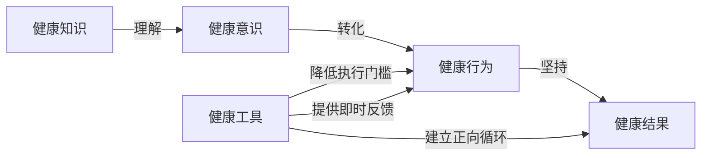
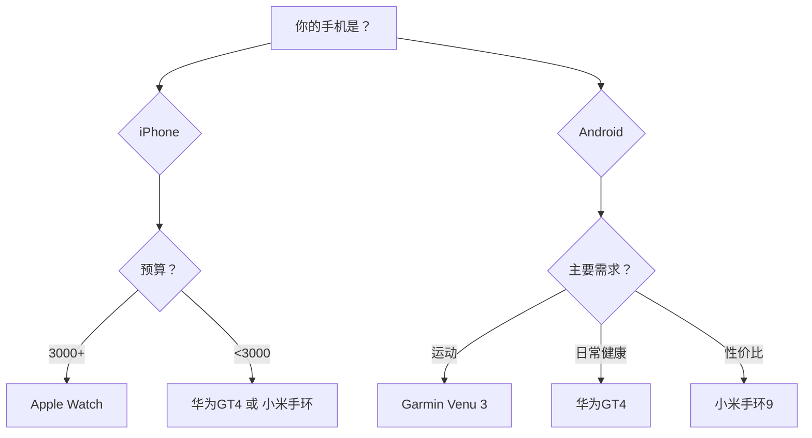
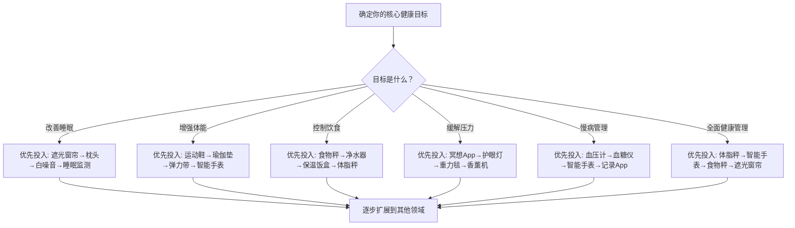

## 三、健康工具推荐

### 3.1 为什么需要健康工具：从"知道"到"做到"的桥梁

在前面的章节中，我们系统学习了睡眠科学、营养学、运动科学和中医养生的理论知识。但理论到实践之间往往存在一道鸿沟——你知道每天应该睡7-9小时，但卧室的光线和噪音让你难以入睡；你知道应该控制每餐的热量摄入，但目测一份食物到底有200克还是400克极其困难。

**健康工具的核心价值**在于将模糊的健康目标转化为可量化、可执行、可追踪的日常行为。

#### 3.1.1 健康工具的"道法术器"四层体系

理解健康工具不能停留在"买什么"的层面。一个完整的健康工具使用体系包含四个层次：

| 层次 | 含义 | 举例 |
|------|------|------|
| **道** — 健康理念 | 你对健康的根本认知和价值观 | "预防优于治疗""数据驱动决策""身体感受优先于设备数据" |
| **法** — 方法策略 | 系统化的健康管理方法 | 按"测量→分析→干预→验证"循环推进；按优先级分层采购 |
| **术** — 具体操作 | 每个工具的正确使用方法 | 血压计的标准测量流程、体脂秤的固定测量条件、食物秤的"先称后吃"习惯 |
| **器** — 工具本身 | 具体的产品和设备 | 欧姆龙血压计U724、Withings体脂秤、小米食物秤 |

**四层贯通的关键**：很多人停留在"器"的层面——买了最好的设备却不会正确使用，或者使用方法错误导致数据失真，或者收集了数据却不知道如何分析和调整。本节将从"器"入手，逐步向上渗透到"术""法"的层面，确保你不仅选对工具，更用对工具。

#### 3.1.2 选择健康工具的三个核心原则

选择健康工具遵循三个原则：

| 原则 | 含义 | 举例 |
|------|------|------|
| **测量先行** | 无法测量就无法改善 | 没有体脂秤，你永远不知道自己的体脂率是20%还是28% |
| **最小可行** | 从最关键的工具开始，逐步扩展 | 先买一个好的枕头，再考虑智能床垫 |
| **使用频率** | 日用品 > 周用品 > 月用品 | 每天用的水杯比每月用一次的艾灸盒优先级更高 |

#### 3.1.3 健康工具的投入产出比（ROI）评估框架

在购买任何健康工具之前，用以下四维评估框架判断其价值：

| 维度 | 评估问题 | 高分标准 |
|------|----------|----------|
| **使用频率** | 你每周会用几次？ | 每天使用 = 5分，每周2-3次 = 3分，偶尔用 = 1分 |
| **健康影响力** | 对核心健康目标的贡献度？ | 直接解决核心问题 = 5分，间接辅助 = 3分，锦上添花 = 1分 |
| **替代成本** | 不用这个工具，达到同样效果的代价？ | 无替代方案 = 5分，替代方案麻烦 = 3分，容易替代 = 1分 |
| **持续性** | 你愿意长期维护和使用吗？ | 零维护 = 5分，简单维护 = 3分，频繁维护 = 1分 |

**评分方法**：4项相加，满分20分。15分以上 = 立即购买，10-14分 = 观望后购买，10分以下 = 不建议购买。

**举例**：遮光窗帘——使用频率5分（每天）、健康影响力5分（睡眠是基础）、替代成本4分（眼罩只能部分替代）、持续性5分（装好不用管）= 19分，强烈推荐。而筋膜枪——使用频率3分（运动后用）、健康影响力3分（辅助恢复）、替代成本3分（按摩球部分替代）、持续性4分 = 13分，有条件再买。

### 3.2 睡眠改善工具

睡眠是健康的基石。Matthew Walker在《我们为什么要睡觉》中指出，睡眠不足与心血管疾病、糖尿病、阿尔茨海默症、免疫力下降等密切相关。改善睡眠环境是提升睡眠质量最直接的手段。

#### 3.2.1 白噪音与助眠音频设备

**白噪音的科学原理**：人耳在安静环境中对突发噪音（汽车鸣笛、楼上脚步声）特别敏感，这是因为大脑的听觉皮层会将突然的声压变化识别为潜在威胁。白噪音通过提供持续、均匀的声学背景（涵盖20Hz-20kHz所有可听频率），降低环境噪音的信噪比，使突发噪音的相对强度降低，大脑因此不再被反复"惊醒"。

除白噪音外，还有粉噪音（Pink Noise，低频更强，更接近自然界声音如雨声、瀑布）和棕噪音（Brown Noise，低频更重，类似雷鸣）。2017年发表在《Frontiers in Human Neuroscience》的研究表明，粉噪音可能比白噪音更有效地增强深度慢波睡眠，因为其频谱分布更接近大脑在深度睡眠时的自然脑电活动。

**推荐产品对比**：

| 产品 | 价格区间 | 核心优势 | 声音类型 | 适用场景 | 不足 |
|------|----------|----------|----------|----------|------|
| LectroFan EVO | 300-500元 | 22种非循环音效，风扇声+白噪音+自然声 | 白/粉/棕噪音+10种风扇声+自然声 | 对声音质量要求高、需要多种选择的人 | 无蓝牙功能，体积较大 |
| Marpac Dohm Classic | 200-400元 | 物理发声（真风扇），声音最自然 | 仅风扇声（可调音调和音量） | 追求纯粹物理白噪音的人 | 声音类型单一 |
| 小米白噪音机 | 100-200元 | 性价比高，支持米家联动 | 白噪音+自然声+摇篮曲 | 预算有限、已有小米生态的用户 | 声音循环感较明显 |
| 手机App（潮汐/小睡眠） | 免费-30元/月 | 零成本试用，功能丰富 | 海量音效库 | 临时使用、不确定是否适合白噪音的人 | 手机电磁辐射争议、来电干扰 |

**使用建议**：
- 音量控制在40-50分贝（相当于轻声耳语），过高反而干扰睡眠
- 将设备放置在距床头1-2米处，而非枕边
- 可搭配定时关闭功能，避免整夜播放
- 坚持使用一周以上才能形成条件反射式助眠效果

**常见误区**：将白噪音与助眠音乐混淆。白噪音是无旋律的持续声波，而助眠音乐虽然也能放松，但其旋律和节奏变化可能在浅睡眠期被大脑处理，反而打断深度睡眠。

**如何判断自己是否需要白噪音**：如果你有以下任一情况，白噪音值得尝试——居住在马路边/闹市区、伴侣打鼾、对突发噪音敏感、入睡困难型失眠。如果你对声音本身很敏感（如某些自闭症谱系或高度敏感人群），白噪音可能反而造成困扰，此时应优先解决噪音源（隔音窗、耳塞）。

#### 3.2.2 遮光窗帘

光线是人体昼夜节律（Circadian Rhythm）最强大的调节器。视网膜上的内在光敏视网膜神经节细胞（ipRGC）对蓝光特别敏感，哪怕微弱的光线也会抑制褪黑素分泌。研究表明，卧室光照度只需达到6勒克斯（相当于走廊夜灯）就能显著影响褪黑素水平。

**选购标准详解**：

| 参数 | 推荐标准 | 原因 |
|------|----------|------|
| 遮光率 | ≥99%（涂层遮光）或三层织造 | 低于99%的遮光窗帘仍可能透出路灯和月光 |
| 材质 | 涤纶涂层或三明治织造（中间黑丝） | 涂层遮光率最高但透气性差；中间黑丝兼顾遮光和透气 |
| 颜色 | 深色系（深灰/深蓝/黑色） | 浅色遮光窗帘的内衬仍可能反光 |
| 长度 | 落地式+双侧加宽15cm | 窗帘与墙壁之间漏光是最大的遮光漏洞 |
| 安装方式 | 罗马杆+遮光盒 或 轨道+窗帘盒 | 罗马杆顶部漏光严重，必须加遮光盒 |

**品牌推荐与对比**：
- **宜家（IKEA）**：BLÅVULPEN系列遮光率99.5%，价格200-500元，面料厚实，但颜色选择少
- **无印良品（MUJI）**：遮光窗帘99%，触感柔软，价格300-800元，风格简约，遮光率略逊于专业遮光品牌
- **定制品牌（如摩力克、如鱼得水）**：遮光率可选99%-100%，价格500-2000元，支持上门测量和安装，适合对遮光有极致要求的人
- **遮光贴膜**：适合出租屋不想换窗帘的情况，直接贴在玻璃上，遮光率95%以上，价格30-100元

**进阶方案**：如果你对光线特别敏感（例如浅睡、经常夜班），可以采用"遮光窗帘+眼罩"双重方案。眼罩推荐真丝材质（减少面部摩擦和压痕），品牌推荐Slip、Manito或国内的桑罗。

**常见遗漏——漏光排查清单**：安装遮光窗帘后，关灯检查以下位置是否有漏光——窗帘顶部（最常见的漏光点）、窗帘与墙壁的接缝处、窗帘底部与地面的间隙、窗户边缘密封条老化处、空调管道穿墙孔。任何一处漏光都可能破坏整体遮光效果，可用遮光胶带或挡光条封堵。

#### 3.2.3 智能睡眠监测设备

**监测原理分类**：

| 类型 | 原理 | 代表产品 | 精度 | 侵入性 |
|------|------|----------|------|--------|
| 床垫下传感器 | 压力/振动传感 | Withings Sleep Analyzer | 较高 | 无 |
| 床边雷达 | 毫米波雷达 | ResMed S+、华为智选 | 中等 | 无 |
| 可穿戴设备 | 加速度计+心率 | Apple Watch、Oura Ring | 中高 | 轻微 |
| 枕下传感器 | 压力传感 | 某些国产智能枕 | 中等 | 无 |

**推荐产品详解**：

**Withings Sleep Analyzer**（800-1200元）
- 放置在床垫下方，通过气压传感器检测身体微动
- 监测内容：睡眠周期（浅睡/深睡/REM）、呼吸频率、打鼾检测、心率
- 搭配App生成每日睡眠评分（0-100），并标注异常呼吸事件
- 优势：无需佩戴，完全无感；可追踪长达数月的数据趋势
- 不足：无法检测血氧；双人床只能监测一侧

**Apple Watch**（2000-6000元）
- 通过加速度计、心率传感器和血氧传感器综合判断睡眠阶段
- watchOS 9+支持原生睡眠阶段追踪，精度经临床验证与多导睡眠图（PSG）相关性达80%
- 优势：生态完整，健康数据可与iPhone健康App无缝整合；附加ECG心电图、血氧监测
- 不足：需要每晚佩戴，部分人不适；需每天充电

**Oura Ring**（2000-3000元+订阅费）
- 戒指形态，内含红外传感器、NTC温度传感器、加速度计
- 监测内容：体温变化、HRV（心率变异性）、血氧、呼吸率、睡眠阶段
- 优势：佩戴舒适度远超手表，且手指处的脉搏信号比手腕更稳定
- 不足：需要订阅（约40元/月）才能使用完整功能；国内购买渠道有限

**如何选择**：如果你讨厌睡觉时佩戴任何东西，选择床垫下传感器（Withings Sleep）；如果你已经有Apple Watch，不必额外购买，直接用原生睡眠追踪即可；如果你追求最精准的HRV和体温数据，Oura Ring是最佳选择。

**如何正确使用睡眠数据**：睡眠监测设备的最大价值不在于每天的评分，而在于长期趋势。关键的使用原则是——

1. **看趋势，不看单日**：连续30天的数据比任何单晚数据更有意义
2. **关联行为**：记录每天的咖啡因摄入时间、运动时间、晚餐时间，找出影响你睡眠的关键变量
3. **设定个人基线**：每人的"正常"HRV和深睡比例不同，与自己比而非与别人比
4. **数据焦虑是真实的**：如果看睡眠评分让你更焦虑（"正统睡眠症"orthosomnia），果断减少查看频率或停用设备。身体感受永远优先于设备数据

#### 3.2.4 床垫与枕头

床垫和枕头是最基础但最被低估的睡眠工具。一个好的床垫的使用寿命约8-10年，如果每天使用8小时，相当于累计使用超过29000小时——你不会在一把坐了29000小时的办公椅上忽略它，但多数人对床垫的重视程度远不及。

**床垫选择要点**：

| 类型 | 适合人群 | 优点 | 缺点 | 价格区间 |
|------|----------|------|------|----------|
| 独立袋装弹簧 | 侧睡者、双人床 | 点对点支撑，翻身不影响伴侣 | 透气性一般 | 2000-10000元 |
| 乳胶床垫 | 过敏体质、喜欢包裹感 | 天然抗菌、弹性好、贴合身形 | 价格高、可能有乳胶过敏 | 3000-15000元 |
| 记忆棉 | 侧睡者、关节疼痛者 | 压力分散好、贴合度高 | 散热差、夏天闷热 | 1000-8000元 |
| 混合型（弹簧+乳胶/记忆棉） | 多数人 | 综合各材质优点 | 价格较高 | 4000-20000元 |

**床垫硬度选择**：并非越硬越好，也不是越软越好。正确的标准是——侧躺时脊柱保持一条直线（从颈椎到尾椎），仰躺时腰部与床垫之间没有明显空隙。体重较轻（<60kg）的人适合偏软的床垫，体重较大（>80kg）的人适合偏硬的床垫。建议到实体店试躺至少15分钟，模拟自己的真实睡姿。

**枕头选择的核心参数**——高度：
- 仰睡者：枕头高度 ≈ 拳头竖起的高度（8-12cm）
- 侧睡者：枕头高度 ≈ 肩宽（12-16cm），保持颈椎与脊柱呈一条直线
- 俯睡者：尽量避免俯睡；如无法改变，选择极薄枕头（3-5cm）或不枕

**枕头材质对比**：

| 材质 | 支撑性 | 透气性 | 耐用性 | 适合人群 | 价格 |
|------|--------|--------|--------|----------|------|
| 乳胶 | 高（弹性支撑） | 中高 | 3-5年 | 颈椎问题、喜欢弹性触感 | 200-800元 |
| 记忆棉 | 中（慢回弹） | 低 | 2-4年 | 侧睡者、需要贴合包裹感 | 100-500元 |
| 羽绒 | 低（柔软蓬松） | 高 | 5-10年 | 仰睡者、喜欢柔软触感 | 300-2000元 |
| 荞麦/决明子 | 中高（可调节） | 高 | 1-2年（需定期更换填充物） | 喜欢硬枕、中医养生爱好者 | 50-200元 |
| 凝胶 | 中高 | 高（凉感） | 3-5年 | 怕热、夏天使用 | 200-600元 |

**枕头更换信号**：对折后不能回弹、晨起颈部僵硬、枕头出现明显凹陷或异味。一般建议每1-2年更换一次枕头（枕头是尘螨的温床，即使清洗也无法完全消除）。

### 3.3 运动健身工具

#### 3.3.1 瑜伽垫

**选购核心参数**：

| 参数 | 入门推荐 | 进阶推荐 | 说明 |
|------|----------|----------|------|
| 厚度 | 6mm | 8-10mm | 太薄（<4mm）关节不适，太厚（>12mm）站姿不稳 |
| 材质 | PVC/TPE | 天然橡胶 | PVC便宜但不环保有气味；TPE中等价位环保；橡胶防滑最佳但较重 |
| 防滑性 | 一般 | 表面纹理+底部防滑 | 湿手出汗后是否打滑是核心考量 |
| 尺寸 | 183×61cm | 183×68cm或更长 | 身高>180cm需选加长版 |
| 重量 | <1kg（便携） | 1.5-2.5kg（稳定） | 居家使用不必考虑重量 |

**不同运动类型的垫子选择**：
- **瑜伽（哈他/阴瑜伽）**：6mm TPE或橡胶垫，注重防滑和舒适
- **高强度HIIT/跳操**：8-10mm，需要更好的缓冲和减震
- **普拉提**：薄垫（3-5mm）更佳，便于感知地面反馈
- **户外使用**：选轻便可折叠款，底部需防潮处理

**品牌推荐与对比**：
- **Lululemon The Reversible Mat 5mm**（700-900元）：天然橡胶+聚氨酯面层，防滑性能顶级，出汗越多越抓地；缺点是较重（2.4kg）且需定期清洁保养
- **Manduka PRO**（800-1200元）：高密度PVC，终身质保，厚实耐用（6mm）；缺点是新垫需磨合期（前几次使用偏滑），且PVC不环保
- **Keep 天然橡胶垫**（200-400元）：性价比之选，防滑性好，厚度可选；缺点是橡胶味道需要1-2周散味
- **哈他TPE**（100-200元）：入门首选，轻便环保，双面可用；缺点是长期使用后防滑性下降

**使用与保养**：
- 每次使用后用湿布擦拭，每月用中性清洁剂深度清洗一次
- 不要暴晒或折叠存放，卷起来竖放或平放
- 天然橡胶垫避免接触精油等油脂类物质
- 使用寿命：PVC约3-5年，TPE约2-3年，天然橡胶约3-4年

**常见错误**：在瑜伽垫上穿鞋做高强度训练。鞋底的橡胶颗粒会严重磨损垫面纹理，大幅降低防滑性。HIIT训练应在专门的健身地垫上进行，或使用PVC材质的廉价训练垫。

#### 3.3.2 弹力带（阻力带）

弹力带是性价比最高的力量训练工具之一。与固定器械不同，弹力带提供的是渐进式阻力——拉伸越长，阻力越大——这与人体肌肉的力量曲线更加吻合。

**弹力带类型详解**：

| 类型 | 形态 | 适合训练 | 特点 |
|------|------|----------|------|
| 环形迷你带（Mini Band） | 小圆环 | 臀腿激活、侧向行走 | 最常用于臀部训练，长度固定 |
| 环形长带（Loop Band） | 大圆环 | 深蹲辅助、引体向上辅助 | 力量训练进阶必备 |
| 非环形管状带（Tube Band） | 长条+手柄 | 上肢推拉训练 | 模拟哑铃动作，握持舒适 |
| 非环形片状带（Flat Band） | 扁平长条 | 康复训练、拉伸 | 物理治疗常用，阻力均匀 |

**阻力等级选择指南**：

| 颜色（通用标准） | 阻力范围 | 适合场景 | 适合人群 |
|------------------|----------|----------|----------|
| 黄色/极轻 | 2-5磅 | 康复训练、上肢小肌群 | 伤病恢复期、老年女性 |
| 红色/轻 | 5-15磅 | 上肢训练、热身 | 初学者女性 |
| 绿色/中 | 15-30磅 | 综合训练 | 有基础的女性、初学者男性 |
| 蓝色/重 | 30-50磅 | 下肢训练、大肌群 | 有训练经验的男性 |
| 黑色/极重 | 50-80磅 | 深蹲硬拉辅助、高级训练 | 高级训练者 |

> 注意：不同品牌的颜色编码不完全一致，购买时以具体阻力数值为准。

**品牌推荐**：
- **TheraBand**（100-300元/套）：医疗级品质，弹性衰减慢，常用于物理治疗诊所
- **Fit Simplify**（50-150元/套）：入门首选，5条不同阻力等级套装，附带训练指南
- **Keep**（60-200元/套）：国内易购，有针对中国人体型设计的训练方案
- **力动ROTAI**（80-200元/套）：环形设计，专为下肢训练优化

**常见错误**：
1. **忽略弹力带寿命**：乳胶弹力带使用6-12个月后弹性下降30-50%，阻力不再准确。表面出现白色裂纹或发粘时应立即更换
2. **错误握法**：将弹力带缠绕在手上增加断裂后面部受伤风险，应使用专用手柄或脚踏
3. **阻力选择过大**：阻力过大导致代偿动作，既降低训练效果又增加受伤风险
4. **存放不当**：乳胶弹力带应避光、避热存放，远离窗台和暖气。紫外线和高温会加速乳胶老化。存放时不要拉伸状态放置

**弹力带训练入门方案**（每周3次，每次20分钟）：
- 弹力带深蹲（环形带置于膝盖上方）：3组×15次
- 弹力带划船（管状带）：3组×12次
- 弹力带侧向行走（迷你带）：3组×每侧12步
- 弹力带肩外旋（管状带）：3组×15次
- 弹力带臀桥（迷你带）：3组×20次

#### 3.3.3 筋膜枪

**工作原理**：筋膜枪通过高频振动（每分钟2000-3200次）将机械力传递到深层肌肉和筋膜组织。振动能促进局部血液循环，降低肌肉张力，暂时提高痛阈（门控理论：振动信号在脊髓层面"竞争"疼痛信号的传导通路）。

**推荐产品对比**：

| 产品 | 价格 | 振幅 | 转速 | 噪音 | 重量 | 核心优势 |
|------|------|------|------|------|------|----------|
| Theragun PRO | 2500-3500元 | 16mm | 1750-2400rpm | 65dB | 1.1kg | 振幅最大、穿透力最强、可调角度臂 |
| Hypervolt 2 Pro | 2000-3000元 | 14mm | 1800-2700rpm | 55dB | 1.1kg | 噪音控制优秀、压力感应 |
| 云麦/麦瑞克 | 500-1000元 | 10-12mm | 1800-3200rpm | 45-55dB | 0.6-0.8kg | 性价比高、轻便 |
| 小米筋膜枪 | 300-600元 | 8-10mm | 2400-3200rpm | 45dB | 0.5kg | 入门首选、轻巧便携、噪音低 |

**关键参数解读**：
- **振幅**（打击深度）：决定振动渗透深度。专业运动恢复选12mm+，日常放松8-10mm足够
- **转速**：并非越高越好，过高的转速在低振幅下只是"震表皮"
- **扭矩**：下压时不减速的能力。高端产品在大力下压后转速衰减<10%，低价产品可能衰减50%以上

**正确使用方法**：
1. 每个肌群使用60-90秒，缓慢移动（每秒约2.5cm）
2. 避开关节、骨骼突出处、脊柱、颈部前侧
3. 选择合适按摩头：球形头用于大肌群，U形头用于脊柱两侧，子弹头用于穴位/痛点
4. 运动后使用效果最佳（促进乳酸清除和组织修复）
5. 不要在同一位置持续超过2分钟，避免组织过度刺激

**禁忌人群**：骨折未愈合、急性扭伤（48小时内）、皮肤破损区域、血栓性疾病、孕妇腰腹部。

**筋膜枪 vs 按摩球 vs 泡沫轴对比**：

| 工具 | 优势 | 劣势 | 最佳场景 |
|------|------|------|----------|
| 筋膜枪 | 省力、精准、深层放松 | 价格高、需充电、不能自己处理背部 | 运动后快速恢复 |
| 泡沫轴 | 便宜、可处理大面积区域 | 需要一定体力、初学者痛感强 | 背部和大腿的日常放松 |
| 按摩球 | 便宜、精准定位痛点 | 需要配合墙壁或地面使用 | 足底筋膜、肩胛骨周围 |

#### 3.3.4 跳绳

被严重低估的有氧运动工具。跳绳每分钟消耗约10-16千卡热量，是跑步的1.5-2倍。一根好跳绳的成本不到跑步鞋的十分之一。

| 类型 | 适合人群 | 特点 | 价格 |
|------|----------|------|------|
| PVC绳 | 入门者 | 轻便、价格低、适合基础跳 | 20-50元 |
| 钢丝绳 | 进阶速度跳 | 风阻小、转速快、适合花式 | 30-80元 |
| 负重绳 | 力量训练 | 手柄或绳体加重，上肢参与更多 | 50-200元 |
| 智能跳绳 | 数据追踪者 | 计数、计时、卡路里、App同步 | 100-400元 |

**长度调整**：单脚踩住绳子中点，手柄末端应到达腋窝位置。

**跳绳入门训练计划**（适合零基础，4周渐进）：
- 第1周：每次3组×1分钟，组间休息60秒，每周4天
- 第2周：每次3组×2分钟，组间休息45秒，每周4天
- 第3周：每次4组×3分钟，组间休息30秒，每周5天
- 第4周：每次5组×3分钟，组间休息30秒，每周5天

**常见错误**：
- 跳得太高（只需离地2-3cm即可）
- 手臂大幅挥绳（手腕发力即可，大臂贴近身体）
- 在水泥地面上跳（长期冲击伤膝关节，建议在橡胶地垫或木地板上进行）
- 不穿运动鞋跳（需要缓冲良好的运动鞋保护踝关节和膝关节）

#### 3.3.5 跑步鞋

跑步是最普及的有氧运动，但不当的跑鞋选择是跑步损伤的首要原因之一。选鞋不是选品牌或外观，而是匹配你的足型和跑步习惯。

**足型判断方法**：将脚底沾水踩在纸上，观察足印形状——
- **正常足弓**：足印中部约有脚掌一半宽度的连接 → 适合稳定型/中性跑鞋
- **高足弓**：足印中部几乎没有连接 → 适合缓震型跑鞋
- **扁平足**：足印几乎完全连接 → 适合支撑型/稳定型跑鞋

**核心参数**：
- **落差（Heel-to-Toe Drop）**：前后掌高度差，一般8-12mm适合后跟着地跑者，0-4mm适合前掌着地跑者
- **缓震**：体重较大者（>75kg）需要更强的缓震，轻体重者可选更轻薄的鞋款
- **重量**：日常训练鞋250-300g，竞速鞋180-220g

**品牌推荐**：
- **亚瑟士（ASICS）GEL-Nimbus/Kayano**（600-1200元）：日系跑鞋标杆，GEL缓震技术，适合大体重跑者
- **耐克（Nike）Pegasus系列**（600-900元）：万金油跑鞋，适合大部分跑者日常训练
- **索康尼（Saucony）Ride/Triumph**（500-1000元）：中底缓震优秀，脚感舒适
- **特步160X系列**（300-600元）：国产碳板跑鞋性价比之选

**跑鞋更换周期**：累计跑量500-800公里，或使用超过1年。鞋底磨损不均匀是更换信号。

### 3.4 饮食管理工具

#### 3.4.1 食物秤

控制热量摄入的第一步是知道你吃了多少。目测食物重量的误差通常在30-50%——你认为的"一碗米饭"（150克）可能是200克甚至250克。

**选购标准**：

| 参数 | 推荐标准 | 原因 |
|------|----------|------|
| 精度 | ≤0.1g（烘焙）或≤1g（日常） | 称量调味料和补充剂需要高精度 |
| 最大量程 | 5kg | 需要称量整锅食材 |
| 去皮功能 | 必须 | 扣除容器重量，只称食物 |
| 单位切换 | g/ml/oz/ml | 液体和固体单位不同 |
| 材质 | 钢化玻璃面板 | 易清洁、不残留气味 |
| 显示 | 背光LED | 暗光环境也能读数 |

**品牌推荐**：
- **香山**（50-150元）：国内老牌衡器企业，精度可靠，性价比高
- **Tanita**（200-500元）：日本品牌，专业级精度，部分型号支持营养素计算
- **Etekcity**（80-200元）：亚马逊畅销款，不锈钢面板，精度0.05g
- **Hario咖啡秤**（200-400元）：精度0.1g，自带计时功能，适合咖啡+烘焙双用途

**实用技巧**：
- 养成"先称后吃"的习惯，坚持2-4周后你会建立起食物重量的直觉
- 称量生食而非熟食（烹饪后水分流失导致重量变化大，且食物数据库通常以生重为基准）
- 搭配MyFitnessPal或薄荷健康App记录每日摄入

**食物称量的进阶方法**：
- **批量称量法**：周末做meal prep时统一称量，按份分装冷冻，工作日直接加热
- **容器标准化法**：常用食物用固定容器盛装，先称一次记录容器+食物的总重，之后只需称总重减去容器重
- **手掌估算法**（外出不便称量时的替代方案）：一掌心蛋白质≈100g肉/鱼，一拳头碳水≈150g米饭/面条，一拇指脂肪≈10g油/坚果

#### 3.4.2 料理机/破壁机

**工作原理与区别**：

| 设备 | 转速 | 功能 | 出品 | 适合场景 |
|------|------|------|------|----------|
| 普通榨汁机 | 10000-15000rpm | 榨汁 | 渣汁分离 | 喝果汁、去纤维 |
| 料理机 | 15000-25000rpm | 搅拌/研磨 | 全果保留 | 辅食、酱料 |
| 破壁机 | 30000-58000rpm | 破壁/加热/研磨 | 超细腻 | 全营养饮品、豆浆、浓汤 |

> 破壁机的"破壁"是指高速旋转撕裂植物细胞壁，释放细胞内的营养素（如类胡萝卜素、多酚）。但人体消化系统本身也能消化大部分细胞壁，"破壁"的实际营养提升幅度约5-15%，不必过度神话。

**推荐产品**：
- **Vitamix E310**（3000-5000元）：行业标杆，2.0HP马达，58000rpm，可连续工作数分钟不过热。10年质保。缺点是噪音大（85dB+）、价格高
- **九阳Y1**（1500-2500元）：国产高端，自动清洗+热烘除菌，静音罩降噪设计，支持豆浆免滤。适合中国家庭
- **美的BL1543**（800-1500元）：性价比之选，预设12种模式，支持干磨和加热
- **Nutribullet**（300-600元）：单人份设计，旋转即榨，清洗方便，适合一人食

**选购决策树**：
1. 预算<500元 → Nutribullet或国产入门料理机
2. 预算500-1500元 → 美的/九阳中端，兼顾豆浆和日常需求
3. 预算1500-3000元 → 九阳Y系列或Vitamix入门款
4. 预算3000元以上 → Vitamix（买一台用10年，年均成本300元）

**使用安全提示**：
- 高速运转时不要打开杯盖，热饮搅拌后开盖远离面部（蒸汽烫伤风险）
- 破壁机噪音通常60-90dB，建议不在清晨或深夜使用
- 清洗时加入温水和一滴洗洁精，高速运转30秒即可自清洁

#### 3.4.3 保温饭盒/便当盒

带饭上班是控制饮食最有效的策略之一——你能精确控制油盐糖的用量，避免外卖的隐形热量炸弹（一份外卖炒饭可能含800-1200千卡）。

**选购核心参数**：

| 参数 | 推荐标准 | 说明 |
|------|----------|------|
| 内胆材质 | 304/316不锈钢 | 塑料内胆可能释放双酚A，不建议长期使用 |
| 保温时长 | ≥6小时（70°C以上） | 70°C以上能抑制大部分细菌繁殖 |
| 容量 | 1-1.5L（成年人） | 分层设计更好，饭菜分离 |
| 密封性 | 硅胶密封圈 | 防止汤汁溢出 |
| 清洗便利性 | 可拆卸内胆 | 方便彻底清洗，不留食物残渣 |

**品牌推荐**：
- **膳魔师（Thermos）**（200-500元）：百年品牌，真空断热技术领先，保温12小时以上
- **象印（Zojirushi）**（200-600元）：日本品质，内壁氟涂层防粘，清洗更方便
- **虎牌（Tiger）**（200-500元）：保温持久，做工精细
- **乐扣乐扣（Lock&Lock）**（100-300元）：密封技术出色，性价比高，适合预算有限的人

**使用注意事项**：
- 饭菜做好后尽快装入，不要放凉后再装（温度越低，保温效果越差）
- 叶菜类不建议隔夜带饭（亚硝酸盐含量上升），优选根茎类蔬菜和肉类
- 每次使用后彻底清洗并晾干，避免密封圈发霉

**带饭食谱设计原则**：
- **蛋白质**：鸡胸肉、牛肉、鱼虾、鸡蛋、豆腐（最耐存放且不易变质）
- **碳水**：糙米、紫薯、玉米、全麦意面（升糖指数低，饱腹感强）
- **蔬菜**：西兰花、胡萝卜、荷兰豆、菌菇类（加热后口感变化小的品种）
- **避免**：绿叶蔬菜（反复加热口感差且亚硝酸盐上升）、油炸食物（冷后回软变油腻）

#### 3.4.4 水质检测与净化

水是人体最重要的营养素，但多数人忽视了饮用水的质量。自来水中的余氯、重金属、微塑料等物质长期摄入可能对健康产生累积影响。

**水质检测工具**：
- **TDS检测笔**（30-80元）：测量总溶解固体，TDS值<100ppm为优质饮用水，>300ppm建议使用净水设备。但TDS不反映重金属和有机污染物
- **水质综合检测试剂盒**（50-200元）：可检测余氯、pH值、硬度、重金属等指标，更全面

**净水设备选择**：

| 类型 | 过滤精度 | 能过滤 | 不能过滤 | 价格 | 适合场景 |
|------|----------|--------|----------|------|----------|
| PP棉+活性炭 | 1-5微米 | 泥沙、余氯、异味 | 重金属、细菌 | 100-500元 | 水质较好的城市 |
| 超滤膜（UF） | 0.01微米 | 细菌、胶体 | 重金属、病毒 | 500-1500元 | 一般城市用水 |
| 反渗透（RO） | 0.0001微米 | 几乎所有污染物 | 无（接近纯水） | 1500-5000元 | 水质较差地区、婴幼儿用水 |
| 纳滤（NF） | 0.001微米 | 重金属、细菌 | 保留部分矿物质 | 2000-6000元 | 追求"矿物质+安全"平衡的人 |

**推荐品牌**：
- **RO反渗透**：小米净水器（1500-2500元）、A.O.史密斯（3000-6000元）、沁园（1500-4000元）
- **超滤**：3M（1000-3000元）、道尔顿（800-2000元）

**净水器选购决策流程**：
1. 先做水质检测（TDS笔+试剂盒），了解你家水质的具体问题
2. TDS<100且无异味 → 超滤即可满足需求
3. TDS>300或检测出重金属 → 必须上RO反渗透
4. 有婴幼儿 → 建议RO反渗透（婴幼儿对水质要求最高）
5. 考虑后续成本：RO膜约1-2年更换一次（200-500元/支），滤芯更换成本不应超过购机成本的1/3每年

**常见误区**："纯净水不健康，缺少矿物质"。实际上，水中的矿物质含量极低（一杯牛奶的钙含量≈100杯矿泉水），人体矿物质主要来源是食物而非饮水。RO纯净水是安全的饮用水选择。

#### 3.4.5 便携水杯/保温杯

每天保证1500-2000ml饮水量是基础健康习惯，但"喝水不够"的首要原因往往是——没有随身带水杯。

**选购要点**：
- **材质**：316不锈钢（保温杯）或Tritan/高硼硅玻璃（冷水杯）。避免PC材质（可能含双酚A）
- **容量**：500-750ml为最佳（太小需要频繁接水，太大携带不便）
- **保温性能**：保温杯选真空断热结构，6小时保温≥50°C为合格
- **饮用方式**：直饮口 vs 吸管口。吸管口更适合工作时小口补水

**品牌推荐**：
- **膳魔师/象印**（150-400元）：保温性能顶级
- **Stanley**（200-500元）：近两年网红款，大容量+超强保温
- **富光/哈尔斯**（50-150元）：国产性价比之选

### 3.5 健康监测设备

#### 3.5.1 智能手表/手环

智能穿戴设备是个人健康数据中心。它们的价值不在于单次测量的医疗级精度，而在于**长期追踪趋势**——连续三个月的心率变异性（HRV）下降可能提示你近期压力过大或即将生病，这比偶尔测一次血压更有意义。

**推荐产品分层对比**：

| 层级 | 产品 | 价格 | 核心健康功能 | 生态 | 适合人群 |
|------|------|------|--------------|------|----------|
| 入门 | 小米手环8/9 | 150-300元 | 心率、血氧、睡眠、100+运动模式 | 小米运动 | 预算有限、初次使用 |
| 中端 | 华为手环9/GT4 | 300-1500元 | 心率、血氧、压力、ECG（高端款）、TruSleep | 华为健康 | 追求准确性和续航 |
| 高端 | Apple Watch Series 9/Ultra 2 | 3000-6500元 | 心率、血氧、ECG、体温、车祸检测、跌倒检测 | Apple Health | iPhone用户、追求全面健康监测 |
| 专业 | Garmin Venu 3 | 3000-5000元 | HRV、身体电量、压力、呼吸、高级运动指标 | Garmin Connect | 运动爱好者、户外活动者 |

**关键健康指标解读**：

- **静息心率（RHR）**：正常60-100bpm，运动员可能40-60bpm。长期趋势下降说明心肺功能改善；突然升高（>10bpm）可能提示疲劳、感染或过度训练
- **心率变异性（HRV）**：越高越好（一般30-100ms）。反映自主神经系统平衡，是压力和恢复状态的黄金指标
- **血氧饱和度（SpO2）**：正常≥95%。低于90%需要关注，可能提示呼吸系统问题。但手腕式血氧仪精度有限，仅作参考
- **睡眠评分**：各品牌算法不同，关注自身趋势而非绝对值

**智能手表选购决策树**：

#### 3.5.2 血压计

高血压被称为"沉默的杀手"，全球约12.8亿成年人患有高血压，其中近半数不知道自己的血压状况。家用血压计是最重要的健康监测设备之一。

**谁需要家用血压计**：
- 35岁以上成年人（建议家庭常备）
- 已确诊高血压的患者（必须）
- 有高血压家族史的人
- 肥胖、长期高盐饮食、长期精神紧张的人群
- 孕妇（妊娠高血压筛查）

**血压测量的标准流程**：
1. 测量前30分钟避免运动、饮酒、咖啡因和吸烟
2. 静坐休息5分钟，背靠椅背，双脚平放地面
3. 将袖带绑在裸露的上臂（不要隔着衣物），袖带下缘距肘窝2cm
4. 袖带与心脏同高（可在手臂下垫一个枕头）
5. 测量期间不要说话
6. 连续测量2-3次，每次间隔1分钟，取平均值

**推荐产品**：
- **欧姆龙（OMRON）U724/U726**（300-600元）：全球销量第一的家用血压计品牌，通过ESH（欧洲高血压学会）临床验证，支持双人记忆存储（各100组数据），部分型号支持心房颤动检测
- **鱼跃（Yuwell）YE680**（200-400元）：国内品牌，通过AAMI临床验证，性价比高
- **松下（Panasonic）EW-BU75**（300-500元）：日本品质，袖带佩戴引导功能，避免佩戴不当导致的误差

**产品类型对比**：

| 类型 | 精度 | 舒适度 | 适合人群 |
|------|------|--------|----------|
| 上臂式 | 最高（推荐） | 袖带绑缚 | 大部分人、需要医疗级精度 |
| 手腕式 | 中等 | 方便佩戴 | 手臂过粗无法使用上臂式的人 |
| 手指式 | 较低 | 最方便 | 仅限日常参考，不建议医疗用途 |

**血压记录与管理**：建议用专用App（如欧姆龙Health、华为健康）记录每次测量数据，包括收缩压、舒张压、心率、测量时间和备注（如"刚开完会""饭后"）。连续2-4周的数据才能为医生提供有价值的参考。正常血压为收缩压<120mmHg且舒张压<80mmHg；120-139/80-89属于正常高值，需要生活方式干预；≥140/90属于高血压，应就医。

#### 3.5.3 体脂秤

体重只是一个数字，它无法告诉你这70公斤中有多少是肌肉、多少是脂肪。体脂率才是评估身体成分的关键指标。同为70公斤的两个人，体脂率15%和28%的体型和健康状况截然不同。

**测量原理**：家用体脂秤大多采用BIA（生物电阻抗分析）技术——通过脚底电极向身体发送微弱电流（<1mA），不同组织（脂肪、肌肉、水分）的电阻不同，由此推算各成分比例。

> **精度提醒**：家用BIA体脂秤的误差通常在±3-5%。它的价值不在于精确测量你今天体脂率是22.3%还是24.1%，而在于追踪长期趋势——如果连续三个月体脂率从25%降到22%，那你的训练和饮食方案是有效的。

**影响测量准确性的因素**：
- 测量时间：每天同一时间测量（建议晨起排尿后空腹）
- 水分状态：大量饮水或刚运动后测量会偏低
- 皮肤接触：脚底干燥会影响导电性，可在脚底涂少量水
- 进食状态：餐后测量会偏高

**推荐产品**：

| 产品 | 价格 | 测量指标 | 电极 | 蓝牙/WiFi | 特色功能 |
|------|------|----------|------|-----------|----------|
| Withings Body+ | 600-1000元 | 体重/体脂/肌肉/骨量/水分 | 4电极 | WiFi | 多用户识别、天气显示、趋势分析 |
| 华为体脂秤3 Pro | 200-400元 | 体重/体脂/肌肉/骨量/内脏脂肪 | 8电极（含手柄） | 蓝牙 | 双频8电极精度更高、华为健康App |
| 小米体脂秤2 | 100-200元 | 体重/体脂/肌肉/骨量/水分/基础代谢 | 4电极 | 蓝牙 | 入门首选、米家生态联动 |
| 云康宝CS20X | 150-300元 | 14项身体数据 | 4电极 | 蓝牙/WiFi | 数据全面、支持多平台同步 |

**关键数据解读**：
- **体脂率**：男性正常15-20%，女性20-28%。男性>25%、女性>32%属于肥胖
- **内脏脂肪**：1-9级正常，10-14级偏高，15级以上危险
- **骨骼肌率**：反映肌肉量，增肌训练的核心追踪指标
- **基础代谢率（BMR）**：静息状态下的热量消耗，减脂期需确保摄入不低于BMR

**进阶——何时需要更精确的体脂测量**：家用体脂秤适合日常趋势追踪，但如果你需要精确数据（如备赛、医疗评估），应选择以下专业方法——
- **DEXA扫描**（双能X线吸收法）：体脂测量的金标准，精度±1-2%，费用200-500元/次，大型医院或体检中心可做
- **水下称重法**：通过水中与陆地体重差计算体脂，精度高但操作不便
- **皮脂钳**：便宜（30-100元），需要测量多个部位的皮褶厚度，精度取决于操作者手法

#### 3.5.4 血糖仪

血糖管理不仅是糖尿病患者的专属。越来越多的健康研究表明，血糖波动幅度与炎症水平、心血管风险和认知衰退相关。即使没有糖尿病，了解自己对不同食物的血糖反应也能优化饮食结构。

**适用人群**：
- 糖尿病患者/糖前期人群（必须）
- 多囊卵巢综合征（PCOS）患者
- 需要减脂的肥胖人群（优化碳水摄入）
- 对营养数据有追求的健康爱好者

**推荐产品**：
- **三诺安稳+Air**（100-200元+试纸费用）：国产领先品牌，蓝牙同步数据，试纸单价低（约0.5-1元/条），适合长期使用
- **雅培瞬感（FreeStyle Libre）**（传感器约400-500元/个，持续14天）：CGM（连续血糖监测），无需扎针，扫描手臂即可读取14天血糖曲线。适合短期血糖行为分析

> **CGM的新趋势**：越来越多的健康科技公司（如Levels、Nutrisense）推出面向非糖尿病用户的CGM方案，通过14-30天的连续血糖监测帮助你了解不同食物、运动、压力对血糖的影响。虽然价格较高（500-2000元/月），但获得的个体化饮食洞见价值巨大。

**血糖数据的正确解读**：
- **空腹血糖**：正常3.9-6.1mmol/L，6.1-7.0为糖前期，>7.0可能为糖尿病
- **餐后2小时血糖**：正常<7.8mmol/L，7.8-11.1为糖前期
- **血糖波动幅度**：一天内的血糖峰谷差应<4.4mmol/L。频繁的大波动（即使在正常范围内）也会增加氧化应激

**CGM使用技巧（14天体验方案）**：
1. 第1-3天：正常饮食，记录基线数据
2. 第4-7天：测试不同食物的血糖反应（同一食物不同品牌/不同烹饪方式）
3. 第8-10天：测试运动前后的血糖变化
4. 第11-14天：基于数据优化饮食，验证改善效果

#### 3.5.5 体温计

体温是基础生命体征之一，却常被忽略。家庭应至少配备一支可靠的体温计，用于发热筛查和女性排卵监测。

**体温计类型对比**：

| 类型 | 测量部位 | 精度 | 速度 | 价格 | 适用场景 |
|------|----------|------|------|------|----------|
| 电子体温计 | 口腔/腋下/直肠 | 高（±0.1°C） | 10-60秒 | 20-80元 | 家庭基础测量，最可靠 |
| 红外额温枪 | 额头 | 中（±0.3°C） | 1秒 | 50-200元 | 快速筛查，不适合精确测量 |
| 红外耳温枪 | 耳道 | 较高（±0.2°C） | 1-3秒 | 100-400元 | 婴幼儿和快速测量，操作需正确 |
| 智能体温贴 | 腋下 | 中（±0.2°C） | 持续监测 | 100-300元 | 婴幼儿持续监测、排卵监测 |

**品牌推荐**：
- **欧姆龙电子体温计**（30-80元）：精度高，记忆功能，防水设计
- **博朗耳温枪**（200-400元）：耳温枪行业标杆，年龄适应性测温（根据年龄调整发热阈值）
- **凡米智能体温贴**（100-200元）：持续监测+App报警，适合婴幼儿

**女性基础体温（BBT）测温法**：备孕女性可通过每日清晨（未起床前）测量基础体温来判断排卵期。排卵后体温会上升0.3-0.5°C并持续至下次月经。建议使用精度±0.05°C的基础体温计（如日本欧姆龙MC-612），连续记录3个月以上可发现规律。

### 3.6 口腔护理工具

口腔健康与全身健康密切相关。牙周病与心血管疾病、糖尿病、阿尔茨海默症的风险增加有关。世界卫生组织建议每6个月进行一次口腔检查，但日常口腔护理工具的选择同样关键。

#### 3.6.1 电动牙刷

**为什么电动牙刷优于手动牙刷**：Cochrane系统综述（2014年）分析了56项研究后得出结论，旋转振动型电动牙刷比手动牙刷减少21%的牙菌斑和11%的牙龈炎。声波牙刷的高频振动（每分钟30000-62000次）远超手动刷牙的频率（约300-600次/分钟），且内置计时器确保每次刷满2分钟。

**电动牙刷类型对比**：

| 类型 | 振动方式 | 频率 | 清洁力 | 对牙龈刺激 | 价格 |
|------|----------|------|--------|------------|------|
| 旋转振动式 | 刷头旋转+振动 | 7000-8000次/分 | 强（物理摩擦） | 较大 | 200-800元 |
| 声波式 | 刷毛高频振动 | 30000-62000次/分 | 强（流体动力） | 较小 | 200-2000元 |
| 超声波式 | 超声波振动 | 160万次/分 | 极强 | 最小 | 500-3000元 |

**推荐产品**：
- **飞利浦Sonicare 6系/9系**（500-1500元）：声波式标杆，压力感应提醒，多种刷头可选
- **欧乐B iO系列**（500-2000元）：旋转振动式旗舰，线性磁驱马达，交互式显示屏
- **usmile/力博得**（200-500元）：国产性价比之选，功能齐全
- **小米T500/T700**（100-300元）：入门首选，米家App可追踪刷牙习惯

**正确使用方法**：
- 巴氏刷牙法（改良）：刷毛与牙龈呈45度角，小幅度水平颤动，每次覆盖1-2颗牙齿
- 电动牙刷不需要手动来回刷，只需缓慢移动即可
- 刷头每3个月更换一次（刷毛变形后清洁力下降40%以上）
- 每天刷牙2次，每次2分钟，配合牙线或水牙线清洁牙缝

#### 3.6.2 水牙线（冲牙器）

牙线是清洁牙缝的必要工具，但传统牙线的使用率很低（操作不便）。水牙线通过高压水流冲洗牙缝和牙龈沟，使用门槛低得多。

**水牙线类型**：

| 类型 | 适合场景 | 优点 | 缺点 | 价格 |
|------|----------|------|------|------|
| 台式 | 家用 | 水箱大、水压可调档多 | 不便携 | 300-800元 |
| 便携式 | 旅行/办公 | 体积小、可充电 | 水箱小、水压较低 | 150-500元 |
| 水龙头直连式 | 家用 | 无需水箱、持续供水 | 安装需接水龙头 | 100-300元 |

**推荐品牌**：
- **洁碧（Waterpik）**（300-800元）：冲牙器发明者，临床研究最多，清洁效果有保障
- **松下（Panasonic）**（300-600元）：日系做工，喷嘴种类多
- **小米/博皓**（100-300元）：入门性价比之选

**使用建议**：水牙线不能替代刷牙，应作为"刷牙+水牙线"的组合使用。建议在刷牙后使用水牙线，从低水压开始适应，每个牙缝停留2-3秒。

#### 3.6.3 漱口水

漱口水是口腔护理的补充手段，但不能替代刷牙和使用牙线。

**漱口水类型**：
- **含氟漱口水**：防龋为主，适合龋齿高风险人群
- **氯己定漱口水**：杀菌力强，适合牙周手术后短期使用（不超过2周，长期使用会导致牙齿着色）
- **精油类漱口水**：温和杀菌，适合日常使用
- **益生菌漱口水**：新兴类别，通过调节口腔菌群平衡来改善口腔健康

**使用注意**：刷牙后30分钟内不要使用含氟漱口水（以免冲掉牙膏中的氟化物），饭后使用漱口水效果最佳。

### 3.7 急救与安全工具

家庭急救工具是健康防护的最后一道防线。很多家庭的"急救箱"只有过期的创可贴和一瓶碘伏——这远远不够。

#### 3.7.1 家庭急救箱配置清单

| 类别 | 物品 | 用途 | 数量/规格 |
|------|------|------|-----------|
| 外伤处理 | 创可贴（多种尺寸） | 小伤口覆盖 | 20-30片 |
| 外伤处理 | 无菌纱布+医用胶带 | 较大伤口包扎 | 各5-10份 |
| 外伤处理 | 碘伏棉棒 | 伤口消毒 | 20-50支 |
| 外伤处理 | 弹性绷带 | 扭伤固定 | 2-3卷 |
| 外伤处理 | 医用剪刀+镊子 | 剪纱布、取异物 | 各1把 |
| 药品 | 布洛芬/对乙酰氨基酚 | 退热止痛 | 各1盒 |
| 药品 | 氯雷他定/西替利嗪 | 过敏反应 | 1盒 |
| 药品 | 蒙脱石散/口服补液盐 | 腹泻脱水 | 各1-2包 |
| 药品 | 烫伤膏 | 轻度烫伤 | 1支 |
| 工具 | 电子体温计 | 测量体温 | 1支 |
| 工具 | 医用手套 | 处理伤口时佩戴 | 5-10副 |
| 应急 | 哨子 | 求救信号 | 1个 |
| 应急 | 急救手册/二维码急救指南 | 紧急情况参考 | 1份 |

**检查周期**：每6个月检查一次急救箱，更换过期药品和用完的物品。

#### 3.7.2 AED（自动体外除颤器）知识

AED是挽救心脏骤停患者最关键的设备。在中国，每年约54.4万人发生心脏骤停，院外存活率不到1%。AED+心肺复苏（CPR）能在救护车到达前维持大脑供血。

**你需要知道的**：
- AED的使用已经设计为"零门槛"——打开电源后，设备会语音引导你每一步操作
- 公共场所（地铁站、机场、商场、学校）越来越普及AED，建议记住你常去场所的AED位置
- 手机可以搜索"AED地图"小程序，找到最近的AED位置
- 家中有心脏疾病高风险成员（老年人、先天性心脏病患者），可以考虑购买家用AED（5000-20000元）

**建议**：每个家庭至少有1人接受过CPR+AED培训（红十字会、医院等机构提供免费或低价培训，通常4-8小时）。

### 3.8 中医养生工具

#### 3.8.1 艾灸工具

艾灸是中医传统外治法之一，通过燃烧艾叶产生的温热刺激穴位，达到温经散寒、活血通络的效果。现代研究发现，艾灸的热辐射主要集中在2-5微米波段，与人体的红外辐射波段接近，能够产生共振吸收效应。

**工具类型对比**：

| 类型 | 价格 | 温度控制 | 便携性 | 安全性 | 适合场景 |
|------|------|----------|--------|--------|----------|
| 传统艾条 | 10-50元/盒 | 手工控制 | 差 | 需注意烫伤和烟雾 | 有经验者、追求传统体验 |
| 随身灸盒 | 50-150元 | 较好（可调风门） | 好 | 高（密封燃烧） | 居家/办公日常保健 |
| 电子艾灸仪 | 200-800元 | 精准控温 | 好 | 最高（无明火） | 怕烟、对温度敏感的新手 |
| 艾灸贴 | 3-10元/片 | 固定温度 | 最好 | 高 | 外出、办公、旅行 |

**使用建议**：
- **穴位选择**：入门阶段掌握5个核心穴位即可覆盖多数保健需求——足三里（健脾养胃）、关元（温阳补肾）、中脘（调理脾胃）、神阙（温阳固本）、大椎（提升免疫）
- **时间控制**：每个穴位15-20分钟，初次使用从10分钟开始
- **频率**：保健为目的每周2-3次即可，不必天天灸
- **最佳时段**：上午9点-下午3点（阳气最旺时段），避免晚上10点后艾灸（可能导致阳不入阴，反而影响睡眠）

**禁忌**：高热患者、孕妇腰腹部、皮肤破损处、酒后、极度疲劳时。

**如何辨别艾条品质**：好的艾条颜色呈土黄色或金黄色（陈年艾），点燃后烟量适中、气味芳香不刺鼻、燃烧均匀。劣质艾条颜色偏绿（新艾，燥性大），烟大且刺鼻。购买时认准"三年陈""五年陈"标识，艾绒比例越高（如35:1）越细腻温和。

#### 3.8.2 刮痧工具

刮痧通过在皮肤表面反复刮拭造成毛细血管破裂（出痧），达到疏通经络、活血化瘀的效果。现代研究认为刮痧能促进局部微循环、减轻肌肉紧张、调节免疫反应。

**刮痧板材质对比**：

| 材质 | 价格 | 特点 | 适合场景 |
|------|------|------|----------|
| 牛角 | 30-200元 | 清凉解毒、质地坚韧 | 通用保健，最常见 |
| 玉石 | 50-300元 | 质地温润、有安神作用 | 面部美容刮痧 |
| 不锈钢 | 20-80元 | 易清洁、不碎裂 | 家庭日常使用 |
| 铜质 | 30-100元 | 导热快、杀菌 | 热刮痧 |

**基础手法与使用规范**：
1. 刮痧前在皮肤上涂抹刮痧油或乳液，减少摩擦
2. 刮痧板与皮肤呈45度角，单方向刮拭（不可来回刮）
3. 力度由轻到重，以能耐受且出现红润或微痧为度
4. 每个部位刮15-20次，总时间控制在20分钟以内
5. 出痧后24小时内避免接触冷水和冷风
6. 两次刮痧间隔至少5-7天，待痧完全消退后再进行

**常见误区**：
- 误区一："出痧越多越好"——出痧量因人而异，与皮肤厚度、血液循环状况有关，不是越紫越好
- 误区二："越痛越有效"——过重的手法可能造成皮下组织损伤
- 误区三："所有人都适合刮痧"——凝血功能障碍、皮肤病、极度虚弱者不宜

#### 3.8.3 穴位按摩工具

**工具类型**：

| 工具 | 价格 | 适合部位 | 使用场景 |
|------|------|----------|----------|
| 网球/按摩球 | 10-50元 | 背部、臀部、足底 | 靠墙滚动、踩压 |
| 筋膜球（花生球） | 30-100元 | 脊柱两侧、颈后 | 躺压、对称按压 |
| 按摩锤/经络锤 | 20-60元 | 肩背、四肢 | 自我敲打 |
| 刮痧梳 | 30-80元 | 头皮 | 梳头式按摩，改善头部血液循环 |
| 穴位按摩笔 | 50-200元 | 精准穴位 | 带振动或加热功能 |

**5个日常高频穴位及按摩方法**：

1. **合谷穴**（虎口处）：拇指按压，有酸胀感为度，每次1-2分钟。主治头痛、牙痛、感冒
2. **足三里**（膝下四横指，胫骨外侧）：拇指按揉，每次3-5分钟。健脾养胃、增强免疫
3. **太冲穴**（脚背第一二趾骨间）：拇指按揉，每次1-2分钟。疏肝理气、缓解情绪
4. **风池穴**（后脑两侧凹陷处）：双手拇指同时按揉，每次2-3分钟。缓解颈椎不适、头痛
5. **涌泉穴**（脚底前1/3凹陷处）：握拳用指关节按揉或踩按摩球，每次3-5分钟。补肾安神、改善失眠

**穴位按摩的正确力度**：以"酸胀感"为标准，不是越痛越好。中医所说的"得气"是指按压后产生的酸、麻、胀、重感，而不是剧痛。如果按压后疼痛剧烈或持续不消，说明力度过大或位置不准确。

### 3.9 环境改善工具

#### 3.9.1 空气净化器

室内空气质量往往比室外更差。美国EPA研究显示，室内空气污染物浓度是室外的2-5倍。新装修甲醛、烹饪油烟、PM2.5、花粉、尘螨等都是室内空气的主要威胁。

**核心参数解读**：

| 参数 | 含义 | 推荐标准 |
|------|------|----------|
| CADR（洁净空气输出率） | 每小时产出的洁净空气量 | ≥房间面积×10（如20㎡房间选CADR≥200m³/h） |
| CCM（累积净化量） | 滤网寿命指标 | 颗粒物CCM≥P4，甲醛CCM≥F4 |
| 能效等级 | 净化能效 | 高效级 |
| 噪音 | 运行声音 | 睡眠模式≤35dB |

**推荐产品对比**：

| 产品 | 价格 | CADR（颗粒物） | 滤网成本/年 | 噪音 | 特色 |
|------|------|----------------|-------------|------|------|
| IQAir HealthPro 250 | 8000-12000元 | 470m³/h | 800-1200元 | 25-59dB | 医疗级HEPA，过滤0.003微米颗粒 |
| Blueair 7440i | 3000-5000元 | 440m³/h | 300-500元 | 32-56dB | HEPASilent技术，低噪音高CADR |
| 小米全效Ultra | 1500-2500元 | 800m³/h | 200-300元 | 33-65dB | 性价比之王，大CADR，米家联动 |
| 352 X86C | 2000-3000元 | 750m³/h | 200-400元 | 34-67dB | 国产专业品牌，塔式结构，除醛能力突出 |

**使用建议**：
- CADR÷房间层高÷房间面积=每小时换气次数，建议≥5次
- 滤网按照指示灯更换，不要超期使用（堵塞的滤网不仅无效，还可能二次污染）
- 放置在房间中央或主要活动区域，避免靠墙或角落
- 新装修房优先选择带活性炭滤网的型号（主要针对甲醛和TVOC）

**容易被忽略的室内空气污染源**：燃气灶（燃烧产生NO2和CO，做饭时务必开抽油烟机）、打印机/复印机（释放臭氧和细微颗粒物）、新家具/新地毯（甲醛和TVOC的主要来源）、清洁剂和空气清新剂（挥发性有机物）、宠物毛发和皮屑（过敏原）。

#### 3.9.2 加湿器/除湿机

适宜的室内湿度为40-60%。湿度过低（<30%）导致皮肤干燥、呼吸道不适、静电；湿度过高（>70%）促进霉菌和尘螨繁殖。

**加湿器类型对比**：

| 类型 | 原理 | 优点 | 缺点 | 适合场景 |
|------|------|------|------|----------|
| 超声波式 | 高频振动雾化 | 噪音低、价格低、雾量可调 | 可能产生白粉（水垢）、需用纯净水 | 卧室、预算有限 |
| 蒸发式 | 风扇蒸发水分 | 无白粉、自然蒸发、不会过度加湿 | 需定期更换滤网、噪音稍大 | 有婴幼儿/过敏者家庭 |
| 热蒸发式 | 加热产生蒸汽 | 蒸汽无菌 | 耗电、有烫伤风险 | 需要蒸汽杀菌的场景 |

**加湿器使用安全要点**（非常重要）：
- **超声波加湿器必须使用纯净水或蒸馏水**，不能使用自来水。自来水中含有钙镁离子和微生物，超声波雾化后会以PM2.5甚至PM1.0的形式被直接吸入肺部，这比不加湿更危险
- 蒸发式加湿器可以用自来水（水通过滤网蒸发，矿物质被截留）
- 每天换水，每周深度清洗（白醋或专用清洁剂浸泡）
- 湿度传感器是必备功能，达到目标湿度自动停止

**除湿机**（适合南方梅雨季节/沿海地区）：
- 推荐品牌：德业、浦力适、松下
- 除湿量选择：12L/天（10-20㎡）、20L/天（20-40㎡）、30L/天（40-60㎡）
- 价格区间：800-3000元

**除湿机选购要点**：关注名义除湿量（27°C/60%RH条件下的测试数据）而非最大除湿量（通常在30°C/80%RH条件下测试，实际使用中很难达到）。带水箱容量至少4L（避免频繁倒水），最好支持外接排水管。

#### 3.9.3 护眼灯/光照灯

**蓝光与色温的科学**：光线的色温（单位：开尔文K）直接影响人体昼夜节律。高色温（5000-6500K，冷白光）含蓝光比例高，抑制褪黑素，适合白天工作使用；低色温（2700-3000K，暖黄光）含蓝光少，适合傍晚和睡前使用。

**护眼台灯选购标准**：

| 参数 | 推荐标准 | 说明 |
|------|----------|------|
| 照度 | AA级（国标最高等级） | 中心照度≥500lx，均匀度≤3 |
| 色温 | 可调3000-5000K | 根据时间段调整 |
| 显色指数（Ra） | ≥95 | 越高颜色还原越真实，减轻视觉疲劳 |
| 频闪 | 无可视频闪 | 用手机摄像头对准灯光，无闪烁条纹 |
| 蓝光 | RG0（无危害类） | IEC/EN 62471标准 |

**推荐产品**：
- **明基（BenQ）WiT系列**（1000-2000元）：智慧调光、色温可调、弯月型灯头照明范围广
- **松下（Panasonic）致皓系列**（500-1000元）：AA级照度、高显色指数、性价比高
- **大力智能灯**（500-800元）：内置学习功能，适合学龄儿童
- **米家台灯Pro**（200-400元）：入门级AA台灯，支持米家联动，色温亮度可调

**日光模拟灯**（SAD灯）：对于冬季日照不足地区或长期在室内工作的人，10000勒克斯的日光模拟灯可以有效缓解季节性情感障碍（SAD）和冬季疲劳。每天早晨使用20-30分钟，距离30-50cm。推荐品牌：Philips EnergyUp、Verilux。

**20-20-20护眼法则**：每使用屏幕20分钟，看20英尺（约6米）远的物体20秒。这是预防数字眼疲劳最简单有效的方法。可以在手机上设置提醒，或使用护眼App（如EyeLeo）自动提醒。

#### 3.9.4 人体工学工具

久坐是"新型吸烟"。WHO数据显示，每年约有200万人因身体活动不足而死亡。即使你每天运动1小时，如果剩余清醒时间都坐着，你仍然面临久坐相关的健康风险。

**人体工学椅选购要素**：

| 参数 | 推荐标准 | 说明 |
|------|----------|------|
| 腰托 | 可调高度+深度 | 支撑腰椎自然前凸，是减轻腰痛的核心 |
| 座深 | 可调 | 大腿与座面边缘保留2-3指宽间隙 |
| 扶手 | 4D可调（上下/前后/左右/旋转） | 扶手应支撑肘部，使前臂与桌面平行 |
| 头枕 | 可调高度和角度 | 后仰时支撑颈椎 |
| 坐垫材质 | 网布（透气）或高密度海绵（舒适） | 夏天优选网布 |
| 后仰角度 | 至少120度 | 短暂后仰休息能减轻腰椎压力 |

**推荐产品**：
- **赫曼米勒（Herman Miller）Aeron/Embody**（8000-15000元）：行业标杆，12年质保，Aeron的Pellicle网布透气性极佳
- **世楷（Steelcase）Leap/Gesture**（6000-12000元）：Leap的LiveBack技术能随脊柱运动自适应调整
- **西昊（SIHOO）Doro C300**（2000-4000元）：国产高端，4D扶手、自适应腰托、性价比突出
- **网易严选人体工学椅**（800-1500元）：入门级选择，基本功能齐全

**人体工学椅试坐检查清单**：坐上去后检查——双脚是否平放地面（大腿与地面平行）、腰托是否顶在腰椎弯曲处（不是背部中间或更高）、扶手高度是否让肩膀自然放松（耸肩说明太高）、座面是否对大腿后部有压迫（有的话需要调浅座深）。

**站立办公辅助**：
- **升降桌**：推荐乐歌、网易严选、FlexiSpot，价格1000-5000元。站立与坐姿交替（建议每30-60分钟切换一次），不要连续站立超过2小时
- **脚踏板**：20-100元，缓解坐姿时大腿压迫

**桌面显示器支架**：显示器高度应使屏幕上沿与视线平齐，距离为手臂长度（约50-70cm）。如果使用笔记本电脑，强烈建议搭配外接显示器或笔记本支架+外接键盘。长期低头看笔记本屏幕是颈椎病的主要诱因之一。

### 3.10 心理健康与放松工具

#### 3.10.1 冥想与呼吸训练工具

**生理机制**：有意识的深呼吸（特别是延长呼气）能直接激活副交感神经系统，降低心率和皮质醇水平。4-7-8呼吸法（吸气4秒、屏气7秒、呼气8秒）已被多项研究证实能显著降低焦虑水平。

**推荐工具**：
- **潮汐App**（免费/会员68元/年）：国产冥想App，白噪音+冥想引导+睡眠故事，中文内容丰富
- **Headspace**（约100元/月）：全球最受欢迎的冥想App，课程体系完整，动画引导易上手
- **Calm**（约100元/月）：睡眠故事闻名，助眠效果好
- **Muse 2头带**（1500-2500元）：脑电波反馈式冥想设备，通过实时脑电数据引导你进入深度冥想状态。当思维平静时鸟鸣变多，走神时雨声变大

**冥想入门方案**（适合零基础，2周计划）：
- 第1-3天：每天5分钟呼吸觉察冥想（仅关注呼吸，走神后温柔地拉回注意力）
- 第4-7天：每天10分钟，加入身体扫描（从头到脚依次关注身体感受）
- 第8-14天：每天15分钟，可尝试不同类型的冥想（慈心冥想、正念行走等）
- 选择固定的时间和地点进行（如早起后、睡前），形成条件反射

#### 3.10.2 减压小工具

| 工具 | 价格 | 原理 | 适合场景 |
|------|------|------|----------|
| 握力球/减压球 | 10-30元 | 重复性手部运动降低焦虑 | 办公桌旁、会议中 |
| 指尖陀螺 | 20-80元 | 触觉+视觉聚焦、转移注意力 | 焦虑发作、注意力涣散时 |
| 重力毯 | 200-600元 | 深压力刺激（Deep Pressure Stimulation）促进血清素和褪黑素分泌 | 睡眠焦虑、压力大时 |
| 香薰机 | 100-400元 | 嗅觉影响边缘系统（情绪中枢） | 助眠（薰衣草）、提神（薄荷）、减压（佛手柑） |

**重力毯选购**：重量选择自身体重的7-12%（如70kg选5-8kg），过重反而影响睡眠。面料推荐棉质外罩+玻璃珠填充。

**精油选择指南**（配合香薰机使用）：
- **助眠**：薰衣草、罗马洋甘菊、檀香
- **减压**：佛手柑、依兰依兰、乳香
- **提神**：薄荷、柠檬、迷迭香
- **呼吸顺畅**：桉树（尤加利）、茶树

> 精油使用注意：必须用纯天然精油，不要用人工香精替代。孕妇、婴幼儿、猫对精油敏感，使用前需咨询专业人士。精油不可直接涂抹皮肤（除薰衣草和茶树），需用基础油稀释。

### 3.11 数字健康工具（App与平台）

硬件工具之外，数字健康App是零成本或低成本的健康基础设施。

#### 3.11.1 运动健身类

| App | 平台 | 费用 | 核心功能 | 适合人群 |
|-----|------|------|----------|----------|
| Keep | iOS/Android | 免费/会员19元/月 | 课程丰富、社区、硬件联动 | 入门到进阶全阶段 |
| Nike Training Club | iOS/Android | 免费 | 专业训练计划、教练引导 | 有一定基础的人 |
| Strong | iOS/Android | 免费/Pro 60元/年 | 力量训练记录、自动计算组间休息 | 力量训练爱好者 |
| Strava | iOS/Android | 免费/会员50元/月 | 跑步/骑行GPS追踪、社交竞争 | 跑者和骑行爱好者 |

#### 3.11.2 饮食记录类

| App | 平台 | 费用 | 核心功能 |
|-----|------|------|----------|
| 薄荷健康 | iOS/Android | 免费/会员 | 中国食物数据库最全（40万+），扫码识别食物 |
| MyFitnessPal | iOS/Android | 免费/会员 | 全球最大食物数据库（1400万+），条码扫描 |
| FatSecret | iOS/Android | 免费 | 轻量级，食物日记+运动记录 |

#### 3.11.3 综合健康数据平台

- **Apple Health**（iOS）：苹果生态健康数据中枢，整合手表、第三方App、医院记录
- **华为健康**（Android/iOS）：华为穿戴设备数据平台，提供健康报告和建议
- **Google Fit**（Android）：Google健康平台，整合多源数据
- **丁香医生**（iOS/Android）：权威医学科普+在线问诊，遇到健康问题时的可靠信息源

#### 3.11.4 AI健康助手与新兴趋势

2024-2025年，AI健康工具开始进入实用阶段：

**AI营养分析**：通过拍照识别食物并自动估算热量和营养成分（如薄荷健康的AI识食物功能、Cal AI等国外App）。虽然精度不如手动称量，但对不方便称量的场景（外出聚餐、旅行）是极好的补充。

**AI症状分诊**：通过对话式问诊提供初步的就医建议（如Ada Health、丁香医生的智能问诊）。注意：AI分诊仅作为参考，不能替代医生诊断，但可以帮助你判断是否需要立即就医。

**AI健身教练**：根据你的运动数据、恢复状态和目标，动态调整训练计划（如Fitbod、Freeletics的AI功能）。比固定课程更能适应个人状态波动。

**AI睡眠优化**：结合睡眠监测数据，提供个性化的睡眠改善建议（如Whoop的Sleep Coach、Oura的睡眠建议）。从"告诉你睡了多久"进化到"告诉你怎么睡得更好"。

> **AI健康工具的使用原则**：AI是辅助决策工具，不是权威医疗来源。当AI建议与你的身体感受或医生建议冲突时，以身体感受和医生意见为准。

### 3.12 工具选择的决策框架

面对琳琅满目的健康工具，如何做出最适合自己的选择？

**预算分配建议**（总预算3000元为例）：

| 优先级 | 工具 | 建议预算 | 理由 |
|--------|------|----------|------|
| 1 | 体脂秤 | 150-300元 | 测量是改善的起点，使用频率最高 |
| 2 | 遮光窗帘/好枕头 | 300-800元 | 睡眠是健康的基础，每天使用8小时 |
| 3 | 食物秤 | 80-200元 | 饮食控制的基础工具 |
| 4 | 跳绳/瑜伽垫 | 50-300元 | 最低成本的运动装备 |
| 5 | 血压计（如有需要） | 200-500元 | 35岁以上建议配备 |
| 6 | 空气净化器 | 1500-2500元 | 如预算允许，空气质量直接影响呼吸健康 |

**不同人生阶段的工具优先级**：

| 阶段 | 年龄参考 | 最高优先级工具 | 理由 |
|------|----------|----------------|------|
| 大学/初入职场 | 18-25岁 | 运动装备+饮食记录App | 建立运动和饮食习惯的黄金期 |
| 职场奋斗期 | 25-35岁 | 智能手表+人体工学椅+食物秤 | 久坐和饮食不规律是主要风险 |
| 家庭建立期 | 30-40岁 | 血压计+体脂秤+空气净化器 | 健康基线建立和家庭健康管理 |
| 中年维护期 | 40-55岁 | 血压计+血糖仪+睡眠监测 | 慢病预防的窗口期 |
| 老年养生期 | 55岁+ | 血压计+体温计+防滑浴垫 | 安全和慢病管理是核心 |

### 3.13 维护保养与生命周期管理

工具买回来只是开始。不维护的健康工具不仅效果下降，甚至可能危害健康。

**各类工具保养周期表**：

| 工具 | 日常保养 | 定期保养 | 更换周期 |
|------|----------|----------|----------|
| 瑜伽垫 | 每次用后湿布擦拭 | 每月中性清洁剂深度清洗 | PVC 3-5年，TPE 2-3年 |
| 弹力带 | 用后擦拭汗渍 | 每月检查表面有无裂纹 | 6-12个月 |
| 电动牙刷刷头 | 每次用后冲洗 | — | 每3个月 |
| 空气净化器滤网 | — | 每月检查/吸尘 | 6-12个月（按指示灯） |
| 加湿器 | 每天换水 | 每周深度清洗 | 滤网3-6个月 |
| 体脂秤 | 湿布擦拭面板 | — | 电池耗尽时更换 |
| 食物秤 | 擦拭面板 | 每月校准（用已知重量物品测试） | 电池耗尽时更换 |
| 血压计 | 收纳袖带 | 每2年校准一次 | 袖带弹性下降时更换 |
| 筋膜枪 | 擦拭按摩头 | 每月检查电池和振动 | 电池衰减明显时（通常3-5年） |
| 遮光窗帘 | — | 每年清洗一次 | 褪色或遮光率下降时（5-10年） |
| 枕头 | 每周晾晒 | 每月清洗枕套 | 1-2年 |

### 3.14 常见误区与纠正

| 误区 | 事实 | 建议 |
|------|------|------|
| 买最贵的就对了 | 价格与个人适配度不完全正相关，Vitamix对偶尔打果汁的人是浪费 | 按使用频率和需求层级购买 |
| 工具越多越好 | 工具过多反而增加管理成本和决策疲劳 | 核心工具3-5件足矣，用熟后再扩展 |
| 只买不用 | "买了就等于练了"是最常见的幻觉 | 先养成使用习惯再升级装备 |
| 过度依赖智能数据 | 手表的睡眠评分只是参考，不应因"低分"而焦虑 | 身体感受 > 设备数据 |
| 忽视维护保养 | 不清洗的加湿器比没有加湿器更危险 | 购买前评估自己的维护意愿 |
| 网购只看销量 | 高销量可能是营销驱动，不代表产品适合你 | 先了解自己的需求和参数标准，再看评价 |
| 忽略售后和耗材成本 | 净水器的滤芯、体脂秤的电池、打印机的墨盒都是长期成本 | 计算3年总拥有成本（TCO），而非只看购买价格 |
| 一步到位买齐所有工具 | 没有使用习惯的支撑，大量工具只会积灰 | 每月增加1-2件，确认上一件已经形成习惯后再扩展 |

***

> **本节总结**：健康工具是连接知识与行动的桥梁。选择工具时，先明确核心健康目标，按使用频率和影响力排优先级，从2-3件核心工具开始。记住：最好的工具是你真正会用的工具，而不是参数最炫的工具。工具的价值在于持续使用中积累的数据和习惯，而非一次性购买时的满足感。购买后别忘了维护保养——一个维护良好的中端工具，胜过积灰的旗舰产品。
