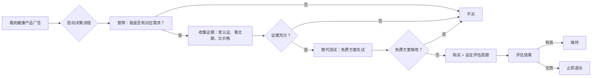
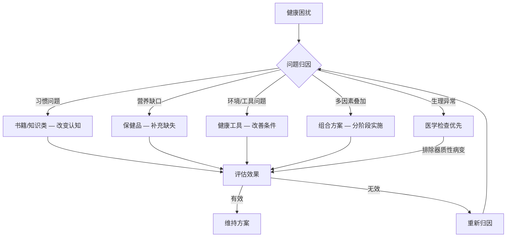
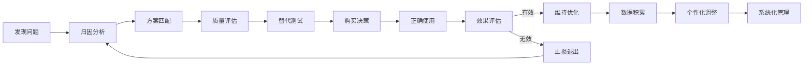

## 四、产品选择与使用建议

前三节分别推荐了健康书籍、保健品和健康工具，但"知道有什么"和"选对用好"之间隔着一条鸿沟。本节提供一套完整的**产品选择决策框架**——从理论基础、需求分析、证据评估、预算分配到使用优化，帮你把每一分钱和每一分钟都花在刀刃上。

> **道法术器总览**：本节以"循证决策"为**道**（底层哲学），以"四维决策模型"为**法**（方法论），以"分阶段实施+效果评估"为**术**（具体操作），以"预算规划+工具模板"为**器**（落地工具），贯穿从认知到行动的完整闭环。

### 4.1 理论基础：为什么需要一套选择框架

在展开具体方法之前，先理解几个底层原理。这些原理决定了后面所有建议的合理性。

#### 4.1.1 循证决策原则

"循证医学"（Evidence-Based Medicine, EBM）是现代医学的核心方法论，其核心思想同样适用于个人健康产品选择：**决策应该基于最佳可获得证据，而非直觉、广告或个案经验**。

循证决策的证据金字塔（从弱到强）：

| 证据等级 | 来源类型 | 可信度 | 举例 |
|---------|---------|-------|------|
| Level 1 | 专家意见/个案 | ⭐ | "我朋友吃了这个很好" |
| Level 2 | 队列研究/病例对照 | ⭐⭐ | "一项500人的观察研究发现..." |
| Level 3 | 随机对照试验（RCT） | ⭐⭐⭐ | "双盲实验显示该成分有效" |
| Level 4 | 系统综述/Meta分析 | ⭐⭐⭐⭐ | Cochrane对20项RCT的汇总分析 |

**实际应用**：当一个保健品声称"经临床验证"时，你需要追问：是什么级别的临床验证？是厂家自己做的小规模试验（Level 2），还是有独立机构的随机对照试验（Level 3），还是被系统综述确认的结论（Level 4）？大部分保健品的"临床验证"停留在Level 1-2，而真正有说服力的证据需要达到Level 3以上。

#### 4.1.2 行为经济学：为什么你总是买错

健康产品购买失败的根源往往不是产品本身，而是**认知偏差**。了解这些偏差，才能在决策时主动对抗它们：

| 认知偏差 | 表现 | 对策 |
|---------|------|------|
| **禀赋效应** | 已经买了的东西，你会高估它的价值，不愿放弃 | 设定客观评估标准，用数据而非感觉做判断 |
| **沉没成本谬误** | "已经花了500块，不用完太浪费" | 只看未来收益，已花的钱不影响未来决策 |
| **从众效应** | "这么多人推荐，应该不错" | 别人的需求≠你的需求，回归自身问题分析 |
| **确认偏差** | 买完之后只关注正面评价，忽略负面反馈 | 主动搜索"XX产品 缺点""XX产品 踩雷" |
| **即时满足偏好** | 想要立竿见影的效果，忽视需要长期坚持的方案 | 设定合理预期，健康改善的最小评估周期是4周 |
| **可得性偏差** | 容易想起最近看到的信息，高估其重要性 | 建立正式的评估清单，系统化决策 |

#### 4.1.3 预防医学的投资回报逻辑

健康投资的本质是**预防性支出**，其回报模型与消费品完全不同：

- **消费品**：花钱 → 立即获得体验 → 体验随时间衰减
- **健康投资**：花钱 → 短期可能无感 → 长期降低疾病风险 → 避免更大的医疗支出

根据WHO的数据，在预防领域每投入1元，可以节省约8.5元的医疗支出和100元的抢救费用。但这笔"节省"是隐性的——你不会看到"因为吃了维生素D所以没骨折"的结果，这正是预防投资难以坚持的心理原因。

**解决方案**：把健康投资当作"保险"而非"消费"来理解。你不会因为今年没出车祸就觉得车险白买了，同样不应该因为今年没生病就觉得保健品白吃了。

### 4.2 选择原则：四维决策模型

盲目购买健康产品的典型后果是：书架上积灰的养生书、抽屉里过期的保健品、角落里吃灰的瑜伽垫。要避免这种浪费，需要一个结构化的决策流程。

#### 4.2.1 需求导向：从问题出发，不是从产品出发

**核心逻辑**：先定义问题，再寻找解决方案。而不是看到别人推荐就跟风下单。

**需求诊断三步法**：

1. **症状识别**：你当前最突出的健康困扰是什么？用具体指标描述，不要用模糊感受
   - 差的描述："我睡眠不好"
   - 好的描述："入睡需要40分钟以上，每周至少3天半夜醒来，白天下午2-4点明显犯困"
   - 进阶描述：结合可穿戴设备数据——"手环数据显示平均深睡时长仅48分钟，夜间心率变异(HRV)偏低，清醒次数平均3.2次/夜"
2. **归因分析**：这个问题可能的原因是什么？是习惯问题、环境问题还是生理问题？
   - 入睡困难 → 可能是蓝光暴露过多、咖啡因摄入过晚、卧室温度过高
   - 半夜醒来 → 可能是噪音干扰、睡前饮水过多、血糖波动
   - 晨起疲劳 → 可能是睡眠呼吸暂停、铁蛋白偏低、甲状腺功能异常
3. **方案匹配**：根据归因选择对应的解决方案层级

**需求优先级矩阵**：不是所有需求都同等紧迫。用"影响程度×改善可能性"来排序：

| | 改善可能性高 | 改善可能性低 |
|---|---|---|
| **影响程度大** | ⭐ 最高优先级 — 立即投入 | 谨慎评估 — 可能需要医学干预 |
| **影响程度小** | 低优先级 — 有余力再考虑 | 暂时搁置 — 投入产出比太低 |

举例：如果你同时有"入睡困难"（影响大、通过改善睡眠环境和习惯可能性高）和"偶尔头痛"（影响小、原因不明改善可能性不确定），应该优先解决睡眠问题。

**不同人生阶段的需求特征**：

| 阶段 | 年龄参考 | 核心需求 | 产品侧重 |
|------|---------|---------|---------|
| 大学/初入职场 | 18-25岁 | 建立健康习惯基础、应对久坐和作息紊乱 | 基础书籍、免费运动方案、睡眠工具 |
| 事业上升期 | 25-35岁 | 压力管理、运动维持、体检意识觉醒 | 运动装备、基础保健品、体检套餐 |
| 家庭建设期 | 30-40岁 | 营养优化、慢性病预防、家庭健康管理 | 营养类保健品、家庭药箱、健康监测设备 |
| 中年维护期 | 40-55岁 | 慢性病管理、激素变化应对、骨骼/心血管保护 | 专项体检、针对性保健品、专业咨询 |
| 老年养生期 | 55岁+ | 功能维持、疾病管理、认知保护 | 医疗级设备、医生指导下用药、认知训练工具 |

#### 4.2.2 质量优先：识别真正有价值的产品

健康产品市场鱼龙混杂，"智商税"和"真好物"往往包装相似。以下是经过验证的质量评估框架：

**保健品质量五看**：

| 评估维度 | 具体方法 | 红旗信号（警惕） |
|---------|---------|----------------|
| **看认证** | 国家药监局蓝帽子标志（国产）、FDA/GMP认证（进口）、NSF/USP第三方认证 | 无任何认证、伪造认证、只写"符合XX标准"但无证书编号 |
| **看成分表** | 有效成分含量明确标注、辅料透明、无不必要的添加物 | 成分表模糊（如"专有配方XXmg"不拆分）、含人工色素/防腐剂过多 |
| **看文献** | 产品核心成分是否有发表在同行评审期刊上的研究支持 | 只引用自家研究、引用未发表的"内部数据"、研究由生产商出资且结论过于完美 |
| **看口碑** | 真实用户长期使用的反馈（3个月以上）、专业营养师/医生推荐 | 只有短期"惊喜体验"、大量雷同的五星好评、无负面评价 |
| **看价格** | 单日成本计算、同类产品横向比较、性价比而非绝对价格 | 价格远低于市场均价（可能偷工减料）或远高于同类（可能智商税） |

**快速验证保健品的三个数据库**：

1. **国家市场监督管理总局特殊食品信息查询**（tsspxx.gsxt.gov.cn）：输入产品名称，验证蓝帽子注册信息是否真实
2. **Examine.com**：输入成分名称（英文），获取该成分的循证研究汇总，包括有效剂量、证据等级、已知副作用
3. **ConsumerLab.com**：独立第三方检测机构，定期公布保健品的实际成分含量与标注是否一致的检测结果

**书籍质量三看**：

- **看作者背景**：是否是该领域的执业医师、博士研究员、有临床经验的从业者？科普作者是否有相关专业教育背景？警惕"头衔营销"——"XX学会理事"不等于专业资质，要查证该学会是否是正规学术组织
- **看出版社和版次**：权威出版社（人民卫生出版社、科学出版社、中信等）通常有更严格的审稿流程。多次再版说明经受住了时间检验
- **看参考文献**：严肃的健康书籍会列出参考文献来源。没有参考文献的"养生书"要打问号。如果参考文献主要是中文养生网站链接而非学术期刊，可信度大打折扣

**工具质量四看**：

- **看核心技术**：传感器精度（如血压计的临床验证报告）、材料安全性（如水杯的食品级认证）
- **看售后保障**：保修期限、维修便利性、配件可得性
- **看生态兼容**：是否能与你已有的设备/APP配合使用（如运动手环能否同步到你常用的健康APP）
- **看使用成本**：一次性购买还是需要持续投入（如耗材、订阅费）

**医疗器械 vs 保健器械 vs 消费电子的区分**：

| 类别 | 监管要求 | 准确性标准 | 举例 | 使用建议 |
|------|---------|-----------|------|---------|
| 医疗器械（二类/三类） | 需注册证 | 经过临床验证 | 医用血压计、血糖仪 | 用于疾病管理，数据可用于就医参考 |
| 保健器械 | 无需临床验证 | 精度无强制标准 | 按摩仪、理疗仪 | 用于日常保健，不替代医疗设备 |
| 消费电子 | 消费品标准 | 参考级别 | 智能手环、体脂秤 | 用于趋势追踪，单次数据不可靠 |

**关键区分**：智能手环测的心率是"参考级"，不能用于诊断心律失常；体脂秤的数据误差可达±5%，但连续测量的趋势变化是有意义的。理解这个区别，就不会因为手环显示心率偶尔120就恐慌就医，也不会因为体脂秤数据波动就频繁调整方案。

#### 4.2.3 实用主义：避免"装备党"陷阱

**频率测试**：购买前问自己——"这个东西我一周会用几次？"如果答案少于3次，暂时不要买。

**替代测试**：在花钱之前，先试试免费/低成本替代方案：
- 想买白噪音机 → 先用手机APP（如小睡眠、Noisli）试一周
- 想买心率带 → 先用手表/手机的光电心率功能看看是否真的需要
- 想买筋膜枪 → 先用网球/泡沫轴做筋膜放松一个月
- 想买空气炸锅 → 先用烤箱的热风循环模式尝试同样的食谱
- 想买站立办公桌 → 先用纸箱垫高笔记本试一周，确认自己真的会站着办公

**空间测试**：家里是否有合适的位置放置这个产品？需要多大空间？如果买了没地方放，使用频率必然下降。

**复杂度测试**：设置和使用需要多少步骤？步骤越多、越复杂，你放弃的概率越高。理想的产品应该"开箱即用"——3步以内完成首次使用。

**社交压力过滤**：问自己"如果没有任何人知道我买了这个，我还会买吗？"如果答案是否，说明购买动机可能是社交展示而非真实需求。

#### 4.2.4 安全底线：这些红线不能碰

无论产品多么诱人，以下情况必须拒绝：

- **保健品宣称治疗疾病**：中国法律明确规定保健品不能宣称治疗功能。任何暗示"治愈""根治""替代药物"的产品都是违法宣传
- **来路不明的海外代购药品**：没有中国药监局批准的药品可能含有未经验证的成分，甚至含有违禁物质
- **工具类产品无安全认证**：电器需要3C认证，医疗器械需要注册证，食品接触材料需要食品级认证
- **"万能"产品**：声称一个产品解决所有健康问题的，100%是虚假宣传。健康是一个系统工程，不可能靠单一产品搞定
- **要求"排毒"的产品**：医学上没有"排毒"这个概念（除重金属螯合等特定治疗），你的肝脏和肾脏就是最好的"排毒"器官。任何声称需要外部产品来"排毒"的，都是利用恐惧心理的营销话术
- **要求停用医生处方药的产品**：任何建议你停用正在服用的处方药而改用其产品的，都是在危害你的生命安全

### 4.3 使用建议：从买到用的完整闭环

买到好产品只是开始，用对方法才能发挥价值。

#### 4.3.1 循序渐进：分阶段构建健康工具库

**第一阶段：基础建设期（第1-2个月）**

只购买解决最紧迫问题的1-2个产品。这个阶段的目标是建立使用习惯，而不是囤积装备。

| 优先级 | 类别 | 典型产品 | 预算范围 |
|-------|------|---------|---------|
| 1 | 睡眠基础改善 | 遮光窗帘 + 合适的枕头 | 300-800元 |
| 2 | 一本核心书籍 | 选择与你最紧迫问题相关的书籍 | 40-80元 |
| 3 | 基础监测 | 体脂秤或智能手环 | 100-500元 |

**第二阶段：优化补充期（第3-6个月）**

在第一阶段产品使用习惯稳定后，根据效果评估结果，有针对性地补充。

- 如果睡眠改善不明显 → 考虑升级床垫或添加白噪音设备
- 如果发现营养缺口 → 在饮食调整基础上，针对性补充保健品
- 如果开始规律运动 → 添加运动装备
- 如果压力问题突出 → 考虑冥想类APP或心理咨询

**第三阶段：精细化运营期（6个月以后）**

这个阶段你已经有了基础的健康数据积累，可以根据数据做精准优化：
- 根据睡眠监测数据调整睡眠方案
- 根据体检结果调整保健品方案
- 根据运动表现数据升级运动装备
- 根据HRV趋势判断压力恢复状态

#### 4.3.2 正确使用：每类产品的使用要点

**保健品使用规范**：

1. **服用时间**：不同保健品的最佳服用时间不同
   - 脂溶性维生素（A/D/E/K）：随餐服用，有油脂帮助吸收
   - 镁：睡前服用，有助于放松和睡眠
   - 铁剂：空腹服用吸收最好，但可能引起胃部不适，可随餐
   - 益生菌：饭前30分钟或随餐，避免与热饮同服
   - 鱼油：随餐服用，减少鱼腥味反流
   - 维生素C：分次服用比单次大剂量吸收率更高（200mg×2 > 400mg×1）
   - B族维生素：上午服用，晚上服用可能影响睡眠
2. **剂量原则**：不是越多越好。过量补充脂溶性维生素会造成蓄积中毒，过量铁剂会损伤肝脏。严格按照推荐剂量服用，不要自行加倍
3. **交互作用检查**：同时服用多种保健品时，需要检查是否存在交互作用。例如：
   - 钙和铁会互相竞争吸收，应间隔2小时服用
   - 高剂量锌会抑制铜的吸收，长期补锌需同时关注铜摄入
   - 维生素K会拮抗华法林等抗凝血药物的效果
   - 圣约翰草会降低多种处方药的效果（包括避孕药、抗抑郁药、免疫抑制剂）
4. **存储条件**：大多数保健品需要避光、密封、阴凉处保存。开封后注意保质期，通常比未开封短很多。益生菌类产品多数需要冷藏
5. **记录反应**：开始服用新保健品时，记录身体反应（包括正面和负面），观察2-4周再评估。一次只新增一种保健品，否则无法判断哪种产品引起了哪种反应

**常见保健品服用时间速查表**：

| 保健品 | 最佳时间 | 空腹/随餐 | 注意事项 |
|-------|---------|----------|---------|
| 维生素D | 早上 | 随餐（需脂肪） | 晚间服用可能影响褪黑素分泌 |
| 鱼油 | 午餐或晚餐 | 随餐 | 冷冻后服用可减少鱼腥味反流 |
| 镁（甘氨酸镁/苏糖酸镁） | 睡前30分钟 | 空腹或随餐 | 氧化镁吸收率差且易腹泻，不推荐 |
| 铁剂 | 早上 | 空腹（配维C） | 与茶、咖啡、钙间隔2小时 |
| 益生菌 | 早餐前 | 空腹 | 避免热水，37°C以下液体送服 |
| 钙（碳酸钙） | 餐中 | 随餐（需胃酸） | 柠檬酸钙不需要胃酸，随时可服 |
| B族维生素 | 早上 | 随餐 | 晚间服用可能影响睡眠质量 |

**书籍阅读方法**：

1. **不要从头读到头**：健康书籍通常可以按章节独立阅读。先读与你当前问题最相关的章节
2. **做读书笔记**：用"问题-答案-行动"格式记录——这本书回答了我什么问题？作者的结论是什么？我需要采取什么行动？
3. **交叉验证**：同一主题至少读两本书，对比不同作者的观点。如果两位独立作者对同一问题给出相同建议，可信度更高
4. **定期回顾**：每3个月重读笔记，看看之前的建议是否已经在生活中落实
5. **建立个人知识库**：把多本书的核心观点整理成一个结构化文档（如Notion数据库），按主题而非按书本组织，形成自己的健康知识体系

**工具使用习惯**：

1. **建立固定使用场景**：把工具嵌入到已有的日常流程中，降低使用门槛。例如：把血压计放在床头，每天起床后第一件事测量
2. **数据记录与回顾**：所有监测类工具的数据都应该定期回顾，而不是测量完就忘。建议每周花10分钟看一次趋势
3. **维护保养**：定期清洁、校准、更换耗材。一个不准的血压计比没有血压计更危险——它会给你错误的信心
4. **数据备份**：确保监测数据同步到云端或导出备份。换手机时丢失半年的健康数据是非常可惜的

#### 4.3.3 效果评估：数据驱动的决策

**评估周期**：

| 产品类型 | 最短评估周期 | 评估方法 | 判断标准 |
|---------|------------|---------|---------|
| 保健品 | 4-8周 | 前后体检指标对比、主观感受记录 | 关键指标有改善趋势，且无不良反应 |
| 书籍/知识 | 2-4周 | 行为改变记录 | 至少落实了3个以上具体建议 |
| 工具 | 2-4周 | 使用频率统计、目标达成率 | 周使用频率≥3次，且目标指标有改善 |
| 运动装备 | 4-8周 | 运动表现数据 | 运动频率提升或运动表现改善 |

**评估模板**（每月填写一次）：

产品名称：___________
开始使用日期：___________
本月使用频率：___次/周
核心指标变化：
  使用前：___（如：平均入睡时间35分钟）
  使用后：___（如：平均入睡时间20分钟）
主观感受：___（1-10分）
不良反应：___（如有）
继续使用？ 是 / 否 / 调整方案
下一步行动：___

**评估中的常见陷阱**：

- **安慰剂效应**：刚开始使用新产品时，由于心理暗示，主观感受可能改善，但4-6周后回落。真正的效果应该能持续超过安慰剂效应的衰减期
- **霍桑效应**：仅仅因为"正在关注健康"这个行为本身，你可能就会更注意饮食和作息，导致指标改善。这个改善不一定归功于产品
- **回归均值**：极端状态会自然向平均值回归。比如在你睡眠最差的时候开始使用某产品，之后自然会有所改善，但这不是产品的作用
- **排除干扰变量**：评估期间尽量保持其他条件不变。如果你同时开始吃保健品、改变饮食、开始运动，就无法判断哪个因素起了作用

**止损规则**：如果一个产品在合理使用后，评估期内没有任何可感知的改善，果断停用。不要因为"已经花了钱"就强迫自己继续使用——沉没成本不应影响未来决策。

### 4.4 预算规划：健康投资的理性框架

#### 4.4.1 预算分配模型

健康投资不需要一次性大额支出，关键是**持续且合理**。以下是一个参考预算模型，按月均花费计算：

**基础层（必投项）—— 每月300-800元**：

| 项目 | 月均预算 | 说明 |
|------|---------|------|
| 优质食材升级 | 100-300元 | 在现有食材基础上，增加优质蛋白、深色蔬菜、坚果等 |
| 核心保健品 | 100-300元 | 维生素D、鱼油、镁等基础补充（按需，非必须） |
| 健康书籍 | 40-80元 | 每月1-2本，电子书更经济 |

**改善层（建议投）—— 每月200-600元**：

| 项目 | 月均预算 | 说明 |
|------|---------|------|
| 运动支出 | 100-300元 | 健身卡、运动装备分摊、运动课程 |
| 健康监测 | 50-150元 | 设备分摊成本、检测试纸耗材等 |
| 环境改善 | 50-150元 | 分摊到月的家居改善（窗帘、枕头、净水器滤芯等） |

**进阶层（可选项）—— 每月200-1000元**：

| 项目 | 月均预算 | 说明 |
|------|---------|------|
| 专业咨询 | 200-500元/次 | 营养师、健身教练、心理咨询师 |
| 高级保健品 | 100-500元 | 辅酶Q10、NMN等进阶补充 |
| 健康体验 | 100-300元 | 按摩、瑜伽课、冥想工作坊 |

**年度固定支出 —— 2000-10000元**：

| 项目 | 预算 | 说明 |
|------|------|------|
| 全面体检 | 1000-5000元 | 一年一次基础体检，35岁以上增加专项筛查 |
| 健康保险 | 1000-5000元 | 百万医疗险、重疾险等 |

#### 4.4.2 不同预算档位的方案

**月预算500元以内（经济型）**：
- 一本核心健康书籍（电子版30元）
- 维生素D + 鱼油（100-150元/月）
- 食材升级（200-300元/月）
- 免费运动（跑步、Keep免费课程、B站健身视频）
- 免费工具（手机自带健康APP、免费白噪音APP）

**月预算1000-2000元（舒适型）**：
- 在经济型基础上增加：
- 智能手环/手表（一次性300-1500元，分摊到月）
- 更全面的保健品方案（200-400元/月）
- 运动场所费用（100-300元/月）
- 遮光窗帘、人体工学枕头等环境改善（一次性投入）

**月预算3000元以上（全面型）**：
- 在舒适型基础上增加：
- 定制化营养方案（营养师咨询）
- 高端监测设备（连续血糖监测、智能体脂秤等）
- 专业运动指导（私教、精品团课）
- 高品质保健品（选择有临床验证的高端品牌）

#### 4.4.3 健康投资的ROI计算

不同于消费品，健康投资的回报需要从"避免损失"的角度计算。以下是一个简化的ROI框架：

**计算公式**：

年度健康投资回报 = 避免的潜在医疗支出 + 生产力提升价值 - 健康投资总额

**举例计算**（假设一个28岁上班族）：

| 投入项 | 年成本 | 潜在避免的损失 | 计算逻辑 |
|-------|-------|-------------|---------|
| 维生素D+鱼油 | 1,800元 | 减少感冒2次×500元误工成本=1,000元 | 研究显示维D充足者呼吸道感染风险降低约12% |
| 运动（健身房） | 3,600元 | 腰椎间盘问题治疗费20,000元×30%概率降低=6,000元 | 久坐人群腰椎问题发病率约40%，规律运动可降低约30% |
| 全面体检 | 2,000元 | 早期发现重大疾病的治疗成本节约=不确定但极高 | 早期癌症5年生存率>90%，晚期可能<30% |
| 睡眠环境改善 | 800元（一次性） | 生产力提升5%×年收入=5,000-15,000元 | 睡眠质量直接影响认知表现和工作效率 |

这个计算当然是粗略的，但它揭示了一个关键洞察：**健康投资的回报率远高于大多数金融投资**，只是回报以"未发生坏事"的形式出现，所以容易被忽视。

#### 4.4.4 省钱技巧

- **书籍**：先用图书馆或微信读书试读，确认值得反复阅读再购买纸质版。多抓鱼、孔夫子旧书网可以买到二手好书。许多经典健康书籍有免费的英文原版PDF（如Peter Attia的播客笔记整理）
- **保健品**：大包装通常更划算，但前提是你会坚持吃完。在618、双11等大促时囤货。关注品牌的会员计划和复购折扣。国产替代方案往往性价比更高——比如国产鱼油品牌（如Swisse国内代工版）与进口品牌使用相同的原料来源
- **工具**：国产品牌的性价比往往高于进口品牌，特别是电子类产品。二手平台可以买到几乎全新的运动器材（很多人的新年决心装备）
- **体检**：单位福利体检不要浪费。在此基础上，根据年龄和风险因素有针对性地增加项目，比做全套高端体检更经济
- **拼团和社区**：与朋友拼团购买保健品或健身课程，可以降低单位成本。部分健身房提供"家庭卡"，比单独办卡便宜30-50%

### 4.5 常见误区与避坑指南

#### 误区一："保健品吃越多越好"

**真相**：营养学中存在"U型曲线"效应——过少和过多都不好。例如：
- 维生素D：血清25(OH)D水平在40-60ng/mL最佳，低于20不足，超过100可能中毒
- 铁：缺铁导致贫血，过量铁增加氧化应激和心血管风险
- 维生素C：每日200mg基本饱和，超过1000mg主要随尿液排出，经济上不划算
- 维生素E：大剂量补充（>400IU/天）反而增加全因死亡率，多项Meta分析已确认这一结论

**正确做法**：按推荐剂量服用。有条件的话，通过血液检测确认是否真的缺乏，再决定补充方案。

#### 误区二："进口一定比国产好"

**真相**：产品质量取决于生产工艺和质量控制，而非产地。国内大型保健品企业（如汤臣倍健、养生堂）的生产标准已经与国际接轨。部分进口产品因为运输和储存条件不可控，反而存在质量隐患。2019年一项抽检显示，部分跨境电商渠道的进口保健品存在标签与实际成分不符的问题。

**正确做法**：看认证和检测报告，不看产地。选择有蓝帽子认证的国产产品，或有FDA/GMP认证的进口产品。

#### 误区三："买了就能改善健康"

**真相**：产品只是工具，使用习惯才是关键。研究显示，运动装备的闲置率超过60%，保健品的依从性（坚持服用率）在3个月后下降到50%以下。一项针对智能手环用户的追踪研究发现，只有约30%的用户在购买6个月后仍在持续使用。

**正确做法**：先建立使用习惯，再升级装备。用手机APP记录打卡，设置提醒，找到问责伙伴（朋友互相监督）。一个关键原则是"习惯先行"——先用最简单的工具（甚至手机备忘录）坚持某个健康行为30天，确认自己能坚持，再投资购买正式工具。

#### 误区四："天然/草药一定安全"

**真相**："天然"不等于"安全"。砒霜是天然的，毒蘑菇也是天然的。许多草药补充剂存在以下风险：
- 成分不明确：不同批次的有效成分含量可能差异很大
- 药物相互作用：圣约翰草会降低多种处方药的效果
- 肝肾毒性：何首乌、雷公藤等中草药有明确的肝毒性报告
- 重金属污染：部分中药材存在铅、汞、砷超标问题

**正确做法**：使用任何草药类补充剂前，查阅权威数据库（如Natural Medicines Database）的安全性评估。正在服用处方药的人，务必咨询医生或药师。

#### 误区五："网红推荐的产品一定靠谱"

**真相**：社交媒体上的健康产品推荐，大部分是商业推广。即使是"真心推荐"，推荐者的身体状况、生活方式、基因背景与你不同，对他们有效的产品未必对你有效。一项2022年的研究分析了Instagram上排名前50的健康博主推荐的保健品，发现其中41%的推荐缺乏科学依据。

**正确做法**：把网红推荐当作信息来源之一，但决策必须基于自己的需求分析和质量评估。特别警惕那些声称"亲测有效"但没有任何科学依据的产品。一个简单的过滤器：如果推荐者同时推荐了超过5种产品，或者推荐频率高于每月2次，大概率是商业推广而非真实分享。

#### 误区六："体检正常=不需要保健品"

**真相**：常规体检的指标范围是"不生病"的标准，不是"最优健康"的标准。例如，血红蛋白的正常下限是120g/L（女性），但130-140g/L才是最优水平。维生素D的"正常"范围通常定义为>20ng/mL，但40-60ng/mL才与最佳健康结果相关。

**正确做法**：体检报告应该与"最优参考范围"对比，而不仅仅是"正常范围"。如果某项指标处于正常范围的低端，虽然不算"异常"，但通过饮食和补充剂提升到最优区间是合理的。

#### 误区七："健康投资是老年人的事"

**真相**：25-35岁是健康投资的黄金窗口期。这个年龄段的人体机能处于巅峰或刚开始缓慢下降，预防性投资的边际效益最大。等到45岁出现慢性病征兆再开始，投入产出比会大幅下降。一项对10万人的纵向研究显示，在30岁前建立规律运动习惯的人，50岁时的心血管疾病风险比40岁才开始运动的人低约35%。

**正确做法**：不要等到"感觉需要"才开始投资健康。25岁开始的每一分健康投资，都是对未来自己的最大馈赠。

### 4.6 进阶：构建个人健康管理系统

当你在基础层面已经得心应手，可以考虑构建一个系统化的个人健康管理框架。

#### 4.6.1 数据整合

将分散在不同工具和APP中的健康数据整合到一个平台：

- **苹果健康（iOS）/ Google Fit（Android）**：作为数据汇总中心
- **手动记录**：用Notion、飞书或Excel建立健康日记，记录饮食、睡眠、情绪、运动
- **体检报告**：建立历史档案，追踪关键指标的年际变化趋势

**健康数据仪表盘设计**：

建议用Notion或飞书多维表格建立一个个人健康仪表盘，包含以下模块：

| 数据模块 | 记录频率 | 关键指标 | 数据来源 |
|---------|---------|---------|---------|
| 睡眠 | 每日 | 总时长、深睡比例、入睡时间、清醒次数 | 手环/手表 |
| 运动 | 每日 | 步数、运动时长、心率区间 | 手环/GPS |
| 营养 | 每日 | 蛋白质、蔬果摄入、水分 | 饮食记录APP |
| 体重/体脂 | 每周 | 体重、体脂率、腰围 | 体脂秤/卷尺 |
| 情绪 | 每日 | 1-10评分、触发因素 | 手动记录 |
| 补剂 | 每日 | 品种、剂量、服用时间 | 手动记录 |
| 体检 | 每年 | 关键血液指标、异常项 | 体检报告 |

**数据分析周期**：
- **每日**：快速浏览昨日数据，确认是否有异常值
- **每周**：花15分钟回顾周数据趋势，发现短期规律
- **每月**：填写产品评估模板，调整下月方案
- **每季**：深度分析三个月数据，评估方案整体有效性
- **每年**：结合体检报告，全面复盘和制定下年计划

#### 4.6.2 个性化调整

随着数据积累，你可以从"通用建议"走向"个性化方案"：

- 根据睡眠数据发现你的真实最佳入睡时间和起床时间
- 根据运动数据找到最适合你的运动类型和强度
- 根据饮食记录发现你的营养盲区
- 根据体检趋势提前发现潜在问题
- 根据HRV（心率变异）数据优化训练和恢复节奏

**个性化调整的三个层级**：

1. **参数微调**：在已知有效方案上做剂量/强度/时间的调整。例如：发现睡前服用甘氨酸镁200mg比400mg效果更好（减少腹泻副作用）
2. **方案替换**：在同类产品中找到更适合自己的。例如：发现甘氨酸镁不适合自己，改用苏糖酸镁
3. **框架升级**：重新审视整个健康方案的结构。例如：发现自己的核心问题不是营养而是压力管理，需要从保健品方案转向心理咨询和冥想练习

#### 4.6.3 自动化与效率优化

当健康管理的内容越来越多，手动记录会成为负担。以下是减少摩擦的方法：

- **自动化数据采集**：选择能自动同步数据的设备和APP，减少手动输入
- **批量操作**：把一周的保健品分装到药盒中，而不是每天开7个瓶子
- **环境设计**：把要养成的习惯嵌入到日常环境中。例如：把鱼油放在早餐旁边（视觉提示），把瑜伽垫铺在床边（减少启动摩擦）
- **提醒系统**：用手机的"健康"APP或第三方工具（如Habitica、Streaks）设置提醒，但不要过多——超过5个日常提醒就会变成噪音

#### 4.6.4 持续学习与更新

健康科学在不断进步。5年前的"权威建议"可能已经被新研究推翻。保持知识更新的方法：

- 每年重读1-2本核心书籍的新版或补充阅读
- 关注可靠的信息源（如Cochrane循证医学数据库、PubMed、丁香医生、GuruWatch）
- 参加健康主题的线上课程或讲座
- 与有医学背景的朋友保持交流
- 订阅2-3个高质量的健康通讯（如Peter Attia的The Drive播客、Rhonda Patrick的FoundMyFitness）

**新产品的评估框架**：

当市场上出现新的健康产品（比如最近的NMN、AKG等热门成分），用以下框架快速评估：

1. **核心成分是否有RCT级别的证据？** → 没有则观望，有人体试验则进入下一步
2. **试验规模和质量如何？** → 20人的小规模试验可信度低，需要更大规模验证
3. **试验对象与你是否相似？** → 动物实验、老年受试者的结果不能直接套用到年轻健康人群
4. **长期安全性数据是否充分？** → 新成分往往缺乏5年以上的安全性数据
5. **性价比如何？** → 如果一个新成分的效果只比成熟成分好10%，但价格贵10倍，是否值得？

### 4.7 本节总结

产品选择和使用的核心不是"买什么"，而是"为什么买"和"怎么用"。记住以下决策框架：

1. **先诊断后开方**：明确需求 → 分析原因 → 匹配方案 → 评估效果
2. **证据驱动**：看认证、看成分、看文献，不听信宣传话术
3. **循序渐进**：从最紧迫的需求开始，一次只增加1-2个产品
4. **数据验证**：记录使用效果，无效则止损，有效则优化
5. **预算理性**：健康投资是马拉松而非冲刺，可持续比高强度更重要
6. **认知警觉**：识别并对抗认知偏差，让理性而非情绪驱动购买决策

健康产品的终极目标是让你**不依赖产品**——通过书籍建立知识体系，通过保健品过渡性补充营养缺口，通过工具养成健康习惯。当习惯内化为生活方式，产品就完成了它们的使命。
