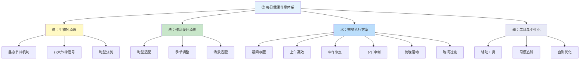
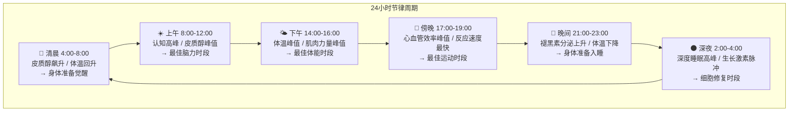
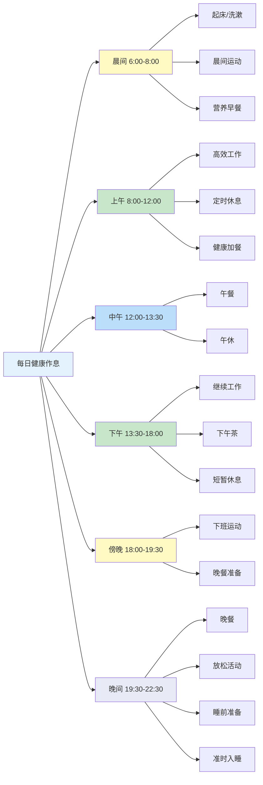

## 一、每日健康作息方案

每日作息不是一个简单的"几点做什么"的时间表——它是你与自身生物钟之间的一份契约。现代时间生物学（Chronobiology）已经证实，人体的每一个器官系统都有自己的节律：体温在凌晨4点降到谷底，在下午4点达到峰值；皮质醇在清晨6-8点冲高，为觉醒提供能量；褪黑素在晚上9点开始大量分泌，为睡眠做准备。当你的时间表与这些内部节律对齐时，身体的每一个功能——从消化吸收到免疫应答，从认知表现到情绪调节——都会处于最佳状态。错位的代价也很清晰：轮班工作者的2型糖尿病风险比日间工作者高40%，心血管疾病风险高23%（BMJ, 2009）。

本章从**道法术器**四个层面展开：先理解生物钟的底层逻辑（道），再掌握作息设计的科学原则（法），然后给出一套可直接执行的完整方案（术），最后推荐辅助工具和个性化调整方法（器）。

### 1.1 为什么你的身体需要一张时间表——昼夜节律原理

#### 生物钟的生物学基础

人体不是一台均匀运转的机器，而是一支由中央指挥协调的交响乐团。这个指挥中心就是位于下丘脑的**视交叉上核（SCN）**——一个仅包含约2万个神经元的小型核团，却掌控着全身几乎所有细胞的节律表达。

SCN的工作机制如下：

| 环节 | 机制 | 关键分子/通路 |
|------|------|-------------|
| 光信号输入 | 视网膜上的内在光敏视网膜神经节细胞（ipRGC）感知蓝光波段（~480nm） | 黑视蛋白（Melanopsin） |
| 信号传递 | ipRGC通过视网膜-下丘脑束直接投射到SCN | 视神经交叉 |
| 时钟重置 | 光信号调节SCN内时钟基因的表达节律 | CLOCK/BMAL1、PER/CRY 反馈环 |
| 全身协调 | SCN通过神经信号、激素信号和体温节律同步全身外周时钟 | 皮质醇、褪黑素、自主神经 |

核心发现：全身几乎每一个细胞都拥有自己的"时钟基因"，但这些外周时钟需要SCN来同步。当SCN的信号与外周时钟错位时（如倒时差、轮班工作），就会出现各种功能紊乱——医学上称为**昼夜节律失调（Circadian Misalignment）**。

#### 肠道菌群也有自己的生物钟

2014年发表在《Cell》的一项突破性研究发现，肠道微生物组也遵循昼夜节律——不同时间段，肠道内不同菌群的丰度会发生周期性变化。这种节律受宿主的进食时间和睡眠-觉醒周期双重调控。

当你的作息紊乱时，肠道菌群的节律也被打乱，导致：
- **短链脂肪酸（SCFA）产量下降**：SCFA是肠道上皮细胞的主要能量来源，也是免疫调节的关键分子
- **肠道通透性增加**：俗称"肠漏"，未消化的食物大分子和细菌内毒素进入血液，触发全身性低度炎症
- **代谢效率降低**：相同的食物在不规律进食者的体内，血糖反应比规律进食者高约20%（Cell Metabolism, 2015）

**实操启示**：规律的进食时间不仅是为了营养，更是为了喂养你的肠道菌群。每天在相近的时间吃三餐，是维护肠道微生态平衡的最简单方法。

#### 四大节律信号：你的身体在一天中如何变化

**（一）皮质醇节律**

皮质醇并非"压力激素"——它是觉醒激素。正常情况下，皮质醇在清晨6-8点达到峰值（称为**皮质醇觉醒反应，CAR**），然后在整个白天缓慢下降，到午夜降到谷底。CAR的功能包括：提升血糖以供给大脑、增强免疫系统的准备状态、提高警觉性和注意力。

破坏CAR的行为：醒来立刻查看手机（信息冲击替代了自然的CAR递增）、长期使用闹钟突然惊醒（触发应激式皮质醇释放而非自然觉醒式释放）。

**（二）体温节律**

核心体温在凌晨4:00-5:00降至最低（约36.2°C），下午16:00-17:00升至最高（约37.2°C）。这个约1°C的波动直接影响认知和体能表现。体温上升阶段，警觉性、工作记忆和逻辑推理能力逐步增强；体温下降阶段，困意增加，身体为睡眠做准备。

实操启示：在体温上升期（上午）安排需要深度思考的工作，在体温峰值期（下午）安排体力活动或运动，在体温下降期（晚间）开始减缓节奏。

**（三）褪黑素节律**

褪黑素由松果体分泌，是"黑暗激素"而非"睡眠激素"——它的信号含义是"天黑了"，间接促进睡意。褪黑素在晚上9-10点开始显著升高（称为**DLMO，暗光褪黑素分泌起点**），凌晨2-4点达到峰值，清晨6-7点回落到白天水平。

关键干扰因素：蓝光（波长450-490nm）会抑制褪黑素分泌。哈佛大学研究显示，睡前2小时使用iPad的人，褪黑素分泌被抑制约22%，入睡时间延迟约30分钟，深度睡眠时间减少。

**（四）超日节律（Ultradian Rhythm）**

除了24小时的昼夜节律，大脑还存在约90-120分钟的超日节律——注意力和精力在此周期内经历"高峰-低谷"交替。Nathaniel Kleitman教授提出的基础休息-活动周期（BRAC）理论指出，每90分钟后，大脑需要约15-20分钟的"低谷"来恢复。

实操意义：与其连续工作3-4小时，不如每90分钟安排一次15分钟的主动恢复期。这不是"偷懒"，而是顺应大脑的生理节律。

### 1.2 认识你的时型——晨型人与夜型人的科学

#### 时型（Chronotype）的生物学基础

不是每个人都是"早起的鸟儿"。时型由PER3基因的VNTR多态性决定，PER3的长等位基因倾向于晨型，短等位基因倾向于夜型。时型是高度遗传的（遗传率约50%），不是单纯的"意志力"问题。

慕尼黑大学Till Roenneberg教授的大规模研究（超过15万人）发现，人群的时型分布如下：

| 时型 | 人群占比 | 自然睡眠窗口 | 体温最低点 | 最佳认知时段 |
|------|---------|------------|----------|------------|
| 绝对晨型（狮子型） | ~10% | 21:00-5:00 | ~3:00 | 8:00-12:00 |
| 中间偏晨（海豚型） | ~25% | 22:00-6:00 | ~4:00 | 9:00-13:00 |
| 中间型 | ~30% | 23:00-7:00 | ~4:30 | 10:00-14:00 |
| 中间偏夜（狼型） | ~25% | 0:00-8:00 | ~5:30 | 11:00-15:00 |
| 绝对夜型 | ~10% | 1:00-9:00 | ~6:00 | 14:00-18:00 |

**关键认知**：强迫一个夜型人5:30起床，等同于强迫一个晨型人凌晨3:00起床——两者都处于核心体温低谷期，认知功能严重受损。这不是懒惰，是基因决定的生理现实。

#### 时型自测：你是哪种类型？

回答以下5个问题，选择最符合你"无外部约束时"的自然倾向：

1. **没有闹钟时，你自然醒来的时间是？**
   - A. 5:00-6:00（+4分） B. 6:00-7:00（+3分） C. 7:00-8:00（+2分） D. 8:00以后（+1分）

2. **如果完全自由安排，你倾向几点睡觉？**
   - A. 21:00-22:00（+4分） B. 22:00-23:00（+3分） C. 23:00-0:00（+2分） D. 0:00以后（+1分）

3. **一天中精力最充沛的时段是？**
   - A. 早上6-10点（+4分） B. 上午10点-下午2点（+3分） C. 下午2-6点（+2分） D. 晚上6点以后（+1分）

4. **你愿意在哪个时段进行高强度运动？**
   - A. 早上（+4分） B. 中午前后（+3分） C. 下午（+2分） D. 傍晚或晚上（+1分）

5. **周末你的作息与工作日相比？**
   - A. 基本一致（+4分） B. 推迟30-60分钟（+3分） C. 推迟1-2小时（+2分） D. 推迟2小时以上（+1分）

**评分**：17-20分=绝对晨型，13-16分=中间偏晨，9-12分=中间型，5-8分=中间偏夜，5分以下=绝对夜型。

#### 时型与职业选择的关系

时型不仅影响作息，还影响职业适配度。研究表明，夜型人在创意行业（艺术、设计、写作）中的比例高于晨型人，而晨型人在传统管理岗位中的表现通常更好。强行在不适合自己的时段工作，不仅效率低，长期还会增加焦虑和抑郁风险。

| 时型 | 优势领域 | 推荐工作模式 | 需要注意 |
|------|---------|------------|---------|
| 晨型 | 执行力、纪律性、早间决策 | 早到早走，核心工作放上午 | 下午创造力可能下降，安排常规任务 |
| 夜型 | 创造力、深度思考、夜间专注 | 弹性工作制，核心工作放午后 | 传统早班可能长期导致节律失调 |
| 中间型 | 适应性强、时段灵活性高 | 标准工作制，但要保护深度工作时段 | 容易被社会节奏完全同化，忽视自身节律信号 |

### 1.3 理想作息方案——完整模板与科学解释

以下方案以中间型（自然睡眠窗口23:00-7:00）为基准设计。其他时型读者根据1.2节的时型表进行整体位移——例如夜型人可将所有时间点后推1-2小时，晨型人前移1-2小时。

#### 晨间（6:00-8:00）——唤醒与激活

##### 6:00-6:15 自然醒来

**科学原理**：人体在预期醒来前30-60分钟，皮质醇已经开始缓慢上升（预期性CAR），体温开始回升，肾上腺素轻度增加。理想的醒来应该顺应这个自然过程，而非用刺耳闹钟将其打断。

**具体操作**：

- **固定起床时间**：包括周末在内，每天在同一时间起床（误差±30分钟）。这是维持昼夜节律稳定性的单一最重要因素。Roenneberg教授的研究发现，工作日和周末的睡眠时间差（称为"社交时差"）每增加1小时，肥胖风险增加33%，代谢综合征风险增加28%。
- **使用渐亮闹钟**：在预定起床时间前30分钟，灯光从微弱的暖色光（~2700K，相当于烛光）逐步过渡到明亮的白光（~5000K，相当于清晨日光）。这种渐进式光暴露模拟日出过程，帮助皮质醇自然攀升。推荐飞利浦Wake-Up Light系列或小米米家床头灯（支持日出模拟功能）。
- **醒来后不急于起床**：在床上停留1-2分钟，缓慢活动手指、脚趾，做几次深呼吸。这能帮助血压平稳过渡——从卧位到立位的瞬间，约5-10%的人会经历体位性低血压（眼前发黑、头晕），缓慢转换可以避免这种情况。

##### 6:15-6:30 晨间唤醒

**（一）补水：启动代谢的第一步**

人体在睡眠过程中通过呼吸和皮肤蒸发流失约300-500毫升水分，导致轻度脱水。醒来后的第一杯水（200-300毫升温水，约35-40°C）的作用包括：

- 恢复血液容量，降低血液粘稠度（夜间脱水使血液粘稠度增加约20%）
- 刺激胃肠蠕动，促进晨间排便
- 启动代谢过程——一项发表在《临床内分泌与代谢杂志》的研究显示，饮用500毫升水后30分钟内，代谢率提升约30%

**注意**：不建议加入柠檬汁（可能刺激空腹的胃酸分泌）、蜂蜜（血糖冲击）或盐（增加不必要的钠摄入）。白开水就足够了。

**（二）晨光暴露：重置生物钟的关键一步**

清晨的自然光是最强大的昼夜节律校准器。光通过视网膜上的黑视蛋白细胞（对480nm蓝光波段最敏感）直接传递信号到SCN，抑制褪黑素分泌，促进皮质醇释放，正式"告诉"大脑：新的一天开始了。

具体操作：

- **时长**：至少10-15分钟的户外自然光暴露（阴天也有效，户外光照强度约10000-25000 lux，远超室内照明的300-500 lux）
- **季节调整**：冬季日出较晚，可在起床后先使用10000 lux的光疗灯照射20-30分钟作为替代
- **不要隔着玻璃**：普通玻璃会过滤掉约50%的UVB和大部分有益光谱，削弱节律校准效果
- **阴天/雨天怎么办**：即使是阴天，户外光照强度（~10000 lux）也远高于晴天室内。出门即可

**（三）呼吸练习：5分钟激活副交感神经系统**

推荐两种经过临床验证的呼吸技术：

**4-7-8呼吸法（Andrew Weil博士推广）**：
1. 用鼻子吸气4秒
2. 屏住呼吸7秒
3. 用嘴缓慢呼气8秒（发出"呼"的声音）
4. 重复4个循环

机制：延长呼气时间激活迷走神经的腹侧分支，增加心率变异性（HRV），将自主神经系统从交感（战斗/逃跑）切换到副交感（休息/消化）模式。晨间使用可以平缓过渡到清醒状态，而非直接进入应激模式。

**箱式呼吸法（Navy SEAL训练用）**：
1. 吸气4秒
2. 屏息4秒
3. 呼气4秒
4. 屏息4秒
5. 重复4-6个循环

与4-7-8呼吸法不同，箱式呼吸法的对称节奏更偏向"唤醒"而非"镇静"——适合需要在晨间快速进入专注状态的场景。如果你晨间感觉昏沉、难以启动，箱式呼吸法比4-7-8更适合。

**Wim Hof呼吸法（简化版）**：
1. 深吸一口气，快速呼出，重复30次
2. 最后一次呼出后屏息，保持到有呼吸冲动（通常60-90秒）
3. 深吸一口气，屏息15秒
4. 重复2-3轮

注意：有心血管疾病、癫痫或孕期的人群不适合Wim Hof呼吸法，建议使用更温和的4-7-8呼吸法。

##### 6:30-7:00 晨间运动

**科学原理**：晨间运动的核心目的不是高强度训练，而是通过肌肉收缩和体温升高来"通知"全身的外周时钟：活动期开始了。研究显示，晨间运动者比傍晚运动者的昼夜节律相位更稳定，夜间褪黑素分泌更规律，睡眠质量更好（Journal of Physiology, 2019）。

**三种推荐方案（根据当日状态和时间选择）**：

| 方案 | 时长 | 适用场景 | 具体内容 | 生理效果 |
|------|------|---------|---------|---------|
| A. 拉伸+瑜伽 | 15分钟 | 时间紧张/身体僵硬 | 猫牛式→下犬式→战士系列→三角式→前屈→脊柱扭转，每个动作保持5-8个呼吸 | 唤醒脊柱和关节，促进脑脊液循环 |
| B. 有氧激活 | 20-30分钟 | 精力需求高/天气好 | 快走或慢跑（心率控制在最大心率的50-60%，即微喘但能说话的状态） | 提升心率和体温，促进内啡肽释放 |
| C. 自重训练 | 15分钟 | 室内/不想出门 | 俯卧撑×10→深蹲×15→平板支撑30秒→开合跳×20→臀桥×15，循环2轮 | 激活大肌群，提升睾酮和生长激素 |

**晨间运动的强度边界**：晨间运动应定位为"唤醒"而非"训练"。核心体温在清晨尚处低谷，关节滑液分泌不足，肌腱和韧带的弹性较差——这些都是运动损伤的高风险因素。心率不超过最大心率的60%，时间不超过45分钟。高强度训练安排在下午或傍晚（参见1.3节傍晚部分）。

##### 7:00-7:30 洗漱与准备

**洗脸水温的选择**：

皮肤科医生普遍建议使用**温水（32-35°C）**洗脸。这个温度接近皮肤表面温度，既不会因过热破坏皮脂膜（天然保护层），也不会因过冷刺激毛细血管收缩。

- 油性皮肤：温水可以更有效地溶解多余皮脂
- 干性/敏感皮肤：避免热水，温水配合温和的氨基酸洁面产品
- 毛孔粗大：不要用"冷热水交替"——温度骤变会刺激毛细血管扩张，长期可能加重红血丝

**晨间护肤的简化流程**：

1. **清洁**：氨基酸洁面乳（温和不刺激）
2. **保湿**：含有透明质酸或神经酰胺的保湿产品
3. **防晒**：SPF30+的广谱防晒霜（这是抗衰老最有效的单一护肤步骤，没有之一）

注意：晨间不需要使用过多功效性产品（如高浓度维C、A醇等），这些更适合晚间使用。晨间护肤的核心是防护，不是修复。

**刷牙的正确时机**：建议在早餐**之前**刷牙。原因有二：（1）刷牙后口腔清新感减少早餐中的含糖食物残留；（2）早餐后立即刷牙，酸性食物（如橙汁、水果）软化的牙釉质会被牙刷磨损。如果无法接受饭前刷牙，至少在饭后等待30分钟再刷。

##### 7:30-8:00 营养早餐

**科学原则**：经过7-8小时的禁食，肝糖原储备消耗约75-80%，血糖处于一天中的相对低谷。一顿均衡的早餐需要同时提供快速能量（提升血糖）和持久能量（稳定血糖）。

**理想早餐的四要素构成**：

| 要素 | 功能 | 推荐食材 | 占比 |
|------|------|---------|------|
| 优质蛋白质 | 提供氨基酸，维持饱腹感，稳定血糖 | 鸡蛋（2个）、希腊酸奶（150g）、豆腐（100g） | ~25% |
| 复合碳水化合物 | 缓慢释放葡萄糖，提供持久能量 | 全麦面包、燕麦、杂粮粥、红薯 | ~35% |
| 健康脂肪 | 促进脂溶性维生素吸收，维护细胞膜 | 牛油果（半个）、坚果（一小把，约20g）、橄榄油 | ~20% |
| 蔬果 | 提供维生素、矿物质、膳食纤维和植物化学物 | 蓝莓、香蕉、菠菜、番茄 | ~20% |

**三套早餐搭配示例**：

- **方案A（中式）**：杂粮粥一碗 + 水煮蛋2个 + 凉拌黄瓜 + 一小把核桃
- **方案B（西式）**：全麦面包2片 + 牛油果半个 + 煎蛋1个 + 小番茄5个
- **方案C（快捷）**：希腊酸奶200g + 燕麦30g + 蓝莓50g + 亚麻籽10g，前一晚混合冷藏（隔夜燕麦）

**早餐的时间窗口**：醒来后1-2小时内进食最佳。这个时间窗口与皮质醇的上升期重合，此时胰岛素敏感性最高，身体能最有效地利用早餐中的碳水化合物。过早进食（刚醒就吃）可能因胃肠道尚未完全激活而引起不适；过晚进食（超过醒来后3小时）会导致血糖过度下降，引发注意力涣散和暴食倾向。

**关于"间歇性断食"与早餐的争论**：近年流行的16:8间歇性断食（跳过早餐，中午12点到晚8点进食）在减脂领域有争议。从昼夜节律的角度看，如果必须做间歇性断食，更推荐"早食窗口"（8:00-16:00进食）而非"晚食窗口"——因为早晨的胰岛素敏感性更高，同样的食物在早晨摄入的血糖反应更低、脂肪储存更少（Cell Metabolism, 2022）。但从节律维护的角度，规律进食三餐仍然是最安全、最可持续的选择。

#### 上午（8:00-12:00）——认知巅峰期

##### 8:00-10:00 深度工作时段

**科学原理**：上午8-10点是大多数人认知功能的黄金时段。此时皮质醇处于日间峰值，前额叶皮层（负责计划、决策、工作记忆和专注力）的血流量和葡萄糖消耗量处于最高水平。一项对400多名成年人的认知测试研究发现，工作记忆、注意力和逻辑推理能力在上午9-11点达到最佳表现（Chronobiology International, 2010）。

**深度工作的执行框架**：

将这个时段用于你一天中**最重要的、最需要思考力的工作**——不是处理邮件、不是开会、不是回复消息，而是需要持续专注的核心任务。

推荐使用修改版番茄工作法：
- **专注块**：50分钟深度工作（比标准25分钟更适合需要深入思考的任务）
- **休息**：10分钟主动恢复
- **循环**：上午完成2个完整的专注块

10分钟休息的正确做法（不是刷手机）：
- 站起来走到窗边，远眺20米外的物体20秒（20-20-20法则的扩展版）
- 做5个颈部画圈运动（缓解前颈肌群紧张）
- 喝100-150毫升水
- 做3次深蹲（促进下肢血液循环）

**坐姿修正要点**：

久坐的健康风险被严重低估。《柳叶刀》2016年的一项涵盖100万人的Meta分析显示，每天坐8小时以上且不运动的人群，全因死亡风险与肥胖和吸烟相当。但"坐多久"比"坐什么椅子"更关键。

| 维度 | 正确做法 | 常见错误 |
|------|---------|---------|
| 坐姿 | 髋关节略高于膝关节，脊柱自然S曲线 | 瘫坐/前倾/跷二郎腿 |
| 屏幕 | 屏幕顶部与眼睛齐平，距离50-70cm | 屏幕过低/过远导致颈部前探 |
| 定时 | 每60分钟起身活动2-5分钟 | 连续坐2-3小时不动 |
| 替代 | 使用升降桌交替站坐 | 全天只坐或只站（站立全天同样有害） |

**笔记本电脑用户的额外注意**：如果用笔记本电脑作为主力设备，务必外接显示器或使用笔记本支架+外接键盘。低头看笔记本屏幕的姿势会使颈椎承受约27公斤的压力（相当于脖子上挂了一个8岁小孩），长期可导致颈椎病。屏幕顶部应与眼睛齐平，键盘放在肘部高度。

##### 10:00-10:10 微休息

这个微休息遵循"主动恢复"原则——不是发呆，而是有目的地切换注意力和活动模式。

**10分钟微休息协议**：
1. 站起来（0:00-0:30）
2. 颈部拉伸：左倾→右倾→前倾→后仰，每个方向保持5秒（0:30-2:00）
3. 肩部环绕：前绕10圈→后绕10圈（2:00-3:00）
4. 手腕灵活性：握拳→张开，重复10次；手腕画圈各10次（3:00-4:00）
5. 腰部活动：站立骨盆前后倾斜10次（4:00-5:00）
6. 走到窗边或户外，远眺，深呼吸5次（5:00-8:00）
7. 喝水100-150毫升（8:00-10:00）

##### 10:10-12:00 第二个工作块

维持上午的工作节奏，但注意：从10:30开始，部分人会经历一个短暂的"上午低谷"——这是超日节律（90-120分钟周期）的自然表现。如果感到明显的注意力下降，不要硬撑，做一个5分钟的微休息，然后继续。

**每小时必做的两件事**：
1. 起身活动2-5分钟（防久坐）
2. 喝水150-200毫升（上午总饮水量目标600-800毫升）

#### 中午（12:00-13:30）——恢复与再充电

##### 12:00-12:30 午餐

**科学原则**：午餐应该是三餐中热量最高的一餐（占全天总热量的35-40%）。此时消化系统活跃度最高，胰岛素敏感性依然良好，食物中的营养能被最高效地利用。

**午餐的理想构成——"哈佛健康餐盘"法则**：

| 餐盘区域 | 食物类型 | 占比 | 具体示例 |
|---------|---------|------|---------|
| 蔬菜（最大的半盘） | 各色蔬菜 | 50% | 西兰花、胡萝卜、菠菜、番茄、紫甘蓝 |
| 蛋白质（四分之一盘） | 优质蛋白 | 25% | 鸡胸肉、鱼肉、豆腐、鸡蛋、瘦牛肉 |
| 全谷物（四分之一盘） | 复合碳水 | 25% | 糙米、全麦面条、荞麦面、红薯 |

**午餐的节奏控制**：
- 进食时间不少于20分钟——大脑的饱腹信号需要约20分钟才能传达完成
- 先吃蔬菜和蛋白质，最后吃碳水——这种进食顺序可以减缓血糖上升速度约40%（Diabetes Care, 2015）
- 达到"七八分饱"即停筷——感觉"还可以再吃但不吃也行"的状态

**午餐后最常犯的错误**：立即坐下或躺下午休。正确的顺序是：站立或缓步走10-15分钟，然后才考虑坐或躺。

##### 12:30-13:00 午后散步

**科学原理**：饭后轻度活动（非剧烈运动）能促进胃排空和肠道蠕动，加速葡萄糖从血液进入肌肉细胞的过程。一项发表在《Diabetologia》的研究显示，饭后15分钟的散步比餐后久坐可降低血糖峰值约22%。

**散步的具体要求**：
- **强度**：缓慢到中速步行（心率不超过最大心率的50%）
- **时长**：10-15分钟（不追求步数，重在时间）
- **环境**：尽量选择户外，兼顾阳光暴露（此时的光照有助于维持午后的警觉性）
- **社交加分**：与同事或朋友同行，社交互动本身能提升情绪和认知灵活性

##### 13:00-13:30 短暂午休

**科学原理**：午后困倦（post-lunch dip）不是"吃太饱"导致的，而是昼夜节律的自然表现。人体在下午1-3点经历一个轻微的警觉性下降——这是SCN的固有节律，即使不吃午餐也会出现。

**午休的精确操作**：

| 要素 | 推荐做法 | 原因 |
|------|---------|------|
| 时长 | 15-20分钟（绝不超过30分钟） | 超过30分钟会进入深度睡眠（N3期），醒后出现"睡眠惯性"（头痛、昏沉、反应迟钝） |
| 时间点 | 13:00左右 | 与昼夜节律的警觉性低谷对齐 |
| 环境 | 眼罩+耳塞或降噪耳机 | 即使在嘈杂的办公环境中，也尽可能隔离光线和噪声 |
| 姿势 | 仰卧最佳，靠椅其次，避免趴桌 | 趴桌压迫眼球和面部神经，影响血液循环和呼吸 |
| 闹钟 | 必须设置闹钟 | 睡眠一旦超过30分钟的"黄金窗口"，后续会非常难醒 |

**咖啡午睡（Coffee Nap）**：如果条件允许，可以在午睡前快速喝一杯咖啡（约100mg咖啡因）。咖啡因需要约20分钟才能被吸收并到达大脑，恰好与你的20分钟午休同步——醒来时咖啡因开始生效，叠加午休的恢复效果，警觉性提升效果远超单独的午睡或单独的咖啡。多项研究证实了这一"神奇组合"的效力（Psychophysiology, 2003）。

**不适合午睡的人群**：失眠症患者通常不建议午睡，因为午睡会减少夜间的睡眠驱动力（腺苷累积量），加剧夜间入睡困难。如果你有入睡困难的问题，宁可在午后做10分钟的正念呼吸，也不要午睡。

#### 下午（13:30-18:00）——第二认知峰期

##### 13:30-15:30 下午工作时段

**应对午后低谷**：下午2-3点是大多数人全天认知表现的最低点（昼夜节律的次要低谷）。不要在这个时段安排需要创造力或复杂决策的任务，而是安排以下类型的工作：

- 常规性的、流程化的工作
- 回复邮件和消息
- 整理文件和笔记
- 参加不需要高强度思考的会议

**午后低谷的快速恢复法**：如果下午2-3点困意袭来但无法午睡，以下方法按效果排序：
1. **10分钟户外步行**（效果最佳）：光暴露+轻度运动+环境切换，三重刺激
2. **冷水洗手洗脸**：冷刺激激活交感神经，警觉性快速回升
3. **嚼口香糖**：咀嚼动作增加脑部血流量约25%（British Journal of Psychology, 2012），薄荷味的刺激效果更佳
4. **站立工作15分钟**：改变体位本身就能打破困意

**避免下午咖啡因陷阱**：如果需要咖啡提神，截止时间不超过14:00。咖啡因的半衰期约为5-6小时——下午15:00摄入的咖啡因到晚上22:00仍有约50%残留在体内，足以显著影响入睡时间和睡眠深度。一项由Christopher Drake博士（Henry Ford Hospital）主导的研究发现，睡前6小时摄入的咖啡因仍会减少总睡眠时间约1小时。

**咖啡因个体差异**：CYP1A2基因决定了咖啡因的代谢速度。快代谢者（基因型AC或CC）可以在午后少量摄入咖啡因而不影响睡眠，慢代谢者（基因型AA）则应在中午前停止咖啡因摄入。如果你喝一杯咖啡后心悸、焦虑、手抖，你很可能是慢代谢者。

##### 15:30-15:45 下午茶时间

**健康零食选择原则**：这个时段的加餐目的是维持血糖稳定，避免傍晚因过度饥饿导致晚餐暴食。理想的下午茶应该是"蛋白质/脂肪+少量碳水"的组合：

| 推荐选择 | 具体内容 | 热量参考 |
|---------|---------|---------|
| 坚果组合 | 巴旦木10颗+核桃2个+腰果5颗 | ~150kcal |
| 酸莓果碗 | 希腊酸奶100g+蓝莓30g+奇亚籽5g | ~120kcal |
| 蔬菜棒 | 胡萝卜条+黄瓜条+鹰嘴豆泥50g | ~80kcal |
| 茶饮搭配 | 玫瑰花茶/菊花茶/薄荷茶（无糖） | ~0kcal |

**5分钟正念呼吸**：利用下午茶的时间做一个简短的正念练习。方法很简单——专注于你的呼吸，观察吸气时腹部隆起、呼气时腹部回落的过程。不试图控制呼吸，只是观察。如果注意力飘走，温和地将其拉回来。这5分钟的练习可以显著降低下午积累的皮质醇水平，恢复注意力资源。

##### 15:45-18:00 下午第二个工作块

下午15:30之后，随着体温持续走高（下午4-5点达到峰值），许多人的认知表现会出现一个**次高峰**——这是利用午后低谷恢复后的"反弹效应"。将需要体力或动手能力的工作安排在这个时段：

- 会议讨论和头脑风暴
- 创意类工作
- 社交和沟通
- 整理、规划和准备第二天的任务

**下班前15分钟仪式**：在17:45左右，花15分钟完成一个"收尾仪式"：
1. 回顾今天的任务清单，标记完成项
2. 列出明天最重要的3件事
3. 整理桌面
4. 关闭工作相关的通知

这个仪式的作用是心理上"关闭"工作模式，让大脑切换到下班后的恢复状态。没有这个过渡的人，往往会在晚间继续"想着工作"，影响休息质量和家庭关系。

#### 傍晚（18:00-19:30）——运动黄金期

##### 18:00-18:30 通勤与过渡

**将通勤转化为运动机会**：
- 步行通勤（步行或骑车上班）本身就是极好的有氧运动，研究表明步行通勤者的BMI比驾车通勤者平均低1.3（Preventive Medicine, 2008）
- 如果必须开车/坐车，听轻松的播客或音乐，避免工作相关的电话——这段时间属于"心理缓冲区"
- 到家后立即换上家居服和运动鞋，这个"换装仪式"是启动运动模式的有效行为锚点

##### 18:30-19:30 运动时间——一日运动的最优窗口

**科学原理**：下午16:00-19:00是运动的生理黄金期。此时：

| 生理指标 | 下午状态 | 较早晨的优势 |
|---------|---------|------------|
| 核心体温 | 接近日峰值（~37.2°C） | 肌肉温度更高，力量和柔韧性提升约5-10% |
| 肌肉力量 | 接近日峰值 | 力量输出比早晨高约5-10% |
| 肺功能 | 高于早晨 | 通气效率更高，氧气利用更充分 |
| 关节灵活性 | 最佳状态 | 滑液分泌充分，运动损伤风险降低 |
| 反应速度 | 接近日峰值 | 协调性和平衡能力更好 |
| 疼痛耐受度 | 较高 | 能承受更高训练强度 |

Journal of Strength and Conditioning Research 2012年的一项Meta分析显示，下午4-7点进行力量训练，肌肉力量和爆发力比早晨训练高约5-10%。

**傍晚运动方案选择**：

| 方案 | 时长 | 适用目标 | 具体内容 |
|------|------|---------|---------|
| A. 有氧运动 | 30-45分钟 | 心肺健康/减脂 | 慢跑、游泳、骑车、跳绳（心率保持在最大心率的60-75%） |
| B. 力量训练 | 45-60分钟 | 增肌/骨密度 | 复合动作优先：深蹲、硬拉、卧推、划船、肩推（每个动作3-4组×8-12次） |
| C. 瑜伽/太极 | 45-60分钟 | 柔韧性/平衡/减压 | 哈他瑜伽、阴瑜伽或24式太极拳 |

**睡前运动的红线**：运动应在睡前至少3小时完成（即19:30前结束）。高强度运动会提升核心体温、皮质醇和肾上腺素水平——这些都是入睡的敌人。2019年的一项系统综述（Sports Medicine）指出，睡前1小时内进行高强度运动会使入睡延迟约14分钟，并减少深度睡眠时间。

**运动后的冷却程序**：不要跳过冷却（cool-down）。5-10分钟的低强度活动（慢走、拉伸）帮助：
- 心率逐步回落到静息水平
- 代谢废物（乳酸）加速清除
- 核心体温开始下降（为晚间睡眠做准备）
- 预防运动后低血压导致的头晕

#### 晚间（19:30-22:30）——从活动到休息的过渡

##### 19:30-20:00 晚餐

**科学原则**：晚餐应该是一天中热量最低、最易消化的一餐。原因是：（1）消化系统的活动从下午开始逐步下降，晚间消化酶分泌量减少；（2）晚间进食过多会升高体温和血糖，两者都妨碍入睡；（3）中医的"过午不食"虽然太极端，但"晚餐宜少"的原则有现代医学支持。

**晚餐的构成原则**：

| 要素 | 建议 | 具体操作 |
|------|------|---------|
| 热量 | 占全天20-25% | 比午餐减少约1/3的量 |
| 蔬菜 | 大量 | 晚餐蔬菜量应占餐盘的一半以上 |
| 蛋白质 | 适量 | 选择易消化的蛋白：鱼肉、鸡胸肉、豆腐 |
| 碳水 | 减少 | 米饭/面条减半，或用红薯、南瓜等粗粮替代 |
| 油脂 | 最少 | 避免油炸和重油烹饪，选择蒸、煮、烤 |
| 进食截止 | 睡前3小时 | 晚餐最晚不超过21:00（假设22:30入睡） |

**晚餐的社交价值**：与家人共进晚餐不仅是营养摄入，更是维系家庭关系的重要仪式。哈佛大学"Making Caring Common"项目的研究发现，每周5次以上家庭共餐的孩子，心理健康水平显著高于每周3次以下的家庭——这个效果延伸到成人。

**晚餐后的轻度活动**：晚餐后立即躺下或久坐会增加胃食管反流的风险。建议饭后站立或缓步走10-15分钟，既能促进消化，也有助于血糖管理。

##### 20:00-21:00 自由时间——社交与兴趣

这个时段是全天的"自由活动窗口"——做你真正享受的事情。但需要注意活动类型的选择：

**推荐活动**：
- 阅读（纸质书或电子墨水屏）
- 音乐欣赏或演奏
- 轻度手工活动（绘画、编织、拼图）
- 家人/朋友的深度对话
- 轻度家务（洗碗、整理）

**应避免的活动**：
- 高强度工作或学习（提升皮质醇和脑力兴奋度）
- 激烈的政治/情感讨论（激活应激反应）
- 大量社交媒体浏览（蓝光+信息过载+社会比较焦虑）
- 恐怖/惊悚/高强度的内容（提升肾上腺素和警觉性）

**晚间社交的平衡**：与家人或朋友的深度对话是这个时段的"高价值活动"——它能降低皮质醇、促进催产素分泌、增强归属感。但要避免在睡前1小时内进行容易引发焦虑或愤怒的话题（如财务纠纷、家庭矛盾），这些情绪会直接干扰入睡。

##### 21:00-22:00 睡前准备——从清醒到入睡的系统性过渡

这是全天作息中**最容易被忽视但影响最大的时段**。大多数人的问题是：白天按部就班，到了晚间突然从"清醒模式"跳到"强迫入睡"——中间缺少一个过渡。以下是经过研究验证的"睡前60分钟协议"：

**21:00 — 切断蓝光**

这是整个睡前准备中最关键的一步。从21:00开始：
- 关闭所有电子设备，或启用"夜间模式"/佩戴防蓝光眼镜（琥珀色镜片，过滤90%以上蓝光波段）
- 将室内灯光调至暖色调（<3000K），亮度降至最低可接受水平
- 不再查看工作消息、社交媒体或任何可能引发焦虑的内容

**蓝光过滤的实际操作**：如果无法完全关闭电子设备（如需要看电子书或回复紧急消息），至少采取以下措施：
- iOS用户：设置→显示与亮度→夜览，将色温调到最暖，并设置定时开启
- Android用户：安装f.lux或使用系统自带的护眼模式
- 电脑用户：安装f.lux软件，设置日落时间自动切换
- 最佳方案：佩戴琥珀色防蓝光眼镜，可以过滤约90%的450-490nm蓝光波段

**21:15 — 温水浴/泡脚**

温水浴（38-40°C，15-20分钟）是睡眠医学中证据最强的非药物助眠方法之一。核心机制是**"体温过冲-回落"效应**：温水浴使体表血管扩张，血液涌向皮肤表面散热；浴后核心体温快速下降0.3-0.5°C——这个下降恰好模拟了入睡前的自然体温下降过程，触发睡意。

2019年发表在《Sleep Medicine Reviews》的一项Meta分析（涵盖5322项研究）得出结论：睡前1-2小时的温水浴（40-42.5°C，10分钟）可将入睡潜伏期缩短约36%，总睡眠时间增加约13%。

如果条件不允许全身浴，**泡脚**（40-42°C水温，没过脚踝，15-20分钟）是有效的替代方案——脚部是人体表面积中血管分布最密集的区域之一，泡脚同样能有效扩张外周血管，促进核心体温下降。

**泡脚的增强方案**：在泡脚水中加入以下材料可以提升效果：
- **艾叶（30g，煮水后兑入）**：中医认为艾叶温经散寒，现代研究发现艾叶挥发油有轻度镇静作用
- **粗盐（2-3大勺）**：软化角质，促进足部血液循环
- **精油（薰衣草3-4滴）**：薰衣草精油已被多项RCT研究证实具有改善睡眠质量的效果（Journal of Alternative and Complementary Medicine, 2015）

**21:30 — 放松活动（选择1-2项）**：

- **纸质书阅读**：选择轻松、不引起情绪波动的书籍（非工作相关、非悬疑惊悚）
- **轻音乐/白噪声**：舒缓的古典音乐（60-80 BPM，与安静心率同步）、自然声音（雨声、海浪声）
- **正念冥想**：身体扫描法——从脚趾开始，依次将注意力移到身体各部位，感受每个部位的重量和温度，逐步放松。这是一种临床验证的助眠技术（JAMA Internal Medicine, 2014年Meta分析显示，正念冥想显著改善睡眠质量）
- **深呼吸**：4-7-8呼吸法（见1.3节晨间部分），做4-6个循环

**写"担忧日记"**：如果睡前容易"想太多"，在21:30花5-10分钟把脑中的担忧和待办事项写在纸上。一项发表在《Journal of Experimental Psychology》（2018）的研究发现，睡前写下明天的待办事项（具体到时间和步骤）的人，比写下已完成事项的人入睡速度快约9分钟。原因是：写下来等于"告诉"大脑"这件事已经被安排好了，不需要反复思考了"。

**21:45 — 护理与准备**

- 口腔清洁：刷牙、使用牙线（口腔健康与心血管疾病、阿尔茨海默症有显著关联）
- 护肤：温和清洁→保湿→视情况使用A醇或修复类产品
- 排尿：避免夜间起夜中断睡眠

**晚间护肤的进阶**：晚间是皮肤修复的黄金期。此时细胞分裂速度比白天快约2倍，护肤品中的活性成分吸收效率更高。推荐的晚间护肤流程：
1. 卸妆（如果有化妆）→温和洁面
2. 精华类（视黄醇/A醇、烟酰胺、维C衍生物等——晚间使用，避光）
3. 眼霜（轻拍吸收，不要拉扯眼周皮肤）
4. 面霜/乳液（锁住水分和精华）
5. 局部问题处理（痘痘贴、祛疤膏等）

**22:00 — 优化睡眠环境**

| 环境因素 | 最佳参数 | 操作方法 |
|---------|---------|---------|
| 温度 | 18-20°C | 空调或暖气设定，或开窗通风 |
| 光线 | 完全黑暗 | 遮光窗帘 + 移除所有LED指示灯（用黑胶带覆盖） |
| 噪声 | <30分贝 | 耳塞或白噪声机 |
| 床品 | 舒适透气 | 根据季节调整被褥厚度；枕头高度保持颈椎自然曲线 |
| 空气 | 清新流通 | 睡前开窗通风5-10分钟，或使用空气净化器 |
| 湿度 | 40-60% | 干燥季节使用加湿器，潮湿季节使用除湿机 |

**枕头的科学选择**：枕头不是越软越好。理想的枕头应该在侧卧时保持颈椎与脊柱在同一直线。选择标准：
- **仰卧者**：枕头高度约8-12cm，填充到颈椎自然弧度
- **侧卧者**：枕头高度约12-15cm（等于肩宽），填满耳朵到床面的距离
- **俯卧者**：应尽量避免俯卧睡姿——如果必须，用极薄的枕头或不用枕头

**22:00-22:30 — 入睡**

- 上床后不要看手机、不要看时钟
- 如果20分钟内无法入睡，不要在床上辗转——起床到另一个房间，做10分钟的放松活动（阅读或深呼吸），等有睡意了再回到床上。这是认知行为治疗失眠症（CBT-I）的核心技术之一——"刺激控制疗法"，目的是将"床"与"睡着"建立强关联，打破"床=焦虑/清醒"的错误联结
- 入睡过程中如果脑中涌现杂念，使用"思绪外化"技巧：想象把每个念头放在一片云上，看着它飘走；或者在心中默念"吸——呼——"，用呼吸节奏替代思绪

### 1.4 全天补水规划——被忽视的节律要素

水参与人体几乎所有的生化反应，但大多数人要么喝不够，要么一次性猛灌。补水同样需要遵循节律。

| 时段 | 饮水量 | 推荐类型 | 原因 |
|------|--------|---------|------|
| 6:00-6:15（起床） | 200-300ml | 温白开水 | 补充夜间失水，启动代谢 |
| 8:00-12:00（上午工作） | 600-800ml | 白开水/淡茶 | 持续小口补水，每小时150-200ml |
| 12:00-12:30（午餐） | 200-300ml | 白开水 | 辅助消化，不宜大量（稀释胃酸） |
| 13:30-18:00（下午） | 500-700ml | 白开水/花茶 | 持续小口补水 |
| 18:00-19:30（运动期间） | 300-500ml | 电解质水或白开水 | 补充运动出汗失水 |
| 19:30-21:00（晚间） | 200-300ml | 白开水/花茶 | 适量补水，避免过多导致夜尿 |
| 21:00后 | 尽量不喝 | — | 减少夜间起夜 |

**全天总饮水量**：约2000-2500毫升（含食物中的水分约500-800毫升，实际需要额外饮水约1500-2000毫升）。根据运动量、气温、湿度和个人出汗量调整。

**判断是否缺水的简单方法**：观察尿液颜色。淡黄色（类似柠檬水）=水分充足；深黄色（类似苹果汁）=需要补水；几乎无色=可能饮水过多。

### 1.5 不同生活场景的作息调整

以上方案是中间型日间工作者的理想模板。现实中，不同人群需要根据自身情况做针对性调整。

#### 上班族（朝九晚五/朝十晚六）

核心矛盾：通勤时间压缩了晨间和傍晚的窗口。

**调整策略**：
- 通勤在30分钟以内：保持以上方案基本不变
- 通勤30-60分钟：将起床时间提前到5:30，晨间运动简化为10分钟拉伸，通勤路上改为听健康播客
- 通勤超过60分钟：强烈建议重新评估居住地或工作地点的距离——长通勤（>45分钟）被反复证实是幸福感和健康的独立负面因素（英国Office for National Statistics, 2014）
- 午休时间：利用午休进行15-20分钟的步行或拉伸，不建议用午休时间处理工作

#### 自由职业者/远程工作者

核心矛盾：缺乏外部约束，作息容易混乱。

**调整策略**：
- 最重要的规则：**固定起床时间**。没有通勤的约束反而需要更强的自律——每天在同一时间起床，包括周末
- 创建"假通勤"：起床后出门散步15-20分钟，模拟通勤的"空间转换"效应，帮助大脑切换到工作模式
- 明确工作区和休息区的物理边界：不在床上或沙发上工作
- 设定严格的工作结束时间：自由职业者最常见的问题是"永远在工作"——必须在固定时间（如18:00）关闭工作设备

#### 夜班工作者（护士、保安、工厂工人等）

核心矛盾：工作时间与昼夜节律根本性冲突。

**调整策略**（尽量减少节律失调的伤害）：
- **固定夜班时间表**：最关键的保护因素。即使在休息日，也尽量保持与工作日相近的睡眠时间——大幅度调整会加剧"社交时差"
- **工作期间的光暴露**：夜班前半段（约22:00-2:00）保持明亮的工位照明（>500 lux），后半段（约4:00-6:00）佩戴防蓝光眼镜——提前为下班后的睡眠做准备
- **下班后的遮光**：使用遮光窗帘将卧室变成完全黑暗的环境，配合耳塞和白噪声机。可以佩戴深色墨镜在回家路上减少晨光暴露
- **补觉策略**：白天的主睡眠保证至少6小时，另外在夜班前补一个90分钟的"预防性小睡"（一个完整的睡眠周期）
- **禁忌**：不要依赖安眠药或酒精来白天入睡——两者都会破坏睡眠结构，降低睡眠质量

**夜班工作者的饮食注意**：夜班期间的进食时间应保持固定。凌晨2-4点是消化功能最弱的时段，避免在此期间进食大量食物。建议在夜班开始时吃一顿"正餐"，凌晨时只补充少量蛋白质零食（如坚果、酸奶）。

#### 学生群体

核心矛盾：考试压力和社交活动导致作息不规律。

**调整策略**：
- 利用课间10分钟做微休息（拉伸、深呼吸、喝水）
- 晚自习在21:00前结束，之后进入睡前流程
- 避免在宿舍熄灯后使用手机——蓝光+信息刺激是大学生睡眠质量差的两大主因
- 如果室友作息不一致（有人打游戏到深夜），使用耳塞+眼罩创造个人睡眠微环境
- 考试前临时熬夜的记忆效果远不如规律作息——睡眠是记忆巩固（memory consolidation）的关键阶段，REM睡眠将短期记忆转化为长期记忆

**大学生的学习时段优化**：如果你有选课自由，根据你的时型选择课程时段。晨型人选早8点的课，夜型人选下午的课——在你的认知峰值时段听课，学习效率可以提升30%以上。

#### 新手父母（0-2岁婴幼儿家庭）

核心矛盾：婴儿的无规律作息彻底破坏父母的睡眠连续性。

**调整策略**：
- 接受现实：在婴儿睡眠稳定之前（通常6-12个月后），完美的作息是不现实的。目标调整为"尽可能好"而非"理想"
- 夫妻轮值制：将夜间照料分为前半夜和后半夜，每人至少保证4-5小时的连续睡眠
- 婴儿小睡时父母也补觉：不要趁机做家务——睡眠是第一优先级
- 白天的光暴露和运动对维持节律依然重要：推婴儿车出门散步是双赢——宝宝有光暴露+新鲜空气，父母有运动+光照

**婴儿的节律培养**：从3-4个月开始，可以有意识地帮助婴儿建立昼夜节律——白天保持正常光线和声音，夜间降低灯光和噪声。这不仅有利于婴儿的睡眠发展，也能让父母更早恢复正常作息。

#### 中老年群体（55岁以上）

核心矛盾：随着年龄增长，深度睡眠比例下降，早醒倾向增加。

**调整策略**：
- 顺应自然变化：不必强迫自己像年轻时一样睡到7点。如果自然在5点醒来且精力充沛，可以把作息整体前移
- 午睡可以适当延长到30-40分钟（但不超过60分钟）：老年人的睡眠效率较低，午休有助于补充总睡眠量
- 保持运动，但调整强度：太极拳、八段锦、快走是老年人的最佳运动选择——它们平衡心肺训练和关节保护
- 社交不可少：退休后的孤独感是健康的隐形杀手。固定的社交活动（社区活动、兴趣班、志愿服务）与规律作息同样重要

**老年人的睡眠问题需要特别关注**：如果出现以下情况，建议就医——（1）持续3个月以上的入睡困难或早醒；（2）打鼾伴呼吸暂停（可能是阻塞性睡眠呼吸暂停综合征，增加心脑血管风险）；（3）不宁腿综合征（腿部不适感导致无法入睡）；（4）日间过度嗜睡。这些不是"老了就这样"的正常现象，是可以治疗的睡眠障碍。

#### 跨时区旅行者

核心矛盾：快速跨越时区导致内部时钟与当地时间严重错位。

**出发前调整**：
- 向东飞（提前2-3天开始）：每天提前30分钟起床，提前30分钟睡觉，早间增加光暴露
- 向西飞（提前2-3天开始）：每天推迟30分钟起床，推迟30分钟睡觉，傍晚增加光暴露

**到达后的调整**：
- 向东飞：到达后的早晨立即进行户外光暴露，使用光疗灯；避免下午的咖啡因，晚上按当地时间入睡
- 向西飞：到达后延迟到当地时间的傍晚接受光暴露，帮助"推迟"你的内部时钟
- 褪黑素的使用：到达后的目标入睡时间前2小时服用低剂量褪黑素（0.3-0.5mg），连续使用3-5天

**经验法则**：每跨越1个时区，大约需要1天来完全适应。从北京飞到纽约（跨越12个时区），理论上需要约12天才能完全恢复节律。

### 1.6 季节性作息调整——春夏秋冬各不同

人体的昼夜节律随日照时长自然调整。强迫自己在夏天5点起床和在冬天5点起床的难度完全不同——这不是意志力问题，而是褪黑素分泌时长的季节性差异。

| 季节 | 日照特点 | 起床调整 | 运动调整 | 饮食调整 | 特别注意 |
|------|---------|---------|---------|---------|---------|
| 春季（3-5月） | 日照渐长 | 可逐步提前15-30分钟 | 增加户外运动比例 | 增加新鲜蔬菜摄入 | "春困"是正常的——冬季激素水平需要时间调整 |
| 夏季（6-8月） | 日照最长 | 顺应日照可早起 | 清晨或傍晚运动，避开午间高温（>35°C） | 增加水分摄入，清淡饮食 | 空调温度不低于26°C，室内外温差不超过8°C |
| 秋季（9-11月） | 日照渐短 | 逐步恢复标准时间 | 保持规律运动，预防秋季情绪低落 | 润燥饮食（梨、银耳、百合） | 注意秋燥——室内湿度保持40-60% |
| 冬季（12-2月） | 日照最短 | 可延后15-30分钟 | 优先室内运动，晨间使用光疗灯 | 温热食物为主，增加蛋白质 | 使用光疗灯补偿日照不足，预防季节性情绪障碍（SAD） |

**季节性情绪障碍（SAD）的识别与应对**：每年秋冬季（10月-次年3月），日照减少可导致部分人出现持续的低落情绪、兴趣减退、嗜睡和碳水化合物渴求。这不是"冬天犯懒"，而是一种有明确生物学基础的情绪障碍。应对方法：
1. 晨间光疗灯照射（10000 lux，30分钟）——效果与抗抑郁药物相当
2. 增加户外活动时间（即使是阴天）
3. 规律运动（提升脑内血清素和内啡肽水平）
4. 如果症状持续2周以上，建议就医

### 1.7 作息方案的落地实施——从知道到做到

#### 渐进式习惯建立法

**最常见的失败模式**：周一看到一篇作息文章，周二就开始尝试5:30起床+晨跑+冥想+健康早餐——周三就放弃了。

**正确的方法**：每次只改变一个变量，稳定后再加下一个。

| 阶段 | 时间跨度 | 行动 | 成功标准 |
|------|---------|------|---------|
| 第1周 | 第1-7天 | 仅固定起床时间（±15分钟） | 7天中至少5天做到 |
| 第2周 | 第8-14天 | 起床后喝一杯水 + 10分钟阳光暴露 | 习惯稳定，无需提醒 |
| 第3周 | 第3-4周 | 加入10分钟晨间拉伸 | 自动执行，不需要意志力 |
| 第4周 | 第4-5周 | 固定午餐时间和午休时间 | 习惯稳定 |
| 第5-6周 | 第5-7周 | 加入傍晚运动（每次30分钟，3次/周） | 坚持3周以上 |
| 第7-8周 | 第7-9周 | 建立睡前60分钟协议 | 习惯稳定 |
| 第9周起 | 第10周+ | 微调优化，个性化调整 | 全套流程自动化运行 |

**习惯叠加（Habit Stacking）技巧**：将新习惯"绑定"到已有的固定行为上。例如：
- "刷完牙之后"→喝一杯温水（旧习惯触发新习惯）
- "打开电脑之后"→先做5分钟颈部拉伸
- "关掉电脑之后"→立即换运动鞋

#### 习惯追踪工具

| 工具 | 平台 | 核心功能 | 费用 |
|------|------|---------|------|
| Habitica | iOS/Android/Web | 游戏化习惯追踪，角色升级系统 | 免费+内购 |
| Streaks | iOS | 极简设计，最多追踪12个习惯 | 30元 |
| Loop Habit Tracker | Android | 开源，无广告，统计图表丰富 | 免费 |
| Notion/飞书 | 全平台 | 自定义习惯追踪模板 | 免费 |
| 纸质手账 | — | 手动打卡，触感反馈强 | 看选择 |

#### 常见失败原因与对策

| 失败模式 | 根本原因 | 对策 |
|---------|---------|------|
| "坚持了两周就放弃了" | 同时改变太多习惯 | 每次只增加一个新习惯（参见渐进式方法） |
| "周末想补觉" | 工作日睡眠债累积 | 工作日就保证充足睡眠，周末起床时间差不超过30分钟 |
| "加班太晚没法早睡" | 工作与作息的冲突 | 建立"最晚开始睡前仪式"的底线（如23:00），即使不完美也要走流程 |
| "运动坚持不下来" | 目标设定过高 | 从每次10分钟开始，不要一开始就追求45分钟 |
| "总忍不住刷手机" | 环境设计缺陷 | 将手机放在卧室外充电，用传统闹钟代替手机闹钟 |
| "家人作息不同步" | 缺乏沟通和协调 | 与家人讨论作息目标，寻找共同可行的时间窗口 |

**环境设计优于意志力**：行为科学的核心发现之一是——不要用意志力对抗环境，而要设计环境来减少对意志力的需求。具体到作息：
- 想早起运动？前一天晚上把运动服放在床边
- 想晚上不刷手机？把充电器放在客厅
- 想早睡？把卧室的灯换成暖色灯泡，设置定时关灯
- 想多喝水？在桌上放一个大水杯，随时可见

### 1.8 常见误区与科学纠正

#### 误区一："早起就是健康"

**真相**：健康的关键不是早起，而是**规律**和**充足**。一个每晚23:00-7:00规律睡眠的人，比一个偶尔5:30起床但经常凌晨1点才睡的人健康得多。强行违背自己的时型早起（如夜型人强迫5:30起床），会导致长期的社交时差效应，增加代谢紊乱和心理问题风险。

#### 误区二："每天必须睡满8小时"

**真相**：8小时是人群平均推荐值，不是每个人的精确需求。Sleep Foundation的建议是成人7-9小时，但实际上有2-4%的人群因DEC2基因变异只需4-6小时即可。判断睡眠是否充足的指标不是小时数，而是**白天的精力状态**——如果不需要闹钟自然醒来，白天不需要咖啡因提神，说明睡眠是充足的。

#### 误区三："午睡越长越好"

**真相**：超过30分钟的午睡会进入深度睡眠（慢波睡眠），醒后出现严重的睡眠惯性（sleep inertia）——表现为头昏、定向力下降、反应迟钝，持续15-60分钟。此外，长时间午睡会减少夜间的"睡眠驱动力"（腺苷累积量），导致晚上入睡困难。最佳午睡时长是15-20分钟，刚好停留在浅睡眠（N1-N2期），醒后精力恢复而不昏沉。

#### 误区四："睡前运动能帮助睡眠"

**真相**：恰好相反。高强度运动（心率>最大心率70%）使核心体温升高、交感神经系统兴奋、皮质醇和肾上腺素增加——这些效果需要2-3小时才能消退。只有**低强度**活动（如散步、轻柔瑜伽）在睡前1-2小时进行才可能有助眠效果。高强度运动的截止线是睡前至少3小时。

#### 误区五："周末可以彻底放松作息"

**真相**：Roenneberg教授提出的"社交时差（Social Jet Lag）"概念揭示了这个问题的严重性。如果你工作日23:00-7:00睡觉，周末0:30-9:30睡觉，你的身体每个周末都在经历一次"跨时区飞行"——这与真正的跨时区旅行对身体的冲击完全一致。长期社交时差与肥胖（OR=1.33）、代谢综合征（OR=1.28）和抑郁风险显著相关。

#### 误区六："褪黑素是无害的助眠补充剂"

**真相**：褪黑素不是安眠药——它是节律调节剂。低剂量（0.3-0.5mg）用于调整时差或睡眠相位是有效的，但大多数人使用的高剂量（3-10mg）会导致外源性褪黑素水平远超生理浓度，可能引起次日白天嗜睡、头痛、情绪低落等副作用。长期使用还可能抑制内源性褪黑素分泌。如果需要使用褪黑素，建议：低剂量、短期使用、在目标入睡时间前2小时服用。

#### 误区七："打呼噜说明睡得香"

**真相**：严重的鼾声（尤其是伴有呼吸暂停的打鼾）可能是**阻塞性睡眠呼吸暂停综合征（OSA）**的信号。OSA患者在睡眠中反复出现上呼吸道塌陷，导致间歇性缺氧——每小时可能发生数十次甚至上百次。OSA与高血压、心律失常、2型糖尿病、交通事故风险增加和认知功能下降都有显著关联。如果你的伴侣观察到你打鼾时有"喘不上气""憋气"的停顿，建议尽快做一次睡眠监测（多导睡眠图）。

#### 误区八："喝酒助眠"

**真相**：酒精确实是中枢神经系统抑制剂，能缩短入睡时间——但它严重破坏后半夜的睡眠结构。酒精会抑制REM睡眠（快速眼动睡眠），导致梦境减少、睡眠碎片化增加，并在酒精代谢后引起反弹性觉醒（通常在凌晨3-4点醒来后无法再次入睡）。即使是"适量"饮酒（1-2杯红酒），也会使深度睡眠减少约20%。从睡眠质量的角度，没有任何"安全"的饮酒量。

### 1.9 睡眠障碍的识别与就医指南

并非所有睡眠问题都能通过调整作息来解决。以下情况提示你可能需要专业帮助：

#### 需要就医的警示信号

| 信号 | 可能的诊断 | 就医科室 |
|------|----------|---------|
| 持续3个月以上，每周3次以上的入睡困难或维持困难 | 慢性失眠症 | 睡眠医学科/精神科 |
| 白天无法控制地犯困，甚至在开会/开车时睡着 | 发作性睡病/OSA | 睡眠医学科/神经科 |
| 睡觉时双腿有"蚂蚁爬""痒""酸胀"感，必须活动才能缓解 | 不宁腿综合征 | 神经科 |
| 睡眠中有拳打脚踢、大喊大叫的行为 | REM睡眠行为障碍 | 神经科 |
| 打鼾声巨大，伴有呼吸暂停（旁人可见憋气） | 阻塞性睡眠呼吸暂停 | 耳鼻喉科/睡眠医学科 |
| 长期依赖安眠药才能入睡 | 药物依赖 | 精神科（逐步减药） |

#### 认知行为治疗失眠症（CBT-I）

CBT-I是治疗慢性失眠的一线推荐方案（美国医师学会、欧洲睡眠研究学会均推荐），效果优于安眠药且无副作用。CBT-I的核心技术包括：
1. **睡眠限制**：限制在床时间，使其接近实际睡眠时间，提高睡眠效率
2. **刺激控制**：床只用于睡觉，不在床上看手机、工作或焦虑
3. **认知重建**：打破对失眠的灾难化思维（"睡不着明天就完了"）
4. **睡眠卫生教育**：本章的大部分内容

CBT-I通常需要6-8次治疗（每周1次），有效率约70-80%。如果当地没有CBT-I治疗师，可以使用线上CBT-I程序（如美国的Somryst、英国的Sleepio）。

### 1.10 自测与优化——用数据说话

#### 每周作息自检清单

每周日花10分钟回顾以下问题，用1-5分评估：

| 评估项 | 本周评分 | 改进计划 |
|--------|---------|---------|
| 起床时间是否规律（±30分钟内） | _/5 | |
| 白天精力是否充沛（不需要咖啡因） | _/5 | |
| 入睡时间是否在目标窗口内 | _/5 | |
| 每日运动目标是否达成 | _/5 | |
| 睡前流程是否执行 | _/5 | |
| 晚间是否避免了屏幕蓝光 | _/5 | |
| 饮食时间是否规律 | _/5 | |
| 午休是否控制在20分钟内 | _/5 | |
| 全天饮水量是否达标 | _/5 | |
| 情绪状态是否稳定 | _/5 | |

**总分解读**：45-50分=优秀，35-44分=良好，25-34分=需要改进，<25分=重新审视方案，从最基础的习惯开始。

#### 睡眠质量的客观追踪

除了主观感受，还可以通过以下指标追踪睡眠质量：

| 指标 | 理想值 | 测量方式 |
|------|--------|---------|
| 入睡潜伏期 | <20分钟 | 睡眠追踪设备或自我记录 |
| 睡眠效率 | >85% | 实际睡眠时间/在床时间×100% |
| 夜间觉醒次数 | <2次 | 睡眠追踪设备 |
| 深度睡眠比例 | 15-25% | 睡眠追踪设备（手环/手表） |
| 晨起主观感受 | 精力充沛、不需要闹钟 | 自我评估 |

#### 推荐辅助工具

| 工具类型 | 推荐产品 | 功能 | 价格区间 |
|---------|---------|------|---------|
| 渐亮闹钟 | 飞利浦HF3520/小米米家床头灯 | 模拟日出唤醒 | 200-800元 |
| 光疗灯 | Verilux HappyLight / Carex Day-Light | 冬季晨间光补充（10000 lux） | 300-600元 |
| 睡眠追踪 | 小米手环/Apple Watch/Oura Ring | 睡眠阶段监测、HRV追踪 | 200-3000元 |
| 白噪声机 | LectroFan / 小米白噪声机 | 稳定的背景噪声遮蔽 | 100-500元 |
| 防蓝光眼镜 | Swanwick / JINS SCREEN | 过滤蓝光，保护褪黑素分泌 | 100-500元 |
| 遮光窗帘 | 全遮光卷帘/遮光布 | 创造完全黑暗的睡眠环境 | 50-300元 |
| 泡脚桶 | 恒温足浴盆（带按摩功能） | 睡前泡脚，促进核心体温下降 | 100-500元 |

---

**下一步行动**：完成本节的时型自测（1.2节），确认你的自然时型。然后从1.7节的渐进式方法中选择第一个习惯（固定起床时间），开始为期一周的试行。不需要一步到位——持续的小改进最终会带来质变。

> 你的身体有自己内置的时钟。健康作息的本质不是对抗它，而是与它合作。
