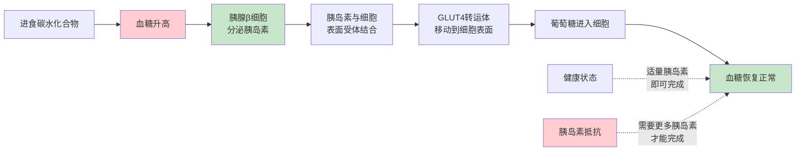
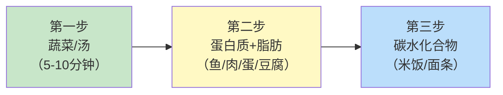
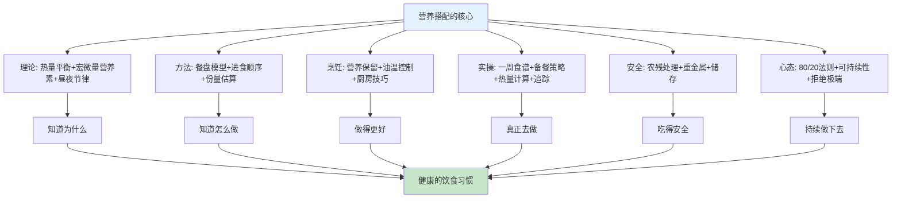

## 营养搭配方案

营养是健康的基石。你吃进去的每一口食物，都会被身体分解为分子级别的原料，用于构建细胞、合成激素、供能运动、修复组织。营养搭配不是简单的"少吃多动"，而是一门需要理解原理、掌握方法、付诸实践的系统工程。

本节从营养学原理出发，系统讲解宏量营养素与微量营养素的作用机制、食物选择方法论、科学餐盘模型，提供完整的实操方案——从一周食谱到备餐策略，从热量计算到特殊人群调整，帮助你建立一套可持续、可执行的饮食体系。

```mermaid
graph TD
    A[营养搭配方案] --> B[理论基础]
    A --> C[宏量营养素]
    A --> D[微量营养素与水]
    A --> E[食物选择方法论]
    A --> F[餐盘模型与进餐顺序]
    A --> G[烹饪方法与营养保留]
    A --> H[实操方案]
    A --> I[特殊调整与误区]
    A --> J[肠道健康]
    A --> K[饮食心理与可持续性]
    A --> L[食品安全]
    A --> M[实用工具与资源]

    B --> B1[营养素分类]
    B --> B2[消化吸收机制]
    B --> B3[热量平衡原理]
    B --> B4[昼夜节律与代谢]

    C --> C1[蛋白质: 结构与功能]
    C --> C2[碳水化合物: GI与GL]
    C --> C3[脂肪: 类型与比例]
    C --> C4[胰岛素与血糖调节]

    D --> D1[维生素: 脂溶性+水溶性]
    D --> D2[矿物质: 常量+微量]
    D --> D3[水分: 需求与时机]

    E --> E1[食物密度评分]
    E --> E2[完整食物 vs 加工食品]
    E --> E3[有机/应季选择]
    E --> E4[食物搭配科学]

    F --> F1[哈佛餐盘模型]
    F --> F2[进食顺序的科学]
    F --> F3[份量估算技巧]

    G --> G1[烹饪方法对比]
    G --> G2[油温与营养破坏]
    G --> G3[厨房工具推荐]

    H --> H1[热量计算]
    H --> H2[一周食谱]
    H --> H3[减脂/维持/增肌]
    H --> H4[备餐策略]
    H --> H5[营养追踪实操]

    I --> I1[特殊人群]
    I --> I2[常见误区]
    I --> I3[补剂指南]

    J --> J1[菌群与健康]
    J --> J2[益生菌/益生元]
    J --> J3[菌株选择指南]

    style A fill:#e3f2fd
    style B fill:#fff9c4
    style C fill:#c8e6c9
    style D fill:#ffe0b2
    style H fill:#bbdefb
    style G fill:#f3e5f5
    style L fill:#ffcdd2
```

---

### 2.1 营养学基础理论

#### 2.1.1 人体需要的七大营养素

人体维持生命活动需要从食物中获取七类营养素，它们各司其职，缺一不可。营养素是食物中能够被人体消化、吸收、利用，并维持正常生理功能的化学物质。理解每种营养素的作用机制，是做出正确饮食决策的基础。

| 营养素类别 | 主要功能 | 每日需求量（成人） | 主要食物来源 |
|-----------|---------|------------------|------------|
| **蛋白质** | 构建组织、酶、抗体、激素 | 体重(kg) × 0.8-1.2g | 鱼、肉、蛋、奶、豆 |
| **碳水化合物** | 供能（大脑首选燃料） | 总热量的45-65% | 谷物、薯类、水果 |
| **脂肪** | 储能、保护器官、合成激素 | 总热量的20-35% | 坚果、鱼油、橄榄油 |
| **维生素** | 调节代谢、抗氧化 | 因种类而异（见2.3节） | 蔬菜、水果、动物内脏 |
| **矿物质** | 骨骼构建、神经传导 | 因种类而异（见2.3节） | 奶制品、绿叶菜、海产品 |
| **水** | 溶剂、运输、体温调节 | 1500-2500ml | 饮水、食物中水分 |
| **膳食纤维** | 促进肠道蠕动、调节血糖 | 25-35g | 全谷物、蔬菜、豆类 |

**关键认知**：没有单一的"超级食物"能满足所有营养需求。多样化饮食是获得全面营养的唯一可靠途径。《中国居民膳食指南（2022版）》建议每天摄入12种以上食物，每周25种以上。这不是一个随意的数字——不同食物含有不同的植物化学物质（phytochemicals），如番茄中的番茄红素、蓝莓中的花青素、西兰花中的萝卜硫素，每一种都有独特的生物活性，无法通过单一食物或补剂替代。

#### 2.1.2 消化吸收的基本过程

理解食物如何被身体处理，有助于做出更好的饮食决策。消化系统本质上是一条从口腔到肛门的管道，食物在这条管道中被逐步分解为可被细胞利用的小分子。

**各阶段详解**：

- **口腔（1-2分钟）**：唾液中的淀粉酶开始分解碳水化合物为麦芽糖。充分咀嚼（每口20-30次）不仅提高消化效率，还增加饱腹感——大脑需要约20分钟才能收到"吃饱了"的信号。
- **胃（1-4小时）**：胃酸（pH 1.5-3.5，强酸）将蛋白质变性并激活胃蛋白酶。胃的蠕动将食物与消化液充分混合，形成食糜。脂肪在胃中消化最慢，这就是为什么高脂食物让你长时间不饿。
- **小肠（3-5小时）**：消化吸收的主战场，长度约6米，内壁有大量绒毛和微绒毛，展开面积约250平方米（一个网球场大小）。胰液分解蛋白质、脂肪和碳水化合物；胆汁乳化脂肪；肠壁细胞完成最终的营养吸收。
- **大肠（12-36小时）**：吸收水分和电解质，肠道菌群（约38万亿微生物）发酵未消化的膳食纤维，产生短链脂肪酸（SCFA），为肠道细胞供能并调节免疫。

**消化时间参考**：
- 水：10-20分钟
- 水果：20-40分钟
- 蔬菜：30-60分钟
- 谷物/淀粉：1-2小时
- 蛋白质（肉、鱼、蛋）：2-4小时
- 高脂食物：3-6小时
- 混合膳食：3-5小时

**实践意义**：训练前1-2小时进食碳水+蛋白质（给身体足够消化时间）；睡前2-3小时避免大量进食（减少胃食管反流和睡眠干扰）。

#### 2.1.3 热量平衡原理

体重变化的核心公式：

> **体重变化 = 能量摄入 - 能量消耗**

这个公式看似简单，但背后的生理机制比你想象的复杂得多。

**能量摄入**：食物中的热量（宏量营养素的能量密度各不相同）

| 营养素 | 热量密度 | 消化吸收率 | 实际可用热量 |
|-------|---------|----------|------------|
| 蛋白质 | 4 kcal/g | ~92% | ~3.7 kcal/g |
| 碳水化合物 | 4 kcal/g | ~97% | ~3.9 kcal/g |
| 脂肪 | 9 kcal/g | ~95% | ~8.6 kcal/g |
| 酒精 | 7 kcal/g | ~98% | ~6.9 kcal/g |
| 膳食纤维 | 2 kcal/g（由肠道菌群发酵） | ~50% | ~1 kcal/g |

**能量消耗**（TDEE，每日总能量消耗）由三部分组成：

- **基础代谢（BMR，占60-70%）**：维持生命基本功能所需的能量——心跳、呼吸、体温维持、细胞更新。即使你一整天躺在床上不动，也要消耗这些热量。
- **食物热效应（TEF，占8-15%）**：消化食物本身需要消耗的能量。蛋白质的TEF最高（20-30%），这意味着摄入100kcal蛋白质，有20-30kcal在消化过程中被消耗掉了。
- **活动消耗（占15-30%）**：包括日常活动、运动和非运动性活动产热（NEAT，如站立、走路、坐立不安等）。

**基础代谢估算（Mifflin-St Jeor公式，目前最准确）**：

- 男性：BMR = 10 × 体重(kg) + 6.25 × 身高(cm) - 5 × 年龄 + 5
- 女性：BMR = 10 × 体重(kg) + 6.25 × 身高(cm) - 5 × 年龄 - 161

**活动系数**：

| 活动水平 | 描述 | 系数 |
|---------|------|-----|
| 久坐不动 | 办公室工作，几乎不运动 | 1.2 |
| 轻度活动 | 每周运动1-3次 | 1.375 |
| 中度活动 | 每周运动3-5次 | 1.55 |
| 高度活动 | 每周运动6-7次 | 1.725 |
| 极高活动 | 体力劳动或每天高强度训练 | 1.9 |

**举例**：一名30岁、身高175cm、体重70kg的男性，每周运动3-5次：
- BMR = 10×70 + 6.25×175 - 5×30 + 5 = 700 + 1093.75 - 150 + 5 = 1649 kcal
- TDEE = 1649 × 1.55 ≈ 2556 kcal

**重要提醒**：热量计算只是起点。实际执行中应根据体重变化趋势（每周称重取平均值）每2-3周调整一次。体重不变说明热量平衡，需增/减100-200kcal来微调。体重秤数字波动是正常的——水分、食物残渣、排便等因素可导致每天±1-2kg的波动，所以要取周平均值看趋势，而不是每天纠结于单个数字。

#### 2.1.4 昼夜节律与进食时间

你的身体有一个内置的生物钟（circadian clock），控制着激素分泌、体温、代谢率等生理节律。进食时间与生物钟的协调程度，会影响营养物质的代谢效率。

**生物钟对代谢的影响**：

| 时间段 | 代谢特征 | 胰岛素敏感性 | 最适合的饮食策略 |
|-------|---------|------------|----------------|
| 早晨（6:00-10:00） | 代谢率最高，皮质醇峰值 | 最高 | 最大的一餐，碳水耐受性好 |
| 中午（10:00-14:00） | 代谢活跃 | 较高 | 正常份量的均衡饮食 |
| 下午（14:00-18:00） | 代谢逐渐下降 | 中等 | 适量饮食 |
| 晚上（18:00-22:00） | 代谢减慢，褪黑素上升 | 降低 | 控制份量，减少碳水 |
| 深夜（22:00后） | 代谢最低 | 最低 | 尽量避免进食 |

**为什么晚餐吃太多更容易胖？** 同样的食物，在晚上摄入时：
- 胰岛素敏感性降低，血糖更容易飙升
- 身体更倾向于将热量储存为脂肪
- 消化活动干扰睡眠质量（胃食管反流、深睡减少）
- 一项发表在《Cell Metabolism》（2022）的研究发现，将进食窗口前移4小时（如8:00-16:00 vs 12:00-20:00），即使热量相同，也能改善胰岛素敏感性、降低血压和氧化应激

**限时进食（Time-Restricted Eating, TRE）**：

限时进食是将每日进食控制在特定时间窗口内的饮食模式，最常见的形式是16:8（16小时禁食，8小时进食窗口）。

科学证据：
- 改善胰岛素敏感性（尤其对前期糖尿病患者）
- 降低炎症标志物（CRP、IL-6）
- 促进自噬（细胞自我清理机制，禁食16小时后显著增强）
- 可能降低心血管风险因素

实操建议：
- 进食窗口建议设在8:00-16:00或9:00-17:00（与生物钟协调）
- 避免将进食窗口设在深夜（如14:00-22:00），这会与生物钟冲突
- 不必每天都严格执行，灵活调整（工作日16:8，周末正常饮食即可）
- 女性慎用长期严格TRE（可能影响月经周期），建议14:10或15:9

**轮班工作者的应对策略**：
- 尽量在"白天"时段（即你的清醒时间的前半段）摄入主要热量
- 夜班期间选轻食：蛋白质+蔬菜，避免高碳水
- 保持固定的进食节律（即使与社会时钟不同），规律性比时间点更重要
- 下班后避免大量进食，先睡觉再吃"早餐"

---

### 2.2 宏量营养素深度解析

宏量营养素是身体能量的三大来源——蛋白质、碳水化合物和脂肪。它们不仅提供热量，更参与身体的每一个生理过程。理解它们的作用机制，才能做出真正合理的饮食选择。

#### 2.2.1 蛋白质：身体的建筑材料

**为什么蛋白质如此重要？**

蛋白质由20种氨基酸组成，其中9种为必需氨基酸（人体无法自行合成，必须从食物中获取）。蛋白质参与体内几乎所有生命活动：

- **结构功能**：肌肉、皮肤、头发、指甲的主要成分（胶原蛋白占人体蛋白质总量的25-35%）
- **催化功能**：几乎所有酶都是蛋白质（消化酶、代谢酶），没有酶，体内的化学反应速度会降低百万倍
- **免疫功能**：抗体（免疫球蛋白）的本质是蛋白质，你的免疫系统就是一支由蛋白质构建的军队
- **运输功能**：血红蛋白运输氧气、脂蛋白运输脂肪、转铁蛋白运输铁
- **信号功能**：胰岛素、生长激素等肽类激素，调节全身的生理活动
- **运动功能**：肌动蛋白和肌球蛋白的滑动产生肌肉收缩
- **供能功能**：极端情况下（碳水和脂肪不足时）可提供4kcal/g能量，但这是低效的利用方式

**氨基酸的密码**：

20种氨基酸就像26个字母，通过不同的排列组合，可以创造出数万种不同的蛋白质。9种必需氨基酸是：异亮氨酸、亮氨酸、赖氨酸、蛋氨酸、苯丙氨酸、苏氨酸、色氨酸、缬氨酸、组氨酸。

**蛋白质的完全与不完全**：

| 蛋白质来源 | 类型 | 必需氨基酸 | 特点 |
|-----------|------|----------|------|
| 鸡蛋、牛奶、鱼肉 | 完全蛋白 | 全部9种，比例优 | 吸收利用率高（PDCAAS接近1.0） |
| 大豆 | 完全蛋白 | 全部9种 | 植物蛋白中质量最高 |
| 大米、小麦 | 不完全蛋白 | 缺赖氨酸 | 需与其他蛋白互补 |
| 玉米 | 不完全蛋白 | 缺赖氨酸+色氨酸 | 单独食用营养不全 |
| 豆类 | 不完全蛋白 | 缺蛋氨酸 | 与谷物互补效果好 |

**氨基酸互补原则**：植物性食物通过搭配可以达到接近动物蛋白的营养价值。经典组合：
- **谷物 + 豆类**（如米饭+豆腐、馒头+豆浆、全麦面包+花生酱）
- **谷物 + 坚果/种子**（如燕麦+杏仁、藜麦+南瓜子）
- **豆类 + 坚果/种子**（如鹰嘴豆泥+芝麻酱、扁豆汤+核桃）

不需要每餐都搭配，一天之内摄入互补食物即可。你的身体有一个"氨基酸池"，可以在数小时内混合使用不同来源的氨基酸。

**每日蛋白质需求**：

| 人群 | 每日需求 | 计算方式 |
|-----|---------|---------|
| 普通成人 | 体重 × 0.8g | 70kg → 56g |
| 运动人群 | 体重 × 1.2-1.6g | 70kg → 84-112g |
| 增肌期 | 体重 × 1.6-2.2g | 70kg → 112-154g |
| 减脂期 | 体重 × 1.8-2.4g | 70kg → 126-168g |
| 老年人 | 体重 × 1.0-1.2g | 70kg → 70-84g |
| 孕中晚期 | 基础 + 额外15-25g | 约70-85g |

**减脂期为什么需要更多蛋白质？**
1. 蛋白质的饱腹感最强（食物热效应高达20-30%，即消化蛋白质本身就要消耗很多热量）
2. 减少热量摄入时，蛋白质能最大限度保护肌肉不被分解——一项发表在《American Journal of Clinical Nutrition》的研究表明，高蛋白组（2.4g/kg）比低蛋白组（1.2g/kg）在减脂期间保留了显著更多的肌肉量
3. 每餐摄入25-40g蛋白质可最大化肌肉蛋白合成（muscle protein synthesis, MPS）
4. 蛋白质的热效应意味着，同样100kcal的蛋白质，实际净摄入只有70-80kcal

**常见食物蛋白质含量参考**：

| 食物 | 每100g蛋白质含量 | 一份的量 | 一份蛋白质 |
|-----|----------------|---------|----------|
| 鸡胸肉 | 31g | 150g | 46.5g |
| 鸡蛋 | 13g | 2个(约100g) | 13g |
| 三文鱼 | 20g | 150g | 30g |
| 瘦牛肉 | 26g | 150g | 39g |
| 虾仁 | 20g | 150g | 30g |
| 豆腐(北豆腐) | 12g | 200g | 24g |
| 豆腐(南豆腐) | 6g | 200g | 12g |
| 希腊酸奶 | 10g | 200g | 20g |
| 牛奶 | 3.3g | 250ml | 8.3g |
| 糙米 | 2.6g | 200g(熟) | 5.2g |
| 藜麦 | 4.4g | 200g(熟) | 8.8g |
| 扁豆 | 9g | 200g(熟) | 18g |
| 鹰嘴豆 | 8g | 200g(熟) | 16g |
| 杏仁 | 21g | 30g(一小把) | 6.3g |
| 花生 | 25g | 30g(一小把) | 7.5g |

**蛋白质摄入时机**：
- **均匀分配**：将每日蛋白质总量分配到3-4餐，每餐25-40g，比集中在一餐更有利于肌肉蛋白合成。一项荟萃分析显示，均匀分配比集中摄入可多合成25%的肌肉蛋白
- **训练后窗口**：训练后30-120分钟内摄入蛋白质，配合碳水化合物促进恢复（实际上"合成代谢窗口"比传统认知要宽得多，前后2-4小时均可）
- **睡前**：摄入20-40g缓释蛋白质（如酪蛋白、牛奶、酸奶）可减少夜间肌肉分解——一项发表在《Medicine & Science in Sports & Exercise》的研究发现，睡前摄入40g酪蛋白可使夜间肌肉蛋白合成率提高22%

#### 2.2.2 碳水化合物：身体的首选燃料

**碳水化合物的本质**：

碳水化合物是由碳、氢、氧组成的有机物，按分子结构分为三类。碳水化合物在体内的命运取决于它的分子复杂程度——越复杂的分子，消化分解得越慢，血糖升高得越平缓。

| 类型 | 代表食物 | 消化速度 | 血糖影响 | 推荐程度 |
|-----|---------|---------|---------|---------|
| **单糖**（葡萄糖、果糖、半乳糖） | 水果、蜂蜜 | 极快 | 快速升高 | 适量 |
| **双糖**（蔗糖、乳糖、麦芽糖） | 白糖、牛奶、麦芽 | 快 | 较快升高 | 少量 |
| **多糖-精制**（精制淀粉） | 白米、白面 | 较快 | 中等升高 | 控量 |
| **多糖-复合**（全谷物淀粉） | 糙米、燕麦、红薯 | 慢 | 缓慢升高 | 优先选择 |
| **膳食纤维**（不可消化碳水） | 蔬菜、全谷物、豆类 | 不消化 | 不升血糖 | 充足摄入 |

**血糖指数（GI）与血糖负荷（GL）**：

这两个指标帮助你理解不同碳水化合物对血糖的真实影响：

- **GI（Glycemic Index，血糖指数）**：衡量食物使血糖升高速度的相对值（以葡萄糖为100）
  - 低GI ≤ 55：燕麦（55）、苹果（36）、豆类（20-40）、全麦面包（50）
  - 中GI 56-69：糙米（68）、全麦意面（55-65）、香蕉（51-62）
  - 高GI ≥ 70：白米饭（73）、白面包（75）、西瓜（72）、土豆泥（85）

- **GL（Glycemic Load，血糖负荷）**：综合考虑GI和实际碳水含量，更准确反映真实血糖影响
  - GL = GI × 每份食物碳水含量(g) / 100
  - 低GL ≤ 10、中GL 11-19、高GL ≥ 20

**为什么GL比GI更实用？** 西瓜的GI高达72，但一份西瓜（120g）的GL只有4.4，因为西瓜含水量高，实际碳水很少。所以GL才是判断食物对血糖真实影响的更好指标。

**碳水化合物的核心功能**：

1. **大脑燃料**：大脑每天消耗约120g葡萄糖，是全身最大的葡萄糖消费者。虽然大脑在长期禁食状态下可以使用酮体作为替代燃料，但葡萄糖始终是大脑最高效、最偏好的能量来源
2. **肌肉供能**：中高强度运动的主要燃料来源（肌糖原）。肌糖原储备量约300-500g，高强度运动90-120分钟即可耗尽
3. **蛋白质节约效应**：充足的碳水摄入可以防止蛋白质被用于供能——当碳水不足时，身体会分解肌肉蛋白质通过糖异生（gluconeogenesis）来产生葡萄糖
4. **膳食纤维功能**：
   - 可溶性纤维（燕麦、豆类、苹果）：在肠道中形成凝胶状物质，降低胆固醇吸收速度、减缓葡萄糖吸收、被肠道菌群发酵产生短链脂肪酸（SCFA）
   - 不可溶性纤维（全麦、蔬菜、坚果）：增加粪便体积，促进肠道蠕动，缩短有害物质在肠道的停留时间
   - 每日推荐摄入量：25-35g（中国人实际平均摄入仅约10.8g，严重不足）

**碳水化合物选择原则**：

优先级排序（从高到低）：
1. 非淀粉类蔬菜（绿叶菜、西兰花、番茄）→ 几乎不限量
2. 全谷物（糙米、燕麦、藜麦、全麦）→ 主食首选
3. 豆类（扁豆、鹰嘴豆、黑豆）→ 蛋白质+碳水双重来源
4. 薯类（红薯、土豆、山药）→ 天然复合碳水
5. 水果（苹果、浆果、柑橘）→ 适量，整果优于果汁
6. 精制谷物（白米、白面）→ 控制比例，不作为主食唯一来源
7. 添加糖（白糖、高果糖玉米糖浆）→ 严格限制

**添加糖的健康危害与限制**：

世界卫生组织（WHO）建议将添加糖摄入控制在每日总热量的5%以下（约25g），最多不超过10%。添加糖的危害不是耸人听闻，每一项都有大量研究支持：

- **促进内脏脂肪堆积**：果糖在肝脏中代谢，过量果糖直接转化为脂肪储存于内脏
- **增加胰岛素抵抗和2型糖尿病风险**：反复的血糖飙升导致胰岛β细胞疲劳
- **升高甘油三酯**：增加心血管疾病风险
- **促进炎症反应**：高糖饮食激活NF-κB通路，触发全身性低度炎症
- **加速皮肤老化**：糖化反应（glycation）使胶原蛋白交联、失去弹性，产生皱纹
- **影响多巴胺奖赏系统**：形成类似成瘾的行为模式——越吃越想吃，越吃量越大
- **损害认知功能**：长期高糖饮食与海马体萎缩和记忆力下降相关

**注意**：水果中的天然果糖与添加糖不同。水果含有纤维、维生素、抗氧化物，这些成分减缓了果糖的吸收速度，同时水果的体积和纤维带来饱腹感。每天吃200-350g水果是健康的，但果汁（去除了纤维，浓缩了糖分）则应少喝——一杯橙汁需要3-4个橙子，但你不可能一顿吃4个橙子。

#### 2.2.3 脂肪：被误解的营养素

**脂肪不是敌人**。脂肪参与激素合成（包括性激素、皮质醇）、大脑构成（大脑约60%是脂肪）、脂溶性维生素吸收（维生素A、D、E、K必须溶解在脂肪中才能被吸收）、细胞膜构建等关键过程。问题不在于吃不吃脂肪，而在于吃什么类型的脂肪。

**脂肪酸分类与健康影响**：

| 脂肪类型 | 来源 | 健康影响 | 建议 |
|---------|------|---------|------|
| **单不饱和脂肪酸（MUFA）** | 橄榄油、牛油果、坚果、花生 | 降低LDL胆固醇，保护心血管 | 优先选择，占总脂肪50%+ |
| **多不饱和脂肪酸-ω-3** | 深海鱼（三文鱼、鲭鱼）、亚麻籽、核桃 | 抗炎、保护大脑和心脏 | 每周至少吃2次深海鱼 |
| **多不饱和脂肪酸-ω-6** | 大豆油、玉米油、葵花籽油 | 适量有益，过量促进炎症 | 控制用量，ω-6:ω-3 < 4:1 |
| **饱和脂肪酸** | 红肉、黄油、椰子油、棕榈油 | 过量升高LDL胆固醇 | 控制在总热量10%以内 |
| **反式脂肪酸** | 人造黄油、油炸食品、商业烘焙 | 明确增加心血管疾病、炎症 | **完全避免**，零摄入目标 |

**ω-6与ω-3的平衡问题**：

现代饮食中ω-6:ω-3比例高达15-20:1（理想应为1-4:1），这种失衡主要由大量使用大豆油、玉米油等植物油导致。ω-6过多会促进炎症反应，与心血管疾病、自身免疫疾病、抑郁症等有关。

ω-3和ω-6竞争同一种酶（Δ6-去饱和酶），当ω-6过多时，ω-3的代谢路径被"堵住"，抗炎的EPA和DHA合成减少。这就是为什么单纯增加ω-3摄入不够——必须同时减少ω-6。

**改善方法**：
- 减少大豆油、玉米油、葵花籽油的使用（这三种油占中国家庭烹饪用油的绝大部分）
- 增加深海鱼摄入（三文鱼、鲭鱼、沙丁鱼、秋刀鱼，每周2-3次，每次100-150g）
- 每天1勺亚麻籽粉或1小把核桃（α-亚麻酸可在体内转化为EPA/DHA，但转化率仅5-10%）
- 烹饪用油优选：特级初榨橄榄油（低温烹饪、凉拌）、茶油（中高温烹饪，烟点高、ω-9含量高）

**脂肪摄入的实操建议**：

- 总脂肪占每日热量的20-35%
- 每天用油控制在25-30g（约2.5-3汤匙）
- 坚果每天一小把（约25-30g），不要过量（热量密度高，30g坚果约160-180kcal）
- 鱼油/藻油补充剂：如果不常吃鱼，可考虑每天补充1-2g EPA+DHA
- 食物中的隐形脂肪要注意：奶酪（脂肪占30-35%）、沙拉酱（脂肪占60-80%）、坚果酱、牛油果、椰奶都含大量脂肪

#### 2.2.4 胰岛素与血糖调节机制

理解胰岛素的工作机制，是理解"为什么碳水化合物的选择和搭配如此重要"的关键。

**胰岛素的工作流程**：

**胰岛素抵抗的发展过程**：

胰岛素抵抗不是一夜之间发生的，而是一个渐进的过程：

| 阶段 | 状态 | 胰岛素水平 | 血糖水平 | 身体信号 |
|-----|------|----------|---------|---------|
| 第1阶段 | 正常 | 正常 | 正常 | 无异常 |
| 第2阶段 | 代偿期 | 偏高（胰腺加班工作） | 正常 | 餐后犯困、渴望甜食 |
| 第3阶段 | 前期糖尿病 | 很高 | 偏高（空腹血糖6.1-7.0） | 腹部脂肪堆积、黑棘皮症 |
| 第4阶段 | 2型糖尿病 | 由高转低（β细胞疲劳） | 持续偏高 | 多饮多尿、疲劳、伤口愈合慢 |

**如何通过饮食改善胰岛素敏感性**：
1. **优先选择低GI碳水**：燕麦、糙米、红薯替代白米白面
2. **每餐搭配蛋白质和脂肪**：蛋白质和脂肪减缓胃排空速度，平缓血糖曲线
3. **先吃蔬菜和蛋白质，最后吃碳水**：进食顺序影响血糖反应（详见2.5节）
4. **增加膳食纤维**：可溶性纤维在肠道中形成凝胶，物理性地减缓糖分吸收
5. **饭后散步15-20分钟**：肌肉活动直接消耗血糖，降低胰岛素需求
6. **控制添加糖和精制碳水**：减少胰岛素的"过山车"式波动

---

### 2.3 微量营养素与水分管理

微量营养素（维生素和矿物质）虽然不提供热量，但它们是体内数千种酶反应的"钥匙"——没有它们，宏量营养素无法被正常代谢，生命活动无法进行。

#### 2.3.1 维生素全解

维生素分为脂溶性（A、D、E、K，可在体内储存，过量可能中毒）和水溶性（C、B族，需每日补充，过量一般随尿液排出）。

**脂溶性维生素**：

| 维生素 | 核心功能 | 每日需求 | 最佳食物来源 | 缺乏症状 | 过量风险 |
|-------|---------|---------|------------|---------|---------|
| **维生素A** | 视力、免疫、皮肤健康、基因表达调控 | 男800μgRAE，女700μgRAE | 动物肝脏、胡萝卜、红薯、菠菜 | 夜盲症、皮肤干燥、免疫力下降 | 头痛、肝损伤（仅限预成型A，即视黄醇） |
| **维生素D** | 钙吸收、骨骼健康、免疫调节、基因表达 | 400-800IU（很多人需要更多） | 阳光照射、鱼肝油、蛋黄、强化食品 | 骨质疏松、免疫力低下、抑郁 | 高钙血症（罕见，需>10000IU/天持续数月） |
| **维生素E** | 抗氧化、保护细胞膜、免疫功能 | 15mg | 坚果、种子、植物油、菠菜 | 神经损伤（罕见） | 大剂量可能干扰凝血（>400IU/天） |
| **维生素K** | 凝血、骨骼代谢、血管钙化抑制 | 男120μg，女90μg | 绿叶菜（K1）、纳豆（K2） | 出血倾向、骨质疏松 | 天然形式几乎无过量风险 |

**维生素D的特别说明**：中国人群中维生素D不足非常普遍（北方冬季尤为严重，全国约80-90%的人维生素D水平不足）。维生素D不仅仅是"骨骼维生素"——它实际上是一种激素前体，参与调控超过200个基因的表达，影响免疫功能、情绪调节、肌肉力量、心血管健康等多个方面。由于大多数食物中维生素D含量有限，最有效的来源是阳光照射（每天15-30分钟，露出手臂和面部，不要涂防晒）。如果长期室内工作，建议检测25-羟基维生素D水平，目标值为30-50ng/mL，必要时补充2000-4000IU/天维生素D3（与含脂肪食物同食提高吸收率）。

**水溶性维生素**：

| 维生素 | 核心功能 | 每日需求 | 最佳食物来源 | 缺乏症状 |
|-------|---------|---------|------------|---------|
| **维生素C** | 抗氧化、胶原蛋白合成、铁吸收、免疫支持 | 100mg | 猕猴桃、柑橘、甜椒、西兰花 | 坏血病（严重时）、免疫力下降 |
| **维生素B1（硫胺素）** | 能量代谢、神经功能 | 男1.4mg，女1.2mg | 猪肉、全谷物、豆类 | 脚气病、疲劳、神经炎 |
| **维生素B2（核黄素）** | 能量代谢、抗氧化 | 男1.4mg，女1.2mg | 奶制品、蛋、绿叶菜 | 口角炎、舌炎 |
| **维生素B3（烟酸）** | 能量代谢、DNA修复 | 男15mgNE，女12mgNE | 鸡胸肉、鱼、花生 | 糙皮病（严重时） |
| **维生素B6** | 氨基酸代谢、神经递质合成（血清素、多巴胺） | 1.4mg | 鸡胸肉、香蕉、土豆、鹰嘴豆 | 贫血、神经病变 |
| **维生素B9（叶酸）** | DNA合成、细胞分裂、神经管发育 | 400μgDFE（孕妇600μg） | 深绿叶菜、豆类、柑橘 | 巨幼细胞贫血、神经管缺陷（胎儿） |
| **维生素B12** | 神经功能、红细胞生成、DNA合成 | 2.4μg | 动物性食品（肉、鱼、蛋、奶） | 贫血、神经损伤（素食者高危） |
| **胆碱** | 大脑功能（乙酰胆碱前体）、肝脏代谢 | 男550mg，女425mg | 鸡蛋（蛋黄）、肝脏、大豆 | 脂肪肝、认知下降 |

**维生素C的吸收利用技巧**：
- 分次摄入比一次性大剂量更有效（每次200mg左右吸收率最高，500mg以上吸收率急剧下降）
- 与富含铁的食物同食可将非血红素铁吸收率提高3-6倍（如菠菜+柠檬汁、豆类+番茄酱）
- 烹饪会破坏部分维生素C：生吃蔬菜 > 蒸（保留80-90%） > 炒（保留60-70%） > 煮（保留40-50%，维C溶入水中）
- 如果煮菜，连汤一起喝可以回收溶出的维生素C

#### 2.3.2 矿物质全解

**常量矿物质**（每日需求>100mg）：

| 矿物质 | 核心功能 | 每日需求 | 最佳食物来源 | 促进/抑制吸收因素 |
|-------|---------|---------|------------|-----------------|
| **钙** | 骨骼牙齿、神经传导、肌肉收缩、凝血 | 800-1000mg（老年人1200mg） | 奶制品、豆腐、绿叶菜、芝麻酱 | 促：维D、乳糖、适量蛋白质；抑：草酸（菠菜）、植酸（全谷物）、过量咖啡因 |
| **磷** | 骨骼构成、能量代谢（ATP）、DNA/RNA结构 | 720mg | 肉类、奶制品、全谷物 | 一般不易缺乏 |
| **镁** | 300+种酶的辅因子、肌肉放松、神经传导、血糖调节 | 男330mg，女280mg | 坚果、深绿叶菜、全谷物、黑巧克力（>70%可可） | 促：维D、蛋白质；抑：高钙、酒精、过量锌 |
| **钾** | 血压调节（对抗钠的升压效应）、心脏功能、肌肉收缩 | 2000mg | 香蕉、土豆、菠菜、豆类、牛油果 | 钠钾平衡是关键，理想比例约1:2到1:3 |
| **钠** | 体液平衡、神经传导、肌肉收缩 | <2000mg（约5g盐） | 食盐、加工食品 | 现代饮食普遍过量（中国人均摄入约10.5g/天） |

**微量矿物质**（每日需求<100mg）：

| 矿物质 | 核心功能 | 每日需求 | 最佳食物来源 | 高危缺乏人群 |
|-------|---------|---------|------------|------------|
| **铁** | 血红蛋白携氧、能量代谢、免疫功能 | 男12mg，女20mg | 红肉（血红素铁）、菠菜、豆类（非血红素铁） | 月经期女性、素食者、孕妇 |
| **锌** | 免疫功能、伤口愈合、味觉、DNA合成 | 男12mg，女8mg | 牡蛎（含锌最丰富的食物）、红肉、坚果、全谷物 | 素食者、老年人、消化吸收障碍者 |
| **碘** | 甲状腺激素合成（调节代谢率） | 120μg | 碘盐、海带、紫菜、海鱼 | 内陆地区、不吃海产品者 |
| **硒** | 抗氧化（谷胱甘肽过氧化物酶的核心成分）、甲状腺功能 | 60μg | 巴西坚果（1-2颗/天即可满足）、海产品 | 土壤缺硒地区（中国东北、西南部分区域） |
| **铜** | 铁代谢、抗氧化、结缔组织形成 | 0.8mg | 动物肝脏、牡蛎、坚果、豆类 | 罕见缺乏 |
| **锰** | 骨骼形成、抗氧化、氨基酸代谢 | 4.5-5.5mg | 全谷物、坚果、茶、绿叶菜 | 罕见缺乏 |

**铁吸收的学问**：

食物中的铁有两种形式，吸收率差异巨大：
- **血红素铁**（动物来源：红肉、禽肉、鱼）：吸收率15-35%，不受其他食物因素影响
- **非血红素铁**（植物来源：菠菜、豆类、全谷物）：吸收率2-20%，受多种因素影响

提高铁吸收的技巧：
- 配合维生素C（将非血红素铁吸收率提高3-6倍）：菠菜+柠檬汁、豆类+番茄
- 避免与茶、咖啡同餐（单宁抑制铁吸收，间隔1-2小时）
- 避免与高钙食物同餐（钙竞争性抑制铁吸收，间隔2小时）
- 使用铁锅烹饪（微量铁溶入食物中，尤其烹饪酸性食物如番茄酱时效果更好）
- 发酵和浸泡可减少植酸含量，提高铁吸收率

#### 2.3.3 水分管理

水是生命之源，占体重的55-65%。水参与体温调节（出汗散热）、关节润滑、营养运输、废物排泄、细胞结构维持等几乎所有生理过程。轻度脱水（体重减少1-2%）就会导致注意力下降、疲劳增加、头痛、运动表现下降。

**每日水分需求**：

| 因素 | 需求调整 |
|-----|---------|
| 基础需求 | 1500-1700ml（中国居民膳食指南推荐） |
| 运动 | 每小时额外500-1000ml |
| 高温环境 | 额外500-1000ml |
| 高蛋白饮食 | 额外500ml（蛋白质代谢产生更多尿素，需要更多水来排泄） |
| 咖啡/茶 | 每杯咖啡额外补充等量的水（咖啡因有轻度利尿作用） |
| 生病（发烧、腹泻） | 大幅增加，至少2500ml以上 |

**简单判断水合状态**：观察尿液颜色
- 浅黄色/透明 = 充分水合
- 深黄色 = 需要喝水
- 琥珀色/褐色 = 严重脱水
- 注意：B族维生素补充剂会使尿液变亮黄色，不受此标准影响

**最佳饮水时机**：

| 时间 | 建议 | 原因 |
|-----|------|-----|
| 起床后 | 200-300ml温水 | 补充夜间失水（呼吸和出汗约损失300-500ml），唤醒消化系统 |
| 餐前30分钟 | 200ml | 增加饱腹感，促进消化液分泌 |
| 运动前2小时 | 400-600ml | 预先水合 |
| 运动中 | 每15-20分钟150-200ml | 持续补充流失水分 |
| 运动后 | 体重每减轻1kg补充1.5L | 补偿汗液流失（含钠的运动饮料更好） |
| 睡前1小时 | 小口喝水，200ml以内 | 避免夜间频繁起夜 |

**关于饮水的常见误区**：

- **"每天必须喝8杯水"**：没有统一标准，取决于体重、活动量、气候等。关键是观察尿液颜色和口渴感。一个70kg的成年人在温带气候下每天约需2000-2500ml总水分（包括食物中的水分，约占20-30%）
- **"吃饭时不能喝水"**：适量饮水不会稀释胃酸（胃酸分泌量远超你喝的水量），但大量灌水确实会过快稀释消化液。饭中喝100-200ml水是完全没问题的
- **"口渴了才喝水"**：口渴时已经轻度脱水了（体重减少1-2%），此时认知功能已经开始下降。建议规律饮水，不要等到口渴
- **"纯净水比矿泉水好"**：矿泉水含微量矿物质（钙、镁、钾），对长期饮用更有利。纯净水偶尔喝没问题，但不建议作为唯一饮用水源

---

### 2.4 食物选择方法论

#### 2.4.1 食物营养密度评分

不是所有食物都"平等"。营养密度（Nutrient Density）衡量每单位热量中所含营养素的多少，是选择食物的黄金标准。一个简单的思考方式：如果一种食物提供很多营养但热量不高，它的营养密度就高；如果它主要提供热量但几乎没有其他营养素（如白糖），它的营养密度就很低。

**高营养密度食物（优先选择）**：

| 食物类别 | 代表食物 | 关键营养素 |
|---------|---------|----------|
| 深绿叶菜 | 菠菜、羽衣甘蓝、芥蓝、油菜 | 维K、维A、叶酸、钙、镁、铁 |
| 十字花科蔬菜 | 西兰花、菜花、卷心菜、羽衣甘蓝 | 维C、维K、萝卜硫素（强效抗氧化和抗癌活性） |
| 浆果类 | 蓝莓、草莓、树莓、黑莓 | 花青素（抗氧化）、维C、纤维 |
| 鱼类 | 三文鱼、沙丁鱼、鲭鱼、秋刀鱼 | ω-3、维D、B12、硒 |
| 蛋 | 全蛋 | B12、胆碱、维D、优质蛋白、叶黄素（保护眼睛） |
| 豆类 | 扁豆、鹰嘴豆、黑豆、红豆 | 蛋白质、纤维、铁、叶酸、钾 |
| 坚果 | 核桃、杏仁、巴西坚果、开心果 | ω-3（核桃）、维E、硒、镁 |
| 全谷物 | 燕麦、藜麦、糙米、荞麦 | B族维生素、纤维、镁、铁 |
| 发酵食品 | 酸奶、泡菜、纳豆、味噌、康普茶 | 益生菌、B12（纳豆）、维K2、消化酶 |

**低营养密度食物（控制摄入）**：

| 食物类别 | 问题 | 替代方案 |
|---------|------|---------|
| 含糖饮料 | 空热量，快速升血糖，无饱腹感 | 水、无糖茶、黑咖啡、气泡水+柠檬 |
| 油炸食品 | 高热量、反式脂肪、丙烯酰胺（致癌物） | 烤、蒸、空气炸锅 |
| 加工肉类 | 高钠、亚硝酸盐（致癌物）、饱和脂肪 | 新鲜肉类、自制肉丸、自制酱牛肉 |
| 精制碳水零食 | 快速升血糖、低饱腹感、缺乏纤维 | 全谷物零食、坚果、水果、黑巧克力 |
| 商业烘焙 | 高糖、反式脂肪、添加剂 | 自制烘焙（控制糖和油） |

#### 2.4.2 完整食物 vs 加工食品

**Nova食品分类系统**（巴西圣保罗大学开发，国际广泛采用）：

| 分类 | 定义 | 举例 | 建议 |
|-----|------|------|------|
| **第1组：未加工或最低加工食品** | 天然食物，可能经干燥、冷冻、巴氏杀菌 | 新鲜蔬果、蛋、鲜肉、鲜奶、坚果、全谷物 | **占饮食的主体（建议60%以上）** |
| **第2组：加工烹饪原料** | 从第1组食物中提取的物质，用于烹饪 | 植物油、黄油、盐、糖、淀粉 | 适量使用 |
| **第3组：加工食品** | 第1组+第2组食物的组合，通常含2-3种成分 | 罐头蔬菜、奶酪、自制面包、腌制食品 | 适量食用（建议<20%） |
| **第4组：超加工食品** | 工业配方，含多种添加剂，家庭无法复制 | 薯片、方便面、碳酸饮料、速冻披萨、人造黄油、火腿肠 | **尽量避免（建议<10%）** |

**超加工食品的健康风险**：

大型队列研究（NutriNet-Santé，法国，10万+参与者）发现，超加工食品每增加10%的饮食占比：
- 全因死亡风险增加14%
- 心血管疾病风险增加12%
- 2型糖尿病风险增加15%
- 抑郁风险增加20%
- 肥胖风险增加25%

这不是相关性研究的偶然发现——多项独立队列研究（英国、美国、西班牙、巴西）得到了类似结论。超加工食品的危害可能来自：添加剂的组合效应、营养密度低导致的过量进食、以及高度加工对食物基质的破坏。

**识别超加工食品的简单方法**：看配料表——如果含有你在家里厨房找不到的成分（如高果糖玉米糖浆、氢化植物油、乳化剂、增味剂、人工色素、变性淀粉），那它大概率是超加工食品。

#### 2.4.3 有机食品与应季食材

**有机食品是否值得买？**

| 维度 | 有机食品 | 常规食品 |
|-----|---------|---------|
| 农药残留 | 显著更低 | 通常在安全标准内 |
| 营养密度 | 部分研究显示抗氧化物略高 | 大部分营养指标差异不大 |
| 价格 | 高30-100% | 价格合理 |
| 环境影响 | 对土壤和水源更友好 | 大规模种植可能有环境代价 |
| 抗生素耐药性 | 不使用预防性抗生素 | 畜牧业广泛使用抗生素 |

**实用建议**：
- **"脏十二"（Dirty Dozen）优先买有机**：草莓、菠菜、油桃、苹果、葡萄、桃子、樱桃、梨、番茄、芹菜、土豆、甜椒——这些蔬果农药残留通常较高（表皮薄或有凹槽，难以清洗干净）
- **"干净十五"（Clean Fifteen）不必买有机**：牛油果、甜玉米、菠萝、洋葱、木瓜、甜豌豆、芦笋、芒果、茄子、蜜瓜、猕猴桃、菜花、西兰花、蘑菇、卷心菜——这些蔬果有天然保护层或不直接喷洒农药
- **优先本地应季食材**：营养更完整（自然成熟vs催熟）、更新鲜、更便宜、更环保

**中国四季应季食材速查**：

| 季节 | 蔬菜 | 水果 |
|-----|------|------|
| 春 | 菠菜、荠菜、春笋、豌豆苗、香椿、韭菜 | 草莓、樱桃、枇杷、桑葚 |
| 夏 | 黄瓜、丝瓜、苦瓜、番茄、茄子、毛豆、空心菜 | 西瓜、桃子、李子、荔枝、芒果 |
| 秋 | 莲藕、南瓜、山药、芋头、百合、秋葵 | 柿子、石榴、梨、葡萄、橘子 |
| 冬 | 白菜、萝卜、芥蓝、花菜、冬笋、菠菜 | 橙子、柚子、苹果、甘蔗 |

#### 2.4.4 食物搭配的科学辨析

中国民间流传着大量"食物相克"的说法——"螃蟹和柿子不能同食""牛奶和橙汁不能一起喝""菠菜和豆腐相克"。这些说法有没有科学依据？

**"食物相克"的科学真相**：

| 民间说法 | "理由" | 科学真相 |
|---------|-------|---------|
| 螃蟹+柿子=中毒 | 柿子中的鞣酸与螃蟹蛋白结合 | 正常食用量下不会产生足够鞣酸蛋白沉淀。未成熟的柿子鞣酸含量高，但成熟柿子含量很低 |
| 菠菜+豆腐=结石 | 草酸与钙形成草酸钙 | 菠菜先焯水可去除60-80%草酸；草酸钙在肠道中形成反而减少草酸吸收，降低结石风险 |
| 牛奶+橙汁=腹泻 | 酸使牛奶凝固 | 胃酸的酸度远超橙汁，牛奶进入胃后本来就会凝固——这是正常的消化过程 |
| 海鲜+维C=砒霜 | 五价砷还原为三价砷 | 需要同时吃几百公斤海鲜和大量维C才可能达到中毒剂量，实际饮食中不可能发生 |
| 鸡蛋+豆浆=不吸收 | 胰蛋白酶抑制剂 | 生豆浆确实含胰蛋白酶抑制剂，但煮熟后完全失活。煮熟的豆浆+鸡蛋完全没问题 |

2018年，中国营养学会专门发布声明：所谓的"食物相克"没有科学依据。此前央视也多次进行实验验证，均未发现任何"相克"组合会产生毒性反应。

**真正存在的营养素相互作用**（这才是有意义的"搭配知识"）：

| 类型 | 机制 | 例子 | 建议 |
|-----|------|------|------|
| **协同效应** | 一种营养素促进另一种的吸收或利用 | 维C + 铁（维C将三价铁还原为二价铁，提高吸收率3-6倍） | 菠菜+柠檬汁、铁强化食品+橙汁 |
| **协同效应** | 脂溶性营养素需要脂肪帮助吸收 | 维A/D/E/K + 脂肪 | 胡萝卜炒着吃比生吃吸收好、沙拉加橄榄油 |
| **协同效应** | 维D促进钙吸收 | 维D + 钙 | 补钙时同时保证维D充足 |
| **协同效应** | 维K2引导钙沉积到骨骼 | 维K2 + 钙 + 维D | 纳豆、奶酪等发酵食品 |
| **拮抗效应** | 一种物质抑制另一种的吸收 | 钙 + 铁（竞争性吸收） | 钙剂和铁剂间隔2小时服用 |
| **拮抗效应** | 单宁/植酸抑制矿物质吸收 | 茶/咖啡 + 铁；全谷物中的植酸 + 锌 | 餐间喝茶、浸泡/发酵谷物减少植酸 |
| **拮抗效应** | 过量锌抑制铜吸收 | 锌 > 40mg/天 → 铜缺乏 | 不要长期大剂量补锌 |

**实用搭配建议**（一日三餐的搭配思路）：
- 早餐铁强化麦片 + 橙汁（维C促进铁吸收）
- 午餐番茄炒蛋 + 少量油（脂肪帮助番茄红素吸收）
- 沙拉加坚果和橄榄油（帮助脂溶性维生素吸收）
- 补钙产品不与铁剂同服（间隔2小时）
- 喝茶/咖啡与正餐间隔1-2小时

---

### 2.5 餐盘模型与进餐顺序

#### 2.5.1 哈佛健康餐盘模型

哈佛公共卫生学院T.H. Chan公共卫生学院在2011年推出的"健康饮食餐盘"（Healthy Eating Plate）是目前最科学、最直观的饮食指导工具。它比各国膳食指南的"食物金字塔"更直观、更实用——因为没有人用金字塔来盛饭，但每个人都有一个盘子。

┌─────────────────────────────────┐
│                                 │
│   蔬菜 + 水果                   │
│   占餐盘的 1/2                  │
│   蔬菜为主，水果为辅            │
│   多种颜色，深色蔬菜过半        │
│                                 │
├────────────┬────────────────────┤
│            │                    │
│  全谷物    │   优质蛋白质        │
│  占 1/4    │   占 1/4           │
│  糙米/燕麦 │   鱼/禽/豆/蛋      │
│  全麦面包  │   限制红肉          │
│            │   避免加工肉        │
│            │                    │
└────────────┴────────────────────┘
+ 适量健康脂肪（橄榄油等）
+ 充足的水/茶/咖啡
× 限制乳制品（1-2份/天）
× 避免含糖饮料和精制谷物

**执行要点**：

1. **蔬菜占一半**：不限种类和烹饪方式，但深色蔬菜（深绿、橙色、红色）应占蔬菜总量的一半以上。深色蔬菜的维生素、矿物质和植物化学物质含量远高于浅色蔬菜
2. **蛋白质多样化**：不要只吃猪肉，轮换鱼、鸡、蛋、豆腐、豆类。每周至少吃2次鱼（尤其深海鱼），每周至少1-2天用植物蛋白（豆腐、豆类）替代动物蛋白
3. **全谷物替代精制谷物**：至少一半主食为全谷物。如果觉得糙米口感粗糙，可以糙米+白米1:1混合煮，逐步过渡
4. **健康脂肪适量**：烹饪用好油（橄榄油、茶油），不把脂肪当敌人

#### 2.5.2 进餐顺序的科学

你吃的顺序会影响血糖反应和饱腹感。东京农业大学的研究和多项临床试验证实了"进食顺序"对代谢的影响。这个发现非常实用——你不需要改变食物种类，只需要调整吃的顺序，就能显著改善血糖控制。

**最优进食顺序：蔬菜 → 蛋白质/脂肪 → 碳水化合物**

**科学依据**：
- 先吃蔬菜：膳食纤维在胃中形成粘稠的物理屏障，包裹住后续进入的食物，减缓碳水的消化吸收速度
- 再吃蛋白质/脂肪：进一步刺激GLP-1（胰高血糖素样肽-1）分泌，增强饱腹感，同时减缓胃排空速度
- 最后吃碳水：此时胃中已有大量纤维和蛋白质"打底"，碳水化合物的消化吸收被显著减缓——研究显示，这种进食顺序可使餐后血糖峰值降低30-40%，胰岛素需求也相应减少

**一项关键临床试验**（Weill Cornell Medical College, 2015）：让2型糖尿病患者先吃蛋白质和蔬菜，最后吃碳水化合物，与传统进餐顺序相比，餐后血糖峰值降低了约50%。这个效果堪比某些降糖药物。

**实操技巧**：
- 先上蔬菜菜品，或先吃沙拉
- 饭前喝清汤（不是奶油浓汤），汤中的水分和少量固体食物可以"预热"消化系统
- 用蔬菜"打底"后再吃主食
- 如果吃火锅：先涮蔬菜和菌类，再涮肉，最后吃粉/面
- 如果是盖浇饭/拌饭：先把蔬菜和肉吃掉大部分，再吃米饭

#### 2.5.3 份量估算技巧

不用称量也能估算食物份量，用你的手作为天然的测量工具。手掌大小与体型成正比，所以用手估算能自动适配不同身材的人。

| 手部参照 | 对应食物量 | 适用食物 |
|---------|----------|---------|
| **一个拳头** | 约1杯/150g | 米饭、面条、水果、蔬菜 |
| **一个手掌（不含手指）** | 约85-100g | 肉、鱼的蛋白质份量 |
| **一个拇指尖** | 约1茶匙/5ml | 油脂、酱料、花生酱 |
| **一个手掌心（捧起）** | 约30g | 坚果、种子、零食 |
| **一个拇指** | 约30g | 奶酪 |
| **两手捧起** | 约100g | 蔬菜（生） |

**按手掌法分配一日三餐**：
- **蔬菜**：每餐2拳头（约300g）
- **蛋白质**：每餐1手掌（掌心大小和厚度的肉/鱼，或1手掌的豆腐）
- **主食**：每餐1拳头（运动量大可增加到1.5个拳头）
- **水果**：每天2拳头（约200-350g）
- **坚果**：每天1手心（约25-30g）
- **油脂**：每天2-3拇指尖（烹饪用油，约25-30ml）

---

### 2.6 烹饪方法与营养保留

食物买回来之后，烹饪方式直接决定了你最终摄入多少营养。不当的烹饪方法可能损失50%以上的维生素和抗氧化物。

#### 2.6.1 不同烹饪方法对营养的影响

| 烹饪方法 | 维生素C保留率 | 维B保留率 | 抗氧化物保留率 | 优点 | 缺点 |
|---------|------------|---------|-------------|------|------|
| **生吃** | 100% | 100% | 100% | 无营养损失 | 部分营养素（如番茄红素、β-胡萝卜素）吸收率低 |
| **蒸** | 80-90% | 85-95% | 80-90% | 营养保留最佳，无需油脂 | 口感可能较淡 |
| **微波加热** | 75-90% | 80-90% | 80-95% | 快速，加热时间短=营养损失少 | 加热不均匀 |
| **快炒（旺火急炒）** | 60-70% | 70-80% | 70-85% | 快速，油脂促进脂溶性营养素吸收 | 需要控制油温 |
| **低温慢煮（sous vide）** | 80-90% | 85-95% | 85-95% | 营养保留极好，口感嫩 | 需要专用设备 |
| **烤** | 50-70% | 60-80% | 70-85% | 风味好，无需额外油脂 | 高温可能产生有害物质 |
| **煮（水煮）** | 40-50% | 40-60% | 50-70% | 简单，汤可回收营养 | 大量水溶性维生素溶入水中 |
| **炸** | 30-50% | 30-50% | 40-60% | 风味极佳 | 高温破坏营养，增加反式脂肪 |

**关键原则**：
- **时间越短越好**：烹饪时间与营养损失成正比。大火快炒优于小火慢炖
- **温度越低越好**：超过200°C时，不仅维生素大量分解，还可能产生丙烯酰胺（致癌物）
- **水越少越好**：水溶性维生素（维C、B族）会溶入水中。如果必须煮，连汤一起喝
- **有些营养素烹饪后更好吸收**：番茄红素（番茄）、β-胡萝卜素（胡萝卜）、叶黄素（菠菜）在加热后生物利用度反而提高

#### 2.6.2 油温控制与营养保护

烹饪油的烟点（开始冒烟的温度）是关键指标。超过烟点后，油脂开始分解，产生有害物质（丙烯醛、多环芳烃）并破坏营养素。

| 油脂 | 烟点 | 最适合的烹饪方式 |
|-----|------|----------------|
| 特级初榨橄榄油 | 160-190°C | 凉拌、低温炒菜 |
| 精炼橄榄油 | 200-240°C | 中高温炒菜 |
| 茶油（山茶油） | 210-250°C | 中高温炒菜、煎炸 |
| 花生油 | 160-230°C | 炒菜 |
| 菜籽油 | 200-230°C | 炒菜、煎 |
| 椰子油 | 175-200°C | 中温烹饪、烘焙 |
| 亚麻籽油 | 107°C | 仅凉拌，不可加热 |
| 黄油 | 120-150°C | 低温烹饪、烘焙 |

**炒菜实用技巧**：
- 冷锅冷油：先把油倒入冷锅，再开火，可以减少油烟和有害物质
- 不要等油冒烟再下菜：冒烟说明已经超过烟点
- 炒菜前先焯水：可以缩短高温烹饪时间，减少营养损失
- 蒜末最后放：大蒜中的蒜素在高温下分解，最后放可以保留更多活性成分

#### 2.6.3 提升营养保留的厨房技巧

**蔬菜处理**：
- 先洗后切，不要先切后洗（减少水溶性维生素流失）
- 切面越大越好：切大块比切小块/切丝流失更少
- 切好立即烹饪：不要长时间暴露在空气中（维C氧化）
- 焯水时加少许盐和油：盐减少营养流失，油保持蔬菜翠绿色
- 焯水后立即过冷水：停止加热，防止余热继续破坏营养

**肉类处理**：
- 低温慢炖比高温烧烤更安全（减少杂环胺和多环芳烃的产生）
- 腌制肉类时加入柠檬汁、大蒜、迷迭香：这些成分含抗氧化物，可减少有害物质形成
- 烧烤时避免明火直接接触肉：使用锡纸包裹
- 不要丢弃炖肉的汤汁：溶解了大量B族维生素和矿物质

**谷物/豆类处理**：
- 浸泡过夜：减少植酸含量（提高矿物质吸收率），缩短烹饪时间
- 发酵（如做纳豆、味噌）：进一步降低植酸，增加B族维生素
- 发芽（如绿豆芽、黄豆芽）：增加维C含量，降低抗营养因子

**推荐厨房工具**：
- **蒸锅**：最能保留营养的烹饪工具
- **空气炸锅**：用少量油达到类似油炸的口感，热量减少70-80%
- **慢炖锅/压力锅**：低温长时间烹饪，适合汤品和炖菜
- **食品温度计**：确保食物熟透的同时不过度烹饪
- **厨房秤**：初期用来校准你的目测能力

---

### 2.7 实操方案

#### 2.7.1 热量计算实操

**第一步：计算你的TDEE**

以28岁、175cm、70kg、每周运动3-4次的男性为例：
1. BMR = 10×70 + 6.25×175 - 5×28 + 5 = 700 + 1093.75 - 140 + 5 = 1659 kcal
2. TDEE = 1659 × 1.55 ≈ 2571 kcal

**第二步：根据目标设定热量**

| 目标 | 热量设定 | 本例每日热量 |
|-----|---------|------------|
| 减脂（温和） | TDEE - 300~500 | 2071-2271 kcal |
| 减脂（激进） | TDEE - 500~750 | 1821-2071 kcal |
| 维持 | TDEE ± 100 | 2471-2671 kcal |
| 增肌（温和） | TDEE + 200~300 | 2771-2871 kcal |
| 增肌（激进） | TDEE + 300~500 | 2871-3071 kcal |

**警告**：减脂时不要低于BMR（本例中不低于1659 kcal），否则身体会降低代谢率、流失肌肉，反而不利于长期减脂。极端低热量饮食（<1200kcal）还会导致胆结石、电解质紊乱、脱发等问题。

**第三步：分配宏量营养素**

以减脂目标2070 kcal为例（蛋白质30%、碳水40%、脂肪30%）：
- 蛋白质：2070 × 30% ÷ 4 = 155g（约每公斤体重2.2g）
- 碳水化合物：2070 × 40% ÷ 4 = 207g
- 脂肪：2070 × 30% ÷ 9 = 69g

**第四步：验证与调整**

计算只是起点，不是终点。执行2-3周后：
- 每天固定时间称重（建议晨起排便后），取7天平均值
- 平均值每周下降0.3-0.5kg = 理想速度
- 平均值不变 = 需要减少100-200kcal或增加活动量
- 平均值下降>1kg = 可能热量缺口过大，适当增加100-200kcal

#### 2.7.2 一周营养食谱（完整版）

以下食谱按1800-2000kcal/天设计（适合中等活动量的减脂/维持期），可根据个人热量目标按比例调整。每餐标注大致热量和宏量营养素。

**周一**

| 餐次 | 食物 | 热量 | 蛋白质 | 碳水 | 脂肪 |
|-----|------|-----|-------|-----|-----|
| 早餐 | 全麦吐司2片+水煮蛋2个+牛油果1/4个+蓝莓一小碗 | 480kcal | 25g | 48g | 20g |
| 上午加餐 | 杏仁15颗 | 100kcal | 4g | 4g | 9g |
| 午餐 | 糙米饭150g+清蒸鲈鱼150g+蒜蓉西兰花200g+凉拌黄瓜100g | 520kcal | 38g | 55g | 14g |
| 下午加餐 | 希腊酸奶150g+蓝莓50g | 150kcal | 15g | 15g | 4g |
| 晚餐 | 杂粮粥200ml+清炒时蔬200g+北豆腐150g | 400kcal | 22g | 50g | 10g |
| **合计** | | **1650kcal** | **104g** | **172g** | **57g** |

**周二**

| 餐次 | 食物 | 热量 | 蛋白质 | 碳水 | 脂肪 |
|-----|------|-----|-------|-----|-----|
| 早餐 | 燕麦粥60g+奇亚籽10g+香蕉半根+核桃3个 | 420kcal | 14g | 52g | 18g |
| 上午加餐 | 苹果1个 | 80kcal | 0g | 21g | 0g |
| 午餐 | 全麦面条200g+番茄鸡蛋卤+菠菜200g | 500kcal | 25g | 65g | 14g |
| 下午加餐 | 胡萝卜棒+鹰嘴豆泥30g | 120kcal | 4g | 15g | 5g |
| 晚餐 | 红薯200g+烤鸡胸肉150g+混合蔬菜沙拉200g | 480kcal | 42g | 48g | 10g |
| **合计** | | **1600kcal** | **85g** | **201g** | **47g** |

**周三**

| 餐次 | 食物 | 热量 | 蛋白质 | 碳水 | 脂肪 |
|-----|------|-----|-------|-----|-----|
| 早餐 | 小米粥200ml+水煮蛋2个+凉拌木耳100g+红枣3颗 | 380kcal | 18g | 45g | 12g |
| 上午加餐 | 橙子1个 | 60kcal | 1g | 15g | 0g |
| 午餐 | 藜麦饭150g+鸡胸肉100g+牛油果1/4个+混合蔬菜200g | 550kcal | 35g | 50g | 20g |
| 下午加餐 | 南瓜子一小把(20g) | 110kcal | 5g | 3g | 10g |
| 晚餐 | 清蒸虾150g+炒青菜200g+糙米饭100g | 420kcal | 32g | 40g | 8g |
| **合计** | | **1520kcal** | **91g** | **153g** | **50g** |

**周四**

| 餐次 | 食物 | 热量 | 蛋白质 | 碳水 | 脂肪 |
|-----|------|-----|-------|-----|-----|
| 早餐 | 全麦面包2片+花生酱15g+香蕉半根+牛奶250ml | 450kcal | 20g | 55g | 16g |
| 上午加餐 | 核桃3-4个 | 100kcal | 2g | 2g | 10g |
| 午餐 | 杂粮饭150g+红烧豆腐200g+清炒豆角200g+紫菜蛋花汤 | 500kcal | 25g | 55g | 16g |
| 下午加餐 | 酸奶150g+蓝莓50g | 150kcal | 10g | 18g | 4g |
| 晚餐 | 烤三文鱼150g+蔬菜汤（番茄+胡萝卜+洋葱） | 420kcal | 35g | 20g | 20g |
| **合计** | | **1620kcal** | **92g** | **150g** | **66g** |

**周五**

| 餐次 | 食物 | 热量 | 蛋白质 | 碳水 | 脂肪 |
|-----|------|-----|-------|-----|-----|
| 早餐 | 豆浆300ml+全麦包子1个+水煮蛋1个+黄瓜1根 | 380kcal | 22g | 42g | 10g |
| 上午加餐 | 猕猴桃1个 | 60kcal | 1g | 15g | 0g |
| 午餐 | 糙米饭150g+宫保鸡丁（少油版）+凉拌海带丝 | 530kcal | 30g | 58g | 16g |
| 下午加餐 | 腰果一小把(20g) | 110kcal | 4g | 8g | 9g |
| 晚餐 | 玉米1根+清蒸鱼150g+蒜蓉西兰花200g | 440kcal | 35g | 42g | 10g |
| **合计** | | **1520kcal** | **92g** | **165g** | **45g** |

**周六**（社交日，灵活调整）

| 餐次 | 食物 | 热量 | 蛋白质 | 碳水 | 脂肪 |
|-----|------|-----|-------|-----|-----|
| 早餐 | 蔬菜鸡蛋饼2个+小米粥+水果 | 420kcal | 22g | 45g | 16g |
| 上午加餐 | 混合坚果一小把 | 100kcal | 3g | 4g | 9g |
| 午餐 | 全麦意面200g+番茄肉酱+沙拉 | 550kcal | 28g | 62g | 18g |
| 下午加餐 | 黑巧克力(>70%可可)2-3小块 | 70kcal | 1g | 8g | 5g |
| 晚餐 | 火锅（多蔬菜菌类，精选瘦肉，少丸子，主食选红薯/玉米） | 600kcal | 30g | 50g | 25g |
| **合计** | | **1740kcal** | **84g** | **169g** | **73g** |

**周日**（备餐日）

| 餐次 | 食物 | 热量 | 蛋白质 | 碳水 | 脂肪 |
|-----|------|-----|-------|-----|-----|
| 早餐 | 杂粮粥200ml+茶叶蛋2个+凉拌小菜+水果 | 400kcal | 20g | 45g | 12g |
| 上午加餐 | 梨1个 | 80kcal | 1g | 21g | 0g |
| 午餐 | 鸡肉沙拉（鸡胸肉150g+混合蔬菜+橄榄油醋汁）+全麦面包1片 | 480kcal | 40g | 30g | 18g |
| 下午加餐 | 酸奶150g+坚果15g | 140kcal | 12g | 12g | 6g |
| 晚餐 | 蔬菜粥200ml+清炒虾仁150g+蒸南瓜150g | 380kcal | 28g | 42g | 6g |
| **合计** | | **1480kcal** | **101g** | **150g** | **42g** |

**一周平均**：约1590kcal/天，蛋白质约93g/天。偏低碳水的周末和偏高蛋白的工作日形成自然的热量波动，有助于代谢灵活性。

#### 2.7.3 不同热量目标的饮食方案

**减脂方案（1500-1800kcal/天）**

核心原则：
- 热量缺口300-500kcal/天（每周减重0.3-0.5kg是健康且可持续的速度）
- 蛋白质提高到30%（112-135g），保护肌肉、增强饱腹感
- 膳食纤维目标30g+/天，增加饱腹感
- 控制精制碳水和添加糖

宏量营养素分配：
- 蛋白质：30%（112-135g）
- 碳水化合物：40%（150-180g）
- 脂肪：30%（50-60g）

食物选择策略：
- 优先低GI碳水：糙米替代白米，红薯替代馒头
- 每餐必须有优质蛋白质（至少25g）
- 大量蔬菜（每天500g以上），体积大、热量低、纤维丰富
- 适量水果（每天200-300g），选低GI水果（苹果、梨、浆果、柑橘）
- 严格限制油炸食品、甜食、含糖饮料、酒精
- 吃饭前喝一碗清汤或一大杯水，降低食欲
- 晚餐提前到18:00-19:00，避免深夜进食

**维持方案（1800-2200kcal/天）**

宏量营养素分配：
- 蛋白质：20-25%
- 碳水化合物：45-55%
- 脂肪：25-30%

核心原则：
- 食物多样化，每周至少25种不同食物
- 均衡的宏量营养素分配
- 保持规律的进食时间和份量
- 每周允许1-2次灵活餐（外食、聚餐），但控制频率
- 善用80/20法则：80%的食物是高营养密度的，20%可以是享受型食物

**增肌方案（2200-2800kcal/天）**

核心原则：
- 热量盈余200-500kcal/天（超出500kcal会大量增加脂肪）
- 蛋白质是重点：每公斤体重1.6-2.0g
- 充足的碳水化合物为训练提供能量
- 训练日比休息日多吃200-300kcal

宏量营养素分配：
- 蛋白质：25-30%（每公斤体重1.6-2.0g）
- 碳水化合物：45-55%
- 脂肪：20-25%

进餐安排：
- 每天4-5餐（含加餐）
- 训练前1-2小时：碳水+蛋白质（如燕麦+蛋白粉、米饭+鸡胸肉）
- 训练后30分钟内：快速吸收的蛋白质+碳水（如蛋白粉+香蕉、希腊酸奶+蜂蜜）
- 睡前：缓释蛋白质（酪蛋白、牛奶、希腊酸奶）

**增肌期常见错误**：
- ❌ "脏增肌"（随意吃高热量食物）→ 大量增加脂肪，后期减脂更困难
- ❌ 只注重蛋白质忽视碳水 → 训练能量不足，肌肉增长缓慢
- ❌ 不吃蔬菜 → 膳食纤维和微量营养素不足，影响恢复
- ✅ 温和盈余（+300kcal）+ 充足蛋白质 → 精瘦增肌，体脂比变化小

#### 2.7.4 备餐策略（Meal Prep）

备餐是将营养计划转化为实际行动的关键环节。没有备餐，再好的计划也会在忙碌的工作日被外卖打败。

**备餐的基本模式**：

| 模式 | 适合人群 | 操作方式 | 耗时 |
|-----|---------|---------|-----|
| **批量烹饪** | 时间充裕者 | 周日做2-3天的全部主菜 | 2-3小时/次 |
| **食材预处理** | 灵活偏好者 | 洗切蔬菜、腌制肉类、煮好谷物 | 1-2小时/次 |
| **冷冻备餐** | 极忙人群 | 一次性做好一周的冷冻餐 | 3-4小时/次 |
| **每日快手** | 喜欢新鲜感者 | 提前规划菜单，30分钟快速烹饪 | 30分钟/天 |

**周日备餐实操流程（2小时完成3天食材准备）**：

第0-10分钟：准备工作
- 清空冰箱过期食物
- 列出需要准备的食材清单
- 准备保鲜盒、密封袋

第10-30分钟：谷物烹饪
- 电饭锅煮糙米饭/藜麦（一次性煮好3天的量）
- 同时用另一个锅煮红薯/玉米

第30-60分钟：蛋白质准备
- 鸡胸肉切片，一部分用盐+黑胡椒+橄榄油腌制
- 水煮鸡蛋6-8个
- 豆腐切块，分装

第60-90分钟：蔬菜处理
- 洗净所有蔬菜
- 西兰花、菜花切小朵
- 胡萝卜切条（做加餐零食）
- 叶菜类沥干水分，用厨房纸包好放保鲜盒

第90-120分钟：分装
- 谷物分装到保鲜盒（每份150g）
- 蛋白质分装
- 蔬菜分装
- 标注日期，放入冰箱

**备餐食材保存时间**：

| 食材 | 冷藏（4°C） | 冷冻（-18°C） |
|-----|-----------|-------------|
| 煮好的谷物 | 3-5天 | 2-3个月 |
| 煮好的鸡胸肉 | 3-4天 | 2-3个月 |
| 水煮蛋 | 5-7天 | 不推荐冷冻 |
| 切好的蔬菜 | 2-3天 | 不适合 |
| 预制沙拉 | 2-3天 | 不适合 |
| 汤/炖菜 | 3-4天 | 2-3个月 |
| 酱汁/调料 | 5-7天 | 1-2个月 |
| 腌制肉类 | 3-5天 | 1-2个月 |

**快速备餐的万能公式**：

每餐 = 1份谷物 + 1份蛋白质 + 2份蔬菜 + 1份调味

按这个公式随机组合，就能快速构建均衡的一餐：
- 糙米 + 照烧鸡胸 + 清炒西兰花和胡萝卜 + 照烧酱
- 藜麦 + 香煎三文鱼 + 烤蔬菜拼盘 + 柠檬橄榄油汁
- 全麦意面 + 番茄肉酱 + 蒜蓉菠菜 + 帕尔马干酪
- 红薯 + 鹰嘴豆咖喱 + 烤花椰菜 + 酸奶酱
- 杂粮饭 + 红烧豆腐 + 清炒时蔬 + 蒸鱼豉油

**常见食物替换表**：

当某种食材买不到或吃腻了，可以用以下替换（营养和热量相近）：

| 原食材 | 替代选项 | 注意事项 |
|-------|---------|---------|
| 鸡胸肉 | 火鸡胸、瘦猪里脊、虾仁 | 蛋白质含量相近 |
| 三文鱼 | 鳕鱼、鲈鱼、沙丁鱼 | 深海鱼ω-3含量更高 |
| 糙米 | 藜麦、荞麦、小米 | 藜麦蛋白质更高 |
| 红薯 | 南瓜、山药、芋头 | GI值有差异，南瓜最低 |
| 西兰花 | 菜花、芥蓝、羽衣甘蓝 | 同为十字花科蔬菜 |
| 菠菜 | 油菜、小白菜、空心菜 | 深绿叶菜营养价值相近 |
| 牛油果 | 橄榄油、坚果 | 补充健康脂肪 |
| 希腊酸奶 | 普通酸奶（加蛋白粉）、茅屋芝士 | 注意含糖量 |

#### 2.7.5 营养追踪实操

营养追踪不是一辈子的事，而是一个阶段性的学习工具。就像学开车时要刻意关注方向盘角度和油门深度，熟练后就凭直觉驾驶了。营养追踪的目的是训练你对食物热量和营养的"直觉"。

**追踪步骤**：

| 步骤 | 操作 | 工具 |
|-----|------|------|
| 1. 选工具 | 下载一个追踪App | 薄荷健康（中文最佳）、MyFitnessPal、Cronometer |
| 2. 设目标 | 输入个人信息，设定热量和宏量目标 | App自动计算或按2.7.1节手动计算 |
| 3. 记录 | 每餐后立即记录（延迟记录容易遗忘） | 拍照+搜索食物名称 |
| 4. 称量（初期） | 前2周用厨房秤称量主要食物 | 一个厨房秤（30-50元即可） |
| 5. 目测校准 | 2周后开始目测，偶尔用秤验证 | 手掌法（2.5.3节） |
| 6. 回顾 | 每周回顾一次，看趋势 | App的周报功能 |
| 7. 停止追踪 | 2-4周后，凭感觉估算即可 | 不再需要App |

**餐厅和外卖的估算技巧**：
- 炒菜：约用油2-3汤匙（30-45ml），热量比看起来高很多
- 红烧/糖醋类：含大量糖和油，热量通常是清蒸的2-3倍
- 火锅：蘸料是热量炸弹（芝麻酱一勺约100kcal），锅底选清汤
- 麻辣烫：比火锅好控制，但注意粉类主食的量
- 盖浇饭：菜的油和酱汁会渗入米饭，实际热量比单独计算菜和饭之和更高
- 外卖标注的热量仅供参考，实际可能高出20-50%

**什么时候应该停止追踪**：
- 当你看到一碗米饭就能大概猜出它的热量时
- 当你不用记录也能维持体重在目标范围时
- 当追踪开始引起焦虑、影响生活质量时
- 追踪是工具，不是生活方式。学会凭直觉健康饮食后，放下工具

---

### 2.8 特殊人群饮食调整

#### 2.8.1 孕妇与哺乳期

**孕期营养时间线**：

| 阶段 | 重点营养素 | 需求变化 | 关键食物 |
|-----|----------|---------|---------|
| 孕前3个月 | 叶酸 | 400→600μg/天 | 深绿叶菜、豆类、强化食品 |
| 孕早期(1-12周) | 叶酸、维B6（缓解孕吐） | 热量不需增加 | 少量多餐，避免空腹 |
| 孕中期(13-27周) | 铁、钙、DHA | +340kcal/天 | 红肉、奶制品、深海鱼 |
| 孕晚期(28-40周) | 铁、钙、DHA、蛋白质 | +450kcal/天 | 蛋白质增加25g/天 |
| 哺乳期 | 全面营养、水分 | +500kcal/天 | 汤水类、高蛋白食物 |

**孕期必须避免的食物**：
- 生鱼片、生肉、溏心蛋（李斯特菌、弓形虫风险）
- 未消毒乳制品（生牛奶、软奶酪如布里、卡门贝尔）
- 高汞鱼（鲨鱼、旗鱼、金枪鱼、方头鱼）——每周低汞鱼不超过340g
- 酒精（零容忍，没有安全剂量）
- 咖啡因限制在200mg/天以内（约1杯中杯美式）

#### 2.8.2 老年人（65岁以上）

**老年人特有的营养挑战**：

| 挑战 | 原因 | 解决方案 |
|-----|------|---------|
| 肌肉流失（肌少症） | 合成代谢信号减弱 | 每餐25-30g蛋白质 + 抗阻运动 |
| 骨质疏松 | 钙吸收能力下降、维D不足 | 钙1200mg/天 + 维D 800-1000IU |
| 维B12缺乏 | 胃酸分泌减少，吸收率下降 | 补充剂或强化食品 |
| 脱水 | 口渴感知减退 | 规律饮水，不等渴了再喝 |
| 食欲下降 | 味觉退化、咀嚼困难 | 少量多餐，食物质地调整 |
| 便秘 | 肠蠕动减慢、纤维不足、运动少 | 纤维25g+/天 + 充足水分 |

**老年人蛋白质策略**：
- 老年人的"合成代谢阈值"升高，每餐需要更多蛋白质（至少30g）才能触发肌肉蛋白合成
- 建议每公斤体重1.0-1.2g/天（比年轻成人高）
- 优先选择易消化的优质蛋白：鸡蛋、鱼、豆腐、希腊酸奶
- 必要时可补充乳清蛋白粉（消化吸收快，亮氨酸含量高——亮氨酸是触发肌肉蛋白合成的关键氨基酸）

#### 2.8.3 素食者

**素食类型与营养风险**：

| 类型 | 避免食物 | 最大营养风险 |
|-----|---------|------------|
| 弹性素食 | 偶尔避免肉 | 较低 |
| 蛋奶素 | 肉、鱼 | 铁、锌 |
| 蛋素 | 肉、鱼、奶 | 钙、维D、B2 |
| 纯素（Vegan） | 所有动物产品 | B12、铁、钙、DHA、维D、锌 |

**纯素食者的营养保障清单**：

| 营养素 | 植物来源 | 是否需要补充 |
|-------|---------|------------|
| **蛋白质** | 大豆（完全蛋白）、豆类+谷物组合 | 不需要，注意多样化 |
| **维生素B12** | 天然植物来源几乎为零 | **必须补充**，至少2.4μg/天 |
| **铁** | 豆类、菠菜、强化食品+VC促进吸收 | 注意监测，必要时补充 |
| **钙** | 豆腐（硫酸钙凝固）、绿叶菜、芝麻酱、强化植物奶 | 注意摄入量，1000mg/天 |
| **锌** | 豆类、坚果、全谷物、种子 | 注意浸泡/发酵减少植酸 |
| **维生素D** | 阳光、强化食品、蘑菇（日晒） | 建议补充，尤其高纬度地区 |
| **DHA** | 藻油补充剂（唯一可靠的植物来源） | 建议补充200-300mg/天 |
| **碘** | 海带、紫菜、碘盐 | 注意摄入，尤其不吃海藻者 |

**氨基酸互补的实用搭配**：

| 搭配组合 | 菜品示例 |
|---------|---------|
| 谷物 + 豆类 | 米饭+豆腐、全麦面包+花生酱、玉米饼+黑豆 |
| 豆类 + 坚果/种子 | 鹰嘴豆泥+芝麻酱、扁豆汤+核桃 |
| 谷物 + 坚果/种子 | 燕麦+杏仁、藜麦+南瓜子 |

#### 2.8.4 其他特殊人群

**高血压患者**：
- DASH饮食法（Dietary Approaches to Stop Hypertension，被证实可降低血压8-14mmHg，效果堪比单一降压药）
- 每日钠摄入<2000mg（约5g盐）——中国人均摄入约10.5g/天，需要减半
- 增加钾摄入（香蕉、土豆、菠菜、豆类），钾促进钠的排泄
- 每天4-5份蔬菜 + 4-5份水果
- 选择低脂乳制品
- 限制酒精（男≤2杯/天，女≤1杯/天）

**糖尿病患者/胰岛素抵抗者**：
- 严格的碳水管理：优先低GI食物，每餐碳水总量控制在40-60g
- 蛋白质+脂肪与碳水同食，减缓血糖升高速度
- 纠正进食顺序：先蔬菜、再蛋白质、最后碳水（详见2.5.2节）
- 监测餐后血糖，根据个人反应调整食物选择——同样的食物，不同人的血糖反应可能相差2-3倍
- 避免含糖饮料和果汁
- 增加膳食纤维至30g+/天（可溶性纤维对血糖调节尤其重要）

**痛风患者**：
- 限制高嘌呤食物：内脏、海鲜（贝类、虾蟹）、浓肉汤、啤酒
- 充足水分（每天2000ml以上，帮助尿酸排出）
- 低脂乳制品有保护作用（酪蛋白和乳清蛋白促进尿酸排泄）
- 避免含高果糖玉米糖浆的饮料（果糖升高尿酸的机制与酒精类似）
- 蔬菜中的嘌呤（如菠菜、蘑菇、花椰菜）实际上不增加痛风风险，不必限制

**胃肠功能弱的人群**：
- 少量多餐（5-6小餐），避免一次大量进食
- 避免辛辣、油腻、过酸的食物
- 细嚼慢咽，每口咀嚼20次以上
- 温热食物优于冰冷食物
- 发酵食品（酸奶、味噌）有助于消化
- 如有乳糖不耐受，选择酸奶或低乳糖奶

---

### 2.9 常见饮食误区与纠正

#### 误区1："碳水化合物让人发胖"

**真相**：热量过剩才是发胖的根本原因。碳水化合物是身体的首选燃料，完全不吃碳水会导致：
- 大脑功能下降（大脑每天需要120g葡萄糖）
- 肌肉糖原不足，运动表现下降
- 情绪波动、暴食风险增加（碳水促进血清素合成，缺乏时容易焦虑和抑郁）
- 长期极低碳水饮食可能影响甲状腺功能（T3激素水平下降）
- 口臭（酮体代谢的副产物）

**正确做法**：选择复合碳水化合物（全谷物、豆类、薯类），控制总量，避免添加糖和精制碳水。

#### 误区2："脂肪有害健康"

**真相**：20世纪中后期的"低脂饮食运动"被证明是营养学史上最大的错误之一。人们用碳水替代了脂肪，结果肥胖率和心血管疾病反而上升。1980年代美国推行的低脂膳食指南，与随后30年肥胖率翻倍的时间线高度吻合。

脂肪不是敌人，关键是选对类型：
- ✅ 单不饱和脂肪（橄榄油、牛油果）
- ✅ ω-3多不饱和脂肪（深海鱼、亚麻籽）
- ❌ 反式脂肪（人造黄油、油炸食品）——真正有害
- ⚠️ 饱和脂肪——适量即可，不必完全避免

#### 误区3："少吃多餐能提高代谢"

**真相**：多项对照研究（如2015年发表在《Nutrition Journal》上的荟萃分析）表明，在总热量相同的情况下，进食频率对代谢率和减脂效果没有显著影响。食物热效应取决于总热量和食物种类，与分成几餐吃无关。

**正确做法**：选择适合你生活方式的进食频率（2-4餐/天均可），关键是总热量和食物质量。如果你觉得少食多餐更容易控制饥饿感，那完全可以这样做——但不要指望它能"提高代谢"。

#### 误区4："蛋白粉是必需品"

**真相**：蛋白粉只是蛋白质的便捷来源，不是神奇补剂。如果你能从食物中获得足够的蛋白质（每天每公斤体重0.8-1.6g），不需要蛋白粉。

蛋白粉有用的场景：
- 训练后需要快速补充蛋白质
- 素食者难以从食物中获得足够蛋白质
- 忙碌时作为代餐的一部分
- 老年人咀嚼困难
- 需要在热量受限的情况下保证蛋白质摄入（减脂期）

#### 误区5："所有热量都一样"

**真相**：同样200kcal的西兰花和200kcal的可乐对身体的影响完全不同：
- 西兰花的热效应更高（消化它本身就消耗更多热量）
- 西兰花含有纤维、维生素、矿物质、抗氧化物
- 可乐只有添加糖，血糖飙升后又暴跌，导致饥饿感
- 长期来看，高营养密度食物支持更好的代谢健康

**正确做法**：关注热量的同时，更关注食物的营养密度。100kcal的坚果和100kcal的糖果，选择坚果。

#### 误区6："排毒果汁/断食能清理身体"

**真相**：人体有完善的排毒系统——肝脏、肾脏、肺、皮肤、消化道每天都在高效地清除代谢废物。没有任何科学证据支持果汁排毒或短期断食能"清理"身体。"排毒"这个词本身就是营销概念，不是科学概念。

短期果汁排毒的潜在危害：
- 血糖剧烈波动
- 蛋白质严重不足
- 肌肉流失
- 可能导致暴食反弹
- 纤维不足（果汁去除了纤维）

**正确做法**：通过均衡饮食、充足水分、规律运动来支持身体自身的排毒系统。偶尔的轻断食（如16:8间歇性断食）如果有研究支持，可以尝试，但不能代替均衡饮食。

#### 误区7："补剂能替代食物"

**真相**：食物中的营养素以复杂矩阵存在，相互之间有协同作用（如番茄中的番茄红素需要油脂帮助吸收；菠菜中的铁需要维生素C帮助吸收）。分离出来的单一营养素补剂很难复制这种协同效应。大量研究（如β-胡萝卜素补剂的大型临床试验）表明，从补剂中获取营养素的效果不如从食物中获取。

**正确做法**：以食物为主，补剂为辅。优先通过多样化饮食获取营养。在以下情况下考虑补剂：
- 维生素D（日照不足时）
- B12（素食者）
- DHA/EPA（不常吃鱼时）
- 铁（确诊缺铁性贫血时，遵医嘱）
- 叶酸（备孕/孕期）

---

### 2.10 补剂指南：什么时候需要，如何选择

#### 2.10.1 有充分证据支持的补剂

| 补剂 | 适用人群 | 推荐剂量 | 注意事项 |
|-----|---------|---------|---------|
| **维生素D3** | 日照不足者、老年人、北方冬季 | 2000-4000IU/天 | 与含脂肪食物同食提高吸收；每6个月检测血清25(OH)D水平 |
| **维生素B12** | 纯素食者、老年人、胃酸不足者 | 250-1000μg/天 | 甲基钴胺素形式吸收更好；老年人即使吃肉也可能需要补充 |
| **鱼油/藻油** | 不常吃鱼者 | 1-2g EPA+DHA/天 | 选择第三方检测的品牌；藻油适合素食者 |
| **肌酸** | 力量训练者 | 3-5g/天（一水肌酸） | 最有证据的运动补剂之一；增加肌肉力量和爆发力，也有助于认知功能 |
| **镁** | 饮食中镁不足者、肌肉痉挛者 | 200-400mg/天 | 甘氨酸镁和苏糖酸镁吸收较好；氧化镁容易引起腹泻 |
| **益生菌** | 抗生素后、肠道问题 | 菌株特异性 | 不同菌株功效不同，选择针对性产品（见2.11节） |

#### 2.10.2 证据有限/效果被夸大的补剂

| 补剂 | 宣称功效 | 实际证据 |
|-----|---------|---------|
| 维生素C大剂量 | 预防感冒 | 轻微缩短感冒时间（约8%），不能预防感冒 |
| 胶原蛋白口服 | 美肤、抗衰老 | 少量研究支持，但被消化为氨基酸后效果不确定——你吃的胶原蛋白不会直接变成皮肤的胶原蛋白 |
| 螺旋藻/小球藻 | 排毒、抗氧化 | 营养密度确实高，但"排毒"说法无科学依据 |
| 大量抗氧化剂 | 抗癌、抗衰老 | 高剂量抗氧化补剂反而可能有害（如β-胡萝卜素增加吸烟者肺癌风险） |
| 代餐奶昔 | 减肥 | 短期有效，但不教会健康饮食习惯，停用后反弹 |

**补剂选购原则**：
1. 选择有第三方检测认证的品牌（如NSF、USP、ConsumerLab）
2. 避免"神奇功效"宣传——如果听起来太好，可能就是假的
3. 注意剂量——更多不等于更好，脂溶性维生素过量有中毒风险
4. 咨询医生或注册营养师，尤其在有慢性疾病或正在服药时
5. 记录你正在服用的所有补剂，避免重复摄入（比如多种复合维生素中可能都含维D）

---

### 2.11 肠道健康：被忽视的"第二大脑"

近年来的研究揭示，肠道微生物组（gut microbiome）对健康的影响远超消化本身。人体肠道中约有38万亿微生物（比人体细胞数量还多），它们的基因数量是人体基因的150倍。这些微生物不是"寄生虫"，而是你身体的"共生器官"——它们参与消化、免疫、代谢、甚至情绪调节。

**肠道菌群影响的领域**：

| 领域 | 机制 |
|-----|------|
| 免疫系统 | 70%的免疫细胞位于肠道，菌群训练免疫识别能力，区分"敌我" |
| 情绪与心理健康 | 肠道产生95%的血清素（"快乐激素"），通过"肠-脑轴"（迷走神经+血液循环）影响大脑 |
| 体重管理 | 不同菌群从食物中提取热量的效率不同；厚壁菌门/拟杆菌门比例与肥胖相关 |
| 慢性炎症 | 失调的菌群→肠道屏障受损（"肠漏"）→内毒素入血→全身性低度炎症 |
| 过敏与自身免疫 | 菌群多样性不足与过敏、哮喘、自身免疫疾病相关 |
| 心血管健康 | 肠道菌群代谢产物TMAO（三甲胺-N-氧化物）与动脉粥样硬化相关 |

**维护肠道健康的食物策略**：

**益生元食物（喂养有益菌）**：
益生元是人体无法消化但肠道有益菌可以利用的食物成分，主要是膳食纤维和低聚糖。

- 洋葱、大蒜、韭菜（富含低聚果糖，是双歧杆菌的优质食物）
- 香蕉（尤其是不太熟的，含抗性淀粉）
- 芦笋、菊芋（菊粉含量极高）
- 全谷物（燕麦、大麦中的β-葡聚糖）
- 豆类（扁豆、鹰嘴豆中的低聚半乳糖）

**益生菌食物（直接补充有益菌）**：
- 酸奶（含活菌的，注意看标签——"活性菌"标识，且需冷藏保存）
- 泡菜、酸菜（自然发酵，非醋腌。醋腌的不含活菌）
- 味噌、纳豆
- 康普茶
- 天贝（tempeh，发酵大豆制品）

**每天至少吃2-3种益生元食物和1种益生菌食物**，是维护肠道微生物多样性的简单策略。

**益生菌菌株选择指南**：

不同益生菌菌株的功效差异很大，"益生菌"不是一种通用药——选对菌株才能解决具体问题。

| 健康问题 | 推荐菌株 | 推荐剂量（CFU/天） | 食物来源 |
|---------|---------|-----------------|---------|
| 抗生素后腹泻 | 鼠李糖乳杆菌GG（LGG） | 100亿 | 部分益生菌酸奶 |
| 肠易激综合征（IBS） | 婴儿双歧杆菌35624 | 10亿 | 需补充剂 |
| 便秘 | 乳双歧杆菌DN-173 010 | 100亿 | Activia酸奶 |
| 免疫支持 | 嗜酸乳杆菌NCFM | 10亿 | 需补充剂 |
| 乳糖不耐受 | 嗜热链球菌+保加利亚乳杆菌 | 随酸奶摄入 | 普通酸奶 |
| 情绪/焦虑 | 鼠李糖乳杆菌JB-1 | 10亿 | 需补充剂 |
| 湿疹预防（孕妇/婴儿） | 鼠李糖乳杆菌HN001 | 60亿 | 需补充剂 |

**益生菌补充剂选购要点**：
- CFU（菌落形成单元）：至少10亿/天，但更多不一定更好
- 菌株编号要看清楚：同一种细菌的不同菌株效果可能完全不同
- 存储要求：部分菌株需冷藏，购买前确认
- 有效期：活菌数量会随时间下降，越新鲜越好
- 多菌株 vs 单菌株：没有定论，但针对特定问题时单菌株更精准

**破坏肠道菌群的因素**：
- 抗生素滥用（使用后至少需要数月恢复，建议同时补充益生菌）
- 高糖高脂的西式饮食（喂养有害菌，抑制有益菌）
- 膳食纤维长期不足（有益菌"饿死"）
- 慢性压力（应激激素直接影响肠道菌群组成）
- 过度使用消毒产品（减少环境微生物暴露）
- 睡眠不足（破坏菌群昼夜节律）
- 食品添加剂（乳化剂、人工甜味剂可能损伤肠道屏障）

---

### 2.12 食品安全

#### 2.12.1 农药残留的处理

农药残留是大多数人日常接触最多的食品安全问题。好消息是，大部分残留可以通过正确清洗来显著降低。

**不同清洗方法的效果**：

| 清洗方法 | 农药去除率 | 适用场景 |
|---------|----------|---------|
| 流水冲洗15-20秒 | 60-75% | 日常最方便的方法 |
| 流水冲洗+轻轻搓洗 | 75-85% | 大部分蔬果 |
| 小苏打水浸泡10-15分钟 | 85-95% | 表面凹凸不平的蔬果（草莓、葡萄） |
| 淘米水浸泡10分钟 | 70-80% | 叶菜类 |
| 去皮 | 90-100% | 苹果、梨、黄瓜、土豆 |
| 焯水1-2分钟 | 80-90% | 西兰花、菠菜、豆角 |

**小苏打水清洗法**（最有效的方法之一）：
1. 在盆中加入清水，加入约1%的小苏打（约1升水加10g）
2. 将蔬果浸泡10-15分钟
3. 用流水冲洗干净
4. 原理：碱性环境可以分解大部分有机磷农药

**需要重点清洗的蔬果**（"脏十二"）：
草莓、菠菜、油桃、苹果、葡萄、桃子、樱桃、梨、番茄、芹菜、土豆、甜椒

#### 2.12.2 海鲜中的重金属

大型深海鱼类可能含有较高水平的甲基汞（通过食物链富集）。汞对神经系统有毒性，对胎儿和幼儿尤其危险。

**不同鱼类的汞含量**：

| 汞含量 | 鱼类 | 建议食用频率 |
|-------|------|------------|
| **低汞** | 三文鱼、沙丁鱼、凤尾鱼、罗非鱼、鳕鱼 | 每周2-3次 |
| **中低汞** | 鲈鱼、鲷鱼、虾、蟹 | 每周2-3次 |
| **中汞** | 鲭鱼（青花鱼）、石斑鱼、大比目鱼 | 每周1-2次 |
| **高汞** | 金枪鱼（大型）、旗鱼、鲨鱼、方头鱼、马林鱼 | 每月不超过1-2次 |

**降低汞暴露的策略**：
- 选择小型鱼类（食物链位置低，汞富集少）
- 轮换不同种类的鱼
- 孕妇和儿童严格避免高汞鱼
- 罐头金枪鱼选择"light"（skipjack）而非"albacore"（长鳍金枪鱼），前者汞含量低3倍

#### 2.12.3 食物储存安全

不当储存不仅导致营养流失，还可能产生有害物质。

| 食物 | 安全储存方式 | 不当储存的风险 |
|-----|------------|-------------|
| 大米 | 密封、阴凉干燥处 | 受潮后可能产生黄曲霉毒素（强致癌物） |
| 花生 | 密封、冷藏更佳 | 同上，花生是黄曲霉毒素的高危食物 |
| 食用油 | 阴凉避光、开封后3个月内用完 | 氧化后产生有害的过氧化物 |
| 剩菜 | 2小时内放入冰箱，3天内食用 | 室温放置超过2小时细菌大量繁殖 |
| 隔夜绿叶菜 | 不建议存放超过24小时 | 亚硝酸盐含量上升（虽然通常仍在安全范围内） |
| 鸡蛋 | 冰箱冷藏（不要放门上，温度波动大） | 室温下细菌繁殖速度是冷藏的5-10倍 |

---

### 2.13 饮食心理与可持续性

再完美的营养方案，如果无法长期坚持，就没有意义。饮食的可持续性往往比科学性更重要——一个80%完美但能坚持的方案，胜过一个100%完美但三天就放弃的方案。

#### 2.13.1 避免"全有或全无"思维

**错误模式**："今天吃了一块蛋糕，这周的饮食计划毁了，不如放开了吃。"

这种"破罐子破摔"的思维是饮食失败的头号杀手。一次"失控"只是一个数据点，不是趋势。

**正确心态**：
- 一次"失控"不等于全盘失败——一顿饭的热量偏差在整个一周的热量预算中微不足道
- 80/20法则：80%的时间吃得健康，20%可以灵活
- 关注长期趋势，而非单次选择
- 把"失控"当作学习机会：是什么触发了这次行为？饥饿？压力？社交压力？
- 不要给食物贴"好"和"坏"的标签——只有"更多吃"和"更少吃"的区别

#### 2.13.2 识别情绪性进食

**情绪性进食的信号**：
- 突然想吃某种特定食物（通常是高糖高脂的"安慰食物"）
- 饥饿感来得很急，不像是慢慢饿的
- 吃完后感到愧疚或后悔
- 吃的时候注意力不在食物上（看电视、刷手机时）
- 即使吃饱了还想继续吃
- 特定情境触发（如压力大时、无聊时、深夜独处时）

**应对策略**：
1. **暂停**：想吃东西时先等10分钟，喝杯水
2. **自问**："我是真的饿了，还是在用食物缓解某种情绪？"
3. **替代**：散步、深呼吸、打电话给朋友、写日记、泡个热水澡
4. **不囤零食**：家里不放高糖高脂的零食，减少冲动进食的机会
5. **规律进食**：规律的三餐可以减少因血糖波动导致的假性饥饿
6. **觉察而不评判**：注意到了情绪性进食，不要自我批评，接受它，然后做出更好的选择

#### 2.13.3 社交场合的饮食策略

| 场景 | 策略 |
|-----|------|
| 聚餐 | 先吃蔬菜和蛋白质，最后吃碳水；少喝酒（酒精热量高+促进食欲） |
| 自助餐 | 先巡视一圈再取食；用小盘；以蔬菜和蛋白质为主；只取一次 |
| 工作应酬 | 点菜时主动点蔬菜；控制饮酒量；酒前吃点蛋白质垫底 |
| 旅行 | 随身带坚果和水果；选择当地新鲜食材；酒店早餐多吃蛋白质和蔬菜 |
| 节日 | 享受美食但控制份量；次日恢复正常饮食，不要"补偿性"少吃 |
| 奶茶店 | 选无糖或三分糖；选鲜奶而非奶精；小杯即可 |

---

### 2.14 常见场景应对

#### 上班族的午餐策略

中午只能吃食堂或外卖时，如何吃得尽量健康：

- 选有蔬菜的菜品，至少点一份蔬菜（不是土豆丝，是绿叶菜）
- 主食选杂粮饭（如果有的话），否则白米饭控制在一小碗
- 蛋白质选清蒸/水煮的肉类，避免油炸和红烧
- 少用酱汁和调料（热量炸弹：一勺老干妈约60kcal，一勺芝麻酱约100kcal）
- 如果菜品太油，用一碗清水涮一下（不丢人，很实用）
- 每周带2-3天自制便当，逐步减少外卖频率

#### 健身爱好者的营养时间线

| 时间 | 饮食策略 | 食物示例 |
|-----|---------|---------|
| 训练前2小时 | 复合碳水+适量蛋白质 | 糙米饭+鸡胸肉、燕麦+蛋白粉 |
| 训练前30分钟 | 少量易消化碳水 | 香蕉1根、几片全麦饼干 |
| 训练中 | 水为主；超过60分钟加运动饮料 | 水、含电解质运动饮料 |
| 训练后30分钟内 | 快速蛋白质+碳水 | 蛋白粉+香蕉、希腊酸奶+蜂蜜 |
| 训练后2小时 | 完整的一餐 | 正餐（参考2.7.2节食谱） |
| 睡前 | 缓释蛋白质 | 牛奶、酸奶、酪蛋白粉 |

#### 租房无厨房的解决方案

没有厨房不等于无法健康饮食：
- **电饭煲**：可以煮饭、煮粥、蒸菜、炖汤，一锅搞定
- **微波炉**：蒸蔬菜、热牛奶、做快手菜
- **便携式电磁炉**：一个锅可以炒菜、煮面、涮火锅
- **免烹饪食物**：即食鸡胸肉、酸奶、坚果、水果、全麦面包、牛奶
- **外卖策略**：选择蒸煮类菜品，避免油炸和红烧，多点蔬菜

---

### 2.15 实用工具与资源

#### 2.15.1 热量与营养追踪工具

| 工具 | 类型 | 特点 |
|-----|------|------|
| **薄荷健康** | App | 中文食物数据库最全，适合中国饮食 |
| **MyFitnessPal** | App | 全球最大食物数据库，条码扫描 |
| **Cronometer** | App/Web | 微量营养素追踪最详细 |
| **FatSecret** | App | 免费，界面简洁 |
| **华为运动健康** | App | 与华为手表联动，自动追踪运动消耗 |

**追踪建议**：
- 初学者建议追踪2-4周，了解自己的饮食模式
- 不需要一辈子追踪，了解了食物的热量和营养后，可以凭经验估算
- 拍照记录比输入数据更简单——每天拍下所有餐食，周末回顾

#### 2.15.2 份量参考卡（冰箱贴级别）

打印出来贴在冰箱上：

┌─────────────────────────────────────┐
│         每日份量速查表               │
│                                     │
│  蔬菜:  3-5拳头  (300-500g)         │
│  水果:  2拳头    (200-350g)         │
│  谷物:  3拳头    (生重150-200g)     │
│  蛋白质: 3手掌   (150-200g)         │
│  奶制品: 1-2杯   (250-500ml)        │
│  坚果:  1手心    (25-30g)           │
│  油脂:  2-3拇指  (25-30ml)          │
│  水:    8杯+     (1500-2500ml)      │
│                                     │
│  每周目标: 25种以上食物              │
└─────────────────────────────────────┘

#### 2.15.3 食品标签阅读指南

学会看食品标签是做出明智食物选择的基础能力。超市里那些包装精美的食物，真相都在标签上。

**必须关注的5个指标**（按优先级排序）：

1. **配料表**（最重要）
   - 排在前面的成分含量最多
   - 配料越少越好（5种以内为佳）
   - 认不出的化学名称越多，加工程度越高
   - "氢化植物油""部分氢化植物油"= 反式脂肪，直接放回货架

2. **添加糖**
   - 别名：蔗糖、高果糖玉米糖浆、麦芽糖浆、浓缩果汁、蜂蜜、龙舌兰糖浆、结晶果糖
   - 每份添加糖应<5g，每日总量<25g
   - 有些产品会把糖分散在多个名称下，让每种看起来含量都不高

3. **钠含量**
   - 每份<400mg为宜
   - 每日总量<2000mg（约5g盐）
   - 方便面一包含钠量通常在1500-2000mg，几乎占满一天限额

4. **膳食纤维**
   - 每份>3g为佳
   - 全谷物面包的纤维应>3g/片

5. **份量大小**
   - 包装上标注的"每份"可能是你不自觉吃的1/2或1/3
   - 注意"份量"和"包装数"——一个小包装可能标注"2份"

**"健康光环"陷阱**：

| 标签宣称 | 可能的真相 |
|---------|----------|
| "天然" | 没有官方定义，可能仍含大量添加糖 |
| "低脂" | 脂肪减少后通常加了更多糖来补偿口感 |
| "无糖" | 可能含人工甜味剂，或仅指无蔗糖但含其他糖 |
| "全谷物" | 可能只含少量全谷物，主要是精制面粉（看配料表第一位） |
| "高纤维" | 可能添加了人工纤维（如菊粉），不如天然纤维 |
| "有机" | 有机≠健康，有机糖仍然是糖 |
| "零反式脂肪" | 每份<0.5g即可标注为零，多吃几份就超了 |
| "含真实水果" | 可能只含<1%的果汁 |

---

### 2.16 常见问题解答

**Q1：加班到很晚，晚饭怎么吃？**

A：
- 如果19:00前能吃：正常晚餐
- 如果21:00-22:00才能吃：选清淡易消化的食物（粥+蛋+蔬菜、三明治+牛奶）
- 如果22:00后：一小份蛋白质+蔬菜（酸奶+坚果、水煮蛋+黄瓜），不要完全不吃——空腹加班反而影响睡眠
- 第二天早餐正常吃，不要因为前晚吃得少而"补偿性"多吃

**Q2：经常出差/旅行怎么保持饮食质量？**

A：
- 随身携带应急食物：坚果、水果、全麦饼干
- 选择当地新鲜食材而非加工食品
- 酒店早餐多吃蛋白质和蔬菜，少吃甜面包和果汁
- 点菜时主动要求少油少盐
- 每天保证至少一顿"可控的健康餐"

**Q3：预算有限怎么吃得健康？**

A：健康饮食不一定贵——
- 豆类（扁豆、黄豆、黑豆）是最便宜的蛋白质来源（每100g蛋白质不到1元）
- 鸡蛋性价比极高的完全蛋白质（每个鸡蛋约0.5-1元，提供6-7g优质蛋白）
- 应季蔬菜和水果比反季便宜很多
- 冷冻蔬果营养价值与新鲜相当，价格更低（因为不会在运输和货架期损失营养）
- 整鸡比鸡胸肉便宜，可以自己分割
- 自己做饭比外卖便宜且更健康（同样的钱，自己做可以买更好的食材）
- 减少含糖饮料和零食的开支，用来买更多蛋白质

**Q4：孩子挑食怎么办？**

A：
- 不要强迫进食，这会加剧挑食（强迫=负面联想）
- 反复暴露：同一种食物可能需要尝试10-15次才会接受——不要试了2次就放弃
- 让孩子参与烹饪过程（洗菜、搅拌），增加兴趣
- 用食物做创意摆盘，增加趣味性
- 家长以身作则——你在吃西兰花，孩子更愿意尝试
- 不把甜食当"奖励"，蔬菜当"惩罚"——这会强化"甜食好，蔬菜坏"的心理暗示

**Q5：减脂期总是很饿怎么办？**

A：
- 增加蛋白质摄入（每餐至少25-40g），蛋白质是最抗饿的宏量营养素
- 大量吃蔬菜（每天500g+），体积大、热量极低
- 餐前喝一大杯水或清汤
- 选择高纤维食物（全谷物、豆类），纤维在胃中膨胀增加饱腹感
- 嚼口香糖——咀嚼动作可以部分满足"想吃东西"的冲动
- 保证充足睡眠——睡眠不足会升高饥饿激素（ghrelin），降低饱腹激素（leptin）
- 如果持续饥饿超过1-2周，可能热量缺口过大，适当增加100-200kcal

---

### 2.17 本节小结

**营养搭配的核心要点**：

1. **理解原理**：知道蛋白质、碳水、脂肪各自的生理功能和作用机制，而不是盲目跟风某种饮食法
2. **食物质量优先**：选择营养密度高的完整食物，减少超加工食品（Nova第4组）
3. **餐盘分配**：蔬菜占1/2，蛋白质占1/4，全谷物占1/4，适量健康脂肪
4. **进餐顺序**：先蔬菜→再蛋白质→最后碳水，有效控制血糖波动（降低30-40%）
5. **烹饪保营养**：蒸>微波>快炒>煮>炸，时间短、温度低、水少
6. **备餐是执行的关键**：没有备餐，再好的计划都是空谈
7. **计算只是起点**：用热量计算建立认知框架，最终目标是凭直觉做出健康选择
8. **80/20法则**：80%的时间吃得健康，20%灵活享受，这是长期可持续的关键
9. **食品安全**：清洗方法、海鲜选择、储存条件，这些细节决定了"吃得安全"
10. **个体差异**：没有放之四海而皆准的完美饮食方案，根据自身反应持续调整

记住：最好的饮食方案不是最科学的那个，而是你能够长期坚持的那个。从今天开始，做出一个小小的改变——多点一份蔬菜、把白米换成糙米、少喝一杯含糖饮料——这些微小的改变积累起来，就是巨大的健康收益。
