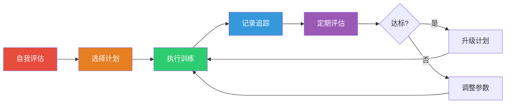
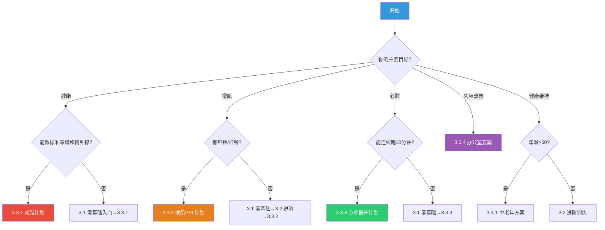
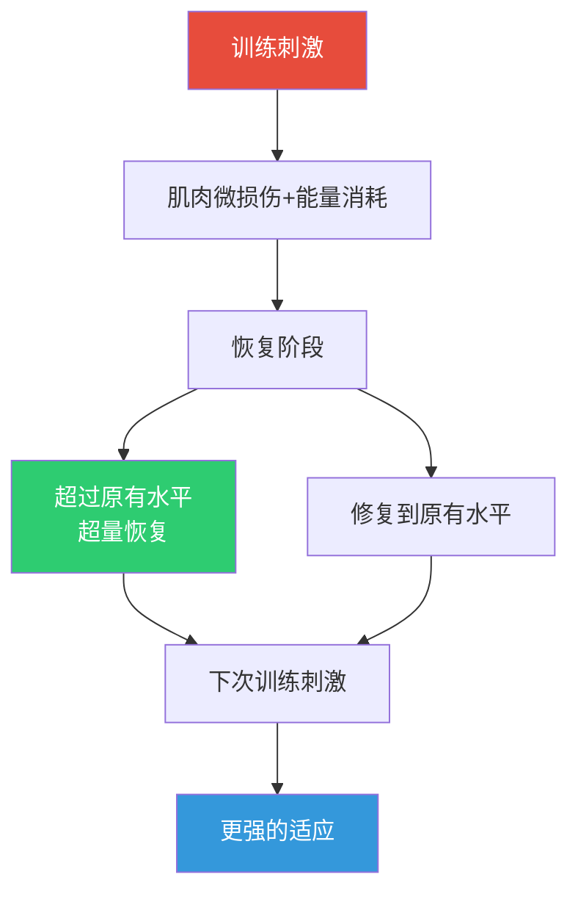

## 三、运动计划

理论知识是地基，运动计划是建筑蓝图。前面的运动科学章节讲清了"为什么练"和"练什么"，本章要解决最核心的问题——"怎么练"。一份好的运动计划必须同时满足三个条件：**科学性**（符合运动生理学原理）、**可执行性**（匹配你的真实生活节奏）、**可持续性**（能坚持三个月以上而不是三天热度）。

本章按照"评估→选择→执行→进阶→恢复→维持"的完整闭环展开，从零基础到高阶训练者都能找到适合自己的方案。

### 3.0 制定计划前的自我评估

在盲目跟练之前，先花15分钟做一次自我评估。这决定了你从哪个阶段开始、用多大强度、选择什么类型的运动。跳过评估直接开练，是最常见的新手错误之一——要么强度太大受伤，要么强度太小无效，两种情况都会让你在一个月内放弃。

#### 3.0.1 体能基线测试

以下五项测试覆盖心肺、力量、柔韧性三大维度，在家就能完成。测试前做5分钟热身（原地踏步+关节环绕），避免冷启动受伤。记录每项结果，这是你未来的对比基准。

**心肺耐力——3分钟台阶测试**

这是国际通用的心血管适能测试（加拿大台阶测试改良版），被ACSM（美国运动医学会）推荐用于健康评估：

- 找一个约30cm高的稳固台阶（普通楼梯即可）
- 以每分钟24次的频率上下（用节拍器或口令控制："上-上-下-下"为一次，每5秒完成2次）
- 3分钟后立即坐下，测量1分钟内的心跳次数（食指和中指按压手腕内侧桡动脉或颈部颈动脉）

| 心跳次数（次/分钟） | 20-29岁 | 30-39岁 | 40-49岁 | 50-59岁 | 60+岁 |
|---|---|---|---|---|---|
| 优秀 | <79 | <81 | <84 | <87 | <88 |
| 良好 | 79-89 | 81-90 | 84-93 | 87-96 | 88-96 |
| 一般 | 90-99 | 91-100 | 94-103 | 97-103 | 97-103 |
| 较差 | 100-107 | 101-109 | 104-112 | 104-113 | 104-113 |
| 差 | >107 | >109 | >112 | >113 | >113 |

> 心跳越低说明心脏工作效率越高。同样完成3分钟运动，心跳80次的人比心跳110次的人心血管适能好一个等级。

**上肢力量——俯卧撑最大次数测试**

- 标准俯卧撑（男性）或跪姿俯卧撑（女性/初学者）
- 连续完成的最大次数，中间停顿不超过2秒
- 身体必须全程保持一条直线，胸部触地为一次完整动作

| 等级 | 男性（标准） | 女性（跪姿） |
|---|---|---|
| 优秀 | >40 | >35 |
| 良好 | 30-39 | 25-34 |
| 一般 | 15-29 | 10-24 |
| 较差 | 10-14 | 5-9 |
| 差 | <10 | <5 |

**下肢力量——靠墙静蹲最大时间**

- 背靠墙，大腿与地面平行（膝关节90度），双手自然下垂不撑大腿
- 计时直到无法维持姿势
- 60秒以上为良好，30-60秒为一般，30秒以下需要加强

**核心稳定性——平板支撑最大时间**

- 标准平板支撑姿势：前臂撑地，身体从头到脚成一条直线
- 塌腰或撅臀即停止计时
- 120秒以上为优秀，60-120秒为良好，30-60秒为一般，30秒以下需要重点加强

**柔韧性——坐位体前屈**

- 坐在地上，双腿伸直，勾脚尖，双手尽量前伸
- 测量指尖与脚趾的距离：超过脚尖为良好，触到脚尖为一般，触不到需要加强
- 注意：测试前做3分钟下肢拉伸热身，避免冷肌肉拉伤

#### 3.0.2 生活条件评估

体能只是起点，能否坚持取决于生活条件的匹配度。以下是六个必须评估的维度：

| 评估项 | 问题 | 影响 |
|---|---|---|
| 可用时间 | 每天能固定拿出多少分钟？ | 决定训练时长和频率 |
| 场地条件 | 家里/健身房/户外？ | 决定训练方式和器材 |
| 装备情况 | 有哪些运动器材？ | 决定可选动作范围 |
| 运动偏好 | 什么运动让你觉得有趣？ | 影响长期坚持概率 |
| 伤病史 | 有哪些部位需要保护？ | 决定禁忌动作和替代方案 |
| 作息节奏 | 早上/中午/晚上哪个时段空闲？ | 决定训练时间安排 |

**评估结果整合**：将体能测试结果和生活条件评估放在一起，用下面的决策树确定起点。

#### 3.0.3 计划选择决策树

#### 3.0.4 心率区间速查

运动强度的核心标尺是心率。你需要先算出自己的心率区间，训练时对照调整：

**最大心率估算**：`最大心率 = 220 - 年龄`（基础公式）或 `207 - 0.7 × 年龄`（修正公式，更准确）

| 心率区间 | 最大心率% | 体感描述 | 训练目的 |
|---|---|---|---|
| Z1 恢复区 | 50-60% | 非常轻松，可以唱歌 | 热身、恢复日、主动恢复 |
| Z2 燃脂区 | 60-70% | 轻松，可以流畅对话 | 长距离有氧、脂肪燃烧 |
| Z3 有氧区 | 70-80% | 中等，说话开始断句 | 提升心肺耐力 |
| Z4 乳酸阈值 | 80-90% | 困难，只能说短句 | 提高乳酸耐受力 |
| Z5 无氧区 | 90-100% | 极限，无法说话 | 爆发力、竞技冲刺 |

**举例**：30岁男性，最大心率 = 220 - 30 = 190次/分钟
- Z2燃脂区：190 × 60%-70% = 114-133次/分钟
- Z3有氧区：190 × 70%-80% = 133-152次/分钟

**没有心率手表的替代方案**：
- **谈话测试**：能正常说话但不能唱歌就是Z2-Z3区间
- **RPE量表**（自感疲劳度）：1-10分打分，Z1≈3-4分，Z2≈4-5分，Z3≈5-6分，Z4≈7-8分，Z5≈9-10分
- **投资建议**：一块能测心率的运动手表（小米手环8/华为Band 8，约150-300元）能让训练精度提升一个量级，是性价比最高的运动投资之一

#### 3.0.5 周期化训练基础

在进入具体计划之前，需要理解一个核心概念：**周期化（Periodization）**。人体对任何固定刺激都会适应——同样的训练做4周以上，效果会递减。周期化就是系统性地变化训练参数，让身体持续适应。

**三层周期结构**：

| 周期层次 | 时间跨度 | 变化内容 | 示例 |
|---|---|---|---|
| 大周期（Macrocycle） | 3-12个月 | 整体目标阶段 | 12周减脂→8周增肌→4周维持 |
| 中周期（Mesocycle） | 3-6周 | 训练量和强度的波动 | 第1-3周递增→第4周减载→第5-7周递增 |
| 小周期（Microcycle） | 1周 | 每日训练安排 | 周一推/周二拉/周三腿... |

**减载周（Deload）的科学**：每4-6周安排一个减载周，训练量减少40-50%（重量不变，组数减半）。这不是偷懒，而是让中枢神经系统和结缔组织完成修复，防止过度训练。研究表明，减载后第一个训练周的表现通常会显著超过减载前的峰值。

### 3.1 零基础入门计划（第1-4周）

**定位**：从未运动过或中断运动超过半年的人。这个阶段的目标不是"练出效果"，而是"建立习惯"。研究显示，一个新习惯的养成平均需要66天（伦敦大学学院Phillippa Lally研究），前四周是最容易放弃的阶段。

**核心策略**：
- 强度低到你觉得"这也算运动？"——恰恰说明做对了
- 每次训练时间不超过30分钟，降低心理门槛
- 重点关注"完成率"而非"训练效果"
- 允许灵活调整，但不允许完全跳过（哪怕只做5分钟也比不做好）

#### 3.1.1 每周训练安排

| 日期 | 内容 | 时间 | 强度 | 目的 |
|---|---|---|---|---|
| 周一 | 快走 | 20-30分钟 | Z1-Z2 | 心肺适应 |
| 周二 | 自重训练A | 15-20分钟 | 低 | 力量基础 |
| 周三 | 休息或散步 | 15分钟 | 极低 | 主动恢复 |
| 周四 | 快走 | 20-30分钟 | Z1-Z2 | 心肺适应 |
| 周五 | 自重训练B | 15-20分钟 | 低 | 力量基础 |
| 周六 | 户外活动（骑车/游泳/散步） | 20-40分钟 | Z1-Z2 | 增加趣味性 |
| 周日 | 完全休息 | - | - | 身体修复 |

**四周进阶逻辑**：
- 第1周：按最低时间完成（快走20分钟，训练15分钟）
- 第2周：增加5分钟时长
- 第3周：自重训练增加到每个动作3组（从2组起步）
- 第4周：快走提速，加入1-2分钟慢跑间歇

**第4周末评估**：重新做3.0.1的五项测试。如果体能提升一个等级，进入3.2；如果没有，重复第3-4周的安排再做一次。

#### 3.1.2 自重训练A（上肢+核心）

每个动作2组，每组8-12次，组间休息60-90秒。

| 序号 | 动作 | 要领 | 常见错误 | 退阶方案 |
|---|---|---|---|---|
| 1 | 跪姿俯卧撑 | 双手略宽于肩，身体成一条直线 | 塌腰、耸肩、头部前伸 | 面墙俯卧撑（站立面对墙推） |
| 2 | 平板支撑 | 前臂撑地，身体成一条直线 | 塌腰、撅臀、憋气 | 膝盖着地平板支撑 |
| 3 | 超人式 | 俯卧，同时抬手抬脚 | 颈部过度后仰 | 只抬手或只抬脚交替 |
| 4 | 站姿YTW | 站立，双臂做出Y/T/W字母形状 | 耸肩、速度太快 | 坐姿进行 |

#### 3.1.3 自重训练B（下肢+核心）

每个动作2组，每组10-15次，组间休息60-90秒。

| 序号 | 动作 | 要领 | 常见错误 | 退阶方案 |
|---|---|---|---|---|
| 1 | 深蹲 | 双脚与肩同宽，膝盖沿脚尖方向 | 膝盖内扣、脚跟离地、弯腰 | 扶椅深蹲（手扶稳固椅子） |
| 2 | 弓步蹲 | 前后脚，后膝接近地面 | 前膝超过脚尖过多、身体前倾 | 扶墙弓步蹲 |
| 3 | 臀桥 | 仰卧屈膝，抬臀至身体成直线 | 腰部过度反弓、用腰代偿 | 单腿臀桥（难度更高时用） |
| 4 | 踮脚提踵 | 慢起慢落，顶峰停顿1秒 | 速度太快、重心不稳 | 扶墙进行 |

**新手动作详解——深蹲**

深蹲是所有训练的基石，被称为"动作之王"。它同时训练股四头肌、臀大肌、腘绳肌、核心肌群，一个动作覆盖全身60%以上的肌肉。初学者必须先掌握正确姿势再增加难度。

准备姿势：
- 双脚与肩同宽或略宽
- 脚尖自然外展15-30度
- 挺胸收腹，目视前方

下蹲过程：
1. 髋关节先启动（想象屁股往后坐椅子）
2. 膝盖沿脚尖方向弯曲，不要内扣
3. 下蹲到大腿与地面平行（至少90度）
4. 全程脚跟踩实，不要抬起来

起身过程：
1. 脚跟发力蹬地
2. 臀部和大腿前侧同时发力
3. 髋关节和膝关节同时伸展
4. 站直时不要锁死膝关节

呼吸节奏：
- 下蹲时吸气
- 起身时呼气
- 不要憋气（憋气会升高血压，对新手有风险）

**自我检查方法**：面对墙壁站立，脚尖离墙10cm，双手抱头做深蹲。如果膝盖碰到墙，说明膝盖前移过多；如果能完成且膝盖不碰墙，姿势基本正确。

**居家替代方案**：如果没有瑜伽垫，用折叠的毯子或厚毛巾代替。自重训练不需要任何器械。

#### 3.1.4 热身与放松（每次训练必做）

热身不是"浪费时间"，而是训练效果的放大器。研究显示，充分热身可以提升运动表现10-20%，降低受伤风险50%以上。

**训练前热身（5分钟）**：

热身遵循"从大关节到小关节、从低强度到高强度"的原则：

1. 原地踏步30秒 → 慢速高抬腿30秒（提升心率和体温）
2. 臀部画圈（每侧10次，激活髋关节）
3. 手臂大绕环（前后各10次，激活肩关节）
4. 动态弓步拉伸（每侧8次，拉伸髋屈肌和股四头肌）
5. 深蹲到站立（10次，幅度从小到大，激活全身运动链）

**训练后放松（5分钟）**：

放松的关键是静态拉伸——每个位置保持30秒以上，让肌肉筋膜恢复到正常长度。不要弹震式拉伸（快速弹动），那会触发肌肉的保护性收缩，反而增加紧张。

1. 大腿前侧拉伸（每侧30秒）
2. 大腿后侧拉伸（每侧30秒）
3. 小腿拉伸（每侧30秒）
4. 胸部拉伸（扶门框，每侧30秒）
5. 背部拉伸（猫牛式，8次）
6. 深呼吸3次收尾

### 3.2 进阶训练计划（第5-12周）

**进入条件**：能够连续快走30分钟不喘、完成2组标准深蹲和跪姿俯卧撑、每周运动不少于3次。

**核心变化**：
- 引入力量训练的分化概念（上肢/下肢分开练）
- 有氧运动开始加入中高强度
- 增加训练多样性，避免身体适应后停滞
- 每周训练时间从2-3小时提升到4-5小时

#### 3.2.1 每周训练安排

| 日期 | 内容 | 时间 | 强度 | 训练重点 |
|---|---|---|---|---|
| 周一 | 力量训练——上肢推 | 40-50分钟 | Z3-Z4 | 胸、肩、三头 |
| 周二 | 有氧运动 | 30-40分钟 | Z2-Z3 | 跑步、骑车或游泳 |
| 周三 | 瑜伽/拉伸 | 20-30分钟 | Z1 | 柔韧性与恢复 |
| 周四 | 力量训练——下肢 | 40-50分钟 | Z3-Z4 | 股四头、腘绳、臀、小腿 |
| 周五 | HIIT训练 | 20-25分钟 | Z4-Z5 | 心肺冲刺 |
| 周六 | 户外活动 | 40-60分钟 | Z2 | 爬山、骑行、远足 |
| 周日 | 完全休息或散步 | - | - | 修复 |

**八周进阶逻辑**：
- 第5-6周：熟悉动作模式，使用自重或轻重量，重点学习技术
- 第7-8周：逐步增加负荷，每组次数减到10-12次，重量增加10-20%
- 第9-10周：引入复合动作的杠铃变式（如果有器械）
- 第11-12周：增加训练量（加一组或增加一个动作），达到峰值后安排一个减载周

#### 3.2.2 上肢推训练（周一）

热身5分钟 → 正式训练 → 放松5分钟。

每个动作3组，每组10-12次，组间休息90秒。

| 序号 | 动作 | 目标肌群 | 器材 | 要点 |
|---|---|---|---|---|
| 1 | 俯卧撑（标准/抬脚） | 胸大肌、三头 | 自重 | 下放2秒，推起1秒，顶峰挤压 |
| 2 | 哑铃卧推/地板卧推 | 胸大肌 | 哑铃 | 手臂与躯干夹角45-75度 |
| 3 | 哑铃肩推 | 三角肌前束、中束 | 哑铃 | 核心收紧，不要过度弓腰 |
| 4 | 侧平举 | 三角肌中束 | 哑铃 | 小指略高于拇指，肘微屈 |
| 5 | 三头臂屈伸 | 肱三头肌 | 哑铃 | 大臂固定不动 |
| 6 | 平板支撑变式 | 核心 | 自重 | 单手/单脚交替抬起 |

**无器械替代**：用弹力带替代哑铃，水瓶替代轻重量。一对可调节哑铃（2-20kg）是性价比最高的家庭器材，预算约200-500元。

#### 3.2.3 下肢训练（周四）

热身5分钟 → 正式训练 → 放松5分钟。

每个动作3组，每组10-12次，组间休息90-120秒（下肢复合动作恢复时间更长）。

| 序号 | 动作 | 目标肌群 | 要点 |
|---|---|---|---|
| 1 | 高脚杯深蹲 | 股四头、臀大肌 | 双手持哑铃于胸前，肘部夹紧 |
| 2 | 罗马尼亚硬拉 | 腘绳肌、竖脊肌 | 微屈膝，髋关节后推，感受大腿后侧拉伸 |
| 3 | 保加利亚分腿蹲 | 股四头、臀 | 后脚搭在椅子上，重心在前脚 |
| 4 | 臀桥（负重） | 臀大肌 | 顶峰收缩2秒，下巴微收 |
| 5 | 小腿提踵 | 腓肠肌、比目鱼肌 | 站在台阶边缘做全程，慢起慢落 |
| 6 | 哥本哈根侧桥 | 内收肌、核心 | 侧卧，上方腿搭在椅子上 |

**深蹲系列动作难度递进**：
扶椅深蹲 → 自重深蹲 → 高脚杯深蹲 → 杠铃深蹲前蹲 → 杠铃深蹲后蹲
   ↑入门          ↑初级          ↑中级              ↑进阶             ↑高级

#### 3.2.4 HIIT训练模板（周五）

HIIT（高强度间歇训练）是效率最高的训练方式之一——25分钟的HIIT消耗的热量相当于45分钟匀速跑，且训练后会持续燃烧热量（EPOC效应，运动后过量氧耗，可持续24-48小时额外消耗60-150千卡）。

**标准模板（25分钟）**：

| 阶段 | 时间 | 内容 | 强度 |
|---|---|---|---|
| 热身 | 5分钟 | 原地慢跑+动态拉伸 | Z1-Z2 |
| 正式训练 | 15分钟 | 见下方间歇方案 | Z4-Z5 |
| 放松 | 5分钟 | 慢走+静态拉伸 | Z1 |

**间歇方案A——Tabata风格（适合有基础者）**：
- 20秒全力运动 + 10秒完全休息，共8轮为一组
- 做2组，组间休息1分钟
- 动作选择：波比跳、登山者、高抬腿跑、开合跳

**间歇方案B——中等强度（适合进阶初期）**：
- 30秒高强度运动 + 30秒低强度恢复，共10轮
- 动作交替：开合跳 → 高抬腿 → 深蹲跳 → 登山者 → 波比跳（循环）

**间歇方案C——新手友好**：
- 20秒快走/慢跑 + 40秒正常速度，共10轮
- 或：30秒快速动作 + 60秒休息
- 核心原则：高强度段的心率达到Z4以上

**HIIT注意事项**：
- 每周不超过2-3次，至少间隔48小时
- 不要在力量训练后立刻做HIIT
- 如果出现头晕、恶心，立即停止
- 初学者从方案C开始，2-3周后过渡到方案B

#### 3.2.5 第5-12周的每周计划示例

为方便执行，以下是具体一周的执行示例（以第8周为例）：

周一（上肢推日）：
  18:00 热身5分钟
  18:05 俯卧撑 3×12
  18:12 哑铃卧推 3×10（10kg/只）
  18:22 哑铃肩推 3×10（8kg/只）
  18:32 侧平举 3×12（4kg/只）
  18:40 三头臂屈伸 3×12（6kg/只）
  18:48 平板支撑 3×45秒
  18:55 放松拉伸5分钟
  19:00 结束

周二（有氧日）：
  18:00 慢跑30分钟（配速6:30-7:00/km，心率保持在135-150）
  18:30 拉伸5分钟

周三（恢复日）：
  午休时做15分钟拉伸，或晚上跟一个20分钟的瑜伽视频

周四（下肢日）：
  18:00 热身5分钟
  18:05 高脚杯深蹲 3×10（12kg）
  18:15 罗马尼亚硬拉 3×10（12kg/只）
  18:25 保加利亚分腿蹲 3×10（每侧）
  18:38 负重臀桥 3×12（15kg）
  18:48 提踵 3×15
  18:55 放松拉伸5分钟
  19:00 结束

周五（HIIT日）：
  18:00 热身5分钟
  18:05 间歇方案B 15分钟
  18:20 放松5分钟
  18:25 结束

周六（户外日）：
  09:00 爬山/骑行60分钟（Z2，享受为主）

周日：完全休息

### 3.3 不同目标的专项计划

#### 3.3.1 减脂运动计划

**核心原理**：减脂的本质是热量缺口（消耗 > 摄入）。运动的作用是扩大消耗端，同时保护肌肉不被分解。单纯靠饿瘦的代价是肌肉流失、基础代谢下降、反弹——这是"节食→反弹→再节食"恶性循环的根源。

**热量缺口的黄金区间**：每天缺口300-500千卡，对应每周减0.3-0.5公斤纯脂肪。缺口超过1000千卡/天，减掉的重量中肌肉占比会大幅上升，得不偿失。

**减脂训练的关键比例**：
- 力量训练 : 有氧运动 = 40% : 60%（时间占比）
- 力量训练维持肌肉量和基础代谢
- 有氧运动创造额外热量缺口
- HIIT的EPOC效应让训练后持续燃脂

**每周安排**：

| 日期 | 内容 | 时间 | 强度 | 目的 |
|---|---|---|---|---|
| 周一 | HIIT训练 | 25-30分钟 | Z4-Z5 | EPOC燃脂 |
| 周二 | 力量训练（全身） | 40-50分钟 | Z3-Z4 | 维持肌肉 |
| 周三 | 中等强度有氧 | 40-50分钟 | Z2-Z3 | 稳态燃脂 |
| 周四 | 力量训练（全身） | 40-50分钟 | Z3-Z4 | 维持肌肉 |
| 周五 | HIIT训练 | 25-30分钟 | Z4-Z5 | EPOC燃脂 |
| 周六 | 长时间低强度有氧 | 60-90分钟 | Z2 | 脂肪氧化（LSD） |
| 周日 | 休息或瑜伽 | 30分钟 | Z1 | 恢复 |

**全身力量训练模板（减脂版）**：

选择复合动作为主，每个动作3组×12-15次（偏耐力参数），组间休息60秒（短休息维持心率，提升训练密度）。

| 序号 | 动作 | 肌群 | 备注 |
|---|---|---|---|
| 1 | 深蹲 | 全身 | 第一个做，体力最充沛 |
| 2 | 俯卧撑/卧推 | 胸、肩、三头 | |
| 3 | 硬拉/臀桥 | 背链 | |
| 4 | 划船 | 背、二头 | |
| 5 | 弓步蹲 | 下肢 | 单侧训练，核心参与更多 |
| 6 | 平板支撑 | 核心 | 作为收尾 |

**减脂运动的常见误区**：

| 误区 | 真相 | 正确做法 |
|---|---|---|
| 只做有氧不做力量 | 肌肉流失→基础代谢下降→更难减脂 | 力量训练不低于总训练量40% |
| 空腹有氧更燃脂 | 确实更多脂肪被氧化，但总热量消耗无显著差异，且可能分解肌肉 | 不空腹高强度训练，中低强度空腹可以但非必须 |
| 出汗多=减脂多 | 汗水是水分，不是脂肪。脂肪代谢84%通过呼吸排出 | 关注心率和运动时长，而非出汗量 |
| 局部减脂 | 不存在。做1000个仰卧起坐不能减肚子 | 全身性运动+合理饮食 |
| 运动后可以随便吃 | 30分钟跑步消耗约300大卡，一杯奶茶就回去了 | 运动后正常吃，不要补偿性暴食 |
| 裹保鲜膜运动 | 只是脱水，不减脂肪，还可能导致中暑 | 正常穿着运动即可 |

#### 3.3.2 增肌运动计划

**核心原理**：肌肉生长的三个必要条件——**机械张力**（足够的负荷）、**代谢压力**（肌肉充血感）、**肌肉微损伤**（训练后延迟性酸痛）。三者缺一不可，但机械张力是最核心的驱动因素。

**增肌的生理机制**：力量训练造成肌纤维微损伤→免疫细胞清除受损组织→卫星细胞激活并融合到肌纤维→肌纤维增粗（肌原纤维增加）→肌肉体积增大。这个过程需要48-72小时完成一次修复周期，所以同一肌群至少间隔48小时再训练。

**推拉腿（PPL）分化方案**：

这是最受欢迎的增肌分化方案之一，每个肌群每周训练2次，兼顾训练量和恢复。研究（Schoenfeld 2016 meta-analysis）显示，每个肌群每周训练2次比1次增肌效果高约40%。

| 日期 | 内容 | 时间 | 强度 |
|---|---|---|---|
| 周一 | 推（胸、肩、三头） | 50-60分钟 | Z3-Z4 |
| 周二 | 拉（背、二头、后肩） | 50-60分钟 | Z3-Z4 |
| 周三 | 腿（股四、腘绳、臀、小腿） | 50-60分钟 | Z3-Z4 |
| 周四 | 推 | 50-60分钟 | Z3-Z4 |
| 周五 | 拉 | 50-60分钟 | Z3-Z4 |
| 周六 | 腿 | 50-60分钟 | Z3-Z4 |
| 周日 | 休息 | - | - |

**推日训练（周一/周四）**：

每个动作4组，次数区间6-12次（最后一组做到力竭前1-2次），组间休息90-120秒。

| 序号 | 动作 | 目标 | 次数 |
|---|---|---|---|
| 1 | 平板杠铃卧推/哑铃卧推 | 胸大肌整体 | 4×8-10 |
| 2 | 上斜哑铃卧推 | 胸大肌上部 | 4×10-12 |
| 3 | 哑铃肩推 | 三角肌前束+中束 | 4×8-10 |
| 4 | 绳索夹胸/俯卧撑 | 胸大肌内侧 | 3×12-15 |
| 5 | 侧平举 | 三角肌中束 | 4×12-15 |
| 6 | 绳索下压/窄距俯卧撑 | 肱三头肌 | 3×10-12 |

**拉日训练（周二/周五）**：

| 序号 | 动作 | 目标 | 次数 |
|---|---|---|---|
| 1 | 引体向上/高位下拉 | 背阔肌 | 4×6-10 |
| 2 | 杠铃/哑铃划船 | 背部厚度 | 4×8-10 |
| 3 | 坐姿绳索划船 | 中背 | 4×10-12 |
| 4 | 面拉 | 后三角肌、肩袖 | 3×15-20 |
| 5 | 哑铃弯举 | 肱二头肌 | 3×10-12 |
| 6 | 锤式弯举 | 肱桡肌、二头长头 | 3×10-12 |

**腿日训练（周三/周六）**：

| 序号 | 动作 | 目标 | 次数 |
|---|---|---|---|
| 1 | 杠铃深蹲/高脚杯深蹲 | 股四头、臀 | 4×6-10 |
| 2 | 罗马尼亚硬拉 | 腘绳肌、臀 | 4×8-10 |
| 3 | 腿举/保加利亚蹲 | 股四头 | 4×10-12 |
| 4 | 腿弯举 | 腘绳肌 | 3×10-12 |
| 5 | 小腿提踵 | 小腿 | 4×12-15 |
| 6 | 悬垂举腿/卷腹 | 核心 | 3×12-15 |

**渐进超负荷的实操方法**：

增肌的核心不是"练到爽"，而是"比上次多一点"。以下是一个可操作的渐进超负荷系统：

方法一：双重递进法（推荐初学者）
  第1周：某动作 8kg × 10次 × 3组
  第2周：8kg × 12次 × 3组（次数进步）
  第3周：10kg × 10次 × 3组（重量进步，次数回落）
  第4周：10kg × 12次 × 3组（再次次数进步）
  → 如此循环

方法二：RPE自感疲劳度法（适合有经验者）
  RPE 10 = 完全力竭，一个都做不了
  RPE 9 = 还能做1个
  RPE 8 = 还能做2个
  RPE 7 = 还能做3个
  → 每组目标RPE 7-9，当所有组都能轻松完成RPE 7时加重

方法三：休息-暂停法（突破平台期）
  做到力竭 → 休息15秒 → 继续做 → 休息15秒 → 继续做
  → 用同样的重量多做了50%的次数

方法四：离心控制法（高级技巧）
  将动作的"放下"阶段延长到4-5秒
  离心阶段产生更大的机械张力和肌肉微损伤
  → 特别适合突破平台期

**减载周（Deload）**：每4-6周安排一个减载周，将训练量减少40-50%（重量不变，组数减半）。这不是偷懒，是让身体完成超量恢复的必要策略。

**增肌的其他关键因素**：

| 因素 | 要求 | 说明 |
|---|---|---|
| 蛋白质摄入 | 1.6-2.2g/kg体重/天 | 70kg体重每天需要112-154g蛋白质 |
| 热量盈余 | 每天多摄入300-500千卡 | 过多会增加脂肪，过少不够合成肌肉 |
| 睡眠 | 7-9小时 | 生长激素在深睡眠期分泌，直接影响肌肉修复 |
| 训练容量 | 每肌群每周10-20组 | 少于10组效果差，超过20组恢复不了 |
| 动作选择 | 复合动作为主 | 深蹲、硬拉、卧推、划船、肩推占70%以上 |

#### 3.3.3 心肺健康提升计划

**适用人群**：久坐族想改善心血管健康、高血压/高血脂人群的运动干预、备赛长跑的体能基础。

**心率区间训练法**：

| 训练类型 | 心率区间 | 时长 | 频率 | 效果 |
|---|---|---|---|---|
| 长距离慢跑（LSD） | Z2（60-70%） | 40-90分钟 | 1-2次/周 | 增加毛细血管密度，提升脂肪氧化能力 |
| 节奏跑 | Z3（70-80%） | 20-40分钟 | 1次/周 | 提高乳酸阈值 |
| 间歇训练 | Z4-Z5（80-100%） | 20-30分钟 | 1-2次/周 | 提升最大摄氧量（VO2max） |
| 恢复跑 | Z1（50-60%） | 20-30分钟 | 1次/周 | 主动恢复，不增加疲劳 |

**12周心肺提升计划**：

| 周次 | 周一 | 周三 | 周五 | 周六 | 总有氧时间 |
|---|---|---|---|---|---|
| 1-4 | Z2慢跑25分钟 | Z2骑车30分钟 | 休息 | Z2慢跑30分钟 | 85分钟 |
| 5-8 | Z2慢跑30分钟 | Z3间歇跑20分钟 | 力量训练30分钟 | Z2慢跑40分钟 | 90分钟+ |
| 9-12 | Z3节奏跑30分钟 | Z4间歇训练25分钟 | 力量训练30分钟 | Z2长跑50分钟 | 105分钟+ |

**最大摄氧量（VO2max）提升策略**：
- 80%的训练在Z2区间（低强度为主）
- 20%的训练在Z4-Z5区间（高强度刺激）
- 这就是著名的"80/20训练法则"，被精英跑者广泛采用
- 每周总跑量增加不超过10%（防止受伤）

**跑步损伤预防**：

跑步是最常见的有氧运动，也是损伤率最高的运动之一。以下是跑步常见的损伤和预防：

| 损伤 | 症状 | 常见原因 | 预防措施 |
|---|---|---|---|
| 跑者膝（髌股综合征） | 膝盖前方疼痛 | 股四头肌力量不足、跑量增加过快 | 加强股四头肌和臀肌训练，每周跑量增量<10% |
| 胫骨应力综合征（外胫夹） | 小腿前内侧疼痛 | 跑步地面过硬、鞋子缓冲差 | 换跑鞋，增加小腿力量训练 |
| 足底筋膜炎 | 脚后跟疼痛，晨起最明显 | 足弓支撑不足、小腿紧张 | 每天踩网球按摩足底，加强小腿拉伸 |
| ITB综合征 | 膝盖外侧疼痛 | 髂胫束紧张 | 泡沫轴放松大腿外侧，加强臀中肌 |

#### 3.3.4 办公室久坐族运动方案

久坐族面临的不是"缺乏运动"的单一问题，而是"肌肉失衡+关节僵硬+血液循环差"的综合症候群。具体表现为：髋屈肌缩短紧张、臀肌失忆（gluteal amnesia）、胸椎后凸加重、颈椎前伸、下背痛风险增加3倍。需要针对性地打破久坐模式。

**每小时微运动（2-3分钟，不离开工位）**：

设定一个60分钟的闹钟，响了就做以下任选3-4个：

| 序号 | 动作 | 时间/次数 | 解决的问题 |
|---|---|---|---|
| 1 | 颈部缓慢环绕 | 顺逆各5圈 | 颈椎僵硬 |
| 2 | 肩胛骨后缩（夹肩胛骨） | 15次 | 圆肩、驼背 |
| 3 | 胸椎旋转（坐在椅子上转体） | 每侧10次 | 胸椎僵硬 |
| 4 | 站立髋屈肌拉伸（弓步姿势） | 每侧30秒 | 髋屈肌紧张（久坐杀手） |
| 5 | 坐姿腘绳肌拉伸 | 每侧30秒 | 大腿后侧紧张 |
| 6 | 椅子深蹲（站起坐下） | 10次 | 激活下肢血液循环 |
| 7 | 小腿提踵（站立踮脚） | 15次 | 促进下肢静脉回流 |
| 8 | 手腕屈伸和旋转 | 各10次 | 预防腕管综合征 |

**午间15分钟运动方案**：

方案A（室内）：
  5分钟：快走（上下楼梯或绕办公区走）
  5分钟：自重训练（深蹲10次+俯卧撑10次+平板支撑30秒 × 2轮）
  5分钟：拉伸（重点：胸椎、髋屈肌、肩部）

方案B（室外）：
  10分钟：快走或慢跑
  5分钟：拉伸+深呼吸

方案C（会议室/私密空间）：
  10分钟：跟练一个短视频（B站/Keep搜索"办公室健身"）
  5分钟：拉伸

**下班后运动（30-45分钟）**：

不需要去健身房，在家就能完成。按本章3.2节的训练计划执行即可。关键是**固定时间**——研究显示，固定时间运动的人比"找时间运动"的人坚持率高出3倍。

**通勤运动化**：
- 提前一站下车步行
- 骑车通勤（单程30分钟骑车 ≈ 有氧运动30分钟）
- 爬楼梯代替电梯（每层楼约消耗0.17千卡/公斤体重）
- 午餐后步行15分钟

### 3.4 特殊人群运动指南

#### 3.4.1 中老年运动方案（50岁以上）

中老年人运动的核心目标不是"练出肌肉"，而是**维持功能**——能自己上下楼、提重物、从地上站起来、不摔跤。WHO建议65岁以上成年人每周进行150分钟中等强度有氧运动或75分钟高强度有氧运动，加上每周2次以上的肌肉强化活动。

| 训练类型 | 频率 | 内容 | 重点 |
|---|---|---|---|
| 有氧运动 | 5次/周 | 快走、太极、游泳、骑车 | 每次30分钟，Z1-Z2 |
| 力量训练 | 2-3次/周 | 自重或轻阻力 | 每个动作2-3组×12-15次 |
| 平衡训练 | 3次/周 | 单腿站立、太极拳、踮脚走路 | 预防跌倒——老年人第一大伤害源 |
| 柔韧性 | 每天 | 拉伸、瑜伽 | 维持关节活动度 |

**平衡训练具体动作**：
1. 单腿站立：扶墙开始 → 不扶墙 → 闭眼（每侧30秒）
2. 脚跟-脚尖直线走路：像走钢丝一样走10米
3. 太极云手：缓慢移动重心，训练动态平衡
4. 从椅子上单腿站起（不扶手）

**禁忌和注意事项**：
- 避免突然的低头、抬头、旋转动作（防血压骤变）
- 避免过度屏气用力（Valsalva动作升高血压）
- 有骨质疏松者避免跳跃和高冲击运动
- 膝关节退化者避免深蹲超过90度
- 运动中感到胸闷、头晕、气短应立即停止

#### 3.4.2 超重人群运动方案（BMI>28）

超重人群面临的最大挑战是关节压力——每多1公斤体重，跑步时膝关节承受的冲击力增加4公斤。一个BMI=32的人跑步时，膝关节承受的冲击力可能是正常体重者的1.5-2倍。

**运动选择优先级**：
第一选择：游泳、水中运动（浮力减轻关节负担）
第二选择：骑车、椭圆机（无冲击）
第三选择：快走（低冲击）
避免：跑步、跳跃、高强度有氧（在体重降到合理范围之前）

**12周渐进方案**：
- 第1-4周：每天快走20-30分钟（可以分2次×15分钟）
- 第5-8周：快走+自重力量训练交替，每次30-40分钟
- 第9-12周：加入游泳/骑车，力量训练使用弹力带或轻哑铃

**体重管理的运动-饮食配合**：
- 运动消耗约占总热量消耗的15-30%（不能只靠运动）
- 饮食控制创造500千卡/天的缺口 → 每周减0.5公斤
- 额外运动消耗300千卡/天 → 加速到每周减0.7-0.8公斤
- 速度不要超过每周1公斤，否则流失肌肉

#### 3.4.3 腰背痛人群运动方案

80%的成年人一生中至少经历一次腰痛。多数腰痛（非特异性腰痛）的最佳治疗不是卧床休息，而是**针对性运动**。久卧不动会导致核心肌群进一步萎缩，加重问题。

**核心稳定训练（McGill三大动作）**：

加拿大脊柱生物力学专家Stuart McGill提出的"Big Three"，被全球物理治疗师广泛采用。这三个动作能在不增加腰椎负荷的前提下最大化核心稳定性。

| 序号 | 动作 | 方法 | 次数 |
|---|---|---|---|
| 1 | 卷腹（Curl-up） | 仰卧，双手垫在腰下，微抬头肩离地 | 3组×8-12次 |
| 2 | 侧桥（Side Bridge） | 侧卧肘撑，身体成一条直线 | 3组×每侧8-12次（每次保持8-10秒） |
| 3 | 鸟狗式（Bird-Dog） | 四足跪姿，对侧手脚同时伸展 | 3组×每侧8-12次 |

**腰背痛的运动禁忌**：
- 急性期（疼痛剧烈时）：暂停训练，就医排查
- 避免：仰卧起坐（腰椎压力过大）、直腿硬拉（未掌握技术前）、触地体前屈
- 推荐：游泳（尤其仰泳）、步行、核心稳定训练

#### 3.4.4 孕产期运动方案

孕期运动不是禁忌，美国妇产科医师学会（ACOG）明确推荐无并发症的孕妇每周进行150分钟中等强度运动。

**安全运动清单**：
- 散步、游泳、固定自行车（低冲击有氧）
- 孕妇瑜伽（避免仰卧位动作，孕16周后）
- 轻阻力训练（避免最大力量测试）
- 凯格尔运动（盆底肌训练，每天3组×10次）

**绝对禁忌**：
- 仰卧位运动（孕16周后，避免压迫下腔静脉）
- 高温环境运动（热瑜伽、桑拿后运动）
- 有跌倒风险的运动（骑马、滑雪、接触性运动）
- 超过Z4强度的训练

### 3.5 运动恢复体系

恢复不是训练的附属品，而是训练效果的一部分。没有充分恢复的训练，等于在拆东墙补西墙。

#### 3.5.1 恢复的生理机制

**超量恢复**（Supercompensation）是所有训练进步的生理基础——身体在恢复后会变得比训练前更强。但如果恢复不足就进行下一次训练，就会陷入"过度训练"的恶性循环。

**不同训练类型的恢复时间**：

| 训练类型 | 完全恢复时间 | 影响因素 |
|---|---|---|
| 高强度力量训练（大重量深蹲/硬拉） | 72-96小时 | 中枢神经系统疲劳+肌肉微损伤 |
| 中等强度力量训练 | 48-72小时 | 肌肉微损伤为主 |
| HIIT训练 | 48-72小时 | 心血管系统+神经系统 |
| 中等强度有氧（Z2-Z3） | 24-48小时 | 肌糖原恢复 |
| 低强度有氧（Z1-Z2） | 12-24小时 | 几乎无疲劳积累 |

#### 3.5.2 睡眠——最重要的恢复手段

睡眠是唯一不可替代的恢复方式。生长激素的70%在深睡眠期间分泌，这是肌肉修复和生长的关键激素。连续一周每晚只睡5小时，睾酮水平下降10-15%（芝加哥大学研究），直接影响肌肉恢复和训练动力。

**睡眠优化清单**：
- 时长：7-9小时（训练日偏向9小时）
- 入睡时间：23:00前（生长激素分泌高峰在23:00-2:00）
- 睡前2小时不运动（体温升高影响入睡）
- 睡前1小时不看屏幕（蓝光抑制褪黑素分泌）
- 卧室温度18-22°C
- 午睡15-20分钟可以补充，超过30分钟会影响夜间睡眠

**训练日vs休息日的睡眠差异**：
- 训练日：优先保证8小时以上，深睡眠比例更重要
- 休息日：可以比平时多睡30-60分钟，但不要补觉超过2小时（打乱生物钟）

#### 3.5.3 营养恢复——训练后的30分钟窗口

训练后30-60分钟是营养补充的"黄金窗口期"，此时肌肉对蛋白质和碳水化合物的吸收效率最高。肌糖原在训练后2小时内恢复速度最快，错过这个窗口恢复速度下降约50%。

**训练后营养方案**：

| 目标 | 蛋白质 | 碳水化合物 | 示例 |
|---|---|---|---|
| 减脂 | 20-30g | 20-30g | 一杯蛋白粉+一根香蕉 |
| 增肌 | 30-40g | 40-60g | 蛋白粉+牛奶+燕麦+香蕉 |
| 维持健康 | 15-25g | 适量 | 鸡蛋2个+全麦面包1片 |

**水分补充**：
- 训练前2小时：400-600ml水
- 训练中：每15-20分钟补充150-200ml
- 训练后：体重每减少0.5kg补充500ml水
- 长时间有氧（>60分钟）或大量出汗：加入电解质（运动饮料或盐+柠檬水）

**运动补剂的科学评估**：

| 补剂 | 有效性 | 适用人群 | 用法 |
|---|---|---|---|
| 乳清蛋白 | ★★★★★ | 蛋白质摄入不足者 | 训练后30g，或日常补充 |
| 肌酸（一水肌酸） | ★★★★★ | 增肌/力量训练者 | 每天3-5g，无需冲击期 |
| 咖啡因 | ★★★★ | 需要提升运动表现者 | 训练前30-60分钟，3-6mg/kg体重 |
| BCAA | ★★ | 已摄入足够蛋白质者可跳过 | 如果蛋白质充足，BCAA几乎无额外益处 |
| 谷氨酰胺 | ★★ | 普通训练者不需要 | 高强度训练者可考虑5-10g/天 |
| 鱼油（Omega-3） | ★★★★ | 所有人 | 每天1-2g EPA+DHA，减轻训练后炎症 |

#### 3.5.4 主动恢复技术

主动恢复是指通过低强度活动来加速身体修复，比完全静卧效果更好。其原理是低强度运动促进血液循环，加速代谢废物清除，同时不产生新的疲劳。

| 恢复方式 | 方法 | 时长 | 适用场景 |
|---|---|---|---|
| 轻度有氧 | 散步、轻松骑车 | 15-20分钟 | 训练后第二天 |
| 动态拉伸 | 全身关节活动+轻度拉伸 | 10-15分钟 | 每天可用 |
| 泡沫轴放松 | 在紧张肌群上缓慢滚动 | 5-10分钟/肌群 | 训练后或单独做 |
| 筋膜球放松 | 用网球/筋膜球按压深层痛点 | 3-5分钟/痛点 | 足底、肩胛骨周围 |
| 冷热交替浴 | 热水30秒→冷水30秒，循环3-5次 | 5-8分钟 | 大强度训练后 |
| 冥想呼吸 | 4-7-8呼吸法（吸4秒-屏7秒-呼8秒） | 5-10分钟 | 训练后或睡前 |

**泡沫轴使用指南**：
- 速度：每秒滚动约1cm，越慢越好
- 力度：酸痛但可忍受的程度（6-7分/10分）
- 时间：每个肌肉群60-90秒
- 重点部位：IT带（大腿外侧）、股四头肌、胸椎、小腿
- 注意：不要滚压关节、骨头突出处、下背部（腰椎区域）

**常见酸痛部位的自我处理方案**：

| 部位 | 可能原因 | 泡沫轴处理 | 拉伸动作 |
|---|---|---|---|
| 大腿前侧酸 | 深蹲、弓步蹲后 | 俯卧滚压股四头 | 站立拉伸股四头（抓脚踝） |
| 大腿后侧酸 | 硬拉、臀桥后 | 坐姿滚压腘绳 | 坐位体前屈 |
| 肩颈僵硬 | 推举、俯卧撑后 | 仰卧滚压上背 | 交叉拉伸肩部 |
| 小腿紧绷 | 跑步、提踵后 | 坐姿滚压小腿 | 靠墙拉伸小腿 |
| 足底筋膜痛 | 跑步、长时间站立 | 踩网球来回滚动 | 脚趾抓毛巾练习 |

#### 3.5.5 过度训练的识别与处理

过度训练不是"练多了歇一天就好"的状态，而是训练负荷持续超过恢复能力导致的系统性失调。研究表明，约60%的业余训练者在某个时间点会经历过度训练的早期症状。

**过度训练的预警信号（从轻到重）**：

| 阶段 | 症状 | 处理 |
|---|---|---|
| 早期预警 | 训练积极性下降、睡眠质量变差 | 减少训练量20%，增加1天休息 |
| 中期警告 | 静息心率升高5-10次、运动表现下降、频繁感冒 | 减载一周，训练量减半 |
| 严重过度训练 | 持续疲劳、情绪低落、失眠、食欲下降、关节疼痛 | 停训1-2周，就医检查 |

**监测方法**：
- **晨脉监测**：每天早上醒来测静息心率，连续3天高于正常值5次以上要警惕
- **心情日志**：用1-10分记录每天的精力和训练意愿，连续低于5分需要减量
- **HRV（心率变异性）**：如果有运动手表，HRV持续低于个人基线是过度训练的信号

### 3.6 运动习惯的长期维持

制定了完美的计划却坚持不下来——这是90%的人面临的真正问题。习惯的养成不是靠意志力，而是靠系统设计。

#### 3.6.1 习惯堆叠策略

将运动"绑定"在已有的日常习惯上，降低启动成本。这个概念来自James Clear的《原子习惯》——通过"习惯堆叠"（Habit Stacking）利用已有的神经通路来触发新行为。

习惯堆叠公式：
  在[已有习惯]之后，我会[运动行为]

示例：
  在"起床刷牙"之后，我会"做10个深蹲"
  在"下班到家"之后，我会"换上运动服开始训练"
  在"午饭后"之后，我会"步行15分钟"
  在"看手机刷视频"之前，我会"先做5分钟拉伸"

#### 3.6.2 两分钟规则

如果某天实在不想运动，告诉自己"只做2分钟"。穿上运动鞋，做几个深蹲。研究表明，**开始行动**是最难的部分，90%的情况下你会继续做下去。

#### 3.6.3 周完成率目标

不要追求100%的执行率，这在长期来看是不现实的。

| 周完成率 | 评价 | 长期效果 |
|---|---|---|
| >80% | 优秀 | 持续进步 |
| 60-80% | 良好 | 稳定维持+缓慢进步 |
| 40-60% | 及格 | 维持现状，不会退步 |
| <40% | 需要调整计划或环境 | 可能退步 |

**关键心态**：一周做了3次训练中的2次 = 67%完成率 = 良好。这不是"失败了33%"，而是"比不做多了67%的训练量"。

#### 3.6.4 环境设计

| 策略 | 做法 | 原理 |
|---|---|---|
| 降低启动阻力 | 前一晚把运动服放在床头 | 减少决策成本 |
| 增加不运动的成本 | 告诉朋友你的运动计划（社会承诺） | 损失厌恶心理 |
| 移除障碍 | 家里放一个瑜伽垫，随时可用 | 消除"去健身房太远"的借口 |
| 奖励机制 | 训练完允许自己看一集喜欢的剧 | 即时正反馈 |
| 记录追踪 | 用日历打勾，维持连续天数 | 成就感驱动 |

#### 3.6.5 运动追踪工具推荐

| 工具 | 类型 | 核心功能 | 适合人群 |
|---|---|---|---|
| Keep | App | 训练计划、动作教学、社区打卡 | 初学者 |
| 训记 | App | 力量训练记录、渐进超负荷追踪 | 力量训练者 |
| Strava | App | 跑步/骑行GPS追踪、社交 | 跑者/骑行者 |
| 悦跑圈 | App | 跑步数据、赛事报名 | 跑者 |
| Apple Watch / 华为手表 | 硬件 | 心率监测、HRV、训练负荷评估 | 所有人 |
| 小米手环8 | 硬件 | 心率、血氧、睡眠（性价比最高） | 预算有限者 |
| 纸质训练日志 | 本子 | 每组重量/次数/体感记录 | 所有人（最可靠） |

**纸质训练日志的记录模板**：

日期：____  训练部位：____  总时长：____分钟

| 动作 | 第1组 | 第2组 | 第3组 | 第4组 | RPE | 备注 |
|------|-------|-------|-------|-------|-----|------|
|      | kg×次 | kg×次 | kg×次 | kg×次 |     |      |

今日体感：__ / 10
睡眠质量：__ / 10
训练意愿：__ / 10

### 3.7 运动损伤预防与处理

预防永远优于治疗。了解常见运动损伤的成因和预防措施，可以让你在训练路上少走很多弯路。

#### 3.7.1 常见运动损伤分类

| 损伤类型 | 常见例子 | 成因 | 高危动作 |
|---|---|---|---|
| 肌肉拉伤 | 腘绳肌拉伤、腹股沟拉伤 | 热身不足、过度拉伸、疲劳状态下发力 | 冲刺、硬拉、劈叉 |
| 肌腱炎 | 肩袖肌腱炎、跟腱炎、网球肘 | 重复性动作、负荷增加过快 | 卧推、跑步、引体向上 |
| 关节扭伤 | 踝关节扭伤、膝关节扭伤 | 地面不平、鞋子不稳、疲劳 | 跑步、篮球、深蹲 |
| 应力性骨折 | 胫骨、跖骨 | 跑量增加过快（每周>10%） | 长跑、跳跃 |
| 腰椎间盘突出 | 腰痛、腿麻 | 弯腰搬重物、深蹲姿势错误 | 硬拉、深蹲、划船 |

#### 3.7.2 损伤预防的五大原则

**原则一：渐进超负荷，不突变**

任何训练参数（重量、次数、跑量、频率）的增加都不应超过上周的10%。这是预防过度使用损伤的黄金法则。举例：本周深蹲50kg×10次，下周最多55kg×10次，而不是突然跳到65kg。

**原则二：热身不省略**

热身的生理效应：
- 肌肉温度每升高1°C，肌肉收缩速度提高2-4%
- 关节滑液分泌增加，减少软骨摩擦
- 神经传导速度加快，反应更灵敏
- 心血管系统逐渐进入工作状态

**原则三：动作质量优先于重量**

宁可用轻10%的重量完成标准动作，也不要用极限重量做变形动作。一个标准的60kg深蹲比一个塌腰的80kg深蹲效果更好、风险更低。

**原则四：均衡训练，不偏科**

只练胸不练背→圆肩驼背；只练推不练拉→肩关节失衡；只练上肢不练下肢→膝关节代偿。推拉比例保持1:1，上下肢训练量保持合理分配。

**原则五：倾听身体信号**

区分"好的疼痛"和"坏的疼痛"：
- 好的疼痛：肌肉酸胀感、训练中的灼烧感、拉伸时的牵拉感
- 坏的疼痛：关节锐痛、刺痛、麻木、肿胀、活动范围受限

坏的疼痛出现时立即停止该动作，评估原因。如果48小时内不缓解，就医。

#### 3.7.3 PRICE急性损伤处理法

当急性损伤发生时（扭伤、拉伤），按PRICE原则处理：

P - Protection（保护）：停止活动，避免二次损伤
R - Rest（休息）：受伤部位24-48小时不承重
I - Ice（冰敷）：每次15-20分钟，每2小时一次，用毛巾隔开避免冻伤
C - Compression（加压）：弹性绷带包扎，不要过紧
E - Elevation（抬高）：将受伤部位抬高于心脏水平

**什么时候必须就医**：
- 受伤时听到"啪"的断裂声
- 关节明显变形或不稳定
- 24小时内肿胀持续加重
- 疼痛无法通过休息缓解
- 出现麻木、刺痛等神经症状
- 3天后症状无好转

### 3.8 常见问题解答

**Q：什么时间运动最好？**
A：最好的运动时间是你能坚持的时间。从生理角度，下午4-7点体温最高、肌肉力量最大、受伤风险最低，是最理想的训练时间。但如果你只有早上6点有时间，早上练比不练好100倍。需要注意的是：早上运动前做更充分的热身（体温较低），晚上运动避免睡前2小时内进行高强度训练。

**Q：运动多久能看到效果？**
A：
- 心肺提升：2-3周（同样强度下心率更低、更不喘）
- 力量提升：4-6周（神经适应先于肌肉增长）
- 外观变化：8-12周（体脂下降或肌肉围度增加）
- 体态改善：6-8周（含胸驼背等明显改善）

**Q：经期能不能运动？**
A：可以。中低强度运动（如散步、瑜伽、轻度力量训练）反而能缓解痛经和经期不适。运动促进内啡肽分泌，这是一种天然的镇痛物质。避免高强度训练和倒立类动作。每个人的经期反应不同，听从身体信号。如果痛经严重到无法正常活动，休息一天无可厚非。

**Q：感冒了能不能运动？**
A：用"脖子法则"判断——症状在脖子以上（流鼻涕、打喷嚏）可以轻度运动；症状在脖子以下（胸闷、咳嗽、全身酸痛）必须休息。发烧绝对不能运动——体温升高加上运动产生的热量可能导致热射病，有生命危险。恢复运动后第一周强度减半。

**Q：没有器械怎么增肌？**
A：自重训练可以有效增肌，关键是做到渐进超负荷。方法：增加次数、增加组数、减慢速度（如深蹲下去3秒上来3秒）、缩短组间休息、升级到更难的变式（如俯卧撑→钻石俯卧撑→弓箭手俯卧撑→单手俯卧撑）。一对可调节哑铃（200-500元）可以解锁绝大多数动作。

**Q：训练后第二天肌肉酸痛怎么办？**
A：延迟性肌肉酸痛（DOMS）通常在训练后24-72小时达到高峰，是正常的生理反应。轻度活动（散步、拉伸）比完全静卧更能缓解酸痛。如果疼痛严重到影响日常活动，说明上次训练量过大，下次减量。不要用DOMS来衡量训练效果——长期训练后酸痛感会减轻，但这不代表训练无效。

**Q：女性做力量训练会不会变"金刚芭比"？**
A：不会。女性的睾酮水平只有男性的1/10-1/20，这是限制肌肉生长的关键激素。除非使用外源性类固醇，否则女性不可能练出夸张的肌肉围度。力量训练对女性的益处包括：提升骨密度（预防骨质疏松）、改善体态、提高基础代谢、塑造紧致线条。

**Q：出差/旅行期间怎么保持训练？**
A：准备一套"旅行训练方案"，每次20分钟，不需要器材：
热身：原地高抬腿1分钟
正式训练（3轮）：
  深蹲 × 15次
  俯卧撑 × 10次
  弓步蹲 × 10次（每侧）
  平板支撑 × 30秒
  开合跳 × 30次
放松：全身拉伸5分钟

**Q：跑步和走路哪个更适合减脂？**
A：单位时间内跑步消耗的热量更多（跑步30分钟约300千卡 vs 快走30分钟约150千卡）。但单位距离内两者消耗几乎相同。走路的优势是关节压力小、可以持续更长时间、对超重人群更安全。如果体能基础好，跑步效率更高；如果体重较大或关节有伤，快走是更好的选择。

***

> **本节要点**：运动计划的核心是"匹配"——匹配你的体能水平、生活条件和健康目标。从自我评估开始，选择适合自己的起点，按渐进超负荷原则稳步前进。恢复和坚持比任何单次训练都重要。最好的计划不是最科学的那个，而是你能坚持下去的那个。
