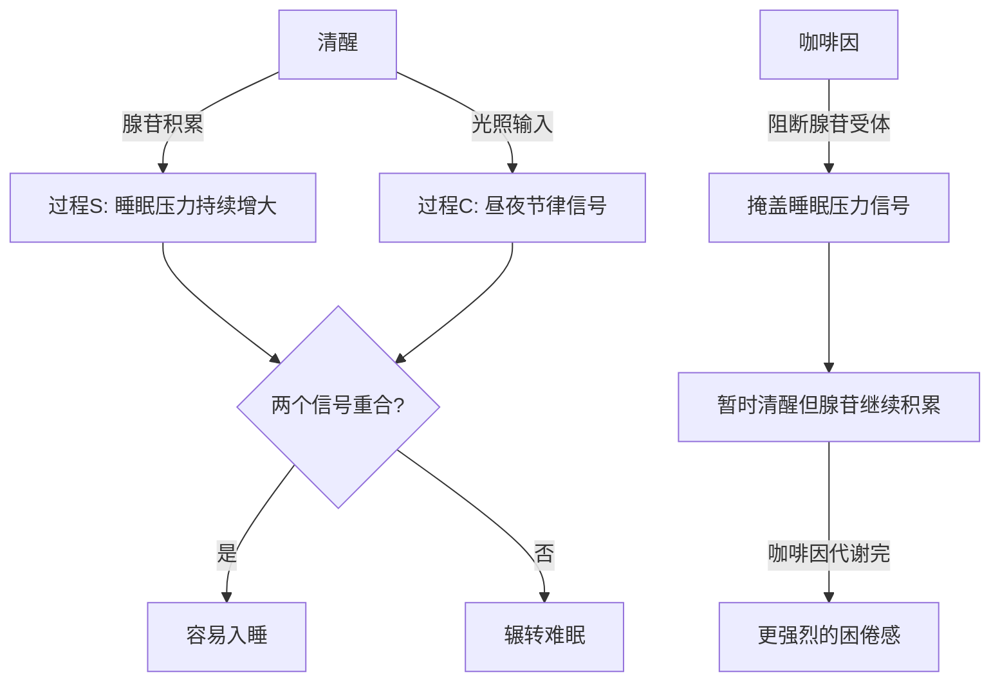
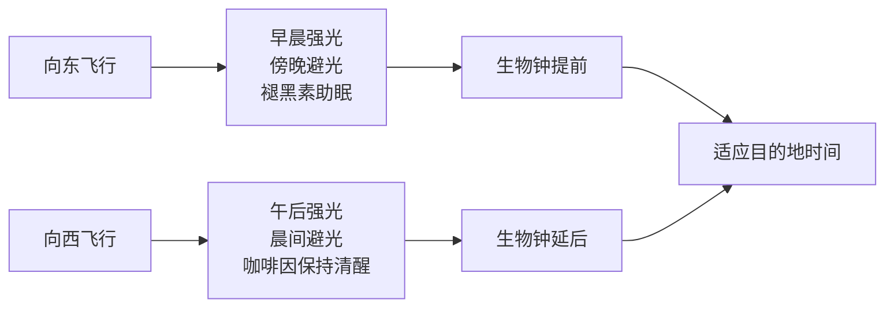
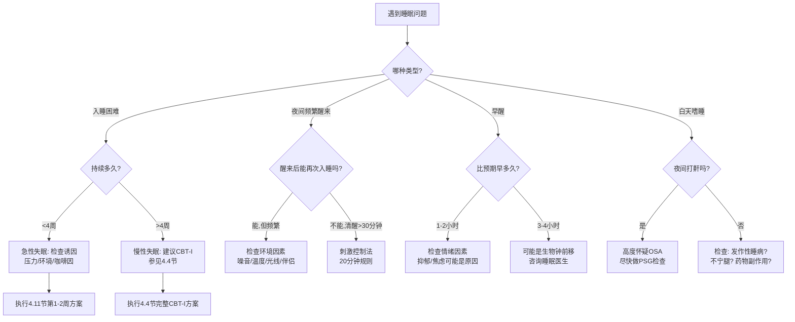

## 四、睡眠改善方案

睡眠是人体最基础的生理修复机制，占据了生命约三分之一的时间。美国国家睡眠基金会（NSF）的研究表明，成年人每晚需要7-9小时的睡眠，但中国睡眠研究会2023年发布的数据显示，超过3亿中国人存在睡眠障碍，成年人失眠发生率高达38.2%。长期睡眠不足不仅导致白天疲劳、注意力下降，还会显著增加心血管疾病、糖尿病、肥胖、抑郁症和认知退化的风险。

本节将从科学原理出发，提供一套系统化的睡眠改善方案，涵盖睡眠科学基础、环境优化、行为干预、认知调整、特殊场景应对、睡眠障碍识别、辅助手段、监测工具和长期管理九大维度。无论你是偶尔睡不好的普通人，还是长期受失眠困扰的慢性患者，都能在本节中找到适合自己的改善路径。

### 4.1 睡眠的科学基础

在讨论改善方案之前，有必要理解睡眠的基本运作机制。理解原理不是为了"学知识"，而是为了在面对具体的睡眠问题时，能够判断哪些方案是科学的、哪些是伪科学，从而避免在无效的方法上浪费时间和金钱。

#### 4.1.1 睡眠-觉醒的双过程模型

人体的睡眠受两个独立系统共同调控，这个模型由瑞士睡眠研究者Alexander Borbély于1982年提出，至今仍是睡眠科学的核心框架：

**过程S（睡眠稳态压力）**：从醒来的那一刻起，腺苷（adenosine）在大脑中逐渐积累。清醒时间越长，腺苷浓度越高，睡眠压力越大。入睡后腺苷被清除，次日醒来时恢复到基线水平。咖啡因之所以能提神，正是因为它阻断了腺苷受体（主要是A1和A2A受体），但并不清除腺苷本身——这也是为什么咖啡因的效果消退后会感到更加困倦，这种现象叫做"咖啡因崩溃"（caffeine crash）。

腺苷的积累速度有个体差异，受基因（如ADORA2A基因多态性）影响。有些人喝咖啡到晚上照样睡得着，有些人下午一杯就彻夜难眠——这不是意志力问题，而是基因决定的腺苷代谢速度不同。

**过程C（昼夜节律）**：由下丘脑视交叉上核（SCN）控制的生物钟，以约24小时为周期运转。SCN包含约20,000个神经元，每个神经元都有自己的分子钟——由CLOCK和BMAL1基因驱动的转录-翻译反馈回路，周期约24.2小时。光照是最重要的授时因子（zeitgeber），光线通过视网膜→视网膜神经节细胞（ipRGC，含黑视蛋白）→SCN的通路，抑制褪黑素分泌，传递"这是白天"的信号。傍晚光线减弱后，松果体开始分泌褪黑素，体温下降，为入睡做准备。

当过程S的高睡眠压力与过程C的"睡眠窗口"重合时，入睡最容易；两者错位时，即使很疲惫也可能辗转难眠。这就是为什么倒时差时白天再困也睡不踏实——过程S很高，但过程C告诉你"现在是白天"。

#### 4.1.2 睡眠阶段与睡眠周期

一个完整的睡眠周期约90分钟（范围70-120分钟，因人而异），包含以下阶段：

| 阶段 | 占比 | 脑波特征 | 生理功能 | 唤醒难度 |
|------|------|----------|----------|----------|
| N1（浅睡眠） | 2-5% | α波→θ波过渡（8-13Hz→4-7Hz） | 意识模糊的过渡期，肌肉开始放松 | 容易，轻微刺激即可唤醒 |
| N2（轻度睡眠） | 45-55% | 睡眠纺锤波（12-14Hz）、K复合波 | 记忆整合（特别是陈述性记忆）、体温调节、代谢率下降 | 较容易，需要较大声音才能唤醒 |
| N3（深度睡眠/慢波睡眠） | 15-25% | δ波（0.5-2Hz，高振幅） | 生长激素分泌（占每日70-80%）、免疫修复、细胞再生、脑内废物清除（胶质淋巴系统） | 困难，需要强烈刺激才能唤醒 |
| REM（快速眼动睡眠） | 20-25% | 类似清醒的混合频率（低振幅、高频） | 情绪调节、程序性记忆巩固、创造性思维、突触修剪 | 中等（大脑活跃但骨骼肌处于弛缓状态，防止将梦境付诸行动） |

一夜通常经历4-6个周期。前半夜以深度睡眠为主（第一、二个周期占比最高），后半夜以REM睡眠为主。这意味着：

- 早睡（如22:00入睡）能获得更多深度睡眠，有利于身体恢复和生长激素分泌
- 后半夜被频繁打扰会严重影响REM睡眠，影响情绪调节和记忆巩固
- 睡眠不足6小时会显著损失REM睡眠；睡眠不足5小时则深度睡眠和REM都严重缩水

**深度睡眠的特殊价值**：深度睡眠期间，大脑的胶质淋巴系统（glymphatic system）高度活跃，脑脊液大量涌入脑组织间隙，清除β-淀粉样蛋白和tau蛋白等代谢废物。这些蛋白的异常积累正是阿尔茨海默病的核心病理特征。一项发表在《Science》上的研究表明，仅一晚的睡眠剥夺就会使大脑中β-淀粉样蛋白水平升高约5%。这是"睡眠不好会变笨"这一民间说法的神经科学基础。

#### 4.1.3 时型与个体差异

时型（chronotype）是指个体在一天中偏好的活动和睡眠时间模式，由基因决定（PER3、CRY1等时钟基因），并非单纯的"习惯"或"懒惰"。了解自己的时型是优化睡眠方案的第一步。

**三种主要时型**：

| 时型 | 特征 | 基因倾向 | 最佳入睡时间 | 最佳起床时间 | 占人口比例 |
|------|------|----------|-------------|-------------|-----------|
| 早鸟型（狮子型） | 早晨精力最充沛，下午开始下降 | PER3长等位基因 | 21:00-22:00 | 5:00-6:00 | 约25% |
| 中间型（熊型） | 跟随标准日出日落节律 | - | 22:00-23:00 | 6:30-7:30 | 约55% |
| 夜猫型（猫头鹰型） | 傍晚和夜间精力最充沛 | CRY1基因突变 | 0:00-1:00 | 8:00-9:00 | 约20% |

**时型不是借口，但需要被尊重**：一个天生的夜猫型强迫自己每天5点起床锻炼，效果不会好——因为他的皮质醇峰值在清晨远低于早鸟型。更好的做法是找到自己精力最充沛的时段，把最重要的工作安排在那个时间，然后在自己的自然睡眠窗口内作息。

**时型随年龄变化**：青春期时型明显偏晚（青少年的褪黑素分泌比成年人晚1-2小时），20岁后逐渐向中间型回归，60岁后进一步提前。这解释了为什么青少年总想晚睡晚起，以及为什么老年人天没亮就醒了——不是他们"矫情"，是生物钟的真实变化。

**社会时差（Social Jet Lag）**：当社会要求的作息时间（如上班打卡）与自身时型严重不符时，身体就处于一种类似倒时差的状态。研究表明，社会时差每增加1小时，肥胖风险增加33%，抑郁风险增加显著。夜猫型在早九晚五社会中承受的健康代价最大。

#### 4.1.4 睡眠的核心功能

理解睡眠"为什么重要"比"怎么做"更有驱动力。以下是经过充分验证的睡眠功能：

**认知功能**：睡眠（特别是REM睡眠和深度睡眠）对记忆巩固至关重要。学习新知识后的睡眠期间，海马体中短期存储的记忆被"重放"并转移到大脑皮层进行长期存储。一项经典实验表明，学习后睡一觉的记忆保持率比保持清醒高出20-40%。此外，REM睡眠期间大脑会在看似不相关的记忆之间建立新连接，这就是为什么很多创意在"睡一觉之后"突然出现。

**情绪调节**：REM睡眠是大脑的"情绪急救室"。在REM期间，情绪记忆在去甲肾上腺素（一种压力激素）浓度极低的环境中被重新处理，情绪强度被"剥离"，留下记忆内容但减轻了情感冲击。一晚良好的REM睡眠后，你仍然记得昨天与同事的争吵，但不再感到那么愤怒。连续几天REM不足则会导致情绪反应过度——前额叶皮层（理性控制）对杏仁核（情绪中心）的调控能力下降约60%，等同于一个微醉的状态。

**免疫功能**：睡眠期间，免疫系统产生大量细胞因子（如IL-1、TNF-α）和免疫细胞。一项卡内基梅隆大学的研究发现，每晚睡眠不足7小时的人感染感冒病毒的概率是睡够8小时者的2.9倍。长期睡眠不足还与疫苗接种后的抗体反应减弱有关——睡眠不好的人打完疫苗后产生的保护性抗体可能只有正常睡眠者的一半。

**代谢与体重管理**：睡眠不足（连续多天每晚<6小时）会导致瘦素（leptin，产生饱腹感）水平下降约15%，同时饥饿素（ghrelin，产生饥饿感）水平上升约15%。这意味着身体会同时告诉你"饱了"的信号变弱、"饿了"的信号变强。更糟糕的是，睡眠不足还会增加对高热量食物（碳水化合物和脂肪）的偏好——实验显示睡眠受限者平均每天多摄入约385大卡。

### 4.2 睡眠环境优化

睡眠环境是影响睡眠质量最直接、最容易改变的因素。哈佛医学院睡眠医学部的研究显示，优化睡眠环境可以在不改变任何行为的情况下，将入睡潜伏期平均缩短15分钟。

#### 4.2.1 温度控制

**核心原理**：人体入睡时核心体温需要下降0.5-1°C。这个温度下降是褪黑素分泌的触发条件之一，也解释了为什么在凉爽的房间里更容易入睡。体温调节是通过手脚的血管扩张实现的——手脚温暖意味着血液正在从核心向体表散热，这是身体准备入睡的信号。

**具体方案**：

- **理想室温**：18-22°C（个体差异存在，以手脚微凉、身体温暖为宜）。使用可穿戴设备的研究表明，室温在18.3°C时深度睡眠比例最高
- **睡前90分钟温水浴/泡澡**：水温40-42.5°C，浸泡10-15分钟。原理是热水使外周血管扩张，血液流向体表散热，洗浴结束后核心体温快速下降，模拟了自然入睡时的体温变化。一项发表在《Sleep Medicine Reviews》上的荟萃分析（涉及5,322项研究）显示，睡前1-2小时的温水浴可平均缩短入睡时间10分钟
- **床品材质**：选择透气性好的天然纤维（纯棉、竹纤维、天丝），避免化纤面料造成的闷热感。冬季可在脚部区域增加保暖层，但躯干区域保持凉爽
- **分层盖被**：比起一条厚被子，多层薄被可以根据体温变化灵活调节，防止半夜热醒
- **空调/风扇使用**：若使用空调制冷，建议设置定时关闭（入睡后1-2小时），避免持续冷风导致呼吸道干燥。使用风扇时不要直吹身体，可朝墙壁吹促进空气循环
- **重力毯**：重量约为体重7-12%的重力毯通过深压力刺激（deep pressure stimulation）增加催产素分泌、降低皮质醇水平。一项发表在《Journal of Clinical Sleep Medicine》的随机对照试验显示，使用重力毯的失眠患者入睡时间缩短、夜间醒来减少、白天功能改善。但体重过轻（<50kg）或有呼吸系统问题的人不建议使用

#### 4.2.2 光线管理

**核心原理**：光线是调控褪黑素分泌的最主要信号。即使是少量的光线暴露也会抑制褪黑素的产生。哈佛医学院的一项研究发现，睡前暴露在100勒克斯的光线下（相当于昏暗的室内灯光），就足以抑制50%的褪黑素分泌。而且光线对褪黑素的抑制具有波长依赖性——波长460-480nm的蓝光效果最强，这也是为什么电子屏幕的影响特别大。

**具体方案**：

- **遮光措施**：使用遮光窗帘或遮光卷帘，将卧室光照度降到接近0勒克斯。检查是否有缝隙漏光（门缝、电子设备指示灯），用黑胶带遮挡。一个实用的测试方法：关灯后用手电筒照亮房间，然后关闭手电筒，如果30秒内你看不到任何光源，说明遮光达标
- **蓝光管理**：睡前2小时减少蓝光暴露。手机/电脑开启夜间模式（色温调到最暖），或者更好——直接使用f.lux、Night Shift等自动调节色温的软件。如果必须使用屏幕，可以佩戴琥珀色镜片的防蓝光眼镜，研究显示它可以将蓝光对褪黑素的抑制降低58%
- **晨间光照**：起床后30分钟内接受至少10分钟的自然光暴露（阴天也有效，约2000勒克斯）。这有助于校准昼夜节律，使夜间褪黑素的分泌时间更准确。如果生活在高纬度地区或冬季天亮较晚，可使用10000勒克斯的光照灯箱，在早餐时照射20-30分钟
- **夜灯选择**：如起夜需要，使用红色或琥珀色的小夜灯（<5勒克斯），避免白色或蓝色光源
- **智能照明**：使用可调色温的智能灯泡（如Philips Hue、Yeelight），设置"日落模式"——在傍晚自动将色温从5000K（冷白光）逐渐降到2700K（暖黄光），模拟自然日落的光谱变化

#### 4.2.3 噪音控制

**核心原理**：人耳在睡眠中并没有完全"关闭"——听觉信号仍然被大脑皮层处理。突然的噪音（如汽车鸣笛、关门声）即使没有将你完全唤醒，也会导致睡眠碎片化，减少深度睡眠和REM睡眠的时间。研究发现，噪音导致的微觉醒（micro-arousal）可使第二天的认知表现下降等同于少睡2小时的效果。

**具体方案**：

- **隔音改造**：条件允许时安装双层或三层中空玻璃窗（可降低噪音30-40分贝）。门缝安装密封条，墙壁可使用隔音棉或软木板装饰。这些改造成本在几千到一万元不等，但对长期睡眠质量的提升非常显著
- **白噪音/粉噪音**：白噪音包含所有频率的声音，可以掩盖突发噪音，让大脑不再对环境中的声音变化保持警觉。粉噪音（低频成分更丰富，听起来更像雨声或瀑布声）对某些人效果更好，研究表明粉噪音可以增加深度睡眠时间。推荐使用专业白噪音机器或手机App（如White Noise、Rain Rain），音量设置在40-50分贝（相当于安静的图书馆）。注意不建议整晚播放——可以在入睡时开启，设置1-2小时定时关闭
- **耳塞**：3M 1100等高降噪耳塞可降低噪音约30分贝，但初次佩戴需要适应期。建议从每晚佩戴2-3小时开始，逐渐增加到整晚。注意耳塞需要定期更换（泡沫耳塞建议1-2周），否则会滋生细菌。长期佩戴者建议改用可清洗的硅胶耳塞或定制耳塞（耳鼻喉科可定制，约500-1000元）
- **卧室位置选择**：装修或搬家时，将卧室安排在远离街道、电梯间和邻居活动区域的位置

#### 4.2.4 床品选择

**床垫**：

选择床垫的核心原则是"脊柱对齐"——侧卧时脊柱应保持一条直线，仰卧时腰椎不塌陷。测试方法：仰卧在床垫上，将手伸到腰部下方，如果手能轻松滑入说明床垫太硬，如果手被完全压住说明床垫太软，刚好能感受到轻微压力时硬度适中。更准确的方法是让伴侣从侧面观察你的脊柱是否呈一条直线。

- **软硬度**：侧睡者选中软偏软（缓解肩部和髋部压力），仰睡者选中等硬度，趴睡者选中偏硬（避免腰部过度凹陷）
- **材质**：记忆棉适合体压分散但透气性较差（适合冬天），乳胶兼顾支撑和透气（适合怕热的人），弹簧床垫（独立袋装弹簧）抗干扰性好，适合双人使用。混合材质床垫（乳胶+独立弹簧）综合表现最好但价格较高
- **更换周期**：每7-10年更换一次。判断标准：躺下后能明显感受到弹簧、起床后经常腰酸背痛、床垫出现明显凹陷

**枕头**：

枕头的核心功能是维持颈椎的自然曲度（颈椎前凸约40°）。

- **仰睡**：枕头高度约8-12cm（一拳高），颈部需要额外支撑，可使用记忆棉波浪枕。枕头应同时支撑头部和颈部——只垫到头而颈部悬空是很多颈椎问题的根源
- **侧睡**：枕头高度约12-15cm（与肩宽相当），确保头部不偏斜。可在两膝之间夹一个薄枕保持骨盆对齐，这对预防腰痛非常重要
- **趴睡**：尽量改变睡姿——趴睡是脊柱最不友好的睡姿，迫使颈椎旋转90度。如果无法改变，使用尽可能薄的枕头或不用枕头
- **材质选择**：乳胶枕支撑性好且抗菌防螨，记忆棉枕贴合度高但偏热，荞麦枕可调节高度但需定期晾晒，羽绒枕柔软但支撑力不足

**床单被套**：纯棉或竹纤维材质为佳，支数建议40支以上（越高越柔软但透气性不一定更好）。建议每周更换清洗，水温60°C以上可杀灭螨虫。对尘螨过敏者可使用防螨床罩（密织面料，孔径<10微米），并每2-3周用60°C以上热水清洗枕头和被子。

#### 4.2.5 电子设备管理

**核心原理**：电子设备对睡眠的影响不仅来自蓝光，还有内容带来的心理唤醒。刷社交媒体、看新闻、玩游戏都会激活交感神经系统，使心率加快、皮质醇升高，与入睡所需的副交感神经主导状态完全相反。

**具体方案**：

- **卧室零电子设备原则**：电视、电脑、游戏机不放在卧室。卧室只保留与睡眠相关的功能——这在认知行为治疗中叫做"刺激控制"的一部分
- **手机管理**：使用传统闹钟代替手机闹钟，消除手机上床的理由。如果必须将手机放在卧室，开启勿扰模式，放在伸手够不到的地方（如房间另一侧的桌上）
- **充电站策略**：在客厅或书房设置"充电站"，所有家庭成员的手机在睡前统一放在那里充电，营造集体减少屏幕时间的氛围
- **Kindle例外**：电子墨水屏不发蓝光，可以作为睡前阅读工具，但避免使用带自发光功能的Kindle Fire等平板
- **社交媒体截止时间**：设定一个"社交媒体截止时间"——建议睡前至少60分钟。社交比较、负面新闻、争议性内容都会激活大脑的威胁监测系统，这种状态与入睡所需的放松状态完全相反

### 4.3 睡前仪式的建立

睡前仪式的核心目的是创造一个从"清醒模式"到"睡眠模式"的过渡期。通过固定的行为序列建立条件反射，让身体在执行这些行为时自动开始准备入睡。就像巴甫洛夫的狗听到铃声就流口水一样，当你开始固定的睡前流程时，身体会自动启动入睡程序。

#### 4.3.1 睡前90分钟完整流程

| 时间节点 | 活动 | 科学依据 | 具体操作 |
|----------|------|----------|----------|
| 睡前90分钟 | 完成晚餐或宵夜 | 消化活动会升高体温和代谢率，不利于入睡 | 如果需要吃宵夜，选择少量易消化食物（如半根香蕉、一小杯温牛奶、几块全麦饼干） |
| 睡前60分钟 | 停止工作，结束屏幕使用 | 工作内容激活前额叶皮层，难以快速"关机" | 设置自动提醒或闹钟，到点后关闭电脑、退出工作群聊、开启手机勿扰模式 |
| 睡前45分钟 | 温水泡脚或泡澡 | 核心体温下降触发睡意 | 泡脚水温38-42°C，浸泡15-20分钟。可加入适量Epsom盐（硫酸镁），镁离子经皮吸收有助于肌肉放松 |
| 睡前30分钟 | 低刺激放松活动 | 激活副交感神经系统 | 选择：纸质书阅读（避免悬疑惊悚类）、轻柔拉伸、听播客或有声书、拼图等低认知负荷活动 |
| 睡前15分钟 | 调整环境 | 为身体创造入睡信号 | 将灯光调到最暗（使用可调光台灯或蜡烛），拉上窗帘，设定空调定时 |
| 睡前5分钟 | 呼吸练习或身体扫描冥想 | 激活迷走神经，降低心率和皮质醇 | 具体方法见下文 |

**个性化调整**：以上流程是一个模板，需要根据自己的生活节奏进行调整。核心原则不变：从高刺激→低刺激，从清醒活动→放松活动，从亮光→暗光，从高温→低温。不一定要严格按照90分钟，但至少需要30分钟的过渡期。

#### 4.3.2 推荐的睡前放松技术

**4-7-8呼吸法**（哈佛大学Andrew Weil博士推广）：

用鼻子吸气4秒 → 屏住呼吸7秒 → 用嘴缓慢呼气8秒（发出"呼"的声音）。重复4个循环。

原理：延长的呼气阶段激活副交感神经系统，降低心率。屏气阶段增加血液中的CO₂浓度，促进氧合血红蛋白释放氧气，帮助肌肉放松。初学者可能觉得屏气7秒太长，可以从3-4-6开始，逐渐延长。

**渐进性肌肉放松（PMR）**：

按从脚到头的顺序，依次收紧每组肌肉5秒，然后突然放松并感受放松感15-20秒。顺序：脚趾→小腿→大腿→臀部→腹部→胸部→双手→前臂→上臂→肩膀→面部（咬紧牙关、皱眉、紧闭双眼）。

原理：通过"先紧张再放松"的对比，让大脑更敏锐地感知到放松状态，同时消耗掉残余的肌肉紧张。研究表明，PMR可以将入睡时间缩短约20分钟。建议配合音频引导使用，熟练后可自行操作。

**身体扫描冥想**：

躺在床上，从脚趾开始，依次将注意力集中在身体的每个部位。不要试图改变任何感觉，只是"观察"它。如果走神了，温和地将注意力拉回来。从脚趾到头顶大约需要15-20分钟。

**"认知洗牌"技巧**：随机想一个类别（如水果、城市名、动物），然后在脑海中逐一列出属于该类别的事物。这个技巧的原理是占据工作记忆的空间，让焦虑和担忧没有"插话"的机会。比起"数羊"（单调且不够占据认知资源），这种方法更有效。

**App推荐**：潮汐（中文内容丰富）、小睡眠（白噪音+冥想结合）、Headspace（英文，有专门的睡眠冥想系列）、Calm（英文，睡眠故事是特色功能）、蜗牛睡眠（可记录鼾声和梦话）。

### 4.4 失眠的系统化应对

失眠是最常见的睡眠障碍，分为入睡困难型（躺下30分钟以上无法入睡）、维持困难型（夜间频繁醒来且难以再次入睡）和早醒型（比预期早醒1-2小时且无法再入睡）。以下方案基于认知行为治疗（CBT-I），已被美国医师学会（ACP）推荐为慢性失眠的一线治疗方案，效果优于安眠药且无依赖性。

#### 4.4.1 刺激控制法

**核心原理**：慢性失眠患者往往将"床"与"清醒焦虑"建立了条件反射。原本"床"应该触发睡意，但长期失眠的人看到床就条件反射地紧张："今晚会不会又睡不着？"刺激控制法通过重建"床=睡眠"的条件反射来打破恶性循环。这是CBT-I中证据最强、效果最快的单一技术。

**具体步骤**：

1. **只在真正困倦时才上床**——注意区分"困倦"和"疲劳"。困倦的标志是眼皮发沉、不停打哈欠、注意力无法集中在任何事情上。仅仅感到身体疲劳但大脑仍然活跃时，不要上床
2. **床只用于睡眠和亲密关系**——不在床上看手机、看电视、工作、吃东西、打电话、想事情。如果需要思考或规划明天的事情，先坐在书桌前写下来。这个原则的目的是切断"床"与"清醒活动"之间的关联
3. **20分钟规则**——如果躺下后约20分钟（凭感觉估计，不要看钟表）仍无法入睡，果断起床离开卧室。去另一个房间做低刺激活动（阅读一本不那么有趣的书、听轻音乐），直到再次感到困倦再回床上。关键是不要在床上"努力"入睡——"努力"本身就会激活交感神经系统，让你更加清醒
4. **无论夜间睡了多久，固定时间起床**——这是最重要的规则。设定一个固定的闹钟时间（包括周末），不要因为前一晚没睡好就赖床补觉。这有助于稳定昼夜节律，并在次日傍晚积累足够的睡眠压力
5. **白天不补觉**——如果实在太困，可以在下午1-3点之间小睡不超过20分钟。但如果是严重失眠者，建议完全取消午睡，将所有睡眠压力集中到夜间

**常见阻力与应对**：很多人觉得"20分钟起床"太折腾，宁可躺在床上"至少休息一下"。但研究反复证明，在床上清醒的时间越长，"床=失眠"的条件反射就越强。一两周的"折腾"换来的是长久的改善。

#### 4.4.2 睡眠限制法

**核心原理**：通过压缩卧床时间来提高睡眠效率（实际睡眠时间÷卧床时间×100%）。当卧床时间过长而实际睡眠不足时，人在床上会花大量时间处于清醒焦虑状态，这反过来恶化了失眠。睡眠限制法打破了这个循环——当你的身体只被允许在床上待5个小时时，它会"抓紧时间"入睡。

**具体步骤**：

1. **计算基线数据**：通过2周的睡眠日记计算平均实际睡眠时间。比如你的卧床时间是8小时，但实际平均只睡了5小时，那么你的睡眠效率只有62.5%
2. **设定初始卧床窗口**：将卧床时间限制为实际平均睡眠时间（不低于5小时）。例如你平均睡5小时，计划6:30起床，那么最早只能在凌晨1:30上床
3. **逐步扩展**：当连续一周睡眠效率≥85%时，每周将卧床时间增加15-30分钟（先提前15分钟上床）。如果效率降到85%以下，减少卧床时间15-30分钟
4. **目标**：最终达到85%以上的睡眠效率，同时获得足够的睡眠时长

**注意事项**：睡眠限制法在初期会造成明显的白天困倦，因此不建议在需要高度警觉的工作期间（如长途驾驶）使用。执行期间绝对不要在卧床窗口之外打瞌睡。这个方法看似"残酷"，但通常在2-4周内就能看到显著改善。配合刺激控制法一起使用效果最佳。

**睡眠限制法的科学证据**：多项随机对照试验表明，睡眠限制法单独使用即可将入睡时间缩短约50%，睡眠效率从平均60-70%提升至85-90%。它的效果与安眠药相当甚至更好，且停止后效果持续，而安眠药停药后往往会反弹。

#### 4.4.3 认知重构

失眠患者常常存在不合理的认知模式，这些想法本身就会制造焦虑，使失眠加重。认知重构的目标不是"积极思考"，而是用更准确、更平衡的想法替代扭曲的认知。

**常见不合理信念及替代想法**：

| 不合理信念 | 认知扭曲类型 | 为什么它是错的 | 替代想法 |
|-----------|-------------|---------------|---------|
| "我必须睡够8小时" | 非黑即白思维 | 睡眠需求因人而异，基因决定的短睡眠者只需4-6小时 | "我需要探索适合自己的睡眠时长，7-8小时只是平均值" |
| "失眠会毁了我明天的工作" | 灾难化思维 | 偶尔的睡眠不足对认知的影响远小于焦虑本身 | "人有应对偶尔睡眠不足的弹性，深呼吸比焦虑更有帮助" |
| "失眠对健康有害" | 灾难化思维 | 将失眠灾难化的想法才是最大的健康威胁 | "短期失眠不会造成持久伤害，我正在采取有效的改善措施" |
| "我需要安眠药才能入睡" | 过度依赖外部因素 | 安眠药只解决短期问题，长期使用产生依赖 | "CBT-I的长期效果优于药物，我选择从根本上解决" |
| "昨晚没睡好，今天不能运动" | 情绪化推理 | 适度运动反而有助于当晚的睡眠质量 | "即使感到疲倦，轻度运动（如散步30分钟）能帮我今晚睡得更好" |
| "所有人都比我睡得好" | 读心术 | 睡眠问题非常普遍，你不是唯一一个 | "超过3亿中国人有睡眠问题，我在积极解决它" |
| "今晚肯定又睡不着" | 预言家谬误 | 无法预测未来，过去的失眠不代表今晚一定失眠 | "我无法预测今晚的睡眠，但我可以做好准备" |

**担忧时间（Worry Time）技术**：

每天固定一个15分钟的"担忧时间"（建议在睡前3小时之前），坐下来把所有担心的事情写在纸上，并为每件事写下一个可能的行动方案。然后告诉自己："我已经处理过了，现在不需要再想了。"如果夜间醒来想到什么事情，对自己说："我明天的担忧时间会处理它。"

这个技术的有效性来自一个心理学原理：大脑不会轻易放弃未完成的任务（蔡格尼克效应）。把它写下来就是给大脑一个承诺："这件事有人会处理"，大脑就不会在夜间反复提醒你。

### 4.5 不同生活场景的睡眠应对

#### 4.5.1 时差调整方案

时差反应的本质是内源性生物钟与目的地时间不匹配。一般规则是每跨越一个时区需要约1天的调整时间。时差反应的严重程度不仅取决于时差大小，还取决于飞行方向和个体差异。

**向东旅行**（如北京→伦敦，时间提前5小时）：

向东飞行比向西更难调整，因为"提前"比"延后"更困难——生物钟天然倾向于比24小时略长（平均24.2小时），向西旅行等于顺应了这个趋势，而向东旅行则是逆着来。

- **出发前3-4天**：每天提前30分钟入睡和起床。在早晨接受强光暴露，晚上提前佩戴防蓝光眼镜
- **飞行中**：将手表和作息调整为目的地时间。多喝水，限制酒精和咖啡因。如果是长途飞行，尽量在目的地的夜间时段睡觉
- **到达后**：早晨（目的地时间）立即接受强光照射（最好在户外），帮助生物钟提前。下午3点后避免咖啡因。晚上使用褪黑素（0.5-3mg，到达目的地睡眠时间前30分钟服用）
- **褪黑素使用要点**：低剂量（0.3-0.5mg）对调整生物钟有效，高剂量（3-5mg）主要用于催眠。使用短效褪黑素即可，不建议使用缓释剂型用于时差调整

**向西旅行**（如北京→纽约，时间延后13小时）：

- **出发前3-4天**：每天延后30分钟入睡和起床。傍晚接受强光暴露
- **到达后**：下午和傍晚（目的地时间）接受强光照射，帮助生物钟延后。早晨戴防蓝光眼镜或墨镜减少晨光对生物钟的"提前"作用
- **到达后的前3天**：可能是最难熬的——白天极度困倦但必须保持清醒。策略是户外活动+适度咖啡因（下午2点前）

**跨多个时区的长途旅行特殊策略**：如果跨越8个以上时区（如中国到美国），可以在中途停留1-2天进行过渡，或者在飞行中就开始按照目的地时间作息——将手表调到目的地时间，在"夜间"戴眼罩睡觉，在"白天"保持清醒。

#### 4.5.2 轮班工作睡眠方案

全球约15-20%的劳动者从事轮班工作，其睡眠障碍发生率是日班工作者的2-4倍，长期轮班工作者的乳腺癌、心血管疾病和消化系统疾病风险显著升高。以下方案旨在将轮班对健康的损害降到最低。

**夜班期间**：

- 使用明亮的灯光（>500勒克斯）维持警觉性。研究表明，夜班期间接受2000勒克斯以上的光照可以显著减少嗜睡和操作失误
- 午夜后限制咖啡因摄入（至少在下班前6小时停止）。如果夜班到早上7点，凌晨1点后不再摄入咖啡因
- 下班回家路上佩戴深色墨镜，避免晨光激活生物钟。这是很多轮班工作者忽略的关键步骤——回家路上的阳光会告诉大脑"现在是白天"，导致回家后更难入睡

**白天补觉**：

- 使用遮光窗帘+眼罩将卧室完全遮暗。理想状态下，白天卧室的光照度应与夜间相同
- 佩戴耳塞或使用白噪音，防止白天环境噪音干扰。白天的噪音通常比夜间多（施工、交通、邻居活动）
- 保持室温在18-20°C
- 与家人沟通，设定"请勿打扰"时间段。在卧室门上挂一个"请勿打扰"的牌子也是一个简单有效的方法
- 补觉策略：如果夜班后无法连续睡7-8小时，可采用"分段睡眠"——先睡一个主觉段（4-5小时），再在夜班前补一个短觉（1.5-2小时，即一个完整睡眠周期）

**轮换过渡**：

- 从夜班转回白班时，不要第一天就上白班——中间留出一天"缓冲日"用于调整
- 利用光照和褪黑素辅助生物钟重置：转白班前一晚不睡，白天活动+强光暴露，晚上正常入睡

#### 4.5.3 情绪性失眠的应对

压力、焦虑、悲伤等情绪是导致短期失眠转为慢性失眠的最常见原因。如果不对情绪因素进行处理，单纯的环境优化和行为调整很难奏效。

**正念接纳法**：

不要与失眠"斗争"。越努力入睡，越难以入睡——这叫做"意向性失眠"（paradoxical insomnia），也叫"睡眠努力的矛盾效应"。当躺在床上无法入睡时：

1. 承认当前的状态："我现在没有睡着，这没关系"
2. 接受不舒适的感觉：不要评判自己的失眠，不要看时间计算还能睡多久——看时间是失眠者最常见的焦虑来源
3. 将注意力转移到身体感受上：感受被子的重量、枕头的温度、呼吸的节奏
4. 如果头脑中出现想法，像观察云朵一样看着它飘过，不要抓住它

**书写疗法**：

睡前将烦恼写在纸上。德贝大学的一项研究发现，睡前花10分钟写下"待办事项"的人比写"已完成事项"的人入睡速度快9分钟。书写的行为将焦虑从大脑"卸载"到纸上，减轻了工作记忆的负担。

更有效的升级版是写一份"完成计划"：不仅写下烦恼，还为每件事写下明天的第一步行动。这样做的效果更好，因为你给了大脑一个明确的"下一步"，它就不再需要在夜间反复提醒你。

**感恩练习**：

睡前想三件今天值得感恩的事情（即使很小）。积极心理学研究表明，感恩练习可以降低入睡前的焦虑水平和反刍思维的频率。更有效的方式是写下来——准备一个"感恩笔记本"，每天睡前写三件事，坚持2周以上就能感受到明显的变化。

**认知解离技术**（来自接纳承诺疗法ACT）：

当大脑中出现"我肯定又睡不着"等消极想法时，不要试图反驳它（这反而会强化这个想法），而是给它加上一个前缀："我注意到我正在想'我肯定又睡不着'"。这个简单的语言转换创造了你与想法之间的距离——你不是你的想法，你只是观察到了一个想法。

### 4.6 常见睡眠障碍的识别与应对

了解常见的睡眠障碍有助于判断自己的问题是否需要就医。以下内容仅供识别参考，不能替代专业诊断。

#### 4.6.1 阻塞性睡眠呼吸暂停（OSA）

OSA是最常见的睡眠障碍之一，全球患病率约9-38%，在中国约为4-10%。它发生在睡眠中上呼吸道反复塌陷，导致呼吸暂停（每次持续10秒以上），严重者每小时可暂停30次以上。

**典型症状**：
- 打鼾声响亮且不规律（鼾声-安静-鼾声交替出现，安静期就是呼吸暂停期）
- 睡眠中被自己的窒息感惊醒
- 白天极度嗜睡，即使睡了8小时以上仍然疲倦
- 晨起头痛、口干
- 夜间频繁起夜（呼吸暂停导致心房钠尿肽分泌增加）

**高危因素**：肥胖（BMI>28）、颈围>43cm（男性）/>38cm（女性）、下巴后缩、扁桃体肥大、鼻中隔偏曲、饮酒、吸烟、年龄>40岁、男性（患病率为女性的2-3倍，绝经后女性风险显著增加）

**危害**：未经治疗的OSA显著增加高血压（风险增加2-3倍）、心律失常、脑卒中、2型糖尿病和交通事故的风险。OSA患者发生车祸的概率是正常人的2-7倍。

**应对**：
- **就医检查**：进行多导睡眠监测（PSG），记录呼吸暂停低通气指数（AHI）。AHI 5-15为轻度，15-30为中度，>30为重度
- **持续正压通气（CPAP）**：中重度OSA的一线治疗。通过面罩持续送入正压空气，保持上呼吸道通畅。需要时间适应（通常1-2周），但效果立竿见影
- **体位治疗**：仰卧位OSA更严重，可以通过在背部缝一个网球或使用专用体位治疗设备避免仰卧
- **减重**：对于肥胖相关的OSA，体重减轻10%可使AHI降低约25%
- **口腔矫治器**：适用于轻中度OSA，由口腔科医生定制，通过前移下颌扩大气道

#### 4.6.2 不宁腿综合征（RLS）

全球患病率约5-10%，中国约为1.2-5%。核心特征是休息时（特别是晚上和夜间）双腿出现难以描述的不适感（蚁走感、酸胀感、拉扯感），必须活动腿部才能缓解。

**诊断标准**（国际RLS研究组）：
1. 强烈的活动双腿的冲动，通常伴有不适感
2. 休息或不活动时出现或加重
3. 活动后部分或完全缓解
4. 傍晚或夜间比白天严重

**常见诱因**：缺铁（即使血红蛋白正常，铁蛋白<50ng/ml也可能诱发）、叶酸缺乏、咖啡因过量、某些药物（抗抑郁药SSRI、抗组胺药）、妊娠（约20%孕妇会出现，产后通常自行缓解）

**应对**：
- 检查铁蛋白水平，如<50ng/ml补充铁剂
- 减少咖啡因摄入
- 睡前进行适度腿部运动（如散步、骑固定自行车）
- 热水泡脚或冷敷（因人而异，有些人热敷有效，有些人冷敷更有效）
- 中重度患者需要药物治疗，由神经内科医生处方

#### 4.6.3 发作性睡病

患病率约0.02-0.05%，是一种中枢性嗜睡障碍，通常在青少年期发病。核心特征是白天不可抗拒的睡眠发作（持续10-20分钟），以及可能存在的猝倒发作（强烈情绪触发的肌肉突然无力）。

**需警惕的信号**：
- 白天频繁出现不可抗拒的困倦，即使夜间睡眠充足
- 大笑、惊讶或愤怒时突然感到膝盖发软或面部无力
- 入睡时出现生动的幻觉（睡前幻觉）或醒来时发现身体无法动弹（睡眠瘫痪/鬼压床，偶尔出现是正常的，频繁出现需警惕）

**应对**：这是一种需要神经内科专科治疗的疾病，不可自行处理。就医前建议记录2周的睡眠日志和白天嗜睡情况。

#### 4.6.4 异态睡眠

异态睡眠是指睡眠过程中出现的异常行为或体验：

| 类型 | 表现 | 发生在哪个阶段 | 注意事项 |
|------|------|---------------|---------|
| 梦游 | 睡眠中起床行走、做复杂动作 | 深度睡眠（N3期） | 多见于儿童，成人频繁梦游需排除药物副作用和癫痫 |
| 夜惊 | 突然坐起、尖叫、极度恐惧，但事后不记得 | 深度睡眠（N3期） | 多见于4-12岁儿童，通常无需治疗 |
| REM睡眠行为障碍 | 将梦境内容付诸行动（打拳、踢腿、喊叫） | REM睡眠期 | 中老年人需特别警惕，与帕金森病和路易体痴呆有显著相关性 |
| 磨牙 | 睡眠中磨牙或紧咬牙齿 | 各阶段均可发生 | 长期磨牙可导致牙齿磨损、颞下颌关节疼痛 |
| 梦呓 | 睡眠中说话 | 各阶段均可发生 | 通常无害，但频繁出现可咨询医生 |

**REM睡眠行为障碍（RBD）特别提醒**：如果中老年人开始出现频繁的"在梦中打人"或"梦中大喊大叫"，这可能是帕金森病或路易体痴呆的前驱症状——RBD患者在确诊后10-15年内发展为神经退行性疾病的比例高达80%以上。应尽早到神经内科就诊。

#### 4.6.5 多导睡眠监测（PSG）详解

当你就医时，医生可能建议进行多导睡眠监测。了解这个检查的过程和意义，可以减少焦虑，也有助于配合检查。

**PSG记录的指标**：
- 脑电图（EEG）：判断睡眠阶段
- 眼电图（EOG）：记录眼球运动
- 肌电图（EMG）：记录肌肉活动
- 鼻气流传感器：检测呼吸暂停
- 胸腹运动带：区分阻塞性和中枢性呼吸暂停
- 血氧饱和度：记录缺氧程度
- 心电图（ECG）：监测心律
- 体位传感器：记录睡姿
- 小腿肌电图：检测不宁腿

**检查前准备**：
- 检查当天避免午睡和咖啡因
- 不要使用发胶、润肤霜（影响传感器粘贴）
- 带上自己的枕头（增加舒适度）
- 穿宽松舒适的睡衣
- 如果担心睡不着，不必焦虑——即使只睡了4-5小时也足以获得诊断信息

**家庭睡眠监测（HSAT）**：对于高度怀疑中重度OSA的患者，医生可能先安排简化版的家庭监测（只记录鼻气流、血氧、胸腹运动和心率）。优势是在家进行、更舒适、更便宜；劣势是无法记录脑电图，可能漏诊轻度OSA和其他睡眠障碍。

### 4.7 不同生命阶段的睡眠特点与调整

#### 4.7.1 婴幼儿与儿童

| 年龄段 | 推荐睡眠时长 | 特点 | 关键建议 |
|--------|-------------|------|---------|
| 0-3个月 | 14-17小时 | 没有昼夜节律，分段睡眠 | 不必强求整夜睡眠，建立昼夜区分（白天明亮、夜间黑暗） |
| 4-11个月 | 12-16小时（含小睡） | 开始建立昼夜节律 | 固定睡前仪式，培养自主入睡能力 |
| 1-2岁 | 11-14小时（含1次午睡） | 可能出现分离焦虑导致的入睡困难 | 保持一致的睡前流程，使用安抚物 |
| 3-5岁 | 10-13小时 | 可能出现噩梦和夜惊 | 限制屏幕时间，提供安全感 |
| 6-12岁 | 9-12小时 | 学业压力和屏幕时间影响增大 | 严格执行屏幕截止时间，保证充足睡眠 |

#### 4.7.2 青少年

青少年面临特殊的睡眠挑战：生物钟自然偏晚（褪黑素分泌比成人晚1-2小时），但学校上课时间通常很早。这造成了系统性的睡眠不足——中国青少年的平均睡眠时间比推荐值少1-2小时。

**关键建议**：
- 理解青少年晚睡不是"懒"，而是生物钟的真实变化
- 周末的作息时间与工作日差异不超过2小时
- 限制睡前屏幕使用（这对青少年来说是最困难但最重要的一步）
- 如果可能，选择上学时间较晚的学校

#### 4.7.3 孕期与产后

孕期睡眠问题非常普遍：孕早期的尿频和恶心、孕中期的鼻塞和腿抽筋、孕晚期的腰痛和胎动。产后则面临新生儿照料导致的严重睡眠剥夺。

**孕期建议**：
- 左侧卧位是孕晚期的最佳睡姿（改善子宫血流）
- 使用孕妇枕（U型或C型）支撑腹部和双腿
- 睡前排尿减少夜间起夜次数
- 避免使用未经医生批准的助眠药物和补充剂

**产后建议**：
- "宝宝睡你也睡"——在新生儿睡眠期间同步休息
- 与伴侣分担夜间喂养和换尿布的任务
- 产后6周内不追求"完美睡眠"，以恢复体力为首要目标
- 如出现产后抑郁导致的持续失眠，及时就医

#### 4.7.4 中老年

60岁以后睡眠发生显著变化：深度睡眠大幅减少（可能降至总睡眠时间的5%以下）、昼夜节律前移（早睡早醒）、夜间醒来次数增加。这些变化部分是正常的衰老过程，部分可能与疾病或药物有关。

**关键建议**：
- 接受"睡眠随年龄变化"的事实，不要因为"睡不了8小时"而焦虑
- 白天增加光照暴露和体力活动
- 检查正在服用的药物是否影响睡眠（利尿剂导致起夜、β受体阻滞剂抑制褪黑素分泌等）
- 注意排查睡眠呼吸暂停（老年人OSA患病率更高）
- 谨慎使用安眠药——老年人对苯二氮卓类药物的代谢减慢，跌倒风险显著增加

### 4.8 辅助手段与注意事项

#### 4.8.1 运动与睡眠的关系

规律运动是改善睡眠最有效的非药物手段之一。一项发表在《Sleep Medicine》上的荟萃分析显示，规律运动可以增加深度睡眠时间、缩短入睡时间、减少夜间觉醒。运动改善睡眠的机制包括：提高腺苷积累速度、促进核心体温的昼夜波动、降低焦虑和抑郁水平。

**运动时间选择**：

- **最佳时段**：上午或下午（6:00-18:00）。晨间运动配合阳光暴露，对校准昼夜节律特别有效
- **可以接受**：傍晚运动（18:00-20:00），但运动强度不宜过高，结束后至少留出1-2小时的降温期
- **应避免**：睡前2小时内的高强度运动（心率>最大心率的70%）。高强度运动使核心体温升高、肾上腺素和皮质醇分泌增加，需要2-3小时才能恢复到适合入睡的状态
- **例外**：轻度瑜伽、拉伸和散步在睡前进行是安全的，甚至有助于放松

**运动类型**：

- 有氧运动（跑步、游泳、骑行）对深度睡眠的提升效果最显著
- 力量训练也有正面效果，但避免在睡前进行
- 瑜伽和太极对改善失眠症状特别有效，尤其适合老年人和运动能力有限的人群
- 一项对失眠老年人的研究显示，每周3次、每次50分钟的太极练习，16周后睡眠质量改善程度与认知行为治疗相当

**运动频率与时长**：每周至少150分钟中等强度运动（如快走）或75分钟高强度运动（如跑步）。不需要一次完成——每天30分钟、每周5天即可。即使只有10-15分钟的运动也比不运动好。

#### 4.8.2 饮食与睡眠

**有助于睡眠的食物和营养素**：

- **色氨酸**：褪黑素的前体物质。富含色氨酸的食物包括火鸡、牛奶、香蕉、坚果、小米。牛奶助眠并非迷信——温牛奶确实含有色氨酸和钙（钙帮助大脑利用色氨酸合成褪黑素），此外喝温牛奶的行为本身也是一种睡前仪式
- **镁**：天然肌肉放松剂，也是GABA受体的调节剂（GABA是主要的抑制性神经递质）。食物来源：深绿叶蔬菜、坚果（特别是南瓜子和杏仁）、全谷物、黑巧克力。建议每日摄入量：男性400mg，女性310mg。中国居民膳食调查显示，约60%的人镁摄入不足
- **甘氨酸**：可降低核心体温，改善睡眠质量。食物来源：骨汤、胶原蛋白。睡前3g甘氨酸已被研究证实可改善主观睡眠质量
- **褪黑素前体**：酸樱桃（tart cherry）是天然褪黑素含量最高的食物之一，研究显示连续两周每天喝两杯酸樱桃汁可使睡眠时间平均延长84分钟
- **L-茶氨酸**：绿茶中特有的氨基酸，可促进α脑波（放松状态的特征波）产生，降低焦虑。食物来源：绿茶（特别是遮荫种植的抹茶）。补充剂剂量通常为200-400mg

**应避免的饮食习惯**：

- **咖啡因**：半衰期约5-6小时（因个体CYP1A2基因型不同差异很大，有些人10小时才能代谢掉）。建议在下午2点前停止摄入所有含咖啡因的饮品（包括茶、可乐、能量饮料）。注意"隐藏的咖啡因"：巧克力、可可粉、某些止痛药（如散利痛）和减肥产品中也含有咖啡因
- **酒精**：虽然酒精有镇静作用，但它会严重碎片化后半夜的睡眠，减少REM睡眠。酒精代谢过程中产生的乙醛会激活交感神经系统，导致后半夜频繁醒来。一杯红酒也许让你更快入睡，但会显著降低睡眠质量。如果必须饮酒，建议在睡前4小时以上完成
- **大量进食**：睡前2-3小时避免大量进食，特别是高脂肪、高蛋白食物（消化时间长）。但完全空腹也会影响睡眠——如果感到饥饿，可以吃一小份含碳水化合物的零食（如全麦饼干、半根香蕉）
- **大量饮水**：睡前1-2小时减少饮水量，避免夜间频繁起夜。白天确保充足饮水（约2000ml），在傍晚后逐步减少
- **辛辣食物**：辣椒素会升高体温，可能导致入睡困难。此外，辛辣食物还可能加重胃食管反流，导致夜间醒来

#### 4.8.3 睡眠补充剂的循证使用

以下是经过一定科学验证的睡眠补充剂，按证据强度排序。注意：补充剂的效果因人而异，使用前建议咨询医生，特别是正在服用其他药物的情况。

| 补充剂 | 剂量范围 | 证据强度 | 作用机制 | 适合人群 | 注意事项 |
|--------|---------|---------|---------|---------|---------|
| 褪黑素 | 0.3-3mg | ★★★★★ | 调节昼夜节律 | 时差、轮班工作、节律紊乱 | 低剂量即可，高剂量可能抑制自身分泌 |
| 镁（甘氨酸镁/苏氨酸镁） | 200-400mg | ★★★★ | 调节GABA受体、肌肉放松 | 镁摄入不足者、肌肉紧张者 | 氧化镁吸收率低且可能导致腹泻，优选甘氨酸镁 |
| L-茶氨酸 | 200-400mg | ★★★ | 促进α脑波、降低焦虑 | 焦虑性失眠者 | 与咖啡因搭配可减轻焦虑同时保持警觉 |
| 甘氨酸 | 3g | ★★★ | 降低核心体温 | 入睡困难者 | 安全性高，几乎没有副作用 |
| 缬草根提取物 | 300-600mg | ★★ | 增加GABA水平 | 轻度失眠者 | 需要连续使用2-4周才见效，气味较重 |
| 西番莲提取物 | 250-500mg | ★★ | 增加GABA水平 | 焦虑伴失眠者 | 可能与镇静药物产生协同作用 |
| 5-HTP | 50-200mg | ★★ | 褪黑素前体 | 低血清素相关失眠 | 不可与抗抑郁药同用，可能导致血清素综合征 |

**褪黑素使用指南详解**：

褪黑素在中国属于保健食品范畴，在美国为膳食补充剂，但在很多国家（如欧洲、澳大利亚）为处方药。

- **剂量**：用于调整生物钟时，0.3-0.5mg即可。用于催眠时，0.5-3mg。很多市售褪黑素剂量过高（5-10mg），反而可能造成次日嗜睡、头痛和自身分泌能力下降。研究显示，0.3mg的褪黑素在调整节律方面的效果与3mg相当，但副作用更少
- **时间**：在目标入睡前30-60分钟服用。用于时差调整时，应按照目的地的就寝时间服用
- **时差调整**：到达新时区后连续使用3-5天
- **轮班工作**：白天补觉前服用
- **不建议长期使用**：虽然褪黑素没有成瘾性，但长期使用可能抑制自身褪黑素的分泌能力。建议在使用3个月后停用1个月评估自身分泌能力

**不适合使用褪黑素的人群**：孕妇/哺乳期女性、自身免疫疾病患者、正在服用抗凝血药物者、癫痫患者、抑郁症患者（褪黑素可能加重某些类型的抑郁）。使用前最好咨询医生。

#### 4.8.4 睡眠科技工具

现代科技提供了多种监测和改善睡眠的工具，但需要理性看待——工具是辅助，不是解决方案本身。

**睡眠追踪设备**：

| 设备类型 | 代表产品 | 优势 | 局限性 |
|---------|---------|------|--------|
| 智能手表/手环 | Apple Watch、华为手环、小米手环 | 便捷、可长期佩戴、趋势追踪 | 睡眠分期准确率有限（与PSG相比约70-80%） |
| 智能戒指 | Oura Ring | 佩戴感最低、HRV监测准确 | 价格较高 |
| 床垫传感器 | Sleepace、Withings Sleep | 无感监测、记录心率和呼吸 | 无法检测运动伪影 |
| 非穿戴雷达 | Google Nest Hub | 无需穿戴、无隐私风险 | 只能粗略判断睡眠/清醒 |

**使用建议**：
- 将追踪设备视为"趋势观察工具"，而非精确的医疗设备
- 不要每天纠结于"睡眠分数"的微小波动——关注周趋势和月趋势
- 如果追踪数据让你更加焦虑（" orthosomnia"——为了获得完美的睡眠数据而焦虑），建议停用设备
- 设备数据可以作为就医时的参考资料，但不能替代多导睡眠监测

**CBT-I数字疗法**：

- **Somryst/Pear Therapeutics**：FDA批准的第一个数字疗法失眠处方App
- **Sleepio**（Big Health）：英国NHS推荐的数字CBT-I程序
- **中文App**：蜗牛睡眠、潮汐等提供基础的睡眠改善内容，但尚无经过严格临床验证的中文CBT-I数字疗法

#### 4.8.5 伴侣与家庭的睡眠协调

睡眠不是一个人的事。伴侣的打鼾、翻身、不同的作息时间、手机亮光、起床闹钟都可能影响彼此的睡眠质量。

**核心策略**：

- **分开盖被**：使用两个单人被代替一个双人大被，减少一方翻身时对另一方的干扰。这是北欧国家（瑞典、芬兰）的主流做法，被称为"斯堪的纳维亚睡眠法"
- **分床/分房睡的选择**：如果双方作息时间差异大（如一方是夜猫型，另一方是早鸟型）或一方有严重打鼾，在经济和空间允许的情况下，分房睡不代表感情不好——相反，双方都能获得更好的睡眠，白天相处时的情绪和精力状态都会更好。美国睡眠医学会的调查显示，约15-25%的夫妻选择分房睡
- **噪音协调**：打鼾方应积极排查OSA，使用侧卧位睡眠或CPAP。被干扰方使用耳塞或白噪音机
- **温度偏好不一致**：分层盖被+独立温控区域。如果一方特别怕热，可以使用双区温控床垫或简单地在两侧使用不同厚度的被子

### 4.9 睡眠监测与长期管理

#### 4.9.1 睡眠日记

睡眠日记是诊断和改善睡眠问题的基础工具，也是CBT-I治疗的第一步。它不需要任何特殊设备，只需要每天花2分钟诚实记录。

**每日记录项目**：

| 记录项 | 说明 | 示例 |
|--------|------|------|
| 上床时间 | 实际关灯躺下的时间 | 23:15 |
| 估计入睡时间 | 大约花了多久才睡着 | 约23:40（花了25分钟） |
| 夜间醒来 | 醒来几次，分别多长时间 | 凌晨2:00醒来约20分钟，4:30醒来约10分钟 |
| 最终起床时间 | 离开床的时间 | 7:00 |
| 实际睡眠时长 | 估算总睡眠时间 | 约6小时30分钟 |
| 睡眠质量评分 | 1-10分主观感受 | 6分 |
| 日间精神状态 | 是否困倦、注意力如何 | 上午有些困倦，下午正常 |
| 白天是否小睡 | 时间和时长 | 午休14:00-14:20（20分钟） |
| 影响因素 | 咖啡因/运动/酒精/压力事件等 | 下午3点喝了一杯美式，晚上有工作压力 |

**使用建议**：坚持记录至少2周（最好4周），不要试图"优化"数据——诚实记录是发现问题模式的基础。2周后分析：哪几天睡眠质量好？那几天有什么共同点？是否发现某天的咖啡因/运动/压力事件与睡眠质量之间有相关性？

**睡眠日记的计算公式**：
- 入睡潜伏期 = 估计入睡时间 - 上床时间（应<20分钟）
- 睡眠效率 = 实际睡眠时长 ÷（起床时间 - 上床时间）× 100%（目标≥85%）
- WASO（入睡后清醒时间）= 夜间醒来的总时长（应<30分钟）

#### 4.9.2 匹兹堡睡眠质量指数（PSQI）

PSQI是全球使用最广泛的睡眠质量评估工具，由匹兹堡大学精神科医生Buysse于1989年开发。它评估的是过去一个月的睡眠状况。

**七个评估维度**：

1. **主观睡眠质量**（0-3分）：你如何评价自己的整体睡眠质量？
2. **入睡时间**（0-3分）：你通常需要多长时间才能入睡？
3. **睡眠时长**（0-3分）：你每晚实际睡眠多少小时？
4. **睡眠效率**（0-3分）：实际睡眠时间÷卧床时间×100%
5. **睡眠障碍**（0-3分）：是否经常因夜间醒来、呼吸困难、咳嗽、做噩梦等影响睡眠？
6. **催眠药物使用**（0-3分）：是否使用处方药或非处方药帮助入睡？
7. **日间功能障碍**（0-3分）：白天是否经常感到困倦或精力不足？

**评分解读**：

| 分数范围 | 评估结果 | 建议行动 |
|---------|---------|---------|
| ≤5分 | 睡眠质量良好 | 保持当前习惯，定期复查 |
| 6-10分 | 轻度睡眠问题 | 调整生活习惯，参考本节方案自行改善 |
| 11-15分 | 中度睡眠问题 | 建议寻求专业帮助（睡眠科/心理科），考虑CBT-I治疗 |
| ≥16分 | 严重睡眠问题 | 强烈建议就医，可能需要药物+行为治疗联合方案 |

#### 4.9.3 Epworth嗜睡量表（ESS）

ESS用于评估白天嗜睡程度，是判断是否需要就医的重要参考。

评分标准（每项0-3分，0=从不打瞌睡，3=很可能打瞌睡）：
- 坐着阅读时
- 看电视时
- 在公共场所安静坐着时（如剧场、会议）
- 连续乘车超过1小时（作为乘客）
- 下午躺下休息时
- 坐着与人交谈时
- 午餐后安静坐着（未饮酒）
- 开车遇红灯或堵车停下时

**解读**：
- 0-10分：正常范围
- 11-14分：轻度嗜睡，建议关注
- 15-17分：中度嗜睡，建议就医
- ≥18分：严重嗜睡，强烈建议尽快就医

#### 4.9.4 何时应该就医

以下情况需要及时就医，不要自行处理：

- **失眠持续超过3个月**且自行调整无效——这可能已发展为慢性失眠障碍（需专业CBT-I或药物治疗）
- **打鼾严重且伴有呼吸暂停**——可能是阻塞性睡眠呼吸暂停综合征（OSA），全球患病率约9-38%，未经治疗的OSA显著增加心脑血管疾病风险
- **白天极度嗜睡**且无法通过增加睡眠改善——可能涉及发作性睡病、不宁腿综合征等
- **异常睡眠行为**：梦游、睡眠中大喊大叫、拳打脚踢（可能是REM睡眠行为障碍，与帕金森病有相关性）
- **入睡时腿部有难以描述的不适感**，必须活动腿部才能缓解——可能是不宁腿综合征（RLS），全球患病率约5-10%
- **使用安眠药超过4周**且无法自行停药——可能已产生药物依赖，需要在医生指导下逐步减量
- **伴随情绪症状**：持续的悲伤、兴趣丧失、绝望感——失眠可能是抑郁症的表现之一

就医时建议带上至少2周的睡眠日记，这能帮助医生更快地做出判断。如果医生建议做PSG检查，积极配合——很多睡眠障碍只有通过夜间监测才能确诊。

### 4.10 常见助眠误区

| 误区 | 真相 | 正确做法 |
|------|------|----------|
| 睡前来杯红酒助眠 | 酒精虽加速入睡但碎片化后半夜睡眠，减少REM，且长期使用导致酒精耐受 | 睡前4小时内不饮酒 |
| 睡不着就躺在床上等 | 越等越焦虑，建立"床=失眠"的条件反射 | 20分钟睡不着就起床 |
| 周末补觉弥补工作日缺觉 | 打乱生物钟，导致"社交时差"，周一更难起床 | 每天固定时间起床（误差<1小时） |
| 数羊能帮助入睡 | 单调的数数不够占据认知资源，大脑仍在想别的 | 用身体扫描冥想或认知洗牌替代 |
| 褪黑素剂量越大越好 | 超过3mg可能抑制自身分泌、导致次日嗜睡 | 从最低有效剂量开始（0.3-0.5mg） |
| 失眠就该早点上床 | 提早上床只会延长清醒卧床时间，降低睡眠效率 | 只在真正困倦时才上床 |
| 白天打盹可以弥补夜间失眠 | 白天小睡消耗了夜间的睡眠压力 | 限制午睡在20分钟以内或取消 |
| 安眠药能治失眠 | 安眠药只掩盖症状，停药后往往反弹，且长期使用影响认知 | CBT-I是一线治疗，药物只是辅助 |
| 睡前剧烈运动能"累到睡着" | 高强度运动升高体温和皮质醇，反而妨碍入睡 | 睡前2小时只做轻度活动 |
| "我天生就睡不好" | 大部分睡眠问题可以通过行为调整改善 | 学习CBT-I技术，必要时寻求专业帮助 |

### 4.11 睡眠改善的渐进式实施路线

不建议一次性改变所有习惯——这本身就会造成压力和挫败感。推荐以下4周渐进式方案：

**第1周：建立基础（奠定根基）**

- 固定起床时间（每天同一时间，包括周末，误差不超过30分钟）
- 开始记录睡眠日记
- 移除卧室中的电子设备（至少将手机放在够不到的地方）
- 建立睡眠日记，计算基线睡眠效率

**第2周：优化环境（打造睡眠友好空间）**

- 改善遮光条件（遮光窗帘/遮光卷帘）
- 调整室温到18-22°C
- 建立睡前90分钟仪式（从停止屏幕使用开始）
- 减少卧室噪音（白噪音机或耳塞）

**第3周：行为调整（打破不良模式）**

- 实施刺激控制法（20分钟规则）
- 建立每日运动习惯（至少30分钟中等强度，安排在下午或傍晚）
- 调整咖啡因和酒精摄入时间（咖啡因下午2点前，酒精睡前4小时以上）
- 学习一种放松技术（4-7-8呼吸法、PMR或身体扫描冥想）

**第4周：深化巩固（精细化调整）**

- 根据睡眠日记数据决定是否实施睡眠限制法
- 深化放松技术的练习（每天练习，不仅仅是失眠时才用）
- 完善睡前仪式的个性化流程
- 回顾4周的睡眠日记，评估改善效果

**4周后评估**：

重新计算PSQI得分，与基线对比：
- **得分下降50%以上**：方案有效，继续保持，逐步微调
- **得分下降25-50%**：有一定改善，可能需要更针对性的调整（如实施睡眠限制法或认知重构）
- **得分下降不足25%**：改善不明显，建议携带睡眠日记寻求专业睡眠医生的帮助，可能需要CBT-I治疗师的指导

### 4.12 快速参考：睡眠问题自诊指南

当你遇到睡眠问题时，参考以下决策树快速定位问题方向：

---

**最后的提醒**：睡眠改善是一个渐进的过程，不会一夜之间发生。对自己保持耐心——就像健身不会一天练出肌肉一样，重建健康的睡眠模式也需要时间和持续的努力。大多数人在认真执行上述方案2-4周后就能感受到明显的改善。如果4周后仍然没有改善，请不要灰心，寻求专业帮助——睡眠医学已经有了非常成熟的治疗手段，你不需要独自与失眠战斗。
