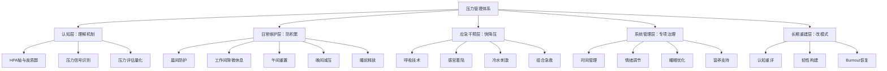
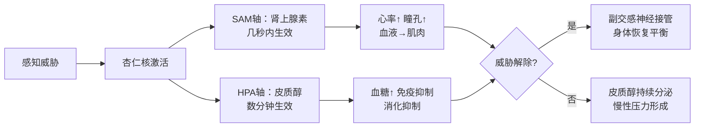
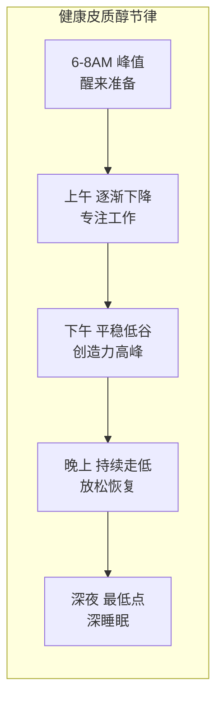
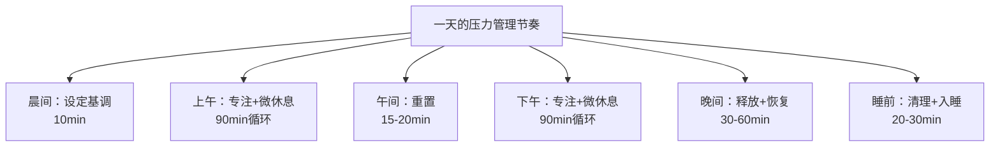
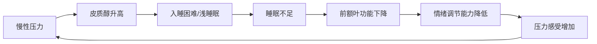
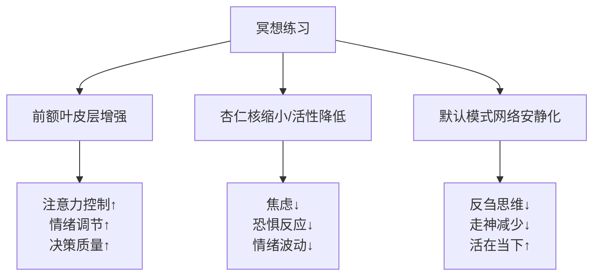
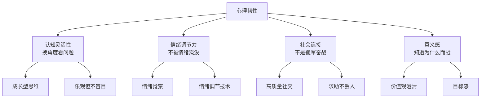
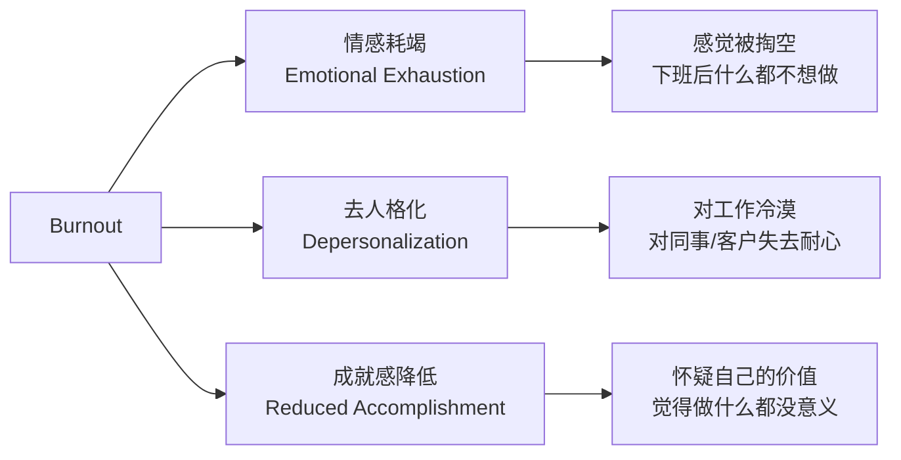

## 五、压力管理方案

压力本身不是敌人。适度的压力让人专注、高效、充满动力——心理学上称之为"良性压力"（eustress）。真正摧毁健康的是长期、无间断、无法缓解的慢性压力。当皮质醇长期处于高位，免疫系统、心血管系统、消化系统、认知功能都会遭到系统性损害。

本章提供的不是"感觉好一点"的小贴士，而是一套从生理机制到日常实操的完整压力管理体系。它覆盖五个层面：

1. **认知层**：理解压力的生理机制，学会自我监测
2. **日常维护层**：不让压力积累的日常习惯
3. **应急干预层**：压力爆发时的快速降压工具
4. **系统管理层**：工作、情绪、睡眠的专项压力管理
5. **长期重建层**：改变压力反应模式，构建心理韧性

### 5.1 理解压力：你的身体在做什么

#### 5.1.1 压力反应的生理机制

当大脑感知到威胁时，会同时启动两条压力通路：

**快速通路（交感-肾上腺髓质轴，SAM轴）**：杏仁核直接向下丘脑发送信号，几秒内触发"战斗或逃跑"反应——肾上腺素飙升、心率加快、瞳孔放大、血液涌向肌肉。这是人类面对猛虎时能拔腿就跑的原因。

**慢速通路（下丘脑-垂体-肾上腺轴，HPA轴）**：压力信号经下丘脑→垂体→肾上腺逐级传递，最终释放皮质醇。皮质醇的作用更持久，负责维持身体的高度警觉状态。

短期反应是生存优势：血糖升高提供能量，心率加快输送氧气，注意力集中。但如果威胁信号一直不消失——比如持续的工作压力、经济焦虑、人际冲突——皮质醇就一直分泌，身体始终处于"战斗或逃跑"模式。问题是，人体的设计初衷是应对短暂的物理威胁（猛虎追你30秒就结束了），而不是持续数月的心理压力（房贷要还30年）。HPA轴没有"关闭"的机制，因为它不知道威胁已经不是物理层面的了。

#### 5.1.2 慢性压力对身体的具体损害

| 系统 | 影响机制 | 具体表现 | 长期后果 |
|------|----------|----------|----------|
| 免疫系统 | 皮质醇抑制淋巴细胞活性，促炎因子失控 | 频繁感冒、伤口愈合慢、炎症反应失调 | 自身免疫病风险增加、癌症监视功能下降 |
| 心血管系统 | 持续高血压+血管收缩+内皮损伤 | 血压升高、心悸、胸闷 | 动脉硬化加速、心脏病风险增加40% |
| 消化系统 | 血液从消化道转移到肌肉，肠道菌群失调 | 胃酸过多、肠易激综合征、便秘或腹泻交替 | 消化性溃疡、慢性胃炎 |
| 大脑 | 海马体神经元萎缩，前额叶功能下降 | 记忆力下降、注意力分散、决策能力减弱 | 海马体体积缩小14%（哈佛医学院数据） |
| 内分泌 | 胰岛素抵抗增加，甲状腺功能受抑制 | 腹部脂肪堆积、血糖不稳定、疲劳 | 2型糖尿病风险增加、代谢综合征 |
| 睡眠 | 皮质醇节律紊乱，褪黑素分泌受阻 | 入睡困难、早醒、多梦、睡眠质量差 | 慢性失眠、睡眠债务累积 |
| 皮肤 | 皮质醇促进皮脂分泌，炎症因子释放 | 痤疮加重、湿疹复发、脱发 | 慢性皮肤炎症、早衰 |
| 生殖系统 | 性激素合成被皮质醇"挤占" | 性欲下降、月经紊乱、精子质量降低 | 生育能力下降 |

**关键数据**：哈佛医学院的研究显示，长期处于高压状态的人，海马体体积平均缩小约14%。《柳叶刀》2017年发表的大型研究（涉及近100万人）发现，工作压力使心血管疾病风险增加23%-45%。这不是"心理作用"，是物理层面的身体损伤。

#### 5.1.3 压力信号的自我监测

学会识别身体发出的早期信号，远比等到崩溃再处理有效得多。把压力信号分成四个维度来观察：

**身体信号**：头痛（尤其是太阳穴和后脑勺）、肩颈僵硬、下巴紧咬（很多人白天磨牙而不自知）、胃部不适、频繁生病、疲劳感（睡够了还是累）、心悸、手心出汗、食欲突变。

**情绪信号**：容易发火（以前觉得无所谓的事现在让人烦）、莫名想哭或情绪低落、持续焦虑感、对原本喜欢的事失去兴趣、感觉"一切都无所谓"、莫名的恐惧感、情绪波动剧烈。

**认知信号**：注意力像打滑一样抓不住、做决定变得特别难（中午吃什么都要纠结半天）、记忆力明显下降、思维反刍（同一件事反复想）、消极思维自动涌现、创造力下降。

**行为信号**：食欲突变（暴食或吃不下）、睡眠问题、社交退缩（不想见人）、拖延加重、靠酒精或药物放松、坐立不安、无意识的小动作增多（抖腿、咬指甲、撕皮）。

**快速自测工具——压力温度计**：

每天结束时花30秒给自己打分：

| 分数 | 状态描述 | 行动建议 |
|------|----------|----------|
| 1-2分 | 轻松自在，精力充沛 | 保持当前节奏，可以适当增加挑战 |
| 3-4分 | 有些紧张但可控，效率还不错 | 正常状态，注意保持日常减压习惯 |
| 5-6分 | 明显感到压力，有些疲惫 | 启动微休息和减压仪式，减少非必要任务 |
| 7-8分 | 高度紧张，身体出现信号 | 启动应急减压方案，重新评估任务优先级 |
| 9-10分 | 接近崩溃，身心俱疲 | 立即停止工作，寻求支持，考虑专业帮助 |

如果连续三天分数≥6分，说明压力已经进入了需要主动干预的阶段。如果连续一周≥8分，建议寻求专业帮助。

#### 5.1.4 皮质醇节律与压力的时间特征

理解皮质醇的自然节律，是科学管理压力的基础。健康的皮质醇分泌遵循"晨高夜低"的模式：

**皮质醇紊乱的信号**：早上醒来很累不想起床（晨间峰值缺失）、下午3-4点极度困倦（节律失衡）、晚上反而精神亢奋（晚间皮质醇反弹）、半夜2-3点醒来（凌晨皮质醇异常飙升）。

如果你怀疑自己的皮质醇节律已经紊乱，最简单的方法是：记录一周内每个小时的精力和情绪状态。如果模式明显偏离"晨高夜低"，说明压力管理需要从调整作息节律入手。

### 5.2 日常压力管理：构建你的抗压基线

日常压力管理的核心不是"消除压力"，而是建立一个足够高的抗压基线，让你能承受日常波动而不被击垮。这就像健身——不是为了某次比赛，而是为了日常的体能储备。

#### 5.2.1 晨间压力防护（10分钟）

早晨醒来后的前15分钟对整天的压力水平有定调作用。醒来后立即看手机，等于把全世界的问题在你还没完全清醒时就灌进大脑——工作消息、新闻、社交媒体的比较心理，瞬间把皮质醇拉到高位。

**神经科学依据**：刚醒来时，前额叶皮层（负责理性决策和情绪调节的脑区）还没有完全"上线"，而杏仁核（负责恐惧和威胁检测）已经活跃。这意味着你对负面信息的敏感度在早晨是最高的——一条坏消息在早上8点对情绪的冲击，比在下午3点大得多。

**具体流程**：

1. **醒来后先不碰手机**（2分钟）。给自己两分钟，感受一下身体的状态——有没有哪里紧绷，昨晚睡得怎么样。这不是冥想，只是觉察。把手机放在够不到的地方（迫使你起身关闹钟），而不是枕头旁边。

2. **做5分钟深呼吸或冥想**。初学者用最简单的方式：坐在床边，闭眼，注意力放在呼吸上。不用控制呼吸，只是观察。思绪飘走很正常，发现自己走神了就温和地拉回来。每次"拉回来"就是一次注意力肌肉的训练。

3. **设定今天的意图**（1分钟）。不是列待办清单，而是一个简短的心理锚点："今天我要在会议中保持冷静"，或者"今天我要按时吃午饭"，或者"今天我要对同事多一点耐心"。一个就够。意图和目标的区别：目标是"做到什么"，意图是"以什么状态去做"。

4. **快速感恩扫描**（2分钟）。想三件值得感恩的事——可以很小（昨晚睡得不错、今天天气好、咖啡很好喝）。神经科学依据：感恩能激活前额叶皮层的多巴胺回路，直接对冲焦虑情绪。加州大学戴维斯分校的Robert Emmons教授研究发现，连续10周记录感恩事项的人，比对照组乐观程度高25%、身体不适症状少、运动时间多33%。

#### 5.2.2 工作间隙微休息（每90分钟，5-10分钟）

人体的专注力周期大约是90分钟——这叫"亚昼夜节律"（ultradian rhythm）。连续工作超过90分钟不休息，效率会断崖式下降，压力激素开始积累。

每90分钟做一次"微休息"：

- **离开工作区域**，物理上换个位置。哪怕只是走到窗边或走廊。环境切换能让大脑的注意力网络短暂"重启"。
- **做3-5次4-7-8呼吸**（吸气4秒，屏息7秒，呼气8秒）。这个呼吸模式能直接激活副交感神经，相当于给身体发一个"现在安全了"的信号。
- **站起来做几个简单的拉伸**：转头、耸肩、伸展手臂、扭转腰部。重点放松肩颈——长时间伏案的人这里几乎永远是紧的。具体动作：颈部左右侧倾（每侧保持15秒）、双肩向后画圈（10次）、双手交叉向上伸展（保持20秒）、坐姿扭转（每侧15秒）。
- **喝一杯水**。很多人忙起来会忘记喝水，而脱水本身就会增加皮质醇分泌。轻度脱水（体重下降1-2%）就足以影响情绪和认知能力。
- **看看远处的绿色植物或窗外**。日本的研究表明，仅仅是注视绿色植物2分钟就能显著降低皮质醇水平（这叫"森林浴"的微缩版）。如果没有绿植，看窗外的天空和远处的建筑也有类似效果。

**时间间隔选择**：如果你容易忘记休息，设一个90分钟的定时器。不推荐用"番茄钟"的25分钟间隔——对于需要深度思考的工作，25分钟太短，频繁中断反而增加压力（每次被打断后需要约23分钟才能重新进入深度专注状态，这是加州大学欧文分校Gloria Mark教授的研究结论）。番茄钟更适合重复性、机械性的任务。

#### 5.2.3 午间重置（15-20分钟）

午间不是"吃完饭继续干"，而是一个天然的重置窗口。大多数人把午餐当成"补充燃料"的过程，忽略了它作为"压力缓冲区"的价值。

**最有效的午间减压组合**：离开工作环境 + 轻度身体活动 + 正念进食。

- **饭后散步10分钟**。不需要快走，就是走一走。这个简单的动作能把血糖峰值降低约30%（2016年《Diabetologia》期刊的研究数据），而血糖剧烈波动本身就会引发焦虑感。散步时尽量不看手机，把注意力放在脚步和呼吸上——这本身就是一种行走冥想。

- **正念进食**。不是要你坐禅吃饭，只是把注意力放在食物上——什么味道、什么口感、嚼了几下。大多数人午餐是边看手机边塞进去的，这种"无意识进食"本身就是一种压力源（大脑在处理信息的同时被迫处理进食信号，两头都做不好）。具体做法：吃前三口放下手机，认真感受食物；之后可以适度看手机，但每一口食物都先咀嚼完再看屏幕。

- **午睡15-20分钟**（条件允许时）。超过30分钟会进入深睡眠，醒来后反而更困（睡眠惯性）。NASA的研究发现，飞行员午睡26分钟后警觉性提高54%，表现提高34%。午睡的最佳时间是下午1-3点，与人体自然的"午后低谷"同步。如果没有条件躺下，闭眼靠在椅子上休息10分钟也有效果——关键是让大脑从"外部聚焦"模式切换到"内部整理"模式。

- **社交微连接**。和同事聊几分钟与工作无关的话题——天气、昨晚的电视剧、午餐好不好吃。这种轻松的社交互动能促进催产素分泌，而催产素是皮质醇的天然拮抗剂。

#### 5.2.4 晚间减压仪式（30-60分钟）

晚间减压的核心目标是把白天累积的压力激素降下来，为高质量的睡眠做准备。

**运动（首选）**：30分钟中等强度运动（快走、慢跑、游泳、骑车）能让皮质醇在运动后1-2小时内下降到低于运动前的水平。运动还能促进内啡肽和脑源性神经营养因子（BDNF）的分泌，后者能修复慢性压力对海马体的损伤。运动时间安排在下午4-8点最佳——太晚（睡前2小时内）会让交感神经兴奋影响入睡。

**社交连接**：和家人或朋友面对面聊天。不是讨论工作，不是刷手机，而是真正的对话。催产素（"拥抱激素"）在安全的社交互动中大量分泌，它能直接拮抗皮质醇。高质量社交的标志：双方都在说话、有眼神接触、话题是双方都感兴趣的。低质量的社交（各看各的手机、被迫的应酬）反而会增加压力。

**兴趣爱好**：任何能让你进入"心流"状态的活动——画画、弹琴、做饭、拼乐高、打理植物、木工、编织。心流状态的特点是注意力完全沉浸在当下，大脑的默认模式网络（负责焦虑和反刍的区域）被抑制。关键是选择"有一定挑战但不至于太难"的活动——太简单会无聊，太困难会焦虑，恰好在能力边缘的挑战最容易触发心流。

**温水泡澡**：38-40°C的温水泡15-20分钟。体温先升高后下降的过程模拟了自然入睡的体温变化规律，能帮助你更快入睡。一项2019年的荟萃分析（涉及5322名参与者）发现，睡前1-2小时洗热水澡能平均缩短入睡时间10分钟。没有浴缸的话，热水泡脚（40°C，15分钟）也有类似效果——虽然效果弱一些，但依然能显著改善末梢血液循环和放松程度。

#### 5.2.5 睡前压力释放（20-30分钟）

睡前是压力管理的最后一个关口。如果带着焦虑入睡，大脑会在睡眠中继续处理压力事件，导致浅睡眠增多、深睡眠减少，第二天起来更累——这就是为什么高压时期"睡了很久还是累"的原因。

**具体流程**：

1. **睡前1小时停用电子设备**。屏幕蓝光抑制褪黑素分泌是原因之一，但更关键的是手机内容本身——工作消息、新闻、社交媒体——会激活大脑的警觉系统。如果实在无法完全停用，至少做到：不用手机看新闻和工作消息、把屏幕调到最暗并开启夜间模式、把手机放在卧室外面充电。

2. **渐进式肌肉放松（PMR）**。这是20世纪30年代由Edmund Jacobson开发的技术，经受了近100年的科学验证。方法：从脚趾开始，用力紧绷肌肉5-7秒，然后完全放松20-30秒，感受紧绷和放松的对比。依次向上：小腿→大腿→腹部→胸部→手臂→肩膀→面部。全程15分钟，做完后全身会有明显的松弛感。紧张→放松的对比是关键——没有经历过紧张，你的大脑就无法真正识别"放松"是什么感觉。

3. **写"担忧日记"或感恩日志**。如果脑子里翻来覆去想着明天的事，写下来。把想法从大脑"外包"到纸上，心理学上叫"认知卸载"（cognitive offloading），它能有效减少入睡前的反刍思维。具体做法：拿一张纸，左边写"明天要做的事"（让大脑知道"已经记下来了，不需要反复提醒"），右边写"三件今天值得感恩的事"。感恩日志则把注意力从"还没解决的问题"转移到"已经拥有的东西"。

4. **5分钟的4-7-8呼吸或身体扫描冥想**。到这一步，身体应该已经比较放松了，呼吸练习帮助你把最后一层残余的紧张也释放掉。躺在床上做即可，很多人做到第二轮就睡着了。

### 5.3 高压期应急方案

日常维护能应对一般的工作生活压力，但总有压力突然飙升的时刻——重大deadline、突发危机、人际冲突、生活变故。这时候你需要的不是"好好休息"这种正确的废话，而是能在5分钟内把皮质醇降下来的应急工具。

#### 5.3.1 呼吸技术全谱

呼吸是唯一一个你可以主动控制的自主神经系统接口。通过改变呼吸的频率、深度和节奏，你可以直接"告诉"你的神经系统切换模式。以下是五种呼吸技术，从温和到强烈，适用于不同程度的压力状态：

**① 腹式呼吸（最基础，适合日常使用）**

一只手放在胸口，一只手放在腹部。吸气时腹部鼓起（胸口不动），呼气时腹部收回。吸气4秒，呼气6秒。重复5-10次。

原理：腹式呼吸激活膈肌运动，直接刺激迷走神经（副交感神经的主要通路），降低心率和血压。大多数人平时的呼吸是浅而快的胸式呼吸，这本身就是一种"慢性应激信号"。

**② 4-7-8呼吸法（中等强度，适合焦虑和失眠）**

这是Andrew Weil医生基于瑜伽调息法改良的技术，核心机制是延长呼气时间来刺激迷走神经，激活副交感神经系统。

操作步骤：
1. 用鼻子吸气4秒（心里默数）
2. 屏住呼吸7秒
3. 用嘴缓慢呼气8秒（呼气时发出"呼"的声音）
4. 这是一轮，重复3-4轮

前两次可能感觉有点刻意，到第三轮开始，你会明显感觉到心跳放缓、肩膀下沉。这不是心理暗示——迷走神经激活确实能让心率在30秒内下降10-15%。

**③ 方块呼吸法（适合需要保持专注时）**

吸气4秒→屏息4秒→呼气4秒→屏息4秒，如此循环。这是美国海军海豹突击队使用的呼吸技术，优点是在平静神经系统的同时不会让你太放松（因为有两次屏息），适合在需要冷静但又要保持警觉的场合使用——比如面试前、谈判中、开车遇到紧急情况后。

**④ 生理叹息法（最快见效，2轮即有效）**

斯坦福大学Andrew Huberman教授团队2023年发表在《Cell Reports Medicine》上的研究证实，这是所有呼吸技术中降低压力最快的方法。操作：快速连续吸两次气（第二次把肺吸满）→缓慢长呼气。重复1-5轮。双吸气能最大化肺泡扩张，增加氧气交换面积，同时长呼气激活副交感神经。

**⑤ 火呼吸（快速激活，适合需要提振精神时）**

快速用鼻子短促呼气（像吹鼻子一样），每秒1-2次，持续15-30秒。这是高温瑜伽中的经典呼吸法，能快速提升肾上腺素和能量水平。注意：有高血压或心血管疾病的人避免使用。这个技术适合在极度困倦但需要保持清醒时使用（比如长途驾驶），但不要在已经焦虑时使用——它会加剧焦虑。

**适用场景速查**：

| 场景 | 推荐技术 | 轮数 | 生效时间 |
|------|----------|------|----------|
| 日常放松 | 腹式呼吸 | 5-10轮 | 1-2分钟 |
| 焦虑/失眠 | 4-7-8呼吸 | 3-4轮 | 2-3分钟 |
| 面试/谈判前 | 方块呼吸 | 5-8轮 | 1-2分钟 |
| 急性压力 | 生理叹息法 | 2-5轮 | 30秒 |
| 困倦提神 | 火呼吸 | 15-30秒 | 10秒 |
| 愤怒即将爆发 | 4-7-8呼吸 | 3轮 | 1分钟 |

#### 5.3.2 5-4-3-2-1感官着陆技术

这是一个认知行为疗法（CBT）中的接地技术，原理是把注意力从内部焦虑思维强制拉回到外部感官体验。当大脑忙着处理五感信息时，焦虑回路会被暂时"打断"——因为大脑的注意力资源是有限的，它不能同时处理焦虑思维和详细的感官信息。

**操作步骤**：

- **看到5样东西**：环顾四周，说出（或默念）你看到的5样东西，越具体越好——"白色的墙壁上有一条细细的裂缝"比"墙"有效得多。描述细节的过程迫使视觉皮层高度活跃，挤压焦虑回路的带宽。
- **触摸4样东西**：用手感受4个物体的质地——桌面是光滑的还是粗糙的？衣服的面料是什么感觉？手指按在皮肤上是什么温度？触觉信号直接传入体感皮层，与焦虑回路竞争注意力资源。
- **听到3种声音**：仔细听，找出3种声音——空调嗡嗡声、远处的车声、自己呼吸的声音。
- **闻到2种气味**：深吸气，辨认空气中的气味——咖啡、洗衣液、或者只是"房间的味道"。
- **尝到1种味道**：感受口腔里的味道——刚喝过的水、牙膏的余味、嘴唇上的润唇膏。

这个技术对急性焦虑发作和恐慌发作特别有效。很多人反馈做到"触摸4样东西"的时候就已经明显感觉好多了。

**变体——进阶感官着陆**：如果基本版对你来说太简单了，可以尝试"五感深度版"——每个感官花更多时间深入探索。比如"看到"不只说5样东西，而是选1样东西仔细观察30秒：它的颜色有几种层次？有没有反光？表面有没有纹理？这种方法对严重的恐慌发作更有效，因为它需要更多的认知资源。

#### 5.3.3 冷水刺激法

这是生理学上最快的自主神经系统"重启"方式。冷水触发"潜水反射"（mammalian dive reflex），心率在几秒内下降10-20%，血压下降，副交感神经被强力激活。这是所有哺乳动物共有的生存机制——当脸部接触冷水时，身体自动切换到"节能模式"以延长水下存活时间。

**三种操作方式**（从温和到强烈）：

1. **冷水冲手腕**：用冷水冲洗手腕内侧30秒。手腕有密集的血管网（桡动脉和尺动脉），降温效果快，且操作最方便——办公室洗手间就能做。
2. **冷水洗脸**：用冷水泼脸，尤其是眼眶周围区域（三叉神经分布区）。效果比冲手腕更强，因为三叉神经直接连接脑干的迷走神经核。
3. **握冰块**：手心握一块冰，注意力集中在冰的冰冷感上。这同时结合了感官着陆的原理——当你的注意力完全被强烈的感官刺激占据时，焦虑回路自然被抑制。
4. **冰袋敷颈后**：用冰袋或冷毛巾敷在后颈部15-30秒。颈部有丰富的血管和迷走神经分支，降温效果最强，但也是最不舒服的方式——适合焦虑程度很高（8分以上）的紧急情况。

**适用场景**：愤怒快要失控时、恐慌发作时、需要立刻冷静下来做出理性决策时。

**注意事项**：避免在心脏不适时使用强烈的冷水刺激（冰袋敷颈后、冰水浸泡），因为突然的冷刺激可能导致心率剧烈变化。有雷诺综合征（手指遇冷变白变紫）的人避免握冰块。

#### 5.3.4 急救减压技术组合

面对真正高压的时刻，可以组合使用以上技术。以下是经过验证的组合方案：

**5分钟急救方案**：
1. 先用冷水刺激（30秒）→ 把生理反应拉下来
2. 再用4-7-8呼吸或生理叹息法（2分钟）→ 稳定自主神经
3. 最后5-4-3-2-1感官着陆（3分钟）→ 把注意力从焦虑思维中拉出来

**3分钟快速方案**（不方便做完整流程时）：
1. 生理叹息法×3轮（30秒）
2. 方块呼吸×5轮（1.5分钟）
3. 双脚踩地感受地面、握拳再松开×5次（1分钟）

**1分钟极简方案**（会议间隙、课堂上）：
1. 生理叹息法×2轮（20秒）
2. 用力握拳5秒→完全松开10秒→重复2次（30秒）
3. 看窗外远处5秒→看手边物体5秒→重复2次（10秒）

这个组合覆盖了生理、神经、认知三个层面。在面试、重要演讲、冲突后冷静等场景中反复验证过有效。

#### 5.3.5 急性压力应对的"STOP"技术

当压力突然爆发、情绪即将失控时，用STOP四个字母提醒自己：

- **S（Stop）**：停下来。不管你在做什么，暂停。不要在情绪高峰时做任何决定或发任何消息。
- **T（Take a breath）**：做3次深呼吸。不需要特定的呼吸法，就是缓慢地深吸深呼。
- **O（Observe）**：观察自己的身体（哪里紧绷？）、情绪（现在主要是什么感觉？）、想法（脑子里在说什么？）。不做判断，只是观察。
- **P（Proceed）**：带着觉察继续。现在你可以选择怎么做，而不是被情绪推着走。

STOP技术的核心价值在于"打断自动反应链"——大多数让我们后悔的冲动行为（说了不该说的话、发了不该发的消息、做了不该做的决定），都是在情绪和行动之间缺少了这个"暂停"环节。

### 5.4 工作压力管理系统

工作是大多数人最大的压力来源，但它也是最可控的——因为工作压力大部分来自于流程和方法问题，而非不可改变的外部事件。

#### 5.4.1 时间管理：减少"赶deadline"的压力

**艾森豪威尔矩阵**（不是简单的"重要-紧急"，而是怎么用它）：

| | 紧急 | 不紧急 |
|---|---|---|
| **重要** | 立刻做。但每天不超过3件。 | 计划做。这是真正决定你职业发展的象限。 |
| **不重要** | 委托做。实在不能委托，用最少时间处理。 | 取消做。大多数浪费时间的活动都在这个象限。 |

大多数人把80%的时间花在"紧急"的事上（不管重不重要），只有不到10%的时间花在"重要但不紧急"的事上。这导致你永远在灭火，没有时间做真正重要的事，然后那些重要的事变成紧急的事——恶性循环。

**破解方法**：每天早上先花10分钟把今天的任务放进四个象限。至少保证1小时（最好2小时）花在"重要不紧急"的事情上。这段时间不要开消息通知。"重要不紧急"的事情包括：学习新技能、建立人脉、规划职业方向、维护健康、处理长期项目——这些事情永远不会有"紧急"的标签，但它们决定了你半年后、一年后的位置。

**时间块管理**：把一天分成若干个"时间块"，每个时间块只做一类事情。比如：

| 时间块 | 活动类型 | 注意事项 |
|--------|----------|----------|
| 8:00-10:00 | 深度工作 | 不开消息、不开会议、关门或戴耳机 |
| 10:00-10:30 | 处理消息和邮件 | 集中处理，不要逐条回复 |
| 10:30-12:00 | 会议和协作 | 尽量把会议集中在这个时间段 |
| 12:00-13:30 | 午餐+休息 | 离开工位，参考5.2.3的午间重置方案 |
| 13:30-15:30 | 深度工作 | 第二个深度工作时间段 |
| 15:30-16:00 | 处理消息和邮件 | 第二次集中处理 |
| 16:00-17:30 | 杂事和收尾 | 处理低优先级任务、整理桌面、规划明天 |

深度工作时间块的价值是碎片时间的10倍以上。Cal Newport在《Deep Work》中引用的研究表明，频繁切换任务会让人暂时性智商下降10-15分——相当于一夜没睡。

**"两分钟法则"**：如果一件事能在两分钟内完成，立刻做掉，不要放进待办清单。待办清单上堆满小事会持续消耗你的认知资源（心理学上叫"蔡格尼克效应"——未完成的任务会在大脑中不断占用注意力）。

#### 5.4.2 学会说"不"

很多人压力过载的根源不是能力不足，而是不会拒绝。每一次答应一个不重要的请求，你都在用自己有限的时间和精力补贴别人。

**说"不"的心理障碍**及应对：
- **"拒绝了别人会不喜欢我"**：真正尊重你的人会尊重你的边界。那些因为你一次拒绝就翻脸的人，本来就只在利用你。
- **"这次帮一下也不费什么时间"**：每一次"不费什么时间"的叠加，就是你没有时间做真正重要的事的原因。
- **"不好意思开口"**：说"不"的难度和你说"是"之后的痛苦，哪个更大？拒绝时的30秒尴尬，远好过接下来几天的焦虑和加班。

**说"不"的实操话术**（从温和到直接）：

- **延迟回应**："让我看看日程，稍后回复你。"（给自己思考的时间，避免冲动答应）
- **提供替代方案**："这个时间我排不开，下周二可以吗？"
- **明确边界**："这个不在我的职责范围内，你可以找XX看看。"
- **直接拒绝**："最近工作量已经满了，这次帮不了，抱歉。"
- **条件式接受**："我可以帮你，但需要你先帮我确认XX。"（把额外要求变成有对价的交易）

说"不"不是自私——它是对你已经承诺的那些事情负责。如果你什么都答应，什么都做不好，反而对所有人都不负责任。

#### 5.4.3 工作环境的减压设计

工作环境对压力的影响被严重低估了。

**物理环境**：
- 桌面保持整洁——视觉杂乱会增加认知负荷（普林斯顿大学神经科学研究所发现，视觉环境中的杂物越多，注意力集中能力越差）
- 调整显示器高度——屏幕顶部与视线平齐或略低，减少颈椎压力
- 确保光线充足——光线不足会加重疲劳感，自然光最佳，没有自然光就用4000-5000K色温的台灯
- 放一株绿植——多项研究证实办公室绿植能降低压力水平和提高工作效率（荷兰的研究发现，办公桌上有植物的人生产力提高15%）
- 控制噪音——如果办公室嘈杂，降噪耳机是值得的投资；白噪音或自然环境音（雨声、溪流声）能有效掩盖干扰噪音

**信息环境**：
- 关闭非必要通知——只保留真正紧急的渠道（比如老板的电话）
- 每天固定2-3个时间点集中处理邮件和消息（而不是每来一条就看一次）
- 使用网站屏蔽工具在深度工作时拦截社交媒体（推荐：Cold Turkey、Freedom、Forest）
- 手机开勿静音模式时放在视线之外——仅仅是手机"存在"于视野中，就会占用一部分认知资源（德克萨斯大学的研究证实了这个"脑力流失"效应）

**人际环境**：
- 识别工作中的"压力传染者"——那些总在抱怨、散播焦虑、把简单事情复杂化的人。不是要你和他们断绝关系，而是在你自己的压力已经较高时，主动减少与他们的互动。
- 找到你的"减压盟友"——那些能让你放松、笑一笑、给你正向能量的同事。压力管理不是孤军奋战，有一个好的社交支持网络，抗压能力能提高40%以上。

#### 5.4.4 职场人际关系减压

职场中的人际冲突和沟通不畅是压力的重要来源，而且往往比工作本身更消耗人。

**向上管理**：主动和上级同步工作进展和困难，而不是等他来追问。大多数领导的压力来自"不确定感"——不知道下属在做什么、做得怎么样。你主动汇报，他的焦虑减少，施加给你的压力也会减少。具体做法：每周五花10分钟写一封简短的周报（本周完成了什么、下周计划做什么、遇到什么阻碍），发给上级。这个简单的动作能减少80%的"催进度"式沟通。

**同级协作**：明确职责边界，用书面方式确认分工。很多工作压力来自于"灰色地带"——两个人都觉得某件事该对方做，最后要么都没做，要么做了的人心生怨恨。在项目开始时花10分钟把分工写清楚，能避免后续数小时的扯皮和内耗。

**设定边界**：明确工作时间和非工作时间。下班后的消息可以不立刻回复（除非是真正的紧急情况）。这需要和团队提前沟通，达成共识。很多人觉得这很难开口，但大多数管理者其实能接受——他们只是默认你能接受，因为你从未说过不能。具体的沟通方式："我下班后会把手机调成静音，如果有紧急情况可以直接打电话，其他消息我会在第二天早上回复。"

**冲突处理**：遇到人际冲突，用"事实-感受-需求"的框架沟通——"你昨天会议上否定了我的方案（事实），这让我觉得自己的工作不被尊重（感受），我希望下次你有不同的看法时能先私下讨论（需求）。"这种方式比指责或忍气吞声都有效得多。这个框架来自"非暴力沟通"（NVC，Nonviolent Communication），由Marshall Rosenberg博士开发。

**向上冲突的处理**：和上级发生冲突是最棘手的。原则是：私下沟通、对事不对人、提供解决方案而非只提问题。"我理解你对这个方案有顾虑（共情），我觉得主要分歧在XX这一点（聚焦），我有两个备选方案你看看哪个更合适（提供选项）。"

### 5.5 睡眠与压力的双向管理

睡眠和压力是双向关系——压力导致失眠，失眠又加重压力。打破这个恶性循环是压力管理中最关键的环节之一。

#### 5.5.1 睡眠-压力恶性循环的机制

这个循环的破坏力在于：每一轮循环都会让下一轮更严重。失眠一晚，第二天的压力耐受度下降约30%；连续三天睡眠不足6小时，认知功能下降相当于连续24小时不睡（宾夕法尼亚大学的研究数据）。

#### 5.5.2 睡眠优化的具体方案

**睡眠环境**：
- 温度：18-20°C是最佳睡眠温度（核心体温需要下降1-2°C才能入睡）
- 光线：使用遮光窗帘，确保房间足够暗。如果无法做到完全黑暗，使用眼罩
- 声音：完全安静或使用白噪音机。避免听有歌词的音乐或播客（会激活语言处理区域）
- 床铺：只用床睡觉和性生活，不在床上工作、看手机、吃东西（让大脑建立"床=睡觉"的条件反射）

**睡眠时间管理**：
- 固定起床时间（比固定入睡时间更重要）——即使周末也不偏差超过30分钟
- 建立睡前缓冲带：睡前60-90分钟开始"关机仪式"（参见5.2.5）
- 如果躺下20分钟还没睡着，起床去做一些无聊的事（翻杂志、叠衣服），等到有睡意再回床上——不要在床上翻来覆去，这会让大脑把"床"和"焦虑"关联起来

**白天行为对夜间睡眠的影响**：
- 早上起床后30分钟内晒10分钟阳光（设定生物钟的最佳方式）
- 下午2点后避免咖啡因（咖啡因的半衰期是5-6小时，下午3点喝的一杯咖啡到晚上11点还有25%在体内）
- 睡前3小时避免剧烈运动
- 晚餐不要太饱太晚（胃部消化活动会干扰入睡）

#### 5.5.3 失眠的认知行为疗法（CBT-I）

CBT-I是治疗失眠的一线推荐方案（不是安眠药），效果持久且无副作用。核心策略：

1. **睡眠限制**：如果你经常8小时只睡着6小时，就把卧床时间限制为6小时。这会增加"睡眠驱力"，让你更快入睡、睡得更深。当睡眠效率（睡着时间/卧床时间）达到85%以上后，再逐渐增加15分钟卧床时间。

2. **刺激控制**：建立"床=睡觉"的强条件反射。规则：困了才上床、20分钟睡不着就起来、不在床上做任何与睡眠无关的事、每天固定时间起床。

3. **认知重构**：挑战关于睡眠的错误信念。比如"我必须睡够8小时"（实际上7-9小时都是正常范围）、"今晚睡不好明天就完蛋了"（实际上偶尔一晚少睡的影响远没有你想象的大）、"我需要安眠药才能睡着"（实际上认知行为疗法对大多数失眠的疗效优于药物且更持久）。

### 5.6 营养与压力：吃对了，压力少一半

食物直接影响你的神经递质和激素水平，进而影响压力感受。大多数人忽略了饮食在压力管理中的作用，但它可能比你想象的重要得多。

#### 5.6.1 加重压力的饮食模式

- **高糖饮食**：血糖剧烈波动直接触发焦虑感和情绪不稳定。甜食带来的"血糖飙升→胰岛素大量分泌→血糖暴跌"过程，会让身体误以为处于低血糖的"危险"状态，触发应激反应。
- **过量咖啡因**：咖啡因阻断腺苷受体（腺苷是促进睡眠和放松的神经递质），同时刺激肾上腺素分泌。每天超过400mg（约4杯咖啡）会显著增加焦虑感。更隐蔽的问题是，很多人用咖啡因来"补"睡眠不足，形成"喝咖啡→睡不好→更累→喝更多咖啡"的恶性循环。
- **过量酒精**：酒精虽然短期内有镇静作用，但它会严重干扰REM睡眠（快速眼动睡眠，对情绪处理和记忆巩固至关重要），导致第二天情绪更差、压力更大。
- **高度加工食品**：含有大量反式脂肪、人工添加剂和防腐剂的食品会促进全身性炎症，而炎症与焦虑和抑郁有直接关联。

#### 5.6.2 减压饮食方案

**关键营养素及其食物来源**：

| 营养素 | 作用机制 | 最佳食物来源 | 每日推荐量 |
|--------|----------|--------------|------------|
| 镁 | 调节GABA受体（大脑的"刹车系统"），放松肌肉 | 深绿叶菜、坚果、黑巧克力、牛油果 | 310-420mg |
| Omega-3脂肪酸 | 抗炎，调节神经递质功能 | 深海鱼（三文鱼、沙丁鱼）、亚麻籽、核桃 | EPA+DHA 1000-2000mg |
| B族维生素 | 参与血清素和多巴胺合成 | 全谷物、瘦肉、鸡蛋、豆类、深绿叶菜 | 复合B族维生素 |
| 维生素D | 调节情绪相关基因表达 | 阳光、深海鱼、蛋黄、强化食品 | 1000-2000IU（冬季或日照不足时补充） |
| 色氨酸 | 血清素的前体（血清素→褪黑素） | 火鸡肉、牛奶、香蕉、坚果 | 通过均衡饮食获取 |
| 益生菌 | 肠道-脑轴调节，产生神经递质 | 酸奶、泡菜、纳豆、味噌 | 每天一份发酵食品 |

**肠-脑轴与压力**：肠道被称为"第二大脑"，拥有约5亿个神经元，产生的血清素占全身总量的90%。肠道菌群失衡会通过迷走神经直接向大脑发送"压力信号"。维持肠道健康的具体做法：每天摄入一份发酵食品（酸奶、泡菜、纳豆）、多吃膳食纤维（全谷物、蔬菜、水果——膳食纤维是有益菌的"食物"）、减少超加工食品。

**减压饮食模板**：

- **早餐**：燕麦+蓝莓+核桃+一勺亚麻籽粉（复合碳水+Omega-3+抗氧化）
- **午餐**：糙米+三文鱼/鸡胸肉+大量蔬菜（优质蛋白+复合碳水+B族维生素）
- **下午加餐**：一小把坚果+一个苹果（稳定血糖，防止下午低谷）
- **晚餐**：小米粥/全麦面条+清炒蔬菜+豆腐（色氨酸促进入睡，不过饱）
- **睡前**（可选）：一杯温牛奶+少量蜂蜜（色氨酸+血糖微升促进入睡）

#### 5.6.3 常见补剂的证据等级

| 补剂 | 证据等级 | 机制 | 推荐剂量 | 注意事项 |
|------|----------|------|----------|----------|
| 镁（甘氨酸镁/苏糖酸镁） | ⭐⭐⭐⭐ 强 | 调节GABA，放松神经和肌肉 | 200-400mg/天，睡前服用 | 氧化镁吸收率低且易腹泻，选甘氨酸镁或苏糖酸镁 |
| L-茶氨酸 | ⭐⭐⭐⭐ 强 | 促进α脑波（放松但不困倦），增加GABA | 100-200mg/天 | 可与咖啡因搭配（减少咖啡因的焦虑副作用） |
| 南非醉茄（Ashwagandha） | ⭐⭐⭐ 中等 | 降低皮质醇20-30%（多项RCT支持） | 300-600mg/天（标准化提取物） | 甲状腺功能异常者慎用 |
| 圣约翰草 | ⭐⭐⭐ 中等 | 类似SSRI的作用机制 | 300mg×3次/天 | 不可与SSRI药物同服（血清素综合征风险） |
| Omega-3鱼油 | ⭐⭐⭐ 中等 | 抗炎，调节神经递质 | EPA 1000-2000mg/天 | 选高EPA比例的产品（EPA对情绪的效果优于DHA） |
| B族复合维生素 | ⭐⭐ 弱-中等 | 参与神经递质合成 | 按产品说明 | 高剂量B6可能导致神经毒性 |

**重要提醒**：补剂不能替代良好的饮食、运动和睡眠。它是"锦上添花"而非"雪中送炭"。如果压力症状严重，优先寻求专业帮助，而不是试图用补剂解决。

### 5.7 情绪调节方案

压力和情绪不是一回事，但它们紧密纠缠。长期压力会放大所有负面情绪，而未处理的情绪又会加重压力感。学会调节情绪，相当于给压力管理装上了一个缓冲器。

#### 5.7.1 情绪日记：把模糊的感受变成清晰的信息

大多数人对自己的情绪状态是模糊的——"我觉得不好"、"心情不好"。但"不好"到底是什么？是焦虑？愤怒？失望？悲伤？无力感？不同的情绪指向不同的问题，需要不同的应对方式。

**情绪的核心类型及指向**：
- **焦虑**→指向未来（"可能发生坏事"）→应对：具体化担忧，区分"能控制的"和"不能控制的"
- **愤怒**→指向边界被侵犯（"这不公平/这不应该"）→应对：识别真正的诉求，用健康方式表达
- **悲伤**→指向失去（"我失去了重要的东西"）→应对：允许自己哀悼，寻求支持
- **羞耻**→指向自我（"我不够好"）→应对：区分"我做的事不好"和"我这个人不好"
- **无力感**→指向控制权（"我什么都改变不了"）→应对：找到"哪怕很小但我能控制的事"

**情绪日记模板**（每天5分钟）：

| 项目 | 记录内容 | 示例 |
|------|----------|------|
| 时间 | 什么时候注意到的 | 下午3点 |
| 主情绪 | 用一个词命名 | 焦虑 |
| 触发事件 | 什么事引发了这个情绪 | 收到一个紧急需求 |
| 身体感受 | 情绪在身体哪里 | 胸口发紧、肩膀僵硬 |
| 强度 | 1-10分 | 7分 |
| 想法 | 当时脑子里在想什么 | "做不完怎么办，会被觉得能力不行" |
| 应对方式 | 你怎么处理的 | 出去走了一圈 |
| 效果 | 应对后感觉如何 | 降到4分，能开始工作了 |

坚持2-3周后，你会发现自己的情绪模式——什么情境最容易触发焦虑、什么应对方式最有效、一天中什么时候情绪最低落。有了这些数据，你就能主动预防，而不是每次都被动反应。

#### 5.7.2 认知重评：改变你对事件的看法

认知重评是情绪调节中研究最充分、效果最确定的策略。核心原理：不是事件本身让你产生情绪，而是你对事件的解读。改变解读，情绪就变了。

**实操步骤**：

1. **识别自动想法**。当情绪波动时，问自己："我现在在想什么？"把脑子里的念头原样写下来。比如："这次考试肯定考砸了。"

2. **检验证据**。支持这个想法的证据是什么？反对的证据是什么？"上次模拟考我得了85分"、"这周我复习了三遍重点章节"。

3. **识别认知歪曲**。常见的认知歪曲包括：
   - **灾难化**："这件事一定会变得很糟糕"→替代："最坏的结果是什么？我能应对吗？"
   - **非黑即白**："这次没做好就是彻底失败"→替代："有没有中间地带？部分成功算不算？"
   - **过度概括**："我总是做不好"→替代："'总是'是真的吗？有没有做好过的时候？"
   - **读心术**："他一定觉得我很蠢"→替代："我怎么知道他在想什么？有没有其他可能？"
   - **应该思维**："我应该能处理好所有事"→替代："'应该'是谁规定的？正常人能处理好所有事吗？"

4. **生成替代解读**。"这次考试可能会有困难的题目，但大部分内容我都复习过，结果不一定很差。"

5. **重新评估情绪**。替代解读之后，情绪强度通常会从8分降到5-6分。不需要降到0——能降到可控范围就够了。

这个技术不是"正能量洗脑"或"自我欺骗"。它的核心是用更全面、更准确的视角来看待事情，而不是只看到最坏的可能性。

#### 5.7.3 情绪命名：给情绪贴标签

加州大学洛杉矶分校的Matthew Lieberman做了一个经典实验：当人们给自己的情绪贴上标签（比如"我现在感到焦虑"），杏仁核（大脑的恐惧中心）的活跃度会显著下降。他把这叫"affect labeling"——情绪标签化。

简单的不能再简单：当你感受到强烈情绪时，具体地说出（或写下）"我感到____"。用精确的词——不是"不爽"，而是"被忽视的委屈"、"对不确定性的恐惧"、"不被认可的愤怒"。越精确，效果越好。

**情绪词汇表（进阶版）**：不要停留在"高兴/难过/生气/害怕"这四种基本情绪上。使用更精确的词汇能让你更准确地识别情绪、更有效地应对——

- 焦虑家族：紧张、担忧、不安、恐慌、心神不宁、如坐针毡
- 愤怒家族：恼火、烦躁、怨恨、暴怒、义愤、不忿
- 悲伤家族：失落、沮丧、心痛、绝望、空虚、惆怅
- 恐惧家族：害怕、惊恐、畏惧、忐忑、提心吊胆
- 羞耻家族：尴尬、羞愧、内疚、自责、无地自容

#### 5.7.4 情绪表达：找到出口

压抑情绪不是管理情绪——它只是把炸弹延迟引爆。长期情绪压抑和高血压、免疫功能下降、慢性疼痛都有直接关联。

**健康的表达方式**：

- **写作**：每天写15分钟"自由写作"——不管语法、不管逻辑，脑子里想什么就写什么。James Pennebaker教授的研究发现，连续4天、每天写15分钟创伤或压力经历的人，在随后6个月内免疫功能明显增强、去医院次数减少。写作的核心不是"写得好"，而是"把内在的体验外化"——当模糊的情绪变成具体的文字时，大脑对它的处理方式就从"被动承受"变成了"主动分析"。

- **身体表达**：运动是情绪的天然出口。跑步、拳击、游泳，甚至只是大声唱歌、在没人的地方大喊几声，都能有效释放积压的情绪能量。为什么运动能调节情绪？三个机制：(1)降低皮质醇和肾上腺素；(2)促进内啡肽（天然止痛和愉悦物质）分泌；(3)增加BDNF（修复压力对大脑的损伤）。

- **社交表达**：找一个你信任的人倾诉。不需要他给你解决方案——很多时候，只是"被听到"本身就能让情绪强度降低一半。研究表明，用语言向他人描述情绪经历时，杏仁核的活跃度会下降（和情绪命名的机制类似），前额叶皮层的调节功能会增强。如果找不到倾诉对象，写信给自己、对宠物说话、甚至对着录音机说，都有类似效果。

- **艺术表达**：画画、做手工、写诗、弹乐器。艺术表达的优势在于它不需要"语言"——有些情绪太复杂或太强烈，用语言无法表达，但可以通过颜色、形状、旋律来表达。你不需要有艺术天赋，涂鸦、随便画线条、用黏土捏东西，过程本身就是释放。

### 5.8 冥想练习指南

冥想不是什么神秘的东方智慧，它是一种大脑训练方法。就像举重训练肌肉一样，冥想训练的是注意力和情绪调节能力。哈佛大学Sara Lazar团队的研究发现，坚持8周冥想练习的人，大脑中与学习、记忆、情绪调节相关的区域灰质密度增加了，而与焦虑、压力相关的杏仁核灰质密度减少了。

**冥想的神经科学机制**：

#### 5.8.1 四周入门计划

**第1周：专注呼吸冥想**

每天5分钟。坐在舒适的位置，闭眼，把注意力放在呼吸上。不需要控制呼吸的深度或节奏，只是观察它——空气从鼻孔进入时的凉意，肺部扩张时胸腔的起伏，呼出时的温热。

你一定会走神。这是正常的，不是你"做错了"。发现走神的那一刻，就是冥想的核心训练——你刚刚完成了一次"元认知"（思考自己在思考什么）。温和地把注意力带回呼吸，不要责备自己。每一次"发现走神-拉回来"，你的注意力肌肉就被强化了一次。

**第2周：身体扫描**

每天10分钟。从脚趾开始，依次把注意力移到身体的每个部位——脚趾、脚掌、脚踝、小腿、膝盖、大腿、臀部、腹部、胸部、后背、手臂、双手、肩膀、脖子、面部、头顶。

在每个部位停留20-30秒，注意那里的感觉。紧绷？温热？麻？还是什么感觉都没有？不评判，只是观察。身体扫描能帮你发现很多你一直在承受但从未意识到的紧张——比如你可能从来没注意过自己的下巴一直在紧咬。

**第3周：正念日常活动**

选一个每天都会做的活动——刷牙、吃饭、走路、洗碗——把它变成冥想练习。以正念吃饭为例：注意食物的颜色和形状，闻一下气味，放进嘴里后注意温度和质地，慢慢地咀嚼，感受味道的变化，吞咽时食物经过喉咙的感觉。

你会发现，当你真正把注意力放在食物上时，"吃饱"的感觉会来得更早、更清晰。很多人报告说，正念进食后自然吃得少了，而且更能享受食物。

**第4周：慈心冥想**

每天10分钟。这个练习从自己开始：默念"愿我平安，愿我健康，愿我快乐，愿我自在"。然后把对象扩展到你关心的人、中性的人（比如今天在街上擦肩而过的人）、最后是让你不舒服的人。

慈心冥想的目的是培养善意和共情能力。对那些觉得这很"鸡汤"的人：威斯康星大学的Richard Davidson用fMRI扫描证实，经过慈心冥想训练的人，大脑中与共情和积极情绪相关的区域活跃度显著提高。

#### 5.8.2 进阶方向

4周入门结束后，你可以：

- 逐渐增加时间到20-30分钟。研究表明，每天20分钟是大多数冥想研究的"有效剂量"。
- 尝试不同流派：内观冥想（Vipassana）侧重观察身心变化、禅宗冥想侧重"空"的体验、超觉冥想（TM）使用咒语、正念减压（MBSR）是医学验证的减压冥想体系。
- 参加一次静修（retreat）。哪怕只是一个周末的短期静修，密集练习的体验和日常10分钟是完全不同量级的。
- 把正念融入日常生活的方方面面——正念行走、正念沟通、正念工作。最终目标不是"每天冥想20分钟"，而是"在生活中保持觉察"。

#### 5.8.3 常见误区

**"我脑子里想法太多，做不了冥想"**：想法多是正常的，冥想的目的不是"清空大脑"。你不需要停止想法，只需要不跟着想法跑。想法来了，看到了，放下，回到呼吸。就像看天上的云飘过——你不需要把云赶走。

**"我没时间冥想"**：如果你每天只有3分钟，那就做3分钟。哪怕只是3次深呼吸的暂停，都比不做要好。而且越是觉得"没时间"的人，越需要冥想——因为时间焦虑本身就是压力的表现。

**"我做了一周感觉没效果"**：大脑结构的变化需要至少4-8周才能显现。就像你不会去健身房一周就期待看到腹肌一样，给大脑一点时间。坚持8周后再评估效果。

**"我冥想时反而更焦虑了"**：这不是冥想让你更焦虑，而是冥想让你"注意到了"一直存在的焦虑。就像关掉电视噪音后你才听到了冰箱的嗡嗡声——噪音一直在那里，只是你之前没注意到。如果冥想中的焦虑感太强，可以睁眼做、缩短时间、或者用引导冥想（有声音引导的那种）。

**"必须盘腿坐才算冥想"**：任何舒适的姿势都可以——坐在椅子上、靠在沙发上、甚至躺着（但不要睡着）。姿势不重要，持续练习才重要。

### 5.9 心理韧性构建：从"扛住压力"到"在压力中成长"

压力管理的最高境界不是"不被压力打倒"，而是"在压力中变得更强"——这就是心理韧性（resilience）。

#### 5.9.1 什么是心理韧性

心理韧性不是"忍耐力"或"硬扛"。它是一种动态的能力，包括：
- **恢复力**：被打倒后能站起来
- **适应力**：在变化中调整自己的策略
- **成长力**：从困境中提取教训和力量

美国心理学会（APA）定义心理韧性为"面对逆境、创伤、悲剧、威胁或重大压力源时良好适应的过程"。关键词是"过程"——韧性不是你有没有的固定特质，而是你可以持续培养和强化的能力。

#### 5.9.2 韧性的四大支柱

**支柱一：认知灵活性**

核心是"成长型思维"——相信能力可以通过努力提升，而不是固定不变的。Carol Dweck教授的研究表明，持有成长型思维的人面对失败时倾向于把失败归因为"努力不够"或"方法不对"（可控因素），而不是"我不行"（不可控因素）。这种归因方式让他们更愿意从失败中学习，而不是被失败打垮。

培养方法：每次遇到挫折，问自己三个问题——
1. "这件事里有什么是我可以控制的？"（聚焦可控因素）
2. "如果我的朋友遇到同样的事，我会怎么跟他说？"（用第三人称视角减少情绪干扰）
3. "半年后回头看这件事，我会怎么看？"（时间视角拉远，当下焦虑自然缩小）

**支柱二：情绪调节力**

前面5.5和5.6部分已经详细展开。核心是：觉察→命名→接纳→调节。觉察情绪的存在，给它准确的名字，接受它是正常的人类体验（而不是"不应该有这种感觉"），然后选择合适的策略来调节。

**支柱三：社会连接**

George Vaillant教授主持的哈佛成人发展研究（追踪724人长达85年）得出的最核心结论是：决定人生幸福和健康的最重要因素不是财富、名望或成就，而是亲密关系的质量。

建立社会支持网络的具体方法：
- 维护3-5个"关键关系"——那些你可以在凌晨3点打电话倾诉的人
- 定期投入时间在社交关系上（把社交放进日程表，像对待工作会议一样认真）
- 学会求助——求助不是示弱，而是信任的表达。大多数人其实很乐意帮忙，因为他们帮助别人时也会获得价值感
- 参加社区活动、兴趣小组、志愿者组织——共同的活动是建立连接的最自然方式

**支柱四：意义感**

维克多·弗兰克尔在《活出生命的意义》中写道：知道自己"为什么"而活的人，几乎能忍受任何"怎样"。意义感不是抽象的哲学概念——它可以来自工作（"我的工作对别人有价值"）、关系（"我被需要"）、创造（"我做出了有意义的东西"）、成长（"我变得更好了"）。

找到意义感的练习：
1. 写下你的"墓志铭"——你希望别人怎么记住你？这个问题的答案往往能揭示你真正在乎的是什么。
2. 找到"痛苦的意义"——当你经历困难时，问自己："这个经历教会了我什么？它让我成为了什么样的人？"
3. 每天做一件"超越自我"的事——帮助他人、创造价值、学习新东西。心理学研究反复证明，"为他人做事"比"为自己做事"更能带来持久的幸福感。

#### 5.9.3 创伤后成长（PTG）

不是所有压力都是有害的。心理学家Richard Tedeschi和Lawrence Calhoun提出的"创伤后成长"（Post-Traumatic Growth）概念指出，很多人在经历重大人生困境后，反而在以下五个维度实现了成长：

1. **人际关系**：更珍惜身边的人，关系更深入
2. **新可能性**：发现了新的生活方向或兴趣
3. **个人力量**：发现自己比想象的更坚强
4. **精神层面**：对人生的意义有了更深的理解
5. **对生活的感恩**：对日常小事有了新的感激

PTG不是说"经历创伤是好事"——没人需要主动追求创伤。它的意义在于：如果你正在经历或已经经历过困境，知道"成长是可能的"这件事本身，就能给你力量。

### 5.10 Burnout（职业倦怠）：识别、预防与恢复

Burnout不是"压力大"，它是一种由长期未缓解的职业压力导致的综合征。世界卫生组织（WHO）在2019年正式将Burnout列入《国际疾病分类》（ICD-11），定义为"未能成功管理的长期工作场所压力导致的综合征"。

#### 5.10.1 Burnout的三个维度

- **情感耗竭**：感觉精力被彻底榨干。不是普通的累——睡觉也恢复不了的那种疲惫。周一早上想到要上班就感觉"被抽空了"。
- **去人格化（去人性化）**：对工作、同事、客户产生冷漠和疏离感。把人当"任务"而不是"人"来看待。用讽刺和冷淡来保护自己。
- **成就感降低**：觉得自己的工作没有价值，做什么都做不好，怀疑自己的能力。

#### 5.10.2 Burnout vs 普通疲劳

| 维度 | 普通疲劳/压力 | Burnout |
|------|--------------|---------|
| 恢复 | 休息后能恢复 | 休息了也恢复不了 |
| 情绪 | 焦虑、紧张（还有情绪反应） | 麻木、冷漠（情绪被"关掉"了） |
| 动力 | 还想做，只是太累 | 不想做了，觉得做了也没意义 |
| 身体 | 疲劳，但还能正常工作 | 全身性的能量枯竭 |
| 自我效能 | 有信心，只是暂时困难 | 怀疑自己的能力和价值 |
| 时间线 | 特定压力源解决后缓解 | 持续数月，无法自行缓解 |

#### 5.10.3 Burnout的预防

预防Burnout比恢复容易100倍。关键预防策略：

1. **工作负荷管理**：每周工作超过55小时，Burnout风险指数级增长。如果长期超负荷，必须从根源上解决——要么减少任务，要么增加资源，要么调整期望。不解决根源，任何减压技巧都是"创可贴"。

2. **控制感恢复**：Burnout的核心触发因素之一是"失控感"——觉得自己对工作没有控制权。即使你不能改变工作内容，也可以争取在"怎么做"和"什么时候做"上有更多自主权。

3. **意义感维护**：定期问自己"我为什么做这个工作"。如果答案是"因为工资"——这没问题，但你需要在工作之外找到意义来源。如果连工资都不足以补偿你的消耗，认真考虑改变。

4. **社交支持**：工作中的"孤独感"是Burnout的重要预测因子。和同事建立真诚的关系（不是社交应酬），有至少一个可以在工作中说真话的人。

5. **定期"脱离"**：每周至少有一天完全不工作、不想工作。假期不要带着电脑——真正脱离几天，比"假装休息但实际上还在回消息"有效得多。

#### 5.10.4 Burnout的恢复

如果你已经处于Burnout状态，以下策略按优先级排列：

1. **承认和接受**：Burnout不是你的错，也不是你"不够坚强"。它是长期不合理工作条件的正常反应。
2. **减少投入**：短期来看，"战略性地降低标准"比"更努力地扛"更明智。在恢复期间，把工作质量标准从100%降到70%——先保住核心任务，其他的先放一放。
3. **寻求专业帮助**：如果Burnout伴随抑郁症状（持续低落、兴趣丧失、自伤念头），必须寻求心理咨询或精神科治疗。Burnout和抑郁的界限很模糊，很多情况下是共病的。
4. **身体恢复**：优先恢复睡眠（Burnout几乎必然伴随睡眠问题）、增加运动、改善饮食。身体是心理恢复的基础。
5. **重新评估**：Burnout是一个信号——它告诉你当前的工作方式或工作环境不可持续。恢复过程中，认真思考"需要改变什么才能防止再次发生"。可能是工作内容、工作量、工作关系、或者职业方向本身。

### 5.11 何时寻求专业帮助

自助方案有它的边界。以下情况说明你可能需要专业的心理咨询或医疗帮助：

- 压力症状持续超过两周，自助方法没有明显改善
- 出现了躯体化症状——反复头痛、胃痛、胸闷，但体检没有发现器质性问题
- 依赖酒精、药物或其他成瘾行为来应对压力
- 出现了自伤或自杀的念头
- 工作和社交功能明显受损——无法正常上班、不想见任何人、日常生活都难以维持
- 出现了Burnout的全部三个维度（参见5.10）
- 睡眠问题持续超过一个月且自助方案无效

**心理咨询的类型及适用场景**：

| 治疗方法 | 适用问题 | 特点 | 推荐疗程 |
|----------|----------|------|----------|
| 认知行为疗法（CBT） | 焦虑、压力、失眠 | 最多循证支持，结构化，有家庭作业 | 8-12次 |
| 接纳承诺疗法（ACT） | 焦虑、价值观迷茫 | 强调接纳而非消除，适合"想太多"的人 | 8-16次 |
| 正念减压（MBSR） | 慢性压力、身心问题 | 8周标准化课程，包含冥想和瑜伽 | 8周 |
| 精神动力学治疗 | 人际关系模式、童年创伤 | 深度探索，时间较长 | 数月到数年 |
| EMDR | 创伤后应激（PTSD） | 处理创伤记忆，效果快 | 6-12次 |

**药物方面**：如果压力伴随严重的焦虑或抑郁症状，精神科医生可能会建议短期用药。SSRI类抗抑郁药（如舍曲林、帕罗西汀）对广泛性焦虑有明确疗效。药物不是"意志力不够"的表现，它是帮助你的大脑恢复化学平衡，让你有足够的精力去执行心理和行为层面的改变。就像骨折了要先打石膏固定，然后才能做康复训练——药物是"石膏"，心理治疗是"康复训练"。

**国内资源**：
- 全国心理援助热线：400-161-9995
- 北京心理危机研究与干预中心：010-82951332
- 各地精神卫生中心均设有心理咨询门诊
- 高校心理咨询中心（在校生免费）
- 简单心理、壹心理等线上平台（有资质审核）

### 5.12 不同场景的压力管理方案

压力不是一种抽象的概念——不同场景下的压力有不同的特征，需要不同的应对策略。

#### 5.12.1 考试/评估压力

- **准备期**：使用"时间块管理"（5.4.1）制定复习计划，避免临时抱佛脚带来的焦虑
- **考前一晚**：不要熬夜复习（睡眠对记忆巩固至关重要），做PMR放松（5.2.5）
- **考场上**：感到紧张时用生理叹息法（5.3.1），2轮就能明显缓解
- **心态调整**：把"我必须考好"换成"我尽力准备了，结果无论怎样我都能应对"

#### 5.12.2 公开演讲/演示压力

- **准备充分**：对内容的熟悉程度是自信的基础。至少完整演练3遍
- **上台前**：方块呼吸5轮（保持冷静但清醒），双脚踩地感受支撑
- **忘词时**：暂停，喝水，看一眼提示卡。观众不会在意你的停顿，但会注意到你的慌张
- **重新定义恐惧**：研究发现，把"我好紧张"重新标记为"我好兴奋"（arousal reappraisal），表现会显著提升。因为紧张和兴奋的生理反应几乎一样——区别只在于你对它的解读

#### 5.12.3 人际冲突压力

- **冲突当下**：用STOP技术（5.3.5）避免说出让自己后悔的话
- **冲突处理**：用"事实-感受-需求"框架（5.4.4）
- **冲突之后**：运动释放残留的肾上腺素和皮质醇，写情绪日记（5.7.1）处理感受
- **长期策略**：学习非暴力沟通（NVC），建立健康的人际边界

#### 5.12.4 经济压力

- **直面现实**：列出所有收入、支出、债务。模糊的恐惧比具体的数字更可怕
- **分解问题**：把"我没钱"这个模糊的大问题分解成具体的小问题——"哪个月的哪笔支出可以减少？""有什么渠道可以增加收入？"
- **区分"能控制的"和"不能控制的"**：过去的债务不能控制，但未来的支出可以控制
- **心理层面**：经济压力常与自我价值感挂钩（"没钱=我不够好"）。提醒自己：你的价值不等于你的银行余额

#### 5.12.5 亲密关系压力

- **沟通**：很多关系问题源于"以为对方知道我在想什么"。直接、温和地表达需求和感受
- **边界**：亲密关系也需要边界。"我爱你"不等于"我必须接受你的一切行为"
- **共同减压**：一起散步、做饭、看电影。共同的减压活动比各自减压更能增进关系
- **专业帮助**：如果关系中的压力持续存在，伴侣咨询（couples counseling）是非常有效的工具，不是"关系出了大问题才去"

### 5.13 压力管理的长期视角

最后，压力管理不是一套技巧的堆砌，而是一种生活方式的选择。长期来看，最根本的抗压策略是：

**减少不必要的压力源**：认真审视你的生活中，哪些压力是"有意义的"（推动你成长、成就目标），哪些是"无意义的"（不必要的社交应酬、无效的信息消费、反复纠结无法改变的事、与"有毒"的人维持关系）。无意义的压力源应该被果断移除，而不是被"管理"。管理是"带着负重跑"，移除是"卸下负重跑"——哪个更轻松，不言自明。

**提高压力耐受阈值**：规律运动、充足睡眠、健康饮食——这些基础的东西做好了，你对压力的承受能力自然就提高了。一个每周运动3次、睡够7小时、饮食均衡的人，面对同样程度的压力，表现会远好于一个久坐不动、睡眠不足、靠外卖活着的人。

**建立意义感**：维克多·弗兰克尔在《活出生命的意义》中写道："知道自己'为什么'而活的人，几乎能忍受任何'怎样'。"当你清楚自己的生活和工作是为了什么，日常压力就不再是无意义的消耗，而是通往目标过程中的代价——而代价是可以承受的。

**定期评估和调整**：每个月花30分钟回顾一下——这个月的压力水平如何？哪些策略有效？哪些无效？生活和工作有什么变化需要我调整压力管理方案？压力管理不是"设置好就不管了"，它需要像保养汽车一样定期检查和调整。

压力管理不是一场战斗，而是一场修行。它不需要你做到完美，只需要你持续地、温和地练习。
