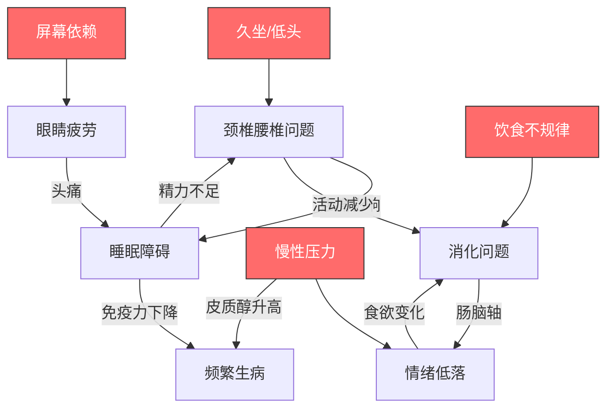
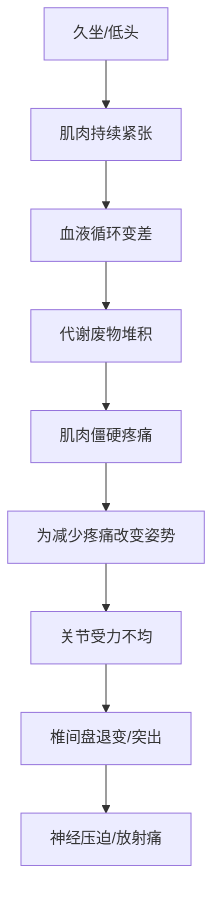
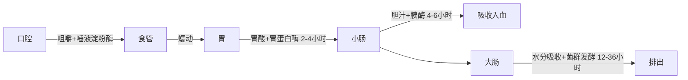
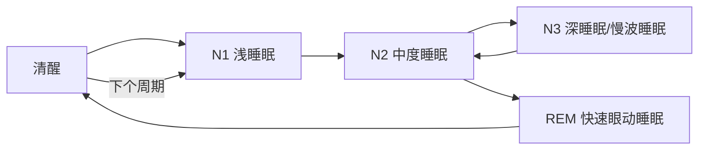
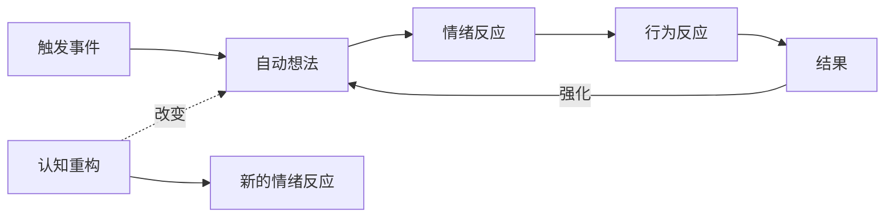
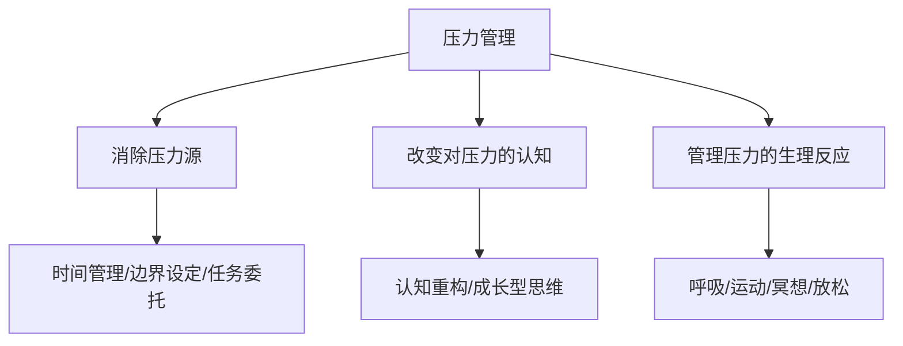
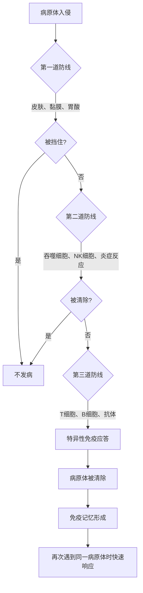

## 六、常见健康问题应对

现代人的生活方式——久坐、屏幕依赖、饮食不规律、慢性压力——制造了一系列几乎人人都会遇到的健康问题。本章不讲"有病去医院"的常识，而是聚焦于**你每天都能做的、有循证依据的自我管理策略**。每个问题按"为什么会发生→怎么预防→怎么缓解→什么时候该看医生"的逻辑展开，让你拿到就能用。

这七个问题不是孤立存在的，它们彼此交织、互相加重。理解它们之间的关联，是找到突破口的关键：

### 6.1 颈椎和腰椎问题

#### 6.1.1 为什么你的脖子和腰会出问题

人类的脊柱是为直立行走设计的，但不是为长时间坐着设计的。当你坐在电脑前时：

- **颈椎**：头部前倾15°时，颈椎承受的压力从约5kg增加到12kg；前倾60°（低头看手机的典型姿势）时，压力飙升到27kg——相当于脖子上挂了一个8岁小孩。
- **腰椎**：坐姿时腰椎承受的压力比站立时高40%，如果再加上弯腰驼背，椎间盘压力会增加到站立时的190%。

长期的压力失衡会导致：颈部肌肉劳损→颈椎曲度变直→椎间盘突出→压迫神经。腰椎的退变路径类似：腰肌劳损→腰椎曲度异常→椎间盘退变→坐骨神经痛。

脊柱退变的病理机制值得深入了解。椎间盘是脊柱的"减震垫"，由外层的纤维环和内部的髓核组成。椎间盘本身没有血管，营养供给完全依赖相邻椎体的渗透作用——而渗透需要脊柱的节律性运动（弯伸交替）来"泵送"营养。久坐不动意味着椎间盘长期处于饥饿状态，纤维环逐渐脱水、龟裂，最终髓核从薄弱处突出，压迫脊神经根。

**易感人群画像**：
- 每天坐姿超过6小时的办公族（IT、设计、金融、文案）
- 长期低头使用手机的"手机脖"群体
- 睡眠姿势不良（过高枕头、俯卧睡觉）的人
- 核心肌群薄弱、缺乏运动的人
- 已有脊柱侧弯或先天性脊柱结构异常的人

#### 6.1.2 工作环境的人体工学设置

预防的核心不是"注意坐姿"这种空话，而是**让环境迫使你保持正确姿势**。好姿势应该是不需要意志力维持的。

**椅子设置**：

| 参数 | 正确设置 | 常见错误 | 原理 |
|------|----------|----------|------|
| 座椅高度 | 双脚平放地面，大腿与地面平行，膝关节弯曲约90° | 椅子太高导致脚悬空，压迫大腿后侧血管 | 保持下肢血液循环，减少久坐疲劳 |
| 靠背角度 | 100°-110°微后仰，腰部有支撑垫 | 90°直角坐姿或完全后仰 | 微后仰可降低椎间盘压力约35%（Wilke et al., 1999） |
| 扶手高度 | 肩膀自然下垂，手肘放在扶手上时不耸肩 | 扶手太高导致耸肩，太低导致肩膀下沉 | 耸肩持续压迫上斜方肌，是肩颈酸痛的主因 |
| 座椅深度 | 膝盖后方与座椅边缘留2-3指宽的间隙 | 座椅太深压迫膝窝，太浅大腿支撑不足 | 避免压迫腘窝处的血管和神经 |
| 坐垫材质 | 中等硬度，前缘有瀑布形弧度 | 太软的沙发式坐垫（脊柱失去支撑）| 硬度适中的坐垫分散臀部压力，减少骨盆后倾 |

**屏幕设置**：
- 显示器距离：一臂长（约50-70cm）
- 屏幕顶部与眼睛平齐或略低（俯视角10°-15°）
- 如果用笔记本电脑，**必须**外接显示器或使用笔记本支架+外接键盘
- 双屏用户：主屏幕居中，副屏偏惯用手一侧15°以内
- 屏幕不要放在窗户正前方或正后方——前者产生眩光，后者产生逆光，两者都会迫使你前倾或眯眼

**键盘和鼠标**：
- 键盘放在肘部高度，手腕保持中立位（不上翘不下压）
- 鼠标靠近键盘，避免手臂外展
- 考虑使用人体工学键盘（分体式/帐篷式）和垂直鼠标
- 长期键盘工作者推荐使用腕托，但腕托只在打字间歇使用——打字时手腕应悬空

**站坐交替方案**：

| 时间段 | 姿势 | 说明 |
|--------|------|------|
| 0-25分钟 | 坐姿 | 专注工作 |
| 25-30分钟 | 站立/走动 | 接水、伸展、看远处 |
| 30-55分钟 | 坐姿 | 回到工作 |
| 55-60分钟 | 站立/走动 | 第二个活动周期 |

如果有升降桌，建议坐站比为 3:1 到 4:1，即每小时站立15分钟即可，不必强行站一整天——长时间站立同样有害，会增加下肢静脉曲张和足底筋膜炎的风险。

**人体工学投资优先级**（预算有限时的取舍）：
1. **一把好椅子**（预算的50%）：Herman Miller、Steelcase等品牌人体工学椅，或国内永艺、西昊等性价比品牌，2000-5000元档足够
2. **显示器支架**（预算的20%）：可调节高度和角度，比固定支架灵活得多
3. **外接键盘和鼠标**（预算的15%）：如果使用笔记本
4. **升降桌**（预算的15%）：有则更好，没有可以通过定时站立替代

#### 6.1.3 颈椎问题的针对性训练

**日常微运动（每1-2小时做一次，每次2-3分钟）**：

1. **颈部等长抗阻**：双手抱头后部，头向后用力推手，手向前用力抵抗，保持5秒，重复5次。这个动作激活深层颈屈肌（头长肌和颈长肌），是最有效的颈椎稳定训练之一。深层颈屈肌是颈椎的"天然护腰"，但现代人普遍因为长期头前倾而变得无力。
2. **收下巴运动（chin tuck）**：坐直，下巴向后收（制造双下巴），保持5秒，重复10次。这能纠正头前倾姿势，同时激活深层颈屈肌、拉伸枕下肌群。注意：不是低头，而是下巴水平后移。
3. **颈部活动度训练**：缓慢做前屈、后伸、左右侧屈、左右旋转，每个方向保持3秒，不追求大幅度，重在恢复活动范围。速度要慢——3秒到位、3秒保持、3秒返回。
4. **肩胛骨内收**：双臂自然下垂，肩胛骨向脊柱方向夹紧（想象夹住一支笔），保持5秒，重复10次。这个动作同时激活菱形肌和中下斜方肌，纠正圆肩。

**深度缓解训练（每天1次，10-15分钟）**：

1. **上斜方肌拉伸**：右手放在左耳上方，轻轻将头向右倾斜，左手可以抓住椅子边缘固定肩膀，保持30秒，换边。感受左侧颈部的拉伸感。上斜方肌是压力性耸肩的主要受累肌肉，90%的办公族这块肌都过紧。
2. **胸锁乳突肌拉伸**：头向右转45°，然后向左后方倾斜，保持30秒，换边。胸锁乳突肌过紧会导致头前倾和颈部旋转受限。
3. **胸大肌拉伸**：站在门框处，前臂贴在门框上（肘部90°），身体前倾直到胸部有拉伸感，保持30秒。大多数人胸肌过紧是圆肩的主因。做3组不同角度——肘部低于肩、与肩同高、高于肩——分别拉伸胸大肌的不同束。
4. **猫牛式**：四点跪姿，吸气时塌腰抬头（牛式），呼气时弓背低头（猫式），缓慢交替10次。重点感受每一节脊椎的逐节活动。
5. **麦肯基伸展**：俯卧，双手撑在肩膀两侧，缓慢撑起上身（骨盆不离地），手肘不完全伸直，保持10秒，重复5次。这是经典的颈椎/腰椎康复动作，由新西兰物理治疗师Robin McKenzie开发。
6. **枕下肌群释放**：仰卧，在枕骨下方（后脑勺底部）放两个网球（或一个花生球），左右滚动按摩2分钟。枕下肌群紧张是头痛和颈部僵硬的常见根源。

**常见误区**：
- ❌ 用力甩头、快速旋转颈部——可能加重椎间盘和韧带损伤
- ❌ 疼痛时做大幅度颈部环绕——急性期应限制活动范围
- ❌ 只关注颈椎忽略肩胛骨——肩胛骨位置异常是颈椎问题的重要诱因
- ❌ 认为"脖子响了就是好了"——关节弹响不是复位的标志，频繁追求弹响反而损伤关节
- ❌ 急性落枕时用力掰头——应冰敷+轻柔活动，48小时后再做拉伸

#### 6.1.4 腰椎问题的针对性训练

**McGill三大核心训练**（脊柱生物力学专家Stuart McGill教授推荐的腰椎稳定性黄金组合）：

McGill教授是滑铁卢大学脊柱生物力学实验室的创始人，他的核心训练理念是：**脊柱稳定性的关键不是柔韧性，而是"刚性"——在运动中保持脊柱中立位的能力**。

1. **Curl-up**：仰卧，一腿伸直一腿弯曲，双手垫在腰下（保持腰椎自然曲度），微微抬头和肩膀离地（不需要做仰卧起坐），保持8-10秒，重复5-6次。注意：这不是传统仰卧起坐——传统仰卧起坐对腰椎的压力高达3300N，已经超过了安全阈值。
2. **侧桥（Side Bridge）**：侧卧，用前臂和脚支撑身体成一条直线，保持8-10秒，每侧重复5-6次。训练腰方肌和腹斜肌，同时增强脊柱抗侧弯能力。初学者可以屈膝做（膝盖着地降低难度）。
3. **鸟狗式（Bird-Dog）**：四点跪姿，同时伸出对侧手臂和腿，保持8-10秒，每侧重复5-6次。训练多裂肌——脊柱最重要的深层稳定肌。关键要点：骨盆不要左右摇晃，想象背上放了一杯水不能洒。

**训练量递进方案**：

| 阶段 | 时间 | 训练内容 | 组数×次数 |
|------|------|----------|----------|
| 入门（第1-2周） | 每天1次 | McGill三大项 | 每项3×6次，保持8秒 |
| 进阶（第3-4周） | 每天1次 | McGill三大项+平板支撑 | 每项4×8次，保持10秒 |
| 强化（第5周+） | 每天1次 | 上述+死虫式+臀桥 | 每项5×10次，保持10秒 |

**日常保护原则**：
- 从地上捡东西时屈膝下蹲，不要弯腰
- 搬重物时贴近身体，用腿部力量而非腰部
- 久坐时使用腰靠垫，保持腰椎前凸的自然弧度
- 避免在腰痛时长时间卧床——48小时内的适度活动比休息更有利于恢复
- 起床时先侧身再用手撑起，不要直接从仰卧位"弹"起来
- 咳嗽或打喷嚏时微微屈膝，减少脊柱瞬间压力

**急性腰痛的应急处理**：
- 前48小时：每次冰敷15-20分钟，每天3-4次（不是热敷！急性期热敷会加重炎症）
- 48小时后：可以热敷，促进血液循环和肌肉放松
- 疼痛缓解后尽快恢复活动——卧床超过2天会加速肌肉萎缩，反而不利于恢复
- 可以使用布洛芬等NSAID药物缓解疼痛和炎症，但不要超过1周

#### 6.1.5 什么时候该看医生

以下情况需要就医，不要自行处理：

- 手臂或腿部出现麻木、刺痛、无力（神经压迫信号）
- 疼痛持续超过2周且自我处理无效
- 大小便功能异常（紧急！可能是马尾综合征，需要24小时内手术）
- 夜间痛醒、休息不能缓解的疼痛（可能提示肿瘤或感染）
- 外伤后的急性疼痛
- 伴有发热、体重下降等全身症状
- 胸椎区域的疼痛（比颈椎和腰椎更需要排除严重病变）

---

### 6.2 眼睛疲劳（数字眼疲劳/计算机视觉综合征）

#### 6.2.1 为什么看屏幕会让眼睛累

正常情况下，人每分钟眨眼约15-20次，眨眼时泪液均匀涂布在角膜表面，保持湿润。但当你专注盯着屏幕时，眨眼频率会降到每分钟5-7次——减少了一半以上。泪膜蒸发加快→角膜干燥→刺痛、灼热、视物模糊。

此外，屏幕发出的蓝光（波长380-500nm）并不是主要问题——蓝光对视网膜的损伤阈值远高于日常屏幕亮度。真正的罪魁祸首是：

1. **长时间近距离聚焦**：睫状肌持续收缩，导致调节痉挛（假性近视的原理）。睫状肌就像一块橡皮筋，长时间拉紧就会疲劳痉挛，失去弹性。
2. **对比度和刷新率**：低刷新率屏幕的微闪烁迫使瞳孔不断调节，增加视觉系统负荷。
3. **视距单一**：长时间只看近处，远距离视觉功能退化。进化上人类的视觉以远距离为主，近距离使用是现代文明的产物。
4. **泪膜质量下降**：空调环境、低湿度、隐形眼镜佩戴都会加速泪膜蒸发。

**数字眼疲劳的典型症状**：
- 眼睛干涩、灼热、刺痛
- 视物模糊，尤其在远近切换时
- 眼睛酸胀，感觉"眼睛累得睁不开"
- 头痛（尤其前额和太阳穴）
- 颈肩酸痛（因为不良的屏幕姿势）
- 对光线敏感度增加

#### 6.2.2 20-20-20法则的正确执行

20-20-20法则的原文是：Every 20 minutes, look at something 20 feet away for 20 seconds。但大多数人执行不到位，以下是细化方案：

**设置提醒**：用手机或电脑定时器，每20分钟提醒一次（不是靠意志力记得）。推荐工具：
- Windows：EyeLeo（免费，强制休息提醒）
- macOS：Time Out（免费版可用）
- 跨平台：Stretchly（开源免费）
- 手机：番茄钟类App都自带休息提醒

**"看远处"的正确方法**：
- 目标距离：至少6米（20英尺），越远越好，窗外的建筑、对面的楼都可以
- 不是闭眼休息——需要的是睫状肌放松，必须看远处
- 看的过程中可以有意识地看不同距离的物体（窗框→远处建筑→更远处的山）——这种"调节训练"比固定看一个点更有效
- 如果没有窗户，看房间对角的物体也比看桌面好

**20秒之外**：如果条件允许，每2小时做一次5分钟的"视觉休息"——站起来走到窗边或户外，看远处2-3分钟，同时活动肩颈。

**视觉休息期间可以做的眼部运动**：
1. 远近交替聚焦：拇指放在30cm处→看拇指2秒→看远处5秒→重复10次
2. 眼球画圈：顺时针5圈→逆时针5圈（幅度尽可能大）
3. 快速眨眼20次（重新分布泪膜）

#### 6.2.3 屏幕设置优化

**亮度和对比度**：
- 屏幕亮度应与环境光亮度一致——最简单的判断方法：把屏幕调到纯白画面，看它是否像一个"发光的窗户"（太亮）或"灰蒙蒙的纸"（太暗），理想状态是像一张被照亮的纸
- 对比度保持在60%-70%
- 开启系统的暗色模式（深色背景+浅色文字）可以减少总光量输出，但对减少眼疲劳的效果因人而异——有些人在深色背景上反而更容易疲劳

**色温调节**：
- 白天：6500K（标准日光色温）
- 傍晚以后：调到4000K-5000K（偏暖），减少蓝光比例
- 使用 f.lux 或系统自带的夜间模式自动调节
- 如果从事设计、摄影等对色彩要求高的工作，可以只在非工作时间启用暖色模式

**字体大小和背景色**：
- 正文字号不小于14px（推荐16px），行高1.5-1.8倍
- 避免纯白背景（#FFFFFF），使用浅灰（#F5F5F5 或 #FAFAFA）减少眩光
- 文字颜色避免纯黑（#000000），使用深灰（#333333）降低对比度冲击
- IDE/编辑器推荐使用护眼主题：Solarized Light、One Light等

**显示器硬件**：
- 优先选择IPS面板（色彩准确、可视角度大）
- 刷新率至少75Hz（减少闪烁感），能上120Hz更好
- 分辨率至少1080p（27寸以上建议2K或4K），字体边缘锐利减少调节负担
- 选择有TUV低蓝光认证的显示器（硬件层面减少蓝光，比软件过滤更准确）
- 显示器不要放在窗户正对面——对比度过高会加剧视觉疲劳

#### 6.2.4 眼部放松的具体方法

**热敷（最有效的物理缓解法）**：
- 温度：40-45°C（手腕内侧试温感觉温热不烫）
- 方式：热毛巾（需要反复更换保持温度）、蒸汽眼罩、或热敷眼贴
- 时间：10-15分钟
- 原理：热敷促进睑板腺分泌油脂，稳定泪膜，减少蒸发。睑板腺功能障碍是现代人干眼的最常见原因
- 最佳时机：睡前，同时有助于放松入眠
- 频率：每天1次，持续2-4周才能改善睑板腺功能

**眼部按摩**：
1. 眶上按压：用拇指按压眉毛上方的眶上切迹（眉毛中内1/3交界处），按压5秒，重复5次
2. 眶下按压：用食指按压眼眶下方正中位置，按压5秒，重复5次
3. 太阳穴旋转：双手拇指在太阳穴做小范围旋转按摩，持续30秒
4. 眼周轮刮：用食指和中指从内眼角沿上眼眶向外刮至太阳穴，再从太阳穴沿下眼眶刮回内眼角，重复5圈
5. 眼球运动：闭眼，眼球缓慢做"∞"形运动（数字8横躺），持续30秒

**主动眨眼训练**：
- 用力闭眼2秒→轻轻闭眼2秒→睁眼，重复10次
- 这比普通的眨眼多了一个"用力闭"的步骤，能更有效地挤压睑板腺排出油脂
- 在20-20-20休息时顺便做

#### 6.2.5 干眼症的识别和处理

如果出现以下症状且持续不缓解，可能是干眼症而非单纯疲劳：
- 晨起眼睛干涩、有异物感
- 眼睛发红但不痒
- 看屏幕30分钟内就出现视力模糊
- 戴隐形眼镜困难或不适
- 对风、烟、空调特别敏感
- 眼睛有粘稠分泌物

**干眼症的分型**：
- **水液缺乏型**：泪腺分泌不足，常见于干燥综合征、老龄化
- **蒸发过强型**：睑板腺功能障碍（MGD），是80%干眼症的主因
- **混合型**：以上两者兼有

轻度干眼的人工泪液选择：
- 不含防腐剂的单支装（推荐）：瑞新、思然
- 含透明质酸钠的滴眼液：保湿时间更长
- 中重度干眼可使用凝胶状泪液（如重组牛碱性成纤维细胞生长因子眼用凝胶）
- ❌ 避免长期使用含血管收缩剂的"去红血丝"眼药水（如日本参天FX），会产生依赖性，停药后反弹更红
- ❌ 避免长期使用含防腐剂（苯扎氯铵）的滴眼液，长期使用会损害角膜上皮

**干眼症的生活调整**：
- 空调房使用加湿器，保持湿度40%-60%
- 减少隐形眼镜佩戴时间，日抛型优于月抛型
- 每天补充Omega-3脂肪酸（鱼油1000-2000mg），有临床证据支持改善干眼
- 避免长时间在空调出风口或风扇直吹下工作

#### 6.2.6 关于蓝光眼镜的真相

多项系统性综述（包括Cochrane 2023年的分析）表明：**蓝光眼镜在减少眼疲劳方面没有显著效果**。原因很简单——眼疲劳的主要原因是眨眼减少和持续近距离聚焦，不是蓝光。

但蓝光眼镜并非完全无用：对于需要在夜间使用屏幕的人，带有蓝光过滤功能的眼镜可能有助于减少对褪黑素分泌的抑制，从而改善睡眠质量。不过，软件层面的色温调节（f.lux/夜间模式）同样有效且免费。

**比蓝光眼镜更值得关注的是**：渐进多焦眼镜（用于远近频繁切换的工作场景）、抗疲劳镜片（下加光+0.50到+0.75D，减轻近距离调节负担），以及处方准确的防眩光镜片。

---

### 6.3 消化问题

#### 6.3.1 消化系统的基本工作原理

理解消化系统的工作流程，才能知道问题出在哪个环节：

消化系统不仅仅是"消化食物"。肠道被称为"第二大脑"，因为它拥有约5亿个神经元（比脊柱还多），能独立于大脑控制消化过程。肠道还通过"肠-脑轴"（迷走神经+肠道菌群代谢产物+免疫信号）与大脑双向通信——这是肠道问题会影响情绪、情绪问题也会影响消化的生物学基础。

常见的消化问题发生在以下环节：
- **胃**：胃酸过多→反酸、烧心；胃动力不足→胀气、早饱；幽门螺杆菌感染→慢性胃炎
- **小肠**：乳糖不耐受→腹胀腹泻；小肠细菌过度生长（SIBO）→胀气；麸质敏感→腹泻+疲劳
- **大肠**：肠道菌群失调→便秘或腹泻交替；肠易激综合征（IBS）→腹痛+排便习惯改变；憩室病→左下腹痛

#### 6.3.2 饮食层面的系统性调整

**增加膳食纤维（大多数人严重不足）**：

成人每日推荐摄入25-30g膳食纤维，但中国城市居民平均摄入量仅约10-13g。纤维分两种，需要平衡摄入：

| 类型 | 代表食物 | 作用 | 每日建议 |
|------|----------|------|----------|
| 可溶性纤维 | 燕麦、苹果、豆类、亚麻籽 | 形成凝胶，减缓消化，喂养益生菌 | 5-10g |
| 不可溶性纤维 | 全谷物、蔬菜、坚果 | 增加粪便体积，促进肠道蠕动 | 15-20g |

**增加纤维的正确方法**：
- **逐渐增加**：每周增加5g，给肠道菌群适应时间。突然大量摄入会导致严重胀气。
- **配合充足水分**：每增加5g纤维，多喝200ml水。纤维吸水膨胀才能发挥作用。
- 早餐用燕麦粥替代白粥，午餐加一份蔬菜沙拉，下午吃一个苹果——轻松增加8-10g纤维。

**常见食物纤维含量参考**：
- 一碗燕麦粥（50g干燕麦）：约5g纤维
- 一个中等苹果（带皮）：约4g纤维
- 一碗西兰花（150g）：约4g纤维
- 一碗红豆/绿豆（煮熟）：约8g纤维
- 一把杏仁（30g）：约4g纤维
- 一片全麦面包：约2-3g纤维

**减少容易引起消化不适的食物**：
- 高FODMAP食物（可发酵的短链碳水化合物）：洋葱、大蒜、小麦、部分豆类、苹果、蜂蜜——对IBS患者尤其敏感。FODMAP代表：可发酵（Fermentable）、寡糖（Oligosaccharides）、双糖（Disaccharides）、单糖（Monosaccharides）、多元醇（Polyols）
- 油炸食品：延缓胃排空，增加反酸风险
- 碳酸饮料：引入大量气体，加重胀气
- 人工甜味剂（山梨糖醇、木糖醇）：有渗透性泻剂作用，过量导致腹泻
- 酒精：直接刺激胃黏膜，增加胃酸分泌，损害肠屏障
- 咖啡（空腹时）：刺激胃酸分泌，空腹饮用可能加重反酸

**低FODMAP饮食方案**（针对IBS患者的黄金标准饮食疗法）：
- **排除期（2-6周）**：严格避免所有高FODMAP食物
- **重新引入期（6-8周）**：逐组重新引入，每组观察3天，记录症状
- **个性化维持期**：根据你的触发食物定制饮食方案
- 注意：低FODMAP饮食不建议长期严格执行（会减少肠道菌群多样性），目标是找到你的特定触发食物

**进食习惯优化**：
- 每口食物咀嚼20-30次（不是5次就咽下），唾液中的淀粉酶是消化的第一步
- 进食时间控制在20-30分钟，不要5分钟狼吞虎咽
- 饭后不要立即躺下，至少保持直立30分钟（反酸患者尤其重要）
- 细嚼慢咽还能让饱腹信号及时传达到大脑（需要约20分钟），避免过量进食
- 吃饭时不要看手机或工作——注意力不在食物上会减少消化液分泌

#### 6.3.3 肠道菌群的维护

肠道中生活着约38万亿个微生物，它们的基因总量是人体自身基因的150倍。这些微生物参与消化、免疫调节、维生素合成、甚至情绪调节（肠-脑轴）。70%的免疫细胞位于肠道相关淋巴组织（GALT），肠道菌群的健康直接影响全身免疫力。

**益生菌补充的选择**：

| 菌株 | 适用场景 | 证据等级 | 剂量参考 |
|------|----------|----------|----------|
| 乳杆菌属（Lactobacillus） | 腹泻、乳糖不耐受 | 强 | 10^9-10^10 CFU/天 |
| 双歧杆菌属（Bifidobacterium） | 便秘、IBS | 强 | 10^9-10^10 CFU/天 |
| 布拉酵母菌（S. boulardii） | 抗生素相关性腹泻 | 强 | 250-500mg/天 |
| 鼠李糖乳杆菌GG（LGG） | 急性腹泻、儿童 | 强 | 10^10 CFU/天 |
| 长双歧杆菌35624 | IBS（腹痛为主） | 强 | 10^9 CFU/天 |
| VSL#3复合菌株 | 溃疡性结肠炎辅助 | 中等 | 按产品说明 |

**益生菌使用注意事项**：
- 菌株特异性很重要——不是所有乳杆菌都一样，要选到菌株编号（如LGG、HN019等）
- 活菌数不是越多越好，关键看菌株是否经过临床验证
- 抗生素和益生菌需间隔至少2小时服用
- 建议持续补充4-8周评估效果，不要指望吃几天就见效
- 益生菌不需要终身服用——改善后可以靠饮食维持

**益生元——益生菌的食物**：
- 菊苣根粉（含菊粉，最常用的益生元补充剂）
- 洋葱、大蒜、韭菜（低剂量时是优质益生元来源）
- 香蕉（尤其是略带绿色的未熟香蕉，含抗性淀粉）
- 燕麦、大麦
- 芦笋、菊芋（天然菊粉来源）

**损害菌群的行为**：
- 滥用抗生素（使用后至少补充2-4周益生菌）
- 高糖高脂低纤维饮食（有害菌偏好糖和脂肪）
- 过度使用消毒产品（减少环境微生物多样性）
- 慢性压力（通过肠-脑轴直接影响菌群组成）
- 过度清洁——适当接触自然环境中的微生物有助于菌群多样性

#### 6.3.4 常见消化问题的即时缓解

**反酸/烧心**：
- 左侧卧位（胃的解剖位置使左侧卧能减少胃酸反流）
- 垫高床头15-20cm（不是垫高枕头，那只会弯曲颈椎）
- 嚼无糖口香糖（刺激唾液分泌，唾液呈碱性可中和食管酸性）
- 服用铝碳酸镁（达喜）等抗酸药可即时缓解，但不宜长期使用
- 如果频繁反酸（每周超过2次），考虑使用质子泵抑制剂（PPI，如奥美拉唑），但需在医生指导下使用，不建议超过8周
- 避免睡前3小时内进食
- 减少腹部压力：避免紧腰带、肥胖（减重5%即可显著改善反酸症状）

**腹胀/胀气**：
- 腹部按摩：以肚脐为中心，顺时针方向做圆周按摩（顺大肠走行方向），每次5-10分钟
- 膝胸卧位：仰卧，双手抱膝拉向胸部，保持30秒，有助于排气
- 薄荷油胶囊（肠溶型）：对IBS相关的胀气有较好的证据支持
- 西甲硅油（二甲硅油）：消泡剂，物理性地破坏气泡，安全性高，孕妇也可使用
- 排查食物诱因：乳制品（乳糖不耐受）、豆类、洋葱大蒜（FODMAP）、碳酸饮料

**便秘**：
- 晨起一杯温水（300-500ml），刺激胃-结肠反射
- 建立定时排便习惯（推荐早餐后30分钟，利用胃-结肠反射最活跃的时段）
- 蹲位比坐位更有利于直肠-肛门角度的打开，使用脚凳抬高双脚（模拟蹲姿，膝盖高于臀部）
- 渗透性泻剂（乳果糖、聚乙二醇）可安全长期使用，比刺激性泻剂（番泻叶、酚酞）更温和
- 如果膳食纤维+水分无效，补充镁剂（柠檬酸镁200-400mg睡前服用）可以温和改善
- 适度运动（每天步行30分钟）对肠道蠕动有直接促进作用

**腹泻**：
- 口服补液盐（ORS）比单纯喝水更有效——腹泻丢失的不只是水，还有钠、钾、氯等电解质
- BRAT饮食：香蕉（Banana）、米饭（Rice）、苹果酱（Applesauce）、吐司（Toast）——低纤维、易消化
- 补充锌（成人20mg/天）可以缩短腹泻持续时间（WHO推荐）
- ❌ 腹泻初期不要用止泻药（洛哌丁胺），让身体先排出有害物质
- 腹泻超过3天、伴有高热（>38.5°C）、便血或严重脱水症状（口干、尿少、头晕）时应就医

#### 6.3.5 什么时候该看医生

- 大便带血或黑便（消化道出血信号）
- 持续性腹痛超过2周
- 不明原因的体重下降
- 排便习惯突然改变（持续超过4周）
- 吞咽困难或吞咽疼痛
- 反复呕吐
- 50岁以上首次出现消化道症状（需要排除肿瘤）
- 贫血合并消化道症状（可能是慢性消化道出血）

---

### 6.4 睡眠问题

#### 6.4.1 睡眠的科学基础

睡眠不是一个均匀的状态，而是由多个周期循环组成，每个周期约90分钟：

- **N1（入睡期）**：持续1-5分钟，容易被唤醒，肌肉开始放松，可能出现入睡前幻觉（入睡前抽搐是正常的）
- **N2（浅睡期）**：占总睡眠的45-55%，体温下降，心率减慢，睡眠纺锤波出现（记忆巩固的关键）
- **N3（深睡期）**：占总睡眠的15-25%，前半夜集中，生长激素分泌高峰，身体修复最活跃的阶段。免疫细胞因子大量释放，T细胞活性增强
- **REM（快速眼动期）**：占总睡眠的20-25%，后半夜集中，梦境最生动，情绪调节和创造性思维的关键。大脑在此阶段处理白天的情绪记忆，将它们"脱敏"

前半夜以深睡眠为主，后半夜以REM为主。**缩短睡眠时间对深睡眠影响较小（身体会优先保障），但会严重削减REM**——这就是为什么睡眠不足时情绪比体力先崩溃。长期REM不足与抑郁症、焦虑症的发生密切相关。

**睡眠需求的个体差异**：虽然成人推荐7-9小时，但确实存在"短睡基因"携带者（DEC2基因突变），只需4-6小时即可恢复。但这种基因极为罕见（<1%人群），绝大多数认为自己只需5-6小时的人其实长期处于慢性睡眠剥夺状态。

#### 6.4.2 睡眠压力和昼夜节律

控制你困不困的有两个系统：

1. **睡眠压力（腺苷系统）**：清醒时间越长，大脑中积累的腺苷越多，困意越强。咖啡因通过阻断腺苷受体来"假装不困"——但它只是掩盖了困意，腺苷仍在积累，咖啡因代谢完后会"报复性犯困"。
2. **昼夜节律（褪黑素系统）**：由视交叉上核（SCN）控制，受光照影响。光线（尤其是蓝光）抑制褪黑素分泌，黑暗促进分泌。这就是为什么睡前看手机会睡不着。

**理想的入睡条件**是：高睡眠压力 + 昼夜节律下降段。如果你白天午睡过长（消耗了睡眠压力），或者睡前玩手机（延迟了褪黑素分泌），两个系统就会冲突。

**咖啡因的关键知识**：
- 咖啡因半衰期约5-6小时——下午3点喝的咖啡，到晚上9点还有约一半的咖啡因在你体内
- 建议：下午1-2点后不再摄入含咖啡因的饮品（咖啡、茶、可乐、能量饮料）
- 个人代谢速度差异很大——CYP1A2基因的快代谢型可以晚些喝，慢代谢型需要更早停止
- 耐受性会增加——长期大量饮用咖啡的人可能感觉"下午喝不影响睡眠"，但实际上深睡眠质量可能已经下降

#### 6.4.3 入睡困难的系统性解决方案

**环境优化（最重要）**：

| 要素 | 理想条件 | 实操建议 |
|------|----------|----------|
| 温度 | 18-22°C | 开空调/风扇，体温下降是入睡信号 |
| 光线 | 完全黑暗 | 遮光窗帘+摘掉所有LED指示灯+眼罩（备用） |
| 声音 | <30分贝 | 耳塞或白噪音机（推荐pink noise优于white noise） |
| 床垫 | 中等偏硬 | 不塌陷不硌骨，脊柱保持自然曲度 |
| 枕头 | 仰卧一拳高，侧卧一拳半 | 颈椎与脊柱保持一条直线 |
| 气味 | 清新/薰衣草 | 薰衣草精油有轻度镇静证据支持 |

**行为策略**：

1. **固定起床时间**（比固定入睡时间更重要）：每天同一时间起床，包括周末，误差不超过30分钟。这是锚定生物钟最有效的单一策略。偶尔晚睡也要在固定时间起床——白天的困倦感会帮助你在当晚提前入睡。
2. **睡前90分钟的"关机程序"**：
   - T-90分钟：停止工作、减少蓝光（开夜间模式或戴防蓝光眼镜）
   - T-60分钟：调暗灯光（用暖色台灯替代主灯），可以做轻度伸展或阅读纸质书
   - T-30分钟：洗热水澡或泡脚（核心体温升高后下降会触发困意），刷牙、护肤
   - T-15分钟：上床，做呼吸练习或身体扫描冥想
3. **床只用于睡觉**：不在床上工作、看剧、刷手机。让大脑建立"床=睡觉"的条件反射。
4. **20分钟法则**：上床后如果20分钟还睡不着，起来去另一个房间做无聊的事（不要看手机），等到困了再回床上。避免在床上辗转——这会让大脑把"床"和"焦虑"关联起来。

**呼吸和放松技术**：

**4-7-8呼吸法**（Andrew Weil医生推广）：
1. 用鼻子吸气4秒
2. 屏住呼吸7秒
3. 用嘴缓慢呼气8秒（发出"呼"的声音）
4. 重复4个循环

原理：延长呼气时间激活副交感神经系统，降低心率和皮质醇水平。刚开始练习时可能觉得7秒屏息太长，可以从2-5-4的比例开始逐渐延长。

**渐进式肌肉放松（PMR）**：
从脚趾开始，到头顶结束，每个肌肉群：
1. 用力收缩5秒（感受紧绷）
2. 突然放松15秒（感受对比）
3. 移到下一个肌肉群

顺序：脚趾→小腿→大腿→臀部→腹部→胸部→双手→前臂→上臂→肩膀→面部→全身

**身体扫描冥想**：
仰卧，从头顶到脚底，依次感受每个部位的感觉——不评判、不改变，只是观察。注意力走神了就温柔地拉回来。全程10-15分钟。这种"元觉察"训练可以减少入睡前的反刍思维。

#### 6.4.4 夜间醒来的处理

偶尔的夜间醒来是正常的（人类原本就是分段睡眠的），问题在于**你对醒来的反应**：

- **不要看时间**：看时间会触发焦虑计算（"还能睡X小时"），把钟放到看不到的地方或翻过去
- **不要看手机**：屏幕光会重置褪黑素分泌，让你更难再入睡
- 如果10分钟内没有再入睡，起来做无聊的事（但不要开明亮的灯）
- 腹式呼吸：吸气4秒→呼气6秒，把注意力放在呼吸的感觉上，不要去想"怎么还睡不着"

**频繁夜醒的可能原因排查**：

| 原因 | 特征表现 | 解决方案 |
|------|----------|----------|
| 睡前饮酒 | 后半夜频繁醒来 | 戒酒或至少睡前3小时不饮酒 |
| 夜间血糖波动 | 凌晨3-4点惊醒，伴出汗 | 睡前吃少量蛋白质+脂肪（如坚果）稳定血糖 |
| 睡眠呼吸暂停 | 伴侣反映打鼾、白天嗜睡 | 做多导睡眠监测，可能需要CPAP |
| 夜尿 | 每晚起夜≥2次 | 睡前2小时限水，排除前列腺问题或糖尿病 |
| 不宁腿 | 腿部不适必须活动 | 检查铁蛋白水平（<75ng/mL可能相关） |
| 焦虑/反刍思维 | 入睡后2-3小时醒来后脑中翻涌想法 | 记"担忧日记"——把想法写下来，告诉自己明天再处理 |

#### 6.4.5 关于午睡

- 最佳时长：20-30分钟（只进入N1-N2，醒后不会有睡眠惯性）
- 最佳时间：13:00-15:00（与昼夜节律的下午低谷一致）
- 不要超过下午15:00午睡，否则会影响夜间睡眠压力积累
- 如果晚上失眠，建议暂时取消午睡，把所有睡眠压力留给夜间
- "NASA午睡"：26分钟午睡可以提升34%的工作表现和54%的警觉性（NASA研究）
- 如果你进入深睡眠后被闹钟叫醒，会感到更加昏沉——这就是为什么闹钟设在30分钟以内

#### 6.4.6 关于安眠药和褪黑素

**褪黑素补充剂**：
- 适用于：时差调整、昼夜节律紊乱（如轮班工作）、入睡时间偏晚
- 不适用于：长期失眠的解决方案
- 剂量：0.3-1mg（不是越多越好，市面上常见的3-10mg远超生理剂量，反而可能导致次日嗜睡和节律紊乱）
- 时间：睡前1-2小时服用（模拟自然褪黑素分泌的提前量）
- 副作用：极少数人出现头痛、头晕、次日嗜睡
- 品质提醒：选择第三方检测认证的品牌（如NSF、USP认证），褪黑素补充剂的实际含量常与标注不符

**处方安眠药**（以下仅供了解，必须在医生指导下使用）：
- 非苯二氮卓类（如唑吡坦/思诺思）：短期使用安全性较好，但不宜超过4周
- 苯二氮卓类（如阿普唑仑）：有成瘾性，只用于严重焦虑伴失眠
- 食欲素受体拮抗剂（如苏沃雷生）：较新的机制，成瘾风险低
- ❌ 不要自行购买和使用安眠药

**认知行为治疗-失眠（CBT-I）**：这是治疗慢性失眠的一线推荐方案（优于药物），通常6-8周的疗程可以产生长期改善。包括：睡眠限制（减少在床时间以提高睡眠效率）、刺激控制、认知重构、放松训练。目前有多个App提供数字化CBT-I（如Sleepio、Somryst），国内也有部分三甲医院的睡眠科提供CBT-I。

#### 6.4.7 什么时候该看医生

- 失眠持续超过4周且影响白天功能
- 伴侣反映你打鼾严重、呼吸暂停或异常行为（踢腿、拳打）——可能是REM睡眠行为障碍
- 白天不可控制地嗜睡（可能是发作性睡病）
- 不宁腿综合征：腿部有难以描述的不适感，必须活动才能缓解
- 睡眠中恐慌发作或频繁噩梦
- 睡眠中磨牙（晨起颞下颌关节疼痛或牙齿磨损）

---

### 6.5 情绪低落与压力管理

#### 6.5.1 区分"正常的坏心情"和"需要关注的抑郁"

每个人都会有情绪低落的时候，这是正常的情绪波动。但当低落情绪满足以下条件时，它可能已经超出了正常范围：

**抑郁症的核心特征（DSM-5标准简化版）**：

以下症状中至少有5项，持续至少2周，且包含①或②至少一项：
1. ① 持续的情绪低落（几乎每天、大部分时间）
2. ② 对几乎所有活动失去兴趣或愉悦感
3. 体重明显变化（一个月内增减5%以上）
4. 失眠或嗜睡
5. 精神运动性激越或迟滞（别人能观察到的异常）
6. 疲劳或精力不足
7. 无价值感或过度内疚
8. 思考或注意力减退
9. 反复出现死亡或自杀的想法

**关键区别**：

| 维度 | 正常的坏心情 | 需要关注的抑郁 |
|------|-------------|----------------|
| 持续时间 | 几小时到几天 | 超过2周 |
| 诱因 | 通常有明确原因 | 可能无明显原因 |
| 功能影响 | 可以正常工作生活 | 日常功能明显下降 |
| 自我调节 | 休息/运动/社交后改善 | 做什么都不管用 |
| 兴趣 | 只是暂时不想做 | 对所有事情都提不起兴趣 |
| 躯体症状 | 通常没有 | 可能伴食欲变化、睡眠障碍、不明原因疼痛 |

**容易被忽视的"隐性抑郁"表现**：
- 脾气暴躁、易怒（不是所有抑郁都表现为悲伤）
- 反复出现的身体不适（头痛、胃痛、背痛）但检查无异常
- 工作效率持续下降但说不清原因
- 开始回避社交，逐渐"不想出门"
- 沉迷于某些行为（刷手机、玩游戏、暴食）作为情绪逃避

#### 6.5.2 有循证依据的自我调节方法

**运动——最强的天然抗抑郁药**：
- 机制：增加BDNF（脑源性神经营养因子）分泌→促进神经元新生；增加5-HT和内啡肽水平；降低皮质醇
- 证据：多项Meta分析显示，中等强度有氧运动对轻中度抑郁的疗效与SSRI类抗抑郁药相当（Blumenthal et al., 2007）
- 处方：每周3-5次，每次30-45分钟，心率达到最大心率的60%-70%（最大心率≈220-年龄）
- 不需要剧烈运动——30分钟快走（心率120-140左右）就足够
- 关键是**规律性**，不是强度
- 户外运动优于室内——阳光+自然环境的额外效果

**光照——调节昼夜节律的强效工具**：
- 早晨（起床后30分钟内）接受15-30分钟的自然光照
- 如果住在日照少的地方，使用10000勒克斯的光照灯，距离30-50cm
- 光照疗法对季节性情感障碍（SAD）效果尤为显著
- 冬季抑郁的北方居民尤其需要重视
- 光照同时帮助调节褪黑素分泌节律，一举两得改善睡眠

**社交连接——人类的社会需求是刚性的**：
- 哪怕不想社交，也至少保持1-2次/周的面对面接触
- 不需要深度倾诉——一起吃饭、散步、打游戏都算
- 线上社交不能完全替代面对面（缺少非语言线索和肢体接触）
- 如果实在不想见人，从给朋友发消息开始
- 做志愿者、帮助他人也能显著改善情绪——利他行为激活大脑的奖励回路

**写日记——结构化的情绪表达**：
- 不是写流水账，试试这个框架：
  1. 今天发生了什么（事实）
  2. 我的感受是什么（情绪命名）
  3. 这个感受背后的想法是什么（认知识别）
  4. 这个想法客观吗？有没有其他解释？（认知重构）
- 研究显示，每天15分钟的情绪写作在4天后就能改善心理状态
- 感恩日记也有效：每天写下3件感恩的事，持续2周可以提升幸福感

**正念冥想——不是玄学**：
- 8周的MBSR（正念减压）课程可以显著降低焦虑和抑郁评分
- 入门方法：每天10分钟，闭眼坐着，关注呼吸的感觉（鼻尖的空气流动、腹部的起伏），走神了就温柔地拉回来
- 推荐App：Headspace、Calm、潮汐（中文）、小睡眠
- 正念的核心不是"清空思绪"，而是"觉察思绪但不跟随"——就像看天空中飘过的云

**饮食对情绪的影响**：
- 肠道产生约90%的血清素（"快乐神经递质"），肠道菌群健康直接影响情绪
- Omega-3脂肪酸（深海鱼、亚麻籽）：有临床证据支持改善抑郁症状
- 减少精制糖和超加工食品：这些食物会加剧全身炎症反应，与抑郁风险正相关
- B族维生素（全谷物、瘦肉、鸡蛋）：B6、B12、叶酸参与神经递质合成
- 发酵食品（酸奶、泡菜、味噌）：改善肠道菌群→改善肠-脑轴信号

#### 6.5.3 认知行为疗法（CBT）的核心思路

CBT是目前证据最充分的心理治疗方法之一，其核心逻辑是：**不是事件本身让你难过，而是你对事件的解读让你难过**。

**常见的认知扭曲（你中了几条？）**：

| 扭曲类型 | 定义 | 例子 |
|----------|------|------|
| 非黑即白 | 只看两个极端 | "这次没考好，我就是废物" |
| 过度概括 | 一次失败推及全部 | "又被拒绝了，我永远找不到对象" |
| 心理过滤 | 只看负面，忽略正面 | 100件事99件好的，只盯那1件不好的 |
| 否定正面 | 把好事解释为例外 | "他们只是客气，不是真的觉得我好" |
| 读心术 | 假设知道别人想什么 | "他肯定觉得我很烦" |
| 灾难化 | 把结果想象到最坏 | "搞砸了，我的人生完了" |
| 情绪推理 | 把感觉当成事实 | "我觉得没用，所以我肯定没用" |
| 应该思维 | 对自己设定僵化标准 | "我应该能处理好所有事" |
| 贴标签 | 用标签替代具体描述 | "我就是个失败者" |
| 个人化 | 把无关的事揽到自己身上 | "团队项目失败了，都是我的错" |

**日常认知重构练习**：
当感到情绪低落时，问自己三个问题：
1. 我现在的自动想法是什么？（精确写出）
2. 支持这个想法的证据是什么？反对的证据呢？
3. 如果我的好朋友遇到同样的情况，我会怎么跟他说？

第三个问题特别有效——我们对别人往往比对自己更宽容。这种"自我距离"技术（把自己当作朋友来看待自己的处境）有大量研究支持。

**进阶：ABC情绪日记**（Albert Ellis理性情绪疗法）：
- **A**（Activating Event）：触发事件是什么？
- **B**（Belief）：我对这件事的信念/想法是什么？
- **C**（Consequence）：产生了什么情绪和行为？
- **D**（Disputation）：反驳这个信念的证据是什么？
- **E**（Effective new belief）：新的、更合理的信念是什么？

#### 6.5.4 压力管理与焦虑应对

**压力的生理机制**：
当大脑感知到威胁时，下丘脑-垂体-肾上腺轴（HPA轴）被激活，释放皮质醇和肾上腺素。短期内这是有益的——提高警觉、加速反应、调动能量。但当压力源持续存在（工作截止日期、人际关系、经济压力），皮质醇长期升高会导致：
- 免疫抑制（容易生病）
- 海马体萎缩（记忆和学习能力下降）
- 前额叶功能下降（决策和自控力变差）
- 脂肪重新分布（腹部脂肪增加）
- 睡眠障碍

**压力管理的层次模型**：

**实用压力管理工具**：

1. **时间管理四象限法**：将任务按"紧急-重要"分四个象限，优先做"重要但不紧急"的事（预防性工作），减少"紧急但不重要"的事（很多打断和会议属于此类）
2. **"担忧时间"技术**：每天设定一个固定的15分钟"担忧时间"，在此期间写下所有焦虑的想法。其他时间出现焦虑时，告诉自己"等到担忧时间再想"。这个技术利用了延迟处理的原理——大多数担忧在固定时间重新审视时已经不那么焦虑了
3. **"5-4-3-2-1"接地技术**（急性焦虑时使用）：说出5个看到的东西、4个听到的声音、3个能触摸到的物体、2个闻到的气味、1个尝到的味道。这把注意力从焦虑的想法拉回到当下现实
4. **渐进式肌肉放松**：前面睡眠章节已介绍，同样适用于日间压力管理
5. **"压力接种"**：在压力事件前预演可能的情境和应对方案，就像疫苗接种——提前暴露于轻度压力可以增强对实际压力的抵抗力

**焦虑与抑郁的区别**：
- 焦虑指向未来（"如果……怎么办"），抑郁指向过去（"如果当时……就好了"）
- 焦虑是过度激活（心跳快、肌肉紧、坐立不安），抑郁是能量低落（疲惫、迟缓、无力感）
- 两者常共存——约60%的抑郁患者同时有焦虑症状
- 处理策略有重叠（运动、正念、CBT都有效），但焦虑更需要呼吸和放松技术，抑郁更需要行为激活（做起来再说）

#### 6.5.5 职业倦怠的识别与应对

世界卫生组织（WHO）已将职业倦怠（Burnout）列入ICD-11，定义为"未能成功管理的慢性工作压力综合征"。

**三个核心维度**：
1. **情感耗竭**：感觉被工作掏空，再也给不出能量
2. **去人格化**：对工作和同事变得冷漠、愤世嫉俗
3. **个人成就感降低**：觉得自己的工作没有价值、没有意义

**倦怠的渐进信号**：
- 第一阶段：热情过度（过度投入，忽略自身需求）
- 第二阶段：停滞（努力没有得到预期回报，开始怀疑）
- 第三阶段：挫败（觉得工作没有意义，开始消极）
- 第四阶段：冷漠（完全不在乎，机械性完成工作）

**应对策略**：
- **工作边界**：下班后不回复工作消息（或至少设定明确的"响应窗口"），周末至少有一天完全不工作
- **任务重构**：寻找工作中你真正在意的部分，哪怕只占10%——这可以成为"意义锚点"
- **微恢复**：工作间隙的5分钟恢复活动——站起来走动、深呼吸、听一首歌——比等到周末才"补觉"有效得多
- **"足够好"原则**：不是每件事都需要做到完美，80%的质量投入可能只需要20%的精力
- **寻求支持**：和信任的人（伴侣、朋友、同事、心理咨询师）讨论，不要独自承受

#### 6.5.6 什么时候必须寻求专业帮助

以下任何一条出现，请在48小时内寻求专业帮助：

- 出现自伤的想法或行为
- 出现自杀的念头（即使只是"如果我不在了就好了"这种模糊的想法）
- 情绪低落持续超过2周且自我调节无效
- 无法正常上班/上学/照顾自己
- 出现幻觉或妄想
- 滥用酒精或药物来应对情绪

**如何找到靠谱的心理咨询师**：
- 优先选择有国家心理咨询师资质（二级/三级）或临床心理学硕士以上背景的咨询师
- CBT方向的咨询师证据基础最强
- 第一次咨询是"试婚"——如果感觉不舒服，换人是完全正常的
- 费用参考：300-800元/次（50分钟），公立医院心理科更便宜
- 24小时心理援助热线：全国 400-161-9995，北京 010-82951332
- 简单心理、壹心理等平台可以在线预约经过审核的咨询师

---

### 6.6 免疫力提升

#### 6.6.1 免疫系统是怎么工作的

免疫系统不是单一的"力量"，而是一个由多层防线组成的复杂网络：

- **先天免疫**（第一、二道防线）：反应快（分钟到小时），但不区分病原体种类，杀伤力有限。包括皮肤屏障、黏膜纤毛清除、胃酸、吞噬细胞、NK细胞、补体系统
- **适应性免疫**（第三道防线）：反应慢（需要4-7天首次应答），但精准识别特定病原体，且产生记忆细胞（这就是疫苗的原理）。包括T细胞（细胞免疫）和B细胞（体液免疫/抗体）

**关键概念——免疫不是越强越好**：
免疫系统的理想状态是**平衡**，不是"越强越好"。免疫过强会导致过敏（对无害物质过度反应）和自身免疫病（攻击自己的组织，如红斑狼疮、类风湿关节炎、1型糖尿病）。所以目标是"优化"而不是"增强"。

#### 6.6.2 影响免疫力的关键因素

按影响力排序（从大到小）：

**1. 睡眠（影响最大，不可替代）**
- 睡眠不足（<6小时）的人感冒概率是睡够7小时以上的人的4.2倍（Carnegie Mellon大学经典研究）
- 深睡眠期间，身体大量释放细胞因子（一种免疫信号分子），T细胞活性显著增强
- 一晚的睡眠剥夺就能使NK细胞（自然杀伤细胞，抗癌的第一道防线）活性下降70%
- 睡眠对疫苗效果也有影响——睡眠不足的人接种疫苗后产生的抗体水平更低

**2. 慢性压力（最大的隐形杀手）**
- 短期压力（如考试前的紧张）实际上会暂时增强免疫反应——这是进化赋予我们的"战斗或逃跑"能力
- 但**持续数周以上的慢性压力**会反过来抑制免疫：皮质醇长期升高→抑制白细胞产生→感染风险增加
- 这就是为什么长期加班/焦虑的人特别容易感冒
- 慢性压力还会通过改变肠道菌群间接影响免疫功能

**3. 运动**
- 规律的中等强度运动（每周150分钟）可以使上呼吸道感染风险降低40-50%
- 但极端运动（如马拉松后）会有3-72小时的"免疫开窗期"——此时感染风险反而升高
- 最佳方案：中等强度、规律进行，避免过度训练
- 运动促进免疫细胞循环，使NK细胞和T细胞更高效地巡逻全身

**4. 营养**
- 免疫细胞的生成和功能依赖充足的微量营养素
- 最常见的免疫相关营养素缺乏：维生素D、锌、维生素C、铁
- 肥胖本身是慢性低度炎症状态，会损害免疫功能

**5. 肠道菌群**
- 70%的免疫细胞位于肠道相关淋巴组织（GALT）
- 肠道菌群多样性直接影响免疫系统的成熟和调节能力
- 菌群失调与过敏、自身免疫病风险增加有关

#### 6.6.3 免疫相关营养素的科学补充

| 营养素 | 每日推荐量 | 最佳食物来源 | 补充建议 |
|--------|-----------|-------------|----------|
| 维生素C | 100-200mg | 猕猴桃、柑橘、西兰花、彩椒 | 日常饮食可满足，感冒期间可短期补充500-1000mg/天 |
| 维生素D | 1000-2000IU | 阳光、三文鱼、蛋黄、强化奶 | 大多数中国人都缺乏，强烈建议检测后补充 |
| 锌 | 8-11mg | 牡蛎（锌含量最高的食物）、牛肉、南瓜子 | 感冒初起时24小时内补锌可缩短病程 |
| 铁 | 8-18mg | 红肉、动物肝脏、黑木耳、菠菜 | 素食者和女性月经期需特别关注 |
| 维生素A | 700-900μg | 动物肝脏、胡萝卜、红薯、菠菜 | 维持黏膜屏障完整性 |
| 硒 | 55μg | 巴西坚果（1-2颗即满足）、海产品 | 中国部分地区土壤缺硒 |
| 维生素E | 15mg | 杏仁、葵花籽、牛油果 | 抗氧化，保护免疫细胞膜 |
| 叶酸 | 400μg | 深绿色蔬菜、豆类、坚果 | 参与免疫细胞DNA合成 |

**关于维生素D的特别说明**：
维生素D缺乏在中国极为普遍（北方地区冬季缺乏率高达80%以上），而维生素D受体存在于几乎所有免疫细胞上。建议：
- 每年检测一次25(OH)D水平（理想范围：30-50ng/mL）
- 低于30ng/mL者，补充2000-4000IU/天的维生素D3
- 配合维生素K2（100-200μg/天）帮助钙代谢，防止钙沉积在血管壁
- 维生素D是脂溶性维生素，随餐服用吸收更好
- 维生素D中毒极为罕见（需要长期每天服用>10000IU），正常补充无需担心

#### 6.6.4 日常免疫维护清单

**每日必做**：
- [ ] 7-9小时睡眠（固定时间上床和起床）
- [ ] 30分钟中等强度运动（快走、慢跑、游泳、骑车均可）
- [ ] 5份蔬果（约400g，颜色越丰富越好——不同颜色代表不同的植物化学物质）
- [ ] 1-2L水（尿液呈淡黄色为标准）
- [ ] 10分钟阳光照射（尤其是上午10点前和下午3点后的柔和阳光）
- [ ] 10分钟压力管理（冥想、呼吸练习或写日记）

**每周必做**：
- [ ] 2-3次力量训练（维持肌肉量，肌肉是免疫因子的重要储存库）
- [ ] 1-2次社交活动（面对面，不只是线上）
- [ ] 2-3次发酵食品（酸奶、泡菜、味噌、纳豆等）
- [ ] 2-3次富含Omega-3的食物（深海鱼、亚麻籽、核桃）

**避免做**：
- ❌ 吸烟（吸烟对呼吸道黏膜免疫的破坏是全方位的）
- ❌ 过量饮酒（每天超过2个标准杯会抑制免疫功能48小时以上）
- ❌ 久坐不动（每天坐超过8小时且不运动，免疫衰老速度加快）
- ❌ 过度加工食品（高糖高油高盐，促进全身炎症反应）
- ❌ 睡眠不足（偶尔一晚没关系，但连续多天<6小时会显著损害免疫）

#### 6.6.5 免疫力"神话"辟谣

| 流行说法 | 真相 |
|----------|------|
| "吃维C预防感冒" | 大规模Meta分析显示，规律补充维C对普通人群感冒发生率没有显著影响，但可能缩短病程8% |
| "感冒是因为着凉" | 感冒是病毒感染，不是"着凉"。但低温可能降低鼻黏膜免疫反应，增加感染概率 |
| "发烧要赶紧退烧" | 38.5°C以下的发烧是免疫系统正常工作的表现，不一定需要退烧。高烧（>39.5°C）或不适明显时才需要退烧药 |
| "抗生素治感冒" | 感冒是病毒感染，抗生素只对细菌有效。滥用抗生素反而破坏菌群、增加耐药性 |
| "免疫力越高越好" | 免疫过强导致过敏和自身免疫病。平衡才是目标 |
| "牛初乳/蛋白粉增强免疫" | 对于营养充足的人群，额外蛋白质不会增强免疫。牛初乳的免疫因子是针对牛的病原体的 |
| "出汗排毒增强免疫" | 汗液99%是水，不出汗排毒。运动增强免疫的机制与出汗无关 |
| "接骨木莓/紫锥菊治感冒" | 证据不一致，可能有轻度缩短病程的效果，但远不如充足睡眠和规律运动 |

---

### 6.7 头痛与偏头痛

#### 6.7.1 头痛的分型

头痛是全球第二常见的疼痛症状（仅次于腰痛），但不同类型的头痛需要完全不同的处理方式：

| 类型 | 占比 | 特征 | 部位 | 持续时间 |
|------|------|------|------|----------|
| 紧张型头痛 | ~70% | 压迫感、紧箍感，像戴了紧帽子 | 双侧，前额到后脑 | 30分钟-7天 |
| 偏头痛 | ~15% | 搏动性疼痛，常伴恶心、怕光怕声 | 通常单侧 | 4-72小时 |
| 丛集性头痛 | <1% | 极度剧烈，眶周烧灼感 | 严格单侧，眼眶后 | 15分钟-3小时 |
| 颈源性头痛 | ~15% | 从颈部/后脑勺向前放射 | 后脑→前额/太阳穴 | 数小时-数天 |

**自我判断的关键线索**：
- 如果感觉"脑袋被绑了一圈橡皮筋"——大概率是紧张型头痛
- 如果疼痛是"一跳一跳的"且伴有恶心——大概率是偏头痛
- 如果每次都固定在一侧眼眶后面且有季节规律——可能是丛集性头痛
- 如果从脖子后面开始然后蔓延到头部——可能是颈源性头痛

#### 6.7.2 紧张型头痛的应对

紧张型头痛是最常见的类型，通常由头颈部肌肉持续紧张引起——久坐、压力、不良姿势是主要诱因。

**即时缓解**：
- 布洛芬（400mg）或对乙酰氨基酚（500-1000mg）：有效，但每月使用不超过10天（过度使用会导致"药物过量性头痛"）
- 颈部和肩部按摩：重点按压上斜方肌、头夹肌、颞肌
- 冷敷前额或热敷后颈部（两者都有效，看个人偏好）
- 按压合谷穴（虎口处）：有临床证据支持的穴位按摩

**长期预防**：
- 解决根本原因：改善坐姿、管理压力、定期运动
- 每天做颈椎和肩部的拉伸训练（参考6.1.3节）
- 规律有氧运动（每周3-5次，每次30分钟）可以降低紧张型头痛频率40-50%
- 生物反馈训练：学习识别和放松过度紧张的肌肉

#### 6.7.3 偏头痛的科学管理

偏头痛不是"严重的头痛"——它是一种**神经血管疾病**，有特定的病理机制。大脑皮层的异常电活动（皮层扩散性抑制）→三叉神经血管系统激活→神经肽释放→血管扩张和炎症→搏动性疼痛。

**偏头痛的四个阶段**（不是每次都会经历全部）：
1. **前驱期**（发作前数小时-1天）：情绪变化、颈部僵硬、频繁打哈欠、食欲变化、尿频
2. **先兆期**（5-60分钟）：视觉闪光/锯齿形暗点（最常见）、一侧肢体麻木、语言障碍
3. **头痛期**（4-72小时）：搏动性疼痛，通常单侧，伴恶心/呕吐、畏光畏声
4. **恢复期**（数小时-1天）：疲劳、注意力不集中、情绪低落

**偏头痛的触发因素管理**：
- **食物**：陈年奶酪（含酪胺）、红酒（含亚硫酸盐）、巧克力、味精（谷氨酸钠）、腌制食品、咖啡因（过量或戒断都可触发）
- **生活方式**：睡眠不足或过多（周末补觉也触发！）、错过正餐、脱水、压力后的放松（"周末偏头痛"）
- **环境**：强烈闪烁的光线、强烈气味、天气变化（气压下降）、高海拔
- **激素**：女性月经前期雌激素骤降是最常见的偏头痛触发因素之一
- 建议记录"偏头痛日记"——记录每次发作的时间、诱因、严重程度、持续时间、用药效果，帮助识别个人触发因素

**急性期治疗**：
- **轻度发作**：布洛芬（400-600mg）或阿司匹林（900-1000mg），在发作早期（30分钟内）服用效果最好
- **中重度发作**：曲普坦类药物（如舒马曲坦）是偏头痛特异性药物，收缩扩张的颅内血管。鼻喷剂起效更快（15分钟），适合伴呕吐的患者
- **辅助措施**：在暗安静的房间休息、冷敷前额/太阳穴、少量咖啡因（增强止痛药效果）
- ❌ 每月急性用药不超过10天——超过会导致"药物过量性头痛"（MOH），头痛反而加重

**偏头痛的预防治疗**（每月发作≥4次时考虑）：
- β受体阻滞剂（如普萘洛尔）：一线药物，对约50%患者有效
- 抗癫痫药（如托吡酯）：一线替代选择
- CGRP单抗（如依瑞奈尤单抗）：最新的靶向治疗，每月注射一次，副作用小，对难治性偏头痛效果显著
- 正核磁刺激（单脉冲TMS）：FDA批准的非药物预防手段

#### 6.7.4 什么时候该看医生

- 头痛突然变得非常严重（"我一生中最严重的头痛"——紧急！可能是蛛网膜下腔出血）
- 头痛伴发热、颈部僵硬（可能是脑膜炎）
- 头痛伴视力变化、肢体无力、言语不清
- 50岁后新出现的头痛
- 头痛模式改变（频率增加、程度加重）
- 每月急性止痛药使用超过10天
- 头痛严重影响生活和工作

---

### 6.8 建立你的个人健康监测体系

将以上所有健康问题纳入一个系统性的监测框架——**觉察是干预的前提**。

#### 6.8.1 每日健康自检（5分钟）

建议在每天固定时间（如晨起或睡前）完成，可以用手机备忘录或专用App：

□ 睡眠：昨晚睡了几小时？质量如何（1-10分）？
□ 疼痛：颈/腰/肩/头部有无不适（0-10分）？
□ 情绪：今天的情绪状态（1-10分）？
□ 消化：有无反酸/胀气/便秘/腹泻？
□ 精力：下午3点的精力水平（1-10分）？
□ 运动：今天活动了多少分钟？
□ 饮水：今天喝了多少水？
□ 压力：今天的压力水平（1-10分）？

**数据追踪的价值**：连续记录2周后，你会发现规律——比如"每周一情绪最低"、"周三开始腰痛加重"、"喝咖啡后当晚睡眠质量下降"。这些模式是自我优化的线索。

**推荐的健康追踪工具**：
- **纸质**：手帐/日记本，简单直接
- **App**：Daylio（情绪追踪）、Sleep Cycle（睡眠追踪）、MyFitnessPal（饮食追踪）
- **可穿戴设备**：Apple Watch、华为手环、小米手环等（心率、睡眠、活动量自动记录）

#### 6.8.2 可穿戴设备数据的正确使用

如果你使用智能手表或手环，以下数据值得关注：

| 指标 | 健康范围 | 意义 | 异常时怎么办 |
|------|----------|------|-------------|
| 静息心率 | 60-80bpm | 长期偏高提示压力/缺乏运动/心脏问题 | >90bpm持续一周以上就医 |
| 心率变异性（HRV） | 个体差异大，看趋势 | 越高越好，下降提示压力/疲劳/过度训练 | 下降趋势→增加休息 |
| 深睡眠时长 | 1-2小时/晚 | 深睡眠不足→恢复差 | 改善睡眠环境和习惯 |
| 血氧（SpO2） | 95%-100% | <90%提示严重问题 | <95%就医 |
| 每日步数 | >7000步 | 低于此值与全因死亡率增加相关 | 设定目标，逐步增加 |

**注意事项**：
- 可穿戴设备的数据**不作为诊断依据**，仅供参考和趋势观察
- 不要过度焦虑于单次异常数据——关注周平均值的趋势变化
- 数据焦虑本身就是健康问题——如果看了数据反而更焦虑，考虑减少查看频率

#### 6.8.3 周期性体检建议

| 项目 | 频率 | 说明 |
|------|------|------|
| 血常规 | 每年 | 贫血、感染、血液病筛查 |
| 肝肾功能 | 每年 | 代谢基础指标 |
| 血脂四项 | 每年 | 心血管风险评估，关注LDL-C和甘油三酯 |
| 空腹血糖+糖化血红蛋白 | 每年 | 糖尿病筛查，HbA1c是过去3个月的平均血糖 |
| 甲状腺功能 | 每1-2年 | TSH+FT3+FT4，甲减和甲亢都很常见 |
| 维生素D | 每年 | 冬季前检测最佳 |
| 幽门螺杆菌（Hp） | 有症状时 | C13/C14呼气试验，中国感染率约50% |
| 颈椎/腰椎X光或MRI | 有症状时 | 不建议无症状常规筛查 |
| 心理健康评估 | 感觉需要时 | PHQ-9抑郁量表、GAD-7焦虑量表可自测 |
| 肿瘤标志物 | 40岁后每年 | 根据家族史选择针对性项目 |

**20-30岁人群的特别提醒**：
- 虽然这个年龄段大病风险低，但正是建立健康基线的最佳时机
- 首次全面体检建议包括：血常规、肝肾功能、血脂、血糖、甲状腺、维生素D、尿常规
- 如果有家族遗传病史（糖尿病、心血管病、肿瘤），需要提前筛查

#### 6.8.4 常备的家庭医药箱

| 分类 | 物品 | 用途 |
|------|------|------|
| 外伤 | 碘伏棉签、创可贴、纱布、医用胶带、弹性绷带 | 小伤口处理、扭伤固定 |
| 疼痛 | 布洛芬（美林）、对乙酰氨基酚（泰诺） | 发热、头痛、肌肉痛、痛经 |
| 消化 | 铝碳酸镁（达喜）、蒙脱石散（思密达）、口服补液盐、乳果糖 | 反酸、腹泻、便秘 |
| 过敏 | 氯雷他定（开瑞坦） | 过敏性鼻炎、荨麻疹 |
| 眼部 | 不含防腐剂的人工泪液 | 眼睛干涩疲劳 |
| 皮肤 | 莫匹罗星软膏（百多邦）、氢化可的松乳膏 | 小面积感染、轻度过敏 |
| 呼吸 | 生理盐水鼻喷剂 | 鼻塞、鼻腔干燥 |
| 工具 | 电子体温计、血压计、血氧仪 | 日常监测 |
| 急救 | 硝酸甘油（家有心脏病患者） | 心绞痛急性发作 |

> 注意：所有药物请在有效期内使用，具体用药请遵医嘱，以上仅为家庭应急参考。每6个月检查一次药箱，丢弃过期药物。

---

### 总结

本章覆盖的七个常见健康问题——颈椎腰椎、眼睛疲劳、消化问题、睡眠、情绪与压力、免疫力、头痛——并不是孤立的。它们相互影响、相互加重：

- 睡眠差→免疫力下降→更容易生病
- 情绪低落→食欲变化→消化问题
- 久坐不动→颈椎腰椎问题→疼痛→影响睡眠和情绪
- 眼睛疲劳→头痛→影响工作效率→增加压力
- 慢性压力→肌肉紧张→颈椎问题+消化问题+失眠

**打破恶性循环的关键切入点**，优先级从高到低：

1. **睡眠**：改善睡眠是最高效的杠杆点，对其他所有问题都有正面影响
2. **运动**：每天30分钟中等强度运动，同时改善情绪、睡眠、消化和免疫力
3. **环境**：优化工作环境（人体工学设置、屏幕设置），让健康行为成为默认选项
4. **觉察**：建立每日自检习惯，在问题变严重之前就发现并处理
5. **社交**：保持人际连接，孤独的健康危害与每天吸15支烟相当

不要试图同时改变所有事情。选一个最困扰你的问题，用本章的方法坚持两周，看到效果后再扩展到下一个。**健康不是目标，而是一种持续的实践。**
