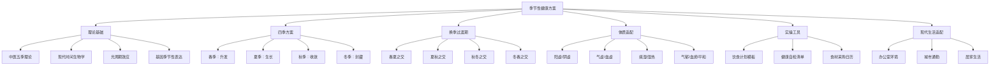

## 七、季节性健康方案

季节更替不只是日历翻页——气温、光照、湿度、气压的变化直接影响人体的内分泌节律、免疫功能、代谢速率和情绪状态。《黄帝内经》提出"春生、夏长、秋收、冬藏"的养生总纲，现代时间生物学（Chronobiology）也证实：人体的激素分泌、体温调节、免疫应答都存在显著的季节性波动。哈佛医学院2015年发表在《Nature Communications》的研究发现，人类基因组中超过4000个基因的表达存在季节性变化，其中免疫相关基因在冬季表达最活跃，炎症相关基因在夏季表达最高。

掌握季节性健康方案，本质上是学会"顺势而为"——在正确的时间做正确的事，让身体与自然节律同步，事半功倍地维护健康。

### 7.1 理论基础：为什么季节影响健康

#### 7.1.1 中医五季理论

中医将一年分为五季——春、夏、长夏、秋、冬，分别对应五行（木、火、土、金、水）和五脏（肝、心、脾、肺、肾）。这并非玄学，而是古人对人体与自然环境长期观察的经验总结：

| 季节 | 五行 | 对应脏腑 | 生理特点 | 养生原则 | 时间段 |
|------|------|----------|----------|----------|--------|
| 春 | 木 | 肝 | 气机升发，肝气旺盛 | 疏肝理气，养血柔肝 | 立春至立夏（2-5月） |
| 夏 | 火 | 心 | 阳气最盛，心火旺盛 | 清心安神，养阴生津 | 立夏至小暑（5-7月） |
| 长夏 | 土 | 脾 | 湿热交蒸，脾易受困 | 健脾祛湿，和胃化浊 | 小暑至立秋（7-8月） |
| 秋 | 金 | 肺 | 燥气当令，肺阴易伤 | 润肺防燥，滋阴养肺 | 立秋至立冬（8-11月） |
| 冬 | 水 | 肾 | 阳气内收，肾精当藏 | 温肾藏精，避寒保暖 | 立冬至立春（11-2月） |

五季理论的核心逻辑是"天人相应"：自然界有什么样的气候特征，人体就产生什么样的生理反应。春天树木生发、肝气主升；夏天烈日炎炎、心火旺盛；长夏暑湿交困、脾胃受累；秋天干燥肃杀、肺阴易伤；冬天万物闭藏、肾精蛰伏。理解这套对应关系，季节性养生就有了"纲"——纲举则目张。

#### 7.1.2 现代科学验证

**光周期效应**：日照时长变化通过视网膜-下丘脑通路影响松果体分泌褪黑素。冬季日照减少导致褪黑素分泌增加，这解释了冬季嗜睡和季节性情绪障碍（SAD）的高发。北欧国家SAD发病率高达10-20%，而热带地区不足1%。光周期还通过视交叉上核（SCN）调控皮质醇的昼夜节律——冬季皮质醇峰值延迟，导致早晨更难清醒。

**维生素D季节性波动**：皮肤合成维生素D依赖紫外线B（UVB），冬季高纬度地区UVB强度下降90%以上。一项覆盖14个国家的荟萃分析显示，冬季维生素D水平比夏季低30-50%，直接影响钙吸收、免疫功能和情绪调节。在中国北方地区（北纬40°以上），11月至次年2月几乎无法通过日照合成足够的维生素D。

**免疫节律**：瑞典卡罗林斯卡医学院2015年的研究发现，免疫细胞中T细胞和B细胞的数量和活性呈现显著的季节性变化。冬季免疫系统对感染的应答更活跃，而夏季免疫抑制性更强——这解释了为什么流感高发在冬季，而过敏高发在春夏。具体而言，冬季血液中促炎性细胞因子（如IL-6、TNF-α）水平升高，对病原体的杀伤力增强，但同时也意味着自身免疫性疾病在冬季更容易加重。

**代谢速率**：日本东北大学的研究表明，人体基础代谢率在冬季比夏季高约10-15%，这也是为什么冬季更容易感到饥饿、更需要热量摄入。这种代谢率的季节性波动与甲状腺激素T3的水平变化密切相关——冬季T3水平升高，驱动产热增加。

**肠道菌群的季节性变化**：2018年发表在《Science》的研究（来自Hadza狩猎采集者和美国人群的数据）发现，肠道菌群组成呈现显著的季节性波动。夏季拟杆菌属增加，冬季厚壁菌门增加。这些变化直接影响消化效率、免疫调节甚至情绪状态。饮食的季节性调整不仅是为了营养，也是为了维持健康的肠道微生态。

**基因的季节性表达**：除了前述哈佛研究的4000+基因，2015年《Nature Medicine》的一项研究还发现，与血压调节相关的基因在冬季表达模式改变，解释了冬季血压升高的分子基础。这些发现表明，季节性养生不是传统玄学，而是有坚实的分子生物学基础。

#### 7.1.3 换季期的特殊挑战

季节交替的2-3周（通常在立春、立夏、立秋、立冬前后）是健康最脆弱的时期：

- **温度骤变**：昼夜温差可达15°C以上，血管频繁收缩扩张，心脑血管事件风险增加20-30%。特别是秋冬季转换期（10-11月），中国北方地区24小时内温差可达20°C，血管痉挛风险显著上升。
- **气压波动**：低气压系统过境时，关节腔内外压力失衡，关节炎患者症状加重。气压每下降10hPa，偏头痛发作风险增加约7%。
- **病原体活跃**：温度和湿度的剧烈变化为病毒和细菌提供了理想的繁殖环境。秋冬换季时，流感病毒在低温（5°C）低湿（20-40%RH）环境中存活时间长达数小时，而夏季高温高湿环境下仅存活数分钟。
- **内分泌调节滞后**：身体的适应机制需要2-3周才能跟上环境变化，期间免疫力暂时下降。皮质醇、甲状腺激素、性激素的分泌节律都需要重新校准。
- **微生物组震荡**：肠道菌群对饮食和环境变化高度敏感，换季期间饮食结构的突然改变会导致菌群失衡，表现为消化不良、腹胀或便秘。

换季期的应对策略不是等到换季才行动，而是在季节到来前2周就开始渐进式调整。

### 7.2 春季健康方案（立春至立夏，2-5月）

#### 7.2.1 春季生理特点

春天阳气升发，万物复苏，人体的新陈代谢开始加速。从中医角度看，春季肝气当令，肝主疏泄、主藏血，肝气顺畅则全身气机调达。从现代医学看，春季日照时间逐渐增长，褪黑素分泌减少，血清素（5-HT）水平回升，人的情绪和精力开始恢复。

但春季也是"百草回芽，百病发作"的季节：花粉浓度飙升、细菌繁殖加快、气温忽冷忽热，过敏性疾病、呼吸道感染、精神疾病（躁狂症高发期）都需要警惕。此外，春季气压变化频繁，偏头痛患者发作频率增加约30%。

**春季生理变化的三阶段**：

| 阶段 | 时间 | 气候特点 | 身体反应 | 重点防范 |
|------|------|----------|----------|----------|
| 早春（余寒期） | 2-3月 | 气温回升但反复，昼夜温差大 | 血管调节不稳定，免疫力低谷 | 呼吸道感染、心脑血管事件 |
| 仲春（升发期） | 3-4月 | 万物萌发，花粉爆发 | 过敏反应高发，肝气旺盛 | 花粉过敏、情绪波动 |
| 暮春（渐热期） | 4-5月 | 气温明显升高，湿气增加 | 代谢加速，湿气困脾 | 春困、消化不良 |

#### 7.2.2 饮食方案

**核心原则**：省酸增甘，以养脾气；多吃绿色，疏肝理气。

春季肝气旺盛，酸味入肝，过食酸味会使肝气过亢而克制脾胃。甘味入脾，适量甘味食物能补益脾胃，维持肝脾平衡。这里说的"甘味"不是指甜食，而是自然甘甜的食物，如山药、大枣、南瓜等。

**推荐食物清单**：

| 类别 | 食物 | 功效 | 每周建议频次 | 食用方式 | 选购要点 |
|------|------|------|------------|----------|----------|
| 绿色蔬菜 | 菠菜 | 养血润燥，富含叶酸和铁 | 3-4次 | 焯水凉拌、煮汤 | 叶片挺直、根部紫红为新鲜 |
| 绿色蔬菜 | 芹菜 | 平肝清热，降血压 | 3-4次 | 清炒、榨汁 | 茎秆翠绿、无空心 |
| 绿色蔬菜 | 韭菜 | 温肾助阳，行气活血 | 2-3次 | 鸡蛋炒、包饺子 | "春韭"最嫩，叶片窄而挺 |
| 绿色蔬菜 | 荠菜 | 清肝明目，利水消肿 | 2-3次 | 凉拌、做馅 | 野生荠菜香气浓，3-4月最佳 |
| 绿色蔬菜 | 春笋 | 通肠排便，清热化痰 | 2-3次 | 油焖、炖汤 | 选矮胖笋，外壳紧实有光泽 |
| 甘味食物 | 山药 | 健脾养胃，补肺益肾 | 4-5次 | 蒸食、煮粥、炖汤 | 铁棍山药口感绵密，淮山药偏脆 |
| 甘味食物 | 大枣 | 补中益气，养血安神 | 每日3-5颗 | 直接食用、泡水 | 若羌红枣甜度高，和田枣肉厚 |
| 甘味食物 | 蜂蜜 | 润燥解毒，补中缓急 | 每日1-2勺 | 温水冲服（≤60°C） | 洋槐蜜清热，枣花蜜养血 |
| 升发食物 | 豆芽 | 升发阳气，清热利湿 | 3-4次 | 清炒、凉拌 | 自发豆芽最安全，3-4天即成 |
| 升发食物 | 香椿 | 清热解毒，健脾理气 | 1-2次 | 炒蛋、凉拌（需焯水） | 谷雨前采摘的最嫩，焯水去亚硝酸盐 |

**春季一周食谱示例**：

| | 早餐 | 午餐 | 晚餐 | 茶饮 |
|--|------|------|------|------|
| 周一 | 山药小米粥 + 水煮蛋 | 荠菜饺子 + 紫菜蛋花汤 | 清炒菠菜 + 蒸鱼 + 糙米饭 | 菊花枸杞茶 |
| 周二 | 红枣燕麦粥 + 坚果 | 韭菜炒鸡蛋 + 凉拌春笋 + 米饭 | 番茄豆腐汤 + 清炒芹菜 | 玫瑰花茶 |
| 周三 | 蜂蜜柠檬水 + 全麦面包 | 豆芽炒肉丝 + 山药排骨汤 | 荠菜馄饨 | 薄荷柠檬水 |
| 周四 | 南瓜小米粥 + 蒸蛋 | 香椿炒蛋 + 芹菜百合 + 米饭 | 菠菜猪肝汤 + 杂粮饭 | 菊花枸杞茶 |
| 周五 | 山药红枣粥 + 核桃 | 春笋炖鸡 + 凉拌黄瓜 + 米饭 | 清炒时蔬 + 蒸南瓜 | 玫瑰花茶 |
| 周六 | 豆浆 + 荞麦饼 + 水果 | 韭菜盒子 + 绿豆汤 | 清蒸鲈鱼 + 蒜蓉西兰花 | 薄荷柠檬水 |
| 周日 | 八宝粥 + 蒸饺 | 山药炖排骨 + 荠菜豆腐汤 | 杂粮饭 + 清炒时蔬 | 菊花枸杞茶 |

**春季茶饮推荐**：

- **菊花枸杞茶**：菊花3g + 枸杞5g + 决明子3g，沸水冲泡。清肝明目，适合长时间用眼者。每日1-2杯。杭白菊偏清热，贡菊偏明目，根据需要选择。
- **玫瑰花茶**：玫瑰花5朵 + 陈皮3g，80°C水冲泡。疏肝解郁，适合情绪低落、胸闷者。每日1杯。注意选用食用玫瑰（重瓣红玫瑰），不要用观赏品种。
- **薄荷柠檬水**：薄荷叶3片 + 柠檬2片 + 蜂蜜适量，温水冲泡。提神醒脑，缓解春困。上午饮用最佳，下午3点后避免（薄荷有提神作用，可能影响睡眠）。

**春季饮食禁忌**：

- 减少酸味食物过量摄入（醋、柠檬、山楂不宜每日大量食用），酸味收敛，过多则抑制肝气疏泄
- 避免过于油腻的冬季进补食物残留，脾胃需要从冬季高脂饮食中逐步过渡
- 忌食发物（有旧疾或过敏体质者）：海鲜、羊肉、竹笋、蘑菇，这些食物含有组胺或促进组胺释放的成分，加重过敏反应
- 春季肝火旺者少食辛辣刺激食物，辣椒素刺激交感神经，加剧肝阳上亢

#### 7.2.3 运动方案

**核心原则**：舒展为主，缓和渐进，多做户外活动。

春季运动的关键是"舒展"——通过拉伸和柔韧性训练帮助肝气疏泄，同时利用日益增长的日照调节生物钟。运动强度应从冬季的低水平逐步提升，给心血管系统2-3周的适应期。

**推荐运动方案**：

| 运动类型 | 频率 | 时长 | 强度 | 最佳时间 | 具体建议 |
|----------|------|------|------|----------|----------|
| 快走/慢跑 | 4-5次/周 | 30-45min | 中等 | 上午9-11点 | 公园绿地，避开花粉高峰期（5-10点） |
| 瑜伽 | 3-4次/周 | 45-60min | 低-中 | 早晨或傍晚 | 侧重脊柱扭转和侧弯体式（如三角式、扭转半月式） |
| 太极拳 | 3-5次/周 | 30-40min | 低 | 清晨 | 户外练习效果更佳，24式简化太极适合初学者 |
| 骑行 | 2-3次/周 | 40-60min | 中等 | 上午 | 选择空气清新的路线，避开主干道尾气 |
| 放风筝 | 1-2次/周 | 60-90min | 低 | 周末 | 仰头动作缓解颈椎疲劳，适合久坐办公族 |

**春季瑜伽推荐体式**：

| 体式 | 功效 | 保持时间 | 要点 |
|------|------|----------|------|
| 猫牛式 | 灵活脊柱，疏通肝胆经 | 8-10次 | 配合呼吸，吸气牛式，呼气猫式 |
| 三角伸展式 | 拉伸侧腰，疏肝理气 | 每侧30秒 | 髋部打开，脊柱延展 |
| 坐姿扭转 | 按摩内脏，促进排毒 | 每侧30秒 | 坐骨扎根，脊柱向上延展后扭转 |
| 婴儿式 | 放松背部，缓解焦虑 | 1-3分钟 | 额头触地，手臂前伸或放体侧 |
| 桥式 | 打开胸腔，补肾强腰 | 30-60秒 | 膝盖对齐脚尖，尾骨内卷 |

**春季运动注意事项**：

- 运动前充分热身10-15分钟，冬季僵硬的肌肉和关节需要更长的激活时间
- 过敏体质者避免在花粉浓度高的时段（上午5-10点）进行户外运动
- 花粉季户外运动后立即洗脸、洗手、换衣服，减少过敏原接触
- 运动强度循序渐进，不要因为天气转暖就突然加大运动量
- 春季风大，运动出汗后及时加衣，避免风邪侵袭

#### 7.2.4 春季重点防范

**花粉过敏**：中国北方春季花粉高峰期在3-5月，主要致敏花粉为柏树、杨树、柳树。症状包括打喷嚏、流清涕、鼻塞、眼痒、流泪。花粉过敏的免疫机制是IgE介导的I型超敏反应——花粉颗粒进入鼻腔黏膜后，与肥大细胞表面的IgE抗体结合，触发组胺释放，引发炎症反应。

应对策略：
- 查看每日花粉指数（中国天气网、花粉监测APP），花粉浓度>300粒/千平方毫米时减少外出
- 外出佩戴N95口罩和护目镜，回家后用生理盐水冲洗鼻腔
- 室内关闭窗户，使用带HEPA滤网的空气净化器（CADR值≥300m³/h）
- 提前2周开始使用鼻用糖皮质激素喷雾（如布地奈德），比等发作再用效果好3-5倍
- 严重者可在医生指导下进行脱敏治疗（皮下注射或舌下含服），疗程3-5年，有效率约80%
- 花粉季衣物不要在室外晾晒，使用烘干机或室内晾晒

**春困**：春季气温回升，体表血管扩张，大脑供血相对减少；加上褪黑素分泌节律调整期，容易出现困倦、乏力。这是身体从冬季代谢模式向夏季代谢模式过渡的正常反应，不是疾病。

应对策略：
- 保证7-8小时睡眠，23:00前入睡，固定起床时间（包括周末）
- 午间小睡15-20分钟（不超过30分钟），超过30分钟进入深睡眠，醒来更困
- 上午晒太阳15-30分钟，帮助调整生物钟，抑制褪黑素分泌
- 适量饮用绿茶或薄荷茶提神，避免过度依赖咖啡（每日咖啡因不超过400mg）
- 办公室保持通风，CO₂浓度超过1000ppm时认知能力下降15-20%

**情绪波动**：春季是躁狂症和双相情感障碍的高发期。日照时间快速增加、褪黑素急剧减少可能导致情绪不稳定的个体出现躁狂发作。同时，肝气过旺在中医看来也会导致"怒伤肝"——暴躁易怒。

应对策略：
- 保持规律作息，避免熬夜（褪黑素分泌节律紊乱是躁狂发作的诱因之一）
- 饮食中增加富含Omega-3的食物（深海鱼、亚麻籽），研究显示Omega-3对情绪稳定有帮助
- 练习正念冥想，每天10-15分钟，帮助觉察情绪变化
- 避免过度饮酒和刺激性活动
- 如果出现持续失眠（连续3天以上每晚睡眠不足4小时且不疲倦）、思维奔逸、冲动消费等症状，立即就医

### 7.3 夏季健康方案（立夏至立秋，5-8月）

#### 7.3.1 夏季生理特点

夏季阳气最盛，人体的新陈代谢达到全年最高峰。中医认为"夏气通心"，心主血脉、主神明，夏季心火旺盛，容易出现心烦、失眠、口舌生疮等症状。从现代医学看，高温导致体表血管扩张、心脏负荷增加、出汗增多导致电解质流失、消化功能相对减弱。

长夏（7-8月）湿热交蒸，是脾胃疾病高发期。高湿度环境影响散热效率（汗液无法有效蒸发），中暑风险大幅上升。

**夏季生理变化的三阶段**：

| 阶段 | 时间 | 气候特点 | 身体反应 | 重点防范 |
|------|------|----------|----------|----------|
| 初夏（渐热期） | 5-6月 | 气温升高，湿度适中 | 代谢加速，食欲微降 | 中暑先兆、消化不良 |
| 盛夏（酷热期） | 7-8月 | 高温高湿，闷热难耐 | 心脏负荷大，电解质流失 | 中暑、肠道感染、空调病 |
| 长夏（湿困期） | 7-8月 | 湿热交蒸，闷热潮湿 | 脾胃功能减弱，湿气困重 | 脾胃疾病、湿疹、真菌感染 |

#### 7.3.2 饮食方案

**核心原则**：清热祛暑，养心安神，健脾祛湿。

夏季饮食的关键词是"清"和"补"——清热解暑的同时，不能忽视营养补充，因为高温加速代谢、大量出汗损失电解质。中医讲"心与夏气相通"，红色食物入心，苦味食物清心火。

**推荐食物清单**：

| 类别 | 食物 | 功效 | 食用方式 | 注意事项 |
|------|------|------|----------|----------|
| 清热类 | 苦瓜 | 清热解暑，明目解毒 | 凉拌、炒食、榨汁 | 脾胃虚寒者少食；苦瓜素有降糖作用，糖尿病患者注意监测血糖 |
| 清热类 | 绿豆 | 清热解毒，消暑利水 | 煮汤（不加碱） | 绿豆汤煮10分钟清热效果最佳，煮烂后解毒效果更好 |
| 清热类 | 冬瓜 | 利水消肿，清热化痰 | 炖汤、清炒 | 连皮煮效果更好，冬瓜皮利水效果是瓜肉的2倍 |
| 养心类 | 莲子 | 养心安神，健脾止泻 | 煮粥、炖汤 | 去除莲子心以免苦寒（除非心火旺盛需要清心） |
| 养心类 | 百合 | 润肺止咳，清心安神 | 煮粥、炒食 | 鲜百合更佳，干百合需泡发4小时以上 |
| 养心类 | 番茄 | 生津止渴，养阴凉血 | 生吃、炒食、做汤 | 番茄红素加油烹饪吸收率提升3倍 |
| 祛湿类 | 薏米 | 健脾渗湿，清热排脓 | 煮粥、煮水 | 生薏米偏寒凉利水，炒薏米偏健脾，根据体质选择 |
| 祛湿类 | 赤小豆 | 利水消肿，解毒排脓 | 煮汤、煮粥 | 注意与红豆区分：赤小豆细长、红豆圆胖，药用选赤小豆 |
| 补水类 | 西瓜 | 清热解暑，除烦止渴 | 鲜食、榨汁 | 每次200-300g，冰镇不宜过量；糖尿病患者控制在100g以内 |
| 补水类 | 黄瓜 | 清热利水，生津止渴 | 凉拌、生食 | 含水量96%，天然补水佳品 |

**夏季饮水策略**：

夏季出汗量可达平时的3-5倍，科学补水是夏季健康的头等大事。中暑的根本原因就是水分和电解质的双重丢失导致体温调节失灵。

- **日常饮水量**：体重(kg) × 35ml + 出汗补偿（每小时中等强度运动额外500-750ml）。例如70kg的人，日常饮水约2450ml，运动日需要3000ml以上。
- **饮水方式**：少量多次，每15-20分钟喝150-200ml，不要等到口渴才喝。口渴时身体已经缺水1-2%，认知能力已经开始下降。
- **电解质补充**：出汗超过1小时，需要补充含电解质的饮品。自制配方：1L温水 + 3g盐（约半啤酒瓶盖）+ 20g蜂蜜 + 半个柠檬汁。商业运动饮料含糖量高（6-8%），日常饮用不推荐。
- **饮品选择**：温开水最佳，绿豆汤、酸梅汤次之；避免冰水（刺激胃肠血管收缩，反而影响散热，且可能引发胃肠痉挛）。
- **判断水合状态**：尿液颜色浅黄色为正常，深黄色说明缺水，无色可能饮水过量（低钠血症风险）。

**夏季一周食谱示例**：

| | 早餐 | 午餐 | 晚餐 | 汤/饮 |
|--|------|------|------|-------|
| 周一 | 绿豆粥 + 凉拌黄瓜 | 番茄鸡蛋面 + 凉拌苦瓜 | 清蒸鲈鱼 + 蒜蓉丝瓜 + 杂粮饭 | 酸梅汤 |
| 周二 | 莲子百合粥 + 水煮蛋 | 冬瓜排骨汤 + 凉拌木耳 + 米饭 | 清炒丝瓜 + 蒸南瓜 | 绿豆汤 |
| 周三 | 薏米红豆粥 + 全麦面包 | 苦瓜炒蛋 + 丝瓜虾仁 + 米饭 | 凉拌豆腐 + 清炒时蔬 | 西瓜汁 |
| 周四 | 银耳莲子羹 + 坚果 | 番茄牛腩 + 凉拌黄瓜 + 米饭 | 百合炒西芹 + 杂粮粥 | 酸梅汤 |
| 周五 | 荷叶粥 + 蒸饺 | 冬瓜薏米汤 + 清炒丝瓜 + 米饭 | 凉拌鸡丝 + 蒸茄子 | 绿豆汤 |
| 周六 | 山药小米粥 + 水果 | 苦瓜排骨汤 + 蒜蓉空心菜 + 米饭 | 清蒸鱼 + 凉拌豆皮 | 西瓜汁 |
| 周日 | 莲子银耳汤 + 包子 | 冬瓜虾仁汤 + 凉拌苦瓜 + 米饭 | 杂粮饭 + 清炒时蔬 | 酸梅汤 |

**夏季饮食禁忌**：

- 冰镇食物/饮料不宜过量，温度不低于10°C，每次冰饮不超过200ml
- 隔夜凉菜细菌繁殖快（室温下2小时菌落数可翻10倍），当餐吃完
- 海鲜搭配生姜、紫苏叶等温性调料，中和寒性并杀菌
- 烧烤、油炸食品增加体内湿热，每周不超过1次
- 切开的西瓜在室温下放置不超过4小时，冷藏不超过24小时

#### 7.3.3 运动方案

**核心原则**：避开高温，控制强度，及时补水。

**推荐运动方案**：

| 运动类型 | 频率 | 时长 | 强度 | 最佳时间 | 优势 |
|----------|------|------|------|----------|------|
| 游泳 | 3-4次/周 | 30-60min | 中等 | 上午或傍晚 | 全身运动+散热效果最好，关节压力小 |
| 晨跑 | 3-4次/周 | 20-40min | 低-中 | 6:00-7:30 | 气温最低，空气清新 |
| 傍晚散步 | 每日 | 30-45min | 低 | 18:00-20:00 | 消食助眠，适合全家参与 |
| 室内瑜伽 | 3-4次/周 | 40-60min | 低-中 | 任意时间 | 空调房内，阴瑜伽为佳（拉伸为主，强度低） |
| 室内力量训练 | 2-3次/周 | 30-45min | 中-高 | 任意时间 | 空调房内，注意补水 |

**夏季运动安全红线**：

- 气温≥35°C或相对湿度≥80%时，避免户外剧烈运动
- 湿球黑球温度（WBGT）指数≥28°C时，运动时间缩短50%
- 运动中每15分钟补水150-200ml
- 出现头晕、恶心、皮肤发红发烫时立即停止运动，转移至阴凉处
- 运动后不要立即冷水冲澡，等待心率恢复至100次/分钟以下再用温水淋浴

**中暑识别与急救**：

| 阶段 | 症状 | 体温 | 处理方法 |
|------|------|------|----------|
| 先兆中暑 | 头晕、乏力、口渴、多汗 | 正常或略高 | 转移阴凉处，补水，休息，10-15分钟可缓解 |
| 轻症中暑 | 恶心呕吐、头痛、肌肉痉挛 | 38-40°C | 阴凉处平卧，物理降温（冰敷颈动脉、腋窝、腹股沟），口服补液盐 |
| 重症中暑（热射病） | 意识模糊、皮肤干热无汗、抽搐 | >40°C | 立即拨打120，冰敷大动脉，不要给意识不清者灌水，将冰水浸湿的毛巾覆盖全身 |

热射病是真正的急症，死亡率高达60-80%。核心体温每升高1°C，细胞损伤呈指数级增长。"黄金30分钟"内将核心体温降至39°C以下是存活的关键。任何人在高温环境下出现意识改变，都应首先考虑热射病。

#### 7.3.4 夏季重点防范

**空调病**：长时间待在空调环境导致的症状群——鼻塞、头痛、关节酸痛、皮肤干燥。空调房内相对湿度通常只有30-40%（舒适范围40-60%），加上室内外温差大，呼吸道黏膜反复经历干燥-潮湿的切换，防御功能下降。

应对策略：
- 空调温度设为26-28°C，室内外温差不超过7°C
- 每2小时开窗通风10-15分钟，或使用新风系统
- 避免空调直吹，尤其是头颈部和腰腹部
- 定期清洗空调滤网（每2周一次），蒸发器每年专业清洗一次
- 在空调房内披薄外套，穿长裤
- 空调房内放一盆水或使用加湿器，保持湿度40-60%

**肠道传染病**：夏季是细菌性痢疾、诺如病毒、沙门氏菌感染的高发期。30-40°C是大多数食源性致病菌的最适繁殖温度，在这个范围内，细菌每20分钟分裂一次，一份被污染的食物在室温下放置4小时，细菌可从100个增至数百万个。

应对策略：
- 饭前便后洗手，用肥皂或洗手液揉搓≥20秒
- 生熟食物分开存放和加工，使用不同砧板
- 冰箱冷藏室温度≤4°C，冷冻室≤-18°C（冰箱不是保险箱，冷藏只能延缓细菌繁殖，不能杀灭）
- 剩菜冷藏不超过2天，食用前彻底加热至70°C以上保持2分钟
- 不食用生冷海鲜（尤其是贝类），贝类是甲肝和诺如病毒的高风险载体
- 外出就餐选择卫生条件良好的餐厅，避免路边摊的凉菜和切开的水果

**皮肤问题**：夏季皮脂分泌旺盛、汗液刺激、紫外线损伤，是痤疮、湿疹、真菌感染的高发期。

应对策略：
- 每日清洁面部2次，选用氨基酸洁面产品，避免皂基洁面（过度清洁反而刺激皮脂分泌）
- 油性皮肤使用含水杨酸（2%）或烟酰胺（5%）的护肤品控油
- 痱子：保持皮肤干燥，使用痱子粉或炉甘石洗剂
- 真菌感染（足癣、股癣）：保持患处干燥，穿透气鞋袜，使用抗真菌药膏（如特比萘芬）
- 紫外线防护：SPF30+、PA+++以上的防晒霜，每2小时补涂一次，用量约一元硬币大小涂满全脸

### 7.4 秋季健康方案（立秋至立冬，8-11月）

#### 7.4.1 秋季生理特点

秋季阳气渐收，阴气渐长，空气湿度急剧下降。中医认为"秋气通肺"，肺为娇脏，喜润恶燥，秋季燥邪最容易伤肺。从现代医学看，秋季空气干燥导致呼吸道黏膜防御功能下降、皮肤水分流失加速、昼夜温差增大导致血管频繁收缩扩张。

秋季还是"悲秋"情绪的高发期，日照时间缩短影响血清素合成，加上万物萧瑟的视觉刺激，抑郁和焦虑的发生率比夏季高15-20%。

**秋季生理变化的三阶段**：

| 阶段 | 时间 | 气候特点 | 身体反应 | 重点防范 |
|------|------|----------|----------|----------|
| 初秋（余暑期） | 8-9月 | "秋老虎"，仍有高温 | 暑湿未消，脾胃仍弱 | 不宜大补，消化不良 |
| 仲秋（凉燥期） | 9-10月 | 气温下降，空气干燥 | 皮肤干燥，呼吸道不适 | 秋燥、过敏性鼻炎 |
| 深秋（寒露期） | 10-11月 | 气温骤降，昼夜温差大 | 血管收缩，免疫波动 | 感冒、心脑血管事件 |

#### 7.4.2 饮食方案

**核心原则**：润肺防燥，滋阴养津，少辛增酸。

秋季饮食的核心是"润"——通过食物补充体液，对抗干燥。中医讲"秋季养肺"，白色食物入肺，酸味食物收敛肺气。辛味发散，会加重肺气消耗，所以秋季应减少辛辣食物。

**推荐食物清单**：

| 类别 | 食物 | 功效 | 每周建议频次 | 食用方式 | 选购要点 |
|------|------|------|------------|----------|----------|
| 润肺类 | 雪梨 | 生津润燥，清热化痰 | 4-5次 | 生食、蒸食、炖汤 | 库尔勒香梨润肺最佳，鸭梨清热更好 |
| 润肺类 | 银耳 | 润肺养阴，益胃生津 | 3-4次 | 炖汤（炖至胶质析出） | 选微黄的，过白可能硫磺熏蒸 |
| 润肺类 | 百合 | 润肺止咳，清心安神 | 3-4次 | 煮粥、蒸食、炒食 | 兰州百合味甜可生食，龙牙百合入药 |
| 润肺类 | 山药 | 补肺健脾，固肾益精 | 4-5次 | 蒸食、煮粥、炖汤 | 铁棍山药粉糯，适合蒸食；菜山药脆，适合炒食 |
| 滋阴类 | 蜂蜜 | 润燥通便，补中益气 | 每日1-2勺 | 温水冲服 | 秋季选枇杷蜜或荆条蜜，润肺效果更好 |
| 滋阴类 | 芝麻 | 补肝肾，润肠燥 | 每日一小勺 | 磨粉、拌饭、做糊 | 黑芝麻优于白芝麻，现磨吸收更好 |
| 滋阴类 | 核桃 | 补肾温肺，润肠通便 | 每日2-3颗 | 直接食用、打糊 | 纸皮核桃易剥，但香气不如厚壳核桃 |
| 酸味类 | 葡萄 | 补气血，强筋骨 | 3-4次 | 鲜食 | 紫葡萄花青素含量高，绿葡萄维C更丰富 |
| 酸味类 | 石榴 | 收敛固涩，生津止渴 | 2-3次 | 鲜食、榨汁 | 软籽石榴可直接吞籽，增加膳食纤维摄入 |
| 酸味类 | 山楂 | 消食化积，活血散瘀 | 2-3次 | 泡水、炖肉 | 鲜山楂酸度高，胃酸过多者选山楂干 |

**秋季养生汤品**：

- **冰糖雪梨银耳汤**：雪梨1个去核切块 + 银耳半朵泡发撕碎 + 冰糖10g + 枸杞5g，小火炖40分钟。润肺止咳，养阴生津。银耳一定要炖至胶质完全析出（至少30分钟），否则营养吸收差。
- **百合莲子粥**：大米100g + 百合20g + 莲子15g + 冰糖适量，大火煮沸后小火熬30分钟。清心安神，润肺健脾。莲子提前泡2小时更容易煮烂。
- **沙参玉竹老鸭汤**：沙参15g + 玉竹15g + 老鸭半只，炖2小时。滋阴清热，润肺养胃，是广东经典秋季汤方。鸭肉性凉，适合阴虚有热体质。
- **川贝炖雪梨**：雪梨1个去核 + 川贝粉3g + 冰糖适量，隔水炖1小时。适合干咳无痰者。注意：有痰者不宜用川贝，川贝收敛，有痰则闭门留寇。

**秋季饮食禁忌**：

- 减少辛辣食物（葱、姜、蒜、辣椒），辛味发散会加重肺气消耗。秋季每日辣椒摄入量建议控制在5g以内。
- 少食煎炸烧烤食物，燥上加燥，高温烹饪产生的丙烯酰胺等有害物质也增加健康风险。
- 避免过于寒凉的夏季食物残留习惯（冰饮、凉菜应减量），脾胃需要逐步过渡到温性饮食。
- 秋季进补宜平补，不宜大补（大补留到冬季）。初秋仍以清淡为主，仲秋开始适量增加温补食物。

#### 7.4.3 运动方案

**核心原则**：保持规律，适当增量，注意保暖。

秋季气候宜人，是一年中运动的黄金季节——气温适中（15-25°C），空气湿度舒适，人体运动表现达到全年最佳。但早晚温差大（可达10-15°C），运动时的热身和保暖比其他季节更重要。

**推荐运动方案**：

| 运动类型 | 频率 | 时长 | 强度 | 最佳时间 | 特别建议 |
|----------|------|------|------|----------|----------|
| 跑步 | 4-5次/周 | 30-50min | 中等 | 上午9-11点 | 秋季可以适当增加跑量，为冬季储备心肺耐力 |
| 登山/徒步 | 1-2次/周 | 2-4h | 中等 | 周末 | 锻炼心肺+享受秋景，注意下山时保护膝盖 |
| 球类运动 | 2-3次/周 | 60-90min | 中-高 | 下午 | 篮球、羽毛球、乒乓球，社交+运动 |
| 太极拳 | 3-5次/周 | 30-45min | 低 | 清晨 | 注意保暖，穿长袖，秋季晨练不宜太早（7点后） |
| 力量训练 | 3次/周 | 40-60min | 中-高 | 任意时间 | 为冬季储备体能和肌肉量 |

**秋季运动特别注意**：

- 运动前热身时间延长至15分钟，低温下肌肉和关节更僵硬
- 运动后及时加衣保暖，避免汗湿衣服在冷风中降温导致感冒
- 空气干燥，运动中补水比夏季更重要（即使不觉得渴也要喝）
- 雾霾天避免户外运动，PM2.5>100时改为室内运动
- 秋季日照缩短，如果安排傍晚运动，注意天黑时间，户外运动带反光装备

#### 7.4.4 秋季重点防范

**秋燥**：口干舌燥、皮肤干裂、便秘、干咳少痰。秋燥分为"温燥"（初秋，暑热未消）和"凉燥"（深秋，寒意渐浓），应对方法有所不同。

| 类型 | 时间 | 症状特点 | 饮食对策 |
|------|------|----------|----------|
| 温燥 | 8-9月 | 口干、咽痛、痰少而黄 | 润肺清热：梨、藕、百合、银耳 |
| 凉燥 | 10-11月 | 鼻塞、咽干、痰少而白 | 润肺散寒：杏仁、紫苏、生姜+蜂蜜 |

应对策略：
- 每日饮水量保持2000ml以上，分8-10次饮用
- 室内使用加湿器，湿度维持在45-65%（用湿度计监测）
- 护肤品从夏季清爽型更换为保湿型（含神经酰胺、透明质酸、角鲨烷成分）
- 鼻腔干燥可用生理盐水喷雾（每日3-4次），不要用手抠鼻子
- 饮食中增加银耳、蜂蜜、梨等润燥食物
- 嘴唇干裂涂含蜂蜡的润唇膏，不要舔嘴唇（唾液蒸发后更干）

**呼吸道感染**：秋季气温骤降，呼吸道黏膜防御功能下降，是流感、普通感冒的高发期。冷空气还会刺激气管痉挛，哮喘患者发作频率增加。

应对策略：
- 9-10月接种流感疫苗（接种后2-4周产生保护性抗体），保护率约60-80%
- 勤洗手，避免用手触摸口鼻眼
- 人群密集场所佩戴口罩
- 室内定期通风，每天至少2次，每次15-30分钟
- 保持规律作息和充足睡眠，睡眠不足6小时的人感冒风险增加4.2倍（卡内基梅隆大学研究）
- 哮喘患者随身携带急救药物（沙丁胺醇吸入剂）

**悲秋情绪**：日照减少导致血清素水平下降，加上"秋风萧瑟"的心理暗示，容易出现情绪低落。这不是矫情，而是有神经内分泌基础的季节性反应。

应对策略：
- 每天晒太阳30分钟以上（上午10点前最佳），促进血清素合成
- 保持规律运动，运动促进内啡肽和血清素分泌，效果堪比低剂量抗抑郁药
- 培养秋季兴趣爱好：赏秋景、摄影、阅读，将"悲秋"转化为"赏秋"
- 社交活动不要因天冷而减少，孤立感是抑郁的催化剂
- 如果情绪低落持续2周以上且影响正常生活，寻求专业帮助
- 饮食中增加富含色氨酸的食物（火鸡肉、香蕉、牛奶），色氨酸是血清素的前体

### 7.5 冬季健康方案（立冬至立春，11-2月）

#### 7.5.1 冬季生理特点

冬季阳气内收，阴寒最盛，人体进入"封藏"状态。中医认为"冬气通肾"，肾为先天之本，主藏精，冬季是养肾藏精的最佳时机。从现代医学看，冬季寒冷刺激导致血管收缩、血压升高、血液黏稠度增加，心脑血管事件（心梗、脑卒中）的发生率比夏季高30-50%。同时，冬季呼吸道传染病高发，流感、肺炎、新冠等病毒在低温低湿环境中存活时间更长。

基础代谢率在冬季升高10-15%，身体需要更多热量维持体温，这也是冬季食欲增加的生理基础。冬季日照时间短（中国北方冬至日日照仅约9小时），维生素D合成几乎停止，需要额外补充。

**冬季生理变化的三阶段**：

| 阶段 | 时间 | 气候特点 | 身体反应 | 重点防范 |
|------|------|----------|----------|----------|
| 初冬（渐寒期） | 11-12月 | 气温下降，寒潮来袭 | 血管收缩，血压升高 | 心脑血管事件、感冒 |
| 仲冬（严寒期） | 12-1月 | 低温持续，日照最短 | 代谢旺盛，免疫力波动 | 流感高发、SAD、冻伤 |
| 晚冬（回暖期） | 1-2月 | 气温缓慢回升但仍寒冷 | 适应期，免疫力低谷 | 呼吸道感染、过敏开始萌发 |

#### 7.5.2 饮食方案

**核心原则**：温肾藏精，适当进补，增加热量。

冬季是一年中最适合进补的季节，但进补不等于大鱼大肉。科学进补应该是根据体质选择合适的补益食物，配合充足的蛋白质和优质脂肪。中医讲"黑色入肾"，冬季多吃黑色食物有助于补肾藏精。

**推荐食物清单**：

| 类别 | 食物 | 功效 | 食用方式 | 频率建议 |
|------|------|------|----------|----------|
| 温补类 | 羊肉 | 温中暖下，补气养血 | 炖汤、涮火锅 | 2-3次/周 |
| 温补类 | 牛肉 | 补脾胃，益气血，强筋骨 | 炖煮、红烧 | 3-4次/周 |
| 温补类 | 鸡肉 | 温中益气，补精添髓 | 炖汤、清蒸 | 2-3次/周 |
| 黑色食物 | 黑芝麻 | 补肝肾，润肠燥 | 磨粉冲服、做糊 | 每日一小勺 |
| 黑色食物 | 黑豆 | 补肾益阴，健脾利湿 | 煮粥、炖汤 | 3-4次/周 |
| 黑色食物 | 黑木耳 | 补气养血，润肺镇咳 | 凉拌、炒食 | 3-4次/周 |
| 根茎类 | 萝卜 | 消食化痰，下气宽中 | 炖汤、腌制 | 4-5次/周 |
| 根茎类 | 红薯 | 补脾益气，宽肠通便 | 蒸食、煮粥 | 3-4次/周 |
| 根茎类 | 土豆 | 和胃健脾，益气强身 | 炖煮、蒸食 | 3-4次/周 |
| 坚果类 | 核桃 | 补肾温肺，润肠通便 | 直接食用 | 每日2-3颗 |
| 坚果类 | 板栗 | 补肾强骨，健脾养胃 | 炖鸡、糖炒 | 2-3次/周 |
| 温热调料 | 生姜 | 温中散寒，回阳通脉 | 炖汤、泡水 | 每日适量 |
| 温热调料 | 肉桂 | 补火助阳，散寒止痛 | 炖肉、泡茶 | 每日少量（1-2g） |

**冬季药膳食谱**：

- **当归生姜羊肉汤**：当归15g + 生姜30g + 羊肉500g，炖2小时。出自张仲景《金匮要略》，温中补血，散寒止痛。特别适合手脚冰凉、面色苍白的阳虚体质。当归补血活血，生姜温中散寒，羊肉温补脾肾，三者配伍堪称冬季温补第一方。
- **黑芝麻核桃糊**：黑芝麻50g + 核桃30g + 糯米粉20g + 冰糖适量，打粉后沸水冲调。补肾益脑，润肠通便。黑芝麻需炒熟后打粉，生芝麻不易消化。
- **枸杞炖乌鸡**：乌鸡半只 + 枸杞15g + 红枣5颗 + 黄芪10g，炖1.5小时。补气养血，滋阴补肾。乌鸡含黑色素和多种氨基酸，滋补效果优于普通鸡肉。
- **桂圆红枣姜茶**：桂圆10颗 + 红枣5颗 + 生姜3片 + 红糖适量，煮15分钟。温经散寒，适合女性冬季手脚冰凉、经期不适。
- **山药枸杞粥**：铁棍山药100g切块 + 大米80g + 枸杞10g，煮粥。健脾补肾，平补不上火，适合体质不偏不倚的日常保养。

**冬季一周食谱示例**：

| | 早餐 | 午餐 | 晚餐 | 汤/饮 |
|--|------|------|------|-------|
| 周一 | 山药枸杞粥 + 煮鸡蛋 | 当归生姜羊肉汤 + 萝卜 + 米饭 | 蒸红薯 + 清炒时蔬 | 桂圆红枣姜茶 |
| 周二 | 黑芝麻核桃糊 + 全麦面包 | 红烧牛肉 + 炖萝卜 + 米饭 | 黑木耳炒鸡蛋 + 杂粮粥 | 枸杞菊花茶 |
| 周三 | 桂圆红枣粥 + 坚果 | 枸杞炖乌鸡 + 蒸南瓜 + 米饭 | 萝卜排骨汤 + 杂粮饭 | 生姜红糖水 |
| 周四 | 板栗粥 + 蒸饺 | 红烧羊肉 + 蒜蓉西兰花 + 米饭 | 红薯小米粥 + 清炒时蔬 | 桂圆红枣姜茶 |
| 周五 | 黑豆豆浆 + 包子 | 鸡汤面 + 凉拌黑木耳 | 蒸土豆 + 清蒸鱼 | 枸杞菊花茶 |
| 周六 | 山药红枣粥 + 水煮蛋 | 萝卜牛腩煲 + 蒸南瓜 + 米饭 | 黑芝麻核桃糊 + 杂粮饭 | 生姜红糖水 |
| 周日 | 八宝粥 + 蒸饺 | 板栗烧鸡 + 萝卜排骨汤 + 米饭 | 杂粮饭 + 清炒时蔬 | 桂圆红枣姜茶 |

**冬季饮食禁忌**：

- 忌食生冷食物（冷饮、凉菜、生鱼片），损伤脾胃阳气
- 进补要适度，过于滋腻会加重脾胃负担，出现腹胀、消化不良
- 高血压、高血脂者控制红肉摄入量，每周红肉不超过500g
- 痛风患者避免高嘌呤浓汤（骨头汤、海鲜汤），可改用蔬菜汤底
- 火锅虽然暖身，但高嘌呤、高钠、高脂肪，每周不超过1次，多涮蔬菜少涮肉

#### 7.5.3 运动方案

**核心原则**：保持运动习惯不中断，室内为主，注意防寒。

冬季运动的最大挑战是"坚持"——寒冷天气让人不想出门，但中断运动会导致心肺功能下降（2周不运动VO₂max下降5-10%）、体重增加、免疫力降低。

**推荐运动方案**：

| 运动类型 | 频率 | 时长 | 强度 | 地点 | 特别建议 |
|----------|------|------|------|------|----------|
| 室内快走/跑步 | 4-5次/周 | 30-45min | 中等 | 跑步机/商场 | 保持心肺功能 |
| 力量训练 | 3次/周 | 40-60min | 中-高 | 健身房/家 | 冬季增肌效果最佳（睾酮水平冬季最高） |
| 瑜伽 | 3-4次/周 | 45-60min | 低-中 | 室内 | 热瑜伽适合冬季，但心血管疾病患者慎选 |
| 游泳（室内恒温） | 2-3次/周 | 30-45min | 中等 | 室内泳池 | 出水后立即保暖，泳池氯气可能刺激皮肤 |
| 户外跑步 | 2-3次/周 | 20-40min | 中等 | 户外 | 气温>-10°C可行，注意防滑 |
| 滑冰/滑雪 | 1-2次/周 | 60-120min | 中-高 | 户外 | 注意安全防护，佩戴头盔和护具 |

**冬季运动特别注意**：

- 穿着分层：内层排汗（涤纶/美利奴羊毛，避免纯棉——棉吸汗后不排湿，湿冷感严重）、中层保暖（抓绒/羽绒）、外层防风（防风外套）
- 运动前热身时间延长至15-20分钟，冷环境下肌肉和韧带弹性降低，更容易受伤
- 呼吸方式：用鼻腔吸气（加温加湿空气），嘴巴呼气；极寒天气用围巾遮挡口鼻
- 雾霾天（AQI>100）绝对不要户外运动
- 运动后立即回到温暖环境，更换干燥衣物，喝温热饮品
- 冬季路面结冰，户外运动选择防滑鞋，步幅减小、步频加快

#### 7.5.4 冬季重点防范

**心脑血管疾病**：冬季是心梗和脑卒中的高发季。寒冷刺激导致血管收缩、血压升高、血液黏稠度增加，加上冬季饮水减少，血栓形成风险大幅上升。研究显示，气温每下降1°C，心梗发病率增加约2%。

高危人群（高血压、糖尿病、高血脂、吸烟者、65岁以上老人）应对策略：
- 坚持按时服药，不要自行减药停药
- 每日监测血压，冬季血压可能比夏季高5-10mmHg，必要时调整用药
- 起床"三个半分钟"：醒后躺半分钟、坐起半分钟、双腿下垂半分钟再站立，避免体位性低血压引发的跌倒和心脑血管事件
- 避免清晨（6-10点）进行剧烈运动——这个时段血液黏稠度最高、血压波动最大
- 保证每日饮水1500-2000ml，避免血液过于黏稠
- 出现胸痛、胸闷、一侧肢体无力、言语不清时立即拨打120——时间就是心肌，时间就是大脑
- 冬季泡脚水温不超过42°C，时间不超过20分钟，水温过高加重心脏负担

**流感与呼吸道传染病**：

- 每年10月前接种流感疫苗
- 65岁以上老人和慢性病患者建议接种肺炎疫苗（23价肺炎球菌疫苗）
- 勤洗手、戴口罩、保持社交距离
- 室内每天通风2-3次，每次15-20分钟（不要因为怕冷就不通风，密闭环境病毒浓度更高）
- 室内湿度保持在40-60%（加湿器辅助），过低有利于病毒存活——研究显示相对湿度低于20%时，流感病毒存活时间可延长数倍

**冬季抑郁（SAD）**：日照严重不足导致褪黑素分泌紊乱、血清素水平下降。SAD不是简单的"心情不好"，而是一种有明确生物学基础的情感障碍，影响约5%的成年人，女性发病率是男性的4倍。

应对策略：
- 光照疗法：使用10000勒克斯的光疗灯，每天早晨照射30分钟，距离灯箱30-50cm。这是SAD的一线治疗手段，有效率约60-80%。注意不要直视灯源，可以在吃早餐或阅读时使用。
- 尽可能在白天（尤其是上午）到户外接受自然光照
- 规律运动，运动促进内啡肽和血清素分泌
- 保持社交活动，避免自我封闭
- 补充维生素D（每日2000-4000IU），维生素D缺乏与SAD显著相关
- 严重者可在医生指导下使用抗抑郁药物（如SSRI类）

**冻伤预防**：

- 重点保暖部位：头部（散热量占全身30%）、颈部、手脚、耳朵
- 外出佩戴帽子、围巾、手套、保暖袜
- 鞋子选择保暖且防滑的款式
- 衣物潮湿时立即更换（湿衣服散热速度是干衣服的25倍）
- 出现皮肤苍白、麻木、刺痛时，缓慢复温（37-40°C温水浸泡15-30分钟），不要用热水（温差过大会造成二次损伤）或摩擦（摩擦破坏已受损的组织）
- 冻伤复温后皮肤会出现红肿、水泡，属于正常反应，不要刺破水泡，保持清洁干燥

### 7.6 换季过渡期的健康管理

换季的2-3周是身体最脆弱的时期，需要特别关注。核心原则是"渐进过渡"——任何改变都不要一步到位，给身体2周的适应时间。

#### 7.6.1 换季通用策略

| 方面 | 策略 | 具体操作 | 过渡周期 |
|------|------|----------|----------|
| 饮食过渡 | 渐进切换，不要突然改变 | 新季节食物从每周1-2次开始，2周内逐步增加到目标频率 | 2周 |
| 衣物调整 | 洋葱式穿衣法 | 多层薄衣优于一件厚衣，方便随温度变化增减 | 持续整个换季期 |
| 运动调整 | 减量20-30%，逐步恢复 | 换季期运动强度降低，给身体适应时间 | 2-3周 |
| 睡眠调整 | 同步调整作息 | 跟随日出日落时间微调睡眠时间，每次调整不超过15分钟 | 2-4周 |
| 情绪管理 | 预期性心理准备 | 提前了解季节变化可能带来的情绪影响，做好应对准备 | 持续 |
| 免疫支持 | 加强营养和休息 | 增加维生素C（每日200-500mg）和锌（每日15mg）的摄入 | 换季前后各1周 |
| 肠道维护 | 维持菌群稳定 | 换季期不要突然改变饮食结构，持续补充益生菌 | 2周 |

#### 7.6.2 各换季期重点

**冬→春（2-3月）**：

- 最大风险：流感高发期 + 温度骤变 + 花粉季即将开始
- 关键动作：维持冬季保暖习惯不要过早减衣（"春捂"），缓慢增加户外活动量。"春捂"的科学依据是：初春气温回升不稳定，频繁的冷暖交替让血管反复收缩扩张，过早减衣会增加感冒和心脑血管事件风险。
- "春捂"标准：日平均气温低于15°C时不减衣；日平均气温超过15°C且稳定超过7天，可逐步减衣；减衣顺序先上后下（先减上衣再减裤子），因为下肢血液循环较弱，更怕冷。
- 营养重点：补充维生素D（冬季日照不足导致的储备消耗），每日1000-2000IU
- 过敏人群准备：开始监测花粉指数，提前备好抗过敏药物和鼻腔冲洗器

**春→夏（5-6月）**：

- 最大风险：花粉过敏尾声 + 温度快速升高 + 中暑先兆
- 关键动作：逐步增加饮水量，从冬季的1500ml过渡到夏季的2500ml+；开始调整运动时间，避开午后高温
- 营养重点：增加清淡食物比例，减少油腻食物，开始增加清热食物（苦瓜、绿豆）
- 衣物过渡：从春装过渡到夏装，注意早晚温差（5-6月早晚仍可能偏凉）

**夏→秋（8-9月）**：

- 最大风险：秋燥 + "贴秋膘"过度进补 + 肠道感染
- 关键动作：增加润燥食物，控制进补节奏，不要一入秋就大补。"贴秋膘"的本意是弥补夏季因高温导致的食欲不振和体重减轻，但现代人夏季营养摄入通常充足，不需要额外"贴膘"。
- 营养重点：增加滋阴润肺食物（银耳、百合、梨），开始补充B族维生素
- 皮肤过渡：护肤品从清爽型逐步更换为保湿型，不要一步到位（皮肤需要适应）

**秋→冬（11-12月）**：

- 最大风险：心脑血管事件高发开始 + 免疫力低谷 + SAD
- 关键动作：提前接种流感疫苗（9-10月），检查家庭药箱（降压药、感冒药、退烧药、急救药），添加保暖装备
- 营养重点：增加优质蛋白和热量摄入，补充Omega-3脂肪酸
- 心理准备：冬季日照短，提前规划室内活动和社交安排，预防SAD

### 7.7 不同体质的季节性调整

同样的季节，不同体质的人需要不同的调整策略。中医体质学将人体分为九种基本体质（北京中医药大学王琦教授提出），其中平和体质为健康体质，其余八种为偏颇体质。以下分别给出每种体质的四季调养方案。

#### 7.7.1 九种体质概述

| 体质类型 | 人群占比 | 核心特征 | 易感季节 | 主要健康风险 |
|----------|----------|----------|----------|------------|
| 平和体质 | 约33% | 体形匀称，面色红润，精力充沛 | 各季均可 | 较少，注意维持 |
| 气虚体质 | 约13% | 容易疲乏，气短懒言，易出汗 | 夏季（气随汗脱）、冬季（气虚不耐寒） | 反复感冒、内脏下垂 |
| 阳虚体质 | 约9% | 手脚冰凉，怕冷喜暖，面色苍白 | 冬季最明显 | 月经不调、不孕、腹泻 |
| 阴虚体质 | 约9% | 手脚心热，口干舌燥，盗汗 | 秋季（燥邪伤阴）、夏季（热伤阴） | 失眠、便秘、皮肤干燥 |
| 痰湿体质 | 约7% | 体形肥胖，腹部肥满，面部油腻 | 长夏（湿热交蒸） | 高血脂、脂肪肝、糖尿病 |
| 湿热体质 | 约10% | 面部油光，口苦口臭，大便黏滞 | 夏季（湿热加重） | 痤疮、湿疹、泌尿感染 |
| 血瘀体质 | 约8% | 面色晦暗，唇色紫暗，皮肤粗糙 | 冬季（血行不畅） | 心脑血管疾病、痛经 |
| 气郁体质 | 约8% | 情绪低落，容易紧张，胸闷叹气 | 秋季（悲秋）、春季（肝郁） | 抑郁、焦虑、失眠 |
| 特禀体质 | 约3% | 过敏体质，易打喷嚏、起疹 | 春季（花粉）、秋季（尘螨） | 过敏性鼻炎、哮喘、荨麻疹 |

#### 7.7.2 阳虚体质（怕冷型）

**特征**：手脚冰凉，怕冷喜暖，面色苍白，大便溏薄，小便清长，舌淡胖有齿痕，脉沉迟。

| 季节 | 调整重点 | 饮食建议 | 运动建议 | 额外措施 |
|------|----------|----------|----------|----------|
| 春 | 借助阳气升发驱寒 | 增加韭菜、葱、姜等温性食物 | 多晒太阳，户外运动 | 艾灸足三里、关元穴，每穴15分钟 |
| 夏 | 冬病夏治的黄金期 | 适当食用温热食物，少食冷饮 | 适度出汗运动 | 三伏贴（医院中医科），利用自然界阳气最盛之时驱散体内寒邪 |
| 秋 | 防寒保暖提前 | 温补食物为主，少食寒凉 | 室内运动为主 | 泡脚（加入艾叶、生姜），每晚20分钟 |
| 冬 | 重点温补 | 羊肉、桂圆、红枣，药膳进补 | 保暖前提下坚持运动 | 当归生姜羊肉汤每周2次；腰腹部贴暖宝宝 |

#### 7.7.3 阴虚体质（怕热型）

**特征**：手脚心热，口干舌燥，面色潮红，大便干燥，盗汗，舌红少苔，脉细数。

| 季节 | 调整重点 | 饮食建议 | 运动建议 | 额外措施 |
|------|----------|----------|----------|----------|
| 春 | 清肝降火 | 菊花、芹菜、绿豆汤 | 舒缓运动，避免大汗（汗为心之液，大汗伤阴） | 按摩太溪穴、三阴交穴 |
| 夏 | 养阴生津 | 多吃瓜果，百合莲子粥 | 避免烈日运动，游泳最佳 | 酸梅汤（乌梅+山楂+甘草）生津止渴 |
| 秋 | 重点滋阴润燥 | 银耳、蜂蜜、梨，多喝水 | 早晚凉爽时运动 | 秋季是阴虚体质最难过季节，加强润燥 |
| 冬 | 温而不燥 | 鸭肉、甲鱼，温补不燥补 | 室内运动，避免过度出汗 | 六味地黄丸（经典滋阴方），遵医嘱服用 |

#### 7.7.4 气虚体质（疲乏型）

**特征**：容易疲乏，气短懒言，易出汗（活动后尤甚），面色偏黄，舌淡红、舌体胖大有齿痕，脉弱。

| 季节 | 调整重点 | 饮食建议 | 运动建议 | 额外措施 |
|------|----------|----------|----------|----------|
| 春 | 补气升阳 | 山药、大枣、黄芪炖鸡 | 太极拳、八段锦，避免剧烈运动 | 黄芪泡水代茶（每日10-15g），补气固表 |
| 夏 | 益气防脱 | 西洋参泡水（补气不上火）、绿豆汤适量 | 清晨或傍晚运动，避免大汗 | 暑热出汗多，气随汗脱，及时补充 |
| 秋 | 补气润燥 | 山药百合粥、蜂蜜水 | 适度运动，不勉强 | 生脉饮（人参+麦冬+五味子），益气养阴 |
| 冬 | 温补脾肾 | 人参炖鸡、黄芪羊肉汤 | 室内运动为主，注意保暖 | 避免过度劳累，保证充足睡眠（8小时+） |

#### 7.7.5 痰湿体质（肥胖型）

**特征**：体形肥胖，腹部肥满，面部油脂多，汗多，痰多，口黏腻，舌苔厚腻，脉滑。

| 季节 | 调整重点 | 饮食建议 | 运动建议 | 额外措施 |
|------|----------|----------|----------|----------|
| 春 | 疏肝理气化痰 | 萝卜、陈皮、山楂 | 户外有氧运动，增加运动量 | 陈皮+荷叶+山楂泡茶，化痰消脂 |
| 夏 | 健脾祛湿 | 薏米、赤小豆、冬瓜 | 多出汗运动（但注意补水） | 薏米赤小豆汤每周3次 |
| 秋 | 润肺化痰 | 白萝卜、梨、杏仁 | 保持规律运动，控制体重 | 按摩丰隆穴、足三里穴，化痰祛湿 |
| 冬 | 温阳化湿 | 生姜、肉桂、陈皮泡茶 | 室内有氧+力量训练，控制进补量 | 冬季进补要节制，痰湿体质最忌"补过头" |

#### 7.7.6 湿热体质（油光型）

**特征**：面部油光，易生痤疮，口苦口臭，大便黏滞不爽，小便黄，舌红苔黄腻，脉滑数。

| 季节 | 调整重点 | 饮食建议 | 运动建议 | 额外措施 |
|------|----------|----------|----------|----------|
| 春 | 清肝利湿 | 绿豆、芹菜、菊花茶 | 有氧运动排汗 | 按摩曲池穴、合谷穴，清热利湿 |
| 夏 | 重点清热祛湿 | 苦瓜、冬瓜、薏米 | 游泳、跑步，充分出汗 | 夏季最难过，绿豆薏米汤当水喝 |
| 秋 | 清热润燥并重 | 梨、藕、百合 | 规律运动 | 避免辛辣和油腻，忌火锅、烧烤 |
| 冬 | 温而不热 | 萝卜、鸭肉（性凉）、豆腐 | 室内运动 | 冬季进补选平补，不要用温燥之品 |

#### 7.7.7 血瘀体质（暗沉型）

**特征**：面色晦暗，唇色紫暗，皮肤粗糙有色素沉着，容易出现瘀斑，舌暗有瘀点，脉涩。

| 季节 | 调整重点 | 饮食建议 | 运动建议 | 额外措施 |
|------|----------|----------|----------|----------|
| 春 | 活血化瘀 | 山楂、醋、玫瑰花茶 | 有氧运动，促进血液循环 | 按摩血海穴、三阴交穴 |
| 夏 | 清热活血 | 绿豆、莲藕、黑木耳 | 游泳、快走 | 夏季血液循环改善，是活血化瘀的好时机 |
| 秋 | 润燥活血 | 葡萄、石榴、核桃 | 规律运动 | 避免久坐不动，每小时起身活动5分钟 |
| 冬 | 温经活血 | 生姜红糖水、当归炖鸡 | 室内运动为主，保暖 | 冬季血瘀加重（血行变慢），特别注意保暖和运动 |

#### 7.7.8 气郁体质（忧郁型）

**特征**：情绪低落，容易紧张焦虑，胸闷，喜欢叹气，咽部有异物感，舌淡红苔薄白，脉弦。

| 季节 | 调整重点 | 饮食建议 | 运动建议 | 额外措施 |
|------|----------|----------|----------|----------|
| 春 | 疏肝解郁（最关键季节） | 玫瑰花茶、茉莉花茶、柑橘类 | 户外运动、团体运动 | 春季肝气最旺，气郁体质最容易加重 |
| 夏 | 养心安神 | 莲子、百合、小麦（甘麦大枣汤） | 游泳、瑜伽 | 按摩太冲穴、膻中穴，宽胸理气 |
| 秋 | 防悲秋 | 香蕉、牛奶、全谷物 | 保持社交运动（球类、跑步团） | 秋季气郁体质第二高危季节 |
| 冬 | 温阳解郁 | 玫瑰花+红枣+桂圆茶 | 室内瑜伽、太极 | 避免独处过多，保持社交活动 |

#### 7.7.9 特禀体质（过敏型）

**特征**：过敏体质，易打喷嚏、流清涕、皮肤起疹、瘙痒，对花粉、尘螨、某些食物过敏。

| 季节 | 调整重点 | 饮食建议 | 运动建议 | 额外措施 |
|------|----------|----------|----------|----------|
| 春 | 防花粉过敏 | 避开发物（海鲜、羊肉、芒果），多吃红枣、蜂蜜 | 室内运动为主，外出戴口罩 | 花粉季提前2周用鼻喷激素 |
| 夏 | 防暑湿过敏 | 绿豆、薏米，避免冰饮 | 游泳（注意消毒水过敏） | 空调定期清洗，防霉菌 |
| 秋 | 防尘螨过敏 | 润肺食物，避免辛辣 | 规律运动增强免疫 | 床品每2周高温清洗（60°C以上杀螨） |
| 冬 | 防冷空气过敏 | 温补食物，增加维C | 室内运动，外出围巾遮口鼻 | 冷空气过敏者外出前用鼻腔防护喷雾 |

#### 7.7.10 体质自测与动态调整

体质不是一成不变的。年龄增长、生活方式改变、疾病和治疗都会导致体质转变。建议每年进行一次体质评估。

**简易自测方法**（参考王琦《中医体质学》）：

回答以下问题，计算各体质得分，得分最高的即为主要体质类型：

| 序号 | 问题 | 对应体质 |
|------|------|----------|
| 1 | 您容易疲乏吗？ | 气虚 |
| 2 | 您容易气短（呼吸短促、接不上气）吗？ | 气虚 |
| 3 | 您容易心慌吗？ | 气虚 |
| 4 | 您容易头晕或站起时眩晕吗？ | 气虚 |
| 5 | 您比别人容易患感冒吗？ | 气虚 |
| 6 | 您喜欢安静、懒得说话吗？ | 气虚 |
| 7 | 您说话声音无力吗？ | 气虚 |
| 8 | 您活动量稍大就容易出虚汗吗？ | 气虚 |
| 9 | 您手脚发凉吗？ | 阳虚 |
| 10 | 您胃脘部、背部或腰膝部怕冷吗？ | 阳虚 |
| 11 | 您感到怕冷、衣服比别人穿得多吗？ | 阳虚 |
| 12 | 您比一般人耐受不了寒冷吗？ | 阳虚 |
| 13 | 您比别人容易患感冒吗？ | 阳虚 |
| 14 | 您吃（喝）凉的东西会感到不舒服或者怕吃（喝）凉的东西吗？ | 阳虚 |
| 15 | 您感到身体沉重不轻松或不爽快吗？ | 痰湿 |
| 16 | 您腹部肥满松软吗？ | 痰湿 |
| 17 | 您有额部油脂分泌多的现象吗？ | 痰湿 |
| 18 | 您上眼睑比别人肿（上眼睑有轻微隆起的现象）吗？ | 痰湿 |
| 19 | 您嘴里有黏黏的感觉吗？ | 痰湿 |
| 20 | 您平时痰多，特别是咽喉部总感到有痰堵着吗？ | 痰湿 |

> 完整的九种体质自测量表包含60+道题目，建议到中医院进行专业体质辨识。以上仅为简易筛查。

### 7.8 实操工具：季节性健康管理模板

#### 7.8.1 季节性饮食计划表（模板）

以下是一个可复用的每周饮食规划模板，根据季节填入对应食物：

┌─────────────────────────────────────────────────────┐
│            第___周 饮食计划（___季）                   │
├────────┬──────┬──────┬──────┬───────────────────────┤
│ 餐次   │ 主食 │ 蛋白质│ 蔬果 │ 季节性食材            │
├────────┼──────┼──────┼──────┼───────────────────────┤
│ 早餐   │      │      │      │ （填入当季推荐食物）    │
│ 午餐   │      │      │      │                       │
│ 晚餐   │      │      │      │                       │
│ 加餐   │ —    │      │      │                       │
├────────┴──────┴──────┴──────┴───────────────────────┤
│ 本周饮水目标：___ml/日                                │
│ 本周茶饮：___________________                        │
│ 本周药膳：___________________                        │
│ 备注：_______________________                        │
└─────────────────────────────────────────────────────┘

#### 7.8.2 季节性食材采购日历

| 月份 | 应季蔬菜 | 应季水果 | 应季海鲜 | 推荐采购重点 |
|------|----------|----------|----------|------------|
| 1月 | 白萝卜、大白菜、芥蓝 | 草莓、柑橘 | 带鱼、鲈鱼 | 根茎类+冬季蔬菜 |
| 2月 | 韭菜、菠菜、荠菜 | 甘蔗、菠萝 | 牡蛎 | 早春绿叶菜 |
| 3月 | 春笋、香椿、马兰头 | 草莓、枇杷 | 鲳鱼 | 时令野菜+早春蔬果 |
| 4月 | 豌豆苗、莴笋、蚕豆 | 樱桃、芒果 | 鲈鱼、黄鱼 | 春季鲜蔬 |
| 5月 | 黄瓜、番茄、茄子 | 荔枝、杨梅 | 虾、蟹 | 夏季蔬菜大量上市 |
| 6月 | 苦瓜、丝瓜、空心菜 | 西瓜、桃子 | 鲍鱼、鱿鱼 | 瓜果类+清热蔬菜 |
| 7月 | 冬瓜、豇豆、秋葵 | 西瓜、葡萄 | 花蛤、蛏子 | 消暑蔬菜+时令水果 |
| 8月 | 莲藕、菱角、南瓜 | 龙眼、哈密瓜 | 螃蟹开始上市 | 夏秋过渡食材 |
| 9月 | 芋头、山药、百合 | 石榴、柿子 | 大闸蟹、鲈鱼 | 秋季润燥食材 |
| 10月 | 白菜、花菜、红薯 | 柿子、山楂 | 带鱼、墨鱼 | 根茎类+秋果 |
| 11月 | 萝卜、芥菜、菠菜 | 橙子、柚子 | 牡蛎、海参 | 冬季蔬菜+滋补食材 |
| 12月 | 大白菜、土豆、山药 | 甘蔗、柑橘 | 带鱼、鳕鱼 | 冬储蔬菜+温补食材 |

> 提示：应季食材不仅营养最丰富、农药残留最少，价格也最便宜。反季节蔬果往往需要大棚种植和长途运输，营养价值和口感都不如应季产品。

#### 7.8.3 季节性健康自检清单

每季度进行一次健康自检，及时发现问题：

**春季自检（3月中）**：
- [ ] 过敏症状是否出现？是否准备了抗过敏药物？
- [ ] 春困是否影响工作效率？睡眠时长是否充足？
- [ ] 运动习惯是否从冬季模式调整过来？
- [ ] 情绪状态是否稳定？是否有躁狂倾向？
- [ ] 体检是否安排？（建议春季体检，冬季过后身体指标有参考价值）
- [ ] 维生素D水平是否检测？冬季储备是否充足？

**夏季自检（6月中）**：
- [ ] 每日饮水量是否达标（2000ml+）？
- [ ] 防晒措施是否到位？（SPF30+防晒霜、遮阳帽、太阳镜）
- [ ] 家中空调是否清洗？滤网是否干净？
- [ ] 肠胃健康状况？是否有消化不良？
- [ ] 运动是否调整到凉爽时段？
- [ ] 电解质补充是否充分？（出汗多的日子）
- [ ] 家中是否备有藿香正气水/口服补液盐？

**秋季自检（9月中）**：
- [ ] 皮肤是否干燥？护肤品是否更换为保湿型？
- [ ] 呼吸道症状是否出现？流感疫苗是否接种？
- [ ] 情绪是否受影响？是否需要增加户外活动和社交？
- [ ] 饮食是否从夏季清淡模式切换到秋季润燥模式？
- [ ] 睡眠时间是否随日落提前而调整？
- [ ] 家庭药箱是否更新？感冒药、退烧药是否充足？

**冬季自检（12月中）**：
- [ ] 血压是否稳定？是否需要调整用药？
- [ ] 保暖装备是否齐全？（帽子、围巾、手套、保暖内衣）
- [ ] 运动习惯是否保持？室内运动方案是否就绪？
- [ ] 维生素D水平是否检测？是否需要补充？
- [ ] 心理状态是否健康？是否有SAD症状？
- [ ] 家中加湿器是否清洗？湿度是否在40-60%？
- [ ] 流感疫苗是否接种？

#### 7.8.4 季节性运动计划表（模板）

┌──────────────────────────────────────────────────────────┐
│              第___周 运动计划（___季）                      │
├──────┬────────┬────────┬────────┬───────────────────────┤
│ 日期 │ 运动类型│ 时长(min)│ 强度   │ 备注                   │
├──────┼────────┼────────┼────────┼───────────────────────┤
│ 周一 │        │        │        │                       │
│ 周二 │        │        │        │                       │
│ 周三 │        │        │        │                       │
│ 周四 │        │        │        │                       │
│ 周五 │        │        │        │                       │
│ 周六 │        │        │        │                       │
│ 周日 │        │        │        │                       │
├──────┴────────┴────────┴────────┴───────────────────────┤
│ 本周运动目标：___次/周，共___分钟                          │
│ 当季注意事项：___________________                        │
│ 天气预案（恶劣天气替代方案）：___________                  │
└──────────────────────────────────────────────────────────┘

### 7.9 现代生活场景的季节性适配

传统养生理论诞生于农耕时代，现代人的生活方式已经完全不同——全年空调环境、久坐办公、通勤暴露、屏幕蓝光等，都对季节性健康提出了新的挑战。以下是针对现代城市生活场景的季节性调整建议。

#### 7.9.1 办公室环境

| 季节 | 空调/暖气问题 | 应对策略 |
|------|--------------|----------|
| 春 | 办公室开始送冷气，室外温暖 | 备薄外套和围巾，避免室内外温差过大导致感冒 |
| 夏 | 空调温度过低（<24°C），湿度极低 | 带小毯子盖膝盖和腰腹，桌面放加湿器或水杯增加局部湿度 |
| 秋 | 空调切换到制热模式，空气更干 | 加强补水，护肤品加一层保湿精华，桌面放绿植增加湿度 |
| 冬 | 暖气过热导致室内外温差大 | 室内穿适中衣物，不要因暖气热就穿太少（出办公室会不适应） |

**办公室四季通用建议**：
- 每小时起身活动5分钟，做简单拉伸（颈椎环绕、肩部旋转、站立深蹲）
- 桌面放一杯水随时喝，不要等渴了才找水
- 午休时间争取到户外晒15分钟太阳
- 空气净化器放在工位附近，尤其在换季和花粉季

#### 7.9.2 通勤族的季节性策略

| 季节 | 通勤挑战 | 应对方案 |
|------|----------|----------|
| 春 | 花粉高峰+早晚温差 | 口罩+围巾，早晚加一件可收纳的轻薄外套 |
| 夏 | 高温暴晒+出汗 | 防晒霜+遮阳伞+小风扇，到公司先用湿巾擦汗换衣服 |
| 秋 | 早晚凉+中午热 | 洋葱穿衣法，包里备一件针织衫 |
| 冬 | 寒冷+雾霾+路面结冰 | 保暖装备+防霾口罩+防滑鞋，预留额外出行时间 |

#### 7.9.3 居家生活的季节性调整

**春季**：
- 床品从冬季厚被换成春秋被，枕头换成透气材质
- 窗帘从遮光帘换成透光帘，让晨光自然唤醒
- 室内进行一次大扫除，清除冬季积累的灰尘和螨虫

**夏季**：
- 卧室温度控制在24-26°C，不要低于22°C（过冷影响睡眠质量）
- 床品换为凉席或天丝材质，枕头选择透气性好的荞麦枕
- 卫生间保持干燥通风，防止霉菌滋生

**秋季**：
- 床品从夏季凉席换回棉质床单，增加一条薄被
- 开始使用加湿器，尤其在暖气开放前
- 衣柜换季整理，检查冬装是否需要清洗或添置

**冬季**：
- 卧室温度16-19°C最佳（不要开暖气开到25°C以上，核心体温无法下降影响入睡）
- 加厚被子，但不要盖太多层（压迫感影响睡眠深度）
- 使用暖色调灯光（色温<3000K），促进褪黑素分泌

### 7.10 常见误区与纠正

| 误区 | 问题所在 | 正确做法 |
|------|----------|----------|
| "春捂"就是多穿不脱 | 过度保暖导致出汗，反而容易感冒 | 根据气温变化灵活增减，日均温>15°C且稳定7天可逐步减衣 |
| 夏天喝冰水最解暑 | 冰水刺激胃肠血管收缩，反而影响散热 | 喝温水或常温水，通过出汗散热才是最高效的降温方式 |
| 秋天就要大量进补 | 初秋仍有暑热，过早大补导致"上火" | 初秋清补，深秋平补，仲冬温补，进补节奏循序渐进 |
| 冬天不适合运动 | 2周不运动VO₂max下降5-10%，免疫力下降 | 冬季更需要运动，注意保暖和安全即可 |
| 绿豆汤人人适合 | 绿豆性寒，脾胃虚寒者食用后腹泻加重 | 脾胃虚寒者少喝或加红枣、姜片中和寒性 |
| 喝热水包治百病 | 过热的水（>65°C）被WHO列为2A类致癌物，增加食管癌风险 | 饮水温度40-50°C最佳 |
| "贴秋膘"=多吃肉 | 现代人营养充足，不需要额外"贴膘" | 秋季进补以润燥滋阴为主，不需要大量吃肉 |
| 冬天泡脚越烫越好 | 水温过高烫伤皮肤，加重心脏负担 | 泡脚水温38-42°C，时间15-20分钟 |
| 体质一成不变 | 体质会随年龄、生活方式、疾病和治疗改变 | 每年重新评估体质，调整方案 |
| 只关注饮食忽略作息 | 作息是季节性健康的基石，影响远大于单一食物 | 饮食、运动、作息三位一体调整 |
| 维生素D不需要补 | 中国人群维D缺乏率高达70%以上 | 秋冬季建议检测25(OH)D水平，不足者补充1000-4000IU/日 |
| 光疗灯随便买 | 无效光疗灯（亮度不够、光谱不对）浪费钱 | 选择10000勒克斯、全光谱、无紫外线的产品 |

### 7.11 进阶内容：生物节律的深度优化

对于已经掌握基础季节性健康方案的进阶读者，以下内容帮助你进一步精细化管理。这些方法基于前沿的时间生物学研究，适合对健康管理有更高追求的读者。

#### 7.11.1 光照管理

利用光照调节生物钟是最被低估的健康干预手段之一。光照通过视网膜中的内在光敏视网膜神经节细胞（ipRGC）传递信号到视交叉上核（SCN），这是人体的"主时钟"，控制着几乎所有生理节律。

- **晨光暴露**：每天起床后30分钟内接受自然光照10-30分钟，强度至少2500勒克斯。这是校准昼夜节律最强有力的信号。阴天户外光照强度仍有10000+勒克斯，远超室内照明（通常只有300-500勒克斯）。即使是阴天，户外光暴露也比室内有效得多。
- **傍晚光暴露**：日落前1-2小时接受户外光照，有助于延缓褪黑素分泌，防止过早困倦。这个时段的光照不含大量蓝光，不会干扰夜间入睡。
- **夜间避光**：日落后减少蓝光暴露（手机、电脑），或使用f.lux/夜间模式。蓝光（波长460-480nm）抑制褪黑素分泌的效率是其他波长光的5倍。日落后佩戴琥珀色防蓝光眼镜可有效减少蓝光对褪黑素的抑制。
- **冬季光疗**：高纬度地区冬季使用10000勒克斯光疗灯，每天早晨照射20-30分钟，可有效改善SAD症状。研究显示，光疗对SAD的效果与抗抑郁药物相当（有效率60-80%），且副作用更少。使用时将灯箱放在侧面30-50cm处，不需要直视光源。

#### 7.11.2 温度管理

主动利用温度刺激增强适应能力，这是"激素效应"（Hormesis）的典型应用——适度的压力刺激激活身体的适应机制，反而增强健康。

- **冷适应训练**：秋季开始，每天用凉水（18-20°C）冲淋最后30秒，逐步延长至2分钟。研究表明冷暴露可激活棕色脂肪（BAT）、增强免疫（增加白细胞计数）、改善情绪（去甲肾上腺素释放增加200-300%）。一项2016年的PLOS ONE研究发现，每天冷水淋浴30-90天的人，请病假天数减少29%。
- **桑拿/热水浴**：冬季每周2-3次桑拿（80-100°C，10-15分钟），芬兰大规模队列研究（JAMA Internal Medicine, 2015，2315名男性随访20年）显示，每周桑拿4次以上的人心血管事件风险降低约40%，全因死亡率降低40%。桑拿的机制包括：血管扩张训练、热休克蛋白（HSP）激活、心率变异性改善。
- **睡眠温度优化**：卧室温度保持在16-19°C（冬季也不宜过高），核心体温下降是入睡的必要条件——入睡前1-2小时核心体温开始下降约0.5-1°C，这是触发睡意的信号。暖气过热的卧室（>22°C）会干扰这个过程，导致入睡困难和睡眠质量下降。

#### 7.11.3 季节性补充剂方案

| 补充剂 | 春 | 夏 | 秋 | 冬 | 说明 |
|--------|:--:|:--:|:--:|:--:|------|
| 维生素D | 1000IU | 0-1000IU | 1000-2000IU | 2000-4000IU | 根据血液检测结果调整；25(OH)D目标水平30-50ng/mL |
| 维生素C | 200mg | 200mg | 500mg | 500-1000mg | 换季期可增加剂量；脂质体维C吸收率高于普通维C |
| 锌 | 15mg | 10mg | 15mg | 15mg | 免疫支持；锌过量（>40mg/日）会抑制铜吸收，不要超量 |
| Omega-3 | 1g | 1g | 1g | 1-2g | EPA+DHA总和；选择IFOS认证的鱼油产品 |
| 益生菌 | 持续 | 持续 | 持续 | 持续 | 选择多菌株、≥100亿CFU的产品；换季期菌群最需维护 |
| 褪黑素 | 0 | 0 | 0-0.5mg | 0.5-3mg | 仅用于睡眠困难，睡前30分钟服用；低剂量（0.3-0.5mg）可能比高剂量更有效 |
| 镁 | 200mg | 200mg | 300mg | 300mg | 促进睡眠和肌肉放松；选甘氨酸镁或苏糖酸镁（吸收率高） |

> **重要提醒**：补充剂不能替代均衡饮食，也不能替代药物。使用前建议咨询医生或营养师，尤其是正在服药的人群（如华法林与维K有相互作用、降压药与镁有相互作用）。

#### 7.11.4 季节性睡眠优化

睡眠是最容易被忽视但影响最大的季节性健康维度。日照时长、温度、湿度的变化都会显著影响睡眠质量。

**季节性睡眠参数调整**：

| 参数 | 春 | 夏 | 秋 | 冬 |
|------|:--:|:--:|:--:|:--:|
| 理想入睡时间 | 22:30-23:00 | 22:00-23:00 | 22:00-22:30 | 21:30-22:00 |
| 理想起床时间 | 6:00-6:30 | 5:30-6:00 | 6:00-6:30 | 6:30-7:00 |
| 睡眠时长 | 7-8h | 7-8h（含午睡） | 7-8h | 7.5-8.5h |
| 卧室温度 | 18-20°C | 24-26°C | 18-20°C | 16-19°C |
| 卧室湿度 | 40-60% | 40-60% | 45-65% | 40-60% |
| 被子厚度 | 薄被/毛巾被 | 凉席+薄被 | 春秋被 | 冬被/鹅绒被 |
| 午睡建议 | 15-20min | 20-30min（弥补夜间可能的睡眠不足） | 15-20min | 可省略或10-15min |

**季节性失眠的应对**：

| 季节 | 失眠特点 | 原因 | 对策 |
|------|----------|------|------|
| 春 | 入睡困难，多梦 | 肝气旺盛，交感神经兴奋 | 睡前避免使用手机；泡脚+足底按摩太冲穴 |
| 夏 | 睡眠浅，易醒 | 高温影响深度睡眠，褪黑素分泌减少 | 卧室降温（空调26°C定时）；遮光窗帘 |
| 秋 | 早醒，醒后难入睡 | 日照缩短，褪黑素分泌节律调整 | 晨光暴露30分钟；睡前1h避免蓝光 |
| 冬 | 嗜睡但睡眠质量差 | 褪黑素分泌过多+暖气过热 | 光疗灯晨间使用；卧室温度不超过19°C |

### 7.12 总结：季节性健康的核心公式

季节性健康方案的核心理念可以浓缩为一句话：**顺应自然，因时制宜**。大自然有春夏秋冬的节律，人体也有与之对应的生理周期。理解并尊重这些周期，在正确的时间做正确的事——春天升发、夏天生长、秋天收敛、冬天封藏——就是最朴素也最有效的养生智慧。不需要昂贵的保健品，不需要复杂的仪器设备，只需要对季节变化保持觉察，对身体信号保持敏感，然后做出相应的调整。这种"天人合一"的健康观，既是中华医学数千年智慧的结晶，也被现代时间生物学不断验证。

**季节性健康的行动公式**：

季节性健康 = 觉察（感知季节变化）× 认知（理解身体反应）× 行动（做出相应调整）× 坚持（持续执行）

四个因子缺一不可。觉察而不行动是空谈，行动而不认知是盲目，认知而三天打鱼两天晒网是浪费。最好的季节性健康方案不是最复杂的那个，而是你能持续执行的那个。

**最后的建议**：不要试图同时改变所有习惯。每个季节到来时，选择1-2个最容易执行的调整开始（比如调整饮水量、增加一个应季食材），坚持2-3周形成习惯后，再增加新的调整。一个小改变坚持一年，比十个改变坚持一周，效果好一百倍。
