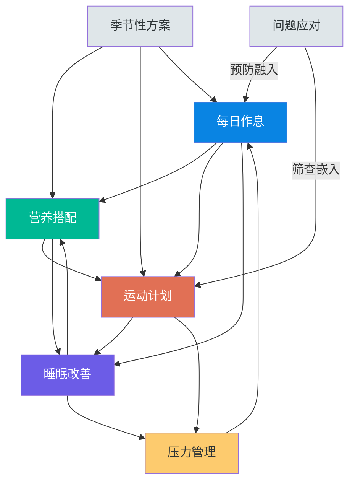
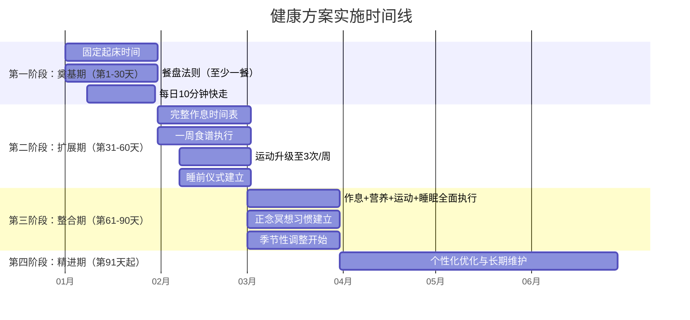

## 八、具体方案篇总结：从知识到行动的完整闭环

前面七节提供了覆盖日常生活方方面面的健康实操方案——从每日作息到营养搭配，从运动计划到睡眠改善，从压力管理到季节调整，再到常见问题应对。但方案再多，如果不能整合为一个可执行的系统，最终只会沦为"收藏夹里的知识"。

本节的目标是帮你完成四件事：**回顾**各方案的核心要点和关键数据，**评估**你当前所处的健康状态基线，**整合**七大方案为一套协同运作的健康操作系统，以及**落地**为一个分阶段、可追踪的实施计划。

---

### 8.0 起步：自我健康状态评估

在制定任何计划之前，你需要先知道自己的起点在哪里。以下是一份精简的自我评估问卷，涵盖七大方案的核心维度。每个问题按 1-5 分自评（1=非常差/从未做到，5=优秀/完全做到）。

#### 8.0.1 七维健康自评表

| 维度 | 评估问题 | 自评分(1-5) |
|------|---------|------------|
| 作息规律 | 我的每天起床时间误差是否在30分钟以内（含周末）？ | ____ |
| 作息规律 | 我是否每天有固定的午休和晚间放松时段？ | ____ |
| 营养质量 | 我每天是否摄入至少3种不同颜色的蔬菜？ | ____ |
| 营养质量 | 我每周自己做饭的次数是否达到4次以上？ | ____ |
| 运动习惯 | 我每周是否进行至少150分钟的中等强度活动（含步行）？ | ____ |
| 运动习惯 | 我每周是否进行至少2次力量训练或抗阻运动？ | ____ |
| 睡眠质量 | 我是否能在30分钟内入睡，且夜间醒来不超过1次？ | ____ |
| 睡眠质量 | 我每天的睡眠时间是否稳定在7-9小时？ | ____ |
| 压力管理 | 我是否有一种固定的日常减压方式（呼吸/冥想/运动等）？ | ____ |
| 压力管理 | 面对突发压力时，我是否能在30分钟内恢复平静？ | ____ |
| 季节适应 | 我是否根据当前季节调整过饮食或运动内容？ | ____ |
| 问题预防 | 我是否定期进行体检或自我健康筛查？ | ____ |

**评分解读**：

| 总分范围 | 健康状态 | 建议策略 |
|---------|---------|---------|
| 48-60分 | 基础扎实 | 直接进入精进期，重点优化薄弱环节 |
| 36-47分 | 中等水平 | 从扩展期开始，已有基础可加速推进 |
| 24-35分 | 需要改善 | 从奠基期开始，按部就班逐步推进 |
| 12-23分 | 急需关注 | 先聚焦1-2个最薄弱的维度，不要贪多 |

**如何使用评估结果**：

找到得分最低的两个维度，这就是你接下来30天的主攻方向。不要试图同时改善所有维度——行为科学反复证明，**同时改变超过3个习惯的成功率不到10%**（Prochaska & DiClemente, 变化阶段模型）。先在一个维度上建立正反馈，再将信心和方法论迁移到下一个维度。

---

### 8.1 七大方案核心要点速览

在进入整合之前，先用一张表快速回顾每个方案最不可遗忘的核心信息：

| 方案 | 一句话核心 | 关键数字 | 最低启动门槛 |
|------|-----------|---------|-------------|
| 每日作息 | 与生物钟对齐，让身体在正确的时间做正确的事 | 固定起床时间误差<30分钟；每90分钟休息5-10分钟 | 设定一个每天不变的起床时间 |
| 营养搭配 | 餐盘法则+进食顺序+食材多样化 | 1/2蔬菜+1/4蛋白质+1/4全谷物；每天≥5色蔬果 | 下一餐先吃蔬菜再吃其他 |
| 运动计划 | 三阶段渐进：入门→适应→进阶 | WHO：每周150分钟中等强度有氧+2次力量训练 | 今天出门快走10分钟 |
| 睡眠改善 | 环境-行为-认知三管齐下 | 卧室18-22℃；固定起床比固定入睡更重要 | 今晚提前15分钟放下手机 |
| 压力管理 | 四层模型：消除源→改认知→调生理→释情绪 | 4-7-8呼吸法；正念冥想每天10分钟起 | 现在做一次4-7-8呼吸 |
| 季节调整 | 顺应自然节律，春生夏长秋收冬藏 | 春养肝/夏养心/秋养肺/冬养肾 | 根据当前季节调整一种饮食 |
| 问题应对 | 预防为主，识别信号，及时干预 | 20-20-20护眼法则；每30-60分钟起身活动 | 下一个20分钟休息时远眺20秒 |

---

### 8.2 七大方案的系统整合

这七个方案不是独立的清单，而是一个相互咬合的系统。任何一个环节的改善都会产生连锁正效应，任何一个环节的长期失调也会拖垮其他环节。

#### 8.2.1 方案间的协同关系

**核心联动机制**说明：

**作息→营养**：固定进餐时间是生物钟的重要授时因子（zeitgeber）。每天在相近的时间吃三餐，有助于稳定血糖节律和肠道菌群的昼夜波动。研究表明，不规律进餐时间的人群，代谢综合征风险高出25%（International Journal of Obesity, 2019）。更具体地说，人体的胰岛素敏感性在上午最高、晚间最低，这意味着同样的食物在早上8点和晚上10点吃，血糖反应可以相差30-40%。固定进餐时间让身体的消化酶分泌、胆汁排放、肠道蠕动都形成可预测的节律，食物的消化吸收效率随之提升。

**作息→运动**：下午3-6点是人体核心体温最高、肌肉灵活性最好、反应速度最快的时段，适合中高强度训练。核心体温每升高1℃，肌肉收缩速度提升约2-5%，关节液粘稠度下降使关节活动范围增加约20%。将运动嵌入每日作息的固定时段，既利用了生理优势，也降低了"没时间运动"的执行阻力。对于晨练偏好者，建议在起床后30分钟、接受光照和补充少量碳水后再开始运动，避免因体温和血糖偏低导致运动表现下降或低血糖风险。

**运动→睡眠**：规律运动可使入睡潜伏期缩短15-20分钟，深度睡眠比例增加10-15%（Sleep Medicine Reviews, 2015）。运动促进睡眠的机制有三条路径：一是升高核心体温，运动后4-6小时体温回落的过程模拟了自然入睡时的体温下降曲线，向大脑发送"该睡了"的信号；二是增加腺苷（一种促进睡眠的神经递质）的累积量；三是降低交感神经张力，减少入睡前的过度觉醒状态。但睡前2小时内的高强度运动反而会延迟入睡——因为此时肾上腺素和皮质醇水平仍处于高位，核心体温尚未回落。这就是为什么运动时机需要和作息方案协调。

**睡眠→营养**：睡眠不足（<6小时）会导致瘦素（leptin，抑制食欲的激素）下降15.5%、饥饿素（ghrelin，促进食欲的激素）上升14.9%（PLoS Medicine, 2004），让你第二天自动多摄入约385千卡热量，且偏向高糖高脂食物。更隐蔽的是，睡眠不足还会降低味觉敏感度——你需要更强的甜味和咸味刺激才能感到满足，这直接推动了对加工食品的渴望。改善睡眠是控制饮食欲望的隐形杠杆，比任何意志力策略都有效。

**睡眠→心理**：REM睡眠是大脑的"情绪消化"阶段。在REM睡眠期间，大脑会重新处理白天的情绪记忆，将强烈的情绪反应与记忆内容"脱钩"——这就是为什么隔天再想起昨天的烦心事，感受通常会缓和许多。REM不足时，杏仁核（情绪中枢）对负面刺激的反应性增加60%，前额叶皮层（理性调控区域）的连接减弱——简单说，睡不好的人更容易情绪失控。连续一周每晚只睡5小时，焦虑水平上升30%（Nature Human Behaviour, 2019）。反过来说，充足的睡眠本身就是最天然的抗焦虑药。

**压力→全局**：慢性压力导致皮质醇持续偏高，会直接干扰睡眠（皮质醇抑制褪黑素分泌）、引发不健康饮食行为（皮质醇促进腹部脂肪堆积和糖渴求）、降低运动动力（疲劳感增加）、削弱免疫功能。皮质醇的昼夜节律正常情况下是"晨高夜低"——早上6-8点达到峰值让你清醒活跃，晚上10点以后降到谷底让你安然入睡。慢性压力打乱了这个节律，变成了"全天偏高"或"晨低夜高"，前者让你白天疲惫（本该高的时候没精力），后者让你晚上失眠（本该低的时候睡不着）。压力管理是四大支柱的"隐形操作系统"。

#### 8.2.2 季节方案的调节作用

季节性方案不是一个独立模块，而是对作息、营养、运动三个方案的**动态调节层**：

| 季节 | 作息调整 | 营养调整 | 运动调整 | 压力调节重点 |
|------|---------|---------|---------|-------------|
| 春季 | 逐渐提前起床时间，顺应日照延长 | 增加绿色蔬菜（养肝），减少油腻 | 增加户外活动，舒展性运动（瑜伽、太极） | 疏肝理气，情绪疏导 |
| 夏季 | 可适当晚睡早起，增加午休时间 | 清热祛湿（苦瓜、绿豆），补充电解质 | 避开正午高温，游泳为佳，及时补水 | 养心安神，避免烦躁 |
| 秋季 | 逐渐提前入睡，顺应日照缩短 | 滋阴润燥（梨、银耳、百合），白色食物 | 适度降低强度，增加拉伸和呼吸训练 | 收敛情绪，防止秋郁 |
| 冬季 | 适当晚起（待日出），保证充足睡眠 | 温补收藏（羊肉、核桃、黑色食物） | 室内运动为主，保持活动量不大幅下降 | 保暖安神，防止季节性情绪低落 |

**季节转换的过渡策略**：季节交替的2-3周是身体最容易出问题的时期。不要在某一天突然切换方案，而是用1-2周时间渐进过渡。例如从夏季进入秋季时，先将饮食中的寒凉食物（西瓜、冷饮）减少频率，同时逐渐增加温润食材（梨汤、银耳羹），运动强度也同步缓降。这种渐进过渡让身体的代谢系统、免疫系统有时间适应新的环境条件。

#### 8.2.3 常见问题应对的嵌入式策略

健康问题应对不应该是"出了问题才翻手册"的被动方案，而应该嵌入到日常习惯中形成**预防性筛查**：

- **每日作息中嵌入**：每次起身活动时顺便做颈部环绕和肩部拉伸（预防颈椎问题）；午间散步时有意识远眺（预防视疲劳）；刷牙时练习单脚站立（检测平衡能力，平衡力下降是多种健康问题的早期信号）
- **运动计划中嵌入**：每次训练前的热身包含脊柱灵活性测试（猫牛式）；训练后的拉伸包含常见紧张区域的针对性放松；运动中注意心率是否在合理区间，过高或过低都可能是心血管问题的信号
- **营养搭配中嵌入**：膳食纤维摄入≥25克/天（预防消化问题）；充足饮水≥1500ml/天（预防泌尿系统问题）；注意排便频率和性状变化（消化系统健康的直接指标）
- **睡眠方案中嵌入**：记录入睡时间和醒来次数，连续一周入睡>30分钟或夜醒>2次即启动睡眠改善方案；注意是否有打鼾伴呼吸暂停（可能是睡眠呼吸暂停综合征的信号）

---

### 8.3 分阶段实施路线图

行为科学的核心发现是：**同时改变多个习惯的失败率超过90%**。以下是基于习惯形成研究（平均66天自动化，Lally et al., 2009）设计的分阶段实施计划。

#### 8.3.1 总体框架

#### 8.3.2 第一阶段：奠基期（第1-30天）

**目标**：建立2-3个最小可行习惯，体验到正反馈

**必做项**：

| 习惯 | 具体要求 | 执行提示 |
|------|---------|---------|
| 固定起床时间 | 每天（含周末）同一时间起床，误差≤30分钟 | 设好闹钟，起床后立即接受光照（拉开窗帘或出门） |
| 餐盘法则 | 每天至少一餐遵循"1/2蔬菜+1/4蛋白质+1/4主食" | 从最可控的那餐开始（通常是自己做的晚餐） |
| 每日活动 | 每天10分钟快走或任何形式的身体活动 | 利用午休时间，不需要运动装备 |

**不做项**（避免过早消耗意志力）：
- 不需要完美执行所有三餐
- 不需要开始力量训练
- 不需要改变睡眠时间（先固定起床时间，睡眠时间会自然前移）
- 不需要购买任何工具或保健品
- 不需要记录复杂的健康数据

**习惯锚定技巧**：将每个新习惯"锚定"到一个已有的稳定行为上，这叫**习惯叠加**（habit stacking），由行为科学家BJ Fogg提出。具体做法：

| 已有行为（锚点） | 叠加的新习惯 | 触发句 |
|-----------------|-------------|--------|
| 早上关掉闹钟 | 立刻拉开窗帘接受光照 | "闹钟响了就开窗帘" |
| 坐下来准备吃晚饭 | 先把蔬菜夹到碗里占一半 | "坐下来就先夹蔬菜" |
| 午饭后站起来 | 出门走10分钟 | "站起来就出门走" |

**里程碑检验**：30天后，你是否能在不设闹钟的情况下自然醒来？如果能，说明生物钟已经开始校准。

#### 8.3.3 第二阶段：扩展期（第31-60天）

**目标**：扩展习惯范围，覆盖四大支柱

**新增项**：

| 习惯 | 具体要求 | 执行提示 |
|------|---------|---------|
| 完整作息表 | 按照每日作息方案执行，至少覆盖晨间和晚间两个时段 | 打印作息表贴在冰箱或床头 |
| 一周食谱 | 提前规划每周菜单，周日集中采购和备餐 | 从一周做3次自己烹饪的饭菜开始 |
| 运动升级 | 每周3次、每次20-30分钟中低强度运动 | 选择你最不排斥的运动形式 |
| 睡前仪式 | 固定的睡前30分钟放松流程 | 关键：睡前90分钟停止进食，提前60分钟减少蓝光 |
| 呼吸练习 | 每天练习4-7-8呼吸法3-4次 | 可以在任何场景练习：通勤、午休、睡前 |

**习惯叠加进阶**：这一阶段新增的习惯也要锚定到已有行为上。第一阶段建立的习惯现在已经成为"已有行为"，可以作为新习惯的锚点：

| 已有行为（锚点） | 叠加的新习惯 | 触发句 |
|-----------------|-------------|--------|
| 早上固定起床后 | 执行15分钟晨间流程（拉伸+喝水+规划） | "起床就走流程" |
| 晚饭后收拾完厨房 | 准备第二天的午餐便当 | "收完厨房就备餐" |
| 运动结束换完衣服 | 做5分钟拉伸 | "换完衣服就拉伸" |
| 躺到床上 | 开始4-7-8呼吸练习 | "躺下就呼吸" |

**里程碑检验**：60天后，你是否能在不需要提醒的情况下执行大部分新习惯？体检指标（如静息心率）是否出现积极变化？

#### 8.3.4 第三阶段：整合期（第61-90天）

**目标**：将所有方案整合为一个协同运作的系统

**核心任务**：

1. **全面执行作息时间表**：晨间-日间-晚间三个时段的方案全部到位
2. **引入正念冥想**：每天10-15分钟，使用APP引导（潮汐、小睡眠、Headspace）
3. **开始季节性调整**：根据当前季节调整饮食和运动内容
4. **建立健康记录**：记录睡眠、饮食、运动、情绪四项基本数据
5. **完成一次全面体检**：建立健康基线数据

**里程碑检验**：90天后，你的生活方式是否已经发生了可感知的变化？精力水平、睡眠质量、情绪稳定性是否比30天前明显改善？

#### 8.3.5 第四阶段：精进期（第91天起）

**目标**：个性化优化，建立长期可持续的健康管理系统

**精进方向**：

| 方向 | 具体行动 |
|------|---------|
| 数据驱动优化 | 分析90天的健康记录数据，找出薄弱环节重点改善 |
| 体质个性化 | 完成中医体质测试，根据体质类型调整饮食和运动方案 |
| 运动进阶 | 引入力量训练（每周2次），学习复合动作标准姿势 |
| 知识深化 | 选择一个专题系统学习，从基础理论进入进阶阶段 |
| 问题预防 | 建立个人健康风险清单，针对性地加强预防措施 |
| 辐射影响 | 将所学知识分享给家人，带动家庭整体健康水平提升 |

#### 8.3.6 每周执行模板

理论再好也需要落到具体的周计划中。以下是一个标准的周执行模板，你可以直接复制使用：

**周日晚（30分钟）——周计划制定**

| 步骤 | 具体动作 | 耗时 |
|------|---------|------|
| 回顾上周 | 检查上周习惯打卡记录，计算坚持率 | 5分钟 |
| 识别问题 | 找出未完成的习惯，分析原因（时间冲突/动力不足/环境障碍） | 5分钟 |
| 制定菜单 | 规划下周5天的主菜单（周末可以灵活） | 10分钟 |
| 运动安排 | 确定下周3次运动的具体时间和形式，写入日历 | 5分钟 |
| 采购清单 | 根据菜单列好食材清单 | 5分钟 |

**工作日每日执行参考**

| 时段 | 行为 | 耗时 |
|------|------|------|
| 6:30 | 固定起床，拉开窗帘接受光照 | 1分钟 |
| 6:35 | 喝一杯温水，做简单拉伸 | 5分钟 |
| 7:00 | 早餐：优先蛋白质+复合碳水 | 15分钟 |
| 12:00 | 午餐：餐盘法则，先吃蔬菜 | 20分钟 |
| 12:30 | 午间散步+远眺（嵌入护眼和活动） | 15分钟 |
| 15:00 | 工间休息：起身活动+4-7-8呼吸3次 | 5分钟 |
| 18:00 | 运动日：30分钟运动；非运动日：快走15分钟 | 15-30分钟 |
| 19:00 | 晚餐：餐盘法则，适量清淡 | 20分钟 |
| 21:30 | 睡前仪式启动：调暗灯光，远离屏幕 | — |
| 22:00 | 正念冥想10分钟或4-7-8呼吸练习 | 10分钟 |
| 22:15 | 入睡 | — |

**周六上午——月度评估**（每4周一次）

| 步骤 | 具体动作 | 耗时 |
|------|---------|------|
| 数据汇总 | 整理过去4周的打卡数据，计算各项坚持率 | 15分钟 |
| 体测记录 | 称体重、测静息心率、量血压（如有设备） | 5分钟 |
| 效果评估 | 对比上月数据，标注改善项和退步项 | 10分钟 |
| 下月调整 | 根据评估结果微调方案（增加/减少/替换某项习惯） | 10分钟 |

---

### 8.4 关键指标追踪体系

没有度量就没有改进。以下是一套精简但有效的健康追踪指标体系，分为**日常指标**和**阶段性指标**两类。

#### 8.4.1 日常追踪指标（每天记录，2分钟完成）

| 指标 | 记录方式 | 健康区间 | 异常信号 |
|------|---------|---------|---------|
| 入睡时间 | 手动或智能手环 | 与目标时间误差<30分钟 | 连续3天>30分钟才能入睡 |
| 起床时间 | 手动 | 与固定时间误差<30分钟 | 周末比工作日晚>1小时（社交时差） |
| 睡眠时长 | 智能手环或自评 | 7-9小时 | 连续一周<6.5小时 |
| 白天精力 | 1-5分自评 | ≥3分 | 连续3天≤2分 |
| 饮水杯数 | 简单计数 | ≥8杯（约1500ml） | <5杯 |
| 蔬菜份数 | 简单计数（一拳≈1份） | ≥3份 | <2份 |
| 运动分钟数 | 手动或手环 | ≥30分钟（含步行） | 0分钟 |
| 压力感受 | 1-5分自评 | ≤3分 | 连续3天≥4分 |

**记录工具选择**：

| 方式 | 优点 | 缺点 | 推荐人群 |
|------|------|------|---------|
| 纸质笔记本 | 无电耗、书写有仪式感、不易分心 | 不便统计分析 | 喜欢手写的人 |
| 手机备忘录 | 随时可用、可搜索 | 容易被其他通知打断 | 习惯手机操作的人 |
| 专用APP（薄荷健康/Keep/潮汐） | 自动统计、图表展示、提醒功能 | 功能分散在多个APP中 | 数据驱动型人格 |
| 智能手表/手环 | 自动采集睡眠、心率、步数 | 佩戴不适感、数据不一定精确 | 愿意投入设备预算的人 |
| Excel/Notion表格 | 完全自定义、便于长期分析 | 初始设置需要时间 | 喜欢系统化管理的人 |

**极简记录法**：如果你觉得8项指标太多，用一个"每日三色评分"代替——给今天的营养、运动、睡眠各打一个颜色：绿色（做得好）、黄色（一般）、红色（没做到）。一张月历纸就能记录，30天后一目了然。

#### 8.4.2 阶段性评估指标（每30天评估一次）

| 指标 | 测量方式 | 目标趋势 |
|------|---------|---------|
| 体重/体脂率 | 体脂秤（固定时间、条件测量） | 趋向健康BMI范围（18.5-24.9） |
| 静息心率 | 晨起未下床时手环测量 | 逐渐下降（心肺功能改善的标志） |
| 血压 | 家用血压计 | 收缩压<130mmHg，舒张压<80mmHg |
| 运动表现 | 记录配速/重量/柔韧度等 | 逐渐提升（存在个体差异） |
| 睡眠效率 | 在床时间中实际睡眠的比例 | 目标≥85% |
| 习惯坚持率 | 追踪表中完成天数/总天数 | ≥75%即可，不追求100% |

#### 8.4.3 年度体检指标

每年至少一次全面体检，以下为核心关注项目：

| 检查项目 | 关注指标 | 健康参考范围 |
|---------|---------|-------------|
| 血常规 | 血红蛋白、白细胞计数、血小板 | 血红蛋白：男130-175g/L，女115-150g/L |
| 血脂四项 | 总胆固醇、甘油三酯、LDL-C、HDL-C | 总胆固醇<5.2mmol/L，LDL-C<3.4mmol/L |
| 空腹血糖 | 血糖、糖化血红蛋白 | 空腹血糖<6.1mmol/L，HbA1c<6.0% |
| 肝功能 | ALT、AST、GGT | ALT<40U/L |
| 肾功能 | 肌酐、尿酸 | 尿酸：男<420μmol/L，女<360μmol/L |
| 甲状腺 | TSH、T3、T4 | TSH：0.27-4.2mIU/L |
| 维生素D | 25-(OH)D | ≥30ng/mL（中国80%人群不足） |
| 同型半胱氨酸 | Hcy | <15μmol/L（升高与心脑血管风险相关） |
| 腰围 | 软尺测量 | 男<85cm，女<80cm（中国标准） |

---

### 8.5 常见实施障碍与应对策略

知道"应该做什么"和"能够做到"之间隔着一条鸿沟。以下是最常见的六大障碍及其具体应对方案。

#### 8.5.1 障碍一：时间不够

**本质分析**：时间不够通常不是真的"没有时间"，而是优先级排序问题。你不需要额外"找"出2小时来健康生活，而是将健康行为嵌入已有的时间结构中。

**具体应对**：

| 障碍场景 | 嵌入式解决方案 | 额外时间成本 |
|---------|---------------|-------------|
| "没时间运动" | 通勤提前一站下车走路；午休快走10分钟；工位站立办公交替 | 0-15分钟/天 |
| "没时间做饭" | 周日批量备餐（2小时准备一周食材）；选择15分钟快手菜谱 | 周日2小时 |
| "没时间冥想" | 刷牙时关注呼吸；等电梯时做3次深呼吸；通勤听冥想音频 | 0分钟 |
| "睡眠时间不够" | 提前30分钟关闭手机（不是提前睡觉，而是减少无意识刷手机） | 0分钟 |

#### 8.5.2 障碍二：坚持不下去

**本质分析**：坚持失败通常不是意志力问题，而是方案设计问题。三个最常见的设计缺陷——门槛太高、反馈太慢、环境不支持。

**具体应对**：

- **降低启动门槛**：用"两分钟规则"——任何新习惯都从两分钟版本开始。不是"每天跑步30分钟"，而是"每天穿上跑鞋出门"。不是"每餐遵循餐盘法则"，而是"每餐多吃一种蔬菜"。启动门槛越低，启动阻力越小，行为越容易发生。
- **缩短反馈周期**：不要等到三个月后看体重变化才获得反馈。每天记录习惯打卡本身就是正反馈。可以设置"微里程碑"——连续打卡7天奖励自己一本想看的书，连续21天奖励一次按摩，连续66天奖励一件运动装备。
- **改造环境**：将运动服放在枕头旁（减少早晨的决策成本）；将零食藏到柜子深处、水果放在桌面显眼处（利用"默认选项"效应）；卸载手机上的外卖APP（增加不健康饮食的操作成本）。

#### 8.5.3 障碍三：信息过载

**本质分析**：本章提供了大量方案和建议，一次性全部吸收和执行既不现实也没必要。

**具体应对**：

- **聚焦一个维度**：根据自我评估结果（8.0节），选择得分最低的维度优先改善。通常是睡眠——它是其他三个支柱的基础。
- **80/20法则**：每个方案中都有20%的核心动作贡献80%的效果。记住每个方案的"最低启动门槛"（见8.1节表格），先做到这些就够了。
- **渐进加载**：第一阶段只做3件事，第二阶段增加到6-7件事，第三阶段再全面展开。大脑一次只能有效处理和记忆有限数量的新习惯。

#### 8.5.4 障碍四：遇到瓶颈或平台期

**本质分析**：任何改善过程都不是线性的。通常在第4-8周会经历一个"感受停滞期"——初期的新鲜感消退，但长期收益尚未显现。这在心理学上叫"动机低谷"（motivation trough），是习惯从"外在驱动"转向"内在驱动"的必经过渡。

**具体应对**：

- **区分"没进步"和"感觉没进步"**：查看客观数据（睡眠时长、运动频率、饮食记录）而非依赖主观感受。数据往往显示你比自己以为的做得更好。
- **引入变化**：运动中遇到平台期，换一种运动形式；饮食中感到厌倦，尝试新的健康食谱；冥想从呼吸冥想切换到身体扫描。新鲜感的刷新可以重新激活动力。
- **找到同伴**：加入线上或线下的健康社群，找到1-2个志同道合的伙伴。社会支持是习惯坚持最强大的预测因子之一（Journal of Consulting and Clinical Psychology, 2015）。
- **回顾起点**：拿出第一周的自评数据和现在的数据做对比。大多数人会惊讶地发现自己已经进步了多少——只是在日常中感受不到渐进式变化。

#### 8.5.5 障碍五：特殊时期被打断

**本质分析**：出差、加班、节假日、生病等特殊时期会打断日常习惯，这完全正常。问题不在于"被打断"，而在于"如何快速恢复"。

**具体应对**：

- **维护最小版本**：出差期间无法执行完整运动计划，但可以做10分钟酒店房间自重训练；加班到深夜无法执行睡前仪式，但可以做3次4-7-8呼吸。维持"最小可行版本"比完全放弃好得多——因为它保持了习惯的"连续性"。
- **设置恢复触发器**：在特殊时期结束后，设定一个明确的"恢复日"——比如假期后的第一个工作日，就是全面恢复健康作息的信号日。提前将恢复计划写下来，降低"重新开始"的心理阻力。
- **"不要连续错过两次"原则**：这是行为科学中最有价值的坚持法则之一。错过一天完全没关系，关键是第二天必须回来。连续错过两次是习惯消亡的起点——因为第一次缺席还带着内疚感，第二次缺席大脑就开始"合理化"不执行的理由，第三次就成了新常态。

#### 8.5.6 障碍六：社会环境不支持

**本质分析**：当你身边的人不理解甚至反对你的健康改变时（"至于吗""吃一顿没事""别那么矫情"），外部压力会严重削弱内在动力。这是被很多健康指南忽视的障碍，但在中国的社交文化中尤为突出——聚餐劝酒、深夜加班文化、"不喝就是不给面子"等场景非常普遍。

**具体应对**：

- **不必宣告**：不需要告诉所有人你在"执行健康计划"。默默做就好，减少被评判和被劝阻的机会。行为改变研究显示，过早公开宣布目标反而会降低执行动力（因为宣布本身已经带来了一种"虚假的完成感"）。
- **提前准备社交话术**：面对劝酒可以说"在吃药，医生不让喝"；面对劝食可以说"刚吃过了，现在真吃不下"。用"客观原因"而非"个人选择"来拒绝，社会阻力更小。
- **寻找至少一个支持者**：在你的社交圈中找到至少一个理解并支持你的人。可以是家人、朋友、同事、或者线上的健康社群。有一个"同盟者"可以让坚持的难度降低一半。
- **渐进影响**：不要试图说服别人也改变。当你用3-6个月的时间展示出明显的变化（精力更好、身材改善、情绪更稳定），身边的人会自然产生兴趣和信任，这时候你再分享经验才有说服力。

---

### 8.6 个性化决策框架

本章的所有方案都是"框架"而非"处方"。以下决策树帮你快速判断每个维度应该采用什么强度的方案。

#### 8.6.1 入睡困难决策树

入睡困难？
├── 偶尔（每周<2次）
│   ├── 有明确诱因（咖啡、手机、噪音）→ 消除诱因即可
│   └── 无明确诱因 → 练习4-7-8呼吸法，观察2周
├── 经常（每周≥3次，持续<3个月）
│   ├── 伴有焦虑/压力 → 优先处理压力管理（方案五）
│   ├── 伴有身体不适 → 就医排查器质性原因
│   └── 无明显诱因 → 执行完整睡眠改善方案（方案四）
└── 慢性（每周≥3次，持续≥3个月）
    ├── 首选：认知行为疗法（CBT-I），效果优于药物
    ├── 可用：就医，短期使用助眠药物过渡
    └── 禁止：自行长期使用安眠药或酒精助眠

#### 8.6.2 运动强度决策树

当前体能状态？
├── 久坐不动（每周运动0次）
│   └── 从每日10分钟快走开始（第一阶段），4周后升级
├── 偶尔运动（每周1-2次）
│   └── 固定为每周3次，每次20-30分钟低中强度
├── 规律运动（每周3次以上）
│   ├── 无力量训练 → 加入每周2次基础力量训练
│   └── 已有力量训练 → 引入HIIT，优化训练分化
└── 有运动伤病
    └── 先康复治疗，再从受伤前50%强度恢复

#### 8.6.3 营养改善决策树

饮食现状？
├── 外卖为主（每周≥5次）
│   └── 第一步：每周减少1-2次外卖，替换为自制简餐
├── 自己做饭但不够均衡
│   └── 第一步：应用餐盘法则，从一餐开始
├── 饮食基本均衡但有偏好
│   └── 第一步：增加缺乏的食物种类（彩虹原则）
└── 有特殊饮食需求（素食/过敏/疾病）
    └── 咨询营养师，制定个性化方案

#### 8.6.4 压力管理决策树

压力来源？
├── 工作压力为主
│   ├── 可控（任务量/截止日期）→ 时间管理+番茄工作法
│   └── 不可控（人际关系/公司文化）→ 认知重构+边界设定
├── 生活压力为主
│   ├── 经济压力 → 制定预算计划+减少消费决策疲劳
│   ├── 关系压力 → 非暴力沟通练习+设定健康边界
│   └── 健康焦虑 → 体检建立基线+减少过度搜索症状
├── 多重压力叠加
│   └── 优先使用生理调节（运动+呼吸+睡眠），再处理认知层
└── 无明确压力源但持续焦虑
    └── 可能是广泛性焦虑，建议专业评估

---

### 8.7 实施效果的时间预期

健康管理最大的认知陷阱是"期望立竿见影"。以下是不同健康改善措施的效果出现时间线，帮你建立合理预期，避免因"看不到效果"而放弃。

| 改善措施 | 感知效果（主观） | 可测量效果（客观） | 长期收益 |
|---------|----------------|-------------------|---------|
| 固定起床时间 | 3-7天：起床变得更容易 | 2-4周：皮质醇节律趋于稳定 | 3个月：生物钟稳定，日间精力提升 |
| 餐盘法则 | 3-5天：餐后不再昏沉 | 2-4周：血糖波动减小 | 3-6个月：体重/体脂改善 |
| 每日运动 | 1-2周：运动后心情变好 | 4-6周：静息心率下降 | 3-6个月：心肺功能显著提升 |
| 睡前仪式 | 1-2周：入睡变快 | 2-4周：深度睡眠比例增加 | 2-3个月：整体睡眠质量改善 |
| 正念冥想 | 1-2周：日常焦虑感降低 | 4-8周：杏仁核反应性下降（fMRI可测） | 3-6个月：情绪调节能力提升 |
| 全面方案整合 | 4-8周：整体精力和状态改善 | 3-6个月：体检指标改善 | 1-3年：慢性病风险显著降低，生物学年龄年轻化 |

**关键认知**：效果的出现不是"全或无"的，而是一个渐进过程。第1周的改善可能只是"饭后不那么困了"，但这已经是血糖管理改善的信号。不要因为变化微小就忽视它——复利效应的前提是持续投入。

**"两个星期的耐心"原则**：任何一项新习惯，给自己至少两周时间再做评估。第一周身体还在适应，第二周才会出现初步的可感知变化。很多人的失败在于第三天就觉得"没什么效果"然后放弃——而大多数健康习惯的效果窗口在7-14天才打开。

---

### 8.8 从"方案执行"到"生活方式"

本节最后，也是最重要的一点：所有方案最终的目标不是让你"执行一份健康计划"，而是让健康行为变成你生活方式的自然组成部分——就像刷牙一样，不需要提醒、不需要意志力、不需要"坚持"。

#### 8.8.1 三阶段身份转化模型

这个转化过程分为三个层次：

**第一层：行为层（第1-90天）——"我在做健康的事"**

在这个阶段，健康行为是"需要刻意执行的任务"。你需要提醒自己、记录打卡、克服惰性。这是最消耗意志力的阶段，也是最容易放弃的阶段。度过这个阶段的关键是：降低门槛、缩短反馈、改造环境。

你可能会经历的心理状态：
- 第1-7天：新鲜感驱动，"我可以做到！"
- 第8-21天：新鲜感消退，"这真的有用吗？"
- 第22-45天：平台期，"感觉没什么变化..."
- 第46-90天：渐入佳境，"好像确实不一样了"

**第二层：习惯层（第91-180天）——"这是我的日常"**

在这个阶段，健康行为开始"半自动化"。你不再需要提醒自己该去运动了，到了那个时间身体会自然想要活动。你不再需要计算餐盘比例，直觉会选择更健康的食物。这个阶段的关键是：保持一致性，允许偶尔的松懈但不允许连续中断。

判断你是否进入习惯层的标志：
- 运动前不再需要"说服自己"，身体自动开始准备
- 面对食物选择时，健康选项是"默认选项"而非"需要刻意选择"
- 睡前仪式不需要闹钟提醒，到了时间身体自动进入放松状态
- 偶尔打破常规时会有轻微的不适感（而非解脱感）

**第三层：身份层（第181天以后）——"我就是这种人"**

在这个阶段，健康行为已经融入你的自我身份。你不再说"我在执行一个健康计划"，而是说"我就是一个注重健康的人"。当行为与身份一致时，坚持不再是问题——因为放弃健康习惯等于放弃自我身份。这就是行为科学家James Clear在《原子习惯》中描述的最深层习惯改变：**身份驱动行为**，而非行为驱动身份。

达到第三层的标志是：当你偶尔一天没有运动、偶尔一顿吃了垃圾食品，你的内心反应不是"完了，计划失败了"，而是"没关系，这不是我的常态"——然后第二天自然回到正轨。

#### 8.8.2 如何加速身份转化

身份转化不是被动等待的，你可以主动加速这个过程：

**语言重塑**：改变你描述自己的语言。不说"我在戒糖"（暗示被剥夺），而说"我不太吃甜食"（暗示这是你的本性）。不说"我在减肥"（暗示暂时行为），而说"我吃得比较清淡"（暗示长期身份）。语言是身份的载体，你如何描述自己，就会如何表现。

**环境设计**：让你的生活环境与"健康的人"这个身份一致。厨房里有量杯和食物秤（暗示你是一个关注营养的人），客厅有瑜伽垫（暗示你是一个运动的人），床头有纸质书（暗示你是一个睡前不刷手机的人）。环境是身份的物理延伸。

**社交身份**：在社交场合中用健康行为定义自己。"我是那个不喝酒但很能聊天的人""我是那个聚餐会点蔬菜的人""我是那个早起的人"。当社交圈开始用这些标签认识你时，外部确认会强化内部身份。

**记录和回顾**：定期回顾你的健康记录，不是为了监控执行情况，而是为了强化身份认知。"我已经连续运动了120天"不是一个数据点，而是一个身份声明——"我是一个坚持运动的人"。

---

### 8.9 健康习惯的抗脆弱性设计

著名思想家纳西姆·塔勒布提出了"反脆弱"（antifragile）的概念：有些系统不仅能在压力下存活，还能在压力中变得更强。你的健康习惯体系也应该追求这种特性，而不是一碰就碎的"玻璃计划"。

#### 8.9.1 弹性设计原则

**冗余原则**：每个健康维度至少准备两套执行方案。运动的主要方案是健身房训练，备用方案是家中自重训练。当健身房关门、出差在外、天气恶劣时，自动切换到备用方案，而不是直接取消。

**梯度原则**：每个习惯都有三个版本——完整版、简化版、最小版。以运动为例：

| 版本 | 内容 | 触发条件 |
|------|------|---------|
| 完整版 | 45分钟力量训练+15分钟拉伸 | 时间充裕、状态良好 |
| 简化版 | 20分钟HIIT或快走 | 时间有限或精力一般 |
| 最小版 | 5分钟拉伸或100个开合跳 | 极端忙碌或生病恢复期 |

最小版的意义不在于锻炼效果，而在于保持习惯的连续性——"我今天还是运动了"这个事实比运动了多长时间更重要。

**缓冲原则**：在计划中预留弹性空间。不要把每天的时间排得满满当当，至少留出30分钟的"缓冲时间"用于应对意外。没有缓冲的计划在第一次被打乱时就会全线崩溃。

#### 8.9.2 从失败中恢复的系统

健康习惯最大的敌人不是偶尔的失败，而是失败后的"全或无"思维——"既然今天已经破戒了，干脆放开吃吧""这周已经缺了两次运动，下周再重新开始"。

**"刹车而非翻车"策略**：当你意识到某一天的习惯被打破了（比如晚餐吃了外卖、错过了运动时间），立即执行"刹车动作"——在这个行为结束后立刻做一件健康的事。吃了外卖？饭后出门走15分钟。错过了运动？睡前做5分钟拉伸。这个"刹车动作"的意义是：**打破"一次失误→全面崩盘"的连锁反应**，告诉大脑"这是一个小插曲，不是系统崩溃"。

**月度复盘模板**：

| 复盘项 | 问题 | 行动 |
|--------|------|------|
| 坚持率 | 本月各习惯的完成率分别是多少？ | 低于60%的习惯分析原因，考虑降级或替换 |
| 最大障碍 | 本月阻碍执行的最大因素是什么？ | 针对这个因素设计一个解决方案 |
| 最大收获 | 本月感受到的最大改善是什么？ | 记录下来，作为未来低谷期的"燃料" |
| 下月重点 | 下月最想改善的一个维度是什么？ | 设定一个具体目标和行动步骤 |

---

### 本节核心结论

1. **先评估再行动**：用七维自评表找到你的起点和最薄弱环节，从那里开始，不要平均用力
2. **七大方案是一个系统**：作息是框架，营养和运动是两大引擎，睡眠是修复机制，压力管理是隐形操作系统，季节调整是动态优化层，问题应对是安全网
3. **习惯叠加是核心方法**：每个新习惯都锚定到已有行为上，用"做了X之后就做Y"的触发句降低启动阻力
4. **分阶段实施**：奠基期（30天）→扩展期（30天）→整合期（30天）→精进期（持续），每个阶段只增加2-3个新习惯
5. **追踪必要指标**：日常8项（2分钟完成），阶段性6项（每月评估），年度体检不少于一次
6. **障碍可预见可应对**：六大障碍（时间、坚持、信息、平台期、中断、社交环境）都有成熟的应对策略
7. **效果需要时间**：主观感受改善通常在1-4周内出现，客观指标改善需要1-3个月，长期健康收益需要6个月以上的持续投入
8. **抗脆弱设计**：为每个习惯准备三层版本（完整/简化/最小），用冗余和弹性让系统在压力下不会崩盘
9. **最终目标是身份转变**：从"执行健康计划"到"成为健康的人"——这才是真正不可逆的改变

**本节字数**：约8200字

**阅读时间**：25-30分钟

**下一步行动**：回到8.0节完成七维自评，找到你得分最低的两个维度，然后查看8.1节的"最低启动门槛"列，选择你现在就能开始的最小行动，立刻执行。
