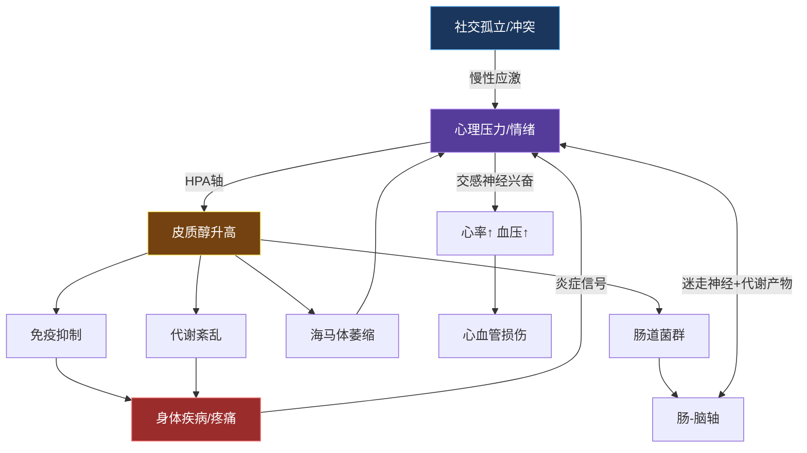
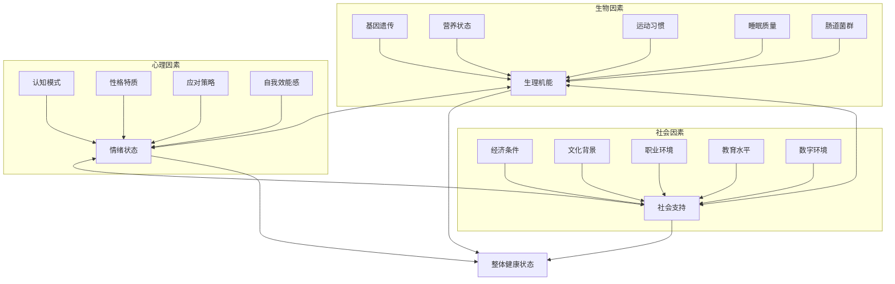
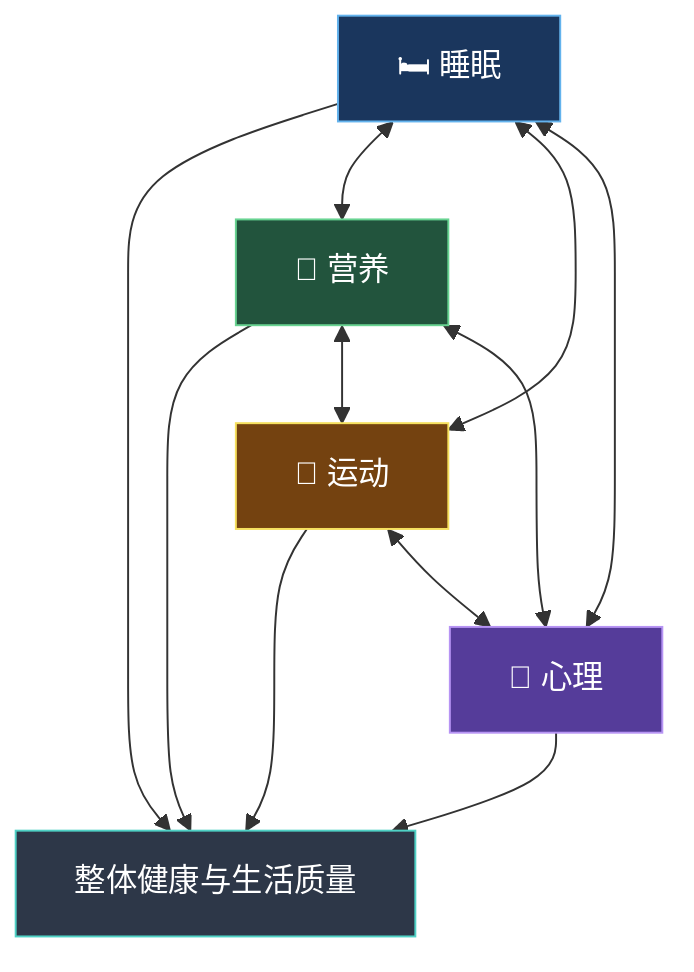
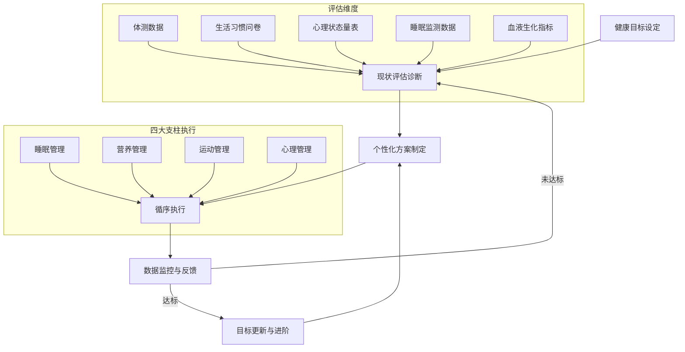
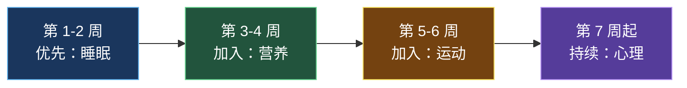
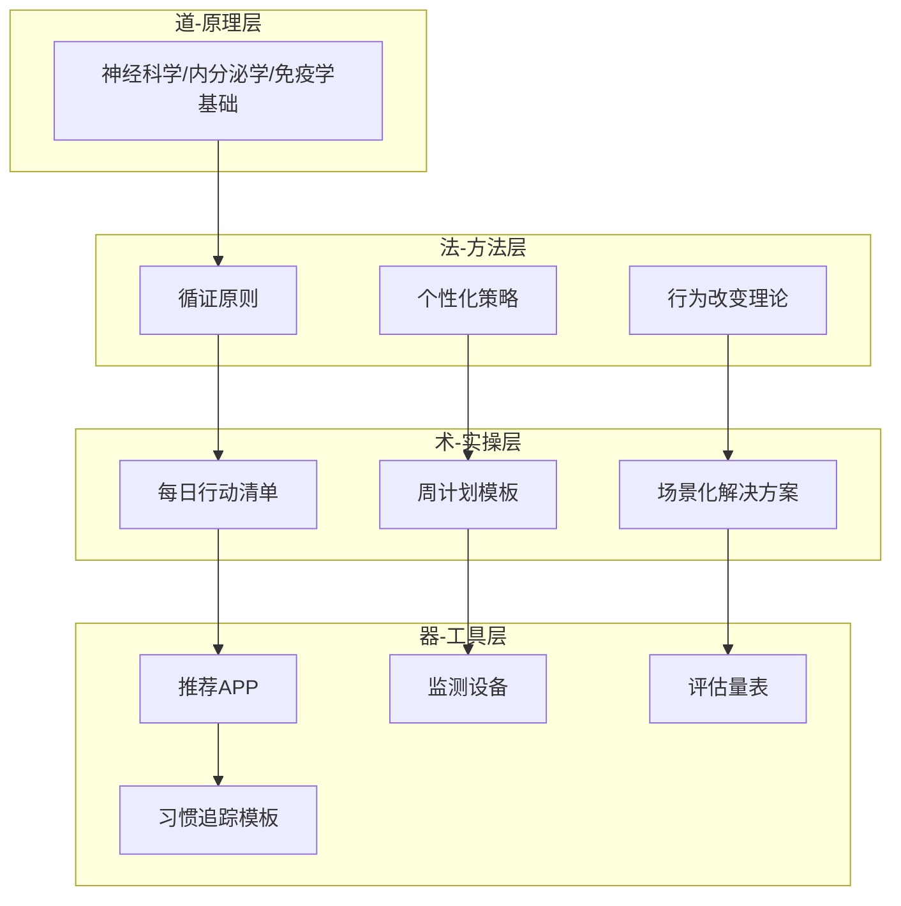
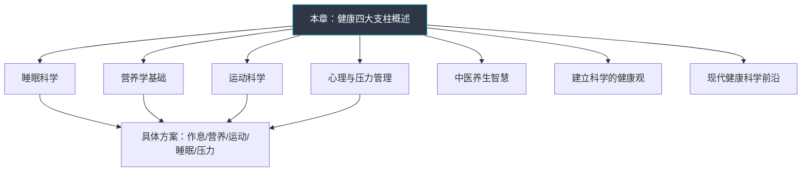

## 一、健康四大支柱概述

### 1.1 什么是健康

#### 1.1.1 健康概念的历史演变

人类对"健康"的认知并非一成不变，而是经历了数千年的演变：

| 时代 | 主导观念 | 核心特征 | 代表 |
|------|----------|----------|------|
| 远古-中世纪 | 神灵/体液论 | 疾病是天罚或体液失衡 | 希波克拉底四体液说、中医阴阳五行 |
| 17-19世纪 | 生物医学模型 | 疾病=器官病变，健康=无病 | 细胞病理学（魏尔啸）、细菌理论（巴斯德） |
| 1948年至今 | 生物-心理-社会模型 | 健康是身心社的完好状态 | WHO《组织法》、恩格尔模型 |
| 21世纪前沿 | 积极健康/生态系统模型 | 健康=适应力+资源+能力+意义感 | Huber积极健康定义（2011）、生态健康学 |

这个演变的主线是：**从"没有疾病"到"积极完好"，从"只看器官"到"看完整的人"，从"被动治疗"到"主动管理"**。

#### 1.1.2 WHO 定义与三个维度

世界卫生组织（WHO）在 1948 年《组织法》中给出了至今仍被广泛引用的定义：

> "健康不仅仅是没有疾病或虚弱，而是身体、心理和社会适应的完好状态。"
> ——《世界卫生组织组织法》, 1948

这个定义在当时具有革命性意义——它打破了"没病就是健康"的狭隘认知，将健康从一个被动状态提升为主动追求的三维目标：

| 维度 | 内涵 | 典型表现 | 亚健康信号（早期预警） |
|------|------|----------|------------------------|
| **身体健康** | 各器官系统功能正常，体能充沛，没有疾病或不适 | 精力旺盛、睡眠良好、体检指标正常、免疫功能健全 | 持续疲劳、频繁感冒、伤口愈合慢、体重骤变 |
| **心理健康** | 情绪稳定，认知清晰，能够应对日常压力，保持积极心态 | 情绪韧性、自我接纳、目标感、抗压能力 | 易怒、注意力涣散、持续焦虑、兴趣丧失 |
| **社会适应** | 能够建立和维持良好的人际关系，适应社会环境的变化 | 社交支持网络、归属感、社会角色胜任力 | 社交回避、关系频繁冲突、孤立感、角色迷失 |

> **关键认知**：健康不是一个二元状态（有病/没病），而是一个连续谱。大多数人处于"完全健康"和"明确疾病"之间的灰色地带——这就是**亚健康状态**。中国的流行病学调查显示，亚健康人群占比高达 70%，而健康管理的核心目标就是将你从灰色地带拉向健康一端。

#### 1.1.3 三维互动机制：神经-内分泌-免疫网络

这三个维度并非各自独立，而是通过**神经-内分泌-免疫（NEI）网络**紧密耦合。这是现代医学最重要的发现之一——你的想法、情绪和社会关系，通过具体的生物化学通路，直接改变你的身体状态。

**核心传导通路**：

- **下丘脑-垂体-肾上腺轴（HPA轴）**：这是压力从"心理"传导到"身体"的主干道。当大脑感知到心理压力（焦虑、恐惧、社交冲突），下丘脑释放促肾上腺皮质激素释放激素（CRH），刺激垂体释放促肾上腺皮质激素（ACTH），最终促使肾上腺释放皮质醇。短期皮质醇升高是正常的应激反应，但如果压力持续不断，皮质醇长期维持高位，就会引发：免疫功能下降、腹部脂肪堆积、骨密度降低、海马体萎缩（记忆受损）。

- **自主神经系统**：分为交感神经（"战斗或逃跑"）和副交感神经（"休息和消化"）。长期心理压力使交感神经持续亢奋，表现为心率加快、血压升高、消化抑制、免疫抑制。迷走神经（副交感神经的主要通路）的张力降低，是多种慢性病的共同通路。

- **肠-脑轴**：肠道被称为"第二大脑"，拥有约5亿个神经元。肠道菌群通过迷走神经、免疫信号和代谢产物（如短链脂肪酸、5-羟色胺前体）影响大脑功能。90%的血清素在肠道合成。肠道菌群失调与抑郁、焦虑、自闭症等心理疾病存在强相关。

**三个方向的具体影响**：

- **身体→心理→社交**：慢性疼痛或疲劳导致情绪低落，进而回避社交活动，形成孤立循环。例如慢性腰痛患者中，40%同时伴有抑郁症状，而抑郁又进一步降低疼痛阈值，形成恶性循环。
- **心理→身体→社交**：长期焦虑激活交感神经系统，引发失眠、消化问题，影响工作和人际关系。焦虑障碍患者的肠易激综合征（IBS）发病率是普通人群的3-5倍。
- **社交→心理→身体**：职场霸凌或家庭冲突造成慢性心理压力，通过皮质醇长期升高损害免疫和心血管系统。被霸凌的儿童成年后C反应蛋白（炎症标志物）水平仍然偏高。

**经典研究证据**：哈佛大学长达 85 年的"成人发展研究"（Harvard Study of Adult Development）追踪了 724 名参与者的一生，最终得出的最强预测因子不是胆固醇水平、不是基因，而是**人际关系的质量**——关系质量高的人群，身体更健康、寿命更长、认知衰退更慢。该研究的第四任负责人 Robert Waldinger 教授总结道："好的人际关系不仅保护身体，也保护大脑。"

#### 1.1.4 现代健康观的拓展：生物-心理-社会模型

1977 年，美国精神科医生乔治·恩格尔（George Engel）在《科学》杂志发表了里程碑式的论文，提出了**生物-心理-社会模型**（Biopsychosocial Model），将 WHO 的三维定义进一步系统化：

这个模型的核心贡献在于三层：

1. **从"治已病"到"治未病"**：在疾病尚未出现时，通过评估心理和社会因素提前干预。一个长期处于高压工作环境、社交孤立的人，即使体检指标暂时正常，也处于高风险状态。
2. **从"只看器官"到"看完整的人"**：同一个高血压患者，如果同时存在工作压力大（社会因素）和灾难化思维（心理因素），其治疗方案必须同时考虑这三个维度。
3. **从"标准方案"到"个性化方案"**：两个人可能有完全相同的生物标记，但因为心理和社会背景不同，最优干预方案可能截然不同。

#### 1.1.5 东方智慧：中医的健康观

在西方提出生物-心理-社会模型之前数千年，中国传统医学早已发展出整体论的健康观。两种体系的对照可以帮助我们更全面地理解健康：

| 维度 | 西方现代医学 | 中医传统理论 | 融合理解 |
|------|-------------|-------------|----------|
| 健康本质 | 身心社三维完好状态 | 阴阳平衡、气血调和、脏腑协调 | 健康是多系统的动态平衡 |
| 疾病根源 | 生物-心理-社会因素的失衡 | 外邪（六淫）、内伤（七情）、不内外因 | 内外因素交互作用 |
| 调理核心 | 针对具体病因的靶向干预 | 扶正祛邪、整体调节 | 既看局部也看全局 |
| 预防理念 | 循证预防医学、疫苗、筛查 | "治未病"——未病先防、既病防变、瘥后防复 | 主动预防优于被动治疗 |
| 生活方式 | 睡眠/营养/运动/心理四支柱 | 起居有常、饮食有节、不妄劳作、精神内守 | 核心理念高度一致 |
| 个体差异 | 基因组学、精准医学 | 辨证论治、体质分型 | 因人而异的个性化方案 |

> **关键洞察**：中医的"天人合一"理念与现代环境健康学（Planetary Health）高度契合——人的健康与自然环境、季节节律、社会生态不可分割。本书后续章节会适当融入中医养生智慧，让读者获得中西融合的完整视角。

### 1.2 健康四大支柱

#### 1.2.1 四大支柱的提出与理论基础

基于生物-心理-社会模型和大量循证医学研究，现代健康管理理论将影响健康的**核心可控因素**归纳为四大支柱：**睡眠、营养、运动、心理**。

这四个支柱并非随意挑选。它们满足严格的筛选标准：

| 筛选标准 | 说明 | 对比不可控因素 |
|----------|------|----------------|
| **证据充分** | 每个支柱背后都有数以万计的随机对照试验和 meta 分析支持 | 基因、年龄等无法通过行为改变 |
| **可控可改** | 完全可以通过日常行为改变来优化，不依赖医疗资源 | 空气质量、社会制度等需要系统性改变 |
| **杠杆效应大** | 单独改善任何一个支柱，都能对整体健康产生显著且可测量的正向影响 | 住所地理位置等因素影响面有限 |
| **协同效应强** | 四个支柱相互增强，改善一个会自动带动其他三个 | — |

#### 1.2.2 各支柱的核心机制与双向影响

四大支柱之间存在密集的双向影响网络。理解这个网络，才能明白为什么"只抓一个"往往效果不佳。

| 支柱 | 核心作用机制 | 对其他支柱的影响 | 被其他支柱影响 |
|------|-------------|------------------|----------------|
| **睡眠** | 睡眠期间：生长激素分泌量占全天的70%；脑脊液清除代谢废物（β-淀粉样蛋白等）的效率提升10-20倍；T细胞活性增强；记忆从海马体向皮质层转移巩固 | 睡眠不足→瘦素下降18%/饥饿素上升28%→暴食；运动后恢复变差；前额叶功能下降→情绪调节能力下降40-60% | 运动促进深度睡眠；咖啡因半衰期5-6小时破坏睡眠结构；焦虑激活杏仁核导致入睡困难 |
| **营养** | 提供宏量营养素（碳水/蛋白质/脂肪）和微量营养素（维生素/矿物质）；维持肠道菌群多样性；调节炎症水平和氧化应激 | 高GI饮食→血糖过山车→影响睡眠质量；缺乏B族维生素/omega-3→神经递质合成受阻→情绪低落；蛋白质不足（<0.8g/kg）→肌肉修复缓慢→运动进步停滞 | 运动增加营养需求（蛋白质+20-40%）；慢性压力→皮质醇升高→渴望高糖高脂食物；睡眠不足→高热量食物渴望增加 |
| **运动** | 增强心肺功能（VO₂max）；改善胰岛素敏感性；促进线粒体生物合成；刺激BDNF分泌促进神经可塑性；降低全身炎症水平 | 运动释放BDNF→改善认知和情绪；规律运动提升深睡比例20-30%；运动后24h内基础代谢提高5-15% | 营养不足限制运动表现（低糖原=低耐力）；睡眠不足降低运动动力和协调性；抑郁导致运动意愿极低 |
| **心理** | 情绪调节（前额叶-杏仁核回路）；压力管理（HPA轴调节）；认知功能（工作记忆、注意力）；行为决策（习惯执行的意志力基础） | 慢性压力→皮质醇持续偏高→免疫抑制/内脏脂肪堆积；抑郁→食欲异常/睡眠结构破坏；积极心态→自我效能感高→行为改变更容易 | 睡眠不足→杏仁核过度活跃→情绪反应放大60%；运动释放内啡肽→天然抗焦虑；血糖稳定→情绪波动减少 |

**一个典型的恶性循环**：程序员小李，连续加班导致睡眠不足（睡眠↓），白天靠奶茶咖啡续命、深夜吃宵夜（营养↓），没时间运动且越来越疲惫（运动↓），开始焦虑自己的健康和身材（心理↓），焦虑又进一步加重失眠——四大支柱全面崩塌。这是极其常见的"健康螺旋下降"模式。

**反过来的良性循环**：小李决定从睡眠入手，坚持每天 23:00 前上床（睡眠↑），一周后精力改善开始自己做便当（营养↑），两周后有体力开始晨跑（运动↑），一个月后整体状态好转、自信心提升（心理↑）——一个支点撬动了整个系统。这叫**正向级联效应**（Positive Cascade Effect），是行为改变最强大的引擎。

#### 1.2.3 一个常被忽略的第五因素：环境

除了四大支柱，**环境因素**虽然不完全可控，但可以通过主动选择来部分优化：

| 环境维度 | 影响机制 | 可优化措施 |
|----------|----------|------------|
| **光照环境** | 蓝光抑制褪黑素分泌；自然光调节昼夜节律 | 白天接触自然光≥30分钟；夜间使用蓝光过滤；卧室遮光 |
| **空气质量** | PM2.5增加心血管和呼吸系统疾病风险；CO₂>1000ppm影响认知功能 | 使用空气净化器；定期通风；室内养绿植 |
| **声环境** | 夜间噪音>40dB干扰深度睡眠；长期噪音暴露升高皮质醇 | 使用耳塞或白噪音；选择安静的居住环境 |
| **社交圈** | 行为具有社交传染性——肥胖、幸福感、吸烟习惯都会在社交网络中传播 | 主动选择健康导向的社交圈；加入运动社群 |
| **数字环境** | 社交媒体比较→焦虑；信息过载→认知疲劳；屏幕时间挤占睡眠和运动 | 设定屏幕时间限制；睡前1小时断网；定期数字断食 |

> **原则**：环境是"杠杆"——改变环境往往比改变意志力更有效。把零食从桌面移走，比在桌前抵抗诱惑容易100倍。这是行为设计学（BJ Fogg、James Clear的核心理念）。

#### 1.2.4 四大支柱的科学证据强度

每个支柱的建议并非民间智慧，而是有坚实的科学基础。以下是每个领域的**里程碑级研究**：

**睡眠领域关键证据**：

- **免疫崩塌实验**：加州大学旧金山分校 Aric Prather 团队（2015, Sleep）：将164名健康志愿者暴露于鼻病毒，睡眠不足6小时者的感染率为41.7%，而睡眠≥7小时者仅为18.5%——风险相差2.3倍。
- **全因死亡率**：英国生物银行（UK Biobank）对48万人的分析显示，每晚睡眠6小时以下者全因死亡率增加13%，而睡眠超过9小时同样增加风险，形成"U型曲线"。
- **NK细胞活性**：Matthew Walker团队证明，即使是单晚睡眠不足（少于4小时），次日NK细胞（自然杀伤细胞，抗癌免疫细胞）活性下降70%。这意味着一晚糟糕的睡眠就足以大幅削弱你的抗癌免疫防线。

**营养领域关键证据**：

- **全球疾病负担研究**：2019年《柳叶刀》发布的GBD研究覆盖195个国家，发现全球每年约有1100万人的死亡与不健康饮食有关，占全球成人死亡总数的22%。三大饮食杀手依次是：高钠（300万死亡）、低全谷物（300万死亡）、低水果（200万死亡）。
- **地中海饮食**：PREDIMED试验（NEJM, 2013，7447名参与者，随访4.8年）显示，补充特级初榨橄榄油或坚果的地中海饮食组，心血管事件风险降低约30%。
- **肠道菌群**：人体肠道中约有38万亿微生物，总重量约1.5-2公斤，编码的基因数量是人类自身基因组的150倍。菌群多样性与肥胖、2型糖尿病、炎症性肠病、甚至抑郁症密切相关。

**运动领域关键证据**：

- **最大规模meta分析**：2022年《英国运动医学杂志》汇总196项研究、近3000万参与者的数据，发现每周150分钟中等强度运动可降低全因死亡率31%，心血管疾病死亡率29%，癌症死亡率15%。
- **运动与认知**：Eric Kandel实验室的研究显示，规律有氧运动使海马体体积增加2%，相当于逆转1-2年的年龄相关萎缩。
- **剂量-效应曲线**：收益最大的是从"完全不运动"到"每周运动150分钟"，全因死亡率下降约31%。超过300分钟后收益增速放缓，但直到每周750分钟（约10小时）仍未见明显有害。

**心理领域关键证据**：

- **全球疾病负担**：WHO数据显示，抑郁症是全球致残的首要原因，影响超过2.8亿人。长期心理压力使冠心病风险增加40-60%。
- **安慰剂效应**：哈佛大学Ted Kaptchuk的研究表明，即使患者知道自己服用的是安慰剂，慢性疼痛仍然显著改善——心理预期通过下行疼痛调节通路直接影响生理体验。
- **正念冥想**：Richard Davidson对藏传佛教僧侣的研究发现，长期冥想者的γ波（与高级认知功能相关）同步性显著高于对照组，且前额叶皮层的左前区（与积极情绪相关）活动明显增强。

### 1.3 健康管理的整体框架

#### 1.3.1 评估-方案-执行闭环

有效的健康管理不是零散地"早睡早起"或"少吃多动"，而是一个有结构的持续过程。任何成功的健康管理都遵循**OODA循环**（观察-判断-决策-行动）的变体：

**第一步：现状评估——你需要知道自己在哪里**

评估工具一览：

| 支柱 | 推荐评估工具 | 免费获取方式 | 评估频率 |
|------|-------------|-------------|----------|
| 睡眠 | 匹兹堡睡眠质量指数（PSQI）；智能手环的睡眠监测 | PSQI可在线自测；小米手环/华为手环均可 | 初次全面评估 + 每月回顾 |
| 营养 | 连续3天饮食日记（2工作日+1休息日） | 薄荷健康APP（免费基础版）或MyFitnessPal | 初次评估 + 季度回顾 |
| 运动 | 每周运动频率/时长/强度记录；体适能测试 | Keep/Strava等运动APP | 初次评估 + 每月回顾 |
| 心理 | PHQ-9（抑郁量表）+ GAD-7（焦虑量表）+ 压力评分（1-10） | 在线可免费使用 | 初次评估 + 每月回顾 |
| 体检 | 年度体检：血常规、血脂、血糖、肝肾功能、甲状腺 | 医院/体检中心 | 每年1次 |

**第二步：找到最短板——木桶原理**

木桶原理适用于健康管理——你最弱的那个支柱决定了整体健康水平的上限。评估结果通常会显示某1-2个支柱明显落后，这就是优先改善的切入点。

> **决策矩阵**：如果两个支柱分数接近，优先选择**改善阻力最小**的那个。阻力=当前状态的严重程度×改变所需的努力。一个已经开始失眠的人改善睡眠可能比开始运动更容易入手。

**第三步：制定个性化方案——SMART原则**

方案必须符合SMART原则——具体（Specific）、可测量（Measurable）、可实现（Achievable）、相关性（Relevant）、有时限（Time-bound）。对比例子：

| 坏方案 | 好方案 |
|--------|--------|
| 我要变健康 | — |
| 我要早睡 | 每天23:00上床，连续坚持21天，用手环记录入睡时间 |
| 我要运动 | 每周二四六晨跑30分钟，配速不限，连续4周后评估 |
| 我要吃得健康 | 工作日午餐自带便当，每周采购一次食材，连续执行2周 |
| 我要减压 | 每天午休时做10分钟正念呼吸，使用潮汐APP引导 |

**第四步：循序执行——一次只改一个**

不要试图同时优化四个支柱——认知资源有限，意志力是消耗品。心理学家Roy Baumeister的"自我损耗"研究表明，同时改变多个习惯会大幅增加失败概率。先集中精力攻克一个支柱，建立自动化习惯后再扩展。

**第五步：监控与调整——数据驱动**

每周回顾一次数据，每月做一次全面评估。如果某项指标连续两周没有改善，说明**方案需要调整**，而不是你不够努力。常见的调整方向包括：降低初始目标的难度、改变执行时间、调整环境触发因素、寻求社交支持。

#### 1.3.2 常见误区与纠正

在开始系统学习四大支柱之前，先破除几个广泛流传的错误认知：

**误区 1："我还年轻，不用管健康"**

❌ 事实：慢性病的种子往往在20-30岁就种下了。动脉粥样硬化的早期病变（脂肪条纹）在青少年期即可出现。2型糖尿病从胰岛素抵抗到确诊平均需要5-10年——也就是说，一个30岁确诊糖尿病的人，可能在22岁就已经出现了代谢问题。等到体检报告亮红灯时，往往已经是问题积累多年的结果。

✅ 纠正：健康管理的最佳时机是10年前，其次是现在。25岁开始系统健康管理的人，50岁时的生物年龄可能比同龄人年轻10-15年。

**误区 2："只要吃得好/锻炼多就行"**

❌ 事实：只抓一个支柱而忽视其他支柱，效果会大打折扣甚至适得其反。一个每天跑10公里但长期睡眠不足5小时的人，心血管风险反而高于睡眠充足但运动一般的人。KU Leuven大学的研究显示，长期睡眠不足（<6小时）的人，即使饮食和运动都达标，其炎症标志物（CRP、IL-6）水平仍然偏高——因为睡眠不足独立地激活了炎症通路。

✅ 纠正：四大支柱是系统，不是独立变量。改善顺序可以有先后，但最终必须四个支柱都达标。

**误区 3："保健品可以弥补不良生活习惯"**

❌ 事实：没有任何补充剂能替代充足的睡眠、均衡的饮食和规律的运动。2022年《美国医学会杂志》（JAMA）的meta分析覆盖84项研究、近74万参与者，结果显示：绝大多数常见维生素和矿物质补充剂（包括复合维生素、维生素D、钙、铁等）对降低全因死亡率、心血管疾病和癌症风险没有显著效果。少数例外是叶酸（可能降低中风风险）和钙+维生素D组合（可能降低骨折风险）。

✅ 纠正：花钱买保健品之前，先保证每天睡够7小时、每天吃够500克蔬菜、每周运动150分钟。这些"免费"的干预效果远超任何保健品。

**误区 4："健康管理 = 疾病治疗"**

❌ 事实：健康管理的目标不是治病，而是让你不需要治病。它关注的是亚健康状态的逆转和疾病风险的预防。当你感到"没什么大问题但就是不得劲"时——比如总是犯困、容易感冒、情绪低落、体重增加——就是健康管理介入的最佳时机，而不是等到确诊某种疾病。

✅ 纠正：健康管理是"预防医学"的个人实践，本质是在疾病出现之前就把风险因素消除。

**误区 5："必须做到完美才有用"**

❌ 事实：健康改善存在显著的"剂量-效应关系"，而且收益曲线在初期最为陡峭。从完全不运动到每周运动2次，获益远大于从每周4次增加到6次。从每天睡眠5小时改善到6.5小时，已经能显著降低健康风险。运动流行病学的研究甚至发现，每天只需11分钟中等强度运动（如快走），就能降低心血管风险23%、全因死亡风险15%。

✅ 纠正：不要追求完美，追求改善。50%的执行率比0%的执行率好无穷倍。

**误区 6："我的基因决定了我的健康"**

❌ 事实：基因确实影响健康，但影响幅度远小于大多数人的想象。大规模双胞胎研究表明，对于大多数慢性病（心血管疾病、2型糖尿病、多数癌症），基因的贡献率约为20-30%，而生活方式和环境因素占70-80%。更关键的是，**表观遗传学**已经证明，健康的生活方式可以改变基因的表达——即使携带疾病易感基因，健康的生活方式也能大幅降低发病风险。

✅ 纠正：基因是"发牌"，生活方式是"出牌"。同样的牌，不同的打法结果天差地别。

#### 1.3.3 习惯形成的科学：如何让改变持久

知道了"做什么"还不够，更关键的是"如何坚持"。行为科学已经积累了大量关于习惯形成的可靠知识：

**习惯回路（Charles Duhigg / James Clear 模型）**：

触发线索（Cue）→ 惯常行为（Routine）→ 奖赏（Reward）→ 渴望（Craving）

例如：
- 触发线索：手机闹钟响（7:00 AM）
- 惯常行为：穿上运动鞋出门跑步
- 奖赏：跑后的内啡肽快感 + 早餐时的成就感
- 渴望：第二天早上自动想要重复这个循环

**让习惯持久的四个策略**：

| 策略 | 原理 | 具体做法 |
|------|------|----------|
| **习惯叠加** | 将新习惯锚定到已有的稳定习惯上 | "每天刷牙后立刻做5分钟冥想"（刷牙是已有的锚点习惯） |
| **环境设计** | 让好习惯更容易执行，让坏习惯更难发生 | 前一晚把运动鞋放在床边；把手机充电器放在卧室外 |
| **两分钟规则** | 新习惯的起步版本必须简单到不可能失败 | "每天只运动2分钟"——触发行为，建立身份认同，然后自然扩展 |
| **身份认同** | 从"我要做什么"转变为"我是什么样的人" | 不说"我要坚持跑步"，而说"我是一个跑者" |

**关键数据**：伦敦大学Phillippa Lally的研究（2009, European Journal of Social Psychology）发现，一个新习惯平均需要66天才能达到自动化水平（而非广为流传的21天），变异范围从18天到254天不等。简单习惯（如喝一杯水）自动化的速度快，复杂习惯（如晨跑）需要更长时间。**中断一天不会毁掉习惯建立过程**——关键是在中断后尽快恢复。

#### 1.3.4 四大支柱优先级策略

对于刚开始健康管理的人，四大支柱的改善有一个推荐的优先顺序：

**为什么睡眠排第一？**

因为睡眠是其他三个支柱的"地基"。神经科学研究显示：

- **对营养的影响**：睡眠不足时，瘦素（饱腹信号激素）下降18%、饥饿素（饥饿信号激素）上升28%，你第二天会自动多摄入300-400大卡热量——而且多是高糖高脂食物，因为前额叶功能下降导致冲动控制能力减弱。
- **对运动的影响**：睡眠不足的人开始运动计划后放弃的概率是睡眠充足者的2.5倍。连续一周睡眠不足6小时，肌肉力量下降约10%，反应时间延长30%。
- **对心理的影响**：睡眠不足时杏仁核（情绪中枢）过度活跃60%，而前额叶（理性控制区）活动下降——你变成了一个"情绪更容易失控"的人。

所以，在你有精力改变其他习惯之前，先把睡眠调好。

**个性化例外**：

上述优先顺序是一个通用建议。如果你的评估显示某个支柱已经是严重短板（比如已有临床焦虑或抑郁症状、严重营养不良、体重快速增加），应该优先处理该支柱并考虑专业帮助。健康四支柱的学习路径应该灵活，以你当前最大的痛点为切入点。

#### 1.3.5 年龄分层：不同人生阶段的健康重点

不同年龄段的健康管理重点有所不同：

| 年龄段 | 核心关注 | 四支柱侧重 | 额外建议 |
|--------|----------|------------|----------|
| 18-25岁 | 建立健康基线和终身习惯 | 心理（情绪管理、身份建立）> 睡眠 > 运动 > 营养 | 开始记录健康数据；建立年度体检习惯 |
| 25-35岁 | 事业起步期，预防"过劳" | 睡眠（对抗加班文化）> 心理（压力管理）> 运动 > 营养 | 重视睡眠质量；学会拒绝；每2年一次深度体检 |
| 35-45岁 | 代谢转折期，慢性病预防 | 营养（代谢下降）> 运动（增肌保骨）> 睡眠 > 心理 | 关注血脂血糖；增加力量训练；激素水平监测 |
| 45-55岁 | 围更年期，骨骼与心血管 | 运动（骨密度/心肺）> 营养 > 心理（生命意义）> 睡眠 | 骨密度检测；心血管风险评估；心理韧性建设 |
| 55岁以上 | 延缓衰老，保功能 | 运动（防跌倒/保肌肉）> 营养 > 心理（社交）> 睡眠 | 防跌倒训练；社交活动保持；认知训练 |

### 1.4 道法术器：本书的完整知识架构

本书的每个支柱讲解都遵循**道法术器**的层次，这是中国传统智慧中最经典的知识组织框架：

| 层次 | 含义 | 在健康领域的对应 | 你能获得什么 |
|------|------|-----------------|-------------|
| **道**（原理） | 事物的根本规律，为什么 | 这个支柱为什么重要？背后的科学机制是什么？ | 理解"为什么"，建立内在动机 |
| **法**（方法） | 普适的方法论和原则 | 改善这个支柱的通用策略和原则是什么？ | 知道"方向在哪"，不会走错路 |
| **术**（实操） | 具体的操作技术 | 每天/每周的行动清单、执行流程 | 知道"怎么做"，可以直接行动 |
| **器**（工具） | 辅助执行的工具和产品 | APP、设备、量表、模板 | 有趁手的工具，事半功倍 |

**为什么用这个框架？**

因为健康管理失败的首要原因不是"不知道该做什么"，而是"不知道为什么要做"。只有理解了原理（道），你才能在遇到意外情况时灵活应变——因为现实永远比计划复杂。而有了工具（器），执行的摩擦力才能降到最低。

### 1.5 本章的学习路线图

本章后续内容将依次深入四大支柱的科学基础与实践方法：

各章节的核心内容预告：

| 章节 | 核心内容 | 你将获得 |
|------|----------|----------|
| 睡眠科学 | 睡眠周期、昼夜节律、褪黑素机制、睡眠债务 | 理解睡眠的科学原理，识别自己的睡眠问题类型 |
| 营养学基础 | 宏量/微量营养素、肠道菌群、间歇性禁食、饮食模式 | 建立科学的饮食决策框架，不再被营销信息误导 |
| 运动科学 | 有氧/力量/柔韧训练原理、运动处方、运动损伤预防 | 制定适合自己的运动方案，安全有效地训练 |
| 心理与压力管理 | 压力生理学、认知行为技术、正念、情绪调节 | 掌握可操作的心理调适工具 |
| 中医养生智慧 | 体质分型、时令养生、经络穴位、食疗药膳 | 中西融合的养生视角 |
| 建立科学的健康观 | 伪科学识别、健康信息素养、医患沟通 | 不再被"养生谣言"收割 |
| 现代健康科学前沿 | 表观遗传学、肠道菌群移植、精准营养、生物年龄 | 了解最前沿的健康科技，把握未来方向 |

读完基础理论部分，你将理解每个支柱的科学原理和核心原则；读完具体方案部分，你将获得可直接执行的行动计划和工具推荐。

### 1.6 快速自测：你的健康四支柱现状

在深入学习之前，先用下面的自测表快速评估你的现状。每个维度 1-5 分（1=极差，5=优秀），诚实作答：

**睡眠维度**：
1. 我每晚能睡 7-8 小时 ☐
2. 我能在 30 分钟内入睡 ☐
3. 我夜间很少醒来（≤1 次） ☐
4. 我起床后感觉精力恢复 ☐
5. 我有固定的作息时间 ☐

**营养维度**：
1. 我每天吃 3 餐规律饮食 ☐
2. 我每天摄入足够的蔬菜水果（≥500g） ☐
3. 我很少吃超加工食品（零食、外卖、含糖饮料） ☐
4. 我每天饮水 1.5-2L ☐
5. 我的饮食种类多样化（每周 20 种以上食材） ☐

**运动维度**：
1. 我每周运动 ≥3 次 ☐
2. 每次运动 ≥30 分钟 ☐
3. 我包含力量训练（≥2 次/周） ☐
4. 我的日常活动量充足（日均步数 ≥7000） ☐
5. 运动后我感觉良好而不是过度疲劳 ☐

**心理维度**：
1. 我能有效管理日常压力 ☐
2. 我有可以倾诉的朋友或家人 ☐
3. 我对未来感到乐观 ☐
4. 我有让自己放松的爱好或活动 ☐
5. 我能从挫折中恢复过来 ☐

**评分标准**：

| 总分 | 状态 | 建议 |
|------|------|------|
| 20-25 分 | 🟢 健康状态良好 | 在薄弱项上持续优化，向"优秀"迈进 |
| 15-19 分 | 🟡 存在改善空间 | 找到最低分维度，优先改善该支柱 |
| 10-14 分 | 🟠 需要重点关注 | 建议从睡眠和营养入手，逐步建立习惯 |
| 5-9 分 | 🔴 健康风险较高 | 强烈建议从本书系统学习，如有严重症状请就医 |

**最低分维度分析**：

找到你得分最低的那个维度——这就是你后续学习的**优先切入点**。如果两个维度分数相近，参考1.3.4节的优先级策略。如果某个维度得分≤5（即5题中有4题以上答"否"），建议在开始本书学习之前先做一次全面体检，排除需要医疗干预的情况。

记住你的总分和最低分维度——接下来的章节会针对每个维度给出从入门到精通的完整方案，你可以根据自己的起点选择切入点。

> **本章核心金句**：健康不是目的地，而是导航系统。四大支柱不是四个孤立的任务，而是一个相互增强的系统。你不需要完美，你需要的是方向正确、持续改善、系统思维。

***
