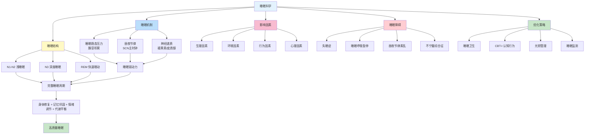
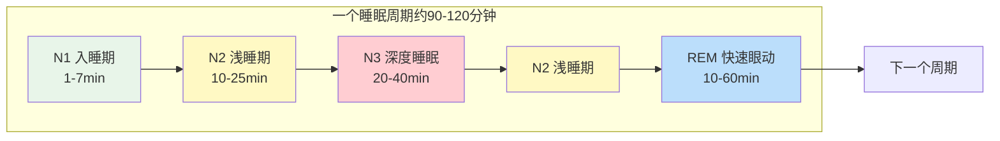
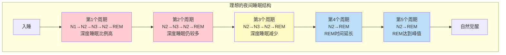

## 二、睡眠科学



### 2.1 睡眠的重要性

睡眠是生命最基本的生理需求之一，占据人生约三分之一的时间。然而，在现代社会中，睡眠常常被视为"可以压缩的时间"，被工作、娱乐和其他活动挤占。世界卫生组织数据显示，全球约27%的人存在睡眠障碍，中国成年人失眠发生率高达38.2%。这种普遍存在的睡眠剥夺，正在悄然侵蚀着公众健康。

#### 2.1.1 身体修复与生长

睡眠期间，身体会进行大规模的细胞修复、组织生长和肌肉恢复。生长激素（GH）在深度睡眠阶段（N3阶段）大量分泌，占全天分泌量的70%以上。生长激素的分泌呈脉冲式，主要集中在入睡后的前2-3个深度睡眠周期中。

生长激素的核心作用：
- **儿童期**：促进骨骼生长和器官发育，生长激素分泌不足会导致矮小症
- **成年期**：参与组织修复、肌肉蛋白质合成、脂肪分解代谢
- **老年期**：维持肌肉质量和骨密度，延缓衰老相关退化

如果长期睡眠不足或深度睡眠被干扰（如频繁夜醒、饮酒、使用安眠药），生长激素的分泌会显著减少，直接影响身体的修复能力。这也是为什么健身人群强调"训练恢复靠睡眠"——肌肉并不是在训练中生长的，而是在睡眠中修复和增长的。

#### 2.1.2 免疫调节

充足的睡眠能显著增强免疫系统功能。在睡眠期间，身体会产生更多的免疫细胞（如T细胞、自然杀伤细胞），并释放细胞因子来对抗感染和炎症。

加州大学旧金山分校的一项经典实验表明：每晚睡眠不足6小时的人，感冒风险是睡眠7小时以上者的4.2倍。这不是小幅波动，而是数量级的差异。更关键的是，长期睡眠不足还会降低疫苗的有效性——研究发现，睡眠不足6小时的人在接种流感疫苗后，抗体产生量仅为正常睡眠者的一半。

免疫系统在睡眠中的工作模式：
- **T细胞**：睡眠期间T细胞的粘附能力增强，更容易识别和消灭被病毒感染的细胞
- **细胞因子**：促炎细胞因子（如IL-1、TNF-α）在睡眠早期分泌增加，帮助启动免疫反应
- **免疫记忆**：睡眠帮助免疫系统形成对病原体的长期记忆，这是疫苗发挥作用的基础

#### 2.1.3 记忆巩固与学习

睡眠是大脑整理和巩固记忆的关键时期。白天学习的信息在睡眠中被重新激活和整合，从短期记忆转化为长期记忆。这个过程主要发生在海马体与新皮层之间的信息传递中。

不同睡眠阶段对记忆的作用：

| 睡眠阶段 | 记忆类型 | 机制 | 实际意义 |
|----------|---------|------|---------|
| N2阶段（睡眠纺锤波） | 运动技能、程序性记忆 | 纺锤波促进突触可塑性 | 学习乐器、运动技能后需要充足N2睡眠 |
| N3阶段（慢波睡眠） | 陈述性记忆（事实、知识） | 海马体→新皮层的记忆重放 | 考前突击后需要深度睡眠巩固 |
| REM睡眠 | 情绪记忆、创造性整合 | 情绪去敏化、跨领域联结 | 处理创伤经历、产生创造性洞察 |

哈佛大学的研究发现，经过一夜睡眠后，受试者对复杂问题的解决能力提高了33%。这不是因为睡眠让大脑"休息"了，而是因为睡眠期间大脑在主动地重新组织和整合信息，发现隐藏的模式和关联。

一个实用建议：如果你正在学习一项新技能或准备考试，在学习后保证充足的睡眠比延长学习时间更有效。记忆的"写入"发生在清醒时，但记忆的"存储和优化"发生在睡眠中。

#### 2.1.4 代谢调节

睡眠与代谢系统之间存在深度的双向关联。睡眠不足会从多个维度扰乱代谢平衡：

**食欲激素失衡**：
- 瘦素（leptin，抑制食欲）水平下降 → 你感觉不到饱
- 饥饿素（ghrelin，促进食欲）水平上升 → 你总是想吃东西
- 结果：睡眠不足者每天平均多摄入300-400千卡热量，而且偏好高糖高脂食物

**胰岛素敏感性降低**：
- 仅一晚睡眠不足（4小时），胰岛素敏感性就会下降约25%
- 这意味着同样的食物，睡眠不足时血糖波动更大
- 长期睡眠不足与2型糖尿病风险增加直接相关

**基础代谢率下降**：
- 睡眠不足会降低静息代谢率，身体更倾向于储存脂肪而非燃烧脂肪
- 皮质醇水平升高促进腹部脂肪堆积

一项发表在《内科学年鉴》的研究发现：即使是健康年轻人，将睡眠从8.5小时限制到4.5小时仅两周，内脏脂肪就会显著增加。减肥困难的人，首先应该检查的不是饮食和运动，而是睡眠。

#### 2.1.5 情绪调节与心理健康

充足的睡眠有助于情绪稳定和心理健康。REM睡眠被认为具有"情绪疗愈"功能——在REM睡眠中，大脑重新处理白天的情绪经历，同时降低与这些经历相关的情绪强度。这就像一个"情绪脱敏"过程，让你在第二天能以更平和的心态面对类似情境。

睡眠不足对情绪的影响是即时且显著的：
- 杏仁核（大脑的"警报中心"）反应性增加约60%
- 前额叶皮层（负责理性控制）与杏仁核的连接减弱
- 结果：情绪反应更强烈、更不理性、更难控制

加州大学伯克利的Matthew Walker教授的研究显示，经过一晚完全睡眠剥夺后，受试者对负面图片的情绪反应强度增加了60%，而对正面图片的反应却没有相应增强——睡眠不足让大脑对负面信息特别敏感。

临床数据表明：
- 长期失眠者患抑郁症的风险是正常睡眠者的5倍
- 焦虑症患者中，约70%存在睡眠问题
- 双向情感障碍的躁狂发作常以睡眠需求减少为前兆信号

#### 2.1.6 大脑清洁系统

2012年罗切斯特大学Maiken Nedergaard团队的发现彻底改变了我们对睡眠功能的理解：大脑在睡眠期间会启动"类淋巴系统"（glymphatic system），这是一个高效的废物清除网络。

类淋巴系统的工作原理：
- 清醒时：脑细胞间隙缩小约60%，废物清除效率低
- 深度睡眠时：脑细胞收缩，间隙扩大，脑脊液大量涌入冲刷代谢废物
- 清除的废物包括：β-淀粉样蛋白（阿尔茨海默病标志物）、tau蛋白、代谢副产物

这个发现意味着：**睡眠不足不仅让你第二天精神不好，它实际上在让你的大脑"中毒"**。长期睡眠不足导致β-淀粉样蛋白持续堆积，显著增加阿尔茨海默病的风险。一项发表在《Science》上的研究发现，仅一晚睡眠剥夺就会使大脑中β-淀粉样蛋白水平增加约5%。

这对所有年龄段都有意义：
- 年轻人：足够的睡眠保护长期认知能力
- 中年人：这是预防神经退行性疾病的关键窗口期
- 老年人：深度睡眠减少是类淋巴系统效率下降的原因之一，形成恶性循环

#### 2.1.7 肠道-睡眠轴

近年来的研究揭示了肠道微生物组与睡眠之间的双向关系，称为"肠-脑-睡眠轴"。这个发现为理解睡眠问题开辟了全新视角。

**肠道如何影响睡眠**：
- 肠道细菌产生约95%的血清素（褪黑素的前体），肠道菌群失调直接减少褪黑素的合成原料
- 某些肠道菌株（如乳酸杆菌、双歧杆菌）能产生γ-氨基丁酸（GABA），这是一种促进放松和睡眠的神经递质
- 肠道菌群的昼夜节律与宿主的昼夜节律相互同步，任何一方的紊乱都会影响另一方

**睡眠如何影响肠道**：
- 睡眠不足改变肠道菌群组成，减少有益菌多样性
- 睡眠碎片化增加肠道通透性（"肠漏"），引发低度全身炎症
- 夜间进食（因睡眠不足导致的饥饿素升高）进一步扰乱肠道菌群的昼夜节律

**实操建议**：
- 摄入富含膳食纤维的食物（全谷物、蔬菜、豆类）为有益菌提供"食物"（益生元）
- 发酵食品（酸奶、泡菜、味噌、康普茶）补充活性益生菌
- 避免睡前2-3小时大量进食，给肠道"休息"时间
- 规律作息本身就是维护肠道菌群节律的有效手段

### 2.2 睡眠周期与结构

人类的睡眠不是一种均质的静止状态，而是由多个复杂阶段交替组成的动态过程。每个完整的睡眠周期约90-120分钟，包含不同的睡眠阶段。一个典型的睡眠夜晚包含4-6个完整的睡眠周期。



#### 2.2.1 N1阶段——入睡期

N1是从清醒到睡眠的过渡阶段，持续1-7分钟，占总睡眠时间的2-5%。

**生理特征**：
- 肌肉逐渐放松，但仍有部分张力
- 眼球开始缓慢滚动
- 心率和呼吸开始减慢
- 脑电波从清醒时的α波（8-13Hz）转变为θ波（4-7Hz）

**主观体验**：
- 感觉自己"快要睡着了但还没真正睡着"
- 可能出现"入睡抽搐"（hypnic jerk）——突然的肌肉痉挛，发生率约70%
- 开始出现零散的、不成形的思维片段

**容易被中断的因素**：噪音、光线、不舒适的体位、焦虑思绪都可能将你从N1拉回清醒状态。入睡困难的人往往卡在N1阶段反复循环。

#### 2.2.2 N2阶段——稳定浅睡期

N2是睡眠的主要组成部分，占总睡眠时间的45-55%。大多数人花费在N2上的时间比任何其他阶段都多。

**生理特征**：
- 心率和体温进一步下降
- 肌肉活动显著减少
- 脑电波中出现两种独特的波形：
  - **睡眠纺锤波（sleep spindles）**：12-14Hz的突发节律波，持续0.5-2秒
  - **K复合波**：高振幅的负-正双相波，通常由外部刺激触发

**功能**：
- 睡眠纺锤波与记忆巩固密切相关——纺锤波密度越高，第二天记忆表现越好
- K复合波可能具有"睡眠守卫"功能，帮助维持睡眠不被轻微干扰中断
- 身体开始进行基础的生理修复

**年龄变化**：老年人的N2阶段中，睡眠纺锤波的数量和振幅都明显减少，这与认知功能下降有关。

#### 2.2.3 N3阶段——深度睡眠（慢波睡眠）

N3是整个睡眠中恢复性最强的阶段，占总睡眠时间的15-25%。它主要集中在前半夜的前2-3个睡眠周期中。

**生理特征**：
- 最难被唤醒——需要很大的声音或强烈刺激才能醒来
- 醒来后会有明显的"睡眠惯性"（sleep inertia），感到迷糊、定向障碍
- 脑电波以高振幅的δ波（0.5-4Hz）为主
- 肌肉完全放松
- 血压、心率、呼吸都降到最低水平

**核心功能**：
- **生长激素分泌高峰**：N3是生长激素脉冲式分泌的主要触发条件
- **免疫增强**：促炎细胞因子在N3期间大量释放
- **组织修复**：蛋白质合成加速，肌肉和结缔组织修复
- **能量恢复**：糖原储备得到补充
- **陈述性记忆巩固**：海马体中的白天经历被"重放"并转移到新皮层长期存储
- **大脑清洁**：类淋巴系统在N3阶段最为活跃

**N3的年龄衰退**：
- 20岁：深度睡眠占总睡眠的20%以上
- 40岁：降至15%左右
- 60岁：可能降至5%以下
- 80岁：有些人几乎检测不到深度睡眠

这是自然的衰老过程，但也是老年人认知功能下降、免疫功能减退、身体恢复变慢的重要原因之一。好消息是，通过良好的睡眠卫生和生活方式调整，可以延缓这一衰退过程。

#### 2.2.4 REM睡眠——快速眼动睡眠

REM睡眠是睡眠中最具"矛盾性"的阶段——大脑活动极度活跃（接近清醒水平），但身体肌肉却被暂时"瘫痪"（除了呼吸肌和眼肌）。

**生理特征**：
- 眼球在闭合的眼睑下快速移动（每秒可达30-60次）
- 脑电波呈现低振幅、高频的混合节律（类似清醒状态）
- 全身骨骼肌张力消失（肌张力缺失，atonia）
- 心率和呼吸变得不规则
- 核心体温调节暂时失灵（这也是为什么极端温度更容易在REM期醒来的原因）
- 男性出现勃起，女性阴蒂充血（与梦境内容无关，是自主神经系统的自发激活）

**REM的时间分布**：
- 第一次出现：入睡后约60-90分钟
- 第一个REM期：仅5-10分钟
- 随着夜晚推进，REM期逐渐延长
- 最后一个REM期：可持续30-60分钟
- 这就是为什么早醒会"切掉"最重要的REM睡眠

**核心功能**：
- **情绪调节**：REM期间大脑重新处理情绪记忆，降低其情绪强度（"脱敏"）
- **程序性记忆巩固**：运动技能、习惯的最终"固化"
- **创造性思维**：大脑在REM期间建立远距离的神经连接，产生创造性的洞察和联想
- **突触可塑性维护**：维护和优化神经突触连接

**REM与梦境**：约80%的梦境发生在REM阶段，且REM梦境通常更生动、更情绪化、更离奇。非REM阶段的梦境通常更平淡、更接近日常思维。

**清醒梦（Lucid Dreaming）**：在REM睡眠中意识到自己在做梦，并能在一定程度上控制梦境内容。清醒梦有其实际应用价值：
- 创伤后应激障碍（PTSD）患者可以通过清醒梦技术在安全环境中重新面对和处理创伤记忆
- 运动员和音乐家可以在梦中"排练"技能
- 清醒梦可以通过"现实检测"练习（白天反复问自己"我在做梦吗？"）和"MILD技术"（入睡前反复暗示"下次做梦时我会意识到"）来训练

#### 2.2.5 理想的睡眠结构

一个健康的成年人的理想睡眠结构：



**关键指标**：
- 完整睡眠周期：4-6个/晚
- 深度睡眠（N3）：1-2小时，主要在前半夜
- REM睡眠：1.5-2小时，主要在后半夜
- 总睡眠时间：7-9小时（成人18-64岁），7-8小时（老年65岁以上）
- 睡眠效率（实际睡眠时间/卧床时间）：>85%为良好，>90%为优秀
- 入睡潜伏期（上床到睡着）：10-20分钟为正常
- 觉醒次数：≤1次/晚为良好

#### 2.2.6 睡眠结构的年龄变化

| 年龄段 | 总睡眠时间 | 深度睡眠比例 | REM睡眠比例 | 特殊说明 |
|--------|-----------|-------------|-------------|----------|
| 新生儿（0-3月） | 14-17小时 | 20-25% | 50% | REM比例最高，大脑快速发育期 |
| 婴儿（4-11月） | 12-15小时 | 20-25% | 30-35% | 开始建立昼夜节律 |
| 幼儿（1-2岁） | 11-14小时 | 20-25% | 25-30% | 午睡仍然必要 |
| 学龄前（3-5岁） | 10-13小时 | 15-20% | 22-25% | 午睡逐渐减少 |
| 学龄期（6-12岁） | 9-12小时 | 15-20% | 20-25% | 生长激素分泌旺盛期 |
| 青少年（13-18岁） | 8-10小时 | 15-20% | 20-25% | 生物钟自然后移 |
| 成人（18-64岁） | 7-9小时 | 15-20% | 20-25% | 最佳睡眠时长约7.5小时 |
| 老年（65岁以上） | 7-8小时 | 5-10% | 18-20% | 深度睡眠显著减少 |

**青少年的特殊性**：青春期生物钟会自然后移约1-2小时（褪黑素分泌推迟），这不是"懒"而是生理需求。这就是为什么青少年倾向于晚睡晚起，而学校早早上课时间与他们的生物钟冲突——美国儿科学会建议中学上课时间不早于8:30。

### 2.3 睡眠调节的双过程模型

1982年，瑞士睡眠研究者Alexander Borbély提出了睡眠调节的双过程模型，至今仍是理解睡眠的核心理论框架。这个模型认为，人类的睡眠由两个独立但相互作用的过程调控。

```mermaid
graph LR
    subgraph 过程S：睡眠稳态压力
        S1[清醒时<br>腺苷逐渐积累] --> S2[睡眠压力增大]
        S2 --> S3[入睡]
        S3 --> S4[腺苷被清除]
        S4 --> S1
    end
    
    subgraph 过程C：昼夜节律
        C1[SCN主时钟<br>~24.2小时周期] --> C2[褪黑素/皮质醇调控]
        C2 --> C3[体温节律]
        C3 --> C1
    end
    
    S2 --> D[两过程协同]
    C2 --> D
    D --> E{睡眠压力高<br>+<br>节律促进睡眠?}
    E -->|是| F[强烈困意<br>快速入睡]
    E -->|否| G[清醒或<br>入睡困难]
    
    style S2 fill:#ffcdd2
    style C2 fill:#bbdefb
    style F fill:#c8e6c9
    style G fill:#fff9c4
```

#### 2.3.1 过程S——睡眠稳态压力

过程S描述的是"你醒了多久就有多困"的机制。

**腺苷的角色**：腺苷（adenosine）是这个过程的核心分子。它是ATP（细胞能量货币）分解的副产物，随着清醒时间的延长在大脑中逐渐积累。腺苷与大脑中的A1和A2A受体结合，抑制促觉醒神经元的活动，产生越来越强的睡眠压力。

**腺苷的清除**：在N3深度睡眠期间，腺苷被高效清除。这就是为什么午睡（特别是长午睡）会"重置"部分睡眠压力，导致晚上入睡困难——你把腺苷清掉了一部分。

**咖啡因的机制**：咖啡因通过阻断腺苷受体来对抗睡眠压力，但关键点在于——**咖啡因不清除腺苷，它只是让大脑"感觉不到"腺苷的存在**。一旦咖啡因代谢完毕，积累的腺苷会"冲浪"般涌来，产生更强烈的困倦感——这就是"咖啡因崩溃"（caffeine crash）。

咖啡因的半衰期约5-6小时，但这是平均值：
- CYP1A2基因的变异导致个体差异巨大
- 快代谢型：半衰期约2-3小时
- 慢代谢型：半衰期可达8-10小时
- 吸烟者的咖啡因代谢加快约50%
- 口服避孕药的女性代谢减慢约50%

**实用含义**：如果你是咖啡因慢代谢型（可以通过基因检测确认），下午12点后的一杯咖啡就可能显著影响你的睡眠质量，即使你觉得自己"喝了咖啡也能睡着"——它影响的是深度睡眠的量和质量，而你可能感觉不到。

#### 2.3.2 过程C——昼夜节律

过程C描述的是你体内"内置时钟"的调节机制。

**SCN——主时钟**：下丘脑视交叉上核（suprachiasmatic nucleus, SCN）是人体的"主时钟"，包含约20,000个神经元，它们以约24.2小时的周期自主振荡。SCN通过以下途径向全身发送时间信号：
- 直接神经投射到下丘脑其他区域
- 调节松果体的褪黑素分泌
- 通过自主神经系统影响各器官

**外周时钟**：除了SCN这个主时钟，身体的几乎每个器官和组织都拥有自己的"外周时钟"——肝脏、肠道、肌肉、脂肪组织中的细胞都有昼夜节律基因的自主表达。这些外周时钟由SCN通过激素信号和神经信号统一协调，但也受局部因素影响（如进食时间影响肝脏时钟，运动时间影响肌肉时钟）。当外周时钟与主时钟不同步时（如不规律的进食和睡眠时间），就会产生"内部时差"，增加代谢疾病风险。

**光信号输入**：SCN的主要"校准"信号是光线。视网膜中的特殊感光细胞——含黑视蛋白的视网膜神经节细胞（ipRGCs）——对蓝光（460-480nm波长）特别敏感。这些细胞直接投射到SCN，帮助它将内部时钟与外部昼夜同步。

**褪黑素——黑暗的信使**：
- 分泌受SCN调控，当光线减少时开始分泌
- 通常在晚上9-10点开始上升（"褪黑素起始点"，DLMO）
- 在凌晨2-4点达到峰值
- 在凌晨5-7点随着光线增加而降低
- 褪黑素本身不是"催眠剂"，它是一个"时机信号"，告诉身体"现在是夜晚"

**皮质醇——觉醒的信使**：
- 皮质醇分泌在凌晨3-4点开始上升
- 在醒来后30-45分钟达到峰值（"皮质醇觉醒反应"，CAR）
- 帮助启动身体的觉醒状态
- 皮质醇水平的上升与体温上升协同作用

**体温节律**：核心体温有约1°C的昼夜波动，这个微小的波动对睡眠影响巨大：
- 凌晨4-5点：体温最低（约36.2°C）——最深的睡眠时段
- 下午4-5点：体温最高（约37.2°C）——最清醒的时段
- 入睡的核心条件：核心体温需要在2小时内下降约1°C
- 手脚温度上升（血管扩张散热）是入睡的先兆信号

#### 2.3.3 两过程的协同与冲突

**最佳入睡窗口**：当过程S（睡眠压力高）和过程C（昼夜节律促进睡眠——体温下降、褪黑素分泌）同时作用时，入睡最容易，睡眠质量最高。这通常发生在：

- 正常作息者的最佳入睡时间：晚上10:00-11:00
- 此时：已经清醒约15-16小时（腺苷积累高）+ 褪黑素开始上升 + 体温开始下降

**下午的"瞌睡低谷"**：下午1:30-3:00的困倦感是正常的生理现象。此时睡眠压力处于中等水平，而昼夜节律出现一个小的"低谷"（post-lunch dip），两个过程都不太支持清醒状态。这与午餐关系不大（即使不吃午饭也会困），是进化留下的"双相睡眠"痕迹。

**熬夜为什么特别有害**：凌晨2-5点之间，虽然睡眠压力非常高，但体温正在下降、褪黑素正在峰值——如果强行保持清醒（如轮班工作），大脑处于一种极其矛盾的状态：强烈的睡眠驱动力对抗着已经降到谷底的生理功能。这也是凌晨时段交通事故率最高的原因。

### 2.4 影响睡眠的因素

睡眠质量受到多种因素的交互影响，理解这些因素是优化睡眠的前提。

#### 2.4.1 生理因素

**年龄**：随着年龄增长，深度睡眠逐渐减少，睡眠碎片化增加，生物钟前移。这些变化从30-40岁就开始，到60岁后变得明显。老年人不需要更少的睡眠——他们需要同样多的睡眠，只是获得高质量睡眠的能力下降了。

**激素波动**：女性的月经周期显著影响睡眠。黄体期（排卵后到月经前）体温升高约0.3-0.5°C，孕酮水平升高，这两个因素都会降低睡眠质量。经前期和围绝经期是女性睡眠问题的高发期。

**遗传因素**：DEC2基因突变的携带者每晚只需要6小时睡眠就能保持正常功能。但这种突变极为罕见（不到1%的人口）。大多数人自认为"不需要太多睡眠"，实际上只是习惯了慢性睡眠剥夺的状态。

**疾病状态**：甲状腺功能亢进、慢性疼痛、前列腺增生导致的夜尿频繁、哮喘、胃食管反流等都会严重影响睡眠。

#### 2.4.2 环境因素

**光照**：光线是影响昼夜节律最强烈的因素。关键要点：
- 蓝光（460-480nm）抑制褪黑素的效果是其他波长光线的2-3倍
- 普通室内照明（100-300lux）就能抑制褪黑素分泌约50%
- 电子屏幕（手机、平板）在眼睛前方30cm处可达100-300lux
- 晚间佩戴防蓝光眼镜可以减少约50%的褪黑素抑制效果
- 但最好的做法是：睡前1-2小时减少所有屏幕使用

**温度**：睡眠环境温度对睡眠质量有决定性影响。
- 最适卧室温度：18-22°C（比多数人习惯的温度要低）
- 核心机制：入睡需要核心体温下降1°C，过热的环境阻止这一过程
- 热水澡的反直觉效应：睡前1-2小时洗热水澡（不是睡前立刻洗）反而帮助入睡，因为热水促进外周血管扩张，加速散热，最终降低核心体温
- 冬天不宜将暖气开太高——过暖的卧室是冬季睡眠差的常见原因

**噪音**：
- 即使噪音不把你吵醒（微觉醒），它也会减少深度睡眠和REM睡眠
- 持续的背景白噪音（约50-60dB）比间歇性噪音好得多
- 但长期依赖白噪音可能让听觉系统变得更加敏感
- 最佳方案是隔绝噪音源，而非用噪音掩盖噪音

**空气质量**：CO₂浓度是常被忽视的因素。门窗紧闭的卧室，一夜之间CO₂浓度可达2000-3000ppm（室外约400ppm），高CO₂会导致睡眠质量下降、晨起头疼。建议卧室保持适度通风，或使用新风系统。

**寝具**：床垫和枕头的选择直接影响睡眠质量。
- 床垫：中等硬度（不太软不太硬），能够支撑脊柱的自然曲线
- 枕头：高度应与肩宽匹配，侧卧时保持颈椎与脊柱在一条直线上
- 被子：重力毯（weighted blanket，约体重的10%）通过深压力刺激增加安全感，有研究显示可减少焦虑约30%

#### 2.4.3 行为因素

**咖啡因摄入**：如前所述，咖啡因的半衰期约5-6小时。一个实用的计算：
- 下午2点喝一杯咖啡（200mg咖啡因）
- 晚上10点睡觉时，体内仍有约50-100mg咖啡因
- 这足以影响深度睡眠的质量，即使你感觉不到

**常见饮品的咖啡因含量参考**：

| 饮品 | 容量 | 咖啡因含量 | 备注 |
|------|------|-----------|------|
| 意式浓缩 | 单份30ml | 63mg | 双份翻倍 |
| 美式咖啡 | 中杯350ml | 150mg | 取决于浓缩份数 |
| 滴滤咖啡 | 一杯240ml | 95-200mg | 变化范围大 |
| 红茶 | 一杯240ml | 40-70mg | 发酵程度影响含量 |
| 绿茶 | 一杯240ml | 25-45mg | 比红茶少 |
| 可乐 | 一罐330ml | 30-40mg | 不知不觉累积 |
| 能量饮料 | 一罐250ml | 80mg | 部分品牌高达300mg |
| 巧克力 | 一块40g | 10-30mg | 黑巧克力更高 |
| 抹茶 | 一份2g粉 | 60-80mg | 含L-茶氨酸，有一定镇静平衡效果 |

**酒精**：酒精可能是睡眠最大的"伪装者"。
- 它确实能缩短入睡时间（镇静作用）
- 但它会严重破坏后半夜的睡眠结构
- 酒精抑制REM睡眠，导致情绪调节能力下降
- 酒精代谢产物乙醛会激活交感神经，导致频繁觉醒
- 利尿作用增加夜间起夜
- 结论：酒精不是"助眠"，是"镇静后的反噬"

**运动**：规律运动是改善睡眠的最有效行为干预之一，但时机和强度很重要。
- 最佳时间：下午4-7点（体温最高时段运动后会加速晚间的体温下降）
- 有氧运动增加深度睡眠的比例（增加约15-20%）
- 睡前2-3小时的高强度运动（心率>最大心率的80%）会延迟入睡
- 睡前的轻度瑜伽或拉伸反而有助于入睡

**运动类型与睡眠质量的关系**：

| 运动类型 | 对深度睡眠的影响 | 对入睡的影响 | 推荐时间 |
|---------|----------------|-------------|---------|
| 中等强度有氧（快走、慢跑、游泳） | 显著增加 | 促进（但非睡前） | 下午3-7点 |
| 高强度间歇（HIIT） | 增加，但过晚会延迟入睡 | 睡前3小时内有害 | 上午或下午 |
| 力量训练 | 增加生长激素分泌，促进深度睡眠 | 轻度延迟（交感激活） | 上午或下午 |
| 瑜伽/太极 | 轻度增加，主要降低皮质醇 | 直接促进 | 任何时间，包括睡前 |
| 散步 | 轻度改善 | 促进（尤其晚饭后） | 任何时间 |

**进食时间**：
- 睡前2-3小时避免大量进食（胃部活动干扰睡眠）
- 但空腹也可能干扰睡眠——适度的碳水化合物零食（如全麦饼干、香蕉）可以促进色氨酸进入大脑，辅助褪黑素合成
- 高蛋白/高脂肪的零食则需要更长时间消化，不建议睡前食用

**屏幕使用**：电子设备影响睡眠的机制不仅是蓝光，还包括：
- 内容的情绪激活（刷社交媒体、看新闻引发焦虑）
- 认知激活（玩游戏、工作让大脑保持警觉）
- 打破时间感（"再看一个视频"变成再看一小时）

#### 2.4.4 心理因素

**压力和焦虑**：是失眠最常见的诱因。压力激活下丘脑-垂体-肾上腺轴（HPA轴），升高皮质醇水平，直接对抗入睡。

**过度思考**：睡前大脑进入"反刍"模式——反复回想白天的事情或担忧明天的事情。这种思维模式激活默认模式网络（DMN），让大脑保持在一种高度活跃的状态。

**睡眠焦虑**：这是失眠慢性化的关键因素。一次失眠→担心"今晚又睡不着"→焦虑→更难入睡→验证了恐惧→下次更焦虑。这个恶性循环被称为"条件性觉醒"（conditioned arousal），是慢性失眠的核心机制。

**不合理信念**：常见且有害的睡眠信念：
- "我必须睡够8小时"（个体差异很大，有人6.5小时就够了）
- "昨晚没睡好，今天一定要早点上床补觉"（延长卧床时间反而降低睡眠效率）
- "如果我睡不着，至少躺在床上休息"（这会破坏床与睡眠的关联）
- "不喝酒/不吃药我就睡不着"（强化了心理依赖）

### 2.5 睡眠障碍与科学应对

#### 2.5.1 失眠症（Insomnia）

失眠是最常见的睡眠障碍，约10-15%的成年人存在慢性失眠。

**诊断标准**（满足全部）：
- 入睡困难（潜伏期>30分钟）或维持睡眠困难或早醒
- 即使有充足的睡眠机会仍然存在
- 导致日间功能受损（疲劳、注意力下降、情绪问题等）
- 每周至少3次，持续至少3个月（慢性失眠）

**急性失眠**（<3个月）：通常由明确诱因触发（压力事件、环境变化、疾病），诱因消除后自然好转。关键是不要因此产生睡眠焦虑。

**慢性失眠**（≥3个月）：失眠本身已经变成独立的问题，即使原始诱因消除，失眠仍持续存在。需要专门的治疗干预。

**CBT-I——失眠认知行为疗法**（一线治疗推荐）：

CBT-I是全球睡眠医学界公认的慢性失眠首选治疗，效果优于药物且更持久。美国医师协会、欧洲睡眠研究学会均推荐CBT-I作为一线治疗。

CBT-I包含5个核心组件：

**① 睡眠限制疗法**
- 核心原理：减少卧床时间以匹配实际睡眠时间，提高睡眠效率
- 操作方法：
  1. 记录2周睡眠日记，计算平均实际睡眠时间
  2. 将卧床时间限制为平均实际睡眠时间（但不少于5小时）
  3. 无论当晚睡了多久，固定时间起床
  4. 当睡眠效率>85%时，每周增加15分钟卧床时间
  5. 当睡眠效率<80%时，再减少15分钟卧床时间
- 原理：通过增加睡眠压力来促进更深、更连续的睡眠
- 注意：初期可能更困，需要限制驾驶等需要注意力的活动

**② 刺激控制疗法**
- 核心原理：重建"床=睡眠"的条件反射
- 规则：
  1. 只在困了的时候才上床
  2. 床只用于睡眠和性生活（不看手机、不工作、不看电视）
  3. 如果20分钟内无法入睡，离开卧室去做些安静的活动
  4. 困了再回来
  5. 无论睡了多久，闹钟响了就起来
  6. 白天不补觉
- 这是打破"条件性觉醒"最有效的方法

**③ 认知重构**
- 识别和改变关于睡眠的不合理信念
- 常见的扭曲认知及其纠正：
  - "8小时是必须的" → 个体差异很大，6.5-9小时都是正常范围
  - "一晚失眠会造成严重后果" → 人体有很强的适应能力，偶尔一晚影响有限
  - "我必须控制睡眠" → 睡眠是自发过程，越想控制越控制不了
  - "如果我睡不好就无法工作" → 很多人在睡眠不足时仍能保持基本功能

**④ 放松训练**
- 渐进性肌肉放松（PMR）：从脚趾到头部依次紧绷-放松各肌肉群
- 腹式呼吸：4秒吸气-7秒屏气-8秒呼气（4-7-8呼吸法）
- 身体扫描冥想：将注意力从头顶缓慢移动到脚趾，不做判断地觉察每个部位
- 意象引导：想象一个平静的场景（海滩、森林），调动所有感官

**⑤ 睡眠卫生教育**（辅助组件，单独使用效果有限，但配合上述技术效果显著）

**CBT-I的疗效数据**：
- 70-80%的慢性失眠患者获得显著改善
- 平均入睡时间减少20-30分钟
- 平均总睡眠时间增加45-60分钟
- 效果在治疗结束后持续保持（不像药物停用后常反弹）
- 可通过面对面治疗或数字化CBT-I程序（如Sleepio、CBT-i Coach等APP）获得

#### 2.5.2 睡眠呼吸暂停综合征（OSA）

睡眠呼吸暂停在打鼾人群中非常普遍，但大多数人并不知道自己有这个问题。

**典型症状**：
- 响亮而不规则的打鼾（间歇性中断）
- 睡眠中出现呼吸暂停（通常由伴侣观察到）
- 睡眠中被憋醒或出现窒息感
- 晨起口干、头痛
- 白天嗜睡，即使睡眠时间充足
- 夜间频繁起夜（夜尿）

**风险因素**：
- 肥胖（BMI>25，颈部脂肪堆积压迫气道）
- 男性（风险是女性的2-3倍，但女性围绝经期后风险增加）
- 年龄（>50岁风险显著增加）
- 颈围偏大（男性>43cm，女性>38cm）
- 扁桃体/腺样体肥大
- 下颌后缩
- 饮酒和使用镇静药物

**健康后果**：未经治疗的中重度OSA：
- 高血压风险增加2-3倍
- 心房颤动风险增加2-4倍
- 中风风险增加2-3倍
- 交通事故风险增加2-7倍
- 2型糖尿病风险增加
- 认知功能加速下降

**诊断与治疗**：
- 诊断金标准：多导睡眠监测（PSG）——在睡眠实验室监测一夜
- 简化方案：家用睡眠呼吸监测仪（HST）
- AHI（呼吸暂停低通气指数）：5-15为轻度，15-30为中度，>30为重度

治疗方案：

| 严重程度 | 一线治疗 | 辅助措施 |
|---------|---------|---------|
| 轻度 | 减重（如超重）+体位治疗（侧卧） | 口腔矫治器 |
| 中度 | CPAP（持续气道正压通气）或口腔矫治器 | 减重、戒酒、侧卧 |
| 重度 | CPAP（必须） | 减重、考虑手术 |

CPAP是OSA的"金标准"治疗：通过面罩持续吹入正压空气，保持气道通畅。效果立竿见影——使用第一晚就能明显改善睡眠质量和日间精神。但依从性是主要挑战（约50%的患者在一年内停止使用），主要原因是面罩不适和气流干燥。

**提高CPAP依从性的技巧**：
- 尝试不同类型的面罩（鼻枕、鼻罩、全面罩），找到最舒适的一种
- 使用加湿器减少气道干燥
- 先在白天短暂佩戴适应，逐步过渡到整夜使用
- 选择具有"渐升压力"功能的机型，入睡时压力较低
- 定期清洁设备，避免异味和细菌滋生

#### 2.5.3 昼夜节律紊乱

**延迟型睡眠-觉醒障碍（DSPD）**：
- 最常见的节律紊乱类型
- 特征：入睡时间和醒来时间都显著后移（如凌晨3点睡，中午12点醒）
- 常见于青少年和年轻成人
- 不是"懒"——是生物钟真的调不过来
- 治疗：晨光照射（醒来后立即接受30-60分钟强光）+ 睡前避免蓝光 + 低剂量褪黑素（睡前4-5小时服用0.5-1mg）

**提前型睡眠-觉醒障碍（ASPD）**：
- 较少见，多见于老年人
- 特征：傍晚7-8点就困了，凌晨3-4点自然醒来
- 治疗：傍晚光疗 + 晨间避免过早的强光

**轮班工作障碍**：
- 影响约20%的轮班工作者
- 夜班工作者在白天睡觉时，深度睡眠和REM睡眠都显著减少
- 长期轮班与心血管疾病、代谢综合征、某些癌症风险增加相关
- 应对策略：
  1. 夜班期间保持明亮光照（>1000lux）
  2. 下班回家路上戴墨镜减少晨光暴露
  3. 卧室用遮光窗帘模拟黑夜
  4. 固定一个相对一致的睡眠时间（即使周末也尽量保持）
  5. 必要时使用褪黑素（睡前30分钟服用）

**时差反应（Jet Lag）**：
- 向东飞行比向西飞行更难适应（因为需要"缩短"一天）
- 适应速度：约1天/时区（向西），约1.5天/时区（向东）
- 应对：到达后尽快按照当地时区接受光照和进食；出发前几天开始逐步调整作息
- 实操时差适应方案：
  - **向东飞行**（如中国→欧洲）：出发前3天每天提前1小时睡觉和起床；到达后早晨立即接受强光照射，傍晚避免光照
  - **向西飞行**（如中国→美国）：出发前3天每天推迟1小时睡觉和起床；到达后下午接受强光照射，帮助"延长"白天

#### 2.5.4 不宁腿综合征（RLS）

不宁腿综合征影响约5-10%的人口，在老年人中更常见。

**特征性症状**：
- 腿部深处出现难以描述的不适感（蚁行感、灼热感、牵拉感）
- 静止时加重，运动后缓解
- 傍晚和夜间加重
- 导致严重的入睡困难

**常见诱因**：
- 缺铁（即使血红蛋白正常，铁蛋白<75ng/mL也可能引发）
- 肾功能不全
- 周围神经病变
- 某些药物（抗抑郁药、抗组胺药、多巴胺受体拮抗剂）
- 咖啡因过量
- 怀孕（尤其在孕晚期，约20%的孕妇出现RLS症状）

**治疗方法**：
- 首先排查和治疗铁缺乏（口服铁剂+维生素C促进吸收）
- 减少咖啡因和酒精摄入
- 中等强度有氧运动
- 严重者需要药物治疗（多巴胺受体激动剂或α2δ配体类药物）

### 2.6 睡眠优化策略

#### 2.6.1 睡眠卫生原则（完整清单）

| 原则 | 具体措施 | 科学依据 | 优先级 |
|------|---------|---------|-------|
| 固定作息 | 每天同一时间睡觉和起床（包括周末，偏差不超过30分钟） | 稳定昼夜节律，强化SCN信号 | ★★★★★ |
| 光照管理 | 晨起后30分钟内接受10-30分钟自然光；日落后减少蓝光暴露 | 调节褪黑素分泌时机，校准生物钟 | ★★★★★ |
| 温度控制 | 卧室保持18-22°C，睡前1-2小时可洗温水澡 | 体温下降1°C是入睡的必要条件 | ★★★★☆ |
| 黑暗环境 | 使用遮光窗帘，遮盖所有发光设备，必要时佩戴眼罩 | 任何光线（即使微弱）都会抑制褪黑素 | ★★★★☆ |
| 限制咖啡因 | 午后（12-14点后）不摄入含咖啡因的饮品和食物 | 咖啡因半衰期5-6小时，影响深度睡眠 | ★★★★☆ |
| 避免酒精 | 睡前3-4小时不饮酒 | 酒精破坏睡眠结构，抑制REM睡眠 | ★★★★☆ |
| 规律运动 | 每天至少30分钟中等强度运动，睡前2-3小时避免高强度运动 | 运动增加深度睡眠比例 | ★★★★☆ |
| 放松仪式 | 睡前30-60分钟进行固定序列的放松活动 | 降低生理和心理唤醒水平，建立条件反射 | ★★★☆☆ |
| 限制午睡 | 午睡在13:00-15:00之间，不超过30分钟 | 避免清除过多睡眠压力影响夜间入睡 | ★★★☆☆ |
| 床只用于睡眠 | 不在床上工作、看手机、看电视 | 强化床→睡眠的条件反射 | ★★★★☆ |
| 避免时钟监控 | 不看时间，将闹钟翻面 | 减少睡眠焦虑和"计算还能睡几小时"的思维 | ★★★☆☆ |
| 晚餐适量 | 睡前2-3小时完成晚餐，避免辛辣、高脂肪食物 | 减少胃食管反流和消化活动干扰 | ★★★☆☆ |
| 管理液体 | 睡前1-2小时减少饮水量 | 减少夜间起夜次数 | ★★☆☆☆ |
| 卧室专用 | 卧室不放电视、电脑，不堆杂物 | 保持卧室与睡眠的心理关联 | ★★☆☆☆ |

#### 2.6.2 呼吸与放松技术详解

放松训练是CBT-I的核心组件之一，以下提供多种经过验证的技术，从简单到深入，读者可以根据自身情况选择最适合的方法。

**① 4-7-8呼吸法（Andrew Weil博士推广）**

这是最易上手的呼吸技术，通过延长呼气时间激活副交感神经系统。

操作步骤：
1. 舌尖抵住上颚前牙后方的牙龈位置，全程保持不动
2. 用嘴完全呼气，发出"呼"的声音
3. 闭嘴，用鼻子吸气4秒
4. 屏住呼吸7秒
5. 用嘴呼气8秒，发出"呼"的声音
6. 以上为一个循环，重复4个循环

要点：
- 初学者可能无法坚持7秒屏气，可以从4-4-6开始，逐步延长
- 核心不是精确计数，而是保持呼气时间>吸气时间的节奏
- 每天练习2次（不仅在睡前），持续6-8周效果更显著
- 原理：延长呼气激活迷走神经，降低心率和血压，触发放松反应

**② 生理叹息法（Physiological Sigh）**

斯坦福大学Andrew Huberman实验室研究发现的一种快速降低生理唤醒的方法，正常人在焦虑时会自然产生这种呼吸模式。

操作步骤：
1. 通过鼻子进行一次正常吸气
2. 吸气结束后，不呼气，立即再通过鼻子进行一次短促的补充吸气（"双吸气"）
3. 然后通过嘴巴缓慢、悠长地完全呼出
4. 重复1-3次即可显著降低焦虑水平

优势：见效极快（通常1-3个循环就能感受到平静），不需要长时间练习，可以在任何场景使用。

**③ 渐进性肌肉放松（PMR）**

由Edmund Jacobson在1930年代开发，至今仍是临床心理学中最常用的放松技术之一。原理是通过"先紧张再放松"的对比，让身体学会识别和释放肌肉紧张。

完整流程（约15-20分钟）：
1. 双脚：用力卷曲脚趾，保持5秒→完全放松15秒，感受放松的差异
2. 小腿：脚尖向上勾，绷紧小腿肌肉，保持5秒→放松
3. 大腿：用力绷紧大腿肌肉（好像要把膝盖压向地面），保持5秒→放松
4. 臀部：用力收紧臀部，保持5秒→放松
5. 腹部：用力收紧腹肌，保持5秒→放松
6. 手掌：用力握拳，保持5秒→放松
7. 前臂：弯曲手腕向身体方向，绷紧前臂，保持5秒→放松
8. 上臂：弯曲手臂用力收缩肱二头肌，保持5秒→放松
9. 肩膀：用力耸肩向耳朵方向，保持5秒→放松（肩颈区域是焦虑情绪的"重灾区"）
10. 面部：用力皱眉+紧闭双眼+咬紧牙关，保持5秒→放松
11. 全身：同时绷紧所有肌肉群，保持5秒→完全放松，静躺1-2分钟

进阶技巧：
- 熟练后可以跳过"紧张"步骤，直接进行"放松"——想象温暖的液体从头顶缓缓流过全身
- 可以结合意象引导："放松"时想象紧张像黑色的烟雾从指尖散去

**④ 身体扫描冥想**

这是正念冥想的一种具体形式，特别适合睡前使用，因为它不需要"清空思绪"（这是很多人对冥想的误解），只需要"关注身体"。

操作步骤：
1. 仰卧，闭眼，做3次深呼吸
2. 将注意力集中在头顶，不做任何判断地觉察那里的感觉（是否有紧张？温暖？麻木？）
3. 缓慢地将注意力向下移动：额头→眼睛→脸颊→下巴→脖子→肩膀→上臂→前臂→手掌→手指
4. 继续：胸口→腹部→腰部→臀部→大腿→膝盖→小腿→脚掌→脚趾
5. 在每个部位停留15-30秒，只是观察，不试图改变
6. 如果思绪飘走（它一定会飘走），温和地把注意力带回身体
7. 最后，感受整个身体作为一个整体的存在

为什么有效：身体扫描将注意力从"思维"转移到"身体感受"，切断了反刍思维的循环。同时，不带评判的觉察本身就激活了副交感神经系统。

**⑤ NSDR（Non-Sleep Deep Rest，非睡眠深度休息）**

由斯坦福大学Andrew Huberman推广的一种现代放松技术，结合了瑜伽睡眠（Yoga Nidra）和自我催眠的元素。它介于清醒和睡眠之间，可以在10-30分钟内产生相当于数小时浅睡眠的恢复效果。

标准NSDR流程（10-20分钟）：
1. 仰卧在舒适的地方，闭眼
2. 进行20次缓慢深呼吸（吸4秒，呼6秒）
3. 将注意力依次引导到身体的5个区域（每个区域1-2分钟）：
   - 双脚和小腿
   - 大腿和臀部
   - 腹部和胸部
   - 双手和手臂
   - 头部和面部
4. 在每个区域，想象那个区域变得沉重、温暖、完全放松
5. 之后，进行一次"全身放松"——想象自己沉入一张温暖的云朵
6. 最后2分钟，缓慢地重新觉察周围环境，动一动手指和脚趾，睁开眼睛

与冥想的区别：
- 冥想要求保持觉察和专注（某种程度的"努力"）
- NSDR的目标是尽可能接近睡眠状态（放弃"努力"）
- NSDR比冥想更容易上手，因为"做不到清空思绪"不是问题

**实用场景**：
- 午间代替午睡（10分钟NSDR可以提供类似20分钟午睡的恢复效果）
- 夜间醒来后重新入睡
- 高强度工作后的快速恢复
- 学习间隙的"脑力充电"

#### 2.6.3 褪黑素与助眠补剂的正确使用

褪黑素是最常用的睡眠补充剂，但大多数人使用方法不正确。以下是褪黑素及其他常见助眠补剂的科学使用指南。

**褪黑素是什么**：
- 它是松果体自然分泌的激素
- 功能是"时间信号"——告诉身体"现在是夜晚"
- 它不是安眠药，不具有直接的催眠作用

**正确的使用场景**：
- 调整生物钟（时差、轮班、DSPD）→ 这是褪黑素的最佳用途
- 辅助入睡（在正确的时间服用）

**错误的使用方式**：
- 当安眠药大量服用（常见剂量3-10mg远超生理需要）
- 临睡前才服用（太晚了，应该在目标入睡时间前4-5小时服用）
- 每天服用但不改变任何其他习惯

**推荐用法**：
- 剂量：0.5-1mg（不是3mg或5mg——低剂量效果更好）
- 时间：目标入睡时间前4-5小时（如计划11点睡，则6-7点服用）
- 为什么这么早？因为褪黑素的"时钟调整"效应需要3-4小时才能完全体现
- 夜间醒来不要追加服用

**注意事项**：
- 褪黑素是非处方药，但不是"无害的"
- 可能与免疫抑制药物、抗凝血药相互作用
- 孕妇和哺乳期不建议使用
- 儿童使用需医生指导
- 长期高剂量使用的安全数据仍然不足

**其他常见助眠补剂对比**：

| 补剂 | 作用机制 | 推荐剂量 | 有效性证据 | 起效时间 | 注意事项 |
|------|---------|---------|-----------|---------|---------|
| 褪黑素 | 调节昼夜节律信号 | 0.5-1mg，睡前4-5小时 | 强（对时差/节律调整） | 3-4小时（时钟调整） | 不是催眠剂，低剂量更有效 |
| 镁（甘氨酸镁/苏氨酸镁） | 激活GABA受体，放松肌肉 | 200-400mg，睡前1小时 | 中等（对缺镁人群显著） | 30-60分钟 | 氧化镁吸收率低且易致腹泻，选择甘氨酸镁或苏氨酸镁 |
| L-茶氨酸 | 促进α脑波，降低焦虑 | 100-200mg，睡前30分钟 | 中等 | 30-60分钟 | 来自茶叶，安全性高，不导致嗜睡 |
| 甘氨酸 | 降低核心体温，改善睡眠质量 | 3g，睡前30分钟 | 中等 | 30分钟 | 通过降低体温促进入睡 |
| 缬草根 | 增加GABA水平 | 300-600mg提取物，睡前30分钟 | 弱到中等 | 30-60分钟 | 气味强烈，效果个体差异大 |
| 西番莲 | 增加GABA活性 | 250-500mg，睡前30分钟 | 弱到中等 | 30分钟 | 可能与镇静药物产生协同效应 |
| CBD（大麻二酚） | 作用于内源性大麻素系统 | 25-50mg，睡前 | 研究不足，结果矛盾 | 15-60分钟 | 产品质量参差不齐，可能与某些药物相互作用 |

**关于处方安眠药的重要信息**：

处方安眠药（如唑吡坦、佐匹克隆、苯二氮卓类）应该只在以下情况下使用：
- 急性失眠（如旅行、重大事件导致的短期失眠）
- 在CBT-I治疗初期的过渡期
- 其他方法都已尝试且无效时

常见处方安眠药的特点：

| 药物类型 | 代表药物 | 作用特点 | 主要风险 |
|---------|---------|---------|---------|
| Z类药物 | 唑吡坦（思诺思）、佐匹克隆 | 快速入睡，半衰期短 | 梦游、记忆缺失、依赖性 |
| 苯二氮卓类 | 阿普唑仑、氯硝西泮 | 抗焦虑+助眠 | 依赖性强，停药反弹，认知损害 |
| 食欲素受体拮抗剂 | 苏沃雷生（Belsomra） | 阻断觉醒信号 | 较新，长期数据有限 |
| 褪黑素受体激动剂 | 雷美替胺（Rozerem） | 模拟褪黑素作用 | 依赖风险低，但效果温和 |
| 抗抑郁药（低剂量） | 曲唑酮、多塞平 | 镇静作用 | 次日嗜睡、口干 |

**重要警告**：任何处方安眠药都应在医生指导下使用。自行长期使用安眠药是慢性失眠恶化的主要原因之一——药物掩盖了症状，但没有解决根本原因，且停药后的反弹性失眠往往比原始问题更严重。

#### 2.6.4 午睡的科学

午睡不是"懒"的表现，而是一种有进化基础的行为模式。在许多文化中（地中海、东亚、拉美），午睡是生活常态。问题是：怎么午睡才科学？

**午睡的时机**：
- 最佳时间：13:00-15:00（与昼夜节律的"午后低谷"同步）
- 避免16:00后午睡——会严重影响夜间睡眠

**午睡的时长与效果**：

| 时长 | 睡眠阶段 | 效果 | 适用场景 |
|------|---------|------|---------|
| 10-20分钟 | N1-N2 | 快速恢复警觉和注意力，无睡眠惯性 | 午休时间有限的上班族 |
| 30分钟 | N2-N3过渡 | 有短暂睡眠惯性，醒后可能更困 | 不推荐（除非能承受10分钟的"迷糊期"） |
| 60分钟 | 包含N3深度睡眠 | 记忆力和创造力大幅提升，但有明显睡眠惯性 | 学习后需要巩固记忆时 |
| 90分钟 | 完整一个周期 | 最佳认知恢复，涵盖N3+REM，睡眠惯性小（自然醒来） | 周末补觉、学习新技能后 |

**NASA的研究**：NASA对飞行员的研究发现，26分钟的午睡可以提高34%的工作表现和54%的警觉性。

**咖啡因午睡（Coffee Nap）**：一种有趣的技巧——喝完咖啡后立即小睡15-20分钟。咖啡因约需20-30分钟才能被吸收并到达大脑，所以醒来时正好是咖啡因起效+午睡恢复的双重效果。具体操作：
1. 快速喝完一杯咖啡（不要慢慢品——需要在入睡前让咖啡因进入胃部）
2. 立即躺下开始午睡（即使只是闭眼休息也算，不一定非要睡着）
3. 设定20分钟闹钟（不能更长，否则进入深度睡眠后被叫醒会产生严重睡眠惯性）
4. 醒来时正好感受咖啡因+午睡的叠加效果

**不想午睡时的替代方案**：如果你不想午睡（或者环境不允许），10-15分钟的NSDR可以提供类似的认知恢复效果，且不会产生睡眠惯性。

#### 2.6.5 睡前仪式设计

睡前仪式的核心原理是通过固定的行为序列，向身体和大脑发出"即将入睡"的信号。这是行为主义中的"经典条件反射"——经过反复配对，这些行为本身就会触发放松和困倦感。

**有效的睡前仪式模板**（30-60分钟）：

**模板A：注重身体放松**
1. 睡前90分钟：停止所有屏幕使用
2. 睡前60分钟：洗温水澡或泡脚（水温38-40°C，15-20分钟）
3. 睡前45分钟：轻度拉伸或瑜伽（5-10分钟，选择简单的体式如猫牛式、婴儿式、仰卧扭转）
4. 睡前30分钟：准备一杯无咖啡因的温饮（如洋甘菊茶、热牛奶、甘氨酸水）
5. 睡前20分钟：在昏暗灯光下阅读纸质书（避免使用手机或平板阅读）
6. 睡前10分钟：进行身体扫描或4-7-8呼吸法
7. 关灯入睡

**模板B：注重心理平静**
1. 睡前90分钟：写下明天的3件待办事项（"倾倒"大脑中的担忧，避免在床上反复想）
2. 睡前60分钟：写感恩日记（3件今天值得感恩的事——将注意力从焦虑转向积极情绪）
3. 睡前45分钟：洗漱、护肤（固定流程本身就是仪式的一部分）
4. 睡前30分钟：听舒缓的音乐或自然声音（如雨声、溪流声）
5. 睡前15分钟：进行4-7-8呼吸法或NSDR
6. 关灯入睡

**模板C：极简版**（适合忙碌人士，15分钟）
1. 睡前30分钟：放下手机
2. 睡前15分钟：洗漱
3. 睡前10分钟：做5分钟渐进性肌肉放松或4-7-8呼吸
4. 关灯入睡

**设计原则**：
- 固定性：每天相同的顺序和行为（变化越少越好）
- 一致性：即使是周末和假期也保持
- 个性化：选择你真正享受的活动，而非"应该做"的活动
- 渐进性：从小变化开始，不要一次加入太多新习惯

#### 2.6.6 睡眠监测与自我评估

**主观评估工具**：

匹兹堡睡眠质量指数（PSQI）是最广泛使用的睡眠质量自评量表，评估过去一个月的睡眠质量，包含7个维度：
1. 主观睡眠质量
2. 入睡潜伏期
3. 睡眠时长
4. 睡眠效率
5. 睡眠干扰
6. 使用睡眠药物
7. 日间功能障碍

总分0-21分，>5分提示睡眠质量差。

**客观监测工具**：

| 工具类型 | 准确度 | 成本 | 适用场景 |
|---------|-------|------|---------|
| 多导睡眠监测（PSG） | 金标准 | 高（需到睡眠实验室） | 疑似睡眠障碍的确诊 |
| 家用睡眠监测仪（HST） | 较高 | 中等 | 疑似睡眠呼吸暂停的筛查 |
| 智能手表/手环 | 中等 | 低 | 日常趋势追踪，不适合诊断 |
| 睡眠日记 | 主观但有价值 | 无 | CBT-I的核心工具，追踪2周以上有诊断价值 |

**主流睡眠追踪设备对比**：

| 设备类型 | 追踪指标 | 优势 | 局限性 |
|---------|---------|------|-------|
| Apple Watch | 睡眠阶段、心率、血氧、手腕温度 | 生态系统整合好，数据丰富 | 电池续航需要每天充电 |
| Oura Ring | 睡眠阶段、HRV、体温、血氧 | 佩戴舒适，数据准确度较高 | 价格较高，需要订阅 |
| Whoop | 睡眠阶段、恢复评分、HRV、呼吸频率 | 专业运动恢复导向 | 订阅费用高 |
| 小米手环 | 睡眠时长、睡眠阶段、心率 | 价格低廉，功能够用 | 深度睡眠检测准确度一般 |
| 专业级EEG头环（如Muse S） | 脑电波直接测量 | 最接近PSG准确度 | 佩戴不便，价格高 |

**使用智能设备的注意事项**：
- 设备数据的"绝对值"不一定准确（比如它显示你深度睡眠1.5小时，实际可能是1小时或2小时），但"相对趋势"是有价值的（连续几周深度睡眠下降是值得关注的信号）
- 不要成为"数据焦虑"的受害者——过度关注睡眠数据反而会增加睡眠焦虑，形成"orthosomnia"（对完美睡眠数据的执着）
- 设备无法替代专业诊断——如果设备持续显示异常数据，应该寻求睡眠医学评估而非自行解读

**睡眠日记的核心记录项**：
1. 上床时间
2. 估计入睡时间
3. 夜间醒来次数和时长
4. 最终醒来时间
5. 起床时间
6. 对睡眠质量的主观评分（1-10）
7. 白天使用咖啡因/酒精/药物的记录
8. 运动记录

坚持记录2周以上，你就能发现自己的睡眠模式和问题所在。

### 2.7 特殊人群的睡眠建议

#### 2.7.1 轮班工作者

轮班工作者面临的挑战是"生物钟与社会时钟的永久性错位"。长期夜班工作者的平均寿命比日班工作者短约5-10年，这不是危言耸听，而是流行病学数据。

**优化策略**：
1. 选择固定的轮班模式（避免频繁切换白天/夜晚）
2. 夜班期间保持明亮光照，尤其在凌晨2-4点
3. 下班路上戴墨镜避免晨光刺激
4. 卧室安装遮光窗帘，使用白噪音机
5. 社交时间安排在下班后、睡前之前
6. 固定睡眠时间（即使周末也保持）

#### 2.7.2 孕期女性

孕期睡眠问题的发生率高达78%，尤其在孕晚期。

**常见问题**：
- 孕早期：孕酮水平升高导致白天极度嗜睡，但夜间反而失眠
- 孕中期：相对最佳期，但可能出现打鼾和不宁腿
- 孕晚期：腹部增大导致仰卧困难、胎儿活动干扰、夜尿频繁、胃食管反流

**安全的应对措施**：
- 左侧卧位（改善子宫血流，减少下腔静脉压迫）
- 使用多个枕头支撑（腹部、双膝之间、后背）
- 规律运动（如散步、孕期瑜伽）
- 避免仰卧（尤其28周后）
- 必要时可在医生指导下使用褪黑素

#### 2.7.3 老年人

老年人的睡眠问题需要特别关注，因为很多老年人和他们的家人都认为"老年人不需要太多睡眠"——这是错误的。

**年龄相关的正常变化**：
- 深度睡眠减少
- 夜间觉醒次数增加
- 睡眠效率下降
- 生物钟前移（早睡早起）
- 午后嗜睡增加

**需要注意的异常情况**：
- 频繁打鼾和呼吸暂停（OSA在老年人中发病率约30-50%）
- 日落综合征（傍晚出现的困惑、躁动，常见于痴呆患者）
- REM睡眠行为障碍（梦境中的身体动作，可能是帕金森病的前兆）
- 夜间跌倒（起身时血压骤降导致）

**优化建议**：
- 白天增加光照暴露和体力活动
- 避免过早上床
- 午睡控制在30分钟以内
- 定期检查药物（很多常用药物影响睡眠：β受体阻滞剂、利尿剂、糖皮质激素等）
- 安装夜灯和防滑垫减少夜间跌倒风险

#### 2.7.4 高表现人群（运动员、创业者、创作者）

高表现人群往往面临独特且矛盾的睡眠困境：一方面追求极致表现，另一方面面临巨大的时间压力和认知负荷。

**运动员的睡眠优化**：
- 运动员比普通人需要更多的睡眠（9-10小时），因为运动后的组织修复需要更多深度睡眠
- 赛前焦虑导致的失眠是最常见的问题——解决方案是在赛前数周就开始建立稳定的睡眠常规
- 时区跨超过3个时区的比赛，需要提前一周开始逐步调整生物钟
- 午睡对运动员尤其有价值——NBA球员被鼓励每天午睡20-90分钟，研究显示这可以将伤病风险降低约50%

**创作者的"灵感睡眠"**：
- REM睡眠是创造性洞察的温床——有意识地利用这一点
- "睡前学习"技巧：在睡前30分钟回顾你正在思考的问题，然后入睡——REM期间大脑会自动"继续处理"这个问题
- 利用"清醒梦"技术在梦中探索创意
- Thomas Edison和Salvador Dalí都使用过"手持重物入睡"技巧：坐在椅子上打盹，手中握一个金属球，当球掉落（进入N1-N2时肌肉松弛）时醒来——这个半梦半醒的状态（hypnagogia）是创造性意象最丰富的时刻

### 2.8 关于睡眠的常见误区

**误区1："每天必须睡够8小时"**

真相：8小时是人群平均值的最佳范围，但个体差异很大。遗传因素决定了自然睡眠时长范围在6-9小时之间。强迫自己睡够8小时反而会增加睡眠焦虑。判断标准不是小时数，而是白天是否精力充沛。

**误区2："周末补觉可以弥补工作日的睡眠不足"**

真相：周末补觉可以部分缓解睡眠债的主观感受，但无法完全逆转慢性睡眠不足造成的代谢和心血管损害。更重要的是，周末晚睡晚起会打乱昼夜节律，导致"社交时差"（social jet lag），让周一的起床更加痛苦。一项研究发现，社交时差每增加1小时，心血管疾病风险增加11%。

**误区3："打鼾说明睡得香"**

真相：严重的、间歇性中断的打鼾可能是睡眠呼吸暂停的信号，这是一种可能危及生命的疾病。响亮而不规则的打鼾（中间突然安静几秒后又猛吸一口气）需要立即就医检查。

**误区4："喝酒助眠"**

真相：酒精虽然能缩短入睡时间，但会严重破坏后半夜的睡眠结构。酒精是一种REM睡眠抑制剂，而REM对情绪调节和记忆巩固至关重要。此外，酒精的利尿作用会导致频繁起夜，代谢产物乙醛会激活交感神经导致觉醒。长期依赖酒精助眠会导致酒精依赖和更严重的失眠。

**误区5："睡不着就躺在床上等"**

真相：这是最容易加重失眠的做法。躺在床上无法入睡会让大脑将"床"与"清醒和焦虑"联系起来，形成条件性觉醒。正确做法是：20分钟内无法入睡就离开卧室，做一些安静的、低刺激的活动（如在昏暗灯光下阅读纸质书），直到困了再回床上。

**误区6："老了自然睡得少"**

真相：老年人深度睡眠减少是事实，但这不意味着他们需要的总睡眠时间减少了。老年人仍然需要7-8小时的睡眠机会。白天嗜睡、记忆力下降、情绪问题可能是睡眠不足的信号，而不是"正常老化"。

**误区7："睡前运动可以助眠"**

真相：运动确实改善睡眠，但时机很重要。睡前2-3小时内的高强度运动（心率>最大心率的80%）会升高核心体温、增加肾上腺素和皮质醇水平，反而延迟入睡。最佳运动时间是下午4-7点。睡前适合做的是轻度瑜伽、拉伸或散步。

**误区8："看手机开夜间模式就不影响睡眠"**

真相：夜间模式（暖色滤光）确实能减少部分蓝光，但手机影响睡眠的不仅是蓝光——内容的认知和情绪刺激同样会增加觉醒水平。此外，夜间模式的暖色调仍然会抑制褪黑素（只是程度略低）。最理想的做法是睡前1小时放下所有屏幕。

**误区9："做梦多说明没睡好"**

真相：做梦是正常且必要的——REM睡眠中的梦境对情绪调节和记忆巩固至关重要。你觉得自己"做了很多梦"，通常只是因为你记得了更多梦境（在REM期醒来或浅睡时更容易记住梦境）。真正的问题不是梦多，而是噩梦频繁或睡眠中断导致的梦境记忆增加。

**误区10："安眠药是解决失眠的最快方法"**

真相：安眠药确实能快速诱导睡眠，但它们无法复制自然睡眠的结构——许多安眠药会减少深度睡眠和REM睡眠的比例。更关键的是，长期使用安眠药会导致耐受性（需要越来越大的剂量）、依赖性（停药后反弹性失眠）和认知损害。CBT-I虽然起效较慢（通常需要4-8周），但效果更持久、更安全。

### 2.9 建立个人睡眠优化方案

理论知识最终要落地到行动。以下是一个系统化的睡眠优化框架：

#### 第一阶段：诊断与评估（第1-2周）

**步骤1**：开始记录睡眠日记（见2.6.6节的记录项），持续至少14天

**步骤2**：计算你的基线指标：
- 平均入睡潜伏期
- 平均睡眠效率
- 平均夜间觉醒次数
- 主观睡眠质量评分

**步骤3**：识别主要问题：
- 是入睡困难？→ 可能是焦虑、咖啡因、光照问题
- 是维持睡眠困难？→ 可能是环境（噪音、温度）、睡眠呼吸暂停、夜尿
- 是早醒？→ 可能是抑郁、生物钟前移、皮质醇过早升高
- 是白天嗜睡？→ 可能是睡眠呼吸暂停、睡眠时长不足、睡眠质量差

#### 第二阶段：基础优化（第3-4周）

从最容易实施且效果最大的改变开始：

1. **固定起床时间**（最重要！）：无论前一晚睡了多久，同一时间起床，误差不超过30分钟
2. **晨光暴露**：醒来后尽快接受10-30分钟自然光
3. **咖啡因截止时间**：设定午后咖啡因截止点（建议12:00-14:00）
4. **卧室温度**：检查并调整卧室温度到18-22°C
5. **限制卧床时间**：如果睡眠效率<85%，减少15-30分钟卧床时间

#### 第三阶段：进阶优化（第5-8周）

在基础优化基础上：

1. **建立睡前仪式**：选择3-4个固定步骤的放松活动，每晚重复（如：洗澡→拉伸→阅读→深呼吸）
2. **优化卧室环境**：遮光窗帘、耳塞或白噪音、合适的寝具
3. **规律运动**：每天30分钟以上中等强度运动，安排在下午
4. **管理屏幕时间**：睡前1小时逐步减少屏幕使用，使用物理闹钟替代手机闹钟

#### 第四阶段：精细调整与维护（第9周起）

1. 重新记录1-2周睡眠日记，与基线对比
2. 评估改善程度，找出仍然存在的问题
3. 针对性地处理剩余问题（如需要，寻求专业帮助）
4. 将有效的策略固化为日常习惯
5. 定期（每季度）回顾和调整

**重要的预期管理**：
- 不要期望一夜之间改变——大多数睡眠改善需要2-4周才能显现
- 偶尔的失眠是正常的——不要因为一两晚没睡好就全盘否定优化方案
- 睡眠质量是波动的——关注的是趋势，而不是每天的数字
- 如果8周的系统优化后仍无明显改善，应寻求专业的睡眠医学评估

#### 何时该就医：睡眠问题的"红旗信号"

以下情况提示你需要专业睡眠医学评估，而非仅靠自我调节：

| 红旗信号 | 可能指向 | 建议就医科室 |
|---------|---------|------------|
| 每周失眠≥3次，持续≥3个月 | 慢性失眠症 | 睡眠医学科/精神科 |
| 打鼾声大且不规律，中间有呼吸暂停 | 阻塞性睡眠呼吸暂停 | 睡眠医学科/耳鼻喉科 |
| 白天不可控地突然入睡 | 发作性睡病 | 神经内科/睡眠医学科 |
| 睡眠中出现暴力动作（拳打脚踢） | REM睡眠行为障碍（可能是帕金森前兆） | 神经内科 |
| 腿部难以描述的不适感导致无法入睡 | 不宁腿综合征 | 神经内科 |
| 睡眠中频繁小腿抽搐 | 周期性肢体运动障碍 | 睡眠医学科 |
| 入睡时或醒来时出现幻觉 | 发作性睡病/睡眠瘫痪 | 神经内科 |
| 长期使用安眠药但无法停药 | 药物依赖 | 精神科/睡眠医学科 |
| 睡眠问题伴随严重焦虑或抑郁 | 共病状态 | 精神科/心理科 |

**就诊前的准备**：
- 带上至少2周的睡眠日记
- 列出目前使用的所有药物和补剂
- 记录任何睡眠中异常行为的视频（如有伴侣可以录制打鼾/呼吸暂停的片段）
- 描述白天的功能状态（嗜睡程度、注意力、情绪）

***

> **本章核心要点回顾**：睡眠不是可以压缩的"空白时间"，而是身体修复、记忆巩固、情绪调节和大脑清洁的关键生理过程。理解双过程模型（睡眠稳态+昼夜节律）是优化睡眠的理论基础；CBT-I是慢性失眠的首选治疗；改善睡眠从固定起床时间和晨光暴露开始，逐步建立完整的睡眠卫生体系。当自我调节无效时，及时寻求专业睡眠医学评估。

