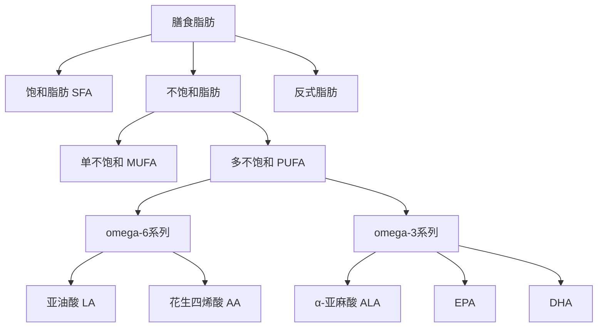

## 三、营养学基础

食物是人体获取能量和构建材料的唯一外部来源。营养学研究的正是食物中的化学成分如何被人体消化、吸收、转运、代谢和排泄，以及这些过程与健康和疾病之间的关系。掌握营养学基础，不是为了成为营养师，而是为了在面对铺天盖地的饮食信息时拥有判断力——知道什么是真科学，什么是营销话术。

本章从能量代谢的底层逻辑出发，逐层展开宏量营养素、微量营养素、水和生物活性物质的完整知识体系，再延伸到食物搭配、烹饪优化、膳食模式评估、个性化营养前沿，最终落脚到一日三餐的实操框架。无论你是刚开始关注饮食健康的入门者，还是希望精进营养策略的进阶读者，都能在本章找到对应层级的知识节点。

### 3.1 营养学概论

#### 3.1.1 从"吃饱"到"吃好"：营养学的发展历程

人类对食物与健康关系的认知经历了漫长的演进：

| 时期 | 关键发现 | 代表人物/事件 |
|------|---------|--------------|
| 18世纪 | 坏血病与柑橘的关系 | James Lind（1747年临床试验） |
| 19世纪 | 蛋白质、脂肪、碳水化合物三大宏量营养素确认 | Justus von Liebig |
| 1912年 | "维生素"概念提出 | Casimir Funk |
| 1930年代 | 多数维生素被分离和合成 | 诺贝尔奖多次授予相关研究 |
| 1990年代 | 营养基因组学兴起 | 人类基因组计划 |
| 2000年代后 | 肠道微生物组与个性化营养 | 人体微生物组计划 |

这段历史告诉我们：营养学是一门不断自我修正的科学。今天的"定论"可能在十年后被新的证据推翻或修正，因此保持开放心态、关注高质量研究比盲目遵从任何单一饮食法更重要。

#### 3.1.2 营养学的核心原则

1. **均衡性**：各种营养素需要按适当比例摄入。没有任何一种营养素可以孤立地发挥作用——钙的吸收需要维生素D，铁的吸收需要维生素C，B族维生素在能量代谢中协同工作。均衡不是每餐精确计算，而是在一周尺度上实现多样化。
2. **多样性**：没有单一食物能满足所有营养需求。《中国居民膳食指南（2022）》建议每天摄入12种以上食物，每周25种以上。食物多样化的价值不仅在于营养覆盖面，还在于降低单一食物中潜在有害物质（如重金属、农药残留）的累积风险。
3. **适量性**：过犹不及。水喝太多会低钠血症，维生素A过量会肝损伤，蛋白质过多加重肾脏负担。"多多益善"在营养学中几乎总是错的。
4. **个体性**：年龄、性别、活动量、基因背景、肠道菌群、疾病状态都会影响营养需求。一个久坐办公室的人和一个马拉松跑者的碳水化合物需求可能相差两倍以上。
5. **时间性**：进食时间、频率和食物搭配都会影响代谢。同一碗米饭，早上吃和睡前吃，与蔬菜搭配和单独吃，血糖反应截然不同。

#### 3.1.3 营养学研究的方法论

理解营养学研究的方法，有助于识别可靠信息与伪科学：

| 研究类型 | 优势 | 劣势 | 证据等级 |
|---------|------|------|---------|
| 随机对照试验（RCT） | 因果关系最强 | 营养学中难以长期实施（你不能随机分配一组人吃十年垃圾食品） | 最高 |
| 队列研究 | 可追踪长期效应 | 混杂因素多，无法完全控制 | 高 |
| 病例对照研究 | 适合罕见疾病 | 回忆偏差大 | 中 |
| 荟萃分析 | 综合多项研究，样本量大 | 依赖纳入研究的质量 | 高（取决于纳入研究） |
| 动物实验和细胞实验 | 可控制变量 | 结论不能直接外推到人体 | 低（人体外推） |
| 食物频率问卷（FFQ）和24小时膳食回顾 | 主要数据收集工具 | 依赖受试者回忆，存在报告偏差 | 数据质量影响整体 |

**判断营养信息可靠性的五条原则**：

1. 看是否有多项独立研究支持，而非单一研究的结论——单一研究可能有偏倚，多个独立团队得出相似结论才可信
2. 看研究是否发表在同行评审期刊上——预印本、新闻报道、博客文章不等于科学证据
3. 看结论是否被主流营养学机构（如WHO、中国营养学会、美国膳食指南咨询委员会）认可
4. 看样本量和研究时长——营养学研究至少需要数百人、数年追踪才有参考价值
5. 看研究是否由利益相关方资助——食品企业资助的研究存在发表偏倚（正面结果更容易发表）

### 3.2 能量代谢基础

在讨论具体营养素之前，必须先理解能量代谢的基本框架——这是一切饮食计划的底层逻辑。

#### 3.2.1 能量平衡方程

体重变化 = 能量摄入 - 能量消耗。这个方程看似简单，但"能量消耗"的构成比多数人想象的复杂：

| 消耗来源 | 占比 | 说明 |
|---------|------|------|
| 基础代谢率（BMR） | 60-70% | 维持生命基本功能所需的能量（呼吸、心跳、体温、器官运作） |
| 食物热效应（TEF） | 10% | 消化吸收食物本身消耗的能量 |
| 身体活动 | 20-30% | 包括运动和日常活动（走路、站立、做家务） |

**基础代谢率的估算**（Mifflin-St Jeor公式，目前最准确）：

男性 BMR = 10 × 体重(kg) + 6.25 × 身高(cm) - 5 × 年龄 + 5
女性 BMR = 10 × 体重(kg) + 6.25 × 身高(cm) - 5 × 年龄 - 161

**每日总能量消耗（TDEE）** = BMR × 活动系数：

| 活动水平 | 系数 | 描述 |
|---------|------|------|
| 久坐 | 1.2 | 办公室工作，几乎不运动 |
| 轻度活动 | 1.375 | 每周轻度运动1-3天 |
| 中度活动 | 1.55 | 每周中等强度运动3-5天 |
| 高度活动 | 1.725 | 每周高强度运动6-7天 |
| 极高活动 | 1.9 | 体力劳动或每天高强度训练 |

**实例**：一个28岁、普通身高、67kg、中度活动的男性：
- BMR = 10×67 + 6.25×165 - 5×28 + 5 = 670 + 1031.25 - 140 + 5 = 1566千卡
- TDEE = 1566 × 1.55 ≈ 2427千卡

#### 3.2.2 能量单位与换算

- 1千卡（kcal）= 4.184千焦（kJ）
- 日常说的"卡路里"实际上是千卡
- 食品包装上的"能量"通常以千焦标注，除以4.18即为千卡

#### 3.2.3 体重管理的能量原则

- 减脂：每日能量缺口300-500千卡（每周减0.3-0.5kg，安全且可持续）
- 增肌：每日能量盈余200-300千卡（配合力量训练）
- 维持：能量摄入 ≈ TDEE
- 过大的能量缺口（>1000千卡/天）会导致肌肉流失、代谢适应性下降、营养素缺乏

#### 3.2.4 代谢适应与平台期

减脂过程中，身体会通过降低基础代谢率来"对抗"能量缺口，这叫做**代谢适应**（metabolic adaptation）或**适应性产热下降**。The Biggest Loser研究发现，参与者在节目结束6年后，基础代谢率仍比预期低约500千卡/天。

**应对平台期的策略**：

1. **反向饮食**：逐步增加热量摄入100-200千卡/周，让代谢率缓慢回升
2. **饮食休息**（diet break）：每6-8周减脂后，用1-2周维持热量进食，让代谢恢复
3. **力量训练**：肌肉是代谢活跃的组织，每公斤肌肉每天消耗约13千卡（脂肪仅约4.5千卡）
4. **保证睡眠**：睡眠不足会降低瘦素（饱腹激素）、升高饥饿素，增加食欲

### 3.3 宏量营养素

宏量营养素是身体需要大量摄入的营养素，包括碳水化合物、蛋白质和脂肪。它们是身体能量的主要来源，每克提供的热量分别为：碳水化合物4千卡、蛋白质4千卡、脂肪9千卡。此外，酒精也能提供能量（7千卡/克），但它不是必需营养素。

#### 3.3.1 碳水化合物

碳水化合物是最经济高效、也是争议最大的宏量营养素。近年来"低碳水"饮食风靡，但科学证据并不支持一刀切地妖魔化碳水化合物。

**生理功能**：

- **首要能量来源**：大脑每天需要约120克葡萄糖（占全身葡萄糖消耗的60%以上）。红细胞完全依赖葡萄糖供能，因为它们没有线粒体
- **节约蛋白质**：当碳水充足时，蛋白质可以专注于修复和构建组织；碳水不足时，身体会分解蛋白质来供糖异生
- **抗酮体作用**：碳水不足时脂肪不完全氧化产生酮体，轻度酮症有益（生酮饮食原理），但严重酮症会导致酸中毒
- **膳食纤维**：不可消化的碳水化合物，对肠道健康至关重要（详见3.3.4节）
- **参与免疫识别**：细胞表面的糖蛋白和糖脂中的糖链参与免疫细胞识别

**分类与特性**：

**简单碳水化合物（糖类）**：

| 类型 | 组成 | 甜度 | 升糖速度 | 典型来源 |
|------|------|------|---------|---------|
| 葡萄糖 | 单糖 | 中 | 最快 | 血液中的主要糖形式 |
| 果糖 | 单糖 | 最甜 | 慢（需肝脏转化） | 水果、蜂蜜、高果糖玉米糖浆 |
| 半乳糖 | 单糖 | 低 | 中 | 乳制品中（乳糖分解产物） |
| 蔗糖 | 葡萄糖+果糖 | 高 | 快 | 白糖、红糖、甘蔗 |
| 乳糖 | 葡萄糖+半乳糖 | 低 | 中 | 牛奶、乳制品 |
| 麦芽糖 | 葡萄糖+葡萄糖 | 中 | 快 | 发芽谷物、啤酒 |

**复杂碳水化合物（淀粉和纤维）**：

- **淀粉**：由数百到数千个葡萄糖分子通过α-糖苷键连接。分为直链淀粉（消化较慢）和支链淀粉（消化较快）
- **抗性淀粉**：不被小肠消化的淀粉，到达大肠后被肠道菌群发酵，产生短链脂肪酸（丁酸等），具有类似膳食纤维的作用。来源包括冷却后的米饭和土豆、未成熟的香蕉、豆类。冷却后重新加热的米饭，抗性淀粉含量比刚煮好的米饭增加约2.5倍
- **膳食纤维**：详见下文独立章节

**血糖指数（GI）与血糖负荷（GL）**：

GI衡量食物引起血糖上升的速度，GL则考虑了实际摄入量的影响：

GL = GI × 一份食物中碳水化合物含量(克) / 100

| 分类 | GI范围 | GL范围 | 饮食策略 |
|------|--------|--------|---------|
| 低GI/GL | <55 | <10 | 优先选择，血糖平稳 |
| 中GI/GL | 55-69 | 11-19 | 适量食用 |
| 高GI/GL | ≥70 | ≥20 | 限制频率和份量 |

**GI的局限性**：GI是在标准份量（含50克碳水化合物）下测量的，实际饮食中很少有人一次吃50克碳水的胡萝卜。GL更贴近实际。此外，混合进食（碳水+蛋白质+脂肪+纤维）会显著降低整餐的血糖反应，因此单独看某个食物的GI意义有限，关注整体膳食模式更重要。

**优质碳水化合物来源**：

| 食物 | GI值 | 膳食纤维(克/100克) | 特点 |
|------|------|-------------------|------|
| 燕麦 | 55 | 10.6 | 富含β-葡聚糖，降低胆固醇 |
| 糙米 | 50 | 3.5 | B族维生素和矿物质丰富 |
| 藜麦 | 53 | 7.0 | 含全部9种必需氨基酸 |
| 红薯 | 63 | 3.0 | 富含β-胡萝卜素 |
| 扁豆 | 32 | 7.9 | 高蛋白、高纤维，极低GI |
| 苹果 | 36 | 2.4 | 果胶（可溶性纤维）丰富 |
| 意大利面(硬粒小麦) | 42 | 2.5 | 低GI主食选择 |
| 荞麦 | 54 | 10.0 | 富含芦丁，改善微循环 |

**推荐摄入量**：
- 占总热量的45-65%（中国居民膳食指南建议50-65%）
- 优先选择复合碳水化合物和全谷物
- 限制添加糖摄入 < 总热量的10%（WHO强烈建议 < 5%更佳）
- 每天摄入25-35克膳食纤维（中国人实际平均仅摄入约10克，严重不足）

#### 3.3.2 蛋白质

蛋白质是生命的物质基础。从头发到指甲，从抗体到酶，从肌肉到胶原蛋白，几乎所有生命活动都离不开蛋白质。

**六大生理功能**：

1. **结构功能**：构成肌肉、皮肤、头发、指甲、骨骼基质（胶原蛋白占人体蛋白质的25-35%）
2. **催化功能**：几乎所有生化反应都由酶（蛋白质）催化。人体内有超过5000种酶
3. **运输功能**：血红蛋白运输氧气，白蛋白运输脂肪酸，脂蛋白运输胆固醇
4. **免疫功能**：抗体（免疫球蛋白）是蛋白质，识别和中和病原体
5. **调节功能**：许多激素是蛋白质或肽类（胰岛素、生长激素、促甲状腺激素）
6. **能量功能**：在碳水化合物和脂肪不足时可提供4千卡/克，但这是低效利用——身体更愿意保留蛋白质用于结构和功能用途

**氨基酸详解**：

蛋白质由20种氨基酸以不同序列组合而成，如同26个字母组成无数单词。其中9种是必需氨基酸，人体无法合成，必须从食物中获取：

| 必需氨基酸 | 主要功能 | 富含食物 |
|-----------|---------|---------|
| 组氨酸 | 合成组胺（免疫反应），生长修复 | 肉类、乳制品、大豆 |
| 异亮氨酸 | 肌肉代谢，免疫功能 | 鸡蛋、鱼类、豆类 |
| 亮氨酸 | 启动肌肉蛋白合成（mTOR通路） | 乳清蛋白、肉类、大豆 |
| 赖氨酸 | 肉碱合成（脂肪代谢），胶原蛋白 | 肉类、鱼类、豆类 |
| 蛋氨酸 | 甲基供体，谷胱甘肽前体 | 肉类、鱼类、蛋类 |
| 苯丙氨酸 | 神经递质前体（多巴胺、去甲肾上腺素） | 肉类、鱼类、大豆 |
| 苏氨酸 | 胶原蛋白和弹性蛋白，免疫功能 | 肉类、乳制品、蘑菇 |
| 色氨酸 | 5-羟色胺（血清素）和褪黑素前体 | 火鸡、香蕉、坚果 |
| 缬氨酸 | 肌肉代谢，能量供应 | 肉类、乳制品、豆类 |

**亮氨酸的特殊地位**：亮氨酸是启动肌肉蛋白合成（MPS）的关键信号分子。研究表明，每餐摄入2.5-3克亮氨酸可以最大化刺激MPS。这解释了为什么乳清蛋白（亮氨酸含量约11%）是运动后恢复的首选蛋白质来源。

**蛋白质质量评估**：

| 评分系统 | 原理 | 局限性 |
|---------|------|--------|
| 生物价（BV） | 衡量被吸收蛋白质中保留比例 | 不考虑消化率 |
| PDCAAS | 氨基酸评分 × 消化率，上限1.0 | 以2-5岁儿童需求为参考，不区分成人需求差异 |
| DIAAS | 最新标准，考虑回肠末端真消化率 | 尚未广泛采用 |

| 食物 | 蛋白质(克/100克) | PDCAAS | 亮氨酸(克/100克) | 特点 |
|------|-----------------|--------|-----------------|------|
| 鸡蛋 | 13 | 1.0 | 1.1 | 氨基酸模式最接近人体需求 |
| 三文鱼 | 20 | 1.0 | 1.6 | 富含omega-3，抗炎 |
| 鸡胸肉 | 31 | 1.0 | 2.4 | 高蛋白低脂肪 |
| 乳清蛋白粉 | 80 | 1.0 | 8.8 | 亮氨酸含量最高，吸收快 |
| 酪蛋白粉 | 80 | 1.0 | 6.8 | 缓释蛋白，适合睡前 |
| 希腊酸奶 | 10 | 1.0 | 0.9 | 含益生菌 |
| 牛肉(瘦) | 26 | 1.0 | 2.0 | 富含铁、锌、B12 |
| 豆腐 | 8 | 0.9 | 0.6 | 优质植物蛋白 |
| 藜麦 | 14 | 1.0 | 0.9 | 唯一含完整氨基酸的谷物 |
| 扁豆 | 9 | 0.5 | 0.6 | 高纤维，需搭配谷物 |

**蛋白质互补原则**：

大多数植物蛋白是"不完全蛋白"（缺乏一种或多种必需氨基酸），但通过合理搭配可以实现互补：

| 搭配方式 | 互补原理 | 典型菜例 |
|---------|---------|---------|
| 谷物+豆类 | 谷物缺赖氨酸，豆类缺蛋氨酸 | 米饭+豆腐、玉米饼+黑豆、馒头+豆浆 |
| 谷物+坚果/种子 | 坚果补充赖氨酸 | 燕麦+核桃、全麦面包+花生酱 |
| 豆类+坚果/种子 | 双重互补 | 鹰嘴豆泥+芝麻酱 |
| 谷物+豆类+坚果 | 三重互补，氨基酸覆盖最全 | 八宝饭、杂粮粥+坚果 |

互补不需要在同餐完成，只要在同一天内摄入即可——人体有一个氨基酸池，会自动调配。

**推荐摄入量**：

| 人群 | 每日蛋白质(克/公斤体重) | 说明 |
|------|------------------------|------|
| 普通成人 | 0.8-1.0 | 维持基本需求 |
| 耐力运动员 | 1.2-1.4 | 修复肌肉微损伤 |
| 力量运动员 | 1.6-2.0 | 最大化肌肉蛋白合成 |
| 老年人(>65岁) | 1.0-1.2 | 对抗肌肉减少症（sarcopenia） |
| 减脂期 | 1.6-2.2 | 保留肌肉，提高饱腹感 |
| 孕妇(中晚期) | 额外+25克/天 | 胎儿发育和母体组织增长 |
| 哺乳期 | 额外+20克/天 | 乳汁合成 |

**蛋白质摄入的常见误区**：

1. **"吃太多蛋白质伤肾"**：对健康人群而言，高蛋白饮食（每天2克/公斤体重以下）不会损害肾功能。但已有肾脏疾病者需要限制蛋白质摄入
2. **"一顿吃不完就浪费了"**：研究表明每餐20-40克蛋白质对MPS的刺激最大，但分散到全天摄入也有好处。不必焦虑每餐精确到克
3. **"植物蛋白不如动物蛋白"**：对于混合饮食的杂食者，植物蛋白完全可以满足需求。纯素食者需要注意互补搭配和B12补充

#### 3.3.3 脂肪

脂肪是最被误解的宏量营养素。"低脂饮食"曾经是健康建议的主流，但现代研究已经修正了这一观点——脂肪的质量比数量更重要。

**六大生理功能**：

1. **最浓缩的能量来源**：9千卡/克，是碳水和蛋白质的两倍多
2. **内脏保护**：肾脏、心脏周围的脂肪垫起到缓冲和固定作用
3. **体温维持**：皮下脂肪层是天然保温层
4. **脂溶性维生素载体**：维生素A、D、E、K必须溶解在脂肪中才能被吸收
5. **细胞膜结构**：磷脂双分子层是所有细胞膜的基本骨架
6. **激素合成**：胆固醇是性激素（睾酮、雌激素）、皮质醇、维生素D的前体

**脂肪酸分类与健康影响**：

**各类脂肪的详细对比**：

| 脂肪类型 | 化学结构 | 对LDL影响 | 对HDL影响 | 心血管风险 | 建议占比 |
|---------|---------|----------|----------|-----------|---------|
| 饱和脂肪 | 无双键 | 升高 | 轻微升高 | 中等增加 | <10%总热量 |
| 单不饱和 | 1个双键 | 降低 | 维持/升高 | 降低 | 15-20% |
| 多不饱和 | 多个双键 | 降低 | 维持 | 降低 | 5-10% |
| 反式脂肪(人工) | 反式构型双键 | 升高 | 降低 | 显著增加 | 0% |

**饱和脂肪的细分**：并非所有饱和脂肪的健康影响相同。按碳链长度可分为：
- **短链脂肪酸**（4-6碳）：如丁酸，由肠道菌群发酵纤维产生，对肠道有益
- **中链脂肪酸**（8-12碳）：如椰子油中的月桂酸，直接经门静脉进入肝脏快速供能，不易储存为体脂
- **长链脂肪酸**（14-18碳）：如棕榈酸、硬脂酸，对LDL胆固醇的影响最大

**omega-3与omega-6的平衡**：

这是一组现代饮食中严重失衡的必需脂肪酸比例：

- **理想比例**：omega-6 : omega-3 = 1-4 : 1
- **现代饮食实际比例**：15-20 : 1（部分西方饮食高达25:1）
- **失衡原因**：大豆油、玉米油、葵花籽油等omega-6油脂被大量用于加工食品和烹饪
- **健康后果**：omega-6过多促进炎症反应（花生四烯酸→促炎前列腺素），omega-3（尤其是EPA）产生抗炎介质（消退素、保护素）
- **改善策略**：
  - 减少大豆油、玉米油、葵花籽油的使用
  - 每周吃2-3次深海鱼（三文鱼、沙丁鱼、鲭鱼、秋刀鱼）
  - 每天一勺亚麻籽粉或几颗核桃
  - 烹饪用橄榄油（主要含omega-9，不参与omega-6/3竞争）

**烹饪油的选择指南**：

| 油脂 | 主要脂肪类型 | 烟点 | 最佳用途 |
|------|------------|------|---------|
| 特级初榨橄榄油 | 单不饱和 | 190°C | 凉拌、中低温烹饪 |
| 精炼橄榄油 | 单不饱和 | 240°C | 煎炒 |
| 椰子油 | 饱和(中链) | 177°C | 烘焙、中低温烹饪 |
| 牛油果油 | 单不饱和 | 271°C | 高温煎炸 |
| 亚麻籽油 | 多不饱和(omega-3) | 107°C | 仅凉拌，不可加热 |
| 花生油 | 混合 | 230°C | 炒菜、煎炸 |
| 猪油 | 饱和+单不饱和 | 188°C | 传统烹饪，适量使用 |

**反式脂肪——唯一需要"零摄入"的脂肪**：

- **来源**：部分氢化植物油（人造黄油、起酥油）、反复高温油炸的食物、少量天然存在于反刍动物产品中
- **危害机制**：同时升高LDL（坏胆固醇）和降低HDL（好胆固醇），促进全身性炎症，损伤血管内皮
- **常见含反式脂肪的食物**：商业蛋糕、饼干、派、炸薯条、奶茶中的植脂末
- **识别方法**：食品标签上标注"氢化植物油""部分氢化植物油""人造奶油""植脂末"即含反式脂肪。注意：中国法规允许反式脂肪含量<0.3g/100g时标注为"0"，因此"0反式脂肪"不等于完全不含
- **各国标准**：WHO建议完全消除，美国FDA已禁止在食品中使用部分氢化油

**推荐摄入量**：
- 总脂肪：占总热量20-35%
- 饱和脂肪：<10%总热量
- 反式脂肪：0%
- omega-3：每天250-500毫克EPA+DHA（约等于每周150克三文鱼）

#### 3.3.4 膳食纤维——被严重低估的第七大营养素

膳食纤维虽然不被人体消化吸收，但它对健康的重要性不亚于任何一种维生素。现代研究将膳食纤维列为继碳水、蛋白质、脂肪、维生素、矿物质、水之后的"第七大营养素"。

**分类与功能**：

| 类型 | 特性 | 代表食物 | 主要健康作用 |
|------|------|---------|------------|
| 可溶性纤维 | 溶于水形成凝胶 | 燕麦β-葡聚糖、果胶（苹果）、车前子壳 | 降低胆固醇、稳定血糖、喂养有益菌 |
| 不可溶性纤维 | 不溶于水，增加粪便体积 | 全谷物麸皮、芹菜、蔬菜茎叶 | 促进肠道蠕动、预防便秘、缩短致癌物接触时间 |
| 抗性淀粉 | 不被小肠消化，到大肠发酵 | 冷却米饭、生香蕉、豆类 | 类似益生元，产生丁酸 |

**膳食纤维与肠道菌群的关系**：

膳食纤维是肠道有益菌的主要"食物"（益生元）。当有益菌发酵纤维时，产生短链脂肪酸（SCFA），尤其是丁酸、丙酸和乙酸：

- **丁酸**：结肠细胞的主要能量来源，维护肠道屏障完整性，具有抗炎和抗癌作用
- **丙酸**：被肝脏吸收，参与糖异生调节，降低胆固醇合成
- **乙酸**：进入外周循环，影响食欲调节和脂肪代谢

膳食纤维摄入不足 → 有益菌群饥饿 → 菌群多样性下降 → 肠道屏障受损 → 内毒素入血 → 慢性低度炎症。这条链路是许多现代慢性疾病的共同土壤。

**推荐摄入量**：
- 成人每天25-35克（中国居民膳食指南建议25-30克）
- 中国人实际平均摄入约10克，仅为推荐量的1/3
- 逐步增加（每周增加5克），突然大量摄入会引起腹胀和不适
- 增加纤维的同时必须增加饮水量

**补充纤维的实操建议**：
- 主食的1/3替换为全谷物和杂豆（糙米、燕麦、红豆、绿豆）
- 每天至少500克蔬菜（约一大盘沙拉的量）
- 每天200-350克水果（约两个中等苹果）
- 每天一小把坚果（约25克）
- 如饮食难以达标，可补充车前子壳粉（5-10克/天，温和有效）

### 3.4 微量营养素

微量营养素不提供热量，但在几乎所有生理过程中扮演关键角色。它们像机器中的润滑剂——用量极少，缺少则整台机器停转。

#### 3.4.1 维生素

维生素按溶解性分为脂溶性（A、D、E、K）和水溶性（B族、C）两大类。脂溶性维生素可储存在肝脏和脂肪组织中，过量可能中毒；水溶性维生素不能大量储存，需要持续摄入，过量通常随尿液排出。

**脂溶性维生素**：

| 维生素 | 核心功能 | 推荐摄入量(RNI) | 优质来源 | 缺乏症状 | 过量风险 |
|--------|---------|----------------|---------|---------|---------|
| A（视黄醇） | 视网膜感光、上皮细胞分化、免疫调节 | 男800μgRAE/女700μgRAE | 动物肝脏、蛋黄、乳制品（直接来源）；胡萝卜、红薯（β-胡萝卜素转化） | 夜盲症、干眼症、皮肤角化、免疫力下降 | 头痛、肝损伤、致畸（孕妇禁超量） |
| D（钙化醇） | 促进钙磷吸收、骨骼矿化、免疫调节、基因表达调控 | 10-20μg(400-800IU)，不足者可补至2000IU | 日照合成（主要来源）、深海鱼、蛋黄、强化食品 | 佝偻病/骨软化、骨质疏松、免疫力下降、抑郁 | 高钙血症、肾结石（极罕见，需长期超10000IU/天） |
| E（生育酚） | 强抗氧化剂、保护细胞膜不饱和脂肪酸、抗炎 | 15mg α-TE | 杏仁、葵花籽、植物油、菠菜 | 溶血性贫血（罕见）、神经病变 | 可能增加出血风险 |
| K | 凝血因子γ-羧化必需、骨钙素激活 | 男120μg/女90μg | 绿叶蔬菜（K1）、纳豆（K2）、肠道菌群合成（K2） | 出血倾向、新生儿出血症 | 极安全，无已知毒性上限 |

**维生素D的特殊地位**：

维生素D严格来说是一种激素前体，而非传统意义上的维生素——皮肤在紫外线B照射下合成维生素D3（胆钙化醇），然后在肝脏和肾脏中活化为1,25-二羟维生素D（骨化三醇），这是真正的活性形式。

全球约10亿人维生素D不足（血清25(OH)D < 30ng/mL）。原因包括：室内工作、防晒霜使用、高纬度地区、深肤色、老年人皮肤合成能力下降。在中国，维生素D不足率高达70-90%（尤其北方冬季）。

**补充建议**：
- 日常维护：1000-2000IU/天
- 已不足者（<20ng/mL）：医生指导下短期补充4000-5000IU/天
- 最经济的方式：每天裸露面部和前臂晒太阳15-20分钟（中午前后，不涂防晒）
- 定期检测血液25(OH)D水平，目标维持在30-50ng/mL

**水溶性维生素**：

| 维生素 | 核心功能 | 推荐摄入量 | 优质来源 | 缺乏症状 | 特殊说明 |
|--------|---------|-----------|---------|---------|---------|
| B1(硫胺素) | 糖代谢辅酶、神经传导 | 男1.4mg/女1.2mg | 猪肉、全谷物、豆类 | 脚气病（心脏型或神经型） | 酗酒者高危，精白米面损失严重 |
| B2(核黄素) | 氧化还原反应辅酶（FAD/FMN） | 男1.4mg/女1.2mg | 乳制品、鸡蛋、动物内脏 | 口角炎、舌炎、脂溢性皮炎 | 耐热但对光敏感 |
| B3(烟酸) | NAD+/NADP辅酶、DNA修复 | 男15mgNE/女12mgNE | 肉类、鱼类、全谷物、花生 | 糙皮病（3D：皮炎、腹泻、痴呆） | 色氨酸可转化（60:1） |
| B5(泛酸) | 辅酶A前体 | 5mg | 广泛存在 | 极罕见 | 几乎所有食物都含 |
| B6(吡哆醇) | 氨基酸代谢、神经递质合成、血红素合成 | 1.4-1.7mg | 鸡肉、鱼类、土豆、香蕉 | 贫血、外周神经病变、抑郁 | 长期超量(>100mg/天)可致神经毒性 |
| B7(生物素) | 羧化反应辅酶 | 30μg | 蛋黄、坚果、豆类 | 皮炎、脱发（生蛋清大量摄入可诱发） | 肠道菌群可合成 |
| B9(叶酸) | 一碳代谢、DNA合成与修复 | 400μgDFE | 绿叶蔬菜、豆类、强化食品 | 巨幼红细胞性贫血、神经管缺陷（胎儿） | 孕前3个月开始补充400-800μg |
| B12(钴胺素) | 甲基化反应、神经髓鞘维护、红细胞生成 | 2.4μg | 肉类、鱼类、蛋类、乳制品（仅动物来源） | 巨幼红细胞性贫血、亚急性联合变性（脊髓） | 纯素食者必须补充 |
| C(抗坏血酸) | 胶原蛋白羟化、抗氧化、铁吸收促进、免疫增强 | 男90mg/女75mg | 猕猴桃、柑橘、草莓、甜椒、西兰花 | 坏血病、牙龈出血、伤口愈合慢 | 吸烟者需额外+35mg/天 |

**B族维生素的协同性**：B族维生素在能量代谢中几乎总是协同工作。例如，B1、B2、B3、B5共同参与三羧酸循环；B6、B9、B12共同参与同型半胱氨酸代谢。单独大剂量补充某一种B族维生素可能导致其他B族维生素相对缺乏。因此，除非确诊缺乏某一种，否则建议补充B族复合维生素而非单一种。

#### 3.4.2 矿物质

矿物质是无机元素，不能被身体合成，必须从食物或水中获取。按需求量分为常量元素（每天需要>100mg）和微量元素（每天需要<100mg）。

**常量元素**：

| 矿物质 | 核心功能 | 推荐摄入量 | 优质来源 | 缺乏症状 | 过量风险 | 吸收促进/抑制因素 |
|--------|---------|-----------|---------|---------|---------|-----------------|
| 钙 | 骨骼/牙齿矿化、肌肉收缩、神经传导、凝血 | 800-1000mg | 牛奶（120mg/100ml）、豆腐、小白菜、芝麻酱 | 骨质疏松、肌肉痉挛、心律异常 | 肾结石、便秘、影响铁锌吸收 | 促进：维D、乳糖、适量蛋白；抑制：草酸（菠菜）、植酸（全谷物）、高钠 |
| 磷 | 骨骼矿化、ATP能量分子、DNA/RNA结构 | 700mg | 肉类、乳制品、全谷物 | 骨痛、肌无力（极罕见） | 高磷血症（加工食品中磷酸盐添加剂是主要来源） | 钙磷比理想为1:1至2:1 |
| 镁 | 300+酶反应辅因子、肌肉放松、神经传导、血糖调节 | 男420mg/女320mg | 南瓜子、杏仁、菠菜、黑巧克力、全谷物 | 肌肉痉挛、失眠、焦虑、心律不齐 | 腹泻（补充剂形式） | 促进：维D、柠檬酸；抑制：高钙、酒精 |
| 钠 | 体液平衡、神经冲动传导、肌肉收缩 | <2300mg（理想<1500mg） | 食盐、酱油、加工食品 | 低钠血症（仅大量出汗+纯水补水时） | 高血压、胃癌风险增加 | 钾可部分抵消钠的升压作用 |
| 钾 | 细胞内液主要阳离子、心脏节律、血压调节 | 2600-3400mg | 香蕉(358mg/100g)、土豆(421mg)、菠菜(558mg)、牛油果 | 肌肉无力、心律失常 | 高钾血症（肾功能不全者高危） | 钾钠比 > 2:1 对血压保护最佳 |

**微量元素**：

| 矿物质 | 核心功能 | 推荐摄入量 | 优质来源 | 缺乏症状 | 特殊说明 |
|--------|---------|-----------|---------|---------|---------|
| 铁 | 血红蛋白携氧、肌蛋白储氧、能量代谢酶 | 男12mg/女20mg（育龄女性需求高） | 血红素铁：红肉、动物肝脏（吸收率15-35%）；非血红素铁：菠菜、豆类（吸收率2-20%） | 缺铁性贫血（全球最常见的营养缺乏病） | 维C促进非血红素铁吸收；茶和咖啡中的多酚抑制吸收；铁锅烹饪可微量增加铁摄入 |
| 锌 | 200+酶的辅因子、免疫功能、伤口愈合、味觉嗅觉 | 男12.5mg/女7.5mg | 牡蛎（71mg/100g，含锌最高的食物）、红肉、南瓜子 | 免疫力下降、味觉障碍、生长迟缓 | 植物性饮食者需增加50%摄入量（植酸抑制吸收） |
| 硒 | 谷胱甘肽过氧化物酶成分（抗氧化）、甲状腺激素代谢 | 60μg | 巴西坚果（1颗约含70μg）、海鲜、动物内脏 | 克山病（心肌病）、甲状腺功能障碍 | 巴西坚果1-2颗/天即可满足需求，过量有毒 |
| 碘 | 甲状腺激素（T3/T4）合成 | 150μg | 碘盐、海带、紫菜、海鱼 | 甲状腺肿大、克汀病（胎儿期缺碘致智力障碍） | 沿海地区通常不缺，内陆和山区注意碘盐使用 |
| 铜 | 铁代谢（铜蓝蛋白）、结缔组织合成、抗氧化 | 900μg | 动物肝脏、贝类、坚果、可可 | 贫血、骨质疏松、白发早生 | 铜锌拮抗，高锌补剂可致铜缺乏 |
| 铬 | 增强胰岛素敏感性，参与糖脂代谢 | 30μg | 全谷物、西兰花、葡萄、肉类 | 血糖调节异常 | 三价铬安全性高，六价铬有毒（工业污染） |
| 锰 | 骨骼形成、抗氧化酶（SOD）辅因子、氨基酸代谢 | 男4.5mg/女3.5mg | 全谷物、坚果、茶叶、菠菜 | 极罕见（可能影响骨骼和生殖） | 茶叶是锰的优质来源之一 |

**矿物质的吸收竞争**：

矿物质之间存在复杂的相互作用关系，这是食物搭配和补充剂使用中常被忽略的因素：

| 交互关系 | 机制 | 实际影响 |
|---------|------|---------|
| 钙抑制铁吸收 | 竞争肠道转运体 | 补钙和补铁间隔2小时 |
| 钙抑制锌吸收 | 竞争转运通道 | 高钙饮食者需增加锌摄入 |
| 铁抑制锌吸收 | DMT1转运体竞争 | 同时大剂量补铁和补锌不理想 |
| 维C促进铁吸收 | 将三价铁还原为二价铁 | 吃铁含量高的食物时搭配维C食物 |
| 维D促进钙吸收 | 诱导钙结合蛋白合成 | 补钙必须同时保证维D充足 |
| 钾拮抗钠 | 促进钠排泄 | 高钾低钠饮食最利于血压 |

### 3.5 水——最被忽视的营养素

水是人体含量最多的成分，占体重的55-75%（随年龄和体脂率变化）。一个70公斤的成年男性体内约有42升水。人可以几周不吃食物存活，但缺水3-5天就会死亡。

#### 3.5.1 水的六大生理功能

| 功能 | 机制 | 缺水后果 |
|------|------|---------|
| 体温调节 | 出汗蒸发散热（每蒸发1克水带走0.58千卡热量） | 中暑、热射病 |
| 营养运输 | 血浆的主要成分，溶解和运输营养素 | 营养输送效率下降 |
| 代谢废物排泄 | 尿液携带代谢废物，粪便含水保持软度 | 便秘、毒素积累 |
| 关节润滑 | 滑液的主要成分 | 关节摩擦增加 |
| 细胞结构维持 | 细胞内液维持细胞体积和形态 | 细胞功能障碍 |
| 化学反应介质 | 水解反应、酸碱平衡、渗透压维持 | 代谢减缓 |

#### 3.5.2 每日水分需求的精确计算

**基础公式**：体重(kg) × 30mL = 基础饮水量

**调整因素**：

| 因素 | 增加量 | 说明 |
|------|--------|------|
| 高温环境 | +500-1000mL | 气温>30°C或湿度>70% |
| 运动 | 每小时+500-1000mL | 取决于出汗量 |
| 发烧/腹泻 | +500-1000mL | 额外丢失 |
| 咖啡/茶 | 每杯额外补+150mL | 咖啡因有利尿作用 |
| 高蛋白饮食 | +500mL | 蛋白质代谢产生更多尿素需要排出 |
| 哺乳期 | +700mL | 乳汁合成需要大量水分 |

**实例计算**：一个67kg、中度运动、每天喝2杯咖啡的人：
- 基础：67 × 30 = 2010mL
- 运动：+500mL
- 咖啡：+300mL
- 总计：约2800mL ≈ 11杯（250mL/杯）

#### 3.5.3 饮水的实操指南

**最佳实践**：
- 晨起一杯温水（200-300mL）：经过一夜睡眠，身体处于轻度脱水状态，晨起补水可以激活肠胃蠕动
- 分散饮水：每1-2小时喝一杯，而非一次性灌入大量
- 尿液颜色监控：淡黄色 = 水分充足，深黄色 = 需要补水，透明无色 = 可能过量
- 运动前2小时预先补水300-500mL
- 运动中每15-20分钟小口补水150-200mL
- 避免短时间内饮水超过1升（可致低钠血症/水中毒，虽然罕见但有致命风险）

**饮品选择优先级**：

| 饮品 | 评价 | 注意事项 |
|------|------|---------|
| 白开水/矿泉水 | 最佳选择 | 无热量，无添加 |
| 淡茶 | 优秀 | 含抗氧化物，但避免浓茶（影响铁吸收和睡眠） |
| 黑咖啡(无糖) | 良好 | 每天2-3杯有健康益处，但注意咖啡因耐受 |
| 无糖气泡水 | 良好 | 不会腐蚀牙齿（这是误解），但可能引起腹胀 |
| 鲜榨果汁 | 一般 | 含大量果糖但缺纤维，不如吃完整水果 |
| 含糖饮料 | 差 | 添加糖的主要来源，与肥胖、糖尿病、龋齿直接相关 |
| 酒精饮料 | 最差 | 利尿、伤肝、致癌（乙醇是一类致癌物） |

**运动补水与电解质**：

大量出汗时，不仅丢失水分，还丢失电解质（主要是钠和钾）。单纯补充纯水可能导致低钠血症。

| 运动强度 | 持续时间 | 补水策略 |
|---------|---------|---------|
| 轻度（散步、瑜伽） | <60分钟 | 纯水即可 |
| 中度（慢跑、游泳） | 60-90分钟 | 纯水，可加少量盐（1/4茶匙/升） |
| 高度（长跑、球类） | >90分钟 | 运动饮料（含钠300-800mg/L + 碳水4-8%） |
| 极高（马拉松、铁三） | >3小时 | 运动饮料 + 额外钠片，每小时补充500-1000mL |

### 3.6 食物中的生物活性物质

除了传统营养素，食物中还含有数千种生物活性化合物，它们不属于必需营养素，但对健康有重要影响。这类物质通常被称为"植物化学物质"（phytochemicals）或"非营养素生物活性物质"。

#### 3.6.1 主要类别与食物来源

| 类别 | 代表化合物 | 食物来源 | 主要健康作用 |
|------|-----------|---------|------------|
| 类胡萝卜素 | β-胡萝卜素、番茄红素、叶黄素、玉米黄质 | 胡萝卜、番茄、菠菜、玉米 | 抗氧化、保护视力、降低某些癌症风险 |
| 多酚类 | 花青素、槲皮素、白藜芦醇、儿茶素 | 浆果、葡萄、绿茶、红酒、洋葱 | 抗氧化、抗炎、保护心血管 |
| 硫代葡萄糖苷 | 萝卜硫素、吲哚-3-甲醇 | 西兰花、卷心菜、芥菜、萝卜 | 诱导解毒酶、抑制肿瘤细胞生长 |
| 有机硫化物 | 大蒜素、烯丙基硫醚 | 大蒜、洋葱、韭菜 | 抗菌、降血脂、抗血栓 |
| 姜黄素 | 姜黄素 | 姜黄 | 强抗炎（抑制NF-κB通路），吸收率低需搭配黑胡椒（胡椒碱提高吸收20倍） |
| 益生元 | 低聚果糖、菊粉 | 洋葱、大蒜、芦笋、菊苣 | 喂养有益菌群、促进短链脂肪酸产生 |

#### 3.6.2 从食物中获取 vs 补充剂

关于植物化学物质的一个核心观点：**食物中的复合效应远优于单一天然产物补充剂**。

原因有三：
1. **协同效应**：番茄中的番茄红素与维生素C、E、类黄酮协同作用，抗氧化效果远超等量的纯番茄红素补充剂
2. **剂量窗口**：许多植物化学物质呈"倒U型"剂量效应——适量有益，过量有害。食物提供的是进化中适应的天然剂量
3. **生物利用度**：食物基质中的其他成分可以提高或调节生物活性物质的吸收。例如，油脂提高β-胡萝卜素吸收，黑胡椒中的胡椒碱提高姜黄素吸收

### 3.7 食物与健康的关系

#### 3.7.1 抗炎饮食

慢性低度炎症是心血管疾病、2型糖尿病、某些癌症、阿尔茨海默病、抑郁症等现代慢性疾病的共同病理基础。血液中C反应蛋白（CRP）和白介素-6（IL-6）等炎症标志物升高，往往先于临床症状出现多年。

**促炎机制**：高糖高脂饮食→肠道菌群紊乱→内毒素入血→先天免疫激活→全身性低度炎症。

**抗炎食物金字塔**（从底层到顶层，摄入频率由高到低）：

            ┌─────────┐
            │ 红酒(适量) │
          ┌─┴─────────┴─┐
          │  黑巧克力>70%  │
        ┌─┴─────────────┴─┐
        │   姜黄/生姜/大蒜   │
      ┌─┴─────────────────┴─┐
      │    坚果/种子(每天)     │
    ┌─┴─────────────────────┴─┐
    │  深海鱼(每周2-3次)        │
  ┌─┴─────────────────────────┴─┐
  │ 浆果类/石榴(每天)            │
┌─┴─────────────────────────────┴─┐
│ 深色蔬菜/全谷物/豆类(每餐)        │
└───────────────────────────────────┘

**抗炎食物及其活性成分**：

| 食物 | 抗炎活性成分 | 抗炎机制 | 建议摄入 |
|------|------------|---------|---------|
| 深海鱼(三文鱼、沙丁鱼) | EPA+DHA | 产生消退素和保护素，抑制促炎花生四烯酸代谢 | 每周2-3次，每次100-150克 |
| 浆果(蓝莓、草莓) | 花青素、鞣花酸 | 抑制NF-κB通路，清除自由基 | 每天一小碗(约100克) |
| 特级初榨橄榄油 | 橄榄苦苷、羟基酪醇 | 类布洛芬样COX抑制作用 | 每天15-30mL |
| 姜黄 | 始姜黄素 | 强效NF-κB抑制剂 | 每天0.5-1克(搭配黑胡椒) |
| 生姜 | 姜辣素、姜烯酚 | 抑制前列腺素和白三烯合成 | 日常烹饪使用 |
| 绿茶 | EGCG（表没食子儿茶素没食子酸酯） | 抑制NF-κB，清除自由基 | 每天2-3杯 |
| 深绿叶蔬菜 | 叶黄素、维生素K、硝酸盐 | 多靶点抗炎 | 每天至少一份 |

**促炎食物（应严格限制）**：

| 促炎食物 | 促炎机制 | 替代方案 |
|---------|---------|---------|
| 精制糖和含糖饮料 | 高血糖→AGEs（糖基化终末产物）→炎症 | 整水果、少量蜂蜜 |
| 精制碳水(白面包、白米) | 高GI→血糖飙升→胰岛素抵抗→炎症 | 全谷物、糙米 |
| 加工肉类(香肠、培根) | 亚硝酸盐、高温烹饪产生杂环胺 | 新鲜肉类、鱼类 |
| 反式脂肪 | 激活Toll样受体→NF-κB→炎症因子释放 | 天然脂肪 |
| 过量酒精 | 肠道屏障破坏→内毒素入血 | 限量或戒酒 |
| 过量omega-6油脂 | 花生四烯酸→促炎前列腺素 | 橄榄油、omega-3补充 |

#### 3.7.2 肠道健康——"第二大脑"

肠道不仅负责消化吸收，还是人体最大的免疫器官（70-80%的免疫细胞驻扎在肠道相关淋巴组织GALT中）和最大的内分泌器官（肠道产生95%的5-羟色胺）。

**肠道菌群的基本认知**：

- 人体内约有38万亿微生物（与人体细胞数量相当）
- 肠道菌群总重量约1.5-2公斤
- 基因数量是人类基因组的150倍
- 健康肠道中，有益菌（如双歧杆菌、乳酸杆菌）、条件致病菌（如大肠杆菌）、有害菌维持动态平衡

**肠道菌群与健康的关系**（已有科学证据）：

| 菌群状态 | 与之相关的健康问题 |
|---------|------------------|
| 菌群多样性下降 | 肥胖、代谢综合征、2型糖尿病 |
| 有益菌减少 | 免疫功能低下、过敏、自身免疫病 |
| 条件致病菌过度增殖 | 肠易激综合征(IBS)、炎症性肠病(IBD) |
| 有害菌占优势 | 肠道屏障受损（"肠漏"）、全身性炎症 |
| 产丁酸菌减少 | 结肠癌风险增加、肠道屏障功能下降 |

**维护肠道健康的七个核心策略**：

1. **摄入充足的膳食纤维**（每天25-35克）：这是益生元——喂养有益菌群的"食物"。多样化纤维来源比单一来源更有效
2. **定期食用发酵食品**：天然益生菌来源。推荐列表：
   - 酸奶（含活菌的，非长时间高温处理的）
   - 泡菜、酸菜（传统发酵的，非醋腌的）
   - 味噌
   - 纳豆
   - 康普茶
   - 每天1-2份即可，不必过量
3. **食物多样化**：每种食物支持不同的菌群种类。研究显示每周食用30种以上不同植物性食物的人，肠道菌群多样性显著高于只吃10种以下的人
4. **减少超加工食品**：其中的乳化剂（如聚山梨酯80、羧甲基纤维素）、人工甜味剂（三氯蔗糖、阿斯巴甜）已被证实损害肠道黏液层和菌群组成
5. **合理使用抗生素**：只在医生处方下使用，不自行购买。抗生素如同"肠道核弹"——杀死有害菌的同时也摧毁有益菌。使用后需要数周到数月恢复，期间应大量摄入发酵食品和纤维
6. **管理压力**：肠道通过迷走神经与大脑双向通讯（肠-脑轴）。慢性压力直接影响肠道蠕动、分泌和菌群组成——这就是为什么紧张时会肚子痛或腹泻
7. **充足睡眠**：肠道菌群有昼夜节律，睡眠紊乱会打乱菌群节律

#### 3.7.3 食物过敏与食物不耐受

食物不良反应分为两大类，机制完全不同，处理方式也截然不同：

| 比较维度 | 食物过敏（Food Allergy） | 食物不耐受（Food Intolerance） |
|---------|------------------------|------------------------------|
| 机制 | 免疫系统（IgE抗体）误将食物蛋白识别为威胁 | 消化系统缺乏分解某种成分的酶或能力 |
| 起效速度 | 数分钟到2小时 | 数小时到数天 |
| 剂量关系 | 极微量即可触发 | 与摄入量相关，少量可能没问题 |
| 典型症状 | 荨麻疹、喉头水肿、呼吸困难、过敏性休克 | 腹胀、腹泻、胀气、头痛、疲劳 |
| 严重程度 | 可致命（过敏性休克） | 不致命但影响生活质量 |
| 诊断方法 | 皮肤点刺试验、血清IgE检测 | 排除饮食法+激发试验 |
| 常见诱因 | 花生、坚果、牛奶、鸡蛋、海鲜、小麦、大豆 | 乳糖、麸质、FODMAPs、组胺、咖啡因 |

**最常见的食物不耐受类型**：

- **乳糖不耐受**：全球约65-70%的成人存在乳糖酶活性下降。东亚人群中高达90%。症状在摄入乳制品后30分钟-2小时出现。解决：选择酸奶（乳酸菌已分解大部分乳糖）、低乳糖牛奶、乳糖酶补充剂
- **麸质敏感性**（非乳糜泻）：全球约0.5-13%的人群可能受影响。摄入含小麦、大麦、黑麦的食物后出现消化不适和疲劳。与乳糜泻（自身免疫病）不同，不会造成肠道损伤
- **FODMAP不耐受**：FODMAPs是一组短链碳水化合物（可发酵的寡糖、双糖、单糖和多元醇），在小肠中吸收不良，被结肠菌群发酵产生气体。低FODMAP饮食对IBS（肠易激综合征）患者的有效率达50-80%

#### 3.7.4 常见膳食模式评估

面对五花八门的饮食法，如何判断哪个适合你？以下是经过充分研究的主流膳食模式：

| 膳食模式 | 核心特征 | 优势 | 劣势 | 适用人群 | 证据等级 |
|---------|---------|------|------|---------|---------|
| 地中海饮食 | 大量蔬果、橄榄油、鱼类、全谷物，适量红酒 | 心血管保护最强证据，降低全因死亡率25-30% | 需要一定烹饪技巧，食材成本较高 | 大多数人群，尤其心血管高风险者 | 最高（多项大型RCT） |
| DASH饮食 | 高钾低钠，强调蔬果、低脂乳制品、全谷物 | 降血压效果显著（收缩压降低8-14mmHg） | 需要严格控制钠摄入 | 高血压患者及高风险人群 | 高 |
| 地中海-DASH混合（MIND） | 融合地中海和DASH，强调浆果、绿叶蔬菜、坚果 | 降低阿尔茨海默风险53% | 较为严格 | 关注认知健康者 | 中高 |
| 素食/纯素 | 排除部分或全部动物性食物 | 降低心血管病和2型糖尿病风险，环保 | B12/铁/锌/DHA缺乏风险，需精心搭配 | 有伦理/环保诉求者，需额外关注营养缺口 | 中高（需补充B12） |
| 生酮饮食 | 极低碳水（<50g/天）、高脂肪 | 短期减脂快，癫痫治疗有明确证据 | 长期依从性差，可能升高LDL，社交不便 | 短期减脂、药物难治性癫痫 | 中（短期）/低（长期） |
| 间歇性禁食 | 16:8、5:2等时间限制进食模式 | 改善胰岛素敏感性，可能促进细胞自噬 | 可能导致暴食，不适合所有人群 | 有自律能力的减脂者 | 中 |
| 全食物饮食 | 以未加工或最低加工食物为主 | 减少添加剂摄入，营养密度高 | 烹饪时间长，不方便 | 追求天然饮食者 | 中 |

**如何选择适合自己的膳食模式**：

1. **先排除**：是否有食物过敏/不耐受？是否有慢性疾病需要特定饮食？
2. **再匹配**：你的生活方式能否支持这种饮食？（社交聚餐频率、烹饪时间、预算）
3. **试运行**：严格执行2-4周，观察身体反应（精力、消化、睡眠、情绪）
4. **可持续性**：能坚持一辈子的饮食才是最好的饮食。再"科学"的饮食法，如果执行3天就放弃，毫无意义

### 3.8 营养素的相互作用

营养素不是孤立工作的——它们之间存在复杂的协同和拮抗关系。理解这些关系对于合理搭配食物和使用补充剂至关重要。

#### 3.8.1 协同关系（1+1>2）

| 营养素组合 | 协同机制 | 实际应用 |
|-----------|---------|---------|
| 维D + 钙 | 维D诱导钙结合蛋白合成，促进肠道钙吸收 | 补钙必须同时保证维D充足 |
| 维C + 铁 | 维C将三价铁还原为二价铁，吸收率提高3-6倍 | 吃菠菜时搭配柠檬汁或甜椒 |
| 维K2 + 钙 + 维D | 维D促进钙吸收，维K2引导钙沉积到骨骼而非血管 | 三者同补，降低血管钙化风险 |
| B6 + B9 + B12 | 共同参与同型半胱氨酸代谢 | 同型半胱氨酸升高者需要三者协同补充 |
| 维E + 维C | 维E在细胞膜中抗氧化，被氧化后由维C再生 | 坚果（维E）+ 水果（维C）是经典搭配 |
| 脂肪 + 脂溶性维生素 | 维A/D/E/K溶于脂肪才能被吸收 | 沙拉加油脂提高β-胡萝卜素吸收5-10倍 |
| 黑胡椒 + 姜黄素 | 胡椒碱抑制姜黄素在肝脏的首过代谢，吸收率提高20倍 | 咖喱/姜黄饮品中加黑胡椒 |

#### 3.8.2 拮抗关系（需要注意）

| 营养素组合 | 拮抗机制 | 规避策略 |
|-----------|---------|---------|
| 钙 vs 铁 | 竞争肠道DMT1转运体 | 钙片和铁剂间隔2小时服用 |
| 钙 vs 锌 | 共用肠道转运通道 | 高钙饮食者注意增加锌摄入 |
| 草酸 vs 钙 | 形成不溶性草酸钙 | 菠菜先焯水去除草酸再烹饪 |
| 植酸 vs 铁/锌/钙 | 螯合矿物质，降低吸收率 | 全谷物和豆类浸泡/发芽/发酵可降解植酸 |
| 咖啡/茶 vs 铁 | 多酚类抑制非血红素铁吸收 | 饭后1小时再喝咖啡/茶 |
| 高钠 vs 钙 | 增加尿钙排泄 | 每多排泄2300mg钠，额外丢失40mg钙 |
| 酒精 vs B1/叶酸/B12 | 酒精干扰B族维生素吸收和代谢 | 酗酒者必须补充B族维生素 |

#### 3.8.3 食物加工对营养素的影响

烹饪和加工方式直接影响营养素的保留率：

| 加工方式 | 损失的营养素 | 保留/增加的营养素 | 实用建议 |
|---------|------------|-----------------|---------|
| 水煮 | 维C损失40-60%、B族维生素溶出 | 矿物质部分保留 | 用煮菜水做汤，缩短煮的时间 |
| 清蒸 | 损失最小（维C损失10-15%） | 蛋白质、矿物质较好保留 | 最推荐的烹饪方式之一 |
| 急火快炒 | 维C损失20-30% | 脂溶性维生素保留好 | 高温短时，加少量油脂有利于脂溶性维生素吸收 |
| 油炸 | 维C几乎全部损失 | 脂溶性维生素保留 | 偶尔为之，避免反复使用油 |
| 微波加热 | 维C损失15-25% | 大部分营养保留较好 | 速度快，损失反而比长时间水煮少 |
| 烤 | B族维生素损失20-40% | 风味物质增加 | 避免过度烤焦（产生丙烯酰胺等有害物） |
| 腌制 | 维C大量损失 | 矿物质保留 | 注意高钠问题 |
| 发酵 | — | B族维生素增加、植酸降解、益生菌增加 | 发酵是最有益的加工方式之一 |

**最大化营养保留的六条原则**：
1. 蔬菜先洗后切，减少水溶性维生素流失
2. 切后尽快烹饪，减少氧化损失
3. 蔬菜能生吃就生吃（黄瓜、番茄、生菜），不能生吃就急火快炒
4. 淘米不要超过3次，减少B族维生素损失
5. 能吃皮的水果尽量连皮吃（苹果皮含大量多酚和纤维）
6. 冷冻蔬果的营养价值通常不低于"新鲜"蔬果（超市里的"新鲜"蔬果可能运输储存了数天，冷冻蔬果在采摘后数小时内速冻，营养素保留更好）

### 3.9 食品安全与添加剂

营养学不仅关注"吃什么"，还关注"吃的是否安全"。了解食品安全的基本原则，可以避免不必要的恐慌，同时做出明智的选择。

#### 3.9.1 农药残留与清洗策略

农药残留是消费者最关心的食品安全问题之一。以下是有数据支撑的事实：

- 中国食品安全抽检中，蔬菜农药残留合格率在97%以上
- 超标不等于有害——"超标"指超过最大残留限量（MRL），而MRL通常比有害剂量低100-1000倍
- 有机食品的农药残留量确实更低，但并非零残留

**不同食材的清洗策略**：

| 食材类型 | 推荐清洗方式 | 原理 |
|---------|------------|------|
| 叶菜类 | 流水冲洗2-3次 + 浸泡10分钟 + 再冲洗 | 水溶性农药随水流去除 |
| 根茎类 | 去皮 | 大部分残留集中在表皮 |
| 瓜果类 | 小苏打水浸泡15分钟 | 碱性环境分解有机磷农药 |
| 葡萄/草莓 | 淡盐水浸泡10分钟 | 盐水渗透压帮助去除表面残留 |
| 蘑菇 | 流水快速冲洗，不要浸泡 | 蘑菇吸水后口感变差 |

**"Dirty Dozen"与"Clean Fifteen"**：美国环境工作组（EWG）每年发布农药残留排名。残留最高的常见水果蔬菜包括：草莓、菠菜、桃子、苹果、葡萄。残留最低的包括：牛油果、甜玉米、菠萝、洋葱、木瓜。如果预算有限，优先在高残留品类选择有机产品。

#### 3.9.2 食品添加剂的科学认知

食品添加剂是一个引发广泛焦虑的话题，但科学事实往往没有那么可怕：

| 添加剂类型 | 常见名称 | 用途 | 安全性评估 |
|-----------|---------|------|-----------|
| 防腐剂 | 山梨酸钾、苯甲酸钠 | 抑制微生物，延长保质期 | 在法规限量内使用安全，苯甲酸钠+维C在高温下可能产生微量苯（致癌物），但含量极低 |
| 着色剂 | 日落黄、柠檬黄、胭脂红 | 改善外观 | 部分合成色素可能与儿童多动有关，但证据仍有争议。天然色素（姜黄、甜菜红）更安全 |
| 甜味剂 | 阿斯巴甜、三氯蔗糖、赤藓糖醇 | 提供甜味但无热量 | 主流机构认为在ADI内安全。但部分研究提示可能影响肠道菌群 |
| 增稠剂/乳化剂 | 瓜尔胶、卡拉胶、卵磷脂 | 改善质地和稳定性 | 天然来源（卵磷脂）安全性高；部分人工乳化剂可能影响肠道黏液层 |
| 味精(MSG) | 谷氨酸钠 | 增鲜 | 大量研究表明在正常用量下安全，"中餐馆综合征"已被多项双盲试验否定 |

**减少添加剂摄入的实用原则**：
1. 优先选择配料表短的产品——配料越少，加工越少
2. 能在家做的尽量不买成品（如沙拉酱、面包）
3. 不必追求"零添加"——合规使用的添加剂安全性是有保障的
4. 关注超加工食品（NOVA分类第4类）的总摄入量，而非单一添加剂

### 3.10 常见营养误区与科学纠正

| 误区 | 真相 | 证据来源 |
|------|------|---------|
| "蛋黄胆固醇高，不能多吃" | 膳食胆固醇对血液胆固醇的影响远小于饱和脂肪和反式脂肪。健康人每天1-2个全蛋是安全的 | 2015年美国膳食指南取消了每日胆固醇上限 |
| "晚上吃东西容易胖" | 决定体重的是总热量和食物质量，不是进食时间。但如果晚间零食导致总热量超标，则确实会增重 | 多项RCT显示等热量条件下，进食时间不影响体重变化 |
| "鲜榨果汁很健康" | 果汁去除了纤维，浓缩了糖分。一杯橙汁的糖分≈3个橙子，但饱腹感远不如吃3个橙子 | WHO将果汁计入添加糖 |
| "有机食品更有营养" | 大型荟萃分析显示有机和常规食品的营养素含量差异微乎其微。有机的价值在于减少农药残留 | Stanford University 2012 meta-analysis |
| "排毒产品/果汁断食" | 肝脏和肾脏本身就是最强大的排毒器官。没有证据支持"排毒"产品有额外益处 | 没有任何主流医学指南推荐 |
| "蛋白质吃多了会伤肾" | 对肾功能正常的人，每天2g/kg体重的蛋白质不会造成损害。已有肾病者需限制 | ISSN立场声明 |
| "碳水化合物让你发胖" | 过量的任何宏量营养素都会增重。全谷物、豆类等优质碳水化合物与更低的肥胖率相关 | Blue Zones研究、地中海饮食研究 |
| "脂肪有害，越低越好" | 低脂饮食不等于健康饮食。脂肪是必需营养素，过低的脂肪摄入影响激素合成和脂溶性维生素吸收 | WHI试验未显示低脂饮食降低心血管风险 |
| "维生素C治感冒" | 维C不能预防感冒，对已感冒者仅可能轻微缩短病程（8%） | Cochrane系统综述(2013) |
| "代糖/无糖饮料完全无害" | 部分研究提示人工甜味剂可能改变肠道菌群、维持甜味偏好、影响血糖反应。偶尔饮用无妨，不建议当水喝 | Nature 2014, Cell Metabolism 2020 |

### 3.11 膳食补充剂的科学使用

#### 3.11.1 补充剂的基本原则

**"食物优先"原则**：能从食物中获取的营养素，不需要额外补充。补充剂是弥补饮食不足的工具，不是替代健康饮食的捷径。

**需要补充的明确情况**：

| 人群 | 必须补充 | 推荐补充 | 理由 |
|------|---------|---------|------|
| 孕妇/备孕女性 | 叶酸400-800μg | 铁、DHA、维D | 叶酸预防神经管缺陷 |
| 纯素食者 | 维B12 | 维D、铁、锌、DHA(藻油) | B12仅存在于动物性食物 |
| 老年人(>65岁) | 维D | B12、钙 | 皮肤合成维D能力下降，胃酸减少影响B12吸收 |
| 冬季高纬度者 | 维D | — | 日照不足 |
| 不吃鱼者 | DHA补充 | — | 藻油DHA是素食来源 |
| 经限制性饮食者 | 视情况 | 多种维生素 | 限制性饮食容易导致微量营养素缺口 |

#### 3.11.2 补充剂选购与使用要点

1. **看剂量**：不是越高越好。维C推荐量90mg，有些产品卖1000mg——多余的基本随尿排出，造成昂贵的尿液
2. **看形式**：
   - 铁：甘氨酸亚铁 > 硫酸亚铁（吸收率高、胃肠刺激小）
   - 镁：甘氨酸镁/柠檬酸镁 > 氧化镁（吸收率差异巨大）
   - 维D：D3（胆钙化醇）> D2（麦角钙化醇）（D3提升血清水平效率更高）
   - 钙：柠檬酸钙 > 碳酸钙（柠檬酸钙不依赖胃酸，适合老年人；碳酸钙需随餐服用）
   - B12：甲钴胺 > 氰钴胺（甲钴胺是活性形式，无需转化）
3. **看第三方认证**：选择通过USP、NSF、ConsumerLab等第三方检测的产品
4. **不要盲目叠加**：同时服用多种补充剂可能导致某些成分过量。先评估饮食，再针对性补充
5. **注意药物相互作用**：维K影响华法林效果，钙影响甲状腺药物吸收，圣约翰草影响多种药物代谢——正在服药者务必咨询医生

#### 3.11.3 补充剂的服用时机

服用时间影响吸收率和副作用：

| 补充剂 | 最佳服用时间 | 原因 | 注意事项 |
|--------|------------|------|---------|
| 维D | 随含脂肪的餐食 | 脂溶性，需脂肪辅助吸收 | 晚间服用可能影响部分人的睡眠 |
| 铁 | 空腹或两餐之间 | 胃酸环境促进吸收 | 搭配维C，避免与钙/茶/咖啡同服 |
| 钙 | 分次服用（每次≤500mg） | 单次大量吸收率下降 | 碳酸钙随餐，柠檬酸钙随时 |
| 镁 | 晚餐后或睡前 | 促进放松和睡眠 | 氧化镁易致腹泻，甘氨酸镁更温和 |
| B族 | 早餐后 | 可能影响睡眠 | 与食物同服减少胃部不适 |
| omega-3 | 随餐 | 减少鱼腥味打嗝，促进吸收 | 冷藏保存防止氧化 |
| 益生菌 | 空腹或餐前30分钟 | 胃酸较低时活菌存活率更高 | 部分菌株（如布拉氏酵母菌）耐酸，随时可服 |

### 3.12 个性化营养的前沿

营养科学正在从"一刀切"的建议走向个性化精准营养。以下是三个最有前景的方向：

#### 3.12.1 营养基因组学

基因变异影响个体对营养素的需求和代谢效率：

| 基因变异 | 影响 | 个性化建议 |
|---------|------|-----------|
| MTHFR C677T | 叶酸代谢效率降低30-70% | 补充活性叶酸（5-MTHF）而非普通叶酸 |
| APOE ε4 | 脂肪代谢异常，阿尔茨海默风险增加3-15倍 | 严格限制饱和脂肪，增加omega-3 |
| LCT基因 | 乳糖酶持续表达（可消化乳糖）或不表达（乳糖不耐受） | 乳糖不耐受者选择酸奶或乳糖酶补充 |
| FTO基因变异 | 肥胖风险增加，对高脂肪饮食更敏感 | 更需控制脂肪摄入和总热量 |
| CYP1A2 | 咖啡因代谢速度（快/慢代谢型） | 慢代谢型应限制咖啡因 |
| HFE基因 | 铁吸收过多（遗传性血色素沉着症） | 限制红肉和铁补充剂，定期献血 |

基因检测（如23andMe、微基因等）可以提供部分信息，但目前大多数"基因营养"建议的证据等级仍然较低，不宜过度依赖。

#### 3.12.2 肠道微生物组与个性化饮食

每个人的肠道菌群组成如同指纹般独特。Weizmann研究所2015年发表在《Cell》的研究发现：不同人对同一食物的餐后血糖反应差异巨大——有人吃香蕉血糖飙升，吃饼干反而平稳，另一个人则完全相反。

这意味着：基于人群平均值的GI/GL表是粗糙的工具，真正的个性化营养需要考虑个体的肠道菌群状态。目前已经有商业化的血糖监测+AI算法服务（如Levels、Zoe）开始尝试提供个性化饮食建议。

#### 3.12.3 连续血糖监测(CGM)在健康人中的应用

CGM设备原本用于糖尿病管理，但越来越多的代谢健康人群开始使用CGM来了解自己的血糖模式。通过观察不同食物、运动、压力和睡眠对血糖的真实影响，可以发现：
- 哪些"健康食物"实际上让你的血糖飙升
- 最佳进食顺序（先菜→后肉→最后主食，可降低餐后血糖峰值30-50%）
- 运动对血糖控制的即时和长期效果
- 睡眠质量与次日血糖稳定性的关系

这些个性化数据正在推动营养学从"标准化建议"向"精准干预"转变。

### 3.13 不同生命阶段的营养重点

人在不同生命阶段有不同的营养需求和风险，了解这些差异可以更有针对性地调整饮食。

#### 3.13.1 儿童与青少年（0-18岁）

| 阶段 | 关键营养需求 | 常见问题 | 实操建议 |
|------|------------|---------|---------|
| 0-6月 | 纯母乳喂养即可 | 母乳不足时选择配方奶 | 母乳中维D不足，出生后即补充400IU/天 |
| 6-12月 | 辅食引入期，铁是首要关注 | 缺铁性贫血高发 | 优先添加含铁辅食（强化米粉、肉泥） |
| 1-3岁 | 钙、维D、DHA支持骨骼和大脑发育 | 挑食、零食过多 | 不用果汁/甜食作为奖励，保持食物中性态度 |
| 4-12岁 | 均衡营养，钙需求最高（800-1000mg/天） | 肥胖率上升 | 限制含糖饮料，保证每天户外活动（维D+运动） |
| 13-18岁 | 快速生长期，蛋白质、铁、钙需求增加 | 饮食紊乱、过度节食 | 不限制食物种类，引导健康审美观 |

#### 3.13.2 孕期与哺乳期

| 营养素 | 孕期需求变化 | 哺乳期需求变化 | 食物来源 | 补充建议 |
|--------|------------|--------------|---------|---------|
| 叶酸 | 孕前3月-孕早期：+400μg/天 | 与孕前相同 | 绿叶蔬菜、豆类 | 必须补充，预防神经管缺陷 |
| 铁 | 孕中晚期：+15-25mg/天 | 与孕前相同 | 红肉、动物肝脏 | 血红蛋白<110g/L时补充 |
| 钙 | 1000mg/天（与孕前相同） | 1000mg/天 | 牛奶、豆腐 | 饮食不足时补充 |
| DHA | +200mg/天 | +200mg/天 | 深海鱼、藻油 | 每周2-3次深海鱼或藻油补充 |
| 碘 | +110μg/天（总计260μg） | +130μg/天（总计280μg） | 碘盐、海带 | 使用碘盐，必要时补充 |
| 维D | 与孕前相同或增至2000IU | 与孕期相同 | 日照、深海鱼 | 缺乏率极高，建议检测并补充 |

**孕期特别注意**：
- 避免：生鱼片、未全熟的肉类和蛋类、酒精、高汞鱼类（鲨鱼、旗鱼、金枪鱼限量）
- 体重增长：孕前BMI正常者，全孕期增重11.5-16kg
- 不要"吃两人份"——额外热量需求仅约300千卡/天（孕中晚期）

#### 3.13.3 老年人（65岁以上）

老年人面临独特的营养挑战：

- **肌肉减少症**（Sarcopenia）：30岁后每10年流失3-8%肌肉量。对策：蛋白质摄入1.0-1.2g/kg/天 + 每周2-3次抗阻训练
- **骨质疏松**：钙1000-1200mg/天 + 维D 1000-2000IU/天 + 维K2 + 负重运动
- **B12吸收下降**：胃酸分泌减少导致B12吸收率降低。50岁以上建议通过强化食品或补充剂摄入
- **食欲下降**：选择营养密度高的食物（鸡蛋、坚果、牛油果），而非"空热量"食物
- **脱水风险增加**：渴觉敏感性下降，需主动定时饮水

### 3.14 一日三餐的实操框架

理论最终要落地到每一餐的选择上。以下提供一个可执行的框架：

#### 3.14.1 餐盘法则

不需要计算热量或克数，一个简单的视觉方法：

┌──────────────────────────────┐
│            餐 盘              │
│  ┌────────┐  ┌────────────┐  │
│  │        │  │            │  │
│  │  蔬菜   │  │  主食(全谷) │  │
│  │  1/2    │  │  1/4       │  │
│  │        │  │            │  │
│  └────────┘  └────────────┘  │
│  ┌────────────────────────┐  │
│  │  蛋白质 1/4              │  │
│  └────────────────────────┘  │
│  + 一小份水果 + 一小把坚果    │
│  + 橄榄油或其他健康油脂       │
└──────────────────────────────┘

#### 3.14.2 进食顺序的影响

研究证实进食顺序对餐后血糖有显著影响：

| 进食顺序 | 餐后血糖峰值 | 胰岛素分泌 | 适用场景 |
|---------|------------|-----------|---------|
| 先菜→后肉→最后主食 | 最低 | 最平稳 | 最推荐，尤其糖尿病前期/糖尿病患者 |
| 菜+肉+主食同吃 | 中等 | 中等 | 可接受 |
| 先主食→后菜肉 | 最高 | 最大波动 | 应避免 |

原理：蔬菜中的纤维和蛋白质/脂肪先到达小肠，减缓后续碳水化合物的消化吸收速度。

#### 3.14.3 常见餐食搭配示例

**中式早餐方案**：

| 方案 | 构成 | 营养分析 |
|------|------|---------|
| A | 全麦馒头1个 + 水煮蛋1个 + 凉拌黄瓜 + 豆浆200mL | 蛋白质~20g，纤维~5g |
| B | 燕麦粥(50g燕麦)+蓝莓+核桃碎+牛奶200mL | 蛋白质~18g，纤维~8g，omega-3 |
| C | 杂粮粥(红豆+小米)+茶叶蛋1个+凉拌木耳 | 蛋白质~15g，铁质丰富 |

**中式午/晚餐方案**：

| 方案 | 构成 | 营养分析 |
|------|------|---------|
| A | 糙米饭(150g) + 清蒸鱼(150g) + 蒜蓉西兰花 + 番茄蛋汤 | 蛋白质~35g，omega-3 |
| B | 荞麦面(100g) + 鸡胸肉(100g) + 菠菜豆腐 + 拌黄瓜 | 蛋白质~30g，植物+动物蛋白互补 |
| C | 红薯(200g) + 瘦牛肉(100g) + 炒时蔬 + 紫菜蛋花汤 | 蛋白质~28g，β-胡萝卜素+铁 |

**加餐建议**：
- 上午10点：一小把坚果（约15g）+ 一个水果
- 下午3点：希腊酸奶（100g）+ 几颗蓝莓
- 运动后30分钟内：一杯牛奶或一个鸡蛋 + 一根香蕉

#### 3.14.4 营养标签解读指南

超市购物时，看懂食品包装上的营养信息是做出明智选择的基础。以下是关键解读技巧：

**必看的五个指标**（以每100克或每份为单位）：

1. **能量**：千焦÷4.18 ≈ 千卡。一份零食500千焦 ≈ 120千卡，不算高
2. **蛋白质**：越高越好（主食类>8g/100g算高蛋白）
3. **脂肪**：看类型比看总量更重要。注意"反式脂肪"栏——0不代表完全没有（法规允许<0.3g标注为0）
4. **碳水化合物**：看"其中：糖"这一栏。<5g/100g算低糖
5. **钠**：<120mg/100g算低钠，>600mg/100g算高钠

**配料表的阅读技巧**：
- 配料按含量从高到低排列。如果糖/白砂糖排在前三位，基本可以判定是"糖炸弹"
- "全麦面粉"必须排在第一位且没有"小麦粉"紧随其后，才是真正的全麦面包
- 含有"氢化植物油""植脂末""代可可脂"的产品含有反式脂肪
- "果汁饮料"≠"果汁"。前者可能只含10%果汁

**NRV%的含义**：营养素参考值百分比（NRV%）表示该产品中某一营养素占每日推荐摄入量的百分比。例如，一包零食的钠NRV%为40%，意味着吃这一包就用掉了每日钠推荐量的40%。一般建议：单份食品的钠NRV%不超过30%，脂肪NRV%不超过25%。

#### 3.14.5 经济型营养策略

健康饮食不一定昂贵。以下策略可以在有限预算下最大化营养：

| 策略 | 具体做法 | 省钱幅度 |
|------|---------|---------|
| 选择应季蔬果 | 应季蔬菜价格通常为反季的1/3-1/2 | 30-50% |
| 批量烹饪 | 周末备好一周的蛋白质和主食，分装冷冻 | 减少外卖和速食支出 |
| 优先豆类 | 干豆（红豆、绿豆、鹰嘴豆）是最便宜的优质蛋白来源 | 蛋白质成本降60-70% |
| 冷冻蔬果 | 冷冻蓝莓价格仅为鲜果的1/3，营养价值相当 | 30-50% |
| 减少食物浪费 | 规划购物清单，善用剩余食材做汤/炒饭 | 节约15-25%食物开支 |
| 鸡蛋是"性价比之王" | 一个鸡蛋约0.5-1元，提供6g优质蛋白+多种营养素 | 蛋白质成本最低之一 |

***

> **本章小结**：营养学不是教条，而是一个基于证据的决策框架。掌握宏量营养素的配比、微量营养素的来源和相互作用、水的充足摄入、食物中的生物活性物质、以及个性化营养的前沿方向，你就能在纷繁复杂的饮食信息中做出理性判断。记住三个核心原则：**多样化、适量、以完整食物为主**。不需要追求完美的饮食，但需要理解每一次食物选择背后的逻辑。从今天开始，关注你的餐盘构成、进食顺序和食物质量——这些看似微小的改变，在时间的复利下会带来显著的健康回报。
