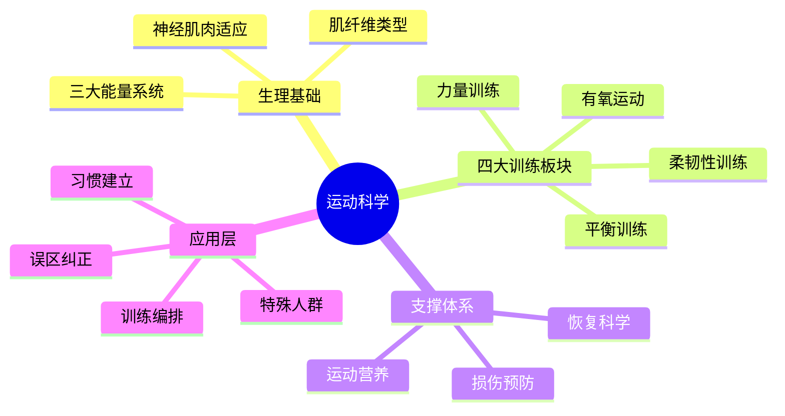
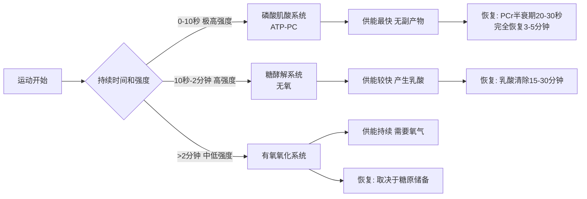
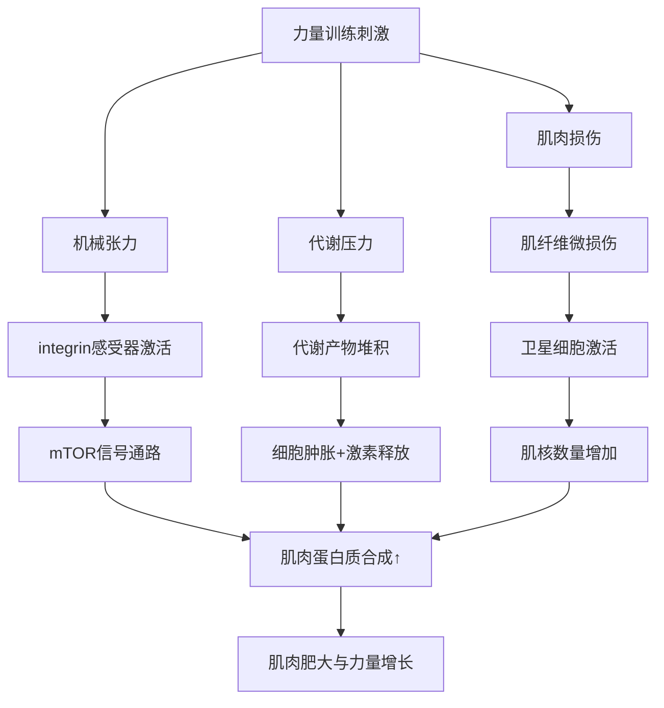
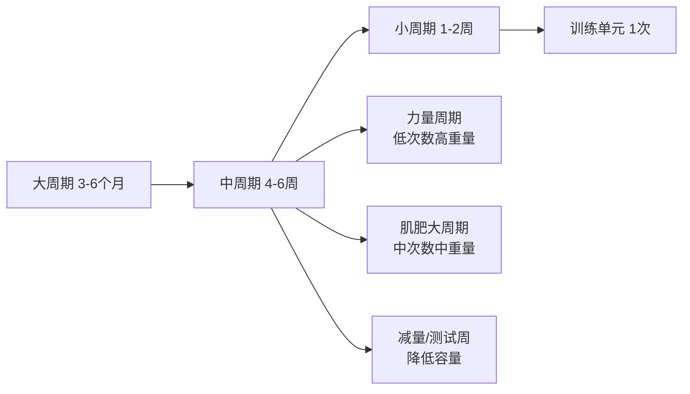
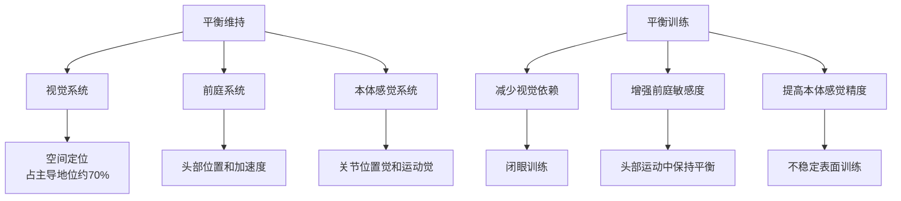
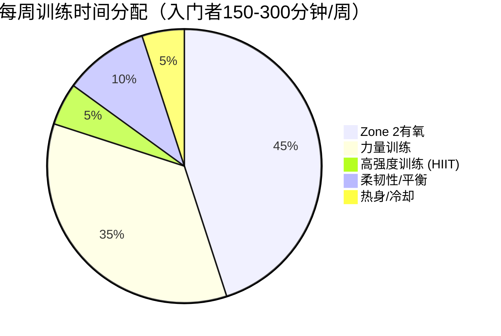

## 四、运动科学

运动是健康的第三大支柱，与营养和睡眠构成人体健康的"铁三角"。但大多数人对运动的理解停留在"动起来就行"的层面——不清楚不同运动模式如何改变身体，不知道如何科学编排训练计划，不了解运动与营养、恢复之间的协同关系。本章将从运动生理学原理出发，系统覆盖有氧运动、力量训练、柔韧性训练、平衡训练四大板块，再到训练编排、营养策略、恢复方法、特殊人群方案、损伤预防，帮助你建立完整的运动知识体系。

### 4.1 运动的系统性益处

运动的价值不仅在于"消耗卡路里"，而是通过多种生理机制对全身系统产生深远影响。下面从六个维度展开，每个维度都给出具体的生理机制和量化的健康收益。

#### 4.1.1 心血管系统

规律有氧运动对心血管系统的改善是多维度的。心脏本身是一块肌肉，运动训练使其变得更强壮——左心室容积增大，每搏输出量增加，静息心率从平均70次/分降至50-60次/分（优秀耐力运动员可达40次/分以下）。这意味着心脏每分钟跳更少的次数就能泵出相同的血液量，长期来看大大降低了心脏的工作负荷。

血管层面的改善同样显著。运动促进血管内皮细胞释放一氧化氮（NO），这是一种强效的血管舒张因子，能降低外周阻力、改善血流动力学。规律运动者的大动脉弹性更好，脉搏波传导速度更慢，收缩压平均降低5-7 mmHg，舒张压降低2-5 mmHg。这些改变累积起来，将心血管疾病风险降低35%（美国心脏协会2019年报告）。

运动还改善血脂谱——降低甘油三酯15-30%，升高高密度脂蛋白胆固醇（HDL-C）5-10%，降低小而密的低密度脂蛋白（sdLDL）比例。动脉粥样硬化的起始步骤是LDL氧化沉积，而运动通过降低氧化应激和改善脂质组成来延缓这一过程。

#### 4.1.2 代谢系统

运动对代谢的影响远超运动本身的能量消耗。规律运动使2型糖尿病风险降低40%，其核心机制包括：

- **胰岛素敏感性提升**：运动促进GLUT4葡萄糖转运蛋白从细胞内转移到细胞膜表面，即使在非运动状态下也能更高效地将血糖摄入肌肉细胞。单次中等强度运动可使胰岛素敏感性持续提升24-72小时
- **肌糖原储备增加**：训练有素的肌肉储存的糖原比久坐肌肉多50-100%，相当于一个更大的"血糖缓冲池"
- **脂肪氧化能力增强**：线粒体数量和体积增加，脂肪酸氧化酶活性提高，身体更善于在低中强度运动中使用脂肪作为燃料
- **静息代谢率提升**：每增加1公斤肌肉，静息代谢率约提高13千卡/天（虽然数字不大，但累积效应显著）

运动后过量氧耗（EPOC，Excess Post-exercise Oxygen Consumption）是另一个重要机制。高强度运动结束后，身体需要额外的氧气来恢复磷酸肌酸储备、清除乳酸、修复肌纤维、降低体温，这个过程会持续消耗额外能量。HIIT训练后的EPOC可持续24-48小时，额外消耗60-150千卡。

#### 4.1.3 肌肉骨骼系统

骨骼是活的组织，遵循"Wolff定律"——骨骼根据承受的力学负荷重塑自身结构。力量训练和高冲击运动（跑步、跳跃）产生的地面反作用力和肌肉牵拉力刺激成骨细胞活性，抑制破骨细胞，使骨密度增加。这对于预防骨质疏松至关重要——研究表明，规律力量训练可使绝经后女性的骨密度增加1-3%，降低骨折风险40-50%。

肌肉组织不仅是运动器官，更是内分泌器官。收缩的肌肉释放数百种肌因子（myokines），包括白细胞介素-6（IL-6，运动时释放的IL-6具有抗炎作用，与慢性炎症时的促炎作用完全不同）、脑源性神经营养因子（BDNF）、鸢尾素（irisin，促进白色脂肪褐变）等。这些肌因子参与调节全身代谢、免疫和神经系统功能。

#### 4.1.4 神经系统与大脑

运动对大脑的影响可以用一句话概括：运动是目前最有效的"促智药"。其机制包括：

- **BDNF（脑源性神经营养因子）增加**：BDNF是大脑的"肥料"，促进神经元生长、突触可塑性和长时程增强（LTP，学习记忆的神经基础）。有氧运动后血浆BDNF水平可升高2-3倍
- **海马体体积增大**：伊利诺伊大学的实验显示，12周有氧训练使老年人海马体体积增加2%，相当于逆转1-2年的年龄相关萎缩。海马体是大脑中与学习和记忆最密切相关的区域
- **前额叶功能改善**：执行功能（计划、决策、工作记忆、冲动控制）与前额叶皮层密切相关，运动通过增加该区域的血流量和神经递质水平来增强执行功能
- **神经递质平衡**：运动增加多巴胺、血清素和去甲肾上腺素的释放，这三种神经递质分别与奖赏/动机、情绪/睡眠和注意力/觉醒相关，这也是运动改善情绪和注意力的生化基础

**运动与认知表现的实操应用**：

运动对大脑的益处可以被有意识地用于提升学习和工作效率。以下是经过研究验证的具体策略：

| 应用场景 | 最佳运动方案 | 效果持续时间 | 科学依据 |
|----------|-------------|-------------|---------|
| 考试/面试前 | 20分钟中等强度有氧 | 1-2小时 | BDNF和去甲肾上腺素峰值提升注意力和工作记忆 |
| 需要创造力时 | 30分钟散步（不必剧烈） | 1-2小时 | 斯坦福研究：步行提升发散思维60% |
| 学习新技能前 | 15分钟高强度间歇 | 30-60分钟 | 运动后神经可塑性窗口期，运动诱发的BDNF促进突触重塑 |
| 午后精力低谷 | 10分钟快走或爬楼梯 | 1-3小时 | 提升去甲肾上腺素和多巴胺，比咖啡因更持久 |
| 压力过大时 | 30分钟中等强度有氧 | 2-4小时 | 降低皮质醇，提升血清素，调节HPA轴反应 |

长期认知保护方面，一项追踪20年的前瞻性研究（Neurology, 2019）显示，中年时期较高的心肺适能（VO2max）与晚年痴呆风险降低35%相关。运动不是只对当下有效，它是在为未来的认知健康"储蓄"。

#### 4.1.5 心理健康

运动对心理健康的效果在临床研究中已经非常明确，某些情况下效果可媲美药物治疗。一项涵盖37项随机对照试验的Meta分析显示，规律运动使抑郁症状减轻47%，效果与抗抑郁药物相当。焦虑的降低幅度约20-30%。

其机制不仅限于内啡肽的"快感"效应（实际上"内啡肽假说"过于简化），更涉及：下丘脑-垂体-肾上腺轴（HPA轴）的调节使皮质醇反应更适度、脑内5-HT（血清素）系统上调、炎症标志物降低（慢性低度炎症与抑郁密切相关）、自我效能感提升带来的正向心理循环。

不同运动类型对心理健康的效果有差异：

| 运动类型 | 对抑郁的效果 | 对焦虑的效果 | 对压力的缓解 | 推荐剂量 |
|----------|-------------|-------------|-------------|---------|
| 有氧运动（跑步、游泳） | ★★★★★ | ★★★★ | ★★★★ | 每周150分钟中等强度 |
| 力量训练 | ★★★★ | ★★★ | ★★★ | 每周2-3次 |
| 瑜伽 | ★★★★ | ★★★★★ | ★★★★★ | 每周2-3次，60分钟 |
| 太极拳 | ★★★ | ★★★★ | ★★★★ | 每周3次，30-60分钟 |
| 团体运动 | ★★★★★ | ★★★★ | ★★★★ | 每周2-3次 |
| 自然环境运动 | ★★★★★ | ★★★★★ | ★★★★★ | 每周120分钟（"绿色运动"） |

值得注意的是，2023年发表在《英国运动医学杂志》的一项涵盖97项综述、128万人数据的伞状综述（umbrella review）得出结论：运动对心理健康的效果与心理治疗和药物治疗相当，且副作用更少。对于轻中度抑郁，运动甚至可以作为一线治疗方案。

#### 4.1.6 免疫系统与衰老

适度运动增强免疫监视功能，使自然杀伤细胞（NK细胞）活性提高40-60%，T细胞增殖能力增强，黏膜免疫（IgA分泌）改善。流行病学研究显示，规律运动者上呼吸道感染风险降低40-50%。

在衰老层面，运动对抗衰老的标志物有多重证据：端粒长度维护（运动者白细胞端粒比同龄久坐者长约200-400碱基对，相当于生物学年轻4-8年）、线粒体功能维持、自噬激活（清除受损细胞器的"细胞清洁"机制）、表观遗传时钟减缓。

但需注意运动免疫学的"J型曲线"模型：适度运动降低感染风险，但长时间高强度运动（如马拉松）后的短暂"免疫开窗期"（3-72小时）会使上呼吸道感染风险暂时升高2-6倍。应对策略包括：赛后注意保暖、补充碳水化合物、保证睡眠、避免人群密集场所。

### 4.2 运动生理学基础

理解运动如何改变身体，需要先了解三个核心能量系统和肌肉纤维类型。

#### 4.2.1 三大能量系统

人体在运动中使用三种供能系统，它们不是"切换"关系，而是同时工作、按比例调配：

**磷酸肌酸系统（ATP-PC系统）**：
- 供能速度：最快（即刻供能）
- 持续时间：6-10秒
- 燃料来源：肌肉中储存的ATP和磷酸肌酸（PCr）
- 无氧副产物：无
- 典型运动：百米冲刺、举重极限试举、跳跃
- 特点：不需要氧气，不产生乳酸，恢复快（PCr半衰期约20-30秒，完全恢复约3-5分钟）

**糖酵解系统（无氧糖酵解）**：
- 供能速度：较快
- 持续时间：10秒-2分钟
- 燃料来源：肌糖原
- 无氧副产物：乳酸和氢离子（H+）
- 典型运动：400米跑、高强度间歇训练、大重量多组训练
- 特点：不需要氧气参与最终步骤，但乳酸/H+堆积导致肌肉酸痛和疲劳，限制持续时间

**有氧氧化系统**：
- 供能速度：较慢
- 持续时间：2分钟以上（理论上无限）
- 燃料来源：碳水化合物（糖原/血糖）、脂肪（脂肪酸）、少量蛋白质（氨基酸）
- 无氧副产物：无（CO2和H2O）
- 典型运动：马拉松、长距离骑行、慢跑
- 特点：需要持续氧气供应，效率高但功率输出有限

训练的作用之一就是提高各个能量系统的效率。耐力训练增大线粒体容量，提高有氧系统的功率输出上限（即乳酸阈值对应的运动强度提高）。无氧训练提高糖酵解酶活性和缓冲能力，延迟疲劳到来。

#### 4.2.2 肌纤维类型

骨骼肌由不同类型的肌纤维混合组成，可通过训练使其发生功能性转变：

| 特征 | I型（慢缩氧化型） | IIa型（快缩氧化-糖酵解型） | IIx型（快缩糖酵解型） |
|------|--------------------|---------------------------|-----------------------|
| 收缩速度 | 慢 | 快 | 最快 |
| 抗疲劳性 | 高 | 中 | 低 |
| 主要供能系统 | 有氧 | 有氧+无氧 | 无氧 |
| 线粒体密度 | 高 | 中 | 低 |
| 毛细血管密度 | 高 | 中 | 低 |
| 肌红蛋白含量 | 高（红色） | 中 | 低（白色） |
| 力量输出 | 低 | 高 | 最高 |
| 典型运动 | 马拉松、长距离游泳 | 800米跑、间歇训练 | 百米冲刺、举重 |

耐力训练促使IIx纤维向IIa转变（更耐疲劳），力量训练促进肌肥大但纤维类型转变较少。普通人的肌纤维比例大约是50% I型 / 50% II型，但遗传因素决定了个体间的巨大差异——精英马拉松运动员I型纤维比例可达80%以上，而短跑运动员II型纤维比例可超过70%。

### 4.3 有氧运动

#### 4.3.1 有氧运动的生理适应

经过8-12周系统的有氧训练，身体会发生以下适应性变化：

**心脏适应**：
- 左心室腔扩大（离心性肥厚），每搏输出量增加15-20%
- 静息心率降低（运动员心脏综合征）
- 最大心输出量增加（心输出量 = 每搏输出量 × 心率）

**外周适应**：
- 骨骼肌毛细血管密度增加20-30%（缩短氧气从血液到肌肉的扩散距离）
- 线粒体数量增加50-100%，线粒体氧化酶活性提高
- 肌红蛋白含量增加（提高肌肉内氧气储存和转运能力）
- 脂肪氧化酶活性增强（节省糖原，延长运动持续时间）

**代谢适应**：
- 乳酸阈值提高（在更高强度下才开始乳酸堆积）
- 最大摄氧量（VO2max）提高5-25%（取决于初始水平和训练状态）
- 安静时和运动时的脂肪氧化率提高

#### 4.3.2 VO2max：最重要的健康指标之一

VO2max（最大摄氧量）代表身体每分钟能够利用的最大氧气量，单位为mL/kg/min。它不仅是有氧能力的核心指标，更是全因死亡率的最强独立预测因子之一——比血压、胆固醇、吸烟状态的预测力更强。

**VO2max与死亡风险的关系**：

| VO2max水平（40-49岁男性） | 风险等级 | 相对全因死亡风险 |
|---------------------------|---------|-----------------|
| >48 mL/kg/min | 优秀 | 基准（最低） |
| 43-48 mL/kg/min | 良好 | 约1.2倍 |
| 38-42 mL/kg/min | 中等 | 约1.8倍 |
| 33-37 mL/kg/min | 较差 | 约2.5倍 |
| <33 mL/kg/min | 极差 | 约4.0倍 |

（数据来源：Mandsager et al., JAMA Network Open, 2018，追踪12万人）

关键发现：从"极差"提升到"较差"的收益（死亡风险降低约37%）远大于从"良好"提升到"优秀"的收益。这意味着对于久坐不动的人来说，从沙发上站起来开始运动的边际收益是最大的。

**如何测量和提升VO2max**：

- **实验室测量**：在运动生理实验室进行递增负荷测试（金标准，费用约500-1500元）
- **实地估算**：库珀12分钟跑测试——VO2max ≈ (距离米数 - 504.9) / 44.73；或使用智能手表的估算功能（误差约5-10%）
- **提升方法**：HIIT是提升VO2max最高效的方式，4×4挪威协议（4分钟85-95% HRmax + 3分钟恢复，重复4组）被多项研究验证为最有效的VO2max训练方案

#### 4.3.3 Zone 2训练：被低估的有氧基础

Zone 2训练（心率储备的50-60%，或最大心率的60-70%）近年来受到运动科学界的高度关注。它看似"太轻松没效果"，但实际上是有氧能力的基石。

**Zone 2训练的核心价值**：

Zone 2对应的是脂肪氧化效率最高的强度区间。在这个强度下，I型慢缩肌纤维被充分募集，线粒体内的脂肪酸β氧化是主要供能途径。长期Zone 2训练带来的核心适应包括：

1. **线粒体生物合成**：激活PGC-1α信号通路，增加线粒体数量和体积。更多的线粒体意味着更强的能量工厂——每个细胞能产生更多ATP
2. **脂肪氧化能力**：最大脂肪氧化率（FatMax）提高，在相同强度下消耗更多脂肪、更少糖原。这对于耐力运动者和体重管理者都至关重要
3. **乳酸清除能力**：提高乳酸穿梭效率——I型肌纤维中产生的乳酸被相邻的线粒体和II型纤维"回收利用"，而非堆积在血液中
4. **毛细血管密度**：增加肌肉中的毛细血管网络，缩短氧气和营养物质的扩散距离
5. **心脏效能**：在低心率下进行长时间训练，增强左心室舒张功能和每搏输出量

**如何判断是否处于Zone 2**：

- **谈话测试**（最实用）：可以进行完整的对话，但不能轻松唱歌。如果说几个词就需要换气，说明强度太高
- **鼻呼吸测试**：全程能用鼻子呼吸表示处于或低于Zone 2
- **心率监测**：使用Karvonen公式计算，Zone 2 = 心率储备的50-60% + 静息心率
- **乳酸测试**（精确但需要设备）：血乳酸维持在1.7-2.0 mmol/L以下

**Zone 2训练安排**：

- 频率：每周3-4次
- 时长：每次30-90分钟（累积效果取决于总时长）
- 占总训练量的比例：精英耐力运动员的80%训练量在Zone 2（80/20法则）
- 形式：快走、慢跑、骑行、游泳、椭圆机——任何能维持稳定低强度的运动
- 常见错误：强度太高——大多数人Zone 2训练时的心率比实际应该高出10-15次/分，因为他们把"轻松"理解为"有点吃力"

#### 4.3.4 有氧运动类型对比

| 运动 | MET值 | 冲击力 | 关节压力 | 特点 | 适合人群 |
|------|-------|--------|----------|------|----------|
| 快走 | 3-5 | 低 | 低 | 最安全、最易坚持 | 所有人，尤其初学者和老年人 |
| 慢跑 | 7-12 | 高 | 中-高（膝、踝） | 高效，热量消耗大 | 有一定基础、无关节问题者 |
| 游泳 | 5-11 | 无 | 极低 | 全身运动，体温调节友好 | 关节问题者、肥胖者、老年人 |
| 骑行 | 4-10 | 无 | 低 | 可精确控制强度 | 所有人，包括康复期 |
| 跳绳 | 10-12 | 高 | 高（踝、膝） | 极高效率，空间需求小 | 有一定基础者 |
| 划船 | 5-12 | 低 | 低 | 全身参与，热量消耗大 | 所有人 |
| 椭圆机 | 5-8 | 无 | 极低 | 模拟跑步无冲击 | 关节敏感者 |
| 阶梯机 | 6-10 | 低 | 中 | 下肢力量+心肺 | 有一定基础者 |

> **MET（代谢当量）**：1 MET = 安静坐位时的代谢率（约3.5 mL O2/kg/min）。MET=7表示运动时的代谢率是安静时的7倍。热量消耗估算：千卡 = MET × 体重(kg) × 时间(小时)。

#### 4.3.5 运动强度的精确评估

**最大心率法（Karvonen公式）**：

目标心率 = 静息心率 + (最大心率 - 静息心率) × 强度百分比

其中最大心率 ≈ 220 - 年龄（粗略估算），更精确的公式为 Tanaka公式：最大心率 = 208 - 0.7 × 年龄。心率储备 = 最大心率 - 静息心率。Karvonen公式比简单的百分比法更准确，因为它考虑了个体的静息心率差异。

| 强度区间 | 最大心率% | 心率储备% | 主观感觉（RPE 1-10） | 训练效果 |
|----------|----------|----------|---------------------|----------|
| 恢复区 | 50-60% | <50% | 2-3，非常轻松 | 促进恢复，热身/放松 |
| 有氧基础区（Zone 2） | 60-70% | 50-60% | 4-5，轻松 | 脂肪氧化为主，建立有氧基础 |
| 有氧进阶区 | 70-80% | 60-70% | 6-7，中等偏难 | 提高有氧能力，乳酸阈值训练 |
| 无氧阈区 | 80-90% | 70-80% | 7-8，困难 | 提高乳酸清除能力，竞技表现 |
| 极限区 | 90-100% | 80-100% | 9-10，极其困难 | 最大摄氧量训练，时间极短 |

**谈话测试**：这是无需任何设备的简易强度评估方法。
- 轻松说话：低强度（<60%最大心率）
- 可以说话但略微吃力：中等强度（60-75%）
- 说短句困难：高强度（75-85%）
- 几乎不能说话：极高强度（>85%）

**心率变异性（HRV）**：HRV是评估自主神经功能和恢复状态的高级指标。训练后HRV降低是正常反应，但持续低于个人基线表示恢复不足。使用胸带式心率带配合APP（如Elite HRV、HRV4Training）可每天监测。

#### 4.3.6 有氧运动的进阶安排

**初学者起步方案**（第1-4周）：
- 频率：每周3次
- 方式：快走或走跑交替
- 时间：从15分钟起步，每周增加5分钟
- 强度：RPE 3-4，可以说完整句子
- 走跑交替示例：走3分钟+慢跑1分钟，重复4-5次

**中级进阶方案**（第5-12周）：
- 频率：每周4-5次
- 方式：慢跑、骑行、游泳等
- 时间：30-45分钟
- 强度：RPE 5-6，可以说短句
- 引入一次间歇训练

**高级训练方案**（第13周+）：
- 频率：每周5-6次（含1-2次高强度训练）
- 方式：多样化
- 时间：40-90分钟不等
- 遵循80/20原则：80%训练量在低强度区间（Zone 2），20%在高强度区间

**有氧进阶中的常见错误**：

1. **跑量增长太快**：违反10%规则，每周跑量增幅超过10%，导致胫骨应力综合征、髂胫束综合征等过度使用损伤。正确做法：隔周增加跑量（10%→0%→10%→0%），给身体两周适应一个跑量级别
2. **每次都全力跑**：大多数人的训练强度集中在"灰色地带"——不够轻松到能建立有氧基础，也不够剧烈到能提升无氧能力。正确做法：80%轻松跑（能聊天），20%高强度训练
3. **忽视交叉训练**：只跑步不做其他运动，导致肌肉不平衡和过度使用。每周至少安排1次非冲击性有氧（游泳、骑行）和2次力量训练
4. **过度依赖跑步机**：跑步机的传送带会辅助腿向后运动，实际做功比户外跑步少约5-10%。此外，恒定的平坦表面不如户外变化地形能激活稳定肌群
5. **不做热身就开跑**：冷启动的肌肉和关节更容易受伤，且前5-10分钟的运动效率很低。5-10分钟的渐进式热身（从走到慢跑）能将肌肉温度提高到最优水平

#### 4.3.7 HIIT（高强度间歇训练）

HIIT是有氧训练中效率最高的模式之一。核心原理是通过短时间高强度运动（85-100%最大心率）和低强度恢复期交替进行，在短时间内达到甚至超过长时间稳态有氧训练的效果。

**HIIT的科学依据**：

Tabata等人（1996）的经典研究显示，每天4分钟（8组20秒全力冲刺+10秒休息）的HIIT，持续6周后，受试者的无氧能力提高28%，最大摄氧量提高14%——效果与40分钟中等强度稳态有氧训练相当。后续研究证实HIIT在改善VO2max、胰岛素敏感性、体脂率方面至少与稳态有氧等效，某些指标甚至更优。

**常见HIIT协议**：

| 协议 | 工作期 | 休息期 | 组数 | 总时间 | 适用水平 |
|------|--------|--------|------|--------|----------|
| Tabata | 20秒全力 | 10秒 | 8 | 4分钟 | 高级 |
| 30/30 | 30秒高强度 | 30秒低强度 | 10-15 | 10-15分钟 | 中级 |
| 4×4挪威 | 4分钟85-95%HRmax | 3分钟60-70%HRmax | 4 | 28分钟 | 中-高级 |
| 10-20-30 | 30秒低/20秒中/10秒冲刺 | 2分钟后重复 | 5组×3轮 | 25分钟 | 初-中级 |
| 金字塔 | 15-30-45-30-15秒 | 等长恢复 | 2-3轮 | 15-20分钟 | 中级 |

**HIIT注意事项**：
- 频率：每周2-3次，中间至少间隔48小时
- 必须充分热身（至少10分钟渐进式热身）
- 初学者应从较低强度的间歇开始（如30秒快走+60秒慢走）
- HIIT不能完全替代稳态有氧——两者有不同的适应性刺激
- 不建议在空腹状态下进行HIIT

### 4.4 力量训练

#### 4.4.1 力量训练的生理机制

力量训练引起的肌肉适应主要通过三种机制：

**机械张力**：这是肌肉增长的首要驱动因素。当肌肉在足够负荷下收缩时，肌纤维上的机械感受器（如integrin复合物）感知张力，激活mTOR信号通路，启动蛋白质合成。这是为什么渐进超负荷（progressive overload）如此重要——只有不断增加的机械张力才能持续驱动适应。

**代谢压力**：高次数、短休息的训练造成代谢产物（乳酸、氢离子、无机磷酸盐）堆积，导致细胞肿胀和激素释放（生长激素、IGF-1）。代谢压力对肌肥大有独立贡献，这也是为什么健美训练倾向于使用中等重量、高次数、短休息的方案。

**肌肉损伤**：离心收缩（肌肉在拉长状态下发力，如下蹲底部、放下哑铃的过程）造成的肌纤维微损伤触发修复和重塑过程，卫星细胞被激活并融合到现有肌纤维中，增加肌核数量，为更大的肌纤维体积提供支持。但过度的肌肉损伤会延迟恢复，需要适度控制。

#### 4.4.2 训练变量的精确控制

**强度（负荷）**：

| 训练目标 | 每组次数 | 1RM百分比 | 组间休息 | 主要机制 |
|----------|---------|-----------|---------|----------|
| 最大力量 | 1-5次 | 85-100% | 3-5分钟 | 神经适应 |
| 肌肥大 | 6-12次 | 65-85% | 1-2分钟 | 机械张力+代谢压力 |
| 肌耐力 | 12-20+次 | <65% | 30-60秒 | 代谢适应 |

2017年Brad Schoenfeld等人的Meta分析确认：在总训练量（组数×次数×重量）相等的条件下，力量和肌肥大的效果在6-30次范围内无显著差异——但实际操作中，8-12次是效率最高的"甜蜜区"，因为它同时提供了足够的机械张力和代谢压力，且受伤风险最低。

**组数（训练量）**：
- 每个肌群每周10-20组是大多数人的最优范围
- 初学者每周每肌群8-12组即可
- 中级训练者12-16组
- 高级训练者可能需要16-20+组（但需要注意恢复能力）
- 超过20组/周/肌群后，收益递减，过度训练风险增加

**频率**：
- 每个肌群每周训练2次优于1次（Meta分析显示增肌效果提高约40%）
- 3次/周不明显优于2次/周，但允许每次训练更少的组数
- 最佳频率取决于总训练量分配——总量相同时，分2-3次比集中1次好

**动作选择**：

五大基本动作模式覆盖全身：

1. **水平推**（胸肌、三角肌前束、肱三头肌）：俯卧撑、哑铃卧推、杠铃卧推
2. **垂直推**（三角肌、斜方肌上束、肱三头肌）：哑铃肩推、杠铃推举
3. **水平拉**（背阔肌、菱形肌、肱二头肌）：哑铃划船、坐姿划船
4. **垂直拉**（背阔肌、肱二头肌）：引体向上、高位下拉
5. **下肢推拉**（股四头肌、臀肌、腘绳肌）：深蹲、硬拉、腿举、罗马尼亚硬拉
6. **核心抗伸展/旋转**：平板支撑、帕洛夫推举、抗旋转划船

复合动作（涉及两个以上关节）应占训练量的70-80%，孤立动作（单关节）作为补充20-30%。

**复合动作vs孤立动作对比**：

| 维度 | 复合动作 | 孤立动作 |
|------|---------|---------|
| 肌群参与 | 多关节、多肌群 | 单关节、单肌群 |
| 训练效率 | 高（一次覆盖多个肌群） | 低（需要更多动作） |
| 负荷潜力 | 大（多肌群协同发力） | 小（单肌群承受） |
| 神经系统消耗 | 高（需要更多中枢驱动） | 低 |
| 受伤风险 | 相对较高（需要正确技术） | 较低 |
| 适用场景 | 训练主体 | 补充薄弱环节 |
| 激素响应 | 更强（更大的系统性压力） | 较弱 |
| 典型例子 | 深蹲、硬拉、卧推、引体向上 | 弯举、腿屈伸、侧平举 |

#### 4.4.3 呼吸力学与瓦尔萨尔瓦动作

呼吸在力量训练中的作用远不止"别憋气"这么简单。正确的呼吸技术是保证训练安全和最大化力量输出的关键。

**基础呼吸模式**：
- **向心阶段呼气**：在举起重量（肌肉缩短）时呼气
- **离心阶段吸气**：在放下重量（肌肉拉长）时吸气
- 例如深蹲：下蹲时吸气，站起时呼气

**瓦尔萨尔瓦动作（Valsalva Maneuver）**：

进行大重量训练（>80% 1RM）时，单纯的基础呼吸模式不足以维持核心稳定。此时需要使用瓦尔萨尔瓦动作：

1. 在动作开始前深吸一口气到腹部（横膈膜呼吸，不是胸式呼吸）
2. 关闭声门（像要用力排便一样"憋住"）
3. 同时收紧腹肌、腹横肌和盆底肌，创造腹内压
4. 在最困难的阶段保持这个压力
5. 通过最困难点后缓慢呼气

腹内压的效应：像一个内置的"举重腰带"，从内部支撑脊柱。研究表明，正确的瓦尔萨尔瓦动作可将脊柱稳定性提高20-40%，显著降低腰椎间盘压力。

**安全注意事项**：
- 瓦尔萨尔瓦动作会暂时升高血压（收缩压可升高150-300mmHg），对于健康人群这是短暂且可逆的
- 高血压患者（>160/100mmHg）、有心血管疾病史、视网膜病变者应避免大重量瓦尔萨尔瓦
- 不能长时间持续——通常在5秒以内的大重量试举中使用
- 建议从轻重量开始练习呼吸模式，熟练后再在大重量中应用

**常见呼吸错误**：
1. **完全憋气不呼吸**：导致脑部供氧不足，可能出现头晕甚至昏厥。正确做法是短暂憋气后必须呼气
2. **全程呼气**：在最需要核心稳定的时候呼气会"泄气"，丧失腹内压
3. **胸式呼吸而非腹式呼吸**：无法建立足够的腹内压，核心稳定不足
4. **忽略呼吸训练**：将横膈膜呼吸作为日常练习，每天3-5分钟，为训练打下基础

#### 4.4.4 渐进超负荷策略

渐进超负荷是力量训练的核心原则——训练刺激必须随时间系统性增加，身体才会持续适应。具体策略包括：

**线性进阶**（适合初学者，4-12周）：
每次训练增加2.5kg（下肢）或1.25kg（上肢），或增加1-2次。当无法继续线性增加时（通常在2-3个月后），转入周期化方案。

**双递增法**（适合中级，3-6个月周期）：
第1周：3组×8次@60kg
第2周：3组×10次@60kg
第3周：3组×8次@62.5kg
第4周：3组×10次@62.5kg
交替增加次数和重量。

**周期化进阶**（适合中高级）：
将训练分为不同的周期（大周期→中周期→小周期→训练单元），每个周期有不同的侧重点。

**DUP（每日波动周期化）**：
一周内的不同训练日侧重不同的训练目标，例如：
- 周一：力量日（5×5@85%1RM）
- 周三：肌肥大日（4×10@70%1RM）
- 周五：耐力日（3×15@60%1RM）

多项Meta分析显示DUP在增肌和增力方面优于传统的线性周期化方案，尤其适合已有6个月以上训练经验的人。

#### 4.4.5 训练编排示例

**初学者全身训练方案**（每周3次，每次40-50分钟）：

| 顺序 | 动作 | 组×次 | 休息 |
|------|------|-------|------|
| 1 | 杠铃深蹲 | 3×8-10 | 2分钟 |
| 2 | 哑铃卧推 | 3×8-10 | 2分钟 |
| 3 | 哑铃划船 | 3×8-10 | 90秒 |
| 4 | 哑铃肩推 | 3×10-12 | 90秒 |
| 5 | 罗马尼亚硬拉 | 3×10-12 | 90秒 |
| 6 | 平板支撑 | 3×30-45秒 | 60秒 |

**中级上下肢分化**（每周4次）：

上肢日A（周一）：
| 动作 | 组×次 | 休息 |
|------|-------|------|
| 杠铃卧推 | 4×6-8 | 2-3分钟 |
| 杠铃划船 | 4×6-8 | 2-3分钟 |
| 哑铃肩推 | 3×8-10 | 90秒 |
| 高位下拉 | 3×8-10 | 90秒 |
| 哑铃弯举 | 3×10-12 | 60秒 |
| 三头臂屈伸 | 3×10-12 | 60秒 |

下肢日A（周二）：
| 动作 | 组×次 | 休息 |
|------|-------|------|
| 杠铃深蹲 | 4×6-8 | 3分钟 |
| 罗马尼亚硬拉 | 4×8-10 | 2分钟 |
| 腿举 | 3×10-12 | 90秒 |
| 腿弯举 | 3×10-12 | 90秒 |
| 提踵 | 4×12-15 | 60秒 |
| 悬垂举腿 | 3×10-15 | 60秒 |

上肢日B（周四）和下肢日B（周五）变化动作角度和器械，提供不同的刺激。

**高级推拉腿分化**（每周5-6次）：
- 推日（胸、肩、三头）：6-8个动作，总组数16-20组
- 拉日（背、二头、后肩）：6-8个动作，总组数16-20组
- 腿日（股四、腘绳、臀、小腿）：6-8个动作，总组数16-22组
- 每个训练日每周执行2次，中间安排1-2天完全休息

#### 4.4.6 高级训练技术

当基础渐进超负荷进入平台期时，以下高级技术可以提供新的刺激。这些技术不适合初学者——至少需要6-12个月系统训练经验后再考虑。

**休息-暂停组（Rest-Pause）**：
执行一组至接近力竭（RIR 1-2），休息15-20秒，继续做到力竭，再休息15-20秒，再次做到力竭。总共进行2-3个"暂停"。这个技术在相同时间内增加了有效重复次数和机械张力总量。

示例：杠铃弯举40kg，第一段做到8次（接近力竭），休息20秒，继续做3次，再休息20秒，再做2次。总共13次的有效重复，比普通3组×8次（24次中很多是在远离力竭的状态下完成的）提供更密集的刺激。

**下降组（Drop Sets）**：
一组做到力竭后，立即减少20-30%的重量，不休息继续做到力竭，再次减重20-30%再做到力竭。通常进行2-3次下降。下降组的优势在于延长了肌肉在力竭附近的紧张时间，增加代谢压力和肌纤维募集。

**超级组（Supersets）**：
两个动作连续执行，中间不休息或极短休息（<15秒）。有三种类型：
- 对抗肌超级组：如卧推+划船（胸+背），利用拮抗肌恢复的间隙工作
- 同肌群超级组：如卧推+飞鸟（都是胸肌），大幅增加代谢压力
- 预疲劳超级组：如飞鸟+卧推（先孤立再复合），预先疲劳目标肌群

**限制血流训练（BFR，Blood Flow Restriction）**：
使用专门的袖带在肢体近端施加压力（通常为动脉闭塞压的40-80%），在低负荷（20-30% 1RM）下进行训练。BFR导致的静脉回流受阻创造了极端的代谢压力环境，使低负荷训练也能产生显著的肌肥大效果。这在康复期（无法承受高负荷）时特别有价值。

注意事项：BFR需要专用设备（不是随便用绳子扎），操作不当有血管和神经损伤风险。建议在专业人士指导下使用。

### 4.5 柔韧性与灵活性训练

柔韧性指关节被动达到的活动范围，灵活性则强调在运动中主动控制关节活动范围的能力。两者相关但不相同——一个人可以被动地把腿抬到头顶（柔韧性好），但踢腿时却无法达到相同的角度（灵活性不足），这说明神经肌肉控制同样重要。

#### 4.5.1 拉伸类型详解

**静态拉伸**：
将肌肉拉伸到轻微不适但不疼痛的位置，保持15-60秒。研究显示30秒是效率最优的持续时间——短于30秒效果不足，超过60秒收益递减。每个肌肉群重复2-4次。最佳时机是运动后或单独的柔韧性训练课，此时肌肉温度高，肌梭敏感性降低，拉伸效果更好。

注意事项：静态拉伸在运动前进行可能暂时降低力量输出（约5-7%）和爆发力（约2-3%），持续时间约10-15分钟。因此，运动前不宜进行长时间的静态拉伸，应以动态拉伸为主。

**动态拉伸**：
通过有控制的、运动范围完整的重复性动作来活动关节和肌肉。典型动作包括：腿摆（前后、左右）、手臂环绕、弓步行走、臀桥行走、躯干旋转等。每个动作10-15次重复。动态拉伸同时是有效的热身方式——它提高肌肉温度、增加关节滑液分泌、激活神经肌肉系统、预习即将使用的运动模式。

**PNF拉伸（本体感觉神经肌肉促进法）**：
通过交替收缩和放松目标肌肉来利用"自主抑制"原理——当肌肉主动收缩后，高尔基腱器官（GTO）发出信号让肌肉放松，此时拉伸能达到更大的活动范围。最常用的PNF模式是"收缩-放松"（Contract-Relax）：
1. 被动拉伸目标肌肉至终末端
2. 等长收缩目标肌肉6-10秒（对抗外力，不要移动关节）
3. 放松后进一步拉伸至新的活动范围
4. 重复2-3次

PNF拉伸在改善短期柔韧性方面比静态拉伸更有效，但需要搭档辅助或使用弹力带/墙壁。

**筋膜放松（泡沫轴/筋膜球）**：
使用泡沫轴或筋膜球对紧张的肌肉和筋膜施加压力，通过自我按摩来降低肌筋膜张力、改善局部血流量。研究表明泡沫轴不会显著降低运动表现（不像静态拉伸），可用于运动前热身的一部分。每个区域滚动30-60秒，在痛点处停留10-20秒。

各拉伸方式的效果对比：

| 拉伸方式 | 活动范围提升 | 对力量的影响 | 最佳时机 | 所需设备 | 技术难度 |
|----------|-------------|-------------|---------|---------|---------|
| 静态拉伸 | ★★★★ | 运动前暂时降低 | 运动后 | 无 | 低 |
| 动态拉伸 | ★★★ | 无负面影响或略有提升 | 运动前 | 无 | 低 |
| PNF拉伸 | ★★★★★ | 运动后无影响 | 运动后/单独训练 | 搭档/弹力带 | 中 |
| 泡沫轴 | ★★★ | 无负面影响 | 运动前后均可 | 泡沫轴/筋膜球 | 低 |
| 弹力带辅助拉伸 | ★★★★ | 无负面影响 | 任何时候 | 弹力带 | 中 |

#### 4.5.2 柔韧性训练方案

**全身柔韧性训练（20分钟）**：

| 顺序 | 拉伸动作 | 目标肌肉 | 时间/次数 |
|------|---------|----------|----------|
| 1 | 颈部侧屈拉伸 | 斜方肌上束、胸锁乳突肌 | 每侧30秒 |
| 2 | 门框胸肌拉伸 | 胸大肌、三角肌前束 | 每侧30秒 |
| 3 | 跨体肩拉伸 | 三角肌后束、冈下肌 | 每侧30秒 |
| 4 | 猫牛式 | 脊柱屈伸肌群 | 10次 |
| 5 | 坐姿体前屈 | 腘绳肌、竖脊肌 | 30秒×2 |
| 6 | 鸽子式 | 梨状肌、臀中肌 | 每侧45秒 |
| 7 | 股四头肌拉伸 | 股四头肌、髂腰肌 | 每侧30秒 |
| 8 | 小腿拉伸 | 腓肠肌、比目鱼肌 | 每侧30秒 |

#### 4.5.3 瑜伽的选择

瑜伽融合了柔韧性、力量和平衡训练，不同流派侧重不同：

| 流派 | 特点 | 强度 | 适合人群 |
|------|------|------|----------|
| 哈他瑜伽 | 基础体式，节奏缓慢 | 低 | 初学者、老年人 |
| 流瑜伽（Vinyasa） | 体式串联，呼吸配合 | 中 | 有一定基础者 |
| 阿斯汤加 | 固定序列，强度大 | 高 | 高级练习者 |
| 阴瑜伽 | 长时间保持（3-5分钟） | 低 | 深层筋膜放松 |
| 修复瑜伽 | 使用辅具被动保持 | 极低 | 康复期、压力大者 |
| 热瑜伽（Bikram） | 高温环境（35-42°C） | 中-高 | 有经验者，注意补水 |

### 4.6 平衡与协调训练

平衡能力是运动能力的基石。人体平衡由三个系统协同维持：视觉系统（空间定位）、前庭系统（头部位置和加速度）、本体感觉系统（关节位置觉和运动觉）。平衡训练的本质是通过系统性挑战这三个系统来提高它们的效率和协同性。

#### 4.6.1 平衡训练的进阶体系

**静态平衡**（初级）：
- 双脚站立→单脚站立→闭眼单脚站立
- 在稳定表面上练习，逐步减少支撑面积
- 每个姿势保持30-60秒

**动态平衡**（中级）：
- 单脚站立时进行上肢运动（如接抛球）
- 平衡板或BOSU球上站立
- 太极拳中的重心转移
- 瑜伽战士系列体式

**反应性平衡**（高级）：
- 不预期的外力干扰（搭档轻推）
- 在不稳定表面上进行运动（如平衡球上深蹲）
- 敏捷梯训练

#### 4.6.2 平衡训练的特殊价值

对于老年人，平衡训练的价值尤其突出。世界卫生组织的数据显示，跌倒是65岁以上人群意外伤害死亡的首要原因。规律的平衡训练可降低跌倒风险23-40%。太极拳被多项研究证实是最有效的防跌倒运动之一——一项涵盖8项RCT的Meta分析显示，太极拳使老年人跌倒风险降低28%。

对于运动员，平衡训练提高本体感觉，减少踝关节扭伤复发率约35%（尤其在篮球、足球等需要频繁变向的运动中）。

对于久坐人群，平衡训练激活深层稳定肌群（多裂肌、腹横肌、盆底肌），改善姿势控制，减少腰背痛风险。

### 4.7 运动营养

运动表现和恢复的最大化依赖于正确的营养策略。训练提供刺激，营养提供原料和能量，睡眠提供修复时间——三者缺一不可。

#### 4.7.1 宏量营养素需求

**蛋白质**：
- 普通成人：0.8-1.0g/kg/天
- 力量训练者：1.6-2.2g/kg/天（Morton等人2018年Meta分析确定1.6g/kg/天是增肌的下限阈值，超过2.2g/kg/天后收益递减）
- 耐力运动员：1.2-1.6g/kg/天
- 减脂期：提高到2.0-2.4g/kg/天（在热量赤字下保护肌肉质量）
- 单次摄入20-40g优质蛋白（含2-3g亮氨酸）可最大化肌肉蛋白质合成
- 蛋白质分配：每3-5小时摄入一次（而非集中在一两餐），最大化全天的肌肉蛋白质合成率

蛋白质来源质量对比：

| 蛋白质来源 | PDCAAS评分 | 亮氨酸含量（每30g蛋白质） | 吸收速度 | 其他特点 |
|-----------|-----------|------------------------|---------|---------|
| 乳清蛋白 | 1.00 | 3.5g | 快（1-2小时） | 含完整氨基酸谱，运动后首选 |
| 鸡蛋 | 1.00 | 2.5g | 中（3-4小时） | 生物价最高，营养全面 |
| 鸡胸肉 | 0.92 | 2.4g | 中（3-4小时） | 高蛋白低脂肪 |
| 牛肉 | 0.92 | 2.4g | 慢（4-6小时） | 含铁、锌、B12 |
| 大豆蛋白 | 0.91 | 2.0g | 中 | 植物蛋白中最完整 |
| 米+豆组合 | 0.90+ | 互补 | 中 | 植物蛋白互补策略 |

> **PDCAAS**（蛋白质消化率校正氨基酸评分）：1.00为最高分，表示蛋白质质量最优。植物蛋白通常需要组合互补以达到完整氨基酸谱。

**碳水化合物**：
- 低强度训练日：3-5g/kg/天
- 中等强度训练（每天1小时）：5-7g/kg/天
- 高强度训练（每天1-3小时）：6-10g/kg/天
- 超高强度/长时间（每天4小时以上）：8-12g/kg/天
- 运动前1-4小时：1-4g/kg，选择低GI食物
- 运动中（>60分钟）：30-60g/小时
- 运动后30分钟内：1-1.2g/kg，选择高GI食物促进糖原恢复

**脂肪**：
- 不低于总热量的20%（低于此值影响激素水平，尤其睾酮）
- 不超过35%（除非特定饮食方案如生酮饮食）
- 优先选择不饱和脂肪酸（橄榄油、鱼油、坚果、牛油果）
- Omega-3脂肪酸（EPA+DHA）每天2-3g：抗炎、促进关节健康、改善心血管功能

#### 4.7.2 运动前中后的营养时间表

| 时间窗口 | 营养重点 | 具体建议 |
|----------|---------|----------|
| 运动前2-4小时 | 储备能量 | 富含碳水的正餐，适量蛋白质，低脂低纤维（避免胃肠不适） |
| 运动前30-60分钟 | 补充能量 | 小份易消化碳水（香蕉、能量棒），150-300mL水 |
| 运动中（<60分钟） | 水分补充 | 每15-20分钟150-250mL水 |
| 运动中（>60分钟） | 水分+能量 | 每小时30-60g碳水（运动饮料），300-800mL液体 |
| 运动后0-30分钟 | 快速恢复 | 30-40g蛋白质+50-100g碳水（蛋白质:碳水≈1:2-3） |
| 运动后2-4小时 | 完整恢复 | 正餐，均衡摄入三大营养素 |

#### 4.7.3 补水策略

脱水是运动表现的第一杀手。脱水仅2%（体重下降）即可导致运动表现下降10-20%，核心体温升高加速。

**运动前**：提前2-4小时饮水5-7mL/kg（体重70kg的人喝350-490mL）。检查尿液颜色——淡黄色表示水分充足，深黄色需要继续补水。

**运动中**：根据出汗率补水，一般每15-20分钟150-250mL。高温高湿环境下出汗率可达1-2L/小时，需要更频繁的补水。持续60分钟以上的运动应在水中加入电解质（钠300-600mg/L，钾少量）。

**运动后**：补回运动中损失的150%的水分（例如运动中丢失1kg体重，需补充1.5L液体）。加入食物中的钠可帮助液体潴留。

**个人出汗率测试方法**：运动前后称重（排空膀胱后），加上运动中喝的水量，减去运动后排尿量。差值即为出汗量。例如：运动前体重70kg，运动后69.2kg，运动中喝了500mL水，则出汗量 = (70 - 69.2) + 0.5 = 1.3L。除以运动时间即得出汗率。

### 4.8 恢复科学

训练是"破坏"，恢复才是"建设"。没有充分的恢复，训练效果无法积累，甚至会导致退步。恢复科学的核心是管理好三类恢复手段：睡眠、营养（前节已述）和主动恢复。

#### 4.8.1 睡眠与运动恢复

睡眠是最重要的恢复手段。深度睡眠期间，生长激素（GH）脉冲式分泌达到峰值——约70%的日分泌量发生在睡眠的前半段（尤其前90分钟的深睡期）。生长激素促进肌纤维修复、骨骼生长和脂肪代谢。

运动训练者对睡眠的需求高于普通人。研究建议运动员每晚7-9小时，精英运动员可能需要8-10小时。Stan Chervin等人2011年的研究显示，斯坦福大学篮球运动员在将睡眠延长到10小时/晚后，冲刺速度提高4%，罚球命中率提高9%，三分命中率提高9.2%。

睡眠不足的影响：
- 睾酮水平下降10-15%（连续一周每晚只睡5小时）
- 肌肉蛋白质合成速率降低
- 反应时间和决策能力下降（增加受伤风险）
- 免疫功能受损（上呼吸道感染风险增加3倍）
- 主观疲劳感增加

#### 4.8.2 主动恢复策略

**低强度有氧恢复**：运动后或休息日进行20-30分钟低强度有氧（50-60%最大心率），促进血液循环、加速代谢废物清除。例如：散步、轻松骑车、轻松游泳。

**泡沫轴与筋膜放松**：运动后使用泡沫轴滚动主要训练肌肉群，每个部位60-90秒。研究表明泡沫轴可以减少延迟性肌肉酸痛（DOMS）约20-30%，且不影响后续训练表现。

**冷热交替浴/冷水浸泡**：冷水浸泡（10-15°C，10-15分钟）通过血管收缩-舒张的"泵效应"促进代谢废物清除、降低炎症反应。冷热交替（冷水1分钟→温水3分钟，重复3-4次）也有类似效果。但注意：训练后立即冷水浸泡可能削弱肌肉蛋白合成信号——如果目标是增肌，建议等待至少1-2小时再进行冷水浸泡。

**轻度拉伸与瑜伽**：休息日进行15-20分钟轻度拉伸或恢复性瑜伽，促进放松和血液循环。

**按摩与筋膜刀**：深层组织按摩可降低肌肉张力、改善血流量、减少粘连。研究表明按摩可以降低肌酸激酶（肌肉损伤标志物）水平和主观疲劳感。

#### 4.8.3 恢复能力的监测

**晨起心率**：每天早晨醒来后测量静息心率（取7天平均值作为基线）。如果某天心率比基线高5-10次/分以上，提示自主神经系统疲劳，当天应降低训练强度或安排休息。

**心率变异性（HRV）**：HRV是更敏感的恢复指标。测量方法：每天早晨起床后平躺测量5分钟（使用胸带式心率带+APP）。HRV持续低于个人基线7天以上的均值，提示需要减量（deload）。

**主观疲劳度（RPE）**：每天记录训练主观疲劳度和整体疲劳感。连续数天RPE偏高但训练负荷未增加，暗示恢复不足。

**睡眠质量**：使用手表或手环追踪深睡时间和总睡眠时间。深睡时间持续低于基线可能需要主动改善睡眠环境和习惯。

#### 4.8.4 过度训练综合征

过度训练综合征（Overtraining Syndrome, OTS）是训练量长期超过恢复能力的后果。它不是"练多了休息一天就好"——而是一种需要数周到数月才能恢复的全身性功能紊乱。

**过度训练的识别**：

| 阶段 | 持续时间 | 主要表现 | 恢复周期 |
|------|---------|---------|---------|
| 功能性过度（Functional Overreaching） | 1-2周 | 表现下降，疲劳感增加，但减量后超量恢复 | 1-2周减量 |
| 非功能性过度（Non-Functional Overreaching） | 数周 | 表现持续下降，睡眠障碍，情绪低落，反复感染 | 2-4周减量 |
| 过度训练综合征（OTS） | 数月 | 严重疲劳，静息心率升高，激素紊乱，抑郁，免疫崩溃 | 数月-1年 |

**预警信号（出现3个以上应警惕）**：
- 静息心率持续升高（>5次/分）
- HRV持续低于基线
- 睡眠质量下降（入睡困难、频繁醒来）
- 主观疲劳感与训练负荷不成比例
- 频繁感冒或感染
- 情绪变化（易怒、缺乏动力、焦虑）
- 训练表现停滞或下降
- 食欲下降
- 关节/肌腱疼痛增加

**预防过度训练**：
1. 每4-6周安排一次减量周（deload week），将训练量降低40-60%
2. 监测HRV和晨起心率
3. 确保充足的睡眠（7-9小时）
4. 营养充足（热量不赤字超过500千卡）
5. 管理生活压力（工作/关系压力也会消耗恢复能力）
6. 交替使用不同强度的训练

### 4.9 运动损伤预防与常见损伤

#### 4.9.1 损伤预防原则

**10%规则**：每周训练量增加不超过前一周的10%。这是最简单有效的防伤原则——突然增加训练量是运动损伤的首要原因。

**热身的科学**：

有效的热身应包含三个阶段：
1. **一般性热身**（3-5分钟）：低强度全身活动（慢跑、跳绳），提高核心体温和肌肉温度。肌肉温度每升高1°C，肌肉收缩效率提高约2-4%
2. **动态拉伸与灵活性**（3-5分钟）：针对即将训练的肌群进行动态拉伸和关节活动
3. **运动专项激活**（3-5分钟）：以较低强度预习即将进行的运动模式。例如深蹲训练前用空杆做2组，跑步前做几次短距离加速跑

**冷却的科学**：

训练后5-10分钟的低强度活动（如慢走）帮助心率和血压逐步恢复到安静水平，避免突然停止运动导致的血液在下肢淤积（运动后低血压）。之后进行5-10分钟的静态拉伸。

#### 4.9.2 常见运动损伤

| 损伤类型 | 常见运动 | 症状 | 急性处理（POLICE原则） | 预防 |
|----------|---------|------|----------------------|------|
| 踝关节扭伤 | 跑步、篮球、足球 | 肿胀、疼痛、活动受限 | Protection保护+Optimal Loading适当负荷+Ice冰敷+Compression加压+Elevation抬高 | 平衡训练、踝关节本体感觉训练 |
| 膝关节疼痛（髌股综合征） | 跑步、深蹲、跳跃 | 膝前疼痛，上下楼梯加重 | 减少刺激性活动，加强股内侧肌和臀肌 | 正确的下肢力线、渐进负荷 |
| 肩关节撞击 | 游泳、卧推、肩推 | 肩部疼痛，上举困难 | 休息、冰敷、避免过顶动作 | 加强肩袖肌群、改善胸椎灵活性 |
| 腰背痛 | 硬拉、久坐、跑步 | 下背部疼痛、僵硬 | 活动性维持，避免卧床 | 核心稳定性训练、正确体态 |
| 胫骨应力综合征（胫痛症） | 跑步、跳跃 | 小腿前内侧疼痛 | 减少跑量、更换跑鞋 | 渐进增加跑量、小腿力量训练 |
| 网球肘/高尔夫球肘 | 网球、高尔夫、抓握 | 肘外侧/内侧疼痛 | 休息、离心训练 | 前臂力量训练、正确握拍 |

> **POLICE原则**是RICE原则的更新版，强调"适当负荷"（Optimal Loading）而非完全休息。完全制动会导致肌肉萎缩、关节僵硬和组织修复延迟。在不加重损伤的前提下，尽早开始适当负荷的活动更有利于恢复。

#### 4.9.3 运动损伤的康复原则

损伤后的康复不是"等好了再练"，而是一个系统性的、有阶段的过程：

**急性期（0-72小时）**：
- 目标：控制炎症和疼痛
- POLICE原则执行
- 避免加重损伤的活动，但不完全制动
- 如需要，使用非甾体抗炎药（遵医嘱）

**亚急性期（3天-2周）**：
- 目标：恢复关节活动度和基本功能
- 开始无痛范围内的轻度活动
- 渐进恢复关节活动度（不追求完全恢复，允许20%的活动范围限制）
- 引入等长收缩练习（在固定位置发力）

**功能恢复期（2周-数周）**：
- 目标：恢复力量、平衡和运动模式
- 渐进增加负荷和运动范围
- 引入本体感觉和平衡训练（受伤部位往往本体感觉下降）
- 模拟专项运动的逐步回归
- 重返运动标准：受伤部位力量恢复到健侧的90%以上，活动范围对称，无痛完成专项动作

#### 4.9.4 何时就医

以下情况需要立即就医：
- 关节明显畸形或异常活动
- 受伤部位严重肿胀，持续加重
- 无法负重或使用受伤肢体
- 疼痛在休息时持续加重，而非缓解
- 受伤后出现麻木、刺痛或皮肤颜色改变
- 损伤在2周内无改善

### 4.10 久坐的危害与对策

#### 4.10.1 久坐的独立风险

"久坐是新型吸烟"这个比喻虽然有些夸张，但背后的科学证据是扎实的。关键发现是：久坐对健康的危害是独立于运动量的——即使你每天锻炼1小时，如果其余12小时都在坐着，你仍然面临显著增加的代谢综合征、心血管疾病和全因死亡风险。

2016年发表在《柳叶刀》上的系列文章汇总了100万人的数据，发现每天久坐超过8小时且不运动的人，死亡风险增加59%。但每天久坐8小时但进行60-75分钟中等强度运动的人，这一风险基本被消除。

久坐的生化机制包括：
- **脂蛋白脂肪酶活性降低**：该酶是清除血液中甘油三酯的关键酶，久坐使其活性下降90%以上
- **葡萄糖代谢紊乱**：长时间不活动导致GLUT4转运蛋白从细胞膜上内吞，胰岛素敏感性下降
- **血管内皮功能下降**：血流速度降低导致剪切力下降，NO释放减少
- **促炎状态**：脂肪组织中的巨噬细胞极化向M1（促炎）表型倾斜

#### 4.10.2 打破久坐的实操策略

**微运动策略**（每30-60分钟一次）：
- 起身走动2-5分钟（去倒水、上厕所、走楼梯）
- 站立做几组深蹲或弓步蹲
- 原地踏步或开合跳30秒
- 办公椅上做坐姿脊柱旋转、肩部环绕

**工作环境改造**：
- 可调节高度的站立式办公桌（建议站坐交替，每30-60分钟切换）
- 椅子上放一个坐姿提醒垫（检测压力分布，坐太久会震动提醒）
- 将打印机、垃圾桶放在需要起身才能到达的地方
- 步行会议（一对一讨论或电话会议时走动）

**"运动零食"（Exercise Snacks）概念**：
2022年《英国运动医学杂志》的一项研究提出，短时间（1-2分钟）的高强度"运动零食"可以显著抵消久坐的危害。例如每小时进行一次1分钟的快速爬楼梯或开合跳，全天积累下来可使心血管健康指标显著改善。

### 4.11 特殊人群运动指南

#### 4.11.1 儿童与青少年运动

儿童和青少年（6-17岁）的运动需求与成人有本质区别。WHO建议：每天至少60分钟中等到高强度体力活动，每周至少3次高强度有氧和增强肌肉骨骼的活动。

**发育阶段的运动特点**：

| 年龄段 | 运动重点 | 推荐活动 | 注意事项 |
|--------|---------|---------|---------|
| 6-9岁 | 基础运动技能（跑、跳、投、接、游泳） | 游戏化运动、体操、游泳、球类入门 | 不强调竞争，以兴趣和技能发展为主 |
| 10-13岁 | 运动技能深化+开始力量基础 | 多种运动项目、体重力量训练、柔韧性 | 生长板未闭合，避免极限负荷 |
| 14-17岁 | 可逐步专项化+系统力量训练 | 专项运动训练、杠铃力量训练（需正确技术） | 仍需多样化，过早专项化增加受伤和倦怠风险 |

**青少年力量训练的安全指南**：
- 力量训练不会影响身高发育（这是广泛流传的误解）
- 生长板损伤风险主要来自不当的技术和过大的负荷，而非力量训练本身
- 8岁以上的儿童可以安全进行有指导的力量训练
- 从自重训练开始，逐步增加外部负荷
- 强调正确技术优先于重量
- 每个动作2-3组，8-15次重复
- 需要有经验的教练指导

#### 4.11.2 女性运动特殊考虑

**月经周期与训练**：

月经周期不同阶段的激素水平变化影响运动表现和恢复能力：

| 阶段 | 时间 | 激素特点 | 训练影响 | 建议 |
|------|------|---------|---------|------|
| 卵泡早期 | 月经期（第1-5天） | 雌激素和孕酮均低 | 可能不适，个体差异大 | 根据感觉调整，轻中度运动 |
| 卵泡后期 | 第6-13天 | 雌激素上升 | 力量和耐力可能最好 | 安排高强度训练、冲击性运动 |
| 排卵期 | 第14天左右 | 雌激素峰值 | 爆发力好，但ACL损伤风险增加 | 注意技术动作和落地缓冲 |
| 黄体期 | 第15-28天 | 孕酮升高，体温上升 | 核温偏高，耐力可能略降 | 增加补水，强度适度下调 |

**围绝经期和绝经后**：
雌激素下降导致骨密度加速流失（每年1-3%）、肌肉质量下降、体脂分布变化（向腹部集中）。此阶段力量训练的重要性远大于有氧训练——力量训练刺激骨骼重塑、维持肌肉量、改善胰岛素敏感性。建议每周2-3次力量训练+每日1500mg钙+2000IU维生素D。

**孕期运动**：
无并发症的孕期建议每周150分钟中等强度运动。安全的运动包括：步行、游泳、固定自行车、改良瑜伽、适度力量训练。避免：接触性运动、高温环境运动、仰卧位运动（孕中晚期）、潜水、跌倒风险高的运动。运动时能够正常说话是合适的强度指标。

#### 4.11.3 中老年运动指南

**40-65岁**：
- 维持和增加肌肉量是首要目标（30岁后每10年流失3-8%肌肉量）
- 力量训练频率：每周2-3次，覆盖所有主要肌群
- 有氧训练：每周150-300分钟中等强度
- 加入平衡和灵活性训练

**65岁以上**：
- WHO特别建议：每周3次以上平衡和功能性训练（预防跌倒）
- 力量训练同样重要：使用弹力带、轻重量或自重，循序渐进
- 有氧运动选择低冲击类型：快走、游泳、骑车、太极
- 注意关节保护和运动环境安全（避免湿滑地面、不平路面）

**中老年力量训练的特殊价值**：

肌肉减少症（sarcopenia）是衰老过程中最被低估的健康威胁。从30岁开始，肌肉量以每10年3-8%的速度流失；60岁后加速到每10年8-10%。肌肉流失不仅影响运动能力，更直接影响：基础代谢率（导致肥胖）、胰岛素敏感性（增加糖尿病风险）、跌倒风险（增加骨折和死亡风险）、独立生活能力、免疫功能。

力量训练是对抗肌肉减少症最有效的手段——比有氧运动、营养补充都更直接有效。一项2022年的系统综述显示，即使80-90岁的老年人进行12周力量训练，肌肉量仍可增加1-3%，力量可增加25-100%。

#### 4.11.4 慢病人群运动建议

**高血压**：
- 有氧运动是最有效的非药物降压手段（收缩压降5-7mmHg）
- 每周5-7次中等强度有氧运动，30-60分钟/次
- 力量训练使用中低重量、高次数（避免瓦尔萨尔瓦动作导致血压骤升）
- 避免：最大力量测试、头低于心脏的动作、高强度等长收缩

**2型糖尿病**：
- 有氧运动+力量训练的组合效果最好
- 每周至少150分钟中等强度有氧运动（分散到≥3天）
- 每周2-3次力量训练
- 运动前监测血糖：低于5.6mmol/L时应先补充碳水
- 运动时间安排在餐后1-2小时（此时血糖峰值最高）

**冠心病**：
- 心脏康复计划是标准治疗的一部分
- 在医学监督下开始，逐步增加到每周3-5次、30-60分钟中等强度有氧运动
- 使用心率监测设备，确保不超过医嘱的靶心率
- 出现胸痛、异常气短、头晕时立即停止

**骨质疏松**：
- 负重运动和力量训练是增加骨密度的核心手段
- 快走、慢跑、台阶训练、跳跃等冲击性运动直接刺激骨骼
- 力量训练使用中等负荷（70-80% 1RM），每组8-12次
- 避免脊柱屈曲负荷过大的动作（如负重体前屈）
- 加入平衡训练预防跌倒
- 每日钙摄入1000-1200mg + 维生素D 1000-2000IU

### 4.12 不同场景的训练方案

并非所有人都有条件每天去健身房。以下是经过验证的、可在不同场景下执行的训练方案。

#### 4.12.1 居家训练方案（无器械/最小器械）

**自重训练模板**（每周3-4次，30-40分钟）：

| 动作 | 组×次 | 目标肌群 | 难度调整 |
|------|-------|---------|---------|
| 深蹲 | 3×15-20 | 股四头肌、臀肌 | 入门：椅子辅助；进阶：单腿深蹲 |
| 俯卧撑 | 3×10-20 | 胸肌、三头、前肩 | 入门：墙壁俯卧撑→膝盖俯卧撑 |
| 弓步蹲 | 3×12每侧 | 股四、臀肌 | 入门：扶墙保持平衡 |
| 反向划船（桌子下方） | 3×8-12 | 背部、二头 | 使用结实的桌子边缘 |
| 臀桥 | 3×15-20 | 臀肌、腘绳肌 | 进阶：单腿臀桥 |
| 平板支撑 | 3×30-60秒 | 核心 | 进阶：侧平板、平板开合跳 |

**最小器械投资建议**：
- 一对可调节哑铃（2.5-20kg）或弹力带套组：覆盖几乎所有力量训练需求
- 瑜伽垫：地面动作必备
- 泡沫轴：恢复和筋膜放松
- 跳绳：高强度有氧的最经济选择
- 总投资约500-1500元，可替代健身房年卡

#### 4.12.2 办公室微训练方案

每60分钟执行一轮（共5分钟）：

**第一轮**：站立深蹲×10 + 墙壁俯卧撑×10 + 站姿提踵×15
**第二轮**：弓步蹲×8每侧 + 办公桌臂屈伸×10 + 坐姿脊柱旋转×8每侧
**第三轮**：站立高抬腿×20 + 开合跳×20 + 肩部环绕×10每方向

全天累计6轮 = 30分钟的活动量，相当于一次完整的中等强度训练。

#### 4.12.3 出差酒店训练方案

利用酒店房间和简易设施（椅子、床、门框）：

**20分钟全身训练**：
1. 深蹲→椅子深蹲（利用床或椅子做底部暂停）：3×12
2. 俯卧撑→脚放床上抬高俯卧撑：3×10
3. 单腿罗马尼亚硬拉（手扶墙）：3×10每侧
4. 椅子臂屈伸：3×12
5. 平板支撑：3×30秒
6. 开合跳：3×20秒

**利用酒店健身房**（如果有）：大多数酒店健身房有跑步机、椭圆机和基本力量器械。利用上下肢分化模板，每次30-40分钟即可完成高质量训练。

### 4.13 运动习惯的建立与维持

知道运动重要并真正坚持运动之间存在巨大的鸿沟。行为科学研究提供了一些经验证有效的策略：

#### 4.13.1 行为改变理论

**自我决定理论（SDT）**：内在动机比外在动机更能驱动长期坚持。三种基本心理需求——自主感（选择自己喜欢的运动方式）、胜任感（逐步提高能力的成就感）、归属感（与他人一起运动）——得到满足时，运动行为更容易内化为习惯。

**习惯回路（Cue-Routine-Reward）**：
- 线索（Cue）：固定的时间、地点、视觉提示（如把运动鞋放在门口）
- 常规（Routine）：具体的运动行为
- 奖赏（Reward）：即时满足感（运动后的愉悦感、记录完成的满足感、运动后的美味早餐）

**习惯形成的科学**：伦敦大学学院Phillippa Lally的研究显示，形成一个自动化习惯平均需要66天，范围从18天到254天不等。行为越简单，形成习惯越快。关键是"一致性"而非"完美性"——每天在同一时间做同一件事比偶尔做完美的训练更能建立习惯。

#### 4.13.2 实用坚持策略

**"两分钟规则"**：不想运动时，承诺只运动2分钟。穿上运动鞋出门走2分钟——一旦开始，大多数人会继续运动下去。这个策略的核心是降低启动的心理阻力。

**环境设计**：
- 把运动装备放在显眼、容易拿到的地方
- 选择离家/公司近的健身房（距离是坚持的最大预测因子之一）
- 预先规划好每次训练的内容（减少决策疲劳）

**社交承诺**：
- 找一个训练搭档（研究表明有搭档的人坚持率提高50%以上）
- 报名团体课程
- 公开承诺（在社交媒体上记录进展）
- 提前预约课程或付费（沉没成本效应）

**追踪与反馈**：
- 使用运动APP或手环记录训练数据
- 每周回顾训练完成情况
- 定期进行体能测试（如每4周测试一次5km跑时间、深蹲重量等）
- 建立"训练日志"——记录每次训练的重量、组数、感受

**灵活性而非完美主义**：
- 错过一次训练不等于失败——用"永不错过两次"原则
- 根据生活节奏灵活调整（忙的时候缩短训练时间但保持频率）
- 接受"80%就够了"的心态——完美是坚持的敌人

#### 4.13.3 训练日志的模板

训练日志是最被低估的进步工具。它不仅记录数据，更是与自己对话的过程。

**力量训练日志模板**：

日期：____  体重：____  睡眠时长：____  主观疲劳(1-10)：____
训练前情绪(1-10)：____  训练后情绪(1-10)：____

热身：________

动作1：________
  组1：重量__kg × __次 (RPE __)
  组2：重量__kg × __次 (RPE __)
  组3：重量__kg × __次 (RPE __)
  备注：________

动作2：________
  组1：重量__kg × __次 (RPE __)
  ...

训练总时长：____  整体感受：________
下次训练注意点：________

**有氧训练日志模板**：

日期：____  类型：________  时长：____  平均心率：____  最大心率：____
距离：____  配速：____  RPE(1-10)：____
天气/环境：________
身体感受：________

### 4.14 常见运动误区

**误区1："有氧运动会掉肌肉"**
事实：只有在极端情况下（长时间高强度有氧+热量严重不足+蛋白质摄入不足）有氧运动才会导致肌肉流失。适度的有氧运动（每周3-4次、每次30-45分钟）配合充足蛋白质摄入（1.6g/kg/天以上）不会影响增肌效果，反而通过改善心血管功能和恢复能力来支持力量训练。

**误区2："局部减脂"**
事实：脂肪的动员和消耗是全身性的，受激素和基因决定的脂肪分布模式控制。做腹部训练不会优先减腹部脂肪。减少体脂的唯一途径是创造热量缺口——通过饮食控制和全身运动。2023年《力量与体能研究杂志》的一项研究让受试者进行12周的单侧腿部额外训练，结果两腿脂肪减少量没有显著差异。

**误区3："出汗多=脂肪消耗多"**
事实：出汗是体温调节机制，不是脂肪代谢的直接指标。汗水中99%以上是水和电解质，脂肪的代谢产物（CO2和H2O）主要通过呼吸排出。桑拿服和保鲜膜减肥只是脱水，喝水就回来了。

**误区4："重量越大越好"**
事实：力量训练的有效刺激来自目标肌肉在完整运动范围内的紧张时间、机械张力和训练容量，不仅仅是绝对重量。用50kg做标准的深蹲8次（每次3秒下、1秒停、2秒上，总计48秒紧张时间）比用80kg做半程深蹲5次（每次快速完成）提供更好的刺激且受伤风险更低。

**误区5："女性做力量训练会变壮"**
事实：女性的睾酮水平是男性的1/10-1/20，这意味着女性通过力量训练增加的肌肉量远少于男性。大多数女性通过力量训练获得的是紧致的线条和更好的身体比例，而不是"大块头"。那些看起来肌肉发达的女性健美运动员通常经过多年极其严格的专业训练和营养管理。

**误区6："运动后不能吃东西，否则白练了"**
事实：运动后的营养摄入是恢复过程的关键环节。运动后30-60分钟是肌肉蛋白质合成和糖原恢复的"机会窗口"——摄入适量蛋白质和碳水化合物不仅不会"白练"，反而最大化训练效果。"运动后不吃东西会变瘦"的逻辑只在严格的热量赤字视角下成立，但它会牺牲恢复质量和肌肉保持。

**误区7："每天必须运动才有效"**
事实：对于普通人来说，训练的"剂量-反应曲线"在每周3-5次、总时长150-300分钟时趋于平台。更重要的是训练质量和长期一致性。每周3次高质量训练坚持一年，远优于每天训练但一个月就放弃。

**误区8："拉伸可以预防受伤"**
事实：系统综述（Lauersen et al., 2014）显示，单独的拉伸并不能显著降低运动损伤风险。真正有效预防损伤的是：力量训练（降低约1/3的损伤风险）、综合热身方案、渐进增加训练量。拉伸对柔韧性改善有价值，但不要把拉伸当作"防伤保险"。

**误区9："No Pain No Gain"**
事实：训练中的"有效不适"（肌肉灼热感、呼吸急促、力竭感）与受伤疼痛有本质区别。有效不适是乳酸堆积和肌肉疲劳的信号，疼痛则是组织损伤的警告信号。学会区分两者——如果疼痛发生在关节、肌腱、骨头上，或是一侧不对称的锐痛，应立即停止。

**误区10："年纪大了不应该做力量训练"**
事实：恰恰相反，年龄越大越需要力量训练。如前所述，肌肉减少症是衰老中最被低估的威胁。80岁以上的老人进行力量训练仍能获得显著的肌肉量和力量增长。关键是循序渐进、正确技术、适当负荷。

### 4.15 总结与行动框架

运动科学的核心可以用一个公式概括：

**运动效果 = 训练刺激 × 营养支持 × 恢复质量 × 时间一致性**

四个因素中任何一个为零，结果都是零。以下是不同水平的行动建议：

**入门者（0-3个月运动经验）**：
1. 从每天30分钟快走开始，逐步加入走跑交替
2. 每周2次全身力量训练（自重为主）
3. 学习5-6个基本动作模式的正确形式
4. 确保每天7-8小时睡眠
5. 蛋白质摄入增加到每天1.2g/kg

**进阶者（3-12个月经验）**：
1. 每周4-5次有氧训练（含1-2次HIIT，其余Zone 2为主）
2. 上下肢分化力量训练，每周4次
3. 每肌群每周12-16组训练量
4. 开始关注训练周期化
5. 蛋白质1.6-2.0g/kg，注意训练前后营养时机

**高级者（1年以上系统训练）**：
1. 推拉腿分化或个性化分化方案
2. 周期化训练（力量周期→肌肥大周期→减量周）
3. 每肌群每周16-20组训练量
4. 使用HRV和晨起心率监测恢复状态
5. 精细化营养计划（精确到每餐宏量营养素）
6. 高级训练技术：休息-暂停组、下降组、超级组、限制血流训练
7. 建立系统化的训练日志

**每周训练时间分配建议**：

无论处于哪个阶段，记住最重要的一点：**最好的运动计划是你能长期坚持的那个计划**。完美但不能执行的计划毫无价值，不完美但能持续执行的计划才是改变人生的起点。

***
