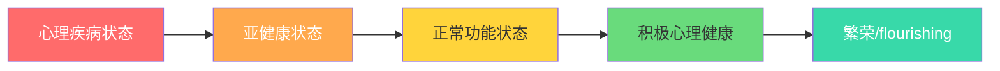
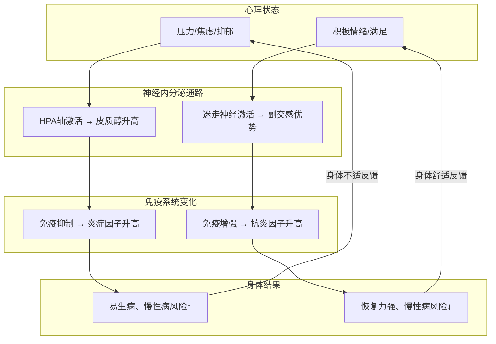
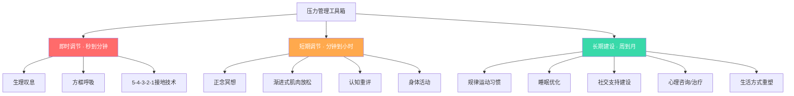
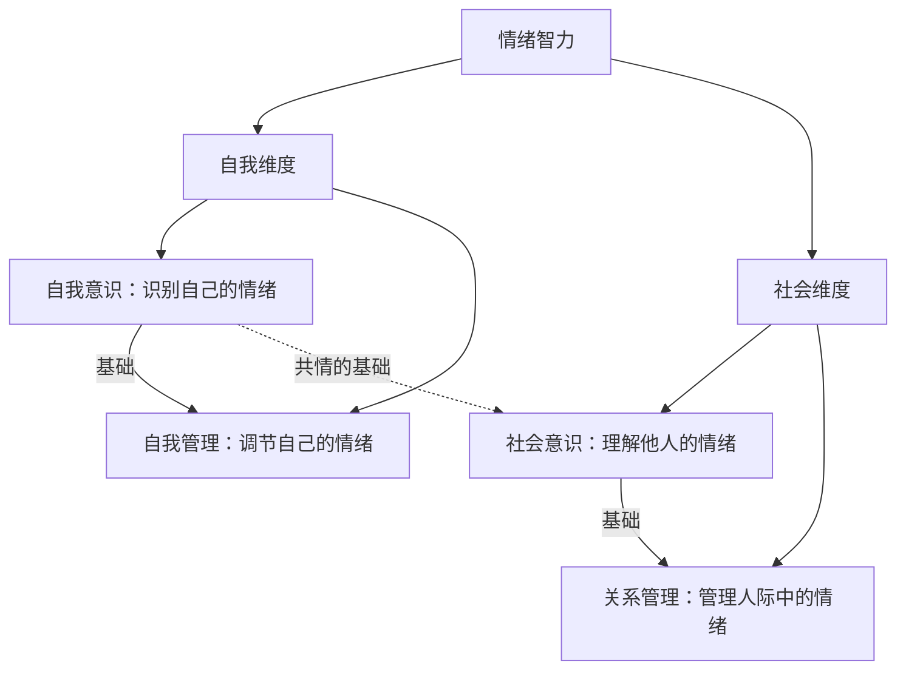
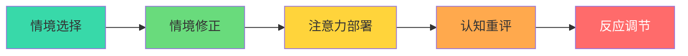
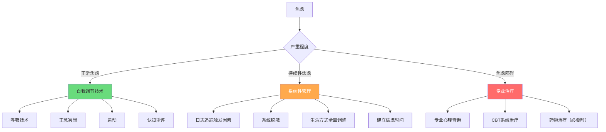
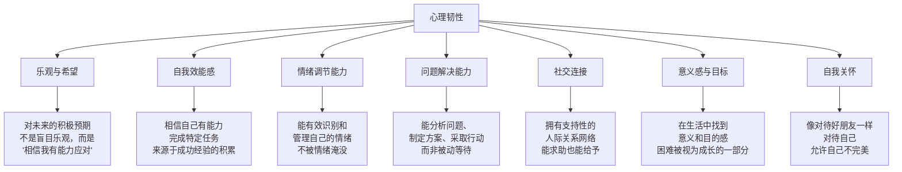

## 五、心理与压力管理

> "没有心理健康，就没有真正的健康。" —— 世界卫生组织

心理健康不是"没有心理疾病"那么简单。它是一种积极的状态：你能感知自己的情绪、有效应对生活压力、有能力工作和学习、能与他人建立有意义的连接。本章从科学机制到日常实操，系统讲解压力的运作原理、管理方法和长期心理韧性的培养路径。

### 5.1 心理健康的重要性

#### 5.1.1 心理健康的完整定义

世界卫生组织（WHO，2022年更新定义）将心理健康定义为："一种良好的状态，在这种状态中，个体认识到自己的能力，能够应对正常的生活压力，能够有成效地工作，并能对社区做出贡献。"

这意味着心理健康是一个连续谱系，而非二元状态：

大多数人在不同时期会在这些状态之间移动。关键不是永远停留在"繁荣"状态，而是拥有从低谷恢复的能力和工具。

#### 5.1.2 心理健康的五个维度

| 维度 | 定义 | 健康表现 | 失调信号 |
|------|------|----------|----------|
| **情绪健康** | 能体验和表达各种情绪，情绪调节能力良好 | 情绪反应适度，能从负面情绪中恢复 | 持续的情绪低落、过度焦虑、情绪麻木 |
| **认知健康** | 思维清晰，注意力集中，记忆力正常 | 能专注工作、理性决策、灵活思考 | 注意力涣散、反复消极思维、决策瘫痪 |
| **社交健康** | 能建立和维持良好的人际关系 | 有信任的朋友、能处理冲突、适度社交 | 社交回避、关系频繁破裂、过度依赖他人 |
| **行为健康** | 行为适应社会规范，能应对日常挑战 | 规律作息、健康习惯、能完成日常任务 | 成瘾行为、自我伤害、回避责任 |
| **意义健康** | 在生活中找到意义和目标 | 有方向感、投入感、价值感 | 存在空虚、无意义感、目标缺失 |

#### 5.1.3 心理与身体的双向通道

心理健康和身体健康不是两个独立系统，而是通过神经、内分泌、免疫三条通路紧密交织。

**关键科学证据**：

- **心理神经免疫学（PNI）** 研究表明，长期心理压力会导致促炎细胞因子（IL-6、TNF-α）水平持续升高，引发慢性低度炎症，这是心血管疾病、糖尿病、阿尔茨海默病的共同土壤
- **安慰剂效应** 的神经影像学研究证实：信念和期望能真实改变大脑的疼痛处理回路，释放内源性阿片类物质
- **心身医学** 领域估计：综合医院门诊中约30%-50%的患者，其主诉的躯体症状与心理因素有直接或间接关联

#### 5.1.4 全球心理健康现状

了解整体数据有助于正视自己的处境——你不是一个人在战斗：

| 指标 | 数据 | 来源 |
|------|------|------|
| 全球抑郁症患者 | 约3.8亿人（2023年） | WHO |
| 全球焦虑症患者 | 约3.01亿人 | WHO |
| 中国抑郁症终生患病率 | 约6.8% | 《柳叶刀·精神病学》2019年 |
| 中国焦虑障碍终生患病率 | 约7.6% | 同上 |
| 心理疾病治疗缺口（全球） | 约75%的中低收入国家患者未获治疗 | WHO 2022年 |
| 抑郁症平均发病年龄 | 首次发作中位年龄约25岁，但越来越年轻化 | 全球疾病负担研究 |
| 职场心理健康问题导致的经济损失 | 全球每年约1万亿美元生产力损失 | WHO |

这些数字说明两点：心理困扰极为普遍，且大多数人没有获得足够帮助。主动学习心理保健知识，本身就是一种重要的自我投资。

### 5.2 压力的科学

#### 5.2.1 什么是压力

压力（stress）是个体对感知到的威胁或挑战的生理和心理反应。这里有一个关键点：**压力的产生不取决于外部事件本身，而取决于个体对事件的评估**。同样一场考试，准备充分的人可能感到"适度紧张以激发潜能"，而准备不足的人则可能感到"灾难性的焦虑"。

**耶基斯-多德森定律（Yerkes-Dodson Law）** 揭示了压力与表现的关系：

| 压力水平 | 表现状态 | 适用场景 |
|----------|----------|----------|
| 过低 | 缺乏动力，注意力涣散，表现平庸 | 需要外部激励或结构化任务 |
| 最优区间 | 高度专注，反应灵敏，创造性强 | 最佳工作/竞技状态 |
| 偏高 | 开始出现焦虑，精细操作下降 | 简单任务仍可胜任 |
| 过高 | 表现急剧下降，可能出现恐慌/冻结 | 任何形式的任务都受影响 |

最优压力水平因任务复杂度而异：**简单任务的最优压力较高，复杂任务的最优压力较低**。这意味着面对复杂问题时，你更需要保持冷静。

**压力的三种类型**：

| 类型 | 定义 | 例子 | 对健康的影响 |
|------|------|------|------------|
| **急性压力** | 短期、明确的压力源引发的反应 | 面试前紧张、交通堵塞中的烦躁 | 通常无害，甚至有益（激发潜能） |
| **间歇性急性压力** | 反复出现的急性压力，频率过高 | 工作中不断被打断、频繁的截止日期压力 | 开始累积损伤，易导致易怒和紧张 |
| **慢性压力** | 持续存在、无明确终点的压力 | 长期经济困难、不和谐的家庭关系、高压工作环境 | 最具破坏性，造成系统性身心损伤 |

区分这三种类型很重要，因为管理策略各不相同：急性压力需要即时调节技巧，间歇性压力需要改变工作方式，慢性压力则需要系统性的生活方式调整。

#### 5.2.2 压力反应的双系统

人体有两个压力应激系统，分别应对不同时间尺度的威胁：

**系统一：交感-肾上腺髓质系统（SAM）——"战斗或逃跑"**

感知威胁
  ↓ (毫秒)
下丘脑激活
  ↓
交感神经系统
  ↓
肾上腺髓质
  ↓
肾上腺素 + 去甲肾上腺素释放
  ↓
生理效应（秒级启动）：
  • 心率加快 → 泵血量增加300%
  • 血压升高 → 肌肉供血增加
  • 瞳孔扩大 → 视觉敏感度提高
  • 支气管扩张 → 氧气摄入增加
  • 血糖升高 → 能量供应充足
  • 消化减慢 → 血液重新分配
  • 疼痛敏感度下降 → 战斗能力增强

**系统二：下丘脑-垂体-肾上腺轴（HPA轴）——"持久战"**

持续性压力感知
  ↓ (分钟级启动)
下丘脑 → 释放CRH（促肾上腺皮质激素释放激素）
  ↓
垂体前叶 → 释放ACTH（促肾上腺皮质激素）
  ↓ (经血液循环,约15-30分钟)
肾上腺皮质 → 释放皮质醇
  ↓
生理效应：
  • 血糖持续升高（糖异生增强）
  • 脂肪分解（脂肪酸释放入血）
  • 免疫功能调节（急性增强→慢性抑制）
  • 抗炎作用（抑制炎症因子）
  • 海马体受影响（长期高水平→神经元损伤）

**关键区别**：SAM系统是快速反应部队，启动快、恢复也快（分钟级）；HPA轴是持久战系统，启动慢但影响深远，长期过度激活会造成累积性损伤。

#### 5.2.3 从急性压力到慢性压力

急性压力是正常的适应性反应——考试前紧张、面试时心跳加速、遇到危险时的警觉。问题出在**慢性压力**：当HPA轴长期被激活，皮质醇水平持续偏高，身体就会出现系统性损伤。

**慢性压力的渐进性影响**：

| 阶段 | 时间跨度 | 生理变化 | 主观感受 |
|------|----------|----------|----------|
| 警觉期 | 数天-数周 | 皮质醇升高，免疫短暂增强 | 紧张但有动力 |
| 抵抗期 | 数周-数月 | 皮质醇持续偏高，免疫开始下降 | 疲劳、易怒、睡眠变差 |
| 衰竭期 | 数月-数年 | 皮质醇可能反而降低（肾上腺疲劳），免疫紊乱 | 情感麻木、慢性疲劳、频繁生病 |

这个三阶段模型来自汉斯·塞利（Hans Selye）的一般适应综合征理论（GAS），是理解慢性压力的核心框架。很多人在抵抗期仍然觉得自己"撑得住"，直到进入衰竭期才意识到问题的严重性——但此时恢复需要的时间会显著延长。

**慢性压力对各系统的影响**：

| 系统 | 具体影响 | 机制 |
|------|----------|------|
| 心血管 | 高血压、动脉硬化、心律失常、心脏病风险↑ | 持续交感激活、血管内皮损伤、促凝状态 |
| 免疫 | 免疫抑制（易感染）或免疫紊乱（自身免疫病） | 皮质醇对免疫细胞的双向调节失调 |
| 消化 | 胃溃疡、肠易激综合征、功能性消化不良 | 肠道血流减少、肠道菌群紊乱、肠-脑轴失调 |
| 代谢 | 腹部脂肪增加、胰岛素抵抗、代谢综合征 | 皮质醇促进脂肪在内脏沉积、糖代谢紊乱 |
| 神经 | 海马体萎缩（记忆下降）、前额叶功能减退（决策力下降） | 皮质醇的神经毒性、神经可塑性降低 |
| 生殖 | 月经紊乱、性欲下降、精子质量降低 | HPG轴被HPA轴抑制 |
| 皮肤 | 痤疮、湿疹加重、银屑病、脱发 | 皮质醇影响皮肤屏障和免疫功能 |

#### 5.2.4 压力的个体差异

同样的压力源，不同人的反应可能天差地别。这种差异来自多个层面：

- **遗传因素**：5-HTTLPR基因多态性影响血清素转运效率，携带短等位基因的人对压力更敏感，但同时也更容易从积极环境中获益（差异敏感性假说）
- **早期经历**：童年期的不良经历（ACEs）会永久改变HPA轴的敏感性设定点。ACEs评分每增加1分，成年后抑郁症风险增加约40%
- **认知评估方式**：将挑战评估为"威胁"还是"成长机会"，直接决定压力反应的性质
- **社会支持**：拥有高质量社会支持的人，面对同等压力时皮质醇反应显著更低
- **文化背景**：东亚文化中更倾向于"躯体化"表达心理压力（如用头痛、胃痛代替"我很焦虑"的表述）

#### 5.2.5 皮质醇的昼夜节律与压力标记

理解皮质醇的正常节律有助于识别压力问题：

正常皮质醇昼夜节律：

含量
 ↑
高 │    ██
   │   ████
   │  ██████
   │ ████████
   │██████████
中 │████████████
   │██████████████
   │████████████████
低 │████████████████████████████
   └──────────────────────────→ 时间
   6am  9am  12pm  3pm  6pm  9pm  12am  3am  6am
        ↑ 峰值（醒后30-45分钟）           ↑ 最低

**皮质醇觉醒反应（CAR）**：醒来后30-45分钟内皮质醇应上升50%-75%。CAR缺失或过高都是HPA轴功能异常的信号：

- **CAR过高**：起床后极度紧张、心跳加速、想到一天的事就焦虑——可能与慢性压力、工作倦怠相关
- **CAR缺失**：起床后极度疲倦、怎么都醒不过来、"睡了等于没睡"——可能与长期压力导致的肾上腺功能减退相关

**自我监测指标**：虽然无法在家测量皮质醇，但可以通过以下指标间接评估压力水平：

| 自我监测指标 | 健康范围 | 警告信号 |
|------------|---------|---------|
| 静息心率 | 60-100次/分（运动员更低） | 持续偏高或不规律 |
| 心率变异性（HRV） | 因人而异，但趋势应稳定或改善 | 持续下降趋势 |
| 睡眠质量 | 入睡<30分钟，夜间醒来≤1次 | 频繁失眠、早醒 |
| 晨起状态 | 醒后15-30分钟内感到清醒 | 持续极度疲倦 |
| 消化功能 | 规律排便，无反复腹胀腹痛 | 应激性腹泻或便秘 |
| 情绪基线 | 大部分时间情绪稳定 | 持续易怒或低落 |

### 5.3 压力管理技术

压力管理不是一个单一技巧，而是一个分层的工具箱。不同场景需要不同工具。

#### 5.3.1 呼吸调节技术

呼吸是唯一既能被自主神经系统控制、又能被意识主动调控的生理功能。通过改变呼吸模式，可以直接"劫持"副交感神经系统，快速降低压力反应。

**技术一：腹式呼吸（横膈膜呼吸）**

这是所有呼吸技术的基础。大多数人平时使用浅表的胸式呼吸，只用了肺容量的1/3。

**具体步骤**：
1. 坐或躺，一只手放在胸部，一只手放在腹部
2. 通过鼻子缓慢吸气4秒，感受腹部向外膨胀（胸部尽量不动）
3. 通过嘴巴缓慢呼气6秒，感受腹部向内收缩
4. 呼气时间应长于吸气时间（这是激活副交感神经的关键）
5. 每分钟呼吸6-10次，持续5-10分钟

**科学原理**：缓慢的深呼吸增加迷走神经张力，提高心率变异性（HRV），这是副交感神经激活的可靠指标。研究显示，每天20分钟的腹式呼吸练习，持续8周，可使静息皮质醇水平下降约15%。

**技术二：4-7-8呼吸法（安德鲁·韦尔博士推广）**

吸气（鼻）→ 4秒
屏息      → 7秒
呼气（口）→ 8秒（发出"呼"声）

重复3-4个循环

**适用场景**：入睡困难、急性焦虑发作、需要快速平静时。屏息阶段让氧气充分进入血液，延长呼气则强力激活副交感神经。

**技术三：方框呼吸法（Box Breathing，美军海豹突击队常用）**

吸气 4秒 → 屏息 4秒 → 呼气 4秒 → 屏息 4秒
   ↑                                    |
   └────────────────────────────────────┘
   
重复4-5个循环，可根据训练水平延长到6-8秒

**适用场景**：需要在高压环境下保持清醒和专注。与其他呼吸法不同，方框呼吸的两个屏息阶段帮助维持二氧化碳和氧气的平衡，不会因过度换气而头晕。

**技术四：生理叹息（Physiological Sigh）**

斯坦福大学安德鲁·休伯曼教授的实验室研究发现了一种最快降低压力的呼吸模式：

快速连续两次短吸气（通过鼻子）→ 一次长呼气（通过嘴巴）

仅需1-3个循环，可在30秒内显著降低皮质醇

**原理**：双吸气能最大程度地打开塌陷的肺泡，增加气体交换面积，随后的长呼气则强力刺激副交感神经。这是目前研究证实的最快的自主神经调节呼吸法。

**技术五：共鸣呼吸（Coherent Breathing）**

吸气 5-6秒 → 呼气 5-6秒
每分钟约5-6次呼吸，持续10-20分钟

**原理**：每分钟5-6次呼吸是心肺系统的"共振频率"，在这个频率下心率变异性达到最大振幅，迷走神经张力最大化。这种呼吸方式不需要计数复杂的秒数，适合长时间练习和日常使用。

**呼吸技术选择指南**：

| 场景 | 推荐技术 | 持续时间 | 见效速度 |
|------|----------|----------|----------|
| 日常练习/预防 | 腹式呼吸或共鸣呼吸 | 10-20分钟/天 | 2-4周建立基线改善 |
| 失眠 | 4-7-8呼吸法 | 3-4个循环 | 即时 |
| 高压工作中 | 方框呼吸 | 4-5个循环 | 1-2分钟 |
| 突发焦虑/恐慌 | 生理叹息 | 1-3次 | 30秒内 |
| 公开演讲前 | 方框呼吸 + 生理叹息 | 各2-3个循环 | 2-3分钟 |
| 长期压力基线调节 | 共鸣呼吸 | 10-20分钟/天 | 4-8周显著改善HRV |
| 需要保持警觉的高压场景 | 方框呼吸 | 4-5个循环 | 1-2分钟 |

#### 5.3.2 冥想与正念

**正念（Mindfulness）的核心定义**：

正念不是"什么都不想"，也不是"放松"。正念是**有意识地、不加评判地关注当下体验**。这个定义中有三个关键词：
- **有意识地**：主动选择注意的对象，而非被动被思绪裹挟
- **不加评判地**：不把体验分类为"好/坏"，只是观察它
- **当下**：注意力锚定在此时此刻，而非回忆过去或担忧未来

**冥想的主要类型**：

| 类型 | 核心方法 | 适合人群 | 主要益处 |
|------|----------|----------|----------|
| 专注冥想 | 将注意力固定在一个对象上（呼吸、烛光、咒语） | 初学者、注意力涣散者 | 提升专注力、平静心绪 |
| 正念冥想 | 觉察所有升起的体验，不加评判，不追随 | 有一定基础者 | 情绪调节、自我觉察 |
| 慈悲冥想 | 向自己和他人发送善意和祝福 | 自我批判重、人际困难者 | 减少自我批评、增强同理心 |
| 身体扫描 | 从头到脚依次觉察身体各部位的感觉 | 身体紧张、失眠者 | 减轻身体紧张、改善睡眠 |
| 行走冥想 | 缓慢行走，觉察每一步的触感和运动 | 坐不住的人、需要活动者 | 将正念融入日常活动 |
| 开放觉知 | 不选择特定对象，觉察所有升起和消失的体验 | 高级练习者 | 深层自我理解、存在感 |

**科学证据（来自随机对照试验和荟萃分析）**：

- **大脑结构变化**：8周正念减压课程（MBSR）后，海马体灰质密度增加（与学习和记忆相关），杏仁核灰质密度降低（与恐惧和压力反应相关），前额叶皮层增厚（与执行功能相关）。这些变化在参与者平均每天练习27分钟的情况下出现
- **皮质醇降低**：2013年发表在《Health Psychology》上的荟萃分析显示，正念冥想使皮质醇水平平均降低约15%-20%
- **炎症标志物**：正念练习者的C反应蛋白（CRP）和IL-6水平显著低于对照组
- **端粒酶活性**：诺贝尔奖得主伊丽莎白·布莱克本的研究显示，3个月密集冥想训练使端粒酶活性提高约30%，暗示冥想可能减缓细胞衰老
- **临床疗效**：对于抑郁症复发预防，正念认知疗法（MBCT）的效果与抗抑郁药物相当（2016年《JAMA Psychiatry》）

**初学者28天冥想计划**：

| 周 | 每日时间 | 练习内容 | 核心目标 |
|----|----------|----------|----------|
| 第1周 | 5分钟 | 呼吸觉察：只关注呼吸的感觉 | 建立习惯 |
| 第2周 | 8分钟 | 呼吸觉察 + 身体感觉 | 扩展觉察范围 |
| 第3周 | 12分钟 | 身体扫描 + 情绪觉察 | 识别情绪模式 |
| 第4周 | 15-20分钟 | 综合正念：呼吸、身体、情绪、思绪 | 建立完整练习 |

**初学者常见问题与应对**：

| 问题 | 原因 | 解决方案 |
|------|------|----------|
| "我根本静不下来" | 正常——觉察到"静不下来"本身就是正念 | 不追求静，接受思绪来去 |
| "总是走神" | 大脑默认模式网络活跃 | 走神→觉察→带回，这个循环就是"练肌肉" |
| "腿麻/背痛" | 姿势问题 | 用椅子或靠垫，不必盘腿 |
| "越练越焦虑" | 可能首次直面压抑的情绪 | 缩短时间，加入身体活动，考虑专业引导 |
| "感觉浪费时间" | 对效果的期望过高 | 把它当投资而非消费，效果在8-12周后显现 |

**将正念融入日常的微练习**：

不需要每天坐20分钟才能练习正念。以下是可以在日常中嵌入的微练习：

1. **正念刷牙**（2分钟）：关注牙刷在牙齿上的触感、牙膏的味道、水的温度
2. **正念等红灯**（1-2分钟）：利用等待时间做3次深呼吸，感受脚踏实地的感觉
3. **正念吃饭**（至少一餐）：放下手机，关注食物的颜色、气味、口感、温度。研究显示正念进食可减少约20%的过量进食
4. **正念步行**（通勤路上5分钟）：感受脚底与地面的接触，注意周围的温度和声音
5. **STOP技术**（30秒）：S=Stop停下，T=Take a breath做一次呼吸，O=Observe观察自己的感受，P=Proceed有意识地继续

#### 5.3.3 渐进式肌肉放松（PMR）

PMR由美国医生埃德蒙·雅各布森于1938年提出，原理是：**通过有意识地紧张然后放松肌肉群，打破"紧张→不知觉→持续紧张"的循环**。

**完整操作流程**（约15-20分钟）：

准备：找一个安静的地方，坐或躺，闭上眼睛

按以下顺序进行（每个部位：紧张5-7秒 → 放松15-20秒）：

1. 双手：握拳 → 松开，感受手指的温暖和沉重
2. 前臂：弯曲手腕向身体方向 → 松开
3. 上臂：弯曲手肘，收紧二头肌 → 松开
4. 前额：皱眉，抬高眉毛 → 松开，感受皮肤变平
5. 眼睛/鼻子：紧闭双眼，皱鼻 → 松开
6. 下颚：咬紧牙关 → 松开，嘴唇微张
7. 颈部：下巴向胸部压（不要转头）→ 松开
8. 肩膀：耸肩向耳朵方向 → 松开，感受肩膀下落
9. 胸部：深吸气屏住 → 缓慢呼出
10. 腹部：收紧腹肌 → 松开
11. 背部：弓起背部 → 松开
12. 大腿：收紧四头肌 → 松开
13. 小腿：脚尖向上勾 → 松开
14. 双脚：脚趾向下蜷曲 → 松开

结束：安静地感受全身放松的感觉1-2分钟

**快速PMR版本**（5分钟，适用于工作间隙）：

只做三个核心区域——肩膀、下巴、双手。这三个部位是日常压力最容易积聚的地方：
1. 耸肩到耳朵 → 保持5秒 → 放松（重复2次）
2. 咬紧牙关 → 保持5秒 → 放松（重复2次）
3. 握紧双拳 → 保持5秒 → 放松（重复2次）
4. 闭眼，深呼吸3次

**PMR的适用场景**：
- **睡前**：可显著缩短入睡时间。研究显示，失眠患者练习PMR后平均入睡时间缩短约20分钟
- **考试/面试前**：快速版本（只做肩膀、下巴、手三个部位）可在5分钟内完成
- **慢性疼痛管理**：PMR有助于打破"疼痛→肌肉紧张→更痛"的恶性循环
- **焦虑症辅助治疗**：临床研究中PMR是焦虑障碍的一线非药物干预之一

#### 5.3.4 认知行为技术（CBT自助）

认知行为疗法是目前循证证据最充分的心理治疗方法之一。其核心假设是：**不是事件本身让你痛苦，而是你对事件的解读（认知）决定了你的情绪和行为反应**。

**认知重构的实操步骤**：

**第一步：识别自动思维**

自动思维是我们在特定情境中自动涌现的想法，通常非常快、非常简短，我们往往意识不到它们的存在就开始产生情绪反应。

练习方法：准备一个"思维记录表"，当出现强烈负面情绪时，立即记录：

| 时间 | 情境（发生了什么） | 情绪（0-100分） | 自动思维（脑海中闪过的想法） |
|------|-------------------|-----------------|--------------------------|
| 周一15:00 | 领导没回复我的邮件 | 焦虑70分 | "他是不是对我的方案不满意" |
| 周三20:00 | 朋友取消了聚会计划 | 失落60分 | "他不想和我玩了" |

**第二步：识别认知扭曲**

常见的认知扭曲模式（戴维·伯恩斯在《伯恩斯新情绪疗法》中总结）：

| 认知扭曲 | 定义 | 例子 | 纠正方法 |
|----------|------|------|----------|
| 灾难化 | 把事情想到最坏的结果 | "面试失败就完了，找不到工作了" | 问：最坏结果是什么？概率多大？能应对吗？ |
| 非黑即白 | 只有完美和失败两个极端 | "没拿第一名就是失败" | 问：1-10分可以打几分？灰色地带在哪里？ |
| 过度概括 | 一次失败→永远失败 | "我又搞砸了，我什么都做不好" | 问：有没有成功的例子？"总是"是真的吗？ |
| 读心术 | 假设知道别人想什么 | "他们一定觉得我很蠢" | 问：有确切证据吗？还有其他可能吗？ |
| 情绪推理 | 因为我觉得X，所以X是真的 | "我感到焦虑，所以一定有危险" | 问：情绪不等于事实 |
| "应该"思维 | 对自己或他人有僵化的规则 | "我应该永远不犯错" | 问：这个规则对朋友也适用吗？ |
| 选择性注意 | 只看到负面信息，忽略正面 | 忽略10个好评，只记住1个差评 | 问：完整的信息是什么？ |
| 贴标签 | 用一个负面标签定义整体 | "我就是个失败者" | 问：一个人能用一个词概括吗？ |

**第三步：质疑与替代**

对识别出的自动思维进行苏格拉底式提问：

原始思维："领导没回复邮件，他一定对我不满意"

质疑：
- 支持这个想法的证据是什么？→ "他以前回复都很快"
- 反驳这个想法的证据是什么？→ "他可能在开会/忙/没看到"
- 这个想法有没有认知扭曲？→ 读心术 + 灾难化
- 如果朋友遇到这种情况，我会怎么对他说？→ "别想太多，等等看"
- 最现实的结果是什么？→ "他可能只是忙"

替代思维："领导可能在忙其他事情，我可以明天再跟进一下。
即使他有意见，也可以直接沟通解决。"

**ABCDE模型**（马丁·塞利格曼的积极心理学框架）：

A（Activating Event）：触发事件 —— 被客户当众批评
     ↓
B（Belief）：信念 —— "我能力不行，所有人都看出来了"
     ↓
C（Consequence）：后果 —— 焦虑、回避客户、失眠
     ↓
D（Disputation）：质疑 —— "这个项目其他部分我做得很好，
                              被批评的是一个具体问题，
                              不代表我整体能力不行"
     ↓
E（Effect）：新效果 —— 焦虑降低，主动找客户确认改进方向

**完整的CBT自助记录模板**：

将以上步骤整合为一张表，用于日常练习：

日期：_______ 时间：_______

1. 情境：发生了什么？
   _______________________________________

2. 情绪：（0-100）
   焦虑___ 愤怒___ 悲伤___ 羞耻___ 其他___

3. 自动思维：
   _______________________________________

4. 认知扭曲类型：_________________________

5. 支持这个想法的证据：___________________

6. 反驳这个想法的证据：___________________

7. 平衡后的想法：_________________________

8. 新的情绪评分：（0-100）
   焦虑___ 愤怒___ 悲伤___ 羞耻___ 其他___

9. 如果采取了行动，记录：_________________

建议每天练习1-2次，坚持2-4周后，很多认知重构会开始自动化进行。

#### 5.3.5 接地技术与急性焦虑应对

当焦虑或恐慌急性发作时，认知技术往往来不及生效——你的前额叶皮层已经被"劫持"了。这时候需要的是快速将你从思维旋涡中拉回现实世界的"接地"技术。

**5-4-3-2-1感官接地法**：

说出你感受到的：
5样能 看到 的东西 → "我看到桌上的杯子、窗外的树..."
4样能 触摸 的东西 → "我能感受到椅子的硬度、衣服的布料..."
3样能 听到 的声音 → "我听到空调声、键盘声..."
2样能 闻到 的气味 → "我闻到咖啡、空气清新剂..."
1样能 尝到 的味道 → "我尝到嘴里的薄荷味..."

**原理**：当大脑被焦虑占据时，主动调用五种感官可以快速激活大脑的"当下处理"网络，抑制默认模式网络（负责反刍思维和担忧）的过度活跃。

**其他快速接地技巧**：

| 技巧 | 操作 | 适用场景 | 原理 |
|------|------|----------|------|
| 冰块握持 | 手握冰块或用冰水洗手 | 恐慌发作 | 强烈的温度刺激"重启"感官系统 |
| 冷水泼面 | 用冰水泼脸（或冷毛巾敷脸） | 极度焦虑 | 激活潜水反射，迅速降低心率 |
| 双脚踩地 | 用力感受双脚踩在地上的压力 | 思绪纷飞 | 将注意力从大脑拉回身体 |
| 命名环境 | 详细描述周围环境的颜色和形状 | 思维反刍 | 前额叶的语言功能重新激活 |
| 数数 | 从100倒数，每次减7 | 思维失控 | 占用工作记忆，挤出焦虑思维 |
| 咀嚼口香糖 | 咀嚼强味口香糖 | 轻度焦虑 | 咀嚼动作激活副交感神经，味觉刺激分散注意力 |

#### 5.3.6 社交支持系统

社交支持不是"有朋友"那么简单。高质量的社会连接是压力管理中最强大、但也最常被低估的缓冲器。

**社交支持的四种类型**：

| 类型 | 定义 | 举例 | 最有效的场景 |
|------|------|------|------------|
| 情感支持 | 关心、理解、共情、无条件接纳 | "我理解你的感受，这确实很难" | 情绪低落、需要被理解时 |
| 信息支持 | 建议、指导、有用的信息 | "我之前遇到类似情况，试试这个方法" | 面对陌生问题需要方向时 |
| 工具性支持 | 实际的物质帮助 | 帮忙接送孩子、借钱应急 | 具体困难需要实际援手时 |
| 陪伴支持 | 一起做事、共同体验 | 一起运动、聚餐、旅行 | 日常压力缓冲、预防孤独 |

**社交孤立的健康危害**：

这不是夸张，而是来自大规模流行病学研究的结论：
- 社交孤立使全因死亡风险增加26%（2015年《Perspectives on Psychological Science》荟萃分析，涵盖340万人数据）
- 社交孤立的健康危害等同于每天吸15支烟，超过肥胖和缺乏运动
- 孤独感使冠心病风险增加29%，中风风险增加32%
- 慢性孤独感会持续激活HPA轴，并下调免疫功能

**建立和维护社交支持的具体方法**：

1. **主动投资关系**：每周至少安排一次与朋友/家人的深度对话（不是泛泛聊天，而是真正分享感受和倾听对方）
2. **加入社群**：基于共同兴趣的社群比纯社交活动更能建立深度连接（读书会、运动俱乐部、志愿者组织）
3. **学会求助**：求助不是软弱，而是信任的表现。很多人际关系的深化就是从一次真诚的求助开始的
4. **设定边界**：高质量的社交需要边界。减少消耗性社交（让你感到被评判、被利用的关系），增加滋养性社交
5. **数字社交的局限**：社交媒体上的"点赞"不等于真正的社交支持。研究显示，被动浏览社交媒体反而增加孤独感。真正的连接需要双向的、有深度的互动

**社交支持质量评估**：

问自己以下问题，如果多数回答为"否"，说明社交支持系统需要加强：

| 问题 | 是/否 |
|------|-------|
| 如果半夜遇到紧急情况，你有至少2个人可以打电话求助？ | |
| 过去一周，你与至少一个人进行过有意义的深度对话？ | |
| 你有一个可以在对方面前展示脆弱而不被评判的人？ | |
| 你参与至少一个基于共同兴趣的社群或活动？ | |
| 你感到被至少一个人真正"看见"和理解？ | |

#### 5.3.7 自然接触

日本在1982年正式提出"森林浴"（Shinrin-yoku）作为国民健康促进项目。这不是简单的"去公园走走"，而是有科学支撑的系统性干预。

**自然环境对生理的影响**：

| 指标 | 自然环境中的变化 | 机制 |
|------|------------------|------|
| 皮质醇 | 降低12%-16%（30分钟） | 副交感神经激活 |
| 血压 | 收缩压降低5-10mmHg | 血管扩张、交感神经抑制 |
| 心率 | 降低3-5bpm | 副交感神经优势 |
| NK细胞活性 | 提升50%以上（1次森林浴后持续7天） | 芳香化合物（植物杀菌素）刺激免疫 |
| 前额叶活动 | 从高活跃转为适度放松 | 注意力恢复理论（ART） |
| 心率变异性（HRV） | 显著提升 | 自主神经平衡改善 |

**具体实践方案**：

- **日常微剂量**：每天户外活动30分钟（步行、骑行、在公园午餐），即使城市绿地也有显著效果
- **周末深度接触**：每周一次，至少2小时在自然环境中（森林、山地、水边）。研究显示每周自然接触≥120分钟是健康效益的显著阈值
- **室内绿色策略**：办公桌上放1-2盆植物（绿萝、虎皮兰等），室内植物可使空气中的皮质醇相关微生物减少约20%
- **自然声音疗法**：鸟鸣、流水声、风声能降低交感神经系统活动约30%。即使在室内播放自然声音，也能产生部分效果
- **日光暴露**：每天至少15分钟自然光暴露（非正午时段），有助于调节昼夜节律和改善情绪

#### 5.3.8 身体活动

运动是压力管理中"投入产出比"最高的干预方式之一。它不是替代其他技术的"可选项"，而是心理健康的基础设施。

**运动改善心理的神经生物学机制**：

有氧运动（30分钟以上）
  ↓
内啡肽释放（天然阿片类物质）→ 疼痛减轻 + 愉悦感
  ↓
BDNF（脑源性神经营养因子）增加 → 海马体神经发生 → 记忆力和学习能力↑
  ↓
血清素和多巴胺合成增加 → 情绪改善 + 动力提升
  ↓
皮质醇调节（急性升高→长期基线下降）
  ↓
GABA（γ-氨基丁酸）活性增强 → 焦虑减轻

**不同运动类型的心理效益**：

| 运动类型 | 主要心理效益 | 推荐频率 | 最小有效剂量 |
|----------|------------|----------|-------------|
| 中等强度有氧（快走、慢跑、游泳） | 抗抑郁、抗焦虑、认知增强 | 5次/周 | 30分钟/次 |
| 高强度间歇训练（HIIT） | 压力耐受力提升、自我效能感 | 2-3次/周 | 15-20分钟/次 |
| 瑜伽 | 焦虑减轻、情绪调节、身心连接 | 2-3次/周 | 30-60分钟/次 |
| 力量训练 | 自信提升、焦虑减轻、自我效能感 | 2-3次/周 | 30分钟/次 |
| 太极/气功 | 压力降低、情绪平衡、注意力改善 | 3-5次/周 | 20-30分钟/次 |
| 团队运动 | 社交连接 + 运动双重效益 | 1-2次/周 | 60分钟/次 |

**运动的心理效益阈值**：
- **最低有效量**：每周150分钟中等强度有氧运动（如快走），即可获得显著的心理健康效益
- **抗抑郁效果**：多项荟萃分析显示，规律运动对轻中度抑郁的疗效与抗抑郁药物相当，对重度抑郁可作为药物的增效手段
- **急性效应**：单次30分钟中等强度运动后，焦虑水平可在运动后即刻降低约20%，效果持续2-4小时

#### 5.3.9 写作与表达性疗法

写作是一种被严重低估的心理保健工具。不需要文采，不需要给别人看，只需要把内心的想法和感受写出来。

**表达性写作（Pennebaker范式）**：

由心理学家詹姆斯·彭尼贝克（James Pennebaker）在1980年代开发，是目前研究最充分的写作疗法之一。

**操作方法**：
1. 连续4天，每天写15-20分钟
2. 写关于你生活中最困扰/最有压力的经历或感受
3. 写的时候允许自己完全自由地表达——可以写愤怒、悲伤、恐惧，不用担心逻辑或语法
4. 每次写完后可以保留或销毁，不重要
5. 重要的是过程，不是结果

**科学证据**：在超过200项研究中，表达性写作被证实能：
- 减少就医次数（6个月内减少约43%）
- 改善免疫功能（T细胞活性增加）
- 降低焦虑和抑郁症状
- 改善睡眠质量
- 降低血压

**原理**：将情绪体验转化为文字的过程，强迫大脑使用前额叶的语言功能来组织和理解经历。这本身就是一个"认知加工"过程——混乱的情绪被赋予了结构和意义。

**其他有益的写作形式**：

| 写作形式 | 方法 | 主要效益 | 建议频率 |
|----------|------|----------|----------|
| 感恩日记 | 每天写3件感恩的事 | 积极情绪增加、抑郁减少 | 每天5分钟 |
| 情绪日记 | 记录当天的情绪波动和触发因素 | 情绪自我觉察、模式识别 | 每天3-5分钟 |
| 自由书写 | 设定时间，不间断地写下脑中所有想法 | 清空思绪、减轻心理负荷 | 需要时，10-15分钟 |
| 未来自传 | 以未来的口吻写"一切都顺利"的人生 | 增强希望感和目标感 | 每周1次，20分钟 |
| 宽恕信（不寄出） | 写给伤害过你的人，表达感受和选择释放 | 减少怨恨对自身的消耗 | 需要时，不限时长 |

**关于感恩日记的特别说明**：

感恩练习听起来像"鸡汤"，但它有着严肃的科学基础。罗伯特·埃蒙斯（Robert Emmons）的随机对照实验证实，连续10周写感恩日记的参与者比对照组：
- 乐观程度提高25%
- 锻炼频率增加33%
- 身体不适症状减少
- 对生活整体满意度更高

但有一个重要限制：**如果感恩练习让你感到被迫或虚假，暂停它**。研究也发现，当人们感到"被要求"感恩时，效果会消失甚至产生反效果。关键是找到适合自己的表达方式。

#### 5.3.10 心率变异性（HRV）生物反馈训练

HRV（心率变异性）是目前压力管理和自主神经功能评估中最受关注的生理指标之一。好消息是，普通人也可以利用它来训练自己的压力调节能力。

**什么是HRV**：

心脏并非以恒定速率跳动——每次心跳之间的间隔略有不同。这种变异性就是HRV。**HRV越高，通常意味着自主神经系统越灵活，压力适应能力越强**。

低HRV（压力/疲劳状态）：
心跳间隔：|1.0s|1.0s|1.0s|1.0s|  → 高度规律 → 自主神经僵化

高HRV（放松/恢复状态）：
心跳间隔：|0.9s|1.1s|0.95s|1.05s| → 自然波动 → 自主神经灵活

**HRV的科学意义**：

| HRV水平 | 通常关联 | 建议 |
|---------|---------|------|
| 高于个人基线 | 充分恢复、压力耐受力好 | 可以接受挑战和高强度训练 |
| 接近个人基线 | 正常状态 | 维持日常节奏 |
| 显著低于基线 | 压力积累、恢复不足 | 优先休息和恢复性活动 |
| 持续低于基线超过一周 | 可能需要关注 | 检查生活方式，考虑专业评估 |

**如何测量HRV**：

| 工具 | 精度 | 价格 | 使用方式 |
|------|------|------|----------|
| 胸带式心率带（Polar H10） | 金标准 | ¥300-500 | 配合App使用，运动和静息均可 |
| 智能手表（Apple Watch、Garmin等） | 良好 | ¥1000-5000+ | 自动监测，适合长期追踪 |
| 手指传感器（如Elite HRV） | 良好 | ¥100-300 | 每天晨起静息测量1-3分钟 |
| 手机App（如HRV4Training） | 中等 | 免费-¥50 | 用手机摄像头测指尖脉搏 |

**HRV生物反馈训练步骤**：

1. **建立基线**：连续7天每天晨起测量HRV，取平均值作为个人基线
2. **共振频率呼吸**：以每分钟5-6次的频率呼吸（吸5-6秒，呼5-6秒），持续10分钟
3. **实时反馈**：使用HRV App观察呼吸频率与HRV峰值的关系，找到你的"共振频率"（每个人的最优呼吸频率略有不同，通常在4.5-6.5次/分钟之间）
4. **日常练习**：每天以自己的共振频率呼吸10-20分钟
5. **追踪趋势**：4-8周后，晨起静息HRV应呈现上升趋势

### 5.4 情绪调节

情绪本身不是问题。恐惧让你远离危险，愤怒帮你维护边界，悲伤帮你处理丧失。问题出在**情绪调节失调**：情绪太强烈、持续太久、或者与情境不匹配。

#### 5.4.1 情绪智力（EQ）

丹尼尔·戈尔曼提出的情绪智力模型包含四个核心能力：

**自我意识的培养方法**：
- **情绪日记**：每天记录3次情绪状态（早/中/晚），用具体词汇描述（不只是"不好"，而是"失望""焦虑""无聊"——精确的命名本身就是调节的开始）
- **身体信号觉察**：每种情绪都有身体信号——焦虑常表现为胸闷、胃部收紧；愤怒常表现为面部发热、肌肉紧绷；悲伤常表现为喉咙堵塞感、胸口沉重
- **情绪颗粒度训练**：研究显示，能用更精细的词汇描述情绪的人，情绪调节能力更强。尝试区分"焦虑"和"不安""紧张""恐惧""担忧"之间的差异

**情绪词汇表（提升情绪颗粒度）**：

| 基础情绪 | 细分词汇 | 对应的身体感受 |
|----------|----------|--------------|
| 焦虑 | 担忧、不安、紧张、恐惧、惊慌、心慌、如坐针毡 | 胸闷、心跳加速、手心出汗、胃部收紧 |
| 愤怒 | 恼火、烦躁、愤慨、暴怒、怨恨、委屈、不公平感 | 面部发热、肌肉紧绷、下巴收紧、拳头紧握 |
| 悲伤 | 心酸、失落、惆怅、哀伤、孤独、遗憾、心碎 | 喉咙堵塞、胸口沉重、全身无力、眼眶发热 |
| 快乐 | 满足、感恩、兴奋、自豪、欣慰、平静、充实 | 全身放松、嘴角上扬、胸口温暖、精力充沛 |
| 羞耻 | 尴尬、难为情、自卑、愧疚、自责、无地自容 | 面部发热、想躲避视线、全身紧缩 |

能够精确地命名情绪，本身就是一种调节能力——这被称为"情感标记效应"（affect labeling）。UCLA的马修·利伯曼（Matthew Lieberman）的fMRI研究证实，当人们用词语命名情绪时，杏仁核（恐惧和情绪反应中心）的活动会降低，而前额叶皮层（理性调控区域）的活动会增加。

#### 5.4.2 情绪调节策略（基于James Gross的过程模型）

情绪调节有不同的切入点，越早介入，需要的认知资源越少：

| 策略 | 定义 | 举例 | 效果 | 认知成本 |
|------|------|------|------|----------|
| 情境选择 | 主动选择进入或回避特定环境 | 知道自己酒后控制力差，选择不去酒局 | 高 | 低 |
| 情境修正 | 改变引发情绪的环境因素 | 考试前换到安静的房间复习 | 高 | 中 |
| 注意力部署 | 将注意力从负面刺激转向中性/正面刺激 | 等待手术结果时做填字游戏 | 中 | 低-中 |
| 认知重评 | 改变对事件的解释方式 | "被拒绝不代表我不够好，只是不匹配" | 高 | 中 |
| 反应调节 | 直接调节已产生的情绪反应 | 压抑愤怒的表情、用深呼吸平复心跳 | 中 | 高（长期有代价） |

**关键发现**：认知重评是研究证实的最健康、最有效的情绪调节策略。长期使用"反应调节"（特别是情绪压抑）则与更高的焦虑、抑郁和身体不适相关——因为压抑不是消除，情绪被压下去后仍在身体里积累。

**接纳与承诺疗法（ACT）的核心理念**：

除了"改变想法"，还有一种重要策略是"接纳体验"。ACT的核心观点：

1. **认知解离**：你不是你的想法。"我很失败"是一个念头，不是事实。练习：把想法加上前缀——"我注意到我正在想'我很失败'"
2. **接纳**：痛苦是人生的一部分。试图消除所有痛苦反而会制造更多痛苦（反弹效应）。接纳不等于认可或屈服，而是停止与不可改变的现实作无效的内耗
3. **价值导向行动**：即使在痛苦中，你仍然可以按照自己的价值观行动。问自己："如果焦虑不再束缚我，我会去做什么？"然后去做

#### 5.4.3 愤怒管理

愤怒是最容易导致破坏性行为的情绪。但愤怒本身不是敌人——它是一个信号，告诉你某个重要的边界被侵犯了。

**愤怒的生理特点**：
- 愤怒是所有情绪中生理激活最强的（心率、血压、肌肉张力同时飙升）
- 从愤怒触发到生理恢复需要20-30分钟
- "在愤怒中做决定"几乎总是在生理峰值时做出的，几乎总是后悔

**愤怒管理的"TIIP"模型**：

T（Time out）：暂停 —— 在愤怒峰值时离开现场，给自己至少20分钟冷却
I（Identify）：识别 —— 识别愤怒背后的真实需求/感受
    • 愤怒常常是"二级情绪"，掩盖着更深的感受
    • "我生他的气"背后可能是"我感到被忽视/不被尊重/失望"
I（Investigate）：探究 —— 问自己"对方的意图真的如我想象的那样吗？"
P（Problem solve）：解决问题 —— 冷静后，用"我"陈述表达感受和需求
    • ✗ "你总是不听我说话！"
    • ✓ "当我说话被打断时，我感到不被尊重。我希望我们能轮流说完。"

**愤怒的即时降温技巧**：

| 技巧 | 操作 | 原理 | 适用程度 |
|------|------|------|----------|
| 数到10（或100） | 在回应前慢慢数数 | 给前额叶时间重新获得控制权 | 轻度-中度 |
| 冷水刺激 | 用冷水冲手腕或洗脸 | 激活潜水反射，降低心率 | 中度-高度 |
| 剧烈运动 | 快走、俯卧撑、跑步 | 消耗愤怒产生的多余能量 | 中度-高度 |
| 写下来（不发出去） | 把愤怒的想法全写出来 | 情绪外化，同时避免冲动表达 | 所有程度 |
| 换位书写 | 从对方的角度写这件事 | 认知灵活性训练 | 冷却后 |

**一个关于愤怒的常见误解**："发泄愤怒（打枕头、尖叫）能释放情绪"——这是弗洛伊德时代的"液压模型"，已被现代研究推翻。1999年布什曼（Bushman）的经典实验证实：发泄愤怒的人比什么都不做的人随后表现出更强的攻击性。有效的不是"释放"，而是**冷却+认知重构**。

#### 5.4.4 悲伤与丧失的处理

悲伤不是需要被"修好"的问题，而是对丧失的自然反应。但有些方式能让这个过程更健康。

**悲伤的阶段模型（库布勒-罗斯，注意：不是线性的）**：

否认 → 愤怒 → 讨价还价 → 抑郁 → 接受

  注意：这五个阶段不一定按顺序出现
  可能反复、跳跃、同时存在
  没有"正确"的时间表
  接受不等于"忘记"或"不再悲伤"

**健康悲伤 vs. 需要关注的悲伤**：

| 健康的悲伤过程 | 需要专业帮助的信号 |
|---------------|------------------|
| 悲伤程度逐渐（非线性）减轻 | 6个月后悲伤强度未见任何减轻 |
| 能间歇地体验到积极情绪 | 完全无法体验任何积极情绪 |
| 能基本维持日常功能 | 无法工作、自理或维持基本生活 |
| 能谈论逝者/失去的东西 | 完全回避提及或持续无法谈论 |
| 悲伤中包含温暖的记忆 | 只有痛苦，没有任何温暖回忆 |
| 接受丧失的事实 | 持续否认或强烈的"不该如此" |

**支持悲伤中的人——该做什么和不该做什么**：

| ✗ 不要说 | ✓ 可以说/做 |
|-----------|------------|
| "别难过了" "要坚强" | "我在这里陪你" "你可以哭" |
| "时间会治愈一切" | "你现在的感受是完全正常的" |
| "至少他/她不再痛苦了" | "这真的太难了" |
| "我理解你的感受" | "我没法完全理解你的感受，但我想陪着你" |
| "你应该……" | "你需要什么？" |
| 只在最初几周联系 | 3个月后、半年后仍然主动关心 |

#### 5.4.5 焦虑的分级管理

焦虑是最常见的心理困扰。根据严重程度不同，需要的策略也不同：

**焦虑的分级应对框架**：

**"焦虑时间"技术**：

这是一种由临床心理学家验证的有效自助技术，特别适合慢性焦虑者：

1. 每天设定一个固定的"焦虑时间"（例如下午5:00-5:15），15分钟
2. 白天出现焦虑时，不要试图压制，而是简单记录："5点再想"
3. 到了焦虑时间，坐下来认真思考和处理这些担忧
4. 15分钟到了就结束——即使没想完

**原理**：焦虑的一大问题是它随时入侵你的注意力。"焦虑时间"不是消除焦虑，而是给它一个"容器"——你知道焦虑会被处理，所以白天可以安心做其他事情。研究显示，4周后约50%的人发现他们的焦虑时间"用不完"——因为很多担忧到时间后已经自行消解了。

**焦虑的系统脱敏**：

对于特定焦虑（社交焦虑、特定恐惧等），回避只会让焦虑更强大。系统脱敏是一种循序渐进面对恐惧的方法：

1. **列出焦虑等级**：将焦虑情境按0-100评分
   社交焦虑示例：
   0分  = 和家人聊天
   20分 = 和熟悉同事闲聊
   40分 = 在小组中发言
   60分 = 参加陌生人的聚会
   80分 = 做公开演讲
   100分 = 即兴演讲 + 回答尖锐提问

2. **从最低等级开始**：先在安全环境中练习（想象暴露），然后在现实中实践
3. **每次暴露保持到焦虑自然下降**：焦虑像波浪，会升起也会下降。如果每次都在焦虑峰值时逃跑，大脑就学到"逃跑=安全"，焦虑会越来越强
4. **逐步升级**：当某个等级的焦虑减半后，进入下一等级

#### 5.4.6 培养积极情绪

压力管理不只是"减少负面"，也需要"增加积极"。芭芭拉·弗雷德里克森（Barbara Fredrickson）的"拓展-建构理论"指出，积极情绪能拓宽思维和行动范围，建构持久的个人资源。

**关键发现**：积极情绪与负面情绪的比率达到约3:1时，个人会进入"繁荣"状态。这意味着不是消除所有负面情绪（不可能也不健康），而是在负面情绪的基础上增加积极情绪的频率和深度。

**培养积极情绪的科学方法**：

| 方法 | 操作 | 积极情绪类型 | 每周建议 |
|------|------|------------|---------|
| 品味练习 | 有意识地延长和放大积极体验（吃一顿好饭时放下手机，全神贯注地享受） | 愉悦、满足 | 每天至少1次 |
| 善行练习 | 每周做3-5件"刻意的善事"（给同事买咖啡、帮陌生人开门） | 温暖、自豪 | 3-5次/周 |
| 最佳自我想象 | 详细写下未来理想中"一切顺利"的一天 | 希望、乐观 | 每周1次 |
| 发现优势 | 通过VIA性格优势测试找到自己的核心优势，每周有意识地运用 | 自豪、投入感 | 每天1次 |
| 自然审美 | 有意识地注意和欣赏美——日落、建筑、音乐 | 敬畏、感恩 | 每天1次 |
| 心流活动 | 投入一件"挑战与技能匹配"的活动 | 投入、满足 | 每周2-3次 |

### 5.5 心理韧性

心理韧性（Resilience）不是天生的性格特质，而是可以培养的能力。美国心理学会（APA）将其定义为："面对逆境、创伤、悲剧、威胁或其他重大压力时良好适应的过程。"

#### 5.5.1 韧性的构成要素

#### 5.5.2 培养心理韧性的系统方法

**第一层：日常基础习惯**

这些习惯是韧性的"基础设施"，不需要任何心理技巧，只需要持续执行：

- **规律睡眠**：睡眠不足（<6小时）使情绪调节能力下降约60%。保持固定的睡眠和起床时间是韧性最基础的保障
- **规律运动**：每周至少150分钟中等强度运动。运动不仅改善情绪，还增强了"我能掌控自己的身体"的自我效能感
- **营养均衡**：肠道产生约95%的血清素。地中海饮食模式（高蔬果、高omega-3、低加工食品）与更低的抑郁风险相关
- **限制酒精和咖啡因**：酒精是中枢神经系统抑制剂，短期"放松"长期加重焦虑；咖啡因过量（>400mg/天）可触发焦虑症状

**第二层：认知与情绪技能**

- **成长型思维**（卡罗尔·德韦克）：将困难视为学习机会而非能力缺陷的证据。"我还没学会"和"我学不会"只差几个字，但导向完全不同的人生
- **心理灵活性**：能根据情境灵活切换策略，而非固守一种应对方式。能坚持也能放手，能行动也能等待
- **自我关怀**（克里斯汀·内夫）：包含三个成分——自我友善（而非自我批判）、共通人性（痛苦是人类共同体验，不是只有我倒霉）、正念觉知（不被情绪淹没）。练习：当你犯错时，想想你会对一个好朋友说什么，然后把这些话说给自己听
- **意义构建**：维克多·弗兰克尔在纳粹集中营中发现，有明确意义感的人存活率更高。问自己："这段经历能教会我什么？""我想成为怎样的人？"

**第三层：危机应对策略**

当遭遇重大压力事件（失业、离婚、重病、亲人离世等）时：

1. **允许自己痛苦**：不要强迫自己"振作起来"。悲伤和痛苦是正常的反应，压制它们反而会延长恢复时间
2. **维持基本结构**：即使感觉天塌了，也尽量保持基本的作息和饮食。身体是情绪恢复的载体
3. **一次只做一件事**：在危机中不要试图同时解决所有问题。问自己："今天最重要的、我能做的一件事是什么？"
4. **寻求专业帮助**：如果持续两周以上无法正常工作/生活，出现失眠、食欲大幅变化、无法集中注意力、反复出现创伤记忆等症状，应当寻求专业心理咨询或精神科帮助。这不是软弱，而是智慧
5. **创伤后成长**：研究显示，约50%-60%经历重大创伤的人报告在创伤后经历了某种形式的个人成长——更深的人际关系、更强的个人力量、新的可能性、更大的感恩之心、更深层的精神生活。这不是说创伤是好事，而是说人类有在废墟上重建的能力

#### 5.5.3 中国传统智慧中的心理韧性资源

中国文化中有丰富的心理韧性资源，值得在现代科学框架下重新审视：

| 传统资源 | 核心理念 | 现代对应概念 | 实践方法 |
|----------|----------|------------|----------|
| 儒家"知命" | 尽人事，听天命 | 控制感二分法（可控vs不可控） | 区分自己能控制和不能控制的事情 |
| 道家"无为" | 顺应自然，不过度干预 | 心理灵活性、接纳 | 在无法改变的事情上减少内耗 |
| 佛家"无常" | 一切都在变化 | 认知解离、情绪暂时性 | 提醒自己"这也会过去" |
| 中医"七情" | 情志与脏腑相互影响 | 心身医学 | 通过调节身体状态改善情绪 |
| "塞翁失马" | 祸福相依 | 认知重评 | 从多个角度看待同一事件 |
| "天将降大任" | 困难是成长的必经之路 | 创伤后成长 | 在逆境中寻找成长的机会 |

### 5.6 睡眠与心理健康

睡眠不是"休息"那么简单——它是大脑进行情绪调节、记忆巩固和废物清除的关键时段。睡眠与心理健康之间存在双向因果关系：睡眠不好加重心理问题，心理问题又破坏睡眠。

#### 5.6.1 睡眠剥夺对心理的影响

**一个关键实验**：加州大学伯克利分校的马修·沃克（Matthew Walker）团队发现，一晚完全睡眠剥夺后：
- 杏仁核（情绪反应中心）对负面刺激的反应性增加约60%
- 前额叶皮层与杏仁核之间的连接显著减弱
- 这意味着：睡眠不足时，情绪反应更强烈，而理性控制更弱——这是一个危险的组合

**睡眠不足的心理代价**：

| 睡眠时长 | 认知影响 | 情绪影响 | 长期风险 |
|----------|----------|----------|----------|
| 7-9小时（推荐） | 正常认知功能 | 情绪调节良好 | 基线风险 |
| 6小时 | 注意力下降约25% | 易怒增加 | 抑郁风险增加约2倍 |
| 5小时 | 决策能力显著下降 | 情绪波动加大 | 焦虑症风险增加 |
| <5小时 | 认知功能接近醉酒状态 | 极度易怒、情绪失控 | 精神疾病风险显著增加 |

#### 5.6.2 改善睡眠的心理行为策略

**认知行为治疗失眠（CBT-I）的核心技术**：

CBT-I是目前治疗失眠的一线推荐方法（优于安眠药），包含以下组件：

1. **睡眠限制**：不是睡不着就躺着——计算实际睡眠效率（睡着时间/躺在床上时间），如果<85%，减少卧床时间到只比实际睡着时间多30分钟
2. **刺激控制**：床只用于睡觉。睡不着超过20分钟就起来，做些无聊的事（不看屏幕），困了再回去
3. **认知重构**：消除对失眠的灾难化思维（"今晚睡不好明天就完了"）——实际上人体有很强的补偿能力，一两晚睡不好不会真正影响你的表现
4. **睡眠卫生**：固定起床时间（比固定入睡时间更重要）、卧室温度18-20°C、暗光环境、睡前1小时避免蓝光

**快速入眠技巧**：
- **4-7-8呼吸法**（见5.3.1节）：3-4个循环通常能引发睡意
- **认知转移法**：想象一个与睡眠无关的平静场景（如在湖边散步），尽量详细地想象画面、声音、触感。这比"什么都不想"更有效
- **矛盾意向法**：告诉自己"保持清醒，不要睡"——这消除了"必须睡着"的压力，反而更容易入睡
- **渐进式肌肉放松**（见5.3.3节）：15分钟全身放松序列

### 5.7 职业倦怠预防与应对

职业倦怠（Burnout）已被世界卫生组织纳入ICD-11国际疾病分类，定义为：由未被成功管理的长期工作场所压力导致的综合征。

#### 5.7.1 倦怠的三个维度

| 维度 | 定义 | 典型表现 |
|------|------|----------|
| **情感耗竭** | 感到情感资源被完全消耗 | "我再也给不了了""每天上班像上坟" |
| **去人格化** | 对工作对象产生冷漠、疏离的态度 | 对客户/学生/患者感到厌烦、讽刺 |
| **个人成就感降低** | 感到自己无法胜任、工作没有意义 | "我做的这些有什么用""反正也没人在乎" |

**倦怠的渐进信号**（按出现顺序）：

早期信号（容易被忽略）：
  • 对工作热情下降，"周日恐惧症"
  • 下班后持续想着工作
  • 睡眠质量下降
  • 需要更长时间才能"进入状态"

中期信号（开始影响功能）：
  • 持续性疲劳，周末休息也恢复不过来
  • 频繁生病（感冒、头痛、胃痛）
  • 对同事/客户失去耐心
  • 开始用酒精/咖啡/零食应对
  • 拖延症加重

晚期信号（需要立即干预）：
  • 情感麻木，对任何事都提不起兴趣
  • 严重的自我怀疑
  • 社交回避（包括与家人）
  • 出现抑郁或焦虑症状
  • 频繁出现"辞职/逃离"的想法

#### 5.7.2 倦怠的系统性应对

倦怠不是"休息一下"就能解决的——它是工作环境、个人特质和应对方式三者交互作用的结果。

**个人层面的应对策略**：

| 策略 | 操作方法 | 原理 |
|------|---------|------|
| 工作边界设定 | 明确工作时间和非工作时间，下班后不查看工作消息 | 恢复需要真正的"心理脱离" |
| 工作意义重建 | 重新连接工作与个人价值——"我的工作帮助了谁？" | 意义感是对抗倦怠的最强保护因素 |
| 微恢复策略 | 工作间隙进行5分钟恢复活动（呼吸、散步、与同事闲聊） | 频繁的短暂恢复优于偶尔的长假 |
| 优势对齐 | 将工作内容尽可能向自己的核心优势靠拢 | 用优势工作时消耗更少、产出更多 |
| 减少决策疲劳 | 简化非关键决策（饮食、穿着、日常安排） | 保存认知资源给重要决策 |

**组织/环境层面的改变**（如果你有影响力的话）：

| 因素 | 理想状态 |
|------|---------|
| 自主性 | 对工作方式、时间、进度有一定控制权 |
| 反馈 | 能看到自己工作的结果和影响 |
| 公平感 | 薪酬、晋升、资源分配公正透明 |
| 工作量 | 可管理的范围内，有完成的可能 |
| 社群感 | 同事之间有信任和支持 |
| 价值观一致 | 个人价值观与组织价值观不冲突 |

如果以上6个因素中有3个以上长期不满足，倦怠几乎不可避免——这时候可能需要考虑改变环境，而非仅仅调整自己。

### 5.8 数字时代心理健康

数字技术不是敌人，但无意识地使用它会系统性地损害心理健康。

#### 5.8.1 社交媒体对心理的影响

**关键研究发现**：

- **上行社会比较**：浏览他人精心策划的"精彩生活"时，人会不自觉地进行向上比较，导致自尊下降和抑郁情绪增加
- **被动使用vs主动使用**：被动浏览（刷信息流）显著增加孤独感和抑郁；主动使用（与朋友互动、私信聊天）则有益心理健康
- **FOMO（错失恐惧）**：看到别人在做有趣的事而自己没有参与时产生的焦虑，是社交媒体特有的压力源
- **睡眠干扰**：睡前使用社交媒体与睡眠质量差直接相关——蓝光抑制褪黑素+情绪激活延迟入睡

**健康的数字使用策略**：

| 策略 | 操作方法 | 效果 |
|------|---------|------|
| 屏幕时间限制 | 设置每日社交媒体使用上限（建议≤30分钟/天） | 减少20%的孤独感和抑郁（宾夕法尼亚大学2018年研究） |
| 睡前数字宵禁 | 睡前1小时不使用任何屏幕 | 改善入睡时间和睡眠质量 |
| 消息通知管理 | 关闭所有非必要通知，只在固定时间查看消息 | 减少注意力碎片化和焦虑 |
| 定期数字断食 | 每月1-2天完全不使用社交媒体 | 重置使用习惯，评估真实依赖程度 |
| 关注列表清理 | 取关让你感到焦虑/自卑/愤怒的账号 | 减少信息环境中的"毒素" |
| 主动替代 | 用主动活动（阅读、运动、面对面社交）替代被动浏览 | 将时间从"消耗"变为"投资" |

### 5.9 常见误区与纠正

| 误区 | 为什么是错的 | 正确认识 |
|------|------------|----------|
| "压力全是坏事" | 适度压力（良性压力）提高表现和动力 | 关键是管理，不是消除。目标是将压力控制在最优区间 |
| "坚强的人不需要心理帮助" | 寻求帮助是智慧和勇气的表现 | 身体生病看医生，心理受困找咨询师，逻辑一致 |
| "冥想就是放空/什么都不想" | 正念是有意识地觉察，不是大脑关机 | 走神→觉察→带回，这个循环才是练习的核心 |
| "只要意志力够强就能克服压力" | 意志力是有限资源，靠意志力硬扛会加速耗竭 | 建立系统和习惯，而非依赖意志力 |
| "心理问题等于心理疾病" | 心理问题人人都有，疾病是有诊断标准的特定状态 | 早关注、早调节，可以预防小问题发展为疾病 |
| "忙碌=充实=心理健康" | 过度忙碌可能是回避内心问题的方式 | 问自己：如果突然闲下来，你会感到什么？ |
| "社交越多越好" | 关键是质量，不是数量。少数深度连接 > 大量浅层社交 | 投资3-5段高质量关系 |
| "压力大就该放松/休假" | 休假只能暂时缓解，回来后压力依旧甚至堆积 | 需要改变压力的源头（认知、行为或环境） |
| "发泄愤怒（打枕头/尖叫）能释放情绪" | 已被研究推断——发泄后攻击性反而增强 | 有效的是冷却+认知重构，不是物理发泄 |
| "心理咨询=有精神病" | 心理咨询是心理健康维护工具，不是疾病治疗专属 | 顶级运动员有心理教练，企业家有管理顾问，心理咨询同理 |
| "吃药说明我很严重/很弱" | 神经递质失衡是生理问题，药物是纠偏工具 | 糖尿病打胰岛素不丢人，抑郁症用药同理 |
| "别人比我还惨，我没资格难过" | 痛苦不需要"够惨"才值得被承认 | 痛苦没有比较级——你的痛苦就是你的痛苦 |

### 5.10 实操模板

#### 5.10.1 每日心理保健清单

以下是一个可以在日常生活中执行的心理保健框架：

晨间（5-10分钟）：
□ 3分钟正念呼吸或冥想
□ 设定今天的一个意图（"今天我想要______"）
□ 感恩练习：想3件感恩的事（具体的，不是泛泛的）

白天（融入日常）：
□ 工作间隙做3次生理叹息（30秒）
□ 午餐后15分钟户外散步
□ 检查情绪状态（如果有强烈情绪，用思维记录表记录）
□ 与一个你关心的人进行有意义的对话

傍晚（10-15分钟）：
□ 30分钟运动（任何形式）
□ 回顾今天的3个"小成就"（不一定要大事）

睡前（10-15分钟）：
□ 放下电子设备（至少睡前30分钟）
□ 渐进式肌肉放松或身体扫描
□ 如果思绪纷乱，写下明天的待办事项，然后"放下"
□ 4-7-8呼吸法入睡

#### 5.10.2 压力自我评估问卷

每月进行一次，追踪自己的压力状态：

对以下每项评分（0=完全不符合，4=完全符合）：

过去一个月，我：

情绪方面：
___ 感到紧张或焦虑
___ 感到情绪低落或沮丧
___ 容易发火或不耐烦
___ 对事情提不起兴趣

身体方面：
___ 睡眠质量下降
___ 肌肉紧张或疼痛（肩颈、头部）
___ 消化问题（胃痛、腹泻、便秘）
___ 疲劳感持续存在

认知方面：
___ 注意力难以集中
___ 反复出现消极想法
___ 做决定变得困难
___ 记忆力下降

行为方面：
___ 社交活动减少
___ 用食物/酒精/手机来应对
___ 工作效率下降
___ 拖延增多

总分：___/64

0-16分：压力在可控范围内
17-32分：压力中等，需要关注和主动管理
33-48分：压力较高，建议系统性调整生活方式
49-64分：压力严重，强烈建议寻求专业帮助

#### 5.10.3 急性压力应对流程图

当突然遇到重大压力事件（被裁员、亲人病重、关系破裂等）时，按以下流程操作：

第1步：即时稳控（0-30分钟）
├── 做3次生理叹息
├── 喝一杯温水
├── 如果可能，离开压力现场
└── 打电话给你最信任的人

第2步：基本需求检查（30分钟-2小时）
├── 你吃过东西了吗？→ 吃点东西
├── 你喝过水了吗？→ 喝水
├── 你安全吗？→ 去一个安全的地方
└── 你有需要立即联系的人吗？→ 联系

第3步：情绪处理（当天-3天）
├── 允许自己有任何感受（不要评判）
├── 写下你的感受（不修饰，不逻辑化）
├── 保持基本作息（即使很难）
└── 继续联系你信任的人

第4步：问题解决（3天-2周）
├── 评估情况：什么是可控的？什么是不可控的？
├── 对可控的部分：列出3个可能的行动方案
├── 对不可控的部分：练习接纳（"这不是我能改变的"）
└── 必要时寻求专业帮助

#### 5.10.4 自我关怀冥想脚本（10分钟）

当自我批评特别强烈时，使用这个脚本：

找一个安静的地方坐下，闭上眼睛。

[1分钟] 呼吸觉察
关注呼吸的感觉，不需要改变它，只是觉察。

[2分钟] 识别痛苦
温和地问自己："此刻，什么让我感到困难或痛苦？"
不要试图解决它，只是识别它。

[3分钟] 共通人性
提醒自己：
"痛苦是人类共同的体验。
我不是唯一一个经历这些的人。
此刻世界上有无数人和我有着相似的感受。
这不是我的错，也不是我独有的。"

[3分钟] 自我友善
想象你最亲爱的朋友坐在你面前，
他们正在经历你此刻的感受。
你会对他说什么？
你会用什么语气？
你会做什么来安慰他？
现在，把这些温柔的回应转向你自己。

[1分钟] 回到当下
感受身体和呼吸，慢慢睁开眼睛。

### 5.11 何时寻求专业帮助

自我管理很重要，但有其边界。以下信号表明你可能需要专业支持：

**应当寻求帮助的信号**：
- 情绪低落或焦虑持续超过两周，且影响日常生活和工作
- 出现睡眠障碍（入睡困难、早醒、噩梦频繁）持续一个月以上
- 出现回避行为：越来越不想出门、不想见人、不想工作
- 依赖酒精、药物或其他物质来应对情绪
- 出现自伤或自杀的想法
- 经历重大创伤后持续的闪回、噩梦、过度警觉
- 身体反复出现不明原因的不适（头痛、胃痛、胸闷）且医学检查无明确异常

**专业资源类型**：

| 类型 | 适用情况 | 特点 |
|------|----------|------|
| 心理咨询师 | 生活压力、人际关系、自我探索 | 侧重谈话和支持，不能开药 |
| 临床心理学家 | 心理评估、心理治疗 | 可做专业测评和系统治疗 |
| 精神科医生 | 疑似精神疾病、需要药物治疗 | 可以开药和诊断 |
| 危机热线 | 紧急情况、自杀风险 | 全国心理援助热线：400-161-9995；北京心理危机研究与干预中心：010-82951332 |

**如何找到合适的心理咨询师**：

| 步骤 | 操作方法 |
|------|---------|
| 1. 明确需求 | 想清楚你想解决什么问题（焦虑、关系、创伤、自我探索等） |
| 2. 了解流派 | CBT适合解决具体问题；精神分析适合深度自我探索；人本主义适合个人成长 |
| 3. 寻找渠道 | 正规机构（医院心理科、高校心理咨询中心）、专业平台（简单心理、壹心理等） |
| 4. 初次评估 | 第一次咨询重点评估咨询师是否让你感到安全和被理解 |
| 5. 给它时间 | 至少尝试4-6次再决定是否继续——效果不会在第一次就出现 |

**最后一点**：心理健康和身体健康一样，需要持续的关注和维护。不要等到"崩溃了"才想起它。把心理保健融入日常生活，就像刷牙一样——不是因为牙齿出了问题才刷，而是预防性地维护。你不需要经历危机才"配"去关注自己的心理健康。

***

> 本章参考来源：世界卫生组织（WHO）心理健康报告、美国心理学会（APA）心理韧性指南、《伯恩斯新情绪疗法》（David Burns）、《正念减压课程》（Jon Kabat-Zinn）、《活出生命的意义》（Viktor Frankl）、《情绪智力》（Daniel Goleman）、《自我关怀的力量》（Kristin Neff）、安德鲁·休伯曼实验室（Stanford Huberman Lab）呼吸研究、日本森林医学学会（Forest Therapy Society）、《我们为什么要睡觉》（Matthew Walker）、《情绪》（Lisa Feldman Barrett）、《倦怠的真相》（Christina Maslach）、《心理韧性》（Angela Duckworth）、《心流》（Mihaly Csikszentmihalyi）、Pennebaker表达性写作研究、Fredrickson拓展-建构理论、Gross情绪调节过程模型、James Pennebaker表达性写作范式、Barbara Fredrickson积极情绪研究、Lieberman情感标记fMRI研究
