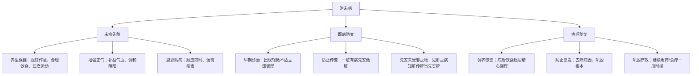
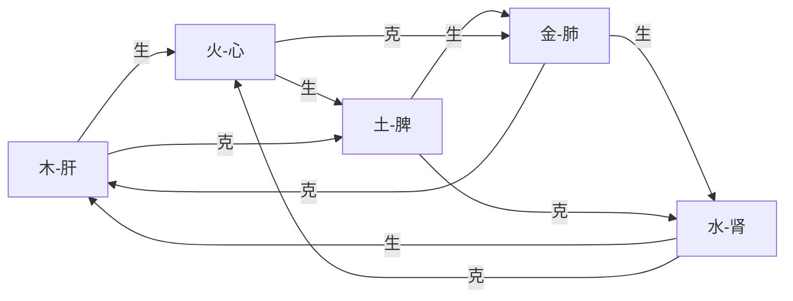

## 六、中医养生智慧

中医养生不是玄学，而是一套经过数千年实践验证的经验医学体系。现代研究越来越多地证实了其核心理念的科学基础——中医的"上医治未病"理念与现代预防医学高度一致；"天人合一"理念与时间生物学（chronobiology）的发现吻合；"辨证论治"理念与现代精准医学的个性化治疗思路如出一辙。

本章将系统介绍中医养生的核心理论、实用方法和现代应用，帮助读者建立科学的中医养生认知框架。无论你是零基础入门者还是有一定中医知识的进阶读者，都能从中找到适合自己的内容——入门者可以先掌握6.1-6.4的基本理念和四季养生，进阶读者可以深入6.5-6.8的脏腑经络和体质辨识，高阶读者可以研读6.9-6.12的现代结合与进阶路径。

### 6.1 中医养生的基本理念

#### 6.1.1 整体观念

中医认为人体是一个有机整体，各脏腑组织相互关联，同时人与自然环境也是统一的整体。这种整体观念不是抽象的哲学概念，而是有具体的生理机制支撑的。

**人体内部的整体性**：

五脏六腑通过经络系统相互连接，形成一个有机网络。这个网络不是单向的，而是双向甚至多向的。例如，肝脏不仅影响胆汁分泌（肝-胆表里关系），还通过肝经影响眼睛功能（肝开窍于目），通过肝主疏泄影响脾胃消化（肝木克脾土），通过肝藏血影响月经周期。一个脏腑的病变会沿着这些网络传导到其他脏腑，这就是为什么中医看病不会只盯着一个症状——头痛可能根源在肝，失眠可能根源在胃，皮肤问题可能根源在肺。

具体而言，人体内部的整体性体现在三个层面：
- **结构层面**：十二正经、奇经八脉、十五络脉构成完整的气血通道网络，任何一条经络的阻塞都会影响相邻经络的气血流通
- **功能层面**：五脏之间的生克制化关系维持动态平衡，例如心火需要肾水的制约才能不亢，肾水需要心火的温煦才能不寒
- **病理层面**：一脏有病可以传变到其他脏腑，如肝气郁结→横逆犯脾→脾失健运→生湿生痰→痰蒙心窍，整个链条清晰可见

**人与自然的统一性**：

自然界的变化直接影响人体的生理功能。这不是抽象的"天人合一"，而是有具体科学证据的：

- **光照与激素**：日出时褪黑素分泌下降、皮质醇上升，对应中医"阳气生发"；日落后相反，对应"阳入于阴"。这与《黄帝内经》"平旦人气生，日中而阳气隆，日西而阳气已虚，气门乃闭"的描述完全吻合
- **气温与代谢**：寒冷环境下甲状腺素分泌增加、基础代谢率升高，对应中医"肾阳温煦"；炎热环境下汗腺分泌增加、血管扩张，对应"心主血脉、汗为心之液"
- **季节与免疫**：春季花粉过敏高发，对应中医"风邪当令"；秋季呼吸道疾病增加，对应"燥邪伤肺"；冬季心脑血管疾病高发，对应"寒凝血瘀"

**人与社会的协调性**：

社会环境、人际关系、情绪状态都会影响健康。中医强调"形神合一"，身体和心理是不可分割的整体。现代心身医学已经证实，长期心理压力可以通过下丘脑-垂体-肾上腺轴（HPA轴）影响免疫功能、消化功能、心血管功能，这与中医"七情内伤"理论高度一致：

| 情志 | 对应脏腑 | 现代医学机制 | 常见表现 |
|------|----------|--------------|----------|
| 怒 | 肝 | 交感神经兴奋，血压升高 | 头痛、目赤、胁痛、月经不调 |
| 喜 | 心 | 过度兴奋致心率失常 | 心悸、失眠、注意力不集中 |
| 思 | 脾 | 迷走神经抑制，胃肠功能紊乱 | 食欲不振、腹胀、消化不良 |
| 悲/忧 | 肺 | 免疫球蛋白分泌减少 | 反复感冒、气短、皮肤干燥 |
| 恐/惊 | 肾 | 肾上腺素大量释放，肾功能波动 | 尿频、腰膝酸软、夜尿增多 |

**现代科学验证**：
- 神经-内分泌-免疫网络（NEI网络）理论证实了人体内部的系统性关联，与中医"五脏相关"理论一致
- 时间生物学研究证实了人体生理节律与自然节律的同步性，Jeffrey C. Hall等三人因发现生物钟分子机制获得2017年诺贝尔生理学或医学奖
- 心身医学研究证实了心理状态对生理功能的影响，心理神经免疫学（PNI）已成为独立学科

#### 6.1.2 辨证论治

根据个人体质、年龄、性别、生活环境等因素，制定个性化的养生方案。没有适合所有人的"万能方"。辨证论治是中医区别于其他医学体系的核心特征——同样是感冒，风寒感冒和风热感冒的处理方法截然相反；同样是失眠，不同证型的调理方向完全不同。

**辨证的核心要素**：

- **辨体质**：了解自己的体质类型（如气虚、阳虚、阴虚、痰湿等），体质决定了你对某些疾病的易感性和对某些食物/药物的反应性
- **辨寒热**：判断身体是偏寒还是偏热。寒证表现为怕冷、喜温、小便清长、舌淡苔白；热证表现为怕热、喜凉、小便短赤、舌红苔黄
- **辨虚实**：判断身体是虚证还是实证。虚证表现为精神萎靡、声低气短、病程长；实证表现为精神亢奋、声高气粗、病程短
- **辨表里**：判断病变是在体表还是在脏腑。表证表现为发热恶寒、头痛身痛、脉浮；里证表现为但热不寒、或但寒不热、脉沉

**个性化养生的重要性**：

以下是同一种症状在不同体质下的完全不同处理方案，充分说明了辨证论治的必要性：

**案例一：失眠**
- 心火旺盛型：表现为心烦、口舌生疮、小便黄赤。调理方向是清心安神，用莲子心泡茶、按揉劳宫穴
- 心脾两虚型：表现为多梦易醒、面色萎黄、食欲不振。调理方向是补益心脾，用桂圆红枣粥、按揉神门穴
- 肝郁化火型：表现为急躁易怒、胁肋胀痛、口苦咽干。调理方向是疏肝泻火，用菊花决明子茶、按揉太冲穴
- 阴虚火旺型：表现为五心烦热、盗汗、腰膝酸软。调理方向是滋阴降火，用百合麦冬汤、按揉涌泉穴

盲目跟风养生方法，可能适得其反。比如阴虚火旺的人吃人参鹿茸会上火加重，痰湿体质的人喝枸杞红枣水会湿气更重。

#### 6.1.3 治未病

《黄帝内经》提出"上工治未病"，强调预防为主，在疾病未发生前进行调理。这与现代预防医学的理念不谋而合，但中医的"治未病"比现代预防医学早了两千多年，而且体系更加完善。

**治未病的三个层次**：

**"未病先防"的实操要点**：

很多人把"未病先防"理解为"吃保健品"，这是误解。真正的未病先防是建立一套健康的生活方式系统：
- **饮食有节**：定时定量，不暴饮暴食，不过食肥甘厚味。《素问》说"饮食自倍，肠胃乃伤"
- **起居有常**：规律作息，不熬夜，不过劳。现代研究证实，长期睡眠不足会增加心血管疾病、糖尿病、肥胖的风险
- **不妄作劳**：适度运动，不过度劳累，包括体力劳动和脑力劳动。过度运动产生的大量自由基反而损伤细胞
- **恬淡虚无**：保持心态平和，不过度追求物质享受。现代研究证实，冥想、正念等心理调适方法可以降低皮质醇水平，改善免疫功能

**"既病防变"的经典案例**：

张仲景在《金匮要略》中提出"见肝之病，知肝传脾，当先实脾"。意思是：看到肝病，就知道肝木会克脾土，所以在治疗肝病的同时要先补脾。现代临床研究发现，慢性肝病患者确实常伴有消化功能障碍，早期健脾可以改善预后。

**"瘥后防复"的重要性**：

很多疾病复发不是因为治疗不彻底，而是因为病后调理不到位。例如：
- 感冒初愈就吃辛辣油腻，容易"食复"（因饮食不当而复发）
- 发烧刚退就剧烈运动，容易"劳复"（因劳累而复发）
- 大病初愈就过早同房，容易"房劳复"（因房事过度而复发）

**现代预防医学的对应**：
- 一级预防（病因预防）对应"未病先防"——通过健康生活方式预防疾病发生
- 二级预防（临床前期预防）对应"既病防变"——通过定期体检早期发现疾病
- 三级预防（康复预防）对应"瘥后防复"——通过康复训练防止疾病复发

### 6.2 阴阳平衡

#### 6.2.1 阴阳的基本概念

阴阳是中医理论的核心概念，用来描述事物相互对立又相互依存的两个方面。需要强调的是，阴阳不是两个实体，而是对同一事物两种属性的抽象概括——任何事物都可以从阴阳两个角度来分析，没有纯阴或纯阳的事物。

**阴阳的属性特征**：

| 属性 | 阴 | 阳 | 现代对应 |
|------|-----|-----|----------|
| 温度 | 寒冷 | 温暖 | 基础代谢率高低 |
| 明暗 | 黑暗 | 光明 | 视网膜光感受器活动 |
| 运动 | 静止 | 活动 | 交感/副交感神经平衡 |
| 方向 | 内收 | 外发 | 血管收缩/舒张 |
| 功能 | 物质 | 功能 | 合成代谢/分解代谢 |
| 状态 | 抑制 | 兴奋 | 神经递质平衡 |
| 时间 | 夜 | 昼 | 褪黑素/皮质醇节律 |
| 季节 | 秋冬 | 春夏 | 甲状腺激素季节波动 |

**阴阳的相互关系**：

- **对立制约**：阴阳相互对立，相互制约，维持动态平衡。就像恒温器的加热和制冷系统——如果加热过强（阳亢），温度就会上升（发热）；如果制冷过强（阴盛），温度就会下降（畏寒）。健康就是两者处于平衡状态
- **互根互用**：阴阳相互依存，互为根基，任何一方都不能脱离另一方而存在。功能（阳）必须依附于物质（阴），物质（阴）必须通过功能（阳）来体现。没有血液（阴）就没有血液循环的动力（阳），没有心脏的泵血功能（阳）血液就无法输送到全身（阴）
- **消长平衡**：阴阳处于不断的消长变化之中，但总体保持平衡。白天阳气渐盛、阴气渐消，夜晚相反。运动时阳长阴消，休息时阴长阳消。这种消长是动态的、持续的
- **相互转化**：阴阳在一定条件下可以相互转化。最典型的例子是发烧——高热（阳证）到一定程度会出现四肢厥冷、面色苍白（阴证），即"重阳必阴"；反之，长期虚寒（阴证）的人在温补后可能出现虚火上炎（阳证），即"重阴必阳"

#### 6.2.2 阴阳平衡的表现

阴阳平衡是健康的基本标志。以下从四个维度详细说明阴阳平衡的具体表现，读者可以对照自检：

**生理层面**：
- 身体温暖但不过热（体温维持在36.1-37.2°C，四肢末端温暖）——阳气温煦有度
- 精力充沛但不过度兴奋（白天精神好，夜晚困倦自然来）——阳气充盛而不亢
- 睡眠安稳但不过度嗜睡（入睡快，不易醒，醒后精神好）——阳入于阴，阴阳交替正常
- 情绪稳定但有适当波动（遇喜则喜，遇悲则悲，但不过度）——气机调畅

**代谢层面**：
- 食欲正常，消化良好（三餐有食欲，饭后不胀不痛）——脾胃运化功能正常
- 二便通畅，排泄正常（大便每日1-2次，成形不干不稀；小便淡黄清亮）——大肠传导、膀胱气化功能正常
- 体重稳定，不忽胖忽瘦（月波动不超过1-2公斤）——脾主运化、肾主水液功能协调
- 皮肤有光泽，不干燥也不油腻——肺主皮毛功能正常，气血充足

**免疫层面**：
- 抵抗力强，不易感冒（每年感冒不超过2-3次，且恢复快）——卫气充盛
- 伤口愈合快，不易感染（小伤口3-5天愈合）——气血充盛，正气充足
- 精神状态好，不易疲劳（连续工作4-5小时不觉得特别累）——元气充沛

**自我检测清单**：

用以下10个问题快速评估自己的阴阳平衡状态（"是"计1分）：
1. 早晨起床后精神好，不需要赖床？（阳气充足）
2. 手脚温暖，冬天不用暖手宝？（阳气温煦）
3. 大便每日1次，成形不粘马桶？（脾运化正常）
4. 睡眠质量好，不做噩梦？（阴阳交替正常）
5. 情绪稳定，不易发怒或抑郁？（气机调畅）
6. 皮肤有光泽，不长痘不干燥？（气血充盛）
7. 食欲正常，不暴食不厌食？（脾胃功能好）
8. 运动后恢复快，不觉得特别累？（元气充沛）
9. 月经规律（女性）或晨勃正常（男性）？（肾精充足）
10. 换季时不容易生病？（卫气充足）

7-10分：阴阳平衡状态良好；4-6分：存在轻度失衡，需要调理；0-3分：明显失衡，建议咨询专业中医师。

#### 6.2.3 阴阳失调的症状与调理

**阳虚体质**——"火力不足"：

阳虚体质的核心问题是体内"热力"不够，就像房子暖气不足。这类人普遍怕冷、手脚冰凉，尤其在秋冬季更加明显。现代医学角度来看，阳虚体质常伴有基础代谢率偏低、甲状腺功能轻度减退、肾上腺皮质功能不足等问题。

| 症状 | 具体表现 | 发生机制 | 调理方法 |
|------|----------|----------|----------|
| 畏寒怕冷 | 四肢不温，腰膝酸软，比同龄人多穿一件衣服 | 阳气温煦功能不足，末梢循环差 | 温补阳气：每日晨起姜枣茶（生姜3片+红枣5枚煮水），艾灸关元穴（脐下3寸）15分钟 |
| 精神不振 | 疲乏无力，嗜睡懒动，总想躺着 | 阳气不足，推动功能减退 | 适当运动：每天快走30分钟（微微出汗），八段锦"两手托天理三焦"每天做10遍 |
| 大便稀溏 | 腹泻，完谷不化（食物残渣可见），早晨起床就要跑厕所 | 脾阳不足，运化无力 | 温中健脾：炒白术15g+干姜6g+炙甘草6g煮水代茶，忌生冷瓜果 |
| 夜尿频多 | 每晚起夜2-3次以上，尿量多且清长 | 肾阳不足，膀胱气化失司 | 温肾固涩：每晚睡前按摩涌泉穴5分钟，肉桂粉0.5g温水送服 |

**阳虚体质一日调理模板**：
- 06:30 起床，温水一杯（加2片生姜），拍打手臂内侧肺经3分钟
- 07:00 早餐：小米粥+红枣+核桃，忌牛奶冷饮
- 08:00 快走或八段锦30分钟
- 12:00 午餐：温热食物为主，适当吃羊肉/鸡肉
- 13:00 午休20-30分钟
- 17:00 散步30分钟，拍打腿部外侧胃经
- 19:00 晚餐：七分饱，温热为主
- 21:00 艾叶泡脚20分钟（水温40-42°C），按摩涌泉穴
- 22:00 入睡

**阴虚体质**——"冷却液不足"：

阴虚体质的核心问题是体内"津液"不够，就像汽车冷却液不足会过热。这类人虽然不一定怕冷，但容易出现"虚火"——手心脚心发热、口干舌燥、夜间盗汗。现代医学角度来看，阴虚体质常伴有自主神经功能紊乱、交感神经兴奋性增高、内分泌功能亢进等问题。

| 症状 | 具体表现 | 发生机制 | 调理方法 |
|------|----------|----------|----------|
| 五心烦热 | 手心、脚心、胸口发热，下午和夜间加重 | 阴不制阳，虚火内扰 | 滋阴降火：百合30g+麦冬15g+生地15g煮水代茶，按揉太溪穴（内踝后方凹陷处） |
| 口干舌燥 | 喜饮冷水，咽干口苦，尤其夜间明显 | 阴液不足，不能上承润泽 | 养阴生津：石斛10g+麦冬10g+枸杞10g泡水，含服西洋参片 |
| 失眠多梦 | 入睡困难，睡眠浅，梦多，盗汗 | 心阴不足，虚火扰心 | 滋阴安神：百合30g+酸枣仁15g+柏子仁10g煮水，睡前按摩神门穴 |
| 大便干燥 | 便秘，大便如羊屎状，数日一行 | 肠道津液不足，传导无力 | 润肠通便：火麻仁15g+杏仁10g+蜂蜜1勺冲服，多吃黑芝麻 |

**阴虚体质一日调理模板**：
- 06:30 起床，温水一杯（加蜂蜜1勺）
- 07:00 早餐：银耳百合粥+鸡蛋
- 08:00 太极拳或瑜伽30分钟（避免大汗）
- 12:00 午餐：鸭肉/鱼类+时蔬，忌辛辣烧烤
- 13:00 午休20分钟
- 15:00 石斛麦冬茶，枸杞一把
- 18:00 晚餐：清淡为主，七分饱
- 20:00 温水泡脚15分钟（水温37-39°C，不宜太热）
- 21:30 按摩涌泉穴、太溪穴各5分钟
- 22:00 入睡

**阳亢体质**——"散热系统堵塞"：

阳亢体质的核心问题是阳气太旺但不能正常发散，就像散热器被堵住了热量散不出去。这类人容易面红目赤、烦躁易怒、头痛眩晕。现代医学角度来看，阳亢体质常伴有交感神经兴奋性过高、血压偏高、肝功能异常等问题。

| 症状 | 具体表现 | 发生机制 | 调理方法 |
|------|----------|----------|----------|
| 面红目赤 | 面部潮红，眼睛发红，尤其在情绪激动时 | 肝火上炎，气血上涌 | 清肝泻火：菊花10g+决明子15g+夏枯草10g泡茶，按揉太冲穴（足背第1、2跖骨间） |
| 烦躁易怒 | 一点小事就发火，控制不住情绪 | 肝气郁结化火，疏泄太过 | 疏肝理气：玫瑰花5朵+佛手片5g+薄荷叶3g泡茶，每天散步30分钟 |
| 便秘口苦 | 大便干结，口中发苦，尤其晨起明显 | 肝火犯胃，胃气上逆 | 清热通便：决明子15g+菊花10g+甘草3g泡茶，苦瓜凉拌或绿豆汤 |
| 头痛眩晕 | 头胀痛，以两侧和头顶为主，头晕目眩 | 肝阳上亢，气血上冲 | 平肝潜阳：天麻10g+钩藤10g+菊花10g煮水，按揉太冲穴+涌泉穴引火下行 |

**阴盛体质**——"水液代谢障碍"：

阴盛体质的核心问题是体内水湿代谢不畅，就像房间里潮湿发霉。这类人往往身体沉重、食欲不振、舌苔厚腻。现代医学角度来看，阴盛体质常伴有水钠潴留、消化功能减退、血脂偏高等问题。

| 症状 | 具体表现 | 发生机制 | 调理方法 |
|------|----------|----------|----------|
| 身体沉重 | 四肢沉重如绑沙袋，头重如裹湿毛巾，尤其阴雨天加重 | 湿邪困脾，气机不畅 | 健脾祛湿：薏米30g+红豆30g+茯苓15g煮粥，每天快走40分钟 |
| 食欲不振 | 腹胀，不思饮食，吃一点就饱，口中黏腻 | 脾失健运，湿浊中阻 | 理气和胃：陈皮10g+山楂10g+麦芽10g煮水，少食多餐 |
| 大便稀溏 | 腹泻，大便不成形，粘马桶不易冲净 | 湿邪下注，大肠传导失常 | 温中散寒：生姜3片+大枣5枚+茯苓15g煮水，忌冷饮瓜果 |
| 舌苔白腻 | 舌苔厚腻如涂了一层奶油，口淡无味 | 痰湿内蕴，脾胃运化不良 | 芳香化湿：藿香10g+佩兰10g+砂仁3g泡茶，少吃甜食油腻 |

### 6.3 五行养生

#### 6.3.1 五行对应关系

五行学说是中医理论的重要组成部分，用木、火、土、金、水五种元素的特性来解释人体脏腑、组织、器官之间的相互关系。五行不是五种具体的物质，而是五种运动方式和功能状态的抽象概括。

**五行完整对应表**：

| 五行 | 脏 | 腑 | 季节 | 情志 | 颜色 | 味 | 五官 | 五体 | 五华 | 气候 |
|------|----|----|------|------|------|-----|------|------|------|------|
| 木 | 肝 | 胆 | 春 | 怒 | 青 | 酸 | 目 | 筋 | 爪 | 风 |
| 火 | 心 | 小肠 | 夏 | 喜 | 赤 | 苦 | 舌 | 脉 | 面 | 暑 |
| 土 | 脾 | 胃 | 长夏 | 思 | 黄 | 甘 | 口 | 肉 | 唇 | 湿 |
| 金 | 肺 | 大肠 | 秋 | 悲 | 白 | 辛 | 鼻 | 皮 | 毛 | 燥 |
| 水 | 肾 | 膀胱 | 冬 | 恐 | 黑 | 咸 | 耳 | 骨 | 发 | 寒 |

**五行属性详解**：

**木的特性——生长、升发、条达、舒畅**：

木代表一切向上生长、向外扩展的力量。对应人体的肝系统，肝主疏泄（推动气血流通，调节情绪），肝主藏血（储存血液，调节血量分配）。春天万物生发，肝气旺盛，人的情绪也容易波动。如果你春天容易眼睛干涩、情绪烦躁、胁肋胀痛，说明肝气需要调养。养肝的关键是"舒"——让气机像树木一样自由伸展，不要压抑情绪，不要久坐不动。

**火的特性——温热、上升、光明**：

火代表一切温暖、照亮、推动的力量。对应人体的心系统，心主血脉（推动血液运行），心主神明（主管精神意识和思维活动）。夏天阳气旺盛，心气充足，人的情绪也容易亢奋。养心的关键是"静"——保持心态平和，不要过度兴奋，午时（11-13点）小憩20分钟可以养心安神。

**土的特性——生化、承载、受纳**：

土代表一切转化、承载、包容的力量。对应人体的脾系统，脾主运化（消化吸收营养），脾主统血（统摄血液不外溢），脾主肌肉（营养肌肉组织）。长夏（夏秋之交，约农历六月）湿气重，脾容易被湿邪所困。养脾的关键是"运"——保持适度运动促进脾胃运化，饮食定时定量，不吃过饱过饥。

**金的特性——清洁、清肃、收敛**：

金代表一切收敛、清降、防护的力量。对应人体的肺系统，肺主气（主管呼吸），肺主宣发肃降（调节气机升降和水液代谢），肺主皮毛（调节体温和防御外邪）。秋天干燥，肺容易受燥邪损伤。养肺的关键是"润"——多喝水，吃润肺食物如银耳百合，保持室内适度湿度。

**水的特性——寒凉、滋润、向下**：

水代表一切潜藏、滋润、向下的力量。对应人体的肾系统，肾藏精（储存先天之精和后天之精），肾主水（调节水液代谢），肾主纳气（帮助肺吸气），肾主骨生髓（营养骨骼和脑髓）。冬天寒冷，肾气需要潜藏。养肾的关键是"藏"——早睡晚起，减少性生活频率，不要过度出汗（汗为心之液，过度出汗伤肾阴）。

**五行与日常饮食的对应**：

| 五行 | 对应脏腑 | 推荐食物 | 避免食物 | 日常茶饮 |
|------|----------|----------|----------|----------|
| 木 | 肝/胆 | 菠菜、芹菜、韭菜、荠菜、香椿 | 过量酸味（酸主收引，过食伤肝） | 菊花枸杞茶 |
| 火 | 心/小肠 | 西红柿、红豆、红枣、莲子 | 过量苦味（苦主降，过食伤心） | 玫瑰花茶 |
| 土 | 脾/胃 | 小米、南瓜、红薯、山药、莲藕 | 过量甜味（甜主缓，过食伤脾） | 陈皮普洱茶 |
| 金 | 肺/大肠 | 银耳、百合、雪梨、莲藕、白萝卜 | 过量辛味（辛主散，过食伤肺） | 蜂蜜雪梨水 |
| 水 | 肾/膀胱 | 黑豆、黑芝麻、黑木耳、桑葚、核桃 | 过量咸味（咸主软，过食伤肾） | 枸杞桑葚茶 |

#### 6.3.2 五行相生相克

**相生关系**（母子关系，即促进、滋养关系）：

五行相生是一条循环的滋养链：木→火→土→金→水→木。"生"的关系就像母子——前者是"母"，后者是"子"，母壮则子强。

- **木生火**：肝藏血以济心。肝血充足，则心血旺盛，面色红润，精神充沛。肝血不足的人往往容易心悸、失眠
- **火生土**：心阳温煦以助脾运。心火充足，则脾胃消化功能旺盛。心气不足的人往往食欲不振、消化不良
- **土生金**：脾运化水谷精微以养肺。脾胃吸收的营养充足，则肺气充沛，呼吸有力，皮肤光泽。脾虚的人往往容易反复感冒、皮肤粗糙
- **金生水**：肺主行水以助肾水。肺的宣发肃降功能正常，则肾的水液代谢正常。肺气虚的人往往容易水肿、小便不利
- **水生木**：肾藏精以滋养肝血。肾精充足，则肝血旺盛，筋骨强健，眼睛明亮。肾精不足的人往往容易视力减退、筋骨无力

**相克关系**（制约关系，即控制、平衡关系）：

五行相克是一条循环的制约链：木→土→水→火→金→木。"克"的关系不是破坏，而是维持平衡——任何一行太过都需要被制约。

- **木克土**：肝气疏泄以制约脾土壅滞。肝的疏泄功能可以促进脾胃的消化吸收，但肝气太旺就会"横逆犯脾"，导致腹痛腹泻
- **土克水**：脾运化水湿以制约肾水泛滥。脾的运化功能可以控制体内水液代谢，但脾虚就会"土不制水"，导致水肿
- **水克火**：肾水上济以制约心火亢盛。肾阴可以滋养心阴、制约心火，但肾水不足就会"水不济火"，导致失眠心烦
- **火克金**：心火温煦以制约肺金过清。心火可以温暖肺气、促进宣发，但心火太旺就会"火克金"，导致咳嗽咯血
- **金克木**：肺气清肃以制约肝气升发太过。肺的肃降功能可以制约肝的过度升发，但肺气不足就会"金不制木"，导致肝阳上亢

**相生相克的临床意义**：

- **虚则补其母**：如肺虚补脾（培土生金）——慢性支气管炎、反复感冒的人，单纯补肺效果不好，应该先健脾，脾好了自然能养肺。临床上常用四君子汤（人参、白术、茯苓、甘草）健脾来治疗肺气虚
- **实则泻其子**：如肝实泻心——肝火旺盛导致的头痛目赤，除了清肝之外，还要清心火（因为木生火，肝火容易传到心），常用龙胆泻肝汤加黄连
- **相乘**：克制太过，如肝气太旺克脾土——情绪紧张时容易腹痛腹泻（肠易激综合征），这是"肝木乘脾土"的典型表现，用痛泻要方（白术、白芍、陈皮、防风）调和肝脾
- **相侮**：反向克制，如肺金不足反被肝木所侮——肺气虚弱时，肝气反而向上犯肺，导致咳嗽气喘，用泻白散合黛蛤散清肺平肝

#### 6.3.3 五行养生应用

**根据五行调理脏腑**：

| 脏腑问题 | 五行归属 | 调理原则 | 食疗方 | 穴位 |
|----------|----------|----------|--------|------|
| 肝气郁结 | 木 | 疏肝理气 | 玫瑰花5朵+佛手片5g+陈皮5g泡茶，每日1-2次 | 太冲穴（足背第1、2跖骨间凹陷处），按揉3分钟 |
| 心火旺盛 | 火 | 清心泻火 | 莲子心3g+竹叶5g+甘草3g泡茶，每日1次 | 劳宫穴（握拳中指尖处），按揉2分钟 |
| 脾虚湿困 | 土 | 健脾祛湿 | 薏米30g+茯苓15g+白术10g煮粥，隔日1次 | 足三里（外膝眼下3寸），按揉5分钟 |
| 肺燥干咳 | 金 | 润肺生津 | 银耳20g+百合30g+雪梨1个炖汤，隔日1次 | 太渊穴（腕横纹桡侧端），按揉3分钟 |
| 肾虚腰酸 | 水 | 补肾填精 | 枸杞30g+黑芝麻30g+核桃仁30g研粉冲服，每日1次 | 太溪穴（内踝后方凹陷处），按揉3分钟 |

**五行相生调理法**：
- **培土生金**：脾虚导致肺气不足，通过健脾来补肺。适用人群：面色萎黄、食欲不振、反复感冒者。方药参考：四君子汤或参苓白术散
- **金水相生**：肺肾阴虚，同时滋补肺肾。适用人群：干咳少痰、腰膝酸软、潮热盗汗者。方药参考：百合固金汤
- **滋水涵木**：肾阴不足导致肝阳上亢，通过滋肾来平肝。适用人群：头晕目眩、腰膝酸软、急躁易怒者。方药参考：杞菊地黄丸

**五行相克调理法**：
- **抑木扶土**：肝气太旺克脾土，疏肝同时健脾。适用人群：情绪紧张时腹痛腹泻、胸胁胀满者。方药参考：痛泻要方或逍遥散
- **泻南补北**：心火亢盛肾水不足，清心火滋肾阴。适用人群：失眠心烦、腰膝酸软、口舌生疮者。方药参考：黄连阿胶汤
- **佐金平木**：肝火犯肺，清肺热平肝火。适用人群：咳嗽气喘、胁肋疼痛、急躁易怒者。方药参考：黛蛤散合泻白散

### 6.4 四季养生

#### 6.4.1 春季养生（肝）

**季节特点**：

春季（立春至立夏）是自然界阳气开始生发的季节。从冬至开始，白天逐渐变长，阳气逐渐回升，万物开始复苏。对应人体，肝气开始旺盛，气血从冬季的内藏状态向外疏散。但初春时节寒气未尽，风邪当令，人体阳气虽已生发但尚不充盛，容易感受外邪。

**养生原则**：养肝护阳，舒畅情志

**起居调养**：

春季作息应该"夜卧早起"——比冬季稍晚睡（但不超过23点）、比冬季稍早起（6:00-6:30），以顺应阳气的生发。起床后可以"广步于庭，被发缓形"——在院子里散散步，穿宽松的衣服，让身体的气机自由舒展。春天要特别注意"春捂"——不要过早脱掉厚衣服，因为初春气温变化大，过早减衣容易感受风寒。一般建议日平均气温稳定超过15°C后再逐步减少衣物，且减衣应从上身开始（"上薄下厚"），因为下肢离心脏最远，血液循环最差，最容易受寒。

**饮食调养**：

春天肝气旺盛，饮食应该顺应肝的"升发"特性，同时避免肝气太过。具体原则：

- **多吃绿色蔬菜**：绿色入肝，春季应季蔬菜大多有养肝作用。推荐：菠菜（养血润燥）、芹菜（平肝清热）、韭菜（温补肾阳，春天的韭菜最鲜嫩，素有"春韭"之称）、荠菜（清肝明目）、香椿（清热解毒）
- **适当辛温食物**：辛味发散，有助于阳气的生发。推荐：葱（发汗解表）、姜（温中散寒）、蒜（杀菌消炎）、香菜（发散风寒）。但辛味不宜过量，过量则耗散肝气
- **少吃酸味食物**：酸主收引，过多酸味会收敛肝气，不利于阳气的生发。春天应该减少醋、山楂、乌梅等酸味食物的摄入
- **推荐食疗**：菊花枸杞茶（清肝明目，每日1杯）、芹菜粥（平肝清热，每周2-3次）、韭菜炒鸡蛋（温补肾阳，每周1-2次）

**情志调养**：

春季情志调养的核心是"疏"——让情绪像春天的树木一样自由伸展，不要压抑。《黄帝内经》说春季应该"生而勿杀，予而勿夺，赏而勿罚"，意思是要多给予、多鼓励、少惩罚、少压抑。

具体方法：
- 多与朋友交流，参加户外活动，踏青赏花
- 学习情绪管理，有怒气要及时疏导而不是压制——可以通过运动、唱歌、写日记等方式发泄
- 每天花5分钟做深呼吸练习：吸气4秒→屏息4秒→呼气6秒，重复5-8次

**运动调养**：

春季运动应该以舒缓为主，避免剧烈运动大汗淋漓（汗为心之液，过度出汗会耗散阳气）。推荐：
- **太极拳**：动作缓慢柔和，配合呼吸，最适合春季养肝
- **八段锦**：特别是"调理脾胃须单举"和"五劳七伤向后瞧"两式，可以调畅气机
- **散步**：最简单的运动方式，每天30-40分钟，速度以微微出汗为度
- **放风筝**：抬头仰望可以舒展颈椎，远眺可以养肝明目，是春天的特色运动

**穴位保健**：

| 穴位 | 定位 | 功效 | 按摩方法 | 最佳时间 |
|------|------|------|----------|----------|
| 太冲穴 | 足背，第1、2跖骨结合部前方凹陷处 | 疏肝理气，缓解头痛、目赤、烦躁 | 拇指指腹按揉，向足趾方向推，每次3-5分钟，有酸胀感为度 | 晚上19-21点 |
| 期门穴 | 乳头直下，第6肋间隙 | 疏肝利胆，调理胸胁胀痛 | 手掌搓热后轻按，顺时针揉，每次2-3分钟 | 饭后1小时 |
| 肝俞穴 | 第9胸椎棘突下旁开1.5寸 | 养肝明目，调理肝血不足 | 请他人用拇指按揉，每次3-5分钟 | 午后13-15点 |

#### 6.4.2 夏季养生（心）

**季节特点**：

夏季（立夏至立秋）是自然界阳气最旺盛的季节。从立夏开始，气温逐渐升高，万物繁茂。对应人体，心气旺盛，气血运行加速。但夏季暑热当令，容易心火亢盛；同时长夏（夏秋之交）湿气重，脾容易受困。夏季养生的关键是"养心安神"和"清热祛暑"。

**养生原则**：养心安神，清热祛暑

**起居调养**：

夏季作息应该"晚睡早起"——比春季稍晚睡（不超过23:30）、早起（5:30-6:00），以顺应阳气的旺盛。中午11:00-13:00是心经当令的时间，应该适当午休15-30分钟，养心安神。午休时间不宜过长，超过1小时反而会影响下午的精神状态，也会影响晚上的睡眠质量。

夏季防暑降温有讲究：
- 不要长时间待在空调房间（室内外温差不宜超过5-7°C），否则容易"寒包火"
- 出汗后不要立即冲冷水澡，应该用温水擦身，让阳气自然收敛
- 空调温度建议设置在26-28°C，睡觉时可以调高到28-30°C

**饮食调养**：

- **多吃红色食物**：红色入心，夏季应多食用。推荐：西红柿（生津止渴）、红豆（利水消肿）、红枣（补中益气）、枸杞（滋补肝肾）、西瓜（消暑利尿，但脾胃虚寒者少吃）
- **适当苦味食物**：苦味清心降火。推荐：苦瓜（清热解暑，被誉为"君子菜"，与其他食材同炒不会把苦味传给对方）、莲子心（清心安神，每天3-5g泡茶）、菊花（清肝明目）
- **少吃辛辣食物**：辛主发散，夏季本已出汗多，再吃辛辣会大量出汗，耗散心气和阳气
- **推荐食疗**：绿豆汤（清热解毒，消暑利水，煮至开花效果最佳）、莲子粥（养心安神，莲子去心以免苦寒伤胃）、冬瓜排骨汤（清热利湿，消暑止渴）

**特别注意**：夏季很多人喜欢喝冰镇饮料、吃冰淇淋来解暑，这是非常伤脾阳的做法。冰冷食物进入胃中，需要消耗大量的脾阳来温化，长期如此会导致脾阳不足，出现腹泻、食欲不振、身体沉重等症状。正确的解暑方式是喝常温或微温的绿豆汤、酸梅汤。

**情志调养**：

夏季情志调养的核心是"静"——保持心态平和，不要过度兴奋。《黄帝内经》说夏季应该"使华英成秀，使气得泄，若所爱在外"——让气血充分运行，但不要过度耗散。具体方法：
- 避免大喜大悲，过喜伤心（极度兴奋后容易出现心悸、失眠）
- 培养安静的爱好：书法、绘画、钓鱼、下棋
- 每天花10分钟做静坐冥想，让心神安定

**运动调养**：

夏季运动应该避开高温时段（10:00-16:00），选择清晨或傍晚：
- **清晨运动**（6:00-8:00）：散步、太极拳、八段锦
- **傍晚运动**（18:00-20:00）：慢跑、骑行、广场舞
- **游泳**：夏季最理想的运动方式，既锻炼全身又消暑降温。但要注意：下水前先用温水淋湿身体，避免突然受寒；游泳时间不宜超过1小时；游泳后及时擦干身体，避免湿邪侵入

**穴位保健**：

| 穴位 | 定位 | 功效 | 按摩方法 |
|------|------|------|----------|
| 内关穴 | 前臂内侧，腕横纹上2寸，两筋之间 | 宁心安神，和胃止呕，缓解晕车 | 拇指按揉，每次3-5分钟，有酸胀感为度 |
| 神门穴 | 腕横纹尺侧端，尺侧腕屈肌腱桡侧凹陷处 | 养心安神，调理失眠、心悸 | 拇指按揉，每次3-5分钟，睡前按摩效果最佳 |
| 劳宫穴 | 握拳时中指尖所指处 | 清心泻火，缓解口舌生疮 | 拇指按揉，每次2-3分钟，每日2-3次 |

#### 6.4.3 秋季养生（肺）

**季节特点**：

秋季（立秋至立冬）是自然界阳气渐收、阴气渐长的季节。从立秋开始，气温逐渐下降，空气逐渐干燥。对应人体，肺气旺盛但容易受燥邪损伤。秋季同时也是感冒、咳嗽、皮肤干燥等疾病的高发季节。

**养生原则**：养肺润燥，收敛神气

**起居调养**：

秋季作息应该"早卧早起"——比夏季稍早睡（22:00-22:30）、早起（6:00-6:30），以顺应阳气的收敛。"早卧以顺应阳气之收，早起使肺气得以舒展"——早睡可以让身体充分休息和修复，早起可以呼吸新鲜空气，锻炼肺功能。

秋季保暖要注意"秋冻"的限度：
- 初秋（8-9月）气温尚高，可以适当少穿，让身体适应凉爽的气温，增强抗寒能力
- 深秋（10-11月）气温明显下降，要及时添加衣物，特别注意保护颈部、肩部和足部
- "秋冻"不适用于老人、小孩和体质虚弱者，这些人应该根据气温变化及时增减衣物

**饮食调养**：

- **多吃白色食物**：白色入肺，秋季应多食用。推荐：银耳（滋阴润肺，被称为"平民燕窝"）、百合（养阴润肺，清心安神）、雪梨（润肺止咳，生津止渴）、莲藕（清热润肺，凉血止血）、白萝卜（下气消食，化痰止咳）
- **适当酸味食物**：酸主收敛，有利于肺气的肃降。推荐：葡萄、石榴、柚子、山楂、醋
- **少吃辛辣食物**：辛主发散，秋季本应收敛，过食辛辣会耗散肺气。但初秋时如果仍有暑湿，可以少量辛味发散
- **推荐食疗**：银耳莲子羹（滋阴润肺，养心安神，银耳提前泡发4小时以上）、雪梨炖百合（润肺止咳，清心安神，雪梨去核填入百合和冰糖）、蜂蜜柚子茶（润肺化痰，理气消食，柚子肉和皮一起腌制效果更好）

**情志调养**：

秋季情志调养的核心是"收"——收敛神气，使志安宁。《黄帝内经》说秋季应该"使志安宁，以缓秋刑，收敛神气，使秋气平"。秋天万物凋零，容易引发悲伤情绪（"悲秋"），要特别注意心理调适：
- 多与朋友交流，参加社交活动
- 培养乐观开朗的性格，看到秋天的收获之美而不是凋零之悲
- 多晒太阳，阳光可以促进血清素分泌，改善情绪

**运动调养**：

秋季运动应该适度，不宜过量出汗：
- **慢跑**：速度以能说话但不能唱歌为度，每次20-30分钟
- **登山**：秋天登山可以呼吸新鲜空气，锻炼心肺功能，欣赏秋景。但要注意保护膝关节，下山时走"之"字形减少冲击
- **呼吸锻炼**：腹式呼吸，每次5-10分钟。具体方法：吸气时腹部隆起（4秒）→屏息（2秒）→呼气时腹部收缩（6秒），重复10-15次

**穴位保健**：

| 穴位 | 定位 | 功效 | 按摩方法 |
|------|------|------|----------|
| 太渊穴 | 腕横纹桡侧端，桡动脉搏动处 | 补肺益气，调理咳嗽、气短 | 拇指轻按，每次3-5分钟，不宜重按 |
| 列缺穴 | 桡骨茎突上方，腕横纹上1.5寸 | 宣肺解表，调理头痛、咳嗽 | 拇指按揉，每次3-5分钟 |
| 迎香穴 | 鼻翼外缘中点旁，鼻唇沟中 | 宣通鼻窍，预防感冒 | 食指按揉，每次2-3分钟，每日3-5次 |

#### 6.4.4 冬季养生（肾）

**季节特点**：

冬季（立冬至立春）是自然界阴气最盛、阳气潜藏的季节。从立冬开始，气温显著下降，万物进入蛰伏状态。对应人体，肾气旺盛但容易肾阳不足。冬季是养精蓄锐的最佳季节，也是补肾的黄金时期。

**养生原则**：养肾藏精，避寒保暖

**起居调养**：

冬季作息应该"早卧晚起，必待日光"——比其他季节都早睡（21:30-22:00）、晚起（7:00-7:30），等太阳出来后再起床活动。这样可以避免寒邪侵袭，保护阳气。冬季要特别注意保暖三个关键部位：
- **头部**：头为"诸阳之会"，阳气最集中也最容易散失。出门戴帽子，可以减少30%的热量散失
- **腰腹部**：腰为"肾之府"，腰腹受寒直接影响肾阳。穿高腰裤或加一条腰封
- **足部**：足为"第二心脏"，脚底有涌泉穴直通肾经。睡前用艾叶水或花椒水泡脚（水温40-42°C，浸泡20分钟至微微出汗）

**饮食调养**：

- **多吃黑色食物**：黑色入肾，冬季应多食用。推荐：黑豆（补肾益精，被称为"肾之谷"）、黑芝麻（补肝肾，益精血，润肠燥）、黑木耳（补气养血，润肺止咳）、桑葚（滋阴补血，生津润燥）、核桃（补肾固精，温肺定喘，健脑益智）
- **适当咸味食物**：咸入肾，可以引药入肾，但不宜过多（每日盐摄入不超过6g），过咸伤肾
- **少吃生冷食物**：冬季阳气内藏，脾胃功能相对减弱，生冷食物容易损伤脾胃阳气
- **推荐食疗**：当归生姜羊肉汤（温中补血，散寒止痛，出自《金匮要略》，是冬季温补第一方）、黑芝麻核桃粥（补肾益精，健脑益智）、枸杞炖乌鸡（滋补肝肾，益气养血，适合冬季进补）

**冬季进补的原则**：

冬季是进补的最佳季节，但进补不是盲目吃补品，要根据体质选择：

| 体质 | 进补方向 | 推荐食材 | 注意事项 |
|------|----------|----------|----------|
| 阳虚 | 温补肾阳 | 羊肉、鹿茸、核桃、韭菜 | 阴虚火旺者禁用，以免加重虚火 |
| 气虚 | 补气健脾 | 人参、黄芪、山药、大枣 | 感冒发烧时暂停进补 |
| 血虚 | 补血养血 | 当归、阿胶、桂圆、红枣 | 脾胃虚弱者先健脾再补血 |
| 阴虚 | 滋阴润燥 | 银耳、百合、枸杞、石斛 | 忌辛辣温燥之品 |

**情志调养**：

冬季情志调养的核心是"藏"——精神内守，避免过度消耗。具体方法：
- 保持心态平和，避免恐惧情绪（恐伤肾）
- 避免过度劳累，保护肾精
- 可以适当阅读、冥想、练书法等安静的活动
- 早睡晚起，保证充足的睡眠时间（7-8小时）

**运动调养**：

冬季运动应该以室内为主，避免大汗淋漓：
- **瑜伽**：适合室内练习，可以拉伸筋骨，促进血液循环
- **太极拳**：动作缓慢柔和，适合冬季养肾
- **八段锦**：特别是"两手攀足固肾腰"一式，可以强腰固肾
- **室内快走**：在室内或商场快走30-40分钟

冬季运动注意事项：
- 运动前充分热身10-15分钟，避免肌肉拉伤
- 运动时间选择在10:00-15:00之间，此时气温相对较高
- 雾霾天气避免户外运动
- 运动后及时更换汗湿的衣服，避免受寒

**穴位保健**：

| 穴位 | 定位 | 功效 | 按摩方法 |
|------|------|------|----------|
| 涌泉穴 | 足底，卷足时足前部凹陷处 | 滋阴降火，补肾强身，改善失眠 | 每晚睡前用手掌搓热后按摩，每次5-10分钟，至足底发热 |
| 太溪穴 | 内踝尖与跟腱之间凹陷处 | 补肾益精，调理腰膝酸软 | 拇指按揉，每次3-5分钟，有酸胀感为度 |
| 关元穴 | 脐下3寸，前正中线上 | 培元固本，补益下焦，温肾壮阳 | 手掌搓热后按揉，或艾灸15-20分钟 |

### 6.5 脏腑养生

#### 6.5.1 五脏功能与养生

**肝的养生**：

肝被称为"将军之官"，主疏泄、主藏血、主筋、开窍于目、其华在爪。肝的功能核心是"疏泄"——推动气血流通，调节情绪，促进消化，调节月经。

| 功能 | 具体作用 | 功能异常表现 | 日常养护方法 |
|------|----------|--------------|--------------|
| 主疏泄 | 调畅气机，促进胆汁分泌和消化 | 胁肋胀痛、情绪抑郁或急躁易怒、消化不良 | 每天散步30分钟，保持心情舒畅，按揉太冲穴 |
| 主藏血 | 储存血液，调节各器官血量分配 | 月经量少或过多、视力减退、指甲干枯 | 23点前入睡（肝经当令），多吃菠菜、猪肝 |
| 主筋 | 滋养筋脉，维持关节灵活性 | 筋脉拘急、抽筋、关节僵硬 | 适当拉伸运动，多吃酸味食物（适量） |
| 开窍于目 | 眼睛功能与肝密切相关 | 眼睛干涩、视力模糊、眼睛发红 | 每用眼45分钟休息5分钟，远眺绿色植物 |

**肝的养护重点**：肝喜条达恶抑郁。现代人最大的肝病问题是"肝气郁结"——长期久坐、情绪压抑、熬夜伤肝。养护肝的关键是"舒"：舒畅情志+舒展身体+舒适作息。

**心的养生**：

心被称为"君主之官"，主血脉、主神明、开窍于舌、其华在面。心的功能核心是"主血脉"——推动血液运行，以及"主神明"——主管精神意识和思维活动。

| 功能 | 具体作用 | 功能异常表现 | 日常养护方法 |
|------|----------|--------------|--------------|
| 主血脉 | 推动血液在脉管中运行 | 心悸、胸闷、面色苍白或紫暗 | 适度有氧运动（快走、游泳），避免剧烈运动 |
| 主神明 | 主管精神、意识、思维活动 | 失眠、多梦、健忘、注意力不集中 | 保持心态平和，午休20分钟，按摩神门穴 |
| 开窍于舌 | 舌头功能与心密切相关 | 口舌生疮、味觉异常、语言不清 | 保持口腔清洁，心火旺盛时喝莲子心茶 |
| 其华在面 | 面色反映心气和心血状态 | 面色无华、苍白、暗沉 | 充足睡眠，适度运动，多吃红色食物 |

**心的养护重点**：心为"火脏"，最怕的是"火旺"和"血虚"。现代人最大的心病问题是"心神不宁"——信息过载、焦虑失眠、过度用脑。养护心的关键是"静"：安静休息+静心冥想+平静心态。

**脾的养生**：

脾被称为"后天之本"，主运化、主统血、主肌肉、开窍于口、其华在唇。脾的功能核心是"运化"——消化食物、吸收营养、输布水液。脾胃功能是人体气血生化的源头，被称为"气血生化之源"。

| 功能 | 具体作用 | 功能异常表现 | 日常养护方法 |
|------|----------|--------------|--------------|
| 主运化 | 消化食物，吸收营养，输布水液 | 食欲不振、腹胀、大便稀溏或便秘 | 饮食规律，细嚼慢咽，按摩足三里 |
| 主统血 | 统摄血液在脉管中运行 | 月经过多、皮下出血、牙龈出血 | 避免过度劳累，多吃山药、大枣 |
| 主肌肉 | 运化水谷精微以营养肌肉 | 肌肉松弛、消瘦或虚胖 | 适度力量训练，多吃优质蛋白 |
| 开窍于口 | 口腔功能与脾密切相关 | 口淡无味、口甜、流涎、口腔溃疡 | 保持口腔卫生，脾胃虚弱时少吃生冷 |

**脾的养护重点**：脾喜燥恶湿，喜温恶寒。现代人最大的脾病问题是"脾虚湿困"——过食生冷、久坐不动、思虑过度。养护脾的关键是"运"：规律饮食+适度运动+减少思虑。

**肺的养生**：

肺被称为"相傅之官"，主气、主宣发肃降、主皮毛、通调水道、开窍于鼻。肺的功能核心是"主气"——主管呼吸，调节全身气机。肺还有"朝百脉"的功能，即全身的血液都要流经肺脏进行气体交换。

| 功能 | 具体作用 | 功能异常表现 | 日常养护方法 |
|------|----------|--------------|--------------|
| 主气 | 主管呼吸，调节全身气机 | 气短、咳嗽、呼吸困难 | 腹式呼吸练习，每天10分钟 |
| 主宣发肃降 | 向上向外宣发卫气和津液，向下肃降水液 | 自汗、水肿、小便不利 | 适度运动，避免受凉，按摩太渊穴 |
| 主皮毛 | 营养皮肤和毛发，调节体温 | 皮肤干燥、毛发无光、容易感冒 | 保持皮肤清洁湿润，深呼吸锻炼 |
| 开窍于鼻 | 鼻子功能与肺密切相关 | 鼻塞、流涕、嗅觉减退 | 保持鼻腔通畅，按摩迎香穴 |

**肺的养护重点**：肺为"娇脏"，最容易受外邪侵袭。现代人最大的肺病问题是"肺气不足"——吸烟、空气污染、久坐少动。养护肺的关键是"清"：清新空气+清热润肺+清净呼吸。

**肾的养生**：

肾被称为"先天之本"，藏精、主水、主纳气、主骨生髓、开窍于耳及二阴、其华在发。肾的功能核心是"藏精"——储存先天之精（来自父母的遗传物质）和后天之精（来自脾胃吸收的营养），是人体生长发育和生殖的根本。

| 功能 | 具体作用 | 功能异常表现 | 日常养护方法 |
|------|----------|--------------|--------------|
| 藏精 | 储存先天之精和后天之精 | 生长发育迟缓、性功能减退、早衰 | 节制性生活，充足睡眠，多吃黑色食物 |
| 主水 | 调节全身水液代谢 | 水肿、夜尿多、尿频 | 适量饮水，避免受寒，按摩太溪穴 |
| 主纳气 | 帮助肺吸气，使呼吸深沉 | 气短、动则气喘、呼多吸少 | 腹式呼吸练习，按摩涌泉穴 |
| 主骨生髓 | 营养骨骼和脑髓 | 骨质疏松、记忆力减退、腰膝酸软 | 补充钙质和维生素D，按摩肾俞穴 |

**肾的养护重点**：肾为"封藏之本"，最怕的是"耗泄"。现代人最大的肾病问题是"肾精不足"——熬夜、纵欲、过度劳累。养护肾的关键是"藏"：早睡藏精+节欲固精+温补益精。

#### 6.5.2 脏腑之间的关系

人体五脏不是孤立运作的，它们之间通过生克制化关系构成一个动态平衡系统。了解脏腑之间的关系，对于理解疾病的传变和制定调理方案至关重要。

**心与肾的关系（水火既济）**：

心属火在上，肾属水在下。正常情况下，心火必须下降温煦肾水，使肾水不寒；肾水必须上济滋养心阴，使心火不亢。这种"水火既济"的状态是人体阴阳平衡的核心。当这种平衡被打破时：
- **心肾不交**：肾水不能上济心火，心火独亢。表现为失眠多梦、心悸健忘、腰膝酸软、口舌生疮。调理方向：交通心肾，用黄连阿胶汤或交泰丸
- **心肾阳虚**：心火和肾火都不足。表现为畏寒怕冷、心悸气短、腰膝酸软、夜尿频多。调理方向：温补心肾，用真武汤或右归丸

**肝与脾的关系（木土关系）**：

肝主疏泄，脾主运化。肝的疏泄功能正常，脾胃的消化吸收功能才能正常发挥。当肝气郁结时：
- **肝脾不和**：肝气郁结横逆犯脾。表现为腹胀、食欲不振、情绪抑郁、胁肋胀痛、大便时干时稀。调理方向：调和肝脾，用逍遥散或痛泻要方
- **肝胃不和**：肝气犯胃。表现为胃脘胀痛、嗳气泛酸、恶心呕吐。调理方向：疏肝和胃，用柴胡疏肝散

**肺与肾的关系（金水相生）**：

肺主气，肾主纳气。肺的呼吸功能需要肾的纳气功能配合，才能呼吸深沉有力。同时肺主行水，肾主水液代谢，两者在水液代谢方面密切配合。
- **肺肾阴虚**：肺阴和肾阴都不足。表现为干咳少痰、腰膝酸软、潮热盗汗、声音嘶哑。调理方向：滋补肺肾，用百合固金汤
- **肺肾气虚**：肺气和肾气都不足。表现为气短乏力、动则气喘、呼多吸少。调理方向：补益肺肾，用参蛤散

**肝与肺的关系（木金关系）**：

肝气主升发，肺气主肃降。一升一降，维持气机的正常运行。
- **肝火犯肺**：肝火上炎犯肺。表现为咳嗽气喘（干咳或痰中带血）、胁肋疼痛、急躁易怒。调理方向：清肝泻肺，用黛蛤散合泻白散

**心与脾的关系（火土关系）**：

心主血脉，脾主运化。脾运化产生的水谷精微是血液生成的物质基础，心阳温煦是脾运化的动力。
- **心脾两虚**：心血不足，脾气虚弱。表现为心悸失眠、面色萎黄、食欲不振、便溏、月经量少。调理方向：补益心脾，用归脾汤

### 6.6 经络养生

#### 6.6.1 十二正经概述

十二正经是经络系统的主体，与脏腑直接相连，是气血运行的主要通道。理解十二正经的走向和流注规律，可以帮助我们更好地进行穴位按摩和养生保健。

**十二正经分布规律**：

- **手三阴经**（从胸走手）：肺经→心包经→心经
- **手三阳经**（从手走头）：大肠经→三焦经→小肠经
- **足三阳经**（从头走足）：胃经→胆经→膀胱经
- **足三阴经**（从足走腹）：脾经→肝经→肾经

**十二正经流注顺序与养生时间**：

十二正经的气血流注遵循固定的时间规律，每条经络在特定的2小时内气血最旺盛。这个规律可以指导我们选择最佳的养生时间：

| 时间 | 经络 | 气血特点 | 养生建议 |
|------|------|----------|----------|
| 3:00-5:00（寅时） | 肺经 | 气血由肝传入肺，肺气开始输布 | 深度睡眠，有肺病的人此时容易咳嗽加重 |
| 5:00-7:00（卯时） | 大肠经 | 大肠蠕动最活跃 | 起床排便，喝一杯温水促进肠蠕动 |
| 7:00-9:00（辰时） | 胃经 | 胃的消化吸收功能最强 | 早餐时间，一定要吃早餐，营养吸收最好 |
| 9:00-11:00（巳时） | 脾经 | 脾的运化功能最强 | 工作学习效率最高，适合脑力劳动 |
| 11:00-13:00（午时） | 心经 | 心气最旺盛 | 午休20-30分钟养心安神，午餐时间 |
| 13:00-15:00（未时） | 小肠经 | 小肠吸收功能最强 | 午餐营养正在吸收，不宜剧烈运动 |
| 15:00-17:00（申时） | 膀胱经 | 膀胱经气血最旺 | 适合运动出汗，多喝水促进排尿 |
| 17:00-19:00（酉时） | 肾经 | 肾气最旺盛 | 适合休息或轻度运动，可以按摩太溪穴 |
| 19:00-21:00（戌时） | 心包经 | 心包经气血最旺 | 适合散步、听音乐，保持心情愉悦 |
| 21:00-23:00（亥时） | 三焦经 | 三焦通百脉 | 准备入睡，热水泡脚，全身放松 |
| 23:00-1:00（子时） | 胆经 | 胆汁代谢最活跃 | 必须入睡，熬夜伤胆（胆主决断） |
| 1:00-3:00（丑时） | 肝经 | 肝血归藏最活跃 | 深度睡眠，有肝病的人此时容易加重 |

**子午流注养生法**：

基于十二正经流注规律，可以制定一套日常养生时间表：

05:00-07:00  起床排便（大肠经当令）
07:00-09:00  吃早餐（胃经当令，营养吸收最好）
09:00-11:00  工作学习（脾经当令，效率最高）
11:00-13:00  午餐+午休（心经当令，养心安神）
13:00-15:00  轻度活动（小肠经当令，不宜剧烈运动）
15:00-17:00  适量运动+多喝水（膀胱经当令，排毒时间）
17:00-19:00  晚餐（肾经当令，七分饱）
19:00-21:00  散步放松（心包经当令，愉悦心情）
21:00-23:00  准备入睡（三焦经当令，百脉休息）
23:00-05:00  深度睡眠（胆经→肝经→肺经当令，修复时间）

#### 6.6.2 常用养生穴位详解

以下介绍7个最重要的养生穴位，每个穴位都有详细的定位方法（方便自我取穴）、功效说明和按摩技巧。

**足三里——"长寿穴"**：

足三里是中医养生第一大穴，有"常按足三里，胜吃老母鸡"的说法。现代研究证实，针灸足三里可以调节胃肠功能、增强免疫力、延缓衰老。

- **定位**：小腿前外侧，外膝眼（膝盖外侧凹陷处）向下3寸（约四横指宽度），胫骨前嵴外一横指（中指宽度）。简便取穴法：正坐屈膝，用手掌按在膝盖上，中指指尖所到的位置就是足三里
- **功效**：健脾和胃，扶正培元，通经活络
- **主治**：胃痛、呕吐、腹胀、腹泻、便秘、虚劳诸证
- **按摩方法**：用拇指指腹按揉，力度以有酸胀感为度（不要太轻也不要太痛），每次3-5分钟，每日2-3次。也可以用拳轻轻捶打，每次100下
- **最佳时间**：上午7-11点（脾胃经当令时）
- **现代研究**：多项研究表明，针灸足三里可以增加白细胞数量、提高免疫球蛋白水平、促进胃肠蠕动、调节血压

**三阴交——"妇科要穴"**：

三阴交是肝、脾、肾三条阴经的交会穴，对妇科疾病有特殊疗效，被称为"妇科三阴交"。

- **定位**：小腿内侧，内踝尖（脚踝内侧最高点）向上3寸（约四横指宽度），胫骨内侧缘后方
- **功效**：调理肝脾肾，活血调经，健脾利湿
- **主治**：月经不调、痛经、带下、不孕、遗精、阳痿、失眠、腹胀、腹泻
- **按摩方法**：用拇指指腹按揉，每次3-5分钟，每日2-3次。月经前一周开始每天按摩，可以缓解痛经
- **重要禁忌**：孕妇禁用此穴（有引产作用）；月经量过多者经期慎用

**合谷——"万能止痛穴"**：

合谷是手阳明大肠经的原穴，止痛效果显著，有"面口合谷收"的说法，意思是面部和口腔的问题都可以找合谷穴。

- **定位**：手背，第1、2掌骨间（拇指和食指之间），第2掌骨桡侧的中点处。简便取穴法：将拇指和食指并拢，肌肉最高点就是合谷穴
- **功效**：疏风解表，镇静止痛，通经活络
- **主治**：头痛、牙痛、咽喉肿痛、感冒发热、面瘫
- **按摩方法**：用另一只手的拇指和食指捏住合谷穴，用力按揉，每次3-5分钟，有酸胀感为度。牙痛时用力按揉可以迅速止痛
- **重要禁忌**：孕妇禁用（有引产作用）

**涌泉——"生命之泉"**：

涌泉是足少阴肾经的起始穴，位于足底，是人体最低处的穴位。每天按摩涌泉穴可以滋阴降火、补肾强身、改善睡眠。

- **定位**：足底，卷足时足前部凹陷处（足底前1/3与后2/3交界处的凹陷中）。简便取穴法：足趾向下弯曲时，足底出现的"人"字形凹陷顶点
- **功效**：滋阴降火，宁神苏厥，补肾强身
- **主治**：头痛、头晕、失眠、咽喉肿痛、小儿惊风、足心热
- **按摩方法**：每晚睡前用手掌搓热后按揉涌泉穴，每次5-10分钟，至足底发热。也可以用艾叶水泡脚后按摩，效果更佳
- **现代研究**：研究表明，按摩涌泉穴可以降低血压、改善睡眠质量、增强肾功能

**百会——"百脉之会"**：

百会是督脉的重要穴位，位于头顶正中，是全身阳经汇聚之处。按摩百会穴可以醒脑开窍、提升阳气。

- **定位**：头部，前发际正中直上5寸（约从前发际到后发际的中点再向后1寸）
- **功效**：升阳举陷，醒脑开窍，宁神定志
- **主治**：头痛、眩晕、失眠、健忘、脱肛、子宫脱垂
- **按摩方法**：用指腹轻轻按揉，力度要轻（头部皮肤薄，不宜用力），每次3-5分钟，每日2-3次。也可以用手指轻轻叩击百会穴，每次50-100下

**神阙——"先天之本源"**：

神阙就是肚脐，是胎儿时期与母体连接的通道。神阙穴是任脉的重要穴位，有培元固本、回阳救逆的功效。

- **定位**：腹部，脐中央（肚脐正中）
- **功效**：温阳散寒，培元固本，回阳救逆
- **主治**：腹痛、腹泻、脱肛、虚脱
- **按摩方法**：双手搓热后以肚脐为中心顺时针按摩（顺时针促进排便，逆时针缓解腹泻），每次5-10分钟。也可以用艾灸（隔姜灸或隔盐灸），每次15-20分钟
- **重要禁忌**：禁针（容易感染），宜灸不宜针

**关元——"丹田"**：

关元是任脉的重要穴位，位于脐下3寸，是人体元气汇聚之处。按摩或艾灸关元穴可以培元固本、补益下焦、温肾壮阳。

- **定位**：下腹部，前正中线上，脐下3寸（约四横指宽度）
- **功效**：培元固本，补益下焦，温肾壮阳
- **主治**：遗尿、遗精、月经不调、痛经、不孕、腹泻
- **按摩方法**：双手搓热后按揉关元穴，每次5-10分钟。艾灸效果更佳，温和灸15-20分钟
- **现代研究**：研究表明，艾灸关元穴可以调节内分泌、增强免疫力、改善生殖功能

#### 6.6.3 经络养生方法

**穴位按摩**：

穴位按摩是最简单易行的经络养生方法，不需要任何工具，随时随地都可以进行。

**基本手法详解**：
- **按法**：用拇指或中指指腹垂直向下按压穴位，力度由轻到重，持续5-10秒后放松，重复5-10次。适用于深层穴位如足三里、三阴交
- **揉法**：用指腹在穴位上做环形揉动，顺时针和逆时针各揉30-50圈。适用于浅层穴位如合谷、太阳穴
- **推法**：用指腹或掌根沿经络方向推动，力度均匀，速度缓慢。适用于长线经络如手臂内侧肺经
- **点法**：用指尖或指关节对准穴位进行点压，力度较按法更重，持续3-5秒。适用于急性疼痛时的止痛

**操作要点**：
- 力度适中：以酸、麻、胀、重为度，不是越痛越好
- 时间：每个穴位3-5分钟，不要在一个穴位上按摩过久
- 频率：每日1-2次，坚持2周以上才能看到明显效果
- 方向：一般顺经络方向为补，逆经络方向为泻

**艾灸**：

艾灸是通过艾草燃烧产生的温热和药效刺激穴位，达到温通经络、散寒止痛、扶正祛邪的效果。艾灸特别适合阳虚、寒湿体质的人群。

**常用艾灸方法**：
- **温和灸**：将点燃的艾条悬于穴位上方2-3cm处，温热不烫为度，每次15-20分钟。最适合初学者
- **雀啄灸**：将艾条对准穴位一上一下地移动，像麻雀啄食一样，每次5-10分钟。温热感更强
- **回旋灸**：将艾条在穴位上方做环形移动，每次10-15分钟。适用于面积较大的区域

**艾灸常用穴位推荐**：
- 足三里（健脾和胃）：每天温和灸15分钟，可以增强消化功能
- 关元（温肾壮阳）：每天温和灸15-20分钟，适合阳虚体质
- 神阙（培元固本）：隔姜灸或隔盐灸，每次15-20分钟
- 大椎（预防感冒）：温和灸10分钟，每周2-3次

**艾灸注意事项**：
- 阴虚火旺者慎用（容易上火）
- 孕妇腹部和腰骶部禁灸
- 皮肤破损处禁灸
- 艾灸后2小时内不要洗澡
- 注意防止烫伤，感觉太热时及时调整距离

**拍打经络**：

拍打经络是通过有节奏地拍打身体特定部位来刺激经络，促进气血运行的养生方法。操作简单，不需要任何工具。

**常用拍打部位**：
- **手臂内侧**（肺经、心包经、心经）：用空拳从肩膀向手掌方向拍打，每侧3-5分钟。可以改善心肺功能
- **手臂外侧**（大肠经、三焦经、小肠经）：用空拳从手掌向肩膀方向拍打，每侧3-5分钟。可以改善上肢循环
- **腿部外侧**（胃经、胆经）：用空拳从大腿根部向膝盖方向拍打，每侧3-5分钟。可以改善消化功能
- **腿部内侧**（脾经、肝经、肾经）：用空拳从膝盖向大腿根部方向拍打，每侧3-5分钟。可以调理肝脾肾

**拍打注意事项**：
- 力度适中，以皮肤微红为度，不要拍出瘀青
- 避免拍打头部、腹部、心脏区域
- 饭后1小时内不要拍打
- 皮肤有伤口、炎症、静脉曲张处不要拍打

**刮痧**：

刮痧是通过刮痧板在皮肤表面反复刮拭，使局部出现红色或紫红色痧点，达到疏通经络、活血化瘀、清热解毒的效果。

**基本操作方法**：
1. 在刮痧部位涂抹刮痧油（橄榄油、婴儿油也可以）
2. 握住刮痧板，与皮肤呈45度角
3. 沿着经络方向从上向下刮拭，力度适中
4. 每个部位刮20-30次，至皮肤出现红色或紫红色痧点
5. 刮完后喝一杯温水，帮助排毒

**常用刮痧部位**：
- 颈部后方（大椎穴周围）：治疗颈椎不适、感冒发热
- 肩部（肩井穴周围）：治疗肩周炎、肩颈酸痛
- 背部（膀胱经循行区域）：治疗腰背疼痛、排毒养颜
- 肘窝（曲泽穴周围）：治疗中暑、心烦

**刮痧注意事项**：
- 皮肤破损处、痣、疣处禁刮
- 孕妇腹部、腰骶部禁刮
- 刮痧后4小时内不要洗澡，避免受寒
- 痧点未消退前不要在同一个部位再次刮痧（一般3-7天消退）

### 6.7 食疗养生

#### 6.7.1 药食同源理论

中医认为许多食物具有药用价值，可以调理身体。药食同源是指许多食物本身就是药物，食物和药物之间没有绝对的界限。《黄帝内经》说"大毒治病，十去其六；常毒治病，十去其七；小毒治病，十去其八；无毒治病，十去其九。谷肉果菜，食养尽之"——意思是用食物来调理是最安全、最温和的方式。

**药食同源的科学基础**：

现代科学研究已经证实了药食同源的合理性：
- **生物活性成分**：许多食物含有具有药理作用的生物活性成分。例如，姜含有姜辣素（抗炎、抗氧化）、大蒜含有大蒜素（杀菌、降脂）、枸杞含有枸杞多糖（增强免疫、抗氧化）
- **营养与药理的交叉**：食物的性味归经理论与现代营养学有诸多交叉。例如，中医说"苦味清心降火"，现代研究发现苦味食物（如苦瓜）确实含有降血糖、抗炎的活性成分
- **安全性优势**：食物的药性通常比药物温和得多，可以长期服用，副作用小，适合日常养生保健

**食疗与药疗的区别**：

| 维度 | 食疗 | 药疗 |
|------|------|------|
| 药性强度 | 温和，适合长期使用 | 较强，适合短期治疗 |
| 副作用 | 极小，安全性高 | 可能有副作用 |
| 见效速度 | 较慢，需要长期坚持 | 较快，立竿见影 |
| 适用范围 | 日常保健、慢性调理 | 疾病治疗、急症处理 |
| 使用时机 | 可以长期使用 | 病愈即停 |
| 原则 | 以食物之偏纠身体之偏 | 以药物之偏纠疾病之偏 |

#### 6.7.2 常见药食同源食材详解

**补气类**：

| 食材 | 性味 | 归经 | 功效 | 适用人群 | 食用方法与用量 | 禁忌 |
|------|------|------|------|----------|----------------|------|
| 山药 | 甘、平 | 脾、肺、肾 | 补脾养胃，生津益肺，补肾涩精 | 脾虚食少、久泻不止、肺虚咳喘、肾虚遗精 | 煮粥（30-60g）、炖汤、清炒。铁棍山药药效最好，菜山药效果较弱 | 湿盛中满者慎用（容易腹胀） |
| 大枣 | 甘、温 | 脾、胃 | 补中益气，养血安神 | 脾虚食少、乏力便溏、气血不足 | 煮粥（5-10枚）、泡茶（3-5枚）。掰开煮比整颗煮效果好 | 痰湿重者、糖尿病患者少食 |
| 黄芪 | 甘、微温 | 脾、肺 | 补气升阳，益卫固表，利水消肿 | 气虚乏力、食少便溏、中气下陷、表虚自汗 | 泡茶（10-15g）、炖汤、煮粥。生黄芪偏于固表，炙黄芪偏于补中 | 阴虚火旺者慎用，感冒发烧时暂停 |
| 党参 | 甘、平 | 脾、肺 | 补中益气，健脾益肺 | 脾肺虚弱、气短心悸、食少便溏 | 泡茶（10-15g）、炖汤。功效与人参类似但更温和，适合日常使用 | 实证、热证者慎用 |

**补血类**：

| 食材 | 性味 | 归经 | 功效 | 适用人群 | 食用方法与用量 | 禁忌 |
|------|------|------|------|----------|----------------|------|
| 当归 | 甘、辛、温 | 肝、心、脾 | 补血活血，调经止痛 | 血虚萎黄、月经不调、经闭痛经 | 炖汤（10-15g）。当归头偏补血，当归尾偏活血，全当归补血活血兼顾 | 孕妇慎用，月经量多者经期慎用 |
| 阿胶 | 甘、平 | 肝、肺、肾 | 补血滋阴，润燥止血 | 血虚萎黄、眩晕心悸、虚劳咳血 | 烊化兑服（5-10g），加入热牛奶或粥中。不宜直接煮（会糊底） | 脾胃虚弱者慎用（滋腻碍胃），感冒期间禁用 |
| 桂圆 | 甘、温 | 心、脾 | 补益心脾，养血安神 | 气血不足、心悸怔忡、健忘失眠 | 直接食用（每天5-10颗）、煮粥、泡茶 | 阴虚火旺者少食，孕妇慎食 |
| 枸杞 | 甘、平 | 肝、肾 | 滋补肝肾，益精明目 | 肝肾阴虚、腰膝酸软、头晕目眩 | 泡茶（10-15g）、炖汤、直接嚼食（每天10-20g）。嚼食吸收最好 | 脾虚腹泻者慎用，感冒发烧时暂停 |

**滋阴类**：

| 食材 | 性味 | 归经 | 功效 | 适用人群 | 食用方法与用量 | 禁忌 |
|------|------|------|------|----------|----------------|------|
| 银耳 | 甘、平 | 肺、胃、肾 | 滋阴润肺，养胃生津 | 虚劳咳嗽、痰中带血、口干舌燥 | 炖汤（泡发后20-30g）、煮粥。泡发时间4小时以上，炖煮1-2小时至软糯 | 风寒咳嗽者慎用 |
| 百合 | 甘、微寒 | 心、肺 | 养阴润肺，清心安神 | 阴虚久咳、痰中带血、虚烦惊悸、失眠 | 炖汤（20-30g）、煮粥、清炒。鲜百合口感更好，干百合药效更强 | 风寒咳嗽者慎用，脾虚便溏者少食 |
| 麦冬 | 甘、微苦、微寒 | 心、肺、胃 | 养阴生津，润肺清心 | 肺燥干咳、虚劳咳嗽、津伤口渴 | 泡茶（6-10g）、炖汤 | 脾虚便溏者慎用 |
| 石斛 | 甘、微寒 | 胃、肾 | 益胃生津，滋阴清热 | 阴伤津亏、口干烦渴、食少干呕 | 泡茶（6-10g）、炖汤、鲜食。铁皮石斛品质最好 | 湿温病未化燥者慎用 |

**温阳类**：

| 食材 | 性味 | 归经 | 功效 | 适用人群 | 食用方法与用量 | 禁忌 |
|------|------|------|------|----------|----------------|------|
| 肉桂 | 辛、甘、大热 | 肾、脾、心、肝 | 补火助阳，引火归元，散寒止痛 | 阳痿宫冷、腰膝冷痛、肾虚作喘、虚阳上浮 | 炖汤（2-5g）、泡茶（1-2g）。研粉冲服效果更好 | 阴虚火旺者禁用，孕妇禁用 |
| 干姜 | 辛、热 | 脾、胃、肾、心、肺 | 温中散寒，回阳通脉，温肺化饮 | 脘腹冷痛、呕吐泄泻、肢冷脉微 | 炖汤（3-10g）、泡茶（2-3g） | 阴虚内热者禁用 |
| 核桃 | 甘、温 | 肾、肺、大肠 | 补肾固精，温肺定喘，润肠通便 | 肾虚腰痛、脚软无力、虚寒咳喘、大便秘结 | 直接食用（每天3-5个）、煮粥、炖汤 | 阴虚火旺者少食，便溏者少食 |
| 韭菜 | 辛、温 | 肾、胃、肝 | 温中开胃，行气活血，补肾壮阳 | 阳痿遗精、遗尿尿频、噎膈反胃 | 清炒、做馅。春天的韭菜品质最好 | 阴虚火旺者少食，胃热者少食 |

**清热类**：

| 食材 | 性味 | 归经 | 功效 | 适用人群 | 食用方法与用量 | 禁忌 |
|------|------|------|------|----------|----------------|------|
| 绿豆 | 甘、寒 | 心、胃 | 清热解毒，消暑利水 | 暑热烦渴、水肿、痈肿疮毒 | 煮汤（30-60g）。清热解毒煮至开花，消暑利水煮10分钟取汤 | 脾胃虚寒者少食，服中药期间慎食（可能解药性） |
| 苦瓜 | 苦、寒 | 心、脾、肺 | 清热解暑，明目解毒 | 中暑发热、烦渴、目赤肿痛 | 清炒、凉拌、榨汁 | 脾胃虚寒者少食，孕妇慎食 |
| 菊花 | 甘、苦、微寒 | 肺、肝 | 散风清热，平肝明目 | 风热感冒、头痛眩晕、目赤肿痛 | 泡茶（5-10朵）。黄菊花偏清热，白菊花偏平肝，野菊花偏解毒 | 气虚胃寒者少食 |
| 金银花 | 甘、寒 | 肺、心、胃 | 清热解毒，疏散风热 | 温病发热、热毒血痢、痈肿疮毒 | 泡茶（5-10g）。夏季泡茶消暑效果好 | 脾胃虚寒者少食 |

#### 6.7.3 食疗原则

**因人而异——根据体质选择食物**：

不同体质的人应该选择不同性质的食物。以下是九种体质的饮食建议对照：

| 体质 | 饮食原则 | 推荐食物 | 避免食物 |
|------|----------|----------|----------|
| 平和质 | 均衡饮食，不偏不倚 | 各类食物均衡摄入 | 不宜过饱过饥 |
| 气虚质 | 补气健脾 | 山药、大枣、黄芪、小米 | 生冷、油腻、难消化食物 |
| 阳虚质 | 温补阳气 | 羊肉、韭菜、核桃、肉桂 | 生冷瓜果、冷饮、绿豆 |
| 阴虚质 | 滋阴润燥 | 银耳、百合、枸杞、鸭肉 | 辛辣、煎炸、温燥食物 |
| 痰湿质 | 健脾祛湿 | 薏米、红豆、冬瓜、白萝卜 | 甜食、油腻、酒类 |
| 湿热质 | 清热利湿 | 绿豆、苦瓜、黄瓜、薏米 | 辛辣、油腻、酒类 |
| 血瘀质 | 活血化瘀 | 山楂、红糖、醋、黑木耳 | 寒凉收涩食物 |
| 气郁质 | 疏肝理气 | 玫瑰花、佛手、香橼、薄荷 | 收涩、过酸食物 |
| 特禀质 | 避免过敏原 | 清淡、易消化食物 | 个人过敏食物 |

**因时而异——根据季节选择食物**：

季节变化会影响人体的生理状态，饮食应该顺应季节调整：
- **春季养肝**：多吃绿色蔬菜，适当辛温食物发散（葱姜蒜），少吃酸味食物（酸主收引）
- **夏季养心**：多吃红色食物（西红柿、红豆），适当苦味食物清心降火（苦瓜、莲子心），少吃辛辣食物（耗散心气）
- **秋季养肺**：多吃白色食物润肺（银耳、百合、雪梨），适当酸味食物收敛（葡萄、石榴），少吃辛辣食物（耗散肺气）
- **冬季养肾**：多吃黑色食物补肾（黑豆、黑芝麻、核桃），适当咸味食物引药入肾，少吃生冷食物（损伤阳气）

**因地而异——根据地域选择食物**：

不同地域的气候和饮食习惯不同，食疗方案也应该有所调整：
- **北方寒冷干燥**：多吃温热食物（羊肉、牛肉），适当润燥食物（银耳、百合），可以多用炖煮的烹饪方式
- **南方湿热**：多吃清热利湿食物（薏米、冬瓜、绿豆），少吃辛辣油腻，可以多用蒸煮凉拌的烹饪方式
- **沿海地区**：多吃海产品补充碘和优质蛋白，但要注意海鲜性寒，脾胃虚寒者不宜过量
- **内陆地区**：多吃山珍、坚果补充微量元素，可以适当增加坚果的摄入
- **高原地区**：多吃高热量食物补充能量，适当增加红肉的摄入

**适量为宜**：

食疗的核心原则是"适量"和"持之以恒"：
- 食物虽好，过量则伤身。再好的食物也不能当饭吃
- 补品不宜长期大量服用。人参吃多了会上火，阿胶吃多了会碍胃
- 食疗是一个循序渐进的过程，不要指望吃一两次就有效果，一般需要坚持2-4周才能看到明显变化
- 食疗不能替代药物治疗。如果身体有明确的疾病，应该先就医治疗，食疗可以作为辅助手段

#### 6.7.4 四季食疗方

**春季食疗方**：

| 食疗方 | 材料 | 详细做法 | 功效 | 适用人群 | 频率 |
|--------|------|----------|------|----------|------|
| 菊花枸杞茶 | 菊花10g，枸杞15g | 开水冲泡，盖上盖子焖5分钟，代茶饮。可加冰糖调味 | 清肝明目，滋补肝肾 | 眼睛干涩、头晕目眩、春季上火 | 每日1-2杯 |
| 芹菜粥 | 芹菜150g，粳米100g，少许盐 | 粳米洗净加水煮至八成熟，加入切碎的芹菜，继续煮至粥稠，加盐调味 | 平肝清热，祛风利湿，降血压 | 高血压、头晕目赤、春季烦躁 | 每周2-3次 |
| 韭菜炒鸡蛋 | 韭菜200g，鸡蛋2个，盐少许 | 鸡蛋打散炒熟盛出，韭菜切段大火快炒至断生，加入鸡蛋翻炒均匀 | 温补肾阳，行气活血 | 肾阳不足、腰膝酸软、手脚冰凉 | 每周1-2次 |
| 荠菜豆腐羹 | 荠菜200g，嫩豆腐1块，淀粉适量 | 豆腐切小块，荠菜切碎，水开后先放豆腐煮5分钟，再放荠菜煮2分钟，勾薄芡 | 清肝明目，利水消肿 | 水肿、目赤肿痛、春季肝火旺盛 | 每周1-2次 |

**夏季食疗方**：

| 食疗方 | 材料 | 详细做法 | 功效 | 适用人群 | 频率 |
|--------|------|----------|------|----------|------|
| 绿豆汤 | 绿豆100g，冰糖适量 | 绿豆洗净加水大火煮沸，转小火煮至开花（约30分钟），加冰糖。消暑取汤，解毒连豆一起吃 | 清热解毒，消暑利水 | 暑热烦渴、中暑、皮肤疮毒 | 每日1碗 |
| 莲子百合银耳汤 | 莲子30g，百合20g，银耳15g，冰糖适量 | 银耳提前泡发4小时，莲子去心，与百合同煮40分钟至软糯，加冰糖 | 养心安神，滋阴润肺 | 失眠多梦、心悸烦躁、夏季虚火 | 每周2-3次 |
| 冬瓜排骨汤 | 冬瓜500g，排骨300g，姜片3片 | 排骨焯水去血沫，加姜片大火煮沸，转小火炖40分钟，加入冬瓜块再炖20分钟，加盐调味 | 清热利湿，消暑止渴，利尿消肿 | 水肿、暑热烦渴、食欲不振 | 每周1-2次 |
| 酸梅汤 | 乌梅30g，山楂20g，甘草5g，桂花少许 | 乌梅、山楂、甘草加水2升，大火煮沸后小火煮30分钟，滤出汤汁，加冰糖和桂花，冷藏后饮用 | 生津止渴，消食开胃，解暑降温 | 暑热口渴、食欲不振、消化不良 | 每日1-2杯 |

**秋季食疗方**：

| 食疗方 | 材料 | 详细做法 | 功效 | 适用人群 | 频率 |
|--------|------|----------|------|----------|------|
| 银耳莲子羹 | 银耳20g，莲子30g，红枣5枚，枸杞10g，冰糖适量 | 银耳泡发撕碎，莲子去心，加水大火煮沸后转小火炖1.5-2小时至银耳软糯出胶，加红枣、枸杞、冰糖再煮10分钟 | 滋阴润肺，养心安神 | 皮肤干燥、干咳少痰、失眠多梦 | 每周3-4次 |
| 雪梨炖百合 | 雪梨1个，百合30g，冰糖适量 | 雪梨从顶部切开去核，填入百合和冰糖，盖上梨盖，隔水蒸30分钟 | 润肺止咳，清心安神 | 干咳少痰、咽喉干燥、虚烦失眠 | 每周2-3次 |
| 蜂蜜柚子茶 | 柚子1个，蜂蜜适量，冰糖100g | 柚子皮切丝用盐水泡1小时去苦味，柚子肉剥碎，加冰糖小火熬煮1小时至粘稠，放凉后加入蜂蜜搅匀，装瓶冷藏。每次取1-2勺温水冲服 | 润肺化痰，理气消食，润肠通便 | 咳嗽痰多、消化不良、秋季便秘 | 每日1-2杯 |
| 秋梨膏 | 雪梨5个，罗汉果1个，红枣10枚，姜片5片，蜂蜜适量 | 雪梨榨汁，罗汉果掰碎，与红枣、姜片同煮30分钟，滤出汤汁后继续熬煮至浓稠，放凉后加入蜂蜜 | 润肺止咳，生津利咽 | 秋燥咳嗽、咽喉干燥、皮肤干燥 | 每日1-2勺温水冲服 |

**冬季食疗方**：

| 食疗方 | 材料 | 详细做法 | 功效 | 适用人群 | 频率 |
|--------|------|----------|------|----------|------|
| 当归生姜羊肉汤 | 当归15g，生姜30g，羊肉500g，料酒适量 | 羊肉切块焯水去膻味，与当归、生姜、料酒同入砂锅，大火煮沸后转小火炖2小时，加盐调味 | 温中补血，散寒止痛 | 手脚冰凉、畏寒怕冷、面色苍白、痛经 | 每周1-2次（此方出自《金匮要略》，是冬季温补第一方） |
| 黑芝麻核桃粥 | 黑芝麻30g，核桃仁30g，粳米100g | 黑芝麻和核桃分别炒香研碎，粳米煮至八成熟时加入芝麻核桃粉，继续煮10分钟至粥稠 | 补肾益精，健脑益智，润肠通便 | 肾虚腰酸、记忆力减退、头发早白、便秘 | 每周3-4次 |
| 枸杞炖乌鸡 | 枸杞30g，乌鸡1只，红枣10枚，姜片3片 | 乌鸡切块焯水，与枸杞、红枣、姜片同入砂锅，大火煮沸后转小火炖2小时，加盐调味 | 滋补肝肾，益气养血 | 肝肾阴虚、气血不足、面色萎黄、月经不调 | 每周1次 |
| 桂圆红枣姜茶 | 桂圆肉15g，红枣10枚，生姜5片，红糖适量 | 材料加水500ml，大火煮沸后转小火煮20分钟，加红糖调味 | 温中补血，散寒暖宫 | 手脚冰凉、宫寒痛经、气血不足 | 每日1杯，经前1周开始 |

### 6.8 中医体质辨识

#### 6.8.1 九种体质分类

中医将人的体质分为九种基本类型，由北京中医药大学王琦教授团队系统提出。每种体质都有其特征、易感疾病和调理方法。了解自己的体质类型是个性化养生的第一步。

**平和质——健康的标杆**：

- **典型特征**：体形匀称，不胖不瘦；面色红润有光泽；精力充沛，不容易疲劳；睡眠良好，一觉到天亮；食欲正常，二便通畅；性格开朗，适应能力强
- **舌象特征**：舌质淡红，舌苔薄白
- **脉象特征**：脉象从容和缓，不快不慢
- **易感疾病**：发病率低，但不注意保养也会转为其他偏颇体质
- **调养要点**：保持良好生活习惯，饮食均衡不偏食，适度运动不过劳，心态平和不偏激。不要因为自己体质好就放纵，平和质是最容易失去的体质

**气虚质——"没电了"**：

气虚质的核心问题是身体的"能量"不足，就像手机电量长期处于低电量状态。

- **典型特征**：肌肉松软不结实，尤其腹部松软；声音低弱，说话没力气，说多了就累；容易疲劳，稍微活动就出汗；容易感冒，而且恢复慢；性格内向，不喜欢冒险
- **舌象特征**：舌质淡红或淡白，舌体偏胖，边有齿痕（舌头两侧有牙齿印）
- **易感疾病**：反复感冒、内脏下垂（胃下垂、子宫脱垂等）、慢性疲劳综合征、低血压
- **调养要点**：
  - 饮食：多吃补气食物——山药、大枣、黄芪、党参、小米、南瓜。山药小米粥是气虚质的"黄金早餐"（山药30g+小米50g+大枣3枚煮粥）
  - 运动：选择温和运动——散步、太极拳、八段锦。避免剧烈运动大汗淋漓（汗为心之液，大汗更伤气）
  - 穴位：每天按揉足三里5分钟（补气第一穴），气海穴5分钟（脐下1.5寸，补气要穴）
  - 忌：过度劳累、熬夜、节食减肥

**阳虚质——"怕冷星人"**：

阳虚质的核心问题是身体的"火力"不足，就像暖气开得很小的房间，总是冷冰冰的。

- **典型特征**：手脚冰凉，尤其秋冬季节；比同龄人多穿衣服；喜欢喝热水，不敢吃冷食；大便稀溏，早晨起床就要跑厕所；小便清长，夜尿多；性格沉静，不太爱动
- **舌象特征**：舌质淡白或淡紫，舌体胖大，苔白润
- **易感疾病**：甲状腺功能减退、慢性腹泻、痛经、宫寒不孕、关节冷痛
- **调养要点**：
  - 饮食：多吃温阳食物——羊肉、韭菜、核桃、肉桂、干姜。当归生姜羊肉汤是阳虚质的"冬季神方"
  - 运动：每天快走30分钟，八段锦、太极拳。运动时间选择上午阳气旺盛时
  - 艾灸：每天艾灸关元穴15分钟，足三里10分钟。艾灸是阳虚质最有效的外治法
  - 忌：生冷瓜果、冷饮、冰淇淋；长时间吹空调；熬夜（23点后入睡会大量消耗阳气）

**阴虚质——"缺水了"**：

阴虚质的核心问题是身体的"冷却液"不足，就像汽车水箱缺水会过热。这类人虽然不一定怕冷，但容易出现各种"虚火"症状。

- **典型特征**：体形偏瘦，不容易长胖；手心脚心发热，下午和夜间加重；口干舌燥，喜欢喝冷饮；皮肤干燥，容易长皱纹；大便干燥，便秘；性情急躁，容易烦躁
- **舌象特征**：舌质红，舌体偏瘦，少苔或无苔（舌面光滑如镜）
- **易感疾病**：失眠、便秘、慢性咽炎、干燥综合征、更年期综合征
- **调养要点**：
  - 饮食：多吃滋阴食物——银耳、百合、枸杞、鸭肉、甲鱼。银耳百合枸杞汤是阴虚质的"日常饮品"
  - 运动：选择柔和运动——太极拳、瑜伽、游泳。避免剧烈运动大汗出汗（出汗更伤阴）
  - 穴位：每天按揉太溪穴5分钟（滋阴第一穴），三阴交5分钟
  - 忌：辛辣煎炸、熬夜（熬夜是伤阴第一大杀手）、过度出汗

**痰湿质——"身体里有湿"**：

痰湿质的核心问题是身体的水液代谢不畅，就像房间里潮湿发霉。这类人往往体形偏胖，尤其是腹部肥满。

- **典型特征**：体形肥胖，尤其腹部肥满松软；皮肤油腻，容易出汗；容易困倦，总是觉得没精神；口中黏腻，口甜；胸闷痰多；性格温和，善于忍耐
- **舌象特征**：舌质淡红或淡白，舌体胖大，苔白腻
- **易感疾病**：高血脂、脂肪肝、糖尿病、代谢综合征、多囊卵巢综合征
- **调养要点**：
  - 饮食：多吃健脾祛湿食物——薏米、红豆、冬瓜、白萝卜、荷叶。薏米红豆粥是痰湿质的"祛湿神器"（薏米30g+红豆30g煮粥，不加糖效果更好）
  - 运动：坚持有氧运动——快走、跑步、游泳、骑行，每次40分钟以上。痰湿质的人必须运动，运动是化湿的最佳途径
  - 忌：甜食、油腻、酒类、冰镇饮料；久坐不动

**湿热质——"又湿又热"**：

湿热质的核心问题是体内既有湿邪又有热邪，就像桑拿房一样又湿又热。这类人往往面部油光、容易生痤疮。

- **典型特征**：面部油光满面，容易生痤疮、粉刺；口苦口干，口中异味；大便黏滞不爽，或便秘；小便黄赤；身体困重，容易烦躁；性格急躁，容易发火
- **舌象特征**：舌质红，苔黄腻
- **易感疾病**：痤疮、湿疹、泌尿系统感染、肝胆疾病、痛风
- **调养要点**：
  - 饮食：多吃清热利湿食物——绿豆、苦瓜、黄瓜、薏米、冬瓜。忌辛辣、油腻、酒类
  - 运动：大量有氧运动出汗排湿——跑步、球类、游泳
  - 穴位：按揉阴陵泉（健脾祛湿）、曲池（清热）
  - 忌：辛辣、酒类、油腻、熬夜

**血瘀质——"血液循环不好"**：

血瘀质的核心问题是血液运行不畅，就像河流淤塞。这类人往往面色晦暗、容易有瘀斑。

- **典型特征**：面色晦暗，皮肤粗糙；容易有黑眼圈；容易有瘀斑，磕碰后容易青紫；口唇暗淡或紫暗；容易忘事（健忘）；性格内向，容易烦躁
- **舌象特征**：舌质暗紫或有瘀点瘀斑，舌下静脉曲张
- **易感疾病**：心脑血管疾病、痛经、子宫肌瘤、静脉曲张
- **调养要点**：
  - 饮食：多吃活血化瘀食物——山楂、红糖、醋、黑木耳、玫瑰花。山楂红糖水是血瘀质的"活血茶"
  - 运动：坚持有氧运动，促进血液循环。跑步、快走、跳舞都可以
  - 穴位：按揉血海（活血化瘀）、三阴交（活血调经）
  - 忌：久坐不动（加重瘀血）、过食寒凉（寒凝血瘀）

**气郁质——"心情不舒畅"**：

气郁质的核心问题是气机运行不畅，就像水管被拧住了。这类人往往情绪低落、容易叹气、胸胁胀满。

- **典型特征**：神情抑郁，忧虑多愁；胸胁胀满，经常叹气；咽喉有异物感（梅核气）；容易失眠多梦；性格敏感多疑，情绪波动大
- **舌象特征**：舌质淡红，苔薄白
- **易感疾病**：抑郁症、焦虑症、甲状腺结节、乳腺增生、胃肠功能紊乱
- **调养要点**：
  - 饮食：多吃疏肝理气食物——玫瑰花、佛手、香橼、薄荷、柑橘。玫瑰花茶是气郁质的"解忧茶"（玫瑰花5朵+佛手片3g+薄荷叶2g泡茶）
  - 运动：多做户外运动，参加集体活动。跑步、跳舞、球类等运动可以促进气血流通，改善情绪
  - 穴位：每天按揉太冲穴（疏肝解郁第一穴）、膻中穴（两乳之间，宽胸理气）各3分钟
  - 忌：独处太久、过度思虑、压抑情绪

**特禀质——"过敏体质"**：

特禀质的核心问题是免疫系统对外界刺激反应过度，容易出现过敏反应。

- **典型特征**：容易过敏（花粉、尘螨、食物、药物等）；容易打喷嚏、流鼻涕；容易起荨麻疹、湿疹；皮肤容易被抓红
- **舌象特征**：无特异性舌象
- **易感疾病**：过敏性鼻炎、哮喘、荨麻疹、湿疹、食物过敏
- **调养要点**：
  - 饮食：避免已知过敏食物，多吃新鲜、天然、少加工的食物。可以多吃富含维生素C的水果蔬菜增强免疫调节能力
  - 运动：适度运动增强体质，但要避免在花粉浓度高的时段和地点户外运动
  - 穴位：按揉迎香穴（缓解鼻过敏）、合谷穴（调节免疫）
  - 忌：接触已知过敏原；过度使用消毒剂和清洁剂（破坏正常菌群）

#### 6.8.2 体质自测方法

**中医四诊自查法**：

中医诊断靠"望闻问切"四诊合参。作为普通人，虽然不能像专业中医师那样精确判断，但可以通过以下方法进行初步自我评估：

**望诊——看外表**：

- **望面色**：
  - 面色红润有光泽→平和质（正常）
  - 面色萎黄无华→气虚质或血虚质
  - 面色苍白→阳虚质或气虚质
  - 面色潮红→阴虚质或湿热质
  - 面色晦暗→血瘀质
  - 面色油光→痰湿质或湿热质

- **望舌象**（最简单有效的自查方法，自然光下伸舌观察）：
  - 舌质淡红、苔薄白→平和质（正常）
  - 舌质淡白、舌体胖大有齿痕→气虚质或阳虚质
  - 舌质红、少苔或无苔→阴虚质
  - 舌苔白腻→痰湿质
  - 舌苔黄腻→湿热质
  - 舌质暗紫、有瘀点→血瘀质

- **望体形**：
  - 体形匀称→平和质
  - 肥胖尤以腹部为甚→痰湿质
  - 消瘦→阴虚质
  - 肌肉松软→气虚质

**闻诊——听声音、闻气味**：
- 声音洪亮有力→实证
- 声音低弱无力→虚证（气虚质或阳虚质）
- 口臭→胃热（湿热质）
- 口中无味→脾虚（气虚质或痰湿质）
- 身体有异味→湿热质

**问诊——问自己**：
- 怕冷还是怕热？→怕冷→阳虚质；怕热→阴虚质
- 容易出汗吗？→容易→气虚质；手心脚心出汗→阴虚质
- 大便怎么样？→稀溏→脾虚或阳虚；干燥→阴虚
- 睡眠怎么样？→失眠多梦→阴虚或气郁
- 情绪怎么样？→容易抑郁→气郁质；容易急躁→阴虚或湿热

**切诊——摸脉搏和皮肤**：
- 脉搏有力、不快不慢→正常
- 脉搏细弱→气虚或血虚
- 皮肤凉→阳虚
- 皮肤干燥→阴虚或血虚
- 皮肤油腻→痰湿或湿热

### 6.9 中医养生与现代医学的结合

#### 6.9.1 中医养生的科学基础

中医养生理论正在被越来越多的现代科学研究所验证。以下是一些已经被科学证实的中医理论：

**阴阳平衡与内环境稳态**：

中医的"阴阳平衡"与现代医学的"内环境稳态"（homeostasis）概念高度一致。内环境稳态是指人体通过神经-内分泌-免疫调节系统，维持体温、pH值、血糖、血压等生理指标在正常范围内。当这种稳态被打破时，就会出现疾病。

具体对应关系：
- 阳亢→交感神经兴奋性过高（高血压、甲亢等）
- 阴虚→副交感神经功能不足（失眠、焦虑等）
- 阳虚→基础代谢率低下（甲减、慢性疲劳等）
- 阴盛→水钠潴留、代谢减慢（水肿、肥胖等）

**经络理论与神经-体液调节**：

虽然经络的解剖学基础至今仍有争议，但多项研究发现：
- 针灸穴位可以引起特定的神经电活动变化
- 穴位区域有更密集的神经末梢和血管分布
- 针灸可以通过激活内啡肽系统产生镇痛效果
- 功能性MRI研究显示，针灸不同穴位可以激活大脑不同区域

**太极运动的现代研究**：

太极拳已经被大量现代研究证实具有多重健康益处：
- 改善平衡能力，降低老年人跌倒风险（2012年发表在NEJM的研究）
- 降低血压（多项Meta分析证实）
- 改善心肺功能（最大摄氧量提高）
- 降低炎症标志物（C反应蛋白、IL-6等）
- 改善睡眠质量（匹兹堡睡眠质量指数改善）
- 改善心理健康（焦虑、抑郁评分降低）

**药食同源的现代研究**：

| 食材 | 有效成分 | 现代研究证实的功效 |
|------|----------|---------------------|
| 枸杞 | 枸杞多糖、玉米黄质 | 增强免疫、保护视力、抗氧化、抗衰老 |
| 姜 | 姜辣素、姜烯酚 | 抗炎、抗氧化、止呕、促进消化 |
| 大蒜 | 大蒜素 | 杀菌、降血脂、降血压、抗肿瘤 |
| 山楂 | 黄酮类、有机酸 | 降血脂、助消化、扩张血管 |
| 薏米 | 薏苡仁酯、多糖 | 抗肿瘤、降血糖、利尿、免疫调节 |
| 绿豆 | 多酚类、黄酮类 | 抗氧化、解毒、降血糖、抗菌 |

#### 6.9.2 中西医结合的优势

**优势互补**：

| 维度 | 中医优势 | 西医优势 | 结合应用 |
|------|----------|----------|----------|
| 理念 | 整体观念，注重预防 | 局部精确诊断和治疗 | 预防用中医思维，诊断用西医技术 |
| 方法 | 个体化调理，副作用小 | 标准化治疗，见效快 | 慢性病用中医调理，急症用西医处理 |
| 诊断 | 辨证论治，功能状态评估 | 影像学、实验室检查，器质性诊断 | 功能性疾病看中医，器质性疾病看西医 |
| 治疗 | 调动自身修复能力 | 直接消灭病原体 | 扶正（中医）与祛邪（西医）结合 |

**中西医结合的最佳实践场景**：

- **慢性病管理**：高血压、糖尿病等慢性病，西医控制指标，中医调理体质，减少药物副作用
- **术后康复**：手术后西医预防感染、中医促进气血恢复，缩短康复时间
- **肿瘤治疗**：西医手术/放化疗杀灭肿瘤，中医扶正固本减轻副作用，提高生活质量
- **亚健康调理**：西医检查无异常但身体不适，中医辨证调理效果显著

**重要提醒**：

中西医结合不意味着"中西医随意混用"。以下原则必须遵守：
- 急症（急性心梗、脑出血、严重感染等）必须首先寻求西医急救
- 中药和西药服用应间隔至少1小时，避免药物相互作用
- 服用某些西药期间需要忌口特定中药（如华法林与活血化瘀中药同用会增加出血风险）
- 任何调理方案都应在专业医师指导下进行

### 6.10 中医养生的常见误区

#### 6.10.1 误区一：中医养生就是吃补药

**误区表现**：
- 盲目服用人参、鹿茸、冬虫夏草等名贵补品
- 认为补品越贵越好，越补越好
- 不分体质，千人一方，看别人吃什么好就跟着吃

**为什么这是误区**：

中医养生的核心是"调"而不是"补"。《黄帝内经》说"五谷为养，五果为助，五畜为益，五菜为充"——五谷杂粮才是养生的根本，肉果菜是辅助。真正的养生是调整生活方式，不是依赖补品。

更危险的是，不对症的补品可能有害：
- 阴虚体质吃人参鹿茸→上火加重，口舌生疮、失眠烦躁
- 痰湿体质吃阿胶枸杞→湿气更重，身体更困重、痰更多
- 实证体质进补→"闭门留寇"，邪气出不去反而更严重

**正确做法**：
- 养生首先是调整生活方式：规律作息、合理饮食、适度运动、心态平和
- 补品要根据体质选择：虚则补之，实则泻之，不虚不补
- 食疗优于药疗：日常食物调养比药物更安全、更持久
- 进补前先辨体质：可以找专业中医师辨证，或通过体质自测初步判断

#### 6.10.2 误区二：中医养生见效慢，只能调理慢性病

**误区表现**：
- 认为中医只能慢慢调理，不能快速见效
- 急于求成，频繁更换养生方法
- 不相信中医能治疗急症

**为什么这是误区**：

中医对某些问题的见效速度并不慢：
- **针灸止痛**：很多疼痛在针灸后数分钟内即可缓解，WHO已将针灸列为多种疼痛的一线治疗
- **刮痧退热**：中暑高热时，背部刮痧可以在15-30分钟内降温
- **穴位按摩止呕**：按揉内关穴可以在2-5分钟内缓解恶心呕吐
- **食疗调经**：红糖姜茶可以在30分钟内缓解寒性痛经

但养生确实是一个长期过程——生活方式的调整不是一朝一夕的事。就像锻炼身体，不可能练一天就有腹肌。养生需要"持之以恒"，一般坚持3个月以上才能看到明显变化。

**正确做法**：
- 区分"治疗"和"养生"：治疗可以快速见效，养生需要长期坚持
- 急症首先寻求现代医学治疗，中医可以作为辅助
- 养生方法选择后要坚持至少1个月再评估效果
- 不要频繁更换养生方法，每种方法都需要时间发挥作用

#### 6.10.3 误区三：中医养生没有科学依据，是伪科学

**误区表现**：
- 完全否定中医的价值
- 认为中医理论无法用现代科学解释，所以是伪科学
- 只相信现代医学

**为什么这是误区**：

这种观点犯了"科学主义"的错误——用一种科学范式（还原论）来否定另一种经验体系（整体论）。中医是经过数千年大规模人体实验验证的经验医学，其中很多理论已经被现代科学所证实：

- 青蒿素的发现（屠呦呦获诺贝尔奖）证明了中医典籍中蕴含着巨大的科学价值
- 针灸镇痛的神经机制已被充分阐明（内啡肽、5-羟色胺等神经递质参与）
- 太极拳对平衡、心肺、免疫的改善已被大量RCT研究证实
- 药食同源食材的生物活性成分和药理作用已被广泛研究

当然，中医理论中确实有一些内容需要进一步研究和验证（如经络的解剖学基础、五行学说的精确机制等），但这不等于整个体系是伪科学。科学的态度应该是"存疑求证"而非"全盘否定"。

**正确做法**：
- 用开放的心态看待中医，不盲目崇拜也不全盘否定
- 关注经过现代科学研究验证的中医养生方法
- 中西医应该相互补充，而不是相互否定
- 对于没有经过验证的"神奇疗法"保持警惕

#### 6.10.4 误区四：中医养生人人适用，不考虑个体差异

**误区表现**：
- 看到别人用某个方法有效，自己也盲目跟风
- 不考虑个人体质差异，千人一方
- 忽视年龄、性别、地域、季节等因素

**经典案例**：

"每天喝八杯水"是常见的养生建议，但对痰湿体质的人来说，过量饮水会加重水湿内停，导致身体更加困重、浮肿。正确做法是"渴了再喝，不渴不喝"。

"每天吃枸杞补肾"对阴虚体质的人有帮助，但对痰湿体质的人来说，枸杞性滋腻，会加重痰湿。

"早起喝凉白开排毒"对湿热体质的人可能有帮助，但对阳虚体质的人来说，清晨空腹喝凉水会损伤脾阳，导致腹泻。

**正确做法**：
- 养生方法必须根据个人体质选择
- 不同年龄阶段养生重点不同：年轻人重运动和作息，中年人重情绪和饮食，老年人重保暖和休息
- 不同性别养生重点不同：女性以血为本，重调经养血；男性以气为本，重养肾固精
- 最好在专业中医师指导下制定个性化养生方案

#### 6.10.5 误区五：天然的就是安全的，中草药没有副作用

**误区表现**：
- 认为天然的中草药比化学药物安全，可以随意服用
- 长期大量服用某种中药或食疗方
- 不重视中药的配伍禁忌

**为什么这是误区**：

"是药三分毒"——这句话本身就出自中医。任何有治疗作用的物质，都可能有副作用。一些常见的误用案例：

- **何首乌**：长期大量服用可能导致肝损伤（国家药监局已多次发布警告）
- **甘草**：长期大量服用可能导致水钠潴留、低钾血症
- **人参**：过量服用可能导致"人参滥用综合征"（兴奋、失眠、血压升高）
- **附子**：含有乌头碱，使用不当可能中毒

**正确做法**：
- 中药应在专业中医师指导下使用，不要自行配药
- 食疗方虽然相对安全，但也不宜长期大量服用同一种
- 了解常用中药的禁忌和注意事项
- 出现不适症状及时停用并就医

### 6.11 中医养生的现代工具

#### 6.11.1 体质辨识工具

**中医体质辨识量表**：

由北京中医药大学王琦教授团队开发的中医体质量表（CCMQ），是目前最权威的中医体质辨识工具。
- 包含9个亚量表，对应9种体质类型
- 共67个条目，涵盖形体特征、心理特征、发病倾向等方面
- 可以在线测试（搜索"中医体质辨识"），系统自动分析体质类型
- 测试结果仅供参考，不能替代专业中医师的诊断

**舌诊App**：

随着AI技术的发展，舌诊App已经可以做到比较准确的舌象分析：
- 通过手机拍照分析舌质颜色、舌苔厚薄和颜色、舌形胖瘦
- 辅助判断体质类型
- 推荐的App：大家中医、小鹿中医等（具体可根据应用市场评分选择）
- 注意：舌诊只是中医诊断的一部分，不能仅凭舌象就下结论

**智能穿戴设备**：

现代智能穿戴设备可以提供与中医养生相关的量化数据：
- **心率监测**：可以反映心功能状态，与中医"心主血脉"相关
- **睡眠监测**：可以评估睡眠质量，与中医"阴阳交替"相关
- **运动监测**：可以记录运动量，指导适度运动
- **体温监测**：可以反映基础代谢状态，与中医"阳气"相关

#### 6.11.2 养生辅助工具

**艾灸工具**：
- **艾灸盒**：便携式艾灸工具，可以绑在穴位上自行操作。适合大面积艾灸，如腰部、腹部
- **艾灸贴**：将艾绒制成贴片，贴在穴位上发热。方便携带，适合上班族
- **电子艾灸仪**：通过电热模拟艾灸效果。温度可控，安全性高，但效果与传统艾灸有差异

**刮痧工具**：
- **牛角刮痧板**：传统材质，性凉，适合热证
- **玉石刮痧板**：性温，适合寒证
- **砭石刮痧板**：含有多种微量元素，被认为效果最好
- **使用要点**：刮痧板边缘要光滑，使用前消毒，涂抹刮痧油

**按摩工具**：
- **按摩锤**：可以自行敲打背部、腿部，疏通经络
- **按摩球**：放在足底滚动按摩涌泉穴，或放在背部按摩背俞穴
- **经络拍**：专门设计的拍打工具，弹性适中，适合拍打经络
- **刮痧梳**：结合刮痧和梳头功能，可以按摩头部穴位

### 6.12 进阶学习路径

#### 6.12.1 入门阶段（1-3个月）

**学习目标**：掌握中医基础理论框架，学会基本的自我养生方法

**学习内容**：
- 中医基础理论：阴阳、五行、脏腑、经络的基本概念
- 中医养生基本理念：整体观念、辨证论治、治未病
- 常用养生方法入门：食疗、穴位按摩、四季养生

**推荐学习资源**：
- 书籍：《中医基础理论》（全国中医药行业高等教育"十三五"规划教材）——系统权威的入门教材
- 书籍：《中医养生学》（高等中医药院校教材）——专门讲养生的教材
- 书籍：《黄帝内经说什么》（梁冬、徐文兵对话）——通俗易懂的《内经》解读
- 课程：中国大学MOOC平台的《中医养生学》课程（多所中医药大学开设）
- 实践：从食疗和穴位按摩开始，每天坚持足三里、三阴交、涌泉穴按摩

#### 6.12.2 提高阶段（3-6个月）

**学习目标**：学会体质辨识，掌握食疗和经络养生的进阶方法

**学习内容**：
- 中医诊断基础：望闻问切四诊的基本方法
- 体质辨识：九种体质的特征、判定方法和调理方案
- 食疗深入：药食同源食材的性味归经和配伍
- 经络养生：十二正经的走向和常用穴位的精确定位

**推荐学习资源**：
- 书籍：《中医诊断学》（全国规划教材）——学习望闻问切的基础
- 书籍：《中药学》（全国规划教材）——了解常用中药和食材的性味归经
- 书籍：《王琦九种体质》（王琦著）——体质辨识的权威参考
- 实践：学习自我体质辨识，制定个性化食疗方案，每天坚持穴位按摩

#### 6.12.3 进阶阶段（6-12个月）

**学习目标**：掌握针灸推拿基础，学会常见慢性病的中医养生调理

**学习内容**：
- 经络腧穴：十二正经、奇经八脉、常用穴位的详细定位和功效
- 针灸推拿基础：常用手法和操作规范
- 中医养生专病调理：高血压、糖尿病、失眠、痛经等常见慢性病的中医养生方案

**推荐学习资源**：
- 书籍：《经络腧穴学》（全国规划教材）——系统学习经络和穴位
- 书籍：《针灸学》（全国规划教材）——学习针灸理论和操作
- 书籍：《针灸大成》（杨继洲著）——经典针灸著作
- 实践：在专业指导下学习穴位按摩和艾灸，尝试自我调理常见不适

#### 6.12.4 专业阶段（1年以上）

**学习目标**：深入研读中医经典，能够独立制定养生方案

**学习内容**：
- 中医经典研读：《黄帝内经》《伤寒论》《金匮要略》《温病条辨》
- 中医养生科研：了解最新的中医养生研究成果
- 临床实践：跟随有经验的中医师学习

**推荐学习资源**：
- 书籍：《黄帝内经》（推荐参考王冰注本或现代注释版）
- 书籍：《伤寒论》（推荐参考刘渡舟《伤寒论讲稿》）
- 书籍：《金匮要略》（推荐参考何任《金匮要略校注》）
- 实践：临床跟诊，参与科研，将理论与实践结合

**经典研读建议**：

《黄帝内经》是中医理论的源头，建议按以下顺序阅读：
1. 先读白话文译本，了解整体框架
2. 再读原文+注释版，逐字逐句理解
3. 结合临床案例理解经文的实践意义
4. 反复研读，每次都会有新的理解

### 6.13 本节小结

中医养生智慧是中华民族数千年健康实践的结晶，其核心理念与现代医学高度一致。通过本节的学习，读者应该：

1. **理解中医养生的三大基本理念**：整体观念（人是一个有机整体）、辨证论治（因人而异的个性化调理）、治未病（预防为主，上医治未病）
2. **掌握阴阳五行的基本理论**：阴阳的对立制约、互根互用、消长平衡、相互转化；五行的相生相克关系及其在养生中的应用
3. **学会四季养生的具体方法**：春养肝（疏肝理气、多吃绿色蔬菜）、夏养心（养心安神、清热祛暑）、秋养肺（润肺收敛、多吃白色食物）、冬养肾（温肾藏精、多吃黑色食物）
4. **认识五脏的功能和养护方法**：肝主疏泄、心主血脉、脾主运化、肺主气、肾藏精——每个脏腑都有其独特的养护重点
5. **掌握食疗养生的核心原则**：药食同源、因人因时因地而异、适量为宜、持之以恒
6. **学会体质辨识的方法**：了解九种体质的特征、自查方法和调理方案
7. **避免五种常见养生误区**：不是越补越好、不是只能慢调、不是没有科学依据、不是人人适用、不是天然就安全

中医养生不是玄学，而是一套经过实践验证的健康管理体系。它的核心不是吃补品、喝药茶，而是建立一种顺应自然规律的生活方式——规律作息、合理饮食、适度运动、心态平和。通过科学的学习和实践，每个人都可以从中受益，实现健康长寿的目标。

记住养生的第一原则：**最好的医生是自己，最好的药物是食物，最好的医院是厨房，最好的运动是步行。**
