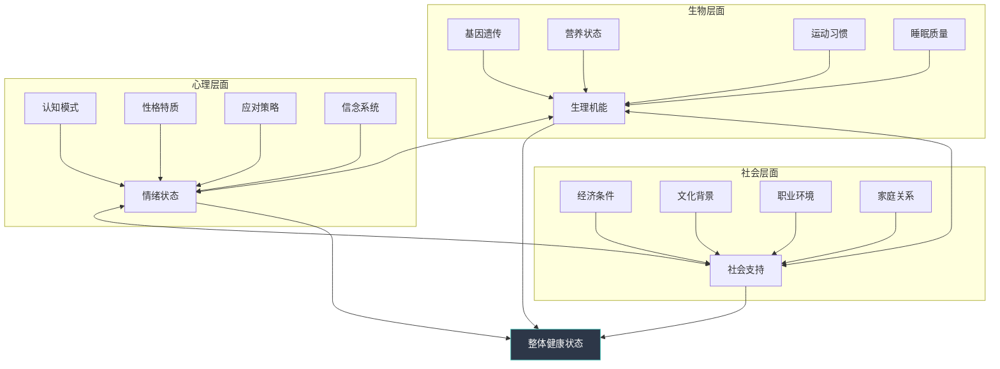
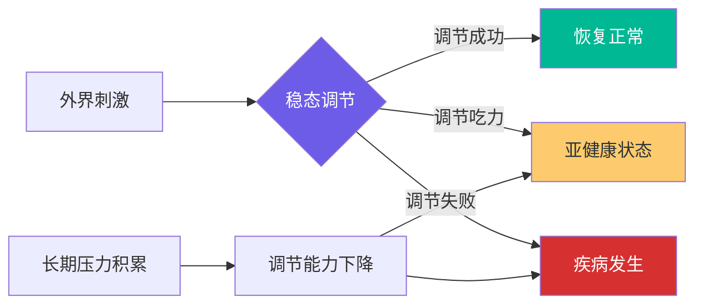
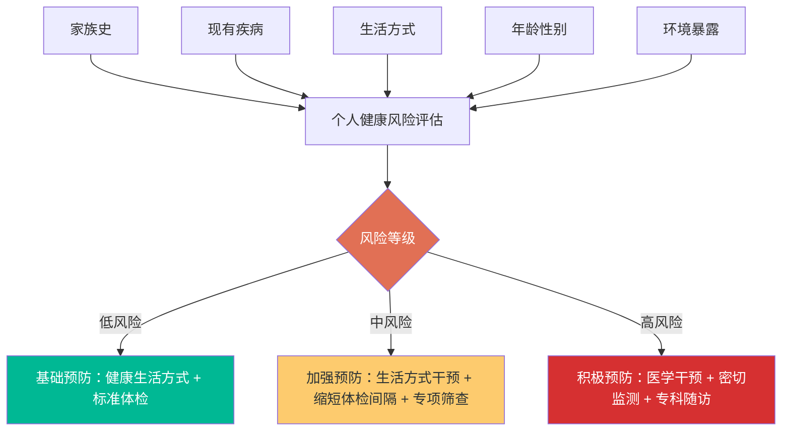
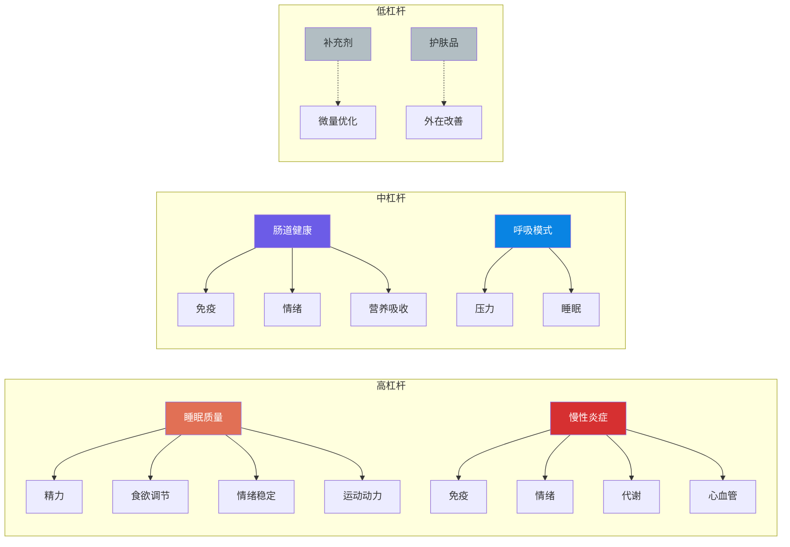
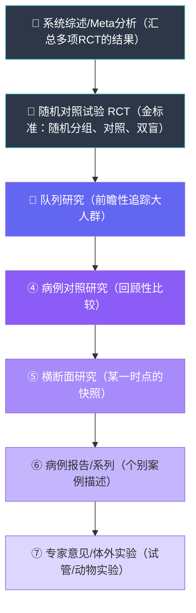
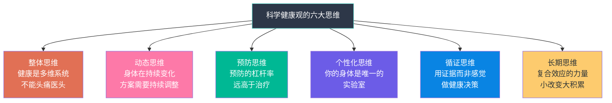

## 七、建立科学的健康观

> "医学的目的，不是让人不死，而是让人活得更好。"——阿图·葛文德《最好的告别》

建立科学的健康观，是健康养生的**底层操作系统**。前面六章分别讲了睡眠、营养、运动、压力管理、中医养生——那些是"术"，本章是"道"。你掌握了科学健康观，就能在面对任何养生信息、健康决策时，拥有独立判断的能力，而不是被焦虑营销牵着走。

本章的目标不是让你记住更多知识点，而是帮你构建**六种健康思维模式**：整体思维、动态思维、预防思维、个性化思维、循证思维、长期思维。这六种思维组合在一起，就是科学健康观的完整框架。

---

### 7.1 健康的完整定义：远不止"没生病"

#### 7.1.1 从"无病即健康"到三维健康观

大多数人对健康的直觉判断是"有没有生病"。这种认知在农耕时代或许合理——感染、外伤、急性病是主要威胁，没生病就意味着生存没问题。但现代社会的疾病谱已经发生根本性转变：慢性非传染性疾病（心脑血管病、糖尿病、癌症、抑郁症）占中国总死亡的**88.5%**（中国疾控中心，2023年），而在这些疾病出现明显症状之前，患者往往觉得自己"挺健康的"。

人类对健康的认知经历了三个阶段的升级：

| 阶段 | 时代背景 | 健康定义 | 局限性 |
|------|----------|----------|--------|
| **经验医学时代** | 农耕社会至19世纪 | 无病无痛即健康 | 只关注可见症状，忽视亚健康和心理因素 |
| **生物医学时代** | 20世纪初至1970s | 生理指标正常即健康 | 将人简化为"生物机器"，忽视心理和社会因素 |
| **生物-心理-社会时代** | 1977年至今 | 身心社三维度完好状态 | 仍在发展中，个体化精准化是新方向 |

世界卫生组织在1948年《组织法》中给出的定义至今仍是全球共识：

> "健康不仅是没有疾病或虚弱，而是身体、心理和社会适应的完好状态。"
> ——《世界卫生组织组织法》, 1948

这个定义的核心突破在于：健康不是一种被动的"缺席"状态（没有疾病），而是一种主动的"存在"状态（功能完好）。具体而言，它包含三个不可分割的维度：

| 维度 | 内涵 | 具体指标 | 常见的忽视信号 |
|------|------|----------|--------------|
| **身体健康** | 各器官系统功能正常，体能充沛 | 体检指标正常、心肺功能良好、免疫健全 | 长期亚健康但指标"勉强及格" |
| **心理健康** | 情绪稳定，认知清晰，能应对压力 | 情绪韧性、自我接纳、目标感、抗压能力 | 持续低落但还能"撑着"上班 |
| **社会适应** | 维持良好人际关系，适应社会变化 | 社交支持网络、归属感、角色胜任力 | 社交逐渐萎缩但觉得"自己就喜欢安静" |

三个维度之间存在紧密的双向影响。哈佛大学长达85年的"成人发展研究"（Harvard Study of Adult Development）追踪了724名参与者的一生，最终发现：**人际关系的质量是预测健康和寿命的最强因子**——比胆固醇水平、运动量、甚至基因背景都要强。孤独感对健康的危害等同于每天吸15支烟（Holt-Lunstad, 2015）。

#### 7.1.2 生物-心理-社会模型

1977年，美国精神科医生乔治·恩格尔（George Engel）在《Science》上发表了**生物-心理-社会模型**（Biopsychosocial Model），将WHO的三维定义进一步系统化。这个模型不再把疾病看作纯粹的生物学事件，而是同时考虑三个层面的交互作用：



**为什么这个模型对你有意义？**

因为它解释了一个常见的困惑：为什么有些人"生活方式很健康"却依然生病，有些人"生活不规律"却活到90岁？答案在于，基因和环境因素（生物层面）只是拼图的一部分，你如何感知压力（心理层面）以及你身边有没有支持你的人（社会层面），同样在深刻塑造你的健康轨迹。

一个实际的例子：同样是面对工作压力，一个拥有清晰认知框架（"压力是成长的催化剂"而非"压力是威胁"）、有可以倾诉的朋友、家庭关系和谐的人，其皮质醇反应、免疫指标、心血管指标，都会显著优于一个独自扛着、认为"示弱就是失败"的人——即使两个人的生理基础完全相同。

#### 7.1.3 现代健康观的进阶：功能健康与韧性

除了WHO的三维定义，现代健康科学还提出了两个更深层的概念：

**功能健康**（Functional Health）：不仅关注"有没有病"，更关注"能不能做好想做的事"。一个膝盖没有器质性病变但因为久坐导致髋关节僵硬、无法蹲下的人，从传统医学看是"健康的"，但从功能健康看是受限的。功能健康关注的核心问题是：你的身体能否支持你想要的生活方式？

**健康韧性**（Health Resilience）：指身体和心理在面对压力、疾病、创伤后恢复到正常状态的能力。同样暴露于流感病毒，有人感染后2天恢复，有人卧床一周——差异不仅在于免疫系统的"火力"，更在于恢复速度。健康韧性的高低比单纯的"是否生病"更能预测长期健康结局。

衡量健康韧性的简易指标：

| 指标 | 测量方法 | 良好标准 |
|------|----------|----------|
| 运动后心率恢复 | 剧烈运动后1分钟内心率下降幅度 | 下降 > 12次/分 |
| 睡眠后精力恢复 | 起床后30分钟内的主观精力评分 | ≥ 7/10分 |
| 感冒恢复速度 | 普通感冒从发病到症状消失的天数 | ≤ 5天 |
| 压力后情绪恢复 | 重大压力事件后恢复到正常情绪的时间 | ≤ 3天 |
| 伤口愈合速度 | 小伤口（如纸割伤）到完全愈合 | ≤ 7天 |
| 静息心率变异性 | 用智能手环测量HRV（心率变异性） | RMSSD ≥ 30ms |

#### 7.1.4 身心交互：被低估的健康维度

生物-心理-社会模型中，"心理"和"身体"之间的双向通道比多数人想象的要强大得多。心理神经免疫学（Psychoneuroimmunology, PNI）是研究这一交叉领域的学科，其核心发现正在重塑我们对健康的理解。

**心理状态如何改变生理指标：**

- **安慰剂效应**的生理基础：患者相信自己在接受有效治疗时，大脑会释放内啡肽和多巴胺，产生真实的镇痛和抗炎效果。哈佛大学Ted Kaptchuk教授的研究发现，即使告诉患者"这只是安慰剂"，依然能产生显著的临床改善——这说明"相信能好"本身就是一种生理机制。
- **压力对免疫的直接影响**：急性压力（如考试前一晚）会使促炎细胞因子IL-6上升40%，慢性压力则导致T细胞活性持续下降。卡耐基梅隆大学Sheldon Cohen教授的经典实验证明：长期心理压力高的人，接触感冒病毒后感染率是低压力者的2.8倍。
- **抑郁与慢性炎症的双向通路**：抑郁症患者血液中的C反应蛋白（CRP）水平平均高出30-50%；反过来，慢性炎症状态也会诱发抑郁症状——这就是为什么很多慢性病患者同时伴有抑郁，不仅仅是"心情不好"。

**身体状态如何影响心理认知：**

- **肠道菌群与情绪**：肠道微生物产生人体约95%的血清素（一种关键的"快乐神经递质"）和约50%的多巴胺。肠道菌群失衡已被关联到焦虑、抑郁、甚至认知功能下降。粪菌移植实验中，将抑郁症患者的肠道菌群移植给无菌小鼠，小鼠会表现出抑郁样行为——这是心理状态受肠道微生物调控的直接证据。
- **运动对大脑的重塑**：有氧运动促进脑源性神经营养因子（BDNF）分泌，BDNF被称为"大脑的肥料"，能促进海马体（记忆中枢）的神经元新生。哈佛大学John Ratey教授的追踪研究显示，规律运动对轻中度抑郁的治疗效果与抗抑郁药物相当。
- **睡眠对情绪调节的影响**：一晚睡眠不足后，杏仁核（大脑的"恐惧中心"）对负面刺激的反应性增加60%，而前额叶皮层（理性控制中心）与杏仁核的功能连接减弱——这从神经机制上解释了为什么失眠后你会更容易烦躁、焦虑、做出冲动决定。

**实操意义**：身心交互的科学发现告诉我们，健康不能"头痛医头"。当你长期情绪低落时，与其只寻找心理原因，不如同时检查：肠道是否健康（排便是否规律、是否有胀气）、睡眠是否充足、是否有慢性炎症（牙周炎、鼻窦炎、关节不适）、运动是否足够。多维度同时干预的效果，远大于单点突破。

---

### 7.2 健康是动态平衡：你的身体是一个复杂适应系统

#### 7.2.1 稳态与应变：身体的自我调节机制

健康不是某个固定指标的数值，而是一种持续调节的能力。生理学上称之为**稳态**（Homeostasis）——身体通过负反馈机制将核心参数维持在适宜范围内。体温维持在36.5-37.5°C、血糖维持在3.9-6.1mmol/L（空腹）、血压维持在90-120/60-80mmHg——这些都不是单一数值，而是一个动态范围。

稳态的关键不在于"精确控制"，而在于**调节能力**。一个健康的身体应该：
- 吃了高糖食物后，血糖在2小时内回到正常范围（而不是一直偏高）
- 遇到寒冷环境后，通过寒战和血管收缩迅速维持核心温度（而不是持续发冷）
- 经历一夜失眠后，第二天通过更深的深度睡眠来补偿（而不是连续失眠）

当你发现身体的调节能力在下降——吃了甜食后持续犯困、小伤口愈合越来越慢、感冒频率增加——这些是比体检指标更早的健康预警信号。



**如何增强稳态调节能力：**
1. **规律运动**是训练稳态的最有效方式——运动本身就是对身体施加可控的"压力"，迫使调节系统不断适应和强化
2. **间歇性挑战**：冷水浴、桑拿、轻断食等，都是在安全范围内给稳态系统"上强度"
3. **充足睡眠**是稳态系统"维修和升级"的窗口期——深度睡眠中，大脑清除代谢废物（β-淀粉样蛋白等）、修复DNA损伤、巩固免疫记忆
4. **减少慢性压力**：长期的皮质醇升高会"磨损"HPA轴（下丘脑-垂体-肾上腺轴），降低调节系统的灵敏度

#### 7.2.2 生命不同阶段的健康重点

健康需求不是静态的，而是随着生命阶段不断演变。以下是不同年龄段的核心关注点：

| 年龄段 | 生理变化 | 健康重点 | 关键风险筛查 |
|--------|----------|----------|------------|
| **18-25岁** | 身体机能巅峰，但生活方式风险开始积累 | 建立健康习惯基础，避免"年轻资本"透支 | 性传播疾病筛查、心理健康评估 |
| **25-35岁** | 基础代谢开始下降（每10年降2-5%），工作压力上升 | 应对代谢变化，管理压力，建立运动习惯 | 甲状腺功能、血脂、血压基线 |
| **35-45岁** | 激素水平变化（男睾酮/女雌激素下降），肌肉量开始流失 | 力量训练对抗肌肉流失，定期深度体检 | 肿瘤标志物、心血管风险评估、骨密度 |
| **45-55岁** | 慢性病高发窗口期，女性进入围绝经期 | 密切监控代谢指标，调整运动强度 | 结直肠镜、胃肠镜、心脏超声、眼底检查 |
| **55-65岁** | 免疫功能下降明显，骨质疏松加速 | 预防跌倒、维持认知功能、保持社交活跃 | 骨密度、认知筛查、前列腺/乳腺检查 |
| **65岁以上** | 多功能系统性衰退，多重用药风险增加 | 维持独立生活能力，管理多重慢性病 | 全面老年综合评估（CGA）、用药审核 |

**核心认知**：不要等到某个年龄段才开始关注对应的风险。35岁开始规律运动的人，55岁时的骨密度可以比不运动的同龄人高20-30%。25岁开始建立的心理韧性，会在45岁时的中年危机中成为关键的缓冲器。每一个阶段的健康投资都有**复合回报**。

#### 7.2.3 环境适应与季节调节

身体的动态平衡还体现在对环境变化的适应上。中医的"天人合一"理念与现代环境生理学有高度共识：

**温度适应**：人体对热和冷的适应需要时间。从空调房直接进入高温环境，热射病的风险远高于循序渐进的暴露。建议在季节转换时，给身体1-2周的适应窗口，逐步调整运动强度和衣物。中国疾控中心数据显示，每年7-8月热相关急诊中，约40%的患者在发病前6小时内经历了从空调环境到高温环境的快速切换。

**光照适应**：日照时间的变化直接影响褪黑素分泌和血清素水平。冬季日照不足是季节性情感障碍（SAD）的主要原因，北欧国家冬季SAD发病率高达10-20%。在中国北方城市，冬季适当补充光照（每天清晨30分钟、10000勒克斯光照灯）可以有效预防情绪低落。

**海拔适应**：从平原到高原（>2500米），血氧饱和度下降，心率代偿性上升。完全适应需要2-4周。有心肺基础疾病的人在高海拔地区需要特别谨慎。

**时区与生物钟**：频繁跨时区旅行的人（如国际商务人士）面临"社交时差"——你的社会时钟（工作日程）和生物时钟（昼夜节律）不一致。研究显示，长期社交时差（>2小时）与代谢综合征风险增加30%有关。如果你的工作需要频繁出差，建议用光线暴露策略（到达后白天多晒太阳、晚上避免强光）加速生物钟校准。

---

### 7.3 预防优于治疗：从"治已病"到"治未病"

#### 7.3.1 为什么预防是最高杠杆的健康投资

现代医学已经积累了压倒性的证据：**大多数慢性疾病可以通过生活方式干预来预防**。

| 疾病类型 | 可预防比例 | 关键预防因素 | 来源 |
|----------|-----------|------------|------|
| 心脏病 | 约80% | 不吸烟、健康饮食、规律运动、控制血压 | WHO, 2022 |
| 2型糖尿病 | 约80% | 维持健康体重、规律运动、控制精制碳水 | DPP研究 |
| 中风 | 约75% | 控制血压、不吸烟、规律运动、健康饮食 | INTERSTROKE研究 |
| 癌症（整体） | 约40% | 不吸烟、防晒、健康体重、限制酒精、疫苗接种 | WHO/IARC |
| 痴呆症 | 约40% | 规律运动、社交活跃、控制血压、认知训练 | Lancet Commission, 2020 |

**经济学视角**：哈佛大学公共卫生学院的研究显示，在预防上每投入1美元，可以节省5.6美元的治疗费用。一次全面体检的费用（500-2000元）远低于一次住院治疗的平均费用（超过1.5万元）。更重要的是，住院还有隐性成本：误工损失、陪护成本、康复时间、以及无法用金钱衡量的生活质量下降。

**时间窗口**：许多慢性疾病有10-20年的潜伏期。动脉粥样硬化从20岁左右就开始发展（美国越战士兵的尸检研究发现，18-22岁士兵中已有77%存在冠状动脉早期病变）。2型糖尿病在确诊前7-10年就已经出现胰岛素抵抗。你现在的生活方式，决定了10-20年后的健康状况。

**中国数据补充**：《中国心血管健康与疾病报告2023》显示，中国心血管疾病患者约3.3亿，每年心血管病死亡约400万，但其中超过80%的事件可以通过生活方式干预预防。中国糖尿病患者约1.4亿，其中超过50%处于糖尿病前期（尚未确诊），这个窗口期是逆转的黄金时间。

#### 7.3.2 预防的三级体系

医学上的预防分为三个层次：

**一级预防（病因预防）**：在疾病发生之前消除或减少致病因素的暴露。
- 健康饮食、规律运动、不吸烟、限酒
- 疫苗接种（HPV疫苗预防宫颈癌、乙肝疫苗预防肝癌）
- 职业防护（减少有害物质暴露）
- 心理韧性培养（预防心理疾病的发生）

**二级预防（早发现早治疗）**：在疾病早期、无症状阶段通过筛查发现。
- 癌症筛查：结直肠镜（45岁起）、乳腺钼靶/超声（40岁起）、宫颈涂片（21岁起）、低剂量CT（50岁以上吸烟者）
- 代谢筛查：空腹血糖、糖化血红蛋白、血脂四项（25岁起每3年）
- 心血管筛查：血压、心电图（30岁起每年）
- 心理健康筛查：PHQ-9（抑郁）、GAD-7（焦虑）自评量表，每年至少一次

**三级预防（康复预防）**：已有疾病者防止病情恶化和并发症。
- 糖尿病患者严格的血糖管理预防视网膜病变、肾病、神经病变
- 高血压患者的药物依从性和生活方式管理预防中风
- 抑郁症患者的复发预防计划（识别早期预警信号、维持治疗）

**中国推荐的体检频率与项目**：

| 年龄段 | 体检频率 | 核心项目 | 增加项目 |
|--------|----------|----------|----------|
| 20-30岁 | 每2年 | 血常规、肝肾功能、血脂、空腹血糖、血压、BMI | 性传播疾病筛查（如有高危行为）、甲状腺功能 |
| 30-40岁 | 每1-2年 | 上述 + 甲状腺功能、心电图、腹部超声 | 肿瘤标志物（如有家族史）、糖化血红蛋白 |
| 40-50岁 | 每年 | 上述 + 糖化血红蛋白、颈动脉超声、幽门螺杆菌 | 胃肠镜（首次，此后每3-5年） |
| 50岁以上 | 每年 | 上述 + 骨密度、眼底检查、肺部CT | 结直肠镜（每5-10年）、心脏超声 |

**特别提醒**：以上是中国医师协会的通用建议，个体化调整至关重要。如果你有以下情况，应提前或增加筛查频率：一级亲属有早发心血管疾病（男<55岁、女<65岁）或癌症家族史；长期吸烟史（>20年）；BMI>28；久坐不动的生活方式；长期高压或慢性睡眠不足。

#### 7.3.3 预防的实操框架：风险分层管理

不是所有人都需要做所有检查。科学的预防策略是基于个人风险分层：



**高风险因素清单**（具备2项以上建议增加筛查频率）：
- 一级亲属中有55岁前患心血管疾病者
- 一级亲属中有糖尿病患者
- 一级亲属中有癌症患者（尤其同类型）
- BMI > 28 或腰围超标（男 > 90cm，女 > 85cm）
- 长期吸烟或重度饮酒
- 久坐不动（每周运动 < 1次）
- 长期高压工作/慢性睡眠不足
- 特定职业暴露（化工、粉尘、辐射等）

---

### 7.4 个性化原则：你的身体是唯一的实验室

#### 7.4.1 为什么"一刀切"的健康建议会失败

基因组学时代的一个核心认知是：**人与人之间的生理差异远比想象中大**。同样一个健康建议，对不同人的效果可能截然相反。

**代谢差异**：2015年《Cell》杂志发表的里程碑研究（Zeevi et al.）发现，同一种食物（例如白面包），不同人的餐后血糖反应差异可达20倍。有人血糖飙升，有人几乎无反应——这取决于个体的肠道菌群组成、基因型、基线代谢状态和近期饮食史。这意味着"低GI饮食"对某些人可能根本没有意义，因为他们对碳水化合物的血糖反应本身就温和。

**药物代谢**：CYP450酶系（肝脏中负责药物代谢的核心酶家族）的基因多态性导致同一种药物在不同人体内的代谢速度差异可达10-100倍。例如，华法林（常用抗凝药）的有效剂量在不同个体间可以相差20倍。氯吡格雷（抗血小板药）在中国人群中约14%是CYP2C19慢代谢型，常规剂量对他们几乎无效——这直接关系到支架术后是否再梗。这意味着"标准剂量"对某些人可能是过量的，对另一些人可能是不足的。

**运动反应**：HERITAGE家族研究（加拿大一项大型运动遗传学研究）发现，同样的有氧训练计划，不同个体的最大摄氧量（VO₂max）提升幅度差异巨大——从几乎0%到50%不等。约15%的人对有氧训练几乎没有反应。这不意味着运动无用，而是意味着需要找到适合自己的运动类型和强度。

**睡眠需求**：虽然成人推荐7-9小时睡眠，但确实存在天生的"短睡眠者"（DEC2基因突变携带者），他们每天只需4-6小时即可保持最佳状态。同时也有"长睡眠者"，需要9-10小时才能充分恢复。用统一标准要求所有人，是不科学的。

**肠道菌群差异**：你的肠道中约有38万亿微生物（比人体自身细胞还多），它们的组成因人而异，受出生方式（顺产vs剖腹产）、母乳喂养、饮食习惯、抗生素使用史等因素影响。不同人的肠道菌群对同一种膳食纤维的发酵产物可能完全不同——这直接影响了食物的营养价值和健康效果。

#### 7.4.2 个性化健康方案的构建步骤

构建个性化方案不是凭感觉，而是一个有结构的过程：

**第一步：建立基线数据**

连续14天记录以下数据，建立你的个人健康基线：

```text
每日记录项：
┌──────────────────────────────────────────────┐
│ 日期：________                               │
│                                               │
│ 睡眠：上床时间___  入睡时间___  醒来时间___   │
│       睡眠时长___  主观质量(1-10)___          │
│                                               │
│ 饮食：早餐___  午餐___  晚餐___  加餐___     │
│       饮水量___  饮酒量___  咖啡因___         │
│                                               │
│ 运动：类型___  时长___  强度(低/中/高)___     │
│       日常步数___                             │
│                                               │
│ 身心：精力水平(1-10)___  情绪状态(1-10)___    │
│       压力感受(1-10)___  特殊症状___          │
│                                               │
│ 环境：工作压力(低/中/高)___  天气___          │
│       社交活动(有/无)___                      │
└──────────────────────────────────────────────┘
```

**第二步：寻找模式**

14天后，分析数据中的规律：
- 晚上几点入睡时，第二天精力最好？
- 吃了哪些食物后，精力或情绪出现波动？
- 运动后的睡眠质量是否有变化？
- 哪些天的情绪最差？前一天发生了什么？

**第三步：变量控制实验**

每次只改变一个变量，观察至少7天的效果。例如：
- 周一到周日，将入睡时间从00:00提前到23:00
- 连续7天记录精力、情绪、睡眠质量的变化
- 如果改善明显，固定这个改变后再尝试下一个变量

**第四步：定期复评与调整**

每个月用14天的数据与上个月对比，评估改善趋势。季节变化、工作变化、年龄增长都会改变你的最优参数——方案需要持续迭代。

#### 7.4.3 基因检测在个性化健康管理中的角色

消费级基因检测（如23andMe、华大基因等）可以提供以下参考信息：

| 检测类别 | 可提供的信息 | 可信度 | 实际价值 |
|----------|------------|--------|---------|
| 营养代谢 | 咖啡因代谢速度、乳糖不耐受、酒精代谢能力 | 高（单基因性状） | 高——直接影响饮食选择 |
| 药物代谢 | CYP450酶活性分型 | 高 | 高——指导用药安全 |
| 疾病风险 | 某些疾病的遗传易感性 | 中低（多基因疾病预测力有限） | 中——提示筛查重点 |
| 运动能力 | 肌纤维类型倾向、有氧训练反应 | 中 | 中——指导运动类型选择 |
| 皮肤特征 | 光老化风险、色素沉着倾向 | 中 | 低——不如直接观察皮肤反应 |

**重要提醒**：基因是"蓝图"，不是"判决书"。携带某个疾病的易感基因不等于一定会得病，环境和生活方式可以通过表观遗传机制"关闭"或"打开"相关基因的表达。基因检测最大的价值在于：**告诉你在哪里需要更加注意，而不是告诉你注定会发生什么**。

#### 7.4.4 肠道菌群检测与个性化营养

随着微生物组研究的深入，肠道菌群检测正在成为个性化健康管理的新工具。

**当前能做到的**：
- 通过16S rRNA测序或宏基因组测序，了解肠道菌群的组成概况
- 识别是否存在明显的菌群失调（如双歧杆菌、乳酸杆菌比例偏低）
- 发现某些与疾病相关的菌群模式（如Akkermansia muciniphila的丰度与代谢健康正相关）

**当前还不能做到的**：
- 精准推荐"你应该吃什么"——菌群与饮食的交互极其复杂，目前还不能从菌群报告直接推导个性化食谱
- 精准预测疾病——菌群与疾病的关联大多是相关性，因果关系还在研究中
- 菌群"改写"——虽然益生菌/益生元/粪菌移植有前景，但效果因人而异且持久性有待验证

**实操建议**：目前阶段，肠道菌群检测更多是"了解自己"的参考，而非"治疗方案"的依据。维持肠道菌群健康的最有效方法仍然是：多样化膳食纤维摄入（每天30种以上不同植物来源的食物是最佳目标）、限制超加工食品、规律运动、充足睡眠、减少不必要的抗生素使用。

---

### 7.5 系统性思维：健康是一个多维度的网络问题

#### 7.5.1 线性思维的陷阱

大多数人处理健康问题的方式是线性的：头痛→吃止痛药，失眠→吃安眠药，发胖→节食。这种"出现症状→消灭症状"的思维模式，对于急性问题有效，但对于慢性健康问题几乎必然失败——因为它忽略了症状背后的系统性原因。

一个经典的例子：**慢性疲劳**。线性思维会直接寻找"能量不足"的原因——是贫血？是甲状腺功能低下？这些确实需要排查，但如果排除了器质性原因，线性思维就走到了死胡同。

系统性思维则会追问：这个人的睡眠质量如何？是否有未被识别的睡眠呼吸暂停？他的饮食中是否有足够的铁和B12？他是否有长期的慢性炎症（牙周炎、肠漏）？他的压力水平如何——慢性压力会导致肾上腺疲劳样症状？他的运动模式是否过度或不足？他是否有隐性的抑郁？

很多时候，慢性疲劳的"根因"不是单一的，而是睡眠质量下降+肠道菌群失调+慢性心理压力三个因素的叠加效应。只解决其中一个，效果有限；同时优化三个，问题可能从根本上改善。

#### 7.5.2 健康的杠杆点：找到影响最大的节点

系统思维的关键是找到**杠杆点**（leverage point）——一个小小的改变能带来系统性改善的关键节点。在健康管理中，常见的杠杆点包括：



**最高杠杆点：睡眠**

睡眠之所以是最高杠杆点，是因为它同时影响几乎所有其他健康维度：
- 睡眠不足时，瘦素下降18%、饥饿素上升28%，你第二天会自动多摄入300-400大卡
- 一晚睡眠不足（<4小时）使NK细胞（自然杀伤细胞）活性下降70%
- 连续两周每晚只睡6小时，认知表现等同于连续48小时不睡觉
- 睡眠不足时前额叶皮层功能下降，做出健康选择的能力显著减弱

改善睡眠往往能触发连锁反应：精力改善→开始自己做饭→饮食质量提升→有体力运动→整体健康改善。这就是杠杆效应。

**第二杠杆点：慢性炎症**

慢性低度炎症（Chronic Low-Grade Inflammation）是现代多种慢性病的共同土壤，被称为"沉默的杀手"。它与以下疾病直接相关：
- 心血管疾病（血管内壁的慢性炎症导致斑块形成）
- 2型糖尿病（炎症因子干扰胰岛素信号通路）
- 抑郁症（炎症因子影响神经递质代谢）
- 癌症（慢性炎症促进细胞异常增殖）
- 神经退行性疾病（神经炎症加速神经元死亡）

**如何评估自己的炎症水平**：如果你做过体检，关注以下指标：
- **高敏C反应蛋白（hs-CRP）**：正常<1 mg/L，1-3 mg/L为中等风险，>3 mg/L提示慢性炎症
- **白细胞计数**：正常4-10×10⁹/L，持续偏高（即使在正常上限）可能提示慢性炎症
- **血沉（ESR）**：正常男性<15mm/h，女性<20mm/h

降低慢性炎症的关键生活方式因素：
1. 减少超加工食品摄入（其中的乳化剂、防腐剂、反式脂肪直接促炎）
2. 增加Omega-3脂肪酸摄入（深海鱼、亚麻籽、核桃），目标Omega-6/Omega-3比例<4:1
3. 规律运动（中等强度运动具有抗炎效应，但过度运动反而促炎）
4. 充足睡眠（睡眠不足直接升高CRP和IL-6等炎症标志物）
5. 管理心理压力（慢性压力通过HPA轴维持炎症状态）
6. 维护口腔健康（牙周炎是常见的隐性炎症来源，与心血管疾病风险直接相关）

#### 7.5.3 系统性优化的实操框架

不要试图同时优化所有维度。系统性思维的实操关键是：**找到最弱的环节，集中力量修复它**。

评估你的健康系统最弱环节的方法：

**问卷快速定位法**：对以下10个维度分别打分（1-10分），取最低的2个维度作为优先改善目标：

| 维度 | 评估问题 |
|------|----------|
| 睡眠 | 我每晚的睡眠时长和质量是否让我白天精力充沛？ |
| 饮食 | 我的饮食模式是否多样化、以天然食物为主？ |
| 运动 | 我是否每周进行至少150分钟中等强度运动？ |
| 压力 | 我的日常压力是否在可控范围内？ |
| 社交 | 我是否有足够的社会支持和高质量的人际关系？ |
| 情绪 | 我的总体情绪状态是否积极稳定？ |
| 体重 | 我的BMI和体脂率是否在健康范围内？ |
| 慢性症状 | 我是否没有持续的疼痛、疲劳或其他不适？ |
| 认知 | 我的注意力、记忆力、思维清晰度是否良好？ |
| 生活满意度 | 我对自己的生活整体是否满意？ |

**操作原则**：先修复最低分的1-2个维度，等它们提升到6分以上后，再关注下一个最弱维度。不要贪多——同时优化5个以上维度，几乎必然导致精力分散和全面失败。

---

### 7.6 长期视角：健康是一场终身马拉松

#### 7.6.1 为什么急功近利是健康管理最大的敌人

健康领域充斥着"21天改变体质"、"7天排毒"、"一个月减20斤"的承诺。这些速成方案的问题不在于它们"完全无效"，而在于它们制造了一种有害的心理预期：**健康改善应该是快速的、剧烈的、一次性完成的**。

现实是，身体的适应是缓慢的、累积的、持续进行的。考虑以下时间线：

| 健康改变 | 生理适应所需时间 | 机制 |
|----------|----------------|------|
| 运动后心率恢复改善 | 2-4周 | 心脏每搏输出量增加、迷走神经张力提升 |
| 血压对减盐的反应 | 4-6周 | 肾脏钠排泄调节、血管内皮功能改善 |
| 肌肉力量显著增长 | 6-8周 | 神经肌肉适应（前期）→肌纤维增粗（后期） |
| 体脂率明显下降 | 8-12周 | 脂肪细胞缩小、代谢率适应性调整 |
| 血脂指标改善 | 8-12周 | 肝脏脂蛋白代谢重塑 |
| 静息心率显著下降 | 12-16周 | 心脏结构重塑（左心室容积增加） |
| 骨密度改善 | 6-12个月 | 成骨细胞活性增强、骨小梁重塑 |
| 心血管疾病风险降低 | 1-2年 | 动脉粥样硬化斑块稳定/缩小 |

**习惯形成的时间线**：伦敦大学学院Phillippa Lally教授的研究（2009年，《European Journal of Social Psychology》）发现，一个新习惯从"刻意执行"变成"自动化行为"平均需要**66天**。但不同习惯差异巨大——简单习惯（如每天喝一杯水）可能只需18天，复杂习惯（如每天晨跑）可能需要254天。

关键发现：偶尔漏掉一天不会破坏习惯的形成过程。真正破坏习惯的是**连续三天以上的中断**。所以如果某天没执行计划，不必自责，第二天恢复正常即可——但不要让它变成连续缺席。

#### 7.6.2 复合效应：小改变的惊人累积

健康习惯的回报呈指数增长，而非线性增长。虽然"每天改善1%，一年后翻37倍"是一个过于理想化的数学模型，但它传达的核心思想是正确的：**微小的、持续的改进，会产生惊人的累积效果**。

一个更实际的例子：

```text
小王的健康改变历程（假设数据）：

第0个月：体重85kg，静息心率82次/分，每天睡眠6小时
│
│ 每天早睡30分钟 + 每周步行3次×30分钟
│
第3个月：体重82kg，静息心率78次/分，每天睡眠6.5小时
│ 开始自己做午餐 + 增加力量训练
│
第6个月：体重78kg，静息心率72次/分，每天睡眠7小时
│ 进一步优化饮食结构 + 周末加入游泳
│
第12个月：体重73kg，静息心率65次/分，每天睡眠7.5小时
│ 体检：血脂正常、血糖正常、脂肪肝消失
│
第24个月：体重70kg，静息心率58次/分
│ 完成首个半程马拉松
│ 心血管年龄逆转约8年
```

没有任何一个改变是"戏剧性的"。但24个月的累积效应是：体重减少15kg、静息心率降低24次/分、脂肪肝完全逆转、完成半程马拉松。这就是复合效应的力量。

#### 7.6.3 不同阶段的健康管理策略


| 阶段 | 目标 | 具体策略 | 心态要求 |
|------|------|----------|----------|
| **启动期** | 建立1-2个核心习惯 | 选择最容易改变的习惯开始（通常是睡眠时间），设定非常低的门槛（如"每天提前15分钟上床"） | 不追求完美，只追求开始 |
| **适应期** | 扩展习惯范围 | 在第一个习惯稳固后加入第二个改变（如饮食或运动），开始记录数据 | 关注趋势而非单日数据 |
| **巩固期** | 形成自动化行为 | 习惯开始变得"不假思索"，可以适当提高标准和增加挑战 | 接受偶尔的倒退，不因一天失败放弃 |
| **维持期** | 应对外部干扰 | 旅行、加班、节日等场景下维持核心习惯不崩塌，发展灵活的"最低执行标准" | 有弹性地坚持而非僵化地执行 |
| **进阶期** | 持续迭代优化 | 根据体检数据、运动表现、主观感受不断微调方案，探索新的健康知识领域 | 把健康管理变成生活方式而非"项目" |

**"最低执行标准"**的概念至关重要：在你状态最差的日子（感冒、加班、出差、情绪低谷），你需要一个"无论如何都能做到"的最低标准。例如：

- 睡眠最低标准：即使不能11点睡，也保证至少6小时睡眠
- 运动最低标准：即使不能去健身房，也至少步行15分钟
- 饮食最低标准：即使吃外卖，也至少点一份蔬菜
- 心理最低标准：即使状态很差，也至少做3分钟深呼吸

最低标准的作用不是"让健康继续进步"，而是**防止系统崩塌**。它就像一个安全网，确保你在低谷期不会跌得太深，状态回升后能更快恢复到正常轨道。

---

### 7.7 循证思维：如何判断健康信息的可靠性

#### 7.7.1 信息爆炸时代的健康信息困境

互联网时代，每个人都可以发布健康建议。社交媒体上充斥着各种"震惊！XX食物致癌/抗癌"、"每天一杯XX，XX天后身体发生惊人变化"的内容。美国Pew研究中心的调查显示，约72%的互联网用户曾搜索过健康信息，但其中只有不到15%的人能够正确评估信息的可靠性。

**健康伪科学的典型特征**：

| 特征 | 具体表现 | 示例 |
|------|----------|------|
| 绝对化表述 | "XX是万能的"、"XX绝对不能吃" | "牛奶是万毒之源"、"每天必须喝8杯水" |
| 诉诸个案 | "我/我朋友/名人用了XX就好了" | "我的邻居吃了XX三个月癌症消失了" |
| 忽视剂量 | 只谈成分，不谈剂量和形式 | "苹果核含有氰化物所以有毒"（实际上含量极低） |
| 伪术语包装 | 使用听起来很科学但实际无意义的术语 | "排毒"、"酸碱体质"、"量子养生" |
| 制造恐惧 | "你一直在吃的XX其实致命" | 标题党、恐慌营销 |
| 利益驱动 | 推荐特定产品或服务 | 文章最后总是导向某个保健品的购买链接 |
| 诉诸传统/自然 | "纯天然"、"古法"、"老祖宗的智慧" | "纯天然无毒副作用"（天然≠安全） |
| 引用"国外研究"但不给出处 | 声称"哈佛研究发现..."、"日本科学家证实..." | 实际上查不到对应文献，或被断章取义 |

#### 7.7.2 证据金字塔：不同证据的可信度层次

不是所有"研究"都同样可靠。以下是医学证据的可信度等级：



**关键概念解释**：

- **Meta分析**：将多项同类研究的数据合并统计，能得出更可靠的结论。如果一篇Meta分析纳入了50项RCT、覆盖10万参与者，其结论远比单个小型研究可靠。但也要注意Meta分析的质量——"垃圾进，垃圾出"，如果纳入的研究本身质量差，合并后的结论也不可信。
- **RCT（随机对照试验）**：将参与者随机分成实验组和对照组，消除混杂因素。双盲设计（患者和医生都不知道谁用了真药谁用了安慰剂）能最大限度消除安慰剂效应和观察者偏倚。
- **队列研究**：前瞻性追踪一大群人多年，观察暴露因素与疾病的关系。例如Framingham心脏研究追踪了三代人，发现了高血压、高胆固醇、吸烟与心脏病的关系。缺点是耗时长、成本高，且无法完全排除混杂因素。
- **病例对照研究**：比较患病者和未患病者之前的暴露史，回顾性寻找关联。速度快但容易受回忆偏倚影响。

**如何快速判断一个健康声明的可靠性**：

1. **看证据类型**：是基于系统综述/RCT，还是基于个案/动物实验？试管里能杀死癌细胞的物质（如漂白剂），不一定对人体安全有效
2. **看研究规模**：参与人数越多（>1000人），结果越可靠。5个人的"研究"几乎不能说明任何问题
3. **看发表期刊**：Nature、Science、Lancet、NEJM、JAMA、BMJ是顶级期刊；某些"开放获取"期刊只要交钱就能发表
4. **看利益冲突**：研究是否由保健品公司资助？结论是否指向某个特定产品的购买？
5. **看可重复性**：这个结论是否被其他独立研究团队验证过？单次研究的结果可能受偶然因素影响
6. **看剂量效应**：是否说明了达到效果所需的剂量？"XX有益"但没说需要吃多少，通常是不完整的
7. **看效应量（Effect Size）**：统计学显著不等于临床意义显著。一项研究可能发现"有统计学差异（p<0.05）"，但实际效果微乎其微（如只降低了0.5%的发病率），在临床上毫无意义

#### 7.7.3 常见健康伪概念的科学辨析

**伪概念1："酸碱体质"理论**

声称：人体有酸碱体质之分，酸性体质是万病之源，需要吃碱性食物来"中和"。

科学事实：人体血液pH值维持在7.35-7.45之间，由肺、肾、血液缓冲系统三重机制精密调节。你可以通过饮食改变**尿液**的pH值（因为肾脏排出多余的酸碱），但**无法通过饮食改变血液的酸碱度**。如果你的血液pH值偏离正常范围0.2以上，你会在ICU里而不是在看养生文章。这个理论的提出者Robert O. Young已被法院判定欺诈罪。

**伪概念2："排毒"（Detox）**

声称：体内积累"毒素"，需要通过特定饮食/产品/断食来"排毒"。

科学事实：人体的"排毒系统"由肝脏（Phase I和Phase II代谢反应）、肾脏（滤过和排泄）、肠道（屏障功能和菌群代谢）、皮肤（排汗）、肺（排出挥发性代谢产物）组成，这些系统每天24小时不间断工作。没有任何食物、果汁或排毒产品能"增强"这些器官的功能——如果它们功能受损，你需要的是医院而不是排毒产品。唯一的例外是重金属中毒的螯合治疗和药物过量的洗胃——这些是医学操作，不是养生。

**伪概念3："超级食物"（Superfood）**

声称：某些食物（如蓝莓、藜麦、奇亚籽、牛油果）含有特殊成分，能治愈或预防多种疾病。

科学事实："超级食物"是一个营销术语，没有科学定义。没有任何单一食物能提供人体所需的全部营养。蓝莓确实含有花青素，但花青素的健康效果是基于长期均衡饮食模式，而不是每天喝一杯蓝莓汁就能实现的。更重要的是，一个每天吃蓝莓但同时熬夜、不运动、高压力的人，其健康状况远不如一个不吃蓝莓但生活方式全面健康的人。

**伪概念4："天然=安全"**

声称：天然来源的物质比人工合成的安全，因为"纯天然无副作用"。

科学事实：自然界中毒性最强的物质都是天然的——蓖麻毒素（来自蓖麻子）、肉毒杆菌毒素（天然细菌产生）、鹅膏毒素（来自毒蘑菇）。砒霜、汞、铅都是天然矿物质。"天然"只说明来源，不说明安全性。相反，现代制药工艺中的合成药物经过严格的毒理学测试和临床试验，安全性远高于未经检验的"天然草药"。

**伪概念5："以形补形""吃什么补什么"**

声称：食物的形状暗示了它的功效——核桃补脑（因为像大脑）、猪腰补肾（因为是肾脏）、黑芝麻黑发（因为颜色黑）。

科学事实：食物的营养价值由其化学成分决定，而不是外观。核桃确实含有omega-3脂肪酸（α-亚麻酸），对大脑健康有一定帮助，但这种关联来自于营养学研究，而不是因为核桃"看起来像大脑"。黑芝麻含有的黑色素和头发的黑色素是完全不同的化学物质。猪腰（猪肾）含有较高的胆固醇和嘌呤，过量食用反而增加痛风和心血管风险。

#### 7.7.4 SIFT方法：健康信息的快速验证框架

面对任何一条健康信息，用SIFT方法在30秒内做出初步判断：

| 步骤 | 操作 | 具体做法 |
|------|------|----------|
| **S** — Stop（停下来） | 不要立即相信或转发 | 先暂停，提醒自己：你看到的可能不完整或有偏见 |
| **I** — Investigate the source（调查来源） | 了解信息发布者是谁 | 是专业医疗机构？还是保健品公司的营销号？作者有没有医学背景？ |
| **F** — Find better coverage（寻找更好的报道） | 交叉验证 | 用关键词搜索PubMed、WHO、中国疾控中心，看是否有权威机构的对应信息 |
| **T** — Trace claims（追溯声明的原始来源） | 找到原始研究 | "哈佛研究发现"——到底是哪篇论文？发表在哪个期刊？样本量多大？ |

#### 7.7.5 如何正确使用搜索引擎获取健康信息

**推荐的信息源优先级**：

| 优先级 | 信息源 | 说明 |
|--------|--------|------|
| 1 | 专业医学数据库 | PubMed（生物医学文献）、Cochrane Library（系统综述）、UpToDate（临床决策支持） |
| 2 | 权威机构网站 | WHO、CDC、中国疾控中心、美国NIH、各专业学会官网 |
| 3 | 大学附属医院科普 | 北京协和、华西医院、梅奥诊所等机构的官方科普平台 |
| 4 | 专业科普作者 | 有医学背景、引用原始文献、披露利益冲突的科普写作者 |
| 5 | 大众媒体健康版 | 主流媒体的健康报道（注意区分广告和新闻） |
| ⚠️ | 社交媒体 | 自媒体、短视频、朋友圈——最高风险的信息来源 |

**健康信息检索的实操流程**：

```text
遇到一个健康声明
    │
    ▼
① 搜索"关键词 + PubMed"或"关键词 + 系统综述"
    │
    ▼
② 查看是否有多个独立研究支持该结论
    │
    ├─ 是 → 看研究规模和质量 → 初步可信
    │
    └─ 否 → 查看是否有反驳的研究 → 保持怀疑
    │
    ▼
③ 查看结论的"条件性"——在什么情况下有效？
    │
    ▼
④ 查看是否有利益冲突（谁资助了研究？）
    │
    ▼
⑤ 形成"有保留的判断"，而非"绝对化的信念"
```

---

### 7.8 健康素养：自我管理的底层能力

#### 7.8.1 什么是健康素养

健康素养（Health Literacy）是指个人获取、理解和使用健康信息来做出适当健康决策的能力。它不是医学知识的多少，而是一种**元能力**——关于如何学习和运用健康知识的能力。

世界卫生组织将健康素养分为三个层次：

| 层次 | 含义 | 具体能力 |
|------|------|----------|
| **功能性健康素养** | 能读懂健康信息的基本能力 | 看懂药品说明书、理解体检报告上的正常范围、读懂食品营养标签 |
| **互动性健康素养** | 能主动参与健康决策的能力 | 能向医生提问、能讨论治疗方案、能表达自己的健康偏好 |
| **批判性健康素养** | 能分析和批判性评估健康信息的能力 | 能识别伪科学、能评估证据质量、能权衡利弊做出知情决策 |

大多数人的健康素养停留在功能性层次。从功能性到批判性的跃升，是建立科学健康观的核心目标。

**中国居民健康素养现状**：《中国居民健康素养监测报告2023》显示，中国居民健康素养水平为29.7%——也就是说，只有不到三分之一的中国人具备基本的健康素养。这意味着超过七亿人无法正确理解体检报告、无法区分可靠的健康信息和伪科学、无法与医生进行有效的沟通。提升健康素养，不仅是个人需要，也是社会需要。

#### 7.8.2 看懂体检报告的实用技巧

体检报告是大多数人接触最多的健康数据来源。以下是如何正确解读的关键原则：

**"正常参考范围"的真正含义**：参考范围（Reference Range）不是"健康"和"疾病"的分界线，而是基于统计学——它包含了95%健康人群的数值范围。这意味着：(1) 5%的健康人可能有一项或多项"异常"，(2) 某些指标在正常范围的边缘可能已经提示风险。

**需要关注的"正常范围内偏高/偏低"的指标**：

| 指标 | 正常范围 | 需要关注的"亚异常" | 意义 |
|------|----------|------------------|------|
| 空腹血糖 | 3.9-6.1 mmol/L | 5.6-6.1（糖耐量受损前期） | 已有代谢异常风险，需要干预 |
| 低密度脂蛋白(LDL) | <3.4 mmol/L | 2.6-3.4（有心血管风险因素者） | 对高风险人群而言偏高 |
| 甲状腺激素(TSH) | 0.27-4.2 mIU/L | 2.5-4.2（亚临床甲减） | 可能需要定期复查 |
| 血尿酸 | 男<420 μmol/L | 360-420（高尿酸血症前期） | 痛风和肾病风险增加 |
| 转氨酶(ALT) | 男<50 U/L | 30-50 | 肝脏轻度负担，需排查原因 |
| 糖化血红蛋白(HbA1c) | <6.0% | 5.7-6.4%（糖尿病前期） | 反映近2-3个月平均血糖水平 |

**体检报告的正确心态**：看到"箭头"（↑或↓）不要恐慌，也不要忽视。正确做法是：(1) 记录下来，(2) 跟踪趋势（每半年/一年对比），(3) 如果多项指标异常或单个指标持续恶化，咨询医生。

**建立个人健康档案**：建议把每次体检报告的关键指标录入一个简单的表格（Excel或手机备忘录都行），纵向对比趋势比单次看"箭头"更有意义。一个指标从30升到45（仍在正常范围内但持续上升），可能比一个稳定在55（略高于上限）的指标更值得关注。

#### 7.8.3 与医生有效沟通的技巧

一个常见的困境：在有限的门诊时间（通常只有5-10分钟）内，如何最大化信息获取？

**就诊前准备清单**：

```text
┌────────────────────────────────────────────────┐
│ 就诊准备清单                                     │
│                                                  │
│ □ 主诉：用一句话概括最主要的问题                    │
│ □ 时间线：症状什么时候开始？如何变化的？             │
│ □ 诱因：什么情况下加重/缓解？                       │
│ □ 既往史：之前的检查结果、用药史、过敏史            │
│ □ 用药清单：当前所有正在服用的药物和保健品            │
│ □ 问题清单：我最想问的3个问题（按优先级排序）         │
│ □ 家族史：直系亲属的重大疾病史                      │
└────────────────────────────────────────────────┘
```

**问医生的五个关键问题**（适用于任何诊断或治疗方案讨论）：

1. **这个诊断的确定性有多高？** 还需要做哪些检查来确认或排除？
2. **有哪些治疗选项？** 每种选项的利弊分别是什么？
3. **如果不治疗会怎样？** 自然病程是什么样的？
4. **生活方式能做什么？** 除了药物，我可以通过改变生活方式来改善吗？
5. **什么时候需要复查？** 我怎么知道方案是否有效？

**医患沟通中的常见误区**：
- **只听结论不问原因**：拿到处方后不问"这个药是干什么的？要吃多久？有什么副作用？"——了解自己的治疗方案是你的权利，也是安全用药的基本保障。
- **隐瞒信息**：出于面子或恐惧而不告诉医生真实的饮酒量、用药史、生活方式——这可能导致误诊或不恰当的治疗方案。
- **过度依赖网络信息**：拿着网上搜到的"诊断"去"质问"医生，而不是把它作为讨论的起点。正确的做法是："我在网上看到XX说法，请问这个在我身上适用吗？"
- **期望一次就诊解决所有问题**：复杂问题可能需要多次就诊、多项检查才能明确诊断。合理设置预期，避免因为"一次没查出来"而放弃就医。

#### 7.8.4 数字时代的健康素养

在AI诊断、健康APP、可穿戴设备日益普及的今天，健康素养还需要增加一个新维度：**数字健康素养**。

**AI辅助诊断工具的正确使用**：
- AI症状自查工具（如百度健康、丁香医生的症状自诊功能）可以作为**初步参考**，但绝不应替代医生的面诊。这些工具的局限性在于：无法进行体格检查、无法观察你的整体状态、无法考虑细微的临床线索。
- AI影像诊断（如肺结节AI筛查）在特定场景下准确率已经超过人类放射科医生，但"准确率高"不等于"不需要人类复核"。最佳实践是AI+人类双重审阅。

**健康APP的评估标准**：
- 是否有专业医学团队背书？
- 是否公开了数据来源和算法逻辑？
- 是否存在商业利益导向（推荐特定产品）？
- 隐私政策如何？你的健康数据是否会被卖给第三方？

**可穿戴设备的数据解读**：
- 智能手表/手环测量的睡眠阶段、血氧饱和度、心率变异性等数据，**趋势比绝对值更重要**。单次测量可能有较大误差，但持续追踪的趋势是有参考价值的。
- 不要因为一晚的"深睡比例低"而焦虑——这可能只是佩戴位置不对或算法误判。
- 当设备持续显示异常（如静息心率持续升高、血氧持续偏低）时，值得就医检查。

---

### 7.9 误区与纠正常见的健康认知偏差

#### 7.9.1 "我还年轻，不用管健康"

**为什么错**：慢性病的病理过程从年轻时就开始了。动脉粥样硬化的最早病变可在10-20岁出现。2型糖尿病从胰岛素抵抗到确诊平均需要7-10年。骨密度在25-30岁达到峰值，之后逐年下降——年轻时不"储蓄"骨量，中年后骨质疏松风险显著增加。

**正确做法**：健康管理的最佳投资窗口是在疾病出现之前。20-30岁的健康习惯，决定了40-60岁的身体状况。越早开始，复利越大。

#### 7.9.2 "只要吃得好就行"或"只要锻炼多就行"

**为什么错**：只抓一个支柱而忽视其他支柱，效果会大打折扣甚至适得其反。一个每天跑10公里但长期睡眠不足5小时的人，心血管风险反而高于睡眠充足但运动一般的人。长期睡眠不足者即使饮食和运动都达标，其炎症标志物（CRP、IL-6）水平仍然偏高。

**正确做法**：健康是多维度的系统工程。四大支柱（睡眠、营养、运动、心理）需要协同优化，找到最弱的那个优先改善。

#### 7.9.3 "保健品能弥补不良生活习惯"

**为什么错**：2022年《JAMA》的大型Meta分析汇总了84项研究、近70万参与者的数据，结论是：绝大多数常见维生素和矿物质补充剂对降低全因死亡率、心血管疾病和癌症风险**没有显著效果**。2019年《Annals of Internal Medicine》的研究更发现，某些高剂量抗氧化补充剂（如β-胡萝卜素、维生素E）反而可能增加死亡风险。

**正确做法**：优先通过均衡饮食获取营养素。只在以下情况下考虑补充剂：(1) 经医学检查确认缺乏，(2) 特定生理阶段（如孕期叶酸），(3) 特定疾病状态下的治疗性补充。花钱买保健品之前，先保证每天睡够7小时。

#### 7.9.4 "越贵的体检项目越好"

**为什么错**：过度检查（Over-screening）是一个真实的健康风险。全身PET-CT扫描（每次5000-10000元）能发现大量"假阳性"结果——这些结果提示"可能有问题"但实际上不是疾病。假阳性带来的不仅是经济负担，更是不必要的焦虑、进一步的侵入性检查（如穿刺活检），以及这些检查本身带来的并发症风险。

**正确做法**：体检项目应基于年龄、性别、家族史和个人风险因素来选择，而不是"越贵越好"。参考中国医师协会和各专业学会发布的筛查指南，或咨询你的家庭医生制定个性化体检方案。

#### 7.9.5 "没有症状就是健康"

**为什么错**：许多严重疾病在早期完全没有症状。高血压被称为"沉默的杀手"——很多人在中风或心脏病发作前从不知道自己的血压已经长期偏高。2型糖尿病在早期可能完全没有典型症状（"三多一少"是晚期表现）。早期癌症通常没有疼痛或其他明显症状。

**正确做法**：定期体检是发现"沉默疾病"的唯一可靠方式。不要用"感觉挺好的"来替代客观的健康评估。

#### 7.9.6 "排毒/断食能清除体内毒素"

**为什么错**：如7.7.3节所述，人体有完善的排毒系统（肝脏、肾脏、肠道、肺、皮肤），不需要外部"辅助排毒"。断食或果汁排毒声称的"排出毒素"，实际上排出的是水分和肠道内容物，而肝脏和肾脏的功能并不会因为你不吃东西而增强。长期断食还可能导致肌肉流失、电解质紊乱、代谢率下降。

**正确做法**：支持你的排毒系统正常工作的方式不是"断食"，而是：(1) 充足的水分摄入（帮助肾脏排出代谢废物），(2) 充足的膳食纤维（维持肠道排泄功能），(3) 减少酒精和加工食品的摄入（降低肝脏代谢负担），(4) 充足睡眠（肝脏在深度睡眠期间进行主要的代谢解毒工作）。

#### 7.9.7 "我运动了就可以随便吃"

**为什么错**：运动消耗的热量远低于多数人的想象。慢跑30分钟大约消耗250-350大卡——这相当于一杯奶茶或两片面包的热量。运动的主要价值不在于消耗热量，而在于改善胰岛素敏感性、增强心肺功能、促进肌肉合成、改善心理健康。但这些益处不能抵消长期高糖高脂饮食的伤害。

**正确做法**：运动和饮食是互补关系，不是替代关系。运动让你有更多的"容错空间"，但不能作为放纵饮食的借口。

#### 7.9.8 "心理健康不是'真正的'健康问题"

**为什么错**：抑郁症是全球致残的首要原因（WHO数据），影响超过3.5亿人。在中国，抑郁症的终生患病率约为6.8%，但就诊率不足10%。将心理健康问题视为"矫情"、"想太多"、"意志力不够"，是最大的健康偏见之一。精神疾病有明确的神经生物学基础——它不是"心态问题"，而是大脑神经递质和神经环路的功能异常。

**正确做法**：心理健康和身体健康同等重要。如果持续两周以上出现情绪低落、兴趣丧失、睡眠障碍、食欲改变等症状，应寻求专业心理/精神科帮助，就像发烧持续不退你会去看医生一样。

---

### 7.10 你的健康信息工具箱

#### 7.10.1 可信的健康信息平台

| 平台 | 类型 | 语言 | 特点 | 适用场景 |
|------|------|------|------|----------|
| 丁香医生 | 综合科普 | 中文 | 医学团队审核，信息质量较高 | 日常健康问题查询 |
| 默沙东诊疗手册 | 专业百科 | 中文/英文 | 医学专业级别，免费开放 | 深入了解疾病和治疗方案 |
| PubMed | 学术文献 | 英文 | 生物医学文献的权威数据库 | 追溯原始研究 |
| Cochrane Library | 系统综述 | 英文 | 最高质量的循证医学证据 | 评估治疗/干预的证据强度 |
| UpToDate | 临床决策 | 英文 | 基于循证的临床决策支持系统 | 了解某种疾病的最新治疗方案 |
| WHO官网 | 权威指南 | 多语言 | 全球公共卫生权威信息 | 了解全球健康趋势和指南 |
| 中国疾控中心 | 权威指南 | 中文 | 中国公共卫生的权威数据和建议 | 了解国内健康政策和数据 |
| 国家药品监督管理局 | 药品/器械查询 | 中文 | 药品批准文号、不良反应信息 | 核实保健品/药物是否合法 |

#### 7.10.2 健康数据追踪工具

| 工具类型 | 推荐工具 | 追踪内容 | 使用建议 |
|----------|----------|----------|----------|
| 睡眠监测 | 智能手环/手表（Apple Watch、华为手环、小米手环） | 睡眠时长、睡眠阶段、心率变异性 | 关注趋势而非单次数据的绝对准确性 |
| 饮食记录 | 薄荷健康、MyFitnessPal | 热量、三大营养素、微量元素 | 先记录2周建立认知，不必终身记录 |
| 运动追踪 | Keep、Strava、运动手表 | 运动类型、时长、强度、心率 | 设定周目标（如150分钟中等强度） |
| 体重/体脂 | 智能体脂秤 | 体重、体脂率、肌肉量、内脏脂肪 | 每天固定时间测量，看周平均值 |
| 心率血压 | 家用血压计（欧姆龙等） | 静息心率、收缩压/舒张压 | 高血压患者每天测量，正常人群每月测量 |
| 心理状态 | 心理健康APP（如潮汐、简单心理） | 情绪日记、冥想记录 | 每天花2分钟记录情绪，识别触发模式 |

#### 7.10.3 一本好书胜过100篇养生帖

如果你想系统地建立科学的健康知识体系，以下几本书比零散的养生帖更有价值：

| 书名 | 作者 | 适合人群 | 核心价值 |
|------|------|----------|----------|
| 《我们为什么要睡觉》 | Matthew Walker | 所有人 | 理解睡眠的重要性和科学机制 |
| 《中国居民膳食指南（2022）》 | 中国营养学会 | 所有人 | 最权威的中国本土化饮食建议 |
| 《运动改造大脑》 | John Ratey | 想了解运动-大脑关系的人 | 运动如何改变大脑的神经科学 |
| 《人体的故事》 | Daniel Lieberman | 对进化医学感兴趣的人 | 从进化视角理解现代健康问题 |
| 《癌症传》 | Siddhartha Mukherjee | 想理解癌症的人 | 癌症的历史和科学的完整叙事 |
| 《自控力》 | Kelly McGonigal | 想培养健康习惯的人 | 理解意志力的科学，建立持久习惯 |
| 《肠子的小心思》 | Giulia Enders | 对消化系统好奇的人 | 肠道健康的通俗科普 |
| 《精神健康讲记》 | 李辛 | 关注心理健康的人 | 中医视角下的身心整合 |
| 《每个人的战争》 | David Servan-Schreiber | 想了解癌症预防的人 | 生活方式与癌症的科学关系 |

---

### 7.11 本章总结：科学健康观的核心原则

建立科学的健康观，不是要你成为医学专家，而是要你具备以下**六种思维模式**，让你在面对任何健康信息和健康决策时，都能做出理性的判断：



**一句话总结**：科学的健康观不是知道更多"养生知识"，而是知道**如何评估、选择和应用**健康信息。有了这个能力，你不需要记住每一个健康建议——你只需要面对任何建议时，知道该问什么问题。

**下一步行动**：

1. **立即做**：根据本章7.5.3节的10维度评估表，找到你最弱的2个维度
2. **本周做**：根据7.10.1节的信息源，选择一个你信任的健康信息平台收藏
3. **本月做**：根据7.3.2节的体检建议，预约一次符合你年龄和风险水平的体检
4. **持续做**：在接下来的学习中，用本章的循证思维框架去评估每一个健康建议

***
