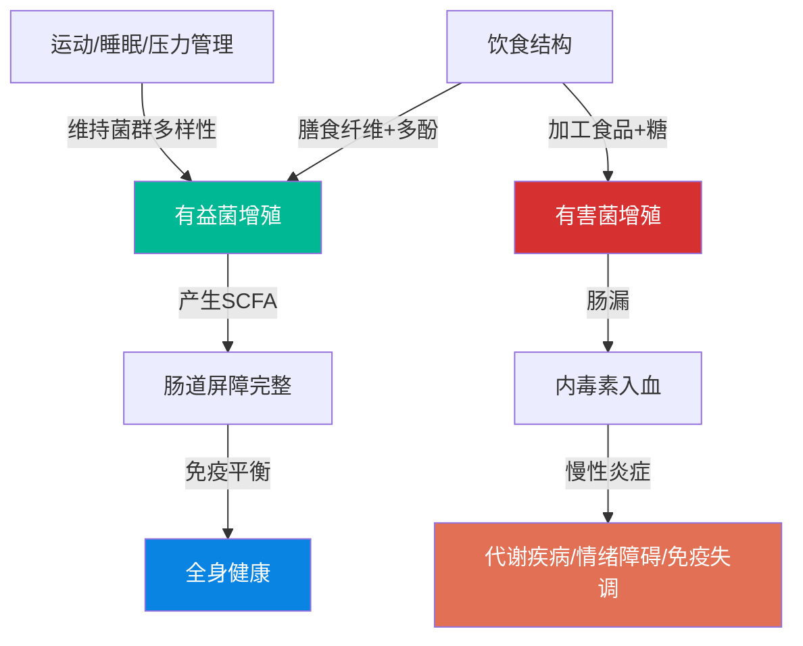

## 八、现代健康科学前沿

> "未来的医学是预防的医学，是个性化的医学，是基于基因和微生物组的医学。" —— Francis Collins（人类基因组计划负责人）

过去20年，健康科学经历了从"经验医学"到"精准医学"的范式转变。表观遗传学告诉我们生活方式如何改写基因表达，肠道微生物组研究揭示了体内"隐形器官"对全身健康的深远影响，精准营养打破了"一刀切"的饮食建议，间歇性禁食和冷暴露疗法则从进化生物学角度重新审视人类的生理适应机制。与此同时，抗衰老科学正从"延缓衰老"走向"逆转衰老"的临界点。

本章将逐一拆解这些前沿领域的科学原理、实证研究和实际应用，帮助你理解现代健康科学正在发生什么，以及这些发现如何转化为可执行的日常策略。

---

### 8.1 表观遗传学：生活方式改写基因密码

#### 8.1.1 什么是表观遗传学

传统遗传学认为DNA序列决定了生物体的一切特征。但表观遗传学（Epigenetics）揭示了一个更复杂的真相：**基因的"开关状态"比基因本身更重要**。

表观遗传学研究的是不改变DNA碱基序列、但能影响基因表达的可遗传化学修饰。你可以把DNA想象成一本菜谱，表观遗传修饰则是厨师在菜谱上做的标注——哪些菜要做、哪些跳过、哪些加量。菜谱本身没变，但最终的菜品完全不同。

三种主要的表观遗传修饰机制：

| 修饰类型 | 作用机制 | 对基因表达的影响 | 可逆性 |
|---------|---------|----------------|--------|
| **DNA甲基化** | 甲基基团（-CH₃）附着在DNA的胞嘧啶上，通常发生在CpG岛 | 通常沉默基因表达（关闭开关） | 高度可逆，受营养和运动影响 |
| **组蛋白修饰** | 乙酰化、甲基化、磷酸化等修饰改变组蛋白结构 | 乙酰化通常激活基因，甲基化效果复杂 | 可逆，受多种因素调节 |
| **非编码RNA** | miRNA、lncRNA等在转录后水平调控基因表达 | 抑制mRNA翻译或促进其降解 | 动态变化 |

这些修饰就像基因表达的"调光器"——不是简单的开/关，而是可以在0%到100%之间精确调节。

#### 8.1.2 生活方式如何影响表观遗传

表观遗传学最激动人心的发现是：**你的生活方式选择会直接改写你的基因表达模式**，而且这些改变是可逆的。

**饮食的表观遗传效应：**

- **叶酸、维生素B12、B6、胆碱和甜菜碱**是甲基供体，直接参与DNA甲基化过程。缺乏这些营养素会导致全基因组低甲基化，与多种癌症风险增加相关。2012年《Cancer Research》发表的一项研究发现，孕期叶酸摄入不足与后代结直肠癌风险增加47%相关。
- **多酚类化合物**（绿茶中的EGCG、姜黄中的姜黄素、白藜芦醇）能抑制DNA甲基转移酶（DNMT），改变甲基化模式。这解释了为什么富含多酚的地中海饮食与较低的癌症发病率相关。
- **西兰花、卷心菜等十字花科蔬菜**中的萝卜硫素（sulforaphane）是组蛋白去乙酰化酶（HDAC）抑制剂，能维持抑癌基因的活性状态。
- **高脂高糖饮食**会导致炎症相关基因的启动子区域低甲基化，使这些基因过度表达，形成慢性低度炎症状态。

**运动的表观遗传效应：**

运动对骨骼肌的表观遗传影响已被充分研究。2012年《Cell Metabolism》发表的一项经典研究发现，单次高强度运动就能改变骨骼肌中数百个基因的DNA甲基化模式，特别是脂肪代谢和线粒体功能相关基因。长期运动训练则能产生更稳定的表观遗传改变：

- 上调PGC-1α基因（线粒体生物合成的主调节因子）的表达
- 降低脂肪合成基因的甲基化水平
- 改善胰岛素信号通路基因的表达状态

**压力的表观遗传效应：**

慢性心理压力通过HPA轴（下丘脑-垂体-肾上腺轴）影响表观遗传修饰。最著名的证据来自Michael Meaney团队的大鼠研究：母鼠的舔舐和梳理行为会改变幼鼠糖皮质激素受体基因（NR3C1）启动子的甲基化水平，影响后代终身的应激反应模式。人类研究也证实，童年期创伤经历会导致NR3C1基因的持久表观遗传改变，增加成年后抑郁和焦虑的风险。

**睡眠的表观遗传效应：**

2019年《Scientific Reports》发表的研究发现，连续一周每晚只睡5小时（而非8小时）会导致711个基因的DNA甲基化模式发生显著改变，涉及免疫功能、代谢调节和应激反应等通路。这从分子层面解释了长期睡眠不足对健康的广泛损害。

#### 8.1.3 跨代表观遗传：你的选择影响后代

表观遗传学最具冲击力的发现之一是**跨代遗传**——父母的生活方式不仅影响自身基因表达，还可能通过生殖细胞传递给后代。

2014年《Nature Neuroscience》发表的研究中，研究人员训练小鼠将某种气味与恐惧联系起来，发现这些小鼠的精子中，与该气味感知相关的基因（Olfr151）甲基化水平发生了改变，而且后代小鼠对同种气味表现出增强的恐惧反应——尽管它们从未经历过原始的恐惧训练。

人类流行病学数据同样令人深思：

- 荷兰饥荒研究（Dutch Hunger Winter）：1944-1945年经历饥荒的孕妇，其后代在60年后仍然表现出IGF2基因甲基化水平的改变，且肥胖、心血管疾病和精神疾病风险显著升高。
- 瑞典北部Överkalix研究：祖父辈在青春期前的食物供应情况与孙辈的糖尿病和心血管疾病死亡率显著相关，食物充足反而增加后代的代谢疾病风险。

这意味着你在今天做出的健康选择，其影响可能延伸到你的子女甚至孙辈。这既是责任，也是机会。

#### 8.1.4 如何利用表观遗传学优化健康

**可执行的表观遗传优化策略：**

1. **保证甲基供体营养素充足**：每天摄入足量的叶酸（400μg）、B12（2.4μg）和B6（1.3mg）。食物来源包括深绿叶蔬菜、豆类、动物肝脏、鸡蛋。
2. **增加多酚摄入**：每天至少3份富含多酚的食物——绿茶、蓝莓、黑巧克力、姜黄、橄榄油。
3. **坚持规律运动**：每周至少150分钟中等强度运动，运动通过表观遗传机制改善代谢基因表达。
4. **管理慢性压力**：长期压力产生的皮质醇会改变免疫和代谢基因的甲基化模式。正念冥想已被证明能改变与炎症相关的表观遗传标记。
5. **保障充足睡眠**：每晚7-9小时高质量睡眠，避免长期睡眠剥夺导致的表观遗传紊乱。

> **关键认知**：表观遗传改变是**可逆的**。即使过去的生活方式不理想，从现在开始改变仍然能逐步改善基因表达模式。你的基因不是你的命运。

---

### 8.2 肠道微生物组：体内的"隐形器官"

#### 8.2.1 认识你的肠道微生物组

人体内栖息着约**38万亿**微生物，总重量约1.5-2公斤——与大脑重量相当。其中95%以上集中在肠道，主要是大肠。这些微生物的基因总数（微生物组）是人类基因组的**150倍**，编码了人体自身无法合成的大量酶和代谢产物。

肠道微生物组不是被动的"房客"，而是一个功能高度活跃的"虚拟器官"，参与：

| 功能类别 | 具体作用 | 关键菌群 |
|---------|---------|---------|
| **消化代谢** | 分解膳食纤维产生短链脂肪酸（SCFA）、合成维生素K和B族维生素、促进矿物质吸收 | 拟杆菌门、厚壁菌门 |
| **免疫调节** | 训练免疫系统识别敌友、维持肠道屏障完整性、调节全身免疫应答 | 双歧杆菌、乳酸杆菌 |
| **神经调节** | 产生90%以上的血清素、合成多巴胺和GABA前体、通过迷走神经与大脑通信 | 乳酸杆菌、双歧杆菌、肠球菌 |
| **代谢调节** | 调控能量获取效率、影响脂肪储存、参与胆汁酸代谢 | 厚壁菌门/拟杆菌门比值 |
| **屏障保护** | 与病原菌竞争营养和附着位点、维持黏液层完整性、产生抗菌肽 | 产短链脂肪酸菌群 |

#### 8.2.2 肠道菌群如何影响全身健康

**肠脑轴——"第二大脑"的秘密通信：**

肠道拥有约**5亿个神经元**，构成独立的肠神经系统（ENS）。肠道菌群通过三条通路影响大脑：

1. **迷走神经通路**：肠道菌群产生的代谢产物直接刺激迷走神经末梢，信号在100毫秒内到达脑干。2019年《Nature》发表的研究发现，特定的乳酸杆菌株能通过迷走神经降低小鼠的焦虑样行为，而切断迷走神经后这种效应消失。
2. **免疫通路**：肠道菌群失调导致肠道通透性增加（"肠漏"），细菌内毒素（LPS）进入血液引发全身性低度炎症。LPS能穿过血脑屏障，激活脑内小胶质细胞，促进神经炎症，这与抑郁症和认知退化密切相关。
3. **代谢通路**：肠道菌群产生90%以上的5-羟色胺（血清素），以及大量γ-氨基丁酸（GABA）、多巴胺前体等神经活性物质。2022年《Nature Medicine》发表的研究显示，抑郁症患者的肠道菌群组成与健康人群存在显著差异，将抑郁症患者的粪便菌群移植给无菌小鼠，小鼠会出现抑郁样行为。

**肠菌与代谢疾病：**

肥胖者的肠道菌群有两个显著特征：厚壁菌门/拟杆菌门比值升高，菌群多样性降低。2006年Jeffrey Gordon团队在《Nature》发表的里程碑研究首次证明，将肥胖小鼠的肠道菌群移植给无菌小鼠，后者也会变胖——即使饮食和运动量完全相同。人类的粪菌移植实验也验证了这一发现：接受瘦人菌群的代谢综合征患者，胰岛素敏感性在6周内显著改善。

**肠菌与免疫系统：**

70%的免疫细胞位于肠道相关淋巴组织（GALT）。肠道菌群在免疫系统的发育和训练中起核心作用：

- **训练T细胞**：肠道菌群帮助区分"自我"和"非我"，菌群多样性不足会导致免疫系统过度反应（过敏、自身免疫病）。
- **维持屏障**：短链脂肪酸（特别是丁酸）是肠道上皮细胞的主要能量来源，维持肠道屏障完整性。菌群失调→丁酸减少→肠漏→食物大分子和内毒素入血→全身炎症。
- **调节炎症/抗炎平衡**：特定菌株（如脆弱拟杆菌）产生的多糖A能诱导调节性T细胞（Treg）分化，抑制过度炎症反应。

#### 8.2.3 影响肠道菌群的关键因素

**积极因素：**

- **膳食多样性**：每增加一种植物性食物种类，有益菌的多样性增加。研究建议每周至少摄入**30种不同的植物性食物**（包括蔬菜、水果、全谷物、豆类、坚果、种子、香料）。
- **膳食纤维**：每日摄入25-35克膳食纤维，为产短链脂肪酸的菌群提供底物。高纤维饮食者的丁酸产量是低纤维饮食者的3-5倍。
- **发酵食品**：酸奶、泡菜、纳豆、味噌、康普茶等天然发酵食品含有活性益生菌。2021年斯坦福大学在《Cell》发表的研究发现，连续10周每天6份发酵食品，显著增加肠道菌群多样性并降低炎症标记物。
- **运动**：规律运动者肠道菌群多样性显著高于久坐者。2018年《Medicine & Science in Sports & Exercise》的研究发现，运动员的肠道菌群种类比普通人多约40%。

**消极因素：**

- **抗生素滥用**：一次广谱抗生素疗程可能消灭30-50%的肠道菌群，恢复需要6个月至2年，某些菌种可能永久消失。
- **高度加工食品**：乳化剂（如聚山梨酯80、羧甲基纤维素）会破坏肠道黏液层，促进炎症。人工甜味剂（如三氯蔗糖、阿斯巴甜）会改变菌群组成，降低葡萄糖耐受性。
- **慢性压力**：皮质醇增加肠道通透性，改变肠道蠕动节律，减少有益菌数量。
- **睡眠不足**：轮班工作和时差会扰乱肠道菌群的昼夜节律振荡，导致菌群失调。

#### 8.2.4 肠道菌群优化策略

**饮食调整（最有效的手段）：**

1. 每周摄入30种以上植物性食物，涵盖蔬菜、水果、全谷物、豆类、坚果、种子、香料、草药
2. 每天摄入25-35克膳食纤维，逐步增量避免胀气
3. 每天至少一份发酵食品（约100-200克）
4. 减少超加工食品（配料表超过5种成分、含有你不认识的化学名称的食品）
5. 多酚丰富的食物：浆果、绿茶、咖啡、黑巧克力、红葡萄

**关于益生菌补充剂的客观评估：**

益生菌补充剂不是万能的。2018年《Cell》发表的一项重要研究发现，益生菌补充后的定植效果因人而异——有些人肠道会"抵抗"外源益生菌的定植。更重要的是，抗生素使用后立即补充益生菌反而**延迟**了原有菌群的恢复。因此，补充益生菌的策略应该是：

- **优选食物来源**的益生菌（发酵食品）而非胶囊
- 如果使用补充剂，选择经过临床验证的特定菌株，而非"万能混合配方"
- 菌株要对应你的具体需求（如Lactobacillus rhamnosus GG用于预防抗生素相关腹泻，Saccharomyces boulardii用于旅行者腹泻）

**肠道菌群检测工具与解读：**

随着技术进步，肠道菌群检测已经商业化（如Viome、Thryve、国内的量化健康等）。了解检测结果时，重点关注以下指标：

- **菌群多样性指数**（Shannon指数/Simpson指数）：越高越好，反映肠道生态丰富度
- **有益菌丰度**：双歧杆菌、乳酸杆菌、阿克曼菌（Akkermansia muciniphila，与代谢健康强相关）的占比
- **短链脂肪酸产能**：反映菌群代谢活力
- **致病菌/条件致病菌**：如艰难梭菌、大肠杆菌某些致病株的丰度
- **F/B比值**（厚壁菌门/拟杆菌门）：比值过高与肥胖相关

需要注意：目前商业检测的可重复性和临床解读能力仍在改进中，检测结果应作为参考而非诊断依据。

---

### 8.3 精准营养：告别"一刀切"的饮食建议

#### 8.3.1 为什么通用饮食建议不够用

传统营养学基于"平均人"的假设——同一种食物对所有人的影响大致相同。但精准营养（Precision Nutrition）的研究正在彻底推翻这一假设。

2015年《Cell》杂志发表的Zeevi等人里程碑研究，对800名受试者进行了连续一周的实时血糖监测，发现**同一种食物在不同人身上引起的血糖反应差异可达10倍以上**。例如：

- 白面包对某些人是"高GI炸弹"，对另一些人却几乎不引起血糖波动
- 香蕉对大多数人的血糖影响反而比饼干更大
- 个体A吃冰淇淋血糖飙升，个体B吃冰淇淋血糖平稳

这种巨大差异的根源在于：肠道菌群组成、基因型、代谢状态、睡眠质量、压力水平、进食顺序、甚至食物的烹饪方式，都在共同决定你对食物的生理反应。

#### 8.3.2 影响个体营养反应的关键变量

**基因多态性：**

| 基因/变异 | 影响 | 实际意义 |
|-----------|------|---------|
| MTHFR C677T | 叶酸代谢效率降低30-70% | 突变携带者需要活性叶酸（5-MTHF），普通叶酸补充效果差 |
| FTO基因变异 | 增加肥胖风险1.3-1.7倍 | 携带者对高脂饮食更敏感，低碳饮食减重效果更好 |
| APOE ε4等位基因 | 脂代谢异常，阿尔茨海默风险增加 | 携带者应严格限制饱和脂肪，增加Omega-3 |
| LCT基因（乳糖耐受） | 成年后能否消化乳糖 | 东亚人群中70-90%为乳糖不耐受 |
| CYP1A2基因 | 咖啡因代谢速度 | 慢代谢者每天超过2杯咖啡增加心脏病风险，快代谢者反而有保护作用 |
| SLC23A1 | 维生素C转运效率 | 部分人群需要更高剂量才能达到血液饱和水平 |
| HFE基因 | 铁吸收效率 | 突变携带者容易铁过载，应避免过多红肉和铁补充剂 |
| ALDH2 | 乙醛脱氢酶活性 | 东亚约35%携带缺陷等位基因（"亚洲红脸"），饮酒致癌风险倍增 |
| BCMO1 | β-胡萝卜素→视黄醇转化效率 | 部分人群植物来源维生素A转化率极低，需动物来源补充 |

**肠道菌群代谢类型：**

以色列魏茨曼研究所的研究将人分为"肠型"（enterotype），不同肠型对同一种食物的代谢反应截然不同。以TMAO（氧化三甲胺，与心血管疾病相关的肠道代谢产物）为例：

- 某些人吃红肉后肠道产生大量TMAO，心血管风险升高
- 另一些人吃同样的红肉，TMAO水平几乎不变
- 差异主要取决于肠道中特定菌群（如Prevotella和Roseburia）的丰度

**食物基质与烹饪方式：**

同一种食物的不同处理方式会显著改变其代谢效应：

| 食物 | 处理方式差异 | 血糖影响差异 |
|------|------------|------------|
| 米饭 | 隔夜冷藏再加热 vs 刚煮好的热米饭 | 冷却产生抗性淀粉，GI降低20-30% |
| 土豆 | 煮土豆 vs 烤土豆 | 烤土豆GI（~90）远高于煮土豆（~56） |
| 面条 | 硬质小麦 vs 软质小麦，煮的时间长短 | 煮得越软GI越高 |
| 水果 | 整果 vs 果汁 | 榨汁破坏纤维，血糖峰值升高50%以上 |
| 燕麦 | 钢切燕麦 vs 速溶燕麦片 | 加工程度越低GI越低 |

**营养素相互作用：**

精准营养还要考虑营养素之间的协同和拮抗关系：

- **铁和维生素C**：维生素C能将三价铁还原为更易吸收的二价铁，使铁吸收率提高3-6倍
- **钙和维生素D**：没有足够的维生素D，钙的吸收率只有10-15%；充足的维生素D可将吸收率提升到30-40%
- **铁和钙**：同时摄入会相互抑制吸收，应间隔2小时以上
- **锌和铜**：长期高剂量锌补充会抑制铜吸收，导致铜缺乏
- **维生素K2与钙**：K2引导钙沉积到骨骼而非血管壁，缺乏K2时补钙反而增加血管钙化风险
- **维生素A与锌**：锌是将维生素A从储存形式（视黄醇酯）转化为活性形式（视黄醛）的必要辅因子
- **Omega-3与Omega-6**：两者竞争同一组代谢酶，理想比例约1:1-4，现代饮食往往达到1:15-20

#### 8.3.3 如何实施精准营养

**第一步：建立个人基线**

1. **基础血液检查**：血常规、血脂全套（含脂蛋白a）、空腹血糖和糖化血红蛋白（HbA1c）、肝肾功能、甲状腺功能、维生素D（25-OH-D）、铁蛋白、维生素B12、叶酸、同型半胱氨酸、高敏C反应蛋白（hs-CRP）
2. **基因检测**：可选择消费级基因检测（如23andMe、WeGene等），重点关注营养代谢相关基因变异
3. **食物-血糖关系测试**：使用连续血糖监测仪（CGM）或指尖血糖仪，在不同食物进食前后测量血糖变化，建立个人的"食物-血糖响应图谱"

**CGM实操指南：**

连续血糖监测仪（如雅培FreeStyle Libre、德康Dexcom G7）是精准营养的"显微镜"。佩戴CGM时，用以下实验建立你的食物-血糖图谱：

1. **基线测量**：正常饮食3天，记录每餐食物和血糖曲线，建立个人基线
2. **单食物测试**：每次只改变一种食物（其他食物保持不变），观察血糖反应差异。例如：这周每天早餐固定吃鸡蛋+蔬菜，但主食分别换成白米饭、糙米饭、全麦面包、燕麦片、红薯
3. **组合测试**：找到血糖反应最好的食物后，测试不同搭配（加蛋白质、加脂肪、加纤维）如何改变血糖曲线
4. **变量测试**：同一食物在不同时间（早餐vs晚餐）、不同状态（睡眠充足vs不足）、不同顺序（先吃菜vs先吃饭）下的血糖反应

**第二步：设计个性化饮食框架**

基于检测结果，调整三大宏量营养素的比例。以下框架仅供参考，需要根据个人反应调整：

| 代谢特征 | 碳水化合物 | 蛋白质 | 脂肪 | 说明 |
|---------|-----------|--------|------|------|
| 碳水敏感型 | 30-40% | 25-30% | 30-40% | FTO基因变异者、胰岛素抵抗者 |
| 均衡型 | 40-50% | 20-25% | 25-35% | 代谢健康、无特殊基因变异 |
| 高活动量型 | 50-60% | 20-25% | 20-30% | 规律高强度运动者 |
| APOE ε4携带者 | 40-50% | 20-25% | 25-30%（低饱和脂肪） | 严格控制饱和脂肪<10%总热量 |

**进食顺序的血糖管理：**

一个被大量研究支持的简单技巧——**改变进食顺序**就能显著降低餐后血糖：

1. 先吃蔬菜和蛋白质（10-15分钟）
2. 再吃碳水化合物
3. 效果：餐后血糖峰值降低30-40%，血糖曲线更平缓

2020年《Diabetes Care》发表的研究证实，这种简单的进食顺序调整，效果相当于服用低剂量的降糖药物。

**第三步：动态监测与调整**

精准营养不是一次性方案，而是持续优化的过程：

- **主观指标**：精力水平、消化舒适度、睡眠质量、情绪状态、运动表现
- **客观指标**：每3-6个月复查血液指标，每1-2年评估身体成分变化
- **记录食物日记**：至少坚持4-6周，记录食物种类、份量和身体反应，识别个人的"超级食物"和"问题食物"

---

### 8.4 间歇性禁食：重新发现人类的代谢灵活性

#### 8.4.1 进化视角下的禁食

从进化角度看，人类的身体是为"间歇性进食"而非"持续进食"而设计的。在长达数百万年的进化史中，我们的祖先大部分时间处于食物不充足状态——吃饱一顿不知道下一顿在哪里。人类的代谢系统进化出了在"进食-禁食"周期之间高效切换的能力：

- **进食状态**（餐后4-6小时）：胰岛素升高→葡萄糖利用→糖原储存→脂肪合成
- **禁食状态**（禁食12-36小时）：胰岛素下降→糖原分解→脂肪动员→酮体产生
- **深度禁食**（禁食36-72小时以上）：自噬激活→细胞清理→生长激素脉冲

现代人的问题是**永远处于进食状态**——从早餐到睡前零食，胰岛素几乎没有机会下降。这种持续的胰岛素刺激导致胰岛素抵抗、脂肪不断积累、代谢灵活性丧失。

#### 8.4.2 间歇性禁食的科学机制

**细胞自噬（Autophagy）：**

自噬是细胞的"垃圾回收系统"——清除受损的蛋白质、功能失调的细胞器和入侵的病原体。2016年大隅良典（Yoshinori Ohsumi）因发现自噬机制获得诺贝尔生理学或医学奖。

自噬的激活条件和时间线：

- 禁食12-16小时：自噬开始显著上调
- 禁食18-24小时：自噬水平达到较高强度
- 禁食24-48小时：自噬进一步增强，同时自噬与细胞凋亡之间的平衡需要关注
- 运动也能独立激活自噬，特别是中等强度有氧运动

自噬的健康意义：清除错误折叠的蛋白质（阿尔茨海默症的β-淀粉样蛋白和帕金森病的α-突触核蛋白都是自噬的"清理对象"）、回收受损线粒体（线粒体自噬）、减少氧化应激损伤。

**代谢灵活性改善：**

间歇性禁食训练身体在碳水化合物和脂肪作为燃料之间灵活切换。经过数周的适应期后，身体能够在禁食期间高效燃烧脂肪产生酮体，在进食后高效利用葡萄糖——这种代谢灵活性是代谢健康的核心标志。

**胰岛素敏感性提升：**

多项随机对照试验（RCT）证实，间歇性禁食能显著降低空腹胰岛素水平和胰岛素抵抗指数（HOMA-IR）。2022年《Annual Review of Nutrition》发表的Meta分析汇总了27项RCT的结果：间歇性禁食平均降低空腹胰岛素11.4%，HOMA-IR改善14.3%。

**生长激素脉冲：**

禁食24小时后，生长激素（GH）分泌量可增加2-5倍。GH促进脂肪动员、维持肌肉量、增强骨密度。这种自然的GH脉冲不需要外源激素补充，是禁食的独特代谢优势。

#### 8.4.3 主流间歇性禁食方案对比

| 方案 | 具体做法 | 难度 | 适合人群 | 证据强度 |
|------|---------|------|---------|---------|
| **16:8法** | 每天在8小时窗口内进食，16小时禁食（含睡眠时间） | ⭐⭐ | 初学者、日常工作节奏 | 强（多项RCT） |
| **18:6法** | 每天6小时进食窗口，18小时禁食 | ⭐⭐⭐ | 已适应16:8的进阶者 | 中等 |
| **5:2法** | 每周5天正常饮食，2天摄入约500-600千卡 | ⭐⭐ | 不愿每天限制时间窗口者 | 强（多项RCT） |
| **隔日禁食** | 一天正常进食，一天禁食或摄入极低热量 | ⭐⭐⭐⭐ | 有经验且意志力较强者 | 强 |
| **24小时禁食** | 每周1-2次完整禁食24小时 | ⭐⭐⭐⭐⭐ | 高级实践者 | 中等 |
| **战士饮食** | 白天少量生蔬果，晚上一顿大餐 | ⭐⭐⭐ | 偏好晚间集中进食者 | 弱 |

**推荐入门路径：**

- **第1-2周**：从12:12开始（12小时进食窗口），逐步适应
- **第3-4周**：延长到14:10
- **第5-6周**：过渡到16:8
- **第7周以后**：根据身体感受，维持16:8或尝试18:6

#### 8.4.4 间歇性禁食的实操要点

**进食窗口期的营养策略：**

禁食不等于在进食窗口期暴食。进食窗口期的原则：

1. **优先摄入蛋白质**：每餐至少25-30克优质蛋白，避免肌肉流失
2. **大量蔬菜**：至少占餐盘的一半体积，提供纤维和微量营养素
3. **健康脂肪**：橄榄油、牛油果、坚果，增加饱腹感
4. **复合碳水化合物**：全谷物、豆类、薯类，避免精制碳水
5. **总热量仍需控制**：间歇性禁食不是"随便吃"的通行证

**禁食期间允许的摄入：**

- 水（必须充足，每天至少2升）
- 黑咖啡（不含糖和奶，咖啡因还能促进脂肪动员）
- 无糖茶（绿茶、红茶、乌龙茶）
- 气泡水
- 电解质（不含热量的钠、钾、镁补充剂，特别是适应期）

**禁忌人群：**

以下人群不适合间歇性禁食，或需要在医生指导下进行：

- 孕妇和哺乳期女性
- 有进食障碍史的人群
- 1型糖尿病患者（低血糖风险）
- 体重过轻者（BMI < 18.5）
- 正在服用需要随餐服用药物的患者
- 青少年和儿童（生长发育需要持续营养供应）

**间歇性禁食与运动的配合：**

| 训练类型 | 最佳安排 | 原因 |
|---------|---------|------|
| 有氧/耐力训练 | 禁食期训练（轻-中等强度） | 促进脂肪氧化，增强代谢灵活性 |
| 高强度间歇（HIIT） | 进食窗口期或禁食末段 | 需要糖原作为主要燃料 |
| 力量训练 | 进食窗口期内或紧接其后 | 训练后30分钟内摄入蛋白质最大化肌肉合成 |
| 长距离耐力 | 禁食期低强度+进食窗口期高强度 | 禁食期训练脂肪适应，高强度日保证营养 |

**常见问题应对：**

| 问题 | 原因 | 解决方案 |
|------|------|---------|
| 头晕/乏力 | 电解质流失，特别是钠和钾 | 在水中加少量盐（海盐或喜马拉雅盐），补充镁 |
| 过度饥饿 | 身体尚未适应脂肪供能模式 | 从较短禁食时间开始，逐步延长；禁食期保持忙碌 |
| 注意力不集中 | 初期适应酮体供能需要时间 | 通常1-2周后改善；黑咖啡可短期缓解 |
| 便秘 | 进食量减少导致纤维和水分不足 | 增加蔬菜和水分摄入，进食窗口期保证纤维充足 |
| 暴食倾向 | 进食窗口期过度补偿 | 如果触发暴食行为，应停止禁食，咨询专业人士 |
| 女性月经紊乱 | 能量不足影响HPG轴 | 缩短禁食窗口（12-14小时），避免连续多日长时间禁食 |
| 社交困难 | 禁食窗口与聚餐时间冲突 | 灵活调整窗口期，偶尔打破规则不会影响整体效果 |

---

### 8.5 冷暴露疗法：激活人体的适应性应激反应

#### 8.5.1 冷暴露的生物学基础

冷暴露属于**兴奋效应（Hormesis）**的一种——适度的生理应激反而激活身体的保护和修复机制，带来净健康收益。

当身体暴露于冷环境时，会触发一系列级联反应：

1. **血管收缩**：外周血管收缩，将血液从体表转移至核心器官，保护内脏温度
2. **去甲肾上腺素飙升**：冷暴露30秒内，血浆去甲肾上腺素水平可升高**200-300%**。去甲肾上腺素既是神经递质又是激素，能提高警觉性、改善情绪、增强注意力
3. **棕色脂肪激活**：人体存在两种脂肪——白色脂肪（储存能量）和棕色脂肪（产热消耗能量）。冷暴露激活棕色脂肪组织（BAT），通过UCP1蛋白"燃烧"脂肪产生热量，直接增加能量消耗
4. **炎症抑制**：冷暴露降低促炎细胞因子（TNF-α、IL-6）水平，激活抗炎通路。2014年《PLOS ONE》发表的研究发现，每天冷暴露可使疾病请假率降低29%
5. **线粒体生物合成**：反复冷暴露促进白色脂肪"褐变"（转化为米色脂肪），增加线粒体数量，从根本上提高基础代谢率

**棕色脂肪与成人代谢：**

棕色脂肪曾被认为只存在于婴儿体内，但2009年《NEJM》发表的三项独立研究证实，成年人也保有功能性棕色脂肪，主要分布在颈部、锁骨上方和脊柱周围。寒冷刺激、运动和辣椒素（capsaicin）都能激活棕色脂肪。研究估计，活跃的棕色脂肪每天可额外消耗100-300千卡热量——相当于慢跑30分钟的能量消耗。

#### 8.5.2 冷暴露的研究证据

**Wim Hof方法研究：**

荷兰"冰人"Wim Hof的案例被2014年《PNAS》发表的研究正式纳入科学框架。研究发现，通过Wim Hof教授的特定呼吸技术（过度换气后屏气）和渐进式冷暴露训练，志愿者能够**主动调控自主神经系统和免疫应激反应**——这在过去被认为是不可能的。在内毒素注射实验中，训练组的炎症反应（IL-10水平）比对照组高200%，而发热、头痛和流感样症状显著更轻。

**冷水浸泡与运动恢复：**

2018年《Frontiers in Physiology》的Meta分析汇总了36项研究，发现运动后冷水浸泡（10-15°C，10-15分钟）能显著减少延迟性肌肉酸痛（DOMS）并加速主观疲劳恢复。但需要注意：长期在力量训练后使用冷水浸泡可能**抑制肌肉肥大适应**，因为炎症信号是肌肉修复和生长的必要触发因素。

实操建议：力量训练日避免运动后立即冷水浸泡（间隔至少4-6小时），有氧/耐力训练后可以立即使用。

**冷水浴与心理健康：**

2023年《BMJ Case Reports》发表了一项系统综述，发现冷水游泳/浸泡与抑郁症状的改善存在显著关联。可能的机制包括：去甲肾上腺素和内啡肽的急性释放、冷应激诱导的适应性应激反应、社交互动（团体冷水游泳）的心理益处。

**冷暴露与免疫功能：**

2016年荷兰的一项随机对照试验（被通俗称为"荷兰冬天研究"）将3018名受试者随机分组，结果发现每天以冷水淋浴结尾（30/60/90秒）的人群，因病请假率降低29%，而且淋浴时间长短不影响效果——30秒的冷水就足以产生显著的免疫保护效应。

#### 8.5.3 冷暴露的实操方案

**渐进式冷暴露路线图：**

| 阶段 | 时间跨度 | 具体做法 | 温度范围 | 持续时间 |
|------|---------|---------|---------|---------|
| 入门 | 第1-2周 | 淋浴最后30秒切换为冷水 | 20-25°C | 30秒 |
| 进阶 | 第3-4周 | 淋浴最后1分钟切换为冷水 | 15-20°C | 1分钟 |
| 适应 | 第5-8周 | 淋浴最后2-3分钟冷水 | 10-20°C | 2-3分钟 |
| 标准 | 第9周以后 | 冷水淋浴或冷水浸泡 | 10-15°C | 3-5分钟 |
| 高级 | 熟练后 | 冰水浸泡（需有人监护） | 5-10°C | 2-5分钟 |

**冷暴露中的呼吸控制——核心技能：**

冷暴露时最大的敌人不是低温本身，而是**冷休克反应**（Cold Shock Response）——失控的喘气和心率飙升。控制呼吸是关键：

1. 进入冷水前做3-5次深呼吸（4秒吸气-7秒呼气）
2. 进入冷水瞬间专注于缓慢、有控制的呼气
3. 如果感觉喘气冲动强烈，用鼻子缓慢吸气、嘴巴缓慢呼气
4. 目标：心率在30秒内从峰值回落到可控水平
5. 经过数周训练后，冷休克反应会显著减弱（适应性改变）

**关键注意事项：**

1. **逐步适应**：绝不从冰水开始，温差过大会触发冷休克反应（失控喘气、心率飙升），有溺水和心脏事件风险
2. **呼吸控制**：冷暴露时保持缓慢深呼吸，避免过度换气。专注于呼气，主动降低心率
3. **时机选择**：早上冷暴露效果最好——去甲肾上腺素的释放能提升整天的警觉性和情绪。运动后冷暴露用于恢复（但如果是力量训练日，建议间隔4-6小时以上）
4. **频率**：每周3-7次，效果与频率正相关
5. **安全边界**：如果出现剧烈颤抖持续超过30秒、嘴唇发紫、意识模糊，应立即停止并回温

**冷暴露与桑拿的交替（对比疗法）：**

将冷暴露与桑拿热暴露交替进行（Contrast Therapy），可以产生更强烈的兴奋效应。典型方案：

- 桑拿15-20分钟（80-100°C）→ 冷水浸泡1-3分钟（5-15°C）→ 休息5分钟 → 重复2-3轮
- 冷热交替产生的血管扩张-收缩循环（"血管体操"）促进循环系统健康
- 两种应激源叠加激活更多的保护性基因表达

**不适合冷暴露的人群：**

- 心血管疾病患者（冷暴露会升高血压和心率）
- 雷诺综合征患者
- 冷过敏（冷荨麻疹）患者
- 正在发热或急性感染期
- 孕妇
- 未控制的高血压患者

---

### 8.6 抗衰老科学：从延缓到逆转

#### 8.6.1 衰老的十二大标志

2013年《Cell》杂志发表的经典论文提出了衰老的"九大标志"（Hallmarks of Aging），2023年更新版扩展为"十二大标志"。理解这些标志，是理解所有抗衰老策略的基础：

| 标志 | 描述 | 可干预性 |
|------|------|---------|
| **基因组不稳定性** | DNA损伤积累，修复机制效率下降 | 中等（抗氧化、DNA修复增强） |
| **端粒磨损** | 染色体末端保护帽缩短，细胞分裂极限 | 中等（端粒酶激活、生活方式干预） |
| **表观遗传改变** | 表观遗传修饰模式的漂移和噪声增加 | 高（饮食、运动、应激管理） |
| **蛋白质稳态丧失** | 错误折叠蛋白积累，蛋白酶体功能下降 | 高（自噬激活、热休克蛋白诱导） |
| **大自噬失能** | 细胞清理系统效率下降 | 高（禁食、运动、亚精胺） |
| **营养感应失调** | mTOR、AMPK、Sirtuins等信号通路异常 | 高（热量限制、禁食、雷帕霉素模拟物） |
| **线粒体功能障碍** | 线粒体DNA突变，呼吸链效率下降 | 中等（运动、NAD+前体、线粒体自噬） |
| **细胞衰老** | 僵尸细胞积累，分泌促炎因子（SASP） | 高（Senolytics，达沙替尼+槲皮素） |
| **干细胞耗竭** | 组织再生能力下降 | 低-中（运动、生长因子、干细胞疗法） |
| **细胞间通讯改变** | 炎症信号增强，激素信号减弱 | 中等（抗炎饮食、激素优化） |
| **慢性炎症** | 低度全身性炎症（inflammaging） | 高（饮食、运动、肠道健康） |
| **菌群失调** | 肠道菌群多样性下降 | 高（饮食多样性、发酵食品） |

这十二大标志之间并非孤立存在，而是相互关联的网络。例如：线粒体功能障碍产生更多ROS→DNA损伤增加→表观遗传漂变→基因表达紊乱→蛋白质稳态丧失→自噬负担加重。理解这个网络，才能制定系统性的抗衰老策略。

#### 8.6.2 当前最有证据支持的抗衰老干预

**热量限制与热量限制模拟物：**

热量限制（Caloric Restriction, CR）是目前在所有模式生物（从酵母到灵长类）中证据最强的延寿干预。2009年威斯康星大学和NIA两项平行的恒河猴研究均显示，30%的热量限制显著延长健康寿命，减少癌症、心血管疾病和糖尿病发病率。

对于普通人来说，严格的30%热量限制难以长期执行，但"热量限制模拟物"（Caloric Restriction Mimetics）提供了替代途径：

- **间歇性禁食**：模拟热量限制的代谢效应（mTOR抑制、AMPK激活、自噬增强），无需每天限制热量
- **白藜芦醇**：激活Sirtuin-1通路，但口服生物利用度低，实际效果有争议
- **亚精胺（Spermidine）**：天然存在于小麦胚芽、大豆、陈年奶酪中的多胺，强效自噬诱导剂。2016年《Nature Medicine》发表的大型队列研究发现，亚精胺摄入量与全因死亡率降低40%相关
- **二甲双胍**：FDA批准的糖尿病药物，正在TAME试验（Targeting Aging with Metformin）中测试其抗衰老效果。能激活AMPK、降低炎症、改善胰岛素敏感性

**NAD+前体补充：**

NAD+（烟酰胺腺嘌呤二核苷酸）是细胞能量代谢的核心辅酶，参与300多种酶促反应。NAD+水平随年龄显著下降——50岁时约为20岁时的50%。低NAD+水平与线粒体功能障碍、DNA修复能力下降、Sirtuin活性降低直接相关。

NAD+前体补充剂的研究进展：

- **烟酰胺核糖苷（NR）**：多项人体试验证实能有效提升血液NAD+水平（提升40-90%）。安全性良好，常见剂量250-1000mg/天
- **烟酰胺单核苷酸（NMN）**：动物研究显示显著的抗衰老效果，人体试验数据尚在积累中。2022年日本研究首次证实口服NMN能有效提升人体血液NAD+水平
- **烟酸（NA）**：传统形式的维生素B3，也能提升NAD+，但可能引起潮红反应（可用缓释形式缓解）

NAD+前体补充的注意事项：空腹服用吸收更好；与白藜芦醇或槲皮素配合可能增强效果；目前没有证据支持静脉注射NAD+优于口服。

**运动——最强效的"抗衰老药"：**

运动可能是当前证据最强、成本最低、副作用最少的抗衰老干预。它几乎同时作用于衰老的所有标志：

- **端粒保护**：2018年《European Heart Journal》发表的研究发现，规律有氧运动和抗阻运动都能显著增加端粒酶活性，保护端粒长度
- **干细胞激活**：运动诱导肌肉干细胞（卫星细胞）增殖，维持组织再生能力
- **自噬促进**：运动是除禁食外最有效的自噬激活手段
- **炎症抑制**：运动产生的抗炎性肌因子（Myokines）直接抑制全身性炎症
- **线粒体更新**：运动通过PGC-1α通路促进线粒体生物合成，更新老旧线粒体
- **认知保护**：运动促进BDNF（脑源性神经营养因子）分泌，维持海马体神经发生

**最优运动组合方案（基于当前抗衰老证据）：**

| 训练类型 | 频率 | 抗衰老靶点 | 具体建议 |
|---------|------|-----------|---------|
| 中等强度有氧 | 每周3-5次，每次30-45分钟 | 端粒保护、线粒体更新、炎症抑制 | 快走、慢跑、游泳、骑车 |
| 高强度间歇（HIIT） | 每周1-2次 | 自噬激活、线粒体生物合成、GH脉冲 | 30秒全力冲刺+90秒恢复，重复8-10组 |
| 抗阻训练 | 每周2-3次 | 肌肉维持、骨密度、干细胞激活 | 复合动作为主，渐进超负荷 |
| 柔韧性/平衡 | 每天10-15分钟 | 关节健康、跌倒预防 | 瑜伽、太极、拉伸 |

**睡眠——不可替代的"修复窗口"：**

深度睡眠（N3阶段）是大脑的"排毒时间"——2012年罗切斯特大学发现的胶质淋巴系统（Glymphatic System）在深度睡眠时活跃度增加10-20倍，清除白天积累的代谢废物，包括阿尔茨海默症相关的β-淀粉样蛋白。长期睡眠不足（<6小时）与认知衰退加速、免疫功能下降、端粒缩短显著相关。

#### 8.6.3 有前景但需谨慎的前沿方向

| 方向 | 研究阶段 | 现状评估 | 风险提示 |
|------|---------|---------|---------|
| **Senolytics（清除衰老细胞药物）** | 临床试验中 | 达沙替尼+槲皮素组合在小鼠中效果显著，人体初步数据积极 | 长期安全性未知，不可自行使用处方药 |
| **基因疗法** | 临床前/早期临床 | 端粒酶基因疗法在小鼠中延长寿命20% | 伦理争议大，癌症风险 |
| **年轻血液/血液稀释** | 临床前 | 异时性共生实验（年轻血液）和血液稀释均在小鼠中显示效果 | 机制不完全清楚，不可自行尝试 |
| **雷帕霉素/雷帕霉素模拟物** | 临床试验中 | 动物试验中最强效的单一延寿药物 | 免疫抑制副作用，不可自行使用 |
| **干细胞疗法** | 早期临床 | 间充质干细胞在骨关节炎等领域有初步临床证据 | 市场上大量未经验证的"干细胞抗衰老"服务 |
| **Yamanaka因子部分重编程** | 临床前 | 2020年《Nature》证实部分细胞重编程可逆转衰老标记 | 致癌风险极高，距临床应用还有很长距离 |

#### 8.6.4 生物年龄测量：量化你的衰老速度

传统上我们用"实际年龄"衡量衰老，但个体间的衰老速度差异巨大。**生物年龄**（Biological Age）才是衡量衰老状态的更有意义的指标。

**当前可用的生物年龄测量方法：**

| 方法 | 原理 | 可及性 | 准确度 | 成本 |
|------|------|--------|--------|------|
| **表观遗传时钟**（Horvath时钟/DNAm PhenoAge） | 通过DNA甲基化模式计算生物年龄 | 消费级检测可及（如TruAge、MyDNAge） | 高（目前金标准） | ¥1500-3000 |
| **端粒长度测量** | 白细胞端粒长度反映细胞分裂潜力 | 商业检测可及 | 中等（波动较大） | ¥800-1500 |
| **血液生物标志物组合** | hs-CRP、HbA1c、白蛋白、肌酐、淋巴细胞%等 | 常规体检项目 | 中等 | 包含在常规体检 |
| **代谢组学评估** | 血液中数百种代谢物的综合模式 | 研究阶段，部分商业服务 | 高（正在验证中） | ¥3000-8000 |
| **功能测量组合** | 握力、步速、肺功能、平衡能力 | 随时可测 | 中等 | 几乎免费 |

**生物年龄的可逆性：**

2021年发表的研究表明，基于生活方式干预（饮食、运动、睡眠、压力管理）的综合方案可以在8周内将表观遗传生物年龄逆转约3年。这意味着衰老不是一个不可逆的单行道——至少在表观遗传层面，你的选择可以"拨回时钟"。

#### 8.6.5 基于当前证据的个人抗衰老策略

**一级策略（证据最强，优先执行）：**

1. **规律运动**：每周150分钟以上中等强度有氧运动 + 2-3次抗阻训练。运动的抗衰老证据强度超过任何补充剂
2. **间歇性禁食**：至少执行16:8方案，每周可安排1-2次24小时禁食
3. **睡眠优化**：每晚7-9小时高质量睡眠，深度睡眠阶段大脑清除β-淀粉样蛋白
4. **抗炎饮食**：地中海饮食模式为基础，大量蔬菜水果、Omega-3脂肪酸、全谷物、少加工食品
5. **压力管理**：慢性压力通过皮质醇、端粒酶抑制和免疫功能损害加速衰老

**二级策略（有较强证据，可选择性加入）：**

6. **亚精胺补充**：每天1-2mg/kg体重，食物来源（小麦胚芽、大豆）优先，不够可补充剂
7. **NAD+前体**：NR 250-500mg/天，目前人体证据最充分的NAD+前体
8. **维生素D优化**：维持血液25-OH-D在40-60ng/mL水平，缺乏者补充2000-4000IU/天
9. **Omega-3脂肪酸**：EPA+DHA每天1-2克，抗炎和保护端粒
10. **多酚类补充**：姜黄素、EGCG、槲皮素等，抗氧化和表观遗传调节

**三级策略（新兴方向，可在医生指导下探索）：**

11. 定期体检中的衰老生物标志物监测（hs-CRP、HbA1c、同型半胱氨酸、DHEA-S等）
12. 连续血糖监测了解个人血糖反应模式
13. 冷暴露训练和桑拿交替（热应激同样有抗衰老效应）
14. 生物年龄检测（表观遗传时钟），每年一次追踪干预效果

---

### 8.7 其他前沿方向

#### 8.7.1 连续血糖监测（CGM）与代谢健康

连续血糖监测设备（如Dexcom G7、雅培FreeStyle Libre 3）正从糖尿病管理工具扩展为普通人的代谢健康优化工具。通过实时看到每种食物对自己的血糖影响，可以建立高度个人化的饮食策略。研究显示，即使非糖尿病人群，血糖波动过大也与氧化应激、炎症和认知波动相关。

**CGM对非糖尿病人群的价值：**

- 发现你个人的"隐形血糖炸弹"——那些你以为很健康但对你血糖冲击巨大的食物
- 识别最佳进食顺序、进食时间和运动时机
- 监测睡眠质量对血糖调节的影响（差睡眠导致第二天血糖反应变差）
- 量化压力对代谢的影响

**CGM数据的关键指标：**

| 指标 | 健康范围 | 含义 |
|------|---------|------|
| 空腹血糖 | 70-90 mg/dL (3.9-5.0 mmol/L) | 基线代谢状态 |
| 餐后峰值 | <140 mg/dL (7.8 mmol/L) | 餐后血糖控制能力 |
| 餐后达标时间 | 峰值后2小时内回到基线 | 代谢恢复速度 |
| 血糖变异系数（CV） | <20% | 血糖稳定性 |
| 低于范围时间（TBR） | <4% (70 mg/dL以下) | 低血糖风险 |
| 高于范围时间（TAR） | <10% (140 mg/dL以上) | 高血糖暴露量 |

**实操建议：** 初次使用CGM建议佩戴2-4周，覆盖不同饮食场景。不必长期佩戴——收集到足够的"食物-血糖响应图谱"后，你可以根据个人规律调整饮食，3-6个月后再次佩戴1-2周验证效果。

#### 8.7.2 热应激与桑拿

芬兰的一项大型队列研究（2015年《JAMA Internal Medicine》，2315名男性，随访20年）发现，每周使用桑拿4-7次的人群全因死亡率降低40%，心血管疾病死亡率降低50%。桑拿的热应激激活热休克蛋白（HSP），促进蛋白质修复和细胞保护。

**桑拿的生物学机制：**

- **热休克蛋白（HSP）激活**：HSP70和HSP90帮助蛋白质正确折叠、修复错误折叠蛋白、保护细胞免受热损伤。HSP水平升高与多种年龄相关疾病的降低相关
- **心血管适应**：桑拿时心率升高到100-150次/分（类似中等强度运动），反复桑拿改善血管内皮功能和血压调节
- **生长激素释放**：桑拿可使GH水平升高2-3倍（部分研究显示更多），促进组织修复
- **内啡肽释放**：解释桑拿后的愉悦感和疼痛缓解效应
- **炎症抑制**：降低hs-CRP和IL-6等炎症标记物

**桑拿实操指南：**

| 参数 | 推荐范围 | 说明 |
|------|---------|------|
| 温度 | 80-100°C（干蒸）/ 50-60°C（蒸汽） | 高温效果更强，但需要适应 |
| 单次时间 | 15-20分钟 | 初次使用者从10分钟开始 |
| 频率 | 每周3-7次 | 频率与剂量-效应关系明确 |
| 补水 | 前后各500mL水或电解质饮料 | 桑拿大量出汗，电解质流失显著 |
| 最佳时机 | 下午或傍晚 | 避免运动后立即桑拿（心血管负担叠加） |

**红外桑拿 vs 传统桑拿：**

- 传统桑拿（芬兰式）：加热空气→对流加热体表，温度高（80-100°C），大量出汗
- 红外桑拿：直接辐射加热身体组织，温度较低（45-60°C），穿透深度更大（可能达4cm），同等出汗量下更舒适
- 两者均有健康益处，选择主要取决于耐受性和偏好。红外桑拿对热耐受较低的人更友好

#### 8.7.3 光生物学：不同波长的光如何影响健康

不同波长的光对人体有截然不同的生物效应：

- **蓝光（450-495nm）**：白天促进警觉，夜间抑制褪黑素，扰乱睡眠
- **红光/近红外光（620-1000nm）**：促进线粒体细胞色素C氧化酶活性，增加ATP产生，减少氧化应激。正在被研究用于皮肤修复、伤口愈合和认知改善
- **阳光全光谱暴露**：除了维生素D合成，阳光还通过视网膜ipRGC细胞调节昼夜节律、通过皮肤NO释放降低血压

**红光/近红外光疗法（Photobiomodulation, PBM）：**

红光疗法近年来从实验室走向家庭。主要机制是630-670nm红光和810-850nm近红外光激活线粒体细胞色素C氧化酶（CCO），增加ATP产量、促进ROS信号传导、激活转录因子。

| 应用场景 | 证据水平 | 推荐参数 | 注意事项 |
|---------|---------|---------|---------|
| 皮肤修复/抗皱 | 较强（多项RCT） | 630-660nm，5-50mW/cm²，每次10-20分钟 | 需持续4-12周 |
| 运动恢复 | 中等 | 810-850nm，训练前后各10分钟 | 可能加速肌肉修复 |
| 甲状腺功能 | 中等（部分RCT） | 迿红外，需专业设备 | 不可替代药物 |
| 关节/肌腱疼痛 | 中等 | 红光+近红外组合 | 辅助物理治疗 |
| 认知/脑功能 | 早期研究 | 近红外经颅照射 | 设备安全性至关重要 |
| 头发生长 | 中等（FDA已批准家用设备） | 红光655nm | 需持续使用6个月以上 |

**光生物学实操建议：**

1. **晨间阳光暴露**：起床后30分钟内获取10-30分钟自然阳光（无需直视太阳），调节昼夜节律，这是免费且最有效的"光疗法"
2. **日间蓝光充足**：工作环境保持明亮（>500 lux），提高白天警觉性和夜间褪黑素分泌节奏
3. **傍晚限制蓝光**：日落后减少屏幕蓝光暴露（蓝光过滤眼镜、屏幕设置暖色调）
4. **红光设备选择**：家用红光面板价格从几百到几千元不等，选择有临床波长（630/660/830/850nm）标注的产品

#### 8.7.4 生物年龄检测与衰老监测

如何知道你的抗衰老策略是否有效？生物年龄检测提供了量化追踪的手段。

**表观遗传年龄检测（Epigenetic Clock）：**

目前最准确的生物年龄测量方法。通过分析血液样本中数百个CpG位点的DNA甲基化水平，用算法计算出你的"生物年龄"——可能比实际年龄老或年轻。

主流检测服务：

- **TruDiagnostic（TruAge）**：最成熟的消费级检测，提供多个衰老维度的评分
- **GlycanAge**：基于免疫球蛋白G糖基化模式的检测，反映免疫年龄
- **国内选择**：部分基因检测公司（如华大基因）已推出相关产品

**关键的衰老生物标志物（常规体检可获取）：**

| 标志物 | 健康范围 | 含义 |
|--------|---------|------|
| hs-CRP | <1.0 mg/L | 全身性炎症水平 |
| HbA1c | <5.5% | 长期血糖控制 |
| 同型半胱氨酸 | <10 μmol/L | 甲基化代谢和心血管风险 |
| DHEA-S | 年龄匹配正常范围 | 肾上腺功能和衰老速度 |
| 白蛋白 | 3.5-5.0 g/dL | 营养状态和肝脏功能 |
| 维生素D | 40-60 ng/mL | 骨骼、免疫和整体健康 |
| 铁蛋白 | 30-200 ng/mL | 铁储备（过高与炎症相关） |
| 脂蛋白(a) | <30 mg/dL | 遗传性心血管风险 |

**推荐的监测频率：**

- 每年1次：全面血液检查 + 生物年龄检测（如果选择的话）
- 每6个月：重点关注的标志物（如hs-CRP、HbA1c、维生素D）
- 每3个月：正在实施干预的效果验证（如刚开始间歇性禁食，追踪血糖和胰岛素指标）

#### 8.7.5 微生物组疗法的未来

肠道微生物组研究正在催生全新的治疗范式：

- **精准益生菌**：不再是"万能菌株混合"，而是针对特定疾病或功能缺陷的定制菌株组合。2023年FDA批准了首个活体生物治疗产品（REBYOTA），用于治疗复发性艰难梭菌感染
- **粪菌移植（FMT）**：已被确立为复发性艰难梭菌感染的一线治疗。正在研究用于代谢综合征、自闭症、炎症性肠病等
- **后生元（Postbiotics）**：不是活菌，而是菌群的代谢产物（如短链脂肪酸、细菌素），更稳定、更可控。丁酸钠补充正在成为修复肠道屏障的新方向
- **噬菌体疗法**：精准消灭特定致病菌而不影响有益菌，可能是下一代"精准抗生素"

---

### 8.8 常见误区与科学辨别

#### 误区一："表观遗传可以随意改写基因"

**真相**：表观遗传修饰是有限度的、受约束的。生活方式可以微调基因表达的"音量"，但不能改变基因本身的功能。不要相信"意念改变基因"或"思想改写DNA"之类的伪科学说法。

#### 误区二："吃益生菌就能修复肠道"

**真相**：益生菌补充剂的效果因人而异，且远不如膳食多样性和膳食纤维重要。肠道菌群的修复核心是改变"喂养"方式——提供多样化的膳食纤维，而非简单地往里添加菌株。好比在沙漠里撒种子——如果不先改善土壤（提供膳食纤维），种子（益生菌）活不下来。

#### 误区三："间歇性禁食是万能减肥法"

**真相**：间歇性禁食的主要价值在于改善代谢灵活性和激活自噬，而非单纯的热量限制。如果在进食窗口期暴食高热量食物，仍然会增重。减重的底层逻辑仍然是热量赤字，间歇性禁食只是实现热量赤字的一种策略。

#### 误区四："冷暴露越多越好"

**真相**：冷暴露的效果遵循U型曲线——适度有益，过度有害。每天长时间冰水浸泡会增加皮质醇负担，抑制免疫功能。遵循渐进原则，每次冷暴露控制在3-5分钟即可获得最大收益。研究也显示，30秒的冷水淋浴和3分钟的效果在免疫保护方面没有显著差异。

#### 误区五："吃NAD+前体就能抗衰老"

**真相**：NAD+前体是抗衰老策略中的一个环节，而非全部。如果不同时优化运动、睡眠、饮食和压力管理，单纯补充NAD+前体的效果非常有限。抗衰老是一个系统工程，不存在单一"神药"。把抗衰老比喻为盖房子——NAD+前体可能是一块好砖，但没有地基（运动、睡眠、饮食），一块砖什么也盖不起来。

#### 误区六："基因检测报告=健康处方"

**真相**：消费级基因检测能提供一些有用的参考信息，但目前大多数基因-健康关联的效应量较小，不能替代血液检查和实际身体感受。基因是"倾向"而非"命运"，不应过度解读。一个APOE ε4携带者通过良好的生活方式管理，完全可能比一个"基因完美"但生活方式糟糕的人更健康。

#### 误区七："桑拿/热暴露只是'排毒'"

**真相**：桑拿的健康益处远超过所谓的"排毒"（这个词本身就被过度使用）。桑拿的真正价值在于热休克蛋白激活、心血管适应训练、生长激素释放和炎症抑制——这些都是有明确分子机制和临床证据支持的生物学效应。出汗排出的"毒素"量微乎其微，解毒主要靠肝脏和肾脏。

#### 误区八："红光疗法是智商税"

**真相**：红光/近红外光疗法（Photobiomodulation）有超过6000篇同行评审论文的支持，FDA已批准多个基于PBM的医疗设备。关键在于：有效的波长范围是明确的（630-660nm和810-850nm），功率密度需要达到一定阈值（5-50 mW/cm²），市场上大量廉价设备可能不在有效波长或功率范围内。选择有明确波长标注和功率参数的产品是关键。

---

### 8.9 本节核心框架

```mermaid
graph TB
    subgraph 现代健康科学前沿
        A[表观遗传学<br/>生活方式改写基因表达]
        B[肠道微生物组<br/>体内隐形器官]
        C[精准营养<br/>告别一刀切]
        D[间歇性禁食<br/>代谢灵活性]
        E[冷暴露疗法<br/>兴奋效应]
        F[抗衰老科学<br/>系统性干预]
    end
    
    subgraph 核心机制
        G[DNA甲基化/组蛋白修饰]
        H[短链脂肪酸/肠脑轴]
        I[基因多态性/菌群代谢]
        J[自噬/胰岛素敏感性]
        K[棕色脂肪/去甲肾上腺素]
        L[NAD+/mTOR/端粒]
    end
    
    A --> G
    B --> H
    C --> I
    D --> J
    E --> K
    F --> L
    
    subgraph 前沿补充
        M[CGM代谢监测]
        N[热应激/桑拿]
        O[光生物学]
        P[生物年龄检测]
        Q[微生物组疗法]
    end
    
    subgraph 一级策略
        R[规律运动]
        S[充足睡眠]
        T[抗炎饮食]
        U[压力管理]
        V[间歇性禁食]
    end
    
    G & H & I & J & K & L --> R & S & T & U & V
    M & N & O & P & Q -.->|优化与追踪| R & S & T & U & V
    
    style A fill:#0984e3,color:#fff
    style B fill:#00b894,color:#fff
    style C fill:#6c5ce7,color:#fff
    style D fill:#e17055,color:#fff
    style E fill:#00cec9,color:#fff
    style F fill:#fd79a8,color:#fff
    style M fill:#636e72,color:#dfe6e9
    style N fill:#636e72,color:#dfe6e9
    style O fill:#636e72,color:#dfe6e9
    style P fill:#636e72,color:#dfe6e9
    style Q fill:#636e72,color:#dfe6e9
    style R fill:#2d3436,color:#dfe6e9
    style S fill:#2d3436,color:#dfe6e9
    style T fill:#2d3436,color:#dfe6e9
    style U fill:#2d3436,color:#dfe6e9
    style V fill:#2d3436,color:#dfe6e9
```

**总结：六个前沿领域的核心行动框架**

| 领域 | 核心洞察 | 最小可行行动 |
|------|---------|-------------|
| 表观遗传学 | 生活方式改写基因表达，且可逆 | 保证甲基供体（叶酸/B12）+ 多酚摄入 |
| 肠道微生物组 | 菌群是"隐形器官"，影响全身 | 每周30种植物性食物 + 每日发酵食品 |
| 精准营养 | 同一食物对不同人影响差异10倍+ | CGM监测2-4周，建立个人食物响应图谱 |
| 间歇性禁食 | 代谢灵活性是代谢健康的核心 | 从16:8开始，逐步适应 |
| 冷暴露 | 适度应激激活保护机制 | 每天淋浴最后30秒冷水 |
| 抗衰老 | 多靶点系统干预，运动是最强"药物" | 运动+睡眠+抗炎饮食，三者缺一不可 |

---

### 8.10 延伸阅读

| 领域 | 推荐资源 | 类型 | 难度 |
|------|---------|------|------|
| 表观遗传学 | 《基因开关》Nessa Carey | 书籍 | ⭐⭐⭐ |
| 肠道微生物组 | 《肠子的小心思》Giulia Enders | 书籍 | ⭐⭐ |
| 精准营养 | 《The Personalized Diet》Eran Segal | 书籍 | ⭐⭐⭐ |
| 间歇性禁食 | 《The Complete Guide to Fasting》Jason Fung | 书籍 | ⭐⭐ |
| 冷暴露 | 《The Wim Hof Method》Wim Hof | 书籍 | ⭐⭐ |
| 抗衰老 | 《Lifespan: Why We Age and Why We Don't Have To》David Sinclair | 书籍 | ⭐⭐⭐ |
| 光生物学 | 《The Ultimate Guide to Red Light Therapy》Ari Whitten | 书籍 | ⭐⭐ |
| 桑拿科学 | 《Sauna Therapy》Dr. Lawrence Wilson | 书籍 | ⭐⭐ |
| 综合前沿 | Peter Attia "The Drive" 播客 | 播客 | ⭐⭐⭐⭐ |
| 综合前沿 | Andrew Huberman "Huberman Lab" 播客 | 播客 | ⭐⭐⭐ |
| 学术前沿 | PubMed、Nature Aging、Cell Metabolism | 论文 | ⭐⭐⭐⭐⭐ |

> **学习建议**：从易到难，先读通俗科普书籍建立整体框架，再通过播客和论文追踪最新研究进展。前沿领域发展极快，保持学习的同时也要保持批判性思维——不是所有动物实验的结果都能转化到人体。一个实用原则：如果某个干预只有动物实验数据而缺乏人体RCT，先观望而非急于实践。

***
