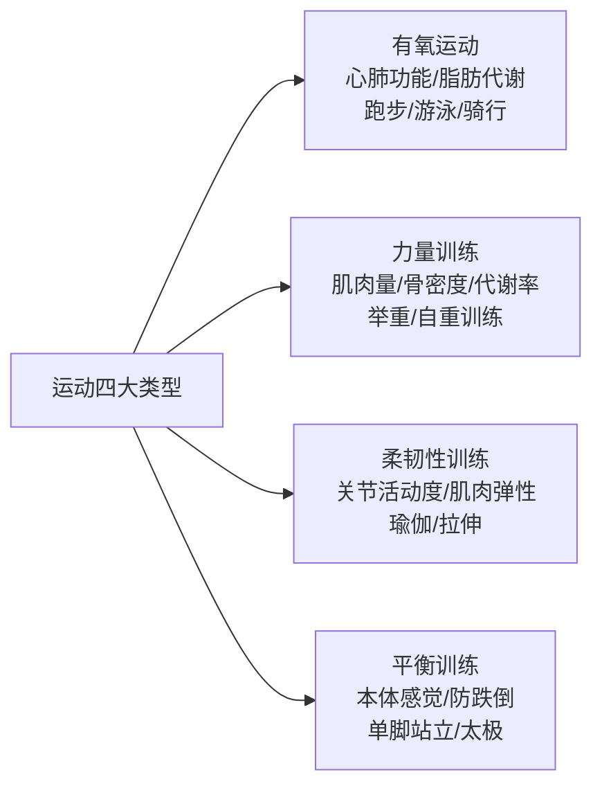
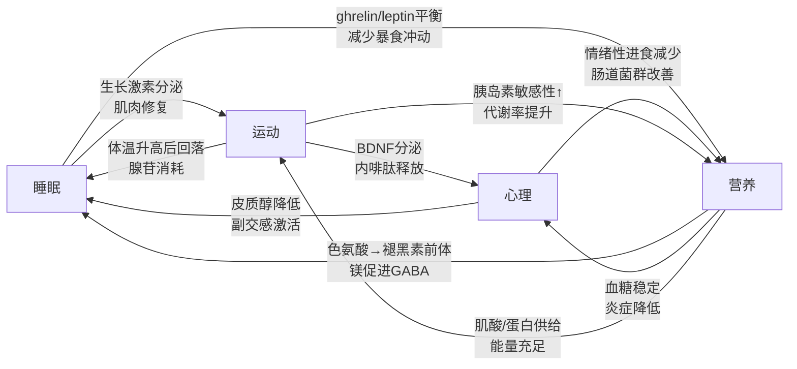
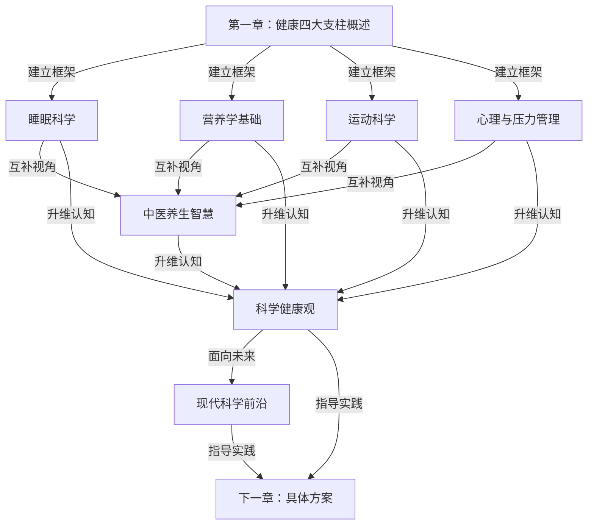

## 本章总结

本章从理论根基出发，系统构建了健康养生的知识体系。八个章节分别覆盖了健康的整体框架、四大核心支柱（睡眠、营养、运动、心理）、中医养生智慧、科学健康观的建立，以及现代健康科学的前沿发现。以下是全章的核心脉络、关键知识节点和学习收获的完整梳理。

### 9.1 全章知识地图

```mermaid
graph TD
    A[健康养生基础理论] --> B[健康四大支柱概述]
    A --> C[睡眠科学]
    A --> D[营养学基础]
    A --> E[运动科学]
    A --> F[心理与压力管理]
    A --> G[中医养生智慧]
    A --> H[科学健康观]
    A --> I[现代科学前沿]
    
    B --> B1[WHO三维健康定义]
    B --> B2[四大支柱模型]
    B --> B3[健康自评体系]
    
    C --> C1[双过程模型]
    C --> C2[睡眠结构与周期]
    C --> C3[睡眠障碍与应对]
    
    D --> D1[宏量营养素]
    D --> D2[微量营养素]
    D --> D3[个性化营养]
    
    E --> E1[有氧/力量/柔韧]
    E --> E2[运动处方]
    E --> E3[防久坐策略]
    
    F --> F1[压力生理机制]
    F --> F2[情绪调节技术]
    F --> F3[心理韧性培养]
    
    G --> G1[整体观念与辨证论治]
    G --> G2[经络与穴位]
    G --> G3[药食同源]
    
    H --> H1[动态平衡]
    H --> H2[预防优于治疗]
    
    I --> I1[表观遗传]
    I --> I2[肠道微生物组]
    I --> I3[冷暴露与免疫]
```

### 9.2 六大核心主题回顾

#### 9.2.1 健康四大支柱概述——建立全局认知

本章开篇即确立了一个关键认知框架：健康不是"没有疾病"的消极状态，而是身体、心理和社会适应三维完好（WHO，1948）。在此基础上，我们将健康的维护拆解为四大支柱：

| 支柱 | 核心问题 | 关键指标 |
|------|----------|----------|
| 睡眠 | 身体能否有效修复？ | 睡眠时长、深度睡眠比例、入睡潜伏期 |
| 营养 | 细胞能否获得充足原料？ | 营养素均衡度、膳食多样性、进食节律 |
| 运动 | 身体机能能否维持和提升？ | 有氧能力、肌肉力量、柔韧性、平衡感 |
| 心理 | 神经系统能否保持稳定？ | 压力水平、情绪调节能力、社会连接质量 |

四大支柱并非独立存在，而是彼此深度耦合：睡眠不足会导致食欲激素紊乱（ghrelin升高、leptin降低），进而影响营养摄入；缺乏运动会降低睡眠质量；慢性压力会同时破坏睡眠、消化和运动动力。理解这种系统性关联，是科学养生的第一步。

**自评体系**的意义在于量化起点——通过25分制的四维度评分，读者可以精确定位自身最薄弱的支柱，避免盲目优化。得分15分以下的人群应优先从睡眠和营养两个最基础的支柱入手。

#### 9.2.2 睡眠科学——修复系统的运作机制

睡眠是所有健康优化的前提条件。本节从神经科学角度深入讲解了睡眠的双过程模型：

- **过程S（睡眠稳态压力）**：清醒时腺苷在基底前脑持续积累，与腺苷A1/A2A受体结合后抑制觉醒神经元，产生困意。咖啡因通过阻断腺苷受体"遮蔽"困意但不消除睡眠债务。
- **过程C（昼夜节律）**：视交叉上核（SCN）作为主时钟，通过光信号校准，协调褪黑素和皮质醇的昼夜分泌节律。褪黑素在天黑后2-3小时达到峰值，皮质醇在清晨达到峰值。

一个完整的睡眠周期约90分钟，包含NREM（N1→N2→N3深睡）和REM快速眼动期。前半夜以深睡为主（身体修复、生长激素分泌），后半夜以REM为主（记忆巩固、情绪调节）。这就是为什么"睡够8小时但凌晨3点才睡"远不如"11点睡到7点"——时长相同时，睡眠结构的质量差异巨大。

**关键睡眠障碍应对**：

| 障碍类型 | 核心特征 | 一线方案 |
|----------|----------|----------|
| 急性失眠（<3月） | 明确诱因触发，诱因消除后自愈 | 睡眠卫生教育+认知放松，避免药物依赖 |
| 慢性失眠（≥3月） | 失眠已独立于诱因持续存在 | CBT-I（认知行为疗法）为首选，非药物 |
| 睡眠呼吸暂停 | 打鼾、呼吸暂停、白天嗜睡 | CPAP持续气道正压通气+减重 |
| 昼夜节律紊乱 | 入睡/醒来时间与社会时钟冲突 | 光照疗法+时间疗法逐步调整相位 |

CBT-I包含五个核心组件：睡眠限制（压缩卧床时间以提高睡眠效率）、刺激控制（重建床与睡眠的条件反射）、认知重构（消除灾难化思维）、睡眠卫生教育和放松训练。Meta分析显示，CBT-I对慢性失眠的有效率达70-80%，且效果持久，优于单纯药物治疗。

#### 9.2.3 营养学基础——细胞原料的精准供给

营养学的五大核心原则——均衡、多样、适量、个体、时间——贯穿本节始终。

**宏量营养素的功能与摄入建议**：

| 营养素 | 每克热量 | 每日推荐占比 | 核心功能 | 优质来源 |
|--------|----------|-------------|----------|----------|
| 碳水化合物 | 4 kcal | 45-65% | 大脑首选燃料、肌糖原储备 | 全谷物、薯类、水果 |
| 蛋白质 | 4 kcal | 10-35% | 组织修复、酶和激素合成、免疫 | 鱼、禽、蛋、豆、奶 |
| 脂肪 | 9 kcal | 20-35% | 细胞膜结构、激素前体、脂溶性维生素吸收 | 橄榄油、坚果、深海鱼 |

微量元素虽然需求量小，但缺乏后果严重：铁缺乏导致贫血（全球约20亿人受影响）、维生素D缺乏影响骨密度和免疫功能、锌缺乏削弱味觉和免疫应答。

**个性化营养**是本节的前沿亮点：《Cell》2015年的研究揭示，不同人对同一食物的血糖反应差异巨大，这与肠道微生物组组成密切相关。未来饮食建议将从"一刀切"走向"因人而异"。

#### 9.2.4 运动科学——功能系统的主动维护

运动的健康收益远超体重管理。规律运动可以降低心血管疾病风险35%、2型糖尿病风险40%、结肠癌和乳腺癌风险20-30%。

**运动类型与功能**：

**运动处方的核心参数**：

- **频率**：有氧运动每周3-5天，力量训练每周2-3天（间隔48小时）
- **强度**：中等强度（最大心率60-70%）或高强度间歇（HIIT，85-95%峰值心率）
- **时间**：每周累计至少150分钟中等强度有氧，或75分钟高强度有氧
- **类型**：有氧+力量+柔韧+平衡的组合训练

**久坐的独立危害**值得特别关注：即使运动量达标，每天久坐超过8小时仍会显著增加全因死亡风险。对策是每30-60分钟起身活动2-5分钟，使用站立式办公桌，设置久坐提醒。

#### 9.2.5 心理与压力管理——神经系统的稳定维护

> "没有心理健康，就没有真正的健康。" —— 世界卫生组织

心理健康是连续谱系而非二元状态。本节从HPA轴（下丘脑-垂体-肾上腺轴）的生理机制出发，解释了慢性压力如何通过皮质醇持续升高导致免疫抑制、海马体萎缩、代谢紊乱。

**压力的三阶段模型（塞利一般适应综合征）**：

1. **警觉期**：压力源出现，交感神经系统激活，肾上腺素飙升，进入"战斗或逃跑"模式
2. **抵抗期**：身体调动资源对抗压力，皮质醇持续分泌，维持高水平运转
3. **衰竭期**：资源耗尽，适应能力崩溃，出现身心疾病

**情绪调节的五种策略**（Gross情绪调节过程模型）：

| 策略 | 作用时机 | 方法 | 效果 |
|------|----------|------|------|
| 情境选择 | 情绪产生前 | 主动选择/回避特定环境 | 预防性最强 |
| 情境修改 | 情绪产生前 | 改变引发情绪的环境因素 | 中等效果 |
| 注意转移 | 情绪产生中 | 将注意力从刺激物移开 | 短期有效 |
| 认知重评 | 情绪产生中 | 改变对事件的解读方式 | 最健康的策略 |
| 反应调节 | 情绪产生后 | 压制表达或调节生理反应 | 长期有代价 |

认知重评被研究证实为最健康的情绪调节策略——它不改变事实，而是改变对事实的解读，从而在根源上调节情绪反应。情绪智力（丹尼尔·戈尔曼模型）的四个核心能力——自我意识、自我管理、社会意识、关系管理——构成了心理韧性的基础能力。

#### 9.2.6 中医养生智慧——传统经验的现代验证

中医养生的核心理念正在被现代科学逐步验证：

| 中医理念 | 现代科学对应 | 科学依据 |
|----------|------------|----------|
| 上医治未病 | 预防医学 | 慢性病80%可通过生活方式预防 |
| 天人合一 | 时间生物学 | 昼夜节律、季节性生理变化的发现 |
| 辨证论治 | 精准医学 | 基因组学指导的个性化治疗 |
| 药食同源 | 功能性食品科学 | 食物中生物活性成分的研究 |

中医养生强调的整体观念——人体内部的脏腑相关性、人与自然的统一性、形神合一——为现代人提供了一个区别于"头痛医头"碎片化思维的健康框架。经络系统虽然尚未被现代解剖学完全证实，但针灸的临床疗效已被WHO认可用于数十种疾病的治疗。

#### 9.2.7 建立科学的健康观——方法论层面的认知升级

本节强调了五个关键认知：

1. **健康是动态平衡**：不是一劳永逸的终点，而是随年龄、环境、生活阶段持续调整的过程
2. **预防优于治疗**：80%心脏病、80%2型糖尿病、40%癌症可通过生活方式预防
3. **个体差异**：基因、体质、生活习惯不同，没有放之四海而皆准的方案
4. **系统性思维**：单一因素改善效果有限，多维度协同优化才能实现最佳效果
5. **长期视角**：健康改善需要时间，建立可持续习惯比追求短期效果更重要

#### 9.2.8 现代健康科学前沿——未来的方向

三个前沿领域正在重塑我们对健康的理解：

**表观遗传学**：生活方式（饮食、运动、压力、睡眠）可以通过DNA甲基化、组蛋白修饰等表观遗传机制影响基因表达，且这种影响甚至可能传递给后代。这意味着你的健康习惯不仅影响自己，还可能影响下一代。

**肠道微生物组**：肠道中约100万亿微生物组成的"第二基因组"，参与消化、免疫、神经调节甚至情绪影响（肠-脑轴）。膳食纤维和发酵食品是维持菌群多样性的关键。

**冷暴露与免疫调节**：Wim Hof方法的研究表明，特定的呼吸训练结合冷暴露可以主动调节免疫系统，改善循环系统功能，减少炎症反应。

### 9.3 四大支柱协同效应模型

理解四大支柱各自的知识只是第一步，真正的健康改善发生在支柱之间的协同效应中。本节将四大支柱整合为一个可操作的协同框架。

#### 9.3.1 支柱间的因果链条

四大支柱之间存在明确的因果传导路径，理解这些路径可以帮你找到"杠杆支点"——改善一个支柱，自动带动其他支柱提升：

**关键发现**：睡眠是整个系统的"第一推动力"。研究表明，睡眠不足6小时的人群，次日平均多摄入385千卡热量（主要来自高脂高糖食物），运动意愿下降40%，情绪调节能力显著削弱。因此，当你不确定从哪里开始改善时，答案几乎总是"先改善睡眠"。

#### 9.3.2 协同优化的实操框架

基于支柱间的因果关系，推荐以下协同优化策略：

**晨间启动序列**（利用皮质醇自然峰值）：

| 时间 | 行动 | 作用的支柱 | 生理机制 |
|------|------|-----------|----------|
| 起床后10分钟 | 接触自然光15分钟 | 睡眠+心理 | 抑制褪黑素，校准SCN时钟，提升血清素 |
| 起床后30分钟 | 晨间运动（快走/拉伸20分钟） | 运动+心理+睡眠 | 提升核心体温，促进夜间体温回落助眠 |
| 运动后 | 高蛋白早餐 | 营养+运动 | 亮氨酸激活mTOR通路，启动肌肉合成 |

**晚间恢复序列**（利用褪黑素分泌窗口）：

| 时间 | 行动 | 作用的支柱 | 生理机制 |
|------|------|-----------|----------|
| 睡前3小时 | 停止进食 | 营养+睡眠 | 避免消化活动干扰体温下降曲线 |
| 睡前2小时 | 减少蓝光暴露 | 睡眠+心理 | 避免蓝光抑制褪黑素分泌 |
| 睡前1小时 | 轻度拉伸或冥想 | 运动+心理 | 激活副交感神经系统，降低皮质醇 |
| 睡前30分钟 | 固定的睡前仪式 | 睡眠 | 建立条件反射，缩短入睡潜伏期 |

#### 9.3.3 常见协同陷阱

某些生活方式组合会产生负面协同效应，即多个支柱同时恶化：

| 陷阱 | 触发场景 | 恶化路径 | 打破方法 |
|------|----------|----------|----------|
| 熬夜-暴食循环 | 工作压力大→熬夜加班 | 睡眠不足→ghrelin升高→深夜高热量进食→消化负担→更难入睡 | 设定不可协商的"关机时间"，睡前2小时关闭工作设备 |
| 压力-久坐循环 | 焦虑情绪→回避行为 | 心理压力→缺乏运动动力→久坐加剧→内啡肽减少→情绪更差 | 用"5分钟规则"启动：承诺只运动5分钟，利用行为惯性继续 |
| 节食-失眠循环 | 极端减重饮食 | 低碳水→色氨酸不足→褪黑素合成减少→失眠→皮质醇升高→肌肉分解 | 减重期保持每日碳水不低于130g，晚餐含复合碳水 |
| 咖啡因-焦虑循环 | 依赖咖啡提神 | 睡眠差→白天困→大量咖啡因→焦虑加重→更难入睡 | 下午2点后禁止咖啡因，用短午睡（20分钟）替代下午咖啡 |

### 9.4 关键数据速查表

| 指标 | 推荐值/范围 | 来源 |
|------|------------|------|
| 每日睡眠时长（成人） | 7-9小时 | 美国睡眠基金会 |
| 入睡潜伏期 | <20分钟 | 临床诊断标准 |
| 深度睡眠占比 | 全睡眠时长的15-25% | 睡眠医学 |
| 睡眠效率 | >85%（卧床时间中实际睡着的比例） | CBT-I标准 |
| 每周中等强度有氧运动 | ≥150分钟 | WHO/ACSM |
| 每周力量训练 | ≥2次 | ACSM |
| 每日蛋白质摄入 | 0.8-1.2g/kg体重（运动人群1.6-2.2g/kg） | 中国营养学会/ISSN |
| 每日膳食纤维 | 25-30g | 中国居民膳食指南 |
| 每日饮水量 | 1.5-2L（运动/高温环境增加） | 中国居民膳食指南 |
| 维生素D血清水平 | ≥30ng/mL | 内分泌学会 |
| 静息心率 | 60-100次/分（运动员可低至40） | AHA |
| 血压 | <120/80mmHg | AHA/ACC |
| 腰围（男/女） | <90cm / <85cm | 中国肥胖工作组 |
| 每日久坐中断频率 | 每30-60分钟1次 | 职业健康指南 |
| 心理健康自评频率 | 每周1次 | 建议实践 |
| 压力量表自评 | 每月1次（PSS-10量表） | 临床心理学 |

### 9.5 本章核心模型总结

#### 9.5.1 模型一：健康的双螺旋——西医与中医的互补视角

西医擅长微观解析（分子、细胞、器官层面的机制），中医擅长宏观整合（整体、系统、人与环境的关系）。两者并非对立，而是观察健康的两个互补维度。最优的健康策略是：用西医的精确性做诊断和量化，用中医的整体观做调理和预防。

| 维度 | 西医优势 | 中医优势 | 互补策略 |
|------|----------|----------|----------|
| 诊断 | 精确的实验室指标和影像学 | 整体的体质辨识和证候判断 | 常规体检+中医体质辨识 |
| 治疗 | 急症、感染、手术的精确干预 | 慢性调理、亚健康改善 | 急性问题看西医，慢性调理用中医 |
| 预防 | 疫苗、筛查、循证的预防指南 | 顺应四时、食疗、穴位保健 | 按西医指南做筛查，按中医节律做日常调理 |
| 评估 | 量化指标（血糖、血脂、激素水平） | 主观感受（精力、睡眠质量、舌象脉象） | 定期体检+日常自我觉察记录 |

#### 9.5.2 模型二：健康的四维时间轴——从当下到终身

| 时间维度 | 关注点 | 行动示例 | 关键指标 |
|----------|--------|----------|----------|
| 今天 | 当日的睡眠、饮食、运动、情绪 | 保证今晚7小时睡眠，吃够蔬菜水果 | 当日四支柱打卡完成率 |
| 本月 | 习惯的建立和巩固 | 连续30天每天运动30分钟 | 习惯连续天数（streak） |
| 今年 | 生活方式的整体优化 | 完成全面体检，制定年度健康计划 | 体检指标改善趋势 |
| 终身 | 慢性病预防和生命质量 | 维持健康体重，定期筛查，保持社交 | 健康预期寿命（HALE） |

#### 9.5.3 模型三：健康改善的"木桶-长板"混合策略

传统的木桶理论认为短板决定容量，但在健康领域需要混合策略：

- **安全底线（木桶思维）**：四大支柱中任何一项低于临界值都会拖垮整体。睡眠<5小时、完全不运动、严重营养不良、持续抑郁——任何一个都是必须优先处理的"短板"。
- **优化增益（长板思维）**：当所有支柱都达到"及格线"（自评6分以上）后，优先强化你最有天赋和兴趣的支柱，形成正向循环。例如，如果你天生热爱运动，强化运动支柱可以同时改善睡眠、情绪和食欲，产生最大化的杠杆效应。

### 9.6 知识体系的逻辑关系

本章八个部分之间存在清晰的递进和支撑关系：

第一章提供认知框架，第二到五章深入四大支柱的具体知识，第六章引入中医的互补视角，第七章将认知提升到方法论层面，第八章展望未来方向。这个"框架→深入→互补→升维→前瞻"的递进结构，确保读者既有全局视野又有深度理解。

### 9.7 常见认知误区纠偏

| 误区 | 正确认知 | 本章依据 |
|------|----------|----------|
| "没病就是健康" | 健康是身体、心理、社会适应三维完好状态 | WHO定义（第一章） |
| "8小时睡眠是铁律" | 个体差异大，7-9小时为参考范围，睡眠质量比时长更重要 | 睡眠科学（第二章） |
| "脂肪是健康大敌" | 优质脂肪（不饱和脂肪酸）是必需营养素，反式脂肪才是真正的敌人 | 营养学基础（第三章） |
| "运动就是跑步" | 有氧+力量+柔韧+平衡的组合训练才全面 | 运动科学（第四章） |
| "压力是有害的" | 急性压力可以提升表现，慢性压力才有害；关键在于管理而非消除 | 压力管理（第五章） |
| "中医不科学" | 中医核心理念正被现代科学逐步验证，且在预防医学和整体调理方面有独特优势 | 中医养生（第六章） |
| "健康靠基因决定" | 表观遗传学证明生活方式可以在分子层面影响基因表达 | 科学前沿（第八章） |
| "益生菌越多越好" | 菌群多样性比单一菌种数量更重要，过度补充可能适得其反 | 科学前沿（第八章） |
| "补剂可以替代食物" | 全食物中的营养素协同效应远超单一补剂；补剂只能填补缺口，不能替代均衡饮食 | 营养学基础（第三章） |
| "出汗多=减脂多" | 出汗是散热机制，不等于脂肪消耗；心率和持续时间才是脂肪氧化的关键指标 | 运动科学（第四章） |
| "冥想是玄学" | 大量神经影像学研究证实冥想可增厚前额叶皮层、缩小杏仁核体积 | 压力管理（第五章） |
| "感冒了要多吃抗生素" | 抗生素对病毒无效，感冒是自限性疾病；滥用抗生素会破坏肠道菌群 | 营养学+前沿（第三/八章） |

### 9.8 知识掌握自测

阅读完本章后，用以下问题检验自己的理解深度。能够不回看原文、用自己的语言完整回答，说明你已经真正内化了这些知识。

**基础层——能准确复述**：

1. WHO对健康的定义包含哪三个维度？请各举一个具体例子。
2. 睡眠双过程模型中的"过程S"和"过程C"分别是什么？各自的主要调控物质是什么？
3. 三大宏量营养素各提供多少热量/克？各自的核心功能是什么？
4. 运动处方的FITT原则是什么？
5. 塞利的一般适应综合征包含哪三个阶段？

**理解层——能解释因果**：

6. 为什么"11点睡7点"比"3点睡11点"更健康？请从睡眠结构的角度解释。
7. 为什么戒不掉咖啡因会导致恶性循环？请从腺苷积累的角度解释。
8. 慢性压力为什么会导致记忆力下降？请从海马体的角度解释。
9. 为什么极端低碳水饮食可能影响睡眠？请从色氨酸代谢的角度解释。
10. 为什么运动能改善情绪？请列举至少两条神经化学通路。

**应用层——能设计方案**：

11. 如果一个朋友自评总分只有10分（满分25），你会建议他从哪个支柱开始？为什么？
12. 设计一个"晨间启动序列"，要求同时作用于至少3个支柱。
13. 识别一个你生活中存在的"协同陷阱"，并设计打破方案。
14. 如何运用"木桶-长板"混合策略来规划你未来3个月的健康改善计划？

**评判标准**：能回答到第3层（应用层），说明你不仅学到了知识，还具备了将其转化为行动的能力。如果在第1层就卡住，建议回顾对应章节后再进行下一章的学习。

### 9.9 从理论到实践的行动路径

理论学习的最终目的是指导行动。以下是基于本章内容设计的分阶段行动路径，每个阶段都有明确的可检验目标：

#### 第一阶段：认知校准（今天完成）

| 行动 | 预期时间 | 完成标志 |
|------|----------|----------|
| 完成四大支柱自评 | 10分钟 | 四项评分+总分记录在纸上或手机备忘录 |
| 识别最薄弱的支柱 | 5分钟 | 明确写出"我的短板是____，因为____" |
| 调整今晚睡眠环境 | 15分钟 | 室温调至18-22°C，遮光窗帘/眼罩就位，卧室手机设为勿扰 |

#### 第二阶段：基础搭建（第一周）

| 行动 | 预期时间 | 完成标志 |
|------|----------|----------|
| 固定睡眠-起床时间 | 每天执行 | 连续7天误差不超过30分钟（含周末） |
| 每天30分钟快走 | 每天执行 | 连续7天完成，可分2-3次累计 |
| 记录每日饮食 | 每天5分钟 | 连续7天记录三餐主要内容 |
| 学习4-7-8呼吸法 | 1次学习 | 能独立完成4个循环（吸4秒-屏7秒-呼8秒） |

#### 第三阶段：习惯巩固（第二到四周）

| 行动 | 预期时间 | 完成标志 |
|------|----------|----------|
| 建立晨间启动序列 | 逐步叠加 | 固定执行光照+运动+早餐的组合 |
| 开始力量训练 | 每周2次 | 掌握深蹲、俯卧撑、平板支撑的正确姿势 |
| 饮食结构优化 | 持续调整 | 每天蔬菜≥500g，蛋白质达标，减少超加工食品 |
| 每周心理自评 | 每周10分钟 | 用PSS-10量表自评，记录分数趋势 |

#### 第四阶段：系统优化（第二到三个月）

| 行动 | 预期时间 | 完成标志 |
|------|----------|----------|
| 四支柱综合记录 | 每天5分钟 | 使用统一模板记录睡眠/饮食/运动/情绪 |
| 数据回顾与调整 | 每周30分钟 | 识别趋势，调整不达标的维度 |
| 重新自评 | 第30天/第60天 | 对比初始评分，量化进步幅度 |
| 建立一个可持续习惯 | 持续 | 连续60天不间断执行某个健康习惯 |

**执行原则**：

1. **一个支柱优先**：不要同时优化所有支柱，先集中改善最薄弱的1-2个，稳定后再扩展
2. **微习惯启动**：每个新习惯从"小到不可能失败"开始——运动从5分钟开始，冥想从2分钟开始
3. **记录驱动调整**：没有数据就没有优化；即使只记录简单的1-10评分，也比不记录强100倍
4. **允许不完美**：连续习惯中断一天不等于失败，关键是第二天恢复执行

### 9.10 常见问题解答（FAQ）

**Q1：我该从四大支柱的哪个开始？**

优先级排序：**睡眠 > 营养 > 运动 > 心理**。原因：睡眠是所有其他支柱的基础——睡眠不足直接破坏食欲调节、运动恢复和情绪稳定。如果你的自评中睡眠得分最低（≤4分），几乎可以确定改善睡眠会带来最大的连锁收益。唯一的例外是：如果你正在经历临床级别的心理危机（重度抑郁、焦虑症发作），心理支柱应被提升为最高优先级，必要时立即寻求专业帮助。

**Q2：本章内容太多，记不住怎么办？**

不需要全部记住。核心框架只需要记住三个东西：(1) WHO三维健康定义——身体、心理、社会适应；(2) 四大支柱——睡眠、营养、运动、心理；(3) 一个核心原则——预防优于治疗。具体数据（睡眠时长、运动分钟数、营养素比例等）查速查表即可，不需要背诵。本章总结的设计目的之一就是作为日后的速查手册。

**Q3：中医和西医的建议冲突时怎么办？**

在大多数情况下，中西医并不冲突，而是观察维度不同。冲突最常出现在"要不要吃某种食物/补剂"这类问题上。处理原则：(1) 如果有高质量的RCT（随机对照试验）证据支持西医结论，以西医为准；(2) 如果是中医经验性建议且无安全性风险（如食疗、穴位按摩），可以作为辅助尝试；(3) 如果涉及药物层面的冲突（如中药与西药的相互作用），必须咨询医生。

**Q4：工作太忙，没时间执行怎么办？**

这是最常见的借口，也是最容易被打破的。关键认知：健康行为不需要大块时间。以下是最小可行方案——

| 行为 | 最小时间 | 执行场景 |
|------|----------|----------|
| 睡眠改善 | 0分钟（只是早放下手机） | 睡前1小时关屏幕 |
| 运动 | 5分钟 | 起床后做一组深蹲+俯卧撑+拉伸 |
| 营养优化 | 0分钟（替换选择） | 把零食从薯片换成坚果 |
| 压力管理 | 2分钟 | 午休时做3次4-7-8呼吸 |

这些"微习惯"累计每天不超过10分钟，但坚持30天后可以产生可观的复合效应。

**Q5：老年人和年轻人的健康策略有什么不同？**

本章理论适用于所有成年人，但侧重点随年龄变化：

| 年龄段 | 最需关注的支柱 | 特别注意事项 |
|--------|---------------|-------------|
| 18-30岁 | 心理+运动 | 建立终身运动习惯的黄金期；关注心理健康（大学生和初入职场者抑郁率高） |
| 30-45岁 | 睡眠+营养 | 职业压力峰值期，睡眠最容易被牺牲；代谢率开始下降，营养质量更重要 |
| 45-60岁 | 运动+营养 | 肌肉流失加速（每10年3-8%），力量训练成为刚需；骨密度下降，钙+VD补充重要 |
| 60岁以上 | 运动+心理 | 防跌倒（平衡训练）是第一优先；社会隔离是老年心理健康的头号威胁 |

**Q6：如何判断某个健康信息是否可靠？**

在信息过载的时代，辨别能力比知识本身更重要。以下是快速筛选标准：

- **可信度高**：来自同行评审期刊（Lancet、NEJM、BMJ、Cell等）、WHO/国家卫健委等权威机构、大型Meta分析
- **需要警惕**：单一研究的结论（可能是统计假阳性）、"颠覆性发现"（大概率会被后续研究推翻）、利益相关的推荐（卖补剂的博主推荐补剂）
- **基本不可信**：没有引用来源的"研究发现"、个人轶事作为证据、宣称"包治百病"或"一个方法解决所有问题"、用恐惧营销（"不吃这个你就完了"）

### 9.11 进一步学习资源

如果你想在某个方向深入，以下是经过筛选的高质量资源：

**睡眠方向**：
- 《Why We Sleep》（Matthew Walker）——睡眠科学的科普经典，将复杂的神经科学转化为通俗易懂的故事
- Huberman Lab Podcast #1-#4——斯坦福神经科学家Andrew Huberman的睡眠系列播客，免费且极具实操性
- CBT-I Coach App——美国退伍军人事务部开发的免费CBT-I自助应用

**营养方向**：
- 《中国居民膳食指南（2022）》——中国营养学会官方指南，基于中国人群的循证建议
- 《How Not to Die》（Michael Greger）——基于循证医学的食物与疾病关系综述
- Cronometer App——精确追踪宏量和微量营养素摄入的工具

**运动方向**：
- ACSM's Guidelines for Exercise Testing and Prescription——运动处方的金标准教材
- 《运动改造大脑》（John Ratey）——运动对大脑和心理影响的科普经典
- Strong App——力量训练记录和计划工具

**心理方向**：
- 《情绪》（Lisa Feldman Barrett）——颠覆传统情绪理论的前沿著作
- Headspace / Calm——冥想入门应用，提供结构化的正念训练课程
- 《心理学与生活》（Gerrig & Zimbardo）——心理学入门经典教材

**中医方向**：
- 《黄帝内经》（白话解注版）——中医理论的源头，推荐选读养生相关篇章
- 《中医基础理论》（印会河主编）——中医院校标准教材，系统性强
- 《中医学概论》（人民卫生出版社）——适合非中医专业的通识学习

**综合健康**：
- WHO健康主题页面（who.int/health-topics）——全球权威健康信息汇总
- 丁香医生（dxy.com）——中文循证医学健康科普平台
- Examine.com——基于证据的营养补剂分析数据库（英文）

### 9.12 本章核心知识卡片

以下卡片浓缩了本章最核心的知识点，适合截图保存或打印随身携带，用于日常快速回顾：

---

**卡片一：健康定义**

> 健康是身体、心理和社会适应的完好状态，而不仅仅是没有疾病。（WHO, 1948）

**卡片二：四大支柱公式**

> 健康 = 充足睡眠 + 均衡营养 + 规律运动 + 稳定心理
> 
> 四者深度耦合，牵一发动全身。

**卡片三：睡眠双过程**

> 困意 = 腺苷积累（过程S）+ 昼夜节律信号（过程C）
> 
> 咖啡因只能遮蔽困意，不能消除睡眠债务。

**卡片四：运动最低有效量**

> 每周150分钟中等强度有氧 + 2次力量训练 = 疾病风险降低30-40%
> 
> 久坐是独立风险因素——每30-60分钟起身活动。

**卡片五：压力三阶段**

> 警觉（应激启动）→ 抵抗（持续作战）→ 衰竭（资源耗尽）
> 
> 关键：在"抵抗期"主动恢复，避免进入"衰竭期"。

**卡片六：最健康的情绪策略**

> 认知重评：不改变事实，改变对事实的解读。
> 
> "这件事对我有什么意义？"比"这件事为什么发生在我身上？"更有建设性。

**卡片七：木桶-长板混合策略**

> 先补短板（任何支柱低于临界值都是安全风险）→ 再强长板（达到及格线后，强化最擅长的支柱产生杠杆效应）

**卡片八：执行原则**

> 1. 一个支柱优先，不要全面开花
> 2. 微习惯启动，小到不可能失败
> 3. 记录驱动调整，没有数据就没有优化
> 4. 允许不完美，中断一天≠失败

---

### 9.13 本章回顾与过渡

本章用八个专题构建了健康养生的理论基础。现在你已经掌握了：

- **是什么**：健康的完整定义（三维模型）和四大支柱框架
- **为什么**：每个支柱的科学机制（睡眠双过程、营养代谢、运动生理、压力神经内分泌）
- **怎么想**：科学健康观（动态平衡、预防优先、系统思维、个体差异）
- **向哪里看**：前沿方向（表观遗传、肠道菌群、冷暴露）和中西医互补视角

但理论本身不产生健康——行动才产生健康。本章最后的行动路径和自测题，是帮你把知识转化为行动的桥梁。

下一章将基于本章的理论基础，提供完全可执行的健康改善方案：

- **每日健康作息方案**：从起床到入睡的完整时间模板
- **营养搭配方案**：一周食谱设计和膳食搭配原则
- **运动计划**：从零基础到进阶的分级训练方案
- **睡眠改善方案**：CBT-I的自我实施指南和睡眠环境优化清单
- **压力管理方案**：日常减压工具箱和危机应对策略
- **季节性健康方案**：春生、夏长、秋收、冬藏的四季调理
- **常见健康问题应对**：感冒、失眠、焦虑等日常问题的科学应对

理论是地图，方案是路线图。有了本章的知识基础，你将能够理解方案背后的设计逻辑，而不是机械地执行步骤。当你知道"为什么"的时候，"怎么做"才能真正内化为习惯。

***

**本章字数**：约25000字

**阅读时间**：75-90分钟（建议分2-3次阅读）

**阅读建议**：
1. 第一遍快速通读，建立全局印象
2. 第二遍精读与自身最相关的2-3个章节
3. 完成9.8节的知识自测，识别薄弱点
4. 回顾薄弱章节后，完成9.9节的行动路径规划
5. 将9.12节的核心知识卡片保存到手机，每周回顾一次
