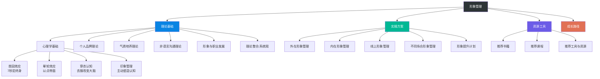
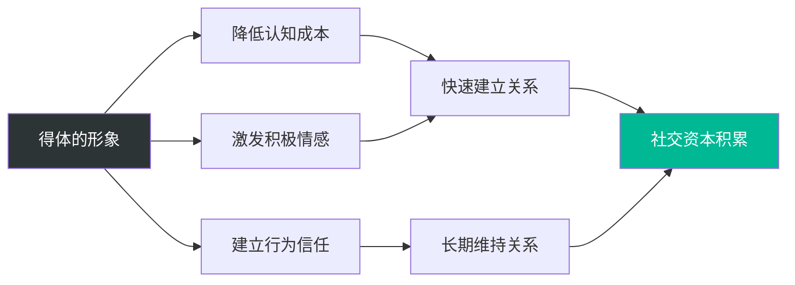

# 第十五章 形象管理

## 章节概览

### 引言

在个人提升的完整体系中，形象管理是最容易被忽视却又最具即时回报能力的模块。它不像知识积累那样需要漫长的学习周期，也不像体能训练那样需要持续数月才能见效——形象管理的投入，往往在你走出家门的那一刻就开始产生回报。

心理学研究揭示了一个残酷的事实：人们在初次见面的 **7秒** 内就会形成对他人的第一印象，而这一印象一旦形成，具有极强的稳定性和持续性。美国普林斯顿大学心理学家亚历山大·托多罗夫（Alexander Todorov）的研究更进一步发现，人们在看到一张面孔后仅需 **100毫秒**（0.1秒）就能做出关于此人是否值得信任、是否有能力的判断。虽然这种快速判断的准确性存在争议，但其对后续交往行为的影响却是真实而深远的。

美国心理学家阿尔伯特·梅拉比安（Albert Mehrabian）提出的"7-38-55法则"指出：在人际沟通中，语言内容仅占信息传递效果的7%，语调占38%，而肢体语言和外在形象占55%。经济学家丹尼尔·哈默梅什（Daniel Hamermesh）在《美貌买单》（Beauty Pays）中的实证研究进一步表明，在控制教育、经验等变量后，外貌更具吸引力的人收入比平均水平高出3%-4%，而外貌吸引力较低的人收入则低于平均水平5%-10%。这一"美貌溢价"现象在全球多个文化中都得到了验证。

这些数据并非在鼓吹"以貌取人"，而是深刻揭示了一个事实：**形象管理是一项战略性能力，它的投入产出比极高，它的忽视成本同样极高。**

### 本章定位

本章作为《个人提升方案》中承上启下的关键章节，旨在帮助读者建立系统化的形象管理认知框架和实操能力。形象管理并非简单的穿衣打扮或化妆美容，而是一门融合了心理学、社会学、传播学、美学等多学科知识的综合能力。它涵盖了从外在形象塑造到内在气质培养、从谈吐修养提升到社交礼仪规范的完整链条。

在整本书的知识体系中，本章的位置是：

- **上游承接**：前面的章节建立了自信、心态、习惯等内在基础，本章将这些内在品质"外化"为可感知的形象
- **下游支撑**：后续的社交能力、职业发展等章节需要以良好的形象管理为"底层操作系统"
- **横向关联**：与健康养生（体态基础）、情绪管理（气质基础）、沟通表达（谈吐基础）等章节形成知识网络

### 形象管理的知识全景

在深入各节内容之前，先建立一个全局视角。形象管理的知识体系可以用下面这张图来理解：

这个知识体系的构建逻辑是：

| 层级 | 功能 | 解决的问题 |
|------|------|-----------|
| 理论基础 | 建立认知框架 | 为什么要进行形象管理？背后的科学原理是什么？ |
| 实操方案 | 提供行动指南 | 具体应该怎么做？每一步的操作细节是什么？ |
| 资源工具 | 加速学习进程 | 有哪些优质的书籍、课程、工具可以帮助我？ |
| 成长路径 | 规划进阶路线 | 我现在处于什么阶段？下一步应该学什么？ |

### 为什么形象管理如此重要

#### 一、职业发展的加速器

在职场中，专业能力是基础，但形象管理往往是决定你能否获得机会的"隐性门槛"。

哈佛商学院的一项经典研究显示，在同等能力条件下，外在形象更佳的求职者获得录用的概率高出30%以上。更值得关注的是，这种效应不仅仅发生在面试环节——在日常工作中，形象管理良好的人获得晋升推荐的概率也显著更高。

原因在于，人类大脑存在一种被称为"光环效应"（Halo Effect）的认知偏差：当一个人在某一方面表现突出时，人们会倾向于认为他在其他方面也同样优秀。因此，一个形象得体的人更容易被赋予"专业"、"可靠"、"有领导力"等正面标签，而这些标签直接影响晋升、加薪、项目分配等关键职业决策。

**具体数据支撑**：
- 在高管形象顾问协会的调查中，65%的高管认为外表形象影响了他们的职业晋升
- 在领英的调查中，87%的招聘经理表示候选人着装影响了最终录用决策
- 在Robert Half International的调查中，95%的高管认为员工着装影响了其晋升机会

#### 二、人际关系的润滑剂

良好的形象管理能够显著降低社交摩擦成本。心理学中的"相似性-吸引力"法则指出，人们倾向于喜欢与自己相似的人。当你以得体的形象出现在社交场合时，你传递的信号是"我理解这个场合的规则，我尊重在场的每一个人"。这种信号能够快速建立信任感和好感度，为后续的深度交往奠定基础。

反过来，不合时宜的形象会成为社交的"绊脚石"。在一项社会心理学实验中，研究者让同一个人分别以整洁和邋遢的形象出现在不同的社交场合中，结果发现：邋遢形象下的社交成功率比整洁形象低40%以上。

#### 三、自我效能感的提升器

形象管理不仅影响他人对你的看法，更深刻影响你对自己的认知。心理学中的"穿衣认知"（Enclothed Cognition）理论指出，穿着方式会直接影响个体的心理状态、自信心和行为表现。

2012年，西北大学的Adam和Galinsky教授进行了一项经典实验：让参与者穿着白色大衣进行注意力测试。结果发现，被告知穿的是"医生白大褂"的参与者，注意力测试成绩显著高于被告知穿的是"画家工作服"的参与者。**同样是白大褂，仅凭"意义赋予"就能改变大脑的认知表现。**

这意味着：当你以最佳状态示人时，你自身的心理能量、自信水平和行为表现都会同步提升。形象管理不是"取悦他人"的表演，而是"激活自我"的工具。

#### 四、个人品牌的塑造器

在信息爆炸的时代，个人品牌已经成为核心竞争力的重要组成部分。管理学家汤姆·彼得斯（Tom Peters）早在1997年就指出："你就是你自己的CEO……你最重要的工作就是做自己的品牌经理。"

形象管理是个人品牌建设中最直观、最基础的环节。一个一致的、专业的、有辨识度的形象，能够帮助你在众多竞争者中脱颖而出。杰夫·贝索斯说过："你的品牌就是别人在你背后怎么说你。"而形象，就是这个品牌的第一层"包装"。

#### 五、社交信任的加速器

在社交心理学中，信任的建立遵循一个"认知-情感-行为"三层模型。形象管理在这三个层面都能发挥加速作用：

- **认知层面**：得体的形象降低他人的"防御成本"——不需要花额外的时间来判断你是否"安全"
- **情感层面**：良好的气质和谈吐激发积极的情感反应——好感度上升，交往意愿增强
- **行为层面**：一致的、可预测的行为模式建立长期信任——口碑和推荐自然产生

### 本章涵盖的核心内容

本章内容分布在以下六个模块中，每个模块都可以独立阅读，但建议按顺序学习以获得最佳效果。

#### 模块一：基础理论（6个小节）

| 小节 | 核心内容 | 重点知识 |
|------|---------|---------|
| 第一节 | 心理学基础 | 首因效应（7秒定终身）、晕轮效应（以点带面）、穿衣认知理论、印象管理策略 |
| 第二节 | 个人品牌理论 | 品牌构成五要素（核心价值/视觉形象/语言风格/行为模式/数字形象）、差异化定位四步骤、危机管理 |
| 第三节 | 气质培养理论 | 气质六维度（体态/表情/眼神/声音/能量/心态）、气质类型学、镜像神经元与具身认知 |
| 第四节 | 非语言沟通理论 | 梅拉比安法则、肢体语言分类、空间语言学、触觉沟通 |
| 第五节 | 形象与职业发展 | 形象在不同职业阶段的作用、领导力形象、职业形象转型 |
| 第六节 | 理论整合 | 形象管理的系统观，将前五节理论整合为统一框架 |

**为什么要先学理论？** 没有理论框架的形象管理是盲目的模仿，有了理论框架的形象管理才是有意识的策略。理论让你明白"为什么这样做有效"，从而在面对新场景时能够灵活应变，而不是机械地套用模板。

#### 模块二：具体方案（5个小节）

| 小节 | 核心内容 | 实操工具 |
|------|---------|---------|
| 第一节 | 外在形象管理 | 色彩诊断、体型分析、衣橱管理、搭配公式、场合着装Dress Code |
| 第二节 | 内在形象管理 | 气质训练（体态/表情/眼神/声音）、情绪管理、能量管理 |
| 第三节 | 线上形象管理 | 社交媒体形象、数字身份一致性、头像选择、内容策略 |
| 第四节 | 不同场合的形象管理 | 商务场合、社交场合、休闲场合、正式场合的切换策略 |
| 第五节 | 形象提升计划 | 30天/90天/180天行动计划、习惯养成、进度追踪 |

**理论与方案的关系**：理论回答"为什么"，方案回答"怎么做"。如果你时间有限，可以先跳到方案部分直接实践，但遇到"为什么这样做"的困惑时，建议回到理论部分补充认知。

#### 模块三：产品推荐（3个小节）

| 小节 | 推荐内容 |
|------|---------|
| 第一节 | 推荐书籍——形象管理领域最值得阅读的经典著作 |
| 第二节 | 推荐课程——线上和线下的系统化学习课程 |
| 第三节 | 推荐工具与资源——色卡、搭配工具、形象日记模板等实用工具 |

#### 模块四：学习路径

本节设计了四阶段、6-12个月的成长路线图，为不同起点的读者提供明确的进阶方向：

| 阶段 | 时间 | 核心目标 | 每日投入 |
|------|------|---------|---------|
| 第一阶段 | 1-4周 | 自我认知与基础建设——明确"我是谁"和"我要成为谁" | 45分钟 |
| 第二阶段 | 5-12周 | 体态与气质培养——由外而内建立气质基础 | 30分钟 |
| 第三阶段 | 13-24周 | 谈吐修养与社交能力——提升表达和社交素养 | 20分钟+实践 |
| 第四阶段 | 25周+ | 形象整合与持续优化——形成一致的个人形象 | 10分钟+持续学习 |

#### 模块五：常见误区

揭示形象管理中最常见的十个认知和行为陷阱，并为每个误区提供自检问题和纠正方法。这十个误区涵盖了从"将形象管理等同于穿衣打扮"到"忽视反馈和调整"的完整谱系，是避坑指南，更是自检清单。

#### 模块六：本章小结

回顾核心要点，提供30天快速启动计划和长期行动原则，帮助读者从"知道"走向"做到"。

### 本章学习目标

完成本章学习后，读者应能够：

1. **理解形象管理的科学原理**——掌握首因效应、晕轮效应、穿衣认知等核心心理学理论，建立"知其然更知其所以然"的认知深度
2. **明确个人形象定位**——根据自身特质、职业需求和社会角色，制定专属的形象策略，找到"我是谁"与"我想成为谁"之间的最优平衡点
3. **掌握气质提升的六个维度**——从体态、表情、眼神、声音、能量、心态六个方面系统提升个人气质
4. **提升谈吐修养水平**——学会倾听、表达、应变的系统方法，在各种社交场合展现得体、有深度的沟通能力
5. **管理线上线下的形象一致性**——在数字化时代维护统一的、专业的、有辨识度的个人形象
6. **识别并规避常见误区**——避免在形象管理中踩坑，高效利用时间和资源
7. **制定并执行持续改进计划**——建立从自检到反馈到优化的闭环机制

### 阅读建议

**按顺序阅读（推荐）**：理论部分（基础理论）为后续实操（具体方案）提供认知基础。没有理论框架的实操容易变成盲目的模仿；没有实操验证的理论容易变成纸上谈兵。两者结合，才能形成真正的形象管理能力。

**按需阅读（时间有限时）**：如果你已经有了一定的形象管理基础，可以按以下优先级选择阅读：
1. **先读**：误区部分（05）——立即避免最常见的错误
2. **再读**：具体方案中的你最需要提升的模块——对症下药
3. **后读**：基础理论——补充认知框架，让你的实践更有方向感

**阅读后的第一件事**：读完任何一个小节后，立刻做一件事——在你的生活中找到一个与这个知识点对应的真实场景，观察自己或他人的表现。知识只有在被激活时才有力量，而"观察"是最简单的激活方式。

### 一个重要的提醒

形象管理是一项需要长期投入的能力，不可能一蹴而就。本书的学习路径设计了6-12个月的进阶周期，这并非夸张——体态的矫正需要数月的持续训练，气质的培养需要数年的积累，谈吐的提升需要大量的实践和反思。

但这并不意味着你需要等待很久才能看到变化。形象管理有一个独特的"即时回报"特性：**你今天的每一个微小改变，明天就能被人感知到。** 一件更合身的衣服、一个更挺拔的姿态、一次更有意识的眼神接触——这些"小改变"积累起来，就是质的飞跃。

记住：最好的形象管理，不是让别人觉得你"穿得好看"，而是让别人觉得"你就是那样的人"。当你的内在品质与外在表达达成一致时，你就拥有了最有说服力的个人形象。

***

*下一节：[基础理论](基础理论/01-第一节形象管理的心理学基础.md)*
