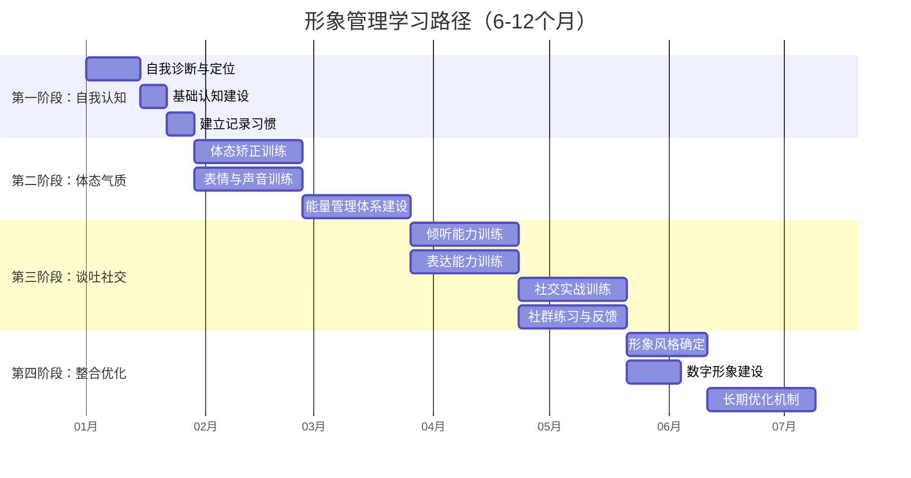

# 学习路径：从入门到精通的成长路线图

形象管理不是买几件好衣服、练几天微笑就能完成的事。它是一项系统工程，涉及认知重塑、身体训练、表达修炼、社交实践四个维度，需要按正确的顺序、在正确的时间点发力，才能形成合力。

本章为你提供一条经过验证的完整学习路径。它不是一个模糊的方向指引，而是一份精确到每周、每天的行动路线图——告诉你先做什么、后做什么、每一步花多少时间、做到什么程度才算过关。

## 为什么需要学习路径

### 没有路径的典型困境

大多数人在形象管理上失败，不是因为不够努力，而是因为发力顺序错了：

| 错误起点 | 短期效果 | 长期后果 |
|---------|---------|---------|
| 直接学穿搭 | 买了一堆衣服但不会搭 | 浪费金钱，衣柜变成"服装坟场" |
| 直接练口才 | 学了一堆话术但用不出来 | 表达生硬，给人"油嘴滑舌"的感觉 |
| 直接学社交礼仪 | 记住了规则但做不到自然 | 刻板僵硬，反而显得不真诚 |
| 同时学所有东西 | 每样都浅尝辄止 | 精力分散，半年后没有明显变化 |

这些问题的根源是同一个：**没有按照认知规律排列学习顺序**。

### 学习路径的设计原理

本路径遵循三个核心设计原则：

**原则一：由内而外（Inside-Out）**

形象的底层是自我认知。你必须先知道自己是谁、想成为什么样的人，才能有效地塑造外在形象。一个对自身定位模糊的人，穿再贵的衣服也撑不起气场。

自我认知 → 体态气质 → 表达能力 → 社交实践 → 形象整合
   ↑ 内核         ↑ 骨架         ↑ 血肉         ↑ 皮肤         ↑ 整体

**原则二：由知到行（Know-Do）**

每个阶段都是"先学原理，再做练习，最后到真实场景中检验"。纯理论学习没有用，但没有理论指导的盲目练习同样低效。

**原则三：由简到繁（Simple-Complex）**

先建立单点能力（比如"站直"），再组合成复合能力（比如"在会议中边站直边自信发言"），最后形成自动化的行为模式（不需要刻意控制就能自然展现）。

### 整体路线图



四个阶段并非完全串行——第二阶段的体态训练和第三阶段的倾听练习可以部分并行，但核心节点有严格的先后依赖关系。

***

## 起步评估：确定你的起点

在正式开始之前，花15分钟做一个自我评估，确定你当前所处的位置。这能帮你跳过已经掌握的内容，把精力集中在真正的短板上。

### 自评量表

对以下20个陈述，按1-5分打分（1=完全不符合，5=完全符合）：

**A组：自我认知（5题）**

| # | 陈述 | 得分 |
|---|------|------|
| 1 | 我能清晰描述自己想呈现给他人的形象 | __/5 |
| 2 | 我知道自己适合哪些颜色和风格 | __/5 |
| 3 | 我有明确的形象榜样人物 | __/5 |
| 4 | 我了解自己在不同场景中需要展现的不同面向 | __/5 |
| 5 | 我知道自己形象上的最大优势和最大短板 | __/5 |

**B组：体态气质（5题）**

| # | 陈述 | 得分 |
|---|------|------|
| 6 | 我的站姿/坐姿端正，不含胸驼背 | __/5 |
| 7 | 我走路时姿态稳健，不拖沓 | __/5 |
| 8 | 我的面部表情自然、有亲和力 | __/5 |
| 9 | 我的声音清晰、有感染力 | __/5 |
| 10 | 我在社交场合能保持稳定的能量状态 | __/5 |

**C组：谈吐修养（5题）**

| # | 陈述 | 得分 |
|---|------|------|
| 11 | 我能在对话中做到真正的倾听而非等待发言 | __/5 |
| 12 | 我能用清晰的结构表达复杂观点 | __/5 |
| 13 | 我有拿手的个人故事，能随时讲出来 | __/5 |
| 14 | 我能根据场合调整说话的风格和内容 | __/5 |
| 15 | 别人评价我说话"有水平"或"有深度" | __/5 |

**D组：社交实践（5题）**

| # | 陈述 | 得分 |
|---|------|------|
| 16 | 我能自如地在陌生社交场合开启对话 | __/5 |
| 17 | 我了解并能自然运用基本社交礼仪 | __/5 |
| 18 | 我能在社交中合理分配精力，不过度消耗 | __/5 |
| 19 | 我的线上形象（社交媒体）和线下形象一致 | __/5 |
| 20 | 周围人能用一致的正面词汇描述我 | __/5 |

### 评估结果与起始建议

计算每组得分（满分25分）：

| 组别 | 得分 | 建议 |
|------|------|------|
| A组 ≤ 15 | 自我认知薄弱 | **必须从第一阶段开始**，不可跳过 |
| A组 > 15 且 B组 ≤ 15 | 认知OK但体态薄弱 | 可快速过第一阶段（1-2周），重点投入第二阶段 |
| A+B > 30 且 C组 ≤ 15 | 基础OK但表达薄弱 | 跳过第一阶段，直接从第二阶段后期开始 |
| A+B+C > 45 且 D组 ≤ 15 | 个人能力强但社交不足 | 跳到第三阶段，重点突破社交实践 |
| 四组均 > 20 | 基础扎实 | 直接进入第四阶段，做形象整合和长期优化 |

**重要提醒**：自评打分要诚实。大多数人会高估自己5-10分。如果你不确定，宁可从更早的阶段开始——扎实的基础永远不嫌多。

***

## 第一阶段：自我认知与基础建设（第1-4周）

### 阶段定位

这是整个学习路径的地基。本阶段不涉及任何外在改变，全部工作都在"向内看"——搞清楚你是谁、你的优势在哪、你想成为什么样的人。

跳过这个阶段直接学穿搭或练口才，就像不看地图就出发旅行——你可能走得很努力，但方向未必对。

### 核心任务

#### 任务一：完成自我诊断

自我诊断不是做心理测试，而是通过结构化的方法，把自己的特质、优势和定位方向梳理清楚。

**步骤1：四象限形象定位**

画一个二维坐标轴，横轴是"亲和力"（从"权威冷峻"到"亲切温暖"），纵轴是"能量感"（从"安静内敛"到"高能外向"）。把自己放进去：

高能量感
    │
    ├─ 活力领袖型        ├─ 睿智导师型
    │  (热情、有感染力、   │  (沉稳、有深度、
    │   善于激励他人)      │   给人信赖感)
    │
    ├─ 阳光伙伴型        ├─ 冷静专家型
    │  (友善、好相处、     │  (精准、高效、
    │   让人放松)          │   专业感强)
    │
低能量感───────────────────────────高亲和力

找到自己的象限后，写下3个关键词来描述你希望呈现的形象。这三个词将成为后续所有形象决策的锚点——买衣服、说话方式、社交策略都要围绕它们展开。

**步骤2：四季色彩自测**

色彩对形象的影响比大多数人想象的大得多。穿对颜色，皮肤看起来干净透亮；穿错颜色，再贵的衣服也显得廉价。

自测方法：
1. 在自然光下（不要在暖色灯光下），拿四组不同色调的布料或衣服贴近脸部
2. 春季型（暖+浅）：珊瑚色、鹅黄色、浅卡其让你显得气色好
3. 夏季型（冷+浅）：薰衣草紫、雾蓝、玫瑰粉让你显得干净
4. 秋季型（暖+深）：铁锈红、芥末黄、橄榄绿让你显得沉稳
5. 冬季型（冷+深）：正红、宝蓝、纯白让你显得精神

记录下最让你"发光"的那一组，这就是你的色彩季型。

**步骤3：形象榜样分析**

选3个你欣赏其形象的公众人物（可以是演员、企业家、博主等），分析他们的形象特质：

| 分析维度 | 榜样A | 榜样B | 榜样C | 我的启发 |
|---------|-------|-------|-------|---------|
| 整体风格关键词 | | | | |
| 穿搭特点 | | | | |
| 说话方式 | | | | |
| 气质类型 | | | | |
| 最打动我的一点 | | | | |

**步骤4：场景矩阵**

列出你生活中的主要社交场景，为每个场景定义你希望呈现的形象：

| 场景 | 频率 | 当前形象评分(1-10) | 目标形象关键词 | 差距分析 |
|------|------|-------------------|--------------|---------|
| 职场日常 | 每天 | | | |
| 会议汇报 | 每周 | | | |
| 客户拜访 | 每月 | | | |
| 朋友聚会 | 每周 | | | |
| 陌生社交 | 每月 | | | |
| 约会场景 | 不定期 | | | |
| 家庭聚会 | 每月 | | | |

这个矩阵会在第四阶段"形象整合"时被重新拿出来用，届时你会惊讶于自己的变化。

#### 任务二：建立基础认知框架

在开始行动之前，先建立一个系统性的认知框架，理解形象管理的底层逻辑。

**必读内容**（本书对应章节）：
- 第一章"个人品牌"：理解形象管理的底层逻辑——你不是在"装"，而是在有意识地传递你的真实价值
- 第二章"气质培养"：理解气质的六个核心维度（体态、表情、声音、节奏、能量、定力），以及它们之间的关系
- 第三章"谈吐修养"：理解表达的三个层次（能说→会说→说到心里），为第三阶段做铺垫

**认知框架的核心要点**：

形象 = 自我认知 × 外在呈现 × 社交验证

三者是乘法关系而非加法关系——任何一个为零，整体就为零。一个有清晰自我认知但外在邋遢的人，和一个外表精致但内心空洞的人，都无法形成有效的个人形象。

#### 任务三：建立记录系统

记录是自我改变最被低估的工具。没有记录，你无法知道自己进步了多少，也无法发现那些反复出现的问题。

**形象日记模板**（每天晚上花5分钟填写）：

```markdown
## 日期：____年__月__日

### 今日穿着
- 上装：____
- 下装：____
- 鞋子：____
- 配饰：____
- 自评得分(1-10)：__

### 今日社交表现
- 最满意的一次互动：____
- 最不满意的一次互动：____
- 别人的正面反馈：____
- 需要改进的地方：____

### 今日体态/能量
- 整体能量状态(1-10)：__
- 体态自评：____
- 声音状态：____

### 明日计划
- 穿搭重点：____
- 需要练习的技能：____
```

**音频记录**：每周至少录一次自己说话的音频（可以是即兴讲述一件今天发生的事，3分钟即可）。回听时关注：语速是否合适、有没有口头禅、声音是否有感染力、逻辑是否清晰。

**照片记录**：每天拍一张全身照（固定角度、固定位置），不需要发朋友圈，纯粹用于自我观察。一个月后把第1天和第30天的照片放在一起对比，你会看到肉眼可见的变化。

### 推荐工具

| 工具名称 | 用途 | 平台 | 费用 |
|---------|------|------|------|
| 日记类APP（Day One/Flomo） | 形象日记记录 | iOS/Android | 免费/付费 |
| 色彩分析小程序 | 辅助判断色彩季型 | 微信小程序 | 免费 |
| 手机三脚架 | 固定角度拍照 | 通用 | 30-80元 |
| 录音APP（手机自带即可） | 录制说话音频 | 通用 | 免费 |

### 每日时间投入

| 活动 | 时间 | 备注 |
|------|------|------|
| 阅读学习 | 30分钟 | 理解原理和框架 |
| 填写形象日记 | 5分钟 | 当天回顾 |
| 拍照记录 | 2分钟 | 固定时间，养成习惯 |
| **总计** | **约37分钟/天** | 周末可适当增加学习时间 |

### 阶段检验标准

完成以下全部检查项，才能进入第二阶段：

- [ ] 能用3个关键词清晰描述自己的目标形象
- [ ] 知道自己的色彩季型，能说出3个适合自己的颜色
- [ ] 完成了3个形象榜样的特质分析
- [ ] 填写了场景矩阵，明确了各场景的形象差距
- [ ] 连续14天填写形象日记（中断不超过1天）
- [ ] 积累了至少2周的全身照记录

**未达标处理**：如果4周后仍有检查项未完成，延长1-2周。第一阶段的扎实程度决定了后续所有阶段的效果上限。

***

## 第二阶段：体态与气质培养（第5-12周）

### 阶段定位

体态是形象的"硬件"。一个含胸驼背的人，穿再好的西装也像借来的；一个声音虚弱的人，讲再好的内容也缺乏说服力。

本阶段的目标不是让你变成模特或播音员，而是**消除体态和表达上的明显短板**，让外在呈现不低于你内在实力的真实水平。

这个阶段和第一阶段有一个关键区别：第一阶段主要是"想"和"看"，第二阶段开始"练"。你需要动起来。

### 核心任务

#### 任务一：体态矫正（贯穿整个阶段）

**为什么体态排在最前面**

体态对形象的影响是即时且巨大的。研究表明，人们在初次见面的前7秒就形成了对他人的第一印象，而体态（站姿、走路姿态、坐姿）是这7秒中权重最高的视觉信号。

哈佛商学院Amy Cuddy的研究发现，开放、舒展的体态不仅影响他人对你的判断，还会改变你自己的激素水平——保持"高能量姿势"2分钟，睾酮（自信激素）上升20%，皮质醇（压力激素）下降25%。

**常见体态问题自检**

站在全身镜前，从正面和侧面分别观察：

| 问题 | 正面表现 | 侧面表现 | 主要原因 |
|------|---------|---------|---------|
| 头前伸 | 头部不在躯干正上方 | 耳朵在肩膀前方 | 久坐看屏幕 |
| 圆肩 | 两肩内扣，呈"∩"形 | 胸椎后凸 | 胸肌过紧、背肌过弱 |
| 骨盆前倾 | 腰部曲线过大 | 腹部前凸 | 髋屈肌过紧、腹肌过弱 |
| 骨盆后倾 | 臀部扁平 | 腰椎曲度消失 | 久坐、臀肌无力 |
| X/O型腿 | 双膝间距异常 | — | 足弓问题或肌力不平衡 |

**每日体态训练方案**（15分钟）：

```markdown
## 热身（2分钟）
- 猫牛式伸展：10次
- 胸椎旋转：每侧8次

## 核心训练（10分钟）
1. 靠墙站立：后脑勺、肩胛骨、臀部、脚跟贴墙，收下巴
   → 保持60秒 × 3组
2. YTWL练习（俯卧）：强化中下斜方肌
   → 每个字母10次 × 2组
3. 死虫式：仰卧，对侧手脚交替伸展
   → 每侧10次 × 3组
4. 臀桥：激活臀大肌
   → 15次 × 3组

## 收尾（3分钟）
- 泡沫轴滚压：胸椎、大腿前侧、臀部
- 全身拉伸
```

**训练节奏**：每天一次，最好固定在早上或下班后。不需要去健身房，在家铺一张瑜伽垫就够了。泡沫轴（30-60元）是唯一需要购买的工具。

**每月体态对比照**：每月1号，在同一个位置、同一个角度拍一张正面和侧面的照片，和上个月对比。体态改善是渐进的，每天照镜子很难察觉变化，但月度对比照会让你清楚地看到进步。

#### 任务二：表情与声音训练

**表情管理**

面部表情是"无声的语言"。一个面无表情的人，即使内心热情，也会被误读为冷漠或不感兴趣。

**镜子练习**（每天3分钟）：

1. **微笑练习**：对着镜子微笑，找到"真诚微笑"和"假笑"的区别。真诚微笑的关键是眼轮匝肌的参与——眼角会出现细纹（鱼尾纹），这叫"杜兴微笑"。练习方法：想一件开心的事，让笑意从眼睛开始，再传递到嘴角。

2. **倾听表情练习**：模拟听别人说话时的表情——微微点头、眉毛轻扬（表示感兴趣）、适时微笑。避免面无表情地盯着对方看。

3. **严肃表情练习**：需要表达认真、权威时的表情——嘴角平直、目光稳定、下巴微收。避免皱眉（皱眉传达的是焦虑而非严肃）。

**声音训练**

声音是形象的"听觉维度"。很多人不知道自己的声音听起来是什么样的——这正是为什么要录音回听。

**腹式呼吸训练**：
1. 仰卧，双手放在腹部
2. 吸气时腹部隆起（不是胸部扩张）
3. 呼气时腹部收缩，发出"嘶——"的声音
4. 每天练习5分钟，直到站立时也能自然使用腹式呼吸

**共鸣训练**：
- 胸腔共鸣：发低沉的"嗡——"，感受胸腔振动
- 口腔共鸣：发"啊——"，感受口腔打开
- 头腔共鸣：发高音的"嗯——"，感受眉心振动
- 综合练习：用"ma-mei-mi-mo-mu"从低到高滑动，感受共鸣位置的转移

**语速控制**：
- 正常语速：每分钟180-220字
- 重要信息放慢到每分钟150字
- 过渡性内容可以加快到每分钟250字
- 关键技巧：在重要观点前后停顿1-2秒

**每日练习方案**（10分钟）：
- 腹式呼吸：3分钟
- 共鸣训练：3分钟
- 朗读练习（任意文章，注意语速和停顿）：4分钟

#### 任务三：能量管理

能量管理是体态气质中最容易被忽视，却影响最深远的能力。

**理解能量模型**

每个人每天的能量不是恒定的，而是呈波动曲线。大多数人的能量曲线类似：

能量
高 │      ╭──╮          ╭──╮
   │     ╱    ╲        ╱    ╲
   │    ╱      ╲      ╱      ╲
低 │───╱────────╲────╱────────╲───
   └──────────────────────────────── 时间
     8am  10am  12pm  2pm  4pm  6pm

- 上午9-11点通常是第一个能量高峰
- 午饭后1-2点是能量低谷
- 下午3-5点是第二个能量高峰
- 晚上7-9点因人而异

**能量日志模板**（每2小时记录一次，持续一周）：

| 时间 | 能量(1-10) | 当时在做什么 | 情绪状态 | 备注 |
|------|-----------|-------------|---------|------|
| 8:00 | | | | |
| 10:00 | | | | |
| 12:00 | | | | |
| 14:00 | | | | |
| 16:00 | | | | |
| 18:00 | | | | |
| 20:00 | | | | |

记录一周后，你就能清晰看到自己的能量曲线。把重要的社交活动（面试、约会、重要会议）安排在能量高峰期，把不需要社交的独处时间安排在低谷期。

**能量补充策略库**

建立一个"能量急救包"，列出对你有效的快速恢复方法：

| 场景 | 推荐方法 | 恢复时间 | 效果评估 |
|------|---------|---------|---------|
| 开会前紧张 | 深呼吸3次 + 高能量姿势2分钟 | 3分钟 | 待验证 |
| 午后犯困 | 走路5分钟 + 冷水洗脸 | 5分钟 | 待验证 |
| 社交疲劳 | 独处10分钟 + 听音乐 | 10分钟 | 待验证 |
| 长时间社交后 | 独处30分钟 + 不看手机 | 30分钟 | 待验证 |

每个人的能量补充方式不同，需要自己实验和记录。一周后回顾，保留有效的方法，替换无效的方法。

### 推荐学习资源

| 类型 | 资源 | 重点内容 |
|------|------|---------|
| 书籍 | 《高能量姿势》Amy Cuddy | 体态如何影响心理状态 |
| 书籍 | 《气场修习术》 | 气场的系统训练方法 |
| 视频 | B站搜索"体态矫正" | 具体动作示范 |
| APP | Keep/每日瑜伽 | 结构化训练计划 |
| 工具 | 泡沫轴、瑜伽垫 | 体态训练必备 |
| 工具 | 节拍器APP | 语速控制练习 |

### 每日时间投入

| 活动 | 时间 | 备注 |
|------|------|------|
| 体态训练 | 15分钟 | 含热身和收尾 |
| 表情镜子练习 | 3分钟 | 可在洗漱时完成 |
| 声音训练 | 7分钟 | 含呼吸和朗读 |
| 能量记录 | 2分钟 | 每2小时花15秒打分 |
| **总计** | **约27分钟/天** | 可拆分到早晚两个时段 |

### 阶段检验标准

完成以下全部检查项，才能进入第三阶段：

- [ ] 连续4周完成每日体态训练（中断不超过3天）
- [ ] 体态对比照有明显改善（至少一个人能看出来）
- [ ] 能自然地使用腹式呼吸说话
- [ ] 录音回听时，声音听起来比训练前更稳定、更有感染力
- [ ] 能在镜子前自如切换微笑、认真、倾听三种表情
- [ ] 完成了7天能量日志，知道自己的能量高峰和低谷时段
- [ ] 建立了至少3个有效的能量补充策略

**常见瓶颈**：

- **体态训练枯燥坚持不下来**：找一个训练搭档互相督促，或者把训练和听播客/音乐结合起来
- **声音训练感觉没效果**：声音的改变是渐进的，坚持录音对比，通常第3-4周会有明显感觉
- **能量记录太麻烦**：简化为每天只记录3个时间点（早中晚），一周后再细化

***

## 第三阶段：谈吐修养与社交能力（第13-24周）

### 阶段定位

如果说体态是形象的"硬件"，那谈吐就是形象的"软件"。一个人可以站得很直、穿得很好，但如果开口说话就暴露了思维混乱、缺乏教养，那前面所有努力都会打折扣。

本阶段分为两个并行的子系统：**输入系统**（倾听）和**输出系统**（表达），再加上一个**综合应用**（社交实战）。先练倾听、再练表达、最后到真实社交中综合运用——这个顺序是刻意设计的。

**为什么倾听排在表达前面**：大多数人以为"会说话"的人就是口才好的人，但真正让人觉得"这个人很有水平"的，首先是"这个人真的在听我说话"。倾听是社交好感的第一来源，也是获取信息、理解对方需求的前提。一个不会倾听的人，说得再漂亮也只是"自说自话"。

### 核心任务

#### 任务一：倾听能力训练

**3F倾听法**

3F倾听法是目前最实用的深度倾听框架，它把倾听分为三个层次：

| 层次 | 英文 | 含义 | 示例 |
|------|------|------|------|
| Fact | 事实 | 对方说了什么客观事实 | "项目延期了两周" |
| Feeling | 感受 | 对方的情绪状态是什么 | "他语气里带着焦虑和无奈" |
| Focus | 意图 | 对方真正想要什么 | "他希望我帮忙协调资源" |

大多数人只听到了Fact（第一层），就急着给建议。真正的倾听要做到三层都听到。

**3F倾听练习方法**：

每次重要对话后（3分钟内），用以下模板回顾：

```markdown
## 对话回顾

### Fact（对方说了哪些事实？）
-

### Feeling（对方的情绪是什么？）
-

### Focus（对方真正想要什么？）
-

### 我的回应是否匹配了对方的需求？
-

### 如果重来一次，我会怎么回应？
-
```

**倾听反馈句式**（对话中实时使用）：

| 场景 | 句式 | 示例 |
|------|------|------|
| 确认事实 | "你的意思是……对吗？" | "你的意思是项目因为供应商延期了，对吗？" |
| 回应感受 | "听起来你……" | "听起来你对这件事挺失望的" |
| 探索意图 | "你希望……" | "你希望我能帮你协调一下资源吗？" |
| 深入追问 | "能多说说……吗？" | "能多说说当时的情况吗？" |

**每日练习**：在日常对话中有意识地使用至少一次倾听反馈句式。不需要每次都完美，关键是养成"先听再回应"的习惯。

#### 任务二：表达能力训练

**PREP表达法**

PREP是结构化表达的万能公式，适用于90%以上的表达场景：

P - Point（观点）：先说结论
R - Reason（原因）：给出理由
E - Example（案例）：举例说明
P - Point（重申）：再次强调结论

**示例对比**：

❌ 无结构的表达：
> "我觉得吧，其实这个方案也不是不行，但是呢，有几个地方我有点担心，就是说，成本可能会比较高，然后呢，时间上也不太确定，所以……"

✅ PREP结构的表达：
> **(P)** 我建议推迟两周再启动这个项目。**(R)** 因为目前供应商的交付时间不确定，贸然启动可能导致后期赶工。**(E)** 上次A项目就是在供应商没确认的情况下启动的，结果中间被迫加班三周，质量也打了折扣。**(P)** 所以我建议等供应商确认后再启动，两周的等待远好于三周的加班。

**每日一分钟即兴演讲练习**：

每天随机抽取一个话题，用PREP结构在一分钟内讲清楚。话题可以是：
- 今天天气真好/不好
- 为什么我选择这个职业
- 我最近看的一本书/电影
- 一个我认为重要的生活原则
- 如果我能回到过去，我会对18岁的自己说什么

练习时录音，回听检查：
- 观点是否清晰（听一遍就能说出你的结论吗？）
- 理由是否充分（有没有逻辑支撑？）
- 案例是否具体（是真实例子还是空泛描述？）
- 时间控制（是否在一分钟内？）

**个人故事库**

准备5个精心打磨的个人故事，覆盖以下场景：

| 故事类型 | 用途 | 要求 |
|---------|------|------|
| "我是谁" | 自我介绍、破冰 | 30秒版本和2分钟版本各一个 |
| "我最骄傲的成就" | 面试、社交场合展示实力 | 有具体数据和结果 |
| "我经历的最大失败" | 展示成长性和韧性 | 重点是"我从中学到了什么" |
| "我为什么做这件事" | 展示热情和价值观 | 让人产生共鸣 |
| "我遇到过最有趣的人/事" | 社交场合活跃气氛 | 有趣、有画面感、有意外转折 |

每个故事至少练习讲述10遍，直到能自然、流畅地讲出来，而不是像背稿子一样。

#### 任务三：社交实战训练

**基本社交礼仪清单**

| 场景 | 规范 | 常见错误 |
|------|------|---------|
| 握手 | 力度适中(约2kg)、时长2-3秒、目光接触 | 力度过大（"碾压式"）或过软（"死鱼手"） |
| 名片交换 | 双手递送、文字朝向对方、接过后认真看一眼 | 随手塞进口袋、不看就放桌上 |
| 介绍顺序 | 先把年轻的介绍给年长的，把职位低的介绍给高的 | 颠倒顺序或忘记介绍 |
| 话题开启 | 从环境/共同点/对方兴趣入手 | 直接问收入、年龄、婚恋状况 |
| 告别 | 简洁感谢 + 表达期待下次见面 | 拖泥带水、反复解释为什么要走 |

**话题开启公式**

在陌生社交场合不知道说什么？用"观察+提问"公式：

观察：注意对方身上/周围的一个细节
提问：基于这个细节提出一个开放式问题

示例：
- "你这个手表很特别，是在哪买的？"（观察配饰）
- "刚才那位嘉宾的分享挺有启发的，你对哪个点印象最深？"（观察共同经历）
- "这家餐厅你之前来过吗？有什么推荐的菜？"（观察环境）

**化解尴尬的应急方案**

| 尴尬场景 | 应对方法 |
|---------|---------|
| 忘记对方名字 | "不好意思，我记性不太好，能再告诉我一下你的名字吗？" |
| 说错话了 | "抱歉，我刚才那个说法不太准确，我想表达的是……" |
| 冷场了 | "对了，你最近在忙什么有意思的项目？" |
| 对方说了你不懂的话题 | "这个领域我不太了解，能简单给我讲讲吗？" |
| 被问到不想回答的问题 | 微笑 + "这个说来话长，下次有机会细聊" + 转移话题 |

#### 任务四：加入练习社群

**Toastmasters国际演讲会**

Toastmasters是全球最大的演讲练习组织，在中国大多数一二线城市都有分会。它的核心价值不是"教你演讲"，而是提供一个**安全的练习环境**——在这里犯错不会有任何后果，你可以放心地练习表达、接受反馈、逐步提升。

参加方式：
1. 在微信搜索"Toastmasters + 你的城市"，找到附近的分会
2. 以"宾客"身份免费参加1-2次例会（通常每周一次，每次1.5-2小时）
3. 觉得合适后正式注册（会费约每年600-800元）
4. 按照Pathways学习路径完成演讲项目

**其他练习渠道**：
- 线下读书会：练习用结构化方式分享读后感
- 行业沙龙：练习在专业场合表达观点
- 即兴戏剧工作坊：练习临场反应和表达的灵活性
- 线上辩论社群：练习逻辑表达和反驳技巧

### 推荐学习资源

| 类型 | 资源 | 重点内容 |
|------|------|---------|
| 书籍 | 《非暴力沟通》Marshall Rosenberg | 倾听和表达的底层逻辑 |
| 书籍 | 《关键对话》Patterson等 | 高压力场景下的沟通策略 |
| 书籍 | 《说话的力量》孙路弘 | 中文语境下的表达技巧 |
| 书籍 | 《蔡康永的说话之道》 | 日常社交中的说话智慧 |
| 课程 | Coursera "Improving Communication Skills" | 系统化沟通课程 |
| 组织 | Toastmasters | 线下演讲练习 |
| 工具 | 录音设备/手机 | 记录练习音频用于复盘 |
| 工具 | 计时器 | 控制即兴演讲时间 |

### 每日时间投入

| 活动 | 时间 | 备注 |
|------|------|------|
| 倾听练习 | 融入日常 | 在真实对话中有意识使用3F法 |
| 即兴演讲练习 | 10分钟 | 含录音和回听 |
| 故事练习 | 5分钟 | 轮流练习5个个人故事 |
| **日常小计** | **约15分钟/天** | |
| 社交实践 | 每周4-6小时 | 参加Toastmasters例会、社交活动等 |

### 阶段检验标准

完成以下全部检查项，才能进入第四阶段：

- [ ] 能自然运用3F倾听法，在对话中做到三层倾听
- [ ] 能用PREP结构清晰表达任何观点，控制在1-2分钟内
- [ ] 准备好了5个个人故事，能自然流畅地讲述
- [ ] 掌握了基本社交礼仪，能在正式场合不出错
- [ ] 能自如地在陌生场合开启对话并维持10分钟以上
- [ ] 在Toastmasters完成至少3次正式演讲
- [ ] 至少收到2次来自他人的正面反馈（关于你的谈吐或社交表现）

***

## 第四阶段：形象整合与持续优化（第25周及以后）

### 阶段定位

前三阶段分别建设了认知框架、体态气质、谈吐社交三个独立模块。本阶段的任务是**把它们整合成一致的个人形象**，并建立长期优化机制。

这个阶段没有终点。形象管理是一项终身事业，本阶段是"从学习模式切换到维护模式"的转折点。

### 核心任务

#### 任务一：形象风格确定

经过前面三个阶段的积累，你现在应该对自己的形象定位有了清晰的认知。是时候把模糊的定位转化为具体的穿搭方案了。

**衣橱审计流程**：

1. 把所有衣服摊开，按"完全符合定位/部分符合/不符合"三类分堆
2. "不符合"的那一堆：捐赠、转卖或丢弃（一年以上没穿过的直接处理）
3. "部分符合"的那一堆：评估能否通过搭配变成"符合"
4. "完全符合"的那一堆：分析它们的共同特征（颜色、版型、风格），这就是你的核心风格

**搭配公式建立**：

为你的主要场景建立标准化搭配公式，减少每天的决策消耗：

| 场景 | 搭配公式 | 示例 |
|------|---------|------|
| 职场日常 | 基础色上装 + 合身裤装 + 简洁鞋款 + 1件配饰 | 白衬衫 + 深蓝西裤 + 乐福鞋 + 手表 |
| 商务正式 | 同色系套装 + 基础色衬衫 + 正装鞋 | 深灰西装 + 浅蓝衬衫 + 黑色德比鞋 |
| 朋友聚会 | 休闲上装 + 牛仔/休闲裤 + 运动鞋/休闲鞋 + 1-2件配饰 | 针织衫 + 直筒牛仔裤 + 白色运动鞋 |
| 约会 | 有亮点的基础款 + 合身剪裁 + 精致配饰 | 修身T恤 + 九分裤 + 小白鞋 + 链条项链 |

**购物清单法**：不要"逛到什么买什么"，而是根据搭配公式倒推需要购买的单品清单，有目标地购物。这能避免冲动消费和"买了不知道怎么搭"的困境。

#### 任务二：数字形象建设

在社交媒体时代，很多人对你的第一印象来自线上而非线下。数字形象和现实形象不一致，会导致严重的信任落差。

**各平台形象检查清单**：

| 检查项 | 微信 | 朋友圈 | 小红书/抖音 | LinkedIn/脉脉 |
|--------|------|--------|------------|--------------|
| 头像是否专业/得体 | □ | — | □ | □ |
| 简介是否清晰传达个人定位 | □ | — | □ | □ |
| 内容风格是否一致 | — | □ | □ | □ |
| 最近3个月的内容是否正面 | — | □ | □ | □ |
| 是否有不合适的内容需要清理 | — | □ | □ | □ |

**数字形象维护节奏**：
- 每月：检查一次各平台内容，清理不合适的内容
- 每季度：更新一次简介和头像（如果形象有变化）
- 每年：全面审计一次数字形象，确保与现实形象一致

#### 任务三：社交礼仪深化

基础社交礼仪在第三阶段已经覆盖，本阶段需要深化到更复杂的场景。

**商务社交进阶**：

| 场景 | 核心要点 | 常见雷区 |
|------|---------|---------|
| 商务宴请 | 座次礼仪、点菜技巧、敬酒分寸、话题选择 | 喝酒失态、玩手机、聊政治敏感话题 |
| 会议发言 | 先听后说、观点明确、控制时间、尊重不同意见 | 抢话、离题、只说问题不给方案 |
| 跨文化社交 | 了解对方文化的基本禁忌、使用对方习惯的称呼方式 | 用自己的文化标准评判对方 |
| 线上社交 | 回复及时、语气得体、不发语音轰炸 | 深夜发消息、不回复、在群里争论 |

**复杂社交场景处理练习**：

至少模拟练习以下3个场景（可以和朋友角色扮演）：
1. 在一个你不认识任何人的商务酒会上如何破冰
2. 当众被质疑或批评时如何得体回应
3. 同时面对地位差异很大的多人时如何平衡关注度

#### 任务四：建立长期优化机制

**回顾节奏**：

| 周期 | 回顾内容 | 时间 | 产出 |
|------|---------|------|------|
| 每周 | 形象日记回顾、本周社交表现复盘 | 15分钟 | 1-2个改进点 |
| 每月 | 体态对比照、搭配效果评估、社交反馈收集 | 30分钟 | 月度形象报告 |
| 每季度 | 形象目标检查、衣橱更新、学习计划调整 | 1小时 | 季度计划更新 |
| 每年 | 全面形象评估、年度总结、下年目标设定 | 2小时 | 年度形象报告 |

**年度形象评估模板**：

```markdown
## ____年度形象评估

### 一、年初目标回顾
- 目标1：____ → 完成度：__%
- 目标2：____ → 完成度：__%
- 目标3：____ → 完成度：__%

### 二、各维度评分（与去年对比）
| 维度 | 去年 | 今年 | 变化 |
|------|------|------|------|
| 自我认知 | /10 | /10 | |
| 体态气质 | /10 | /10 | |
| 谈吐修养 | /10 | /10 | |
| 社交能力 | /10 | /10 | |
| 外在形象 | /10 | /10 | |

### 三、最大进步
-

### 四、仍需改进
-

### 五、下一年重点
-
```

### 每日时间投入

| 活动 | 时间 | 备注 |
|------|------|------|
| 日常形象检查（出门前） | 5分钟 | 照镜子检查整体形象 |
| 形象日记 | 5分钟 | 简化版，只记关键事件 |
| 持续学习 | 每周2-3小时 | 阅读、课程、新技能 |
| **总计** | **约10分钟/天 + 每周2-3小时** | 进入维护模式后时间需求大幅降低 |

### 阶段检验标准

以下标准不是"一次性通过"，而是"持续保持"的状态：

- [ ] 拥有3-5个清晰的形象关键词，且周围人认同
- [ ] 拥有完整的衣橱体系和搭配公式，不再为穿什么发愁
- [ ] 在不同场合能自然切换形象模式，不需要刻意控制
- [ ] 数字形象与现实形象一致，没有明显割裂
- [ ] 周围人能用一致的正面词汇描述你（做个简单调查：问5个朋友"用3个词形容我"）
- [ ] 建立了稳定的回顾机制，持续执行超过3个月

***

## 学习路径总览

| 阶段 | 时间 | 核心能力 | 每日投入 | 关键产出 |
|------|------|---------|---------|---------|
| 一：自我认知 | 1-4周 | 认知框架 | 37分钟 | 形象定位、色彩类型、场景矩阵 |
| 二：体态气质 | 5-12周 | 身体语言 | 27分钟 | 体态改善、声音提升、能量管理 |
| 三：谈吐社交 | 13-24周 | 沟通表达 | 15分钟+实践 | 倾听能力、表达能力、社交技巧 |
| 四：整合优化 | 25周+ | 持续进化 | 10分钟+学习 | 一致形象、长期机制 |

四个阶段的每日投入呈递减趋势，这不是因为后期不重要，而是因为前期是"建设期"，后期是"维护期"。就像盖房子——打地基和砌墙需要大量工时，但房子盖好之后，日常维护的工作量就小多了。

***

## 阶段衔接与过渡

### 过渡的本质

阶段之间的过渡不是"开关式"的（今天还在第二阶段，明天突然进入第三阶段），而是"渐进式"的——前一阶段的后期已经开始为下一阶段做铺垫。

### 具体过渡策略

**第一阶段 → 第二阶段**

过渡信号：你已经能清晰描述自己的形象定位，知道自己的色彩类型，并且形象日记连续记录了两周以上。

过渡动作：
- 在第一阶段最后一周，开始了解第二阶段的训练内容
- 购买泡沫轴、瑜伽垫等训练工具
- 在形象日记中加入"体态"和"能量"两个维度

**第二阶段 → 第三阶段**

过渡信号：体态对比照有明显改善，声音录音听起来更稳定，能在镜子前自如切换表情。

过渡动作：
- 在第二阶段最后两周，开始阅读《非暴力沟通》
- 注册Toastmasters宾客体验
- 在日常对话中有意识地练习倾听

**第三阶段 → 第四阶段**

过渡信号：能在社交场合自如地开启和维持对话，收到过至少2次正面反馈，Toastmasters完成了3次演讲。

过渡动作：
- 开始做衣橱审计
- 检查各社交媒体平台的形象
- 制定月度/季度回顾计划

### 跨阶段的"维护任务"

进入后面的阶段后，前面阶段的训练不能完全停止，而是转化为"维护模式"：

| 阶段训练 | 建设期投入 | 维护期投入 |
|---------|----------|----------|
| 体态训练 | 15分钟/天 | 5分钟/天（缩减为基础动作） |
| 声音练习 | 7分钟/天 | 融入日常说话（不再单独练习） |
| 形象日记 | 5分钟/天 | 3分钟/天（只记关键事件） |
| 倾听练习 | 持续有意识练习 | 已内化为习惯，无需刻意 |

***

## 常见问题解答

### 关于路径本身

**Q：学习路径可以跳过某个阶段吗？**

不建议完全跳过，但可以根据起点评估结果缩短某些阶段。比如你的体态本身不错（A组和B组得分都高），第二阶段可以从2个月缩短到3-4周，只做查漏补缺而不是从零开始。关键是每个阶段的检验标准都必须通过，无论你花了多长时间。

**Q：如果时间有限，应该优先投入哪里？**

第一阶段是投入产出比最高的阶段。它只需要每天37分钟，但能帮你避免后续所有的方向性错误。如果每天只有30分钟，请全部投入第一阶段，直到所有检验标准都通过。

**Q：总周期一定要6-12个月吗？**

不是。这个周期是为"每天能投入30-45分钟"的普通上班族设计的。如果你每天能投入2小时，周期可以缩短到3-6个月。但不建议再快了——形象的改变需要时间沉淀，尤其是体态和气质的改变，肌肉记忆和行为习惯的形成至少需要6-8周的重复。

**Q：我在某个阶段卡住了怎么办？**

卡住是正常的。每个阶段的最后1-2周通常是"瓶颈期"——新鲜感消退，但明显进步还没出现。应对方法：
1. 回顾你的记录（形象日记、对比照、录音），确认你确实在进步，只是进步速度放缓了
2. 降低当周的目标——把"做得好"降为"做了就行"
3. 找一个同阶段的学习伙伴互相鼓励
4. 如果卡住超过2周，考虑是否需要补充某个具体技能（比如请一个体态教练做一次一对一评估）

### 关于实操细节

**Q：形象日记一定要每天写吗？**

理想状态是每天写，但偶尔中断1-2天不会影响效果。真正重要的是**每周回顾**——每周日晚上花15分钟回顾本周的日记，比每天写但从不回顾有效10倍。如果你实在做不到每天写，可以改为"关键事件记录法"——只在发生值得记录的社交事件时才写。

**Q：没时间去Toastmasters怎么办？**

Toastmasters是最优选择但不是唯一选择。替代方案：
- 和2-3个朋友组建"演讲练习小组"，每周线上练习一次
- 在微信上开一个"一分钟语音分享"的习惯，每天发一条结构化语音
- 参加行业沙龙，主动争取发言机会
- 对着镜子/手机摄像头练习，自己回看

**Q：如何判断自己的色彩季型？**

最准确的方法是去专业色彩顾问处做测试（费用约300-800元），但自测也能达到80%的准确度。自测的关键是：在**自然光**下，用**纯色**布料贴近脸部，看哪个颜色让你的皮肤看起来更干净、更有光泽，而不是看哪个颜色你"喜欢"。喜欢的颜色和适合的颜色往往是不同的。

**Q：预算有限，形象管理一定要花很多钱吗？**

不一定。形象管理的花费主要集中在两个地方：
1. **衣橱优化**：核心是"买对"而不是"买贵"。了解自己的风格后，优衣库的基础款搭配得当，效果胜过一堆不会搭的名牌。
2. **学习资源**：本章推荐的书籍大多可以借阅或购买二手书（20-30元/本），Toastmasters年费约600-800元。B站和YouTube上有大量免费的体态矫正、声音训练教程。

总预算估算：第一阶段几乎零成本，第二阶段100-200元（泡沫轴+瑜伽垫），第三阶段600-1000元（Toastmasters+书籍），第四阶段根据个人情况弹性调整。

### 关于心态

**Q：觉得自己底子太差，来不及了怎么办？**

形象管理不是年轻人的专利。30岁开始系统管理形象的人，到35岁时往往比那些"天生丽质但从未管理过"的人更有吸引力。因为形象管理的本质不是改变长相，而是**最大化你的呈现效果**——穿对颜色、保持好体态、说话有条理，这些都能在任何年龄开始改善。

**Q：总觉得自己在"装"怎么办？**

这是最常见的心理障碍。区别"装"和"管理"的关键在于：
- **装**：模仿别人的样子，但内心不认同，时间长了会累
- **管理**：基于真实的自己，有意识地展示最好的一面，时间长了会越来越自然

形象管理不是让你变成另一个人，而是让你成为"最好的自己"。如果你在练习过程中感到不自然，通常是因为练习量还不够——任何新行为在变成习惯之前都会感觉别扭。

**Q：身边的人不理解甚至嘲笑怎么办？**

这几乎一定会发生。当你开始改变时，身边最亲近的人往往是最后接受的，因为他们已经习惯了"旧版"的你。

应对策略：
- 不需要向每个人解释你在做什么
- 用结果说话——当变化足够明显时，嘲笑会变成好奇和请教
- 找到支持你的圈子（Toastmasters、学习社群等）
- 记住：别人对你改变的不适，反映的是他们对自己不变的焦虑

***

*下一节：[常见误区](05-常见误区.md)*
