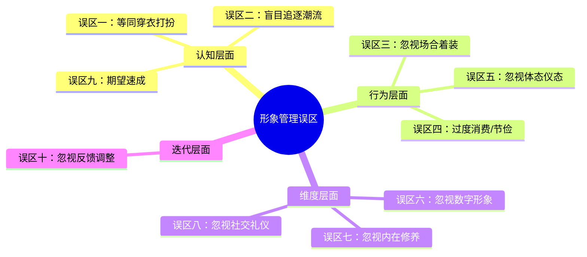

# 常见误区：形象管理中的十个认知与行为陷阱

形象管理是一项需要智慧和耐心的长期工程。在实践中，很多人因为认知偏差或方法不当，走了不少弯路。本节不仅梳理了最常见的十个误区，还为每个误区提供了心理学解释、真实场景还原、对比案例和可操作的纠正工具，帮助你建立正确的形象管理认知框架。

---

## 误区一：形象管理就是穿衣打扮

### 误区表现

将形象管理等同于购买名牌服饰、关注时尚潮流、学习化妆技巧。把大部分时间和金钱花在外在装扮上，却忽视了内在修养的提升。具体表现为：购物清单上全是衣服和配饰，却没有任何学习投资；关注了50个穿搭博主，却没读过一本沟通或心理学的书；每天花30分钟搭配衣服，却不愿花10分钟练习微笑和体态。

### 心理学根源：「可见性偏差」

这种误区的根源在于心理学中的「可见性偏差」（Visibility Bias）——人们倾向于关注那些容易被观察到的事物。衣服、发型、配饰是"看得见"的，而谈吐、气质、情商是"看不见"的。大脑天生偏好处理视觉信息，所以人们会不自觉地将形象管理简化为"视觉管理"。

此外，社交媒体和时尚产业的商业逻辑也在强化这一偏差。品牌和博主靠卖衣服赚钱，他们当然会告诉你"穿对了就赢了"。但现实世界的人际评价远比这复杂。

### 为什么这是误区

形象管理是一个多维度的系统工程，外在穿着只是其中一个组成部分。Albert Mehrabian 在1971年的经典研究中指出，面对面沟通中，语言内容只占信息传递的7%，语调占38%，肢体语言占55%。虽然这个数字的具体比例在后续研究中有所争议，但核心结论没有改变：**非语言信息在人际印象中的权重远超语言和外表**。

一个穿着名牌但谈吐粗俗的人，不会给人留下好印象；一个穿着朴素但气质优雅的人，反而会让人印象深刻。心理学家 Alexander Todorov 在普林斯顿大学的研究进一步证实，人们在100毫秒内就能形成对他人可信度的判断——这个判断主要依据面部表情和体态，而非穿着。

### 正确做法：四维形象模型

将形象管理视为一个四维系统：

| 维度 | 内容 | 影响权重 | 投资方式 |
|------|------|----------|----------|
| 外在形象 | 穿着、发型、配饰、妆容 | ~25% | 购物、搭配学习、个人色彩诊断 |
| 体态气质 | 站姿、坐姿、走姿、表情 | ~30% | 体态训练、形体课、日常练习 |
| 谈吐修养 | 语言表达、知识面、情商 | ~25% | 阅读、演讲训练、社交实践 |
| 行为举止 | 礼仪、习惯、待人接物 | ~20% | 礼仪学习、角色扮演、日常反思 |

### 案例对比

**案例A（只关注外在）**：小王花了3万元置办了一身名牌西装去参加行业峰会，但因为在圆桌讨论中表达混乱、频繁打断他人、不懂得倾听，会后没有人愿意和他交换联系方式。他的投资回报率接近于零。

**案例B（均衡投资）**：小李穿着一件500元的优衣库衬衫参加了同一个峰会。他发言时逻辑清晰、善用数据、懂得倾听和回应他人观点，休息时主动帮邻座倒水。会后有三位参会者主动邀请他加入行业交流群。他的500元投资产生了远超小王3万元的回报。

### 自检工具：形象投资审计表

拿出你过去3个月的消费记录，按以下分类统计：

| 类别 | 金额 | 占比 | 健康范围 |
|------|------|------|----------|
| 服饰/配饰/美妆 | ¥_____ | ___% | 30-40% |
| 体态/健身/形体 | ¥_____ | ___% | 20-25% |
| 学习/阅读/课程 | ¥_____ | ___% | 25-30% |
| 社交/礼仪/体验 | ¥_____ | ___% | 15-20% |

如果服饰占比超过60%，说明你的形象投资严重失衡。

---

## 误区二：盲目追逐潮流

### 误区表现

看到什么流行就穿什么，看到什么风格火就模仿什么风格。衣橱里堆满了各种潮流单品，却没有形成自己的风格。每季都要大量购入新衣物，却总觉得"没有衣服穿"。具体表现为：衣柜里有5条不同年份的"爆款"裤子，但没有一条能和其他衣服搭配；每次出门前要试5套衣服才勉强出门；在社交媒体上看到新风格就心动，三天后又转向另一个风格。

### 心理学根源：「从众效应」与「新奇偏好」

追逐潮流背后有两个心理机制在起作用。第一个是「从众效应」（Bandwagon Effect）——当很多人做同一件事时，个体会不自觉地跟随。时尚媒体和社交平台通过制造"人人都在穿"的氛围来利用这一效应。第二个是「新奇偏好」（Novelty Bias）——人类大脑天然对新奇事物产生多巴胺反应，购买新衣服能带来短暂的愉悦感，但这种愉悦会迅速消退，驱使你购买下一件"新"的。

行为经济学家 Dan Ariely 在《怪诞行为学》中指出，人类的选择往往是"相对的"而非"绝对的"——你不是在判断"这件衣服好不好看"，而是在判断"这件衣服比我现在有的更新潮吗"。这种相对判断会让你永远处于"还差一件"的焦虑中。

### 为什么这是误区

潮流是短暂的，风格是永恒的。盲目追逐潮流会导致三个具体问题：

**第一，品牌形象碎片化**。认知心理学中有一个概念叫「原型效应」（Prototype Effect）——人们通过将事物归入已知类别来理解它。如果你每次出现都是不同的风格，他人无法将你归入任何类别，就会产生认知不适，降低对你的信任度和记忆度。社交心理学研究表明，一个稳定一致的形象比一个频繁变化的形象更容易获得信任。

**第二，经济成本失控**。快时尚品牌的商业逻辑就是让你每季都买新的。一个典型潮流追随者的年均服饰消费在8000-15000元，而一个建立了个人风格的人只需要3000-6000元就能维持同样甚至更好的形象质量。差距来自于经典款的复用率远高于潮流款——一件经典款大衣可以穿5年以上，而一件潮流款可能穿一季就过时。

**第三，决策疲劳**。心理学家 Barry Schwartz 在《选择的悖论》中证明，过多的选择会导致决策疲劳和满意度下降。每天早上在50件衣服中选搭配的人，消耗的认知资源远多于在15件精选衣物中选搭配的人。这种认知消耗会降低你在更重要的事情上的决策质量。

时尚大师可可·香奈儿曾说："时尚易逝，风格永存。"真正有品味的人，不是追逐潮流的人，而是创造风格的人。

### 正确做法：建立个人风格的三步法

**第一步：风格基因诊断**

回答以下问题，找到你的"风格基因"：

1. 你希望别人用哪三个词形容你的形象？（如：专业、干练、可靠）
2. 你最欣赏谁的穿衣风格？为什么？
3. 你穿上什么类型的衣服最有自信？
4. 你的生活场景中，最常见的着装需求是什么？

这三个词就是你的"风格锚点"。以后每次购物前，问自己：这件衣服是否符合我的风格锚点？如果答案是否定的，无论它多流行，都不买。

**第二步：建立胶囊衣橱**

胶囊衣橱（Capsule Wardrobe）的概念由伦敦时尚顾问 Susie Faux 在1970年代提出，核心理念是用少量高品质的基础款单品，通过不同的组合搭配满足所有场合需求。

一个典型的男性胶囊衣橱构成：

| 类别 | 数量 | 具体清单 | 预算占比 |
|------|------|----------|----------|
| 外套 | 3件 | 深色西装外套、休闲夹克、大衣 | 25% |
| 上装 | 8件 | 白衬衫×2、浅蓝衬衫、深色针织衫、POLO衫×2、T恤×2 | 30% |
| 下装 | 5件 | 深色西裤×2、卡其裤、牛仔裤、休闲裤 | 20% |
| 鞋子 | 3双 | 黑色皮鞋、棕色休闲鞋、运动鞋 | 15% |
| 配饰 | 5件 | 皮带×2、手表、围巾、公文包 | 10% |

**第三步：潮流微调策略**

不完全排斥潮流，但用"80/20法则"控制：80%的衣橱是经典款，20%可以是当季潮流款。潮流元素通过配饰（围巾、手表、包袋）来体现，而非核心单品。这样既能保持新鲜感，又不会让形象碎片化。

### 自检工具：风格一致性评估

回顾你过去一周的穿搭照片（或回忆），回答：

- 这些穿搭是否都指向同一个风格关键词？
- 如果把这些照片给一个不认识你的人看，他能描述出你的穿衣风格吗？
- 你的衣橱里是否有"孤儿单品"——和其他衣服都不搭配的潮流单品？

---

## 误区三：忽视场合着装

### 误区表现

在所有场合都穿同样的衣服，不区分正式与休闲、商务与社交、白天与夜晚。或者反过来，过度打扮，在休闲场合穿得过于正式，显得格格不入。具体表现为：穿着运动装去参加客户晚宴，或者穿着三件套西装去朋友的烧烤聚会；在正式演讲时穿得太休闲，显得不够专业；在轻松的团建活动中穿得太正式，显得难以接近。

### 心理学根源：「场景脚本理论」

认知心理学中的「脚本理论」（Script Theory）指出，人类会为每种社会场景预设一套行为和着装"脚本"。当你走进一家高档餐厅，你的大脑会自动调取"高档餐厅脚本"——安静说话、使用正确的餐具、穿着得体。当某人的着装不符合场景脚本时，会触发他人的"认知警报"——一种"这人不太对劲"的感觉。

社会学家 Erving Goffman 在《日常生活中的自我呈现》中提出了"印象管理的戏剧理论"：社交就像演戏，每个场景是一个舞台，着装是你的戏服。穿错戏服不仅影响你的表演，也影响整个场景的和谐。

### 为什么这是误区

着装的核心原则之一是"场合适宜"（Occasion Appropriate）。不同的场合有不同的着装期待，违背这些期待会传递两个负面信号：

**信号一："我不懂规则"**——说明你缺乏社会经验或对这个领域不熟悉，降低他人对你的专业信任度。在商务场合，这可能直接影响合作机会。

**信号二："我不尊重这个场合"**——说明你没有花时间了解这个场合的规范，或者不在乎他人的感受。在社交场合，这会让人产生距离感。

### 着装规范速查表

| 场景 | Dress Code | 男性建议 | 女性建议 | 绝对避免 |
|------|-----------|----------|----------|----------|
| 正式商务会议 | Business Formal | 深色西装+白衬衫+领带+黑色皮鞋 | 套装/连衣裙+高跟鞋+简约首饰 | 牛仔裤、运动鞋、短袖 |
| 日常办公 | Business Casual | 衬衫/针织衫+西裤+皮鞋 | 衬衫/针织衫+西裤/半裙+平底或低跟鞋 | T恤、短裤、拖鞋 |
| 创意行业办公 | Smart Casual | 有设计感的休闲装+干净运动鞋 | 时尚休闲装+平底鞋 | 过于正式的西装套装 |
| 朋友聚餐 | Casual | 干净整洁的休闲装 | 舒适有品味的休闲装 | 睡衣风、过于暴露 |
| 正式晚宴 | Black Tie | 深色西装（最好黑色）+领带 | 晚礼服/优雅连衣裙+高跟鞋 | 休闲装、牛仔裤 |
| 运动健身 | Athletic | 运动服+运动鞋 | 运动服+运动鞋 | 皮鞋、正装 |
| 婚礼（宾客） | Semi-formal | 浅色西装或深色西裤+衬衫 | 连衣裙/套装（避免白色） | 全黑（像参加葬礼）、白色（抢新娘风头） |
| 葬礼 | Formal-dark | 黑色西装+黑色领带 | 黑色连衣裙/套装 | 鲜艳颜色、花哨配饰 |

### 「高半级」原则的实际应用

在不确定的情况下，遵循"比场合要求高半级"的原则。这个原则的逻辑是：穿得略微正式一些通常被理解为"重视这个场合"，而穿得过于休闲则被理解为"不重视"。

具体操作：

- 朋友聚餐要求Casual → 你穿Smart Casual（干净衬衫+卡其裤）→ 被理解为"重视这次聚会"
- 公司团建要求Casual → 你穿Smart Casual → 被理解为"尊重同事"
- 但注意不要"高一级以上"：朋友聚餐穿Business Formal → 被理解为"格格不入"或"炫耀"

### 真实场景还原

**场景：创业者参加投资人晚宴**

着装分析：这是一个非正式社交场合（Smart Casual），但有商务目的。选择：深色修身牛仔裤 + 合身的白色衬衫（袖子可以卷起来）+ 深色乐福鞋 + 简约手表。这个搭配传达的信息是：我重视这次见面（衬衫），但我也有创意和灵活性（卷起的袖子和牛仔裤），我注重细节（合身的剪裁和干净的鞋子）。

**错误做法**：穿全套西装 → 过于正式，让轻松的社交氛围变得紧张；穿运动装 → 过于随意，暗示你不认真对待这次机会。

### 自检工具

- 我能列出自己常出席的5种场合及其着装规范吗？
- 我有没有因为着装不当而感到尴尬的经历？那次穿了什么？应该穿什么？
- 我的衣橱里是否有为每种常见场合准备的"标准搭配"？

---

## 误区四：过度消费或过度节俭

### 误区表现

**过度消费型**：认为形象管理需要大量金钱投入，疯狂购买名牌服饰和高端护肤品，导致经济压力过大。或者认为"贵的就是好的"，不考虑性价比。具体表现为：月薪8000元却每月花5000元在衣服上；信用卡透支购买奢侈品；衣柜里挂满了只穿过一次的名牌衣服。

**过度节俭型**：认为形象管理是"虚荣"的表现，不愿意在外在形象上投入任何资源。穿着破旧、不修边幅，却认为"内在美才重要"。具体表现为：衣服起球、褪色、不合身也不换；用最便宜的洗护产品导致皮肤问题；在重要场合因为着装问题错失机会。

### 心理学根源：「心理账户」与「道德许可」

过度消费的心理学机制是「心理账户」（Mental Accounting）理论——Richard Thaler 指出，人们会为不同的消费目的设立不同的"心理账户"。当一个人将"形象管理"设为一个独立账户时，会不自觉地为这个账户找到消费的理由，导致总支出失控。加上信用卡和分期付款消除了"支付痛感"，消费行为更容易失控。

过度节俭的心理学机制则与「道德许可」（Moral Licensing）有关——当人们认为自己做了"正确的事"（如节俭），就会在其他方面放松标准。"我不在乎外表"被用作一种道德优越感的来源，掩盖了对形象管理的逃避。

### 为什么这是误区

两种极端都不利于形象管理：

- **过度消费**会导致经济压力、资源浪费，而且"用名牌堆砌"的形象往往缺乏真实感。一个满身logo但生活捉襟见肘的人，散发出的不是"高级感"而是"焦虑感"。
- **过度节俭**会错失提升形象的机会，而且"不修边幅"在很多场合会被理解为不尊重。在职场中，着装形象直接影响晋升机会——一项针对500名企业高管的调查显示，64%的高管认为员工的着装影响了他们的晋升决策。

形象管理的投入应该是"理性的"和"适度的"。关键不在于花多少钱，而在于花得是否明智。

### 正确做法：形象管理预算框架

**推荐预算分配**：月收入的5%-10%用于形象管理相关支出。

以月收入10000元为例，月形象管理预算500-1000元的分配建议：

| 支出项 | 月均预算 | 说明 |
|--------|----------|------|
| 服饰 | 300-500元 | 优先基础款，按季度集中购买 |
| 护肤/个人护理 | 100-200元 | 基础清洁+保湿+防晒，不追求品牌 |
| 健身/体态 | 100-200元 | 健身房或线上课程 |
| 学习/阅读 | 50-100元 | 书籍、播客、在线课程 |

**关键购买原则**：

1. **"每次使用成本"思维**：一件800元的高质量大衣穿5年（约200次），每次使用成本4元；一件200元的快时尚大衣穿1季（约30次），每次使用成本6.7元。贵的反而更便宜。
2. **"72小时冷静期"**：对于超过预算20%的非必需购买，等待72小时再决定。冲动购买的欲望通常会在48小时内消退。
3. **"一进一出"规则**：每买一件新衣服，必须淘汰一件旧衣服。这能防止衣橱膨胀和冲动消费。
4. **季节性集中购买**：在换季打折期集中购买基础款，而非平时零散购买潮流款。

### 真实案例

**案例A（过度消费）**：张女士月薪12000元，每月花6000-8000元购买衣服和化妆品。她的衣柜里有200多件衣服，但每天早上仍然觉得"没衣服穿"。信用卡欠款3万元，每月最低还款压力很大。在朋友眼中，她的形象是"看着挺贵，但总觉得用力过猛"。

**案例B（过度节俭）**：李先生是一名优秀的软件工程师，技术能力在团队中排名前列。但他连续3年没有获得晋升，原因之一是他在客户面前的着装经常被客户私下反馈"不太专业"。他穿的都是起球的T恤和褪色的牛仔裤，鞋子也磨损严重。他每年在衣服上的花费不到500元，但因此错失的加薪幅度至少是这个数字的100倍。

**案例C（理性消费）**：王女士月收入15000元，每月形象管理预算1000元。她每季度集中购买一次，只买基础款和经典色。她的衣橱只有40件衣物，但每一件都能和其他3件以上搭配。她的形象给人的感觉是"干净、得体、有品味"，没有人觉得她穿得"贵"，但都觉得她穿得"好"。

### 自检工具

- 我每月的形象管理支出占收入的百分比是多少？（健康范围：5-10%）
- 我的衣橱里有多少件衣服？过去一个月穿过几件？（健康比率：60%以上）
- 我是否有因为形象问题而错失重要机会的经历？

---

## 误区五：忽视体态和仪态

### 误区表现

花大量时间和金钱在穿着打扮上，却忽视了体态和仪态的管理。穿着精致的衣服却含胸驼背，化着精致的妆容却表情僵硬，戴着昂贵的首饰却举止粗鲁。具体表现为：拍出来的照片总是显得没有精神；别人评价你"看着有点没自信"；经常感到肩颈酸痛；走路时拖着脚或弯着腰。

### 心理学根源：「具身认知」

「具身认知」（Embodied Cognition）理论指出，身体状态会直接影响心理状态和社会认知。Amy Cuddy 在哈佛大学的研究发现，保持"高能量姿势"（挺胸抬头、双手叉腰）2分钟，体内的睾酮水平上升20%、皮质醇水平下降25%，这意味着自信增加、压力降低。反过来，含胸驼背的姿势会让大脑接收到"我很弱"的信号，进一步降低自信，形成恶性循环。

社会心理学家 Miles Bernish 的研究表明，人们在判断他人的能力、可信度和社会地位时，体态的影响权重高达35%，超过了穿着（25%）和面部特征（20%）。一个挺拔的人即使穿着普通，也会被认为比一个驼背但穿着昂贵的人更有能力和可信度。

### 为什么这是误区

体态和仪态是形象的"底层操作系统"。再好的衣服穿在含胸驼背的人身上也会失去光彩——因为衣服的设计是基于"标准体态"的，当体态变形时，衣服的版型和线条也会变形。一件剪裁精良的西装，穿在挺拔的人身上是"气场全开"，穿在驼背的人身上就变成了"衣服在穿人"。

更深层的影响在于：体态问题往往不是"意愿问题"而是"身体能力问题"。长期伏案工作导致的前交叉综合征（头前伸、圆肩、驼背、骨盆前倾）不是靠"提醒自己挺胸"就能解决的——需要系统的肌肉训练和筋膜放松才能纠正。

### 常见体态问题自检与纠正

| 体态问题 | 自检方法 | 影响 | 纠正训练 |
|----------|----------|------|----------|
| 头前伸 | 侧面拍照，耳朵是否在肩膀正上方之前 | 显得没精神、脖子显短 | 颈部深层屈肌训练（收下巴练习，每天3组×15次） |
| 圆肩 | 自然站立，手心是否朝后而非朝向大腿外侧 | 显得不自信、胸围显窄 | 胸肌拉伸+菱形肌强化（弹力带面拉，每天3组×15次） |
| 驼背 | 背靠墙站立，后脑勺和臀部能否同时贴墙 | 显得老态、缺乏气场 | 胸椎灵活性训练+背部肌群强化 |
| 骨盆前倾 | 侧面拍照，腰部是否有过度弯曲 | 腹部前凸、臀部后翘的假象 | 臀桥+髂腰肌拉伸（每天3组×15次） |
| X/O型腿 | 自然站立，双脚并拢时膝盖能否并拢 | 影响走路姿态和裤子版型 | 臀中肌训练+足弓训练 |

### 仪态训练：21天速成计划

仪态训练不需要专门的课程，可以在日常生活中融入：

**第1周：觉察阶段**
- 每天设定3个"仪态检查点"（如：到公司坐下时、午饭后站起来时、晚上到家时）
- 在检查点用30秒评估自己的站姿/坐姿/走姿
- 对着镜子或手机录视频检查

**第2周：纠正阶段**
- 继续第1周的检查点习惯
- 每天做10分钟体态纠正训练（选择上述表格中对应你问题的训练）
- 练习"墙面站立"：每天靠墙站立3分钟（后脑勺、肩胛骨、臀部、脚跟四点贴墙）

**第3周：内化阶段**
- 将仪态检查从3次增加到5次
- 开始关注社交中的表情管理：练习"眼周微笑"（用眼睛笑，而非只用嘴）
- 录一段1分钟的自我介绍视频，对比第1周的视频，观察变化

### 真实案例

刘女士是一名产品经理，能力很强但连续几次竞聘管理岗位都失败了。她的上级私下反馈："你各方面都很优秀，但在重要会议上，你的体态让人觉得你不够自信。"刘女士开始每天做15分钟体态训练，两个月后再次参加竞聘时，评委的反馈完全不同了——"气场明显提升了"。体态没有改变她的能力，但改变了别人对她能力的感知。

### 自检工具

- 靠墙站立：后脑勺、肩胛骨、臀部、脚跟四点能否同时贴墙？（不能 = 体态问题）
- 侧面拍照：耳朵在肩膀正上方吗？（不在 = 头前伸）
- 手心朝向测试：自然站立时手心是否朝后？（是 = 圆肩）

---

## 误区六：忽视数字形象

### 误区表现

只关注线下的形象管理，完全忽视线上的数字形象。社交媒体头像随意设置，发帖内容杂乱无章，线上线下的形象严重不一致。具体表现为：微信头像是模糊的风景照或动漫人物；朋友圈要么不发，要么发的内容杂乱无章（今天秀美食，明天转鸡汤，后天发抱怨）；LinkedIn资料多年未更新；在公开平台用粗鲁的语言与人争论。

### 为什么这是误区

在数字化时代，很多人对你的第一印象来自线上。你的社交媒体形象可能是客户、合作伙伴、潜在雇主了解你的第一个窗口。如果线上形象与线下形象不一致，会让人感到困惑甚至不信任。

根据CareerBuilder 2023年的调查，71%的雇主会在招聘决策中查看候选人的社交媒体资料，其中54%的雇主因为社交媒体内容而否决了候选人。在中国，微信已经成为商务社交的主要平台——你的朋友圈、微信头像、个性签名构成了你在商务社交中的"数字名片"。

更隐蔽的问题在于：数字内容是可搜索、可截图、可永久保存的。一条冲动发的抱怨帖可能在两年后被你的合作伙伴搜到；一张不得体的照片可能在你不知情的情况下被转发。线下的失态会被遗忘，线上的失态会被存档。

### 正确做法：数字形象管理四步法

**第一步：数字形象审计**

在搜索引擎中搜索自己的名字，查看搜索结果的前3页。这些就是别人了解你时最先看到的信息。逐一检查：

| 检查项 | 健康标准 | 不健康的信号 |
|--------|----------|------------|
| 搜索结果第一页 | 专业相关的内容为主 | 负面信息、不得体的照片 |
| 社交媒体头像 | 清晰、得体、可辨认 | 风景、动漫、模糊照片、团体照 |
| 朋友圈/微博内容 | 有价值的内容>抱怨/转发 | 频繁抱怨、情绪化发言、过度晒 |
| 专业平台资料 | 完整、最新、有亮点 | 资料空白、多年未更新 |
| 评论/互动记录 | 理性、有建设性 | 攻击性、低俗、情绪化 |

**第二步：统一形象锚点**

确定你希望在数字世界呈现的3个关键词（如：专业、有深度、温暖），然后让所有平台的内容都指向这些关键词。头像风格、发帖内容、互动方式都应该与这些关键词一致。

**第三步：内容策略**

采用"70-20-10"内容策略：
- 70%的专业/行业相关内容（体现你的专业能力）
- 20%的个人生活/兴趣内容（体现你的个性和温度）
- 10%的转发/互动内容（体现你的社交参与度）

**第四步：定期维护**

- 每月做一次"数字形象快速检查"：浏览自己的最近发布内容，评估是否符合形象锚点
- 每季度做一次"深度审计"：搜索自己的名字，检查是否有新的负面信息
- 每年更新一次专业平台的资料和照片

### 分平台管理建议

| 平台 | 形象定位 | 头像要求 | 内容策略 | 注意事项 |
|------|----------|----------|----------|----------|
| 微信 | 商务社交+私人社交 | 清晰的个人照或专业形象照 | 朋友圈保持更新频率稳定，避免刷屏 | 注意微信步数、位置等隐私暴露 |
| LinkedIn/脉脉 | 专业形象 | 正式的职业照 | 行业观点、专业成就、学习心得 | 保持资料最新，定期更新技能 |
| 抖音/小红书 | 个人IP/专业展示 | 与平台调性一致 | 垂直领域内容为主 | 注意评论区的互动方式 |
| 微博 | 公众形象 | 清晰辨识度高的照片 | 行业观点为主，减少情绪化内容 | 不要在公开平台与人争论 |

### 真实案例

一位自由设计师在参加一个大型项目竞标时，客户在最终决策前搜索了他的名字。搜索结果中第三条是他两年前在微博上用粗鲁语言攻击同行的帖子。客户因此选择了另一位设计师——不是因为能力差距，而是因为"不确定这样的人是否适合团队合作"。一条两年前的冲动发言，让他损失了一个价值20万的项目。

### 自检工具

- 搜索自己的名字，看看搜索结果是否是你希望别人看到的？
- 你的社交媒体头像是否清晰、得体、可辨认？
- 你最近3个月发布的内容是否传递了一致的个人品牌信息？
- 你是否有在公开平台发布过可能损害形象的内容？

---

## 误区七：忽视内在修养

### 误区表现

在外在形象上投入大量时间和精力，却忽视了内在修养的提升。谈吐粗俗、知识面狭窄、缺乏同理心，外在形象与内在品质严重脱节。具体表现为：穿着精致但在聊天时只能聊八卦和消费；遇到不同观点就激动反驳，无法理性讨论；对服务人员态度傲慢；在正式场合说错话而不自知。

### 心理学根源：「光环效应」与「反转」

心理学中的「光环效应」（Halo Effect）指出，人们倾向于将一个人的某个正面特征泛化到其他方面——长得好看的人会被认为更聪明、更善良。很多人利用这一效应，只投资外在形象来"购买"光环。

但光环效应有一个致命的"反转"——当某人的负面特征暴露时，之前的正面印象会被迅速推翻，甚至产生"反光环效应"（Horn Effect），即一个负面特征让人觉得这个人处处不行。这就是为什么一个穿着精致但谈吐粗俗的人，最终的印象会比一个穿着朴素但谈吐得体的人差得多——前者制造了期望，然后打破了期望，后者没有制造期望，但超越了期望。

### 为什么这是误区

形象管理的最高境界是"内外兼修"。一个人如果只有外在形象而没有内在品质，就像一个精美的包装盒里面是空的——短暂的惊艳之后是深深的失望。

在长期关系中，内在品质的权重会持续上升。社会心理学家的研究表明，在初始接触中，外在形象的影响权重约为60%，但在交往3个月后，这个权重会下降到20%，而内在品质（可信度、同理心、知识面、幽默感）的权重则上升到80%。这意味着：**外在形象决定第一印象，内在品质决定长期关系**。

更关键的是，内在修养的缺失会在关键时刻暴露——重要会议上的不当发言、客户晚宴上的知识盲区、团队冲突中的情绪失控——这些时刻的代价远高于任何外在形象的投资回报。

### 正确做法：内在修养的四个维度

**维度一：知识面拓展**

- 建立"每天30分钟"的阅读习惯，覆盖专业领域+通识领域
- 专业领域：保持对行业前沿的了解
- 通识领域：历史、心理学、经济学、哲学——这些是社交场合的"通用货币"
- 推荐入门书单：《思考，快与慢》（心理学）、《人类简史》（通识）、《非暴力沟通》（沟通）、《原则》（决策）

**维度二：表达能力训练**

- 每天练习"电梯演讲"：用30秒清晰表达一个观点
- 学习结构化表达框架：PREP法则（Point观点→Reason理由→Example例子→Point重申观点）
- 录制自己的发言，回听检查：是否有口头禅？逻辑是否清晰？语速是否合适？

**维度三：情商培养**

- 每天练习"情绪标注"：在感到情绪变化时，准确识别并命名它（"我现在感到的是焦虑，不是愤怒"）
- 学习"换位思考三问"：对方现在在想什么？对方的感受是什么？如果我是对方，我希望被怎样对待？
- 阅读推荐：Daniel Goleman《情商》、Marshall Rosenberg《非暴力沟通》

**维度四：审美素养**

- 定期参观美术馆、博物馆，培养视觉审美
- 学习基本的设计原则（色彩、比例、节奏），这不仅适用于穿着，也适用于生活的方方面面
- 关注建筑、室内设计、摄影——这些都能潜移默化地提升审美品味

### 自检工具

- 我上一次完整读完一本书是什么时候？
- 我能用30秒清晰地向陌生人解释我的工作吗？
- 我在上次和别人意见不一致时，是如何处理的？
- 我是否有持续学习和自我提升的习惯？

---

## 误区八：忽视社交礼仪

### 误区表现

在社交场合中不懂礼仪规范，如不知道如何握手、不知道如何介绍他人、不知道餐桌礼仪等。或者知道礼仪规则但不以为然，认为这些是"虚伪的形式主义"。具体表现为：握手时软弱无力或过于用力；介绍他人时不知道先介绍谁；在餐桌上发出不雅声音或用筷子指人；收到名片直接塞进口袋不看。

### 心理学根源：「仪式感」与「信任建立」

社交礼仪不是虚伪的形式主义，而是人类社会在数千年进化中形成的"信任建立机制"。进化心理学家认为，礼仪是一种"成本信号"（Costly Signal）——愿意花时间和精力遵守礼仪的人，传递的信号是"我重视这段关系，愿意为之付出"。

神经科学研究进一步发现，当一个人感受到被尊重时（如对方认真倾听、使用敬语、遵守共同的社交规范），大脑中的"信任网络"（涉及腹侧纹状体和前额叶皮层）会被激活，释放催产素，增加信任感和亲近感。这就是为什么礼仪能"润滑"人际关系——它在神经层面创造了信任的化学基础。

### 为什么这是误区

社交礼仪是表达尊重和建立信任的工具。当你说"请"和"谢谢"时，你表达的是对他人劳动的尊重；当你遵守餐桌礼仪时，你表达的是对同桌人的尊重。不懂礼仪会让人觉得你缺乏教养或不尊重他人——即使这并非你的本意。

在商务场合，礼仪问题的影响更加直接。一项针对中国商务人士的调查显示，78%的受访者表示曾在商务餐中因为对方的餐桌礼仪问题而降低了合作意愿；62%的受访者表示名片礼仪是判断合作伙伴专业度的重要指标。

### 核心社交礼仪速查

**握手礼仪**：
- 标准握手：伸出右手，虎口对虎口，力度适中（不是捏面团，也不是死鱼），持续2-3秒
- 顺序：长辈/上级/女士先伸手，再握手。对方不伸手，不要主动伸手
- 眼神：握手时看着对方的眼睛，微笑
- 避免：湿手握手、戴手套握手（社交场合）、边握手边看手机

**介绍礼仪**：
- 顺序原则：将"地位较低"的人介绍给"地位较高"的人
- 具体顺序：先介绍年轻人给年长者；先介绍下级给上级；先介绍男士给女士；先介绍本单位的人给外单位的人
- 介绍内容：姓名+身份/职务+一句亮点（"这是张总，我们公司技术负责人，去年带领团队完成了XX项目"）

**名片礼仪**：
- 递出：双手递出，文字朝向对方，同时说"这是我的名片，请多指教"
- 接收：双手接过，认真看3-5秒（读出对方姓名和职务表示重视），然后妥善放在名片夹或面前的桌上
- 避免：直接塞进口袋、在名片上写字（除非对方同意）、接过就放桌上不看

**餐桌礼仪（中式）**：
- 座位：面对门口的位置为主位，通常留给最尊贵的客人或长辈
- 点菜：先询问客人的忌口和偏好，荤素搭配，不点自己不确定的菜
- 用筷子：不指人、不插在饭上（像祭祀）、不翻菜、不在盘中挑拣
- 敬酒：双手举杯，杯沿低于对方杯沿（对上级/长辈），敬酒词简洁真诚
- 离席：等主宾或主人示意后再离席

**电梯/乘车礼仪**：
- 电梯：先进后出（为他人按住开门键），为客人/长辈按楼层
- 乘车：后排右侧为尊位（商务场合），让客人/长辈先上后下
- 开门：为后面的人扶住门，特别是当对方双手拿东西时

### 自检工具

- 我能正确地为两位不相识的人做介绍吗？顺序是什么？
- 我收到名片时的第一反应是什么？是认真看还是直接放起来？
- 我最近一次商务餐中，有没有不确定该如何做的场景？
- 我是否了解不同文化背景下的礼仪差异？

---

## 误区九：期望速成

### 误区表现

希望在短时间内实现形象的"质变"。参加一个周末培训就想成为社交达人，买几本形象管理的书就想脱胎换骨。一旦没有看到立竿见影的效果，就认为形象管理"没用"而放弃。具体表现为：买了很多课但只看了前两节；按照网上教程改造了衣橱但一周后恢复原样；做了两天体态训练觉得没效果就放弃；频繁更换风格方向，每种都浅尝辄止。

### 心理学根源：「即时满足偏好」与「规划谬误」

行为经济学中的「双曲贴现」（Hyperbolic Discounting）理论指出，人类天生偏好即时的小回报而非延迟的大回报。这就是为什么人们宁愿花2小时刷短视频获得即时的多巴胺，也不愿意花2小时阅读一本能提升认知的书——后者的价值更大，但回报是延迟的。

此外，「规划谬误」（Planning Fallacy）让人系统性地低估完成任务所需的时间和努力。心理学家 Kahneman 的研究表明，人们在估计自己完成一个目标所需的时间时，平均会低估50%-100%。这就是为什么很多人认为"一个月就能改变形象"——他们不是不努力，而是对时间线的预期完全错误。

### 为什么这是误区

形象管理是一项需要长期投入的能力，不可能一蹴而就。各维度的变化时间线如下：

| 维度 | 可感知变化时间 | 持续改善周期 | 关键瓶颈 |
|------|--------------|------------|----------|
| 穿着打扮 | 1-2周 | 3-6个月形成稳定风格 | 找到适合自己的风格需要试错 |
| 体态矫正 | 2-4周 | 3-12个月 | 肌肉记忆的重建需要重复训练 |
| 气质培养 | 3-6个月 | 数年持续积累 | 需要知识和阅历的双重积累 |
| 谈吐提升 | 1-3个月 | 持续终身 | 需要大量实践和反馈循环 |
| 社交礼仪 | 1-2周（知道规则） | 3-6个月（内化为习惯） | 从"刻意"到"自然"需要重复 |

期望速成只会让你在面对现实时感到挫败和失望，最终放弃——而放弃是形象管理最大的敌人。

### 正确做法：建立「渐进式改善」系统

**第一阶段：认知建立期（第1-2周）**

- 目标：了解形象管理的基本框架，找到自己的起点
- 行动：完成本章所有自检工具的评估，明确自己的优势和短板
- 预期：不会有外在变化，但建立了"地图"

**第二阶段：快速见效期（第3-8周）**

- 目标：在1-2个最容易改善的维度上取得可见成果
- 行动：选择投入产出比最高的改善点（通常是穿着和数字形象），集中投入
- 预期：外部反馈开始出现正面变化（如"你最近变好看了"）
- 关键：不要同时改善所有维度，聚焦1-2个

**第三阶段：习惯养成期（第2-4个月）**

- 目标：将改善点固化为日常习惯
- 行动：建立每日/每周的形象管理例行事项
- 预期：改善不再是"额外的负担"，而是"日常的一部分"
- 关键：习惯养成平均需要66天（伦敦大学学院研究），不要在第30天就放弃

**第四阶段：深度提升期（第4-12个月）**

- 目标：在更多维度上实现改善，开始向"内化"过渡
- 行动：开始投入体态训练、谈吐提升、社交礼仪等需要更长时间的维度
- 预期：形象改善从"刻意为之"变成"自然而然"

**第五阶段：维护优化期（12个月以后）**

- 目标：维持已建立的形象标准，持续微调和优化
- 行动：定期反馈收集、季节性调整、新维度探索
- 预期：形象管理成为一种生活方式，不再需要额外的意志力

### 自检工具

- 我对形象管理的时间预期是什么？（如果是"一个月见效"，需要调整到6-12个月）
- 我是否曾因为"没效果"而放弃过形象管理的某个方面？
- 我能否接受"每天进步一点点，三个月后回头看变化很大"的节奏？

---

## 误区十：忽视反馈和调整

### 误区表现

按照自己的理解进行形象管理，从不寻求外部反馈，也不根据反馈进行调整。或者得到了反馈但不以为然，坚持自己的做法。具体表现为：只照镜子自我评价，从不问别人的真实感受；朋友善意提醒"这件衣服不太适合你"时，反驳"你不懂时尚"；工作多年从未收到过关于形象的反馈，也不主动寻求；觉得自己"已经很好了"，停止了改善。

### 心理学根源：「自我服务偏差」与「确认偏误」

心理学中的「自我服务偏差」（Self-Serving Bias）让人倾向于高估自己的正面特征、低估自己的负面特征。照镜子时，你看到的是你想看到的自己，而不是别人看到的你。一项有趣的研究发现，人们在镜子中看到的自己的吸引力，比别人看到的平均高出20-30%。

「确认偏误」（Confirmation Bias）进一步强化了这一问题——人们倾向于寻找和接受支持自己已有信念的信息，忽略或拒绝与之矛盾的信息。如果你认为自己"穿衣服挺好看的"，你就会格外注意那些夸你穿着的评论，而自动过滤掉那些"不太适合你"的反馈。

### 为什么这是误区

形象管理的效果最终是由他人来评判的。你认为自己"穿得很好看"，但他人可能觉得"不太适合你"；你认为自己"说话很幽默"，但他人可能觉得"有点冒犯"。忽视外部反馈，就无法了解自己的形象在他人心中的真实效果。

更深层的问题在于：没有反馈的改善是盲目的。你可能花了很多时间和精力在某个方面，但实际上这个方面根本不是你的短板。或者你在某个方面已经很好了，却还在投入过多资源。反馈系统是形象管理的"导航仪"——没有导航仪，你可能一直在努力，但方向是错的。

### 正确做法：建立「反馈-调整-验证」循环

**第一步：构建反馈网络**

你需要3类反馈来源：

| 反馈类型 | 来源 | 特点 | 获取频率 |
|----------|------|------|----------|
| 亲密反馈 | 伴侣、密友、家人 | 最诚实，但可能有偏见 | 随时 |
| 专业反馈 | 形象顾问、教练、HR朋友 | 最客观，但需要付费或特殊关系 | 每季度 |
| 日常反馈 | 同事、客户、社交圈 | 最真实，但通常不会直接说 | 持续观察 |

**第二步：学会正确地寻求反馈**

大多数人不给反馈，不是因为没有看法，而是因为觉得说出来会冒犯你。你需要主动、具体地寻求反馈：

- **错误问法**："你觉得我形象怎么样？"（太笼统，通常得到"挺好的"这种无用回答）
- **正确问法**："如果要让我的形象提升20%，你觉得我最应该改变什么？"（具体的、可操作的）
- **更具体的问法**："你觉得我今天的穿着适合今天的场合吗？哪里可以改进？"

**第三步：正确处理反馈**

收到反馈时，遵循"三步法"：

1. **感谢**："谢谢你告诉我这些，我真的很想知道。"——无论反馈是否让你舒服
2. **确认**："你是说我的[具体方面]需要改进，对吗？"——确保你理解正确
3. **行动**：将反馈转化为具体的行动项，设定改进时间线

**特别提醒**：对于不舒服的反馈，给自己24小时的"消化期"。很多最有价值的反馈在第一次听到时会让人不舒服——这是因为它们触碰了你不愿面对的真相。24小时后，当情绪消退，你才能客观地评估这个反馈是否有价值。

**第四步：验证改进效果**

改进后，向同一反馈源再次寻求反馈，确认改进是否有效。这个"闭环"确保你的改善方向是正确的。

### 反馈记录模板

| 日期 | 反馈来源 | 反馈内容 | 我的感受 | 行动计划 | 执行情况 | 再次反馈 |
|------|----------|----------|----------|----------|----------|----------|
| __/__ | ______ | ______ | ______ | ______ | ______ | ______ |

### 真实案例

一位销售经理在季度绩效评估中收到上级的反馈："你的专业能力很强，但客户反馈说你在商务餐中的表现让他们不太舒服。"他一开始很抗拒——"吃饭有什么好不好的？"但冷静后他主动请一位做礼仪培训的朋友观察了一次他的商务餐表现。朋友指出他在餐桌上边嚼东西边说话、用自己的筷子在公共菜里翻找、敬酒时杯沿高于客户。他花了两周时间专门学习餐桌礼仪，两个月后客户反馈显著改善。如果没有那次"不舒服的反馈"，他可能至今都不知道自己错在哪里。

### 自检工具

- 我有没有定期寻求外部反馈的习惯？（至少每季度一次）
- 我上一次收到关于形象的建设性反馈是什么时候？我做了什么改变？
- 我有没有因为"不舒服"而拒绝过有价值的反馈？
- 我是否有意识地在"反馈-调整-验证"循环中工作？

---

## 误区总结与行动指南

### 十大误区快速对照表

| 编号 | 误区名称 | 核心问题 | 最常见后果 | 纠正关键 |
|------|----------|----------|------------|----------|
| 1 | 等同穿衣打扮 | 只关注外在，忽视内在 | 投入70%资源只优化30%的形象 | 四维均衡投资 |
| 2 | 盲目追逐潮流 | 没有个人风格 | 形象碎片化，经济浪费 | 建立胶囊衣橱 |
| 3 | 忽视场合着装 | 不分场合穿同样的衣服 | 传递"不懂规则"信号 | 高半级原则 |
| 4 | 过度消费/节俭 | 投入不合理 | 经济压力或错失机会 | 预算框架+冷静期 |
| 5 | 忽视体态仪态 | 底层操作系统缺失 | 衣服穿不出效果 | 每日体态训练 |
| 6 | 忽视数字形象 | 线上线下不一致 | 数字世界留下负面印象 | 四步管理法 |
| 7 | 忽视内在修养 | 内外脱节 | 长期关系中暴露短板 | 四个维度持续投入 |
| 8 | 忽视社交礼仪 | 缺乏尊重表达 | 冒犯他人而不自知 | 核心礼仪速查 |
| 9 | 期望速成 | 急于求成 | 挫败感导致放弃 | 五阶段渐进系统 |
| 10 | 忽视反馈调整 | 闭门造车 | 改善方向偏离 | 反馈循环 |

### 综合自检清单

对每个误区进行1-5分的自我评估（1分=完全符合误区描述，5分=完全没有这个问题）：

| 误区编号 | 误区名称 | 自我评估（1-5分） | 优先级 |
|----------|----------|-------------------|--------|
| 1 | 等同穿衣打扮 | ___ | 1-2分→立即改善 |
| 2 | 盲目追逐潮流 | ___ | 1-2分→立即改善 |
| 3 | 忽视场合着装 | ___ | 1-2分→立即改善 |
| 4 | 过度消费/节俭 | ___ | 1-2分→立即改善 |
| 5 | 忽视体态仪态 | ___ | 1-2分→立即改善 |
| 6 | 忽视数字形象 | ___ | 1-2分→立即改善 |
| 7 | 忽视内在修养 | ___ | 1-2分→立即改善 |
| 8 | 忽视社交礼仪 | ___ | 1-2分→立即改善 |
| 9 | 期望速成 | ___ | 1-2分→立即改善 |
| 10 | 忽视反馈调整 | ___ | 1-2分→立即改善 |

### 使用方法

1. 诚实评估：对自己诚实，不要美化。如果不确定某个评分，问一个信任的人
2. 聚焦重点：选择得分最低的1-2个误区作为优先改善对象
3. 制定计划：参考该误区的"正确做法"部分，制定具体的改善计划
4. 月度复盘：每月重新评估一次，跟踪改善进度
5. 持续迭代：形象管理是一个终身工程，不存在"完成"的那一天

> 形象管理不是一场冲刺，而是一场马拉松。不要试图在一天内改变一切，而是每天改变一点点。一年后回头看，你会惊讶于自己的变化。

***

*下一节：[本章小结](06-本章小结.md)*
