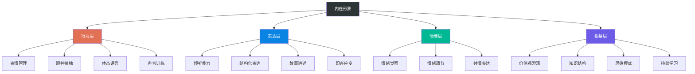

## 第二节 内在形象管理

外在形象管理解决的是"别人看到你"的问题，内在形象管理解决的是"别人感受到你"的问题。一个人可以穿一身定制西装走进会议室，但如果开口说话逻辑混乱、眼神闪躲、声音发抖，那身西装反而会放大他内在的不匹配感。

内在形象由四个层面构成，从外到内依次是：**行为层**（表情、眼神、体态、声音）、**表达层**（谈吐、逻辑、故事力）、**情绪层**（情绪觉察、调节、表达）、**根基层**（价值观、知识结构、思维模式）。这四层的关系是：根基层决定情绪层的稳定性，情绪层决定表达层的自然度，表达层决定行为层的感染力。

### 一、行为层：表情、眼神、体态与声音

行为层是内在状态最直接的外化渠道。别人在跟你交流时，最先接收到的不是你说了什么，而是你的脸在做什么、眼睛看哪里、身体怎么站、声音听起来怎么样。梅拉比安的"7-38-55法则"中，语调占38%、肢体语言占55%——这两项加起来就是行为层的全部。

#### 1. 表情管理

表情是人际交往中最强大的无声语言。加州大学洛杉矶分校的心理学教授阿尔伯特·梅拉比安的研究证实，面部表情传递的情感信息量远超语言本身。一个面无表情的人，即使说出再热情的话，对方也会本能地感到疏离。

**基础练习：镜前表情训练**

每天花5分钟对着镜子做以下练习，持续两周就能看到明显变化：

1. **微笑校准**：自然微笑时嘴角上扬、颧骨隆起、眼角出现鱼尾纹（杜兴微笑）。练习找到自己"最自然的微笑角度"——不是露齿笑，也不是嘴角微翘，而是介于两者之间、让你看起来友善但不讨好的那个位置。
2. **表情切换**：练习在"中性→微笑→认真→思考"四种基本表情之间自然切换。社交场合中，你的表情需要跟随对话内容变化——对方讲到困难时你的表情应该收敛，对方讲到成就时你的表情应该舒展。
3. **去僵化训练**：很多人在紧张时会不自觉地"冻结"面部肌肉。练习方法是：在打电话时有意识地做夸张的表情（皱眉、挑眉、微笑），因为对方看不到你但能"听到"你的表情——面部肌肉的运动会改变你的语调和气息。

**高频社交场景的表情管理**：

| 场景 | 表情要点 | 常见错误 |
|------|----------|----------|
| 初次见面 | 微笑+眼神接触+微微前倾 | 假笑（只动嘴不动眼）、面无表情 |
| 听对方讲话 | 适度点头+表情跟随内容变化 | 全程同一个表情、频繁看手机 |
| 被介绍给陌生人 | 开放表情+好奇的目光 | 防御性表情（皱眉、抿嘴） |
| 谈判/严肃场合 | 沉稳、专注、不轻易暴露情绪 | 紧绷到面无表情，或频繁假笑缓解紧张 |
| 社交聚会 | 放松、热情、有感染力 | 社交疲劳导致表情疲惫或冷淡 |

#### 2. 眼神接触

眼神接触是信任建立的最快路径。在绝大多数文化中，适度的眼神接触传递的是自信、真诚和关注。但"适度"是关键词——过多的凝视会让人感到压迫，过少的对视会让人觉得你心不在焉或不够自信。

**眼神接触的"三角区"法则**：

把对方的脸想象成一个倒三角——两眼为底边两个顶点，嘴部为下方顶点。你的目光在这个三角区域内自然移动，而不是死盯对方的某一个点。

- **社交场合**：目光在三角区内移动，每3-5秒自然移开一次，看向对方的耳朵或肩膀方向，再自然回来。
- **商务场合**：目光可以稍微固定在对方的眼睛和眉心之间，传递更多的专注和认真。
- **亲密场合**：目光可以从三角区扩展到全脸，停留时间可以更长。

**眼神接触的时长控制**：

根据斯坦福大学的一项研究，在正常对话中，眼神接触占对话时长的60%-70%是最舒适的。低于40%会显得回避，高于80%会显得具有攻击性。一个实用的技巧是"三角对视法"：说的时候看对方眼睛，说到句末时自然移开，停顿思考时看向自己的手或笔记本，然后重新对视开始下一句。

**日常训练方法**：

- 在日常买咖啡、取快递等低风险场景中，有意识地和对方做眼神接触并微笑。每次只需要1-2秒，但这个练习能帮你建立"对视不尴尬"的舒适感。
- 在会议中练习"轮流对视"——发言时看向不同的听众，每人停留3-5秒，像在跟每个人单独对话。
- 录一段自己和朋友对话的视频，回看时统计自己眼神接触的频率和时长，找到自己的舒适区。

#### 3. 体态语言

体态是无声的自我介绍。你的站姿、坐姿、走姿、手势，在你开口之前就已经替你"说"了很多话。社会心理学家艾米·卡迪（Amy Cuddy）在TED演讲中提到的"权力姿势"研究表明，身体姿态不仅影响他人对你的判断，还直接影响你自身的激素水平和心理状态。

**站姿基础**：

标准的自信站姿可以用"一条线、两个点、三个角度"来概括：

- **一条线**：从耳垂到肩膀到髋关节到脚踝，尽量在一条直线上。可以背靠墙练习——后脑勺、肩胛骨、臀部、小腿肚、脚后跟五点贴墙。
- **两个点**：双脚与肩同宽，重心均匀分布在两只脚上（不是前倾或后仰）。
- **三个角度**：膝盖微屈（不要锁死）、手肘自然弯曲约120度、下巴微微收起（不要扬头也不要低头）。

**坐姿要点**：

在社交和商务场景中，坐姿传递的信号比站姿更多：

- **开放坐姿**：身体微微前倾、双臂不交叉、手掌自然放在桌上或膝盖上——传递"我对你感兴趣"的信号。
- **权威坐姿**：背部完全靠在椅背上、双手放在扶手上或指尖相对——传递"我很有把握"的信号。
- **避免的坐姿**：翘二郎腿抖腿（焦虑）、身体后仰双臂交叉（防御）、缩肩低头（缺乏自信）。

**手势使用原则**：

手势是表达的放大器，但用错了就成了干扰器。

- **有效手势的范围**：腰部以上、肩膀以下、身体两侧各30度以内。这个范围内被称为"黄金手势区"，在这个区域内的手势看起来自然且有说服力。
- **描述性手势**：说到数字时用手指比划，说到"增长"时手向上移动，说到"对比"时两手分别代表两边。
- **安抚性手势要克制**：摸鼻子、搓手、摸脖子、玩头发——这些都是焦虑信号，会削弱你的可信度。意识到之后，练习用"暂停"替代——焦虑时双手平放在桌面上，比任何安抚性手势都好。

**走姿训练**：

走路是移动中的体态展示。训练要点：

1. 目视前方，不是低头看路（在安全的环境中练习）
2. 步幅适中——太小显得拘谨，太大会失去控制感
3. 肩膀打开但不僵硬，手臂自然摆动
4. 速度适中——走得太快传递焦虑感，太慢传递缺乏目标感
5. 练习方法：在走廊里走路时想象头顶有一根线向上拉着你，这个意象会自然调整你的整体体态

#### 4. 声音训练

你的声音是别人"感受到"你的重要渠道。很多人花了大量时间在外表上，却完全忽略了声音。但研究表明，声音质量对"可信度"和"领导力"的判断影响巨大——麻省理工学院的一项实验发现，仅凭声音片段（不含语言内容），听众就能以72%的准确率判断一个人是否是企业高管。

**声音的四个维度**：

| 维度 | 问题表现 | 训练目标 |
|------|----------|----------|
| 音量 | 声音太小显得怯懦，太大显得粗鲁 | 根据场景自动调节，3米外能听清但不刺耳 |
| 语速 | 太快显得焦虑，太慢显得迟钝 | 正常对话150-170字/分钟，重点内容降到120字/分钟 |
| 音调 | 单一音调让人昏昏欲睡，过高显得不专业 | 说话时有自然的音调起伏，关键词适当降低音调 |
| 清晰度 | 含糊不清让人费力去听，过度清晰显得刻板 | 每个字的声母韵母完整发出，但不咬牙切齿 |

**呼吸支撑训练**：

声音的根基是呼吸。大多数人的说话问题（声音小、气息短、声音抖）都源于呼吸方式不正确。

1. **腹式呼吸基础**：仰卧，一只手放在胸口，一只手放在腹部。吸气时腹部的手上升、胸口的手不动。呼气时腹部的手下降。每天练习5分钟，直到腹式呼吸成为默认模式。
2. **气息延长训练**：深吸一口气，用"嘶——"的声音均匀呼出，目标是持续25-30秒。每天练习10次，逐步延长。
3. **声音投射训练**：想象你的声音要穿过房间到达对面墙上，而不是从嘴里"掉"到地上。练习时手放在胸口感受振动——好的声音应该在胸腔有共振感。

**日常声音练习方案**（每天10分钟）：

1. **唇舌操**（2分钟）：快速说"噼里啪啦""嘀嘀嗒嗒""叽叽喳喳"各10遍，激活口腔肌肉。
2. **绕口令**（3分钟）：选择1-2个绕口令，从慢速到快速逐步练习。推荐"四是四，十是十，十四是十四，四十是四十"。
3. **朗读练习**（5分钟）：选一段文字（新闻、散文、演讲稿均可），大声朗读，注意音量、语速、音调的变化。录音回听，对比自己在不同情绪状态下的声音差异。

**声音的进阶技巧**：

- **停顿的力量**：在关键观点前后各停顿1-2秒，比任何语气词都有效。停顿不是卡壳，是有意识的留白——它让听众有时间消化你的话，也让你显得更从容。
- **降低音调**：在需要传递权威感时，有意识地降低半音调说话。研究表明，低音调与领导力和可信度正相关。
- **语速变化**：在讲述事实和数据时加快语速，在表达观点和情感时放慢语速。这种变化本身就是一种"声音强调"。

### 二、表达层：谈吐修养提升

谈吐是内在形象中最容易被直接感知的部分。你可能花了一年时间练体态，但别人注意到的往往是你开口说的第一句话。谈吐修养不是"会说话"，而是能让对方在跟你对话后觉得"这个人有东西"。

#### 1. 倾听能力训练

大多数人把"沟通能力"等同于"表达能力"，这是一个根本性的误解。真正高效的沟通者，首先是一个优秀的倾听者。为什么？因为倾听决定了你回应的质量——你没有听懂对方的真正需求，再精妙的回应也是答非所问。

**3F倾听法**：

在每次重要对话中，有意识地运用3F倾听框架：

**Fact（事实）**：对方说了什么事实？区分事实和观点是倾听的第一步，也是最难的一步。"这个项目延期了两周"是事实，"这个项目管理很混乱"是观点。练习方法：在对话结束后，尝试用一句话概括对方陈述的核心事实，不掺杂任何评价。

**Feeling（感受）**：对方的感受是什么？很多人在对话中只关注"信息"而忽略"情感"，导致对方觉得你"听到了但没听懂"。注意对方的语气变化、语速变化、用词选择中的情感信号。练习方法：在对话中尝试用"听起来你感到……"来反映对方的情感，这会让对方瞬间觉得被理解。

**Focus（意图）**：对方真正想要的是什么？很多时候，人们说的话和真正想要的并不完全一致。同事说"这个方案不太好"，可能是想要你修改方案，也可能是想要你承认他的贡献，还可能只是在发泄情绪。练习方法：在对话中思考"他为什么告诉我这些？他真正需要的是什么？"——如果你不确定，直接问："你希望我怎么帮你？"

**倾听的五个层次**：

| 层次 | 表现 | 改进方向 | 自检问题 |
|------|------|----------|----------|
| 听而不闻 | 人在心不在，眼神游离，脑子里在想别的事 | 有意识地将注意力拉回对方，像"冥想走神后回到呼吸"一样 | "过去30秒他说了什么？" |
| 选择性倾听 | 只听自己感兴趣的部分，过滤掉"不重要"的信息 | 练习完整地听完对方的陈述，不打断，不预判 | "我是不是只听到了我想听的？" |
| 专注倾听 | 全神贯注地听，但只关注信息内容 | 开始关注情感和意图，不只听"说了什么"还要听"怎么说的" | "他的语气和表情在告诉我什么？" |
| 同理心倾听 | 站在对方的角度理解，感受对方的感受 | 练习"如果我是他，我会怎么想"的思维转换 | "如果我处在他那个位置，我需要什么？" |
| 创造性倾听 | 在倾听中发现新的可能性和机会 | 在理解的基础上提出建设性回应，而不只是"嗯嗯我理解" | "他说的内容里有什么新的可能性？" |

大多数人在日常对话中处于第2层（选择性倾听）。提升到第3层（专注倾听）就能在社交中显著脱颖而出。

**倾听中的非语言反馈**：

光"听"还不够，你得让对方知道你在听。有效的非语言反馈包括：

- **点头**：缓慢的点头表示理解和认同，快速的点头表示"快点说"（注意区分）
- **前倾**：身体微微前倾表示关注和兴趣
- **眼神**：保持适度的眼神接触，不是死盯也不是看手机
- **表情呼应**：对方说开心的事你微笑，对方说困难的事你皱眉——这是人类最本能的"我在跟你同频"信号

#### 2. 结构化表达训练

表达能力的核心不是"口才好"，而是"逻辑清"。一个逻辑清晰的人说话，听众不需要费力去"翻译"你的意思——你的结构本身就是最好的导航。

**PREP表达法**：

PREP是最实用的结构化表达工具之一，适用于90%的表达场景：

- **P - Point（观点）**：先说结论。"我认为我们应该选择方案A。"
- **R - Reason（理由）**：给出理由。"因为方案A的成本最低，执行风险最小。"
- **E - Example（例子）**：举例说明。"去年我们用类似方案做了一个项目，提前两周交付，预算节省了15%。"
- **P - Point（重申）**：重申结论。"所以我建议选方案A。"

PREP的力量在于"结论先行"。大多数人在表达时习惯从背景、过程、细节讲起，最后才说结论。但听众的注意力曲线是递减的——你在前30秒说什么决定了他们是否愿意继续听下去。

**练习方法**：每天选择一个话题（新闻事件、工作问题、生活观点），用PREP结构组织表达，控制在2分钟以内。录下来回听，检查：结论是否在前10秒内出现？理由是否充分？例子是否具体？重申是否有力？

**金字塔表达法**：

当内容更复杂时，PREP可能不够用。此时用金字塔原理：

1. **顶层**：核心观点（1句话）
2. **中层**：3个支撑论点（每个论点1-2句话）
3. **底层**：每个论点的具体证据或案例

这个结构的精髓是"MECE原则"——相互独立，完全穷尽。3个支撑论点之间不重叠，合在一起又完整覆盖了核心观点。比如你要说服领导批准一个培训计划：

- 核心观点：建议批准团队Python培训计划。
- 论点1：当前团队效率受限于手动处理数据（现状问题）。
- 论点2：培训投入2万元，预计年节省人力成本15万（投资回报）。
- 论点3：市面上合适的课程资源充足，3个月可完成（可行性）。

#### 3. 故事讲述能力

好的故事是最有说服力的沟通工具。神经科学研究发现，当人听到故事时，大脑中不只有语言区域被激活，还有负责情感、运动、感官的区域——大脑在"体验"故事，而不只是"接收"信息。普林斯顿大学的研究者用fMRI扫描发现，讲故事的人和听故事的人的大脑活动会逐渐同步，这种"脑对脑耦合"只有在故事模式下才会发生。

**故事的SCQA结构**：

- **S - Situation（场景）**：时间、地点、人物——"去年秋天，在上海的一个咖啡馆里……"
- **C - Complication（冲突）**：遇到了什么问题——"我发现连续三个月的用户增长停滞了。"
- **Q - Question（问题）**：引出核心问题——"问题到底出在哪里？"
- **A - Answer（答案）**：做了什么、结果如何——"我花了一周时间做了用户深度访谈，发现真正的问题不是产品功能而是新手引导流程。改完之后，次月留存率提升了12%。"

**故事素材库建设**：

建议建立个人的"故事素材库"，分类整理不同类型的故事。每个故事都应该能够在2-3分钟内讲完：

- **成就故事**：你在工作或生活中取得的成就，重点讲"做了什么别人没做的事"
- **挫折故事**：你遇到的困难以及如何克服，重点讲"学到了什么"
- **转折故事**：改变你人生方向的关键时刻，重点讲"为什么做了那个决定"
- **学习故事**：你学到的重要教训，重点讲"认知发生了什么变化"
- **趣事**：生活中有趣的小故事，用于活跃气氛、拉近距离

素材库的维护方式：每周花10分钟回顾这一周的经历，把值得讲述的片段记录下来。每条记录只需要3-5句话——场景、冲突、行动、结果、感悟。积累3个月后，你就有了一个随时可调用的"故事弹药库"。

#### 4. 即兴表达训练

即兴表达能力是谈吐修养中最实用的技能——因为生活中大多数对话都是即兴的。你不可能为每一次会议、每一次闲聊、每一次饭局都提前准备稿子。

**每日一分钟练习**：

1. 随机选择一个词（可以用手机上的随机词生成器，或者看到什么说什么）
2. 用一分钟时间围绕这个词发表一段即兴演讲
3. 录音回听，检查逻辑性、流畅度和感染力
4. 逐步增加难度：从一分钟到两分钟，从熟悉话题到陌生话题

**即兴表达的万能框架**：

即使在即兴场景中，也可以使用简单的框架来组织表达：

- **PREP框架**：观点→理由→例子→重申（最万能）
- **时间框架**：过去→现在→未来（适合回顾和展望类话题）
- **问题框架**：问题→原因→解决方案（适合工作汇报）
- **三点框架**："关于这个话题，我有三点看法……"（给自己争取思考时间的万能技巧）

三点框架特别值得展开说——当你突然被问到一个没有准备的问题时，先说"我有三点看法"，然后一边说一边想。大多数人只需要准备第一个点，说到第二个点时思路就已经打开了。这个技巧被大量CEO和政客使用，因为它既显得有条理，又给了你缓冲时间。

#### 5. 谈吐中的情商表达

高情商的表达不是"八面玲珑"或"见人说人话"，而是在保持真诚的前提下，让对方感到被尊重和理解。

**共情表达句式**：

在对话中，使用以下句式表达共情。注意：共情不是同意，而是理解——你可以在不认同对方观点的同时，让对方感到他的感受被看见了：

- "我能理解你的感受，换作是我可能也会这样想。"
- "这件事确实不容易，你已经做得很好了。"
- "你有这样的想法很正常，因为……"
- "你的努力我看在眼里，结果不理想不代表方向错了。"

**边界意识的表达**：

学会用尊重的方式表达自己的边界，不需要委屈自己也不需要攻击对方：

- "我很感谢你的建议，但我更倾向于……"
- "我理解你的想法，不过我的看法有些不同，我是这样想的……"
- "这个话题我不太方便讨论，我们聊点别的？"
- "我需要一些时间来思考，明天给你答复可以吗？"

**赞美他人的艺术**：

真诚的赞美是社交中最有力的工具之一。但99%的人把赞美做成了"拍马屁"，原因在于赞美的质量不够高。好的赞美满足四个条件：

- **具体**：不是"你很厉害"，而是"你今天在会议上提出的那个方案，特别是关于用户分层的部分，思路非常清晰"
- **真诚**：只赞美你真正欣赏的地方。虚假的赞美比不赞美更糟糕——别人能感觉到。
- **及时**：在看到好的表现后立即表达，不要等到"下次见面再说"。
- **适度**：不要过度赞美。一次对话中，1-2次真诚的赞美足够了。

**赞美的进阶技巧——赞美过程而非结果**：

"你真聪明"是赞美结果，"你解决这个问题的方式很有创意，特别是你先把问题拆成三个子问题然后逐个击破的思路"是赞美过程。赞美过程比赞美结果更让人感到被真正理解，因为它说明你关注的不只是"好不好"而是"怎么做到的"。

### 三、情绪层：情绪管理能力

情绪管理是内在形象的"稳定器"。一个情绪不稳定的人，即使穿着得体、谈吐优雅，也会在压力场景下暴露真实的内在状态。面试时突然紧张到语无伦次、会议上被质疑时当场发火、社交场合中突然低落——这些都是情绪管理不足的表现。

情绪管理的目标不是"没有情绪"，而是"有情绪但不被情绪控制"。压抑情绪和放纵情绪都是情绪管理失败的表现。

#### 1. 情绪觉察

管理情绪的第一步是能够准确地识别和命名自己的情绪。这听起来简单，但很多人对自己的情绪状态是"模糊"的——他们只知道自己"不舒服"，但说不清楚是愤怒、焦虑、失望还是委屈。

**情绪命名练习**：

心理学家丽莎·费尔德曼·巴瑞特（Lisa Feldman Barrett）的研究发现，能够精确命名情绪的人（她称之为"情绪颗粒度高"的人）在情绪调节方面表现显著更好。练习方法：

1. 每天3次（早中晚各一次），停下来问自己："我现在感受到的是什么？"
2. 用尽可能精确的词来描述。不要只说"不开心"，而是区分：是疲惫？无聊？失望？焦虑？委屈？
3. 记录在手机备忘录或日记中。坚持一个月，你会发现自己对情绪的感知力显著提升。

**情绪-身体对应表**：

情绪不只是心理现象，它有明确的身体反应。学会通过身体信号觉察情绪：

| 情绪 | 身体信号 | 觉察位置 |
|------|----------|----------|
| 焦虑 | 心跳加速、胃部发紧、手心出汗 | 胸口和胃部 |
| 愤怒 | 脸部发热、肌肉紧绷、牙关紧咬 | 脸部和肩膀 |
| 悲伤 | 胸口发闷、喉咙发紧、眼眶发热 | 胸口和喉咙 |
| 恐惧 | 手脚发冷、呼吸变浅、瞳孔放大 | 手脚和呼吸 |
| 嫉妒 | 胃部灼热、心跳加快、注意力难以转移 | 胃部 |

当你注意到这些身体信号时，你就有了一个"早期预警系统"——在情绪爆发之前就能察觉到它正在升起。

#### 2. 情绪调节

识别出情绪后，下一步是调节。以下是经过验证的调节方法：

**即时调节工具（30秒内起效）**：

- **4-7-8呼吸法**：吸气4秒、屏息7秒、呼气8秒。这个呼吸模式能激活副交感神经系统，快速降低心率和皮质醇水平。在面试前、演讲前、被激怒时使用，2-3个循环就能感受到明显的效果。
- **5-4-3-2-1感官锚定法**：当情绪过于强烈导致"思维被淹没"时，快速识别你能看到的5样东西、听到的4种声音、触摸到的3个物体、闻到的2种气味、尝到的1种味道。这个技巧将注意力从情绪拉回到当下。
- **认知距离法**：问自己"一周之后这件事还重要吗？"或者"如果我最好的朋友遇到同样的情况，我会怎么建议他？"拉开视角距离能立刻降低情绪的强度。

**日常调节习惯**：

- **情绪日记**：每天晚上花5分钟记录今天最强烈的一个情绪，写下：发生了什么→我感受到了什么→我是怎么反应的→如果重来我会怎么做。坚持写情绪日记的人在3个月内情绪觉察和调节能力平均提升40%（基于密歇根大学的一项纵向研究）。
- **正念冥想**：每天10分钟的正念冥想训练"观察情绪而不被情绪卷走"的能力。入门方法是使用冥想App（如潮汐、小睡眠）跟随引导练习，4周后尝试无引导的自主冥想。
- **身体活动**：每周3次以上、每次30分钟以上的有氧运动是情绪调节最有效的"药物"。运动能降低皮质醇水平、增加内啡肽和血清素分泌，效果堪比低剂量抗抑郁药。

**延迟反应技巧**：

在做出反应前给自己缓冲时间。这不是"忍"，而是有意识地给自己创造选择空间：

- 愤怒时，默数10秒再开口。这10秒内做3次深呼吸。
- 在邮件或消息中收到激怒你的内容，写好回复后存入草稿箱，等30分钟再决定是否发送。
- 被当面质疑时，先说"你说的这个角度我没有想到，让我想一想"——这句话同时表达了尊重和智慧。

#### 3. 共情能力

共情是情商的核心能力。它不是"可怜别人"（那是同情），而是"在自己的认知框架内理解别人的感受"（这才是共情）。

**认知共情 vs 情感共情**：

- **认知共情**：理解对方为什么会有这种感受。"他生气了，因为他的方案被否定了，而他在这个方案上花了很多心血。"这是理性的理解。
- **情感共情**：感受到对方感受到的东西。"看到他失望的表情，我自己也感到一阵难过。"这是情感的共振。

理想的共情状态是两者兼有——既有理性的理解，又有情感的共振。但如果只能选一个，在社交和职场中，认知共情比情感共情更实用。因为它能帮助你在保持客观的同时理解对方，而不会被对方的情绪"带跑"。

**共情的TRAP模型**：

- **T - Tune in（调频）**：放下自己的议题，把注意力完全放到对方身上。
- **R - Reflect（反映）**：用语言反映你观察到的。"听起来你对这件事很在意。"
- **A - Ask（询问）**：提出开放式问题深入了解。"能多跟我说说吗？"
- **P - Perspective（视角）**：分享你理解的视角，但不强加。"从我的角度来看……你觉得呢？"

### 四、根基层：价值观、知识结构与思维模式

根基层是内在形象最深层的部分，也是最难速成的部分。行为层可以练、表达层可以学、情绪层可以管，但根基层需要长期积累。不过，根基层对前三层的影响是决定性的——一个价值观清晰、知识渊博、思维敏捷的人，他的谈吐、情绪和行为都会自然地表现出一种"有底气"的质感。

#### 1. 价值观澄清

价值观是你做一切决策的底层算法。一个价值观模糊的人，面对选择时会犹豫不决，面对冲突时会左右摇摆，面对压力时会不知所措。而一个价值观清晰的人，即使面对从未遇到过的场景，也能快速做出符合自己"人设"的判断。

**价值观澄清练习**：

1. **列表筛选法**：下面列出20个常见价值观关键词，先圈出对你最重要的8个，然后从8个中选出最重要的4个，最后从4个中选出你最不可能放弃的2个。这2个就是你的核心价值观。

成就、自由、安全、创造力、家庭、健康、知识、影响力、公平、真诚、独立、归属感、美、冒险、责任、成长、快乐、权力、信仰、和谐

2. **墓志铭测试**：想象你80岁时坐在自己的生日聚会上，你最亲密的人会怎样评价你的一生？你希望他们说什么？这个练习能帮你看到什么对你真正重要。

3. **冲突时刻回溯**：回忆你人生中做过的3个最艰难的决定。分析每个决定背后你实际在保护什么——那个被保护的东西，就是你的核心价值观。

**价值观与形象的一致性**：

价值观最直接的形象影响体现在"一致性"上。一个宣称"真诚"的人说话总是模棱两可，一个宣称"成长"的人从不挑战舒适区，一个宣称"责任"的人遇事就推卸——这些不一致会让别人对你的整体形象产生怀疑，而且这种怀疑往往是无意识的、无法言说的，但极其致命。

检查方法：把你的2个核心价值观写下来，然后问身边3个你信任的人："你觉得我在日常生活中表现出了这些价值观吗？能举个例子吗？"如果他们举不出具体的例子，说明你的价值观还没有真正外化到行为中。

#### 2. 知识结构

知识是谈吐的"弹药库"。一个知识面狭窄的人，对话的范围就窄，接话的能力就弱，在社交场合中容易成为"沉默的旁观者"。

但这不意味着你需要成为一个"百科全书"。有效的知识结构应该是"T型"的——在一个专业领域有深度（纵向的一竖），在多个相关领域有基本认知（横向的一横）。

**知识结构构建策略**：

- **纵向深耕**：选择你的专业领域，系统阅读该领域的经典著作、前沿论文、行业报告。目标是让你在这个领域的话题上，能够接住任何人的对话。
- **横向拓展**：每个月选一个非专业领域的主题，读1-2本入门书籍。推荐的拓展领域包括：心理学（理解人）、经济学（理解世界运行规律）、历史（理解趋势）、哲学（理解思维方式）、艺术（理解美）。
- **时事敏感度**：每天花15分钟浏览新闻摘要（推荐"即刻""36氪""虎嗅"等），保持对时事的基本了解。在社交场合中，"你对最近那个XX怎么看？"是最常见的破冰话题。

#### 3. 思维模式

思维模式决定了你看待问题的角度和解决问题的路径。以下几种思维模式对内在形象有直接影响：

**成长型思维 vs 固定型思维**：

斯坦福大学心理学教授卡罗尔·德韦克（Carol Dweck）的研究发现，持有成长型思维的人相信能力可以通过努力提升，而持有固定型思维的人认为能力是天生的。这两种思维模式在社交中的表现截然不同：

| 维度 | 固定型思维 | 成长型思维 |
|------|-----------|-----------|
| 面对批评 | 防御、否认、找借口 | 感谢、反思、改进 |
| 面对失败 | 沮丧、自我否定、放弃 | 分析原因、调整策略、再试 |
| 面对挑战 | 回避、选择容易的路 | 拥抱、选择有成长空间的路 |
| 面对他人成功 | 嫉妒、贬低、不安 | 学习、请教、受启发 |

在社交中，成长型思维的人天然散发出一种"谦逊但有力量"的气质——因为他们不怕暴露不足，不怕承认错误，不怕向别人学习。这种态度本身就是最有魅力的内在形象。

**批判性思维**：

批判性思维让你在对话中能够提出有价值的问题和观点，而不是只会附和或重复。它的核心是：不轻信、不盲从、不二元对立。

训练方法：

- 遇到一个观点时，先问"证据是什么"，再问"有没有反面的证据"
- 区分"事实"和"观点"——"全球变暖"是事实，"我们应该发展核能"是观点
- 练习"钢铁人论证"——在反驳对方之前，先把对方的观点用最强的方式复述一遍，确保你理解了对方真正的意思

#### 4. 持续学习的习惯

内在形象的最后一块拼图是"持续学习的习惯"。一个停止学习的人，他的内在形象会随着时间贬值——不是因为变差了，而是因为世界在变化，而他没有跟上。

**构建学习系统的四步法**：

1. **输入**：每天固定30分钟的阅读时间。不一定是书——高质量的公众号文章、播客、在线课程都是有效的输入源。关键是"高质量"和"每天"。
2. **处理**：读完之后用自己的话复述核心观点。写读书笔记、跟朋友讨论、在社交媒体上写短评——任何形式的"输出式处理"都比"看过就忘"有效10倍。
3. **实践**：学到的知识要在生活中用。读了沟通技巧就在下次对话中试，读了情绪管理就在下次焦虑时用。知识不用就是信息，用了才是能力。
4. **复盘**：每周花15分钟回顾这一周学到的东西、用到的东西、没用好的东西。这个小小的复盘习惯能让你的学习效率翻倍。

### 五、21天内在形象提升计划

理论讲完了，来点实操。以下是一个21天的渐进式训练计划，每天投入20-30分钟，涵盖内在形象的四个层面：

**第一周：行为层基础（Day 1-7）**

| 天数 | 训练内容 | 时长 |
|------|----------|------|
| Day 1 | 镜前微笑校准+腹式呼吸练习 | 15分钟 |
| Day 2 | 眼神三角区练习（与3个陌生人做眼神接触） | 10分钟 |
| Day 3 | 站姿五点贴墙练习+手势范围练习 | 15分钟 |
| Day 4 | 声音唇舌操+绕口令+朗读录音 | 15分钟 |
| Day 5 | 表情切换训练+去僵化训练 | 10分钟 |
| Day 6 | 走姿训练+坐姿自检 | 10分钟 |
| Day 7 | 回顾本周练习，录音对比Day 1和Day 7的声音差异 | 20分钟 |

**第二周：表达层训练（Day 8-14）**

| 天数 | 训练内容 | 时长 |
|------|----------|------|
| Day 8 | 3F倾听法练习（在一次真实对话中使用） | 20分钟 |
| Day 9 | PREP表达法练习（选一个话题用PREP讲2分钟） | 15分钟 |
| Day 10 | 故事讲述练习（把一个经历讲成SCQA结构） | 20分钟 |
| Day 11 | 即兴一分钟练习（随机词×3个） | 15分钟 |
| Day 12 | 共情表达练习（在对话中使用"听起来你感到……"句式） | 15分钟 |
| Day 13 | 金字塔表达法练习（准备一个3分钟的工作汇报） | 20分钟 |
| Day 14 | 回顾本周练习，用PREP法总结自己的收获 | 20分钟 |

**第三周：情绪层+根基层（Day 15-21）**

| 天数 | 训练内容 | 时长 |
|------|----------|------|
| Day 15 | 情绪命名练习（记录今天3次情绪状态） | 10分钟 |
| Day 16 | 4-7-8呼吸法+5-4-3-2-1感官锚定法练习 | 15分钟 |
| Day 17 | 价值观澄清练习（列表筛选法） | 20分钟 |
| Day 18 | 价值观一致性检查（问3个朋友） | 15分钟 |
| Day 19 | 知识结构自评+制定T型学习计划 | 20分钟 |
| Day 20 | 思维模式自评（成长型vs固定型自检） | 15分钟 |
| Day 21 | 综合回顾：用金字塔表达法做一个21天总结报告 | 30分钟 |

### 六、常见误区与纠正

**误区一：把"会说话"等同于"内在形象好"**

很多人一提到内在形象管理就想到"话术""话术模板""万能回复"。但实际上，谈吐只是内在形象的冰山一角。一个价值观模糊、情绪不稳定、知识面狭窄的人，再好的话术也只能维持表面的光鲜。真正的内在形象是根基层决定了你的"底色"，行为层、表达层和情绪层只是在"如实反映"这个底色。

**纠正方法**：把50%的精力放在根基层（价值观澄清、知识积累、思维训练）上，30%放在情绪管理上，20%放在表达技巧上。

**误区二：压抑情绪等于情绪管理**

"控制情绪"不等于"没有情绪"。长期压抑情绪的人，在表面上看起来很"稳"，但内心积累的压力会在某个临界点一次性爆发，造成的破坏远超正常的情绪表达。真正的管理是"觉察→理解→选择性表达"，而不是"觉察→压抑→假装没事"。

**纠正方法**：建立情绪出口——运动、写日记、找信任的人倾诉。允许自己在安全的环境中释放情绪。

**误区三：模仿别人的风格**

看到某个公众人物谈吐优雅就想模仿他，看到某个同事说话有感染力学他的语调——这种"风格移植"几乎注定失败。因为说话风格是价值观、性格、知识结构和习惯的综合体，你搬不来别人的风格，只能发展自己的风格。

**纠正方法**：不是模仿"怎么说"，而是学习"怎么想"。学他的逻辑框架、思考方式和表达结构，然后用自己的语言和风格来呈现。

**误区四：忽视非语言信息**

花大量时间准备说话内容，却完全忽略了自己在说话时的表情、眼神、手势和声音。但如前所述，非语言信息占沟通效果的93%——你精心准备的"内容"只占7%。

**纠正方法**：录下自己的一次完整表达（演讲、汇报、甚至跟朋友聊天），回看时关掉声音只看画面，再打开声音只听不看。你会发现很多自己从未意识到的表情、手势和声音习惯。

**误区五：在社交场合过度表现**

有些人学了表达技巧后，在社交场合变成了"话痨"——不停地讲故事、发表观点、展示自己的知识。这不叫谈吐修养好，这叫"社交中心化"。真正的修养是知道什么时候该说、什么时候该听、什么时候该沉默。

**纠正方法**：在对话中给自己设定一个"倾听-表达比例"——初级目标是7:3（70%时间听，30%时间说），进阶目标是6:4。如果你在一次对话中说了超过一半的话，大概率说得太多了。

***

*下一节：[线上形象管理](03-第三节线上形象管理.md)*
