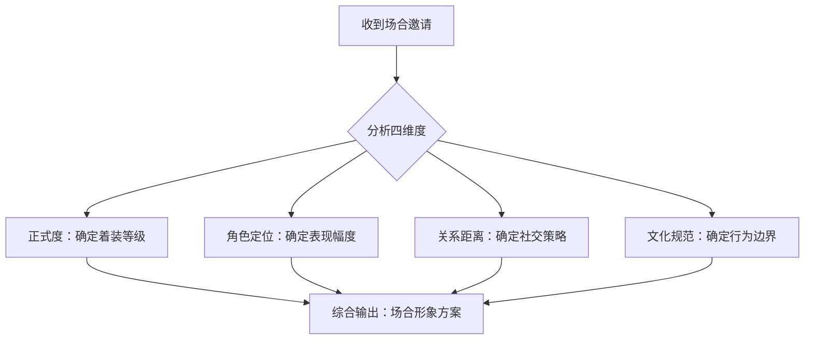
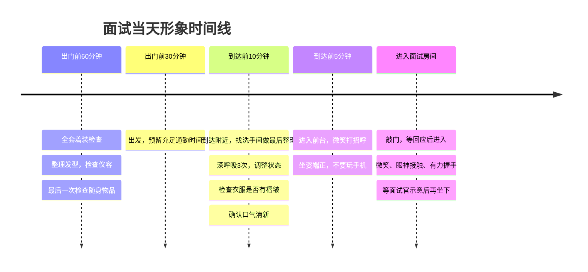
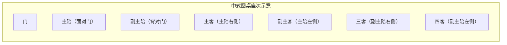
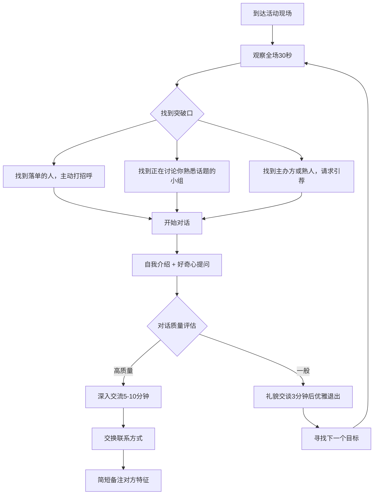
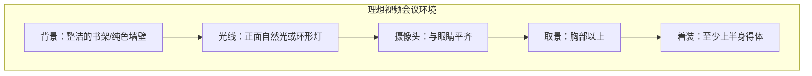
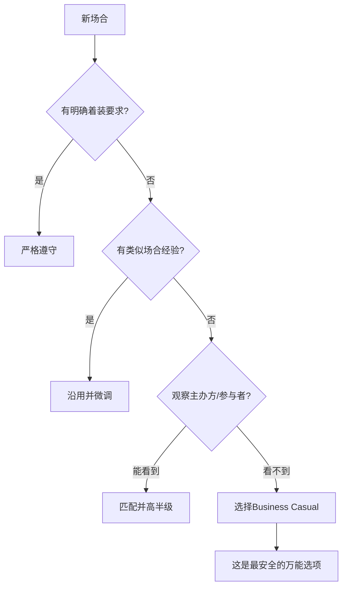

## 第四节 不同场合的形象管理

形象管理不是一套万能模板。你在婚礼上的得体着装穿进会议室会显得荒唐，你在健身房的活力装扮出现在葬礼上则是灾难。真正的形象高手，是能在不同场合之间无缝切换——既保持个人风格的一致性，又精准匹配当下场景的期待。

本节提供一套系统化的场合形象管理框架。你将学到：如何快速判断任何场合的着装要求、行为规范和社交预期；如何在不同场景中展现最佳状态；以及如何避免那些让人瞬间"社死"的形象事故。

### 一、场合形象管理的核心框架

#### 1. 场合分析四维模型

面对任何场合，用四个维度快速建立认知：

| 维度 | 核心问题 | 判断方法 |
|------|----------|----------|
| **正式度** | 这个场合有多正式？ | 看邀请方式、场地、参与人群 |
| **角色定位** | 我在这里是什么角色？ | 主角/配角/旁观者/服务者 |
| **关系距离** | 我和在场者的关系如何？ | 亲密/熟悉/陌生/权威 |
| **文化规范** | 有哪些隐性规则？ | 行业惯例/地域习俗/年龄代际 |

#### 2. 着装正式度等级体系

将所有场合映射到一个统一的正式度等级上，你就不会穿错衣服：

| 等级 | 名称 | 典型场合 | 男装标准 | 女装标准 |
|------|------|----------|----------|----------|
| 5 | White Tie | 国宴、皇室活动 | 燕尾服、白领结 | 长款晚礼服 |
| 4 | Black Tie | 颁奖典礼、高端晚宴 | 深色西装、黑领结 | 晚礼服或鸡尾酒裙 |
| 3 | Business Formal | 商务会议、面试、演讲 | 深色西装套装、领带 | 西装套裙或裤装 |
| 2 | Business Casual | 日常办公、客户拜访 | 衬衫+西裤/卡其裤，可不打领带 | 衬衫+半裙/西裤 |
| 1 | Smart Casual | 朋友聚会、周末社交 | Polo衫/衬衫+休闲裤 | 连衣裙/针织衫+半裙 |
| 0 | Casual | 运动、居家、户外 | T恤+牛仔裤/运动装 | 休闲装 |

**核心原则：宁高勿低。** 如果你不确定场合的正式度，选择高半级的着装。穿得稍正式比穿得太随意造成的尴尬小得多——你可以解开领带降级，但你没法凭空变出一条领带来。

#### 3. "高半级"法则的精确应用

"比场合高半级"是最常被引用但最容易被误解的着装建议。精确理解是：

- **面试场景**：目标公司穿T恤，你穿衬衫+卡其裤（高1级）；目标公司穿商务休闲，你穿西装不打领带（高半级）。注意是高"半级"不是高"两级"——去穿T恤的创业公司面试穿三件套西装，你不是在展示专业，是在展示"我不了解你们的文化"。
- **社交场景**：朋友聚餐大家都穿休闲，你穿Smart Casual即可——一件质感好的衬衫配深色休闲裤，既有品位又不突兀。
- **婚礼场景**：按请柬要求穿，不要试图"高半级"——婚礼的主角是新人，你的任务是融入背景而不是抢镜。

### 二、职场形象管理

职场是形象管理投入产出比最高的场景。一个职场人平均每天花8-10小时在工作场景中，你的形象直接影响同事、上级和客户对你的信任度、能力评估和合作意愿。

#### 1. 面试形象——你的90秒窗口期

普林斯顿大学Janine Willis和Alexander Todorov的研究证实：人们在100毫秒内就会形成第一印象，而这个印象一旦形成，后续信息很难撼动它。面试中，你走进门的那一刻，面试官已经有了初步判断。你后面30-60分钟的表现，更多是在验证或修正这90秒的印象，而非从零建立。

**面试前的形象准备清单：**

**（1）情报收集（面试前3天）**

- 浏览公司官网和社交媒体账号，观察员工照片中的着装风格
- 在LinkedIn上查看该公司同级别员工的职业照
- 如果有认识的人在该公司，直接询问着装规范
- 查看公司的Glassdoor或脉脉评价，了解企业文化关键词

**（2）着装方案（面试前1天）**

- 选择比目标公司日常着装高半级的搭配（参考正式度等级体系）
- 全套试穿，检查合身度——肩线是否到位、裤长是否合适、袖口是否露出1-2cm
- 确保衣物无褶皱、无污渍、无起球
- 鞋子干净无磨损——面试官会看你的鞋，这是判断一个人细节意识的经典指标
- 皮带和鞋子颜色统一（黑色配黑色、棕色配棕色）
- 配饰从简：一块得体的手表即可，避免夸张的首饰或过于花哨的领带
- 指甲修剪整齐，头发干净清爽
- 口气清新——面试前避免大蒜、洋葱等重口味食物

**（3）随身物品检查**

- 简历打印3份以上（以防多位面试官）
- 笔记本和笔（显示你重视这次面试）
- 手机调至静音
- 公文包或简洁的手提袋（不要用塑料袋或过于休闲的双肩包）

**面试当天的形象管理流程：**

**面试仪态的7个关键细节：**

1. **握手**：力度适中（约2公斤握力），持续2-3秒，配合眼神接触和微笑。不要用"死鱼手"（软弱无力）也不要"碎骨机"（太用力）。
2. **坐姿**：坐椅子的前2/3，不要靠满椅背。身体微微前倾5-10度，传递关注和积极的信号。
3. **眼神**：保持60-70%的时间与面试官有眼神接触。不要死盯（像审讯），也不要躲闪（显得不自信）。有多位面试官时，回答谁的问题就看谁，同时用余光兼顾其他人。
4. **手势**：双手自然放在桌上或膝上。说到关键点时可以用手势辅助，但幅度不要超过肩宽。避免交叉双臂（防御姿态）、摸鼻子/耳朵（紧张信号）、转笔/抖腿（注意力分散）。
5. **声音**：语速控制在每分钟150-170字。声音不要太高（显得紧张）也不要太低（显得不自信）。回答问题前可以停顿2-3秒整理思路，这比"嗯、啊、那个"的口头禅好得多。
6. **回答结构**：使用STAR法则（Situation-Task-Action-Result），每个回答控制在1-3分钟。不要跑题，不要自曝其短。
7. **提问环节**：准备2-3个有质量的问题，展现你对岗位和公司的思考。不要问薪资福利（除非面试官主动提起）、不要问"你们公司做什么"（暴露你没做功课）。

#### 2. 日常办公形象——稳定输出的专业感

面试是一次性表演，日常办公是长期经营。你每天的形象都在积累或消耗你的"职业信用"。

**（1）日常办公着装策略**

根据公司文化选择对应的着装等级，然后建立一个"胶囊衣橱"——用少量高质量的基础单品组合出多种搭配：

| 场景 | 男装方案 | 女装方案 |
|------|----------|----------|
| 正式办公日 | 深色西装+白/浅蓝衬衫+皮鞋 | 西装套裙/裤+衬衫+中跟鞋 |
| 普通工作日 | 衬衫+卡其裤/西裤+乐福鞋 | 针织衫/衬衫+半裙/西裤+平底鞋 |
| 创意行业日常 | 质感好的T恤/Polo+休闲裤+小白鞋 | 设计感上衣+牛仔裤+平底鞋 |
| 周五便装日 | POLO衫+卡其裤+休闲鞋 | 针织连衣裙+平底鞋 |

**（2）办公室行为形象**

着装只占你职场形象的30%，剩下的70%来自行为：

- **桌面整洁度**：你的工位是你形象的延伸。杂乱的桌面会让人下意识认为你的工作也杂乱。保持桌面只有当前项目相关的物品。
- **沟通方式**：邮件回复不超过24小时（紧急事项2小时内）。使用清晰的主题行和结构化的正文。即时消息不要连续发5条1个字的消息——组织好语言一次性发出。
- **时间管理的可见性**：准时参加会议、按时完成承诺的任务。"守时"是最简单但最有效的专业形象信号。
- **走廊里的30秒**：在走廊、茶水间遇到同事和上级时的互动，比你在会议室里的正式发言更能塑造你的真实形象。保持积极、简洁、友善。

#### 3. 会议形象——你的隐形战场

会议是职场中暴露频率最高的场景。一次10人的1小时会议，你有60分钟的时间在9个人面前展示自己。

**会前准备（会议前30分钟）：**

- 了解参会人员名单和他们的角色
- 通读会议议程，准备自己负责的议题
- 准备1-2个有价值的观点或问题
- 带好相关文件、笔记本、笔
- 去洗手间整理仪容

**会议中的形象管理要点：**

| 行为 | 正确做法 | 常见错误 |
|------|----------|----------|
| 入场 | 提前3-5分钟到达，选择合适位置 | 迟到、慌张入场 |
| 坐姿 | 坐直，双手自然放置 | 后仰瘫坐、双臂交叉 |
| 倾听 | 眼神跟随发言者，适度点头 | 低头看手机、走神 |
| 发言 | 先说结论再展开，控制在2分钟内 | 长篇大论、偏离主题 | 
| 打断 | 等对方说完再发言 | 急于表达、打断他人 |
| 记录 | 记录关键决定和行动项 | 什么都不记或试图逐字记录 |
| 结束 | 确认自己的任务和截止日期 | 散会就走、不跟进 |

**会议后的跟进动作：**

- 24小时内整理并分享自己负责的会议纪要
- 落实承诺的任务，在截止日期前主动汇报进度
- 如果会议中有未解决的分歧，私下找相关人员沟通

#### 4. 商务宴请形象——餐桌上的博弈

中国的商务宴请是关系建立的核心场景。一顿饭的成败，可能影响未来几个月甚至几年的合作关系。

**（1）宴请前的准备**

- **了解宴请性质**：是正式宴请还是随意聚餐？是答谢宴还是合作洽谈？不同性质决定不同的着装和行为策略。
- **了解出席人员**：知道谁是主客、谁是陪客、谁是组织者。如果可能，提前了解关键人物的背景和喜好。
- **了解餐厅类型**：中餐、西餐、日料的礼仪完全不同。如果是不熟悉的菜系，提前做功课。
- **饮食禁忌**：了解是否有素食者、过敏者、少数民族等特殊情况（如果你是组织者）。

**（2）座次礼仪（中式宴请）**

中式宴请的座次是一门学问，坐错位置是最大的失礼之一：

核心规则：
- **主位**：面对门口的位置，留给东道主或地位最高者
- **主客位**：主位右手边，留给最重要的客人
- **副主客位**：主位左手边
- 作为客人，不要主动去坐主位或主客位，等主人安排
- 如果不确定，选择靠门口的位置最安全

**（3）用餐行为准则**

**敬酒礼仪：**
- 敬酒顺序：先敬主客，按职位/年龄从高到低
- 敬酒时杯沿低于对方杯沿（表示尊重）
- 不要强迫别人喝酒——这是近年来商务礼仪中最重要的变化
- 如果你不能喝酒，提前说明并以茶代酒，态度坦诚即可
- 不要喝醉——商务宴请中失态是职业生涯的污点

**餐桌行为：**
- 等主人或最年长者动筷后再开始
- 转盘菜先让主客和年长者取用
- 使用公筷公勺（如果有的话）
- 嘴里有食物时不说话
- 不要用筷子指人、不要把筷子竖插在饭里
- 适量取食，不要在盘子里翻找

**（4）商务宴请的话题策略**

| 阶段 | 适合的话题 | 避免的话题 |
|------|-----------|-----------|
| 开场（前15分钟） | 轻松寒暄、美食评价、天气/交通 | 直接谈业务、报价 |
| 中段 | 逐步引入行业话题、共同兴趣 | 争议性话题（政治、宗教） |
| 尾声 | 感谢、展望合作、约定下次 | 催促对方做决定 |

**核心原则**：商务宴请的目的是建立关系，不是谈成合同。把80%的时间用在建立信任和了解对方上，只有20%用于业务话题。

### 三、社交场合形象管理

社交场合的形象管理比职场更复杂，因为你面对的关系更加多样，规则更加隐性。

#### 1. 朋友聚会——真实但不随便

朋友聚会看似最不需要形象管理的场合，但它恰恰是你"真实形象"的展现场。在这种低压力场景中，你的自然状态才是别人对你的真实印象。

**着装策略**：
- 目标是"有品位的随性"——看起来没怎么刻意打扮，但整体协调有质感
- 选择质感好的基础单品（好的牛仔裤、纯棉T恤、简约的运动鞋）
- 颜色不超过3种，保持视觉统一
- 一件有亮点的配饰可以提升整体质感（手表、围巾、帽子）
- 根据活动内容调整：聚餐可以稍精致，户外活动注重功能性

**社交行为要点**：
- 主动打招呼、主动介绍在场互不认识的人——这是高社交价值的表现
- 关注每一个人，不让任何人感到被冷落。特别注意那些安静的人
- 分享有趣的故事和见闻，但不要变成单口相声——给其他人说话的空间
- 手机放口袋，专注当下的交流
- 不要过度饮酒失态
- 如果有AA的惯例，主动提出AA或轮流请客

#### 2. 陌生社交场合——高效的第一印象管理

行业活动、兴趣社群、社交聚会等陌生场合，是拓展人脉和展示个人品牌的关键战场。在这些场合，你需要在极短的时间内（通常30秒到3分钟）给对方留下深刻且正面的印象。

**（1）出发前的准备**

- **信息收集**：了解活动主题、主办方、嘉宾阵容、参会人群画像
- **自我介绍准备**：准备3个版本的自我介绍
  - **10秒版**（电梯偶遇）："你好，我是[名字]，做[行业/领域]的。"
  - **30秒版**（标准社交）：加入你正在做的有趣项目或最近的成就
  - **2分钟版**（深度对话）：包含你的故事、理念和当前关注的方向
- **话题弹药库**：准备3-5个可以聊的通用话题——最近的行业动态、热门书籍/电影、有趣的旅行经历、对方可能感兴趣的行业趋势
- **物资准备**：手机充满电、微信二维码准备好（如果还是传统名片也带几张）、一个简洁的随身包

**（2）现场社交策略**

**（3）对话技巧**

- **开场白**：最安全的开场是基于当前环境的评论——"这个场地选得真不错"、"你也是第一次参加这个活动吗？"、"刚才那个嘉宾的分享挺有启发的"
- **提问的艺术**：多问开放式问题（"你怎么看..."、"你当时是怎么决定..."），少问封闭式问题（"你是做什么的？"太直接）
- **倾听的信号**：保持眼神接触、适度点头、用"确实"、"有意思"等简短回应表示你在听
- **找到共鸣点**：对话的前2分钟核心任务是找到共同点——共同的朋友、共同的经历、共同的兴趣。找到共鸣点后对话自然会深入
- **优雅退出**：当对话需要结束时，说"跟你聊天很开心，加个微信吧，回头继续聊"或者"我先去打个招呼，待会儿再聊"

**（4）事后跟进**

社交活动的价值在于后续跟进。活动结束后24小时内，给印象深刻的人发一条消息：

- 提及你们聊过的具体内容（帮对方回忆起你）
- 表达认识的愉快
- 如果聊到了相关资源或信息，主动分享
- 不要一上来就推销或请求帮忙

#### 3. 约会形象——吸引力的精准投放

约会是所有社交场合中最需要精心准备的，因为它同时考验你的外在形象、社交能力和情绪管理。

**（1）约会着装的核心逻辑**

约会着装不是要展示你有多贵，而是要展示你有多"对"：
- **第一次约会**：Smart Casual，干净清爽，展现你的品味和用心但不要用力过猛
- **休闲约会（咖啡/散步）**：有质感的休闲装，舒适自然
- **正式约会（高级餐厅）**：Business Casual到半正式，展现你的格调
- **运动约会（爬山/骑行）**：功能性强但也要注意色彩搭配

**关键原则**：
- 穿你觉得自信的衣服——自信是最好的配饰
- 注意细节：指甲、口气、体味、鞋子的干净程度
- 不要穿全新的衣服或鞋子——不合身或磨脚会让你整场不自在
- 根据约会地点选择合适的鞋子（高跟鞋配长距离步行是折磨）

**（2）约会中的行为形象**

- **到达时间**：准时到或早到5分钟。迟到是约会最大的减分项之一
- **手机管理**：全程静音，放在口袋或包里，不要放在桌上。频繁看手机是"你不够重要"的强烈信号
- **对话节奏**：第一次约会，说和听的比例控制在4:6到5:5之间。不要一个人说完全场，也不要完全沉默
- **买单**：第一次约会建议主动买单（无论男女），之后可以讨论AA或轮流
- **送对方回家**：确保对方安全到家，事后发一条"今天很开心，到家了吗？"

#### 4. 公众演讲形象——舞台上的全面展示

公众演讲是形象管理的高阶应用场景。在舞台上，你的每一个细节都被放大——声音、姿态、表情、手势，都在向观众传递信息。

**（1）演讲前的形象准备**

- **着装选择**：比观众的着装正式半级到一级。纯色优于花色（避免在镜头前产生摩尔纹）。避免纯白或纯黑（在灯光下容易过曝或失去层次）。深蓝、深灰是最安全的选择。
- **提前到场**：至少提前30分钟到达，熟悉舞台、灯光、音响、翻页器
- **设备检查**：麦克风测试、PPT翻页测试、视频/音频播放测试
- **热身**：做3-5分钟的发声练习（哼鸣、绕口令）、身体拉伸（肩膀、颈部）、深呼吸

**（2）舞台上的形象控制**

**站姿与移动**：
- 双脚与肩同宽，重心均匀分布。不要频繁换脚、不要前后摇晃
- 在舞台上要有目的地移动——讲到不同观点时走到不同位置，而不是紧张地来回踱步
- 避免背对观众（看PPT时侧身45度）

**眼神管理**：
- 将观众席分成左、中、右三个区域，轮流与每个区域建立眼神连接
- 在每个区域选2-3个具体的人作为"锚点"，看他们3-5秒
- 不要只看前排或只看天花板——前者会让后排觉得被忽视，后者会让你显得不自信

**手势与表情**：
- 手势在腰部以上、肩膀以下的范围内自然展开
- 用手势强调关键数据和观点——比如说到"三个要点"时伸出三根手指
- 表情要与内容匹配——讲严肃数据时认真，讲有趣故事时微笑
- 避免无意识的小动作：搓手、摸脸、玩翻页器

**声音控制**：
- 语速控制在每分钟140-160字（比日常对话稍慢）
- 关键句前停顿1-2秒，制造悬念和注意力聚焦
- 音量有变化——重要观点提高音量，讲故事时降低音量
- 避免"嗯"、"啊"、"那个"等填充词——用沉默代替

**（3）Q&A环节的形象管理**

- 认真听完完整的问题，不要急于回答
- 如果问题不清楚，先确认："您的意思是...对吗？"
- 回答简洁有力，控制在1-2分钟
- 不知道的问题坦诚说"这个我不确定，会后可以一起研究"——这比胡编一个答案要好得多
- 面对挑衅性问题保持冷静，用事实和逻辑回应

### 四、特殊场合形象管理

#### 1. 婚礼——做一个得体的配角

婚礼是你展示社交素养的最佳场合，但核心原则只有一条：**不抢新人的风头。**

**着装指南**：

| 角色 | 男装 | 女装 | 绝对禁忌 |
|------|------|------|----------|
| 普通宾客 | 浅色西装或衬衫+西裤 | 小礼服或优雅连衣裙 | 纯白色（抢新娘风头） |
| 伴郎 | 与新郎风格统一但稍低调 | 与新娘协调的伴娘裙 | 比新郎穿得更华丽 |
| 长辈 | 深色西装 | 端庄的套装或旗袍 | 过于年轻化的打扮 |

**婚礼行为准则**：
- **准时到达**：迟到是对新人最大的不尊重。提前15分钟到场最佳
- **礼金/礼物**：根据关系亲疏和当地习俗准备。礼金用红包封好，金额选吉利数字。如果送礼物，提前确认新人的需求
- **仪式期间**：保持安静，手机静音，不要站起来挡住后面的人拍照
- **敬酒环节**：起身回敬，说真诚的祝福语。不要灌新人酒
- **拍照**：配合摄影师的安排，不要抢机位
- **社交媒体**：发朋友圈前考虑新人是否介意，不要发新人不雅的照片

#### 2. 葬礼——沉默的尊重

葬礼是所有场合中对形象要求最严格、容错率最低的。一个不得体的举动可能会被记住很多年。

**着装原则**：
- **颜色**：黑色为首选，深灰、深蓝也可接受。绝对避免鲜艳颜色、花哨图案
- **款式**：保守、朴素。男士深色西装+白衬衫+黑领带。女士黑色连衣裙或套装，裙长过膝
- **配饰**：尽量减少。避免闪亮的首饰、鲜艳的丝巾
- **妆容**：淡妆或不化妆
- **香水**：不用或用极淡的

**行为准则**：
- 提前到达，不要迟到
- 保持安静和庄重。即使与熟人交谈也保持低声
- 手机关机或静音
- 对逝者家属表达简洁真诚的慰问："节哀顺变"、"他/她是一位很好的人"
- 不要追问死因或说"我早说过..."
- 尊重仪式流程，配合主持人的指引
- 如果有宗教仪式，即使你不是该宗教的信徒，也保持尊重——起立就起立，低头就低头

#### 3. 网络视频会议——数字时代的形象管理

远程工作时代，视频会议已经成为你最重要的"职场舞台"之一。你屏幕上的形象，就是同事和客户对你的全部印象。

**（1）视觉环境搭建**

**背景**：
- 选择整洁、专业的背景——书架、纯色墙壁、整洁的办公区
- 避免杂乱的房间、床铺、浴室等私人空间
- 如果背景不理想，使用虚拟背景（但要确保你的电脑能流畅运行）
- 避免背景中有分散注意力的元素（宠物、小孩、电视）

**光线**：
- 光源在你的正前方或斜前方45度。面对窗户是最佳的免费光源
- 避免逆光（窗户在身后）——你的脸会变成黑影
- 避免头顶直射光——会在脸上形成难看的阴影
- 如果自然光不足，投资一个环形灯（100-300元即可）

**摄像头位置**：
- 摄像头与眼睛平齐或略高。如果用笔记本，用支架或书本垫高
- 取景范围：胸部以上，头顶留1-2指的空间
- 不要俯拍（鼻孔视角）或仰拍（双下巴视角）

**（2）声音管理**

- **设备**：投资一个外接麦克风或带麦克风的耳机。笔记本内置麦克风的拾音质量通常很差
- **环境**：选择安静的房间。关闭空调、风扇等背景噪音源。告知家人/室友你在开会
- **行为**：不发言时静音。发言时先停顿0.5秒再说话（避免被开头截断）。说话时保持与麦克风的固定距离

**（3）互动形象**

- **眼神**：看摄像头而不是屏幕上的画面。这会让对方感觉你在直视他们。可以把对方的视频窗口拖到摄像头附近
- **专注度**：不要在会议中做其他事情（回邮件、浏览网页）。别人看不出来？不，走神的眼神和延迟的回应非常明显
- **发言**：轮到你发言时，先确认"我能听到大家吗？"确认连接正常。说话清晰、简洁，比面对面交流时语速再慢一点
- **技术准备**：提前5分钟进入会议室，测试音视频。网络不稳定时关闭视频只保留音频

#### 4. 家庭聚会——关系经营的形象窗口

家庭聚会（春节、中秋、生日宴等）是中国社交中独特且重要的场合。这里的形象管理核心不是"专业"，而是"得体"和"温暖"。

**（1）着装策略**

- 选择舒适但有质感的衣服——不要穿得像去上班，也不要穿得太邋遢
- 长辈通常喜欢看到晚辈穿得整洁精神
- 避免过于暴露或标新立异的打扮（除非你的家庭文化接受度很高）
- 如果是节日聚会，可以适当呼应节日氛围（春节期间穿红色元素）

**（2）社交行为**

- **称呼**：提前确认在场长辈的正确称呼。叫错称呼或不知道怎么叫是非常尴尬的
- **礼物**：给长辈带合适的礼物（保健品、水果、茶叶、红包）。不要空手去
- **话题准备**：长辈最关心的话题通常是你的工作、收入、感情状况。提前想好如何得体地回应——既不冒犯长辈的关心，也不让自己不舒服
- **帮忙**：主动帮忙做家务、端菜、收拾。这是展示教养的最直接方式
- **手机**：尽量少看手机，多和家人交流
- **饮酒**：适量，不要喝醉后失态

#### 5. 户外运动与休闲活动

户外活动（徒步、骑行、团建、体育赛事等）的形象管理常被忽视，但它同样重要——在这些场景中，你的"真我"最容易暴露。

**着装核心**：
- 功能性第一，美观第二。选择适合活动的专业装备
- 即使是运动场合，也要注意色彩搭配和整洁度
- 避免穿全新的户外鞋参加长距离徒步——磨脚的痛苦会让你全程失态
- 防晒、防虫、保暖等实用措施不要忽略

**行为要点**：
- 展现团队精神——帮助体力较弱的队友、分享水和食物
- 保持积极心态——不要抱怨天气、路况、组织安排
- 尊重自然——不乱扔垃圾、不破坏环境
- 量力而行——逞强导致受伤或拖累队伍比"慢一点"更丢人

#### 6. 高端社交场合（晚宴、酒会、慈善活动）

这类场合对形象的要求最高，也是展示个人修养和社交能力的顶级舞台。

**着装要求**：
- 严格按照邀请函的着装要求执行（Black Tie、Cocktail Attire等）
- 如果没有明确要求，宁可穿得正式一点
- 投资一套剪裁精良的深色西装和一双好皮鞋——这是应对所有半正式以上场合的安全牌
- 配饰要精致但低调。一块好表胜过十条花哨的领带

**社交策略**：
- 这类场合的核心是"networking"——用最少的时间建立最多有价值的连接
- 不要只和自己认识的人待在一起
- 自我介绍要简洁有力："你好，我是[名字]，[一句话说清你是谁/做什么]"
- 多听少说，展现对对方的兴趣
- 适时交换联系方式，24小时内发跟进消息

### 五、跨场合的通用形象管理原则

#### 1. 个人形象的一致性

虽然不同场合需要不同的表现，但你的核心形象应该是连贯的。这意味着：

- **风格一致性**：你的着装风格应该有一个清晰的主线。从正式到休闲可以有变化，但审美取向应该一致。一个平时穿得很有设计感的人，突然穿一身保守的深色西装会让人觉得"不对劲"。
- **言行一致性**：你在职场的专业感和社交中的亲和力不矛盾。核心品质——真诚、可靠、有教养——应该在所有场合保持一致。
- **线上线下一致性**：你在社交媒体上的形象应该和现实中的人基本一致。差距太大会造成"见光死"。

#### 2. 场合形象的快速决策框架

当你面对一个不熟悉的场合，用这个30秒决策框架：

#### 3. 形象失误的应急处理

即使准备再充分，形象事故也可能发生。关键是快速、优雅地处理：

| 事故类型 | 应急方案 |
|----------|----------|
| 衣服溅上污渍 | 用湿纸巾/苏打水立刻处理。严重的话找机会去洗手间用水冲洗。如果无法修复，大方地解释一下比遮遮掩掩好 |
| 穿错衣服（太正式/太随意） | 太正式：解开领带、卷起袖口降级。太随意：保持自信，不要反复解释或表现出不安 |
| 迟到 | 进入时简短道歉，不要长篇解释原因。用后续的表现弥补 |
| 忘记对方名字 | "不好意思，能再说一下你的名字吗？"比装作记得然后叫错好得多 |
| 说了不合适的话 | 立刻、真诚地道歉。不要试图辩解或淡化。"抱歉，我刚才说得不合适" |
| 设备故障（演讲/会议） | 保持冷静。准备Plan B（离线版PPT、备用麦克风）。如果技术问题无法解决，脱稿继续 |

#### 4. 不同体型的形象管理要点

体型不应该成为你形象管理的障碍，但了解如何根据自身特点做优化是务实的做法：

**偏矮体型（男性170cm以下）**：
- 选择修身但不紧身的衣服——过于宽松会显矮
- 同色系穿搭（上下装颜色接近）可以在视觉上拉长身形
- 避免大面积横条纹
- 裤子不要太长，避免裤脚堆积
- 选择尖头皮鞋而非圆头（视觉延伸效果）
- V领上衣比圆领更显高
- 发型保持清爽，两侧短、顶部稍长，增加头顶高度

**偏瘦体型**：
- 选择有结构感的衣服（有肩线的西装、有领座的衬衫），避免过于贴身的款式
- 层叠穿搭增加体量感
- 避免过深的V领——会显得更瘦
- 选择浅色和中等色调，深色有收缩效果

**偏壮体型**：
- 选择合身但不紧绷的衣服——太紧暴露赘肉，太松显得臃肿
- 深色系是安全选择，但不要全身黑——用亮色配饰点缀
- 竖条纹有拉长效果，但条纹不要太细（会适得其反）
- 选择有结构感的面料，避免太软塌的材质
- 裤子选择直筒或微锥形，避免紧身款

**方脸/棱角分明的脸型**：
- 发型选择有弧度的款式，软化脸部线条
- V领比圆领更适合——拉长视觉比例
- 避免过于方正的领型（如方领衬衫）
- 眼镜选择圆形或椭圆形镜框，避免方形

### 六、场合形象管理的常见误区

#### 误区一：所有场合穿同一种风格

有些人有一种"安全穿搭"，无论什么场合都穿同样的衣服。这传递的信息是"我不在乎这个场合"或"我不具备适应不同环境的能力"。形象管理的本质是"适配"——你需要展现的是"我理解这个场合，我也配得上这个场合"。

**纠正方法**：建立场合-着装的对应表。把你常遇到的场合列出来，为每个场合准备至少2套搭配方案。

#### 误区二：过度追求名牌

穿满身大牌logo不会让你看起来更有品位，反而可能让人觉得你在"炫耀"或"缺乏自信"。真正的品位是穿得合身、搭配得当、干净整洁——这些和价格无关。

**纠正方法**：把预算花在合身度和面料质感上，而不是品牌logo上。一件200元但剪裁精良的衬衫比一件2000元但不合身的大牌衬衫更能提升你的形象。

#### 误区三：忽视非语言信号

很多人只关注穿什么，却忽视了肢体语言、面部表情和声音。但研究表明，在面对面沟通中，非语言信息占信息传递总量的55%以上（Albert Mehrabian, 1971）。你穿得再得体，如果驼背、眼神闪避、声音含糊，你的形象仍然是负面的。

**纠正方法**：对着镜子或录像练习你的站姿、坐姿、手势和微笑。这不是"表演"，是训练你的身体习惯正面的非语言信号。

#### 误区四：社交场合过度表现

有些人一到社交场合就变成了"话痨"——不停地说话、讲笑话、展示自己。他们以为这样是在展示社交能力，实际上是在消耗别人的好感。真正的社交高手是让别人感觉良好，而不是让自己成为焦点。

**纠正方法**：采用"7:3法则"——70%的时间用于倾听和提问，30%的时间用于分享自己。当你让对方感觉被倾听、被理解、被重视时，他们对你的印象会远好于你讲了十个笑话。

#### 误区五：特殊场合忽视文化差异

在跨文化交流中，不同文化对"得体"的定义可能完全不同。例如，在中国商务场合交换名片时双手递接是尊重，在欧美单手递名片完全正常。参加不同文化背景的活动时，提前了解对方的文化规范是基本功。

**纠正方法**：参加不同文化背景的场合前，花15分钟搜索相关礼仪规范。遇到不确定的情况，礼貌地询问比贸然行动好得多。

### 七、不同年龄段的形象管理重点

形象管理的策略会随着年龄和人生阶段的变化而调整：

| 年龄段 | 核心目标 | 着装重点 | 行为重点 |
|--------|----------|----------|----------|
| 20-25岁 | 建立基础形象 | 学习基本搭配，找到适合自己的风格 | 培养良好的社交习惯和职业素养 |
| 25-35岁 | 形象专业化 | 投资高质量基础单品，建立胶囊衣橱 | 在职场和社交中建立稳定的专业形象 |
| 35-45岁 | 形象品质化 | 升级面料和剪裁，注重细节品质 | 展现成熟的判断力和领导力 |
| 45岁以上 | 形象权威化 | 经典款式为主，展现沉稳和格调 | 传递经验、智慧和人格魅力 |

无论在哪个年龄段，核心原则不变：**干净整洁、合身得体、场合适配、自信从容。** 这四点比任何具体的穿搭建议都重要。

### 八、快速参考：场合形象检查清单

在出门前，花1分钟对照这个清单：

[ ] 着装：是否符合场合的正式度要求？
[ ] 整洁：衣物是否有褶皱、污渍、起球？
[ ] 细节：鞋子、指甲、头发、口气是否OK？
[ ] 配饰：是否适度，没有过于夸张？
[ ] 物品：是否带齐了必要的东西（文件、名片、礼物）？
[ ] 角色：我在这个场合的角色是什么？我的表现幅度是否匹配？
[ ] 话术：是否准备了基本的社交话术（自我介绍、话题）？
[ ] 心态：是否调整到适合这个场合的状态？

形象管理是一门实践学科——读100篇理论不如在10个场合中刻意练习。从今天开始，在每次出场前花2分钟思考"这个场合需要我呈现什么样的形象"，然后有意识地去执行。3个月后，你会发现你在任何场合都能从容自若。
