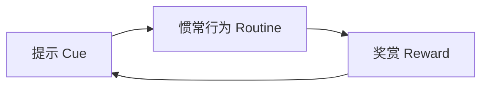
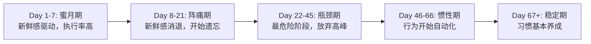
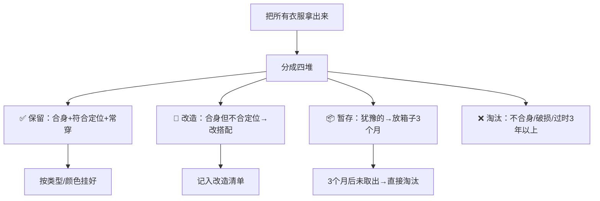
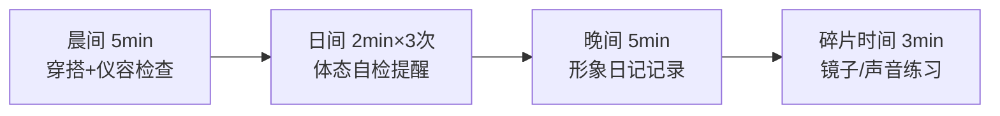

## 第五节 形象提升计划

形象管理不是一次性工程，而是一套需要系统规划、持续迭代的行为改变过程。前面四节分别讲了外在形象、内在形象、线上形象和不同场合的形象管理，本节将这些知识整合成可执行的行动计划——从30天快速启动到终身维护机制，帮你把"知道"变成"做到"。

### 一、为什么需要计划：行为改变的科学依据

很多人学了一堆形象管理知识，三天热情过后一切打回原形。这不是意志力问题，而是方法论问题。

#### 1. 习惯回路模型

MIT神经学家安·格雷比尔（Ann Graybiel）的研究揭示，习惯由三个要素构成：



把形象管理变成习惯，关键是设计好这三个环节：

| 环节 | 形象管理中的设计 |
|------|-----------------|
| **提示** | 闹钟提醒（晨间穿搭5分钟）、镜子（经过时自检体态）、社交场景（出门前形象检查清单） |
| **惯常行为** | 固定的晨间形象流程、体态训练动作、话术模板 |
| **奖赏** | 拍照记录变化、获得他人正面反馈、形象日记的成就感 |

#### 2. BJ Fogg行为设计模型

斯坦福行为设计实验室主任BJ Fogg提出：行为=动机×能力×触发器（B=MAT）。转化到形象管理：

- **动机（Motivation）**：明确形象提升对你最重要的价值——升职、脱单、自信、社交。把这个价值写下来，贴在显眼处。
- **能力（Ability）**：把任务拆到极小。"每天练15分钟体态"太大，"每天靠墙站1分钟"才够小。
- **触发器（Trigger）**：绑定已有习惯。"刷完牙后做镜子练习3分钟""午饭后靠墙站1分钟"。

#### 3. 改变曲线与关键节点

行为科学表明，习惯养成平均需要66天（伦敦大学学院Phillippa Lally研究），而非流行的"21天"。理解这条曲线，你才能在想放弃时坚持住：



**关键应对策略**：
- 阵痛期（8-21天）：引入外部监督（朋友、打卡群）
- 瓶颈期（22-45天）：降低标准但不停下，"做5分钟总比不做好"
- 惯性期（46-66天）：开始增加新行为，利用已有惯性叠加

---

### 二、启动前的自我诊断

在制定任何计划之前，先搞清楚你的起点和目标。盲目开始比不开始更危险——方向错了，越努力越偏。

#### 1. 形象四象限自测法

从四个维度评估当前形象水平，每个维度1-10分：

| 维度 | 评估内容 | 评分标准 |
|------|----------|----------|
| **视觉形象** | 着装品味、色彩搭配、体型管理、仪容整洁度 | 1=完全没有意识；5=基本得体；10=精准管理 |
| **行为形象** | 体态、表情、手势、走姿、坐姿 | 1=松散随意；5=自然端正；10=优雅有感染力 |
| **沟通形象** | 声音、语速、表达逻辑、倾听能力、话术水平 | 1=词不达意；5=清晰有条理；10=令人印象深刻 |
| **数字形象** | 社交媒体、头像、简介、线上互动风格 | 1=无管理意识；5=基本整洁；10=精心策划的个人品牌 |

**四象限评分表模板**：

```markdown
## 我的形象自测（日期：____）

| 维度 | 自评分 | 最大短板 | 改进优先级 |
|------|--------|----------|-----------|
| 视觉形象 | __/10 | ________ | 高/中/低 |
| 行为形象 | __/10 | ________ | 高/中/低 |
| 沟通形象 | __/10 | ________ | 高/中/低 |
| 数字形象 | __/10 | ________ | 高/中/低 |

总分：__/40
最低分维度：________（优先攻克）
形象关键词：________（你想传递的3个印象）
```

#### 2. 色彩季型快速自测

色彩季型决定了哪些颜色最衬你的肤色。方法如下：

**Step 1：判断底色调**
- 看手腕内侧血管：偏蓝/紫 → 冷色调；偏绿 → 暖色调；混合 → 中性色调
- 戴银饰和金饰对比：银色更衬 → 冷调；金色更衬 → 暖调

**Step 2：判断明度和对比度**
- 瞳孔颜色深、发色深、肤色白 → 高对比度 → 适合深色+亮色搭配
- 瞳孔、发色、肤色三者接近 → 低对比度 → 适合柔和同色系搭配

**Step 3：确定季节类型**

| 季型 | 肤色底调 | 对比度 | 适合色彩特征 | 代表色 |
|------|----------|--------|-------------|--------|
| 春季型 | 暖调 | 中低 | 明亮、温暖、清澈 | 珊瑚粉、鹅黄、暖绿、象牙白 |
| 夏季型 | 冷调 | 中低 | 柔和、带灰调、粉质感 | 雾蓝、薰衣草紫、玫瑰粉、灰蓝 |
| 秋季型 | 暖调 | 中高 | 浓郁、深沉、大地色系 | 铁锈红、橄榄绿、驼色、焦糖色 |
| 冬季型 | 冷调 | 高 | 纯正、鲜明、高对比 | 正红、宝蓝、纯白、炭黑 |

#### 3. 场景矩阵分析

列出你日常的主要场景，分析每个场景的形象需求和当前差距：

```markdown
| 场景 | 频率 | 当前形象表现 | 理想形象 | 差距 | 优先级 |
|------|------|-------------|----------|------|--------|
| 日常办公 | 每天 | 比较随意 | 专业干练 | 着装提升 | 高 |
| 客户会议 | 每周2次 | 基本得体 | 可信赖感强 | 谈吐+配饰 | 高 |
| 朋友聚会 | 每周1次 | 随便穿 | 有品味感 | 搭配细节 | 中 |
| 线上社交 | 每天 | 无管理 | 专业+亲和 | 头像+简介 | 中 |
| 家庭活动 | 每月2次 | 无所谓 | 从容得体 | 体态+表情 | 低 |
```

---

### 三、30天快速启动计划

30天的目标不是脱胎换骨，而是**建立认知框架+启动核心习惯+完成第一次形象升级**。每天投入15-45分钟，难度循序渐进。

#### 第1周：自我诊断与认知建立

本周核心任务：看清自己、定好方向、建好记录系统。

| 天数 | 任务 | 时间 | 具体操作 |
|------|------|------|----------|
| Day 1 | 完成四象限形象定位测试 | 30分钟 | 按上面的模板打分，找出最弱的两个维度 |
| Day 2 | 完成色彩季型自测 | 30分钟 | 按血管+首饰法判断底调，结合对比度确定季型 |
| Day 3 | 设定形象关键词+找榜样 | 30分钟 | 写3个你想传递的关键词（如"专业、亲和、有品味"），找3个符合这个感觉的公众人物作为参考 |
| Day 4 | 完成场景矩阵分析 | 30分钟 | 列出5-8个高频场景，填写上面的模板 |
| Day 5 | 学习形象管理基础理论 | 45分钟 | 回顾本章前四节核心内容，建立知识框架 |
| Day 6 | 拍摄基线照片 | 15分钟 | 正面、侧面、全身各一张，自然光，纯色背景，存档 |
| Day 7 | 建立形象日记 | 15分钟 | 用笔记本或手机备忘录，模板见下方 |

**形象日记模板**：

```markdown
## 形象日记 - Day __（日期：____）

### 今日穿搭
- 上装：____
- 下装：____
- 鞋：____
- 配饰：____
- 搭配意图：____

### 体态自评
- 站姿：□好 □一般 □差
- 坐姿：□好 □一般 □差
- 走路：□好 □一般 □差

### 沟通记录
- 今天印象最深的一次对话：____
- 我的表现：____
- 可以改进的地方：____

### 他人反馈
- 有人对我的形象做过评价吗：____

### 今日收获
____
```

#### 第2周：体态与仪态启动

本周核心：体态是形象的骨架，再好的衣服也遮不住松垮的体态。

**每日体态训练（15分钟）**：

```markdown
## 体态训练清单

### 热身（2分钟）
- 颈部画圈：左右各5圈
- 肩部前后画圈：各10次

### 核心训练（10分钟）
1. 靠墙站：后脑勺、肩胛骨、臀部、脚跟贴墙，收腹，保持2分钟
2. 天鹅颈拉伸：双手背后交握，向后拉伸，抬头，保持30秒×3组
3. 肩胛骨夹紧：双臂侧平举，肩胛骨向中间夹紧，保持10秒×10组
4. 核心平板支撑：标准平板，保持30秒×3组

### 收尾（3分钟）
- 深呼吸放松
- 对着镜子检查体态
```

**镜子练习法（3分钟/天）**：

镜子练习不是对着镜子发呆，而是有目的地训练表情和肢体语言：

1. **微笑练习**（1分钟）：对镜子微笑，找到你最自然、最有亲和力的微笑角度。尝试只用嘴角上扬（社交微笑）和连眼睛一起笑（真诚微笑/Duchenne微笑），分别记住这两种微笑的肌肉感觉。
2. **眼神练习**（1分钟）：对镜中的自己保持柔和但坚定的眼神接触。训练"三角区注视法"——在对方的两眼和鼻尖之间形成的三角区域内移动视线，避免死盯一个点。
3. **手势练习**（1分钟）：对着镜子做自我介绍，注意手势是否自然。双手不要交叉抱胸（防御姿态）、不要频繁摸脸（紧张信号）、手势幅度不超过肩宽。

**Day 10 录音回听任务**：
用手机录一段2分钟的自我介绍，然后回听。关注：
- 语速是否过快（正常语速：每分钟150-180字）
- 是否有口头禅（"然后""就是""嗯"）
- 声音是否有力量感（腹部发声vs喉咙发声）
- 停顿是否恰当（关键信息前后要停顿）

#### 第3周：着装与谈吐启动

本周核心：实战演练——整理衣橱、建立搭配、练习表达。

**Day 15 衣橱整理流程**（2小时）：



**Day 16 建立基础搭配方案**：

针对你的色彩季型和日常场景，建立2-3套"闭眼穿"方案——不需要动脑、不会出错的搭配。每套方案拍一张照片存在手机里。

| 方案名 | 上装 | 下装 | 鞋 | 配饰 | 适用场景 |
|--------|------|------|-----|------|----------|
| 方案A-专业 | 白衬衫/浅蓝衬衫 | 深色西裤/直筒裤 | 皮鞋/乐福鞋 | 简约手表 | 办公/会议 |
| 方案B-日常 | 纯色针织衫/Polo衫 | 九分裤/修身牛仔裤 | 小白鞋/德训鞋 | 无/简约项链 | 日常/朋友聚会 |
| 方案C-正式 | 合体衬衫+西装外套 | 同色系西裤 | 牛津鞋/高跟鞋 | 袖扣/精致耳钉 | 面试/商务宴请 |

**Day 17-21 每日一分钟即兴演讲**：

每天抽一个话题，计时1分钟，用PREP法组织表达：
- **P（Point）**：先说结论——"我认为……"
- **R（Reason）**：给出原因——"因为……"
- **E（Example）**：举例说明——"比如……"
- **P（Point）**：重申结论——"所以……"

**练习话题参考**：
- Day 17："你认为远程办公的利弊是什么？"
- Day 18："推荐一部对你影响最大的电影"
- Day 19："如何在30秒内给陌生人留下好印象？"
- Day 20："描述你理想中的一天"
- Day 21："如果你可以学习一项新技能，你会选什么？"

**Day 18 学习3F倾听法**：

3F倾听法是高效沟通的基石：

| 层次 | 含义 | 操作方法 | 示例 |
|------|------|----------|------|
| **Fact（事实）** | 听到对方说的客观信息 | 记录关键数据和事件 | "你说上周的项目延期了3天" |
| **Feel（感受）** | 识别对方的情绪状态 | 关注语气、表情、用词 | "听起来你对这个结果很失望" |
| **Focus（意图）** | 理解对方真正想表达什么 | 思考"他为什么告诉我这个" | "你是希望我们一起想想怎么赶进度？" |

在Day 18当天的至少一次对话中，刻意练习3F倾听。结束后在形象日记中记录：对方说了什么？我听到了哪些事实？感受到什么情绪？他的真正意图是什么？

#### 第4周：整合与实践

本周核心：走出舒适区，在真实场景中检验前三周的成果。

**Day 22 社交媒体优化清单**：

| 平台 | 头像标准 | 简介优化 | 注意事项 |
|------|----------|----------|----------|
| 微信 | 清晰、正面、光线好、背景简洁 | 昵称真实好记，签名传递专业感 | 朋友圈封面也是形象窗口 |
| 领英 | 专业拍摄的半身照 | 用"动词+成果"描述经历 | 至少列出5项技能 |
| 即刻/小红书 | 展现个人风格但不随意 | 体现兴趣领域和态度 | 内容风格一致性 |
| GitHub | 不要求真实照片但要专业 | README写清楚 | 代码也是形象 |

**Day 23 社交实践指南**：

参加一次社交活动（行业聚会、兴趣小组、校友活动等），重点实践：
- 出门前完成"5分钟形象检查清单"（见下方）
- 用准备好的自我介绍开场
- 至少与3个陌生人交谈
- 使用3F倾听法
- 观察别人的非语言信号
- 活动后记录：哪些做到了？哪些忘了？感受如何？

**5分钟出门形象检查清单**：

```markdown
## 出门形象检查

### 着装（1分钟）
□ 衣服整洁无褶皱
□ 颜色搭配协调
□ 鞋子干净
□ 没有线头/起球/污渍

### 仪容（2分钟）
□ 头发整洁有型
□ 面部清洁（男性注意胡须）
□ 口气清新
□ 指甲干净

### 体态（1分钟）
□ 对着镜子调整站姿
□ 肩膀打开下沉
□ 下巴微收
□ 深吸一口气，感受自信

### 物品（1分钟）
□ 手机满电
□ 口袋/包内整洁
□ 带好需要的名片/资料
□ 纸巾/口喷备用
```

**Day 24-25 反馈收集与改进**：

向3-5个你信任的人（朋友、同事、家人）寻求具体反馈。关键是问对问题——不要问"我形象怎么样"（太笼统），要问：

- "你第一次见我时，对我的第一印象是什么？"
- "你觉得我的穿着风格最像哪类人？"
- "如果用三个词形容我给人的感觉，你会用哪三个？"
- "你觉得我在哪方面形象提升最明显？"
- "你觉得我还有什么地方可以改进？"

收到反馈后，对比你的自测结果。两者之间的差距就是你需要调整的方向。

**Day 29 对比照片**：

用和Day 6相同的角度、光线、背景再拍一组照片。对比观察：
- 体态是否有变化（肩膀是否打开了？）
- 表情是否更自然
- 穿搭是否有进步
- 整体精气神是否不同

**Day 30 30天总结模板**：

```markdown
## 形象管理30天总结

### 数据回顾
- 四象限得分变化：视觉 __→__  行为 __→__  沟通 __→__  数字 __→__
- 完成率：__天/30天
- 最大的收获：____
- 最遗憾没做好的：____

### 认知变化
- 以前对形象管理的理解：____
- 现在的理解：____
- 最颠覆认知的一个知识点：____

### 下阶段重点
- 需要继续巩固的习惯：____
- 需要新启动的能力训练：____
- 90天目标：____
```

---

### 四、90天深度提升计划

30天是启动，90天是体系化。90天后，形象管理应该从"刻意练习"过渡到"半自动化"。

#### 第1个月：基础建设（即30天计划）

完成上述30天计划的全部任务。到月底你应该具备：
- 清晰的形象定位和色彩类型认知
- 每日体态训练的习惯（已运转30天）
- 2-3套成熟的日常搭配方案
- 形象日记的记录习惯
- 一次真实社交场景的实践

#### 第2个月：能力深化

本阶段重点从"认知"转向"能力"——声音训练、表达能力、社交技巧。

| 周 | 训练重点 | 每周任务 | 预计时间 |
|----|----------|----------|----------|
| Week 5 | 声音基础 | 腹式呼吸训练+绕口令+朗读（每周3次，每次15分钟） | 45分钟/周 |
| Week 6 | 表达逻辑 | 每天用PREP法写一段200字短文+大声朗读 | 30分钟/天 |
| Week 7 | 社交实战 | 参加2次不同类型的社交活动，实践所学 | 各2小时 |
| Week 8 | 综合演练 | 模拟面试/演讲/商务宴请场景 | 1小时×2 |

**腹式呼吸训练法**：
1. 平躺，双手放在腹部
2. 鼻子吸气4秒，感受腹部隆起（不是胸腔扩张）
3. 嘴巴呼气6秒，感受腹部下沉
4. 重复10次
5. 进阶：站起来做，然后走着做，然后说话时保持腹式呼吸

**绕口令训练推荐**：
- 初级："八百标兵奔北坡，炮兵并排北边跑"
- 中级："黑化肥发灰，灰化肥发黑"
- 高级："红凤凰黄凤凰粉红凤凰花凤凰"
- 练习要点：先慢后快，每个字说清楚再提速

**Toastmasters加入建议**：

Toastmasters International是全球最大的演讲训练组织，在中国主要城市都有俱乐部。加入后你将获得：
- 每周有结构化的演讲练习机会
- 即兴演讲训练（Table Topics环节）
- 专业评估和反馈
- 从"破冰演讲"到"幽默演讲"的系统进阶路径

查找方式：访问toastmasters.org → Find a Club → 输入你的城市

#### 第3个月：整合优化

本阶段重点：风格定型、场景实战、数字形象升级。

**Week 9-10：确定最终风格定位**

回顾30天的日记和反馈，确定你的核心风格。不要贪多——一个稳定的风格比十种多变的搭配更有记忆点。

| 风格类型 | 核心关键词 | 适合人群 | 标志性元素 |
|----------|-----------|----------|-----------|
| 经典商务 | 专业、可靠、稳重 | 金融/法律/管理 | 合体西裤+衬衫+简约手表 |
| 时尚简约 | 干净、利落、有品味 | 科技/创意行业 | 纯色叠穿+质感面料+小白鞋 |
| 优雅知性 | 温和、有内涵、亲和 | 教育/咨询/文化 | 柔和色彩+柔软面料+珍珠/银饰 |
| 活力运动 | 积极、阳光、有能量 | 运动/户外/年轻人 | 合身运动装+运动手表+干净运动鞋 |

**Week 11-12：建立多场景搭配方案库**

为每个高频场景建立固定的搭配方案，拍照存档。目标是：早上出门不需要思考，看一眼场景排程就能直接穿。

**Week 13：数字形象全面升级**

- 更新所有社交平台的头像（统一视觉风格）
- 优化各平台简介（语言风格一致、传递核心关键词）
- 清理不一致或低质量的历史内容
- 开始有意识地发布与个人形象定位一致的内容

**Week 14-16：大规模实践+反馈迭代**

- 参加4次以上不同类型的社交/职业活动
- 向至少5个人寻求深度反馈
- 根据反馈调整搭配方案和行为模式
- 完成90天总结，制定长期维护计划

---

### 五、长期维护机制

习惯养成后，维护比启动更简单，但也不能完全放任。以下是按时间维度的维护框架。

#### 每日维护（15分钟）



**体态自检触发器**：在手机上设3个闹钟（10:00、14:00、17:00），响铃时快速检查：
- 肩膀是否耸起？→ 沉下去
- 是否驼背？→ 挺直
- 下巴是否前伸？→ 收回来
- 呼吸是否浅？→ 深呼吸一次

这个检查只需10秒钟，但一天3次，一年1000+次的体态校正效果是惊人的。

#### 每周维护（1小时）

| 任务 | 时间 | 具体操作 |
|------|------|----------|
| 周回顾 | 15分钟 | 翻看本周形象日记，总结3个做得好的+1个待改进的 |
| 穿搭规划 | 15分钟 | 查看下周日程，提前准备好每天的搭配方案 |
| 社交实践 | 20分钟 | 参加一次社交活动或模拟练习 |
| 学习充电 | 10分钟 | 阅读形象管理相关内容（公众号/书/视频） |

#### 每月维护（2小时）

- **月度形象复盘**（30分钟）：对比月初和月末的照片，评估四象限得分变化
- **衣橱整理**（30分钟）：检查衣物状态，淘汰旧物，补充缺失单品
- **社交平台检查**（20分钟）：更新内容，清理不一致信息
- **反馈收集**（20分钟）：找一个人聊你近期的形象变化
- **下月计划**（20分钟）：设定下月的1-2个重点提升方向

#### 每季维护（半天）

季节更替是形象管理的重要节点——不仅是换季穿搭，也是重新审视和调整的机会。

| 任务 | 操作 |
|------|------|
| 季度评估 | 重新做四象限自测，与上季对比 |
| 目标调整 | 根据评估结果更新形象目标 |
| 衣橱换季 | 淘汰不适合的、补充应季单品、检查搭配方案库 |
| 数字形象检查 | 审视所有平台的形象一致性 |
| 学习计划 | 确定下季度要深入学习的领域 |

#### 年度维护（1天）

每年选一个完整的时间段（比如元旦假期或生日），做一次全面的形象年度审计：

**年度审计清单**：

```markdown
## 形象管理年度审计（____年）

### 1. 数据回顾
- 四象限得分：年初 ____ → 年末 ____
- 最大进步维度：____
- 仍需改进维度：____

### 2. 形象定位审视
- 当前形象关键词：____
- 是否仍符合个人发展需求：是/否
- 是否需要调整：____

### 3. 衣橱健康度
- 总单品数：____
- 实穿率（过去3个月穿过的比例）：____%
- 淘汰计划：____
- 补充计划：____

### 4. 技能盘点
- 着装搭配：入门/进阶/精通
- 体态管理：入门/进阶/精通
- 沟通表达：入门/进阶/精通
- 数字形象：入门/进阶/精通

### 5. 来年目标
- 第一优先级：____
- 第二优先级：____
- 具体行动计划：____
```

---

### 六、进阶：不同人群的定制化策略

#### 1. 职场新人（入职1-3年）

**核心目标**：从"学生气"转型为"职业感"

**重点突破**：
- 着装：投资2-3套高品质基础搭配，而非10件快时尚
- 体态：消除学生时代的"低头族"体态——驼背、头前伸
- 沟通：练习结构化表达（PREP法），减少"那个""然后"等口头禅
- 预算建议：每月形象预算占收入5-10%

#### 2. 管理层（带团队/对外代表公司）

**核心目标**：建立权威感+可信赖感

**重点突破**：
- 着装：比团队高半级，但不脱离团队太远
- 仪态：训练"沉稳感"——说话语速降10%，手势幅度减小，眼神更坚定
- 沟通：学习"教练式对话"——多问少说，引导对方思考
- 特别注意：管理层的形象问题会被放大，一个小细节可能被解读出多种含义

#### 3. 创业者/自由职业者

**核心目标**：个人品牌=商业品牌

**重点突破**：
- 线上形象是第一战场——头像、签名、发布内容都要传递专业感
- 找到个人风格标签（如"穿格子衫的极客""永远戴黑框眼镜的产品经理"）
- 公开演讲和社交媒体运营是形象放大器
- 出镜率比完美更重要——先做到"有"，再做到"好"

#### 4. 内向者/社交焦虑者

**核心目标**：用系统消除社交中的不确定性

**重点突破**：
- 准备3-5个"社交话题口袋"——随时可以聊的话题储备
- 练习"提问式社交"——多提问让对方说，减轻自己的表达压力
- 提前到达社交场合——后到会增加焦虑，早到可以选位置、观察环境
- 设定可量化的小目标："今天和2个陌生人说上话"

---

### 七、常见问题与避坑指南

#### 问题1：执行了几天就坚持不下去

**根因**：目标太大、反馈太慢、环境没有改变。

**解法**：
- 把任务缩小到不可能失败的程度（"靠墙站1分钟"而非"体态训练15分钟"）
- 引入外部监督（打卡群、好友互助、付费教练）
- 改变环境提示（把训练服放在床头、把镜子放在必经之路）

#### 问题2：花了钱买衣服但效果不好

**根因**：先买衣服再想定位，顺序反了。

**解法**：正确的顺序是——定位（你想传递什么）→ 色彩（什么颜色衬你）→ 剪裁（什么版型适合你的体型）→ 最后才是选品牌和购物。先做诊断再花钱。

#### 问题3：体态训练做了但没看到效果

**根因**：只练不检，不知道自己做得对不对。

**解法**：
- 每周拍一次体态对比照（侧面照最能暴露驼背和头前伸）
- 请朋友或教练帮忙纠正动作
- 体态改善的信号不一定是"看起来不同"，也可能是"肩膀不酸了""呼吸更顺畅了"

#### 问题4：社交场合紧张，学到的技巧全忘了

**根因**：社交焦虑覆盖了新行为，回到了本能反应。

**解法**：
- 降低难度——先从1对1的场景开始练，不要一上来就挑战大型聚会
- 只记住一个技巧——比如"微笑+眼神接触"，其他都放开
- 接受不完美——没有人能在社交中100%发挥，70%就已经很好了

#### 问题5：形象提升了但别人没注意到

**根因**：形象变化是渐进的，周围人已经习惯。

**解法**：
- 找新环境测试——去一个没人认识你的场合，观察陌生人的反应
- 问具体的问题——"我今天的搭配你觉得怎么样？"而非"你有没有觉得我变了？"
- 对比照片是最好的证据——视觉变化往往比感觉变化更直观

---

### 八、工具与资源推荐

#### 追踪工具

| 工具 | 用途 | 推荐理由 |
|------|------|----------|
| 手机备忘录/Notion | 形象日记 | 随手记录、搜索方便 |
| 小日常App | 习惯打卡 | 简洁美观、统计功能好 |
| 滴答清单 | 任务提醒 | 可设重复任务，自动提醒体态自检 |
| 手机相册 | 形象记录 | 建立专属相册，按月归档 |

#### 学习资源

| 类型 | 资源 | 适合阶段 |
|------|------|----------|
| 书籍 | 《穿出来的影响力》（英格丽·张） | 入门，了解着装心理学 |
| 书籍 | 《你的形象价值百万》（英格丽·张） | 入门，全面了解形象管理 |
| 书籍 | 《关键对话》（帕特森等） | 进阶，提升沟通形象 |
| 书籍 | 《习惯的力量》（查尔斯·杜希格） | 理解习惯养成机制 |
| 课程 | Toastmasters演讲训练 | 进阶，系统提升表达能力 |
| 视频 | 站酷/B站的形象管理类UP主 | 入门，免费学习搭配技巧 |

---

*形象提升是一场长跑，不是百米冲刺。30天让你看到方向，90天让你建立体系，而真正的改变在每一天的坚持中悄然发生。不要追求完美，追求持续——每天好一点点，一年后你会认不出自己。*

***

*下一节：[产品推荐](03-产品推荐.md)*
